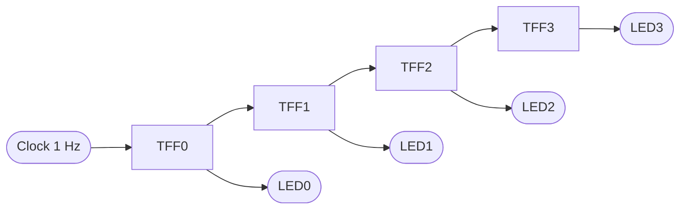

# 🔧 Chapter 1: Build Your First Digital Circuits
## শুরু করো - তোমার প্রথম Logic Circuit বানাও!

> **"Every processor starts with a single gate. Let's build yours!"**
> **"প্রতিটি processor শুরু হয় একটি gate দিয়ে। চলো তোমারটা বানাই!"**

---

## 🎯 এই Chapter এ তুমি বানাবে:

স্বাগতম! 🎉 এটাই তোমার প্রসেসর বানানোর যাত্রার প্রথম পদক্ষেপ। ভয় পেও না — আজ থেকে এক সপ্তাহ পরে তুমি এমন একটা circuit বানিয়ে ফেলবে যেটা সত্যিকারের কম্পিউটারের ভেতরে বসে যোগ করার কাজ করে। সেই circuit-টাকে আমরা বলি **adder**, আর তুমি দেখবে সেটা মোটেও জাদু না — এটা শুধু কয়েকটা সরল switch-এর চমৎকার বিন্যাস। চলো এই সপ্তাহের রোডম্যাপটা দেখে নিই:

```
Week 1 Goals:
□ Day 1: AND, OR, NOT gates (CircuitVerse)
□ Day 2: NAND, NOR gates
□ Day 3: XOR, XNOR gates  
□ Day 4: Half Adder
□ Day 5: Full Adder
□ Day 6: 4-bit Adder
□ Day 7: Share your builds! #BuildYourOwnProcessor
```

প্রতিটা দিন আগের দিনের ওপর গড়ে উঠবে — তাই কোনো দিন বাদ দিও না। Day 1-এর তিনটা সাধারণ gate দিয়েই শুরু হয় সব, আর Day 6-এ এসে সেই gate-গুলোই মিলে তৈরি করবে একটা পুরোদস্তুর 4-bit calculator। ধাপে ধাপে এগোলে দেখবে প্রতিটা ধাপই সহজ মনে হচ্ছে।

**সময়:** ১ সপ্তাহ (দিনে ৩-৪ ঘণ্টা)  
**যা লাগবে:** শুধু একটা browser! (CircuitVerse.org)  
**খরচ:** ₹0 (সম্পূর্ণ ফ্রি!) — কোনো hardware কিনতে হবে না, কিছু install করতে হবে না।

---

## 🚀 QUICK WIN - 5 মিনিটে তোমার প্রথম Circuit!

পড়া বন্ধ করো এক মিনিটের জন্য। শেখার সবচেয়ে ভালো উপায় হলো নিজের হাতে বানানো, আর তুমি এখনই — এই মুহূর্তেই — তোমার জীবনের প্রথম digital circuit বানাতে পারো। কোনো software install করতে হবে না, কোনো খরচ নেই, শুধু একটা browser লাগবে। পাঁচ মিনিট সময় দাও, তারপর তুমি গর্ব করে বলতে পারবে "আমি একটা circuit বানিয়েছি!"

### এখনই করো (Reading থামাও, BUILD করো!):

**Step 1:** যাও → https://circuitverse.org  
**Step 2:** Click "Launch Simulator"  
**Step 3:** বানাও তোমার প্রথম AND gate:

```
Components (Left panel):
1. Drag "Input" (2টা) → Name them A, B
2. Drag "AND gate" (1টা)
3. Drag "Output" LED (1টা) → Name it Y
4. Wire them: A → AND input 1
               B → AND input 2
               AND output → Y
```

**Step 4:** Test করো (switch গুলোতে click করে দেখো!):
```
A=OFF, B=OFF → LED OFF ✓
A=OFF, B=ON  → LED OFF ✓
A=ON,  B=OFF → LED OFF ✓
A=ON,  B=ON  → LED ON! ✓✓✓
```

খেয়াল করো — LED-টা শুধু তখনই জ্বলছে যখন **দুটো** switch একসাথে ON। যেকোনো একটা off থাকলেই বাতি নিভে যায়। এই "দুটোই লাগবে" নিয়মটাই AND gate-এর মূল কথা, আর তুমি একটু পরেই দেখবে এই সাধারণ নিয়মটা প্রসেসরের ভেতরে কত জায়গায় কাজে লাগে।

🎉 **BOOM! তুমি তোমার প্রথম digital circuit বানিয়ে ফেলেছো!**

**তোমার circuit এরকম দেখতে হবে:**


**ভিডিও দেখো - কিভাবে বানাবে:**

[AND Gate Demo Video - Download করে দেখো](../videos/chapter_01/and_gate_demo.webm)

> 💡 **Tip:** ভিডিওতে দেখো কিভাবে step-by-step circuit বানাতে হয়, কিভাবে wire connect করতে হয়, এবং কিভাবে test করতে হয়!

এখন পড়তে থাকো - তুমি ইতিমধ্যে একজন circuit builder! 💪

---

## ১.১ ডিজিটাল কেন? কারণ তুমি Processor বানাবে!

প্রসেসর বানানোর গল্পে ঢোকার আগে একটা মৌলিক প্রশ্নের উত্তর দরকার: কম্পিউটার কেন শুধু **0 আর 1** নিয়ে কাজ করে? কেন আমাদের চারপাশের জগতের মতো অসংখ্য মান (value) ব্যবহার করে না? এর উত্তরের মধ্যেই লুকিয়ে আছে গোটা digital electronics-এর সৌন্দর্য। চলো বুঝি।

### তুমি কী বানাতে চাও?

পৃথিবীতে দুই ধরনের electronic circuit আছে — **analog** আর **digital**। দুটোই বিদ্যুৎ দিয়ে চলে, কিন্তু তথ্য সংরক্ষণের ভঙ্গিটা সম্পূর্ণ আলাদা। তফাতটা ঠিক যেন একটা ঢালু র‍্যাম্প আর একটা সিঁড়ির মধ্যে পার্থক্য।

**Analog circuit** তথ্য রাখে একটা টানা, মসৃণভাবে পরিবর্তনশীল voltage হিসেবে — ঠিক যেমন একটা র‍্যাম্পের উচ্চতা যেকোনো মান হতে পারে। পুরনো রেডিওতে গানের জোর বাড়ানো মানে voltage একটু একটু করে বাড়ানো। সমস্যাটা হলো, এই মসৃণ মান ভয়ানক ভঙ্গুর। বাইরে থেকে সামান্য একটু noise (অবাঞ্ছিত বৈদ্যুতিক হস্তক্ষেপ) এসে মিশলেই 3.7V হয়ে যায় 3.75V — আর circuit বুঝতেই পারে না আসল মানটা কত ছিল। তাই পুরনো ক্যাসেট বারবার copy করলে শব্দ ঝিরঝির করে নষ্ট হয়ে যেত।

**Option 1: Analog Circuit (পুরনো পদ্ধতি)**
```
Problems:
❌ Noise problem: একটু interference = সব নষ্ট
❌ Exact value impossible: 3.7V না 3.8V?
❌ Copy করলে quality loss
❌ Complex circuitry
❌ Non-programmable
❌ Power hungry

Example: Old radio, cassette player (মনে আছে?)
```

**Digital circuit** ঠিক উল্টো পথে হাঁটে। এটা সিঁড়ির মতো — হয় তুমি এই ধাপে আছো, নয়তো ওই ধাপে; মাঝামাঝি কোথাও থাকার উপায় নেই। digital circuit শুধু দুটো মান চেনে: **LOW (0)** আর **HIGH (1)**। এখন মজার ব্যাপারটা ভাবো — যদি noise এসে voltage একটু এদিক-ওদিক করেও দেয়, তবু 0 তো 0-ই থাকে আর 1 তো 1-ই থাকে, কারণ সিঁড়ির দুই ধাপের মাঝে অনেকখানি ফাঁকা জায়গা আছে। এই কারণেই একটা গান লক্ষবার copy করলেও বিন্দুমাত্র মান হারায় না — তোমার ফোনের ছবি, গান, সব কিছুই এই নিখুঁত copy-র সুবিধা পায়।

**Option 2: Digital Circuit (তুমি এটা বানাবে!)**
```
Advantages:
✅ Noise resistant: Threshold পর্যন্ত OK
✅ Exact values: শুধু 0 অথবা 1
✅ Perfect copies: Infinite times!
✅ Simple circuits: Just ON/OFF
✅ Programmable: Software control
✅ Low power: Modern chips

Example: Smartphone, laptop, তোমার processor!
```

এক কথায়: digital জিতে যায় কারণ সরলতা মানেই নির্ভরযোগ্যতা। মাত্র দুটো মান চেনা একটা circuit লক্ষ-কোটিবার একসাথে বসিয়েও ভুল করে না — আর সেই নির্ভরযোগ্যতার ওপর ভর করেই তুমি তোমার নিজের প্রসেসর বানাবে।

### Physical Implementation - কিভাবে কাজ করে?

তাহলে এই 0 আর 1 জিনিসটা hardware-এর ভেতরে আসলে দেখতে কেমন? খুব সহজ — এটা শুধু **voltage-এর মাত্রা**। আমরা ঠিক করে নিই যে একটা নির্দিষ্ট মানের চেয়ে বেশি voltage মানে 1 (HIGH), আর তার চেয়ে কম মানে 0 (LOW)। মাঝখানে একটা **threshold** থাকে — একটা সীমারেখা — যার এদিকে-ওদিকে থাকলেই circuit বুঝে নেয় তুমি 0 বলছ না 1। নিচের সংকেতটা দেখো: voltage যখন লাফ দিয়ে উপরে ওঠে তখন circuit পড়ে 1, যখন নিচে নামে তখন পড়ে 0। threshold-এর দুপাশের ফাঁকা জায়গাটাই হলো **noise margin** — এটাই digital-কে এত নির্ভরযোগ্য বানায়।

```
Voltage Levels (তোমার FPGA তেও এমন):

5V  ──┐       ┌───────┐       ┌─────   Logic 1 (HIGH)
      │       │       │       │
      │       │       │       │        Threshold: ~2.5V
- - - │ - - - │ - - - │ - - - │ - - -  (Noise margin)
      │       │       │       │
0V    └───────┘       └───────┘──────   Logic 0 (LOW)
```

আর এই voltage HIGH/LOW করার কাজটা করে এক ক্ষুদ্র যন্ত্র — **transistor**। transistor-কে ভাবতে পারো একটা বৈদ্যুতিক switch হিসেবে, যেটার কোনো নড়াচড়া করা হাতল নেই; বরং একটা ছোট control signal (gate) দিয়ে এটাকে on/off করা যায়। gate-এ signal দিলে switch বন্ধ হয়, current বয়ে যায়, output হয় 1; signal না দিলে current থামে, output হয় 0।

```
Transistor (Building block):

         ┌──── Output (0 or 1)
         │
      ───┤
         │ ←── Gate (Control signal)
      ───┤
         │
        GND

Gate ON  → Current flows → Output = 1
Gate OFF → No current    → Output = 0
```

এবার আসল চমকটা ধরো: একটা transistor মানে একটা switch, একটা switch মানে একটা bit। আর একটা আধুনিক CPU-তে এমন **১০০ কোটিরও বেশি** transistor থাকে, যেগুলো প্রতিটা সেকেন্ডে কোটি কোটিবার নিখুঁতভাবে on/off হয়। ভয় পেয়ো না — তুমি ১০০ কোটি transistor হাতে বসাবে না! তুমি শিখবে কীভাবে অল্প কয়েকটা switch দিয়ে একটা ছোট building block বানাতে হয়, তারপর সেই block-গুলো বারবার বসিয়ে বড় কিছু গড়তে হয়। ঠিক যেভাবে কয়েকটা ইট দিয়ে দেয়াল, আর কয়েকটা দেয়াল দিয়ে গোটা বাড়ি।

```
1 transistor   = 1 bit storage
1 billion transistors = 1 modern CPU!
```

---

## ১.২ Binary - তোমার Processor এর ভাষা

প্রসেসর কথা বলে মাত্র দুটো অক্ষরের একটা ভাষায়: 0 আর 1। এই ভাষার নাম **binary**। প্রথমে শুনতে অদ্ভুত লাগে — মাত্র দুটো অক্ষর দিয়ে কীভাবে গান, ছবি, ভিডিও, পুরো একটা গেম তৈরি হয়? কিন্তু একটু ভেবে দেখো, ইংরেজি ভাষার পুরো সাহিত্যও তো মাত্র ২৬টা অক্ষর দিয়ে লেখা। অক্ষর কম হলেও সমস্যা নেই, যদি তুমি সেগুলোকে অনেক লম্বা করে সাজাতে পারো। binary-তেও তাই — অক্ষর মাত্র দুটো, কিন্তু সাজানোর সুযোগ অসীম।

### কেন Binary? কারণ Transistor!

প্রশ্নটা স্বাভাবিক: কম্পিউটার দুটোর বদলে তিন বা চারটা মান ব্যবহার করলে তো আরও কম জায়গায় বেশি তথ্য রাখতে পারত! তাহলে binary কেন? উত্তরটা আমরা আগের অংশেই আবিষ্কার করেছি — **transistor একটা switch, আর switch-এর স্বাভাবিকভাবেই দুটো অবস্থা: ON বা OFF**। কোনো switch-কে নিখুঁতভাবে "অর্ধেক খোলা" রাখা যায় না।

ধরো তুমি একটা switch-কে তিনটা স্তরে রাখতে চাইলে — পুরো off, অর্ধেক, পুরো on। এখন noise এসে voltage একটু নাড়িয়ে দিলেই "অর্ধেক" মানটা গুলিয়ে যাবে পাশের মানের সাথে; circuit আর নিশ্চিত হতে পারবে না কোনটা আসল। মান যত বেশি, প্রতিটা মানের মধ্যেকার ফাঁক তত ছোট, আর ভুল হওয়ার সম্ভাবনা তত বেশি। তাই দুটো মানই সবচেয়ে নিরাপদ পছন্দ — এদের মধ্যে ফাঁকটা সবচেয়ে বড়, তাই সবচেয়ে কম ভুল হয়।

```
Physical Reality:

1 Transistor = 1 Switch
Switch has 2 states: ON or OFF

Why not 3 states? 4 states?
→ Unreliable! Noise problem!
→ Binary is optimal!

Example:
2-state (Binary):  100% reliable ✅
3-state (Ternary): 60% reliable ❌
4-state (Quad):    30% reliable ❌❌

Your processor uses 5+ billion transistors!
All binary! All reliable!
```

> 💡 উপরের শতাংশগুলো ঠিক মাপা সংখ্যা নয় — এগুলো শুধু intuition দেয় যে মান যত বাড়ে, নির্ভরযোগ্যতা তত দ্রুত কমে। মূল কথাটা মনে রাখো: **কম মান = বড় noise margin = বেশি নির্ভরযোগ্যতা**, আর সেজন্যই গোটা পৃথিবীর প্রতিটা CPU binary-তে চলে।

### Bit Power - Build to Understand

পড়ে binary বোঝার চেয়ে চোখে দেখে বোঝা অনেক সহজ। তাই চলো একটা ছোট circuit বানাই যেটা তোমার চোখের সামনে binary-তে গুনবে — 0 থেকে 15 পর্যন্ত — চারটা LED জ্বালিয়ে-নিভিয়ে। এটা বানাতে যে যন্ত্রাংশগুলো লাগবে তার কিছু (যেমন T-flip-flop) এখনো তুমি শেখোনি, কিন্তু চিন্তা নেই — এখন শুধু লক্ষ্য করো **কীভাবে গোনাটা হয়**, ভেতরের কারিগরি পরে Chapter 4-এ শিখবে।

**Build This in CircuitVerse:**

```
Project: LED Binary Counter
Components:
- 1 Clock (Input, 1 Hz)
- 4 T-Flip-flops (chained)
- 4 LEDs (outputs)

Result: Count 0000 → 1111 in binary!
Watch binary in action!
```

**Connection (প্রতিটা flip-flop তার আগেরটার সাথে যুক্ত, আর প্রতিটার output একটা LED-তে যায়):**



**তোমার binary counter circuit এরকম দেখতে হবে:**


প্রতিবার clock একটা "টিক" করলে সবচেয়ে ডানের LED (LED0) জ্বলে-নেভে। LED0 দু'বার নিভলে তার বাঁ পাশের LED1 একবার পাল্টায় — ঠিক যেমন গাড়ির odometer-এ একের ঘর ১০ বার ঘুরলে দশের ঘর একবার ঘোরে। নিচে দেখো প্রতিটা গোনার ধাপে LED-গুলো কেমন থাকবে:

**যা দেখবে (LED3 = সবচেয়ে বাঁয়ের bit, LED0 = সবচেয়ে ডানের bit):**

| Count | LED3 | LED2 | LED1 | LED0 | Decimal |
|:-----:|:----:|:----:|:----:|:----:|:-------:|
| 0000  | OFF  | OFF  | OFF  | OFF  |   0     |
| 0001  | OFF  | OFF  | OFF  | ON   |   1     |
| 0010  | OFF  | OFF  | ON   | OFF  |   2     |
| 0011  | OFF  | OFF  | ON   | ON   |   3     |
| ...   | ...  | ...  | ...  | ...  |  ...    |
| 1111  | ON   | ON   | ON   | ON   |  15     |

🎉 **তুমি binary counter বানিয়ে ফেলেছো! ঠিক এই গোনার কৌশলই তোমার CPU-র program counter-এ কাজ করে!**

### Binary Math - Build a Calculator

**Multiple Bits = More Numbers:**
```
1 bit:  2¹  = 2 values    (0-1)
2 bits: 2²  = 4 values    (0-3)
3 bits: 2³  = 8 values    (0-7)
4 bits: 2⁴  = 16 values   (0-15)
8 bits: 2⁸  = 256 values  (0-255) ← 1 byte!
16 bits: 2¹⁶ = 65,536     (0-65535)
32 bits: 2³² = 4+ billion ← Your CPU!

Formula: n bits → 2ⁿ values (0 to 2ⁿ-1)
```

---

## ১.৩ Logic Gates - তোমার CPU এর Building Blocks

এই 7টা gates দিয়েই তুমি processor বানাবে!

### 🔨 Gate 1: AND - "Both Must Be ON"

**Real-World Example:**
```
Car starting system:
- Key inserted? (Input A)
- Brake pressed? (Input B)
→ Engine starts? (Output Y)

Both needed! That's AND!
```

**Build It NOW:**
```
CircuitVerse Steps:
1. Add 2 Input switches (A, B)
2. Add 1 AND gate
3. Add 1 Output LED (Y)
4. Connect: A → AND pin 1
            B → AND pin 2
            AND out → Y
5. TEST all 4 combinations!
```

**Truth Table (তুমি verify করবে):**
```
┌───────┬───────┬─────────┬──────────────┐
│   A   │   B   │    Y    │  LED Glows?  │
├───────┼───────┼─────────┼──────────────┤
│  OFF  │  OFF  │    0    │      NO      │
│  OFF  │  ON   │    0    │      NO      │
│  ON   │  OFF  │    0    │      NO      │
│  ON   │  ON   │    1    │     YES! ✓   │ ← Only this!
└───────┴───────┴─────────┴──────────────┘
```

**Boolean Expression:**
```
Y = A · B  (also written as A AND B, or AB)

Circuit Symbol:
    A ──┐
        ├──[&]─── Y = A·B
    B ──┘
```

**CPU তে কোথায় ব্যবহার হয়?**
```
তোমার processor এ AND gate:
✓ Address decoding
✓ Enable signals
✓ Condition checking
✓ ALU operations
```

---

### 🔨 Gate 2: OR - "Any One Can Turn ON"

**Real-World Example:**
```
Emergency alarm:
- Fire sensor? (Input A)
- Smoke sensor? (Input B)
→ Ring alarm? (Output Y)

Either one triggers! That's OR!
```

**Build It:**
```
Same as AND, but use OR gate
Test: ANY input ON → LED ON!
```

**Truth Table:**
```
┌───────┬───────┬─────────┬──────────────┐
│   A   │   B   │    Y    │  LED Glows?  │
├───────┼───────┼─────────┼──────────────┤
│  OFF  │  OFF  │    0    │      NO      │ ← Only this OFF
│  OFF  │  ON   │    1    │     YES!     │
│  ON   │  OFF  │    1    │     YES!     │
│  ON   │  ON   │    1    │     YES!     │
└───────┴───────┴─────────┴──────────────┘
```

**Boolean Expression:**
```
Y = A + B  (also: A OR B)

Circuit Symbol:
    A ──┐
        ├──[≥1]─── Y = A+B
    B ──┘
```

---

### 🔨 Gate 3: NOT - "Flip It!"

**Real-World Example:**
```
Safety interlock:
- Door closed? (Input A)
→ Machine runs? (Output Y)

Door OPEN → Machine STOPS
Door CLOSED → Machine RUNS

Opposite! That's NOT!
```

**Build It:**
```
Components:
- 1 Input switch (A)
- 1 NOT gate (Inverter)
- 1 Output LED (Y)

Magic: Switch OFF → LED ON!
       Switch ON  → LED OFF!
```

**Truth Table:**
```
┌───────┬─────────┬──────────────────┐
│   A   │    Y    │   What Happens   │
├───────┼─────────┼──────────────────┤
│  OFF  │   ON    │  Switch OFF → LED ON!  │
│  ON   │   OFF   │  Switch ON → LED OFF!  │
└───────┴─────────┴──────────────────┘
```

**Boolean Expression:**
```
Y = A'  (also: Ā, NOT A, ~A)

Circuit Symbol:
    A ──[⊐o]─── Y = A'
    (bubble = inversion)
```

---

### 🔨 Gate 4: NAND - "Universal Gate!"

**Why Special?**
```
NAND = AND + NOT
But here's the magic:
→ You can build ALL gates using ONLY NAND!
→ That's why it's "Universal"!
→ Your CPU has millions of NAND gates!
```

**Build It:**
```
Method 1: AND → NOT → NAND
Method 2: Use NAND gate directly

Test: Opposite of AND!
```

**Truth Table:**
```
┌───┬───┬───┬────────────┐
│ A │ B │ Y │ Reasoning  │
├───┼───┼───┼────────────┤
│ 0 │ 0 │ 1 │ NOT(0·0)=1 │
│ 0 │ 1 │ 1 │ NOT(0·1)=1 │
│ 1 │ 0 │ 1 │ NOT(1·0)=1 │
│ 1 │ 1 │ 0 │ NOT(1·1)=0 │ ← Only OFF
└───┴───┴───┴────────────┘
```

**Build OTHER Gates Using ONLY NAND:**

```
NOT gate from NAND:
A ──┬──[NAND]── A'
    │
    └──(both inputs same)

AND gate from NAND:
A ──┐
    ├──[NAND]──[NAND]── A·B
B ──┘

OR gate from NAND:
A ──[NAND]──┐
    (alone) │
            ├──[NAND]── A+B
B ──[NAND]──┘
    (alone)

তুমি এগুলো বানাও CircuitVerse এ!
Verify they work correctly!
```

---

### 🔨 Gate 5-7: NOR, XOR, XNOR (Build Yourself!)

**Your Challenge:**

```
Task 1: Build NOR gate
- NOR = OR + NOT
- Draw truth table
- Test in CircuitVerse
- NOR is also Universal! Prove it!

Task 2: Build XOR gate
- XOR = "Different detector"
- Output 1 if inputs DIFFERENT
- Formula: A'B + AB'
- Used in: Adders, parity, encryption

Task 3: Build XNOR gate
- XNOR = XOR + NOT
- Output 1 if inputs SAME
- Used in: Comparators, equality check
```

**XOR Truth Table (Build & Verify):**
```
┌───┬───┬───┬──────────────┐
│ A │ B │ Y │   Status     │
├───┼───┼───┼──────────────┤
│ 0 │ 0 │ 0 │  Same        │
│ 0 │ 1 │ 1 │  Different ✓ │
│ 1 │ 0 │ 1 │  Different ✓ │
│ 1 │ 1 │ 0 │  Same        │
└───┴───┴───┴──────────────┘

Build this! You'll use XOR in adders!
```

---

## ১.৪ তোমার First Real Circuit - HALF ADDER

### এটা কেন গুরুত্বপূর্ণ?

```
Half Adder = Your CPU's calculator starts here!
→ Add 2 bits
→ Produce Sum + Carry
→ Building block for ALL arithmetic!
→ This exact circuit is in your processor!
```

### Math Behind It:

```
Binary Addition Rules:
0 + 0 = 0  (no carry)
0 + 1 = 1  (no carry)
1 + 0 = 1  (no carry)
1 + 1 = 10 (carry 1!)

See the pattern? 
→ Sum = XOR
→ Carry = AND
```

### Build Your Half Adder NOW:

```
Circuit Design:
    A ──┬──[XOR]── Sum
        │
    B ──┼──[XOR]
        │
        └──[AND]── Carry

Components Needed:
- 2 Input switches (A, B)
- 1 XOR gate
- 1 AND gate
- 2 Output LEDs (Sum, Carry)

Wire them up in CircuitVerse!
```

### Test Your Half Adder:

```
Test Case 1: 0 + 0
Input:    A=0, B=0
Expected: Sum=0, Carry=0 (both LEDs OFF)
Your Result: _____ ✓/✗

Test Case 2: 0 + 1
Input:    A=0, B=1
Expected: Sum=1, Carry=0 (Sum LED ON)
Your Result: _____ ✓/✗

Test Case 3: 1 + 0
Input:    A=1, B=0
Expected: Sum=1, Carry=0 (Sum LED ON)
Your Result: _____ ✓/✗

Test Case 4: 1 + 1
Input:    A=1, B=1
Expected: Sum=0, Carry=1 (Carry LED ON!)
Your Result: _____ ✓/✗
```

🎉 **সব test pass করলে - Congratulations!**  
**তুমি তোমার processor এর একটা component বানিয়ে ফেলেছো!**

### Verilog Code (Bonus):

```verilog
// Half Adder in Verilog
module half_adder(
    input A,
    input B,
    output Sum,
    output Carry
);
    assign Sum = A ^ B;      // XOR
    assign Carry = A & B;    // AND
endmodule

// Later তুমি এটা compile করে FPGA তে load করবে!
```

---

## ১.৫ Full Adder - Add 3 Bits!

### কেন 3 bits?

```
Problem: 
Half adder শুধু 2 bits add করে
কিন্তু multi-bit addition এ carry আসে!

Example: 1011 + 0101
Bit 0: 1+1 = 10 (carry 1)
Bit 1: 1+0+1 = 10 (carry from bit 0!)
       ↑ Previous carry!

Solution: Full Adder (3 inputs!)
```

### Build Full Adder:

**Inputs & Outputs:**
```
3 Inputs:
- A, B: দুইটা bit যা add করবে
- Cin (Carry In): আগের bit থেকে আসা carry

2 Outputs:
- Sum: যোগফল
- Cout (Carry Out): পরের bit এ যাবে carry
```

**Method 1: Using 2 Half Adders**
```
Logic Flow:
1. HA1 adds A + B → Sum1, Carry1
2. HA2 adds Sum1 + Cin → Sum, Carry2
3. OR gate combines Carry1 + Carry2 → Cout

Circuit Diagram:
                    ┌─────────────┐
         A ────────→│             │────→ Sum1
                    │ Half Adder  │
         B ────────→│      1      │
                    │             │────→ Carry1
                    └─────────────┘

                    ┌─────────────┐
      Sum1 ────────→│             │────→ Sum (output)
                    │ Half Adder  │
       Cin ────────→│      2      │
                    │             │────→ Carry2
                    └─────────────┘

                    ┌─────────────┐
   Carry1 ─────────→│             │
                    │   OR Gate   │────→ Cout (output)
   Carry2 ─────────→│             │
                    └─────────────┘

Build this! It's genius!
```

**Method 2: Direct Logic**
```
Sum = A ⊕ B ⊕ Cin
Carry = (A·B) + (B·Cin) + (A·Cin)

Build both ways!
Compare them!
```

### Test Cases:

```
┌───┬───┬─────┬─────┬───────┬──────────────┐
│ A │ B │ Cin │ Sum │ Cout  │  Meaning     │
├───┼───┼─────┼─────┼───────┼──────────────┤
│ 0 │ 0 │  0  │  0  │   0   │  0+0+0 = 0   │
│ 0 │ 0 │  1  │  1  │   0   │  0+0+1 = 1   │
│ 0 │ 1 │  0  │  1  │   0   │  0+1+0 = 1   │
│ 0 │ 1 │  1  │  0  │   1   │  0+1+1 = 10  │
│ 1 │ 0 │  0  │  1  │   0   │  1+0+0 = 1   │
│ 1 │ 0 │  1  │  0  │   1   │  1+0+1 = 10  │
│ 1 │ 1 │  0  │  0  │   1   │  1+1+0 = 10  │
│ 1 │ 1 │  1  │  1  │   1   │  1+1+1 = 11  │
└───┴───┴─────┴─────┴───────┴──────────────┘

Build and verify ALL 8 cases!
```

---

## ১.৬ 4-Bit Ripple Carry Adder - Real Calculator!

### Chain Full Adders Together:

```
Add two 4-bit numbers: A (A3A2A1A0) + B (B3B2B1B0)

Circuit:
   A3 B3      A2 B2      A1 B1      A0 B0
     ↓ ↓        ↓ ↓        ↓ ↓        ↓ ↓
   [FA3] ←─── [FA2] ←─── [FA1] ←─── [FA0] ← Cin=0
     ↓         ↓          ↓          ↓
    S3        S2         S1         S0
    
Cout ← Final carry (overflow bit)

Carries "ripple" from right to left!
That's why "Ripple Carry Adder"!
```

### Build It:

```
CircuitVerse Steps:
1. Build 4 Full Adders (FA0, FA1, FA2, FA3)
2. Add 8 inputs: A0-A3, B0-B3
3. Add 5 outputs: S0-S3, Cout
4. Connect carries: FA0.Cout → FA1.Cin
                    FA1.Cout → FA2.Cin
                    FA2.Cout → FA3.Cin
5. Test!
```

### Test Your 4-bit Adder:

```
Test 1: 0101 + 0011 (5 + 3 = 8)
Expected: 01000
Your Result: _______

Test 2: 1111 + 0001 (15 + 1 = 16)
Expected: 10000 (overflow!)
Your Result: _______

Test 3: 1010 + 0101 (10 + 5 = 15)
Expected: 01111
Your Result: _______

Test 4: Your choice!
Make your own test case:
_____ + _____ = _____
```

🎉 **It works! তুমি একটা calculator বানিয়ে ফেলেছো!**

---

## ১.৭ তোমার Week 1 Mission

### Daily Build Schedule:

```
Monday: Basic Gates
□ Build AND, OR, NOT
□ Test all combinations
□ Screenshot & save

Tuesday: Universal Gates
□ Build NAND, NOR
□ Build AND using only NAND
□ Build OR using only NAND

Wednesday: XOR Day
□ Build XOR from basic gates
□ Build XNOR
□ Understand difference detector

Thursday: Half Adder
□ Build half adder
□ Test all 4 cases
□ Verify with truth table

Friday: Full Adder
□ Build using 2 half adders
□ Test all 8 cases
□ Understand carry propagation

Saturday: 4-Bit Adder
□ Chain 4 full adders
□ Test with real numbers
□ Celebrate! 🎉

Sunday: Share & Review
□ Export all circuits
□ Share screenshots #BuildYourOwnProcessor
□ Plan Week 2 (Chapter 2!)
```

---

## ১.৮ Pro Tips - Build Better

### ✅ Do This:
```
✅ Label everything clearly (A, B, Sum, Carry)
✅ Test one gate at a time before combining
✅ Save circuits incrementally (gate1, gate2, etc.)
✅ Take notes on what works
✅ Build same circuit multiple ways
✅ Teach someone else (best way to learn!)
✅ Share your builds on social media
```

### ❌ Avoid This:
```
❌ Building complex circuits without testing parts
❌ Skipping truth table verification
❌ Not saving your work (CircuitVerse crashes!)
❌ Moving to next gate if confused
❌ Copy-pasting without understanding
❌ Rushing through (quality > speed)
```

---

## ১.৯ Chapter 1 Complete! 🏆

### তুমি এখন পারো:

```
✅ Build all 7 logic gates from scratch
✅ Create and verify truth tables
✅ Connect gates to build complex circuits
✅ Build a working Half Adder
✅ Build a working Full Adder
✅ Build a 4-bit calculator!
✅ Test and debug circuits
✅ Use CircuitVerse like a pro
```

### তুমি বানিয়েছো:

```
✅ 7 logic gates (AND, OR, NOT, NAND, NOR, XOR, XNOR)
✅ 1 Half Adder
✅ 1 Full Adder
✅ 1 4-bit Ripple Carry Adder
✅ 10+ test circuits
✅ তোমার processor এর foundation!
```

### Next Level Unlocked:

```
📘 Chapter 2: Number Systems & Boolean Algebra
   → Binary/Hex conversions
   → Boolean simplification
   → K-Maps
   → Build converters & simplifiers

📘 Chapter 3: Bigger Circuits
   → ALU design
   → Multiplexers
   → Decoders
   → Build processor components!
```

---

## ১.১০ Homework - Before Chapter 2

### Project 1: Security System

```
Requirements:
Design a 3-input security system

Inputs:
- A: Admin keycard
- B: User keycard  
- C: Emergency override

Output:
- Y: Door unlocks

Logic:
Y = (A AND B) OR C

Build it! Test it! Document it!
```

### Project 2: 2-Bit Comparator

```
Requirements:
Compare two 2-bit numbers

Inputs: A1A0, B1B0
Outputs: Greater, Equal, Less

Hints:
- Use XOR for equality
- Use AND/OR for comparison
- Test: 11 > 10 ✓
        10 = 10 ✓
        01 < 10 ✓
```

### Project 3: Your Own Design!

```
Be creative! Build something unique!

Ideas:
- Traffic light controller
- Voting system (3 inputs)
- Multiplexer (2:1)
- Parity generator
- Your own idea!

Requirements:
- Minimum 3 gates
- Must work correctly
- Share with #BuildYourOwnProcessor
```

---

## 📸 Share Your Journey

### Post Your Builds:

```
Twitter/Facebook:
"Day 1 of #BuildYourOwnProcessor 
Built my first adder circuit!
[Screenshot]
Next: 4-bit ALU! 💪"

Tag: #BuildYourOwnProcessor
Community: processor-builders-bd
```

### হলে কী হবে:
- তোমার name এই book এ featured হবে
- Community recognition
- Inspire others to build
- Build your portfolio!

---

## 🎯 Self-Assessment

### Test Yourself:

```
Question 1: 
Draw truth table for: Y = (A OR B) AND (NOT C)

Question 2:
How many Full Adders needed for 8-bit addition?

Question 3:
Why is NAND called "Universal Gate"?

Question 4:
Build XOR using only NAND gates. How many needed?

Question 5:
What's the carry output of: 1+1+1 in Full Adder?
```

**সব answer করতে পারলে - Chapter 1 Master! 🏆**

---

## 🚀 You're Ready for Chapter 2!

```
Chapter 1: ✅ COMPLETE
Progress: [█████░░░░░░░░░] 20%

Knowledge Gained:
- Digital logic fundamentals
- All 7 logic gates
- Circuit building skills
- Adder circuits
- Testing & debugging

Next Challenge:
- Number systems
- Boolean algebra
- K-Maps
- Circuit optimization

Time to Level Up! 💪
```

---

## 📚 Resources

### CircuitVerse Tips:
```
Shortcuts:
- Drag: Left click + drag
- Delete: Select + Delete key
- Copy: Ctrl+C / Ctrl+V
- Undo: Ctrl+Z
- Save: Project > Save

Features:
- Timing diagram
- Combinational Analysis
- Export image/JSON
- Share via link
```

### Additional Learning:
```
Videos: Search "digital logic gates tutorial"
Practice: Build 10 circuits/day
Community: Join processor-builders-bd
Questions: GitHub Discussions
```

---

**[⬅️ Back to README](../README.md)** | **[➡️ Next: Chapter 2](Chapter_02_Number_Systems_Boolean_Algebra.md)**

---

<div align="center">

## 🎉 Chapter 1 Mission: COMPLETE! 🎉

**"তুমি এখন একজন Circuit Builder!**  
**Now build your processor!"**

Progress: ██████░░░░░░░░░░ 20% Complete

Made with ❤️ for builders | Builders এর জন্য ভালোবাসা দিয়ে

</div>