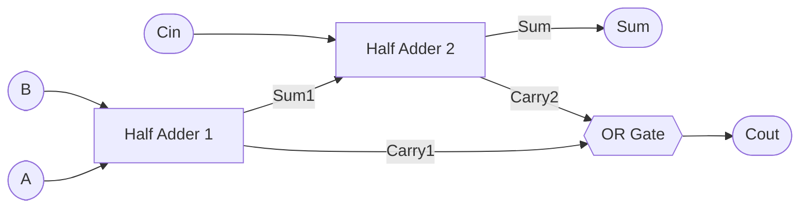

# 🔧 Chapter 1: Build Your First Digital Circuits
## শুরু করো - তোমার প্রথম Logic Circuit বানাও!

> **"Every processor starts with a single gate. Let's build yours!"**
> **"প্রতিটি processor শুরু হয় একটি gate দিয়ে। চলো তোমারটা বানাই!"**

---

## 🎯 এই Chapter-এ তুমি বানাবে:

স্বাগতম! 🎉 এটাই তোমার প্রসেসর বানানোর যাত্রার প্রথম পদক্ষেপ। ভয় পেও না — আজ থেকে এক সপ্তাহ পরে তুমি এমন একটা circuit বানিয়ে ফেলবে যেটা সত্যিকারের কম্পিউটারের ভেতরে বসে যোগ করার কাজ করে। সেই circuit-টাকে আমরা বলি **adder**, আর তুমি দেখবে সেটা মোটেও জাদু না — এটা শুধু কয়েকটা সরল switch-এর চমৎকার বিন্যাস। চলো এই সপ্তাহের রোডম্যাপটা দেখে নিই:

```
Week 1 Goals:
□ Day 1: AND, OR, NOT gates (CircuitVerse)
□ Day 2: NAND, NOR gates
□ Day 3: XOR, XNOR gates  
□ Day 4: Half Adder
□ Day 5: Full Adder
□ Day 6: 4-bit Adder
□ Day 7: Share your builds! #BuildYourOwnProcessor
```

প্রতিটা দিন আগের দিনের ওপর গড়ে উঠবে — তাই কোনো দিন বাদ দিও না। Day 1-এর তিনটা সাধারণ gate দিয়েই শুরু হয় সব, আর Day 6-এ এসে সেই gate-গুলোই মিলে তৈরি করবে একটা পুরোদস্তুর 4-bit calculator। ধাপে ধাপে এগোলে দেখবে প্রতিটা ধাপই সহজ মনে হচ্ছে।

**সময়:** ১ সপ্তাহ (দিনে ৩-৪ ঘণ্টা)  
**যা লাগবে:** শুধু একটা browser! (CircuitVerse.org)  
**খরচ:** ৳0 (সম্পূর্ণ ফ্রি!) — কোনো hardware কিনতে হবে না, কিছু install করতে হবে না।

---

## 🚀 QUICK WIN - 5 মিনিটে তোমার প্রথম Circuit!

পড়া বন্ধ করো এক মিনিটের জন্য। শেখার সবচেয়ে ভালো উপায় হলো নিজের হাতে বানানো, আর তুমি এখনই — এই মুহূর্তেই — তোমার জীবনের প্রথম digital circuit বানাতে পারো। কোনো software install করতে হবে না, কোনো খরচ নেই, শুধু একটা browser লাগবে। পাঁচ মিনিট সময় দাও, তারপর তুমি গর্ব করে বলতে পারবে "আমি একটা circuit বানিয়েছি!"

### এখনই করো (Reading থামাও, BUILD করো!):

**Step 1:** যাও → https://circuitverse.org  
**Step 2:** Click "Launch Simulator"  
**Step 3:** বানাও তোমার প্রথম AND gate:

```
Components (Left panel):
1. Drag "Input" (2টা) → Name them A, B
2. Drag "AND gate" (1টা)
3. Drag "Output" LED (1টা) → Name it Y
4. Wire them: A → AND input 1
               B → AND input 2
               AND output → Y
```

**Step 4:** Test করো (switch-গুলোতে click করে দেখো!):
```
A=OFF, B=OFF → LED OFF ✓
A=OFF, B=ON  → LED OFF ✓
A=ON,  B=OFF → LED OFF ✓
A=ON,  B=ON  → LED ON! ✓✓✓
```

খেয়াল করো — LED-টা শুধু তখনই জ্বলছে যখন **দুটো** switch একসাথে ON। যেকোনো একটা off থাকলেই বাতি নিভে যায়। এই "দুটোই লাগবে" নিয়মটাই AND gate-এর মূল কথা, আর তুমি একটু পরেই দেখবে এই সাধারণ নিয়মটা প্রসেসরের ভেতরে কত জায়গায় কাজে লাগে।

🎉 **BOOM! তুমি তোমার প্রথম digital circuit বানিয়ে ফেলেছো!**

**তোমার circuit এরকম দেখতে হবে:**


**ভিডিও দেখো - কিভাবে বানাবে:**

[AND Gate Demo Video - Download করে দেখো](../videos/chapter_01/and_gate_demo.webm)

> 💡 **Tip:** ভিডিওতে দেখো কিভাবে step-by-step circuit বানাতে হয়, কিভাবে wire connect করতে হয়, এবং কিভাবে test করতে হয়!

এখন পড়তে থাকো - তুমি ইতিমধ্যে একজন circuit builder! 💪

---

## ১.১ ডিজিটাল কেন? কারণ তুমি Processor বানাবে!

প্রসেসর বানানোর গল্পে ঢোকার আগে একটা মৌলিক প্রশ্নের উত্তর দরকার: কম্পিউটার কেন শুধু **0 আর 1** নিয়ে কাজ করে? কেন আমাদের চারপাশের জগতের মতো অসংখ্য মান (value) ব্যবহার করে না? এর উত্তরের মধ্যেই লুকিয়ে আছে গোটা digital electronics-এর সৌন্দর্য। চলো বুঝি।

### তুমি কী বানাতে চাও?

পৃথিবীতে দুই ধরনের electronic circuit আছে — **analog** আর **digital**। দুটোই বিদ্যুৎ দিয়ে চলে, কিন্তু তথ্য রাখার ভঙ্গিটা সম্পূর্ণ আলাদা। তফাতটা ঠিক যেন একটা ঢালু র‍্যাম্প আর একটা সিঁড়ির মধ্যে পার্থক্য।

**Analog circuit** তথ্য রাখে একটা টানা, মসৃণভাবে পরিবর্তনশীল voltage হিসেবে — ঠিক যেমন একটা র‍্যাম্পের উচ্চতা যেকোনো মান হতে পারে। পুরনো রেডিওতে গানের জোর বাড়ানো মানে voltage একটু একটু করে বাড়ানো। সমস্যাটা হলো, এই মসৃণ মান ভয়ানক ভঙ্গুর। বাইরে থেকে সামান্য একটু noise (অবাঞ্ছিত বৈদ্যুতিক হস্তক্ষেপ) এসে মিশলেই 3.7V হয়ে যায় 3.75V — আর circuit বুঝতেই পারে না আসল মানটা কত ছিল। তাই পুরনো ক্যাসেট বারবার copy করলে শব্দ ঝিরঝির করে নষ্ট হয়ে যেত।

**Option 1: Analog Circuit (পুরনো পদ্ধতি)**
```
Problems:
❌ Noise problem: একটু interference = সব নষ্ট
❌ Exact value impossible: 3.7V না 3.8V?
❌ Copy করলে quality loss
❌ Complex circuitry
❌ Non-programmable
❌ Power hungry

Example: Old radio, cassette player (মনে আছে?)
```

**Digital circuit** ঠিক উল্টো পথে হাঁটে। এটা সিঁড়ির মতো — হয় তুমি এই ধাপে আছো, নয়তো ওই ধাপে; মাঝামাঝি কোথাও থাকার উপায় নেই। digital circuit শুধু দুটো মান চেনে: **LOW (0)** আর **HIGH (1)**। এখন মজার ব্যাপারটা ভাবো — যদি noise এসে voltage একটু এদিক-ওদিক করেও দেয়, তবু 0 তো 0-ই থাকে আর 1 তো 1-ই থাকে, কারণ সিঁড়ির দুই ধাপের মাঝে অনেকখানি ফাঁকা জায়গা আছে। এই কারণেই একটা গান লক্ষবার copy করলেও বিন্দুমাত্র মান হারায় না — তোমার ফোনের ছবি, গান, সব কিছুই এই নিখুঁত copy-র সুবিধা পায়।

**Option 2: Digital Circuit (তুমি এটা বানাবে!)**
```
Advantages:
✅ Noise resistant: Threshold পর্যন্ত OK
✅ Exact values: শুধু 0 অথবা 1
✅ Perfect copies: Infinite times!
✅ Simple circuits: Just ON/OFF
✅ Programmable: Software control
✅ Low power: Modern chips

Example: Smartphone, laptop, তোমার processor!
```

এক কথায়: digital জিতে যায় কারণ সরলতা মানেই নির্ভরযোগ্যতা। মাত্র দুটো মান চেনা একটা circuit লক্ষ-কোটিবার একসাথে বসালেও ভুল করে না — আর সেই নির্ভরযোগ্যতার ওপর ভর করেই তুমি তোমার নিজের প্রসেসর বানাবে।

### Physical Implementation - কিভাবে কাজ করে?

তাহলে এই 0 আর 1 জিনিসটা hardware-এর ভেতরে আসলে দেখতে কেমন? খুব সহজ — এটা শুধু **voltage-এর মাত্রা**। আমরা ঠিক করে নিই যে একটা নির্দিষ্ট মানের চেয়ে বেশি voltage মানে 1 (HIGH), আর তার চেয়ে কম মানে 0 (LOW)। মাঝখানে একটা **threshold** থাকে — একটা সীমারেখা — যার এদিকে-ওদিকে থাকলেই circuit বুঝে নেয় তুমি 0 বলছ না 1। নিচের সংকেতটা দেখো: voltage যখন লাফ দিয়ে উপরে ওঠে তখন circuit পড়ে 1, যখন নিচে নামে তখন পড়ে 0। threshold-এর দুপাশের ফাঁকা জায়গাটাই হলো **noise margin** — এটাই digital-কে এত নির্ভরযোগ্য বানায়।

```
Voltage Levels (তোমার FPGA তেও এমন):

5V  ──┐       ┌───────┐       ┌─────   Logic 1 (HIGH)
      │       │       │       │
      │       │       │       │        Threshold: ~2.5V
- - - │ - - - │ - - - │ - - - │ - - -  (Noise margin)
      │       │       │       │
0V    └───────┘       └───────┘──────   Logic 0 (LOW)
```

আর এই voltage HIGH/LOW করার কাজটা করে এক ক্ষুদ্র যন্ত্র — **transistor**। transistor-কে ভাবতে পারো একটা বৈদ্যুতিক switch হিসেবে, যেটার কোনো নড়াচড়া করা হাতল নেই; বরং একটা ছোট control signal (gate) দিয়ে এটাকে on/off করা যায়। gate-এ signal দিলে switch চালু হয়, current বয়ে যায়, output হয় 1; signal না দিলে switch বন্ধ হয়, current থামে, output হয় 0।

```
Transistor (Building block):

         ┌──── Output (0 or 1)
         │
      ───┤
         │ ←── Gate (Control signal)
      ───┤
         │
        GND

Gate ON  → Current flows → Output = 1
Gate OFF → No current    → Output = 0
```

এবার আসল চমকটা ধরো: একটা transistor মানে একটা switch, একটা switch মানে একটা bit। আর একটা আধুনিক CPU-তে এমন **১০০ কোটিরও বেশি** transistor থাকে, যেগুলো প্রতিটা সেকেন্ডে কোটি কোটিবার নিখুঁতভাবে on/off হয়। ভয় পেয়ো না — তুমি ১০০ কোটি transistor হাতে বসাবে না! তুমি শিখবে কীভাবে অল্প কয়েকটা switch দিয়ে একটা ছোট building block বানাতে হয়, তারপর সেই block-গুলো বারবার বসিয়ে বড় কিছু গড়তে হয়। ঠিক যেভাবে কয়েকটা ইট দিয়ে দেয়াল, আর কয়েকটা দেয়াল দিয়ে গোটা বাড়ি।

```
1 transistor   = 1 bit storage
1 billion transistors = 1 modern CPU!
```

---

## ১.২ Binary - তোমার Processor-এর ভাষা

প্রসেসর কথা বলে মাত্র দুটো অক্ষরের একটা ভাষায়: 0 আর 1। এই ভাষার নাম **binary**। প্রথমে শুনতে অদ্ভুত লাগে — মাত্র দুটো অক্ষর দিয়ে কীভাবে গান, ছবি, ভিডিও, পুরো একটা গেম তৈরি হয়? কিন্তু একটু ভেবে দেখো, ইংরেজি ভাষার পুরো সাহিত্যও তো মাত্র ২৬টা অক্ষর দিয়ে লেখা। অক্ষর কম হলেও সমস্যা নেই, যদি তুমি সেগুলোকে অনেক লম্বা করে সাজাতে পারো। binary-তেও তাই — অক্ষর মাত্র দুটো, কিন্তু সাজানোর সুযোগ অসীম।

### কেন Binary? কারণ Transistor!

প্রশ্নটা স্বাভাবিক: কম্পিউটার দুটোর বদলে তিন বা চারটা মান ব্যবহার করলে তো আরও কম জায়গায় বেশি তথ্য রাখতে পারত! তাহলে binary কেন? উত্তরটা আমরা আগের অংশেই আবিষ্কার করেছি — **transistor একটা switch, আর switch-এর স্বাভাবিকভাবেই দুটো অবস্থা: ON বা OFF**। কোনো switch-কে নিখুঁতভাবে "অর্ধেক খোলা" রাখা যায় না।

ধরো তুমি একটা switch-কে তিনটা স্তরে রাখতে চাইলে — পুরো off, অর্ধেক, পুরো on। এখন noise এসে voltage একটু নাড়িয়ে দিলেই "অর্ধেক" মানটা পাশের মানের সাথে গুলিয়ে যাবে; circuit আর নিশ্চিত হতে পারবে না কোনটা আসল। মান যত বেশি, প্রতিটা মানের মধ্যেকার ফাঁক তত ছোট, আর ভুল হওয়ার সম্ভাবনা তত বেশি। তাই দুটো মানই সবচেয়ে নিরাপদ পছন্দ — এদের মধ্যে ফাঁকটা সবচেয়ে বড়, তাই সবচেয়ে কম ভুল হয়।

```
Physical Reality:

1 Transistor = 1 Switch
Switch has 2 states: ON or OFF

Why not 3 states? 4 states?
→ Unreliable! Noise problem!
→ Binary is optimal!

Example:
2-state (Binary):  100% reliable ✅
3-state (Ternary): 60% reliable ❌
4-state (Quad):    30% reliable ❌❌

Your processor uses 1+ billion transistors!
All binary! All reliable!
```

> 💡 উপরের শতাংশগুলো ঠিক মাপা সংখ্যা নয় — এগুলো শুধু intuition দেয় যে মান যত বাড়ে, নির্ভরযোগ্যতা তত দ্রুত কমে। মূল কথাটা মনে রাখো: **কম মান = বড় noise margin = বেশি নির্ভরযোগ্যতা**, আর সেজন্যই গোটা পৃথিবীর প্রতিটা CPU binary-তে চলে।

### Bit Power - Build to Understand

পড়ে binary বোঝার চেয়ে চোখে দেখে বোঝা অনেক সহজ। তাই চলো একটা ছোট circuit বানাই যেটা তোমার চোখের সামনে binary-তে গুনবে — 0 থেকে 15 পর্যন্ত — চারটা LED জ্বালিয়ে-নিভিয়ে। এটা বানাতে যে যন্ত্রাংশগুলো লাগবে তার কিছু (যেমন T-flip-flop) এখনো তুমি শেখোনি, কিন্তু চিন্তা নেই — এখন শুধু লক্ষ্য করো **কীভাবে গোনাটা হয়**, ভেতরের কারিগরি পরে Chapter 4-এ শিখবে।

**Build This in CircuitVerse:**

```
Project: LED Binary Counter
Components:
- 1 Clock (Input, 1 Hz)
- 4 T-Flip-flops (chained)
- 4 LEDs (outputs)

Result: Count 0000 → 1111 in binary!
Watch binary in action!
```

**Connection (প্রতিটা flip-flop তার আগেরটার সাথে যুক্ত, আর প্রতিটার output একটা LED-তে যায়):**


**তোমার binary counter circuit এরকম দেখতে হবে:**


প্রতিবার clock একটা "টিক" করলে সবচেয়ে ডানের LED (LED0) জ্বলে-নেভে। LED0 দু'বার পাল্টালে তার বাঁ পাশের LED1 একবার পাল্টায় — ঠিক যেমন গাড়ির odometer-এ একের ঘর ১০ বার ঘুরলে দশের ঘর একবার ঘোরে। নিচে দেখো প্রতিটা গোনার ধাপে LED-গুলো কেমন থাকবে:

**যা দেখবে (LED3 = সবচেয়ে বাঁয়ের bit, LED0 = সবচেয়ে ডানের bit):**

| Count | LED3 | LED2 | LED1 | LED0 | Decimal |
|:-----:|:----:|:----:|:----:|:----:|:-------:|
| 0000  | OFF  | OFF  | OFF  | OFF  |   0     |
| 0001  | OFF  | OFF  | OFF  | ON   |   1     |
| 0010  | OFF  | OFF  | ON   | OFF  |   2     |
| 0011  | OFF  | OFF  | ON   | ON   |   3     |
| ...   | ...  | ...  | ...  | ...  |  ...    |
| 1111  | ON   | ON   | ON   | ON   |  15     |

🎉 **তুমি binary counter বানিয়ে ফেলেছো! ঠিক এই গোনার কৌশলেই তোমার CPU-র program counter কাজ করে!**

### Binary Math - Build a Calculator

একটা bit মানে একটা switch, আর একটা switch মাত্র দুটো জিনিস বলতে পারে: 0 বা 1। কিন্তু পাশাপাশি দুটো switch বসালেই হিসাবটা পাল্টে যায় — তখন তোমার হাতে আসে চারটা সম্ভাবনা: 00, 01, 10, 11। প্রতিটা নতুন bit যোগ করলে সম্ভাবনার সংখ্যা ঠিক **দ্বিগুণ** হয়, কারণ পুরোনো প্রতিটা বিন্যাসের সাথে নতুন bit-টা 0 বা 1 দুইভাবেই বসতে পারে।

এই দ্বিগুণ হওয়ার খেলাটা খুব দ্রুত বিশাল সংখ্যায় পৌঁছে যায়। নিচের তালিকায় দেখো কত অল্প bit দিয়ে কত বড় সংখ্যা ধরা যায়:

**Multiple Bits = More Numbers:**

| Bits | হিসাব | মোট মান | সীমা |
|:----:|:-----:|:-------:|:----:|
| 1 bit  | 2¹  | 2 values         | 0–1 |
| 2 bits | 2²  | 4 values         | 0–3 |
| 3 bits | 2³  | 8 values         | 0–7 |
| 4 bits | 2⁴  | 16 values        | 0–15 |
| 8 bits | 2⁸  | 256 values       | 0–255 ← 1 byte! |
| 16 bits| 2¹⁶ | 65,536 values    | 0–65535 |
| 32 bits| 2³² | 4+ billion       | ← তোমার CPU! |

মূল সূত্রটা মাথায় গেঁথে নাও:

```
Formula: n bits → 2ⁿ values (0 to 2ⁿ-1)
```

লক্ষ করো, মাত্র ৩২টা bit দিয়ে ৪০০ কোটিরও বেশি আলাদা সংখ্যা প্রকাশ করা যায় — আর এই কারণেই তোমার বানানো RISC-V প্রসেসর ৩২-bit হবে। এত বড় সংখ্যার পরিসর পেতে কোনো জাদু লাগে না, শুধু ৩২টা ছোট switch পাশাপাশি বসালেই হয়।

---

## ১.৩ Logic Gates - তোমার CPU-এর Building Blocks

এবার আসল মজা শুরু। transistor দিয়ে আমরা switch বানাতে পারি, কিন্তু কাঁচা switch দিয়ে কাজ করা কঠিন। তাই প্রকৌশলীরা কয়েকটা transistor বুদ্ধি করে সাজিয়ে এমন ছোট ছোট block বানিয়েছেন যেগুলো একটা সরল **সিদ্ধান্ত** নেয় — input দেখে output ঠিক করে। এই block-গুলোর নাম **logic gate**।

প্রতিটা gate-কে ভাবতে পারো একটা ছোট্ট নিয়ম-পালনকারী দারোয়ান হিসেবে: সে input হিসেবে কিছু 0/1 দেখে, একটা বাঁধা নিয়ম মেনে চলে, আর output হিসেবে একটা 0 বা 1 দেয়। আশ্চর্যের ব্যাপার হলো, **মাত্র ৭টা gate** দিয়েই পৃথিবীর সবচেয়ে জটিল প্রসেসর পর্যন্ত বানানো যায়। তুমিও এই সাতটা দিয়েই তোমার CPU বানাবে! চলো একটা একটা করে এদের সাথে পরিচিত হই।

### 🔨 Gate 1: AND - "Both Must Be ON"

AND gate-এর নিয়ম এক বাক্যে: **সব input ON হলে তবেই output ON**। একটাও input off থাকলে output থাকে 0। অর্থাৎ এটা এমন এক দারোয়ান যে বলে "দুটো শর্তই পূরণ হতে হবে, একটা হলে চলবে না।"

**Real-World Example:**
```
Car starting system:
- Key inserted? (Input A)
- Brake pressed? (Input B)
→ Engine starts? (Output Y)

Both needed! That's AND!
```

আধুনিক গাড়ির কথাই ধরো — চাবি ঢোকালেই (A) engine চালু হয় না, brake-ও চেপে ধরতে হয় (B)। দুটো শর্ত একসাথে পূরণ হলে তবেই গাড়ি স্টার্ট নেয়। এটাই AND gate-এর "দুটোই লাগবে" আচরণ, ঠিক যেটা তুমি Quick Win-এ নিজের হাতে test করেছিলে।

**Build It NOW:**
```
CircuitVerse Steps:
1. Add 2 Input switches (A, B)
2. Add 1 AND gate
3. Add 1 Output LED (Y)
4. Connect: A → AND pin 1
            B → AND pin 2
            AND out → Y
5. TEST all 4 combinations!
```

একটা gate-এর পুরো আচরণ সংক্ষেপে লিখে রাখার সবচেয়ে পরিষ্কার উপায় হলো **truth table** (সত্যক সারণি)। এটা একটা সরল চার্ট যেখানে input-এর প্রতিটা সম্ভাব্য বিন্যাসের পাশে লেখা থাকে output কত হবে। দুটো input মানে ৪টা সম্ভাবনা (00, 01, 10, 11), তাই truth table-এ চারটা সারি। circuit বানিয়ে তুমি নিজে এই টেবিলটা মিলিয়ে দেখবে:

**Truth Table (তুমি verify করবে):**

| A   | B   | Y | LED Glows? |
|:---:|:---:|:-:|:----------:|
| OFF | OFF | 0 | NO |
| OFF | ON  | 0 | NO |
| ON  | OFF | 0 | NO |
| ON  | ON  | 1 | YES! ✓ ← শুধু এই ক্ষেত্রেই |

লক্ষ করো শুধু শেষ সারিতেই Y = 1 — যখন A আর B দুটোই ON। বাকি সব ক্ষেত্রে output 0। এটাই AND-এর বৈশিষ্ট্য।

গণিতবিদরা প্রতিটা gate-কে একটা ছোট সূত্র দিয়ে প্রকাশ করেন, যাকে বলে **Boolean expression**। AND-কে গুণ চিহ্ন (·) দিয়ে লেখা হয়, কারণ গুণের সাথে এর আচরণ মিলে যায় — `1 · 1 = 1`, কিন্তু `1 · 0 = 0`। circuit-এ AND gate-এর আসল প্রতীক পেছনে সমতল, সামনে গোলাকার একটা D-আকৃতি; এখানে সরল করে `[&]` দিয়ে দেখানো হলো:

**Boolean Expression:**
```
Y = A · B  (also written as A AND B, or AB)

Circuit Symbol:
    A ──┐
        ├──[&]─── Y = A·B
    B ──┘
```

**CPU-তে কোথায় ব্যবহার হয়?** AND gate তোমার প্রসেসরের সর্বত্র ছড়িয়ে আছে। যখন CPU memory-র কোনো নির্দিষ্ট ঠিকানা বেছে নেয় (address decoding), তখন AND দিয়ে যাচাই হয় সব address bit ঠিকঠাক মিলেছে কিনা। কোনো অংশকে চালু করার **enable signal** তৈরিতেও AND লাগে — "এই অংশটা তখনই কাজ করবে যখন এই শর্ত আর ওই শর্ত দুটোই সত্যি।" এছাড়া শর্ত যাচাই (condition checking) আর ALU-র ভেতরের নানা হিসাবেও AND gate কাজে লাগে। ছোট্ট এই gate-টা ছাড়া প্রসেসর অচল।

---

### 🔨 Gate 2: OR - "Any One Can Turn ON"

OR gate ঠিক AND-এর উদার ভাই। এর নিয়ম: **যেকোনো একটা input ON হলেই output ON**। দুটোই OFF থাকলে তবেই output 0 হয়। অর্থাৎ এই দারোয়ান বলে "একটা শর্ত পূরণ হলেই আমি খুশি, দুটোর দরকার নেই।"

**Real-World Example:**
```
Emergency alarm:
- Fire sensor? (Input A)
- Smoke sensor? (Input B)
→ Ring alarm? (Output Y)

Either one triggers! That's OR!
```

একটা অগ্নি-সতর্কতা ব্যবস্থার কথা ভাবো। আগুনের sensor (A) সাড়া দিক বা ধোঁয়ার sensor (B) — যেকোনো একটা বিপদ টের পেলেই alarm বেজে ওঠা উচিত। দুটো একসাথে হওয়ার অপেক্ষা করলে তো সর্বনাশ! এই "যেকোনো একটা হলেই হবে" আচরণটাই OR gate।

**Build It:**
```
Same as AND, but use OR gate
Test: ANY input ON → LED ON!
```

AND-এর সাথে তুলনা করলে পার্থক্যটা চোখে পড়বে — এবার শুধু একটা সারিতে (সবার উপরের, যেখানে দুটোই off) output 0, বাকি তিনটাতেই output 1। AND ছিল কড়া, OR হলো নরম:

**Truth Table:**

| A   | B   | Y | LED Glows? |
|:---:|:---:|:-:|:----------:|
| OFF | OFF | 0 | NO ← শুধু এটাই OFF |
| OFF | ON  | 1 | YES! |
| ON  | OFF | 1 | YES! |
| ON  | ON  | 1 | YES! |

OR-কে যোগ চিহ্ন (+) দিয়ে লেখা হয়, কারণ এর আচরণ অনেকটা যোগের মতো: `0 + 0 = 0`, আর বাকি সব ক্ষেত্রে ফল 1 (`1 + 1`-কে এখানে 1 ধরা হয়, কারণ output শুধু 0 বা 1 হতে পারে)। circuit-এ OR gate-এর আসল প্রতীক AND-এর মতোই, তবে পেছনের দিকটা বাঁকানো; এখানে সরল করে `[≥1]` দিয়ে দেখানো হলো:

**Boolean Expression:**
```
Y = A + B  (also: A OR B)

Circuit Symbol:
    A ──┐
        ├──[≥1]─── Y = A+B
    B ──┘
```

---

### 🔨 Gate 3: NOT - "Flip It!"

এতক্ষণ যে দুটো gate দেখলে তাদের দুটো করে input ছিল। NOT gate-এর মাত্র **একটা** input, আর এর কাজটা ভীষণ সরল কিন্তু অসম্ভব দরকারি: **এটা input-কে উল্টে দেয়**। 0 দিলে পাবে 1, 1 দিলে পাবে 0। সেজন্য NOT gate-কে **inverter**-ও বলে। ভাবো এটা একটা "না"-বলা যন্ত্র — তুমি যা-ই বলো, ও তার উল্টোটা বলে।

**Real-World Example:**
```
Safety interlock:
- Door open? (Input A)
→ Machine runs? (Output Y)

Door OPEN → Machine STOPS
Door CLOSED → Machine RUNS

Opposite! That's NOT!
```

কারখানার একটা নিরাপত্তা ব্যবস্থার কথা ভাবো: দরজা খোলা থাকলে যন্ত্র বন্ধ থাকা উচিত (যাতে কারও হাত ভেতরে গিয়ে আঘাত না পায়), আর দরজা বন্ধ থাকলে যন্ত্র চালু থাকবে। অর্থাৎ output ঠিক input-এর উল্টো — এটাই NOT।

**Build It:**
```
Components:
- 1 Input switch (A)
- 1 NOT gate (Inverter)
- 1 Output LED (Y)

Magic: Switch OFF → LED ON!
       Switch ON  → LED OFF!
```

একটা input মানে মাত্র দুটো সম্ভাবনা, তাই NOT-এর truth table-এ মাত্র দুই সারি — আর দুটোতেই output হলো input-এর উল্টো:

**Truth Table:**

| A   | Y   | কী ঘটে |
|:---:|:---:|:------|
| OFF | ON  | Switch OFF → LED ON! |
| ON  | OFF | Switch ON → LED OFF! |

NOT-কে লেখা হয় input-এর উপর একটা দাগ (Ā) বা একটা apostrophe (A') দিয়ে। circuit-এ এটা একটা ত্রিভুজ, যার সামনে একটা ছোট গোল বুদবুদ (bubble) থাকে — এই **bubble-টাই উল্টে দেওয়ার চিহ্ন**। এই বুদবুদটা মনে রাখো, কারণ পরের gate-গুলোতে এটা বারবার ফিরে আসবে:

**Boolean Expression:**
```
Y = A'  (also: Ā, NOT A, ~A)

Circuit Symbol:
    A ──[⊐o]─── Y = A'
    (bubble = inversion)
```

---

### 🔨 Gate 4: NAND - "Universal Gate!"

NAND নামটা এসেছে **N**OT + **AND** থেকে — অর্থাৎ এটা প্রথমে AND-এর কাজ করে, তারপর সেই ফলটা NOT দিয়ে উল্টে দেয়। ফলে NAND-এর output হয় ঠিক AND-এর উল্টো। সহজ মনে হচ্ছে, তাই না? কিন্তু এই সাধারণ gate-টার মধ্যে একটা অসাধারণ গুণ লুকিয়ে আছে।

**Why Special?**
```
NAND = AND + NOT
But here's the magic:
→ You can build ALL gates using ONLY NAND!
→ That's why it's "Universal"!
→ Your CPU has millions of NAND gates!
```

জাদুটা হলো এই: **শুধু NAND gate দিয়েই তুমি বাকি সব gate বানিয়ে ফেলতে পারো** — AND, OR, NOT, সবকিছু! এই গুণের জন্যই NAND-কে বলা হয় **universal gate** (সর্বজনীন gate)। এর একটা বড় ব্যবহারিক ফল আছে: chip বানানোর কারখানায় শুধু এক ধরনের gate বানানোর ব্যবস্থা রাখলেই চলে, তা দিয়েই গোটা প্রসেসর গড়া যায়। এজন্যই বাস্তবের অনেক chip-এ লক্ষ লক্ষ NAND gate থাকে। তুমি এই সর্বজনীন gate-এর শক্তি নিজের চোখে দেখবে।

**Build It:**
```
Method 1: AND → NOT → NAND
Method 2: Use NAND gate directly

Test: Opposite of AND!
```

NAND-এর truth table আক্ষরিক অর্থেই AND-এর উল্টো — AND-এর যেখানে 1, NAND-এ সেখানে 0, আর উল্টোটাও। AND শুধু শেষ সারিতে 1 দিত; NAND ঠিক সেখানেই একমাত্র 0 দেয়:

**Truth Table:**

| A | B | Y | কেন |
|:-:|:-:|:-:|:----|
| 0 | 0 | 1 | NOT(0·0)=1 |
| 0 | 1 | 1 | NOT(0·1)=1 |
| 1 | 0 | 1 | NOT(1·0)=1 |
| 1 | 1 | 0 | NOT(1·1)=0 ← শুধু এটাই OFF |

এবার মজার অংশ — চলো প্রমাণ করি NAND সত্যিই সর্বজনীন। নিচে দেখো শুধু NAND দিয়ে কীভাবে তিনটা মৌলিক gate বানানো যায়। প্রথম কৌশলটা সবচেয়ে সহজ: NAND-এর দুটো input-এ একই signal A দিলে এটা শুধু NOT gate-এ পরিণত হয় (কারণ `NOT(A·A) = NOT(A) = A'`)। আর একটা NAND-এর পরে আরেকটা NAND-কে inverter হিসেবে বসালে সেই উল্টানোটা বাতিল হয়ে যায়, ফলে ফিরে আসে সাধারণ AND:

**Build OTHER Gates Using ONLY NAND:**

```
NOT gate from NAND (দুই input-এ একই signal):

    A ──┬──┐
        │  ├─[NAND]── A'
        └──┘

AND gate from NAND (NAND-এর পর আরেকটা NAND = inverter):

    A ──┐
        ├──[NAND]──[NAND]── A·B
    B ──┘

OR gate from NAND (আগে দুটো input আলাদাভাবে উল্টে নাও):

    A ──┬──┐
        │  ├─[NAND]──┐
        └──┘         │
                     ├─[NAND]── A+B
    B ──┬──┐         │
        │  ├─[NAND]──┘
        └──┘
```

OR-এর কৌশলটা একটু চালাক — এটা **De Morgan-এর নিয়ম** ব্যবহার করে, যেটা তুমি Chapter 2-এ বিস্তারিত শিখবে। আপাতত শুধু CircuitVerse-এ এই তিনটা গঠন বানাও আর truth table মিলিয়ে নিশ্চিত হও যে এরা সত্যিই AND, OR, NOT-এর মতোই আচরণ করছে। যখন নিজের চোখে দেখবে শুধু এক ধরনের gate দিয়েই সব বানানো যাচ্ছে, তখন "universal" শব্দটার মানে হাড়ে হাড়ে বুঝবে! 💡

---

### 🔨 Gate 5-7: NOR, XOR, XNOR (Build Yourself!)

বাকি তিনটা gate তুমি এখন নিজেই বানাতে পারবে — কারণ এদের প্রত্যেকটাই তোমার শেখা gate-গুলোর ছোট্ট সংমিশ্রণ মাত্র। এটা শুধু পড়ার জিনিস নয়, করার জিনিস; তাই CircuitVerse খুলে নিচের তিনটা চ্যালেঞ্জ একটা একটা করে সমাধান করো। নিজে বানিয়ে দেখলে যা শিখবে, পড়ে কোনোদিন তা শিখবে না!

**NOR** হলো OR-এর উল্টো (NOT + OR) — যেকোনো input ON হলে output 0, দুটোই OFF হলে তবেই output 1। মজার ব্যাপার, NAND-এর মতো **NOR-ও সর্বজনীন**; শুধু NOR দিয়েও সব gate বানানো যায়।

**XOR** (exclusive OR) হলো একটা চমৎকার "পার্থক্য শনাক্তকারী" — দুটো input **আলাদা** হলে output 1, একরকম হলে output 0। তুমি একটু পরেই দেখবে এই gate-টাই adder-এর হৃদয়, কারণ যোগের সময় ঠিক এই "মিল আছে না নেই" প্রশ্নটাই বারবার আসে।

**XNOR** হলো XOR-এর উল্টো (NOT + XOR) — দুটো input **একরকম** হলে output 1। তাই এটা একটা নিখুঁত "সমতা পরীক্ষক" (equality checker), যা দিয়ে দুটো জিনিস সমান কিনা যাচাই করা যায়।

**Your Challenge:**

```
Task 1: Build NOR gate
- NOR = OR + NOT
- Draw truth table
- Test in CircuitVerse
- NOR is also Universal! Prove it!

Task 2: Build XOR gate
- XOR = "Different detector"
- Output 1 if inputs DIFFERENT
- Formula: A'B + AB'
- Used in: Adders, parity, encryption

Task 3: Build XNOR gate
- XNOR = XOR + NOT
- Output 1 if inputs SAME
- Used in: Comparators, equality check
```

XOR-এর truth table-টা একটু খেয়াল করে দেখো — input দুটো যখন আলাদা (0-1 বা 1-0) তখনই কেবল output 1, আর যখন একরকম (0-0 বা 1-1) তখন output 0। এই "ভিন্ন হলে জ্বলবে" আচরণটাই মাথায় গেঁথে নাও, কারণ পরের section-এ adder বানানোর সময় এটাই কাজে লাগবে:

**XOR Truth Table (Build & Verify):**

| A | B | Y | অবস্থা |
|:-:|:-:|:-:|:------|
| 0 | 0 | 0 | Same (একরকম) |
| 0 | 1 | 1 | Different ✓ (ভিন্ন) |
| 1 | 0 | 1 | Different ✓ (ভিন্ন) |
| 1 | 1 | 0 | Same (একরকম) |

এই gate-টা অবশ্যই নিজে বানাও — পরের ধাপেই তুমি এটাকে adder-এ ব্যবহার করবে!

---

## ১.৪ তোমার First Real Circuit - HALF ADDER

এতক্ষণ তুমি আলাদা আলাদা gate বানিয়েছ। এবার সেগুলোকে একসাথে জুড়ে এমন একটা circuit বানাবে যেটা সত্যিকারের **কাজ** করে — দুটো bit যোগ করে। এর নাম **half adder**, আর এটাই তোমার প্রথম "real" circuit। এই মুহূর্তটা বিশেষ, কারণ তুমি প্রথমবারের মতো একটা প্রসেসরের আসল অংশ তৈরি করতে যাচ্ছ।

### এটা কেন গুরুত্বপূর্ণ?

```
Half Adder = Your CPU's calculator starts here!
→ Add 2 bits
→ Produce Sum + Carry
→ Building block for ALL arithmetic!
→ This exact circuit is in your processor!
```

ভাবো — তোমার প্রসেসর যত হিসাব করে (যোগ, বিয়োগ, এমনকি গুণও), তার গভীরে কোথাও না কোথাও bit যোগ হচ্ছে। আর সেই bit যোগের সবচেয়ে ছোট একক হলো এই half adder। তুমি আজ এই একটা block বানাবে, তারপর Chapter 14-এ এসে এর বড় সংস্করণ ব্যবহার করবে তোমার RISC-V CPU-র ALU তৈরিতে। ছোট শুরু, বড় গন্তব্য!

### Math Behind It:

half adder বানানোর আগে বুঝে নাও binary-তে যোগটা আসলে কীভাবে হয়। এক-অঙ্কের যোগে মাত্র চারটা সম্ভাবনা — খুবই সহজ। শুধু শেষ ক্ষেত্রটা একটু আলাদা: `1 + 1` করলে ফল হয় 2, কিন্তু binary-তে 2 লেখা হয় `10` হিসেবে। মানে এক অঙ্কে আঁটে না, একটা **carry** (হাতে থাকা ১) পরের ঘরে চলে যায় — ঠিক যেমন দশমিকে `5 + 5 = 10` করলে হাতে এক থাকে।

```
Binary Addition Rules:
0 + 0 = 0  (no carry)
0 + 1 = 1  (no carry)
1 + 0 = 1  (no carry)
1 + 1 = 10 (carry 1!)
```

এবার গভীর করে তাকাও — এই চারটা নিয়মের মধ্যে একটা সুন্দর প্যাটার্ন লুকিয়ে আছে, আর সেটাই half adder-কে সম্ভব করে। ডান দিকের অঙ্ক (**Sum**) আর হাতে থাকা সংখ্যা (**Carry**) আলাদা করে দেখো:

- **Sum** তখনই 1, যখন A আর B **আলাদা** (0-1 বা 1-0)। চেনা লাগছে? এটাই তো XOR!
- **Carry** তখনই 1, যখন A আর B **দুটোই** 1। আর এটাই AND!

```
See the pattern? 
→ Sum = XOR
→ Carry = AND
```

আশ্চর্য, তাই না? যে XOR আর AND তুমি একটু আগে বানিয়েছ, ঠিক সেই দুটোকে পাশাপাশি বসালেই তৈরি হয়ে যায় একটা যোগ করার যন্ত্র। এটাই half adder-এর পুরো রহস্য।

### Build Your Half Adder NOW:

নকশাটা একদম সরল — একই A আর B দুটো gate-এ পাঠাও: একটা XOR (যা Sum দেবে) আর একটা AND (যা Carry দেবে)। ব্যস, হয়ে গেল।

```
Circuit Design:  (একই A আর B দুটো gate-এই পাঠাও)

              ┌─────┐
   A ─┬──────►┤     │
      │       │ XOR ├──── Sum
   B ─┼─┬────►┤     │
      │ │     └─────┘
      │ │     ┌─────┐
      └─┼────►┤     │
        │     │ AND ├──── Carry
        └────►┤     │
              └─────┘
```

### Test Your Half Adder:

বানানো হয়ে গেলে কখনোই ধরে নিও না যে কাজ করছে — **সবসময় test করো**। এটা শুধু এই circuit-এর জন্য না, এটা একজন hardware designer হওয়ার সবচেয়ে গুরুত্বপূর্ণ অভ্যাস। নিচের চারটা ক্ষেত্রের প্রতিটার জন্য switch সেট করো, LED দেখো, আর মিলিয়ে দেখো পাওয়া ফল আশানুরূপ হলো কিনা। ফাঁকা জায়গায় তোমার পাওয়া ফল লিখে ✓ বা ✗ দাও:

```
Test Case 1: 0 + 0
Input:    A=0, B=0
Expected: Sum=0, Carry=0 (both LEDs OFF)
Your Result: _____ ✓/✗

Test Case 2: 0 + 1
Input:    A=0, B=1
Expected: Sum=1, Carry=0 (Sum LED ON)
Your Result: _____ ✓/✗

Test Case 3: 1 + 0
Input:    A=1, B=0
Expected: Sum=1, Carry=0 (Sum LED ON)
Your Result: _____ ✓/✗

Test Case 4: 1 + 1
Input:    A=1, B=1
Expected: Sum=0, Carry=1 (Carry LED ON!)
Your Result: _____ ✓/✗
```

পুরো আচরণটা এক জায়গায় দেখলে ব্যাপারটা পরিষ্কার হয়। এই টেবিলটাই half adder-এর সম্পূর্ণ truth table — লক্ষ করো Sum কলামটা হুবহু XOR-এর মতো আর Carry কলামটা হুবহু AND-এর মতো, ঠিক যেমনটা আমরা আগে অনুমান করেছিলাম:

| A | B | Sum | Carry | যোগফল |
|:-:|:-:|:---:|:-----:|:-----|
| 0 | 0 | 0   | 0     | 0 + 0 = 0 |
| 0 | 1 | 1   | 0     | 0 + 1 = 1 |
| 1 | 0 | 1   | 0     | 1 + 0 = 1 |
| 1 | 1 | 0   | 1     | 1 + 1 = 10 |

🎉 **সব test pass করলে - Congratulations!**  
**তুমি তোমার processor-এর একটা component বানিয়ে ফেলেছো!**

### Verilog Code (Bonus):

এখন একটা ঝলক দেখাই সামনে কী আসছে। CircuitVerse-এ তুমি মাউস দিয়ে gate টেনে এনে circuit বানাও; কিন্তু পেশাদাররা circuit-কে **লিখে** ফেলেন একটা বিশেষ ভাষায়, যার নাম **Verilog**। নিচের কোডটুকু পড়ার চেষ্টা করো — দেখবে, এটা ঠিক তোমার বানানো half adder-কেই বর্ণনা করছে: `^` মানে XOR (Sum), আর `&` মানে AND (Carry)। এখন এটা না বুঝলেও সমস্যা নেই, Chapter 5 থেকে তুমি এই ভাষাটা পুরোপুরি শিখবে।

```verilog
// Half Adder in Verilog
module half_adder(
    input A,
    input B,
    output Sum,
    output Carry
);
    assign Sum = A ^ B;      // XOR
    assign Carry = A & B;    // AND
endmodule

// Later তুমি এটা compile করে FPGA-তে load করবে!
```

---

## ১.৫ Full Adder - Add 3 Bits!

half adder দুর্দান্ত, কিন্তু এর একটা সীমাবদ্ধতা আছে — এটা শুধু দুটো bit যোগ করতে পারে। বাস্তবে আমরা তো এক-অঙ্কের সংখ্যা যোগ করি না; আমরা যোগ করি বড় সংখ্যা, যেখানে এক ঘরের carry পরের ঘরে গিয়ে যোগ হয়। সেই carry সামলানোর জন্য চাই এমন একটা circuit যা **তিনটা** bit একসাথে যোগ করতে পারে। তার নাম **full adder**।

### কেন 3 bits?

কাগজে-কলমে বড় সংখ্যা যোগ করার কথা মনে করো। তুমি ডান দিক থেকে শুরু করো, এক ঘর যোগ করো, হাতে যা থাকে তা পরের ঘরে নিয়ে যাও। তাই প্রতিটা ঘরে আসলে **তিনটা** জিনিস যোগ হচ্ছে: ওই ঘরের দুটো অঙ্ক, **আর আগের ঘর থেকে আসা হাতের সংখ্যা**। binary-তেও হুবহু একই ঘটনা ঘটে:

```
Problem: 
Half adder শুধু 2 bits add করে
কিন্তু multi-bit addition-এ carry আসে!

Example: 1011 + 0101
Bit 0: 1+1 = 10 (carry 1)
Bit 1: 1+0+1 = 10 (carry from bit 0!)
       ↑ Previous carry!

Solution: Full Adder (3 inputs!)
```

উপরের উদাহরণে খেয়াল করো — bit 0-এ `1+1` করে carry তৈরি হলো, আর সেই carry bit 1-এ এসে যোগ হলো। তাই bit 1-এ যোগ হচ্ছে তিনটা জিনিস: `1 + 0 + 1`। half adder এই তৃতীয় input সামলাতে পারে না, কিন্তু full adder পারে। এই একটাই পার্থক্য, কিন্তু এই পার্থক্যই বড় সংখ্যা যোগ করা সম্ভব করে।

### Build Full Adder:

**Inputs & Outputs:** full adder-এর তিনটা input আর দুটো output। তৃতীয় input-টার নাম **Cin** (carry in) — এটাই আগের ঘর থেকে আসা হাতের সংখ্যা। আর দ্বিতীয় output-টার নাম **Cout** (carry out) — এটা যাবে পরের ঘরে। ভাবো full adder হলো একটা শ্রমিকের মতো, যে নিজের ঘরের কাজ শেষ করে হাতের সংখ্যাটা পাশের শ্রমিকের হাতে তুলে দেয়।

```
3 Inputs:
- A, B: দুইটা bit যা add করবে
- Cin (Carry In): আগের bit থেকে আসা carry

2 Outputs:
- Sum: যোগফল
- Cout (Carry Out): পরের bit-এ যাবে carry
```

full adder বানানোর দুটো পথ আছে, আর দুটো জানাই দরকার — একটা শেখায় কীভাবে ছোট block জোড়া দিয়ে বড় block বানাতে হয়, আরেকটা শেখায় সরাসরি Boolean সূত্র থেকে circuit গড়তে।

**Method 1: Using 2 Half Adders** — এটাই সবচেয়ে সুন্দর পদ্ধতি, কারণ এখানে তুমি তোমার আগে বানানো half adder-কেই building block হিসেবে আবার ব্যবহার করছ! যুক্তিটা তিন ধাপে:

1. প্রথম half adder (**HA1**) যোগ করে A আর B, পায় Sum1 আর Carry1।
2. দ্বিতীয় half adder (**HA2**) সেই Sum1-এর সাথে Cin যোগ করে চূড়ান্ত Sum আর Carry2 দেয়।
3. দুই জায়গা থেকে আসা carry (Carry1 ও Carry2) একটা **OR gate** দিয়ে মিলিয়ে পাওয়া যায় Cout। (কেন OR? কারণ যোগে দুই ঘর থেকে একসাথে দুটো carry কখনো হয় না — তাই যেকোনো একটা carry এলেই Cout হয়ে যায় 1।)



এই নকশাটা বানাও — দেখবে কেমন চমৎকারভাবে ছোট অংশ মিলে বড় অংশ তৈরি হয়। এটাই গোটা digital design-এর মূল মন্ত্র: ছোট, পরীক্ষিত block বারবার ব্যবহার করো।

**Method 2: Direct Logic** — চাইলে দুটো সূত্র থেকে সরাসরিও full adder বানাতে পারো। Sum তখনই 1 হয় যখন তিনটা input মিলিয়ে বিজোড় সংখ্যক 1 থাকে (তাই তিনটা XOR), আর Cout তখন 1 হয় যখন অন্তত দুটো input 1 থাকে (তাই জোড়াগুলোর AND-এর OR):

```
Sum = A ⊕ B ⊕ Cin
Carry = (A·B) + (B·Cin) + (A·Cin)

Build both ways!
Compare them!
```

দুটো পদ্ধতিতেই বানিয়ে truth table মিলিয়ে দেখো — দুটোই একদম একই ফল দেবে। একই কাজ একাধিক উপায়ে করা যায় বোঝাটাই একজন ভালো designer হওয়ার লক্ষণ।

### Test Cases:

এবার পুরো full adder-এর truth table। এখানে তিনটা input (A, B, Cin), তাই সম্ভাবনা ২ × ২ × ২ = **৮টা** — আটটা সারি। প্রতিটা সারি আসলে একটা ছোট যোগের হিসাব, ডান দিকের "যোগফল" কলামে সেটা মিলিয়ে দেখানো হলো। বিশেষ করে শেষ সারিটা দেখো: `1 + 1 + 1 = 3`, যা binary-তে `11` — তাই Sum আর Cout দুটোই 1:

| A | B | Cin | Sum | Cout | যোগফল |
|:-:|:-:|:---:|:---:|:----:|:-----|
| 0 | 0 | 0 | 0 | 0 | 0+0+0 = 0 |
| 0 | 0 | 1 | 1 | 0 | 0+0+1 = 1 |
| 0 | 1 | 0 | 1 | 0 | 0+1+0 = 1 |
| 0 | 1 | 1 | 0 | 1 | 0+1+1 = 10 |
| 1 | 0 | 0 | 1 | 0 | 1+0+0 = 1 |
| 1 | 0 | 1 | 0 | 1 | 1+0+1 = 10 |
| 1 | 1 | 0 | 0 | 1 | 1+1+0 = 10 |
| 1 | 1 | 1 | 1 | 1 | 1+1+1 = 11 |

CircuitVerse-এ আটটা ক্ষেত্রই বানিয়ে যাচাই করো — একটাও বাদ দিও না। আটটা ঠিকঠাক মিললে তবেই নিশ্চিত হও যে তোমার full adder নিখুঁত। এই অভ্যাসটাই তোমাকে পরে জটিল circuit-এ ভুল ধরতে সাহায্য করবে।

---

## ১.৬ 4-Bit Ripple Carry Adder - Real Calculator!

এই section-এ তুমি সেই বড় লাফটা দেবে — এক-অঙ্কের যোগ থেকে সত্যিকারের সংখ্যার যোগে। কৌশলটা অসাধারণ রকমের সহজ: চারটা full adder পাশাপাশি বসাও, আর প্রত্যেকের carry-out পরেরটার carry-in-এ জুড়ে দাও। ব্যস, তুমি পেয়ে গেলে দুটো ৪-bit সংখ্যা যোগ করার যন্ত্র — একটা সত্যিকারের calculator!

### Chain Full Adders Together:

মনে আছে কাগজে যোগ করার সময় হাতের সংখ্যা ডান থেকে বাঁয়ে গড়িয়ে যেত? এখানেও ঠিক তাই হয়। সবচেয়ে ডানের full adder (FA0) সবচেয়ে কম গুরুত্বপূর্ণ bit যোগ করে, তার carry বাঁ পাশের FA1-এ যায়, FA1-এর carry FA2-তে, এভাবে carry-টা ডান থেকে বাঁয়ে "গড়িয়ে" (ripple করে) চলে। এই গড়িয়ে চলার ভঙ্গির জন্যই এর নাম **Ripple Carry Adder**। লক্ষ করো, সবচেয়ে ডানের FA0-এর carry-in সবসময় 0 (কারণ তার আগে কোনো ঘর নেই), আর সবচেয়ে বাঁয়ের carry-out হলো **overflow bit** — যা বলে দেয় ফলাফল ৪ bit-এ আঁটল কিনা।

```
দুটো 4-bit সংখ্যা যোগ:  A (A3 A2 A1 A0) + B (B3 B2 B1 B0)

       A3 B3       A2 B2       A1 B1       A0 B0
        │  │        │  │        │  │        │  │
        ▼  ▼        ▼  ▼        ▼  ▼        ▼  ▼
      ┌─────┐     ┌─────┐     ┌─────┐     ┌─────┐
      │ FA3 │◄────│ FA2 │◄────│ FA1 │◄────│ FA0 │◄── Cin = 0
      └─────┘ C3  └─────┘ C2  └─────┘ C1  └─────┘
        │           │           │           │
        ▼           ▼           ▼           ▼
       S3          S2          S1          S0
        
      Cout = সবচেয়ে বাঁয়ের carry (overflow bit)
```

এখানে C1, C2, C3 হলো এক full adder থেকে পরেরটায় গড়িয়ে যাওয়া carry — এই carry-গুলোই গোটা শৃঙ্খলকে এক সুরে বাঁধে। একটা ভুল connection মানেই পুরো যোগ ভুল, তাই carry-র তার জোড়া দেওয়ার সময় সতর্ক থেকো।

### Build It:

```
CircuitVerse Steps:
1. Build 4 Full Adders (FA0, FA1, FA2, FA3)
2. Add 8 inputs: A0-A3, B0-B3
3. Add 5 outputs: S0-S3, Cout
4. Connect carries: FA0.Cout → FA1.Cin
                    FA1.Cout → FA2.Cin
                    FA2.Cout → FA3.Cin
5. Test!
```

> 💡 **Tip:** শূন্য থেকে চারটা full adder আঁকার দরকার নেই! CircuitVerse-এ তোমার আগে বানানো full adder-কে একটা subcircuit হিসেবে সংরক্ষণ করো, তারপর সেটাই চারবার টেনে এনে বসাও। এটাই পেশাদাররা করেন — একবার বানানো block বারবার ব্যবহার করা। এভাবে কাজ দ্রুত হয় আর ভুলও কম হয়।

### Test Your 4-bit Adder:

এবার সত্যিকারের সংখ্যা দিয়ে তোমার calculator যাচাই করো। প্রতিটা test-এ binary input দাও, output পড়ো, আর দশমিকে মিলিয়ে দেখো ঠিক এসেছে কিনা। বিশেষ করে Test 2-টা মন দিয়ে করো — `15 + 1 = 16`, কিন্তু 16 তো ৪ bit-এ আঁটে না (৪ bit-এ সর্বোচ্চ 15)! তাই ফলটা ৫ bit-এ গড়িয়ে যায় (`10000`), আর সেই পঞ্চম bit-টাই আসে Cout থেকে — এটাই overflow। প্রসেসর কীভাবে overflow সামলায়, সেটা তুমি পরের chapter-গুলোতে শিখবে।

```
Test 1: 0101 + 0011 (5 + 3 = 8)
Expected: 01000
Your Result: _______

Test 2: 1111 + 0001 (15 + 1 = 16)
Expected: 10000 (overflow!)
Your Result: _______

Test 3: 1010 + 0101 (10 + 5 = 15)
Expected: 01111
Your Result: _______

Test 4: Your choice!
Make your own test case:
_____ + _____ = _____
```

🎉 **It works! তুমি একটা calculator বানিয়ে ফেলেছো!** ভেবে দেখো — মাত্র এক সপ্তাহ আগে তুমি হয়তো জানতে না logic gate কী, আর এখন তুমি transistor-level switch থেকে শুরু করে একটা সম্পূর্ণ যোগ করার যন্ত্র বানিয়ে ফেলেছ। এটাই প্রসেসর বানানোর আসল পথ — ছোট ছোট ব্লক জুড়ে জুড়ে বড় কিছু।

---

## ১.৭ তোমার Week 1 Mission

এই chapter-এর সবকিছু এক বসায় শেষ করার দরকার নেই — বরং না করাই ভালো। প্রতিদিন একটু একটু করে এগোলে প্রতিটা ধাপ মাথায় ভালোভাবে বসে যায়, আর হাতও পাকা হয়। নিচে সাত দিনের একটা সহজ পরিকল্পনা দিলাম। প্রতিদিন শুধু সেই দিনের checkbox-গুলো পূরণ করো, ব্যস। তাড়াহুড়ো নয়, ধারাবাহিকতাই এখানে আসল।

### Daily Build Schedule:

```
Monday: Basic Gates
□ Build AND, OR, NOT
□ Test all combinations
□ Screenshot & save

Tuesday: Universal Gates
□ Build NAND, NOR
□ Build AND using only NAND
□ Build OR using only NAND

Wednesday: XOR Day
□ Build XOR from basic gates
□ Build XNOR
□ Understand difference detector

Thursday: Half Adder
□ Build half adder
□ Test all 4 cases
□ Verify with truth table

Friday: Full Adder
□ Build using 2 half adders
□ Test all 8 cases
□ Understand carry propagation

Saturday: 4-Bit Adder
□ Chain 4 full adders
□ Test with real numbers
□ Celebrate! 🎉

Sunday: Share & Review
□ Export all circuits
□ Share screenshots #BuildYourOwnProcessor
□ Plan Week 2 (Chapter 2!)
```

---

## ১.৮ Pro Tips - Build Better

এই অভ্যাসগুলো এখন ছোট মনে হলেও সারা জীবন কাজে দেবে — এগুলোই একজন আনাড়ি আর একজন পেশাদার designer-এর মধ্যে পার্থক্য গড়ে দেয়। তাই এই section-টা শুধু চোখ বুলিয়ে যেও না, সত্যিকারে মেনে চলো।

### ✅ এগুলো করো:
```
✅ Label everything clearly (A, B, Sum, Carry)
✅ Test one gate at a time before combining
✅ Save circuits incrementally (gate1, gate2, etc.)
✅ Take notes on what works
✅ Build same circuit multiple ways
✅ Teach someone else (best way to learn!)
✅ Share your builds on social media
```

কেন এগুলো জরুরি, একটু ভেবে দেখো। প্রতিটা তার আর gate-এ **স্পষ্ট নাম (label)** দিলে কয়েক মাস পরে নিজের circuit খুলেও বুঝতে পারবে কোনটা কী — নইলে সব দেখতে একরকম তারের জট মনে হবে। **একটা একটা অংশ আলাদা করে test** করার অভ্যাসটা সোনার মতো দামি: যদি half adder-এর XOR অংশ আগে যাচাই করে নাও, তাহলে পুরো circuit ভুল করলে তুমি জানো সমস্যাটা XOR-এ নয়, খোঁজার জায়গা অনেক ছোট হয়ে যায়। আর **অন্যকে শেখানো** শেখার সবচেয়ে শক্তিশালী উপায় — যখন তুমি কাউকে বোঝাতে গিয়ে আটকে যাও, তখনই বুঝতে পারো তোমার নিজের বোঝায় কোথায় ফাঁক আছে।

### ❌ এগুলো এড়িয়ে চলো:
```
❌ Building complex circuits without testing parts
❌ Skipping truth table verification
❌ Not saving your work (CircuitVerse crashes!)
❌ Moving to next gate if confused
❌ Copy-pasting without understanding
❌ Rushing through (quality > speed)
```

এই ভুলগুলোর মধ্যে সবচেয়ে বিপজ্জনক হলো **বুঝতে না পেরেও পরের অংশে চলে যাওয়া**। এই বই একটা সিঁড়ির মতো — প্রতিটা ধাপ আগের ধাপের ওপর দাঁড়িয়ে। আজ AND gate-টা ঠিকমতো না বুঝলে Chapter 14-এ গিয়ে CPU বানানোর সময় ভিত নড়বড়ে হয়ে পড়বে। তাই কোথাও আটকে গেলে থামো, আবার পড়ো, প্রশ্ন করো — কিন্তু না বুঝে এগিও না। আর মনে রাখো: এখানে **গতির চেয়ে গুণ অনেক বেশি গুরুত্বপূর্ণ**। ধীরে শিখে শক্ত ভিত গড়াটাই আসল জয়।

---

## ১.৯ Chapter 1 Complete! 🏆

থামো এক মুহূর্ত, আর নিজের পিঠ চাপড়াও — তুমি সত্যিই এটার যোগ্য! 🎉 প্রসেসর বানানোর পথে সবচেয়ে কঠিন ধাপটা হলো শুরু করা, আর সেটা তুমি পেরিয়ে এসেছ। চলো একবার দেখে নিই এই এক chapter-এ তুমি ঠিক কী কী আয়ত্ত করে ফেললে।

### তুমি এখন পারো:

```
✅ Build all 7 logic gates from scratch
✅ Create and verify truth tables
✅ Connect gates to build complex circuits
✅ Build a working Half Adder
✅ Build a working Full Adder
✅ Build a 4-bit calculator!
✅ Test and debug circuits
✅ Use CircuitVerse like a pro
```

### তুমি বানিয়েছো:

```
✅ 7 logic gates (AND, OR, NOT, NAND, NOR, XOR, XNOR)
✅ 1 Half Adder
✅ 1 Full Adder
✅ 1 4-bit Ripple Carry Adder
✅ 10+ test circuits
✅ তোমার processor-এর foundation!
```

### Next Level Unlocked:

সামনে কী অপেক্ষা করছে, একটু উঁকি দিয়ে দেখো। এই chapter-এ তুমি gate-দের চিনলে; পরের দুই chapter-এ শিখবে কীভাবে তাদের আরও বুদ্ধি করে ব্যবহার করতে হয় — কম gate-এ বেশি কাজ করানো, আর প্রসেসরের বড় অংশগুলো গড়া।

```
📘 Chapter 2: Number Systems & Boolean Algebra
   → Binary/Hex conversions
   → Boolean simplification
   → K-Maps
   → Build converters & simplifiers

📘 Chapter 3: Bigger Circuits
   → ALU design
   → Multiplexers
   → Decoders
   → Build processor components!
```

---

## ১.১০ Homework - Before Chapter 2

পড়ে শেখা আর করে শেখার মধ্যে আকাশ-পাতাল তফাত — তাই Chapter 2-এ যাওয়ার আগে নিচের কাজগুলো নিজে হাতে করো। এগুলো শুধু অনুশীলন নয়, এগুলোর প্রতিটাই বাস্তব জগতে কাজে লাগে এমন circuit। আটকে গেলে আগের section-গুলোতে ফিরে যাও, আর সমাধান হয়ে গেলে গর্ব করে শেয়ার করো!

### Project 1: Security System

প্রথম কাজটায় তোমার শেখা AND আর OR একসাথে ব্যবহার করবে। একটা দরজার নিরাপত্তা ব্যবস্থা বানাও যেখানে দরজা খুলবে দুই অবস্থায়: হয় admin আর user দুটো keycard-ই থাকলে (`A AND B`), নয়তো জরুরি override চাপলে (`C`)। লক্ষ করো `Y = (A AND B) OR C` সূত্রটা ইংরেজি বাক্যটাকেই হুবহু gate-এর ভাষায় অনুবাদ করেছে — এই অনুবাদ করতে পারাটাই digital design-এর মূল দক্ষতা।

```
Requirements:
Design a 3-input security system

Inputs:
- A: Admin keycard
- B: User keycard  
- C: Emergency override

Output:
- Y: Door unlocks

Logic:
Y = (A AND B) OR C

Build it! Test it! Document it!
```

### Project 2: 2-Bit Comparator

এবার একটু চ্যালেঞ্জ — দুটো ২-bit সংখ্যা তুলনা করো এবং বলো কোনটা বড়, সমান, না ছোট। মনে রাখো XOR হলো তোমার "সমতা পরীক্ষক": দুটো bit একরকম হলে XOR দেয় 0, তাই দুই সংখ্যার সব bit মিললে বুঝবে তারা সমান। বড়/ছোট বের করতে AND আর OR কাজে লাগবে। এই comparator-ই পরে তোমার CPU-তে `if` শর্ত যাচাইয়ের ভিত্তি হবে!

```
Requirements:
Compare two 2-bit numbers

Inputs: A1A0, B1B0
Outputs: Greater, Equal, Less

Hints:
- Use XOR for equality
- Use AND/OR for comparison
- Test: 11 > 10 ✓
        10 = 10 ✓
        01 < 10 ✓
```

### Project 3: Your Own Design!

আর শেষ কাজটা সম্পূর্ণ তোমার — তোমার কল্পনাই এখানে সীমা! নিচে কিছু আইডিয়া দিলাম, কিন্তু চাইলে একদম নিজের কিছু বানাও। উদ্দেশ্য একটাই: শেখা gate-গুলো দিয়ে এমন কিছু গড়া যা সত্যিই কাজ করে। নিজে কিছু আবিষ্কার করার আনন্দটাই তোমাকে পরের chapter-গুলোতে এগিয়ে নিয়ে যাবে।

```
Be creative! Build something unique!

Ideas:
- Traffic light controller
- Voting system (3 inputs)
- Multiplexer (2:1)
- Parity generator
- Your own idea!

Requirements:
- Minimum 3 gates
- Must work correctly
- Share with #BuildYourOwnProcessor
```

---

## 📸 Share Your Journey

শেখার যাত্রায় একটা দারুণ জিনিস হলো নিজের অগ্রগতি অন্যদের সাথে ভাগ করে নেওয়া। তোমার বানানো circuit-এর একটা screenshot তুলে শেয়ার করো — এতে তুমি নিজে অনুপ্রাণিত থাকবে, আর অন্য কেউ তোমার দেখাদেখি শুরু করার সাহস পাবে। লজ্জা পেও না; প্রত্যেক বিশেষজ্ঞ একদিন ঠিক তোমার জায়গাতেই ছিল।

### Post Your Builds:

```
Twitter/Facebook:
"Day 1 of #BuildYourOwnProcessor 
Built my first adder circuit!
[Screenshot]
Next: 4-bit ALU! 💪"

Tag: #BuildYourOwnProcessor
Community: processor-builders-bd
```

### শেয়ার করলে কী হবে:
- তোমার নাম এই বই-এ featured হবে
- Community recognition
- Inspire others to build
- Build your portfolio!

---

## 🎯 Self-Assessment

নিজেকে যাচাই করার সময়! নিচের পাঁচটা প্রশ্ন এই chapter-এর সবচেয়ে গুরুত্বপূর্ণ ধারণাগুলো ছুঁয়ে যায়। বই না দেখে উত্তর দেওয়ার চেষ্টা করো — আটকে গেলে সেটাই বলে দেবে কোন অংশটা আরেকবার পড়া দরকার। এই ছোট্ট পরীক্ষাটা ফাঁকি দিও না; নিজের দুর্বলতা এখন ধরা পড়লে পরে অনেক সহজ হবে।

### Test Yourself:

```
Question 1: 
Draw truth table for: Y = (A OR B) AND (NOT C)

Question 2:
How many Full Adders needed for 8-bit addition?

Question 3:
Why is NAND called "Universal Gate"?

Question 4:
Build XOR using only NAND gates. How many needed?

Question 5:
What's the carry output of: 1+1+1 in Full Adder?
```

**সব answer করতে পারলে - Chapter 1 Master! 🏆**

---

## 🚀 You're Ready for Chapter 2!

```
Chapter 1: ✅ COMPLETE
Progress: [█░░░░░░░░░░░░░░░░░░░░░░░░] 4%

Knowledge Gained:
- Digital logic fundamentals
- All 7 logic gates
- Circuit building skills
- Adder circuits
- Testing & debugging

Next Challenge:
- Number systems
- Boolean algebra
- K-Maps
- Circuit optimization

Time to Level Up! 💪
```

---

## 📚 Resources

CircuitVerse-এ কাজ করতে করতে এই ছোট শর্টকাটগুলো জানা থাকলে অনেক সময় বাঁচবে। আর সবচেয়ে দরকারি অভ্যাস — কাজের মাঝে মাঝে **Save** করো, কারণ browser হঠাৎ বন্ধ হলে অসংরক্ষিত circuit হারিয়ে যায়।

### CircuitVerse Tips:
```
Shortcuts:
- Drag: Left click + drag
- Delete: Select + Delete key
- Copy: Ctrl+C / Ctrl+V
- Undo: Ctrl+Z
- Save: Project > Save

Features:
- Timing diagram
- Combinational Analysis
- Export image/JSON
- Share via link
```

### Additional Learning:
```
Videos: Search "digital logic gates tutorial"
Practice: Build 10 circuits/day
Community: Join processor-builders-bd
Questions: GitHub Discussions
```

---

**[⬅️ Back to README](../README.md)** | **[➡️ Next: Chapter 2](Chapter_02_Number_Systems_Boolean_Algebra.md)**

---

<div align="center">

## 🎉 Chapter 1 Mission: COMPLETE! 🎉

**"তুমি এখন একজন Circuit Builder!**  
**Now build your processor!"**

Progress: [█░░░░░░░░░░░░░░░░░░░░░░░░] 4% Complete

Made with ❤️ for builders | Builders-এর জন্য ভালোবাসা দিয়ে

</div>