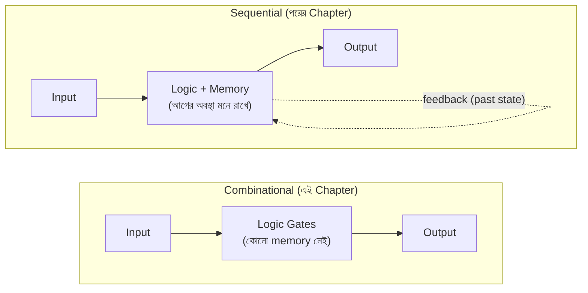

# ⚙️ Chapter 3: Build Your Own Arithmetic Circuits
## Adders থেকে ALU - তোমার Processor এর Calculator বানাও!

> **"Every processor needs a calculator. You're about to build yours!"**
>
> **"প্রতিটি processor এ calculator লাগে। তুমি এখন তোমারটা বানাবে!"**

---

## 🎯 এই Chapter এ তুমি বানাবে:

গত chapter-এ তুমি logic gate (AND, OR, NOT, XOR) চিনেছো আর Boolean algebra দিয়ে expression সরল করতে শিখেছো। ওগুলো ছিল ইট। এই chapter-এ আমরা সেই ইট দিয়ে আসল **দেয়াল** গড়ব — মানে কাজের circuit, যেগুলো সত্যিকারের কম্পিউটারের ভেতরে বসে আছে।

```
✅ Half Adder - তোমার প্রথম adder
✅ Full Adder - carry সহ যোগ
✅ 4-bit Ripple Carry Adder - বড় সংখ্যা যোগ
✅ Subtractor - বিয়োগ করার circuit
✅ Multiplexer - data selector
✅ Demultiplexer - data distributor
✅ Decoder - address decoder
✅ Encoder - priority encoder
✅ ALU - তোমার processor এর brain! 🎉
```

দেখো তালিকাটা কোথায় গিয়ে শেষ হচ্ছে — **ALU**, মানে Arithmetic Logic Unit। ওটাই তোমার বানানো processor-এর সেই অংশ যেটা আসলে যোগ-বিয়োগ-তুলনা করে। আর মজার ব্যাপারটা হলো, ALU পুরোটাই এই chapter-এর ছোট ছোট circuit জোড়া দিয়ে তৈরি। তাই আজকের প্রতিটা circuit তোমার চূড়ান্ত লক্ষ্যের দিকে একটা করে পা।

**Time Required:** 2 weeks (3-4 hours/day)  
**Tools Needed:** CircuitVerse, Paper, Calculator

---

## 🚀 Quick Win - 5 মিনিটে তোমার প্রথম Adder!

theory পড়ার আগে চলো হাতেকলমে একটা জিনিস বানিয়ে ফেলি। মাত্র দুটো gate দিয়ে তুমি এমন একটা circuit বানাবে যেটা সত্যিকারের যোগ করে — এক bit আর এক bit যোগ করে উত্তর বের করে। এটাই তোমার ভেতরে আত্মবিশ্বাস তৈরি করবে: "ওহ, processor বানানো তাহলে আমার নাগালেই!"

### এখনই বানাও - Half Adder:

**যাও CircuitVerse.org এ এবং:**

```
Components (drag করো):
- 2 × Input switches (A, B)
- 1 × XOR gate
- 1 × AND gate  
- 2 × Output LEDs (Sum, Carry)

Connections:
A ──┬──[XOR]── Sum LED
    │
B ──┼──[XOR]
    │
    └──[AND]── Carry LED

Test:
0+0 = 00 (Sum=0, Carry=0) ✓
0+1 = 01 (Sum=1, Carry=0) ✓
1+0 = 01 (Sum=1, Carry=0) ✓
1+1 = 10 (Sum=0, Carry=1) ✓
```

🎉 **Congratulations! তুমি একটা working adder বানিয়েছো!**

খেয়াল করো কী হলো — তুমি কোনো লম্বা গণিত করোনি, শুধু দুটো gate জুড়েছো, আর circuit-টা নিজে নিজেই যোগ করে দিল। হাত-গোনা যোগের নিয়মটা (`0+0=0`, `1+1=১০`) এখন তোমার বদলে এই দুই gate করছে। এটাই hardware-এর জাদু: একবার সঠিক gate বসিয়ে দিলে, সে আর কখনো ভুল করে না, ক্লান্ত হয় না।

**এটাই তোমার processor এর ALU এর building block!** এই এক bit-এর adder-কেই আমরা পরে বারবার জুড়ে বড় সংখ্যা যোগ করব। ছোট থেকে বড় — এটাই আজকের পুরো গল্প।

---

## ৩.১ Combinational Circuits কী?

এই chapter-এর প্রতিটা circuit-এর একটা সাধারণ বৈশিষ্ট্য আছে — এগুলো সবাই **combinational**। নামটা একটু কঠিন শোনালেও ধারণাটা ভীষণ সহজ, আর একবার বুঝে গেলে পরের সব chapter অনেক পরিষ্কার লাগবে। তাই এক মিনিট থেমে এটা ভালো করে বুঝে নাও।

### Definition: মানেটা আসলে কী?

Combinational circuit মানে এমন একটা circuit যার **output শুধু এই মুহূর্তের input দেখে ঠিক হয়** — আগে কী হয়েছিল, তা সে মনে রাখে না।

একটা সহজ উপমা ভাবো: **calculator-এর `+` বোতাম**। তুমি `5` আর `3` দিলে সে সবসময় `8` দেবে। সকালে দাও বা রাতে, আগে কী হিসাব করেছিলে — কোনো কিছুতেই কিছু আসে যায় না। input এক থাকলে output-ও এক। ঠিক এমন behaviour-ই combinational circuit-এর।

```
Combinational Circuit:
- Output শুধুমাত্র current input এর উপর নির্ভর করে
- কোনো memory/state নেই
- যেকোনো সময় same input = same output

Examples তুমি বানাবে:
✅ Adders
✅ Subtractors  
✅ Multiplexers
✅ Decoders
✅ ALU
```

মনে রাখার মন্ত্র: **"স্মৃতি নেই, শুধু হিসাব আছে।"** input ঢুকল, gate-এর ভেতর দিয়ে গেল, output বেরোল — মাঝখানে কিছু জমা থাকে না।

### Sequential vs Combinational: পার্থক্যটা কোথায়?

এর উল্টোটা হলো **sequential circuit**, যেটা তুমি পরের chapter-এ বানাবে। ওটার ভেতরে memory থাকে, তাই সে আগের অবস্থা মনে রাখতে পারে। উপমা দিলে — combinational হলো `+` বোতাম, আর sequential হলো calculator-এর সেই running total যেটা আগের ফলাফল ধরে রাখে।

দুটোর গঠন পাশাপাশি দেখলে তফাতটা চোখে পড়বে:



পার্থক্যটা ওই feedback-এর তীরে — sequential circuit তার নিজের output-কে আবার নিজের ভেতরে ফেরত পাঠায়, তাই সে "মনে রাখতে" পারে। combinational-এ এমন কোনো ফেরত পথ নেই, input থেকে output — সোজা একমুখী রাস্তা।

> 💡 **কেন আগে combinational?** কারণ এগুলো সরল — কোনো clock নেই, কোনো timing-এর ঝামেলা নেই। আর মজার কথা, sequential circuit-ও ভেতরে এই combinational অংশগুলোই ব্যবহার করে। তাই ভিতটা এখানেই গড়া হচ্ছে।

---

## ৩.২ Build Half Adder - তোমার First Adder

### কী করে?

চলো একদম গোড়া থেকে শুরু করি — সবচেয়ে ছোট যোগ যেটা হতে পারে: **এক bit আর এক bit**। মনে করো তুমি স্কুলে যেভাবে হাতে যোগ করো, ঠিক সেভাবে। binary-তে দুটো single bit যোগ করলে কী কী হতে পারে?

- `0 + 0 = 0` — সোজা
- `0 + 1 = 1` — সোজা
- `1 + 0 = 1` — সোজা
- `1 + 1 = ?` — এখানে একটু মজা! decimal-এ `1+1=2`, কিন্তু binary-তে `2` লিখতে হয় `10`। মানে এক ঘরে আঁটে না, পাশের ঘরে একটা "হাতে রইল ১" চলে যায়।

ওই "হাতে রইল" জিনিসটাকেই আমরা বলি **Carry**, আর ঘরের ভেতরের সংখ্যাটাকে বলি **Sum**। অর্থাৎ এক bit যোগ করতে আমাদের আসলে **দুটো** output লাগে:

```
1-bit addition:
A + B = Sum + Carry
```

পুরো ব্যাপারটা একটা truth table-এ সাজালে এমন দাঁড়ায়:

| A | B | Sum | Carry |
|:-:|:-:|:---:|:-----:|
| 0 | 0 |  0  |   0   |
| 0 | 1 |  1  |   0   |
| 1 | 0 |  1  |   0   |
| 1 | 1 |  0  |   1   ← এখানেই carry তৈরি হলো! |

একে **Half Adder** বলা হয় কারণ এটা "অর্ধেক" কাজ করে — দুটো bit যোগ করতে পারে, কিন্তু আগের ঘর থেকে আসা carry-টা নিতে পারে না। সেই সমস্যাটা পরের section-এ আমরা ঠিক করব।

### Design Steps: truth table থেকে circuit

এখন আসল কৌশল — truth table দেখে কীভাবে gate বেছে নেব? এটাই digital design-এর মূল দক্ষতা, তাই ধাপে ধাপে দেখি।

**Step 1: Sum কলামটা কোন gate-এর মতো?**
Sum কলামে তাকাও — A আর B আলাদা হলে (একটা 0 আরেকটা 1) Sum হয় `1`, আর দুটো এক হলে Sum হয় `0`। "দুটো আলাদা হলে 1" — এটাই হুবহু **XOR** gate-এর সংজ্ঞা! গত chapter-এ XOR মনে আছে তো? তাই:
```
Sum = 1 when A≠B (different)
Sum = A ⊕ B (XOR)
```

**Step 2: Carry কলামটা কোন gate-এর মতো?**
এবার Carry কলাম — শুধু একটাই জায়গায় `1`, যখন A আর B **দুটোই** 1। "দুটোই 1 হলে তবেই 1" — এটাই **AND** gate। তাই:
```
Carry = 1 when A=1 AND B=1
Carry = A · B (AND)
```

দেখলে? truth table-এর প্রতিটা output কলামকে আলাদা করে দেখলে, প্রতিটার পেছনে একটা চেনা gate লুকিয়ে থাকে। কঠিন কিছু না — শুধু "কোন প্যাটার্নে output 1 হচ্ছে" সেটা চিনে নেওয়া।

**Step 3: দুটো একসাথে জুড়ে circuit বানাও**
মজার ব্যাপার — দুটো gate-ই একই দুটো input (A আর B) থেকে তার নেয়। তাই A আর B-কে দুদিকে শাখা করে দিলেই হয়ে গেল:
```
        A ──┬──[XOR]── Sum
            │
        B ──┼──[XOR]
            │
            └──[AND]── Carry

Gates needed: 1 XOR + 1 AND
```

### 🎯 Your Turn - Build & Test!

**Build in CircuitVerse:**
1. Create circuit as shown above
2. Test all 4 combinations
3. Screenshot তোলো
4. Share with #BuildYourOwnProcessor

**Verify Results:**
```
Test Case 1: 0+0 = ?
Expected: Sum=0, Carry=0
Your Result: Sum=___, Carry=___

Test Case 2: 0+1 = ?
Expected: Sum=1, Carry=0  
Your Result: Sum=___, Carry=___

Test Case 3: 1+0 = ?
Expected: Sum=1, Carry=0
Your Result: Sum=___, Carry=___

Test Case 4: 1+1 = ?
Expected: Sum=0, Carry=1
Your Result: Sum=___, Carry=___
```

---

## ৩.৩ Build Full Adder - The Complete Adder

### Half Adder এর Problem:

```
Half Adder: A + B = Sum + Carry
Problem: Previous carry নিতে পারে না!

Example:
  1 1  ← carries
  1 0 1
+ 0 1 1
-------
Need to add 3 bits at a time!
```

### Full Adder Solution:

```
Full Adder: A + B + Cin = Sum + Cout

Truth Table:
┌───┬───┬─────┬──────┬──────┐
│ A │ B │ Cin │ Sum  │ Cout │
├───┼───┼─────┼──────┼──────┤
│ 0 │ 0 │  0  │  0   │  0   │
│ 0 │ 0 │  1  │  1   │  0   │
│ 0 │ 1 │  0  │  1   │  0   │
│ 0 │ 1 │  1  │  0   │  1   │
│ 1 │ 0 │  0  │  1   │  0   │
│ 1 │ 0 │  1  │  0   │  1   │
│ 1 │ 1 │  0  │  0   │  1   │
│ 1 │ 1 │  1  │  1   │  1   │
└───┴───┴─────┴──────┴──────┘
```

### Design Method 1: Using Half Adders

```
Circuit: 2 Half Adders + 1 OR

        A ──┐
            ├─[HA1]── S1
        B ──┘          |
                      C1
                       |
       Cin ────────────┤
                       ├─[HA2]── Sum
                       |
                      C2
                       |
           C1 ─────────┤
                       ├─[OR]── Cout
           C2 ─────────┘

Logic:
S1, C1 = HalfAdder(A, B)
Sum, C2 = HalfAdder(S1, Cin)
Cout = C1 OR C2
```

### Design Method 2: Using Logic Gates

**Boolean Expressions:**
```
Sum = A ⊕ B ⊕ Cin
Cout = A·B + B·Cin + A·Cin
     = A·B + Cin·(A⊕B)  (optimized)
```

**Gate Count:**
```
Method 1 (2 HA): 2 XOR + 2 AND + 1 OR = 5 gates
Method 2 (direct): 2 XOR + 2 AND + 1 OR = 5 gates

Same! But Method 1 is modular (reuse Half Adder)
```

### 🎯 Build Challenge - Full Adder

**Build using 2 Half Adders:**

```
Step 1: Build Half Adder 1
Inputs: A, B
Outputs: S1, C1

Step 2: Build Half Adder 2  
Inputs: S1, Cin
Outputs: Sum, C2

Step 3: OR gate for carries
Inputs: C1, C2
Output: Cout

Step 4: Test all 8 cases!
```

**Test Cases:**
```
1. 0+0+0 = 00 ✓
2. 0+0+1 = 01 ✓
3. 0+1+0 = 01 ✓
4. 0+1+1 = 10 ✓
5. 1+0+0 = 01 ✓
6. 1+0+1 = 10 ✓
7. 1+1+0 = 10 ✓
8. 1+1+1 = 11 ✓
```

---

## ৩.৪ Build 4-bit Ripple Carry Adder - Real Addition!

### The Big One!

```
Goal: Add two 4-bit numbers

Example: 1011₂ + 0110₂ = ?

  1011  (11₁₀)
+ 0110  (6₁₀)
-------
 10001  (17₁₀)

Need 4 Full Adders chained together!
```

### Circuit Architecture:

```
           A3 B3    A2 B2    A1 B1    A0 B0
            │ │      │ │      │ │      │ │
            ↓ ↓      ↓ ↓      ↓ ↓      ↓ ↓
      ┌────[FA3]────[FA2]────[FA1]────[FA0]────
Cout──┤     │        │        │        │
      │   S3       S2       S1       S0
      │
    (MSB)                              (LSB)

Carry ripples from right to left!
```

**Detailed Connections:**
```
FA0: A=A0, B=B0, Cin=0    → Sum=S0, Cout=C0
FA1: A=A1, B=B1, Cin=C0   → Sum=S1, Cout=C1
FA2: A=A2, B=B2, Cin=C1   → Sum=S2, Cout=C2
FA3: A=A3, B=B3, Cin=C2   → Sum=S3, Cout=C3

Final Result: C3 S3 S2 S1 S0 (5 bits)
```

### 🎯 Build Project - 4-bit Adder

**Components Needed:**
```
- 8 Input switches (A3-A0, B3-B0)
- 4 Full Adders (reuse your design!)
- 5 Output LEDs (S3-S0, Cout)
```

**Build Steps:**

1. **Build Full Adder Module** (if not done)
2. **Create 4 instances** (FA0, FA1, FA2, FA3)
3. **Connect inputs** (A and B bits)
4. **Chain carries** (Cout → Cin)
5. **Connect outputs** (Sum bits + final carry)
6. **Test thoroughly!**

**Test Cases:**
```
Test 1: 0000 + 0000 = 00000 ✓
Test 2: 0001 + 0001 = 00010 (1+1=2) ✓
Test 3: 0111 + 0001 = 01000 (7+1=8) ✓
Test 4: 1111 + 0001 = 10000 (15+1=16) ✓
Test 5: 1111 + 1111 = 11110 (15+15=30) ✓

Test your age + friend's age!
```

### Timing Analysis:

```
Problem: Carry has to "ripple" through!

Delay per FA: ~2 gate delays
4-bit adder: 4 × 2 = 8 gate delays
32-bit adder: 32 × 2 = 64 gate delays (slow!)

Solution: Carry Look-Ahead Adder (advanced topic)
```

---

## ৩.৫ Build Subtractor - বিয়োগ Machine

### কিভাবে Subtract করবে?

**Method: 2's Complement Addition!**

```
A - B = A + (-B)
      = A + (2's complement of B)

2's Complement = 1's complement + 1
               = NOT B + 1
```

### Circuit Design:

```
        B3 B2 B1 B0
         │  │  │  │
     ┌──[NOT NOT NOT NOT]── (1's complement)
     │   │  │  │  │
     │   ↓  ↓  ↓  ↓
Sub──┤  ┌──────────────────┐
     │  │   4-bit Adder    │
     └→ │   (Cin = 1)      │
        └──────────────────┘
        A3 A2 A1 A0
         │  │  │  │
         ↓  ↓  ↓  ↓
        S3 S2 S1 S0

When Sub=1: NOT B is applied, Cin=1
Result: A + NOT B + 1 = A - B
```

### Adder-Subtractor Combined:

```
Control Signal: M
- M=0: Addition (A + B)
- M=1: Subtraction (A - B)

Circuit:
        B ──┬── M=0 (direct)
            │
            └─[XOR with M]── M=1 (inverted)
                    ↓
              [4-bit Adder]
              Cin = M
```

### 🎯 Build Project - Adder/Subtractor

**Build Circuit:**
```
Components:
- 9 inputs (A3-A0, B3-B0, M)
- 4 XOR gates (for B inversion)
- 1 × 4-bit adder (your previous design!)
- 5 outputs (S3-S0, overflow)

Connections:
B[i] XOR M → Adder B input
M → Adder Cin
```

**Test:**
```
Addition (M=0):
5 + 3 = 8    (0101 + 0011 = 1000) ✓
7 + 6 = 13   (0111 + 0110 = 1101) ✓

Subtraction (M=1):
8 - 3 = 5    (1000 - 0011 = 0101) ✓
10 - 4 = 6   (1010 - 0100 = 0110) ✓
```

---

## ৩.৬ Build Multiplexer (MUX) - Data Selector

### কী করে?

```
Multiplexer = Data Selector
Multiple inputs → Select one → Output

Like a switch!
```

### 2:1 MUX (Simplest):

**Truth Table:**
```
┌───┬────┬────┬─────┐
│ S │ I0 │ I1 │  Y  │
├───┼────┼────┼─────┤
│ 0 │  0 │  X │  0  │  S=0 → Select I0
│ 0 │  1 │  X │  1  │
│ 1 │  X │  0 │  0  │  S=1 → Select I1
│ 1 │  X │  1 │  1  │
└───┴────┴────┴─────┘

Boolean: Y = S'·I0 + S·I1
```

**Circuit:**
```
    I0 ──┐
         ├─[AND]──┐
    S'───┘        │
                  ├─[OR]── Y
    I1 ──┐        │
         ├─[AND]──┘
    S ───┘
```

### 4:1 MUX:

**Inputs:** 4 data (I0-I3), 2 select (S1,S0)

**Selection:**
```
S1 S0 | Output
------+-------
 0  0 |  I0
 0  1 |  I1
 1  0 |  I2
 1  1 |  I3
```

**Circuit:** Use 3 × 2:1 MUX
```
         I0 ──┐
              ├─[MUX]──┐
         I1 ──┘  S0    │
                       ├─[MUX]── Y
         I2 ──┐        │  S1
              ├─[MUX]──┘
         I3 ──┘  S0
```

### 🎯 Build Project - 4:1 MUX

**Method 1: Using 2:1 MUX**
- Build three 2:1 MUX
- Connect as tree structure

**Method 2: Using Gates**
```
Boolean:
Y = S1'·S0'·I0 + S1'·S0·I1 + S1·S0'·I2 + S1·S0·I3

Gates: 4 AND + 1 OR(4-input)
```

**Application:** তোমার processor এ register selection!

---

## ৩.৭ Build Demultiplexer (DEMUX) - Data Distributor

### Opposite of MUX!

```
DEMUX: 1 input → Multiple outputs
       Select which output gets the data
```

### 1:4 DEMUX:

**Truth Table:**
```
┌────┬────┬────┬────┬────┬────┐
│ S1 │ S0 │ D  │ Y0 │ Y1 │ Y2 │ Y3 │
├────┼────┼────┼────┼────┼────┼────┤
│ 0  │ 0  │ D  │ D  │ 0  │ 0  │ 0  │
│ 0  │ 1  │ D  │ 0  │ D  │ 0  │ 0  │
│ 1  │ 0  │ D  │ 0  │ 0  │ D  │ 0  │
│ 1  │ 1  │ D  │ 0  │ 0  │ 0  │ D  │
└────┴────┴────┴────┴────┴────┴────┘
```

**Boolean:**
```
Y0 = S1'·S0'·D
Y1 = S1'·S0·D
Y2 = S1·S0'·D
Y3 = S1·S0·D
```

**Application:** Memory address decoding!

---

## ৩.৮ Build Decoder - Address Decoder

### কী করে?

```
n inputs → 2ⁿ outputs
Only ONE output is 1 at a time
```

### 2:4 Decoder:

**Truth Table:**
```
┌────┬────┬────┬────┬────┬────┐
│ A1 │ A0 │ Y0 │ Y1 │ Y2 │ Y3 │
├────┼────┼────┼────┼────┼────┤
│ 0  │ 0  │ 1  │ 0  │ 0  │ 0  │
│ 0  │ 1  │ 0  │ 1  │ 0  │ 0  │
│ 1  │ 0  │ 0  │ 0  │ 1  │ 0  │
│ 1  │ 1  │ 0  │ 0  │ 0  │ 1  │
└────┴────┴────┴────┴────┴────┘
```

**Boolean:**
```
Y0 = A1'·A0'
Y1 = A1'·A0
Y2 = A1·A0'
Y3 = A1·A0
```

**Circuit:** 2 NOT + 4 AND gates

### 3:8 Decoder:

```
3 inputs (A2,A1,A0) → 8 outputs (Y0-Y7)

Can build using: 2 × 2:4 Decoder + enable!
```

**Application:** তোমার processor এ instruction decoding!

---

## ৩.৯ Build Encoder - Priority Encoder

### Opposite of Decoder!

```
2ⁿ inputs → n outputs
Encode which input is active
```

### 4:2 Encoder:

**Truth Table:**
```
┌────┬────┬────┬────┬────┬────┐
│ I0 │ I1 │ I2 │ I3 │ A1 │ A0 │
├────┼────┼────┼────┼────┼────┤
│ 1  │ 0  │ 0  │ 0  │ 0  │ 0  │
│ 0  │ 1  │ 0  │ 0  │ 0  │ 1  │
│ 0  │ 0  │ 1  │ 0  │ 1  │ 0  │
│ 0  │ 0  │ 0  │ 1  │ 1  │ 1  │
└────┴────┴────┴────┴────┴────┘
```

### Priority Encoder:

```
If multiple inputs active → Select highest priority

Truth Table:
┌────┬────┬────┬────┬────┬────┐
│ I3 │ I2 │ I1 │ I0 │ A1 │ A0 │
├────┼────┼────┼────┼────┼────┤
│ 0  │ 0  │ 0  │ 1  │ 0  │ 0  │
│ 0  │ 0  │ 1  │ X  │ 0  │ 1  │
│ 0  │ 1  │ X  │ X  │ 1  │ 0  │
│ 1  │ X  │ X  │ X  │ 1  │ 1  │
└────┴────┴────┴────┴────┴────┘

X = Don't care
```

**Application:** Interrupt handling in processor!

---

## ৩.১০ Build ALU - তোমার Processor এর Brain! 🎉

### The Ultimate Circuit!

```
ALU = Arithmetic Logic Unit
- Does ALL math operations
- Does ALL logic operations
- Core of your processor!
```

### Simple 1-bit ALU Design:

**Operations:**
```
S1 S0 | Operation
------+-----------
 0  0 | A AND B
 0  1 | A OR B
 1  0 | A + B (add)
 1  1 | A - B (subtract)
```

**Block Diagram:**
```
        A ──┬──[AND]──┐
            │         │
        B ──┤         ├──[MUX 4:1]── Result
            │         │     S1 S0
            ├──[OR]───┤
            │         │
            └──[ADD]──┘
```

### 4-bit ALU Design:

**Features:**
```
✅ Addition (A + B)
✅ Subtraction (A - B)
✅ AND (A & B)
✅ OR (A | B)
✅ XOR (A ^ B)
✅ NOT A
✅ Increment (A + 1)
✅ Decrement (A - 1)
```

**Control Signals:**
```
3-bit opcode (Op2 Op1 Op0) → 8 operations

Op2 Op1 Op0 | Operation
------------+-----------
 0   0   0  | A AND B
 0   0   1  | A OR B
 0   1   0  | A XOR B
 0   1   1  | NOT A
 1   0   0  | A + B
 1   0   1  | A - B
 1   1   0  | A + 1
 1   1   1  | A - 1
```

### 🎯 Build Project - Complete ALU!

**Your Ultimate Build:**

```
Components:
- 2 × 4-bit inputs (A, B)
- 3-bit operation select
- Logic unit (AND, OR, XOR, NOT)
- Arithmetic unit (Adder/Subtractor)
- 8:1 MUX (result selector)
- 4-bit output + flags

Flags:
- Zero (Z): Result = 0
- Carry (C): Overflow
- Negative (N): MSB = 1
- Overflow (V): Signed overflow
```

**Build Steps:**

1. **Logic Unit:** AND, OR, XOR gates (parallel)
2. **Arithmetic Unit:** Adder/Subtractor
3. **Result MUX:** 8:1 multiplexer
4. **Flag Generation:** Zero detect, carry, etc.
5. **Integration:** Connect all units
6. **Testing:** All 8 operations!

**Test Cases:**
```
Operation: A=5, B=3

AND: 0101 & 0011 = 0001 (1) ✓
OR:  0101 | 0011 = 0111 (7) ✓
XOR: 0101 ^ 0011 = 0110 (6) ✓
NOT: ~0101 = 1010 (10 in 4-bit) ✓
ADD: 0101 + 0011 = 1000 (8) ✓
SUB: 0101 - 0011 = 0010 (2) ✓
INC: 0101 + 1 = 0110 (6) ✓
DEC: 0101 - 1 = 0100 (4) ✓
```

---

## ৩.১১ Your 2-Week Build Plan

### Week 1: Foundation Circuits

**Day 1-2: Adders**
```
□ Build Half Adder
□ Build Full Adder
□ Test thoroughly
□ Share screenshots!
```

**Day 3-4: Multi-bit Adder**
```
□ Build 4-bit Ripple Carry Adder
□ Test with various numbers
□ Try 8-bit version (bonus!)
```

**Day 5-6: Subtractor**
```
□ Understand 2's complement
□ Build Adder/Subtractor
□ Test addition and subtraction
```

**Day 7: Review**
```
□ Review all arithmetic circuits
□ Fix any issues
□ Prepare for Week 2
```

---

### Week 2: Data Path Circuits + ALU

**Day 8-9: MUX/DEMUX**
```
□ Build 2:1 MUX
□ Build 4:1 MUX
□ Build 1:4 DEMUX
□ Understand applications
```

**Day 10-11: Decoder/Encoder**
```
□ Build 2:4 Decoder
□ Build 3:8 Decoder
□ Build Priority Encoder
□ Test each
```

**Day 12-14: ALU - The Big One!**
```
□ Design your ALU architecture
□ Build logic unit
□ Build arithmetic unit
□ Integrate with MUX
□ Add flag generation
□ Test ALL operations
□ Share your ALU! #BuildYourOwnProcessor
```

---

## ৩.১২ Pro Tips & Common Mistakes

### ✅ Do This:
```
✅ Test each gate before connecting
✅ Build modularly (reuse circuits)
✅ Label all wires clearly
✅ Save intermediate designs
✅ Test with boundary values (0, max)
✅ Document your designs
```

### ❌ Avoid This:
```
❌ Building everything at once
❌ Not testing incrementally
❌ Forgetting carry connections
❌ Wrong carry direction (right to left!)
❌ Not handling overflow
❌ Skipping test cases
```

### Common Circuit Bugs:
```
1. Carry direction reversed
   Fix: LSB on right, carry flows left

2. XOR gate mistake in adders
   Fix: Double-check XOR connections

3. MUX select lines swapped
   Fix: Test each combination

4. Missing NOT gates in subtractor
   Fix: B must be inverted when M=1
```

---

## ৩.১৩ Chapter 3 Mission Complete!

### তুমি এখন পারো:

```
✅ Build adders (half, full, multi-bit)
✅ Build subtractors (2's complement)
✅ Build data selectors (MUX/DEMUX)
✅ Build decoders and encoders
✅ Build complete ALU
✅ তোমার processor এর arithmetic brain তৈরি!
```

### তুমি বানিয়েছো:
```
✅ Half Adder
✅ Full Adder
✅ 4-bit Adder
✅ Adder/Subtractor
✅ 4:1 MUX
✅ 2:4 Decoder
✅ Priority Encoder
✅ Complete 4-bit ALU! 🎉
```

### Stats:
```
Total circuits built: 10+
Total gates used: 100+
Total test cases: 50+
Level: Combinational Master! 🏆
```

### Next Level Unlocked:
```
→ Chapter 4: Sequential Circuits
   তুমি বানাবে: Flip-flops, Registers, Counters, FSM
   
   Sequential = Combinational + Memory!
```

---

## 🎯 Final Project - Before Next Chapter

### Project: Calculator Circuit

**Build a simple calculator:**
```
Requirements:
- 2 × 4-bit inputs (operands)
- 3-bit operation select
- Operations: +, -, AND, OR
- 4-bit output + overflow flag
- 7-segment display (optional!)

Bonus:
- Add more operations
- Make 8-bit version
- Add display
- Share on social media!
```

---

## 🏆 Achievement Unlocked!

```
Level 3: ✅ COMPLETE - Arithmetic Architect!
Progress: [███████████████░░░░] 15%

XP Gained: +1000
Skills: Adders, ALU, Data Path Design

Badges Earned:
🥉 Half Adder Builder
🥈 Full Adder Master  
🥇 ALU Architect
🏆 Combinational Circuit Expert

Next: Chapter 4 - Add Memory to Your Circuits!
      Flip-flops incoming! 🚀
```

---

**[⬅️ Previous: Chapter 2](Chapter_02_Number_Systems_Boolean_Algebra.md)** | **[➡️ Next: Chapter 4](Chapter_04_Sequential_Circuits.md)**

---

<div align="center">

**"You just built the calculator of your processor. Next, you'll add memory!"**

**"তুমি তোমার processor এর calculator বানিয়ে ফেলেছো। এবার memory যোগ করবে!"**

Made with ❤️ for builders | বানানোর জন্য ভালোবাসা দিয়ে তৈরি

</div>
