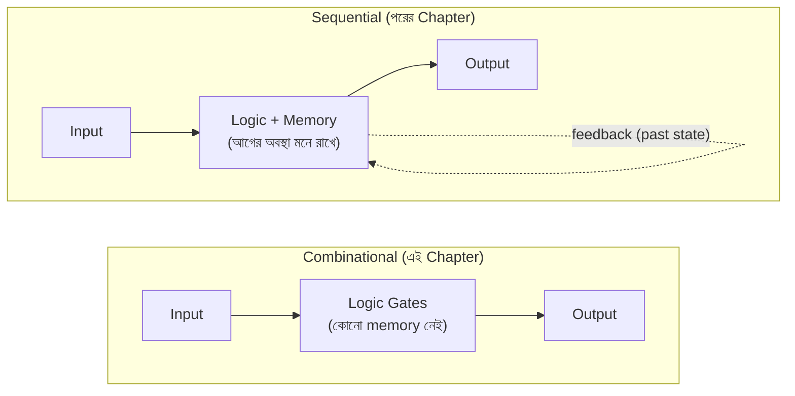
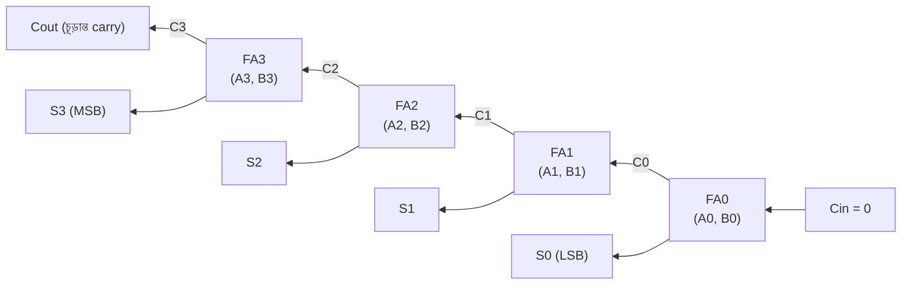
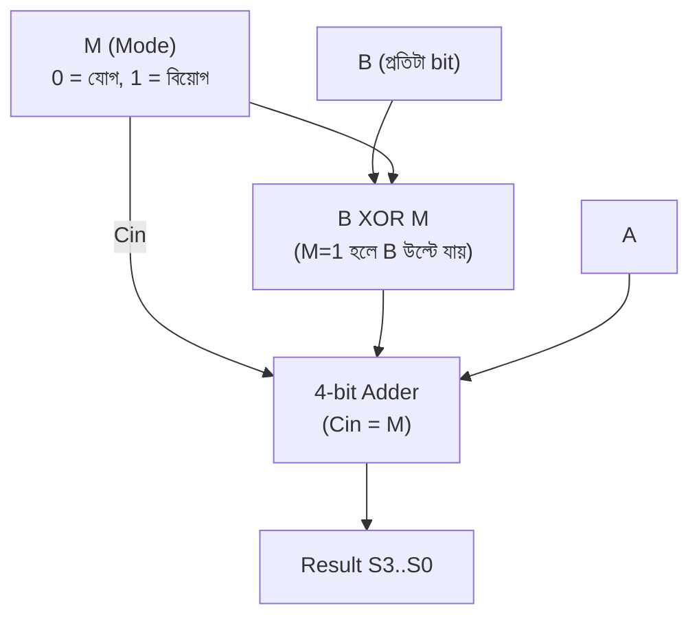
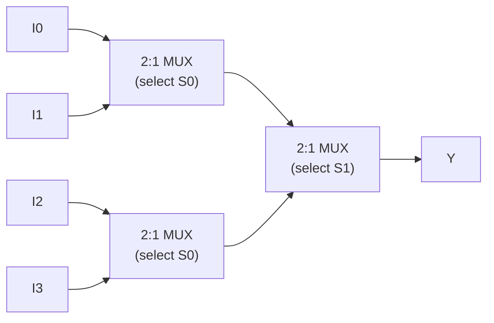
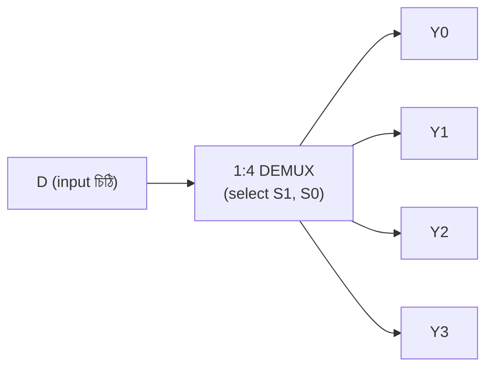
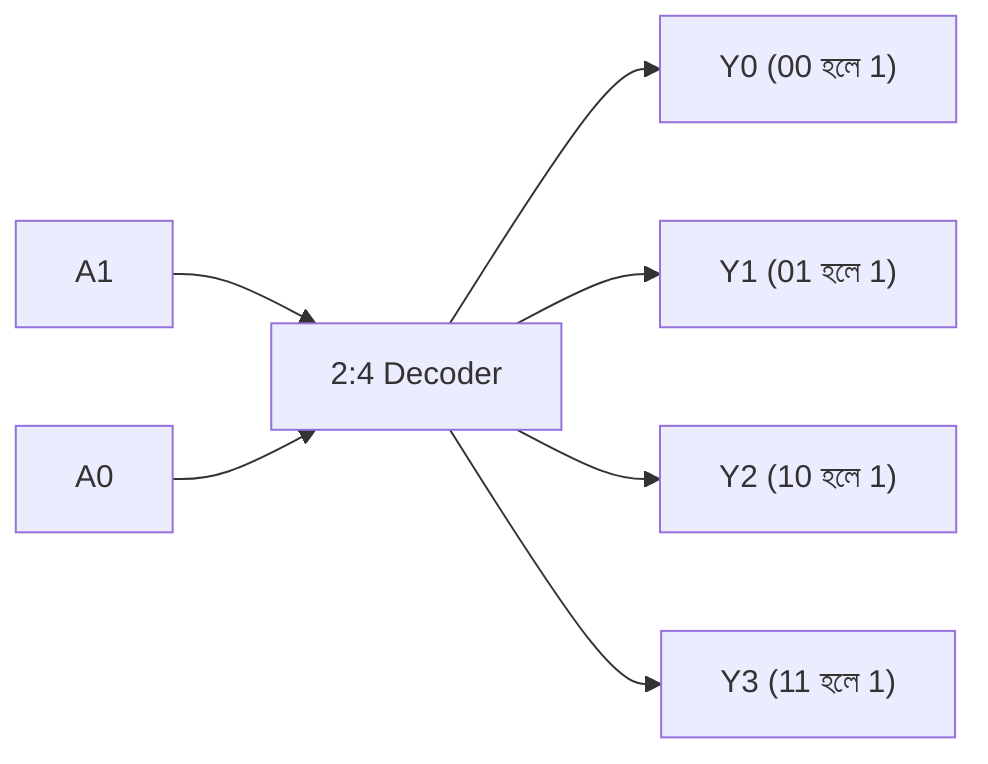
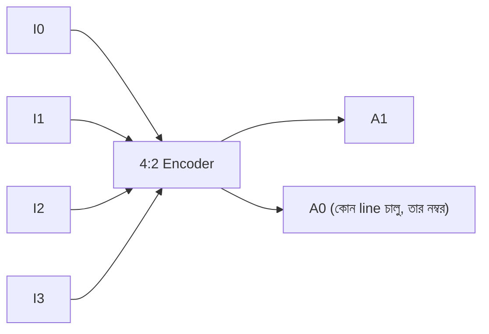
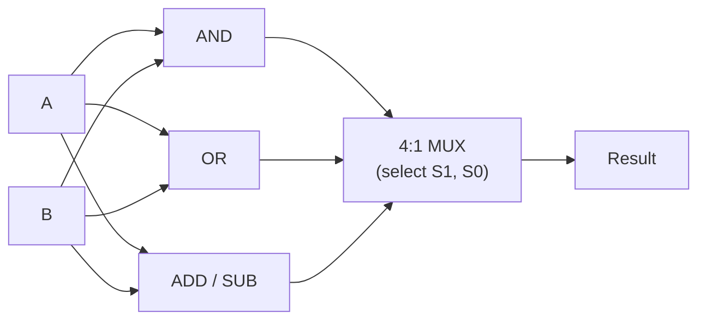
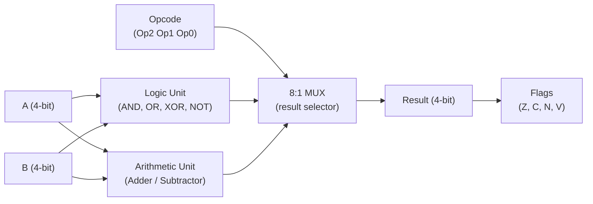

# ⚙️ Chapter 3: Build Your Own Arithmetic Circuits
## Adders থেকে ALU - তোমার Processor এর Calculator বানাও!

> **"Every processor needs a calculator. You're about to build yours!"**
>
> **"প্রতিটি processor এ calculator লাগে। তুমি এখন তোমারটা বানাবে!"**

---

## 🎯 এই Chapter এ তুমি বানাবে:

গত chapter-এ তুমি logic gate (AND, OR, NOT, XOR) চিনেছো আর Boolean algebra দিয়ে expression সরল করতে শিখেছো। ওগুলো ছিল ইট। এই chapter-এ আমরা সেই ইট দিয়ে আসল **দেয়াল** গড়ব — মানে কাজের circuit, যেগুলো সত্যিকারের কম্পিউটারের ভেতরে বসে আছে।

```
✅ Half Adder - তোমার প্রথম adder
✅ Full Adder - carry সহ যোগ
✅ 4-bit Ripple Carry Adder - বড় সংখ্যা যোগ
✅ Subtractor - বিয়োগ করার circuit
✅ Multiplexer - data selector
✅ Demultiplexer - data distributor
✅ Decoder - address decoder
✅ Encoder - priority encoder
✅ ALU - তোমার processor এর brain! 🎉
```

দেখো তালিকাটা কোথায় গিয়ে শেষ হচ্ছে — **ALU**, মানে Arithmetic Logic Unit। ওটাই তোমার বানানো processor-এর সেই অংশ যেটা আসলে যোগ-বিয়োগ-তুলনা করে। আর মজার ব্যাপারটা হলো, ALU পুরোটাই এই chapter-এর ছোট ছোট circuit জোড়া দিয়ে তৈরি। তাই আজকের প্রতিটা circuit তোমার চূড়ান্ত লক্ষ্যের দিকে একটা করে পা।

**Time Required:** 2 weeks (3-4 hours/day)  
**Tools Needed:** CircuitVerse, Paper, Calculator

---

## 🚀 Quick Win - 5 মিনিটে তোমার প্রথম Adder!

theory পড়ার আগে চলো হাতেকলমে একটা জিনিস বানিয়ে ফেলি। মাত্র দুটো gate দিয়ে তুমি এমন একটা circuit বানাবে যেটা সত্যিকারের যোগ করে — এক bit আর এক bit যোগ করে উত্তর বের করে। এটাই তোমার ভেতরে আত্মবিশ্বাস তৈরি করবে: "ওহ, processor বানানো তাহলে আমার নাগালেই!"

### এখনই বানাও - Half Adder:

**যাও CircuitVerse.org এ এবং:**

```
Components (drag করো):
- 2 × Input switches (A, B)
- 1 × XOR gate
- 1 × AND gate  
- 2 × Output LEDs (Sum, Carry)

Connections:
A ──┬──[XOR]── Sum LED
    │
B ──┼──[XOR]
    │
    └──[AND]── Carry LED

Test:
0+0 = 00 (Sum=0, Carry=0) ✓
0+1 = 01 (Sum=1, Carry=0) ✓
1+0 = 01 (Sum=1, Carry=0) ✓
1+1 = 10 (Sum=0, Carry=1) ✓
```

🎉 **Congratulations! তুমি একটা working adder বানিয়েছো!**

খেয়াল করো কী হলো — তুমি কোনো লম্বা গণিত করোনি, শুধু দুটো gate জুড়েছো, আর circuit-টা নিজে নিজেই যোগ করে দিল। হাত-গোনা যোগের নিয়মটা (`0+0=0`, `1+1=১০`) এখন তোমার বদলে এই দুই gate করছে। এটাই hardware-এর জাদু: একবার সঠিক gate বসিয়ে দিলে, সে আর কখনো ভুল করে না, ক্লান্ত হয় না।

**এটাই তোমার processor এর ALU এর building block!** এই এক bit-এর adder-কেই আমরা পরে বারবার জুড়ে বড় সংখ্যা যোগ করব। ছোট থেকে বড় — এটাই আজকের পুরো গল্প।

---

## ৩.১ Combinational Circuits কী?

এই chapter-এর প্রতিটা circuit-এর একটা সাধারণ বৈশিষ্ট্য আছে — এগুলো সবাই **combinational**। নামটা একটু কঠিন শোনালেও ধারণাটা ভীষণ সহজ, আর একবার বুঝে গেলে পরের সব chapter অনেক পরিষ্কার লাগবে। তাই এক মিনিট থেমে এটা ভালো করে বুঝে নাও।

### Definition: মানেটা আসলে কী?

Combinational circuit মানে এমন একটা circuit যার **output শুধু এই মুহূর্তের input দেখে ঠিক হয়** — আগে কী হয়েছিল, তা সে মনে রাখে না।

একটা সহজ উপমা ভাবো: **calculator-এর `+` বোতাম**। তুমি `5` আর `3` দিলে সে সবসময় `8` দেবে। সকালে দাও বা রাতে, আগে কী হিসাব করেছিলে — কোনো কিছুতেই কিছু আসে যায় না। input এক থাকলে output-ও এক। ঠিক এমন behaviour-ই combinational circuit-এর।

```
Combinational Circuit:
- Output শুধুমাত্র current input এর উপর নির্ভর করে
- কোনো memory/state নেই
- যেকোনো সময় same input = same output

Examples তুমি বানাবে:
✅ Adders
✅ Subtractors  
✅ Multiplexers
✅ Decoders
✅ ALU
```

মনে রাখার মন্ত্র: **"স্মৃতি নেই, শুধু হিসাব আছে।"** input ঢুকল, gate-এর ভেতর দিয়ে গেল, output বেরোল — মাঝখানে কিছু জমা থাকে না।

### Sequential vs Combinational: পার্থক্যটা কোথায়?

এর উল্টোটা হলো **sequential circuit**, যেটা তুমি পরের chapter-এ বানাবে। ওটার ভেতরে memory থাকে, তাই সে আগের অবস্থা মনে রাখতে পারে। উপমা দিলে — combinational হলো `+` বোতাম, আর sequential হলো calculator-এর সেই running total যেটা আগের ফলাফল ধরে রাখে।

দুটোর গঠন পাশাপাশি দেখলে তফাতটা চোখে পড়বে:



পার্থক্যটা ওই feedback-এর তীরে — sequential circuit তার নিজের output-কে আবার নিজের ভেতরে ফেরত পাঠায়, তাই সে "মনে রাখতে" পারে। combinational-এ এমন কোনো ফেরত পথ নেই, input থেকে output — সোজা একমুখী রাস্তা।

> 💡 **কেন আগে combinational?** কারণ এগুলো সরল — কোনো clock নেই, কোনো timing-এর ঝামেলা নেই। আর মজার কথা, sequential circuit-ও ভেতরে এই combinational অংশগুলোই ব্যবহার করে। তাই ভিতটা এখানেই গড়া হচ্ছে।

---

## ৩.২ Build Half Adder - তোমার First Adder

### কী করে?

চলো একদম গোড়া থেকে শুরু করি — সবচেয়ে ছোট যোগ যেটা হতে পারে: **এক bit আর এক bit**। মনে করো তুমি স্কুলে যেভাবে হাতে যোগ করো, ঠিক সেভাবে। binary-তে দুটো single bit যোগ করলে কী কী হতে পারে?

- `0 + 0 = 0` — সোজা
- `0 + 1 = 1` — সোজা
- `1 + 0 = 1` — সোজা
- `1 + 1 = ?` — এখানে একটু মজা! decimal-এ `1+1=2`, কিন্তু binary-তে `2` লিখতে হয় `10`। মানে এক ঘরে আঁটে না, পাশের ঘরে একটা "হাতে রইল ১" চলে যায়।

ওই "হাতে রইল" জিনিসটাকেই আমরা বলি **Carry**, আর ঘরের ভেতরের সংখ্যাটাকে বলি **Sum**। অর্থাৎ এক bit যোগ করতে আমাদের আসলে **দুটো** output লাগে:

```
1-bit addition:
A + B = Sum + Carry
```

পুরো ব্যাপারটা একটা truth table-এ সাজালে এমন দাঁড়ায়:

| A | B | Sum | Carry |
|:-:|:-:|:---:|:-----:|
| 0 | 0 |  0  |   0   |
| 0 | 1 |  1  |   0   |
| 1 | 0 |  1  |   0   |
| 1 | 1 |  0  |   1   ← এখানেই carry তৈরি হলো! |

একে **Half Adder** বলা হয় কারণ এটা "অর্ধেক" কাজ করে — দুটো bit যোগ করতে পারে, কিন্তু আগের ঘর থেকে আসা carry-টা নিতে পারে না। সেই সমস্যাটা পরের section-এ আমরা ঠিক করব।

### Design Steps: truth table থেকে circuit

এখন আসল কৌশল — truth table দেখে কীভাবে gate বেছে নেব? এটাই digital design-এর মূল দক্ষতা, তাই ধাপে ধাপে দেখি।

**Step 1: Sum কলামটা কোন gate-এর মতো?**
Sum কলামে তাকাও — A আর B আলাদা হলে (একটা 0 আরেকটা 1) Sum হয় `1`, আর দুটো এক হলে Sum হয় `0`। "দুটো আলাদা হলে 1" — এটাই হুবহু **XOR** gate-এর সংজ্ঞা! গত chapter-এ XOR মনে আছে তো? তাই:
```
Sum = 1 when A≠B (different)
Sum = A ⊕ B (XOR)
```

**Step 2: Carry কলামটা কোন gate-এর মতো?**
এবার Carry কলাম — শুধু একটাই জায়গায় `1`, যখন A আর B **দুটোই** 1। "দুটোই 1 হলে তবেই 1" — এটাই **AND** gate। তাই:
```
Carry = 1 when A=1 AND B=1
Carry = A · B (AND)
```

দেখলে? truth table-এর প্রতিটা output কলামকে আলাদা করে দেখলে, প্রতিটার পেছনে একটা চেনা gate লুকিয়ে থাকে। কঠিন কিছু না — শুধু "কোন প্যাটার্নে output 1 হচ্ছে" সেটা চিনে নেওয়া।

**Step 3: দুটো একসাথে জুড়ে circuit বানাও**
মজার ব্যাপার — দুটো gate-ই একই দুটো input (A আর B) থেকে তার নেয়। তাই A আর B-কে দুদিকে শাখা করে দিলেই হয়ে গেল:
```
        A ──┬──[XOR]── Sum
            │
        B ──┼──[XOR]
            │
            └──[AND]── Carry

Gates needed: 1 XOR + 1 AND
```

### 🎯 Your Turn - Build & Test!

**Build in CircuitVerse:**
1. Create circuit as shown above
2. Test all 4 combinations
3. Screenshot তোলো
4. Share with #BuildYourOwnProcessor

**Verify Results:**
```
Test Case 1: 0+0 = ?
Expected: Sum=0, Carry=0
Your Result: Sum=___, Carry=___

Test Case 2: 0+1 = ?
Expected: Sum=1, Carry=0  
Your Result: Sum=___, Carry=___

Test Case 3: 1+0 = ?
Expected: Sum=1, Carry=0
Your Result: Sum=___, Carry=___

Test Case 4: 1+1 = ?
Expected: Sum=0, Carry=1
Your Result: Sum=___, Carry=___
```

---

## ৩.৩ Build Full Adder - The Complete Adder

### Half Adder এর Problem: কেন এটুকু যথেষ্ট নয়?

Half Adder দারুণ, কিন্তু একটা বড় সীমাবদ্ধতা আছে। মনে করো তুমি **একাধিক bit** যোগ করছ — যেমন হাতে কলমে বড় সংখ্যা যোগ করার সময় ডান দিক থেকে শুরু করে একটা একটা ঘর যোগ করো, আর "হাতে রইল ১" পরের ঘরে নিয়ে যাও। তাহলে পরের ঘরে কী যোগ করতে হচ্ছে? **তিনটা** জিনিস: ওই ঘরের A bit, ওই ঘরের B bit, আর আগের ঘর থেকে আসা carry।

```
Half Adder: A + B = Sum + Carry
Problem: Previous carry নিতে পারে না!

Example:
  1 1  ← carries
  1 0 1
+ 0 1 1
-------
Need to add 3 bits at a time!
```

Half Adder-এর input মাত্র দুটো (A আর B), তাই সে আগের carry-টা ধরতেই পারে না। আমাদের এমন একটা circuit দরকার যেটা **তিনটা bit একসাথে** যোগ করতে পারে। সেটাই **Full Adder** — "পূর্ণ", কারণ এবার আর কোনো ফাঁক থাকছে না।

### Full Adder Solution: তিন input, পুরো হিসাব

Full Adder-এর তৃতীয় input-টার নাম **Cin** (carry-in, আগের ঘর থেকে আসা carry), আর তার carry-output-কে বলি **Cout** (carry-out, পরের ঘরে যাবে)।

```
Full Adder: A + B + Cin = Sum + Cout
```

তিনটা input মানে `2³ = 8` রকম combination। প্রতিটার জন্য Sum আর Cout বের করলে truth table দাঁড়ায়:

| A | B | Cin | Sum | Cout |
|:-:|:-:|:---:|:---:|:----:|
| 0 | 0 |  0  |  0  |  0   |
| 0 | 0 |  1  |  1  |  0   |
| 0 | 1 |  0  |  1  |  0   |
| 0 | 1 |  1  |  0  |  1   |
| 1 | 0 |  0  |  1  |  0   |
| 1 | 0 |  1  |  0  |  1   |
| 1 | 1 |  0  |  0  |  1   |
| 1 | 1 |  1  |  1  |  1   |

টেবিলটা পড়ার সহজ উপায়: তিনটা input-এ কয়টা `1` আছে, সেটা গোনো। শূন্যটা 1 → Sum=0, Cout=0। একটা 1 → Sum=1, Cout=0। দুটো 1 → Sum=0, Cout=1। তিনটাই 1 → Sum=1, Cout=1। মানে Sum হলো "মোট কয়টা 1-এর বিজোড়/জোড়", আর Cout হলো "দুই বা তার বেশি 1 আছে কি না"। এই অন্তর্দৃষ্টিটা মাথায় থাকলে Boolean expression-ও চট করে মিলে যাবে।

### Design Method 1: Using Half Adders (ছোট দিয়ে বড় বানাও)

মনে আছে আমরা বলেছিলাম "ছোট থেকে বড়"? Full Adder বানানোর সবচেয়ে সুন্দর উপায় হলো — আগে বানানো Half Adder-কেই আবার কাজে লাগানো। চিন্তা করো: তিনটা সংখ্যা যোগ করা মানে দুই ধাপ। প্রথমে A আর B যোগ করো (একটা Half Adder), তারপর সেই যোগফলের সাথে Cin যোগ করো (আরেকটা Half Adder)।

```
Circuit: 2 Half Adders + 1 OR

        A ──┐
            ├─[HA1]── S1
        B ──┘          |
                      C1
                       |
       Cin ────────────┤
                       ├─[HA2]── Sum
                       |
                      C2
                       |
           C1 ─────────┤
                       ├─[OR]── Cout
           C2 ─────────┘

Logic:
S1, C1 = HalfAdder(A, B)
Sum, C2 = HalfAdder(S1, Cin)
Cout = C1 OR C2
```

এখানে একটাই সূক্ষ্ম প্রশ্ন থাকে: দুটো Half Adder দুটো আলাদা carry (C1 আর C2) দেয় — চূড়ান্ত Cout কোনটা? উত্তর: **যেকোনো একটা 1 হলেই** পরের ঘরে carry যাবে (দুটো একসাথে কখনো 1 হয় না, একটু ভাবলেই বুঝবে)। "যেকোনো একটা হলেই" মানে — **OR** gate। তাই `Cout = C1 OR C2`। এই ব্লকটির মূল শিক্ষা: একবার একটা module বানিয়ে ফেললে, তাকে বারবার ব্যবহার করে আরও বড় জিনিস বানানো যায়। Processor design পুরোটাই এই নীতির উপর দাঁড়িয়ে।

### Design Method 2: Using Logic Gates (সরাসরি expression)

মডিউল পছন্দ না হলে, truth table থেকে সরাসরি Boolean expression-ও লেখা যায়:

**Boolean Expressions:**
```
Sum = A ⊕ B ⊕ Cin
Cout = A·B + B·Cin + A·Cin
     = A·B + Cin·(A⊕B)  (optimized)
```

Sum-এর expression-টা সুন্দর — তিনটা bit-এর XOR। XOR-এর ধর্ম হলো "বিজোড় সংখ্যক 1 থাকলে output 1", আর আমরা উপরে দেখেছিলাম Sum ঠিক তাই করে। Cout-এর প্রথম রূপটা বলছে "তিন জোড়ার যেকোনো জোড়া একসাথে 1 হলেই carry", আর দ্বিতীয় (optimized) রূপটা একই কথা কম gate-এ বলে — `A⊕B`-টা যেহেতু Sum বানাতে এমনিতেই লাগছে, সেটাকেই আবার ব্যবহার করা হয়েছে।

**Gate Count:**
```
Method 1 (2 HA): 2 XOR + 2 AND + 1 OR = 5 gates
Method 2 (direct): 2 XOR + 2 AND + 1 OR = 5 gates

Same! But Method 1 is modular (reuse Half Adder)
```

দুই পদ্ধতিতেই gate-সংখ্যা সমান — তাহলে কোনটা বেছে নেবে? শিক্ষার জন্য **Method 1**, কারণ এটা modular: একটা পরীক্ষিত block (Half Adder) বারবার ব্যবহার করছ, ভুল কম হয়, বোঝাও সহজ। বড় design-এ এই অভ্যাসটাই তোমাকে বাঁচাবে।

### 🎯 Build Challenge - Full Adder

**Build using 2 Half Adders:**

```
Step 1: Build Half Adder 1
Inputs: A, B
Outputs: S1, C1

Step 2: Build Half Adder 2  
Inputs: S1, Cin
Outputs: Sum, C2

Step 3: OR gate for carries
Inputs: C1, C2
Output: Cout

Step 4: Test all 8 cases!
```

**Test Cases:**
```
1. 0+0+0 = 00 ✓
2. 0+0+1 = 01 ✓
3. 0+1+0 = 01 ✓
4. 0+1+1 = 10 ✓
5. 1+0+0 = 01 ✓
6. 1+0+1 = 10 ✓
7. 1+1+0 = 10 ✓
8. 1+1+1 = 11 ✓
```

---

## ৩.৪ Build 4-bit Ripple Carry Adder - Real Addition!

### The Big One! এবার সত্যিকারের সংখ্যা

এতক্ষণ এক bit নিয়ে খেলছিলাম। কিন্তু আসল কম্পিউটার তো `5`, `42`, `1000` — এমন বড় সংখ্যা যোগ করে। সুসংবাদ হলো, তুমি ইতিমধ্যে সব tool বানিয়ে ফেলেছো! মনে করো হাতে কলমে যেভাবে যোগ করো — ডান দিক থেকে এক ঘর এক ঘর করে, প্রতি ঘরে "হাতে রইল" পরের ঘরে নিয়ে যাও। আমরা ঠিক সেটাই করব, প্রতিটা ঘরের জন্য একটা করে **Full Adder** বসিয়ে।

```
Goal: Add two 4-bit numbers

Example: 1011₂ + 0110₂ = ?

  1011  (11₁₀)
+ 0110  (6₁₀)
-------
 10001  (17₁₀)

Need 4 Full Adders chained together!
```

খেয়াল করো — দুটো 4-bit সংখ্যা যোগ করে উত্তর হলো 5 bit (`10001`)। কারণ সবচেয়ে বাঁ ঘর থেকেও একটা carry বেরিয়ে আসতে পারে। তাই 4-bit adder-এর output আসলে 4টা Sum bit **+ একটা চূড়ান্ত Cout**।

### Circuit Architecture: চারটা Full Adder-এর শিকল

মূল ধারণাটা একটা block diagram-এ দেখো — কীভাবে চারটা Full Adder পাশাপাশি বসে, আর একজনের carry-out পরের জনের carry-in হয়ে ঢোকে:



(diagram-টা ডান থেকে বাঁয়ে পড়ো — ঠিক যেভাবে আমরা হাতে যোগ করি, LSB থেকে MSB-র দিকে।)

এই carry এক ঘর থেকে পরের ঘরে গড়িয়ে গড়িয়ে যায় বলেই এর নাম **Ripple Carry Adder** — "ripple" মানে ঢেউয়ের মতো গড়িয়ে যাওয়া। gate-level-এ তার-সংযোগটা এমন দেখায়:

```
           A3 B3    A2 B2    A1 B1    A0 B0
            │ │      │ │      │ │      │ │
            ↓ ↓      ↓ ↓      ↓ ↓      ↓ ↓
      ┌────[FA3]────[FA2]────[FA1]────[FA0]────
Cout──┤     │        │        │        │
      │   S3       S2       S1       S0
      │
    (MSB)                              (LSB)

Carry ripples from right to left!
```

**Detailed Connections:**
```
FA0: A=A0, B=B0, Cin=0    → Sum=S0, Cout=C0
FA1: A=A1, B=B1, Cin=C0   → Sum=S1, Cout=C1
FA2: A=A2, B=B2, Cin=C1   → Sum=S2, Cout=C2
FA3: A=A3, B=B3, Cin=C2   → Sum=S3, Cout=C3

Final Result: C3 S3 S2 S1 S0 (5 bits)
```

দুটো খুঁটিনাটি মনে রেখো। এক — সবচেয়ে ডানের FA0-র carry-in হলো `0`, কারণ তার আগে তো আর কোনো ঘর নেই, কেউ carry পাঠায় না। দুই — চূড়ান্ত Cout (C3) হলো result-এর সবচেয়ে বাঁ bit, তাই পুরো উত্তর 5 bit লম্বা।

### 🎯 Build Project - 4-bit Adder

**Components Needed:**
```
- 8 Input switches (A3-A0, B3-B0)
- 4 Full Adders (reuse your design!)
- 5 Output LEDs (S3-S0, Cout)
```

**Build Steps:**

1. **Build Full Adder Module** (if not done)
2. **Create 4 instances** (FA0, FA1, FA2, FA3)
3. **Connect inputs** (A and B bits)
4. **Chain carries** (Cout → Cin)
5. **Connect outputs** (Sum bits + final carry)
6. **Test thoroughly!**

**Test Cases:**
```
Test 1: 0000 + 0000 = 00000 ✓
Test 2: 0001 + 0001 = 00010 (1+1=2) ✓
Test 3: 0111 + 0001 = 01000 (7+1=8) ✓
Test 4: 1111 + 0001 = 10000 (15+1=16) ✓
Test 5: 1111 + 1111 = 11110 (15+15=30) ✓

Test your age + friend's age!
```

### Timing Analysis: একটা লুকনো সমস্যা

Ripple Carry Adder কাজ করে ঠিকই, কিন্তু একটা দুর্বলতা আছে যেটা না বুঝলে পরে বিপদে পড়বে। সমস্যাটা ওই "ripple"-এই। FA3 তার ঠিক উত্তর দিতে পারবে না যতক্ষণ না FA2 থেকে carry আসছে; FA2 আবার FA1-এর জন্য অপেক্ষা করছে; FA1 অপেক্ষা করছে FA0-র জন্য। মানে carry-টাকে পুরো শিকল ধরে গড়িয়ে শেষ মাথায় পৌঁছতে হয় — আর প্রতিটা গড়ানোতে একটু একটু সময় লাগে।

একটা ভালো উপমা: ক্লাসে একজন একজন করে ফিসফিস করে খবর পাঠানো। প্রথম জন থেকে শেষ জন পর্যন্ত খবর যেতে যত বেশি ছাত্র, তত বেশি দেরি।

```
Problem: Carry has to "ripple" through!

Delay per FA: ~2 gate delays
4-bit adder: 4 × 2 = 8 gate delays
32-bit adder: 32 × 2 = 64 gate delays (slow!)
```

হিসাবটা সরল কিন্তু গুরুত্বপূর্ণ: যত বেশি bit, তত লম্বা শিকল, তত বেশি দেরি। তোমার RISC-V processor তো 32-bit সংখ্যা নিয়ে কাজ করবে — সেখানে এই 64 gate-delay পুরো processor-এর গতিকে টেনে ধরবে। তাই বাস্তবে দ্রুততর design ব্যবহার হয়:

```
Solution: Carry Look-Ahead Adder (advanced topic)
```

Carry Look-Ahead Adder প্রতিটা ঘরের carry আগেভাগেই (একে অপরের জন্য অপেক্ষা না করে) হিসাব করে ফেলে — অনেকটা সবাইকে একসাথে চিৎকার করে খবর জানিয়ে দেওয়ার মতো। এটা advanced বিষয়, আমরা পরে ছোঁব। আপাতত শুধু এটুকু মাথায় থাক: **adder সঠিক হওয়াই যথেষ্ট নয়, দ্রুতও হতে হয়** — আর এই দুটোর টানাপোড়েনই hardware design-কে মজার করে তোলে।

---

## ৩.৫ Build Subtractor - বিয়োগ Machine

### কিভাবে Subtract করবে?

এখন একটা চমকপ্রদ কথা বলি, যেটা শুনে প্রথমে অবাক লাগবে: **বিয়োগ করার জন্য আলাদা কোনো circuit বানানোরই দরকার নেই!** তোমার বানানো adder দিয়েই বিয়োগ হয়ে যাবে। কীভাবে?

স্কুলের গণিত মনে করো — `A - B` মানে আসলে `A + (-B)`। অর্থাৎ বিয়োগ হলো একটা ঋণাত্মক সংখ্যা যোগ করা। তাহলে যদি আমরা `B`-কে কোনোভাবে `-B`-তে বদলে নিয়ে adder-এ ঢুকিয়ে দিই, তাহলে adder নিজেই বিয়োগ করে দেবে!

binary-তে কোনো সংখ্যাকে ঋণাত্মক বানানোর নিয়মটার নাম **2's complement**। গত chapter-এ এটা পড়েছো; এখানে এক লাইনে মনে করিয়ে দিই:

**Method: 2's Complement Addition!**

```
A - B = A + (-B)
      = A + (2's complement of B)

2's Complement = 1's complement + 1
               = NOT B + 1
```

মানে দুই ধাপ: প্রথমে B-এর প্রতিটা bit উল্টে দাও (`NOT B`, একে বলে 1's complement), তারপর তার সাথে `1` যোগ করো। ব্যস, পেয়ে গেলে `-B`। এই দুই ধাপ আমরা কীভাবে circuit-এ আনব দেখো — উল্টানোর কাজ করবে **NOT/XOR gate**, আর "+1"-টা আমরা চালাকি করে adder-এর সেই খালি পড়ে থাকা **Cin** দিয়ে সেরে ফেলব (মনে আছে, FA0-র Cin আমরা 0 রেখেছিলাম?)। এটাই পুরো কৌশলের সৌন্দর্য।

### Circuit Design:

```
        B3 B2 B1 B0
         │  │  │  │
     ┌──[NOT NOT NOT NOT]── (1's complement)
     │   │  │  │  │
     │   ↓  ↓  ↓  ↓
Sub──┤  ┌──────────────────┐
     │  │   4-bit Adder    │
     └→ │   (Cin = 1)      │
        └──────────────────┘
        A3 A2 A1 A0
         │  │  │  │
         ↓  ↓  ↓  ↓
        S3 S2 S1 S0

When Sub=1: NOT B is applied, Cin=1
Result: A + NOT B + 1 = A - B
```

### Adder-Subtractor Combined: একটাই circuit, দুটো কাজ

এখন আসল কারিকুরি। আমরা চাই একটা circuit যেটা একটা control switch দিয়ে কখনো যোগ, কখনো বিয়োগ করবে। এই switch-এর নাম দিই **M** (Mode):

```
Control Signal: M
- M=0: Addition (A + B)
- M=1: Subtraction (A - B)
```

এটা সম্ভব হয় XOR gate-এর একটা দারুণ ধর্মের জন্য। মনে করে দেখো:
- `x XOR 0 = x` (অপরিবর্তিত — bit যেমন ছিল তেমনই থাকে)
- `x XOR 1 = x'` (উল্টে যায় — NOT-এর মতো)

মানে XOR একটা **নিয়ন্ত্রণযোগ্য inverter**! তাই B-এর প্রতিটা bit-কে M-এর সাথে XOR করি। তখন M=0 হলে B অবিকৃত যায় (যোগ হয়), আর M=1 হলে B উল্টে যায় (`NOT B`, বিয়োগের প্রথম ধাপ)।

বাকি রইল "+1"। লক্ষ্য করো — বিয়োগের সময় (M=1) আমাদের ঠিক একটা বাড়তি 1 দরকার, আর তখন M-এর মান নিজেই 1! তাই M-কেই সরাসরি adder-এর **Cin**-এ লাগিয়ে দিই। এক ঢিলে দুই পাখি: একই signal M একসাথে B-কে উল্টায় আর "+1"-ও যোগ করে। পুরো ব্যবস্থাটা block diagram-এ:



তার-পর্যায়ে একই জিনিস:

```
        B ──┬── M=0 (direct)
            │
            └─[XOR with M]── M=1 (inverted)
                    ↓
              [4-bit Adder]
              Cin = M
```

এভাবে একই hardware দুটো কাজ করে — এটা processor design-এর একটা মূল ভাবনা: **resource sharing**, মানে যতটা সম্ভব কম circuit দিয়ে বেশি কাজ করানো। তোমার ALU-তে আমরা ঠিক এই adder/subtractor-টাই বসাব।

### 🎯 Build Project - Adder/Subtractor

**Build Circuit:**
```
Components:
- 9 inputs (A3-A0, B3-B0, M)
- 4 XOR gates (for B inversion)
- 1 × 4-bit adder (your previous design!)
- 5 outputs (S3-S0, overflow)

Connections:
B[i] XOR M → Adder B input
M → Adder Cin
```

**Test:**
```
Addition (M=0):
5 + 3 = 8    (0101 + 0011 = 1000) ✓
7 + 6 = 13   (0111 + 0110 = 1101) ✓

Subtraction (M=1):
8 - 3 = 5    (1000 - 0011 = 0101) ✓
10 - 4 = 6   (1010 - 0100 = 0110) ✓
```

---

## ৩.৬ Build Multiplexer (MUX) - Data Selector

### কী করে?

এতক্ষণ আমরা হিসাব করার circuit বানালাম (যোগ, বিয়োগ)। এবার একটু ভিন্ন ধরনের circuit — যেটা হিসাব করে না, বরং **পছন্দ করে**। অনেকগুলো input-এর মধ্যে থেকে একটাকে বেছে output-এ পাঠায়।

```
Multiplexer = Data Selector
Multiple inputs → Select one → Output

Like a switch!
```

সবচেয়ে সহজ উপমা: **টিভির রিমোট দিয়ে চ্যানেল বদলানো**। অনেকগুলো চ্যানেল (input) আসছে, কিন্তু তুমি বোতাম টিপে যেকোনো একটাকে পর্দায় (output) আনছ। MUX-এর সেই "বোতাম"-টার নাম **select line (S)**। অথবা ভাবো রেললাইনের কাঁটা — অনেক লাইন থেকে গাড়ি একটা পথে পাঠানো হয়।

### 2:1 MUX (Simplest): দুটোর মধ্যে একটা

সবচেয়ে ছোট MUX-এ দুটো input (I0, I1), একটা select line (S), আর একটা output (Y)। নিয়মটা সহজ: S=0 হলে I0 যাবে, S=1 হলে I1 যাবে।

| S | নির্বাচিত input | Y |
|:-:|:--------------:|:-:|
| 0 | I0             | I0 এর মান |
| 1 | I1             | I1 এর মান |

আরও বিস্তারিতভাবে (X মানে "যেটাই হোক, ফলাফলে কিছু আসে যায় না") দেখলে:

| S | I0 | I1 | Y | মন্তব্য |
|:-:|:--:|:--:|:-:|:-------|
| 0 | 0  | X  | 0 | S=0 → I0 বেছে নাও |
| 0 | 1  | X  | 1 | (I1 অগ্রাহ্য) |
| 1 | X  | 0  | 0 | S=1 → I1 বেছে নাও |
| 1 | X  | 1  | 1 | (I0 অগ্রাহ্য) |

```
Boolean: Y = S'·I0 + S·I1
```

Boolean expression-টা পড়লেই বোঝা যায় কীভাবে কাজ করে: প্রথম পদ `S'·I0` শুধু তখনই চালু হয় যখন S=0 (তখন S'=1, তাই I0 পার হয়ে যায়); দ্বিতীয় পদ `S·I1` শুধু S=1 হলে চালু হয়। দুটো পদের ঠিক একটা সময়ে একটাই সক্রিয় থাকে — তাই output সবসময় নির্বাচিত input-এর সমান। circuit-এ এটাই দুটো AND (প্রতিটা path-এর জন্য একটা "gate" বা দরজা) আর একটা OR (দুই path মিলিয়ে এক output) দিয়ে বানানো হয়:

```
    I0 ──┐
         ├─[AND]──┐
    S'───┘        │
                  ├─[OR]── Y
    I1 ──┐        │
         ├─[AND]──┘
    S ───┘
```

### 4:1 MUX: চারটার মধ্যে একটা

চারটা input বেছে নিতে হলে একটা select line যথেষ্ট নয় — কারণ এক bit দিয়ে মাত্র দুটো (0/1) বোঝানো যায়। চারটা বোঝাতে লাগবে **দুটো** select line (S1, S0), কারণ `2² = 4`। এই দুই bit মিলে 00, 01, 10, 11 — চারটা ঠিকানা বানায়, প্রতিটা একটা input-কে নির্দেশ করে।

**Inputs:** 4 data (I0-I3), 2 select (S1,S0)

| S1 | S0 | Output |
|:--:|:--:|:------:|
| 0  | 0  | I0 |
| 0  | 1  | I1 |
| 1  | 0  | I2 |
| 1  | 1  | I3 |

এটা বানানোর সবচেয়ে সুন্দর উপায় — আবার সেই "ছোট দিয়ে বড়"! তিনটা 2:1 MUX-কে গাছের মতো (tree) সাজাও। নিচের দুই MUX S0 দিয়ে দুই জোড়া থেকে একটা করে বাছে, আর উপরের MUX S1 দিয়ে সেই দুই বিজয়ীর মধ্যে চূড়ান্ত একটাকে বাছে:



একই tree-কে তার-পর্যায়ে আঁকলে:

```
         I0 ──┐
              ├─[MUX]──┐
         I1 ──┘  S0    │
                       ├─[MUX]── Y
         I2 ──┐        │  S1
              ├─[MUX]──┘
         I3 ──┘  S0
```

### 🎯 Build Project - 4:1 MUX

দুই পথে বানাতে পারো, দুটোই মূল্যবান শেখার অভিজ্ঞতা।

**Method 1: Using 2:1 MUX** — উপরের tree-টা বানাও। তিনটা 2:1 MUX নাও, প্রথম দুটোতে S0 আর শেষেরটায় S1 লাগাও। এই পদ্ধতি দেখায় কীভাবে ছোট block জুড়ে বড় block হয়।
- Build three 2:1 MUX
- Connect as tree structure

**Method 2: Using Gates** — সরাসরি truth table থেকে। প্রতিটা select-combination-এর জন্য একটা AND তৈরি করে সবগুলোকে একটা বড় OR দিয়ে জোড়ো:
```
Boolean:
Y = S1'·S0'·I0 + S1'·S0·I1 + S1·S0'·I2 + S1·S0·I3

Gates: 4 AND + 1 OR(4-input)
```
লক্ষ্য করো প্রতিটা পদে select line-গুলোর একটা অনন্য রূপ আছে (`S1'·S0'`, `S1'·S0`, ...) — এটাই ঠিক একটা AND-কে "খোলে", আর বাকি তিনটাকে বন্ধ রাখে।

**Application:** তোমার processor এ register selection! প্রসেসরে অনেকগুলো register থাকে, কিন্তু ALU-তে একসাথে অল্প কয়েকটা পাঠানো যায়। কোন register-এর মান এখন ব্যবহার হবে — সেই বাছাইয়ের কাজটা MUX-ই করে। তাই MUX ছাড়া কোনো প্রসেসর চলে না।

---

## ৩.৭ Build Demultiplexer (DEMUX) - Data Distributor

### Opposite of MUX! ঠিক উল্টো কাজ

MUX যদি হয় "অনেক থেকে এক", তাহলে DEMUX হলো "এক থেকে অনেক"। একটাই input নিয়ে, select line দিয়ে ঠিক করে সেটা **কোন** output-এ যাবে।

```
DEMUX: 1 input → Multiple outputs
       Select which output gets the data
```

উপমা: **ডাকপিয়ন**। তার হাতে একটা চিঠি (input D), আর অনেকগুলো বাড়ি (output Y0–Y3)। ঠিকানা (select line) দেখে সে চিঠিটা ঠিক একটা বাড়িতেই দেয়, বাকি বাড়িগুলো খালি থাকে (0)। MUX আর DEMUX প্রায়ই জোড়ায় কাজ করে — এক জায়গায় MUX দিয়ে অনেক তার এক তারে এনে, দূরে DEMUX দিয়ে আবার ছড়িয়ে দেওয়া হয় (যেমন data bus-এ)।

### 1:4 DEMUX:

এক input D, দুটো select line (S1, S0), আর চারটা output। নির্বাচিত output পায় D-এর মান, বাকিরা থাকে 0:

| S1 | S0 | D | Y0 | Y1 | Y2 | Y3 |
|:--:|:--:|:-:|:--:|:--:|:--:|:--:|
| 0  | 0  | D | D  | 0  | 0  | 0  |
| 0  | 1  | D | 0  | D  | 0  | 0  |
| 1  | 0  | D | 0  | 0  | D  | 0  |
| 1  | 1  | D | 0  | 0  | 0  | D  |

প্রতিটা সারিতে খেয়াল করো — D ঠিক একটা জায়গাতেই বসছে, আর সেটা ঠিক করছে S1S0। ব্লক ডায়াগ্রামে:



**Boolean:**
```
Y0 = S1'·S0'·D
Y1 = S1'·S0·D
Y2 = S1·S0'·D
Y3 = S1·S0·D
```

expression-গুলোয় খেয়াল করো — প্রতিটাতেই D গুণ আকারে আছে, তাই D=0 হলে সব output 0; আর D=1 হলে কেবল সেই output 1 হয় যার select-শর্ত মেলে। অর্থাৎ DEMUX আসলে D-কে একটা "দরজা খোলার চাবি" বানিয়ে নির্বাচিত পথে পাঠায়।

**Application:** Memory address decoding! কোন memory cell-এ data লেখা হবে, সেটা ঠিক করতে DEMUX-এর মতো করেই address থেকে একটামাত্র cell বেছে নেওয়া হয়। পরের section-এর Decoder এই কাজটাকেই আরও সরাসরি করে।

---

## ৩.৮ Build Decoder - Address Decoder

### কী করে?

Decoder-এর কাজ একটা সংক্ষিপ্ত binary সংখ্যাকে "খুলে দেখানো"। n bit-এর একটা ঠিকানা নিয়ে, সে `2ⁿ` output line-এর মধ্যে ঠিক একটাকে চালু (1) করে, বাকি সবগুলো বন্ধ (0) রাখে।

```
n inputs → 2ⁿ outputs
Only ONE output is 1 at a time
```

উপমা: **বাড়ির নম্বর থেকে দরজা খোঁজা।** তোমার কাছে নম্বর `10` (binary) আছে, আর decoder সেই নম্বরের বাড়ির দরজাটাই খুলে দেয় — অন্য কারও দরজা নয়। লক্ষ্য করো এটা আসলে গত section-এর DEMUX-এরই আত্মীয়: D-কে সবসময় 1 ধরে নিলে DEMUX-ই একটা Decoder হয়ে যায়। দুটোই "অনেকের মধ্যে একটা বাছা" — শুধু উদ্দেশ্য আলাদা।

### 2:4 Decoder: ২ bit থেকে ৪ লাইন

২ bit ইনপুট (A1, A0) দিয়ে চারটা (`2²=4`) সম্ভাব্য মান হয় — 00, 01, 10, 11। প্রতিটার জন্য একটা করে output চালু হয়:

| A1 | A0 | Y0 | Y1 | Y2 | Y3 |
|:--:|:--:|:--:|:--:|:--:|:--:|
| 0  | 0  | 1  | 0  | 0  | 0  |
| 0  | 1  | 0  | 1  | 0  | 0  |
| 1  | 0  | 0  | 0  | 1  | 0  |
| 1  | 1  | 0  | 0  | 0  | 1  |

খেয়াল করো প্রতিটা সারিতে ঠিক **একটাই** 1 — কোন জায়গায়, সেটা ঠিক করছে input-এর binary মান (00→Y0, 01→Y1, 10→Y2, 11→Y3, ঠিক যেন গুনে গুনে)। ব্লক ডায়াগ্রামে:



**Boolean:**
```
Y0 = A1'·A0'
Y1 = A1'·A0
Y2 = A1·A0'
Y3 = A1·A0
```

প্রতিটা output আসলে input-এর একটা অনন্য combination শনাক্ত করছে: `Y2 = A1·A0'` মানে "A1=1 আর A0=0 হলেই Y2 জ্বলবে" — যা ঠিক `10` combination। তাই circuit-টা খুব সরল:

**Circuit:** 2 NOT + 4 AND gates

(দুটো NOT লাগে A1', A0' বানাতে, আর চারটা AND প্রতিটা combination ধরতে।)

### 3:8 Decoder: আরও বড়

| input | output |
|:-----:|:------:|
| 3 bit (A2, A1, A0) | 8 line (Y0–Y7) |

```
3 inputs (A2,A1,A0) → 8 outputs (Y0-Y7)

Can build using: 2 × 2:4 Decoder + enable!
```

আবার সেই চেনা কৌশল — ছোট দিয়ে বড়। দুটো 2:4 Decoder নাও; সবচেয়ে উপরের bit (A2) দিয়ে ঠিক করো কোন Decoder-টা "চালু" (enable) হবে। A2=0 হলে প্রথমটা Y0–Y3 সামলায়, A2=1 হলে দ্বিতীয়টা Y4–Y7 সামলায়। এখানে **enable** নামের একটা বাড়তি input-এর দরকার পড়ে, যেটা গোটা Decoder-কে on/off করে — বড় circuit জোড়ার সময় এটা ভীষণ কাজের।

**Application:** তোমার processor এ instruction decoding! প্রতিটা instruction-এ একটা opcode থাকে — একটা ছোট binary code যা বলে "কী করতে হবে"। Decoder সেই opcode খুলে ঠিক একটা control line চালু করে (যেমন "এটা একটা ADD instruction")। অর্থাৎ তোমার processor-এর control unit-এর কেন্দ্রেই থাকে Decoder।

---

## ৩.৯ Build Encoder - Priority Encoder

### Opposite of Decoder! আবার উল্টো গল্প

Decoder যদি সংখ্যাকে "খুলে দেখায়", Encoder তাকে আবার "গুটিয়ে নেয়"। `2ⁿ` input line-এর মধ্যে কোনটা চালু আছে, সেটা দেখে সে n bit-এর একটা সংক্ষিপ্ত binary code বানায়।

```
2ⁿ inputs → n outputs
Encode which input is active
```

উপমা: **কুইজ বাটন।** চারজন প্রতিযোগীর সামনে চারটা বোতাম (I0–I3)। কেউ একটা টিপলে, Encoder জানিয়ে দেয় "৩ নম্বর জন টিপেছে" — মানে কোন line চালু, সেটার নম্বরটা বলে দেয়। Decoder আর Encoder এভাবে পরস্পরের বিপরীত: একজন নম্বর→line, আরেকজন line→নম্বর।

### 4:2 Encoder: ৪ লাইন থেকে ২ bit

চারটা input, দুটো output। ধরে নেওয়া হয় ঠিক একটা input চালু থাকবে, আর Encoder সেটার নম্বরটা binary-তে দেয়:

| I0 | I1 | I2 | I3 | A1 | A0 |
|:--:|:--:|:--:|:--:|:--:|:--:|
| 1  | 0  | 0  | 0  | 0  | 0  |
| 0  | 1  | 0  | 0  | 0  | 1  |
| 0  | 0  | 1  | 0  | 1  | 0  |
| 0  | 0  | 0  | 1  | 1  | 1  |

যেমন I2 চালু থাকলে output হয় `10` (decimal 2) — মানে "২ নম্বর line"। সরল ব্লক ডায়াগ্রামে:



### Priority Encoder: একসাথে একাধিক চাপলে?

উপরের সাধারণ Encoder-এ একটা গোপন দুর্বলতা আছে — সে ধরে নিয়েছে **ঠিক একটাই** input চালু থাকবে। কিন্তু বাস্তবে যদি একসাথে দুটো বোতাম চাপা পড়ে? সাধারণ Encoder তখন একটা আজগুবি উত্তর দেবে। সমাধান: **Priority Encoder** — একাধিক input চালু থাকলে সে সবচেয়ে বেশি অগ্রাধিকারের (সাধারণত সবচেয়ে বড় নম্বরের) input-টাকে বেছে নেয়, বাকিগুলো উপেক্ষা করে।

```
If multiple inputs active → Select highest priority
```

| I3 | I2 | I1 | I0 | A1 | A0 |
|:--:|:--:|:--:|:--:|:--:|:--:|
| 0  | 0  | 0  | 1  | 0  | 0  |
| 0  | 0  | 1  | X  | 0  | 1  |
| 0  | 1  | X  | X  | 1  | 0  |
| 1  | X  | X  | X  | 1  | 1  |

এখানে **X = Don't care** (যাই হোক, ফলাফলে কিছু আসে যায় না)। টেবিলটা পড়ার কায়দা উপর থেকে নিচে: সবচেয়ে নিচের সারিতে দেখো — I3=1 হলে output সবসময় `11`, বাকি input যা-ই হোক, কারণ I3-এর অগ্রাধিকার সর্বোচ্চ। তার ঠিক উপরের সারি বলছে I3=0 কিন্তু I2=1 হলে output `10` (এখন I1, I0 অগ্রাহ্য)। অর্থাৎ "সবচেয়ে উঁচু চালু line-টাই জেতে" — এই X-গুলোই সেই অগ্রাধিকারের নিয়মটা চমৎকারভাবে ফুটিয়ে তোলে।

**Application:** Interrupt handling in processor! একসাথে অনেক device (keyboard, timer, disk) processor-এর মনোযোগ চাইতে পারে। কোনটাকে আগে সামলাবে? Priority Encoder ঠিক করে দেয় সবচেয়ে জরুরি interrupt-টা আগে যাবে — ঠিক যেমন একসাথে ফোন আর দরজার ঘণ্টা বাজলে তুমি আগে কোনটা ধরবে তা ঠিক করো।

---

## ৩.১০ Build ALU - তোমার Processor এর Brain! 🎉

### The Ultimate Circuit! সব এক জায়গায়

এই মুহূর্তটার জন্যই এতক্ষণের পরিশ্রম। ALU — **A**rithmetic **L**ogic **U**nit — তোমার processor-এর সেই অংশ যেখানে আসল কাজগুলো ঘটে: যোগ, বিয়োগ, AND, OR, তুলনা — সব। CPU যখন কোনো হিসাব করে, সে আসলে ALU-কে দিয়ে করায়। তাই একে বলতে পারো processor-এর হৃৎপিণ্ড।

```
ALU = Arithmetic Logic Unit
- Does ALL math operations
- Does ALL logic operations
- Core of your processor!
```

আর এখানেই আজকের সবচেয়ে সুন্দর অন্তর্দৃষ্টি, যেটা একবার ধরে ফেললে পুরো ALU জলবৎ তরলং হয়ে যাবে: **ALU আলাদা আলাদা করে operation বাছে না — সে একসাথে সব operation চালিয়ে রাখে, তারপর MUX দিয়ে শুধু দরকারিটা বেছে নেয়।** মানে AND-unit, OR-unit, Adder — সবাই সবসময় কাজ করছে; opcode শুধু MUX-কে বলে দেয় "আজ এদের মধ্যে কোন উত্তরটা বাইরে যাবে"। অপচয় মনে হলেও hardware-এ এটাই দ্রুততম পথ, কারণ সব path সমান্তরালে (parallel) চলে।

### Simple 1-bit ALU Design: ছোট করে বুঝি

আগে এক bit দিয়ে ধারণাটা পরিষ্কার করি। চারটা operation, আর সেগুলো বাছতে দুটো select bit (S1, S0) — মনে আছে দুই bit দিয়ে চারটা জিনিস বাছা যায়?

| S1 | S0 | Operation |
|:--:|:--:|:----------|
| 0  | 0  | A AND B |
| 0  | 1  | A OR B |
| 1  | 0  | A + B (add) |
| 1  | 1  | A - B (subtract) |

গঠনটা ঠিক যেমন বললাম — তিন/চারটা unit একসাথে A আর B থেকে উত্তর বের করছে, আর একটা 4:1 MUX (যেটা তুমি একটু আগেই বানিয়েছ!) S1, S0 দেখে চূড়ান্ত Result বেছে দিচ্ছে:



একই ভাবনাটা তার-পর্যায়ে আঁকলে:

```
        A ──┬──[AND]──┐
            │         │
        B ──┤         ├──[MUX 4:1]── Result
            │         │     S1 S0
            ├──[OR]───┤
            │         │
            └──[ADD]──┘
```

দেখলে তো — ALU আসলে কোনো নতুন জাদু নয়, বরং তোমার আগের বানানো সব block-এর (logic gate + adder/subtractor + MUX) একটা সুন্দর সমাবেশ মাত্র।

### 4-bit ALU Design: আসল মাপের ALU

এবার আসল মাপে — ৪ bit নিয়ে, আর আরও বেশি operation নিয়ে। নিচের আটটা কাজ আমাদের ALU করতে পারবে। মন দিয়ে দেখো, প্রতিটার পেছনে এই chapter-এ বানানো একটা না একটা circuit আছে:

**Features:**
```
✅ Addition (A + B)
✅ Subtraction (A - B)
✅ AND (A & B)
✅ OR (A | B)
✅ XOR (A ^ B)
✅ NOT A
✅ Increment (A + 1)
✅ Decrement (A - 1)
```

আটটা operation বাছতে হলে কয়টা select bit লাগবে? `2³ = 8`, তাই **৩ bit**। এই ৩-bit select code-টার একটা সুন্দর নাম আছে — **opcode** (operation code)। তোমার RISC-V processor-এ প্রতিটা instruction-ই এমন একটা opcode দিয়ে ALU-কে বলবে কী করতে হবে। তাই এই টেবিলটাই আসলে তোমার future processor-এর ভাষার একটা ছোট্ট অংশ:

| Op2 | Op1 | Op0 | Operation |
|:---:|:---:|:---:|:----------|
|  0  |  0  |  0  | A AND B |
|  0  |  0  |  1  | A OR B |
|  0  |  1  |  0  | A XOR B |
|  0  |  1  |  1  | NOT A |
|  1  |  0  |  0  | A + B |
|  1  |  0  |  1  | A - B |
|  1  |  1  |  0  | A + 1 |
|  1  |  1  |  1  | A - 1 |

একটা প্যাটার্ন খেয়াল করো: সবচেয়ে বাঁ bit (Op2) কার্যত ঠিক করছে কাজটা logic না arithmetic — Op2=0 হলে উপরের চারটা (logic: AND/OR/XOR/NOT), Op2=1 হলে নিচের চারটা (arithmetic: যোগ/বিয়োগ/বৃদ্ধি/হ্রাস)। opcode-এর এমন সাজানো গঠনই পরে control unit-কে সহজ করে দেয়।

### 🎯 Build Project - Complete ALU!

**Your Ultimate Build:** এটাই তোমার এই chapter-এর শিখর। সব টুকরো এক জায়গায় আসবে:

```
Components:
- 2 × 4-bit inputs (A, B)
- 3-bit operation select
- Logic unit (AND, OR, XOR, NOT)
- Arithmetic unit (Adder/Subtractor)
- 8:1 MUX (result selector)
- 4-bit output + flags
```

পুরো ALU-টা একনজরে দেখলে এমন — সব unit সমান্তরালে কাজ করছে, opcode চালিত 8:1 MUX চূড়ান্ত উত্তর বাছছে, আর পাশে কিছু flag তৈরি হচ্ছে:



ALU শুধু উত্তরই দেয় না, উত্তর সম্পর্কে কিছু গুরুত্বপূর্ণ **flag**-ও দেয় — এক-bit সংকেত যা processor-কে অতিরিক্ত তথ্য জানায়। এগুলো পরে if-condition, loop ইত্যাদিতে কাজে লাগবে:

```
Flags:
- Zero (Z): Result = 0
- Carry (C): Overflow
- Negative (N): MSB = 1
- Overflow (V): Signed overflow
```

- **Zero (Z)** — সব result bit 0 হলে 1 হয়; দুটো সংখ্যা সমান কি না (`A - B == 0`?) তা পরীক্ষা করতে অপরিহার্য।
- **Carry (C)** — সবচেয়ে বাঁ ঘর থেকে carry বেরোলে 1; unsigned হিসাবে সীমা ছাড়ানো বোঝায়।
- **Negative (N)** — result-এর MSB 1 হলে 1; 2's complement-এ এটা ঋণাত্মক সংখ্যা নির্দেশ করে।
- **Overflow (V)** — signed যোগ/বিয়োগে ফল সঠিক range-এ আঁটল না, তা জানায়।

**Build Steps:**

1. **Logic Unit:** AND, OR, XOR gates (parallel)
2. **Arithmetic Unit:** Adder/Subtractor
3. **Result MUX:** 8:1 multiplexer
4. **Flag Generation:** Zero detect, carry, etc.
5. **Integration:** Connect all units
6. **Testing:** All 8 operations!

মনে রেখো — তুমি এর সব ক'টা টুকরো ইতিমধ্যেই বানিয়েছ! Logic unit মানে কয়েকটা gate, arithmetic unit মানে তোমার adder/subtractor, result selector মানে একটা বড় MUX। তাই ভয় পেও না, এটা নতুন কিছু শেখা নয় — পুরোনো জিনিস জোড়া দেওয়া।

পরীক্ষা করার সময় একই দুটো সংখ্যা (A=5, B=3) রেখে শুধু opcode বদলাও — তাহলে একই input-এ আটটা ভিন্ন উত্তর দেখে নিশ্চিত হবে যে MUX ঠিকঠাক বাছছে:

**Test Cases:**
```
Operation: A=5, B=3

AND: 0101 & 0011 = 0001 (1) ✓
OR:  0101 | 0011 = 0111 (7) ✓
XOR: 0101 ^ 0011 = 0110 (6) ✓
NOT: ~0101 = 1010 (10 in 4-bit) ✓
ADD: 0101 + 0011 = 1000 (8) ✓
SUB: 0101 - 0011 = 0010 (2) ✓
INC: 0101 + 1 = 0110 (6) ✓
DEC: 0101 - 1 = 0100 (4) ✓
```

🎉 **এটা যদি কাজ করে — তুমি সত্যি সত্যি একটা processor-এর গণনার ইঞ্জিন বানিয়ে ফেলেছ!** Intel, AMD, Apple-এর প্রতিটা chip-এর ভেতরেও ঠিক এই ধারণার ALU বসে আছে, শুধু আরও বড় আর দ্রুত। তুমি এখন জানো সেটা ভেতরে কীভাবে কাজ করে।

---

## ৩.১১ Your 2-Week Build Plan

এত কিছু একসাথে দেখে ঘাবড়ে যেও না — নিচে দুই সপ্তাহের একটা সাজানো পথ দিলাম। মূল কৌশল একটাই: **আগেরটা শেষ না করে পরেরটায় যেও না**, কারণ প্রতিটা circuit পরেরটার ভিত। প্রতিদিন ছোট একটা জয় (একটা working circuit) তোমাকে এগিয়ে নিয়ে যাবে।

### Week 1: Foundation Circuits

প্রথম সপ্তাহ পুরোটা arithmetic নিয়ে — যোগ, বিয়োগ। এগুলো ALU-র "Arithmetic" অর্ধেক।

**Day 1-2: Adders**
```
□ Build Half Adder
□ Build Full Adder
□ Test thoroughly
□ Share screenshots!
```

**Day 3-4: Multi-bit Adder**
```
□ Build 4-bit Ripple Carry Adder
□ Test with various numbers
□ Try 8-bit version (bonus!)
```

**Day 5-6: Subtractor**
```
□ Understand 2's complement
□ Build Adder/Subtractor
□ Test addition and subtraction
```

**Day 7: Review**
```
□ Review all arithmetic circuits
□ Fix any issues
□ Prepare for Week 2
```

---

### Week 2: Data Path Circuits + ALU

দ্বিতীয় সপ্তাহে data নিয়ে নাড়াচাড়া (MUX, DEMUX, Decoder, Encoder) আর শেষে সব একসাথে জুড়ে ALU। এই সপ্তাহের শেষে তোমার হাতে একটা সত্যিকারের গণনার ইঞ্জিন থাকবে।

**Day 8-9: MUX/DEMUX**
```
□ Build 2:1 MUX
□ Build 4:1 MUX
□ Build 1:4 DEMUX
□ Understand applications
```

**Day 10-11: Decoder/Encoder**
```
□ Build 2:4 Decoder
□ Build 3:8 Decoder
□ Build Priority Encoder
□ Test each
```

**Day 12-14: ALU - The Big One!**
```
□ Design your ALU architecture
□ Build logic unit
□ Build arithmetic unit
□ Integrate with MUX
□ Add flag generation
□ Test ALL operations
□ Share your ALU! #BuildYourOwnProcessor
```

---

## ৩.১২ Pro Tips & Common Mistakes

circuit বানাতে গিয়ে আটকে যাওয়া স্বাভাবিক — সবার হয়, এমনকি পেশাদার engineer-দেরও। নিচের অভ্যাসগুলো রপ্ত করলে বেশিরভাগ ভুল আগেভাগেই এড়াতে পারবে, আর আটকে গেলেও দ্রুত বের হয়ে আসবে।

### ✅ Do This:
```
✅ Test each gate before connecting
✅ Build modularly (reuse circuits)
✅ Label all wires clearly
✅ Save intermediate designs
✅ Test with boundary values (0, max)
✅ Document your designs
```

### ❌ Avoid This:
```
❌ Building everything at once
❌ Not testing incrementally
❌ Forgetting carry connections
❌ Wrong carry direction (right to left!)
❌ Not handling overflow
❌ Skipping test cases
```

### Common Circuit Bugs:

এই চারটা ভুল সবচেয়ে বেশি হয় — তাই আগেভাগে চিনে রাখো, সময় বাঁচবে:

```
1. Carry direction reversed
   Fix: LSB on right, carry flows left

2. XOR gate mistake in adders
   Fix: Double-check XOR connections

3. MUX select lines swapped
   Fix: Test each combination

4. Missing NOT gates in subtractor
   Fix: B must be inverted when M=1
```

একটু খুলে বললে:

- **Carry উল্টো দিকে** — adder-এ carry সবসময় ডান (LSB) থেকে বাঁ (MSB) দিকে যায়, ঠিক যেভাবে তুমি হাতে যোগ করো। উল্টো জুড়লে উত্তর আজগুবি হবে। উপসর্গ: ছোট সংখ্যা ঠিক, বড় সংখ্যা ভুল।
- **XOR-এর জায়গায় ভুল gate** — adder-এর Sum-এ XOR লাগে, AND/OR নয়। ভুল হলে `1+1`-এর মতো case-এ গোলমাল হবে। তাই আলাদা করে XOR-গুলো মিলিয়ে নাও।
- **MUX-এর select line উল্টানো** — S1 আর S0 অদলবদল হয়ে গেলে ভুল input বাছা হবে (যেমন I1-এর বদলে I2)। প্রতিটা select-combination আলাদা করে পরীক্ষা করলেই ধরা পড়বে।
- **Subtractor-এ NOT বাদ পড়া** — মনে রেখো, M=1 হলে B-কে অবশ্যই উল্টাতে হবে (XOR দিয়ে) আর Cin=1 দিতে হবে; নাহলে বিয়োগ হবে না, যোগই হবে।

> 💡 সোনালি নিয়ম: **এক ধাপ বানাও, সঙ্গে সঙ্গে test করো।** দশটা জিনিস একসাথে জুড়ে শেষে test করলে ভুলটা কোথায় খুঁজে পাবে না। ছোট ছোট করে এগোলে ভুলও ছোট জায়গায় আটকে থাকে।

---

## ৩.১৩ Chapter 3 Mission Complete!

থেমে একবার পেছনে তাকাও — chapter-এর শুরুতে তোমার হাতে ছিল শুধু কয়েকটা logic gate। আর এখন? তুমি একটা পুরোদস্তুর ALU বানিয়ে ফেলেছ, যেটা যোগ-বিয়োগ-তুলনা সব পারে। এটা ছোট অর্জন নয়। প্রতিটা ছোট circuit (Half Adder থেকে MUX) এক একটা ইট ছিল, আর সেগুলো জুড়েই তুমি processor-এর হৃৎপিণ্ড গড়লে।

### তুমি এখন পারো:

```
✅ Build adders (half, full, multi-bit)
✅ Build subtractors (2's complement)
✅ Build data selectors (MUX/DEMUX)
✅ Build decoders and encoders
✅ Build complete ALU
✅ তোমার processor এর arithmetic brain তৈরি!
```

### তুমি বানিয়েছো:
```
✅ Half Adder
✅ Full Adder
✅ 4-bit Adder
✅ Adder/Subtractor
✅ 4:1 MUX
✅ 2:4 Decoder
✅ Priority Encoder
✅ Complete 4-bit ALU! 🎉
```

### Stats:
```
Total circuits built: 10+
Total gates used: 100+
Total test cases: 50+
Level: Combinational Master! 🏆
```

### Next Level Unlocked:

তোমার ALU দারুণ — কিন্তু তার একটা বড় সীমাবদ্ধতা আছে: সে কিছু **মনে রাখতে পারে না**। প্রতিবার নতুন input দিতে হয়, আর আগের উত্তর হারিয়ে যায়। একটা সত্যিকারের কম্পিউটারের তো স্মৃতি দরকার — সংখ্যা জমিয়ে রাখা, ধাপে ধাপে কাজ করা। সেই memory-ই হলো পরের chapter-এর গল্প।

```
→ Chapter 4: Sequential Circuits
   তুমি বানাবে: Flip-flops, Registers, Counters, FSM
   
   Sequential = Combinational + Memory!
```

মনে রেখো সেই সমীকরণটা: **Sequential = Combinational + Memory।** মানে এই chapter-এ যা শিখলে তা ফেলনা নয় — পরের chapter সেটার উপরেই দাঁড়াবে। তুমি ভিত গেঁথে ফেলেছ; এবার তার উপর তলা উঠবে।

---

## 🎯 Final Project - Before Next Chapter

পরের chapter-এ যাওয়ার আগে এই chapter-এর সব শেখা এক প্রকল্পে জড়ো করো। ভয় নেই — এটা মূলত তোমার বানানো ALU-কেই একটু সাজিয়ে একটা সত্যিকারের **calculator** বানানো।

### Project: Calculator Circuit

**Build a simple calculator:**
```
Requirements:
- 2 × 4-bit inputs (operands)
- 3-bit operation select
- Operations: +, -, AND, OR
- 4-bit output + overflow flag
- 7-segment display (optional!)

Bonus:
- Add more operations
- Make 8-bit version
- Add display
- Share on social media!
```

---

## 🏆 Achievement Unlocked!

```
Level 3: ✅ COMPLETE - Arithmetic Architect!
Progress: [███████████████░░░░] 15%

XP Gained: +1000
Skills: Adders, ALU, Data Path Design

Badges Earned:
🥉 Half Adder Builder
🥈 Full Adder Master  
🥇 ALU Architect
🏆 Combinational Circuit Expert

Next: Chapter 4 - Add Memory to Your Circuits!
      Flip-flops incoming! 🚀
```

---

**[⬅️ Previous: Chapter 2](Chapter_02_Number_Systems_Boolean_Algebra.md)** | **[➡️ Next: Chapter 4](Chapter_04_Sequential_Circuits.md)**

---

<div align="center">

**"You just built the calculator of your processor. Next, you'll add memory!"**

**"তুমি তোমার processor এর calculator বানিয়ে ফেলেছো। এবার memory যোগ করবে!"**

Made with ❤️ for builders | বানানোর জন্য ভালোবাসা দিয়ে তৈরি

</div>
