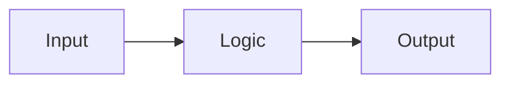
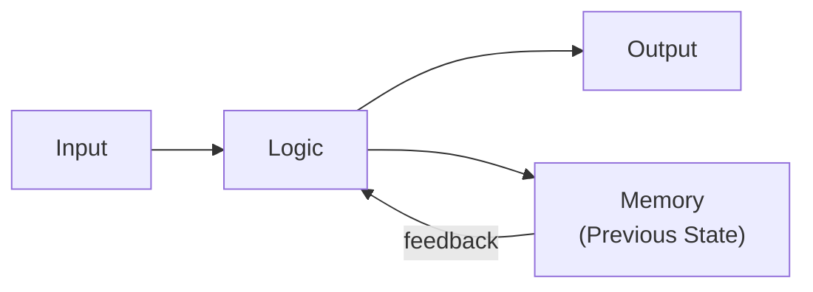
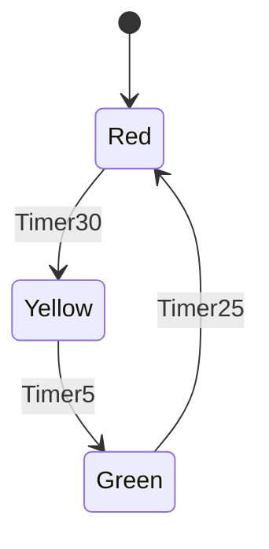
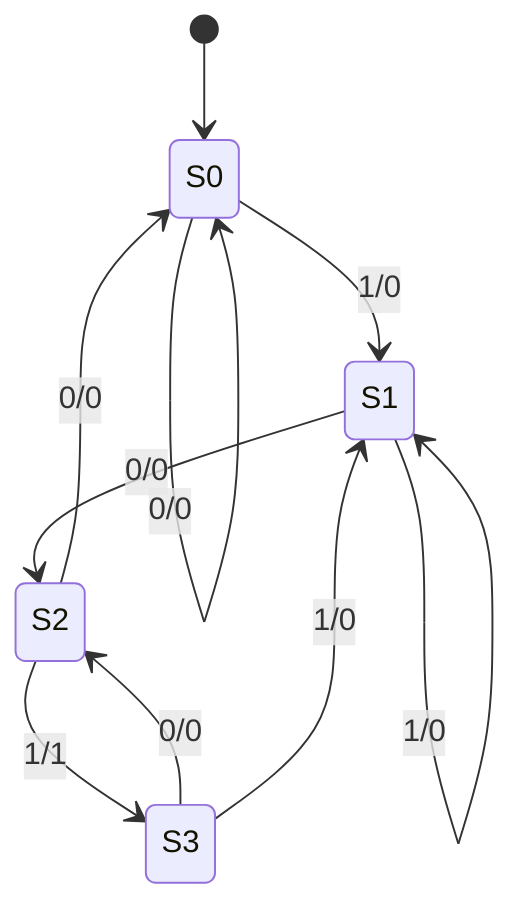

# 🔄 Chapter 4: Build Your Own Memory Circuits
## Flip-Flops থেকে FSM - তোমার Processor কে Memory দাও!

> **"Combinational circuits compute. Sequential circuits remember. Time to add memory!"**
>
> **"Combinational circuits হিসাব করে। Sequential circuits মনে রাখে। এবার memory যোগ করো!"**

---

## 🎯 এই Chapter-এ তুমি বানাবে:

আগের chapter-এ তুমি এমন circuit বানিয়েছিলে যেগুলো শুধু *হিসাব* করতে পারে — input দিলে output দেয়, ব্যস। কিন্তু একটা সমস্যা ছিল: তারা কিছুই *মনে রাখতে* পারে না। একটা calculator যদি আগের সংখ্যাটা ভুলে যায়, তাহলে যোগ করবে কী করে? এই chapter-এ আমরা circuit-কে স্মৃতি (memory) দেব। আর স্মৃতি পাওয়া মানেই — তোমার processor-এর জন্মের প্রথম শ্বাস।

```
✅ SR Latch - তোমার প্রথম memory element
✅ D Latch - data storage
✅ D Flip-Flop - edge-triggered memory
✅ JK Flip-Flop - universal flip-flop
✅ T Flip-Flop - toggle flip-flop
✅ 4-bit Register - data storage
✅ Shift Register - data mover
✅ Counter - number generator
✅ Finite State Machine - তোমার processor-এর control! 🎉
```

**Time Required:** 2 weeks (3-4 hours/day)  
**Tools Needed:** CircuitVerse, Paper, Timing Diagrams

---

## 🚀 Quick Win - 5 মিনিটে তোমার First Memory!

তত্ত্ব পরে — আগে নিজের চোখে memory-র জাদুটা দেখো। মাত্র দুটো gate দিয়ে আমরা এমন একটা জিনিস বানাবো যেটা তুমি একবার "set" করে দিলে, হাত সরিয়ে নেওয়ার পরেও মান ধরে রাখে। ঠিক যেমন একটা switch — একবার টিপে দিলে আঙুল সরিয়ে নিলেও আলো জ্বলে থাকে।

### এখনই বানাও - SR Latch:

**যাও CircuitVerse.org-এ এবং:**

```
Components:
- 2 × NOR gates (বা 2 × NAND gates)
- 2 × Buttons (S, R)
- 2 × LEDs (Q, Q')

Circuit (Using NOR):
        S ──┐
            ├─[NOR]──┬── Q (output)
        ┌───┘        │
        │            │
        │            └──┐
        │               │
        └───[NOR]───────┤
            ├───────────┘
        R ──┘        
                     └── Q' (complement)

Test:
1. Press S → Q=1 (SET) ✓
2. Release S → Q stays 1 (MEMORY!) ✓✓
3. Press R → Q=0 (RESET) ✓
4. Release R → Q stays 0 (MEMORY!) ✓✓
```

খেয়াল করো test-এর ২ আর ৪ নম্বর ধাপ — এখানেই আসল ম্যাজিক। তুমি button ছেড়ে দিয়েছো, input আর নেই, তবু output আগের মান **ধরে রেখেছে**। এটাই memory। আগের কোনো circuit এটা পারত না; input সরালেই output উধাও হয়ে যেত।

🎉 **Congratulations! তুমি একটা memory element বানিয়েছো!**

**এটাই তোমার processor-এর register-এর foundation!** তোমার CPU-র ভেতরে যে ৩২টা register data ধরে রাখে, তাদের প্রত্যেকটা bit এই একই ধারণার উপর দাঁড়িয়ে আছে — শুধু আরও পরিশীলিত রূপে।

---

## ৪.১ Sequential Circuits কী?

### Combinational vs Sequential:

এই দুটো শব্দের পার্থক্যটা একবার ভালো করে বুঝে নিলে গোটা chapter সহজ হয়ে যাবে। তাই একটু সময় নাও।

একটা **combinational** circuit হলো অনেকটা ক্যালকুলেটরের মতো — তুমি যা চাপো, সেই অনুযায়ী তখনই উত্তর দেয়। output শুধু *এই মুহূর্তের* input-এর উপর নির্ভর করে, অতীতের সাথে তার কোনো সম্পর্ক নেই। ২ + ৩ চাপলে সবসময় ৫, তা তুমি আগে যা-ই করে থাকো না কেন।

একটা **sequential** circuit হলো অনেকটা মানুষের স্মৃতির মতো — তুমি এখন কী করবে তা শুধু এই মুহূর্তের পরিস্থিতির উপর নয়, *আগে কী ঘটেছিল* তার উপরেও নির্ভর করে। লিফটে "৩" চাপলে কী হবে, তা নির্ভর করে লিফট এখন কোন তলায় আছে তার উপর — অর্থাৎ তার বর্তমান **state**-এর উপর।

**Combinational (Chapter 3) — কোনো memory নেই, `Output = f(Current Input)`:**



**Sequential (এই Chapter) — memory আছে, `Output = f(Current Input, Previous State)`:**



মূল কথাটা ওই দুটো সমীকরণেই লুকিয়ে। combinational-এ output হলো শুধু input-এর function। কিন্তু sequential-এ output হলো input **এবং** previous state — দুটোরই function। ওই feedback তীরটা, যেটা output থেকে ঘুরে আবার memory হয়ে ভেতরে ঢুকছে — ওটাই অতীতকে বর্তমানে নিয়ে আসছে। এই ছোট্ট লুপটাই combinational আর sequential-এর মধ্যে আকাশ-পাতাল ব্যবধান তৈরি করে।

### কেন Sequential?

প্রশ্ন আসতেই পারে — "শুধু হিসাব করতে পারলেই তো হতো, মনে রাখার দরকার কী?" উত্তরটা হলো: মনে রাখতে না পারলে **কোনো processor-ই বানানো যায় না**। ভেবে দেখো —

```
Processor-এ দরকার:
✅ Registers - data store করতে
✅ Program Counter - next instruction track করতে
✅ State machines - control logic-এর জন্য
✅ Memory - data remember করতে

Without Sequential = No Processor!
```

Program Counter-কেই ধরো: তাকে মনে রাখতে হয় এখন কোন instruction চলছে, যাতে পরেরটা কোথায় তা সে জানতে পারে। যদি সে আগেরটা ভুলে যায়, processor জানবেই না এরপর কী করতে হবে। তাই sequential circuit কোনো বিলাসিতা নয় — এটা processor-এর মেরুদণ্ড।

### Clock Signal - The Heartbeat:

এখন একটা নতুন আর অত্যন্ত জরুরি ধারণা — **clock**। কল্পনা করো একটা বিশাল অর্কেস্ট্রা, যেখানে শত শত বাদক বাজাচ্ছে। যদি প্রত্যেকে নিজের খুশিমতো গতিতে বাজায়, তাহলে পুরোটা হবে বিশৃঙ্খল শব্দ। তাই একজন conductor থাকেন, যিনি একটা নির্দিষ্ট তালে লাঠি নাড়েন — আর সবাই সেই তালেই বাজায়। Clock হলো তোমার circuit-এর সেই conductor।

Clock একটা signal যা নিয়ম করে 0 আর 1-এর মধ্যে ওঠানামা করে — টিক, টক, টিক, টক। আর নিয়মটা হলো: **সব কিছু ঘটে clock-এর "edge"-এ** — অর্থাৎ যে মুহূর্তে signal-টা 0 থেকে 1-এ লাফ দেয় (বা উল্টোটা)। এই একটা নিয়ম গোটা circuit-কে শৃঙ্খলায় বাঁধে, সবাইকে একসাথে পা মেলাতে বাধ্য করে।

```
Clock (CLK):
     ┌───┐   ┌───┐   ┌───┐
     │   │   │   │   │   │
─────┘   └───┘   └───┘   └───

Everything happens at clock edges!

Rising Edge:  ─┐ (0→1)
              └
              
Falling Edge:   ┌─ (1→0)
              ──┘
```

দুটো শব্দ মনে রাখো — **rising edge** (0→1, যখন signal উপরে উঠছে) আর **falling edge** (1→0, যখন নিচে নামছে)। আমাদের বেশিরভাগ circuit rising edge-এ কাজ করবে। প্রতি edge-এ flip-flop-গুলো একসাথে "ছবি তোলে" — সেই মুহূর্তের input ধরে রাখে, আর পরের edge পর্যন্ত সেই মানেই স্থির থাকে। এই তালে চলাকেই বলে **synchronous** design, আর এটাই নির্ভরযোগ্য circuit বানানোর সবচেয়ে গুরুত্বপূর্ণ অভ্যাস।

---

## ৪.২ Build SR Latch - Foundation of Memory

### কিভাবে কাজ করে?

এবার সেই Quick Win-এ বানানো SR Latch-টাকে একটু গভীরভাবে বুঝি। "Latch" শব্দের অর্থ ছিটকিনি — দরজার যে ছিটকিনি একবার আটকে দিলে আটকেই থাকে, খুলে না দেওয়া পর্যন্ত। আমাদের memory element-ও ঠিক তাই করে: একবার একটা মান set করে দিলে, সেটা latch হয়ে আটকে থাকে।

**SR Latch = Set-Reset Latch**

নামটাই বলে দিচ্ছে এর দুটো কাজ — **Set** (মান 1 করা) আর **Reset** (মান 0 করা)।

```
Inputs:
- S (Set): Makes Q = 1
- R (Reset): Makes Q = 0

Output:
- Q: Main output
- Q': Complement (always opposite of Q)
```

এর দুটো output — Q আর Q'। মজার ব্যাপার হলো, Q' সবসময় Q-এর ঠিক উল্টো। Q যদি 1 হয়, Q' হবে 0; Q যদি 0 হয়, Q' হবে 1। এই দুই output পরস্পরকে feedback দিয়ে ধরে রাখে — একে অপরের পিঠে হাত রেখে দাঁড়িয়ে থাকা দুই বন্ধুর মতো। এই পারস্পরিক নির্ভরতাই memory তৈরি করে।

### Using NOR Gates:

প্রথমে দুটো NOR gate দিয়ে বানানো version দেখি। লক্ষ করো — একটা gate-এর output আরেকটা gate-এর input-এ ফিরে যাচ্ছে। এই cross-coupled (আড়াআড়ি জোড়া) গঠনই হলো feedback-এর উৎস।

**Circuit:**
```
    S ──┐
        ├─[NOR]──┬── Q
    ┌───┘        │
    │            │
    │         feedback
    │            │
    └───[NOR]────┤
        ├────────┘
    R ──┘        
                └── Q'
```

**Truth Table:**

NOR-based SR latch-এর আচরণটা পড়ে দেখো — চারটে সম্ভাব্য input combination-এর জন্য চারটে ফলাফল:

| S | R | Q | Description |
|---|---|---|---|
| 0 | 0 | Hold | Remember previous ← **Memory!** |
| 0 | 1 | 0 | Reset Q to 0 |
| 1 | 0 | 1 | Set Q to 1 |
| 1 | 1 | ??? | Invalid! (avoid) |

প্রতিটা সারির গল্পটা বুঝে নাও। **S=0, R=0** — কাউকে কিছু বলছ না, তাই latch আগের মান *ধরে রাখে*; এই সারিটাই memory-র প্রাণ। **S=0, R=1** — Reset চাপলে Q হয় 0। **S=1, R=0** — Set চাপলে Q হয় 1। কিন্তু শেষ সারিটা বিপজ্জনক:

> ⚠️ **S=1, R=1 কেন invalid?** তুমি একইসাথে "মান 1 করো" আর "মান 0 করো" — দুটো বিপরীত আদেশ দিচ্ছ। NOR latch তখন Q আর Q' দুটোকেই 0 করার চেষ্টা করে, অথচ এদের তো একে অপরের উল্টো হওয়ার কথা! এই দ্বন্দ্বের কারণে output আর নির্ভরযোগ্য থাকে না, আর এই অবস্থা থেকে বেরোনোর সময় কী হবে তা আগে থেকে বলা যায় না। তাই এই combination-টা এড়িয়ে চলো — এটাই SR latch-এর সবচেয়ে বড় দুর্বলতা।

```
Invalid state: Both outputs try to be 0!
```

### Using NAND Gates:

একই latch দুটো NAND gate দিয়েও বানানো যায়। গঠন প্রায় একই — সেই cross-coupled feedback — কিন্তু একটা মোচড় আছে: এখানে input-গুলো **active LOW**, অর্থাৎ কাজটা ঘটে input 1 নয়, 0 দিলে।

**Circuit:**
```
    S ──┐
        ├─[NAND]──┬── Q
    ┌───┘         │
    │             │
    │             │
    │             │
    └───[NAND]────┤
        ├─────────┘
    R ──┘         
                 └── Q'

Note: NAND version - inputs are active LOW
```

বাস্তবে NAND-based latch বেশি জনপ্রিয়, কারণ chip-এ NAND gate বানানো সবচেয়ে সস্তা আর সহজ। তবে "active LOW" ব্যাপারটা মাথায় রেখো — না হলে behavior উল্টো মনে হবে আর তুমি ভাববে circuit ভুল হয়েছে।

### 🎯 Build & Test SR Latch:

এবার নিজের হাতে দুটো version-ই বানাও। দুটো পাশাপাশি বানালে তুমি নিজের চোখে দেখবে কীভাবে একই কাজ আলাদা gate দিয়ে, আলাদা যুক্তিতে করা যায় — এটা একজন ভালো designer-এর intuition গড়ে তোলে।

**Build Both Versions:**
```
Task 1: NOR-based SR Latch
- Build circuit
- Test all 4 input combinations
- Observe memory behavior!

Task 2: NAND-based SR Latch  
- Build circuit
- Note: Active LOW inputs
- Compare with NOR version
```

নিচের sequence-টা ধাপে ধাপে চালাও আর প্রতিটা ধাপে LED-র দিকে তাকাও। বিশেষ করে ৩ আর ৫ নম্বর ধাপে — যেখানে S আর R দুটোই 0, অথচ Q আগের মান ধরে রেখেছে। ওখানেই তুমি memory-কে চোখের সামনে কাজ করতে দেখবে।

**Test Sequence:**
```
1. S=0, R=0: Q = ? (check previous state)
2. S=1, R=0: Q = 1 (SET)
3. S=0, R=0: Q = 1 (HOLDS!) ✓✓
4. S=0, R=1: Q = 0 (RESET)
5. S=0, R=0: Q = 0 (HOLDS!) ✓✓
```

---

## ৪.৩ Build D Latch - Data Latch

### Problem with SR Latch:

SR Latch দারুণ, কিন্তু রোজকার ব্যবহারে একটু ঝামেলার। ভাবো — তুমি শুধু একটা bit রাখতে চাও (0 বা 1), অথচ তোমাকে দুটো আলাদা তার (S আর R) সামলাতে হচ্ছে, আর সারাক্ষণ মনে রাখতে হচ্ছে যেন ভুলেও দুটো একসাথে 1 না হয়ে যায়। এটা যেন একটা গাড়ি চালাতে আলাদা accelerator আর আলাদা "গতি কমাও" pedal — কিন্তু দুটো একসাথে চাপলে গাড়ি ভেঙে পড়ে।

```
❌ Two inputs (S, R) confusing
❌ Invalid state (S=1, R=1)
❌ Need simpler interface

Solution: D Latch!
✅ One data input (D)
✅ One enable input (E)
✅ No invalid states
```

**D Latch** এই সমস্যার সুন্দর সমাধান। এখানে দুটো input: একটা **D** (Data — তুমি যে bit রাখতে চাও) আর একটা **E** (Enable — কখন রাখবে)। আর সবচেয়ে বড় কথা — invalid state বলে কিছু নেই, কারণ আমরা ডিজাইন করেই S=R=1 হওয়াটা অসম্ভব করে দিয়েছি।

### Circuit Design:

কৌশলটা চমৎকার সরল। আমরা SR latch-টাকেই ভেতরে রেখে দিই, কিন্তু তার সামনে একটু logic বসাই যাতে S আর R কখনোই একসাথে 1 না হয়। D সরাসরি যায় S-এ, আর D-এর উল্টো (D') যায় R-এ। ফলে D=1 হলে S=1, R=0 (Set); আর D=0 হলে S=0, R=1 (Reset)। দুটোর একটা সবসময় 0 — তাই invalid state আর তৈরিই হতে পারে না!

```
Data (D) ──┬────────[AND]───── S  ┐
           │            ↑         │
           │            E         │
           │                      ├─[SR Latch]── Q
           │                      │
           └─[NOT]─[AND]───── R  ┘
                       ↑
                       E

When E=1: Q follows D
When E=0: Q holds previous value
```

ওই দুটো AND gate-এর ভূমিকাটাও বুঝে নাও। E (Enable) দুটো AND gate-কেই নিয়ন্ত্রণ করে। E=0 হলে দুটো AND-ই বন্ধ — S আর R দুটোই 0 হয়ে যায়, তাই latch আগের মান ধরে রাখে, D যা-ই হোক না কেন। E=1 হলে দরজা খুলে যায় — তখন D-র মান সোজা latch-এ গিয়ে পৌঁছায়। তাই E যেন একটা গেট-কিপার: সে ঠিক করে কখন নতুন data ঢুকতে পারবে।

**Truth Table:**

| E | D | Q | Description |
|---|---|---|---|
| 0 | X | Hold | Ignore D, remember |
| 1 | 0 | 0 | Q becomes 0 |
| 1 | 1 | 1 | Q becomes 1 |

(এখানে **X = Don't care** — অর্থাৎ E=0 হলে D-এর মান যা-ই হোক, কোনো প্রভাব নেই।)

লক্ষ করো E=1 হলে Q হুবহু D-কে অনুসরণ করে — D যা, Q-ও তাই। এই অবস্থাকে বলে **transparent** (স্বচ্ছ), কারণ D-র মান যেন কাচের মতো সোজা Q-তে দেখা যায়।

### Timing Diagram:

এবার সময়ের সাথে এই behavior-টা waveform-এ দেখি। নিচের diagram-এ তিনটে signal — উপরে E, মাঝে D, নিচে Q। চোখ রাখো E যখন high (1) তখন Q কীভাবে D-কে নকল করছে, আর E low (0) হলেই Q কেমন জমে যাচ্ছে।

```
     ┌───────┐       ┌───────
E ───┘       └───────┘

   ┌───┐       ┌─────┐
D ─┘   └───────┘     └────

       ┌───────────┐     ┌──
Q ─────┘           └─────┘

When E=1: Q follows D (transparent)
When E=0: Q freezes
```

এখানেই D latch-এর একটা ছোট দুর্বলতা লুকিয়ে — E=1 থাকা পুরো সময়টা জুড়ে Q, D-এর সব পরিবর্তন অনুসরণ করে। অর্থাৎ E চালু থাকা অবস্থায় D যদি কাঁপে, Q-ও কাঁপবে। অনেক ক্ষেত্রে আমরা চাই Q ঠিক *একটা নির্দিষ্ট মুহূর্তে* মান নিক, তারপর স্থির থাকুক। এই চাওয়াটাই আমাদের পরের ধাপে — flip-flop-এ — নিয়ে যাবে।

### 🎯 Build D Latch:

আগের section-এ বানানো SR latch-টাই এখানে কাজে লাগবে — তার সামনে শুধু একটা NOT gate আর দুটো AND gate জুড়ে দিলেই D latch তৈরি। এভাবে ছোট building block জোড়া দিয়ে বড় কিছু বানানো — এটাই digital design-এর মূল সুর। তুমি বারবার দেখবে, প্রতিটা নতুন জিনিস আগেরটার উপর দাঁড়িয়ে।

**Step-by-step:**
```
1. Build SR Latch (from previous section)
2. Add NOT gate for D
3. Add 2 AND gates
4. Connect: D → AND → S, D'→ AND → R
5. Connect E to both ANDs
6. Test with timing sequence!
```

---

## ৪.৪ Build D Flip-Flop - Edge-Triggered Memory! 🎉

### Problem with D Latch:

D Latch-এর সেই সমস্যাটা মনে আছে? E=1 থাকা পুরো সময়টা জুড়ে Q, D-কে অনুসরণ করে। একে বলে **level-triggered** — যতক্ষণ enable-এর level high, ততক্ষণ latch খোলা।

```
D Latch (Level-triggered):
- When E=1: Q continuously follows D
- Problem: No precise control
- Data can change during E=1

Need: Edge-triggered!
- Only change at clock edge
- Precise timing control
```

কেন এটা সমস্যা? কল্পনা করো একটা camera যার shutter এক সেকেন্ড খোলা থাকে। ওই এক সেকেন্ডে subject নড়াচড়া করলে ছবি ঝাপসা হবে। কিন্তু shutter যদি এক চিমটি সময়ের জন্য খোলে — ঠিক একটা *মুহূর্তে* — তাহলে গতিশীল জিনিসও স্থির, পরিষ্কার ধরা পড়বে। আমাদের memory-রও তেমন একটা "চিমটি-শাটার" দরকার যা ঠিক clock edge-এ একবারই ছবি তোলে।

### D Flip-Flop Solution:

সেই চিমটি-শাটারের নামই **Flip-Flop**। Latch আর flip-flop-এর পার্থক্যটা একেবারে মনে গেঁথে নাও — latch level-triggered (যতক্ষণ enable high), কিন্তু flip-flop **edge-triggered** (শুধু clock-এর সেই লাফ দেওয়ার মুহূর্তে)।

```
Features:
✅ Changes only at clock edge (rising or falling)
✅ Ignores input at other times
✅ Perfect for registers!
✅ Synchronous operation
```

edge ছাড়া বাকি পুরোটা সময় flip-flop input-কে পাত্তাই দেয় না — সে শান্তভাবে আগের মান ধরে রাখে। এই precise timing-ই তোমার CPU-র প্রতিটা register-কে নির্ভরযোগ্য করে তোলে, আর তাই flip-flop হলো processor-এর আসল memory cell।

### Master-Slave D Flip-Flop:

কিন্তু edge-triggered behavior পাবো কোথা থেকে? একটা সুন্দর কৌশল আছে — **দুটো D latch পরপর বসিয়ে দাও**, আর একটাকে clock দাও সোজা, অন্যটাকে clock-এর উল্টো (CLK')। এদের নাম **Master** আর **Slave**।

**Circuit:**
```
           ┌──────────┐  ┌──────────┐
D ─────────┤  Master  ├──┤  Slave   ├──── Q
           │ D Latch  │  │ D Latch  │
CLK ───┬───┤ E        │  │ E        │
       │   └──────────┘  └──────────┘
       │        ↑             ↑
       │        │             │
       │       CLK           CLK'
       └─[NOT]──┘

Master active when CLK=1
Slave active when CLK=0
Output changes at falling edge!
```

কৌশলটার সৌন্দর্য হলো — দুটো latch কখনো একসাথে খোলা থাকে না, একটা খুললে অন্যটা বন্ধ। এই হাতবদলের নাচটাই edge তৈরি করে।

**Operation:**
```
CLK high (1):
- Master latch transparent (captures D)
- Slave latch holds (outputs old value)

CLK low (0):  ← Falling Edge
- Master latch holds (captured value)
- Slave latch transparent (outputs to Q)

Result: Q changes at falling edge!
```

ধাপে ধাপে বুঝি। CLK যখন high — Master খোলা, সে D-র মান ভেতরে নিয়ে নেয়; কিন্তু Slave তখন বন্ধ, তাই বাইরের Q এখনো পুরোনো মানই দেখাচ্ছে। এবার CLK low হলো — Master দরজা বন্ধ করে দিল, ভেতরে ধরা মানটা আটকে গেল; আর ঠিক সেই মুহূর্তে Slave খুলল আর সেই আটকে রাখা মানটা Q-তে পৌঁছে দিল। ফলাফল? Q পাল্টায় শুধু এই হাতবদলের মুহূর্তে — অর্থাৎ একটা নির্দিষ্ট **edge**-এ। এই বিশেষ গঠনে output বদলায় falling edge-এ।

### Positive Edge-Triggered D Flip-Flop:

বাস্তবে আমরা সাধারণত **positive (rising) edge**-এ trigger হওয়া flip-flop ব্যবহার করি — অর্থাৎ clock যখন 0 থেকে 1-এ ওঠে তখন ছবি তোলে। কাজের সময় তুমি প্রতিবার gate গুনে latch জোড়া দিও না; এর একটা সংক্ষিপ্ত প্রতীক (symbol) আছে।

**Symbol:**
```
       ┌─────┐
D ─────┤     │
       │  D  ├──── Q
CLK ───┤>    │
       │     ├──── Q'
       └─────┘
       
> = Edge trigger
```

CLK-এর পাশে ওই ছোট্ট ত্রিভুজ চিহ্নটা (`>`) মনে রেখো — এটাই বলে দেয় "আমি edge-triggered"। যখনই কোনো symbol-এ এই চিহ্ন দেখবে, বুঝবে এটা flip-flop, latch নয়।

**Timing Diagram:**

এবার rising-edge flip-flop-এর waveform দেখো। নিচের তীরগুলো (↑) দেখাচ্ছে rising edge-গুলো কোথায়। লক্ষ করো — Q **শুধুমাত্র** ওই তীরের মুহূর্তগুলোতেই পাল্টায়, আর edge-এর ঠিক ওই মুহূর্তে D-র যা মান, Q সেটাই ধরে রাখে। edge-গুলোর মাঝখানে D যতই কাঁপুক, Q ঘুরেও তাকায় না।

```
CLK  ───┐   ┌───┐   ┌───┐
        └───┘   └───┘   └───
        ↑       ↑       ↑  (Trigger points)

D    ──┐   ┌───────┐
       └───┘       └───────

Q    ────┐       ┌─────────
         └───────┘
         ↑       ↑  (Changes at rising edges)
```

D latch-এর timing diagram-টার সাথে এটা মিলিয়ে দেখো — পার্থক্যটা স্পষ্ট। সেখানে Q ছিল D-র ছায়া, সারাক্ষণ নকল করত। এখানে Q শৃঙ্খলাবদ্ধ — ঘড়ির কাঁটার তালে, ঠিক ঠিক সময়ে, একবার করে মান নেয়। এই শৃঙ্খলাই synchronous design-কে নির্ভরযোগ্য করে।

### 🎯 Build D Flip-Flop:

নিজে বানানোর সময় আগের section-এর দুটো D latch-ই কাজে লাগাও, মাঝে একটা NOT gate দিয়ে clock উল্টে দাও। তারপর slow clock দিয়ে চালিয়ে edge-এ output বদলানোটা চোখে দেখো।

**Build Master-Slave:**
```
Components:
- 2 × D Latches (master & slave)
- 1 × NOT gate (for clock)
- 1 × Clock generator

Steps:
1. Build two D Latches
2. Connect CLK to master enable
3. Connect CLK' to slave enable
4. Connect master output to slave input
5. Test with clock pulses!
```

নিচের test table-টা একদম মন দিয়ে পড়ো — এটা পুরো গল্পটা একসাথে দেখায়। খেয়াল করো, Master কখন (CLK=1) D ধরছে আর Slave কখন (CLK=0, অর্থাৎ edge-এ) সেটা Q-তে বার করছে। Q-এর মান সবসময় তার ঠিক আগের cycle-এ Master যা ধরেছিল, তার এক ধাপ পিছিয়ে অনুসরণ করছে — এটাই edge-triggered memory-র স্বাক্ষর।

```
Time | CLK | D | Q | Notes
-----|-----|---|---|----------------------
  0  |  0  | 0 | X | Initial
  1  |  1  | 0 | X | Master captures 0
  2  |  0  | 0 | 0 | Slave outputs (edge!)
  3  |  1  | 1 | 0 | Master captures 1
  4  |  0  | 1 | 1 | Slave outputs (edge!)
  5  |  1  | 0 | 1 | Master captures 0
  6  |  0  | 0 | 0 | Slave outputs (edge!)
```

---

## ৪.৫ Build JK Flip-Flop - The Universal One!

### Why JK?

D flip-flop সরল আর চমৎকার, কিন্তু একটা জিনিস সে সহজে পারে না — **toggle** (মান উল্টে দেওয়া, 0 হলে 1, 1 হলে 0)। অথচ counter, frequency divider — এসব বানাতে toggle খুবই দরকার। এখানেই আসে **JK flip-flop**, যাকে অনেকে "universal flip-flop" বলে, কারণ সে একাই চারটে কাজ পারে।

```
D Flip-Flop:
✅ Simple
❌ Can't toggle easily

JK Flip-Flop:
✅ Can SET
✅ Can RESET  
✅ Can TOGGLE
✅ Can HOLD
✅ Most versatile!
```

JK-কে অনেকটা উন্নত SR flip-flop ভাবতে পারো — SR-এর সেই বিপজ্জনক "দুটো input একসাথে 1" অবস্থাটাকে JK একটা কাজে লাগিয়ে দিয়েছে। SR-এ যেটা ছিল invalid, JK-তে সেটাই হয়ে গেছে দরকারি toggle। সমস্যাকে সুযোগে বদলে দেওয়া — দারুণ একটা engineering চাল!

### Truth Table:

JK-র চারটে মোড পড়ে দেখো। এখানে নতুন একটা notation আসছে — Q(t) মানে *এখনকার* মান, আর Q(t+1) মানে clock edge-এর *পরের* মান।

| J | K | Q(t+1) | Operation |
|---|---|--------|-----------|
| 0 | 0 | Q(t) | Hold (no change) |
| 0 | 1 | 0 | Reset |
| 1 | 0 | 1 | Set |
| 1 | 1 | Q'(t) | Toggle ← **Special!** |

(এখানে **Q(t) = current state** এবং **Q(t+1) = next state after clock edge**।)

প্রথম তিনটে সারি চেনা — Hold, Reset, Set, ঠিক SR-এর মতো। কিন্তু শেষ সারিটাই JK-র মুকুট: **J=1, K=1 দিলে Q উল্টে যায়** (Q' হয়ে যায়)। আগে 1 ছিল তো এখন 0, আগে 0 ছিল তো এখন 1। প্রতি clock edge-এ ফ্লিপ। এই একটা ক্ষমতা JK-কে অসম্ভব বহুমুখী করে তোলে।

### Circuit (from SR Flip-Flop):

JK আসলে একটা SR flip-flop, যার সামনে feedback জুড়ে দেওয়া হয়েছে — Q ফিরে যাচ্ছে K-এর AND gate-এ, আর Q' ফিরে যাচ্ছে J-এর AND gate-এ। এই feedback-ই J=K=1 অবস্থায় toggle ঘটায়: যেহেতু Q আর Q' সবসময় উল্টো, feedback নিশ্চিত করে প্রতিবার ঠিক উল্টো দিকে set/reset হয়।

```
J ──┬───[AND]───── S  ┐
    │      ↑          │
    │      │          │
    │    Q' (feedback)│
    │                 ├─[SR FF]── Q
    │                 │      ↑
    └──────────────────────Q'│
                        │     │
K ──┬───[AND]───── R  ┘     │
    │      ↑                 │
    │      │                 │
    │    Q (feedback) ←──────┘
    
CLK ──→ (to SR FF clock)
```

### Applications:

চারটে মোডের প্রত্যেকটার বাস্তব ব্যবহার আছে — এই table-টা তোমাকে মনে করিয়ে দেবে কোন মোড কোথায় কাজে লাগে:

```
J=0, K=0: Hold → Memory storage
J=0, K=1: Reset → Clear register
J=1, K=0: Set → Load data
J=1, K=1: Toggle → Frequency divider, counters
```

ওই শেষ লাইনটাই — Toggle — পরের কয়েকটা section-এর ভিত্তি। counter আর frequency divider পুরোপুরি এই toggle ক্ষমতার উপর দাঁড়িয়ে।

### 🎯 Build JK Flip-Flop:

**Method 1: From SR FF**
```
1. Take SR flip-flop
2. Add feedback (Q to K's AND, Q' to J's AND)
3. Add AND gates for J and K inputs
4. Connect to SR inputs
5. Test all 4 modes!
```

চারটে মোডই আলাদা করে পরীক্ষা করো — বিশেষ করে Toggle মোডটা দুবার চালাও (একবার Q=0 থেকে, একবার Q=1 থেকে) যাতে দুদিকেই উল্টানো দেখতে পাও। নিচের test-গুলো প্রতিটা মোডের একটা করে নমুনা:

**Test All Modes:**
```
Mode 1 - Hold:
J=0, K=0, Q=1 → After clock: Q=1 ✓

Mode 2 - Reset:
J=0, K=1, Q=1 → After clock: Q=0 ✓

Mode 3 - Set:
J=1, K=0, Q=0 → After clock: Q=1 ✓

Mode 4 - Toggle:
J=1, K=1, Q=0 → After clock: Q=1 ✓
J=1, K=1, Q=1 → After clock: Q=0 ✓
```

---

## ৪.৬ Build T Flip-Flop - The Toggle Master

### Simple Toggle!

কখনো কখনো তোমার শুধু একটাই কাজ দরকার — toggle। তখন JK-র দুটো input (J, K) সামলানোটা বাহুল্য মনে হয়। তাই বানানো হলো **T flip-flop** (T = Toggle) — একটামাত্র input দিয়ে দুটো কাজ: ধরে রাখা, নয়তো উল্টে দেওয়া।

```
T Flip-Flop = Toggle Flip-Flop
One input (T), one clock

T=0: Hold
T=1: Toggle (flip Q)
```

নিয়মটা সহজ — T=0 হলে কিছু বদলায় না, T=1 হলে প্রতি clock edge-এ Q উল্টে যায়। এটাই সবচেয়ে সরল flip-flop যা দিয়ে সরাসরি counter বানানো যায়।

### Truth Table:

| T | Q(t+1) | Operation |
|---|--------|-----------|
| 0 | Q(t) | Hold |
| 1 | Q'(t) | Toggle |

মাত্র দুটো সারি — এর চেয়ে সরল আর হয় না। এই দুটো সারির পেছনের গল্পটাই (T=1 মানে উল্টে যাও) আমরা একটু পরে binary গোনার কাজে লাগাবো।

### Build from JK:

T flip-flop আলাদা করে বানানোর দরকারই নেই — JK-র সেই Toggle মোডটাই তো আমাদের দরকার! JK-তে যখন J আর K দুটোই 1, তখন প্রতি edge-এ toggle হয়। তাই J আর K-কে একসাথে জুড়ে দাও, আর সেই জোড়া তারটার নাম দাও T। ব্যস।

```
       T ──┬── J  ┐
           │       │
           └── K  ├─[JK FF]── Q
                  │
CLK ───────────────┘

Simply connect J=K=T!
```

বুঝে নাও — T=1 দিলে J=K=1 হয়ে toggle ঘটে, আর T=0 দিলে J=K=0 হয়ে hold হয়। ঠিক যেমনটা চাই।

### Build from D:

D flip-flop দিয়েও T বানানো যায়, আর এই কৌশলটা একটু চালাক। আমরা চাই প্রতি edge-এ Q উল্টে যাক — অর্থাৎ পরের মান হোক বর্তমান মানের উল্টো। একটা XOR gate দিয়ে এটা করা যায়: **D = T ⊕ Q**।

```
       Q ───┬──[XOR]── D  ┐
            │             │
       T ───┘             ├─[D FF]── Q
                          │
CLK ───────────────────────┘

D = T ⊕ Q
```

XOR-এর ধর্মটা মনে করো — T=0 হলে `D = 0 ⊕ Q = Q` (মান একই থাকে, hold)। T=1 হলে `D = 1 ⊕ Q = Q'` (মান উল্টে যায়, toggle)। সেই একই toggle behavior, কিন্তু এবার D flip-flop আর একটা XOR দিয়ে। একই গন্তব্যে পৌঁছানোর দুটো ভিন্ন পথ — এটাই দেখায় digital design-এ কত স্বাধীনতা আছে।

### Application - Frequency Divider:

T flip-flop-এর সবচেয়ে সুন্দর ব্যবহার — **frequency divider**। T=1 ধরে রাখলে Q প্রতি clock edge-এ উল্টায়। এর মানে Q-কে একবার high আর একবার low হতে দুটো clock cycle লাগে। অর্থাৎ Q-এর frequency input clock-এর ঠিক **অর্ধেক**!

```
Input:  ┌─┐ ┌─┐ ┌─┐ ┌─┐  (4 cycles)
CLK ────┘ └─┘ └─┘ └─┘ └─

T=1 (always toggle)

Output: ┌───────┐         (2 cycles)
Q ──────┘       └──────

Divides frequency by 2!
```

waveform-টা দেখো — উপরে input clock-এর চারটে cycle, নিচে Q-র মাত্র দুটো cycle। প্রতিটা T flip-flop frequency-কে ঠিক অর্ধেক করে দেয় (÷2)। এটা ভীষণ কাজের: তোমার FPGA-র clock যদি অনেক দ্রুত হয়, তবে কয়েকটা T flip-flop জুড়ে তুমি সেটাকে চোখে দেখার মতো ধীর করে নিতে পারো।

### 🎯 Build T Flip-Flop:

**Build Both Methods:**
```
1. From JK: Connect J=K=T
2. From D: Add XOR gate
3. Test both
4. Build frequency divider chain!
```

আসল মজাটা শেষ ধাপে — কয়েকটা T flip-flop পরপর জুড়ে একটা chain বানাও, যেখানে একটার output পরেরটার clock হয়। প্রতিটা ঘর frequency অর্ধেক করে, তাই চারটে জুড়লে মোট ভাগ হয় ÷16:

**Frequency Divider Chain:**
```
CLK ──[T-FF]──[T-FF]──[T-FF]──[T-FF]
       ÷2      ÷2      ÷2      ÷2
       
Total division: ÷16
```

একটু খেয়াল করো — এই chain-টা কিন্তু আসলে একটা counter-ও বটে! প্রতিটা flip-flop binary-র একেকটা bit। এটাই আমাদের পরের section-এ নিয়ে যাচ্ছে।

---

## ৪.৭ Build Registers - Data Storage

### What's a Register?

এতক্ষণ আমরা একটা একটা করে bit ধরে রাখা শিখলাম। কিন্তু বাস্তবে data তো একটা bit নয় — একটা সংখ্যা মানে অনেকগুলো bit একসাথে। তাহলে কী করব? সহজ — **কয়েকটা flip-flop পাশাপাশি বসিয়ে দাও**, প্রত্যেকে একটা করে bit ধরবে। এই দলবদ্ধ flip-flop-এর নামই **register**।

```
Register = Collection of flip-flops
Stores multi-bit data

4-bit Register = 4 × D Flip-Flops
8-bit Register = 8 × D Flip-Flops
32-bit Register = 32 × D Flip-Flops (in your CPU!)
```

ব্যাপারটা একদম straightforward — ৪ bit রাখতে ৪টা flip-flop, ৮ bit-এ ৮টা। আর তোমার RISC-V CPU-র প্রতিটা register? ঠিক ধরেছ — **৩২টা D flip-flop** একসাথে, একটা ৩২-bit সংখ্যা ধরে রাখার জন্য। আজকে তুমি যে ছোট ৪-bit register বানাবে, সেটার গঠনই scale up করে CPU-র register file হবে।

### 4-bit Register Design:

সবচেয়ে সরল register — চারটে D flip-flop, সবাই **একই clock** ভাগ করে নেয়। common clock-টাই আসল ব্যাপার: এতে চারটে bit একসাথে, একই মুহূর্তে update হয়। যদি একেকটা flip-flop আলাদা সময়ে update হতো, তবে data এলোমেলো হয়ে যেত।

**Circuit:**
```
D3 ───[D FF]─── Q3  ┐
      CLK ↑         │
D2 ───[D FF]─── Q2  │
      CLK ↑         ├─ 4-bit Output
D1 ───[D FF]─── Q1  │
      CLK ↑         │
D0 ───[D FF]─── Q0  ┘
      CLK ↑
       │
Common CLK ────┘
```

**With Enable:**

কিন্তু একটা সমস্যা আছে — উপরের সরল register প্রতি clock edge-এ নতুন data নিয়ে নেয়, চাই বা না চাই। অনেক সময় আমরা চাই register আগের মান *ধরে রাখুক*, যতক্ষণ না আমরা স্পষ্টভাবে "এখন নতুন data নাও" বলছি। এর জন্য চাই একটা **Enable (EN)** control। কৌশলটা সুন্দর — প্রতিটা bit-এর সামনে একটা MUX বসাও, যা EN দেখে ঠিক করে flip-flop-এ নতুন data যাবে নাকি তার নিজের পুরোনো output ফিরে যাবে।

```
        D3 ──┬──[MUX]──[D FF]── Q3
             │    ↑
         Q3 ─┘    │
                 EN
                 
When EN=1: Load new data
When EN=0: Hold current data

Apply to all 4 bits!
```

MUX-এর যুক্তিটা ধরো: EN=1 হলে MUX নতুন D বেছে নেয় (load); EN=0 হলে MUX flip-flop-এর নিজের Q-কে আবার ফেরত পাঠায় (hold)। অর্থাৎ EN=0 হলে register প্রতি edge-এ নিজের মানই নিজেকে আবার লেখে — বাইরে থেকে দেখলে মনে হয় কিছুই বদলায়নি। এই একই MUX-trick তুমি সব ৪টা bit-এ লাগাও।

### Register with Parallel Load:

একটা পূর্ণাঙ্গ register-এ আরও একটা সুবিধা যোগ করা হয় — **Clear (CLR)**, যা এক ঝটকায় সব bit 0 করে দেয়। তাহলে আমাদের তিনটে ক্ষমতা হলো:

```
Features:
✅ Load all bits simultaneously
✅ Enable control
✅ Clear/Reset
```

"Parallel load" মানে — চারটে bit একসাথে, এক clock edge-এ ঢুকে যায়, একটা একটা করে নয়। নিচের সম্পূর্ণ ৪-bit register-এ তুমি তিনটে control একসাথে দেখবে: CLR (সব সাফ), EN (নতুন data নেবে কি না), আর CLK (তাল):

**Complete 4-bit Register:**
```
             CLR (clear all)
              │
D3 ─[MUX]─[D FF]─ Q3
      ↑      ↑
D2 ─[MUX]─[D FF]─ Q2
      ↑      ↑
D1 ─[MUX]─[D FF]─ Q1
      ↑      ↑
D0 ─[MUX]─[D FF]─ Q0
      ↑      ↑
      │      │
     EN    CLK
```

এই গঠনটা মন দিয়ে দেখো — কারণ এটাই কার্যত তোমার CPU-র register file-এর একটা cell। শুধু bit সংখ্যা ৪ থেকে ৩২ হবে, আর এমন register অনেকগুলো পাশাপাশি বসবে। মূল নকশা ঠিক এটাই।

### 🎯 Build 4-bit Register:

**Build Steps:**
```
1. Create 4 × D Flip-Flops
2. Connect common clock
3. Add enable logic (MUX for each bit)
4. Add clear functionality
5. Test load and hold!
```

নিচের test case-গুলো একটা একটা করে চালাও। বিশেষ করে Test 2-তে মন দাও — সেখানে EN=0, তাই D-তে নতুন `0101` দিলেও register আগের `1010`-ই ধরে রাখছে। এই "ইচ্ছেমতো ধরে রাখা" ক্ষমতাই register-কে সত্যিকারের কাজের করে তোলে।

**Test Cases:**
```
Test 1: Load 1010
EN=1, D=1010 → Clock → Q=1010 ✓

Test 2: Hold
EN=0, D=0101 → Clock → Q=1010 (unchanged) ✓

Test 3: Load new
EN=1, D=0101 → Clock → Q=0101 ✓

Test 4: Clear
CLR=1 → Q=0000 ✓
```

---

## ৪.৮ Build Shift Registers - Data Movers

### What's Shifting?

Register data *ধরে* রাখে। কিন্তু একটা special register আছে যা data *নাড়াতে*ও পারে — প্রতি clock edge-এ সব bit-কে একঘর পাশে সরিয়ে দেয়। একে বলে **shift register**। ব্যাপারটা অনেকটা সারিবদ্ধ মানুষ একঘর করে পাশে সরে যাওয়ার মতো — সবাই এক পা ডানে (বা বাঁয়ে) সরল।

```
Shift Left:  1011 → 0110 (lose MSB, 0 enters LSB)
Shift Right: 1011 → 0101 (lose LSB, 0 enters MSB)

Used for:
✅ Serial communication (UART, SPI)
✅ Multiplication/Division by 2
✅ Data conversion
```

একটা মজার ব্যাপার লক্ষ করো — binary-তে এক ঘর shift করা মানে আসলে ২ দিয়ে গুণ বা ভাগ! left shift = ×2, right shift = ÷2 (ঠিক যেমন decimal-এ এক ঘর সরালে ১০ দিয়ে গুণ/ভাগ হয়)। কিন্তু shift register-এর সবচেয়ে বড় ব্যবহার হলো **serial communication** — UART, SPI-তে data এক তার দিয়ে একটা একটা bit করে পাঠানো-নেওয়া হয়, আর সেই কাজটা shift register-ই করে।

### Types of Shift Registers:

bit কোন দিক দিয়ে ঢোকে আর কোন দিক দিয়ে বের হয় — তার উপর নির্ভর করে চার রকম shift register হয়। নাম দেখেই কাজ বোঝা যায়:

```
1. SISO: Serial In, Serial Out
2. SIPO: Serial In, Parallel Out
3. PISO: Parallel In, Serial Out
4. PIPO: Parallel In, Parallel Out (regular register)
```

"Serial" মানে একটা একটা করে (এক তার দিয়ে, এক bit প্রতি clock), আর "Parallel" মানে সব একসাথে (অনেক তার দিয়ে, এক clock-এ)। লক্ষ করো PIPO আসলে আমাদের চেনা সাধারণ register-ই! এবার বাকি তিনটে একে একে দেখি।

---

### 4-bit SISO (Serial In, Serial Out):

সবচেয়ে সরলটা দিয়ে শুরু — **SISO**। চারটে D flip-flop পরপর সাজানো, একটার output পরেরটার input। data এক প্রান্ত দিয়ে ঢোকে, আর চার clock পরে অন্য প্রান্ত দিয়ে বেরোয়।

**Circuit:**
```
Serial In ─[D FF]─[D FF]─[D FF]─[D FF]─ Serial Out
            Q0 →   Q1 →   Q2 →   Q3
             ↑      ↑      ↑      ↑
             └──────┴──────┴──────┘
                 Common CLK
```

**Operation:**

ধরো শুরুতে সব 0, আর আমরা একটা মাত্র `1` ঢোকালাম। দেখো সেই `1`-টা প্রতি clock-এ কীভাবে এক ঘর করে ডানে হেঁটে যায় — যেন একটা ছোট আলো লাইন ধরে হেঁটে চলেছে:

```
Initial: Q3 Q2 Q1 Q0 = 0000
Input: 1

Clock 1: 1000 (1 enters Q0)
Clock 2: 0100 (shifts right)
Clock 3: 0010
Clock 4: 0001
Clock 5: 0000 (1 exits at Serial Out)
```

পাঁচ নম্বর clock-এ `1`-টা একদম বেরিয়ে গেল। এই "data-কে একপ্রান্ত থেকে অন্যপ্রান্তে চালান করা" — এটাই serial communication-এর হৃদয়।

---

### 4-bit SIPO (Serial In, Parallel Out):

**SIPO** একটু বেশি কাজের। data ঢোকে serial-ভাবে (একটা একটা bit করে), কিন্তু বের করার সময় চারটে bit-ই একসাথে — প্রতিটা flip-flop-এর Q থেকে একটা করে output তার বেরিয়ে আসে।

**Circuit:**
```
Serial In ─[D FF]─[D FF]─[D FF]─[D FF]
            ↓      ↓      ↓      ↓
           Q0     Q1     Q2     Q3
            └──────┴──────┴──────┘
               Parallel Output
```

এটা ঠিক একটা **serial-to-parallel converter** — এক তার দিয়ে আসা bit-গুলো জমিয়ে একটা পূর্ণ সংখ্যায় রূপ দেয়।

**Application:** Serial to Parallel converter (UART receiver)

বাস্তবে UART receiver ঠিক এটাই করে — তোমার computer যখন cable দিয়ে এক তারে data পায় (একটা একটা bit), তখন একটা SIPO shift register সেগুলো জমিয়ে একটা পূর্ণ byte বানিয়ে দেয়।

---

### 4-bit PISO (Parallel In, Serial Out):

**PISO** SIPO-র ঠিক উল্টো — চারটে bit একসাথে (parallel) load হয়, তারপর একটা একটা করে (serial) বেরিয়ে যায়। এখানে প্রতিটা ঘরের সামনে একটা MUX লাগে, যা ঠিক করে এখন কী হবে — নতুন data load হবে, নাকি পাশের ঘরে shift হবে।

**Circuit:**
```
D3 ─[MUX]─[D FF]─[MUX]─[D FF]─[MUX]─[D FF]─[MUX]─[D FF]─ Serial Out
     ↑            ↑            ↑            ↑
     │            │            │            │
    LOAD/SHIFT control

LOAD=1: Parallel data loaded
LOAD=0: Shift right
```

MUX-গুলোর LOAD/SHIFT control-এর কাজটা বুঝে নাও: LOAD=1 হলে চারটে bit একসাথে ঢুকে পড়ে; তারপর LOAD=0 করে দিলে প্রতি clock-এ একটা করে bit Serial Out দিয়ে বেরিয়ে যায়।

**Application:** Parallel to Serial converter (UART transmitter)

আর এটাই UART transmitter — তোমার computer-এর ভেতরে একটা পূর্ণ byte (parallel) থাকে, কিন্তু cable-এ তো এক তার; তাই PISO সেই byte-কে একটা একটা bit করে তারে পাঠিয়ে দেয়। SIPO আর PISO — দুজনে মিলেই serial communication সম্ভব করে।

---

### Universal Shift Register:

সবশেষে — **Universal shift register**, যে একাই সব করতে পারে। দুটো mode-control bit দিয়ে তাকে বলা যায় কী করবে:

```
Mode Control (2 bits):
00: Hold
01: Shift Left
10: Shift Right
11: Parallel Load
```

এই একটা circuit hold, left shift, right shift, parallel load — চারটেই পারে। বাস্তব chip-এ এমন বহুমুখী block খুব কাজের, কারণ একই hardware দিয়ে অনেক কাজ সারা যায়।

### 🎯 Build Shift Register Project:

হাতে-কলমে শেখার জন্য SIPO দিয়ে শুরু করো — এটা serial communication-এর সবচেয়ে স্বজ্ঞাত উদাহরণ।

**Build SIPO Register:**
```
1. Chain 4 D Flip-Flops
2. Common clock
3. Serial input to first FF
4. Parallel outputs from all FFs
5. Test serial data transmission!
```

নিচের test-এ আমরা `1101` পাঠাচ্ছি — একটা একটা bit করে, চার clock-এ। প্রতিটা clock-এর পর parallel output-এর দিকে তাকাও, দেখো কীভাবে bit-গুলো জমা হচ্ছে। চার নম্বর clock-এ পুরো `1101` register-এ বসে গেছে — মানে পুরো byte সফলভাবে "received"!

**Test Serial Data:**
```
Send: 1101 (one bit per clock)

Clock 1: 1000
Clock 2: 0100  
Clock 3: 1010
Clock 4: 1101 ✓ (received!)
```

---

## ৪.৯ Build Counters - Number Generators

### What's a Counter?

মনে আছে — T flip-flop-এর chain বানাতে গিয়ে বলেছিলাম "এটা আসলে একটা counter"? এবার সেটাই খোলসা করি। **Counter** হলো এমন একটা circuit যা প্রতি clock edge-এ পরের সংখ্যায় এগিয়ে যায় — 0, 1, 2, 3... নিজে থেকেই গুনে চলে।

```
Counter = Sequence generator
Generates binary sequences

Applications in processor:
✅ Program Counter (PC)
✅ Instruction cycles
✅ Loop counters
✅ Timers
```

প্রথম প্রয়োগটাই সবচেয়ে গুরুত্বপূর্ণ — **Program Counter (PC)**। তোমার CPU-র ভেতরে PC একটা counter যা track রাখে এখন কোন instruction চলছে; প্রতিটা instruction শেষে সে এক ধাপ এগোয় পরেরটায় যেতে। অর্থাৎ আজ তুমি যে সাধারণ counter বানাবে, সেটাই তোমার processor-এর "এরপর কী" বলে দেওয়ার যন্ত্র।

### Types:

counter অনেক রকম হয় — গোনার দিক, গতি আর সীমার উপর নির্ভর করে:

```
1. Asynchronous (Ripple) Counter
2. Synchronous Counter
3. Up Counter
4. Down Counter
5. Up/Down Counter
6. Modulo-N Counter
```

আমরা প্রথমে দুটো মূল ঘরানা — asynchronous (ripple) আর synchronous — তুলনা করে দেখব, কারণ এই দুটোর পার্থক্য বোঝা একজন designer-এর জন্য খুব জরুরি।

---

### 4-bit Asynchronous Up Counter:

প্রথমে সবচেয়ে সরল গঠন — **ripple counter**। এখানে শুধু প্রথম flip-flop সরাসরি clock পায়; বাকি প্রত্যেকে তার আগের flip-flop-এর output-কেই নিজের clock হিসেবে ব্যবহার করে। সবাই toggle mode-এ (T=1)।

**Circuit:**
```
         ┌─[T FF]─ Q0 (LSB)
         │   ↑
CLK ─────┘   │
             └─[T FF]─ Q1
                 ↑
                 └─[T FF]─ Q2
                     ↑
                     └─[T FF]─ Q3 (MSB)

T=1 for all (always toggle when triggered)
Each FF triggered by previous Q output
```

কেন এতে গোনা হয়? ভেবে দেখো — Q0 প্রতি clock-এ toggle করে (0,1,0,1...)। Q0 যখন 1 থেকে 0-তে নামে, সেই পতনটাই Q1-কে toggle করায়, তাই Q1 অর্ধেক গতিতে toggle করে। এভাবে প্রতিটা bit তার আগেরটার অর্ধেক গতিতে চলে — আর এটাই হুবহু binary গোনার pattern!

**Count Sequence:**
```
Clock | Q3 Q2 Q1 Q0 | Decimal
------|-------------|--------
  0   | 0  0  0  0  |   0
  1   | 0  0  0  1  |   1
  2   | 0  0  1  0  |   2
  3   | 0  0  1  1  |   3
  4   | 0  1  0  0  |   4
  ...
  15  | 1  1  1  1  |  15
  16  | 0  0  0  0  |   0 (repeats)
```

count sequence-টা দেখো — 0 থেকে 15 পর্যন্ত গুনে, ১৬তম clock-এ আবার 0-তে ফিরে আসে (wrap around)। ৪ bit দিয়ে সর্বোচ্চ ১৬টা মান (0–15) গোনা যায়, তারপর চক্র আবার শুরু।

**Problem:** Ripple delay (not synchronous)

কিন্তু এর একটা গুরুতর দুর্বলতা আছে — নাম থেকেই আঁচ পাও, "ripple"। যেহেতু প্রতিটা flip-flop আগেরটার output-এর জন্য অপেক্ষা করে, পরিবর্তনটা একটা একটা করে গড়িয়ে গড়িয়ে (ripple) যায়, যেমন পুকুরে ঢিল পড়লে ঢেউ ছড়ায়। তাই সব bit একসাথে বদলায় না — একটু পরপর বদলায়। বড় counter-এ এই দেরি জমে গিয়ে ভুল বা glitch তৈরি করতে পারে। এর সমাধানই পরের গঠন।

---

### 4-bit Synchronous Up Counter:

**Synchronous counter** ওই ripple সমস্যার সমাধান করে — এখানে সব flip-flop **একই clock** পায়, তাই সবাই একসাথে, একই মুহূর্তে বদলায়। কোনো গড়িয়ে যাওয়া নেই।

**Circuit:**

কিন্তু একটা প্রশ্ন থেকে যায় — সবাই একসাথে clock পেলে কোন bit কখন toggle করবে তা ঠিক হবে কীভাবে? উত্তর: কিছু extra AND gate দিয়ে। নিয়মটা সরল আর সুন্দর — **একটা bit তখনই toggle করবে যখন তার নিচের সব bit 1**।

```
All FFs clocked simultaneously!

T0=1 (always)
T1 = Q0
T2 = Q0 · Q1
T3 = Q0 · Q1 · Q2

         [T FF]─ Q0
          T=1
          ↑
         CLK
         
Q0 ────→ T1
         [T FF]─ Q1
          ↑
         CLK
         
Q0·Q1 ──→ T2
         [T FF]─ Q2
          ↑
         CLK
         
Q0·Q1·Q2→ T3
         [T FF]─ Q3
          ↑
         CLK

All share same clock!
```

ওই AND শর্তগুলো বোঝো: Q0 সবসময় toggle করে (T0=1)। Q1 শুধু তখনই toggle করবে যখন Q0=1 (T1=Q0)। Q2 toggle করবে যখন Q0 আর Q1 দুটোই 1 (T2=Q0·Q1)। এটা ঠিক binary গোনার নিয়মেরই প্রতিফলন — নিচের সব ঘর "ভরে গেলে" তবেই উপরের ঘরে carry যায়, ঠিক যেমন 0099-এর পর 0100 হয়।

**Advantage:** No ripple delay, fast!

এই গঠনের বড় সুবিধা — সব bit একসাথে বদলায় বলে কোনো ripple delay নেই, তাই অনেক দ্রুত আর নির্ভরযোগ্য। এই কারণেই বাস্তব ডিজাইনে প্রায় সবসময় synchronous counter ব্যবহার হয়।

---

### BCD Counter (Decade Counter):

আমরা মানুষ ১০ ভিত্তিতে (0–9) গুনি, কিন্তু counter তো 0–15 পর্যন্ত যায়। যদি চাই counter ঠিক 0–9 গুনে আবার 0-তে ফিরুক (যাতে সরাসরি একটা decimal digit দেখানো যায়)? এর নাম **BCD counter** বা **decade counter**।

```
Counts 0-9, then resets
```

কৌশলটা চালাক — সাধারণ synchronous counter-ই নাও, কিন্তু একটা চোখ রাখো কখন সে 10-এ (অর্থাৎ 1010-এ) পৌঁছায়। ঠিক সেই মুহূর্তে তাকে জোর করে 0-তে reset করে দাও। ফলে counter কখনো 10 দেখানোর সুযোগই পায় না — 9-এর পরেই সোজা 0।

```
Uses synchronous counter with reset at 10

When Q3Q2Q1Q0 = 1010 (10):
→ Reset to 0000

Circuit: Add NAND gate
Q3 · Q1 → Reset
```

10-কে চেনার জন্য একটা NAND gate-ই যথেষ্ট। কেন `Q3 · Q1`? কারণ 1010 হলো 0–15-এর মধ্যে প্রথম সংখ্যা যেখানে Q3 আর Q1 দুটোই 1 — তাই এই দুটো একসাথে 1 হওয়া মানেই counter 10-এ পৌঁছেছে, এবার reset করার সময়।

---

### Ring Counter:

আরেক ধরনের মজার counter — **ring counter**, যেখানে যেকোনো মুহূর্তে ঠিক একটা bit-ই 1 থাকে, আর সেই 1-টা একটা বৃত্তে (ring) ঘুরতে থাকে।

```
Only one bit high at a time
```

```
State: 1000 → 0100 → 0010 → 0001 → 1000
```

কীভাবে বানাবে? এটা আসলে একটা shift register, কিন্তু একটা মোচড়সহ — শেষ flip-flop-এর output-কে আবার প্রথমটার input-এ ফিরিয়ে দাও (feedback)। ফলে 1-টা কখনো হারায় না, বৃত্তের শেষ থেকে আবার শুরুতে ফিরে আসে — অনন্ত ঘূর্ণন।

```
Circuit: Shift register with feedback
Q3 → Serial In

Used in: State machines, sequencers
```

ring counter খুব কাজের যখন তোমার একটা একটা করে ধাপ চালু করতে হয় (one-hot sequence) — যেমন state machine বা sequencer-এ, যেখানে এক সময়ে ঠিক একটা ধাপ active থাকা চাই।

---

### 🎯 Build Counter Projects:

তিনটে project ক্রমশ কঠিন — সহজটা দিয়ে শুরু করে আত্মবিশ্বাস গড়ে তোলো, তারপর এগোও।

**Project 1: 4-bit Up Counter**
```
Build synchronous up counter
Count 0-15
Display on LEDs
Add reset button
```

**Project 2: BCD Counter**
```
Build decade counter (0-9)
Reset at 10
Connect to 7-segment display
Show decimal digits!
```

**Project 3: Stopwatch**
```
Multiple BCD counters
Count seconds, minutes
Display on 4 × 7-segment displays
Add start/stop/reset buttons
```

তৃতীয় project-টা — stopwatch — সত্যিই দারুণ একটা milestone। কয়েকটা BCD counter জুড়ে, 7-segment display লাগিয়ে তুমি একটা সত্যিকারের কাজের যন্ত্র বানাবে যা সেকেন্ড-মিনিট গোনে। এটা প্রমাণ করে যে তুমি এতক্ষণ শেখা সব building block একসাথে জুড়ে বাস্তব কিছু বানাতে পারো।

---

## ৪.১০ Build Finite State Machines - Control Logic! 🎉

### What's an FSM?

এবার এই chapter-এর — হয়তো গোটা বইয়ের শুরুর দিকের — সবচেয়ে গুরুত্বপূর্ণ ধারণাটায় পৌঁছালাম: **Finite State Machine (FSM)**। নামটা ভয় পাইয়ে দিলেও ধারণাটা তুমি রোজ ব্যবহার করো। একটা traffic light-এর কথা ভাবো — তার কয়েকটা নির্দিষ্ট অবস্থা (লাল, হলুদ, সবুজ), আর সে নিয়ম মেনে এক অবস্থা থেকে আরেকটায় যায়। এটাই একটা FSM।

```
FSM = Finite State Machine
- Specific number of states
- Transitions based on inputs
- Outputs based on state

তোমার processor-এর control unit = FSM!
```

তিনটে শব্দ গেঁথে নাও — **states** (সীমিত কয়েকটা অবস্থা), **transitions** (input অনুযায়ী এক অবস্থা থেকে আরেকটায় যাওয়া), আর **outputs** (অবস্থা অনুযায়ী কী ঘটবে)। আর সবচেয়ে বড় কথাটা ওই শেষ লাইনে — **তোমার processor-এর control unit একটা FSM**। CPU যখন instruction চালায়, সে fetch → decode → execute — এই states-এর মধ্যে ঘোরে, ঠিক একটা FSM-এর মতো। তাই FSM শেখা মানে তুমি কার্যত তোমার future CPU-র মস্তিষ্কটা শিখছ।

### Types of FSM:

FSM দুই ধরনের হয়, আর পার্থক্যটা সূক্ষ্ম কিন্তু গুরুত্বপূর্ণ — output কীসের উপর নির্ভর করে তার উপর:

```
1. Moore Machine:
   Output = f(current state only)
   
2. Mealy Machine:
   Output = f(current state, input)
```

**Moore machine**-এ output শুধু *বর্তমান state*-এর উপর নির্ভর করে — তুমি কোন state-এ আছ, সেটাই বলে দেয় output কী। **Mealy machine**-এ output নির্ভর করে state *এবং* input — দুটোর উপর। Moore সাধারণত বুঝতে আর ডিজাইন করতে সহজ; Mealy কম state-এ কাজ সারতে পারে। এখন এই দুটোরই একটা করে উদাহরণ দেখি।

---

### Moore Machine Example: Traffic Light

Moore machine-এর সবচেয়ে চেনা উদাহরণ — traffic light। এর তিনটে state, প্রতিটা একটা নির্দিষ্ট আলোর সাথে জড়িত (তাই Moore — output শুধু state-এর উপর নির্ভর করে):

**States:**
```
S0: Red (30 sec)
S1: Yellow (5 sec)
S2: Green (25 sec)
```

**State Diagram:**

এই state-গুলো কীভাবে এক থেকে আরেকটায় যায় তা একটা **state diagram** দিয়ে দেখানো হয়। প্রতিটা বৃত্ত (বা গোল box) একটা state, আর তীরগুলো দেখায় কোন শর্তে কোথায় যাওয়া হবে। timer শেষ হলেই FSM পরের state-এ লাফ দেয় — নিচের State Table হুবহু যা বলছে, ঠিক সেই ক্রমেই:



> 💡 **নোট:** এই state table আর diagram-টা বোঝানোর সুবিধার্থে একটা সরলীকৃত ক্রম (Red → Yellow → Green → Red) অনুসরণ করেছে। বাস্তব traffic light-এ ক্রমটা হয় **Red → Green → Yellow → Red** — Green-এর পর সতর্ক করতে Yellow আসে, তারপর Red। FSM-এর গঠন বোঝার জন্য সরল ক্রমটাই যথেষ্ট; চাইলে নিজে state table-টা বাস্তব ক্রমে সাজিয়ে practice করো।

**State Table:**

state diagram-টাকেই আরও নিখুঁতভাবে লেখা হয় **state table**-এ। প্রতিটা সারি বলে: কোন state-এ আছি, কোন input এলে, কোন next state-এ যাব, আর তখন output কী হবে:

| State | Input | Next State | Output (R Y G) |
|-------|-------|-----------|----------------|
| Red | Timer30 | Yellow | 100 |
| Yellow | Timer5 | Green | 010 |
| Green | Timer25 | Red | 001 |

(Output-এর তিনটে bit মানে তিনটে আলো — **R Y G**। যেমন `100` মানে শুধু Red জ্বলছে।)

---

### FSM Design Steps:

যেকোনো FSM ডিজাইন করার একটা ধাপে ধাপে recipe আছে — এটা মুখস্থ করে ফেলো, কারণ এই একই ধাপগুলো তুমি traffic light থেকে শুরু করে CPU-র control unit পর্যন্ত সব জায়গায় ব্যবহার করবে:

```
1. Define states
2. Draw state diagram
3. Create state table
4. Assign binary codes to states
5. Derive next-state logic
6. Derive output logic
7. Build circuit
```

খেয়াল করো recipe-টার সুর — প্রথমে তুমি *ভাবো* (states ঠিক করো, diagram আঁকো), তারপর সেটাকে *আনুষ্ঠানিক* করো (table বানাও, binary code দাও), তারপর সেটাকে *hardware*-এ নামাও (logic বের করো, circuit বানাও)। ধারণা থেকে বাস্তবে যাওয়ার এই পথটাই সব digital design-এর মূল।

### Example: 2-bit Sequence Detector (101)

এবার একটা সত্যিকারের, ভীষণ ক্লাসিক FSM বানাই — একটা **sequence detector** যা serial input-এ "101" pattern খোঁজে। যতবার "101" আসবে, ততবার output 1 দেবে। এটা Mealy machine (কারণ output state আর input — দুটোর উপর নির্ভর করবে)।

**Detects pattern "101" in serial input**

প্রথমে ভাবো — pattern খুঁজতে গেলে আমাদের *মনে রাখতে* হবে এতক্ষণ কতটুকু মিলেছে। সেই "কতটুকু মিলেছে" তথ্যটাই আমাদের state:

**States:**
```
S0: Initial (no pattern)
S1: Got "1"
S2: Got "10"
S3: Got "101" (detected!)
```

state গুলোর অর্থ বুঝে নাও — এগুলো আসলে "অগ্রগতির মাইলফলক"। S0 = এখনো কিছু মেলেনি; S1 = একটা `1` পেয়েছি (pattern-এর শুরু); S2 = `10` পেয়েছি (দুই-তৃতীয়াংশ পথ); S3 = `101` সম্পূর্ণ, পেয়ে গেছি! এভাবে state দিয়ে "এতদূর এসেছি" মনে রাখাটাই FSM-এর আসল কৌশল।

**State Diagram:**

এবার পুরো behavior-টা একটা state diagram-এ। প্রতিটা তীরের লেবেল `input/output` ফরম্যাটে — যেমন `1/1` মানে "input 1 এলে, output হবে 1"। বিশেষ করে S2 থেকে S3-তে যাওয়ার তীরটা দেখো — ওখানেই (input=1 পেলে) detection ঘটে আর output 1 হয়:



diagram-টা একটু সময় নিয়ে পড়ো — প্রতিটা state থেকে দুটো তীর বেরোচ্ছে (input 0 আর 1-এর জন্য), কারণ প্রতি মুহূর্তে input হয় 0 নয় 1। লক্ষ করো FSM কখনো "হাল ছাড়ে না" — pattern ভেঙে গেলেও সে বুদ্ধিমানের মতো পিছিয়ে গিয়ে আবার চেষ্টা করে (যেমন S2-তে আরেকটা 0 এলে S0-তে ফিরে যায়, কারণ "100" দিয়ে "101" শুরু হতে পারে না)।

**State Table:**

এই diagram-এর প্রতিটা তীরকে এখন table-এ সাজানো — মোট ৪টা state × ২টা input = ৮টা সারি:

| Current | Input | Next State | Output |
|---------|-------|-----------|--------|
| S0 | 0 | S0 | 0 |
| S0 | 1 | S1 | 0 |
| S1 | 0 | S2 | 0 |
| S1 | 1 | S1 | 0 |
| S2 | 0 | S0 | 0 |
| S2 | 1 | S3 | 1 | ← **Detected!** |
| S3 | 0 | S2 | 0 |
| S3 | 1 | S1 | 0 |

এই table-ই FSM-এর সম্পূর্ণ "নিয়মপুস্তিকা" — এখানে আর কোনো অস্পষ্টতা নেই, প্রতিটা পরিস্থিতির উত্তর লেখা আছে। শুধু একটা সারিতেই output 1 — যখন S2-তে থেকে input 1 আসে, অর্থাৎ "10"-এর পর "1" এসে "101" পূর্ণ হয়। আর detection-এর পরেও খেয়াল করো, S3 থেকে input 1 এলে FSM চলে যায় S1-এ (এই নতুন 1-টাই পরের সম্ভাব্য "101"-এর শুরু) — এভাবেই overlapping pattern ধরা পড়ে।

**State Encoding:**

hardware-এ state গুলোকে binary number হিসেবে রাখতে হবে। ৪টা state-এর জন্য ২টা bit যথেষ্ট (Q1 Q0):

| State | Q1 Q0 |
|-------|-------|
| S0 | 00 |
| S1 | 01 |
| S2 | 10 |
| S3 | 11 |

এই encoding-টাই দুটো flip-flop-এ store হবে — দুটো bit মানে দুটো D flip-flop, যেমনটা circuit-এ দেখবে।

**Circuit:**

সবশেষে পুরো FSM-এর hardware গঠন। তিনটে অংশ আছে — মাঝের **state register** (২টা D flip-flop, বর্তমান state ধরে রাখে), সামনে **next-state logic** (combinational, ঠিক করে পরের state কী হবে), আর একপাশে **output logic** (ঠিক করে output কী হবে):

```
Input ──┬──[Next State Logic]──┬── D1  ┐
        │                      │       │
Q1 Q0 ──┘                      └── D0  ├─[2 D-FFs]─ Q1 Q0
                                       │     ↑
                                       │    CLK
                                       │
                              Output ──┴── [Output Logic]
```

পুরো ছবিটা মেলাও — এটাই তো sequential circuit-এর সেই মূল কাঠামো যা দিয়ে আমরা chapter শুরু করেছিলাম! flip-flop-গুলো memory (বর্তমান state রাখে), combinational logic হিসাব করে (পরের state আর output ঠিক করে), আর feedback (Q1 Q0 ঘুরে next-state logic-এ ফিরে যাওয়া) অতীতকে বর্তমানে নিয়ে আসে। তুমি এখন বুঝতে পারছ — চারটে সরল উপাদান (memory, logic, feedback, clock) দিয়ে কীভাবে একটা "বুদ্ধিমান" যন্ত্র তৈরি হয়।

### 🎯 Build FSM Project:

এই project-টাই গোটা chapter-এর চূড়া — তাই সময় নিয়ে, ধাপে ধাপে করো। কাগজে state diagram আঁকা দিয়ে শুরু করো (skip করো না, এটাই সবচেয়ে দামি ধাপ), তারপর ধীরে ধীরে hardware-এ নামাও:

**Build Sequence Detector:**
```
1. Design state diagram (on paper)
2. Create state table
3. Derive logic equations:
   - Next state: D1 = f(Q1,Q0,Input)
   - Next state: D0 = f(Q1,Q0,Input)
   - Output: Y = f(Q1,Q0,Input)
4. Build with flip-flops and gates
5. Test with input sequence!
```

**Test:**

বানানো হয়ে গেলে নিচের input দিয়ে যাচাই করো। এই sequence-টা ইচ্ছে করেই কঠিন বানানো — এতে overlapping "101" আছে, যা ভালো করে test করে FSM সত্যিই বুদ্ধিমানের মতো কাজ করছে কিনা:

```
Input sequence: 1 1 0 1 0 1 1

Expected detections at:
Position 4: "101" ✓  (input positions 2-3-4, detection completes when the last 1 arrives)
Position 6: "101" ✓  (overlapping: input positions 4-5-6)
```

position 4-এ প্রথম "101" ধরা পড়ল (২য়-৩য়-৪র্থ bit)। তারপর — এখানেই মজা — position 6-এ আবার "101" (৪র্থ-৫ম-৬ষ্ঠ bit), যেখানে ৪র্থ bit-টা দুটো pattern-এ *ভাগাভাগি* হয়েছে! একটা সাধারণ counter এই overlap ধরতে পারত না, কিন্তু তোমার FSM পারে — কারণ detection-এর পরেও সে state ভুলে যায় না, পরের সম্ভাবনার জন্য প্রস্তুত থাকে। এটাই FSM-এর শক্তি।

---

## ৪.১১ Your 2-Week Build Plan

এতগুলো জিনিস শিখলে — এবার একটা সাজানো পরিকল্পনায় ফেলে দুই সপ্তাহে সব হাতে-কলমে বানিয়ে ফেলো। তাড়াহুড়ো কোরো না; প্রতিটা circuit নিজে বানিয়ে, নিজে test করে তবেই পরেরটায় যাও — কারণ প্রতিটা পরেরটার ভিত্তি।

### Week 1: Memory Elements

প্রথম সপ্তাহে আমরা একটা একটা করে memory element বানাবো — সরল latch থেকে শুরু করে register পর্যন্ত। এটাই ভিত্তি।

**Day 1-2: Latches**
```
□ Build SR Latch (NOR & NAND)
□ Build D Latch
□ Understand level-triggering
□ Test memory behavior
```

**Day 3-4: Flip-Flops**
```
□ Build D Flip-Flop (master-slave)
□ Build JK Flip-Flop
□ Build T Flip-Flop
□ Understand edge-triggering
```

**Day 5-6: Registers**
```
□ Build 4-bit Register
□ Add enable control
□ Add clear functionality
□ Test load and hold
```

**Day 7: Review**
```
□ Review all memory elements
□ Understand timing
□ Prepare timing diagrams
```

সপ্তম দিনের review-টা বাদ দিও না — এই একদিন থেমে সব timing diagram আরেকবার নিজে এঁকে দেখলে level-triggering আর edge-triggering-এর পার্থক্যটা মনে পাকা হয়ে যাবে, যা পরের সপ্তাহে কাজে লাগবে।

---

### Week 2: Sequential Systems

দ্বিতীয় সপ্তাহে আমরা এই memory element-গুলো জুড়ে বড় system বানাবো — shift register, counter, আর সবশেষে সেই মুকুট-রত্ন FSM।

**Day 8-9: Shift Registers**
```
□ Build SISO shift register
□ Build SIPO shift register
□ Test serial communication
□ Understand applications
```

**Day 10-11: Counters**
```
□ Build 4-bit synchronous counter
□ Build BCD counter
□ Build ring counter
□ Connect to 7-segment display
```

**Day 12-14: FSM - The Ultimate!**
```
□ Design state diagram
□ Create state table
□ Derive logic equations
□ Build sequence detector FSM
□ Test pattern detection
□ Share your FSM! #BuildYourOwnProcessor
```

শেষ তিনটে দিন — FSM — পুরো chapter-এর শিখর। এখানে তুমি memory, logic আর feedback সব একসাথে জুড়ে প্রথমবার একটা সত্যিকারের "control logic" বানাবে। বানানো হয়ে গেলে **#BuildYourOwnProcessor** দিয়ে শেয়ার করতে ভুলো না — তোমার এই FSM-ই তোমার ভবিষ্যৎ CPU-র control unit-এর প্রথম ঝলক!

---

## ৪.১২ Timing Parameters - Critical!

এতক্ষণ আমরা ধরে নিয়েছি flip-flop ঠিক সময়ে নিখুঁতভাবে কাজ করে। কিন্তু বাস্তবে — বিশেষ করে FPGA বা chip-এ — সময়ের কিছু কঠোর নিয়ম মানতে হয়, না হলে circuit ভুল করবে। এই timing parameter-গুলো বোঝা একজন শৌখিন আর একজন পেশাদার designer-এর মধ্যে পার্থক্য গড়ে দেয়। তাই মন দিয়ে পড়ো।

মূল কথাটা হলো — flip-flop যখন clock edge-এ data-র "ছবি তোলে", তখন data-কে সেই মুহূর্তের আশেপাশে কিছুটা সময় **স্থির** থাকতে হয়। ঠিক যেমন ক্যামেরায় পরিষ্কার ছবি তুলতে subject-কে শাটার খোলার আগে-পরে একটু স্থির থাকতে হয়।

### Setup Time (Tsu):

প্রথম নিয়ম — **setup time**। data-কে clock edge আসার *আগেই* স্থির হয়ে যেতে হবে, আর অন্তত Tsu সময় ধরে স্থির থাকতে হবে। না হলে flip-flop ঠিকমতো মান ধরতে পারবে না — অস্পষ্ট ছবি উঠবে।

```
Data must be stable BEFORE clock edge

       ┌────────Data stable──────
D ─────┘
            │←── Tsu ──→│
            │           │
CLK ────────────────────┐
                        └───────

Tsu = Minimum setup time (data must settle before this edge)
```

### Hold Time (Th):

দ্বিতীয় নিয়ম — **hold time**, যা setup-এর প্রায় উল্টো। data-কে clock edge-এর *পরেও* অন্তত Th সময় ধরে স্থির থাকতে হবে। অর্থাৎ edge-এর ঠিক পরমুহূর্তে data বদলে ফেললেও চলবে না — flip-flop-কে মান-টা "ধরে" নেওয়ার একটু সময় দিতে হবে।

```
Data must be stable AFTER clock edge

            ┌──────── Data stable ────────
D ──────────┘
            │←── Th ──→│
            │          │
CLK ────────┐
            └─────────────────

Th = Minimum hold time (data must stay put after the edge)
```

### Propagation Delay (Tpd):

তৃতীয়টা একটু অন্যরকম — **propagation delay**। flip-flop edge-এ data ধরার সাথে সাথেই কিন্তু output বদলায় না; একটু সময় লাগে signal-টা ভেতর দিয়ে বেরিয়ে output-এ পৌঁছাতে। সেই দেরিটাই Tpd (একে clock-to-Q delay-ও বলে)।

```
Time from clock edge to output change

CLK ────────┐
            └───────────────
            │←─ Tpd ─→│
            │         │
Q ────────────────────┐
                      └────────

Q changes Tpd after the clock edge — not instantly!
```

### Maximum Clock Frequency:

এবার আসল প্রশ্ন — তোমার circuit কত দ্রুত clock চালাতে পারবে? এটাই ঠিক করে দেয় তোমার processor কত MHz-এ চলবে! সূত্রটা সরল যুক্তির উপর দাঁড়িয়ে: এক clock cycle-এর মধ্যে তিনটে কাজ শেষ হতে হবে — (১) output বেরোতে হবে (Tpd / clock-to-q), (২) signal-টা পরের flip-flop পর্যন্ত যেতে হবে, আর (৩) সেখানে setup time-ও মানতে হবে। এই সব সময় যোগ করে যত পাও, এক cycle অন্তত তত লম্বা হতে হবে।

```
Fmax = 1 / (Tpd + Tsu + Tclk-to-q)

Example:
Tpd = 10ns
Tsu = 5ns  
Tclk-to-q = 5ns

Fmax = 1/(20ns) = 50 MHz
```

উদাহরণটা বুঝে নাও — তিনটে delay যোগ করলে এক cycle-এর সর্বনিম্ন দৈর্ঘ্য ২০ns, তাই সর্বোচ্চ frequency = 1/20ns = **50 MHz**। এর চেয়ে দ্রুত clock দিলে data সময়মতো settle করার আগেই পরের edge এসে যাবে, আর circuit ভুল করবে। এটাই সেই মৌলিক হিসাব যা দিয়ে chip designer-রা বলেন "এই CPU 3 GHz-এ চলবে" — শুধু সংখ্যাগুলো অনেক ছোট হয়।

---

## ৪.১৩ Pro Tips & Common Mistakes

প্রতিটা experienced designer কিছু কঠিন শিক্ষা পথে হোঁচট খেয়ে শিখেছেন। তুমি যাতে সেই একই গর্তে না পড়ো, তাই সেই অভিজ্ঞতাগুলো এখানে গুছিয়ে দিলাম। এগুলো এখনই গেঁথে নিলে সামনের অনেক রাত নির্ঘুম debugging থেকে বাঁচবে।

### ✅ Do This:

এই অভ্যাসগুলো শুরু থেকেই গড়ে তোলো — বিশেষ করে প্রথম দুটো। timing diagram আগে আঁকা আর সব flip-flop-এ reset দেওয়া — এই দুটোই তোমাকে সবচেয়ে বেশি debugging-যন্ত্রণা থেকে বাঁচাবে:

```
✅ Draw timing diagrams first
✅ Check setup/hold times
✅ Use common clock (synchronous)
✅ Add reset to all flip-flops
✅ Test with slow clock first
✅ Label all states clearly
```

### ❌ Avoid This:

আর এই ভুলগুলো এড়িয়ে চলো। এদের মধ্যে সবচেয়ে কপট হলো asynchronous design আর missing reset — এরা প্রথমে কাজ করছে মনে হয়, কিন্তু পরে এমন বাগ দেয় যা ধরা প্রায় অসম্ভব:

```
❌ Asynchronous designs (hard to debug)
❌ Ignoring timing parameters
❌ No reset mechanism
❌ Clock skew issues
❌ Mixing edge and level triggering
❌ Invalid states in FSM
```

### Common Bugs:

আর যদি সত্যিই আটকে যাও — নিচের চারটে হলো সবচেয়ে চেনা bug, আর তাদের সমাধান। আটকে গেলে প্রথমেই এই তালিকাটা মিলিয়ে দেখো, বেশিরভাগ সময় উত্তর এখানেই পাবে:

```
1. Setup/hold violations
   Fix: Add buffers, slower clock

2. Race conditions
   Fix: Synchronous design

3. Missing reset
   Fix: Add reset to all FFs

4. Clock skew
   Fix: Use clock distribution tree
```

---

## ৪.১৪ Chapter 4 Mission Complete!

দারুণ! তুমি এইমাত্র circuit-কে স্মৃতি দিলে — আর স্মৃতি দেওয়া মানেই প্রাণ দেওয়া। যে circuit আগে কিছু মনে রাখতে পারত না, সে এখন data ধরে রাখে, গোনে, এমনকি pattern চিনতে পারে। থেমে একবার ভেবে দেখো তুমি কতদূর এলে।

### তুমি এখন পারো:

```
✅ Build memory elements (latches, flip-flops)
✅ Design registers with control
✅ Build shift registers
✅ Design counters (up, down, BCD)
✅ Create finite state machines
✅ Understand timing parameters
✅ তোমার processor-এ memory এবং control logic যোগ করা!
```

### তুমি বানিয়েছো:
```
✅ SR Latch
✅ D Latch
✅ D Flip-Flop (master-slave)
✅ JK Flip-Flop
✅ T Flip-Flop
✅ 4-bit Register
✅ Shift Registers (SISO, SIPO, PISO)
✅ Counters (sync, BCD, ring)
✅ Finite State Machine! 🎉
```

### Stats:
```
Total circuits built: 15+
Total flip-flops used: 50+
Total state machines: 2+
Level: Sequential Master! 🏆
```

### Next Level Unlocked:

এতদিন তুমি mouse দিয়ে তার টেনে টেনে circuit বানিয়েছ — ধৈর্যের কাজ, কিন্তু বড় design-এ এটা প্রায় অসম্ভব হয়ে পড়ে (ভাবো তো, ৩২-bit ALU-র হাজার হাজার তার হাতে আঁকা!)। তাই পরের অধ্যায়ে আমরা একটা বিপ্লবী লাফ দেব — circuit-কে আর আঁকব না, **লিখব**। এর নাম Verilog।

```
→ Chapter 5: Verilog Programming
   তুমি শিখবে: Hardware description language
   Build in code, not just circuits!
   
   From visual circuits → Code!
```

---

## 🎯 Final Project - Before Next Chapter

পরের chapter-এ যাওয়ার আগে তোমার নতুন FSM-শক্তিটা একটা মজার, বাস্তব project-এ পরখ করো — একটা digital combination lock! এটা ঠিক sequence detector-এরই বড় ভাই: তোমাকে একটা গোপন code চিনতে হবে, ঠিক ক্রমে এলে তবেই lock খুলবে।

### Project: Digital Lock System

**Build a combination lock FSM:**
```
Requirements:
- 4-bit code: 1-0-1-1
- 4 states + locked/unlocked
- LED shows locked/unlocked
- Reset button
- Wrong code → stay locked

Bonus:
- Add alarm after 3 wrong attempts
- Add timeout
- Multiple correct codes
- Share your design!
```

এই project-টা পুরোপুরি তোমার শেখা FSM design steps মেনেই করো — states ঠিক করো, diagram আঁকো, table বানাও, তারপর hardware। আর bonus গুলোতে হাত দিলে তুমি টের পাবে একটা সাধারণ FSM-কে কত সহজে আরও বুদ্ধিমান করে তোলা যায়। পারলে তোমার design শেয়ার করো — অন্যরা অনুপ্রাণিত হবে!

---

## 🏆 Achievement Unlocked!

```
Level 4: ✅ COMPLETE - Sequential Logic Expert!
Progress: [████░░░░░░░░░░░░░░░░░░░░░] 16%

XP Gained: +1500
Skills: Memory, Registers, FSM, Control Logic

Badges Earned:
🥉 Latch Builder
🥈 Flip-Flop Master
🥇 Register Designer
🏅 Counter Creator
🎖️ FSM Architect
🏆 Sequential Systems Expert

Next: Chapter 5 - Learn to Code Hardware!
      Verilog is calling! 💻
```

---

**[⬅️ Previous: Chapter 3](Chapter_03_Combinational_Circuits.md)** | **[➡️ Next: Chapter 5](Chapter_05_Verilog_Basics.md)**

---

<div align="center">

**"You just gave your processor memory and control. Next, you'll code it!"**

**"তুমি তোমার processor কে memory এবং control দিয়েছো। এবার code করবে!"**

Made with ❤️ for builders | বানানোর জন্য ভালোবাসা দিয়ে তৈরি

</div>
