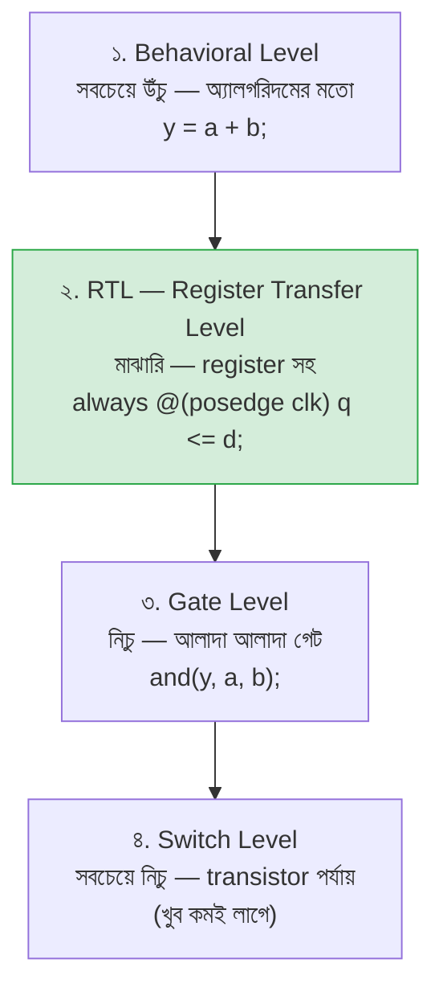
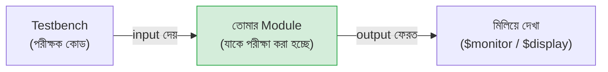

# 💻 Chapter 5: Build Your Own Hardware - In Code!
## CircuitVerse থেকে Verilog - Hardware Programming শুরু করো!

> **"Circuits are great. But code is faster. Time to program hardware!"**
>
> **"Circuits ভালো। কিন্তু code দ্রুত। এবার hardware programming করো!"**

---

আগের চারটা chapter এ তুমি গেট ধরে ধরে circuit এঁকেছো — মাউস দিয়ে AND, OR, NOT টেনে এনেছো, তার জুড়েছো, truth table মিলিয়েছো। ভালো শিখেছো, ভিত্তিটা শক্ত হয়েছে। কিন্তু একটা সমস্যা টের পেয়েছো কি? একটা 4-bit adder আঁকতেই অনেকগুলো গেট আর তার লাগে। এবার কল্পনা করো — একটা পুরো processor এ লাখ লাখ গেট। হাতে এঁকে শেষ করতে কয়েক জনম লেগে যাবে!

এই জায়গাতেই **Verilog** তোমার বন্ধু হয়ে আসে। circuit আঁকার বদলে এবার তুমি circuit **লিখবে** — কোডের মতো করে। ঠিক যেভাবে একজন programmer কোড লিখে software বানায়, তুমি কোড লিখে hardware বানাবে। পার্থক্য একটাই, আর সেটাই সবচেয়ে মজার: তোমার লেখা প্রতিটা লাইন শেষ পর্যন্ত আসল তার আর transistor হয়ে চিপে বসবে।

এই chapter তোমার সেই যাত্রার প্রথম ধাপ। শেষে তুমি Verilog-এর ভাষা পড়তে আর লিখতে পারবে — module কী, কীভাবে data এক জায়গা থেকে আরেক জায়গায় যায়, কীভাবে কয়েক লাইনে একটা পুরো adder বানানো যায়।

---

## 🎯 এই Chapter এ তুমি বানাবে:

```
✅ তোমার প্রথম Verilog module
✅ AND/OR/NOT gates - in code!
✅ 4-bit Adder - in 5 lines!
✅ MUX/Decoder - with case statements
✅ Testbench - circuit testing in code
✅ তোমার processor এর প্রথম Verilog module! 🎉
```

**Time Required:** 1 week (3-4 hours/day)  
**Tools Needed:** Text editor, Icarus Verilog, GTKWave

---

## 🚀 Quick Win - 5 মিনিটে তোমার First Verilog Code!

তত্ত্ব পরে — আগে নিজের হাতে একটা জিনিস বানিয়ে ফেলো, তাহলে বাকিটা বুঝতে অনেক সহজ লাগবে। নিচের কোডটা একটা **AND gate** — সেই গেট যেটা Chapter 1 এ মাউস দিয়ে এঁকেছিলে। এবার সেটাই কোডে।

### এখনই লেখো - AND Gate in Verilog:

**Create file: `and_gate.v`**

```verilog
// তোমার প্রথম Verilog module!
module and_gate(
    input a,
    input b,
    output y
);
    assign y = a & b;
endmodule
```

ভয় পেও না — এই কয়েকটা শব্দের মানে এখন এক লাইনে ধরিয়ে দিচ্ছি, পরে পুরো chapter জুড়ে গভীরভাবে বুঝবে। `module and_gate(...)` মানে "আমি `and_gate` নামে একটা যন্ত্রাংশ বানাচ্ছি"। ভেতরের `input a, input b` হলো সেই যন্ত্রের দুটো ঢোকার পথ, আর `output y` বেরোনোর পথ। মাঝখানের `assign y = a & b;` লাইনটাই আসল কাজ — এটা বলছে "`a` আর `b` কে AND করে ফলটা সবসময় `y` তে পাঠিয়ে দাও"। এখানে `&` চিহ্নটাই হলো AND। ব্যস, একটা গেট তৈরি!

**Compile ও Run করো:**
```bash
# Compile
iverilog -o and_gate and_gate.v

# Run (needs testbench - we'll add that!)
```

এখানে `iverilog` হলো তোমার Verilog compiler (Icarus Verilog) — এটা তোমার লেখা কোড পড়ে দেখে ভুল আছে কিনা, আর চালানোর উপযোগী একটা file বানায়। আসলে গেটটা "চালিয়ে" দেখতে হলে আরও একটা ছোট কোড লাগবে — testbench — যেটা গেটে নানা input দিয়ে output পরীক্ষা করে। সেটা এই chapter এর শেষেই শিখবে। আপাতত compile হয়ে গেলেই বুঝবে তোমার কোড ঠিক আছে।

🎉 **Congratulations! তুমি hardware code লিখেছো!**

মন দিয়ে দেখো ব্যাপারটা — এই ৭ লাইন কোনো screen-এ চলা program নয়। এটা একটা সত্যিকারের **AND gate chip** এর নকশা। একই কোড FPGA তে ঢাললে তার ভেতরে সত্যিকারের গেট তৈরি হবে, আর Part 5 এ এই একই ধরনের কোড থেকেই আসল silicon চিপ fabricate হবে। তুমি এইমাত্র software নয়, hardware লিখলে!

**এই 7 lines = একটা AND gate chip!**

---

## ৫.১ HDL কী এবং কেন?

### Hardware Description Language (HDL):

নামটা ভেঙে দেখলেই মানে বেরিয়ে আসে: **Hardware Description Language** — মানে "hardware বর্ণনা করার ভাষা"। সাধারণ programming language (যেমন C বা Python) দিয়ে তুমি কম্পিউটারকে বলো *কী কী কাজ ধাপে ধাপে করতে হবে*। কিন্তু HDL দিয়ে তুমি বর্ণনা করো *যন্ত্রটা দেখতে কেমন হবে এবং ভেতরে তার কীভাবে জোড়া থাকবে*। তুমি instruction দিচ্ছো না, তুমি একটা circuit-এর নকশা আঁকছো — শুধু ছবির বদলে শব্দ দিয়ে।

এই পার্থক্যটা একটু থেমে বুঝে নাও, কারণ এটাই Verilog শেখার সবচেয়ে বড় চাবিকাঠি। C তে তুমি যখন লেখো `a = b + c;`, সেটা একবার ঘটে, তারপর পরের লাইনে চলে যায়। Verilog এ যখন তুমি লেখো `assign y = a & b;`, সেটা "একবার ঘটে" না — এটা একটা স্থায়ী তার-জোড়া তৈরি করে, যেখানে `a` বা `b` বদলালে `y` সঙ্গে সঙ্গে বদলায়, সবসময়। তুমি সময় বর্ণনা করছো না, তুমি **জোড়া (connection)** বর্ণনা করছো।

তাহলে কেন আগের মতো শুধু circuit এঁকে গেলে চলে না? CircuitVerse-এ গেট টানা মজার, কিন্তু সেটা ছোট circuit-এর জন্য। নিচের তুলনাটা দেখলেই দুই পদ্ধতির ফারাক পরিষ্কার হবে:

| বিষয় | পুরোনো পদ্ধতি (Circuit আঁকা) | HDL পদ্ধতি (Code লেখা) |
|---|---|---|
| কীভাবে বানাও | হাতে গেট টেনে তার জোড়ো | কোডে গেট বর্ণনা করো |
| Simulation | আলাদা করে, কষ্টসাধ্য | বানানোর আগেই সহজে simulate |
| পরিবর্তন | একটা গেট সরালে সব এলোমেলো | একটা লাইন বদলালেই হলো |
| পুনর্ব্যবহার | বারবার একই জিনিস আঁকো | একবার লেখা module বারবার ব্যবহার |
| Industry | শেখার জন্য ভালো | আসল চাকরিতে এটাই চলে |
| Scale | কয়েকশো গেটেই হাঁপিয়ে যাবে | লাখ লাখ গেট সামলায়! |

মূল কথা: ছোট জিনিস বোঝার জন্য ছবি ভালো, কিন্তু বড় জিনিস বানানোর জন্য কোড। Intel বা AMD-র engineer-রা মাউস দিয়ে কোটি কোটি transistor টানে না — তারা HDL লেখে। তুমিও এবার সেটাই শিখছো।

### Verilog vs VHDL:

HDL জগতে দুটো বড় ভাষা আছে — **Verilog** আর **VHDL**। দুটোই কাজ করে, কিন্তু আমরা Verilog বেছে নিচ্ছি, কারণ তুমি যদি আগে একটুও C জাতীয় ভাষা দেখে থাকো তাহলে Verilog-এর syntax তোমার কাছে চেনা চেনা লাগবে — `if`, `&`, `{}` সব এক রকম দেখায়। VHDL আরও কড়া আর ভারী ভাষা (Ada থেকে এসেছে), শিখতে বেশি সময় লাগে। কোনটা "ভালো" তা নিয়ে তর্ক চলতেই থাকে, কিন্তু নতুনদের জন্য Verilog সহজ আর জনপ্রিয় — এটাই যথেষ্ট কারণ।

| Feature | Verilog | VHDL |
|---|---|---|
| Syntax | C-এর মতো | Ada-এর মতো |
| শেখা | সহজ | কঠিন |
| Industry | খুব বেশি প্রচলিত | প্রচলিত |
| কোথায় চলে বেশি | US/Asia | Europe |
| আমরা ব্যবহার করব | ✅ হ্যাঁ! | না |

আমরা Verilog শিখবো — কারণ এটা শেখা সহজ আর বেশি জনপ্রিয়!

### Abstraction Levels:

Verilog দিয়ে একই circuit তুমি কয়েকটা "উচ্চতা" বা **abstraction level** থেকে বর্ণনা করতে পারো। উচ্চতা মানে — কতটা দূর থেকে দেখছো। অনেক ওপর থেকে দেখলে শুধু কী হচ্ছে দেখো, খুব কাছ থেকে দেখলে প্রতিটা গেট আলাদা করে দেখো। ব্যাপারটা ম্যাপের মতো: দেশের ম্যাপে শুধু শহরগুলো দেখো, পাড়ার ম্যাপে প্রতিটা গলি। একই জায়গা, ভিন্ন উচ্চতা।



এই চারটার মধ্যে আমরা বেশিরভাগ সময় থাকব **RTL** level এ — মাঝামাঝি উচ্চতায়। কেন এই level? কারণ এটা একটা চমৎকার আপস: যথেষ্ট উঁচু যে কোড পড়তে আর লিখতে আরামদায়ক, আবার যথেষ্ট নিচু যে compiler ঠিকঠাক বুঝে নিতে পারে কোন গেট কোথায় বসাতে হবে। RTL মানে তুমি বর্ণনা করো — কোন data কোন register থেকে কোন register এ যাচ্ছে, আর মাঝপথে তার ওপর কী হিসাব হচ্ছে। আসল চিপ industry-তেও সিংহভাগ কাজ এই RTL level এই হয়।

আমরা mostly RTL level use করবো!

---

## ৫.২ Verilog Basics - Module Structure

### Module = Basic Building Block

Verilog এর সবকিছুর কেন্দ্রে একটা শব্দ — **module**। module হলো তোমার hardware-এর একটা স্বয়ংসম্পূর্ণ টুকরা: একটা গেট, একটা adder, এমনকি একটা গোটা processor — সবই module। সবচেয়ে কাজের উপমা হলো একটা **চিপ বা IC**: চিপটার ভেতরে কী আছে তা বাইরে থেকে দেখা যায় না, তুমি শুধু দেখো তার গায়ের পা (pin) গুলো — কোন পা দিয়ে সিগন্যাল ঢোকে, কোন পা দিয়ে বেরোয়। module ঠিক তাই। বাইরের জগৎ শুধু এর **port** (পা) গুলো জানে; ভেতরের কারিগরি লুকোনো থাকে।

নিচে একটা module-এর কঙ্কাল দেখো — প্রতিটা module এই একই ছাঁচ মেনে চলে:

```verilog
module module_name(
    // Port declarations
    input  wire  a,    // Input port
    input  wire  b,    // Another input
    output wire  y     // Output port
);

    // Module contents
    // (logic, assignments, etc.)

endmodule
```

লক্ষ করো গঠনটা তিন ভাগে: শুরুতে `module` কীওয়ার্ড আর একটা নাম (`module_name` — তুমি যা খুশি দিতে পারো, তবে অর্থপূর্ণ নাম দাও)। তারপর বন্ধনীর ভেতরে **port list** — যন্ত্রের পা-গুলো, একটার পর একটা কমা দিয়ে আলাদা। মাঝখানে module-এর আসল কাজ (logic)। আর সবশেষে `endmodule` দিয়ে শেষ — এটা ভুলে গেলে compiler রাগ করবে। খেয়াল রেখো, port list-এর শেষ port-এর পরে কোনো কমা থাকে না, কিন্তু পুরো বন্ধনীর পরে একটা semicolon `;` থাকে।

### Port Types:

port-এর তিনটা ধরন আছে — মূলত সিগন্যাল কোন দিকে যাচ্ছে তার ওপর নির্ভর করে:

```verilog
input   // Signal coming INTO module
output  // Signal going OUT of module
inout   // Bidirectional (rare, advanced)
```

ভাবো একটা যন্ত্রের গায়ে দুই রকম তীর আঁকা: কিছু তীর ভেতরের দিকে (`input` — বাইরে থেকে data ঢুকছে), কিছু বাইরের দিকে (`output` — ভেতর থেকে ফল বেরোচ্ছে)। `inout` হলো একই পা দিয়ে কখনো ঢোকা কখনো বেরোনো — যেমন কম্পিউটারের data bus, যেখানে একই তার দিয়ে কখনো লেখা হয় কখনো পড়া। এটা একটু উন্নত আর কম লাগে, তাই আপাতত `input` আর `output` মাথায় রাখলেই চলবে। সঠিক দিক ঠিক করা জরুরি, কারণ এটাই বলে দেয় সিগন্যাল কোন পথে বইবে।

### Example - Full Adder:

তত্ত্ব যথেষ্ট — এবার একটা সত্যিকারের কাজের module দেখো। মনে আছে Chapter 3 এর **full adder**? দুটো bit আর একটা carry-in যোগ করে, sum আর carry-out দেয়। সেই পরিচিত জিনিসটাই এখন Verilog-এ:

```verilog
module full_adder(
    input  a,      // First input
    input  b,      // Second input
    input  cin,    // Carry in
    output sum,    // Sum output
    output cout    // Carry out
);
    // Logic here
    assign sum = a ^ b ^ cin;
    assign cout = (a & b) | (b & cin) | (a & cin);
endmodule
```

পুরো ছাঁচটা মিলিয়ে নাও: তিনটা `input` (`a`, `b`, `cin`) আর দুটো `output` (`sum`, `cout`)। ভেতরের দুই লাইনই হলো সেই Boolean সমীকরণ যা তুমি আগে truth table থেকে বের করেছিলে। প্রথম লাইন বলছে — তিনটা bit-এর মধ্যে বিজোড় সংখ্যক 1 থাকলে sum হবে 1 (এটাই XOR-এর, মানে `^`-এর, কাজ)। দ্বিতীয় লাইন বলছে — তিনটার মধ্যে অন্তত দুটো 1 হলে carry-out হবে 1। লক্ষ করো, আগে CircuitVerse-এ এই circuit বানাতে তোমার অনেকগুলো গেট আর তার জুড়তে হতো; এখানে দুই লাইনেই পুরো জিনিসটা বলা হয়ে গেল। এটাই HDL-এর শক্তি — তুমি *কী হবে* বলছো, *কোন গেট কোথায় বসবে* সেটা compiler নিজেই বুঝে নিচ্ছে।

---

## ৫.৩ Data Types - Verilog এর Variables

যেকোনো সিগন্যাল ব্যবহার করার আগে Verilog কে বলতে হয় সেটা কী ধরনের জিনিস। এটাই data type। নতুনদের সবচেয়ে বেশি ভুল আর বিভ্রান্তি এখানেই হয়, তাই একটু ধৈর্য ধরে পড়ো — দুটো শব্দ ঠিকঠাক বুঝে নিলে অর্ধেক যুদ্ধ জেতা হয়ে যায়: `wire` আর `reg`।

### Two Main Types:

```verilog
// 1. wire - Continuous connection (like physical wire)
wire a, b, c;
wire [3:0] data;  // 4-bit wire

// 2. reg - Register (holds value, used in always blocks)
reg q, d;
reg [7:0] counter;  // 8-bit register
```

প্রথমটা — `wire` — নামেই পরিচয়। এটা একটা সত্যিকারের **তার**, ঠিক তোমার বাড়ির বিদ্যুতের তারের মতো। তারের নিজের কোনো স্মৃতি নেই; এক প্রান্তে যা দাও, অন্য প্রান্তে সঙ্গে সঙ্গে সেটাই পাও। একটা সুইচ অফ করলে বাল্ব সঙ্গে সঙ্গে নেভে — তার তো আর "আগের আলো ধরে রাখে" না। `wire` ঠিক তেমন: একে চালিয়ে রাখতে কিছু একটা সবসময় তার গায়ে value চাপিয়ে রাখতে হয়।

দ্বিতীয়টা — `reg` — একটা **পাত্রের** মতো, যা ভেতরে একটা value ধরে রাখতে পারে। তুমি একবার কিছু রাখলে, নতুন কিছু না রাখা পর্যন্ত সেটাই থেকে যায়। এটা স্মৃতির ব্যাপার — আগের chapter-এর flip-flop যেভাবে value মনে রাখত, ঠিক সেভাবে।

### Wire vs Reg:

কখন কোনটা ব্যবহার করবে? নিচের টেবিলটা মনে রাখলেই হবে — মূল সূত্র একটাই: **`assign` দিয়ে চালালে `wire`, `always` block-এর ভেতরে value পেলে `reg`।**

| Feature | `wire` | `reg` |
|---|---|---|
| কোথায় লাগে | Combinational logic | Sequential logic |
| কে চালায় | `assign` statement | `always` block |
| value ধরে রাখে? | না, স্মৃতি নেই | হ্যাঁ, ধরে রাখতে পারে |
| উদাহরণ | জিনিস জোড়া লাগানো | flip-flop এর output |

এবার সবচেয়ে গুরুত্বপূর্ণ কথাটা — যেটা প্রায় সবাই প্রথমে ভুল বোঝে। নামটা প্রতারণা করে: `reg` মানেই "register" নয়! `reg` শুধু একটা *variable টাইপ* — মানে "এই সিগন্যালটায় আমি `always` block-এর ভেতর থেকে value বসাবো"। এটা কি সত্যিকারের register (flip-flop) হয়ে চিপে বসবে, নাকি নিছক combinational তার হবে — সেটা পুরোপুরি নির্ভর করে তুমি কোড কীভাবে লিখলে তার ওপর, নামের ওপর নয়। তাই ভয় পেও না: `always @(*)` এর ভেতরে `reg` লিখলেও সেটা মেমরি হয়ে যায় না।

```
Common misconception: reg ≠ always register!
It's just a variable type!
```

### Integer Types:

`wire` আর `reg` ছাড়াও কিছু সুবিধাজনক টাইপ আছে, যেগুলো মূলত testbench আর simulation-এ কাজে লাগে — চিপে এগুলো সরাসরি hardware হয় না:

```verilog
integer i;        // 32-bit signed integer
integer count;    // For loops, counters

real voltage;     // Floating point (simulation only)
time current_time; // Time values
```

এগুলো অনেকটা সাধারণ programming-এর variable-এর মতো আচরণ করে। `integer` হলো একটা ৩২-bit সংখ্যা — loop চালাতে বা গোনাগুনতি করতে দারুণ কাজের, যেমন testbench-এ "১০ বার এই পরীক্ষা চালাও"। `real` হলো দশমিক সংখ্যা (যেমন voltage মাপতে) — কিন্তু সাবধান, এটা শুধু simulation-এ মনের শান্তির জন্য; আসল hardware দশমিক বোঝে না, শুধু 0 আর 1। আর `time` ব্যবহার হয় simulation-এর সময় ধরে রাখতে। আপাতত মনে রেখো — এগুলো বেশিরভাগ testbench-এ দেখবে, মূল circuit-এ নয়।

### Vectors (Multi-bit):

এখন পর্যন্ত যেসব সিগন্যাল দেখেছ সেগুলো এক bit-এর — শুধু 0 বা 1। কিন্তু আসল কাজে তো একসাথে অনেকগুলো bit লাগে: একটা byte মানে ৮ bit, RISC-V-এর একটা word মানে ৩২ bit। আলাদা আলাদা করে ৩২টা সিগন্যাল ঘোষণা করা পাগলামি হবে। তাই Verilog দেয় **vector** — একগুচ্ছ তারকে একটা নামে বেঁধে ফেলা:

```verilog
// Declaring multi-bit signals
wire [7:0] byte_data;    // 8-bit wire (bits 7 to 0)
reg  [3:0] nibble;       // 4-bit register
wire [31:0] word;        // 32-bit wire

// Accessing bits
assign bit0 = byte_data[0];      // Single bit
assign lower_nibble = byte_data[3:0];  // Range
assign upper_nibble = byte_data[7:4];  // Range

// Bit ordering
[7:0] means: bit 7 is MSB, bit 0 is LSB
```

ভাবো `[7:0]` হলো একটা ফ্ল্যাটের ৮টা ঘর, যাদের নম্বর দেওয়া 7 থেকে 0 পর্যন্ত। `wire [7:0] byte_data;` মানে — ৮টা তার একসাথে, নাম `byte_data`, ভেতরের তারগুলোর নম্বর `byte_data[7]` থেকে `byte_data[0]`। দরকার হলে পুরো গুচ্ছ একসাথে ব্যবহার করো, আর দরকার হলে নির্দিষ্ট ঘরে হাত দাও: `byte_data[0]` দিয়ে শুধু একটা bit তুলে নাও, বা `byte_data[3:0]` দিয়ে নিচের চারটা bit-এর একটা টুকরো (এটাকে বলে **slice** বা **part-select**)।

কেন নম্বরটা `[7:0]`, উল্টো করে `[0:7]` নয়? কারণ convention অনুযায়ী বাঁদিকেরটা **MSB** (Most Significant Bit — সবচেয়ে দামি bit, যেটা সংখ্যার সবচেয়ে বড় ওজন বহন করে) আর ডানদিকেরটা **LSB** (Least Significant Bit — সবচেয়ে কম দামি)। ঠিক যেমন দশমিক সংখ্যা 250-এ বাঁদিকের 2 মানে দুইশো (বড় ওজন), ডানদিকের 0 মানে শূন্য একক (ছোট ওজন)। তাই `[7:0]` লিখলে binary সংখ্যাটা পড়তে স্বাভাবিক লাগে — বাঁ থেকে ডানে, বড় থেকে ছোট।

---

## ৫.৪ Operators - Verilog এর Operations

operator হলো সেই চিহ্নগুলো যা দিয়ে তুমি সিগন্যালের ওপর হিসাব-নিকাশ করো — যোগ করো, তুলনা করো, bit মেলাও। Verilog-এর operator-গুলো বেশিরভাগ C-এর মতোই দেখতে, কিন্তু একটা ব্যাপার সবসময় মাথায় রেখো: এখানে প্রতিটা operator আসলে **hardware** হয়ে দাঁড়ায়। তুমি যখন `a + b` লেখো, compiler সেখানে একটা সত্যিকারের adder circuit বসায়; `a & b` লিখলে AND গেট বসে। তাই operator মানে নিছক গণিত নয় — এগুলো তোমার circuit-এর ইট। চলো একটা একটা করে দেখি।

### Bitwise Operators:

প্রথম দল — **bitwise** operator। নামটাই বলে দেয় কাজটা: এরা দুটো সংখ্যার **একই অবস্থানের bit-গুলো একটা একটা করে** মেলায়। মানে প্রথম সংখ্যার 0 নম্বর bit-এর সাথে দ্বিতীয় সংখ্যার 0 নম্বর bit, এভাবে জোড়ায় জোড়ায়। ফলটাও একই মাপের একটা সংখ্যা।

```verilog
// Bitwise operations (bit-by-bit)
& // AND:  1010 & 1100 = 1000
| // OR:   1010 | 1100 = 1110
^ // XOR:  1010 ^ 1100 = 0110
~ // NOT:  ~1010 = 0101

// Example
wire [3:0] a = 4'b1010;
wire [3:0] b = 4'b1100;
wire [3:0] result;

assign result = a & b;  // 4'b1000
```

উদাহরণটা ধরে ধরে বোঝো: `1010 & 1100`। জোড়ায় জোড়ায় AND করো — বাঁ থেকে: (1 আর 1 → 1), (0 আর 1 → 0), (1 আর 0 → 0), (0 আর 0 → 0)। ফল `1000`। AND-এ দুটোই 1 হলে তবেই 1, এটা তো আগেই জানো — শুধু এবার একসাথে চারটা bit-এ। এই operator-গুলোর কাজ মূলত একটাই: কোনো সংখ্যার নির্দিষ্ট কিছু bit বেছে নেওয়া, ঢেকে দেওয়া (masking), বা উল্টে দেওয়া। যেমন `~` দিয়ে প্রতিটা bit উল্টে যায় — 1 হয় 0, 0 হয় 1।

### Logical Operators:

এবার একটা সূক্ষ্ম কিন্তু জরুরি পার্থক্য, যেটা ভুল করলে বড় bug হয়। **logical** operator দেখতে প্রায় একই (`&&`, `||`, `!` — দুটো করে চিহ্ন), কিন্তু এরা bit-by-bit কাজ করে না। এরা পুরো সংখ্যাটাকে একটাই প্রশ্ন করে: "তুমি কি সত্য (true) নাকি মিথ্যা (false)?" — যেখানে শূন্য মানে মিথ্যা, আর শূন্য নয় এমন যেকোনো কিছু মানে সত্য। ফল সবসময় একটামাত্র bit: 0 বা 1।

```verilog
// Logical operations (return 0 or 1)
&& // AND:  (a && b) - true if both non-zero
|| // OR:   (a || b) - true if any non-zero
!  // NOT:  (!a) - true if a is zero

// Example
wire a = 1'b1;
wire b = 1'b0;
wire result = a && b;  // 0 (false)
```

মূল কথাটা গেঁথে নাও — **একটা `&` মানে bitwise, দুটো `&&` মানে logical।** bitwise জিজ্ঞেস করে "প্রতিটা bit-এর কী অবস্থা?", logical জিজ্ঞেস করে "পুরোটা মিলিয়ে সত্য না মিথ্যা?"। তুমি যখন `if` শর্তে দুটো অবস্থা যাচাই করতে চাও ("a-ও সত্য, b-ও সত্য?"), তখন `&&` লাগবে; আর যখন bit নিয়ে কারিকুরি করতে চাও, তখন `&`। শুরুতে এই দুটো গুলিয়ে ফেলা সবচেয়ে সাধারণ ভুল, তাই এখনই সাবধান।

### Reduction Operators:

তৃতীয় দলটা একটু চমকপ্রদ — **reduction** operator। এখানে একই চিহ্ন (`&`, `|`, `^`) ব্যবহার হয়, কিন্তু এবার তুমি দুটো সংখ্যার মাঝে নয়, **একটামাত্র vector-এর সামনে** চিহ্নটা বসাও। তখন এটা ওই গুচ্ছের *সব bit-কে একসাথে* ওই operation দিয়ে গুঁড়িয়ে একটামাত্র bit-এ নামিয়ে আনে — তাই নাম "reduction" (সংকোচন)।

```verilog
// Reduce multiple bits to single bit
&  // AND all bits:  &(4'b1111) = 1, &(4'b1110) = 0
|  // OR all bits:   |(4'b0000) = 0, |(4'b0001) = 1
^  // XOR all bits:  ^(4'b1100) = 0 (parity)

// Example - Parity checker
wire [7:0] data = 8'b11010101;
wire parity = ^data;  // XOR all bits
```

ভাবো এভাবে: `&data` মানে "data-র প্রতিটা bit কি 1?" — সবগুলো 1 হলে তবেই উত্তর 1, একটাও 0 থাকলে উত্তর 0। তাই `&(4'b1111)` হয় 1, কিন্তু `&(4'b1110)` হয় 0 (কারণ একটা bit 0 আছে)। তেমনি `|data` জিজ্ঞেস করে "অন্তত একটা bit কি 1?"। আর `^data` সবগুলো bit-কে XOR করে — যার ফল হলো ওই গুচ্ছে কয়টা 1 আছে তা জোড় না বিজোড়, এটাই **parity**। parity দিয়ে data পাঠানোর সময় ভুল ধরা যায়, যা পরে যোগাযোগ (UART) বানানোর সময় দারুণ কাজে লাগবে।

### Arithmetic Operators:

এবার চেনা মাঠ — **arithmetic** operator, মানে সাধারণ অঙ্ক। যোগ, বিয়োগ, গুণ, ভাগ, ভাগশেষ — সবই আছে, আর চিহ্নগুলোও যা ভাবছ তাই:

```verilog
+ // Addition
- // Subtraction
* // Multiplication
/ // Division
% // Modulus

// Example
wire [3:0] a = 4'd5;
wire [3:0] b = 4'd3;
wire [3:0] sum = a + b;  // 4'd8
```

দেখতে সহজ, কিন্তু মনে রেখো — পর্দার পেছনে এগুলো hardware। `a + b` লিখলে compiler একটা সত্যিকারের adder বসায়, আর `a * b` লিখলে একটা multiplier — যা বেশ কয়েকটা গেট খরচ করে এবং চিপে অনেকটা জায়গা নেয়। তাই software-এ যেমন নির্দ্বিধায় গুণ-ভাগ করো, hardware-এ ততটা হালকা ভাবে নয়; বিশেষ করে `/` (ভাগ) আর `%` (ভাগশেষ) খুব "দামি" — অনেক গেট খায়। আরেকটা ব্যাপার: এখানে `a` আর `b` দুটোই 4-bit, তাই ফলও 4-bit ঘরে আঁটানো হয়। `5 + 3 = 8` সুন্দর আঁটে, কিন্তু সংখ্যা বড় হয়ে গেলে কী হয়? সেই overflow-এর মজা পরের কয়েক উদাহরণে দেখবে।

### Relational Operators:

**relational** operator দিয়ে তুমি দুটো সংখ্যা **তুলনা** করো — সমান কিনা, বড় কিনা, ছোট কিনা। উত্তর সবসময় হ্যাঁ বা না, মানে একটা bit: 1 (সত্য) বা 0 (মিথ্যা)।

```verilog
== // Equal
!= // Not equal
<  // Less than
>  // Greater than
<= // Less than or equal
>= // Greater than or equal

// Example
wire [3:0] a = 4'd5;
wire [3:0] b = 4'd3;
wire is_greater = (a > b);  // 1 (true)
```

এখানে `(a > b)` জিজ্ঞেস করছে "a কি b-এর চেয়ে বড়?"। 5 তো 3-এর চেয়ে বড়, তাই উত্তর 1। একটা ফাঁদ থেকে সাবধান: তুলনায় "সমান" বোঝাতে দুটো চিহ্ন `==` লাগে, একটা নয়। একটা `=` মানে "বসিয়ে দাও" (assignment), দুটো `==` মানে "মিলিয়ে দেখো" (comparison) — গুলিয়ে ফেললে যন্ত্রণা! এই relational operator-গুলোই পরে তোমার processor-কে সিদ্ধান্ত নিতে সাহায্য করবে — যেমন RISC-V-এর branch instruction যখন বলে "দুটো register সমান হলে এদিকে লাফাও", তখন ভেতরে এই `==`-ই কাজ করছে।

### Shift Operators:

**shift** operator একটা মজার আর ভীষণ কাজের জিনিস: এটা একটা সংখ্যার সব bit-কে বাঁয়ে বা ডানে সরিয়ে দেয়, আর ফাঁকা জায়গা 0 দিয়ে ভরে দেয়।

```verilog
<< // Left shift:   4'b0011 << 1 = 4'b0110
>> // Right shift:  4'b0110 >> 1 = 4'b0011

// Example
wire [3:0] a = 4'b0011;
wire [3:0] shifted = a << 2;  // 4'b1100
```

এখানে লুকোনো সৌন্দর্যটা ধরো: **বাঁয়ে এক ঘর shift করা মানে সংখ্যাটাকে ২ দিয়ে গুণ করা, আর ডানে এক ঘর shift করা মানে ২ দিয়ে ভাগ।** দশমিকেও তো তাই — 25-এর পেছনে একটা 0 বসালে (বাঁয়ে shift) হয় 250, মানে ১০ গুণ। binary-তে base 2, তাই গুণটা ২-এর। উদাহরণে `4'b0011` মানে 3; দুই ঘর বাঁয়ে shift করলে হলো `4'b1100` মানে 12 — ঠিক 3 × ৪ (কারণ দুই ঘর shift = ২×২ = ৪ গুণ)। মজার ব্যাপার হলো, shift করতে কোনো adder বা multiplier লাগে না — শুধু তারগুলো একটু সরিয়ে জুড়ে দিলেই হয়, তাই এটা গুণ-ভাগের চেয়ে অনেক সস্তা। চটপট ২-এর গুণিতকে গুণ করতে চাইলে engineer-রা তাই shift ব্যবহার করে।

### Concatenation:

শেষ এবং সবচেয়ে কাজের একটা জিনিস — **concatenation**, মানে কয়েকটা সিগন্যাল **জোড়া লাগিয়ে** একটা বড় সিগন্যাল বানানো। কোঁকড়া বন্ধনী `{ }` দিয়ে যা যা ভেতরে রাখবে, সেগুলো বাঁ থেকে ডানে পরপর সাজিয়ে একটা গুচ্ছ তৈরি হয়:

```verilog
// Join multiple signals
{signal1, signal2, signal3}

// Example
wire [1:0] a = 2'b10;
wire [1:0] b = 2'b11;
wire [3:0] result = {a, b};  // 4'b1011

// Replication
wire [7:0] all_ones = {8{1'b1}};  // 8'b11111111
wire [7:0] pattern = {4{2'b10}};  // 8'b10101010 - replicand can be a multi-bit group too
wire [7:0] zeros = {8{1'b0}};  // 8'b00000000
```

ভাবো ব্যাপারটা ট্রেনের বগি জোড়া দেওয়ার মতো। `{a, b}` মানে a-এর বগি সামনে, b-এর বগি পেছনে — জুড়ে দিলে একটা লম্বা ট্রেন। তাই `a` (যা `10`) আর `b` (যা `11`) জোড়া দিলে হয় `1011`। লক্ষ করো বাঁদিকেরটা ওপরের bit হয়ে বসে। এই কৌশলটাই পরে অসম্ভব কাজে লাগবে — যেমন এই chapter-এর adder-এ তুমি `{cout, sum}` লিখে carry আর যোগফলকে একসাথে ধরবে।

আর তলায় দেখো আরেকটা শর্টকাট — **replication** (পুনরাবৃত্তি)। বন্ধনীর আগে একটা সংখ্যা বসালে ভেতরের জিনিসটা ঠিক ততবার কপি হয়। `{8{1'b1}}` মানে "একটা 1 কে ৮ বার বসাও" — ফল আট-bit এর সবগুলো 1, মানে `11111111`। ৩২ bit সব 1 বা সব 0 দিয়ে ভরতে হলে এক হাতে ৩২টা টাইপ না করে এই ছোট্ট কায়দাটা ব্যবহার করো। আর কপি করার জিনিসটা একটা bit হতেই হবে এমন নয় — `{4{2'b10}}` দুই-bit এর `10` কে চারবার বসিয়ে `10101010` বানায়।

---

## ৫.৫ Number Representation

আগের উদাহরণগুলোতে নিশ্চয়ই `4'b1010` বা `8'd5`-এর মতো অদ্ভুত লেখা চোখে পড়েছে। এগুলো এমনি এমনি লেখা নয় — Verilog-এ সংখ্যা লেখার একটা সুন্দর নিয়ম আছে, যা দিয়ে তুমি একসাথে তিনটা জিনিস বলে দাও: সংখ্যাটা **কত bit-এর**, কোন **base**-এ (binary/decimal/hex), আর তার **মান** কী।

### Format: `<size>'<base><value>`

ছকটা মুখস্থ করার দরকার নেই, শুধু গঠনটা বোঝো — `<size>'<base><value>`। প্রথমে কত bit, তারপর একটা apostrophe `'`, তারপর কোন base বোঝানোর একটা অক্ষর (`b`=binary, `d`=decimal, `h`=hex, `o`=octal), আর শেষে আসল মান:

```verilog
// Decimal (default)
5        // Unsized decimal 5
8'd5     // 8-bit decimal 5

// Binary
4'b1010  // 4-bit binary 1010
8'b0000_1111  // Underscore for readability

// Hexadecimal
8'hAF    // 8-bit hex AF (10101111)
4'hF     // 4-bit hex F (1111)

// Octal
6'o77    // 6-bit octal 77

// Examples
wire [7:0] a = 8'd255;        // Decimal 255
wire [7:0] b = 8'b1111_1111;  // Binary 255
wire [7:0] c = 8'hFF;         // Hex 255
// All three are same value!
```

পড়ে দেখো `8'd5` — মানে "৮ bit চওড়া, decimal-এ ৫"। `4'b1010` — "৪ bit, binary-তে 1010"। আর `8'hAF` — "৮ bit, hex-এ AF" (যা আসলে `10101111`)। কেন এত ঝামেলা, কেবল `5` লিখলেই তো হতো? হতো, কিন্তু hardware-এ সিগন্যালের **মাপ** ভীষণ জরুরি — একটা সংখ্যা ৪ তারে যাবে নাকি ৮ তারে, সেটা স্পষ্ট না বললে compiler অনুমান করে, আর অনুমান মানেই লুকোনো bug। তাই অভ্যাস করো সবসময় মাপ আর base লিখতে।

সবচেয়ে শিক্ষণীয় অংশটা একদম শেষের তিন লাইন: `8'd255`, `8'b1111_1111`, আর `8'hFF` — তিনটে দেখতে আলাদা, কিন্তু **হুবহু একই মান**! শুধু তিন রকম ভাষায় লেখা। এটাই key intuition: base শুধু *আমরা কীভাবে লিখছি* তার ব্যাপার, ভেতরে সংখ্যাটা একই থাকে। আর খেয়াল করো `1111_1111`-এর মাঝের আন্ডারস্কোরটা — এটা কোনো মানে বদলায় না, শুধু আমাদের চোখকে আরাম দেয়, ঠিক যেমন বড় সংখ্যায় কমা বসাই (১০,০০,০০০)। hex বিশেষভাবে কাজের, কারণ এক অক্ষরে চারটা bit ধরে — তাই ৩২-bit সংখ্যা মাত্র ৮টা hex অক্ষরে লেখা যায়, ৩২টা 0-1 না লিখে।

### Special Values:

আরেকটা চমক — hardware জগতে একটা তারের অবস্থা শুধু 0 বা 1 নাও হতে পারে! আরও দুটো বিশেষ অবস্থা আছে, যেগুলো বাস্তব circuit-এর অনিশ্চয়তা বোঝায়:

```verilog
'b0 or 0  // Logic 0
'b1 or 1  // Logic 1
'bx or 'bX  // Unknown (simulation)
'bz or 'bZ  // High impedance (tri-state)

// X and Z states
wire a = 1'bx;  // Don't know the value
wire b = 1'bz;  // Disconnected/floating
```

`0` আর `1` তো জানোই। নতুন দুটো হলো `x` আর `z`, আর এদের চেনা থাকলে simulation-এর অনেক রহস্যময় ভুল ধরতে পারবে। `x` মানে **unknown** — "এই তারের মান কী, তা জানা নেই"। তুমি কোনো সিগন্যালকে value দিতে ভুলে গেলে, কিংবা দুটো জিনিস একই তারে টানাটানি করলে, simulation-এ `x` দেখাবে — এটা একটা সতর্কবার্তা, "এখানে গণ্ডগোল আছে, দেখো!"। আর `z` মানে **high impedance** — তারটা যেন কোথাও জোড়াই নেই, ভাসছে (floating)। এটা ইচ্ছাকৃতভাবে লাগে তখন, যখন একই bus-এ অনেকগুলো জিনিস জোড়া থাকে আর তুমি চাও তাদের একটা ছাড়া বাকিরা "চুপ করে থাকুক" (নিজেদের তার ছেড়ে দিক) — যেমন উপরের `wire b = 1'bz;`।

আপাতত এদের নিয়ে বেশি মাথা ঘামানোর দরকার নেই — শুধু মনে রেখো, simulation-এ হঠাৎ `x` দেখলে আঁতকে উঠো না, বরং খুঁজে দেখো কোন সিগন্যালটাকে value দিতে ভুলে গেছ। নতুনদের অর্ধেক bug এই একটা চিহ্ন ধরিয়ে দেয়।

---

## ৫.৬ Continuous Assignment - Combinational Logic

এতক্ষণ ছোট ছোট `assign` দেখেছ, এবার এই একটা শব্দের পুরো ক্ষমতা বুঝে নাও — কারণ combinational logic (যে circuit-এর কোনো স্মৃতি নেই, output শুধু এখনকার input-এর ওপর নির্ভর করে) লেখার এটাই প্রধান হাতিয়ার।

### assign Statement:

```verilog
// Syntax
assign output_signal = expression;

// Continuously evaluates expression
// Updates output whenever inputs change
// Perfect for combinational logic!
```

এর নামটাই সবচেয়ে বড় ইঙ্গিত — **continuous** assignment, মানে "অবিরাম" বরাদ্দ। সাধারণ programming-এর `=`-এর সাথে এর মৌলিক পার্থক্য এখানেই। C-তে `y = a & b;` একবার চলে, তারপর `a` বা `b` বদলালেও `y` পুরোনো মানেই বসে থাকে যতক্ষণ না আবার লাইনটা চালাও। কিন্তু Verilog-এর `assign y = a & b;` একটা স্থায়ী নিয়ম তৈরি করে: "যতক্ষণ এই circuit বেঁচে আছে, `a` বা `b` যখনই এক চুল বদলাবে, `y` সঙ্গে সঙ্গে নতুন করে হিসাব হয়ে যাবে।"

ভাবো এটা একটা গাণিতিক সম্পর্ক, ঘটনা নয়। `assign y = a & b` মানে "`y` সবসময় `a` AND `b`-এর সমান থাকবে, এটা চিরন্তন সত্য" — অনেকটা পদার্থবিজ্ঞানের সূত্রের মতো, যা সবসময় খাটে। আর কেন এটা combinational logic-এর জন্য নিখুঁত, তাও পরিষ্কার: একটা সত্যিকারের গেট তো ঠিক এভাবেই কাজ করে — input বদলালে output সঙ্গে সঙ্গে বদলায়, কোনো "চালানোর" অপেক্ষা না করে। `assign` লিখলে compiler ঠিক সেই গেটটাই বসিয়ে দেয়।

### Example 1 - Simple Gates:

সবচেয়ে সহজটা দিয়ে শুরু — চারটা মৌলিক গেট এক module-এ। লক্ষ করো, চারটা `assign` চারটা আলাদা গেট, আর এরা সবাই **একই সাথে, পাশাপাশি** কাজ করে। কোডে ওপর-নিচ লেখা মানে এই নয় যে আগেরটা আগে চলে — hardware-এ এরা সব একসাথে বিদ্যুতের গতিতে কাজ করছে। এটাই software আর hardware চিন্তার বড় তফাত: এখানে কোনো "ধাপে ধাপে" নেই, সব সমান্তরালে।

```verilog
module basic_gates(
    input  a, b,
    output y_and,
    output y_or,
    output y_not,
    output y_xor
);
    assign y_and = a & b;
    assign y_or  = a | b;
    assign y_not = ~a;
    assign y_xor = a ^ b;
endmodule
```

### Example 2 - 2:1 MUX:

এবার একটা নতুন আর দারুণ কাজের চিহ্ন — **ternary operator** বা conditional operator (`? :`)। এটা MUX (multiplexer, মানে বাছাইকারী সুইচ) লেখার সবচেয়ে পরিষ্কার উপায়:

```verilog
module mux_2to1(
    input  a,      // Input 0
    input  b,      // Input 1
    input  sel,    // Select
    output y       // Output
);
    // When sel=0, y=a
    // When sel=1, y=b
    assign y = sel ? b : a;
    
    // Alternative (same thing):
    // assign y = (sel & b) | (~sel & a);
endmodule
```

`sel ? b : a` লাইনটা ইংরেজি বাক্যের মতো করেই পড়ো: "`sel` কি সত্য? হ্যাঁ হলে `b` নাও, না হলে `a` নাও।" প্রশ্নচিহ্নের আগে শর্ত, কোলনের দুপাশে দুটো উত্তর। এটাই তো MUX-এর কাজ — একটা select সিগন্যাল দিয়ে কয়েকটা input থেকে একটা বেছে নেওয়া, যেন একটা রেলের কাঁটা। নিচে comment করে রাখা বিকল্প লাইনটা (`(sel & b) | (~sel & a)`) ঠিক একই কাজ করে, শুধু গেট দিয়ে হাতে লেখা — দুটো মিলিয়ে দেখলে বুঝবে ternary আসলে এই গেটগুলোরই সংক্ষিপ্ত রূপ, পড়তেও ঢের সহজ।

### Example 3 - 4-bit Adder:

এই উদাহরণটা একটু থেমে উপভোগ করো — কারণ এটাই HDL-এর জাদু সবচেয়ে স্পষ্টভাবে দেখায়। মনে করো Chapter 3-এ 4-bit adder বানাতে তোমার চারটা full adder জুড়তে হয়েছিল, carry এক ঘর থেকে পরের ঘরে টানতে হয়েছিল — বেশ ঝক্কির কাজ। এখানে পুরোটা **এক লাইনে**:

```verilog
module adder_4bit(
    input  [3:0] a,
    input  [3:0] b,
    input        cin,
    output [3:0] sum,
    output       cout
);
    // Just 2 lines for 4-bit adder!
    assign {cout, sum} = a + b + cin;
    
    // That's it! Verilog handles the details!
endmodule
```

লাইনটা টুকরো টুকরো করে বোঝো। ডানদিকে `a + b + cin` — তিনটা জিনিস যোগ। কিন্তু সমস্যা হলো, দুটো 4-bit সংখ্যা যোগ করলে ফল ৫ bit-ও হতে পারে (যেমন 15 + 1 = 16, যা 4 bit-এ আঁটে না — ৫ bit লাগে)। সেই বাড়তি bit-টাই হলো carry-out। তো বাঁদিকে concatenation `{cout, sum}` দিয়ে আমরা একটা ৫-bit পাত্র বানিয়ে দিলাম: ওপরের 1 bit `cout`-এ, নিচের 4 bit `sum`-এ। যোগফল আপনাআপনি ঠিক জায়গায় বসে যায় — উপচে পড়া carry সোজা `cout`-এ। তুমি কোন গেট কীভাবে বসবে তার একটাও কথা বললে না; শুধু *কী চাও* বললে, আর Verilog বাকিটা সামলে নিল। এটাই abstraction-এর আসল মানে।

### Multiple Drivers - DON'T DO THIS:

একটা ভুল আছে যা প্রায় সব নতুন শিক্ষার্থী একবার না একবার করে, তাই আগেভাগে সাবধান করে দিই। একটা `wire`-কে কখনো **একাধিক `assign` দিয়ে চালিও না**:

```verilog
// ❌ WRONG - Multiple assign to same wire
assign y = a & b;
assign y = c | d;  // ERROR!

// ✅ CORRECT - One driver per wire
assign y1 = a & b;
assign y2 = c | d;
assign y = y1 | y2;  // Combine separately
```

কেন এটা ভুল? শারীরিকভাবে ভাবো: একটা তারের দুই প্রান্তে যদি দুজন দুই রকম value জোর করে চাপায় — একজন বলে "এটা 1 হবে", আরেকজন বলে "না, 0 হবে" — তাহলে তারটার অবস্থা কী হবে? সংঘর্ষ! বাস্তবে এতে short circuit হয়, simulation-এ ওই `x` (unknown) দেখায় যা একটু আগে শিখলে। নিয়মটা সরল আর কঠোর: **এক তার, এক চালক (one wire, one driver)।** যদি দুটো জিনিস একসাথে দরকার হয়, তাহলে নিচের সঠিক উপায়ের মতো করো — দুটোকে আলাদা তারে (`y1`, `y2`) রাখো, তারপর সেগুলোকে গেট দিয়ে জুড়ে একটা ফল বানাও। প্রতিটা তারের ঠিক একজন মালিক থাকুক।

---

## ৫.৭ তোমার First Complete Verilog Projects

এতক্ষণ টুকরো টুকরো শিখেছ — এবার সেগুলো জুড়ে কয়েকটা পূর্ণাঙ্গ, কাজের module বানাবে। মজার ব্যাপার, এই চারটা জিনিস তোমার ভবিষ্যৎ processor-এর আসল যন্ত্রাংশ! ALU হলো processor-এর হিসাবকারী মস্তিষ্ক, MUX দিয়ে data-পথ বাছাই হয়, decoder দিয়ে instruction বোঝা যায়। মানে এখান থেকেই তুমি ছোট ছোট করে CPU-র অংশ বানাতে শুরু করছ।

### Project 1: 4-bit ALU

**ALU** (Arithmetic Logic Unit) হলো যেকোনো processor-এর হৃৎপিণ্ড — এখানেই যোগ, বিয়োগ, AND, OR — সব হিসাব হয়। কৌশলটা হলো একটা `opcode` (operation code) দিয়ে বলে দেওয়া কোন কাজটা করতে হবে, আর ALU সেই অনুযায়ী ফল দেয়। মূলত এটা একটা MUX-ওয়ালা হিসাবযন্ত্র: ভেতরে সব কটা হিসাব হয়, তারপর `opcode` দেখে একটা ফল বেছে বের করে দেয়।

**File: `alu_4bit.v`**

```verilog
module alu_4bit(
    input  [3:0] a,        // Operand A
    input  [3:0] b,        // Operand B
    input  [1:0] opcode,   // Operation select
    output reg [3:0] result  // Result (reg because we'll use always)
);
    // Operations:
    // 00: ADD
    // 01: SUB
    // 10: AND
    // 11: OR
    
    always @(*) begin
        case(opcode)
            2'b00: result = a + b;     // Addition
            2'b01: result = a - b;     // Subtraction
            2'b10: result = a & b;     // AND
            2'b11: result = a | b;     // OR
            default: result = 4'b0000; // Safe default
        endcase
    end
endmodule
```

এখানে দুটো নতুন জিনিস উঁকি দিচ্ছে, পরের chapter-এ এদের বিস্তারিত পাবে, তবে এখন স্বাদটুকু নাও। প্রথমত `always @(*)` — এই block-এর ভেতরে তুমি ধাপে ধাপে নিয়ম লিখতে পারো, আর `(*)` মানে "ভেতরের যেকোনো input বদলালেই আবার হিসাব করো" (অর্থাৎ এটাও combinational, শুধু লেখার ঢঙটা আলাদা)। দ্বিতীয়ত `case` — এটা ঠিক বহু-পথের সুইচের মতো: `opcode` যা-ই হোক, সেই অনুযায়ী একটামাত্র লাইন বেছে চালায়। `2'b00` হলে যোগ, `2'b01` হলে বিয়োগ, এভাবে। আর খেয়াল করো `result` কে `reg` ঘোষণা করা হয়েছে — মনে আছে নিয়মটা? `always` block-এর ভেতরে value পেলে সেটা `reg` হতে হয় (যদিও এটা আসলে কোনো memory নয়, নিছক combinational ফল)। সবশেষে `default` লাইনটা একটা ভালো অভ্যাস — অপ্রত্যাশিত কিছু ঘটলেও যেন output ভেসে না থাকে।

### Project 2: 4:1 Multiplexer

আগে 2:1 MUX বানিয়েছ যেখানে দুটো input থেকে একটা বাছতে। এবার একধাপ বড় — চারটা input থেকে একটা বাছাই। চারটা থেকে একটা বাছতে কয় bit-এর select লাগবে? দুই bit (কারণ ২ bit-এ চারটা সংমিশ্রণ: 00, 01, 10, 11)। এখানে দুটো উপায় দেখানো হয়েছে, আর তুলনা করলে Verilog-এর সৌন্দর্য টের পাবে:

**File: `mux_4to1.v`**

```verilog
module mux_4to1(
    input  [3:0] d,      // 4 data inputs (d[0] to d[3])
    input  [1:0] sel,    // 2-bit select
    output       y       // Output
);
    // Method 1: Using conditional operator
    assign y = (sel == 2'b00) ? d[0] :
               (sel == 2'b01) ? d[1] :
               (sel == 2'b10) ? d[2] :
                                d[3];
    
    // Method 2 (better): Direct indexing
    // assign y = d[sel];
endmodule
```

প্রথম পদ্ধতিটা হলো ternary operator-কে শিকল বানিয়ে সাজানো — পরপর প্রশ্ন: "sel কি 00? তাহলে d[0]। না হলে 01? তাহলে d[1]।" এভাবে নিচে নামতে থাকে, শেষে আর কোনো শর্ত না দিয়ে d[3] (কারণ বাকি একটাই সম্ভাবনা)। এটা পড়তে স্পষ্ট, যুক্তিটা চোখের সামনে।

কিন্তু নিচের comment করা দ্বিতীয় পদ্ধতিটা দেখো — `assign y = d[sel];` — মাত্র এক টুকরো! এটা কীভাবে কাজ করে? এখানে `sel`-কে সরাসরি **index** হিসেবে ব্যবহার করা হচ্ছে: `sel` যদি 2 হয়, তাহলে এটা মানে `d[2]`। মানে select সংখ্যাটাই বলে দিচ্ছে কোন ঘর থেকে data তুলতে হবে! এটাই MUX-এর মূল ধারণার সবচেয়ে খাঁটি প্রকাশ — একটা সংখ্যা দিয়ে একটা ঘর বেছে নেওয়া। যখন তোমার data input-গুলো এমন সুন্দর সাজানো একটা vector-এ থাকে, তখন এই দ্বিতীয় উপায়টাই বেশি পরিষ্কার ও সংক্ষিপ্ত।

### Project 3: 2:4 Decoder

decoder হলো MUX-এর উল্টো ভাই। MUX অনেকগুলোর মধ্যে একটা বাছে; decoder একটা সংখ্যা নিয়ে অনেকগুলো লাইনের মধ্যে ঠিক একটাকে জ্বালায়, বাকি সব নিভিয়ে রাখে। এটাই পরে কাজে লাগবে — যেমন একটা address দিয়ে মেমরির ঠিক একটা ঘর বেছে নেওয়া, বা একটা ঘরের নম্বর দিয়ে register file-এর একটা register বাছা।

**File: `decoder_2to4.v`**

```verilog
module decoder_2to4(
    input  [1:0] in,     // 2-bit input
    input        enable, // Enable signal
    output [3:0] out     // 4-bit output
);
    // Only one output is 1 at a time
    assign out[0] = enable & (in == 2'b00);
    assign out[1] = enable & (in == 2'b01);
    assign out[2] = enable & (in == 2'b10);
    assign out[3] = enable & (in == 2'b11);
    
    // When enable=0, all outputs are 0
endmodule
```

প্রতিটা output লাইনের নিজস্ব শর্ত আছে: `out[2]` কেবল তখনই 1 হবে যখন `in` ঠিক 2 (`2'b10`)। যেহেতু `in` একসময় একটামাত্র মান ধরতে পারে, তাই চারটার মধ্যে একটামাত্র শর্ত মেলে — তাই output-এ সবসময় ঠিক একটা bit জ্বলে (এটাকে বলে "one-hot" — গুচ্ছে একটাই 1 গরম থাকে)। আর প্রতিটা শর্তে `enable &` জুড়ে দেওয়ার মানে হলো একটা মাস্টার সুইচ: `enable` যদি 0 হয়, তাহলে `enable & (যাকিছু)` সবসময় 0, মানে গোটা decoder নিভে যায়, সব output শূন্য। এমন on/off নিয়ন্ত্রণ বড় সিস্টেমে ভীষণ দরকারি।

### Project 4: Priority Encoder

শেষ project-টা একটু চালাক একটা সমস্যা সমাধান করে। সাধারণ encoder ধরে নেয় একসময় একটামাত্র input চালু থাকবে। কিন্তু বাস্তবে যদি একসাথে একাধিক চালু হয়ে যায়? তখন কোনটাকে গুরুত্ব দেবে? **priority encoder** এই দ্বন্দ্ব মেটায় — এটা সবচেয়ে বেশি অগ্রাধিকারের চালু input-টা বেছে নেয়, বাকিদের উপেক্ষা করে। এটা ঠিক interrupt সামলানোর মতো: একসাথে কয়েকটা ঘটনা ঘটলে processor সবচেয়ে জরুরিটা আগে দেখে।

**File: `encoder_priority.v`**

```verilog
module encoder_priority(
    input  [3:0] in,     // 4-bit input
    output reg [1:0] out, // 2-bit encoded output
    output reg valid     // Valid output indicator
);
    always @(*) begin
        if (in[3]) begin
            out = 2'b11;
            valid = 1'b1;
        end else if (in[2]) begin
            out = 2'b10;
            valid = 1'b1;
        end else if (in[1]) begin
            out = 2'b01;
            valid = 1'b1;
        end else if (in[0]) begin
            out = 2'b00;
            valid = 1'b1;
        end else begin
            out = 2'b00;
            valid = 1'b0;  // No input active
        end
    end
endmodule
```

এখানে "priority" আসে `if-else if` শিকলের **ক্রম** থেকে — আর এটাই মূল চাবিকাঠি। কোড ওপর থেকে পরীক্ষা শুরু করে: সবার আগে দেখে `in[3]` চালু কিনা। চালু থাকলে সেটাই বেছে নেয় (`out = 2'b11`) আর নিচের কোনো শর্ত আর দেখেই না — `else if` তো তখনই দেখা হয় যখন আগেরগুলো মেলেনি। তাই `in[3]` সবচেয়ে বেশি অগ্রাধিকার পায়, `in[0]` সবচেয়ে কম। যদি একসাথে `in[3]` আর `in[1]` দুটোই চালু থাকে, উঁচু অগ্রাধিকারের `in[3]`-ই জেতে।

আরেকটা সূক্ষ্ম জিনিস — `valid` সিগন্যালটা কেন দরকার? কারণ একটা সমস্যা আছে: যদি কোনো input-ই চালু না থাকে, encoder তখন `out = 2'b00` দেয় — কিন্তু "0 নম্বর input চালু" হলেও তো একই `out = 2'b00` আসে! দুই অবস্থা একই দেখতে। `valid` এই গোলমাল মেটায়: কোনো input চালু থাকলে `valid = 1` ("আমার উত্তরটা আসল"), আর কেউ চালু না থাকলে `valid = 0` ("আমার out-টাকে বিশ্বাস কোরো না")। সবশেষের `else` শাখাটাই এই "কেউ নেই" পরিস্থিতি সামলায়।

---

## ৫.৮ Module Instantiation - Building Bigger Circuits

এতক্ষণে তুমি একক module বানাতে পারো। কিন্তু আসল শক্তি আসে যখন তুমি ছোট module-গুলোকে **ব্লকের মতো জুড়ে** বড় জিনিস বানাও। এটাই hardware design-এর মূল দর্শন, আর এই অভ্যাসটাই তোমাকে শেষে একটা গোটা processor বানাতে দেবে।

### Using Modules Inside Modules:

ভাবো LEGO-র মতো: তুমি একবার একটা ছোট টুকরা বানাও, তারপর সেটা বারবার ব্যবহার করে বড় কাঠামো গড়ো। এখানে আমরা একটা ছোট `half_adder` বানিয়ে, সেটা **দুবার** ব্যবহার করে একটা `full_adder` বানাব। এই "ছোট থেকে বড়" পদ্ধতিকে বলে **bottom-up design**:

```verilog
// Bottom-up design approach
// Build small modules, combine them!

// Small module
module half_adder(
    input  a, b,
    output sum, carry
);
    assign sum = a ^ b;
    assign carry = a & b;
endmodule

// Use it in bigger module
module full_adder(
    input  a, b, cin,
    output sum, cout
);
    wire s1, c1, c2;  // Internal wires
    
    // Instantiate two half adders
    half_adder ha1(
        .a(a),
        .b(b),
        .sum(s1),
        .carry(c1)
    );
    
    half_adder ha2(
        .a(s1),
        .b(cin),
        .sum(sum),
        .carry(c2)
    );
    
    // Final carry
    assign cout = c1 | c2;
endmodule
```

এখানে কয়েকটা ধারণা ধরে নাও। যখন তুমি `half_adder ha1(...)` লেখো, তাকে বলে **instantiation** — মানে `half_adder` নকশাটার একটা আসল **কপি** বসানো, যার নাম দিলে `ha1`। ঠিক যেমন এক নকশা থেকে একই চিপ অনেকগুলো বানানো যায়, এখানে এক module থেকে দুটো কপি (`ha1` আর `ha2`) বসানো হয়েছে। প্রতিটা কপি স্বাধীনভাবে কাজ করে।

এবার ভেতরের জোড়াগুলো বোঝো — এখানেই আসল কারিগরি। `.a(a)` মানে: "`ha1`-এর ভেতরের যে port-টার নাম `a`, তার সাথে বাইরের যে সিগন্যাল আছে নাম `a`, সেটা জুড়ে দাও।" বিন্দুওয়ালা নামটা ভেতরের port, বন্ধনীর ভেতরেরটা বাইরের তার। আর `s1`, `c1`, `c2` হলো **internal wire** — এগুলো module-এর ভেতরে দুটো half adder-কে নিজেদের মধ্যে জোড়ার জন্য, বাইরের কেউ এদের দেখে না। লক্ষ করো `ha1`-এর sum (`s1`) সোজা `ha2`-এর input-এ যাচ্ছে — মানে প্রথম adder-এর ফল দ্বিতীয়টায় গিয়ে cin-এর সাথে যোগ হচ্ছে, ঠিক যেভাবে হাতে-কলমে full adder কাজ করে। দুটো ছোট জিনিস জুড়ে একটা বড় জিনিস তৈরি হলো।

### Positional vs Named Connection:

module-এর port জোড়ার দুটো উপায় আছে, আর এদের পার্থক্য জানাটা ভবিষ্যতের অনেক যন্ত্রণা বাঁচাবে:

```verilog
// Method 1: Positional (order matters)
half_adder ha1(a, b, sum, carry);

// Method 2: Named (recommended! clear and safe)
half_adder ha1(
    .a(a),
    .b(b),
    .sum(sum),
    .carry(carry)
);
```

প্রথমটা — **positional** — শুধু ক্রম মেনে জুড়ে দেয়: প্রথম সিগন্যাল প্রথম port-এ, দ্বিতীয়টা দ্বিতীয় port-এ, এভাবে। ছোট, কিন্তু বিপজ্জনক — কারণ তুমি যদি ভুল ক্রমে লেখো, বা পরে module-এ একটা নতুন port যোগ করো, তাহলে সব জোড়া নীরবে এলোমেলো হয়ে যাবে আর compiler একটা টুঁ শব্দও করবে না। ভয়ংকর ধরনের bug, ধরা মুশকিল।

দ্বিতীয়টা — **named** (যেটায় `.port(signal)` লেখো) — একটু বেশি টাইপ লাগে, কিন্তু প্রতিটা জোড়া স্পষ্ট নাম ধরে বলে দেয় কোনটা কোথায় যাচ্ছে। ক্রম এদিক-ওদিক হলেও সমস্যা নেই, নতুন port যোগ করলেও আগেরগুলো ঠিক থাকে। ভুল করার সুযোগ অনেক কম। তাই অভ্যাস করে নাও — **সবসময় named connection ব্যবহার করো।** একটু বেশি লেখা যত বিরক্তিকরই মনে হোক, ঘণ্টার পর ঘণ্টা bug খোঁজার চেয়ে ঢের ভালো।

---

## ৫.৯ Comments এবং Code Style

এই section-টা syntax নিয়ে নয়, অভ্যাস নিয়ে — আর ভালো অভ্যাস তোমাকে (এবং তোমার কোড যে পড়বে তাকে) অনেক কষ্ট থেকে বাঁচাবে। কোড একবার লেখা হয়, কিন্তু পড়া হয় বহুবার — তিন মাস পরে নিজের লেখা কোডই অচেনা লাগে, তাই পরিষ্কার লেখা মানে ভবিষ্যতের নিজেকে উপহার।

### Comments:

Comment হলো কোডের ভেতরে লেখা টীকা, যা compiler পুরোপুরি উপেক্ষা করে — এগুলো শুধু মানুষের জন্য, যন্ত্রের জন্য নয়। Verilog-এ দুই ধরন: এক লাইনের জন্য `//`, আর কয়েক লাইনের জন্য `/* ... */`:

```verilog
// Single line comment

/*
 * Multi-line comment
 * Good for module descriptions
 */

// Good commenting practice:
module adder(
    input  [7:0] a,  // First operand
    input  [7:0] b,  // Second operand
    output [8:0] sum // Sum with carry
);
    // Add with carry extension
    assign sum = a + b;
endmodule
```

কিন্তু একটা কথা মাথায় রেখো — ভালো comment বলে "কেন", খারাপ comment বলে "কী"। `assign sum = a + b;`-এর পাশে `// a আর b যোগ করছি` লেখার কোনো মানে নেই, ওটা তো কোড দেখেই বোঝা যায়! বরং লেখো *কেন* output ৮ bit-এর জায়গায় ৯ bit (carry ধরার জন্য), বা কেন এই অদ্ভুত হিসাবটা দরকার। উপরের উদাহরণে প্রতিটা port-এর পাশে এক লাইনে তার ভূমিকা লেখা — এটা চমৎকার অভ্যাস, কারণ port দেখেই বোঝা যায় কোনটা কী।

### Coding Style Best Practices:

এবার দুটো কোড পাশাপাশি দেখো — দুটোই **হুবহু একই কাজ করে**, compiler-এর কাছে সমান। কিন্তু একটা মানুষের পড়ার যোগ্য, আরেকটা দুঃস্বপ্ন:

```verilog
// ✅ GOOD Style:
module my_module(
    input  wire [3:0] data_in,
    input  wire       clk,
    input  wire       reset,
    output reg  [3:0] data_out
);
    // Indentation: 4 spaces
    always @(posedge clk) begin
        if (reset)
            data_out <= 4'b0000;
        else
            data_out <= data_in;
    end
endmodule

// ❌ BAD Style (but works):
module my_module(input wire[3:0]data_in,input wire clk,input wire reset,output reg[3:0]data_out);
always @(posedge clk)begin if(reset)data_out<=4'b0000;else data_out<=data_in;end
endmodule

// Same functionality, but first is readable!
```

এটাই section-টার আসল শিক্ষা: **compiler-কে খুশি করা যথেষ্ট নয়, মানুষকেও খুশি করতে হয়।** নিচের গাদাগাদি লেখাটাও দিব্যি compile হবে আর চলবে, কিন্তু একটা bug খুঁজতে গেলে বা ছ-মাস পরে বদলাতে গেলে তুমি মাথা চাপড়াবে। ওপরের কোডটায় কী আছে দেখো — প্রতিটা port আলাদা লাইনে, `wire`/`reg` আর মাপ সুন্দর সারিবদ্ধ, `begin`-এর ভেতরের জিনিস ভেতরের দিকে সরানো (indentation, ৪ space), যেন চোখ বুলিয়েই গঠনটা ধরা যায়। এই অভ্যাসগুলো এখন ছোট কোডে তুচ্ছ মনে হলেও, যখন তোমার processor-এর কোড হাজার লাইন পেরোবে, তখন এগুলোই তোমাকে বাঁচাবে। সুন্দর কোড লেখো — নিজের জন্যই।

---

## ৫.১০ তোমার First Testbench

এতক্ষণ অনেক module বানালে, কিন্তু সত্যিই কাজ করছে কিনা কীভাবে জানবে? FPGA-তে ঢালার আগেই পরীক্ষা করার দরকার, নয়তো ভুল ধরা পড়বে অনেক দেরিতে। এই জায়গাতেই আসে **testbench** — আর এটা Verilog শেখার সবচেয়ে দরকারি অংশগুলোর একটা।

### What's a Testbench?

testbench হলো আরেকটা Verilog কোড, যার একমাত্র কাজ তোমার module-কে পরীক্ষা করা। ভাবো এটা একটা পরীক্ষাগার (lab bench) — তুমি তোমার বানানো যন্ত্রটা সেখানে বসাও, তার input-গুলোয় নানা সংকেত দাও, আর output দেখে মেলাও ঠিক এল কিনা। সবচেয়ে বড় সুবিধা: এর জন্য কোনো সত্যিকারের hardware লাগে না, পুরোটাই কম্পিউটারে simulate হয়।



মূল কথা চারটা: testbench (১) module-এ input প্রয়োগ করে, (২) output পরীক্ষা করে, (৩) আচরণ simulate করে, আর (৪) এসবের জন্য কোনো hardware লাগে না। একটা সূক্ষ্ম কিন্তু জরুরি পার্থক্য — testbench নিজে কখনো চিপ হয় না। এটা শুধু simulation-এ চলে, তাই এতে এমন অনেক কিছু লেখা যায় (যেমন সময়ের হিসাব, ছাপানো) যা আসল hardware-এ অর্থহীন। এটা তোমার module নয়, তোমার module-এর পরীক্ষক।

### Simple Testbench Structure:

```verilog
`timescale 1ns/1ps  // Time unit / precision

module testbench;
    // 1. Declare signals
    reg  a, b;      // Inputs (use reg in testbench)
    wire y_and;     // Outputs (use wire)
    
    // 2. Instantiate module under test
    and_gate uut(
        .a(a),
        .b(b),
        .y(y_and)
    );
    
    // 3. Apply test vectors
    initial begin
        // Test case 1
        a = 0; b = 0;
        #10;  // Wait 10ns
        
        // Test case 2
        a = 0; b = 1;
        #10;
        
        // Test case 3
        a = 1; b = 0;
        #10;
        
        // Test case 4
        a = 1; b = 1;
        #10;
        
        $finish;  // End simulation
    end
    
    // 4. Monitor outputs
    initial begin
        $monitor("Time=%0t a=%b b=%b y=%b", 
                 $time, a, b, y_and);
    end
endmodule
```

কোডটা চারটা পরিষ্কার ধাপে সাজানো — comment-এ নম্বর দেওয়াই আছে, এক এক করে বুঝি। **ধাপ ১: সিগন্যাল ঘোষণা।** এখানে একটা জরুরি নিয়ম, যেটা না জানলে আটকে যাবে — testbench-এ যেসব সিগন্যাল তুমি *চালাবে* (module-কে দেবে) সেগুলো `reg` হতে হবে, আর যেগুলো module থেকে *পড়বে* (output দেখবে) সেগুলো `wire`। মনে রাখার সহজ উপায়: তুমি input-গুলোয় হাত দিয়ে value বসাচ্ছ (তাই পাত্র, `reg`), আর output-গুলো module নিজে চালাচ্ছে (তাই তার, `wire`)।

**ধাপ ২: module বসানো।** এটা সেই instantiation যা আগে শিখেছ — তোমার পরীক্ষাধীন module-টাকে testbench-এর ভেতরে বসানো হলো, নাম দেওয়া হলো `uut` (Unit Under Test — "যাকে পরীক্ষা করা হচ্ছে", একটা প্রচলিত নাম)। named connection দিয়ে testbench-এর সিগন্যালগুলো module-এর port-এ জোড়া হলো।

**ধাপ ৩: input প্রয়োগ — `initial begin`।** এই block-টা পুরোপুরি নতুন আর testbench-এর প্রাণ। `always`-এর উল্টো, `initial` block simulation শুরুতে **একবারই** চলে, ওপর থেকে নিচে ধাপে ধাপে — অনেকটা সাধারণ program-এর মতো। আসল জাদু হলো `#10` — এটা মানে "১০ সময়-একক (এখানে ns) থামো"। তাই কোডটা পড়ো এভাবে: a আর b কে 0,0 দাও, ১০ ns অপেক্ষা করো, তারপর 0,1 দাও, আবার অপেক্ষা... এভাবে চারটা সম্ভাব্য input একে একে দিয়ে AND gate-এর পুরো truth table পরীক্ষা করা হচ্ছে। শেষে `$finish` simulation বন্ধ করে দেয়।

**ধাপ ৪: output দেখা — `$monitor`।** এই বিশেষ command-টা ভারী কাজের: একবার চালু করলে, এর তালিকার যেকোনো সিগন্যাল যখনই বদলায়, এটা আপনাআপনি একটা লাইন ছেপে দেয়। তাই তোমাকে বারবার "এখন ছাপো" বলতে হয় না — value বদলালেই terminal-এ আপনাআপনি ফুটে ওঠে। ভেতরের `%b` মানে binary-তে ছাপাও, `%0t` মানে সময়, আর `$time` দেয় এখন simulation-এ কত সময় হয়েছে।

### Complete Example - Testing 4-bit Adder:

এবার একটা পূর্ণাঙ্গ, কাজের testbench — আগে বানানো 4-bit adder-টাকে যাচাই করার জন্য। এখানে আগের সব ধারণা একসাথে দেখবে, সাথে কয়েকটা নতুন ছোট কৌশল:

**File: `adder_4bit_tb.v`**

```verilog
`timescale 1ns/1ps

module adder_4bit_tb;
    // Signals
    reg  [3:0] a, b;
    reg        cin;
    wire [3:0] sum;
    wire       cout;
    
    // Instantiate adder
    adder_4bit uut(
        .a(a),
        .b(b),
        .cin(cin),
        .sum(sum),
        .cout(cout)
    );
    
    // Test cases
    initial begin
        $display("Testing 4-bit Adder");
        $display("Time\ta\tb\tcin\tsum\tcout");
        $monitor("%0t\t%d\t%d\t%b\t%d\t%b", 
                 $time, a, b, cin, sum, cout);
        
        // Test 1: 5 + 3 = 8
        a = 4'd5; b = 4'd3; cin = 0;
        #10;
        
        // Test 2: 15 + 1 = 16 (overflow)
        a = 4'd15; b = 4'd1; cin = 0;
        #10;
        
        // Test 3: 7 + 6 + 1 = 14
        a = 4'd7; b = 4'd6; cin = 1;
        #10;
        
        // Test 4: 0 + 0 = 0
        a = 4'd0; b = 4'd0; cin = 0;
        #10;
        
        $finish;
    end
endmodule
```

এখানে দুটো নতুন জিনিস লক্ষ করো। প্রথমত `$display` — এটা `$monitor`-এর ভাই, কিন্তু এটা শুধু *একবার* ছাপে, যেখানে ডাকা হয়েছে ঠিক সেই মুহূর্তে। তাই শুরুতে `$display` দিয়ে একটা সুন্দর হেডিং (কলামের নাম) ছাপানো হয়েছে, তারপর `$monitor` দিয়ে চলমান ফলাফল। দ্বিতীয়ত — সবচেয়ে শিক্ষণীয় — test case-গুলো হাত খুলে বাছাই করা: শুধু সাধারণ যোগ নয়, বরং **সীমার ঘটনা** (edge case) ধরা হয়েছে। যেমন Test 2-তে `15 + 1` — এটা 4 bit-এ আঁটে না (16 লাগে ৫ bit), তাই দেখার বিষয় cout ঠিকঠাক 1 হয় কিনা আর sum গড়িয়ে 0 হয় কিনা। ভালো পরীক্ষক এমন "কোণার" পরিস্থিতিগুলোই খোঁজে, কারণ bug প্রায়ই ওখানেই লুকিয়ে থাকে।

### Running Simulation:

কোড তো লিখলে, এবার চালাবে কীভাবে? দুই ধাপ — আগে compile, পরে run:

```bash
# Compile both files
iverilog -o adder_sim adder_4bit.v adder_4bit_tb.v

# Run simulation
vvp adder_sim

# Output:
# Testing 4-bit Adder
# Time a b cin sum cout
# 0    5 3 0   8   0
# 10   15 1 0  0   1
# 20   7 6 1   14  0
# 30   0 0 0   0   0
```

প্রথম command, `iverilog`, দুটো file একসাথে নেয় — তোমার module (`adder_4bit.v`) আর তার পরীক্ষক (`adder_4bit_tb.v`) — আর জুড়ে একটা চালানোর উপযোগী file বানায় (`adder_sim`)। দ্বিতীয় command, `vvp`, সেই file-টা আসলে চালায়, মানে simulation শুরু করে। নিচের `# Output:` অংশটা দেখো — এটাই terminal-এ ফুটে উঠবে, আর এখানেই তোমার পরিশ্রমের ফল। প্রতিটা সারি এক একটা test case: লক্ষ করো সময় 10-এর সারিতে `15 1 0` দিলে `sum` হলো 0 কিন্তু `cout` হলো 1 — মানে overflow ঠিকঠাক ধরা পড়েছে, carry গায়ে গায়ে বেরিয়ে গেছে! সংখ্যাগুলো তোমার হাতের হিসাবের সাথে মিললেই বুঝবে module নিখুঁত। না মিললে? তাহলে testbench তোমাকে ঠিক জায়গাটা দেখিয়ে দিল — এটাই তো এর কাজ।

---

## ৫.১১ System Tasks - Debugging Tools

testbench-এ বারবার `$display`, `$monitor`, `$finish` দেখেছ — এই `$` দিয়ে শুরু হওয়া command-গুলোকে বলে **system task**। এদের আলাদা করে বোঝা দরকার, কারণ এগুলো তোমার হাতের সবচেয়ে কাজের debugging-হাতিয়ার। মনে রেখো একটা ব্যাপার: এরা শুধু simulation-এর জন্য — চিপের ভেতরে তো আর কোনো screen নেই যে কিছু "ছাপবে"! তাই system task শুধু কম্পিউটারে simulate করার সময়ই অর্থপূর্ণ।

### Display Tasks:

`$display` হলো simulation-এর `printf` — terminal-এ একটা লাইন ছাপে, একবার। সাধারণ লেখা যেমন ছাপাও, তেমনি সিগন্যালের মানও ছাপাতে পারো **format specifier** দিয়ে:

```verilog
$display("Hello, Verilog!");
$display("a=%d b=%h c=%b", a, b, c);  // Format specifiers

// Format specifiers:
%d or %0d - Decimal
%h or %0h - Hexadecimal
%b or %0b - Binary
%t - Time
%0t - Time without leading spaces
```

format specifier মানে একটা ফাঁকা ঘর, যেখানে একটা সিগন্যালের মান বসবে — আর কোন রূপে বসবে তা নির্ভর করে অক্ষরটার ওপর। `%d` হলে decimal-এ (যেমন 255), `%h` হলে hex-এ (যেমন FF), `%b` হলে binary-তে (যেমন 11111111)। একই মান, তিন রকম চেহারা — যেমন সংখ্যা ছাপানো শিখেছিলে। কোন কাজে কোনটা সুবিধা সেটা বুঝে বেছে নাও: গুনতি দেখতে `%d` ভালো, bit-প্যাটার্ন দেখতে `%b`, address দেখতে `%h`। সামনে যে `0` থাকে (`%0d`) সেটা শুধু বাড়তি ফাঁকা জায়গা ছাঁটে, যেন ছাপা পরিপাটি দেখায়।

### Monitor Task:

```verilog
$monitor("Time=%0t a=%b out=%b", $time, a, out);
// Automatically prints when values change
// Only one $monitor active at a time
```

`$monitor` দেখতে `$display`-এর মতোই, কিন্তু আচরণে চালাক। `$display` ছাপে শুধু একবার, যেখানে ডাকা; কিন্তু `$monitor` একবার চালু করলে পাহারায় বসে থাকে — তার তালিকার যেকোনো সিগন্যাল বদলালেই আপনাআপনি নতুন লাইন ছাপে। তাই গোটা simulation জুড়ে সিগন্যাল কীভাবে বদলাচ্ছে দেখতে এটা একেবারে আদর্শ, আর তাই testbench-এ এত কাজে লাগে। একটা সীমা মনে রেখো — একসময় একটামাত্র `$monitor` চালু থাকতে পারে; নতুন একটা ডাকলে আগেরটা বাতিল হয়ে যায়।

### Finish এবং Stop:

```verilog
$finish;  // End simulation, exit
$stop;    // Pause simulation (interactive mode)
```

simulation থামানোরও দুই রকম আছে। `$finish` পুরোপুরি শেষ করে দেয় — simulator বন্ধ হয়ে terminal-এ ফিরে আসে। তোমার testbench-এর শেষে এটাই ব্যবহার করবে, নয়তো simulation চিরকাল চলতেই থাকবে (কারণ থামার তো কথা কেউ বলেনি!)। আর `$stop` শুধু *থামিয়ে রাখে*, বন্ধ করে না — যেন pause বোতাম, যাতে তুমি ওই মুহূর্তে সব সিগন্যালের অবস্থা খুঁটিয়ে দেখতে পারো, তারপর আবার চালাতে পারো। গভীর debugging-এ `$stop` কাজে লাগে, রোজকার testbench-এ `$finish`।

### Time:

```verilog
$time  // Current simulation time
$realtime  // Real-valued time
```

আর `$time` দেয় simulation-এ এই মুহূর্তে কত সময় হয়েছে (সেই `#10`-এর ঘড়িটার পাঠ)। এটাই দিয়ে তুমি জানো কোন ঘটনা কখন ঘটছে, আর তাই output-এ সময় ছাপাতে বারবার এটা ব্যবহার করবে। `$realtime` প্রায় একই, শুধু এটা ভগ্নাংশ সময়ও দিতে পারে (দশমিকসহ) — খুব সূক্ষ্ম timing দেখতে লাগে, যা আপাতত দরকার পড়বে না।

---

## ৫.১২ Your 1-Week Build Plan

অনেক ধারণা শিখলে — এবার হাতে-কলমে গেঁথে নেওয়ার পালা। নিচের সাত দিনের পরিকল্পনাটা সাজানো হয়েছে যেন প্রতিদিন আগের দিনের ওপর গড়ে ওঠে: প্রথমে সরঞ্জাম বসানো, তারপর গেট, তারপর বড় circuit, শেষে testbench। প্রতিদিন এক-দুই ঘণ্টা দিলেই হবে। তাড়াহুড়ো কোরো না — প্রতিটা box টিক দেওয়ার আগে কোডটা নিজের হাতে লিখে, compile করে, চালিয়ে দেখো। নিজে টাইপ করলে যা শিখবে, শুধু পড়ে তার ছিটেফোঁটাও নয়।

### Day 1: Setup & First Code
```
□ Install Icarus Verilog
□ Install GTKWave
□ Write first module (AND gate)
□ Compile and test
```

### Day 2: Basic Gates
```
□ Write all 7 basic gates
□ Create testbench for each
□ Simulate and verify
```

### Day 3: Combinational Circuits
```
□ Write 4-bit adder
□ Write 2:1 and 4:1 MUX
□ Write 2:4 decoder
□ Test all modules
```

### Day 4: Module Instantiation
```
□ Build full adder from half adders
□ Build 4-bit adder from full adders
□ Understand hierarchy
```

### Day 5: Complex Circuits
```
□ Write 4-bit ALU
□ Write priority encoder
□ Write barrel shifter (bonus)
```

### Day 6: Testbenches
```
□ Write comprehensive testbenches
□ Learn $monitor and $display
□ Debug circuits
```

### Day 7: Review & Project
```
□ Review all concepts
□ Complete final project
□ Prepare for Chapter 6
```

---

## ৫.১৩ Pro Tips & Common Mistakes

প্রতিটা Verilog শিক্ষার্থী মোটামুটি একই কয়েকটা ভুল করে — তুমি যদি এগুলো আগেভাগে জানো, তাহলে অনেক হতাশা আর ঘণ্টার পর ঘণ্টা bug-খোঁজা বেঁচে যাবে। এই section-টা সেই অভিজ্ঞতার সারাংশ, যেন তোমাকে একই ফাঁদে পা দিতে না হয়।

### ✅ Do This:
```
✅ Use named port connections
✅ Comment your code
✅ Use meaningful signal names
✅ Indent properly (4 spaces)
✅ Test incrementally
✅ Write testbenches for everything
```

### ❌ Avoid This:
```
❌ Using reserved keywords as names
❌ Mixing tabs and spaces
❌ Multiple drivers to same wire
❌ Forgetting semicolons
❌ Not declaring all signals
❌ Skipping testbenches
```

### Common Errors:

নিচের চারটা ভুল সবচেয়ে বেশি দেখা যায় — একটা একটা করে চিনে রাখো, তাহলে error message দেখেই সঙ্গে সঙ্গে বুঝবে কোথায় গন্ডগোল:

```verilog
// Error 1: Undeclared signal
assign y = a & b;  // If 'y' not declared - ERROR

// Error 2: Wrong port connection
module_name instance(.a(b), .b(a));  // Swapped!

// Error 3: Size mismatch
wire [7:0] result;
assign result = 4'b1010;  // Size mismatch warning

// Error 4: Multiple assignments
wire y;
assign y = a;
assign y = b;  // ERROR! Multiple drivers
```

**Error 1 — সিগন্যাল ঘোষণা না করা।** Verilog-এ যেকোনো তার ব্যবহারের আগে তাকে ঘোষণা করতে হয় (`wire y;`)। ভুলে গেলে compiler বলবে "এই `y` জিনিসটা কী, চিনি না"। সবচেয়ে সাধারণ ভুল, আর ঠিক করাও সবচেয়ে সহজ — শুধু ঘোষণাটা যোগ করে দাও।

**Error 2 — port উল্টে জোড়া।** `.a(b), .b(a)` — দেখো, ভেতরের `a`-তে বাইরের `b` আর ভেতরের `b`-তে বাইরের `a` জুড়ে গেছে, উল্টোপাল্টা! এটা ভয়ংকর, কারণ compiler কোনো ভুল ধরবে না (syntax তো ঠিকই আছে), শুধু circuit ভুল কাজ করবে। মনে আছে, এই কারণেই named connection ব্যবহার করতে বলেছিলাম — তবু নাম মিলিয়ে জোড়ার সময় সাবধান থেকো।

**Error 3 — মাপের অমিল।** একটা ৮-bit তারে ৪-bit মান বসালে compiler একটা warning দেবে। এটা সবসময় মারাত্মক নয় (Verilog বাকিটা 0 দিয়ে ভরে দেয়), কিন্তু warning মানেই "তুমি কি সত্যিই এটা চেয়েছিলে?" — তাই উপেক্ষা না করে মিলিয়ে দেখো দুপাশের মাপ এক কিনা। বেশিরভাগ লুকোনো bug এই অমিল থেকেই জন্মায়।

**Error 4 — এক তারে একাধিক চালক।** এটা আগেই বিস্তারিত দেখেছ — একই `y`-কে দুটো `assign` দিয়ে চালানো মানে দুজন একই তার নিয়ে টানাটানি, যা সংঘর্ষ ঘটায়। নিয়মটা আবার মনে করো: এক তার, এক চালক।

---

## ৫.১৪ Chapter 5 Mission Complete!

থামো, একটু পেছনে তাকাও — কী লম্বা পথ পেরিয়ে এলে! Chapter-এর শুরুতে Verilog ছিল কয়েকটা অদ্ভুত শব্দ; এখন তুমি module পড়তে পারো, লিখতে পারো, এমনকি নিজের হাতে testbench দিয়ে যাচাইও করতে পারো। সবচেয়ে বড় কথা — তুমি আর শুধু circuit "আঁকো" না, তুমি circuit **লেখো**। এই দক্ষতাটাই এখান থেকে সব chapter-এ তোমার সঙ্গী হবে, একদম আসল চিপ পর্যন্ত। চলো মিলিয়ে নিই, এখন তুমি ঠিক কী কী পারো:

### তুমি এখন পারো:

```
✅ Write Verilog modules
✅ Use data types (wire, reg)
✅ Use all operators
✅ Write combinational logic
✅ Instantiate modules
✅ Write testbenches
✅ Simulate circuits
✅ তোমার processor components code করা!
```

### তুমি বানিয়েছো (in code!):
```
✅ Basic logic gates
✅ 4-bit adder
✅ Multiplexers
✅ Decoders
✅ Encoders
✅ 4-bit ALU
✅ Complete testbenches! 🎉
```

### Stats:
```
Lines of code written: 200+
Modules created: 10+
Simulations run: 20+
Level: Verilog Beginner → Intermediate! 🏆
```

### Next Level Unlocked:
```
→ Chapter 6: Always Blocks & Procedural Code
   তুমি শিখবে: Sequential logic in Verilog
   Flip-flops, registers, FSMs in code!
   
   From combinational → Sequential!
```

---

## 🎯 Final Project - Before Next Chapter

এবার আসল পরীক্ষা — তবে ভয় নয়, এটা তোমার শেখা সবকিছু একসাথে কাজে লাগানোর মজার সুযোগ। তুমি এই chapter-এ একটা ছোট 4-bit ALU দেখেছ; এবার সেটাকে বড় করে একটা পূর্ণাঙ্গ **8-bit ALU** বানাবে — আরও বেশি operation, আর সাথে কিছু flag (zero, carry, negative) যা processor-কে সিদ্ধান্ত নিতে সাহায্য করে। এটা নিছক অনুশীলন নয়: এই ALU-ই পরে তোমার RISC-V processor-এর হিসাবকারী হৃৎপিণ্ড হবে। মানে তুমি এখনই তোমার CPU-র একটা আসল অংশ গড়ছ! আটকে গেলে ফিরে গিয়ে 4-bit ALU আর testbench-এর section দুটো আরেকবার দেখো — সব সূত্র ওখানেই আছে।

### Project: Complete 8-bit ALU with Testbench

**Requirements:**
```
8-bit ALU with operations:
✅ ADD, SUB, AND, OR, XOR, NOT
✅ Shift left, Shift right
✅ Flags: Zero, Carry, Negative

Plus:
✅ Complete testbench
✅ Test all operations
✅ Waveform viewing in GTKWave
✅ Share your code!
```

**Template to start:**
```verilog
module alu_8bit(
    input  [7:0] a, b,
    input  [2:0] opcode,
    output reg [7:0] result,
    output reg zero, carry, negative
);
    // Your code here!
endmodule
```

---

## 🏆 Achievement Unlocked!

```
Level 5: ✅ COMPLETE - Verilog Programmer!
Progress: [█████░░░░░░░░░░░░░░░░░░░░] 20%

XP Gained: +2000
Skills: HDL, Verilog, Simulation, Testbenches

Badges Earned:
🥉 First Verilog Code
🥈 Module Master
🥇 Testbench Writer
🏅 Simulation Expert
🎖️ Hardware Coder
🏆 Verilog Intermediate

Next: Chapter 6 - Sequential Verilog!
      Registers, FSMs in code! 💾
```

---

**[⬅️ Previous: Chapter 4](Chapter_04_Sequential_Circuits.md)** | **[➡️ Next: Chapter 6](Chapter_06_Always_Blocks.md)**

---

<div align="center">

**"You just learned to code hardware. Next, you'll code memory!"**

**"তুমি hardware code করতে শিখেছো। এবার memory code করবে!"**

Made with ❤️ for builders | বানানোর জন্য ভালোবাসা দিয়ে তৈরি

</div>
