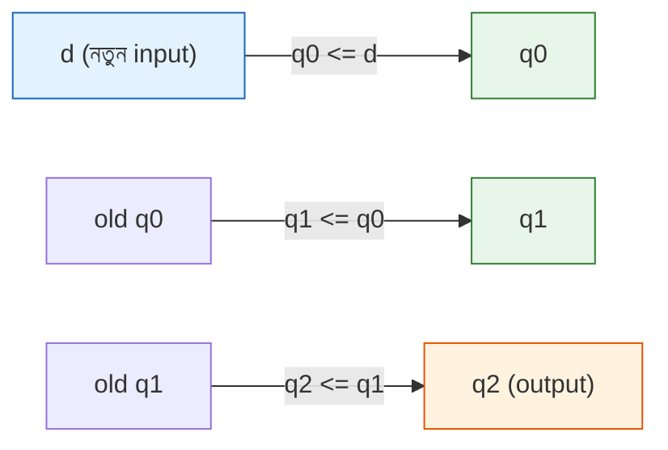
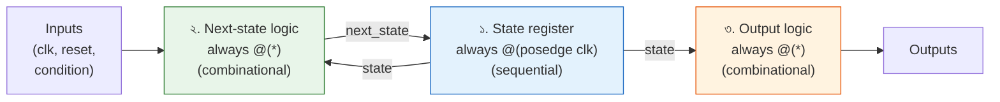
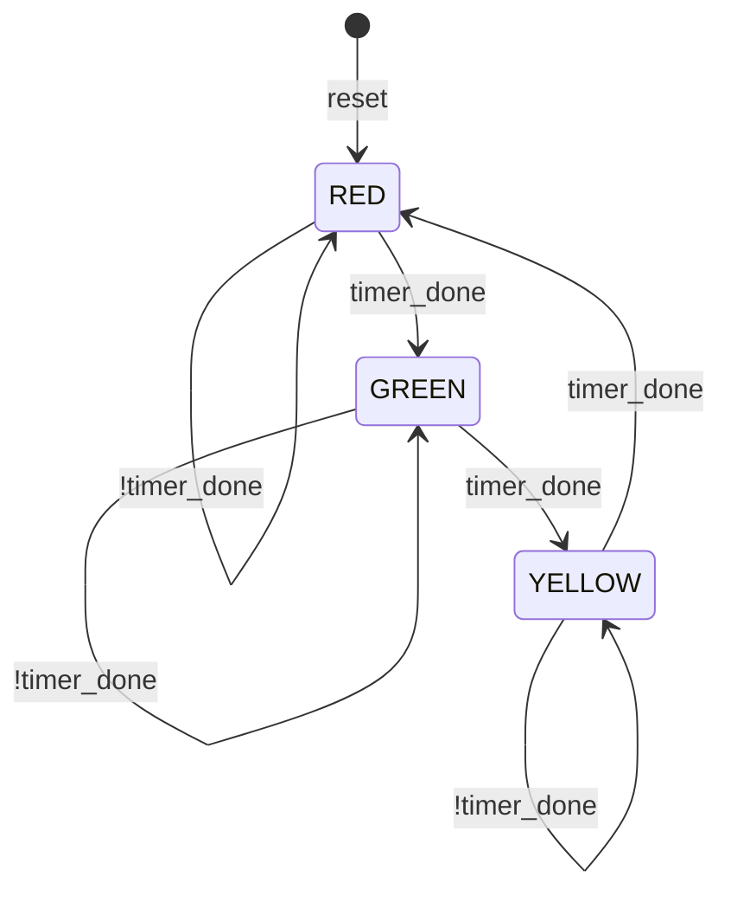
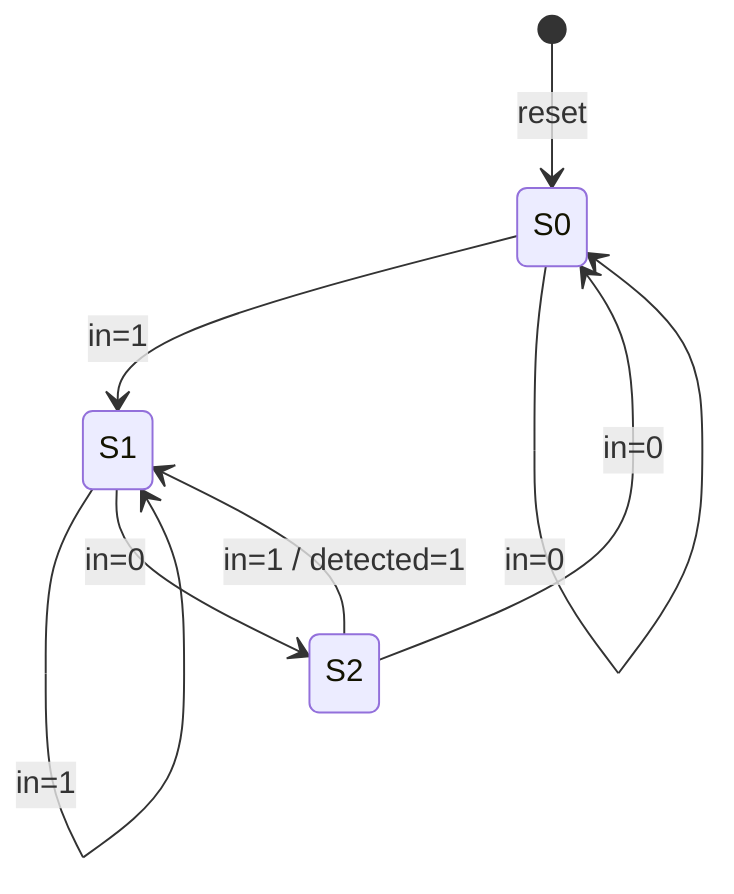

# ⚡ Chapter 6: Build Your Own Sequential Logic - In Code!
## Always Blocks থেকে Registers - তোমার Processor কে Memory দাও Code এ!

> **"assign is great for wires. always is great for memory. Time to add state!"**
>
> **"assign ভালো wire এর জন্য। always ভালো memory র জন্য। এবার state যোগ করো!"**

---

## 🎯 এই Chapter এ তুমি বানাবে:

```
✅ D Flip-Flop - in Verilog
✅ 8-bit Register - with enable
✅ Counter - up/down counter
✅ Shift Register - SISO, SIPO
✅ Finite State Machine - traffic light controller
✅ Blocking vs Non-blocking - THE difference! ⚠️
✅ তোমার processor এর registers - in code! 🎉
```

**Time Required:** 1 week (4-5 hours/day)  
**Tools Needed:** Text editor, Icarus Verilog, GTKWave

**⚠️ WARNING: এই chapter সবচেয়ে important! Blocking/Non-blocking ভুল হলে circuit কাজ করবে না!**

---

Chapter 5 এ তুমি `assign` দিয়ে wire বানিয়েছো — gate, MUX, adder, সব। কিন্তু একটা জিনিস ছিল না: **memory**। `assign y = a & b;` লেখার সাথে সাথে `y` বদলে যায়, পরের মুহূর্তে আগের value মনে রাখে না। এটাই combinational logic — শুধু "এখন" নিয়ে কথা বলে, "আগে কী ছিল" ভুলে যায়।

কিন্তু একটা processor মানেই তো memory। Register এ value জমা থাকে, program counter পরের instruction এর address মনে রাখে, counter গুনতে গুনতে এগোয়। এই "মনে রাখা" ক্ষমতাটাই **sequential logic** — আর Verilog এ এটা আসে `always` block দিয়ে।

এই chapter এ আমরা প্রথমবার তোমার circuit কে **time** আর **state** দেবো। Clock এর প্রতিটা tick এ কী হবে, value কীভাবে এক cycle থেকে পরের cycle এ যাবে — সব তুমি নিজে control করবে। আর হ্যাঁ, এই chapter এর প্রাণভোমরা হলো **blocking (=) vs non-blocking (<=)** — এই একটা জিনিস ভুল করলে তোমার শখের shift register এক cycle এই সব value পার করে দেবে, FSM এলোমেলো হয়ে যাবে। তাই ধীরে পড়ো, intuition টা গাঁথো। একবার বুঝে গেলে আর কখনো ভুল হবে না। চলো শুরু করি! 🚀

---

## 🚀 Quick Win - 5 মিনিটে তোমার First Sequential Code!

কথা অনেক হলো — এবার হাতে কলমে। নিচের ৮ লাইন লিখলেই তুমি জীবনে প্রথমবার **hardware memory** code করে ফেলবে। একটা D Flip-Flop — যেটা clock এর প্রতিটা edge এ input কে ধরে রাখে। এটাই সব register, সব counter, সব processor state এর সবচেয়ে ছোট building block।

### এখনই লেখো - D Flip-Flop in Verilog:

**Create file: `d_ff.v`**

```verilog
// তোমার প্রথম sequential logic!
module d_ff(
    input  clk,    // Clock
    input  d,      // Data input
    output reg q   // Output (reg কারণ always block এ)
);
    // Sequential logic - always @(posedge clk)
    always @(posedge clk) begin
        q <= d;  // Non-blocking assignment!
    end
endmodule
```

🎉 **Congratulations! তুমি hardware memory code করেছো!**

**এই 8 lines = একটা D Flip-Flop chip!**

লক্ষ্য করো তিনটা নতুন জিনিস, যেগুলো এই পুরো chapter জুড়ে বারবার ফিরে আসবে:

- **`output reg q`** — Chapter 5 এ output ছিল শুধু `wire`। কিন্তু always block এর ভেতরে যাকে value দেবে, তাকে `reg` declare করতে হয়। `reg` মানে "এই signal এর value আমি always block এ procedurally set করব"। (নাম শুনে ঘাবড়িও না — `reg` সবসময় physical register বানায় না, এটা শুধু Verilog এর একটা variable type।)
- **`always @(posedge clk)`** — "clock এর rising edge এ (0 থেকে 1 এ যাওয়ার মুহূর্তে) এই block টা চালাও"। এটাই circuit কে time এর সাথে বাঁধে।
- **`q <= d`** — এই non-blocking assignment (`<=`)। এটাই flip-flop বানানোর সঠিক নিয়ম। কেন `<=` আর `=` নয়, সেটাই এই chapter এর সবচেয়ে বড় গল্প — একটু পরেই আসছি।

এখন প্রতিটা টুকরো ভেঙে ভেঙে বুঝি।

---

## ৬.১ Always Blocks - The Heart of Sequential Logic

Verilog এ logic লেখার দুটো জগৎ আছে। একটা হলো `assign` — যা তুমি Chapter 5 এ চিনে ফেলেছো, continuous আর wire-জগতের। আরেকটা হলো `always` — procedural, যেখানে তুমি step-by-step বলতে পারো "এটা হলে এটা করো, ওটা হলে ওটা"। আর সবচেয়ে গুরুত্বপূর্ণ — `always` block দিয়েই hardware এ **memory** তৈরি হয়। চলো পার্থক্যটা পাশাপাশি রেখে দেখি।

### assign vs always:

```verilog
// assign - Continuous (combinational)
assign y = a & b;
// Updates immediately when a or b changes
// No memory, just wires

// always - Procedural (can be sequential)
always @(posedge clk) begin
    q <= d;
end
// Updates only at clock edge
// Has memory!
```

পার্থক্যটা এক বাক্যে: **`assign` সবসময় জেগে থাকে, `always @(posedge clk)` শুধু clock এর ধাক্কায় জাগে।**

`assign y = a & b;` লাইনটা একটা তার জোড়া দেওয়ার মতো — `a` বা `b` যেই মুহূর্তে নড়ে, `y` সাথে সাথে নড়ে, কোনো অপেক্ষা নেই, কোনো স্মৃতি নেই। কিন্তু `always @(posedge clk)` block টা ঘুমিয়ে থাকে; শুধু যখন clock 0 থেকে 1 এ লাফ দেয়, তখন এক ঝলকের জন্য জেগে ওঠে, ভেতরের কাজটা করে, আবার ঘুমিয়ে পড়ে। এই "শুধু edge এ জাগা"-র কারণেই `q` তার value দুই tick এর মাঝখানে **ধরে রাখতে** পারে — আর এটাই memory। তোমার processor এর প্রতিটা register এভাবেই value মনে রাখে।

দুটো জগতের সারসংক্ষেপ:

| বৈশিষ্ট্য | `assign` | `always @(posedge clk)` |
|---|---|---|
| কখন update হয় | input বদলালেই সাথে সাথে | শুধু clock এর rising edge এ |
| memory আছে? | না (শুধু wire) | হ্যাঁ (flip-flop তৈরি হয়) |
| বাঁ পাশের signal এর type | `wire` | `reg` |
| কী বানায় | combinational logic | sequential logic |
| তুলনা | তার জোড়া দেওয়া | ঘড়ির tick এ স্ন্যাপশট নেওয়া |

### Two Types of always Blocks:

এখানে একটা দরকারি কথা: `always` block মানেই কিন্তু sequential না! `always` block এর **sensitivity list** (`@(...)` এর ভেতরের অংশ) ঠিক করে দেয় এটা combinational হবে নাকি sequential। দুটোই খুব দরকারি, আর তুমি Chapter 5 এ আসলে প্রথমটা দেখেও ফেলেছো।

```verilog
// Type 1: Combinational always (Chapter 5 এও দেখেছো)
always @(*) begin
    y = a & b;
end
// @(*) = sensitive to all inputs
// Behaves like assign

// Type 2: Sequential always (New!)
always @(posedge clk) begin
    q <= d;
end
// @(posedge clk) = triggers on clock rising edge
// Creates flip-flops/registers!
```

মনে রাখার সহজ নিয়ম — sensitivity list দেখেই বুঝে নাও কী তৈরি হচ্ছে:

| Sensitivity list | কী trigger করে | কী তৈরি হয় | কোন assignment ব্যবহার করবে |
|---|---|---|---|
| `@(*)` | যেকোনো input বদলালে | combinational logic (wire) | blocking `=` |
| `@(posedge clk)` | clock এর rising edge এ | flip-flop / register | non-blocking `<=` |
| `@(posedge clk or posedge reset)` | clock অথবা reset edge এ | reset সহ flip-flop | non-blocking `<=` |

এই টেবিলটা তোমার পুরো sequential জীবনের cheat-sheet। `@(*)` দেখলে ভাবো "তার", `@(posedge clk)` দেখলে ভাবো "স্মৃতি"। আর কোন assignment কোথায় — সেই গল্পটাই এবার, এই chapter এর হৃদয়ে।

---

## ৬.২ Blocking vs Non-blocking - ⚠️ CRITICAL!

এসে গেছি chapter এর সবচেয়ে গুরুত্বপূর্ণ জায়গায়। সত্যি বলতে, এই একটা concept ঠিকঠাক বুঝলে তুমি sequential Verilog এর অর্ধেক যুদ্ধ জিতে গেলে। আর এটা ভুল বুঝলে — তোমার code simulation এ হয়তো ঠিক চলবে, কিন্তু FPGA তে গিয়ে এমন আচরণ করবে যে তুমি মাথা চুলকাতে চুলকাতে রাত কাবার করবে। তাই এই অংশটা দুবার পড়ো। ❤️

প্রথমে এক লাইনে পার্থক্যটা, তারপর intuition, তারপর উদাহরণ।

### THE Most Important Concept:

```verilog
// Blocking (=) - Executes sequentially
// Non-blocking (<=) - Executes in parallel

// This difference breaks or makes your circuit!
```

### 🧠 Intuition - রান্নাঘরের গল্প দিয়ে বোঝো

শুকনো নিয়ম মুখস্থ করার আগে একটা ছবি মাথায় গেঁথে নাও। এই analogy টা একবার বুঝলে তুমি আর কখনো গুলিয়ে ফেলবে না।

**Blocking (`=`) — একজন রাঁধুনি, একটা একটা করে কাজ।**
ভাবো রান্নাঘরে একজনই রাঁধুনি। সে একটা কাজ পুরো শেষ না করে পরের কাজে হাত দেয় না। তুমি বললে "চাল ধোও, তারপর হাঁড়িতে দাও"। সে আগে চাল ধোবে (কাজ সম্পূর্ণ), **তারপর** সেই ধোয়া চাল হাঁড়িতে দেবে। দ্বিতীয় কাজটা প্রথম কাজের **নতুন ফল** ব্যবহার করে। লাইনগুলো উপর থেকে নিচে একটার পর একটা চলে, আগেরটার ফল হাতে নিয়ে — ঠিক যেমন software এ `a = b; c = a;` লিখলে `c` পায় `a`-এর নতুন মান। এজন্যই একে "blocking" বলে — একটা লাইন পরেরটাকে "আটকে রাখে" যতক্ষণ না নিজে শেষ হয়।

**Non-blocking (`<=`) — অনেক রাঁধুনি, ঘণ্টা বাজলে একসাথে শুরু।**
এবার ভাবো রান্নাঘরে অনেক রাঁধুনি, প্রত্যেকের কাছে একটা করে আলাদা কাজের চিরকুট। ঘণ্টা বাজার ঠিক **আগের মুহূর্তে** সবাই একসাথে তাকায় টেবিলে এখন কী আছে, সেটা মনে রাখে (RHS পড়ে), তারপর ঘণ্টা বাজলে (clock edge এ) সবাই **একসাথে** নিজের ফলটা টেবিলে রাখে। কেউ কারো নতুন ফল দেখে না — সবাই ঘণ্টা বাজার আগে যা ছিল, সেই **পুরোনো** মান দিয়েই কাজ করেছে। তাই `a <= b; c <= a;` লিখলে `c` পায় `a`-এর **পুরোনো** মান, কারণ ওই মুহূর্তে `a` এখনো বদলায়নি।

এটাই আসল hardware। একটা flip-flop clock edge এ তার input এর দিকে তাকায়, আর পরের edge পর্যন্ত সেটা ধরে রাখে। অনেকগুলো flip-flop একই clock এ একসাথে, সমান্তরালে snapshot নেয় — কেউ কারো জন্য অপেক্ষা করে না। `<=` এই সমান্তরাল আচরণটাকেই হুবহু নকল করে। এজন্যই **clock edge এ সবসময় `<=`**।

এক কথায় মনে রাখো:

- `=` (blocking) → **এক রাঁধুনি, sequential, নতুন value সাথে সাথে পাওয়া যায়।**
- `<=` (non-blocking) → **অনেক রাঁধুনি, parallel, পুরোনো value দিয়ে কাজ, সবাই edge এ একসাথে update।**

### Blocking Assignment (=):

কোডে দেখো রাঁধুনির গল্পটা কীভাবে মেলে। নিচে blocking — এক রাঁধুনি, উপর থেকে নিচে: 

```verilog
always @(posedge clk) begin
    a = b;      // Execute first
    c = a;      // Then execute (uses NEW value of a)
end

// Result: c gets value of b (passed through a)
// Like: c = a = b
// Serial execution!
```

এখানে রাঁধুনি প্রথমে `a` কে `b`-এর মান দিল (এই কাজ পুরো শেষ), **তারপর** সেই *নতুন* `a` দিয়ে `c` set করল। ফলাফল: `b`-এর মান `a`-এর ভেতর দিয়ে গড়িয়ে গিয়ে `c` তে পৌঁছে গেল। মাত্র এক clock edge এই `c == b`। দুটো লাইন একে অপরের সাথে শিকল দিয়ে বাঁধা।

### Non-blocking Assignment (<=):

এবার ঠিক একই দুই লাইন, কিন্তু `<=` দিয়ে — অনেক রাঁধুনি, পুরোনো মান, একসাথে: 

```verilog
always @(posedge clk) begin
    a <= b;     // Schedule for end of block
    c <= a;     // Schedule for end of block (uses OLD value of a)
end

// Result: a gets b, c gets OLD a (swap!)
// Parallel execution!
// This is what you want for flip-flops!
```

এখানে দুজন রাঁধুনি। দুজনেই edge এর আগে টেবিল দেখল: `a`-এর মান এখন `old_a`, `b`-এর মান `b`। তারপর edge এ একসাথে রাখল — `a` পেল `b`, আর `c` পেল `old_a` (কারণ `c` যখন RHS পড়ছিল তখন `a` এখনো বদলায়নি)। ফলাফল পুরো আলাদা: এক cycle এ `b` গড়িয়ে `c` তে যায় না; `c` পায় `a`-এর **আগের** মান। flip-flop ঠিক এভাবেই কাজ করে — তাই sequential logic এ এটাই তোমার চাই।

দুটো একসাথে রেখে দেখি:

| | Blocking `=` | Non-blocking `<=` |
|---|---|---|
| **কোড** | `a = b;` <br> `c = a;` | `a <= b;` <br> `c <= a;` |
| **RHS পড়ে কখন** | লাইন চলার সময়, তাৎক্ষণিক | edge এর আগে, পুরোনো মান |
| **update হয় কখন** | লাইনে লাইনে, তখনই | block শেষে, সবাই একসাথে |
| **`c`-এর ফল** | `c = b` (নতুন `a`) | `c = old_a` (পুরোনো `a`) |
| **আচরণ** | sequential, একে একে | parallel, একসাথে |
| **কোথায় ব্যবহার** | combinational `@(*)` | sequential `@(posedge clk)` |

### Visual Comparison:

এবার সবচেয়ে স্পষ্ট উদাহরণ — shift register। এখানে blocking আর non-blocking এর পার্থক্যটা চোখে আঙুল দিয়ে দেখা যায়, কারণ ভুলটা একদম সর্বনাশা: 

```verilog
// Example: Shift register (3-bit)

// ❌ WRONG - Using blocking
always @(posedge clk) begin
    q2 = q1;    // q2 gets q1
    q1 = q0;    // q1 gets q0 (but q2 already got this!)
    q0 = d;     // q0 gets d
end
// Result: d flows through all in ONE clock!
// Not a shift register!

// ✅ CORRECT - Using non-blocking
always @(posedge clk) begin
    q2 <= q1;   // q2 will get OLD q1
    q1 <= q0;   // q1 will get OLD q0
    q0 <= d;    // q0 will get d
end
// Result: Proper shift register!
// Each stage updates simultaneously with OLD values
```

ভেবে দেখো কেন blocking এখানে সর্বনাশ করে। এক রাঁধুনি উপর থেকে নিচে: প্রথমে `q2 = q1` (q2 পেল q1), তারপর `q1 = q0` — কিন্তু q2 তো এর আগেই পুরোনো q1 নিয়ে নিয়েছে! তারপর `q0 = d`। ফলে q0 তে আসা নতুন `d` এক ধাপ এক ধাপ করে নয়, বরং চেষ্টা করলে এক cycle এই সব stage গড়িয়ে যেতে পারে — shift register এর মূল উদ্দেশ্যই ভেস্তে যায়।

non-blocking এ উল্টোটা: তিন রাঁধুনি edge এর আগে সবাই **পুরোনো** মান পড়ে নেয় (q2 পড়ে old q1, q1 পড়ে old q0, q0 পড়ে d), তারপর একসাথে রাখে। তাই প্রতি clock এ data ঠিক **এক ঘর** করে এগোয়। নিচের ছবিতে দেখো এক tick এ কে কার পুরোনো মান নেয়:



প্রতিটা তীর একটা flip-flop। সবগুলো একই clock edge এ, একসাথে, পাশের ঘরের **পুরোনো** মান নিয়ে update হয় — এক ঘর করে শিফট। এটাই `<=` এর জাদু।

### The Golden Rules:

এতক্ষণে intuition তোমার হাতে। এবার সেটাকে চারটা সোনালি নিয়মে বেঁধে ফেলি — এগুলো মনে রাখলে ৯৯% ভুল কখনো হবে না: 

```verilog
// Rule 1: Sequential logic → Use non-blocking (<=)
always @(posedge clk) begin
    q <= d;  // ✅ Correct
end

// Rule 2: Combinational logic → Use blocking (=)
always @(*) begin
    y = a & b;  // ✅ Correct
end

// Rule 3: NEVER mix blocking and non-blocking
always @(posedge clk) begin
    a <= b;  // Non-blocking
    c = a;   // ❌ WRONG! Don't mix!
end

// Rule 4: Use <= for flip-flops, = for wires
```

চারটা নিয়মকে এক বাক্যে গেঁথে নাও: **clock edge দেখলে `<=`, `@(*)` দেখলে `=`, আর একই block এ দুটো মিশিও না।** Rule 3 কেন এত কড়া? কারণ একই block এ `=` আর `<=` মিশালে কোন signal এর কোন version (পুরোনো না নতুন) ব্যবহার হচ্ছে তা বোঝা প্রায় অসম্ভব হয়ে যায় — তোমার নিজের কাছেও, simulator আর synthesis tool এর কাছেও। এই অস্পষ্টতাই সবচেয়ে ভয়ংকর bug এর জন্ম দেয়। তাই নিয়ম মানো, নিশ্চিন্ত থাকো। 🙂

এখন এই নিয়মগুলো হাতে নিয়ে আমরা সত্যিকারের building block বানাবো — flip-flop, register, counter, shift register, FSM। প্রতিটাতেই দেখবে `<=` কীভাবে বারবার ফিরে আসে।

---

## ৬.৩ Sequential Always Block - Flip-Flops

Flip-flop হলো sequential logic এর পরমাণু — এক বিট স্মৃতি। তোমার processor এর প্রতিটা register আসলে কয়েকটা flip-flop পাশাপাশি বসানো। তাই এটা ভালো করে রপ্ত করা মানে পুরো processor এর memory অংশটা রপ্ত করা। আমরা সবচেয়ে সহজটা দিয়ে শুরু করব, তারপর একটু একটু করে reset আর enable যোগ করব — যেন বাস্তব design এ যা যা লাগে সব হাতে থাকে।

### Basic D Flip-Flop:

সবচেয়ে খাঁটি রূপ — শুধু clock এর edge এ `d` কে ধরে `q` তে রাখে, ব্যস: 

```verilog
module d_ff(
    input      clk,
    input      d,
    output reg q
);
    always @(posedge clk) begin
        q <= d;
    end
endmodule
```

কিন্তু একটা সমস্যা: power on করার পর এই flip-flop এর শুরুর মান কী? কেউ জানে না — হতে পারে 0, হতে পারে 1, পুরোপুরি random। বাস্তব circuit এ এটা চলে না; আমাদের একটা "জানা শুরু" দরকার। সেই জন্যই **reset**।

### D Flip-Flop with Reset:

নিচে asynchronous reset — মানে reset clock এর জন্য অপেক্ষা করে না, যেই মুহূর্তে `reset` 1 হয় সেই মুহূর্তেই `q` শূন্য হয়ে যায়। লক্ষ্য করো sensitivity list এ এবার `or posedge reset` যোগ হয়েছে, যাতে block টা reset এর edge এও জাগে: 

```verilog
module d_ff_reset(
    input      clk,
    input      reset,  // Asynchronous reset
    input      d,
    output reg q
);
    always @(posedge clk or posedge reset) begin
        if (reset)
            q <= 1'b0;  // Reset to 0
        else
            q <= d;     // Normal operation
    end
endmodule
```

পড়ার নিয়মটা মাথায় গাঁথো: block টা জাগে clock অথবা reset এর rising edge এ; জেগে প্রথমেই দেখে reset 1 কিনা — হ্যাঁ হলে `q` শূন্য, না হলে স্বাভাবিক ভাবে `d` নেয়। reset যেহেতু সবার আগে চেক হয়, সে সবসময় জয়ী — তাই একে বলে reset এর "priority"।

### D Flip-Flop with Synchronous Reset:

Asynchronous reset যেকোনো মুহূর্তে আঘাত হানে। কিন্তু কখনো কখনো আমরা চাই reset টাও clock এর শৃঙ্খলা মেনে চলুক — শুধু clock edge এলেই reset কার্যকর হোক। একে বলে **synchronous reset**। পার্থক্য কোথায় দেখো: এবার sensitivity list এ `reset` নেই, শুধু `posedge clk`। reset এর চেক block এর ভেতরে আছে ঠিকই, কিন্তু সেটা পড়া হয় তখনই যখন clock edge আসে: 

```verilog
module d_ff_sync_reset(
    input      clk,
    input      reset,  // Synchronous reset
    input      d,
    output reg q
);
    always @(posedge clk) begin
        if (reset)
            q <= 1'b0;
        else
            q <= d;
    end
endmodule
```

দুটো reset কখন কোনটা? দ্রুত একটা তুলনা মাথায় রাখো:

| | Asynchronous reset | Synchronous reset |
|---|---|---|
| Sensitivity list | `@(posedge clk or posedge reset)` | `@(posedge clk)` |
| কখন কাজ করে | যেকোনো মুহূর্তে, তাৎক্ষণিক | শুধু পরের clock edge এ |
| সুবিধা | clock না চললেও circuit safe state এ যায় | timing পরিষ্কার, glitch-প্রতিরোধী |
| বেশি ব্যবহৃত | power-on reset | data path এর ভেতর |

দুটোই ঠিক, project এর প্রয়োজন বুঝে বেছে নেবে। শুরুর দিকে asynchronous reset দিয়েই বেশি কাজ চালাবে।

### D Flip-Flop with Enable:

আরেকটা দারুণ দরকারি control হলো **enable**। এতদিন আমাদের flip-flop প্রতি clock edge এ চোখ বুজে `d` গিলে ফেলত। কিন্তু অনেক সময় আমরা চাই flip-flop শুধু *তখনই* নতুন মান নিক যখন আমরা অনুমতি দিই — বাকি সময় আগের মান **ধরে রাখুক**। processor এ register file ঠিক এভাবেই কাজ করে: শুধু যে register এ লিখতে বলা হয়, সেটাই update হয়, বাকিরা অটল থাকে। লক্ষ্য করো, `if (en)`-এর কোনো `else` নেই — আর এখানে এটাই কাম্য, কারণ "else না থাকা" মানে "আগের মান ধরে রাখো":

```verilog
module d_ff_enable(
    input      clk,
    input      en,     // Enable
    input      d,
    output reg q
);
    always @(posedge clk) begin
        if (en)
            q <= d;    // Load when enabled
        // else: hold previous value
    end
endmodule
```

একটা গুরুত্বপূর্ণ সূক্ষ্মতা: combinational logic এ (`@(*)`) `else` বাদ দিলে অনাকাঙ্ক্ষিত **latch** তৈরি হয় — সে এক বিপদ, একটু পরে ৬.৫ এ দেখব। কিন্তু sequential logic এ (`@(posedge clk)`) `else` বাদ দেওয়া একদম ঠিক — এটাই hardware কে বলে "নতুন মান না পেলে আগেরটা ধরে রাখো"। তাই enable flip-flop এ `else`-এর অনুপস্থিতি bug নয়, বরং feature! এই দুটো পরিস্থিতি গুলিয়ে ফেলো না — sensitivity list-ই এখানে আসল পার্থক্য।

---

## ৬.৪ Build Registers - Multi-bit Storage

একটা flip-flop এক বিট রাখে। কিন্তু একটা processor তো বাইট, এমনকি 32-bit word নিয়ে কাজ করে। সমাধান সহজ: অনেকগুলো flip-flop একই clock এ পাশাপাশি বসিয়ে দাও — তৈরি হয়ে গেল **register**। সুখের কথা, Verilog এ এর জন্য আলাদা কসরত করতে হয় না; শুধু signal এর width বাড়িয়ে দিলেই হয়। `output reg q` কে `output reg [7:0] q` বানালেই এক বিট থেকে আট বিট!

### 8-bit Register (Simple):

আগের D flip-flop এর সাথে এর তফাত শুধু একটাই — `[7:0]`। এক tick এ আটটা বিট একসাথে ঢোকে: 

```verilog
module register_8bit(
    input            clk,
    input      [7:0] d,
    output reg [7:0] q
);
    always @(posedge clk) begin
        q <= d;
    end
endmodule
```

দেখলে? logic হুবহু একই, শুধু তার সংখ্যা আট গুণ। এটাই hardware design এর সৌন্দর্য — একটা ধারণা বুঝে গেলে সেটাকে যেকোনো width এ scale করা যায়।

### 8-bit Register with Enable and Reset:

বাস্তব register এ একা data টুকু রাখলেই চলে না — শুরুতে একটা জানা মান (reset) চাই, আর "কখন লিখব" তার নিয়ন্ত্রণ (enable) চাই। নিচে দুটোই একসাথে। পড়ার priority টা খেয়াল করো: আগে reset, তারপর enable, তারপর (কোনোটাই না হলে) hold: 

```verilog
module register_8bit_full(
    input            clk,
    input            reset,
    input            en,
    input      [7:0] d,
    output reg [7:0] q
);
    always @(posedge clk or posedge reset) begin
        if (reset)
            q <= 8'b0;       // Async reset
        else if (en)
            q <= d;          // Load when enabled
        // else: hold
    end
endmodule
```

এই `if → else if → (implicit hold)` গঠনটা মনে রাখো — counter থেকে FSM পর্যন্ত প্রায় সব sequential block এ এটাই কঙ্কাল। সবচেয়ে জরুরি জিনিস (reset) সবার আগে, তারপর শর্তসাপেক্ষ কাজ (enable), আর সব শর্ত মিথ্যা হলে স্বয়ংক্রিয়ভাবে আগের মান ধরে রাখা।

### Parameterized Register (Any width!):

এতক্ষণ আমরা 8-bit লিখলাম। কিন্তু processor এ কখনো 16-bit, কখনো 32-bit register লাগবে। প্রতিবার নতুন করে module লিখব? না! Verilog এর `parameter` দিয়ে একটাই module বানাও যেটা যেকোনো width এ কাজ করে — এটাই professional রা করে। `WIDTH` হলো একটা knob; instantiate করার সময় ঘুরিয়ে দিলেই register এর আকার বদলে যায়: 

```verilog
module register_param #(
    parameter WIDTH = 8  // Default 8-bit
)(
    input                    clk,
    input                    reset,
    input                    en,
    input      [WIDTH-1:0]   d,
    output reg [WIDTH-1:0]   q
);
    always @(posedge clk or posedge reset) begin
        if (reset)
            q <= {WIDTH{1'b0}};  // All zeros
        else if (en)
            q <= d;
    end
endmodule

// Usage:
// register_param #(.WIDTH(16)) reg16(...);  // 16-bit
// register_param #(.WIDTH(32)) reg32(...);  // 32-bit
```

দুটো নতুন trick এখানে: `WIDTH-1:0` দিয়ে port এর প্রস্থ parameter এর সাথে বেঁধে দেওয়া, আর `{WIDTH{1'b0}}` দিয়ে "WIDTH সংখ্যক শূন্য" বানানো (replication operator — `{3{1'b0}}` মানে `000`)। নিচের comment দুটোতে দেখো একই module থেকে 16-bit আর 32-bit register কত সহজে বের করে আনা যায়। Chapter 14 এ যখন register file বানাবে, এই parameterized ধরনটাই কাজে লাগবে। 🎯

---

## ৬.৫ if-else Statements

এখন একটু control flow শিখি — always block এর ভেতরে কীভাবে সিদ্ধান্ত নেওয়া যায়। তুমি C তে `if-else` দেখেছো, এখানে দেখতে প্রায় একই। কিন্তু মনে রাখতে হবে, এটা software এর মতো "চলমান" সিদ্ধান্ত নয় — synthesis tool এই `if-else` কে hardware এ MUX আর gate এর জালে পরিণত করে। মানে তোমার লেখা প্রতিটা শাখা আসলে তার আর সুইচ হয়ে দাঁড়ায়।

### Basic if-else:

সবচেয়ে সরল রূপ — দুটো পথের একটা বেছে নেওয়া, যা আসলে একটা 2-to-1 MUX: 

```verilog
always @(*) begin
    if (sel == 0)
        y = a;
    else
        y = b;
end
```

লক্ষ্য করো এটা `@(*)` block, তাই combinational — এবং এখানে assignment `=` (blocking), `<=` নয়। সোনালি নিয়ম মনে আছে তো? `@(*)` মানে তার, তার মানে `=`।

### Multiple if-else:

দুইয়ের বেশি পথ লাগলে `else if` দিয়ে শেকল বানাও। মনে রেখো — এটা **priority** তৈরি করে: উপরের শর্ত আগে যাচাই হয়, প্রথম যেটা সত্য সেটাই জেতে: 

```verilog
always @(*) begin
    if (sel == 2'b00)
        y = a;
    else if (sel == 2'b01)
        y = b;
    else if (sel == 2'b10)
        y = c;
    else
        y = d;
end
```

এই priority-র দিকটা মাথায় রাখা জরুরি: যদি একাধিক শর্ত একসাথে সত্য হতে পারে, তাহলে যেটা সবচেয়ে গুরুত্বপূর্ণ সেটা উপরে রাখো। আর যেখানে সব option সমান গুরুত্বের (যেমন একটা MUX), সেখানে `case` ব্যবহার করা পরিষ্কার — সেটা একটু পরেই দেখব।

### Nested if-else:

`if` এর ভেতরে `if` বসিয়ে স্তরে স্তরে সিদ্ধান্ত নেওয়া যায়। নিচের sequential উদাহরণটা আসলে একটা ছোট loadable counter — reset, enable, load, আর increment, সব এক জায়গায়। এই গঠনটা ভালো করে দেখো, কারণ তোমার processor এর program counter প্রায় এমনই দেখতে: 

```verilog
always @(posedge clk) begin
    if (reset) begin
        q <= 0;
    end else begin
        if (en) begin
            if (load)
                q <= d;
            else
                q <= q + 1;  // Increment
        end
    end
end
```

পড়ার ক্রমটা ভেতর থেকে বাইরে: reset হলে শূন্য; নইলে enable থাকলে — load হলে `d` নাও, নইলে এক বাড়াও; আর enable না থাকলে (কোনো `else` নেই বলে) আগের মান ধরে রাখো। এটা sequential block, তাই inner `else`-হীন hold এখানে নিরাপদ। কিন্তু combinational block এ ঠিক এই `else` বাদ দেওয়াটাই বিপদ ডেকে আনে — সেটাই এখন দেখব।

### if without else → Latch! ⚠️

এবার একটা ফাঁদ, যেটায় প্রায় সব নতুন designer একবার না একবার পা দেয়। মনে রাখার মূল কথাটা আগে বলি: **combinational block (`@(*)`) এ তুমি যে signal কে assign করছ, প্রতিটা সম্ভাব্য পথে তাকে একটা মান দিতেই হবে।** কোনো পথ বাদ পড়লে synthesis tool ভাবে "এই ক্ষেত্রে output টা আগের মান ধরে রাখতে হবে" — আর মান ধরে রাখা মানেই memory, মানেই একটা **latch** তৈরি! অথচ তুমি তো combinational logic চেয়েছিলে, memory নয়। এই অনিচ্ছাকৃত latch glitch, timing সমস্যা আর অদ্ভুত bug-এর কারখানা।

কেন এমন হয় ভাবো: `@(*)` block বলছে "এটা শুধু তার"। কিন্তু `if (sel) y = a;` লিখে `sel == 0` এর ক্ষেত্রে `y`-এর কী হবে বলোনি। tool বাধ্য হয়ে ধরে নেয় তখন `y` যা ছিল তাই থাকবে — আর সেই "তাই থাকা"-ই latch। তিনটা রূপ দেখো — একটা ভুল, দুটো ঠিক: 

```verilog
// ❌ DANGEROUS - Creates unwanted latch!
always @(*) begin
    if (sel)
        y = a;
    // Missing else - y retains value when sel=0
    // Creates latch in synthesis!
end

// ✅ CORRECT - Always provide else
always @(*) begin
    if (sel)
        y = a;
    else
        y = b;  // Or assign default value
end

// ✅ ALSO CORRECT - Default assignment
always @(*) begin
    y = b;  // Default
    if (sel)
        y = a;  // Override if sel
end
```

শেষের কৌশলটা (default assignment) সবচেয়ে কাজের অভ্যাস: block এর একদম শুরুতে output কে একটা default মান দিয়ে দাও, তারপর শর্ত মিললে override করো। এতে কোনো পথই কখনো signal কে "মানহীন" রেখে যায় না, তাই latch তৈরির প্রশ্নই ওঠে না। এই অভ্যাসটা গড়ে নাও — FSM এর output logic এ এটাই তোমাকে বাঁচাবে।

---

## ৬.৬ case Statements

অনেকগুলো option এর মধ্যে একটা বাছতে গেলে `else if`-এর লম্বা শেকল পড়তে কষ্ট হয়। তখন `case` অনেক বেশি পরিষ্কার — অনেকটা C-এর `switch`-এর মতো। তোমার processor এর ALU (কোন operation করবে) আর control unit (কোন instruction এসেছে) — দুটোই বড় বড় `case` দিয়ে তৈরি। তাই এটা ভালো করে রপ্ত করা মানে processor এর মস্তিষ্ক বানানোর প্রস্তুতি।

### Basic case:

`sel`-এর মান অনুযায়ী এক একটা শাখা — এটা একটা পরিষ্কার 4-to-1 MUX: 

```verilog
always @(*) begin
    case(sel)
        2'b00: y = a;
        2'b01: y = b;
        2'b10: y = c;
        2'b11: y = d;
    endcase
end
```

এখানে `sel` 2-bit, তাই চারটা সম্ভাবনাই (00, 01, 10, 11) লেখা হয়েছে — সব পথ ঢাকা পড়েছে, কোনো latch হবে না। কিন্তু signal চওড়া হলে সব combination লেখা অসম্ভব হয়ে যায়। তখন বাঁচায় `default`।

### case with default:

`default` হলো `case`-এর নিরাপত্তা জাল — যে মানগুলো আলাদা করে লেখা হয়নি, সব সেখানে গিয়ে পড়ে। এটা `if-else`-এর শেষ `else`-এর মতোই অপরিহার্য, কারণ এটাই নিশ্চিত করে output সবসময় একটা মান পায় (latch নেই!)। নিচে একটা ছোট ALU-র কঙ্কাল দেখো: 

```verilog
always @(*) begin
    case(opcode)
        3'b000: result = a + b;
        3'b001: result = a - b;
        3'b010: result = a & b;
        3'b011: result = a | b;
        default: result = 8'b0;  // Important!
    endcase
end
```

চিনতে পারছ? এটাই তোমার future ALU-র বীজ — `opcode` দেখে যোগ, বিয়োগ, AND, OR বেছে নেওয়া। Chapter 14 এ এই একই `case` গঠন RV32I-এর পুরো instruction set সামলাবে। `default` কে কখনো ভুলো না — comment এ "Important!" লেখা আছে এই কারণেই।

### casex and casez (Don't care):

কখনো কখনো আমরা চাই কিছু বিট কী আছে তা **পাত্তাই না দিতে** — শুধু কয়েকটা বিট মিললেই হলো। যেমন instruction decode করার সময় হয়তো শুধু উপরের দুটো বিট দেখলেই গোত্র বোঝা যায়, নিচের বিটগুলো যা-ই হোক। এর জন্য `casex` আর `casez`-এ "don't care" বিট লেখা যায়: 

```verilog
// casex - X as don't care
always @(*) begin
    casex(instruction)
        4'b00xx: type = 2'b00;  // 0000, 0001, 0010, 0011
        4'b01xx: type = 2'b01;
        4'b10xx: type = 2'b10;
        4'b11xx: type = 2'b11;
    endcase
end

// casez - Z as don't care (more common)
always @(*) begin
    casez(instruction)
        4'b00??: type = 2'b00;  // Same as casex
        4'b01??: type = 2'b01;
        4'b10??: type = 2'b10;
        4'b11??: type = 2'b11;
    endcase
end
```

পার্থক্য: `casex` এ `x` আর `casez` এ `?` (বা `z`) মানে "এই বিট যা-ই হোক, পাত্তা দিও না"। বাস্তবে **`casez` ব্যবহার করাই নিরাপদ** — কারণ `casex` ভুলবশত input এর `x` (unknown) মানকেও don't-care ধরে নিয়ে সিমুলেশনে আসল bug ঢেকে দিতে পারে। তাই অভ্যাস করো `casez` আর `?` চিহ্ন দিয়ে।

### case vs if-else:

দুটোই সিদ্ধান্ত নেয়, কিন্তু কোনটা কখন? সহজ সূত্র: যখন একটা signal-এর নানা মান অনুযায়ী বাছাই (সমান গুরুত্বের) — `case`। আর যখন priority বা range লাগবে (যেমন "৫-এর কম হলে এটা, নইলে...") — `if-else`। নিচে পাশাপাশি দেখো: 

```verilog
// case - Better for many options
case(sel)
    0: y = a;
    1: y = b;
    2: y = c;
    3: y = d;
endcase

// if-else - Better for priority/ranges
if (sel < 2)
    y = a;
else if (sel < 5)
    y = b;
else
    y = c;
```

দেখো ডান পাশে range (`< 2`, `< 5`) ব্যবহার হয়েছে — এ ধরনের তুলনা `case`-এ আনাড়ি দেখায়, কিন্তু `if-else`-এ স্বাভাবিক। এক বাক্যে: **এক signal-এর নির্দিষ্ট মান = `case`, range বা priority = `if-else`।**

---

## ৬.৭ for Loops

Verilog এ `for` loop আছে, কিন্তু এর মানে software-এর loop থেকে একদম আলাদা — এটাই সবচেয়ে বড় চমক। Software এ loop সময়ের সাথে বারবার ঘোরে। Hardware এ loop সময়ের সাথে ঘোরে না; বরং synthesis-এর সময় এটা **খুলে গিয়ে (unroll)** কয়েকটা সমান্তরাল hardware-এর কপি বানায়। মানে `for (i=0; i<8; ...)` লিখলে তুমি ৮ বার কিছু করছ না — তুমি ৮টা একই জিনিস একসাথে বানাচ্ছ। এই দৃষ্টিভঙ্গিটা গেঁথে নাও, তাহলে loop নিয়ে আর কখনো বিভ্রান্ত হবে না।

### Basic for loop:

নিচে ৮-বিট XOR — loop দেখে মনে হচ্ছে ক্রমিক, কিন্তু hardware এ এটা ৮টা XOR gate পাশাপাশি, সবগুলো একসাথে কাজ করছে: 

```verilog
integer i;

always @(*) begin
    for (i = 0; i < 8; i = i + 1) begin
        result[i] = a[i] ^ b[i];
    end
end

// Unrolls to 8 XOR gates in hardware!
```

খেয়াল করো `i` কে `integer` দিয়ে declare করা হয়েছে — এটা শুধু loop ঘোরানোর জন্য, hardware এ এটা register হয়ে থাকে না। comment-এ স্পষ্ট: এই এক লাইন ৮টা আলাদা XOR gate-এ পরিণত হয়। loop টা আসলে "একই কথা ৮ বার লেখার" সংক্ষিপ্ত রূপ মাত্র।

### Parameterized loop:

loop-এর আসল শক্তি দেখা যায় `parameter`-এর সাথে মিলে। নিচে একটা parity checker — সব বিট XOR করে বলে দেয় 1-এর সংখ্যা জোড় না বিজোড়। `WIDTH` বদলালেই এটা যেকোনো প্রস্থের data-র জন্য কাজ করবে, code এক বর্ণও না বদলে: 

```verilog
module parity_checker #(
    parameter WIDTH = 8
)(
    input  [WIDTH-1:0] data,
    output reg         parity
);
    integer i;
    
    always @(*) begin
        parity = 0;
        for (i = 0; i < WIDTH; i = i + 1) begin
            parity = parity ^ data[i];
        end
    end
endmodule
```

লক্ষ্য করো block-এর প্রথম লাইনে `parity = 0;` — এই default assignment-টা সেই latch-প্রতিরোধী অভ্যাসের আরেকটা প্রয়োগ। তারপর loop ঘুরে ঘুরে প্রতিটা বিট XOR করে নেয়। `WIDTH = 8` থেকে `WIDTH = 32` — module এক ফোঁটাও বদলাবে না, শুধু instantiate করার সময় parameter বদলে দেবে।

### ⚠️ Important: Loops in Synthesis

এবার একটা সতর্কতা, যেটা software থেকে আসা সবাইকে চমকে দেয়। যেহেতু hardware এ loop **unroll** হয়ে যায়, synthesis tool কে compile-time-এই জানতে হবে loop ঠিক কতবার ঘুরবে — নইলে সে কয়টা কপি বানাবে বুঝবে না। তাই loop-এর সীমা অবশ্যই **constant** হতে হবে। variable সীমা বা `while` loop সাধারণত synthesizable নয়: 

```verilog
// ✅ SYNTHESIZABLE - Fixed iterations
for (i = 0; i < 8; i = i + 1) begin
    // Loop unrolls to 8 copies
end

// ❌ NOT SYNTHESIZABLE - Variable iterations
for (i = 0; i < count; i = i + 1) begin
    // count is variable - can't determine at compile time
end

// ❌ NOT SYNTHESIZABLE - while loops (usually)
while (condition) begin
    // Unknown number of iterations
end
```

মূল কথা: simulation/testbench-এ variable loop বা `while` দিব্যি চলে (Chapter 7 এ অনেক ব্যবহার করবে), কিন্তু যে code তুমি FPGA বা chip-এ পাঠাবে, সেখানে loop-এর সীমা constant রাখো। সন্দেহ হলে নিজেকে প্রশ্ন করো — "tool কি compile-time-এ গুনে বলতে পারবে কয়টা কপি লাগবে?" উত্তর "না" হলে সেটা synthesizable নয়।

---

## ৬.৮ Build Counters - In Verilog

এবার মজার অংশ — counter! Counter হলো sequential logic-এর সবচেয়ে কাজের আর সবচেয়ে স্বজ্ঞাত উদাহরণ: প্রতি clock edge-এ নিজের মানের সাথে এক যোগ করে। এই এক ধারণা দিয়েই তৈরি হয় ঘড়ি, timer, baud-rate generator, এমনকি তোমার processor-এর **program counter** (যেটা পরের instruction-এর address রাখে)। মজার ব্যাপার — counter আসলে register + adder-এর মিলন, যা তুমি এর মধ্যেই দুটোই চেনো।

### Simple 8-bit Up Counter:

সবচেয়ে সাদাসিধে রূপ: reset হলে শূন্য, নইলে প্রতি edge-এ এক বাড়াও। 8-bit বলে 255-এর পর আপনাআপনি 0-তে ফিরে আসবে (overflow/wrap-around):

```verilog
module counter_8bit(
    input            clk,
    input            reset,
    output reg [7:0] count
);
    always @(posedge clk or posedge reset) begin
        if (reset)
            count <= 8'b0;
        else
            count <= count + 1;  // Increment
    end
endmodule
```

দেখো `count <= count + 1;` — ডান পাশে `count`-এর **পুরোনো** মান পড়া হচ্ছে (non-blocking, মনে আছে?), তার সাথে এক যোগ করে edge-এ নতুন মান বসছে। এই "নিজের পুরোনো মান পড়ে, নতুন মান লেখা" — এটাই সব counter, সব state-machine-এর প্রাণ। এখানেই বোঝা যায় কেন `<=` এত গুরুত্বপূর্ণ।

### Counter with Enable:

আগের counter থামানোর উপায় নেই — চললে চলতেই থাকবে। বাস্তবে আমরা চাই "গোনা শুরু/বন্ধ" করার একটা সুইচ। `en` যোগ করলেই হলো — enable 1 হলে গোনে, 0 হলে যেখানে আছে সেখানেই দাঁড়িয়ে থাকে (আবার সেই `else`-হীন hold):

```verilog
module counter_enable(
    input            clk,
    input            reset,
    input            en,
    output reg [7:0] count
);
    always @(posedge clk or posedge reset) begin
        if (reset)
            count <= 8'b0;
        else if (en)
            count <= count + 1;
    end
endmodule
```

এই enable-ওয়ালা counter দিয়েই পরে timer বা baud-rate generator বানাবে — যেখানে নির্দিষ্ট শর্তে গোনা চালু/বন্ধ করতে হয়।

### Up/Down Counter:

কখনো শুধু বাড়ানো নয়, কমানোও দরকার। একটা `up_down` control যোগ করো — 1 হলে এক বাড়াও, 0 হলে এক কমাও। এ ধরনের bidirectional counter position tracking বা reversible গোনায় কাজে লাগে: 

```verilog
module counter_updown(
    input            clk,
    input            reset,
    input            en,
    input            up_down,  // 1=up, 0=down
    output reg [7:0] count
);
    always @(posedge clk or posedge reset) begin
        if (reset)
            count <= 8'b0;
        else if (en) begin
            if (up_down)
                count <= count + 1;  // Up
            else
                count <= count - 1;  // Down
        end
    end
endmodule
```

গঠনটা ভেঙে দেখো: reset > enable > (up_down অনুযায়ী যোগ বা বিয়োগ)। সেই পরিচিত priority কঙ্কাল আবার — সবচেয়ে জরুরি শর্ত উপরে।

### BCD Counter (0-9):

সাধারণ counter 255 (8-bit) বা নিজের max-এ গিয়ে wrap করে। কিন্তু ঘড়ি বা decimal display-তে আমরা চাই গোনা **9-এর পর 0**-তে ফিরুক, কারণ প্রতিটা অঙ্ক 0–9। একে বলে BCD (Binary-Coded Decimal) counter। কৌশলটা সহজ — 9-এ পৌঁছলে হাতে ধরে 0 করে দাও, নইলে স্বাভাবিকভাবে বাড়াও: 

```verilog
module counter_bcd(
    input            clk,
    input            reset,
    output reg [3:0] count
);
    always @(posedge clk or posedge reset) begin
        if (reset)
            count <= 4'b0;
        else begin
            if (count == 4'd9)
                count <= 4'd0;  // Wrap at 9
            else
                count <= count + 1;
        end
    end
endmodule
```

খেয়াল করো `count == 4'd9` এর check — এটাই BCD-র গোপন কথা। চারটা এমন BCD counter পাশাপাশি বসিয়ে, একটার wrap দিয়ে পরেরটাকে গোনালে, তৈরি হয়ে যায় ঘণ্টা-মিনিট-সেকেন্ডের digital clock — যেটা Chapter 11-এ FPGA-তে বানাবে! এই ছোট module-টাই সেই বড় project-এর ইট।

---

## ৬.৯ Build Shift Registers

মনে আছে chapter-এর শুরুতে shift register দিয়েই blocking vs non-blocking-এর পার্থক্য দেখিয়েছিলাম? এবার সেটাকে সত্যিকারের module-এ রূপ দেবো। Shift register প্রতি clock-এ data কে এক ঘর সরিয়ে দেয় — ঠিক যেন বালতি-ব্রিগেডে এক হাত থেকে আরেক হাতে পানি যাওয়া। এটা serial আর parallel data-র মধ্যে সেতু গড়ে, তাই UART, SPI-র মতো communication protocol-এর প্রাণভোমরা। নাম তিনটে অক্ষরে বোঝা যায়: S = Serial, P = Parallel, I = In, O = Out।

### SISO - Serial In Serial Out:

এক বিট ঢোকে, register-এর ভেতর দিয়ে গড়িয়ে, কয়েক clock পরে এক বিট বের হয়। `{shift_reg[2:0], serial_in}` হলো concatenation — পুরোনো নিচের তিন বিটের পাশে নতুন বিট জুড়ে দিয়ে পুরোটা এক ঘর বাঁয়ে ঠেলে দেওয়া: 

```verilog
module shift_reg_siso(
    input      clk,
    input      reset,
    input      serial_in,
    output     serial_out
);
    reg [3:0] shift_reg;
    
    always @(posedge clk or posedge reset) begin
        if (reset)
            shift_reg <= 4'b0;
        else
            shift_reg <= {shift_reg[2:0], serial_in};
    end
    
    assign serial_out = shift_reg[3];
endmodule
```

লক্ষ্য করো শেষে আবার `assign` ফিরে এসেছে — `serial_out` শুধু সবচেয়ে উপরের বিটের সাথে জোড়া একটা তার, কোনো নতুন memory নয়। এভাবেই sequential (always) আর combinational (assign) একই module-এ পাশাপাশি বাস করে। এই SISO দিয়ে data delay বা serial pipeline বানানো যায়।

### SIPO - Serial In Parallel Out:

এবার serial data ঢুকিয়ে একসাথে গোটা byte বের করি। বিট একটা একটা করে আসে, কিন্তু ৮ বিট জমে গেলে পুরো `parallel_out` একসাথে পড়া যায় — ঠিক যেমন UART receiver একটা একটা বিট ধরে শেষে আস্ত একটা byte তোমার হাতে দেয়: 

```verilog
module shift_reg_sipo(
    input            clk,
    input            reset,
    input            serial_in,
    output reg [7:0] parallel_out
);
    always @(posedge clk or posedge reset) begin
        if (reset)
            parallel_out <= 8'b0;
        else
            parallel_out <= {parallel_out[6:0], serial_in};
    end
endmodule
```

### PISO - Parallel In Serial Out:

উল্টো দিক — গোটা byte একসাথে ঢুকিয়ে এক বিট করে বের করি। এটাই UART transmitter-এর কাজ: তুমি ৮ বিট data দাও, সে একটা একটা করে তার দিয়ে পাঠায়। এখানে দুটো control: `load` দিয়ে এক ঝটকায় পুরো parallel data ভরো, তারপর `shift_en` দিয়ে এক বিট করে বের করো (পেছনে 0 ঢুকিয়ে): 

```verilog
module shift_reg_piso(
    input      [7:0] parallel_in,
    input            clk,
    input            reset,
    input            load,      // Load parallel data
    input            shift_en,  // Enable shifting
    output           serial_out
);
    reg [7:0] shift_reg;
    
    always @(posedge clk or posedge reset) begin
        if (reset)
            shift_reg <= 8'b0;
        else if (load)
            shift_reg <= parallel_in;  // Load
        else if (shift_en)
            shift_reg <= {shift_reg[6:0], 1'b0};  // Shift
    end
    
    assign serial_out = shift_reg[7];
endmodule
```

`load` আর `shift_en`-এর priority টা খেয়াল করো — `load` আগে, যাতে শেষ মুহূর্তে নতুন data এলে আগের shift-এর চেয়ে সেটাকেই গুরুত্ব দেওয়া হয়। load করো, তারপর ৮ clock ধরে shift করো — এক byte পাঠানো শেষ। তোমার final project-এর UART transmitter-এর মূল ইঞ্জিন এটাই।

---

## ৬.১০ Build Finite State Machines - In Code!

এসে গেলাম sequential logic-এর মুকুট — **Finite State Machine (FSM)**। এতক্ষণ আমরা একটা একটা করে ইট বানিয়েছি; FSM হলো সেই ইট দিয়ে বানানো "মস্তিষ্ক", যা ধাপে ধাপে সিদ্ধান্ত নেয়: "এখন আমি এই অবস্থায় আছি, input দেখে পরের অবস্থায় যাব, আর এই অবস্থায় আমার output এই হবে।" Traffic light থেকে vending machine, UART থেকে তোমার processor-এর control unit — সব আসলে FSM। এটা রপ্ত করা মানে digital design-এর সবচেয়ে শক্তিশালী হাতিয়ার হাতে পাওয়া।

### FSM Structure:

FSM-এর তিনটে কাজ, আর professional রা সাধারণত এই তিনটেকে আলাদা আলাদা always block-এ ভাগ করে লেখে — তাতে code পড়া আর debug করা দুটোই সহজ হয়: 

```verilog
// Three always blocks (recommended):
// 1. State register (sequential)
// 2. Next state logic (combinational)
// 3. Output logic (combinational)

// Or two always blocks:
// 1. State register + next state (sequential)
// 2. Output logic (combinational)
```

তিনটে block-কে এভাবে ভাবো — এটাই FSM-এর মানসিক ছবি:



দেখো ভূমিকা ভাগটা কত পরিষ্কার: **state register** (নীল) শুধু clock edge-এ বর্তমান state ধরে রাখে — তাই এটাই একমাত্র sequential block, এখানে `<=`। **Next-state logic** (সবুজ) বর্তমান state আর input দেখে ঠিক করে পরের state কী হবে — combinational, তাই `=`। **Output logic** (কমলা) বর্তমান state দেখে output ঠিক করে — এটাও combinational। মনে রাখার সূত্র: একটাই block clock-এ চলে (memory), বাকি দুটো শুধু তার (logic)।

### Example: Simple Traffic Light Controller

তত্ত্ব যথেষ্ট — এবার একটা চেনা উদাহরণ: traffic light। তিনটে state (RED, YELLOW, GREEN), আর `timer_done` signal এলে এক state থেকে পরেরটায় যায়। state গুলো ঘুরে ঘুরে আসে: RED → GREEN → YELLOW → RED → ...

**States:**
```
RED    → 30 seconds
YELLOW → 5 seconds
GREEN  → 25 seconds
```

state-গুলো কীভাবে ঘোরে, সেটা একটা state diagram-এ দেখলে সবচেয়ে পরিষ্কার হয়:



খেয়াল করো প্রতিটা state-এ একটা করে নিজের দিকে ফিরে আসা তীর (self-loop) আছে — মানে `timer_done` না এলে state নিজের জায়গায় অপেক্ষা করে। আর `timer_done` এলে চক্রাকারে পরের রঙে যায়। এবার এই diagram-টাই হুবহু code-এ রূপ নেবে — তিনটে block, ঠিক উপরের ছবির মতো:

**Code:**

```verilog
module traffic_light(
    input      clk,
    input      reset,
    input      timer_done,
    output reg red,
    output reg yellow,
    output reg green
);
    // State encoding
    localparam RED    = 2'b00;
    localparam YELLOW = 2'b01;
    localparam GREEN  = 2'b10;
    
    reg [1:0] state, next_state;
    
    // State register (always @posedge)
    always @(posedge clk or posedge reset) begin
        if (reset)
            state <= RED;
        else
            state <= next_state;
    end
    
    // Next state logic (always @*)
    always @(*) begin
        case(state)
            RED: begin
                if (timer_done)
                    next_state = GREEN;
                else
                    next_state = RED;
            end
            
            GREEN: begin
                if (timer_done)
                    next_state = YELLOW;
                else
                    next_state = GREEN;
            end
            
            YELLOW: begin
                if (timer_done)
                    next_state = RED;
                else
                    next_state = YELLOW;
            end
            
            default: next_state = RED;
        endcase
    end
    
    // Output logic (always @*)
    always @(*) begin
        // Default all off
        red = 0;
        yellow = 0;
        green = 0;
        
        case(state)
            RED:    red = 1;
            YELLOW: yellow = 1;
            GREEN:  green = 1;
            default: red = 1;
        endcase
    end
endmodule
```

পুরো module-টা মিলিয়ে দেখো উপরের তিন-block ছবির সাথে। প্রথম block (`@(posedge clk)`) state ধরে রাখে — একমাত্র `<=` এখানেই। দ্বিতীয় block (`@(*)`) `case` দিয়ে পরের state ঠিক করে। তৃতীয় block (`@(*)`) আবার `case` দিয়ে কোন বাতি জ্বলবে তা ঠিক করে — আর লক্ষ্য করো শুরুতেই `red = 0; yellow = 0; green = 0;` দিয়ে সব নিভিয়ে দেওয়া (সেই latch-প্রতিরোধী default!), তারপর শুধু দরকারিটা জ্বালানো। তিনটে block, পরিষ্কার দায়িত্ব — এটাই FSM লেখার সোনার মান।

### Example: Sequence Detector (101)

আরেকটা ক্লাসিক — sequence detector। এটা input stream-এ নির্দিষ্ট প্যাটার্ন (এখানে `101`) খোঁজে আর পেলে `detected` 1 করে। এ ধরনের FSM communication-এ "start pattern" খোঁজা, password matching, protocol decode — সব জায়গায় লাগে। এবার আমরা **দুই-block** শৈলী দেখব: next-state আর output logic এক combinational block-এ একসাথে (state register আলাদা)। state তিনটে — S0 (কিছু পাইনি), S1 (একটা `1` পেয়েছি), S2 (`10` পেয়েছি):

```verilog
module sequence_detector(
    input      clk,
    input      reset,
    input      in,
    output reg detected
);
    // States
    localparam S0 = 2'b00;  // Initial
    localparam S1 = 2'b01;  // Got 1
    localparam S2 = 2'b10;  // Got 10
    
    reg [1:0] state, next_state;
    
    // State register
    always @(posedge clk or posedge reset) begin
        if (reset)
            state <= S0;
        else
            state <= next_state;
    end
    
    // Next state + output logic combined
    always @(*) begin
        // Defaults
        next_state = S0;
        detected = 0;
        
        case(state)
            S0: begin
                if (in)
                    next_state = S1;
                else
                    next_state = S0;
            end
            
            S1: begin
                if (in)
                    next_state = S1;  // Stay (multiple 1s)
                else
                    next_state = S2;  // Got "10"
            end
            
            S2: begin
                if (in) begin
                    detected = 1;     // Found "101"!
                    next_state = S1;  // Start looking for next
                end else begin
                    next_state = S0;
                end
            end
            
            default: next_state = S0;
        endcase
    end
endmodule
```

state গুলো কীভাবে নড়ে, সেটা diagram-এ দেখলে যুক্তিটা ঝকঝকে হয়ে যায়:



লক্ষ্য করো কয়েকটা চতুর চাল। S1-এ থেকে আবার `1` এলে S1-এই থাকে — কারণ `11` দেখলেও শেষ `1` টা নতুন প্যাটার্নের শুরু হতে পারে। S2-তে (`10` পাওয়ার পর) `1` এলে প্যাটার্ন `101` সম্পূর্ণ — তাই ওই transition-এই `detected = 1`, আর সাথে সাথে S1-এ ফিরে যায় (কারণ এই শেষ `1`-টা পরের `101`-এর প্রথম `1` হতে পারে, overlapping detection!)। এই "নতুন শুরু হিসেবে গণ্য করা" চিন্তাটাই FSM design-এর আসল শিল্প। code-এ output `detected` সরাসরি transition-এ সেট হয় (Mealy machine), তাই তোমার testbench-এ ঠিক সময়ে এটা ধরতে হবে — Chapter 7-এ সেটাই শিখবে।

---

## ৬.১১ Common Mistakes & How to Fix

প্রতিটা hardware designer — এমনকি অভিজ্ঞরাও — এই ভুলগুলোতে একবার না একবার পা দিয়েছে। ভালো খবর: একবার চিনে রাখলে আজীবন এড়িয়ে চলতে পারবে। এই অংশটাকে তোমার debugging checklist হিসেবে ভাবো — circuit অদ্ভুত আচরণ করলে প্রথমেই এখানে ফিরে এসো। নিচের প্রতিটা ভুলই আগের section-গুলোতে ছুঁয়ে গেছি; এবার এক জায়গায় গুছিয়ে রাখলাম।

### Mistake 1: Mixing Blocking/Non-blocking ❌

সবচেয়ে কুখ্যাত ভুল — একই block-এ `=` আর `<=` মেশানো। মনে আছে রাঁধুনির গল্প? এক block-এ একজন আর অনেক রাঁধুনি একসাথে কাজ করলে কে কখন টেবিল দেখছে তার হিসাব রাখা অসম্ভব। তাই এক block-এ একটাই ধরন: 

```verilog
// ❌ WRONG
always @(posedge clk) begin
    a <= b;  // Non-blocking
    c = a;   // Blocking - DON'T MIX!
end

// ✅ CORRECT
always @(posedge clk) begin
    a <= b;
    c <= a;  // Both non-blocking
end
```

### Mistake 2: Using = in Sequential ❌

clock-edge block-এ ভুল করে `=` লেখা। এটা simulation-এ মাঝেমধ্যে "কাজ করে" বলে মনে হয়, কিন্তু একাধিক flip-flop থাকলেই গোলমাল পাকায় (ঠিক shift register-এর সেই ভুলটার মতো)। নিয়ম সাফ: clock edge দেখলেই `<=`।

```verilog
// ❌ WRONG
always @(posedge clk) begin
    q = d;  // Blocking in sequential!
end

// ✅ CORRECT
always @(posedge clk) begin
    q <= d;  // Non-blocking
end
```

### Mistake 3: Missing else → Latch ❌

combinational block-এ (`@(*)`) `else` বাদ দেওয়া — অনিচ্ছাকৃত latch তৈরি হয়। (মনে রেখো: এই নিয়মটা শুধু combinational-এর জন্য; sequential block-এ `else` বাদ দেওয়া তো hold-এর স্বাভাবিক উপায়, ওটা ঠিক আছে।) এখানে `@(*)` block, তাই প্রতিটা পথে `q`-কে একটা মান দিতেই হবে: 

```verilog
// ❌ WRONG - Creates latch
always @(*) begin
    if (en)
        q = d;
    // Missing else!
end

// ✅ CORRECT
always @(*) begin
    if (en)
        q = d;
    else
        q = 0;  // Or some default
end
```

### Mistake 4: Multiple Drivers ❌

একই signal-কে দুটো আলাদা always block থেকে চালানো। ভাবো দুজন ড্রাইভার একই গাড়ির স্টিয়ারিং ধরে টানছে — hardware জানে না কার কথা শুনবে, ফলাফল অনিশ্চিত (এবং synthesis সাধারণত error দেবে)। নিয়ম: **এক signal, এক always block**। দুটো উৎস লাগলে একটা block-এর ভেতরে শর্ত দিয়ে বেছে নাও: 

```verilog
// ❌ WRONG
always @(posedge clk) begin
    q <= a;
end

always @(posedge clk) begin
    q <= b;  // Multiple drivers!
end

// ✅ CORRECT - One always block
always @(posedge clk) begin
    if (sel)
        q <= a;
    else
        q <= b;
end
```

### Mistake 5: Incomplete case ❌

`case`-এ সব সম্ভাবনা না ঢাকা আর `default`-ও না দেওয়া — এটাও সেই latch-এর ফাঁদ, কারণ যে মানগুলো লেখা হয়নি সেখানে output আগের মান ধরে রাখতে বাধ্য হয়। সমাধান এক লাইন: সবসময় একটা `default` রাখো। এটাই তোমার নিরাপত্তা জাল: 

```verilog
// ❌ WRONG - Missing cases
always @(*) begin
    case(sel)
        2'b00: y = a;
        2'b01: y = b;
        // Missing 10 and 11!
    endcase
end

// ✅ CORRECT - Use default
always @(*) begin
    case(sel)
        2'b00: y = a;
        2'b01: y = b;
        2'b10: y = c;
        default: y = d;
    endcase
end
```

পাঁচটা ভুল এক নজরে — প্রিন্ট করে দেয়ালে টাঙিয়ে রাখার মতো:

| # | ভুল | লক্ষণ | সমাধান |
|---|---|---|---|
| 1 | এক block-এ `=` আর `<=` মেশানো | অপ্রত্যাশিত মান, debug করা কঠিন | এক block-এ একটাই ধরন |
| 2 | sequential-এ `=` ব্যবহার | একাধিক FF থাকলে ভুল আচরণ | clock edge = `<=` |
| 3 | combinational-এ `else`/default নেই | অনিচ্ছাকৃত latch | প্রতিটা পথে মান দাও |
| 4 | এক signal-এ একাধিক driver | অনিশ্চিত মান / synthesis error | এক signal, এক block |
| 5 | `case` অসম্পূর্ণ | latch | সবসময় `default` |

দেখো ভুলগুলোর বেশিরভাগই দুটো মূল ধারণায় গিয়ে ঠেকে — **blocking vs non-blocking** আর **প্রতিটা পথে মান দেওয়া (latch এড়ানো)**। এই দুটো গেঁথে গেলে তুমি ৯০% bug-এর আগেই ঢাল তুলে ফেললে। 🛡️

---

## ৬.১২ Your 1-Week Build Plan

তত্ত্ব আর উদাহরণ তো পড়লে — কিন্তু hardware হাতে কলমে না করলে গাঁথে না। নিচে সাত দিনের একটা পরিকল্পনা, প্রতিদিন একটা করে topic, যাতে এই chapter-এর সব ধারণা নিজে টাইপ করে, simulate করে রপ্ত করতে পারো। প্রতিদিন নিজেই একটা ছোট testbench লিখে waveform দেখো — এতেই আসল শেখা।

### Day 1: Flip-Flops
```
□ Write D FF (basic)
□ D FF with reset
□ D FF with enable
□ Test all versions
```

### Day 2: Registers
```
□ 8-bit register
□ Register with enable
□ Parameterized register
□ Test with different widths
```

### Day 3: if-else & case
```
□ MUX using if-else
□ MUX using case
□ Priority encoder
□ Understand latches!
```

### Day 4: Counters
```
□ Up counter
□ Down counter
□ Up/down counter
□ BCD counter
```

### Day 5: Shift Registers
```
□ SISO shift register
□ SIPO shift register
□ PISO shift register
□ Test serial data
```

### Day 6: FSMs
```
□ Traffic light FSM
□ Sequence detector FSM
□ Test state transitions
□ Waveform analysis
```

### Day 7: Review & Project
```
□ Review all mistakes
□ Blocking vs Non-blocking quiz
□ Complete final project
□ Test thoroughly
```

---

## ৬.১৩ Blocking vs Non-blocking - Final Quiz ⚠️

সত্যিকারের পরীক্ষা — নিজেকে যাচাই করো! নিচের তিনটে প্রশ্নের উত্তর **আগে নিজে ভাবো**, তারপর নিচে মিলিয়ে দেখো। রাঁধুনির গল্পটা মাথায় রেখে ভাবো: blocking হলে এক রাঁধুনি (নতুন মান সাথে সাথে), non-blocking হলে অনেক রাঁধুনি (পুরোনো মান, edge-এ একসাথে)। এই তিনটে ঠিক করতে পারলে বুঝবে concept টা সত্যিই গেঁথে গেছে। 💪

### Question 1:
```verilog
always @(posedge clk) begin
    a = 1;
    b = a;
end
// What is b? Answer: ___
```

### Question 2:
```verilog
always @(posedge clk) begin
    a <= 1;
    b <= a;
end
// What is b? Answer: ___
```

### Question 3:
```verilog
always @(posedge clk) begin
    x <= y;
    y <= x;
end
// What happens? Answer: ___
```

ভেবেছ তো? Q3 টা বিশেষভাবে দারুণ — দুজন রাঁধুনি একে অপরের পুরোনো মান নিচ্ছে, তাই দুটো মান অদলবদল হয়ে যায়! blocking দিয়ে লিখলে এই swap কখনোই হতো না (দুটোই `y`-এর মান পেত)। এখন মিলিয়ে দেখো:

**Answers:**
```
Q1: b = 1 (blocking - b gets NEW a)
Q2: b = old_a (non-blocking - b gets OLD a)
Q3: Swap! x and y exchange values
```

তিনটেই মিলেছে? দারুণ — তুমি sequential Verilog-এর সবচেয়ে কঠিন গিঁটটা খুলে ফেলেছ! একটা ভুল হলেও চিন্তা নেই, উপরে রাঁধুনির গল্পটা আরেকবার পড়ো, তারপর প্রশ্নগুলো আবার চেষ্টা করো। এই concept-টা গাঁথা মানেই বাকি পুরো বইয়ে তুমি অনেক এগিয়ে।

---

## ৬.১৪ Chapter 6 Mission Complete!

বাহ! তুমি এই বইয়ের সবচেয়ে গুরুত্বপূর্ণ chapter-গুলোর একটা শেষ করলে। ভেবে দেখো — মাত্র কয়েক ঘণ্টা আগে তোমার circuit-এর কোনো স্মৃতি ছিল না, শুধু তার। আর এখন তুমি flip-flop, register, counter, shift register, এমনকি আস্ত state machine বানাতে পারো — সব নিজের হাতে, Verilog-এ। এগুলোই সেই ইট, যা দিয়ে Chapter 14-এ তোমার RISC-V processor দাঁড়াবে। 🎉

### তুমি এখন পারো:

```
✅ Write sequential always blocks
✅ Use blocking vs non-blocking correctly
✅ Design flip-flops in Verilog
✅ Build registers with control
✅ Write counters (up/down/BCD)
✅ Design shift registers
✅ Create finite state machines
✅ Avoid common mistakes
✅ তোমার processor এর sequential parts code করা!
```

### তুমি বানিয়েছো:
```
✅ D Flip-Flops (multiple versions)
✅ 8-bit Registers
✅ Counters (4 types)
✅ Shift Registers (SISO, SIPO, PISO)
✅ FSMs (traffic light, sequence detector)
✅ All with testbenches! 🎉
```

### Stats:
```
Sequential modules: 15+
Lines of Verilog: 500+
State machines: 2
Critical concepts mastered: Blocking/Non-blocking! ✓
Level: Sequential Verilog Master! 🏆
```

### Next Level Unlocked:
```
→ Chapter 7: Testbenches & Simulation
   তুমি শিখবে: Advanced testing
   Waveforms, assertions, coverage!
   
   From coding → Professional testing!
```

---

## 🎯 Final Project - Before Next Chapter

এখন সব শেখা এক জায়গায় জড়ো করার সময় — একটা সত্যিকারের project! UART transmitter বানাও, যেটা parallel data নিয়ে একটা একটা বিট করে তার দিয়ে পাঠায়। কেন এটা নিখুঁত শেষ-প্রকল্প? কারণ এতে এই chapter-এর **সবকটা** ধারণা একসাথে লাগবে: কোন বিট কখন পাঠাবে তা ঠিক করতে **FSM**, data serialize করতে **shift register** (তোমার PISO!), আর baud rate-এর timing গুনতে **counter**। তিনটে আলাদা ইট মিলে একটা কাজের যন্ত্র — এটাই hardware design-এর আসল মজা।

প্রথমবারে কঠিন লাগলে ভেঙে ভেঙে করো: আগে FSM-এর state গুলো কাগজে আঁকো (IDLE → START → DATA → STOP), তারপর এক এক অংশ লিখে আলাদা আলাদা test করো। আটকে গেলে ৬.৯ আর ৬.১০ আবার দেখো। পারবে — তুমি এতদূর এসেছ! 💪

### Project: Complete UART Transmitter

**Requirements:**
```
UART TX with:
✅ 8-bit parallel data input
✅ Start bit, data bits, stop bit
✅ Configurable baud rate
✅ FSM-based control
✅ Shift register for serialization
✅ Complete testbench

This uses:
- FSM (state control)
- Shift register (data)
- Counter (baud timing)
- All Chapter 6 concepts!
```

---

## 🏆 Achievement Unlocked!

```
Level 6: ✅ COMPLETE - Sequential Verilog Expert!
Progress: [██████░░░░░░░░░░░░░░░░░░░] 24%

XP Gained: +3000
Skills: Sequential Logic, FSMs, Critical Concepts

Badges Earned:
🥉 Flip-Flop Coder
🥈 Register Builder
🥇 FSM Designer
🏅 Blocking/Non-blocking Master ⭐
🎖️ Counter Creator
🏆 Sequential Logic Expert

Next: Chapter 7 - Professional Testing!
      Waveforms, coverage, debugging! 📊
```

---

**[⬅️ Previous: Chapter 5](Chapter_05_Verilog_Basics.md)** | **[➡️ Next: Chapter 7](Chapter_07_Testbenches.md)**

---

<div align="center">

**"You mastered sequential Verilog. Next, you'll master testing!"**

**"তুমি sequential Verilog master করেছো। এবার testing master করবে!"**

Made with ❤️ for builders | বানানোর জন্য ভালোবাসা দিয়ে তৈরি

</div>
