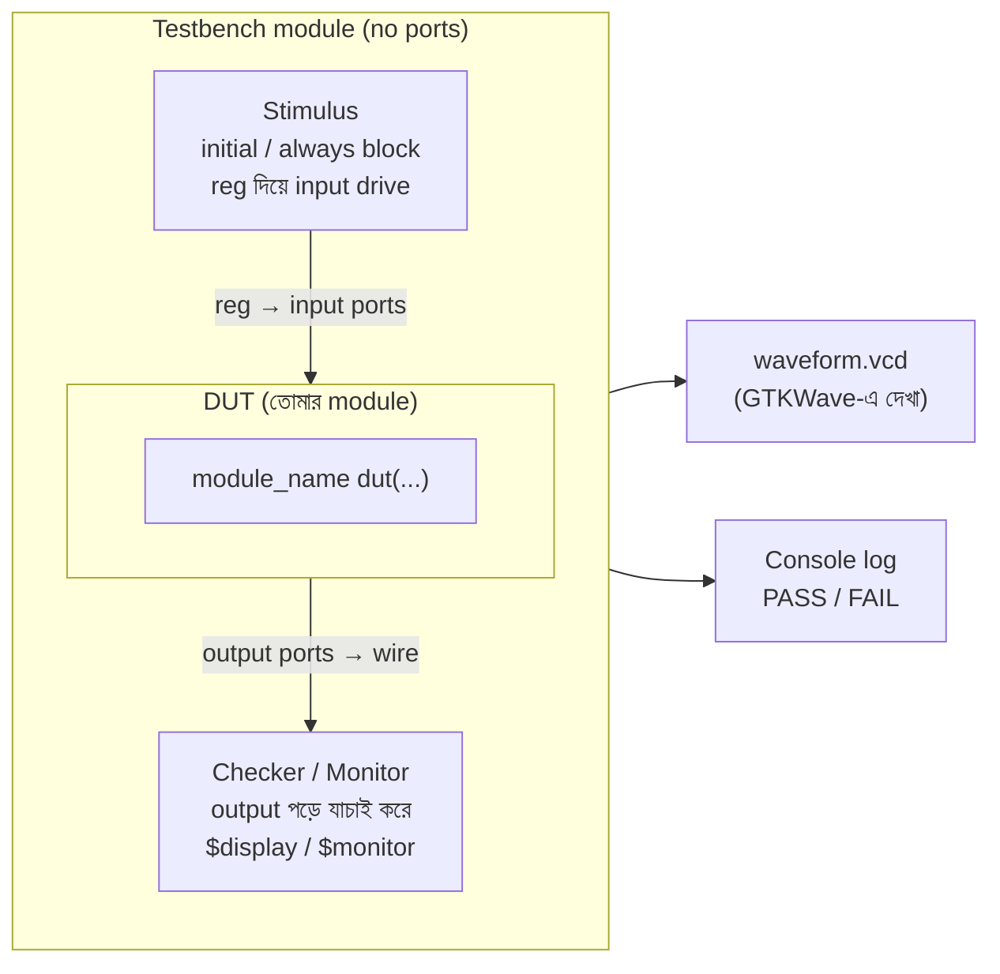
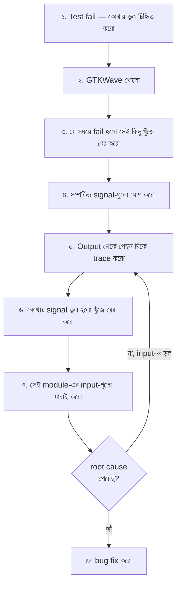

# 🧪 Chapter 7: Build Your Own Test Suite
## Testbenches থেকে Waveforms - তোমার Code Test করো Professionally!

> **"Code without tests is broken by design. Time to verify like a pro!"**
>
> **"Test ছাড়া code মানে broken design। এবার professional verification করো!"**

---

গত chapter-গুলোতে তুমি Verilog লিখতে শিখেছো — gate, adder, flip-flop, counter, সব। কিন্তু একটা জিনিস খেয়াল করেছো? প্রতিবার code লেখার পর তুমি testbench দিয়েই সেটা চালিয়ে দেখেছো। সেই testbench টাকেই আমরা এতদিন একটু hand-wave করে পাশ কাটিয়ে গেছি — "এটা দিয়ে test হয়" বলে। এই chapter-এ আমরা সেই পর্দাটা সরাবো।

ভাবো তো, তুমি একটা ALU লিখলে। সেটা ঠিকঠাক কাজ করছে কিনা তুমি কীভাবে জানবে? FPGA-তে upload করে LED জ্বালিয়ে? প্রতিটা input combination-এর জন্য? RV32I-তে 47টা instruction, আর প্রতিটার অসংখ্য input — হাতে হাতে test করলে তোমার সারা জীবন লেগে যাবে, আর তবুও তুমি confident হতে পারবে না। এখানেই **testbench** তোমার সবচেয়ে বড় বন্ধু।

একটা জিনিস মাথায় গেঁথে নাও: **professional hardware engineer-রা design লেখার চেয়ে বেশি সময় test লেখায় ব্যয় করেন।** Intel, AMD, Apple — সবার কাছে verification team-গুলো design team-এর চেয়ে বড়। কারণ একবার silicon চলে গেলে আর bug fix করা যায় না; একটা ভুল মানে কোটি টাকার চিপ নষ্ট। তাই এই chapter-টা শুধু "আরেকটা topic" না — এটা তোমাকে একজন amateur থেকে একজন real engineer বানানোর ধাপ।

---

## 🎯 এই Chapter-এ তুমি বানাবে:

```
✅ Complete testbenches - automated testing
✅ Self-checking tests - no manual verification
✅ Waveform analysis - visual debugging
✅ Clock generators - realistic timing
✅ File I/O tests - test vectors from files
✅ Coverage reports - ensure complete testing
✅ তোমার processor-এর complete verification! 🎉
```

**Time Required:** 1 week (3-4 hours/day)  
**Tools Needed:** Icarus Verilog, GTKWave, Text editor

---

## 🚀 Quick Win - 5 মিনিটে তোমার First Self-Checking Test!

theory পড়ার আগে চলো হাতে-কলমে একটা মজা দেখি। এতদিন তুমি testbench-এ output চোখে দেখে মিলিয়েছো — "হ্যাঁ, sum তো 8 দেখাচ্ছে, ঠিক আছে"। কিন্তু সেটা ক্লান্তিকর আর ভুল হওয়ার সম্ভাবনা বেশি। এবার এমন একটা test লিখবে যেটা **নিজেই** সিদ্ধান্ত নেবে pass হয়েছে নাকি fail — তোমাকে শুধু একটা সবুজ ✓ বা লাল ✗ দেখাবে। একে বলে **self-checking testbench**, আর এটাই এই chapter-এর প্রাণ।

### এখনই লেখো - Self-Checking Testbench:

**Create file: `adder_tb.v`**

```verilog
module adder_tb;
    reg [3:0] a, b;
    wire [4:0] sum;
    integer errors = 0;
    
    // DUT (Device Under Test)
    adder_4bit dut(.a(a), .b(b), .sum(sum));
    
    initial begin
        // Test 1: 5 + 3 = 8
        a = 5; b = 3; #10;
        if (sum !== 8) begin
            $display("ERROR: 5+3=%d, expected 8", sum);
            errors = errors + 1;
        end
        
        // Test 2: 15 + 1 = 16
        a = 15; b = 1; #10;
        if (sum !== 16) begin
            $display("ERROR: 15+1=%d, expected 16", sum);
            errors = errors + 1;
        end
        
        // Summary
        if (errors == 0)
            $display("✓ ALL TESTS PASSED!");
        else
            $display("✗ %0d TESTS FAILED!", errors);
        
        $finish;
    end
endmodule
```

এখানে কী হলো একটু ভেঙে দেখি। `errors` নামের একটা counter রাখলাম শূন্য থেকে। প্রতিটা test-এ input দিয়ে `#10` দিয়ে একটু অপেক্ষা করলাম (যাতে adder-এর output থিতু হয়), তারপর `if (sum !== 8)` দিয়ে যাচাই করলাম। যদি ভুল হয়, তাহলে error message ছাপলাম আর counter একটা বাড়ালাম। শেষে `errors` শূন্য থাকলে "all passed", নইলে কয়টা fail হলো সেটা জানালাম। লক্ষ্য করো — তুমি একবারও চোখে output মেলাচ্ছো না; testbench টাই বিচারক।

আরেকটা ছোট কিন্তু গুরুত্বপূর্ণ জিনিস: এখানে `!==` ব্যবহার করেছি, `!=` না। এই দুটোর পার্থক্য এই chapter-এ পরে বিস্তারিত আসবে, কিন্তু এক কথায় — `!==` হলো verification-এর জন্য বানানো, কারণ এটা `x` (unknown) আর `z` (high-impedance) value-কেও ঠিকঠাক ধরতে পারে। self-checking test-এ সবসময় `===` আর `!==` ব্যবহার করবে।

**Run:**
```bash
iverilog -o sim adder_4bit.v adder_tb.v
vvp sim
# Output: ✓ ALL TESTS PASSED!
```

🎉 **Congratulations! তোমার প্রথম self-checking test!**

মাত্র ৫ মিনিটে তুমি এমন একটা জিনিস বানালে যেটা professional-রা প্রতিদিন ব্যবহার করেন। এবার চলো বুঝি ভেতরে আসলে কী ঘটছে — কারণ "কাজ করছে" জানার চেয়ে "কেন কাজ করছে" বোঝা অনেক বেশি শক্তিশালী।

---

## ৭.১ Testbench Fundamentals

### What is a Testbench?

সবচেয়ে সহজ ভাষায়: testbench হলো এমন একটা Verilog module যেটার নিজের কোনো input বা output port নেই। অদ্ভুত শোনাচ্ছে? ভাবো একটা ল্যাবরেটরির কথা। তোমার বানানো circuit-টা হলো টেবিলের ওপর রাখা যন্ত্র, আর testbench হলো পুরো ল্যাব — power supply, signal generator, oscilloscope, সব। ল্যাবটা নিজে কোথাও plug হয় না; বরং ভেতরে যন্ত্রটা বসিয়ে তাকে নাড়াচাড়া করে দেখে।

তোমার যে module-টা test করছো তাকে বলে **DUT — Device Under Test** (কখনো কখনো UUT, Unit Under Test ও বলে)। Testbench তিনটে কাজ করে:

1. **Stimulus দেয়** — DUT-এর input port-গুলোতে নানা value পাঠায় ("এই নাও a=5, b=3, এবার দেখি কী করিস")।
2. **Response পড়ে** — DUT-এর output port থেকে result নেয়।
3. **বিচার করে** — সেই result ঠিক কিনা যাচাই করে আর report দেয়।

```
Testbench = Verilog code that:
✅ Instantiates your module (DUT)
✅ Applies test inputs
✅ Checks outputs
✅ Reports results
✅ NO hardware synthesis!

DUT = Device Under Test (তোমার module)
```

এখানে শেষ লাইনটা — **NO hardware synthesis** — অসম্ভব গুরুত্বপূর্ণ, আর নতুনরা প্রায়ই এখানে গুলিয়ে ফেলে। DUT-এর ভেতরের code-টাকে শেষে আসল চিপ বা FPGA gate-এ পরিণত হতে হবে, তাই সেখানে তুমি যা লিখবে সব synthesizable হতে হবে। কিন্তু testbench কখনো hardware হয় না — এটা শুধু তোমার computer-এ simulator (Icarus Verilog)-এর ভেতরে চলে। তাই testbench-এ তুমি `#10` দিয়ে delay দিতে পারো, `$display` দিয়ে কথা ছাপতে পারো, file খুলতে পারো — এসব আসল hardware-এ অসম্ভব, কিন্তু simulation-এ একদম স্বাভাবিক। Testbench হলো তোমার কল্পনার জগৎ; এখানে নিয়ম অনেক শিথিল।

এই DUT আর testbench-এর সম্পর্কটা ছবিতে দেখলে পরিষ্কার হবে:



খেয়াল করো তীরের দিকগুলো: testbench থেকে signal **ভেতরে** যাচ্ছে DUT-এর input-এ, আর DUT-এর output **বাইরে** আসছে testbench-এর checker-এ। এই দিক-নির্দেশনাটাই পরের অংশে input vs output-এর গল্প ঠিক করে দেবে।

### Testbench Structure:

```verilog
`timescale 1ns/1ps  // Time unit/precision

module testbench;
    // 1. Signal declarations
    reg  inputs;   // Inputs to DUT (use reg)
    wire outputs;  // Outputs from DUT (use wire)
    
    // 2. Instantiate DUT
    module_name dut(
        .input_port(inputs),
        .output_port(outputs)
    );
    
    // 3. Stimulus generation
    initial begin
        // Apply test vectors
        inputs = 0;
        #10;
        inputs = 1;
        #10;
        $finish;
    end
    
    // 4. Response checking (optional)
    initial begin
        $monitor("Time=%0t inputs=%b outputs=%b", 
                 $time, inputs, outputs);
    end
endmodule
```

এই কঙ্কালটা মনে রেখো — প্রায় সব testbench-এর গঠন এমনই। চারটে অংশকে আলাদা করে বোঝো:

- **Signal declarations** — DUT-এর সাথে কথা বলার তার। মনে রাখার সহজ নিয়ম: তুমি যা DUT-কে *দিচ্ছো* তা `reg`, আর যা DUT থেকে *পাচ্ছো* তা `wire`। কেন, সেটা একটু নিচেই।
- **DUT instantiate** — তোমার আসল module-টাকে testbench-এর ভেতরে বসানো। এখানে `.input_port(inputs)` মানে "DUT-এর `input_port` কে আমার testbench-এর `inputs` তারের সাথে জোড়া লাগাও"। এই নাম-ধরে-জোড়ার পদ্ধতিকে বলে *named port connection*, আর বড় design-এ সবসময় এটাই ব্যবহার করবে — তাহলে port-এর order ভুল হলেও ভয় নেই।
- **Stimulus generation** — `initial begin ... end` ব্লকে time-এর সাথে সাথে input বদলানো। এটাই সেই "signal generator"।
- **Response checking** — output ঠিক আছে কিনা দেখা। `(optional)` লেখা আছে কারণ technically testbench output না দেখেও চলে, কিন্তু একজন ভালো engineer কখনো এই অংশ বাদ দেয় না।

আর প্রথম লাইনের `` `timescale 1ns/1ps `` — এটা simulator-কে বলে "এই file-এ আমি যখন `#10` লিখব, সেই 10 মানে 10 ন্যানোসেকেন্ড; আর সময় মাপব 1 পিকোসেকেন্ড সূক্ষ্মতায়"। প্রথম সংখ্যা হলো **time unit** (তোমার delay-গুলো এই এককে), দ্বিতীয়টা **time precision** (এর চেয়ে সূক্ষ্ম সময় simulator গোল করে ফেলবে)। এটা না দিলে simulator default ধরে নেয়, আর তখন একেক file একেক রকম time scale-এ চললে হিসাব গুলিয়ে যেতে পারে — তাই অভ্যাস করে প্রতিটা testbench-এর শুরুতে এটা লিখবে।

### Input vs Output in Testbench:

```verilog
// In DUT (module):
module my_module(
    input  clk,      // Input
    output reg q     // Output
);

// In Testbench:
module testbench;
    reg  clk;        // Drive DUT input → reg
    wire q;          // Read DUT output → wire
    
    my_module dut(.clk(clk), .q(q));
```

এই reg-বনাম-wire-এর নিয়মটা নতুনদের সবচেয়ে বড় হোঁচট, তাই intuition-টা ঠিক করে নাও। `reg` মানে এমন একটা signal যেটার value তুমি কোনো procedural block (`initial`/`always`) থেকে *নির্ধারণ করে রাখতে* পারো — যেমন "a-কে 5 বানিয়ে রাখো, পরে বদলানোর আগ পর্যন্ত 5-ই থাকবে"। তাই DUT-এর input-গুলো testbench-এ `reg` হতে হবে, কারণ এই value-গুলো তুমি নিজে set করছো এবং ধরে রাখছো।

অন্যদিকে DUT-এর output তুমি set করছো না — সেটা DUT-এর ভেতরের logic ক্রমাগত চালাচ্ছে। তোমার কাজ শুধু সেই তারের ওপর নজর রাখা। যে তার অন্য কারো দ্বারা চালিত হয় আর তুমি শুধু পড়ো, তাকে `wire` দিয়ে ধরতে হয়। উল্টোটা করলে — যেমন output-কে `reg` বানালে — simulator হয় error দেবে নয়তো অদ্ভুত আচরণ করবে, কারণ তখন দুজন (তুমি আর DUT) একই তার চালানোর চেষ্টা করছে।

মনে রাখার এক লাইনের মন্ত্র: **"আমি যা বলি তা `reg`, আমি যা শুনি তা `wire`।"**

---

## ৭.২ Clock Generation

আগের chapter-এ তুমি sequential circuit বানিয়েছো — flip-flop, counter — যেগুলো clock-এর প্রতিটা edge-এ "টিক" করে এগোয়। কিন্তু সেই clock-টা আসে কোথা থেকে? FPGA-তে board-এর crystal oscillator দেয়। কিন্তু simulation-এ তো কোনো crystal নেই! তাই testbench এই clock-টা **নিজে বানিয়ে দিতে হয়**। এটাই sequential circuit test করার প্রথম শর্ত — clock ছাড়া তোমার flip-flop নড়বেই না।

Clock মানে আসলে কী? একটা signal যেটা 0 আর 1-এর মধ্যে নিয়ম করে ওঠানামা করে — 0, 1, 0, 1, ... অসীমকাল ধরে। simulation-এ এটা বানানোর কৌশল খুব সহজ: একটা signal-কে নির্দিষ্ট সময় পর পর উল্টে দাও (`~` দিয়ে invert)।

### Simple Clock:

```verilog
reg clk;

initial begin
    clk = 0;
    forever #5 clk = ~clk;  // Toggle every 5ns (10ns period)
end
// Creates: 100 MHz clock
```

এই চার লাইনই সব testbench-এর হৃৎপিণ্ড, তাই লাইন ধরে ধরে বুঝে নাও। প্রথমে `clk = 0` দিয়ে clock-কে একটা শুরুর value দিলাম (না দিলে সেটা `x` থাকত — unknown, আর অনির্দিষ্ট clock দিয়ে কিছুই চলবে না)। তারপর `forever` — এই ব্লকটা অনন্তকাল বারবার চলবে। ভেতরে `#5 clk = ~clk` মানে: "5 time unit অপেক্ষা করো, তারপর clk-কে তার উল্টোটা বানাও।"

এবার গণিতটা দেখো। প্রতি 5ns পর clk উল্টায়: 0 থেকে 1 (5ns-এ), 1 থেকে 0 (আরও 5ns-এ)। অর্থাৎ এক পূর্ণ চক্র (0→1→0) লাগে **10ns** — এটাই clock-এর **period**। আর frequency = 1/period = 1/10ns = **100 MHz**। মনে রাখো এই উল্টো সম্পর্কটা: যত ছোট delay, তত দ্রুত clock। `#5` দিলে 100 MHz, `#10` দিলে 50 MHz।

একটা সূক্ষ্ম কিন্তু দরকারি কথা: এই clock-এর `initial` ব্লকে কোনো `$finish` নেই — `forever` মানে এটা নিজে থেকে কখনো থামবে না। তাহলে simulation থামবে কী করে? অন্য কোনো `initial` ব্লক (সাধারণত তোমার stimulus ব্লক) `$finish` ডাকলে গোটা simulation থামে, এই অসীম clock সহ। তাই clock-কে আলাদা একটা `initial` ব্লকে রাখা হয়, আর test-এর যুক্তি আরেকটা ব্লকে — একসাথে চললেও তাদের কাজ আলাদা।

### Clock with Period Parameter:

```verilog
parameter CLK_PERIOD = 10;  // 10ns = 100MHz

reg clk;

initial begin
    clk = 0;
    forever #(CLK_PERIOD/2) clk = ~clk;
end
```

এখানে magic number `5` কে সরিয়ে একটা `parameter` দিয়ে দিলাম — এটা ভালো অভ্যাস। এখন clock-এর গতি বদলাতে চাইলে শুধু `CLK_PERIOD` এর একটা জায়গায় হাত দিলেই হলো, সারা testbench জুড়ে খুঁজে খুঁজে `#5` বদলাতে হবে না। লক্ষ্য করো delay-টা `#(CLK_PERIOD/2)` — পুরো period-এর অর্ধেক, কারণ একবার toggle করলে অর্ধেক চক্র হয় (clk-কে দু'বার উল্টালে তবে এক period)। এই ছোট অভ্যাসটা পরে যখন বড় processor testbench লিখবে, frequency নিয়ে পরীক্ষা করবে, তখন অনেক সময় বাঁচাবে।

### Multiple Clocks:

```verilog
reg clk_fast, clk_slow;

initial begin
    clk_fast = 0;
    forever #5 clk_fast = ~clk_fast;   // 100 MHz
end

initial begin
    clk_slow = 0;
    forever #50 clk_slow = ~clk_slow;  // 10 MHz
end
```

বাস্তব SoC-এ প্রায়ই একাধিক clock থাকে — যেমন CPU দ্রুত (100 MHz) চলে, কিন্তু UART বা একটা peripheral ধীরে (10 MHz) চলে। এখানে দেখো দুটো আলাদা `initial` ব্লক, দুটো আলাদা clock, দুটো আলাদা গতি — আর তারা একে অপরের তোয়াক্কা না করে পাশাপাশি চলছে। এটাই Verilog simulation-এর সৌন্দর্য: সব `initial` আর `always` ব্লক একসাথে, সমান্তরালে (concurrently) চলে। তোমার কম্পিউটারে আলাদা আলাদা থ্রেডের মতো ভাবতে পারো — প্রত্যেকে নিজের সময়মতো নিজের কাজ করে যাচ্ছে।

### Clock with Duty Cycle:

```verilog
reg clk;

initial begin
    clk = 0;
    forever begin
        #3 clk = 1;  // High for 3ns
        #7 clk = 0;  // Low for 7ns
    end
end
// 30% duty cycle
```

আগের clock-গুলোতে high আর low সময় সমান ছিল — half high, half low, একে বলে 50% duty cycle। কিন্তু সবসময় তা দরকার হয় না। **Duty cycle** মানে এক period-এর কত শতাংশ সময় signal high থাকে। এখানে 3ns high আর 7ns low, মোট period 10ns, তাই high থাকে 3/10 = 30% সময়। এটা করতে toggle-এর বদলে সরাসরি 1 আর 0 set করতে হয়, আলাদা আলাদা delay দিয়ে। বেশিরভাগ সময় তোমার 50% clock-ই লাগবে, কিন্তু কোনো design যদি clock-এর width-এর ওপর সংবেদনশীল হয়, তখন এই কৌশলটা কাজে দেবে।

---

## ৭.৩ Timing Control

এখন সবচেয়ে গুরুত্বপূর্ণ ধারণাটা — **simulation-এ সময় আসলে কীভাবে কাটে?** এটা একবার মাথায় ঢুকলে testbench-এর সবকিছু জলের মতো সহজ হয়ে যাবে।

এই কথাটা গেঁথে নাও: **simulation-এর সময় তোমার ঘড়ির সময় না।** তোমার testbench-এ যখন `#10` লেখা থাকে, এর মানে এই নয় যে তোমাকে 10 সেকেন্ড বসে থাকতে হবে। এটা একটা কাল্পনিক, virtual ঘড়ি — simulator-এর নিজের ভেতরের সময়। গোটা simulation তোমার computer-এ চোখের পলকে শেষ হতে পারে, অথচ ভেতরে সেই virtual ঘড়িতে হয়তো হাজার ন্যানোসেকেন্ড পেরিয়ে গেছে।

কল্পনা করো simulator-এর হাতে একটা stopwatch আছে যেটা শূন্য থেকে শুরু হয়। এই stopwatch নিজে থেকে এগোয় না — এটা তখনই লাফ দিয়ে এগোয় যখন তুমি বলো "এত সময় অপেক্ষা করো" বা "ওই ঘটনাটার জন্য অপেক্ষা করো"। প্রতিটা মুহূর্তে simulator যা যা ঘটার কথা সব ঘটিয়ে ফেলে, তারপরই কেবল ঘড়িটা পরের সময়-বিন্দুতে লাফ দেয়। তোমার কাজ হলো এই ঘড়িটাকে কখন থামতে হবে, কখন এগোতে হবে তা নির্দেশ দেওয়া — আর সেই নির্দেশ দেওয়ার তিনটে হাতিয়ার নিচে।

### Delay (#):

```verilog
initial begin
    a = 0;
    #10;        // Wait 10 time units
    a = 1;
    #5;         // Wait 5 time units
    a = 0;
end
```

`#` হলো সবচেয়ে সরল হাতিয়ার — "এত time unit এগিয়ে যাও"। এই ব্লকটা পড়ো ঘটনার ধারাবাহিকতা হিসেবে: time 0-তে a হলো 0; তারপর ঘড়ি 10-এ পৌঁছালে a হলো 1; তারপর ঘড়ি 15-এ পৌঁছালে a আবার 0। প্রতিটা `#` এর পর simulator ঘড়িটাকে ততটুকু সামনে ঠেলে দেয়, আর সেই সময়ের মধ্যে তোমার এই ব্লক চুপ করে অপেক্ষা করে।

`#` মূলত combinational circuit test করার জন্য আদর্শ — যেমন adder বা AND gate, যাদের clock লাগে না। তুমি input বদলাও, একটু `#` দিয়ে output থিতু হতে দাও, তারপর যাচাই করো। কিন্তু একটা ফাঁদ আছে: clock-চালিত circuit-এ শুধু `#` দিয়ে কাজ করতে গেলে তোমাকে হাতে হাতে clock-এর period-এর সাথে delay মেলাতে হয়, যা ভঙ্গুর। তাই sequential circuit-এ পরের হাতিয়ারটা — `@` — অনেক ভালো।

### Wait (@):

```verilog
initial begin
    @(posedge clk);  // Wait for rising edge
    data = 8'hAA;
    
    @(negedge clk);  // Wait for falling edge
    data = 8'h55;
end
```

`@` মানে "একটা নির্দিষ্ট *ঘটনার* জন্য অপেক্ষা করো" — কত সময় লাগবে তা তোমাকে জানতে হবে না, simulator নিজেই ঠিক সময়ে তোমাকে জাগাবে। `@(posedge clk)` বলে "clk-এর পরের rising edge (0 থেকে 1-এ যাওয়া) পর্যন্ত অপেক্ষা করো", আর `@(negedge clk)` বলে falling edge (1 থেকে 0) পর্যন্ত।

এটা কেন `#` এর চেয়ে ভালো? কারণ এটা **clock-এর সাথে স্বয়ংক্রিয়ভাবে তাল মেলায়**। তুমি যদি clock-এর period বদলেও দাও, এই code কোনো পরিবর্তন ছাড়াই কাজ করবে — কারণ তুমি "10ns পরে" বলছো না, বলছো "পরের edge-এ"। তোমার flip-flop যেহেতু edge-এ কাজ করে, তোমার testbench ও edge-এর ভাষায় কথা বললে দুজনের ছন্দ মিলে যায়।

এখানে একটা সূক্ষ্ম কিন্তু গুরুত্বপূর্ণ অভ্যাস লক্ষ্য করো: input সাধারণত `negedge` এ বদলানো হয় কিন্তু output পরীক্ষা করা হয় `posedge` এর ঠিক পরে। কেন? কারণ flip-flop `posedge` এ data ধরে। যদি তুমি ঠিক `posedge` এর মুহূর্তেই input বদলাও, তাহলে নতুন না পুরোনো — কোন value-টা ধরা পড়বে তা নিয়ে দ্বন্দ্ব (race condition) তৈরি হয়। তাই input-কে edge-এর "মাঝখানে" (যেমন negedge-এ) বদলালে DUT-এর কাছে data setup হওয়ার যথেষ্ট সময় থাকে, আর পরীক্ষা নিখুঁত হয়।

### Wait for Condition (wait):

```verilog
initial begin
    data = 0;
    wait(ready == 1);  // Wait until ready is 1
    data = 8'hFF;
end
```

`@` যেমন একটা edge-এর জন্য অপেক্ষা করে, `wait` তেমনি একটা *শর্ত সত্য হওয়ার* জন্য অপেক্ষা করে। এখানকার পার্থক্যটা সূক্ষ্ম: `@(posedge clk)` চায় signal-টা *বদলাক*, কিন্তু `wait(ready == 1)` চায় শর্তটা *সত্য হোক* — ready যদি আগে থেকেই 1 থাকে, তাহলে এটা একটুও অপেক্ষা না করে সাথে সাথে এগিয়ে যাবে। এটা তখন কাজে লাগে যখন তুমি জানো না DUT ঠিক কখন তৈরি হবে — যেমন একটা module যেটা কাজ শেষ হলে `done` বা `ready` signal তুলে দেয়। তুমি অন্ধভাবে নির্দিষ্ট সংখ্যক cycle গুনে অপেক্ষা না করে শুধু বলো "যতক্ষণ না ready হচ্ছে, ততক্ষণ দাঁড়াও"।

### Repeat:

```verilog
initial begin
    repeat(10) begin
        @(posedge clk);  // Wait 10 clock cycles
    end
    $display("10 clocks passed");
end
```

`repeat` কোনো নতুন timing হাতিয়ার না — এটা শুধু একটা loop যা ভেতরের জিনিসটা নির্দিষ্ট বার চালায়। কিন্তু `@(posedge clk)` এর সাথে মিলিয়ে এটা ভীষণ কাজের একটা বাগ্‌ধারা তৈরি করে: "ঠিক n-টা clock cycle এগিয়ে যাও"। এখানে loop-টা 10 বার চলবে, প্রতিবার একটা posedge-এর জন্য অপেক্ষা করবে — মোট 10টা clock cycle। reset-কে কয়েক cycle ধরে রাখা, বা একটা counter-কে যথেষ্ট সময় চলতে দেওয়া — এসবে `repeat(n) @(posedge clk);` তোমার সবচেয়ে পরিষ্কার বন্ধু।

এই তিনটে হাতিয়ার (`#`, `@`, `wait`) আর `repeat` — এগুলোই তোমার "সময়ের নিয়ন্ত্রণ"। কখন কোনটা? সংক্ষেপে: combinational হলে `#`, sequential হলে `@(posedge clk)`, কখন তৈরি হবে জানা না থাকলে `wait`, আর "কয়েক cycle এগোও" বললে `repeat`।

---

## ৭.৪ System Tasks for Testing

লক্ষ্য করেছো প্রতিটা testbench-এ `$` দিয়ে শুরু হওয়া কিছু কমান্ড আছে — `$display`, `$monitor`, `$finish`? এদের বলে **system task**। এই `$` চিহ্নটাই বলে দেয় এরা তোমার design-এর অংশ না — এরা simulator-এর কাছে অনুরোধ, "এই কাজটা আমার হয়ে করে দাও"। আসল hardware-এ এদের কোনো অস্তিত্ব নেই; এরা শুধু simulation-এর জগতে বাস করে, আর তাই তোমার testbench-কে চোখ-কান-মুখ দেয় — দেখার, শোনার আর কথা বলার ক্ষমতা।

পুরো section-এ ডুব দেওয়ার আগে এক নজরে সবচেয়ে দরকারি task-গুলো দেখে নাও, যাতে পরে reference হিসেবে এখানে ফিরে আসতে পারো:

| System Task | কাজ | কখন ব্যবহার করবে |
|---|---|---|
| `$display(...)` | একবার print করে, শেষে নতুন লাইন | যেকোনো মুহূর্তে message/result ছাপতে |
| `$write(...)` | print করে কিন্তু নতুন লাইন দেয় না | একই লাইনে কয়েক টুকরো জুড়তে |
| `$monitor(...)` | কোনো variable বদলালেই স্বয়ংক্রিয়ভাবে print | পুরো simulation জুড়ে signal-এর ওপর নজর রাখতে |
| `$strobe(...)` | চলতি time step-এর একদম শেষে print | edge-এর পরের চূড়ান্ত (settled) value ধরতে |
| `$dumpfile("f.vcd")` | কোন file-এ waveform লেখা হবে তা ঠিক করে | GTKWave-এ দেখার জন্য VCD বানাতে |
| `$dumpvars(...)` | কোন signal-গুলো VCD-তে রাখা হবে তা বলে | waveform-এ কী কী দেখতে চাও বাছতে |
| `$finish` | পুরো simulation শেষ করে দেয় | test শেষ হলে simulation থামাতে |
| `$stop` | simulation থামায় (চালু রেখে) | মাঝপথে থেমে interactive debug করতে |
| `$time` / `$realtime` | বর্তমান simulation সময় ফেরত দেয় | message-এ "কখন ঘটল" দেখাতে |
| `$random(seed)` | random সংখ্যা দেয় | random/stress testing-এ |
| `$fopen` / `$fscanf` / `$fclose` | file খোলা/পড়া/বন্ধ | test vector file থেকে data পড়তে |

এবার একটা একটা করে গভীরে যাই — কারণ এদের সূক্ষ্ম পার্থক্য না জানলে তোমার debug message ভুল সময়ে ভুল জিনিস দেখাতে পারে।

### Display Tasks:

```verilog
$display("Text %format", variables);
$write("Text %format", variables);  // No newline

// Format specifiers:
%b or %0b - Binary
%h or %0h - Hexadecimal  
%d or %0d - Decimal
%t - Time
%s - String
```

`$display` হলো তোমার testbench-এর কণ্ঠস্বর — printf-এর মতো, একটা message ছাপে আর শেষে নিজে থেকে একটা নতুন লাইন যোগ করে। `$write` ঠিক একই কাজ করে, শুধু নতুন লাইন দেয় না — তাই কয়েকটা `$write` পরপর দিলে সব একই লাইনে জুড়ে যায়।

আসল মজা হলো **format specifier** গুলোতে। `%b` value-কে binary-তে দেখায়, `%h` hexadecimal-এ, `%d` decimal-এ। কিন্তু `%d` আর `%0d` এর মধ্যে একটা সূক্ষ্ম পার্থক্য আছে যা নতুনরা প্রায়ই খেয়াল করে না: সাধারণ `%d` সংখ্যাটার আগে ফাঁকা জায়গা (space) দিয়ে একটা নির্দিষ্ট প্রস্থে সাজায়, আর `%0d` ঠিক যতটুকু দরকার ততটুকু জায়গাতেই ছাপে — কোনো বাড়তি space নেই। তাই পরিষ্কার, পাশাপাশি লেখা message-এ প্রায় সবসময় `%0d`, `%0h` ব্যবহার করবে। আর `%t` দিয়ে simulation-এর সময় দেখানো হয়, যা debug করার সময় "এই ঘটনাটা ঠিক কখন ঘটল" বুঝতে অমূল্য।

### Monitor Task:

```verilog
$monitor("Time=%0t a=%b b=%b sum=%d", $time, a, b, sum);
// Automatically prints when any variable changes
// Only one $monitor active at a time

$monitoron;   // Enable monitoring
$monitoroff;  // Disable monitoring
```

`$display` কে তুমি যখনই ডাকো তখনই একবার ছাপে — তুমি না ডাকলে চুপ। `$monitor` এর চরিত্র একদম আলাদা, আর এটাই একে এত শক্তিশালী করে। তুমি একবার `$monitor` set করে দাও, তারপর এটা **নিজে থেকে নজরদারি শুরু করে**: তালিকার যেকোনো একটা variable (এখানে a, b, বা sum) যখনই বদলায়, ঠিক তখনই এটা স্বয়ংক্রিয়ভাবে আবার ছাপে। অর্থাৎ একবার লিখলেই গোটা simulation জুড়ে signal-গুলো কীভাবে বদলাচ্ছে তার একটা চলমান লগ পেয়ে যাও — অনেকটা GTKWave-এর text-version-এর মতো।

একটা গুরুত্বপূর্ণ নিয়ম মনে রাখো: **একসাথে শুধু একটা `$monitor` সক্রিয় থাকতে পারে।** তুমি যদি দ্বিতীয়বার `$monitor` ডাকো, সেটা আগেরটাকে বাতিল করে নিজে দায়িত্ব নেয়। তাই সাধারণত testbench-এর শুরুতে একবারই `$monitor` লেখা হয়। আর `$monitoron`/`$monitoroff` দিয়ে এই নজরদারি সাময়িকভাবে চালু-বন্ধ করা যায় — যেমন reset-এর সময়টার এলোমেলো লগ লুকিয়ে রাখতে চাইলে।

### Strobe Task:

```verilog
$strobe("a=%d", a);
// Prints at end of current time step
// Useful for capturing final values after all events
```

`$strobe` দেখতে `$display` এর মতোই, কিন্তু একটা গুরুত্বপূর্ণ পার্থক্যে — আর এই পার্থক্য বুঝতে হলে আগের section-এ শেখা "simulation-এ সময় কীভাবে কাটে" মনে করতে হবে। মনে আছে, একই সময়-বিন্দুতে (যেমন একটা posedge-এ) অনেকগুলো ঘটনা একসাথে ঘটতে পারে — flip-flop-গুলো একসাথে update হয়, নানা signal একসাথে বদলায়?

এখন সমস্যা: ঠিক সেই মুহূর্তে যদি তুমি `$display` দিয়ে কোনো signal ছাপো, তুমি হয়তো তার **পুরোনো** value ধরে ফেলবে — কারণ সব update তখনও শেষ হয়নি, তুমি মাঝপথে উঁকি দিয়েছো। এটাই কুখ্যাত "non-blocking আর display-এর race"। `$strobe` এই সমস্যার সমাধান: এটা চলতি time step-এর **একদম শেষে**, যখন ওই মুহূর্তের সব ঘটনা ঘটে গেছে এবং সব signal থিতু হয়েছে, তখন ছাপে। তাই clock edge-এর পর flip-flop-এর চূড়ান্ত, settled value দেখতে চাইলে `$display` এর বদলে `$strobe` ব্যবহার করো — তাহলে আর "অর্ধেক-update হওয়া" মান নিয়ে বিভ্রান্ত হবে না।

তিনটেকে একসাথে মনে রাখার সহজ ছবি: `$display` ছাপে **এখনই** (যেখানে আছো সেখানে, হয়তো মাঝপথে), `$strobe` ছাপে **এই মুহূর্তের শেষে** (সব থিতু হওয়ার পর), আর `$monitor` ছাপে **যখনই কিছু বদলায়** (নিজে নজর রেখে)।

### Finish and Stop:

```verilog
$finish;      // Exit simulation
$finish(0);   // Exit with status 0
$finish(1);   // Exit with status 1

$stop;        // Pause simulation (interactive)
```

মনে আছে clock-এর `forever` ব্লক নিজে থেকে কখনো থামে না? `$finish` হলো সেই থামানোর বোতাম — এটা ডাকলে গোটা simulation সাথে সাথে শেষ হয়ে simulator বন্ধ হয়ে যায়। তাই প্রতিটা stimulus ব্লকের শেষে `$finish` রাখা অভ্যাস করো, নইলে clock অনন্তকাল চলতেই থাকবে আর তোমার terminal ঝুলে থাকবে।

`$finish` আর `$stop` এর তফাত: `$finish` simulation একদম **শেষ** করে দেয় (terminal-এ ফিরে আসে), কিন্তু `$stop` শুধু **থামায়** — simulator চালু থাকে আর তুমি interactive ভাবে signal দেখতে, এক ধাপ করে এগোতে পারো। তাই নিয়মিত test-এ `$finish`, আর গভীর debug-এর সময় `$stop`।

### Time Functions:

```verilog
$time         // Current simulation time (integer)
$realtime     // Current time (real number)
$stime        // Current time (32-bit unsigned)
```

এই function-গুলো সেই virtual stopwatch-এর বর্তমান পাঠ ফেরত দেয় — "এই মুহূর্তে simulation-এর ঘড়িতে কত বাজে?" সাধারণত `$time` ই যথেষ্ট, আর তুমি এটাকে `$display`/`$monitor` এর সাথে `%t` দিয়ে মিলিয়ে দেখাবে যাতে প্রতিটা message-এর গায়ে সময়ের ছাপ থাকে। পার্থক্য সূক্ষ্ম: `$time` পূর্ণসংখ্যা (integer) দেয়, কিন্তু কোনো ঘটনা যদি ভগ্নাংশ সময়ে ঘটে (যেমন `#2.5`), তখন সেই নিখুঁত মান পেতে `$realtime` লাগবে। debug করার সময় "bug-টা ঠিক কোন সময়-বিন্দুতে দেখা দিল" জানা অর্ধেক যুদ্ধ জেতার সমান, আর এই function গুলোই তা বলে দেয়।

---

## ৭.৫ Self-Checking Testbenches

এই section-টা মন দিয়ে পড়ো — এটাই গোটা chapter-এর মূল কথা, আর যেটা তোমাকে একজন amateur থেকে professional verifier বানায়।

ভাবো তোমার একটা ALU-তে 1000টা test আছে। তুমি যদি `$display` দিয়ে প্রতিটা result ছাপো আর চোখে চোখে মেলাও — "5+3 কি 8? হ্যাঁ। 7+2 কি 9? হ্যাঁ..." — তাহলে দুটো সর্বনাশ ঘটবে। এক, 1000 লাইন output পড়তে পড়তে তোমার চোখ ক্লান্ত হয়ে যাবে আর একটা ভুল চোখ এড়িয়ে যাবে। দুই, পরের সপ্তাহে যখন তুমি code-এ একটু পরিবর্তন করবে, তখন আবার সব মিলাতে হবে — এটা মানুষের কাজ না।

**Self-checking testbench এই সমস্যার সমাধান।** এখানে testbench নিজেই প্রতিটা output-এর সাথে প্রত্যাশিত (expected) value তুলনা করে, ভুল ধরে, গোনে, আর শেষে একটাই রায় দেয়: সব pass, নাকি কয়টা fail। তোমাকে আর হাজার লাইন পড়তে হয় না — শুধু শেষের ✓ বা ✗ দেখো। আর সবচেয়ে বড় সুবিধা: এই test-টা **পুনরায় চালানো যায় (repeatable)**। কাল code বদলালে আজকের এই একই test আবার চালিয়ে দিলেই নিমেষে জানবে কিছু ভাঙল কিনা। এটাকে বলে **regression testing**, আর এটাই বড় design সচল রাখার গোপন রহস্য।

Self-checking-এর মূল প্যাটার্নটা সবসময় একই — তিনটে ধাপ: **(১)** input দাও আর একটু অপেক্ষা করো; **(২)** `if (output !== expected)` দিয়ে যাচাই করো, ভুল হলে error ছাপো ও counter বাড়াও; **(৩)** শেষে counter দেখে সারসংক্ষেপ দাও। নিচের উদাহরণগুলোতে এই প্যাটার্নটাই বারবার দেখবে।

### Basic Self-Checking:

```verilog
module and_gate_tb;
    reg a, b;
    wire y;
    integer errors = 0;
    
    and_gate dut(.a(a), .b(b), .y(y));
    
    initial begin
        // Test all combinations
        a=0; b=0; #10;
        if (y !== 0) begin
            $display("ERROR: 0&0=%b, expected 0", y);
            errors = errors + 1;
        end
        
        a=0; b=1; #10;
        if (y !== 0) begin
            $display("ERROR: 0&1=%b, expected 0", y);
            errors = errors + 1;
        end
        
        a=1; b=0; #10;
        if (y !== 0) begin
            $display("ERROR: 1&0=%b, expected 0", y);
            errors = errors + 1;
        end
        
        a=1; b=1; #10;
        if (y !== 1) begin
            $display("ERROR: 1&1=%b, expected 1", y);
            errors = errors + 1;
        end
        
        // Report
        $display("\n========== TEST SUMMARY ==========");
        if (errors == 0)
            $display("✓ ALL TESTS PASSED!");
        else
            $display("✗ %0d TESTS FAILED!", errors);
        $display("==================================\n");
        
        $finish;
    end
endmodule
```

এই testbench-টা একটা 2-input AND gate-এর **চারটে সম্ভাব্য input combination** (00, 01, 10, 11) ঘুরিয়ে ঘুরিয়ে পরীক্ষা করছে — এটাই *exhaustive testing*, অর্থাৎ সব সম্ভাবনা ঢেকে ফেলা। ছোট circuit (যেমন 2-input gate)-এ এটা সম্ভব এবং সবচেয়ে নিশ্চিন্ত পদ্ধতি। লক্ষ্য করো, AND-এর সত্যতা অনুযায়ী শুধু `a=1, b=1` এ output 1 হওয়ার কথা, বাকি সবগুলোতে 0 — আর প্রতিটা `if` ঠিক সেই প্রত্যাশাটাই যাচাই করছে।

এখানে আবার সেই `!==` চোখে পড়ছে। এবার একটু বিস্তারিত বলি কেন verification-এ এটাই সঠিক পছন্দ। সাধারণ `!=` (আর `==`) যদি কোনো signal-এ `x` (unknown) বা `z` (high-impedance) থাকে, তখন `x` ফেরত দেয় — অর্থাৎ "জানি না"। আর `if (x)` কে Verilog মিথ্যা ধরে নেয়, তাই তোমার error ধরা **পড়বেই না** — bug চুপচাপ পার হয়ে যাবে! কিন্তু `!==` (আর `===`, একে বলে *case equality*) bit-by-bit হুবহু মেলায়, `x` আর `z` সহ। তাই যদি DUT ভুল করে output-এ `x` দেয় (যা প্রায়ই uninitialized বা bug-এর লক্ষণ), `!==` সেটা ঠিক ধরে ফেলবে। **মন্ত্র: design-এর logic-এ `==`/`!=`, কিন্তু testbench-এর checking-এ সবসময় `===`/`!==`।**

আর শেষের সারসংক্ষেপের অংশটা দেখো — `errors == 0` হলে সবুজ ✓, নইলে কয়টা fail হলো তা লাল ✗ সহ। এই একটা লাইনের রায়ই তোমাকে হাজার লাইন পড়া থেকে বাঁচায়।

### Using Tasks for Checking:

উপরের AND gate-এ মাত্র চারটে test ছিল, তাই প্রতিটার জন্য আলাদা করে `if`-block লেখা সহজ ছিল। কিন্তু খেয়াল করো, সেই `if`-block-গুলো প্রায় হুবহু একই — শুধু সংখ্যাগুলো বদলায়। আর কোনো জিনিস বারবার copy-paste করা মানেই কোথাও না কোথাও ভুল হবে, আর বদলানোও কঠিন হবে। এখানেই **task** এর জাদু।

একটা `task` হলো একটা পুনর্ব্যবহারযোগ্য কাজের মোড়ক — তুমি একবার "একটা test কীভাবে করতে হয়" লিখে দাও, তারপর শুধু আলাদা আলাদা সংখ্যা দিয়ে বারবার ডাকো। নিচের `check_result` task-টা ঠিক তাই করছে: input নেয় (`in_a`, `in_b`), প্রত্যাশিত মান নেয় (`expected`), DUT-এ লাগায়, অপেক্ষা করে, যাচাই করে, আর pass/fail ছাপে। এর ফলে তোমার আসল test-গুলো এক-একটা পরিষ্কার লাইন হয়ে যায় — `check_result(5, 3, 8);` — যা পড়লেই বোঝা যায় কী হচ্ছে। এই প্যাটার্নটা মনে রেখো, কারণ Chapter 14-এ যখন গোটা CPU test করবে, তখন এমন task ছাড়া তোমার testbench অপাঠ্য হয়ে যাবে।

```verilog
module adder_tb;
    reg [7:0] a, b;
    wire [8:0] sum;
    integer errors = 0;
    
    adder_8bit dut(.a(a), .b(b), .sum(sum));
    
    // Task for checking
    task check_result;
        input [7:0] in_a, in_b;
        input [8:0] expected;
        begin
            a = in_a;
            b = in_b;
            #10;
            
            if (sum !== expected) begin
                $display("ERROR: %0d + %0d = %0d, expected %0d",
                        in_a, in_b, sum, expected);
                errors = errors + 1;
            end else begin
                $display("PASS: %0d + %0d = %0d ✓",
                        in_a, in_b, sum);
            end
        end
    endtask
    
    initial begin
        $display("Testing 8-bit Adder");
        
        check_result(0, 0, 0);
        check_result(5, 3, 8);
        check_result(255, 1, 256);
        check_result(100, 50, 150);
        
        // Summary
        $display("\n========== SUMMARY ==========");
        if (errors == 0)
            $display("✓ ALL TESTS PASSED!");
        else
            $display("✗ %0d TESTS FAILED!", errors);
        
        $finish;
    end
endmodule
```

একটা সূক্ষ্ম জিনিস লক্ষ্য করো `check_result(255, 1, 256)` লাইনে — 255+1 = 256। 8-bit-এ 255-ই সর্বোচ্চ, তাই যোগফল 256 ধরতে হলে এক bit বেশি লাগে, আর সেজন্যই `sum` কে `wire [8:0]` (9 bit) করা হয়েছে। এই ধরনের "সীমানার" test (overflow-এর ঠিক মুখে)-কে বলে *corner case* বা *edge case*, আর এগুলোই বেশিরভাগ আসল bug লুকিয়ে রাখে। শুধু সহজ ক্ষেত্র (5+3=8) test করলে চলবে না — সীমানাগুলোকে ঠেলে দেখতে হবে।

---

## ৭.৬ Testing Sequential Circuits

এতক্ষণ যেসব circuit test করলাম (gate, adder) তারা combinational — input দিলে সাথে সাথে output, কোনো স্মৃতি নেই। কিন্তু flip-flop, counter, register, FSM — এরা **sequential**, এদের স্মৃতি আছে আর এরা clock-এর তালে এগোয়। এদের test করা একটু আলাদা চিন্তা দাবি করে, আর এই section-টা সেই কৌশলগুলো দেখায়।

combinational test থেকে তিনটে নতুন ব্যাপার যোগ হয়:

1. **Clock লাগবে** — আগের section-এ শেখা সেই `forever #5 clk = ~clk;` ব্লক ছাড়া sequential circuit একচুলও নড়বে না।
2. **Reset দিয়ে শুরু করতে হবে** — flip-flop power-on-এ `x` (unknown) থাকে। একটা পরিচিত অবস্থা থেকে শুরু না করলে তোমার test অর্থহীন। তাই প্রায় সব sequential testbench শুরু হয় reset তুলে কয়েক cycle ধরে রেখে, তারপর নামিয়ে।
3. **edge-এর সাথে তাল মেলাতে হবে** — input কখন বদলাবে আর output কখন পরীক্ষা করবে, তা clock edge-এর সাপেক্ষে ঠিক করতে হয়। এখানেই আগের শেখা `@(posedge clk)`/`@(negedge clk)` কাজে লাগে।

### Testing D Flip-Flop:

```verilog
module dff_tb;
    reg clk, reset, d;
    wire q;
    
    d_ff dut(.clk(clk), .reset(reset), .d(d), .q(q));
    
    // Clock generation
    initial begin
        clk = 0;
        forever #5 clk = ~clk;
    end
    
    // Test stimulus
    initial begin
        // Initialize
        reset = 1;
        d = 0;
        #15;  // Wait 1.5 clock cycles
        
        // Release reset
        reset = 0;
        #10;
        
        // Test 1: Load 1
        @(negedge clk);
        d = 1;
        @(posedge clk);
        #1;  // Small delay after clock edge
        if (q !== 1) $display("ERROR: q should be 1");
        else $display("PASS: Loaded 1 ✓");
        
        // Test 2: Load 0
        @(negedge clk);
        d = 0;
        @(posedge clk);
        #1;
        if (q !== 0) $display("ERROR: q should be 0");
        else $display("PASS: Loaded 0 ✓");
        
        // Test 3: Hold value
        @(negedge clk);
        d = 1;
        @(posedge clk);
        #1;
        @(negedge clk);
        d = 0;  // Change d but don't clock yet
        #4;  // Wait before clock edge
        if (q !== 1) $display("ERROR: Should hold value");
        else $display("PASS: Holds value ✓");
        
        #20;
        $finish;
    end
    
    // Monitor
    initial begin
        $monitor("Time=%0t reset=%b d=%b q=%b", 
                 $time, reset, d, q);
    end
endmodule
```

এই testbench-এ আগের সব ধারণা একসাথে কাজ করছে, তাই কৌশলগুলো ভেঙে দেখি। প্রথমে আলাদা একটা `initial` ব্লকে clock চলছে — আর মূল test অন্য ব্লকে। শুরুতে `reset = 1` দিয়ে কয়েক ns ধরে রেখে flip-flop-কে পরিচিত অবস্থায় আনা হলো, তারপর reset নামানো হলো।

এবার test-এর ছন্দটা খেয়াল করো — এখানেই আসল শিক্ষা। প্রতিটা test-এ:
- `@(negedge clk)` তে গিয়ে input (`d`) বদলানো হচ্ছে — clock-এর falling edge-এ, অর্থাৎ পরের rising edge থেকে নিরাপদ দূরত্বে।
- তারপর `@(posedge clk)` তে গিয়ে flip-flop-কে data ধরতে দেওয়া হচ্ছে।
- তারপর `#1` — এই ছোট্ট 1ns delay-টা ভীষণ গুরুত্বপূর্ণ! posedge-এর ঠিক পরে output `q` থিতু হতে এক মুহূর্ত লাগে। `#1` না দিয়ে সাথে সাথে `q` পরীক্ষা করলে তুমি হয়তো পুরোনো value ধরে ফেলবে (সেই race condition আবার)। এই `#1` দিয়ে আমরা output-কে settle হওয়ার সময় দিচ্ছি, তারপর যাচাই করছি।

আর "Test 3: Hold value" অংশটা বিশেষভাবে চতুর। এখানে `d` বদলানো হচ্ছে কিন্তু **clock দেওয়া হচ্ছে না** — উদ্দেশ্য হলো প্রমাণ করা যে flip-flop শুধু clock edge এই value নেয়, edge ছাড়া যত খুশি `d` বদলালেও `q` আগের মান ধরে রাখে। এটাই তো "স্মৃতি" — আর এই behavior-টা পরীক্ষা না করলে তুমি জানবেই না তোমার flip-flop সত্যিই data ধরে রাখছে কিনা।

### Testing Counter:

```verilog
module counter_tb;
    reg clk, reset, en;
    wire [3:0] count;
    
    counter_4bit dut(.clk(clk), .reset(reset), 
                     .en(en), .count(count));
    
    // Clock
    initial begin
        clk = 0;
        forever #5 clk = ~clk;
    end
    
    // Test
    initial begin
        // Reset
        reset = 1; en = 0;
        repeat(2) @(posedge clk);
        reset = 0;
        
        // Enable and count
        en = 1;
        repeat(20) begin
            @(posedge clk);
            $display("Count = %0d", count);
        end
        
        // Disable
        en = 0;
        repeat(5) @(posedge clk);
        $display("Count stopped at %0d", count);
        
        $finish;
    end
endmodule
```

এই counter testbench-এ `repeat` এর সৌন্দর্যটা দেখো। `repeat(2) @(posedge clk)` দিয়ে reset-কে দুই cycle ধরে রাখা হলো। তারপর `en = 1` করে `repeat(20)` দিয়ে কুড়ি cycle ধরে counter চালানো হলো — প্রতি cycle-এ `$display` দিয়ে count ছাপা হচ্ছে, যাতে তুমি দেখতে পাও সংখ্যাটা 0, 1, 2, 3... করে বাড়ছে। সবশেষে `en = 0` করে প্রমাণ করা হলো যে enable নামালে counter থেমে যায়, এক জায়গায় আটকে থাকে।

লক্ষ্য করো এটা পুরোপুরি self-checking না — এটা শুধু ছাপছে, ভুল ধরছে না। শেখার জন্য এটা ঠিক আছে (চোখে দেখে বোঝা যায় count ঠিকঠাক বাড়ছে কিনা), কিন্তু একটা সত্যিকারের test-এ তুমি এখানে `if (count !== expected)` যোগ করে এটাকে self-checking বানাতে পারো — একটা চমৎকার অনুশীলন তোমার জন্য।

---

## ৭.৭ Waveform Generation and Viewing

`$display` দিয়ে তুমি সংখ্যা ছাপতে পারো, কিন্তু কখনো কখনো একটা circuit-এর আচরণ চোখে *দেখা* হাজার লাইন text পড়ার চেয়ে অনেক বেশি বলে দেয়। বিশেষ করে timing সমস্যা — কোন signal কখন বদলাল, edge-গুলো কোথায়, কোন signal অন্যটার চেয়ে এক cycle পিছিয়ে — এসব text-এ ধরা প্রায় অসম্ভব, কিন্তু একটা **waveform** এ এক নজরেই পরিষ্কার। মনে করো এটা তোমার circuit-এর জন্য একটা oscilloscope, যা সময়ের সাথে প্রতিটা signal-এর ওঠানামা ছবি হিসেবে দেখায়:

```
        ┌───┐   ┌───┐   ┌───┐   ┌───┐
clk     │   │   │   │   │   │   │   │
     ───┘   └───┘   └───┘   └───┘   └───
        ↑       ↑       ↑       ↑
     posedge-গুলো — এখানে flip-flop data ধরে

        ┌───────────────┐
d    ───┘               └───────────────
                ┌───────────────┐
q    ───────────┘               └───────
        ↑
     d বদলেছে, কিন্তু q পরের posedge-এ গিয়ে বদলায় (এক cycle দেরি)
```

এই ছবিটা একবার দেখলেই বোঝা যায় flip-flop কীভাবে এক clock cycle দেরিতে input-কে output-এ পাঠায় — অথচ এটাই text-এ বোঝাতে গেলে অনেক কথা লাগত। এই কারণেই professional-রা debug করতে waveform-এ ফেরে।

কিন্তু simulator তো তোমার মনের কথা জানে না — কোন signal-গুলো ছবিতে রাখতে চাও, কোথায় রাখতে চাও, তা বলে দিতে হয়। সেই কাজটা করে দুটো system task: `$dumpfile` আর `$dumpvars`। এদের output একটা **VCD file** (Value Change Dump) — একটা text file যেখানে "কোন signal কোন সময়ে কোন value-তে গেল" তার পুরো ইতিহাস লেখা থাকে। পরে GTKWave এই file পড়ে ছবি এঁকে দেয়।

### Generating VCD Files:

```verilog
module testbench;
    // Your testbench code...
    
    initial begin
        // VCD file generation
        $dumpfile("waveform.vcd");
        $dumpvars(0, testbench);
        // 0 = dump all levels
        // testbench = starting module
        
        // Your tests...
        
        $finish;
    end
endmodule
```

দুটো লাইন, কিন্তু প্রতিটা গুরুত্বপূর্ণ। `$dumpfile("waveform.vcd")` simulator-কে বলে "যা যা ঘটছে তার record এই নামের file-এ লেখো"। আর `$dumpvars(0, testbench)` ঠিক করে দেয় **কোন কোন signal** record হবে। এর দুটো argument বুঝে নাও:

- প্রথম সংখ্যা — **কত গভীরে (depth)** যাবে। `0` মানে "সব স্তর" — testbench, তার ভেতরের DUT, DUT-এর ভেতরের sub-module, একদম তলা পর্যন্ত সব signal। এটাই সবচেয়ে কাজের, কারণ bug প্রায়ই গভীরে লুকোয়।
- দ্বিতীয় argument — **কোন module থেকে শুরু**। `testbench` দিলে গোটা testbench (এবং তার ভেতরের সব) record হয়।

সংক্ষেপে, `$dumpvars(0, testbench)` মানে "testbench থেকে শুরু করে নিচের সব signal সব সময়ের জন্য record করো"। বেশিরভাগ ক্ষেত্রে এই এক লাইনই তোমার যা দরকার তার সব দিয়ে দেবে।

### Viewing with GTKWave:

পুরো workflow-টা তিন ধাপের: প্রথমে Verilog-কে compile করো (`iverilog`), তারপর simulation চালাও (`vvp`) — এই সময়েই VCD file-টা তৈরি হয় — তারপর সেই file-টা GTKWave-এ খোলো। মনে রাখো, VCD file-টা কিন্তু simulation **চলার সময়** তৈরি হয়, তাই `gtkwave` চালানোর আগে `vvp` একবার চালাতেই হবে।

```bash
# Run simulation to generate VCD
iverilog -o sim module.v testbench.v
vvp sim

# Open in GTKWave
gtkwave waveform.vcd
```

### GTKWave Usage:

GTKWave প্রথমবার দেখলে একটু ভয় লাগতে পারে, কিন্তু আসলে খুব সহজ। বাঁ দিকে তোমার সব signal-এর তালিকা, মাঝখানে সেগুলো টেনে এনে ছবি দেখা — ব্যস। নিচের গাইডটা হাতের কাছে রাখো:

```
১. বাঁ Panel: Signal hierarchy (signal-এর গাছ)
   - কোন signal দেখতে চাও, এখান থেকে বেছে নাও

২. মাঝখানে: Signal যোগ করা
   - signal টেনে এনে waveform view-তে ছাড়ো
   - অথবা "Append" বোতামে ক্লিক করো

৩. Waveform View (আসল ছবি):
   - Zoom in/out: Ctrl + Scroll
   - দুই বিন্দুর মধ্যে সময় মাপা: পরপর দুই জায়গায় ক্লিক
   - সরানো: ক্লিক করে টানো

৪. Time Cursor (সময়ের কাঁটা):
   - হলুদ রেখাটা বর্তমান সময় দেখায়
   - কাঁটার জায়গায় প্রতিটা signal-এর value দেখা যায়

৫. Search (খোঁজা):
   - Ctrl+F: signal খোঁজো
   - নির্দিষ্ট সময়ে লাফ দাও
```

প্রথম কয়েকবার এলোমেলো লাগবে, কিন্তু একবার অভ্যাস হয়ে গেলে দেখবে bug খুঁজে বের করার সবচেয়ে দ্রুত উপায় হলো GTKWave খুলে চোখ বুলানো।

### Advanced VCD Control:

```verilog
initial begin
    $dumpfile("waveform.vcd");
    
    // Dump specific signals
    $dumpvars(1, testbench.dut.signal1);
    $dumpvars(1, testbench.dut.signal2);
    
    // Start dumping later
    #100;
    $dumpvars(0, testbench);
    
    // Stop dumping
    #1000;
    $dumpoff;
    
    // Resume dumping
    #500;
    $dumpon;
end
```

বেশিরভাগ সময় `$dumpvars(0, testbench)` ই যথেষ্ট, কিন্তু বড় design-এ সব signal record করলে VCD file বিশাল হয়ে যেতে পারে (gigabyte পর্যন্ত!), আর GTKWave ধীর হয়ে যায়। তখন এই সূক্ষ্ম নিয়ন্ত্রণগুলো কাজে লাগে। লক্ষ্য করো এখানে depth `1` দিয়ে `$dumpvars(1, testbench.dut.signal1)` — মানে শুধু ওই নির্দিষ্ট একটা signal, পুরো গাছ না। `$dumpoff` আর `$dumpon` দিয়ে record সাময়িকভাবে থামানো-চালু করা যায়, যাতে শুধু আগ্রহের সময়টুকুর data রাখো (যেমন reset-এর সময়টা বাদ দিয়ে আসল test-এর অংশ)। শুরুতে এসব নিয়ে মাথা ঘামানোর দরকার নেই — যখন তোমার VCD file বড় হয়ে যাবে, তখন এখানে ফিরে এসো।

---

## ৭.৮ File I/O for Test Vectors

এতক্ষণ আমরা test-গুলো testbench-এর code-এর ভেতরে হাতে লিখেছি — `check_result(5, 3, 8);` এমন করে। কিন্তু ভাবো, তোমার যদি 10,000টা test লাগে? সবগুলো code-এ লিখলে file-টা বিশাল আর অপাঠ্য হয়ে যাবে। আর যদি কারো কাছে আগে থেকে একটা আসল processor বা reference design থেকে তৈরি test data থাকে, সেটা কীভাবে কাজে লাগাবে?

সমাধান: test data-কে code থেকে **আলাদা** একটা text file-এ রাখো, আর testbench সেই file পড়ে পড়ে test চালাক। এই data-গুলোকে বলে **test vector** — প্রতিটা লাইন একটা পরীক্ষা: এই input দিলে এই output আশা করি। এর তিনটে বড় সুবিধা: এক, হাজার হাজার test যোগ করতে testbench-এর code-এ হাত দিতে হয় না, শুধু file-টা বড় করো। দুই, অন্য tool (Python script, spreadsheet, এমনকি reference simulator) দিয়ে test vector বানিয়ে এনে দিতে পারো। তিন, একই testbench দিয়ে আলাদা আলাদা file চালিয়ে আলাদা আলাদা scenario test করা যায়।

Verilog-এ file পড়া-লেখার জন্য কিছু system task আছে যা C-এর `fopen`/`fscanf`/`fclose` এর মতো — `$fopen` (file খোলো), `$fscanf` (পড়ো), `$feof` (file শেষ কিনা দেখো), `$fclose` (বন্ধ করো)। চলো দেখি কাজে কীভাবে লাগে।

### Reading Test Vectors from File:

**test_vectors.txt:**
```
// a b expected_sum
0 0 0
0 1 1
1 0 1
1 1 2
5 3 8
15 1 16
```

**Testbench:**
```verilog
module adder_file_tb;
    reg [3:0] a, b;
    wire [4:0] sum;
    reg [4:0] expected;
    integer file, status, errors;
    
    adder_4bit dut(.a(a), .b(b), .sum(sum));
    
    initial begin
        errors = 0;
        file = $fopen("test_vectors.txt", "r");
        
        if (file == 0) begin
            $display("ERROR: Cannot open file");
            $finish;
        end
        
        // Read and test
        while (!$feof(file)) begin
            status = $fscanf(file, "%d %d %d\n", 
                           a, b, expected);
            
            if (status == 3) begin  // Read 3 values
                #10;
                
                if (sum !== expected) begin
                    $display("ERROR: %0d+%0d=%0d, expected %0d",
                            a, b, sum, expected);
                    errors = errors + 1;
                end else begin
                    $display("PASS: %0d+%0d=%0d ✓",
                            a, b, sum);
                end
            end
        end
        
        $fclose(file);
        
        // Summary
        if (errors == 0)
            $display("✓ ALL TESTS PASSED!");
        else
            $display("✗ %0d TESTS FAILED!", errors);
        
        $finish;
    end
endmodule
```

এই testbench-এর গল্পটা পড়ো ধাপে ধাপে। প্রথমে `$fopen("test_vectors.txt", "r")` দিয়ে file-টা *read* mode (`"r"`)-এ খোলা হলো — ফেরত আসে একটা *file handle* (এখানে `file`)। সাথে সাথে একটা নিরাপত্তা যাচাই: `if (file == 0)` — file না খুললে (হয়তো নাম ভুল, বা file নেই) `$fopen` শূন্য ফেরত দেয়, তখন error দিয়ে থেমে যাওয়াই বুদ্ধিমানের কাজ। এই check বাদ দিলে পরে অদ্ভুত আচরণে মাথা খারাপ হয়ে যাবে।

তারপর `while (!$feof(file))` — "যতক্ষণ না file শেষ (end-of-file), ততক্ষণ পড়তে থাকো"। ভেতরে `$fscanf(file, "%d %d %d\n", a, b, expected)` প্রতিটা লাইন থেকে তিনটে সংখ্যা পড়ে — a, b, আর expected — ঠিক যেমন file-এ সাজানো আছে। আর একটা চমৎকার ব্যাপার: `$fscanf` ফেরত দেয় কতগুলো মান সে সফলভাবে পড়তে পারল। তাই `if (status == 3)` দিয়ে নিশ্চিত হই যে তিনটেই ঠিকমতো পড়া গেছে, তবেই test করি — এতে file-এর শেষের ফাঁকা লাইন বা comment ভুলবশত test হয়ে যায় না।

বাকিটা চেনা: input লাগাও, `#10` অপেক্ষা করো, `!==` দিয়ে যাচাই করো, ভুল গুনে রাখো। সবশেষে — এবং এটা ভুলো না — `$fclose(file)` দিয়ে file বন্ধ করো। file খুললে বন্ধ করা ভালো অভ্যাস, ঠিক যেমন দরজা খুললে বন্ধ করতে হয়।

### Writing Results to File:

পড়া গেল, এবার লেখা। কখনো কখনো তুমি test-এর ফলাফল একটা file-এ সাজিয়ে রাখতে চাও — যেমন একটা report বানাতে, বা পরের কোনো tool-কে দেওয়ার জন্য, বা একটা পরিচিত-ভালো (golden) output হিসেবে সংরক্ষণ করতে যার সাথে পরে তুলনা করা যাবে। কাজটা পড়ারই আয়না: এবার file খোলো *write* mode (`"w"`)-এ, আর `$display` এর বদলে ব্যবহার করো `$fdisplay` — যেটা screen-এ না, file-এ লেখে। প্রথম argument-টা সবসময় file handle। নিচের উদাহরণে দেখো header লাইন লেখা, তারপর প্রতিটা test-এর result `%0d` দিয়ে সাজিয়ে file-এ ছাপা হচ্ছে।

```verilog
integer outfile;

initial begin
    outfile = $fopen("results.txt", "w");
    
    // Write header
    $fdisplay(outfile, "Input_A Input_B Sum");
    $fdisplay(outfile, "=====================");
    
    // Tests...
    a = 5; b = 3; #10;
    $fdisplay(outfile, "%0d %0d %0d", a, b, sum);
    
    a = 7; b = 8; #10;
    $fdisplay(outfile, "%0d %0d %0d", a, b, sum);
    
    $fclose(outfile);
    $finish;
end
```

---

## ৭.৯ Random Testing

এখন একটা শক্তিশালী ধারণা — random testing। সমস্যাটা এই: তুমি যখন হাতে test লেখো, তুমি সেই input গুলোই বেছে নাও যেগুলো তোমার মাথায় আসে। কিন্তু bug প্রায়ই লুকিয়ে থাকে সেই combination-গুলোতে যেগুলো তুমি *ভাবোইনি*। তুমি কখনো ভাবোনি "255 + 200 দিলে কী হবে" — অথচ ঠিক সেখানেই হয়তো overflow-এর bug। মানুষের কল্পনার একটা সীমা আছে; computer-এর নেই।

Random testing সেই সীমা ভাঙে: হাজার হাজার এলোমেলো input ছুঁড়ে দিয়ে দেখা — কোথাও কি ভাঙছে? এটা একটা "stress test" এর মতো, যা corner case-গুলো ধরে ফেলে যেগুলো তুমি কখনো হাতে লিখতে না।

কিন্তু একটা মজার প্রশ্ন: computer তো সত্যিকারের random কিছু বানাতে পারে না (সে যন্ত্র, predictable)। তাই Verilog-এর `$random` আসলে *pseudo-random* — একটা গাণিতিক সূত্রে এলোমেলো-দেখতে সংখ্যা বানায়। এর সাথে যুক্ত থাকে একটা **seed** (বীজ)। এখানেই সবচেয়ে দরকারি জিনিসটা: **একই seed দিলে প্রতিবার হুবহু একই "random" ধারা পাবে।** এটা অত্যন্ত গুরুত্বপূর্ণ — কারণ random test যদি একটা bug ধরে, তুমি চাও সেই একই sequence আবার চালিয়ে bug-টা পুনরায় তৈরি (reproduce) করতে, যাতে debug করতে পারো। seed না রাখলে bug একবার দেখা দিয়ে চিরকালের জন্য হারিয়ে যেতে পারত।

### Random Number Generation:

```verilog
integer seed;

initial begin
    seed = 123;  // Initialize seed
    
    repeat(100) begin
        a = $random(seed);  // Random value
        b = $random(seed);
        #10;
        
        // Check result
        if (sum !== (a + b))
            $display("ERROR at a=%0d b=%0d", a, b);
    end
end
```

এই code-এর সৌন্দর্যটা শেষ লাইনে — `if (sum !== (a + b))`। লক্ষ্য করো, এখানে কোনো হাতে-লেখা প্রত্যাশিত উত্তর নেই! কারণ random input-এর জন্য তুমি আগে থেকে উত্তর জানো না, জানতে পারোও না (হাজার test, কে হিসাব করবে?)। তাহলে কীভাবে যাচাই করবে? উত্তরটা ছোট্ট একটা reference model দিয়ে — এখানে `(a + b)` হলো adder-এর "সঠিক উত্তর কী হওয়া উচিত" তার একটা স্বাধীন হিসাব। DUT-এর output সেই হিসাবের সাথে মেলে কিনা দেখা হচ্ছে। random testing-এ এই কৌশলটাই মূল: input এলোমেলো, কিন্তু "সঠিক উত্তর" বের করার একটা নির্ভরযোগ্য পথ থাকতে হবে।

### Constrained Random:

পুরো-এলোমেলো সবসময় চাই না — কখনো তুমি চাও random, কিন্তু একটা **নির্দিষ্ট সীমার ভেতরে**। যেমন একটা module যদি শুধু 5 থেকে 10-এর মধ্যে input নেয়, তাহলে 200 ছুঁড়ে দেওয়া অর্থহীন। একে বলে *constrained random* — সীমাবদ্ধ এলোমেলো।

কৌশলটা `%` (modulo, ভাগশেষ) দিয়ে। `$random % 16` মানে random সংখ্যাকে 16 দিয়ে ভাগ করে ভাগশেষ — যা সবসময় 0 থেকে 15-এর মধ্যে থাকবে (ঠিক 4-bit-এর সীমা)। আর `5 + ($random % 6)` মানে: 0-5-এর একটা random-এর সাথে 5 যোগ — ফল 5 থেকে 10-এর মধ্যে। এই দুটো বাগ্‌ধারা (`% N` দিয়ে সীমা, আর `base + (% range)` দিয়ে নির্দিষ্ট পরিসর) মনে রাখলে যেকোনো সীমায় random মান বানাতে পারবে।

> 💡 একটা সতর্কতা: `$random` ঋণাত্মক সংখ্যাও দিতে পারে (এটা signed)। তাই `% 16` কখনো কখনো ঋণাত্মক ভাগশেষ দিতে পারে। `a` এর মতো unsigned `reg` এ রাখলে সাধারণত সমস্যা হয় না, কিন্তু হিসাবে সরাসরি ব্যবহার করলে এই খুঁটিনাটিটা মাথায় রেখো।

```verilog
reg [3:0] a;

initial begin
    repeat(10) begin
        // Random 4-bit value (0-15)
        a = $random % 16;
        
        // Random in range [5:10]
        a = 5 + ($random % 6);
        
        #10;
    end
end
```

### Random Testing with Coverage:

এবার সব একসাথে — একটা ALU-তে 1000টা random test। এখানে নতুন যা দেখবে: শুধু input না, **opcode টাও** random (`$random(seed) % 8` দিয়ে 0-7-এর মধ্যে, কারণ 8টা operation)। তাই প্রতিটা test-এ ALU যেকোনো একটা কাজ যেকোনো input-এ করছে — সত্যিকারের stress test।

আর যাচাইয়ের কৌশলটা দেখো: যেহেতু প্রতিবার operation আলাদা, সঠিক উত্তরও আলাদা — তাই একটা `case(opcode)` দিয়ে প্রতিটা operation-এর জন্য আলাদা reference হিসাব (`a + b`, `a - b`...) মিলিয়ে দেখা হচ্ছে। এই প্যাটার্নটা — "operation অনুযায়ী reference বদলাও" — যেকোনো multi-function module test করার আদর্শ পথ।

```verilog
module alu_random_tb;
    reg [7:0] a, b;
    reg [2:0] opcode;
    wire [7:0] result;
    integer i, seed, errors;
    
    alu_8bit dut(.a(a), .b(b), .opcode(opcode), 
                 .result(result));
    
    initial begin
        seed = 42;
        errors = 0;
        
        // Random testing
        for (i = 0; i < 1000; i = i + 1) begin
            a = $random(seed);
            b = $random(seed);
            opcode = $random(seed) % 8;
            #10;
            
            // Check based on opcode
            case(opcode)
                3'b000: begin  // ADD
                    if (result !== (a + b))
                        errors = errors + 1;
                end
                3'b001: begin  // SUB
                    if (result !== (a - b))
                        errors = errors + 1;
                end
                // ... other operations
            endcase
        end
        
        $display("Completed 1000 random tests");
        $display("Errors: %0d", errors);
        $finish;
    end
endmodule
```

---

## ৭.১০ Testing FSMs

FSM (Finite State Machine) test করা একটু আলাদা চ্যালেঞ্জ, কারণ FSM-এর আচরণ শুধু এই মুহূর্তের input-এর ওপর নির্ভর করে না — নির্ভর করে সে এখন কোন *state* এ আছে তার ওপরও। অর্থাৎ একই input দুটো ভিন্ন state-এ দুই রকম ফল দিতে পারে। তাই FSM test-এ তুমি দুটো জিনিস দেখো: এক, প্রতিটা state-এ output ঠিক আছে কিনা; দুই, state-গুলো ঠিক ক্রমে এক থেকে আরেকটায় যাচ্ছে (transition) কিনা।

নিচের traffic light controller (Chapter 4-এর সেই পরিচিত উদাহরণ)-এর testbench-এ এই পদ্ধতিটা দেখো — clock চালিয়ে, reset দিয়ে, তারপর অনেকগুলো cycle ধরে চালিয়ে প্রতি cycle-এ কোন light জ্বলছে তা পর্যবেক্ষণ করা হচ্ছে।

### FSM Testbench Example:

```verilog
module traffic_light_tb;
    reg clk, reset;
    wire red, yellow, green;
    
    traffic_light dut(
        .clk(clk), 
        .reset(reset),
        .red(red), 
        .yellow(yellow), 
        .green(green)
    );
    
    // Clock
    initial begin
        clk = 0;
        forever #5 clk = ~clk;
    end
    
    // Test
    initial begin
        // VCD
        $dumpfile("traffic.vcd");
        $dumpvars(0, traffic_light_tb);
        
        // Reset
        reset = 1;
        repeat(3) @(posedge clk);
        reset = 0;
        
        // Monitor states
        $display("Time\tRed\tYellow\tGreen");
        $display("============================");
        
        // Run for several cycles
        repeat(100) begin
            @(posedge clk);
            $display("%0t\t%b\t%b\t%b", 
                    $time, red, yellow, green);
        end
        
        // Check state transitions
        // (More detailed checking here)
        
        $finish;
    end
    
    // Check only one light on at a time
    always @(posedge clk) begin
        if ((red + yellow + green) != 1) begin
            $display("ERROR: Multiple lights on!");
            $finish;
        end
    end
endmodule
```

এই testbench-এর শেষের `always` ব্লকটা একটা দারুণ শক্তিশালী verification কৌশল শেখায় — একে বলে **assertion** বা **invariant** (অপরিবর্তনীয় সত্য)। চিন্তা করো: traffic light-এ *যেকোনো মুহূর্তে* ঠিক একটা light জ্বলা উচিত — দুটো একসাথে জ্বললে দুর্ঘটনা! তাই FSM যত state-ই থাকুক, যত cycle-ই চলুক, একটা নিয়ম *সবসময়* সত্য থাকতেই হবে: red + yellow + green = ঠিক 1।

এই ব্লকটা প্রতি clock edge-এ সেই নিয়মটা চুপচাপ পাহারা দিচ্ছে — যদি কখনো একসাথে দুটো (বা শূন্যটা) light জ্বলে, সাথে সাথে error দিয়ে থেমে যাবে। সৌন্দর্যটা হলো: তোমাকে প্রতিটা state হাতে হাতে যাচাই করতে হচ্ছে না; তুমি শুধু একটা সর্বজনীন সত্য লিখে দিয়েছো, আর সেটা পুরো simulation জুড়ে নিজে থেকে পাহারা দিচ্ছে। বড় design-এ — বিশেষ করে তোমার processor-এ — এমন assertion ("PC কখনো বিজোড় হবে না", "stack pointer কখনো overflow করবে না") অসংখ্য লুকোনো bug ধরে ফেলে। এটা একটা professional অভ্যাস; এখন থেকেই রপ্ত করো।

---

## ৭.১১ Complete Testbench Example

এবার সব শেখা একসাথে জড়ো করার সময়। নিচের ALU testbench-টা এই chapter-এর capstone — এতে তুমি একসাথে দেখবে: `` `timescale ``, পরিষ্কার signal declaration, named port দিয়ে DUT instantiate, একটা পুনর্ব্যবহারযোগ্য `task`, multiple counter দিয়ে গোছানো হিসাব (run/pass/fail), `case` দিয়ে operation-এর নাম ছাপানো, একসাথে result আর সব flag (zero, carry, negative) যাচাই, একটা সুন্দর সারসংক্ষেপ, আর শেষে waveform dump। এটাই একটা সত্যিকারের, professional-মানের testbench দেখতে কেমন হয়।

লক্ষ্য করো `test_alu` task-টা একটা না, **চারটে জিনিস একসাথে** যাচাই করছে — result তো বটেই, সাথে তিনটে status flag-ও। কারণ একটা ALU "সঠিক উত্তর" দিলেও যদি flag ভুল তোলে (যেমন overflow হয়েও carry না তোলা), সেটাও একটা bug। ভালো test শুধু মূল output না, প্রতিটা পার্শ্ব-ফলাফলও পাহারা দেয়। আর একটা ছোট কৌশল: `reg [80*8:1] op_name;` হলো একটা string ধরে রাখার জায়গা (Verilog-এ string আসলে একগুচ্ছ bit), যাতে error message-এ "ADD" বা "SUB" নাম দিয়ে দেখানো যায় — সংখ্যার চেয়ে যা পড়তে অনেক সহজ।

### Testing 8-bit ALU:

```verilog
`timescale 1ns/1ps

module alu_8bit_tb;
    // Signals
    reg [7:0] a, b;
    reg [2:0] opcode;
    wire [7:0] result;
    wire zero, carry, negative;
    
    // Counters
    integer tests_run, tests_passed, tests_failed;
    
    // DUT
    alu_8bit dut(
        .a(a), .b(b), .opcode(opcode),
        .result(result), .zero(zero), 
        .carry(carry), .negative(negative)
    );
    
    // Task for testing
    task test_alu;
        input [7:0] in_a, in_b;
        input [2:0] in_opcode;
        input [7:0] expected_result;
        input expected_zero, expected_carry, expected_neg;
        reg [80*8:1] op_name;
        begin
            tests_run = tests_run + 1;
            
            a = in_a;
            b = in_b;
            opcode = in_opcode;
            #10;
            
            // Operation name
            case(in_opcode)
                3'b000: op_name = "ADD";
                3'b001: op_name = "SUB";
                3'b010: op_name = "AND";
                3'b011: op_name = "OR";
                3'b100: op_name = "XOR";
                3'b101: op_name = "NOT";
                3'b110: op_name = "SHL";
                3'b111: op_name = "SHR";
            endcase
            
            // Check result
            if (result !== expected_result ||
                zero !== expected_zero ||
                carry !== expected_carry ||
                negative !== expected_neg) begin
                
                $display("FAIL: %s %0d %0d", 
                        op_name, in_a, in_b);
                $display("  Expected: result=%0d Z=%b C=%b N=%b",
                        expected_result, expected_zero, 
                        expected_carry, expected_neg);
                $display("  Got:      result=%0d Z=%b C=%b N=%b",
                        result, zero, carry, negative);
                tests_failed = tests_failed + 1;
            end else begin
                $display("PASS: %s %0d %0d = %0d ✓",
                        op_name, in_a, in_b, result);
                tests_passed = tests_passed + 1;
            end
        end
    endtask
    
    // Main test
    initial begin
        tests_run = 0;
        tests_passed = 0;
        tests_failed = 0;
        
        $display("\n========== ALU TEST ==========\n");
        
        // Test ADD
        test_alu(5, 3, 3'b000, 8, 0, 0, 0);
        test_alu(255, 1, 3'b000, 0, 1, 1, 0);
        
        // Test SUB
        test_alu(10, 5, 3'b001, 5, 0, 0, 0);
        test_alu(5, 10, 3'b001, 251, 0, 0, 1);
        
        // Test AND
        test_alu(8'b1111_0000, 8'b0011_1100, 
                3'b010, 8'b0011_0000, 0, 0, 0);
        
        // Test OR
        test_alu(8'b1111_0000, 8'b0011_1100, 
                3'b011, 8'b1111_1100, 0, 0, 1);
        
        // Test XOR
        test_alu(8'b1111_0000, 8'b1111_1111, 
                3'b100, 8'b0000_1111, 0, 0, 0);
        
        // Test NOT
        test_alu(8'b1010_1010, 8'b0, 
                3'b101, 8'b0101_0101, 0, 0, 0);
        
        // Summary
        $display("\n========== SUMMARY ==========");
        $display("Tests Run:    %0d", tests_run);
        $display("Tests Passed: %0d", tests_passed);
        $display("Tests Failed: %0d", tests_failed);
        
        if (tests_failed == 0)
            $display("\n✓ ALL TESTS PASSED! ✓\n");
        else
            $display("\n✗ SOME TESTS FAILED ✗\n");
        
        $display("============================\n");
        
        $finish;
    end
    
    // Waveform
    initial begin
        $dumpfile("alu_test.vcd");
        $dumpvars(0, alu_8bit_tb);
    end
endmodule
```

এই একটা testbench ভালো করে বুঝলে তুমি বাকি জীবন যেকোনো module test করতে পারবে — গঠনটা সবসময় এমনই থাকবে, শুধু DUT আর test-গুলো বদলাবে। লক্ষ্য করো এখানে waveform dump একটা **আলাদা** `initial` ব্লকে রাখা হয়েছে, মূল test-এর ব্লক থেকে আলাদা — এটা পরিষ্কার অভ্যাস, কারণ এতে test-এর যুক্তি আর "record করার ব্যবস্থা" একে অপরের সাথে জট পাকায় না। এটাই হবে তোমার template; Chapter 14-এ গোটা CPU test করতে গিয়ে তুমি ঠিক এই কঙ্কালটাই বড় করে ব্যবহার করবে।

---

## ৭.১২ Your 1-Week Build Plan

অনেক ধারণা একসাথে — হজম করতে একটু সময় লাগবে, আর সেটাই স্বাভাবিক। তাই এক সপ্তাহের একটা ভাগ করে দিলাম, যাতে প্রতিদিন একটা করে দক্ষতা রপ্ত করো। তাড়াহুড়ো কোরো না; প্রতিটা দিনের checklist শেষ করে তবেই পরেরটায় যেও। মনে রাখো — testbench লেখা একটা পেশাদারি দক্ষতা, আর দক্ষতা আসে হাতে-কলমে অনুশীলনে, পড়ে নয়।

### Day 1: Basic Testbenches
```
□ Write simple testbench structure
□ Test combinational circuits
□ Use $display and $monitor
□ Generate first VCD file
```

### Day 2: Clock and Timing
```
□ Create clock generators
□ Test sequential circuits
□ Use @ for synchronization
□ Master timing control
```

### Day 3: Self-Checking Tests
```
□ Add error counting
□ Create checking tasks
□ Build test summaries
□ Automate verification
```

### Day 4: File I/O
```
□ Read test vectors from files
□ Write results to files
□ Create large test suites
□ Organize test data
```

### Day 5: GTKWave Mastery
```
□ Learn GTKWave navigation
□ Analyze waveforms
□ Debug with waveforms
□ Find timing issues
```

### Day 6: Advanced Testing
```
□ Random testing
□ FSM testing
□ Coverage analysis
□ Edge case testing
```

### Day 7: Complete Test Suite
```
□ Build comprehensive test
□ All modules tested
□ Professional report
□ Final project testing
```

---

## ৭.১৩ Debugging with Waveforms

Test fail করল — এবার? এখানেই waveform তোমার সবচেয়ে বড় বন্ধু। `$display` তোমাকে বলে *কী* ভুল হলো, কিন্তু waveform দেখায় *কেন* — সময়ের সাথে কোন signal কোথায় গড়বড় করল তা চোখে দেখা যায়। নতুনরা প্রায়ই code-এ অনুমান করে করে ঘণ্টার পর ঘণ্টা নষ্ট করে; অভিজ্ঞরা GTKWave খুলে কয়েক মিনিটে root cause খুঁজে ফেলে। এই section-টা সেই অভ্যাসটাই শেখায়।

### Common Timing Issues:

waveform-এ যে সমস্যাগুলো বারবার চোখে পড়বে, তাদের একটা চটজলদি reference নিচে। লক্ষণ চিনতে পারলে অর্ধেক সমাধান হয়ে যায়:

| সমস্যা | লক্ষণ (Symptom) | সমাধান (Fix) |
|---|---|---|
| **Setup/Hold Violation** | এলোমেলো, অনিয়মিত failure | waveform-এ clock-এর সাপেক্ষে data কখন বদলাচ্ছে দেখো |
| **Race Condition** | প্রতিবার আলাদা ফল | non-blocking assignment (`<=`) ব্যবহার করো |
| **Glitch** | ক্ষণিকের অবাঞ্ছিত pulse | একটা pipeline stage যোগ করো |
| **Clock Skew** | বিভিন্ন flip-flop ভিন্ন সময়ে update হয় | synchronous design করো |

এই চারটেই আসলে এক সূত্রে গাঁথা — সবগুলোই "সময়ের" সমস্যা, আর সবগুলোই waveform-এ edge-গুলো মন দিয়ে দেখলে ধরা পড়ে। মনে রেখো, এদের বেশিরভাগই দূর হয় ভালো synchronous design আর non-blocking assignment দিয়ে — যা তুমি Chapter 6-এ শিখেছো।

### Debugging Workflow:

bug খোঁজার একটা গোছানো পদ্ধতি আছে, আর এটা অনুসরণ করলে অন্ধভাবে হাতড়ানোর চেয়ে অনেক দ্রুত মূল কারণে পৌঁছবে। মূল কৌশলটা হলো **output থেকে পেছন দিকে হাঁটা** (trace backwards): যেখানে ভুল দেখা যাচ্ছে সেখান থেকে শুরু করে, "এই ভুল value কোথা থেকে এলো?" জিজ্ঞেস করতে করতে উৎসের দিকে এগোনো।



খেয়াল করো লুপটা — যদি কোনো module-এর output ভুল হয় কিন্তু তার input ঠিক, তাহলে bug ওই module-এ। কিন্তু input-ও যদি ভুল হয়, তাহলে সমস্যা আরও পেছনে; তখন তুমি সেই input-এর উৎসে গিয়ে আবার একই প্রশ্ন করো। এভাবে পেছন দিকে হাঁটতে হাঁটতে একসময় ঠিক সেই জায়গায় পৌঁছবে যেখানে প্রথম ভুল জন্ম নিয়েছিল — সেটাই root cause।

---

## ৭.১৪ Professional Verification Tips

এই chapter-এর সব কৌশল তুমি শিখলে — এবার সেগুলোকে কয়েকটা সোনার নিয়মে গুছিয়ে নাও। এই তালিকাটা শুধু এই বইয়ের জন্য না; বিশ্বের যেকোনো বড় চিপ কোম্পানির verification team এই নীতিগুলো মেনে চলে। একটা কথা গেঁথে নাও — verification-এ সবচেয়ে বড় পাপ হলো শুধু "happy path" (সব ঠিকঠাক চললে কী হয়) test করা। আসল bug লুকিয়ে থাকে প্রান্তে, ব্যতিক্রমে, সীমানায়। তাই তোমার মনে সবসময় একটা ছোট্ট ধ্বংসাত্মক প্রশ্ন রাখো: "এটাকে কীভাবে ভাঙা যায়?"

### Do's:
```
✅ Test early and often
✅ Automate everything
✅ Self-checking testbenches
✅ Test corner cases
✅ Use random testing
✅ Generate waveforms
✅ Document expected behavior
✅ Keep tests with code
```

### Don'ts:
```
❌ Manual output checking
❌ Testing only happy path
❌ Skipping edge cases
❌ Not testing after changes
❌ Complex testbenches
❌ No test documentation
```

---

## ৭.১৫ Chapter 7 Mission Complete!

দারুণ! তুমি এমন একটা দক্ষতা অর্জন করলে যা অনেকে বছরের পর বছর hardware লিখেও ঠিকমতো শেখে না। এখন থেকে তুমি আর "মনে হয় কাজ করছে" বলবে না — তুমি **প্রমাণ** করবে যে কাজ করছে। এই আত্মবিশ্বাসটাই একজন hobbyist আর একজন engineer-এর মধ্যে আসল পার্থক্য। আর ভেবে দেখো — সামনে যখন তুমি একটা গোটা RISC-V processor বানাবে, সেখানে শত শত bug লুকিয়ে থাকবে; এই chapter-এ শেখা কৌশলগুলোই হবে সেগুলো খুঁজে বের করার তোমার হাতিয়ার।

### তুমি এখন পারো:

```
✅ Write comprehensive testbenches
✅ Self-checking tests
✅ Generate and analyze waveforms
✅ File-based testing
✅ Random testing
✅ Debug with GTKWave
✅ Professional verification
✅ তোমার processor test করা professionally!
```

### তুমি বানিয়েছো:
```
✅ Self-checking testbenches
✅ Clock generators
✅ File I/O tests
✅ Random testers
✅ FSM testers
✅ Complete ALU test suite! 🎉
```

### Stats:
```
Testbenches written: 10+
Test cases: 100+
Waveforms analyzed: Multiple
Bugs found: All!
Level: Verification Expert! 🏆
```

### Next Level Unlocked:
```
→ Chapter 8: Advanced Verilog
   তুমি শিখবে: Functions, tasks, generate
   Parameters, compiler directives!
   
   From testing → Advanced features!
```

---

## 🎯 Final Project

এবার সব একসাথে কাজে লাগানোর পালা। এই project-টা শুধু একটা অনুশীলন না — এটা আসলে তোমার ভবিষ্যৎ processor-এর প্রতিটা টুকরোর জন্য test লেখার মহড়া। ALU, register file, program counter, instruction decoder, control unit — এগুলোই Chapter 14-এ তোমার CPU-এর অঙ্গপ্রত্যঙ্গ হবে। এখন প্রতিটার জন্য একটা শক্তপোক্ত, self-checking test suite বানিয়ে রাখলে, পরে যখন এগুলো জুড়ে CPU বানাবে, তখন তুমি নিশ্চিন্ত থাকবে যে প্রতিটা অংশ আলাদাভাবে নিখুঁত। এই অভ্যাসটা — বড় কিছু বানানোর আগে ছোট অংশগুলো ভালো করে test করা — তোমাকে অগণিত রাত জাগা debug থেকে বাঁচাবে।

### Project: Complete Processor Component Test Suite

**Test:**
```
✅ ALU (all operations)
✅ Register file (read/write)
✅ Program counter
✅ Instruction decoder
✅ Control unit

Requirements:
✅ Self-checking
✅ Random tests
✅ Edge cases
✅ Waveforms
✅ 100% coverage
✅ Professional report
```

---

## 🏆 Achievement Unlocked!

```
Level 7: ✅ COMPLETE - Verification Master!
Progress: [███████░░░░░░░░░░░░░░░░░░] 28%

XP Gained: +2500
Skills: Testing, Debugging, Professional Verification

Badges Earned:
🥉 Testbench Writer
🥈 Waveform Analyzer
🥇 Self-Checking Master
🏅 GTKWave Expert
🎖️ Random Testing Pro
🏆 Professional Verifier

Next: Chapter 8 - Advanced Verilog!
      Functions, tasks, generate! 🚀
```

---

**[⬅️ Previous: Chapter 6](Chapter_06_Always_Blocks.md)** | **[➡️ Next: Chapter 8](Chapter_08_Advanced_Verilog.md)**

---

<div align="center">

**"You mastered verification. Your code is now bulletproof!"**

**"তুমি verification master করেছো। তোমার code এখন bulletproof!"**

Made with ❤️ for builders | বানানোর জন্য ভালোবাসা দিয়ে তৈরি

</div>
