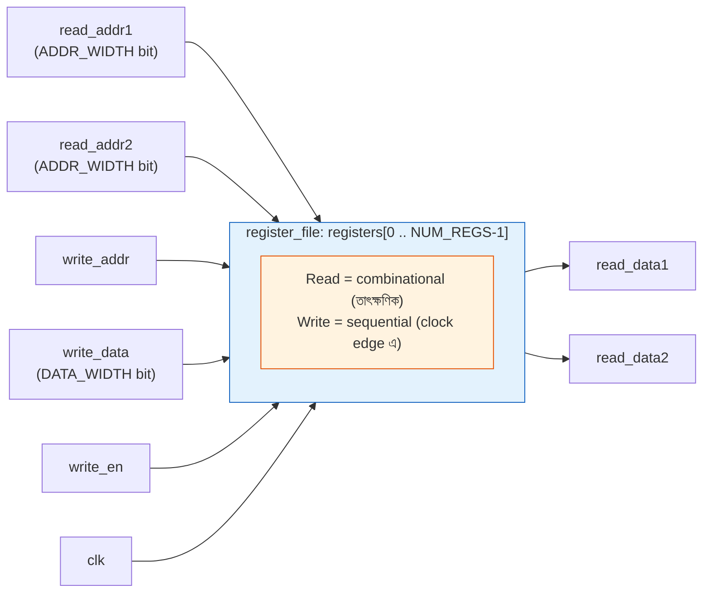
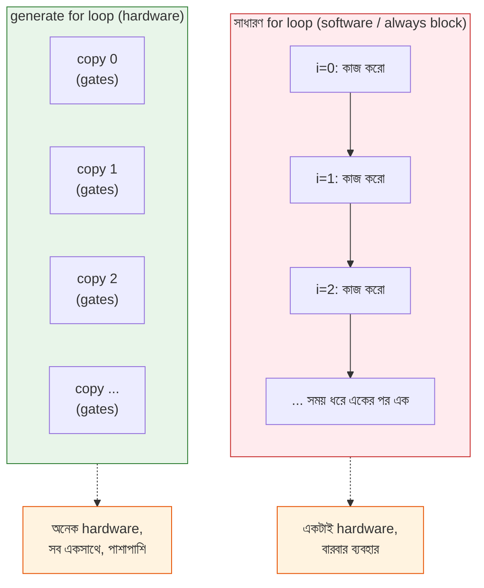

# 🚀 Chapter 8: Build Your Own Advanced Verilog Skills
## Functions থেকে Generate - Professional HDL Mastery!

> **"Basic Verilog builds circuits. Advanced Verilog builds processors. Time to level up!"**
>
> **"Basic Verilog circuits বানায়। Advanced Verilog processors বানায়। এবার level up করো!"**

---

এতদিন তুমি Verilog দিয়ে gate, adder, flip-flop, counter, testbench — সব বানিয়েছো। প্রতিটা circuit তুমি হাতে হাতে, লাইন ধরে ধরে লিখেছো। আর সেটাই ঠিক ছিল — শেখার শুরুতে প্রতিটা তার নিজের হাতে জোড়া দিলে বোঝাটা শক্ত হয়। কিন্তু এবার একটা প্রশ্ন কর: তোমাকে যদি বলি একটা **৩২-bit adder** বানাও, তুমি কি ৩২ বার `full_adder fa0(...)`, `full_adder fa1(...)` ... লিখবে? আর তারপর যদি বলি "না না, এবার ৬৪-bit লাগবে"? আবার পুরোটা নতুন করে?

এখানেই আসল প্রকৌশলী আর শিক্ষানবিশের পার্থক্য। আসল engineer একই জিনিস দুবার লেখে না। সে এমন code লেখে যেটা **নিজেকে নিজে বানায়** — একটা parameter বদলালেই ৮-bit থেকে ৩২-bit, ৩২-bit থেকে ৬৪-bit হয়ে যায়। এই chapter টা ঠিক সেই জাদু শেখাবে। এতদিন তুমি ছিলে একজন রাজমিস্ত্রি যে এক-একটা ইট হাতে গাঁথে; এই chapter এর পর তুমি হবে একজন স্থপতি যে একটা নকশা আঁকে আর সেই নকশা থেকে হাজারটা ইট নিজে নিজে বসে যায়।

আর এটা শুধু "সুবিধার" ব্যাপার না। সামনে Chapter 14-19 তে তুমি যখন আসল RISC-V processor বানাবে, তখন তোমার লাগবে parameterized register file, configurable ALU, memory model, reusable building block। সেই সব ছাড়া একটা processor লেখা মানে কয়েক হাজার লাইন copy-paste — যেটা কেউ debug করতে পারবে না। তাই এই chapter কে "আরেকটা Verilog topic" ভেবো না; এটা তোমার processor বানানোর আসল হাতিয়ারের বাক্স। চলো খুলি।

---

## 🎯 এই Chapter এ তুমি বানাবে:

```
✅ Functions - reusable computation
✅ Tasks - complex operations
✅ Generate blocks - parameterized hardware
✅ Parameters - configurable modules
✅ Compiler directives - conditional compilation
✅ Memory arrays - RAM/ROM modeling
✅ Advanced synthesis concepts
✅ তোমার processor এর reusable components! 🎉
```

**Time Required:** 1 week (4-5 hours/day)  
**Tools Needed:** Text editor, Icarus Verilog, GTKWave

---

## 🚀 Quick Win - 5 মিনিটে তোমার First Function!

theory পড়ার আগে চলো হাতে-কলমে একটা মজা দেখি। ধরো তোমাকে একটা ৮-bit data এর **parity** বের করতে হবে — মানে data এর কয়টা bit ১, সেটা জোড় না বিজোড়। এটা serial communication (UART, যেটা পরে বানাবে) এ error ধরার সবচেয়ে সহজ কৌশল। এখন এই হিসাবটা তোমার লাগতে পারে অনেক জায়গায় — sender এও, receiver এও। প্রতিবার একই XOR-এর শিকল আবার লিখবে? না। একবার একটা **function** এ মুড়ে রাখো, তারপর যেখানে দরকার নাম ধরে ডেকে নাও — ঠিক যেমন C তে function ডাকো।

### এখনই লেখো - Parity Function:

```verilog
module parity_checker(
    input [7:0] data,
    output parity
);
    // Function to calculate parity
    function automatic parity_calc;
        input [7:0] data_in;
        integer i;
        begin
            parity_calc = 0;
            for (i = 0; i < 8; i = i + 1)
                parity_calc = parity_calc ^ data_in[i];
        end
    endfunction
    
    // Use the function
    assign parity = parity_calc(data);
endmodule
```

একটু ভেঙে দেখি কী হলো। `function automatic parity_calc;` দিয়ে একটা function ঘোষণা করলাম — `parity_calc` নামটাই হলো return করা মান (Verilog এ function এর নামটাই তার ফেরত মূল্যের ভেরিয়েবল, C এর `return` লাগে না)। ভেতরে একটা `for` loop সব bit কে XOR করছে — XOR-এর জাদু হলো, জোড়সংখ্যক ১ থাকলে ফল ০, বিজোড় হলে ১। তারপর module এর শেষে `assign parity = parity_calc(data);` দিয়ে function টাকে ঠিক C-function এর মতোই ডাকলাম।

কিন্তু এখানে একটা জিনিস গভীরভাবে বুঝে নাও, কারণ পুরো chapter এর ভিত্তি এটাই: **এই function কোনো software loop চালাচ্ছে না।** তোমার মনে হতে পারে loop টা runtime এ ৮ বার ঘুরছে — না। Synthesis এর সময় এই function টা পুরো খুলে গিয়ে (unroll হয়ে) **৭টা XOR gate** এর একটা গাছ হয়ে যায়, যারা সব একসাথে, একই মুহূর্তে কাজ করে। Function এখানে শুধু তোমার লেখাকে গুছিয়ে রাখার একটা টেমপ্লেট — হার্ডওয়্যার সেই টেমপ্লেট থেকে ছাঁচে ঢালা একগুচ্ছ gate। এই "code হলো নকশা, loop হলো gate বানানোর নির্দেশ" — এই মানসিকতাটাই তোমাকে এই chapter জুড়ে বারবার মনে করিয়ে দেব।

**Run করে দেখো:**
```bash
iverilog -o sim parity_checker.v parity_tb.v
vvp sim
```

🎉 **Congratulations! তুমি reusable function লিখেছো!**

মাত্র কয়েক মিনিটে তুমি এমন একটা জিনিস বানালে যেটা professional রা প্রতিদিন ব্যবহার করেন। এবার চলো একটা একটা করে advanced feature ভেতর থেকে বুঝি — কারণ এগুলো জানলে তোমার processor এর code হবে ছোট, পরিষ্কার, আর সহজে বদলানো যায় এমন।

---

## ৮.১ Functions - Reusable Computations

### Function আসলে কী?

C তে তুমি function লেখো যাতে একই হিসাব বারবার লিখতে না হয় — `max(a, b)` একবার লিখলে যতবার খুশি ডাকা যায়। Verilog এর function ঠিক সেই উদ্দেশ্যে, কিন্তু একটা মৌলিক পার্থক্য আছে যেটা সারাজীবন মনে রাখতে হবে: **Verilog function সফটওয়্যার রুটিন না, এটা হার্ডওয়্যার বানায়।** তুমি function ডাকলে কোনো instruction চলে না; বরং function এর ভেতরের যুক্তিটা copy হয়ে গিয়ে যেখানে ডেকেছো সেখানে একগুচ্ছ gate বসে যায়। ১০ জায়গায় ডাকলে ১০ কপি gate তৈরি হয় (যদি না synthesizer optimize করে)।

এই হার্ডওয়্যার-প্রকৃতির কারণেই function এর কিছু কঠোর নিয়ম আছে। সবচেয়ে গুরুত্বপূর্ণ চারটা মাথায় গেঁথে নাও:

| বৈশিষ্ট্য | Function এ কী হয়? | কেন এই নিয়ম? |
|---|---|---|
| Return value | ঠিক **একটা** মান ফেরত দেয় (function-এর নামেই) | একটা মান বের করার মতো একগুচ্ছ combinational gate বানায় |
| Timing control | `#delay` বা `@(posedge clk)` **নিষিদ্ধ** | combinational gate এ কোনো "সময়" নেই — সব তাৎক্ষণিক |
| Port | শুধু `input`, কোনো `output`/`inout` নেই | একটাই ফল, তাই আলাদা output port লাগে না |
| Local variable | নিজস্ব `integer`, `reg` রাখতে পারে | হিসাবের মাঝপথের মান ধরে রাখতে |

এক কথায় মনে রাখার সূত্র: **function = এক ইনপুট-গুচ্ছ থেকে এক আউটপুট বের করা একটুকরো combinational circuit, যাকে তুমি নাম দিয়ে রেখেছো।** কোনো ঘড়ি নেই, কোনো অপেক্ষা নেই, কোনো state নেই — শুধু input ঢোকাও, তাৎক্ষণিক output পাও। (যেখানে সময় বা একাধিক output দরকার, সেখানে লাগবে **task** — পরের section এ আসছে।)

### Basic Function Syntax:

```verilog
function [return_width-1:0] function_name;
    input [width-1:0] input1;
    input [width-1:0] input2;
    // local variables
    integer i;
    begin
        // function body
        function_name = result;
    end
endfunction
```

কঙ্কালটা পড়ার নিয়ম: প্রথম লাইনে `[return_width-1:0]` বলে দিচ্ছে ফলটা কত bit চওড়া — এটাই function এর "type"। তারপর `input` দিয়ে যত খুশি ইনপুট নাও। `begin ... end` এর ভেতরে হিসাব করো, আর শেষে **function এর নামের সাথে** ফলটা assign করো (`function_name = result;`) — এই নামটাই বাইরে ফেরত যায়। লক্ষ্য করো, কোথাও `output` শব্দটা নেই; function এ সেটা থাকতেই পারে না।

### Example 1 - Maximum of Two Numbers:

```verilog
module max_finder(
    input [7:0] a, b,
    output [7:0] max_val
);
    // Function to find maximum
    function [7:0] max;
        input [7:0] x, y;
        begin
            max = (x > y) ? x : y;
        end
    endfunction
    
    assign max_val = max(a, b);
endmodule
```

সবচেয়ে সরল উদাহরণ দিয়ে শুরু — দুটো সংখ্যার বড়টা। ভেতরে শুধু একটা ternary: `(x > y) ? x : y`। হার্ডওয়্যারে এটা কী হয়? একটা **comparator** (`x > y` যাচাই করে) আর একটা **2-to-1 multiplexer** (comparator এর ফল অনুযায়ী x বা y বেছে নেয়)। ব্যস, function ডাকা মানেই এই comparator + mux টা বসে যাওয়া। এখন মজাটা হলো — তুমি যদি একই module এ আরও তিন জায়গায় `max(...)` ডাকো, প্রতিবার আলাদা একটা comparator+mux তৈরি হবে। তাই function দিয়ে code পরিষ্কার হয় ঠিকই, কিন্তু gate বাঁচে না; gate বাঁচাতে হলে একটা মাত্র instance বানিয়ে শেয়ার করতে হয় (সেটা module instantiation এর কাজ)।

### Example 2 - Count Leading Zeros:

```verilog
function integer count_leading_zeros;
    input [31:0] data;
    integer i;
    begin
        count_leading_zeros = 0;
        for (i = 31; i >= 0; i = i - 1) begin
            if (data[i] == 0)
                count_leading_zeros = count_leading_zeros + 1;
            else
                i = -1; // Exit loop
        end
    end
endfunction

// Usage
wire [5:0] clz;
assign clz = count_leading_zeros(data_in);
```

এবার একটু কাজের জিনিস — **count leading zeros (CLZ)**, মানে সবচেয়ে বড় bit থেকে শুরু করে কয়টা শূন্য পরপর আছে। এটা floating-point normalization, priority encoder, division — অনেক জায়গায় লাগে। code টা MSB (bit 31) থেকে নিচের দিকে নামছে, যতক্ষণ ০ পাচ্ছে গুনছে, প্রথম ১ পেলেই থামছে।

থামানোর কৌশলটা একটু খেয়াল করো: `i = -1;` দিয়ে loop variable জোর করে শেষ করে দেওয়া হচ্ছে (Verilog এ C-এর মতো সরাসরি `break` নেই, তাই এই কায়দা)। আবার মনে করিয়ে দিই — এই loop runtime এ ৩২ বার ঘোরে না; synthesis এ এটা খুলে গিয়ে একটা **priority logic** এর শিকল হয়ে যায় যেটা একসাথে সব bit দেখে। অর্থাৎ লেখা হয়েছে loop-এর ভাষায়, কিন্তু জন্ম নেয় তাৎক্ষণিক gate হিসেবে। আর হ্যাঁ — output ৬ bit চওড়া (`[5:0]`) কারণ ৩২টা শূন্য পর্যন্ত গোনার জন্য সর্বোচ্চ মান ৩২, আর ৩২ ধরতে ৬ bit লাগে।

### Example 3 - Gray to Binary Conversion:

```verilog
function [3:0] gray_to_binary;
    input [3:0] gray;
    integer i;
    begin
        gray_to_binary[3] = gray[3];
        for (i = 2; i >= 0; i = i - 1)
            gray_to_binary[i] = gray_to_binary[i+1] ^ gray[i];
    end
endfunction
```

Gray code (যেখানে পরপর দুটো সংখ্যার মধ্যে ঠিক একটা bit বদলায়) থেকে সাধারণ binary তে ফেরানোর function। নিয়মটা সুন্দর: সবচেয়ে উপরের bit একই থাকে (`gray_to_binary[3] = gray[3]`), আর প্রতিটা নিচের bit হলো **তার ঠিক উপরের binary bit XOR এই Gray bit**। এই function টা একটা গুরুত্বপূর্ণ ধারণা দেখায় — return value কোনো একটা মাত্র সংখ্যা হতে হবে এমন না, এটা একটা multi-bit vector হতে পারে, আর তুমি bit-by-bit সেটা ভরতে পারো। লক্ষ্য করো `gray_to_binary[i]` হিসাব করতে `gray_to_binary[i+1]` লাগছে — মানে একটা bit এর ফল পরের bit এ গড়িয়ে যাচ্ছে, যেটা হার্ডওয়্যারে XOR gate এর একটা শিকল (chain) তৈরি করে। Gray code কেন দরকার, সেটা পরে FIFO আর clock-domain crossing এ কাজে লাগবে।

### Automatic Functions (Recursive):

`automatic` শব্দটা মনে আছে? Quick Win এও ব্যবহার করেছিলাম। এর মানে বুঝতে হলে আগে জানতে হবে — সাধারণ (static) function এ local variable গুলো একটা মাত্র জায়গায় থাকে, সব ডাকাডাকি সেই একই জায়গা শেয়ার করে। তাই static function নিজেকে নিজে ডাকতে (recursion) পারে না — মাঝপথের মান মুছে যাবে। `automatic` লিখলে প্রতিবার ডাকার সময় নতুন করে local variable বরাদ্দ হয় (ঠিক C-এর stack frame এর মতো), ফলে recursion সম্ভব হয়।

```verilog
// Factorial using recursion
function automatic integer factorial;
    input integer n;
    begin
        if (n <= 1)
            factorial = 1;
        else
            factorial = n * factorial(n - 1);
    end
endfunction

// Usage (only for constants in synthesis!)
localparam FACT_5 = factorial(5); // 120
```

কিন্তু এখানে একটা বড় সতর্কবাণী, আর comment-এও সেটা লেখা আছে: **`only for constants in synthesis`**। কেন? কারণ হার্ডওয়্যার চিরন্তন আর নির্দিষ্ট — gate গুলো একবার বসে গেলে আর "আরও কয়েকবার নিজেকে ডাকা" বলে কিছু নেই। তাই recursive function কে synthesizer তখনই মানে যখন গভীরতা compile-time এই জানা যায় (যেমন `factorial(5)` — সংখ্যাটা স্থির)। এই `localparam FACT_5 = factorial(5);` লাইনে factorial টা synthesis এর আগেই হিসাব হয়ে ১২০ হয়ে যায়, তারপর সেই ১২০ ব্যবহৃত হয়। অর্থাৎ recursion এখানে চলছে compile-time এ, চিপের ভেতরে না। যদি তুমি runtime এর কোনো signal দিয়ে `factorial(some_input)` ডাকো, synthesis tool হাত তুলে দেবে। মনে রাখার সহজ লাইন: **recursive function = একটা compile-time ক্যালকুলেটর, runtime engine না।**

---

## ৮.২ Tasks - Complex Operations

Function শিখলে, এবার তার বড় ভাই **task**। সহজ গল্পে পার্থক্যটা এমন: function হলো একজন ক্যালকুলেটর — তুমি কিছু দাও, সে একটা উত্তর ফেরত দেয়, তৎক্ষণাৎ। Task হলো একজন কর্মী যাকে তুমি একটা **কাজের তালিকা** ধরিয়ে দাও — "আগে এটা করো, একটু অপেক্ষা করো, তারপর এই দুটো জিনিস সেট করো, তারপর আবার অপেক্ষা করো"। অর্থাৎ function এক ঝটকায় উত্তর দেয়, task সময় নিয়ে ধাপে ধাপে কাজ করতে পারে এবং একাধিক জিনিস বদলে দিয়ে যেতে পারে।

### Functions vs Tasks:

এই দুটোর পার্থক্য পরিষ্কার না থাকলে তুমি বারবার ভুল করবে — কখন কোনটা ব্যবহার করবে গুলিয়ে ফেলবে। তাই টেবিলটা ভালো করে দেখে নাও:

| বিষয় | **Function** | **Task** |
|---|---|---|
| ফেরত মান | ঠিক **একটা** (নামেই) | কোনো return value নেই, কিন্তু যত খুশি `output`/`inout` |
| Timing (`#`, `@`) | ❌ নিষিদ্ধ | ✅ অনুমোদিত — সময় নিয়ে কাজ করতে পারে |
| Port | শুধু `input` | `input`, `output`, `inout` — সব |
| প্রকৃতি | combinational (তাৎক্ষণিক) | combinational বা sequential, দুই-ই |
| অন্য task/function ডাকা | শুধু function ডাকতে পারে | function **আর** task — দুই-ই ডাকতে পারে |
| প্রধান ব্যবহার | ছোট হিসাব, synthesizable logic | testbench এর stimulus, multi-step protocol |

মনে রাখার এক-লাইন সূত্র: **একটা মাত্র উত্তর চাই, সময় লাগে না → function। একাধিক জিনিস সেট করতে হবে, বা মাঝে অপেক্ষা/clock লাগবে → task।** যেহেতু task এ timing থাকতে পারে, task এর সবচেয়ে বড় ব্যবহার testbench এ — যেখানে তুমি "ঘড়ির এই edge এ এটা পাঠাও, পরের edge এ ওটা" এমন protocol লেখো।

### Basic Task Syntax:

```verilog
task task_name;
    input [width-1:0] in1;
    output [width-1:0] out1;
    inout [width-1:0] inout1;
    begin
        // task body
        out1 = ...;
    end
endtask
```

খেয়াল করো function এর সাথে দুটো বড় পার্থক্য syntax-এই ফুটে উঠছে: (১) প্রথম লাইনে কোনো return-width নেই — কারণ task কিছু ফেরত দেয় না; (২) ভেতরে `output` আর `inout` port আছে — task তার ফলাফল এই port দিয়ে বাইরে পাঠায়। তুমি `out1` এ যা লিখবে, সেটা যে variable দিয়ে task ডেকেছো সেখানে গিয়ে বসবে।

### Example 1 - UART Transmit Task:

ধরো তুমি একটা byte serial line দিয়ে পাঠাবে। UART protocol অনুযায়ী আগে একটা start bit (0), তারপর ৮টা data bit, তারপর একটা stop bit (1) — আর প্রতিটা bit লাইনে কিছুক্ষণ ধরে রাখতে হবে (baud rate অনুযায়ী)। লক্ষ্য করো, এখানে **সময়** জড়িত — "bit রাখো, অপেক্ষা করো, পরের bit"। এটা function দিয়ে কখনো লেখা যাবে না, কারণ function এ `@(posedge clk)` নিষিদ্ধ। এখানেই task উজ্জ্বল হয়। নিচে দেখো কীভাবে একটা ছোট task (`send_bit`) আরেকটা বড় task (`send_byte`) এর ভেতরে বারবার ব্যবহার হচ্ছে — ঠিক যেমন কাজকে ছোট ছোট ধাপে ভাগ করো।

```verilog
module uart_tx(
    input clk,
    input [7:0] data,
    input send,
    output reg tx
);
    // Task to send one bit
    task send_bit;
        input bit_value;
        begin
            tx = bit_value;
            repeat(BAUD_TICKS) @(posedge clk);
        end
    endtask
    
    // Task to send byte
    task send_byte;
        input [7:0] byte_data;
        integer i;
        begin
            send_bit(0);  // Start bit
            for (i = 0; i < 8; i = i + 1)
                send_bit(byte_data[i]);  // Data bits
            send_bit(1);  // Stop bit
        end
    endtask
    
    always @(posedge clk) begin
        if (send)
            send_byte(data);
    end
endmodule
```

দেখো কত পরিষ্কার হলো গল্পটা। `send_bit` task একটা মাত্র bit লাইনে বসায় (`tx = bit_value;`) তারপর `repeat(BAUD_TICKS) @(posedge clk);` দিয়ে এক bit-সময় ধরে অপেক্ষা করে — এই `repeat` + `@(posedge clk)` জোড়াটাই হলো "এতগুলো clock edge ধরে এই অবস্থায় থাকো"। তারপর `send_byte` সেই ছোট task কে ১০ বার ডাকছে: একটা start, আটটা data, একটা stop। মানুষ যেভাবে protocol টা ভাবে — "শুরু, তারপর ডেটা, তারপর শেষ" — code টাও ঠিক সেভাবে পড়া যাচ্ছে। task ছাড়া এই একই জিনিস একটা বিশাল FSM হয়ে যেত, পড়তে কষ্ট হতো।

> **🚩 খেয়াল রাখো:** এই module-এ `BAUD_TICKS` কোথাও parameter বা `localparam` হিসেবে ঘোষণা করা হয়নি — শেখানোর জন্য সরলীকৃত একটা টুকরো হিসেবে রাখা হয়েছে, যাতে মূল মনোযোগ থাকে task-এর গঠনে। বাস্তবে compile করার আগে module-এর header-এ `parameter BAUD_TICKS = ...;` যোগ করে নিতে হবে। আসল, পূর্ণাঙ্গ UART transmitter তুমি Chapter 11 (FPGA Projects) এ বানাবে।

### Example 2 - Bus Write Task:

Testbench এ task এর সবচেয়ে বড় উপকারটা এই উদাহরণে। ধরো তোমার design এ একটা bus আছে — কিছু লিখতে হলে নিয়ম হলো: clock edge এ address দাও, write enable তোলো, data দাও, পরের edge এ enable নামাও। এখন testbench এ যদি ১০টা জায়গায় লিখতে চাও, প্রতিবার এই ৪-৫ লাইন আবার লিখবে? পরিবর্তে একবার `bus_write` নামে task বানিয়ে নাও, তারপর `bus_write(address, data)` এক লাইনে ডেকে দাও। পুরো protocol টা task এর ভেতরে লুকানো থাকল।

```verilog
task bus_write;
    input [31:0] address;
    input [31:0] data;
    begin
        @(posedge clk);
        addr <= address;
        write_en <= 1;
        data_out <= data;
        @(posedge clk);
        write_en <= 0;
    end
endtask

// Usage in testbench
initial begin
    bus_write(32'h1000, 32'hDEADBEEF);
    bus_write(32'h1004, 32'hCAFEBABE);
end
```

দেখলে তো? দুই লাইনেই দুটো সম্পূর্ণ bus transaction হয়ে গেল, অথচ ভেতরের timing-এর ঝামেলা একবারও চোখের সামনে এল না। এটাই বড় design test করার পেশাদার উপায় — protocol একবার task এ বাঁধো, তারপর গল্প লেখার মতো করে `bus_write(...)`, `bus_read(...)` ডেকে যাও। Chapter 19 তে যখন তোমার পুরো SoC test করবে, তখন এই কৌশলটাই তোমাকে শত শত লাইন থেকে বাঁচাবে। (একটা ছোট সূক্ষ্মতা: এখানে `<=` non-blocking assignment ব্যবহার হয়েছে কারণ এটা clock-synchronous signal চালাচ্ছে — Chapter 6 এর golden rule মনে আছে তো?)

### Example 3 - Memory Initialization Task:

শেষ উদাহরণটা ছোট কিন্তু খুব কাজের। Simulation শুরু করার আগে প্রায়ই পুরো memory টাকে একটা নির্দিষ্ট মান দিয়ে ভরে নিতে হয় (যাতে সব `x`/unknown না থাকে)। এই task সেটাই করে — একটা loop চালিয়ে প্রতিটা ঘরে `init_value` বসায়, তারপর `$display` দিয়ে একটা নিশ্চিতকরণ বার্তা ছাপে।

```verilog
task init_memory;
    input [7:0] init_value;
    integer i;
    begin
        for (i = 0; i < MEM_SIZE; i = i + 1)
            memory[i] = init_value;
        $display("Memory initialized with 0x%h", init_value);
    end
endtask
```

এখানে একটা গুরুত্বপূর্ণ জিনিস লক্ষ্য করো: task টা `memory` আর `MEM_SIZE` কে নিজের argument হিসেবে নেয়নি, বরং সরাসরি তার চারপাশের module/scope এর variable ব্যবহার করছে। এটা task এর একটা শক্তি — যে scope এ task লেখা, সেই scope এর জিনিসে তার সরাসরি হাত। আর `$display` যে এখানে আছে, সেটাও task-ই সম্ভব করল; function এ side-effect হিসেবে কথা ছাপানোটা বেমানান, কিন্তু task এ একদম স্বাভাবিক।

---

## ৮.৩ Parameters - Configurable Modules

এবার এসেছি সেই feature এ যেটার কথা chapter এর শুরুতে বলেছিলাম — যেটা তোমাকে রাজমিস্ত্রি থেকে স্থপতি বানায়। **Parameter** হলো module এর একটা "knob" বা নিয়ন্ত্রক — যেটা ঘুরিয়ে তুমি একই module কে ৮-bit, ১৬-bit, বা ৩২-bit বানিয়ে ফেলতে পারো, একটা লাইনও ভেতরে না বদলে।

### Parameter আসলে কী?

ভাবো একটা জামার দোকানের কথা। তুমি যদি প্রতিটা মাপের জন্য আলাদা নকশা আঁকো — small, medium, large, XL — তাহলে চারটে নকশা সামলাতে হবে, একটায় ভুল হলে বাকিগুলোতেও ঠিক করতে হবে। বরং একটা নকশা আঁকো যেখানে "মাপ" একটা variable; সেই variable বদলালেই যেকোনো size বেরিয়ে আসে। Parameter ঠিক এই "মাপ" — একটা **compile-time constant** যেটা module এর আকার-আকৃতি ঠিক করে দেয়।

কয়েকটা মূল কথা পরিষ্কার করে নাও:

- **Compile-time constant** — parameter এর মান synthesis/compile এর সময়ই স্থির হয়ে যায়, চিপ চলার সময় বদলায় না। তাই এটা runtime এ কোনো বাড়তি gate বা খরচ আনে না; বরং compiler আগেভাগে সবকিছু গুছিয়ে রাখে।
- **No runtime overhead** — `WIDTH=8` হোক বা `WIDTH=32`, parameter নিজে কোনো জায়গা খায় না; এটা শুধু compiler কে বলে দেয় কত বড় hardware বানাতে হবে।
- **এক নকশা, অনেক রূপ** — একই module বারবার ভিন্ন parameter দিয়ে instantiate করা যায়, প্রতিবার ভিন্ন আকারের hardware জন্ম নেয়।

### Basic Parameter Usage:

```verilog
module adder #(
    parameter WIDTH = 8  // Default 8-bit
)(
    input  [WIDTH-1:0] a, b,
    output [WIDTH:0]   sum
);
    assign sum = a + b;
endmodule

// Instantiation with different widths
adder #(.WIDTH(16)) adder16(...);  // 16-bit
adder #(.WIDTH(32)) adder32(...);  // 32-bit
```

এই ছোট্ট উদাহরণেই পুরো ধারণাটা ধরা আছে। `#(parameter WIDTH = 8)` দিয়ে module এর গায়ে একটা knob লাগানো হলো, default মান ৮। তারপর port declaration এ `[WIDTH-1:0]` লিখে input/output এর প্রস্থ সেই knob এর সাথে বেঁধে দেওয়া হলো। (লক্ষ্য করো sum এর প্রস্থ `[WIDTH:0]` — মানে input এর চেয়ে এক bit বেশি, কারণ দুটো WIDTH-bit সংখ্যা যোগ করলে একটা carry-out bit বেশি হতে পারে। এই খুঁটিনাটিগুলোই professional design কে bug-মুক্ত রাখে।)

নিচে instantiation এ মজাটা দেখো: একই `adder` module থেকে `adder16` আর `adder32` দুটো আলাদা আকারের যন্ত্র বেরিয়ে এল, শুধু `#(.WIDTH(16))` আর `#(.WIDTH(32))` লিখে। তুমি adder এর ভেতরের একটা লাইনও ছোঁওনি। এটাই parameterization এর পুরো গল্প — **একবার সঠিকভাবে লেখো, সারাজীবন যেকোনো আকারে ব্যবহার করো।**

### Multiple Parameters:

একটা module এ একাধিক knob থাকতে পারে — যেমন একটা FIFO তে data কত চওড়া (`DATA_WIDTH`) আর কতগুলো ঘর (`DEPTH`)। আর এখানে একটা দারুণ কৌশল আছে: একটা parameter আরেকটা parameter থেকে **নিজে হিসাব করে** নিতে পারে।

```verilog
module fifo #(
    parameter DATA_WIDTH = 8,
    parameter DEPTH      = 16,
    parameter ADDR_WIDTH = $clog2(DEPTH)  // Calculated!
)(
    input                    clk,
    input  [DATA_WIDTH-1:0]  data_in,
    output [DATA_WIDTH-1:0]  data_out,
    // ...
);
    reg [DATA_WIDTH-1:0] memory [0:DEPTH-1];
    // ...
endmodule
```

এখানে নায়ক হলো `$clog2(DEPTH)` — এটা একটা গুরুত্বপূর্ণ system function, ভালো করে বুঝে নাও। `$clog2(n)` হলো **ceiling of log base 2** — মানে n-টা জিনিসকে আলাদা করে চিনতে (address করতে) কত bit লাগবে তার হিসাব। যুক্তিটা সহজ: ১৬টা ঘরের প্রতিটাকে আলাদা ঠিকানা দিতে হলে ০ থেকে ১৫ পর্যন্ত গুনতে হবে, আর সেটা ৪ bit এ ধরে (কারণ ২⁴ = ১৬)। তাই `$clog2(16) = 4`। নিচের টেবিলে কয়েকটা মান দেখো:

| `DEPTH` | দরকারি address bit | `$clog2(DEPTH)` |
|---|---|---|
| 2 | 0–1 | 1 |
| 8 | 0–7 | 3 |
| 16 | 0–15 | 4 |
| 1024 | 0–1023 | 10 |

কেন এটা এত গুরুত্বপূর্ণ? কারণ `ADDR_WIDTH` হাতে লিখলে তুমি ভুল করবেই — `DEPTH` ১৬ থেকে ৩২ এ বদলালে address width ৪ থেকে ৫ এ বদলানো মনে রাখতে হবে, ভুলে গেলে চুপচাপ bug। `$clog2` ব্যবহার করলে তুমি শুধু `DEPTH` বদলাও, address width নিজে নিজে ঠিক হয়ে যায়। এই "একটা সংখ্যা বদলালে বাকি সব নিজে মিলে যায়" — এটাই robust, parameterized design এর প্রাণ।

### localparam vs parameter:

`parameter` আর `localparam` — নাম প্রায় এক, কিন্তু একটা সূক্ষ্ম আর গুরুত্বপূর্ণ পার্থক্য আছে। `parameter` হলো বাইরের লোকের জন্য রাখা knob — module instantiate করার সময় বাইরে থেকে কেউ এর মান বদলে দিতে পারে (`#(.WIDTH(32))`)। আর `localparam` হলো module এর **ভেতরের নিজস্ব** হিসাব — বাইরে থেকে কেউ এটা ছুঁতে পারে না।

```verilog
module my_module #(
    parameter WIDTH = 8
)(
    // ports
);
    // localparam - cannot be overridden
    localparam HALF_WIDTH = WIDTH / 2;
    localparam MAX_VALUE  = (1 << WIDTH) - 1;
    
    // Use in code
    wire [HALF_WIDTH-1:0] lower_half;
    wire [MAX_VALUE:0]    wide_signal;
endmodule
```

কখন কোনটা ব্যবহার করবে? নিয়মটা সহজ: যে মান ব্যবহারকারীর বদলানোর কথা (যেমন `WIDTH`), সেটা `parameter`। আর যে মান সেই `WIDTH` থেকে **derive** করা — যেমন এখানে `HALF_WIDTH = WIDTH / 2` বা `MAX_VALUE = (1 << WIDTH) - 1` — সেটা `localparam`। কারণ ব্যবহারকারী যদি ভুল করে `HALF_WIDTH` আলাদা করে override করে দেয়, তাহলে `WIDTH` এর সাথে আর মিল থাকবে না, design ভেঙে পড়বে। `localparam` দিয়ে তুমি এই দরজাটা বন্ধ রাখছো — "এটা আমার অভ্যন্তরীণ হিসাব, এতে হাত দিও না।" সংক্ষেপে: **parameter = বাইরের knob; localparam = ভেতরের তালাবন্ধ ধ্রুবক।**

(একটা সুন্দর প্যাটার্ন এখানে লুকানো — `(1 << WIDTH) - 1` মানে WIDTH-bit এর সর্বোচ্চ মান। WIDTH=8 হলে এটা ২⁸−১ = ২৫৫। এভাবে সংখ্যা হাতে না লিখে সূত্রে লেখলে, WIDTH বদলালে সবকিছু আপনাআপনি ঠিক থাকে।)

### Parameterized Register File:

এবার একটা সত্যিকারের processor-component — **register file**। এটা CPU এর হৃৎপিণ্ডের কাছাকাছি জিনিস: ছোট, দ্রুত একগুচ্ছ register যেখানে CPU তার তাৎক্ষণিক হিসাবের সংখ্যাগুলো রাখে। RISC-V এ এমন ৩২টা register আছে, প্রতিটা ৩২-bit। এখন তুমি যদি এটা parameterized বানাও, তাহলে একই code পরে অন্য প্রসেসরে (যেমন ১৬-register এর ছোট CPU, বা ৬৪-bit register) ব্যবহার করতে পারবে।

এর গঠনটা মাথায় থাকলে code পড়া সহজ হবে — RISC-V এর register file সাধারণত **দুটো একসাথে পড়া যায়, একটা লেখা যায়** এমন হয় (কারণ বেশিরভাগ instruction দুটো source register পড়ে আর একটা destination এ লেখে):



```verilog
module register_file #(
    parameter DATA_WIDTH = 32,
    parameter NUM_REGS   = 32,
    parameter ADDR_WIDTH = $clog2(NUM_REGS)
)(
    input                       clk,
    input  [ADDR_WIDTH-1:0]     read_addr1,
    input  [ADDR_WIDTH-1:0]     read_addr2,
    output [DATA_WIDTH-1:0]     read_data1,
    output [DATA_WIDTH-1:0]     read_data2,
    input  [ADDR_WIDTH-1:0]     write_addr,
    input  [DATA_WIDTH-1:0]     write_data,
    input                       write_en
);
    reg [DATA_WIDTH-1:0] registers [0:NUM_REGS-1];
    
    // Read (combinational)
    assign read_data1 = registers[read_addr1];
    assign read_data2 = registers[read_addr2];
    
    // Write (sequential)
    always @(posedge clk) begin
        if (write_en)
            registers[write_addr] <= write_data;
    end
endmodule

// Usage
register_file #(
    .DATA_WIDTH(32),
    .NUM_REGS(32)
) rf(...);
```

এই module টা ভালো করে বোঝো, কারণ Chapter 14 তে তুমি এটারই একটা version আসল CPU তে বসাবে। তিনটা parameter দিয়ে এটা সম্পূর্ণ configurable: data কত চওড়া, কয়টা register, আর address কত bit (যেটা `$clog2(NUM_REGS)` দিয়ে নিজে হিসাব হয়ে যায়)।

সবচেয়ে গুরুত্বপূর্ণ স্থাপত্য-সিদ্ধান্তটা code এ স্পষ্ট: **read combinational, write sequential** — উপরের diagram এ যা দেখলে ঠিক তাই। read দুটো `assign` দিয়ে করা, মানে address দিলেই তাৎক্ষণিক data বেরোয়, কোনো clock-এর অপেক্ষা নেই — CPU কে এক clock cycle এর মধ্যেই operand পেতে হয় বলে এটা জরুরি। অন্যদিকে write আছে `always @(posedge clk)` এর ভেতরে, মানে নতুন মান কেবল clock edge এ, এবং `write_en` ১ হলে তবেই বসে — এতে ভুল সময়ে register নষ্ট হয় না। এই দুই আচরণের মিশ্রণটাই register file কে একই সাথে দ্রুত (পড়ায়) আর নিরাপদ (লেখায়) রাখে। (একটা মজার সত্য যা পরে কাজে লাগবে: RISC-V এ register 0 সবসময় শূন্য — সেই বিশেষ আচরণ এখানে নেই, কারণ এটা সাধারণ register file; CPU বানানোর সময় ওটা যোগ করতে হবে।)

---

## ৮.৪ Generate Blocks - Hardware Replication

এই section টা পুরো chapter এর সবচেয়ে শক্তিশালী, আর নতুনরা এখানেই সবচেয়ে বেশি গুলিয়ে ফেলে। তাই ধীরে, একদম গোড়া থেকে।

### Generate আসলে কী — এবং এটা কেন software loop নয়

ভাবো তোমাকে একটা ৩২-bit adder বানাতে হবে, যেটা ৩২টা `full_adder` জুড়ে তৈরি। তুমি কি ৩২ বার হাতে `full_adder fa0(...)`, `full_adder fa1(...)` ... লিখবে? কষ্টকর, ভুল হওয়ার সম্ভাবনা প্রবল, আর WIDTH বদলালে আবার পুরোটা। **Generate** ঠিক এই সমস্যার সমাধান — এটা একটা loop যেটা চালিয়ে তুমি compile-time এ অনেকগুলো hardware copy বানিয়ে নাও।

কিন্তু এখানেই সবচেয়ে বড় ভুল ধারণাটা ভাঙতে হবে। সাধারণ programming এ `for` loop মানে — "একই কাজ বারবার, একের পর এক, সময় ধরে।" Generate এর `for` loop **মোটেও তা নয়।** এটা একটা **সেলাই মেশিনের ছাঁচ** এর মতো — তুমি একবার নকশা দাও, আর মেশিন সেই নকশা থেকে ৩২টা একইরকম টুকরো **পাশাপাশি** ছেপে দেয়, সব একসাথে অস্তিত্বে থাকে। Loop টা runtime এ একবারও "ঘোরে" না; এটা শুধু synthesis এর সময় hardware copy তৈরির নির্দেশ।

এই পার্থক্যটা ছবিতে দেখো — একই দেখতে loop, কিন্তু সম্পূর্ণ ভিন্ন অর্থ:



বাঁ দিকটা সময়ের গল্প (একটা যন্ত্র, পরপর কাজ); ডান দিকটা জায়গার গল্প (অনেক যন্ত্র, একসাথে)। এই কারণেই generate এর loop variable একটা সাধারণ `integer` না, বরং একটা বিশেষ জিনিস — **`genvar`** (generate variable)। `genvar` compiler কে স্পষ্ট বলে দেয়: "এই variable টা runtime এ গোনার জন্য না, এটা hardware copy এর নম্বর গোনার জন্য।"

মূল কথাগুলো গেঁথে নাও:

- **Compile-time replication** — generate চলে synthesis এর আগে, চিপ চলার সময় না।
- **`genvar` লাগবেই** — সাধারণ loop variable দিয়ে generate-for চলবে না।
- **শুধু copy না** — `generate if` দিয়ে শর্ত অনুযায়ী hardware বসানো/বাদ দেওয়া যায়, `generate case` দিয়ে আকার অনুযায়ী ভিন্ন নকশা বেছে নেওয়া যায়।

### Generate for Loop:

প্রথম আর সবচেয়ে ক্লাসিক উদাহরণ — **ripple carry adder**। একটা ১-bit `full_adder` কে WIDTH বার জুড়ে দিলে একটা WIDTH-bit adder হয়, যেখানে একটার carry-out পরেরটার carry-in এ যায় (ঠিক হাতে যোগ করার সময় যেমন হাতে-রাখা ১ পরের কলামে যায়)।

```verilog
// Ripple carry adder using generate
module adder_nbit #(
    parameter WIDTH = 8
)(
    input  [WIDTH-1:0] a, b,
    input              cin,
    output [WIDTH-1:0] sum,
    output             cout
);
    wire [WIDTH:0] carry;
    assign carry[0] = cin;
    
    genvar i;
    generate
        for (i = 0; i < WIDTH; i = i + 1) begin : adder_stage
            full_adder fa(
                .a(a[i]),
                .b(b[i]),
                .cin(carry[i]),
                .sum(sum[i]),
                .cout(carry[i+1])
            );
        end
    endgenerate
    
    assign cout = carry[WIDTH];
endmodule
```

এই module এর সৌন্দর্য একটু ভেঙে দেখি। প্রথমে একটা `carry` তার বানানো হলো যেটা WIDTH+1 চওড়া — প্রতিটা stage এর carry ধরে রাখার জন্য, প্রথমটায় `cin` বসানো। তারপর `genvar i;` ঘোষণা করে `generate ... for` দিয়ে WIDTH বার লুপ — প্রতিবার একটা `full_adder` instance তৈরি, যেখানে stage `i` নিচ্ছে `a[i]`, `b[i]`, আর আগের stage এর carry `carry[i]`, এবং দিচ্ছে `sum[i]` আর পরের carry `carry[i+1]`। এই `carry[i] → carry[i+1]` শিকলটাই "ripple" নামটার কারণ — carry এক প্রান্ত থেকে অন্য প্রান্তে গড়িয়ে যায়।

একটা জিনিস বিশেষভাবে খেয়াল করো: `begin : adder_stage` — এই `: adder_stage` হলো generate block এর **নাম** (label)। কেন দরকার? কারণ generate-for ৩২টা আলাদা full_adder বানালে তাদের আলাদা করে চিনতে হবে — তখন তারা হয় `adder_stage[0].fa`, `adder_stage[1].fa` ইত্যাদি। নাম না দিলে simulation/debug এ এই instance গুলো খুঁজে পাওয়া কঠিন হয়। তাই **generate block এ সবসময় নাম দাও** — এটা পেশাদার অভ্যাস।

আর সবচেয়ে বড় কথা: এখন `adder_nbit #(.WIDTH(64))` লিখলেই ৬৪টা full_adder নিজে নিজে বসে যাবে, তুমি একটা লাইনও বদলাবে না। চার লাইনের একটা generate block ৩২ লাইন (বা ৬৪, বা যেকোনো) copy-paste এর জায়গা নিয়ে নিল — এটাই scalable design।

### Generate if (Conditional):

Generate শুধু copy বানায় না — এটা **শর্ত অনুযায়ী ভিন্ন hardware বসাতে** পারে। নিচের উদাহরণে একটা parameter (`TYPE`) এর মান দেখে compiler ঠিক করে memory টা block RAM হবে নাকি distributed RAM (এই দুটোর পার্থক্য তুমি Chapter 9 এ FPGA architecture তে শিখবে — আপাতত জানো এরা চিপের ভেতরে দু-রকম memory resource)।

```verilog
module memory #(
    parameter TYPE = "BLOCK",  // "BLOCK" or "DISTRIBUTED"
    parameter SIZE = 1024
)(
    // ports
);
    generate
        if (TYPE == "BLOCK") begin : block_ram
            // Infer block RAM
            reg [7:0] mem [0:SIZE-1];
            // Block RAM implementation
        end else begin : distributed_ram
            // Infer distributed RAM
            (* ram_style = "distributed" *)
            reg [7:0] mem [0:SIZE-1];
            // Distributed RAM implementation
        end
    endgenerate
endmodule
```

এখানে গভীর বিষয়টা হলো — `generate if` সাধারণ `if` (যেটা `always` block এ runtime এ চলে) থেকে সম্পূর্ণ আলাদা। এই `if` compile-time এ একবারই বিচার হয়, আর **যে শাখা মেলে শুধু সেই শাখার hardware-ই অস্তিত্বে আসে**; অন্য শাখাটা সম্পূর্ণভাবে অদৃশ্য হয়ে যায়, এক টুকরো gate-ও তৈরি হয় না। অর্থাৎ `TYPE = "BLOCK"` হলে চিপে শুধু block RAM থাকে, distributed RAM-এর কোনো চিহ্নও নেই।

একে এভাবে ভাবো: runtime `if` হলো একটা multiplexer — দুটো পথই hardware এ আছে, signal দেখে একটা বাছা হয়। কিন্তু `generate if` হলো **নির্মাণের সময় নেওয়া সিদ্ধান্ত** — কোন ঘরটা আদৌ বানানো হবে, সেটাই ঠিক করে। তাই `generate if` দিয়ে তুমি একই module এর একদম ভিন্ন ভিন্ন সংস্করণ বানাতে পারো (যেমন debug version বনাম production version), অথচ চিপে শুধু একটাই থাকে।

### Generate case:

`generate case` হলো `generate if` এরই বড় ভাই — যখন দুইয়ের বেশি বিকল্প থেকে একটা বেছে নিতে হয়। নিচে একটা mux এর কথা ভাবা হয়েছে যেটা input সংখ্যা (`INPUTS`) অনুযায়ী ভিন্ন ভিন্নভাবে বানানো হবে — ২-input হলে সরল একটা ternary, ৪ বা ৮-input হলে আলাদা optimized নকশা, আর অজানা সংখ্যার জন্য একটা generic fallback।

```verilog
module mux_tree #(
    parameter INPUTS = 8,
    parameter WIDTH  = 8
)(
    input  [INPUTS*WIDTH-1:0] data_in,
    input  [$clog2(INPUTS)-1:0] sel,
    output [WIDTH-1:0] data_out
);
    generate
        case (INPUTS)
            2: begin
                assign data_out = sel ? 
                    data_in[WIDTH*2-1:WIDTH] : 
                    data_in[WIDTH-1:0];
            end
            4: begin
                // 4-input mux
                // ... implementation
            end
            8: begin
                // 8-input mux
                // ... implementation
            end
            default: begin
                // Generic implementation
            end
        endcase
    endgenerate
endmodule
```

এই প্যাটার্নটা তখন কাজে লাগে যখন একই কাজের জন্য ভিন্ন আকারে ভিন্ন **সেরা** নকশা থাকে। ছোট mux এর জন্য সরাসরি logic দ্রুত, কিন্তু বড় mux এ একটা গাছের মতো (tree) গঠন ভালো — তাই আকার দেখে compiler সবচেয়ে উপযুক্ত version টা বেছে নেয়। আর `default` শাখাটা একটা নিরাপত্তা জাল: কেউ যদি অপ্রত্যাশিত INPUTS দেয়, design তবু একটা generic implementation দিয়ে কাজ চালিয়ে নেয়, ভেঙে পড়ে না। (এই code টুকরোগুলোর ভেতরের `// ... implementation` মন্তব্যগুলো ইচ্ছাকৃতভাবে কঙ্কাল রাখা — উদ্দেশ্য `generate case` এর গঠন দেখানো, প্রতিটা mux সম্পূর্ণ বানানো নয়।)

### Nested Generate:

সবশেষে generate এর চূড়ান্ত রূপ — **nested generate**, মানে loop এর ভেতরে loop। যখন hardware টা দ্বিমাত্রিক (rows × columns), তখন এটা লাগে। সবচেয়ে সুন্দর উদাহরণ একটা **crossbar switch** — যেখানে যেকোনো input কে যেকোনো output এর সাথে জোড়া যায় (ভাবো একটা টেলিফোন এক্সচেঞ্জ যেখানে যে কেউ যে কাউকে কল করতে পারে)। এর জন্য প্রতিটা output × প্রতিটা input এর জন্য একটা করে switch লাগে — অর্থাৎ একটা grid।

```verilog
module crossbar #(
    parameter INPUTS  = 4,
    parameter OUTPUTS = 4,
    parameter WIDTH   = 8
)(
    input  [INPUTS-1:0][WIDTH-1:0]  data_in,
    output [OUTPUTS-1:0][WIDTH-1:0] data_out
    // control signals...
);
    genvar i, j;
    generate
        for (i = 0; i < OUTPUTS; i = i + 1) begin : output_stage
            for (j = 0; j < INPUTS; j = j + 1) begin : input_mux
                // Create crossbar switch
                // ...
            end
        end
    endgenerate
endmodule
```

দুটো `genvar` (`i` আর `j`) লক্ষ্য করো — বাইরের loop প্রতিটা output ধরে ঘোরে, ভেতরের loop প্রতিটা input ধরে। ফলে OUTPUTS × INPUTS সংখ্যক switch তৈরি হয়, পুরো একটা grid। যদি `OUTPUTS=4, INPUTS=4` হয়, তাহলে ১৬টা switch — এক টুকরো nested generate দিয়ে। হাতে এই ১৬টা switch লিখতে গেলে কত লাইন, আর আকার বদলালে কত ঝামেলা, একবার ভাবো। এখানেও দুটো block-এই নাম দেওয়া (`output_stage`, `input_mux`) — তাই কোনো নির্দিষ্ট switch কে চিনতে হলে `output_stage[2].input_mux[1]...` এভাবে পৌঁছানো যায়।

এই section টা যদি এক বাক্যে মনে রাখতে চাও: **generate মানে তুমি hardware-এর নকশা লেখো, আর compiler সেই নকশা থেকে যত খুশি copy নিজে বসিয়ে দেয় — তোমার processor এর datapath ঠিক এভাবেই scalable আর পরিষ্কার থাকবে।**

---

## ৮.৫ Compiler Directives

এ পর্যন্ত যা শিখেছো — function, task, parameter, generate — সবই Verilog **ভাষার** অংশ, hardware বর্ণনা করে। এবার একটু ভিন্ন জিনিস: **compiler directive**, যেগুলো backtick (`` ` ``) দিয়ে শুরু হয়। এগুলো hardware বর্ণনা করে না; বরং compiler কে **নির্দেশ** দেয় — "এই শব্দটা ওই দিয়ে বদলে দাও", "এই অংশটা এবার বাদ দাও", "এই file টা এখানে ঢোকাও"। C-এর `#define`, `#ifdef`, `#include` জানলে এদের অনেকটা চেনা লাগবে — কাজও প্রায় একই।

কেন এগুলো দরকার? কারণ বড় design এ তুমি চাইবে এক জায়গায় একটা ধ্রুবক বদলালে সব জায়গায় বদলে যাক, debug-এর code টা চিপে না গিয়ে শুধু simulation এ চলুক, আর অনেক file একই সংজ্ঞা শেয়ার করুক। directive এই সব সম্ভব করে।

### `define - Macro Definition:

`` `define `` দিয়ে তুমি একটা নাম দিয়ে একটা মান বা code-টুকরো বেঁধে রাখো — তারপর `` `নাম `` লিখলেই compiler সেখানে আসল জিনিসটা বসিয়ে দেয় (text substitution)। এটা parameter এর মতো শোনালেও পার্থক্য আছে: parameter একটা module এর ভেতরে সীমাবদ্ধ, কিন্তু `` `define `` global — একবার লিখলে নিচের সব file/module এ চলে।

```verilog
`define WIDTH 8
`define MAX_COUNT (1 << `WIDTH)

// Usage
reg [`WIDTH-1:0] data;
if (counter == `MAX_COUNT)
    // ...

// With arguments
`define MAX(a, b) ((a) > (b) ? (a) : (b))
assign max_val = `MAX(x, y);
```

দুটো জিনিস খেয়াল করো। প্রথমত, macro নিজের ভেতরে আরেকটা macro ব্যবহার করতে পারে (`` `MAX_COUNT `` এর ভেতরে `` `WIDTH ``) — তাই এক জায়গায় `` `WIDTH `` বদলালে সব ছড়িয়ে যায়। দ্বিতীয়ত, macro argument-ও নিতে পারে, যেমন `` `MAX(a, b) ``। কিন্তু এখানে একটা সূক্ষ্ম কিন্তু জরুরি অভ্যাস: প্রতিটা argument আর পুরো expression কে বন্ধনীতে মুড়ে রাখা — `((a) > (b) ? ...)`। কেন? কারণ macro হলো অন্ধ text substitution; বন্ধনী না দিলে `` `MAX(x+1, y) `` এর মতো কিছুতে operator precedence-এর কারণে ভুল হিসাব হতে পারে। এই বন্ধনী-মোড়ানো অভ্যাসটা C তেও একইভাবে দরকার।

(সতর্কতা: parameter আর `` `define `` দুটোই compile-time constant দেয়, কিন্তু module-নির্দিষ্ট, type-aware, override-যোগ্য মানের জন্য parameter-ই ভালো। `` `define `` রাখো সত্যিকারের global জিনিসের জন্য — যেমন পুরো project জুড়ে একই opcode সংজ্ঞা।)

### `ifdef / `ifndef - Conditional Compilation:

এটা সম্ভবত সবচেয়ে কাজের directive। `` `ifdef NAME `` মানে — "যদি `NAME` define করা থাকে, তবেই এই অংশটা compile করো; নইলে একদম বাদ দাও।" আর `` `ifndef `` ঠিক উল্টো ("যদি define করা **না** থাকে")। এর সবচেয়ে বড় ব্যবহার: simulation-এর জন্য লেখা debug code যাতে কখনো ভুল করে চিপে চলে না যায়।

```verilog
`define DEBUG
`define SYNTHESIS

module my_module(...);
    `ifdef DEBUG
        // Debug-only code
        initial begin
            $display("Debug mode enabled");
            $monitor("signal=%d", signal);
        end
    `endif
    
    `ifndef SYNTHESIS
        // Simulation-only code
        assert property (@(posedge clk) signal < 100);
    `endif
    
    `ifdef SYNTHESIS
        // Synthesis-only code
        (* keep = "true" *)
        wire important_signal;
    `endif
endmodule
```

গল্পটা ভেঙে দেখি। `` `ifdef DEBUG `` এর ভেতরের `$display`/`$monitor` শুধু তখনই থাকবে যখন তুমি `DEBUG` define করেছো — production build এ `DEBUG` সরিয়ে দিলে এগুলো হাওয়া। তেমনি `` `ifndef SYNTHESIS `` এর ভেতরের `assert` (যেটা শুধু simulation-এ অর্থবহ) synthesis-এর সময় বাদ পড়ে, কারণ assertion দিয়ে gate বানানো যায় না। আর `` `ifdef SYNTHESIS `` এর ভেতরে এমন জিনিস রাখো যা শুধু আসল hardware-এ দরকার।

এই প্যাটার্নটা professional design-এ অপরিহার্য, কারণ এটা **একই source file** কে দুটো ভিন্ন উদ্দেশ্যে ব্যবহার করতে দেয়: simulation-এ ভরপুর debug তথ্য, আর synthesis-এ পরিষ্কার, সরু hardware। তোমাকে দুটো আলাদা copy রাখতে হয় না — শুধু কোন macro define করা সেটাই ঠিক করে দেয় কোন অংশ "চালু" হবে।

### `include - File Inclusion:

`` `include "file" `` দিয়ে তুমি একটা file এর পুরো বিষয়বস্তু আরেকটা file এ ঢুকিয়ে দাও — অবিকল সেই জায়গায় copy-paste করার মতো। এর সবচেয়ে সাধারণ ব্যবহার: একটা header file (যেমন `defines.vh`, "vh" মানে Verilog Header) এ সব common সংজ্ঞা রাখো, তারপর প্রতিটা module-এ সেটা include করো — তাহলে সব file একই সংজ্ঞা ভাগ করে নেয়, আর এক জায়গায় বদলালে সবখানে বদলে যায়।

```verilog
// defines.vh
`define DATA_WIDTH 32
`define ADDR_WIDTH 16

// main.v
`include "defines.vh"

module processor(
    input [`ADDR_WIDTH-1:0] addr,
    input [`DATA_WIDTH-1:0] data
);
    // ...
endmodule
```

দেখো — `defines.vh` এ একবার `DATA_WIDTH` আর `ADDR_WIDTH` ঠিক করে দিলে, তারপর যত module-ই থাকুক, সবাই শুধু `` `include "defines.vh" `` করে এই মানগুলো পেয়ে যায়। বড় processor project এ এমন একটা header file রাখা প্রায় বাধ্যতামূলক — opcode, register সংখ্যা, bus width, এই সব এক জায়গায় থাকলে পুরো design সুসংগত থাকে। (Chapter 14-19 এ তুমি ঠিক এভাবেই একটা শেয়ারড defines file রাখবে।)

### `timescale - Time Units:

Chapter 7 এ testbench এর শুরুতে `` `timescale `` দেখেছিলে — এবার পুরোটা বুঝে নাও। সব delay (`#5`) এর তো একটা একক লাগবে — সেটা ন্যানোসেকেন্ড না পিকোসেকেন্ড, simulator জানবে কী করে? `` `timescale `` সেটাই বলে দেয়।

```verilog
`timescale 1ns/1ps
// 1ns = time unit
// 1ps = precision

module testbench;
    reg clk;
    initial begin
        clk = 0;
        forever #5 clk = ~clk;  // 5ns = 5 time units
    end
endmodule
```

পড়ার নিয়ম: `` `timescale একক/নির্ভুলতা ``। এখানে `1ns/1ps` মানে — প্রতিটা `#1` সমান ১ ন্যানোসেকেন্ড (time unit), আর simulator সময় হিসাব রাখবে ১ পিকোসেকেন্ড সূক্ষ্মতায় (precision)। তাই `forever #5 clk = ~clk;` মানে প্রতি ৫ ন্যানোসেকেন্ডে clock উল্টে যায় — অর্থাৎ পূর্ণ এক cycle ১০ ন্যানোসেকেন্ড, frequency ১০০ MHz। precision কেন আলাদা? কারণ কখনো কখনো delay ভগ্নাংশ হয় (যেমন `#0.5`), আর simulator কে জানতে হয় কত সূক্ষ্ম পর্যন্ত হিসাব রাখবে। নিয়ম: precision সবসময় unit এর সমান বা ছোট।

### Useful Compiler Directives:

আরও কয়েকটা কাজের directive আছে, যেগুলো একনজরে জেনে রাখো:

| Directive | কী করে | কখন লাগে |
|---|---|---|
| `` `default_nettype none `` | undeclared wire কে error বানায় | টাইপো ধরতে — সবচেয়ে দরকারি একটা |
| `` `resetall `` | আগের সব directive মুছে default এ ফেরায় | file এর শেষে পরিষ্কার করতে |
| `` `undef NAME `` | আগের `` `define `` বাতিল করে | macro এর জীবন সীমিত করতে |
| `` `celldefine / `endcelldefine `` | module কে library "cell" হিসেবে চিহ্নিত করে | gate-level/library মডেলে |

```verilog
`default_nettype none   // Catch typos
`resetall               // Reset directives
`celldefine             // Mark cell
`endcelldefine

`undef WIDTH            // Undefine macro
```

এর মধ্যে `` `default_nettype none `` কে আলাদা করে ভালোবাসো — এটা তোমার অনেক রাত বাঁচাবে। সাধারণত Verilog এ তুমি ভুল করে একটা নাম টাইপ করলে (যেমন `dataa` এর বদলে `data`) compiler চুপচাপ একটা নতুন ১-bit wire ধরে নেয়, কোনো অভিযোগ করে না — তারপর তোমার design রহস্যজনকভাবে ভুল করে। `` `default_nettype none `` লিখলে এই স্বয়ংক্রিয় wire বানানো বন্ধ হয়, ফলে যেকোনো অঘোষিত নাম সঙ্গে সঙ্গে error দেখায়। এই একটা লাইন professional রা প্রায় সব file এর শুরুতে রাখে।

---

## ৮.৬ Memory Arrays - RAM/ROM Modeling

প্রতিটা processor এর memory লাগে — instruction রাখতে, data রাখতে। তাই Verilog এ memory বানাতে জানা তোমার জন্য বাধ্যতামূলক। সুসংবাদ: Verilog এ memory বানানো আশ্চর্যজনকভাবে সহজ — শুধু একটা **register array** ঘোষণা করো:

```
reg [DATA_WIDTH-1:0] memory [0:DEPTH-1];
```

এই এক লাইনের গঠনটা ভালো করে পড়ো, কারণ এটাই সব memory model এর ভিত্তি। বাঁ দিকের `[DATA_WIDTH-1:0]` বলে দিচ্ছে **প্রতিটা ঘর কত চওড়া** (word size — যেমন ৮ bit, ৩২ bit)। আর ডান দিকের `[0:DEPTH-1]` বলে দিচ্ছে **কতগুলো ঘর** আছে (depth — যেমন ১০২৪টা)। মিলিয়ে এটা একটা টেবিল: DEPTH-টা সারি, প্রতি সারিতে DATA_WIDTH bit। ভাবো একটা ডাকঘরের চিঠির বাক্সের সারি — প্রতিটা বাক্সের একটা নম্বর (address) আছে, আর প্রতিটায় একটা চিঠি (data) রাখা যায়।

কিন্তু একটা গভীর সত্য বুঝে নাও যা পরের সব কিছু ঠিক করে দেবে: একটা RAM/ROM কেমন hardware হবে, সেটা নির্ভর করে তুমি **কখন আর কয়টা পথ দিয়ে** এটা পড়ো-লেখো তার উপর। সেটাই single-port, dual-port, ইত্যাদি ভাগগুলোর আসল কারণ। চলো একটা একটা করে দেখি।

### Single-Port RAM:

সবচেয়ে সরল — একটাই দরজা (port), যেটা দিয়ে এক সময়ে হয় পড়বে নয় লিখবে। একটা address, একটা data-in, একটা data-out, একটা write enable।

```verilog
module single_port_ram #(
    parameter DATA_WIDTH = 8,
    parameter ADDR_WIDTH = 10,
    parameter DEPTH      = 1024
)(
    input                       clk,
    input  [ADDR_WIDTH-1:0]     addr,
    input  [DATA_WIDTH-1:0]     data_in,
    input                       write_en,
    output reg [DATA_WIDTH-1:0] data_out
);
    // Memory array
    reg [DATA_WIDTH-1:0] memory [0:DEPTH-1];
    
    always @(posedge clk) begin
        if (write_en)
            memory[addr] <= data_in;
        data_out <= memory[addr];
    end
endmodule
```

পুরো logic টা একটা `always @(posedge clk)` block এ — মানে এই RAM **synchronous**, সব কিছু clock edge এ ঘটে। `write_en` ১ হলে নতুন data ঘরে বসে; আর প্রতি edge এ addr-এর ঘরের মান `data_out` এ আসে (read)। এই synchronous আচরণটাই FPGA এর built-in block RAM এর সাথে মেলে — তাই এভাবে লিখলে synthesizer তোমার এই array কে চিপের বিশেষ, দ্রুত memory block এ বসিয়ে দেয় (একে বলে memory "inference")। লক্ষ্য করো এখানে `<=` non-blocking — clock-synchronous memory তে সবসময় এটাই।

> **🚩 খেয়াল রাখো:** এই module-এ তিনটা parameter (`DATA_WIDTH`, `ADDR_WIDTH`, `DEPTH`) আলাদাভাবে দেওয়া আছে, অথচ এদের একটা সম্পর্ক আছে — `DEPTH` হওয়া উচিত `2**ADDR_WIDTH` (এখানে ১০-bit address মানে ঠিক ১০২৪টা ঘর, যা মিলে যায়)। বাস্তব design-এ একটাকে অন্যটা থেকে derive করা নিরাপদ — যেমন `ADDR_WIDTH` রেখে `localparam DEPTH = 2**ADDR_WIDTH;`, নয়তো ব্যবহারকারী অসংগত মান দিলে (যেমন `ADDR_WIDTH=10` কিন্তু `DEPTH=512`) address-এর অর্ধেক ঘর কখনো পৌঁছানো যাবে না। শেখার জন্য এখানে তিনটাই খোলা রাখা হয়েছে।

### Dual-Port RAM:

এবার দুটো দরজা — port A আর port B — যেগুলো **একই সময়ে, স্বাধীনভাবে** একই memory তে কাজ করতে পারে। কেন দরকার? কারণ অনেক জায়গায় একই clock cycle এ দুই দিক থেকে memory লাগে। সবচেয়ে চেনা উদাহরণ: একটা FIFO যেখানে একদিক থেকে data ঢুকছে আর অন্যদিক থেকে বেরোচ্ছে; বা একটা pipelined CPU যেখানে এক port দিয়ে নতুন data লেখা হচ্ছে আর অন্য port দিয়ে পুরোনো data পড়া হচ্ছে।

```verilog
module dual_port_ram #(
    parameter DATA_WIDTH = 8,
    parameter DEPTH      = 1024
)(
    input                   clk,
    // Port A
    input  [9:0]            addr_a,
    input  [DATA_WIDTH-1:0] data_in_a,
    input                   write_en_a,
    output reg [DATA_WIDTH-1:0] data_out_a,
    // Port B
    input  [9:0]            addr_b,
    input  [DATA_WIDTH-1:0] data_in_b,
    input                   write_en_b,
    output reg [DATA_WIDTH-1:0] data_out_b
);
    reg [DATA_WIDTH-1:0] memory [0:DEPTH-1];
    
    // Port A
    always @(posedge clk) begin
        if (write_en_a)
            memory[addr_a] <= data_in_a;
        data_out_a <= memory[addr_a];
    end
    
    // Port B
    always @(posedge clk) begin
        if (write_en_b)
            memory[addr_b] <= data_in_b;
        data_out_b <= memory[addr_b];
    end
endmodule
```

লক্ষ্য করো গঠনটা — দুটো আলাদা `always @(posedge clk)` block, প্রতিটা একটা port সামলায়, কিন্তু দুটোই **একই `memory` array** ছোঁয়। এটাই dual-port এর মূল: এক টুকরো memory, দুটো স্বাধীন জানালা। FPGA এর block RAM সাধারণত নিজেই dual-port সমর্থন করে, তাই এই প্যাটার্ন সরাসরি hardware এ ম্যাপ হয়। (একটা সতর্কতা পরে গভীরে শিখবে: যদি দুটো port একই সময়ে একই address-এ লেখে, তাহলে কে জিতবে সেটা অনিশ্চিত — একে বলে write-write collision। আপাতত জেনে রাখো এমন পরিস্থিতি এড়াতে হয়।)

### ROM with Initialization:

ROM (Read-Only Memory) হলো যেখানে data আগেই ভরা থাকে আর কখনো বদলায় না — শুধু পড়া যায়। processor এ এর সবচেয়ে গুরুত্বপূর্ণ ব্যবহার: **instruction memory**, যেখানে তোমার প্রোগ্রামটা (machine code) রাখা থাকে, আর CPU শুধু সেটা পড়ে চালায়। তাহলে data টা আসবে কোথা থেকে? একটা file থেকে — আর সেটাই এই উদাহরণের আসল শিক্ষা।

```verilog
module rom #(
    parameter WIDTH = 8,
    parameter DEPTH = 256
)(
    input  [$clog2(DEPTH)-1:0] addr,
    output [WIDTH-1:0]         data
);
    reg [WIDTH-1:0] memory [0:DEPTH-1];
    
    // Initialize from file
    initial begin
        $readmemh("rom_data.hex", memory);
    end
    
    assign data = memory[addr];
endmodule
```

দুটো জিনিস আলাদা করে বোঝো। প্রথমত, `$readmemh("rom_data.hex", memory);` — এই system task একটা hex file পড়ে পুরো `memory` array টা ভরে দেয়। `initial begin ... end` এর ভেতরে থাকায় এটা simulation শুরুর আগে একবারই চলে — মানে চিপ "boot" হওয়ার আগেই program টা ROM এ বসানো। দ্বিতীয়ত, read টা এখানে `assign data = memory[addr];` দিয়ে — কোনো clock নেই, মানে এই ROM **asynchronous/combinational**: address দিলেই তাৎক্ষণিক data বেরোয়, edge-এর অপেক্ষা নেই। (single-port RAM এ read ছিল clocked; এখানে নয় — এই পার্থক্যটা ইচ্ছাকৃত, আর তোমার design-এর timing-এর উপর নির্ভর করে কোনটা বাছবে।)

### Memory Initialization:

Memory তে শুরুর data বসানোর তিনটা প্রধান উপায় আছে। কোনটা কখন, সেটা টেবিলে দেখো:

| পদ্ধতি | কীভাবে | কখন ভালো |
|---|---|---|
| Method 1: `initial` block | হাতে এক এক ঘর লেখা | অল্প কয়েকটা মান, দ্রুত পরীক্ষা |
| Method 2: `$readmemh` | hex file থেকে | আসল program/data, পড়া সহজ |
| Method 3: `$readmemb` | binary file থেকে | bit-level data, একই কাজ ভিন্ন format |

```verilog
// Method 1: initial block
reg [7:0] memory [0:255];
initial begin
    memory[0] = 8'h00;
    memory[1] = 8'hAA;
    memory[2] = 8'h55;
    // ...
end

// Method 2: $readmemh (hex file)
initial begin
    $readmemh("data.hex", memory);
end

// Method 3: $readmemb (binary file)
initial begin
    $readmemb("data.bin", memory);
end

// data.hex format:
// @00  // Address
// AA
// 55
// FF
// @10  // Next address
// 12
// 34
```

শেষের hex file format টা একটু খেয়াল করো, কারণ Chapter 14 এ তুমি ঠিক এভাবেই তোমার CPU এর program লোড করবে। `@00` মানে "এখান থেকে address 0 এ লেখা শুরু করো", তারপর প্রতিটা লাইনে একটা করে byte (`AA`, `55`, `FF`)। মাঝখানে `@10` দিয়ে তুমি লাফ দিয়ে address ১৬ (hex 10) এ চলে যেতে পারো — মানে file এ ফাঁক রাখা যায়, সব ঘর পরপর ভরতে হয় না। Method 1 (হাতে লেখা) ছোট পরীক্ষার জন্য ঠিক আছে, কিন্তু আসল program এর জন্য সবসময় `$readmemh` ব্যবহার করবে — কারণ তোমার RISC-V assembler/compiler সরাসরি এই hex file বানিয়ে দিতে পারে, তুমি হাতে একটা byte-ও লিখবে না।

---

## ৮.৭ File I/O System Tasks

আগের section এ `$readmemh` দিয়ে memory ভরা দেখলে। কিন্তু Verilog এর file-handling তার চেয়ে অনেক বেশি পারে — সাধারণ text file খোলা, লাইন ধরে পড়া, ফল file এ লেখা — প্রায় একটা মিনি programming language এর মতো। মনে রাখো, এই সব **শুধু simulation এ** চলে (testbench এ), hardware এ না — কারণ চিপের তো কোনো hard disk নেই। কিন্তু verification এ এগুলো সোনার খনি: তুমি test vector গুলো একটা file এ রাখতে পারো, simulation এ পড়তে পারো, আর ফলাফল আরেকটা file এ লিখে পরে মিলিয়ে দেখতে পারো।

### Reading Files:

```verilog
// $readmemh - Hexadecimal
$readmemh("file.hex", memory_array);
$readmemh("file.hex", memory_array, start_addr, end_addr);

// $readmemb - Binary
$readmemb("file.bin", memory_array);

// $fopen, $fread
integer file, status;
reg [7:0] data;

initial begin
    file = $fopen("input.txt", "r");
    if (file == 0) begin
        $display("Error opening file");
        $finish;
    end
    
    while (!$feof(file)) begin
        status = $fscanf(file, "%h", data);
        if (status == 1)
            $display("Read: %h", data);
    end
    
    $fclose(file);
end
```

এই দ্বিতীয় অংশটা একটু বড়, কারণ এটা সাধারণ file পড়ার পুরো ছন্দ দেখায় — আর এটা C-এর file handling এর প্রায় হুবহু নকল। ধাপগুলো এই: `$fopen("input.txt", "r")` দিয়ে file খোলো (`"r"` মানে read mode), যেটা একটা file handle ফেরত দেয়। সবসময় যাচাই করো handle শূন্য কিনা — শূন্য মানে file খোলেনি (হয়তো নামটা ভুল), তখন সুন্দরভাবে থেমে যাও। তারপর `while (!$feof(file))` দিয়ে file এর শেষ (`feof` = file end-of-file) না আসা পর্যন্ত লুপ চালাও, প্রতিবার `$fscanf` দিয়ে একটা মান পড়ো। শেষে অবশ্যই `$fclose` — খোলা file বন্ধ করা ভালো অভ্যাস। লক্ষ্য করো `$fscanf` একটা status ফেরত দেয় (কয়টা জিনিস সফলভাবে পড়া গেল) — সেটা দিয়ে পড়া ঠিকঠাক হলো কিনা যাচাই করা যায়।

### Writing Files:

```verilog
integer outfile;

initial begin
    outfile = $fopen("output.txt", "w");
    
    $fwrite(outfile, "Header Line\n");
    $fdisplay(outfile, "Value: %d", value);
    
    $fclose(outfile);
end

// $writememh - Write array to file
initial begin
    #1000;  // After some simulation
    $writememh("memory_dump.hex", memory);
    $writememb("memory_dump.bin", memory);
end
```

লেখার দিকটা পড়ার আয়না। `$fopen(..., "w")` দিয়ে write mode এ file খোলো, তারপর `$fwrite`/`$fdisplay` দিয়ে লেখো (পার্থক্য: `$fdisplay` শেষে নিজে একটা newline দেয়, `$fwrite` দেয় না — ঠিক `$display` বনাম `$write` এর মতো)। আর `$writememh`/`$writememb` হলো `$readmem*` এর উল্টো — পুরো memory array টা একটা file এ ঢেলে দেয়। এটা debug এ দারুণ কাজের: simulation কিছুক্ষণ চালিয়ে memory এর একটা "snapshot" file এ নামিয়ে নাও, তারপর শান্তিতে দেখো ভেতরে কী আছে। তোমার CPU বানানোর সময় এভাবে data memory dump করে যাচাই করবে প্রোগ্রাম ঠিক ফল লিখেছে কিনা।

---

## ৮.৮ Synthesis Attributes

Synthesizer (যে tool তোমার Verilog কে gate এ পরিণত করে) খুব চালাক — সে নিজে থেকে অনেক সিদ্ধান্ত নেয়: কোন signal বাদ দেওয়া যায়, memory কোথায় বসবে, FSM কীভাবে encode হবে। বেশিরভাগ সময় তার সিদ্ধান্ত ঠিক। কিন্তু মাঝে মাঝে তুমি জানো তার চেয়ে ভালো — তখন তুমি একটা **attribute** দিয়ে তাকে ইশারা (বা সরাসরি নির্দেশ) দাও। Attribute লেখা হয় `(* ... *)` দিয়ে, আর এটা যে জিনিসের ঠিক আগে বসে তার উপর প্রযোজ্য হয়।

ভাবো attribute হলো তোমার design-এ লাগানো sticky-note — "এই signal টা মুছো না", "এই memory টা block RAM এ রাখো", "এই FSM টা one-hot এ encode করো"। নিচে সবচেয়ে দরকারি কয়েকটা:

| Attribute | কী বলে synthesizer কে | কখন দরকার |
|---|---|---|
| `keep = "true"` | এই signal মুছে ফেলো না | debug এ signal probe করতে |
| `ram_style = "block"` | array কে block RAM এ রাখো | বড় memory |
| `ram_style = "distributed"` | array কে LUT-based RAM এ রাখো | ছোট, দ্রুত memory |
| `fsm_encoding = "one_hot"` | প্রতিটা state এক bit | দ্রুত, কিন্তু বেশি flip-flop |
| `fsm_encoding = "sequential"` | state binary তে গোনা | কম flip-flop |
| `dont_touch = "true"` | এই module/signal এ হাত দিও না | hierarchy অক্ষত রাখতে |

### Common Attributes:

```verilog
// Keep signal (don't optimize away)
(* keep = "true" *)
wire important_signal;

// RAM style
(* ram_style = "block" *)
reg [7:0] block_ram [0:1023];

(* ram_style = "distributed" *)
reg [7:0] dist_ram [0:31];

// FSM encoding
(* fsm_encoding = "one_hot" *)
reg [2:0] state;

(* fsm_encoding = "sequential" *)
reg [1:0] state;

// Full case / Parallel case
(* full_case *)
(* parallel_case *)
case (sel)
    // ...
endcase

// Don't touch (preserve hierarchy)
(* dont_touch = "true" *)
module my_module(...);
```

দুটো জিনিস গভীরভাবে বোঝার মতো। প্রথমত, `keep`/`dont_touch` কেন লাগে — synthesizer optimization এর সময় "অপ্রয়োজনীয়" signal মুছে ফেলে। কিন্তু debug করতে গিয়ে তুমি হয়তো একটা ভেতরের signal probe করতে চাও, যেটা সে মুছে দিয়েছে — তখন `keep` দিয়ে সেটা টিকিয়ে রাখো। দ্বিতীয়ত, `fsm_encoding` এর one-hot বনাম sequential — এটা একটা ক্লাসিক trade-off: one-hot এ প্রতিটা state এর জন্য আলাদা flip-flop (তাই বেশি flip-flop খায়), কিন্তু "এখন কোন state" বোঝা দ্রুত (শুধু একটা bit দেখলেই হয়), তাই circuit দ্রুত চলে। FPGA তে flip-flop প্রচুর থাকে, তাই one-hot প্রায়ই ভালো; চিপে জায়গা কম হলে sequential বাছা হয়।

সতর্কতা: attribute হলো শেষ অস্ত্র, প্রথম নয়। আগে পরিষ্কার, ঠিক code লেখো — বেশিরভাগ সময় synthesizer নিজেই সঠিক কাজ করবে। attribute তখনই ব্যবহার করো যখন তোমার কাছে নির্দিষ্ট কারণ আছে, আর tool কে override করার দরকার বুঝেছো। এগুলোর পুরো শক্তি তুমি Part 5 (VLSI) এ OpenLane নিয়ে কাজ করার সময় টের পাবে।

---

## ৮.৯ Advanced Patterns

এবার সব টুকরো একসাথে জুড়ে দুটো বাস্তব, parameterized module দেখি — যাতে দেখতে পাও কীভাবে এই chapter এর ধারণাগুলো মিলেমিশে কাজ করে।

### Parameterized Encoder:

**Priority encoder** — যেটা একগুচ্ছ bit এর মধ্যে সবচেয়ে গুরুত্বপূর্ণ (সর্বোচ্চ-priority) যে bit টা ১, তার নম্বর বের করে। interrupt handling এ এটা অপরিহার্য: একসাথে অনেকগুলো interrupt এলে কোনটা আগে সামলাবে সেটা ঠিক করতে priority encoder লাগে।

```verilog
module priority_encoder #(
    parameter WIDTH = 8
)(
    input  [WIDTH-1:0]          data_in,
    output [$clog2(WIDTH)-1:0]  encoded,
    output                      valid
);
    integer i;
    reg [$clog2(WIDTH)-1:0] temp;
    reg found;
    
    always @(*) begin
        temp = 0;
        found = 0;
        for (i = WIDTH-1; i >= 0; i = i - 1) begin
            if (data_in[i] && !found) begin
                temp = i;
                found = 1;
            end
        end
    end
    
    assign encoded = temp;
    assign valid = found;
endmodule
```

এই module এ তিনটা ধারণা একসাথে কাজ করছে, খেয়াল করো: (১) **parameter** `WIDTH` দিয়ে এটা যেকোনো আকারের input নিতে পারে; (২) **`$clog2(WIDTH)`** দিয়ে output এর প্রস্থ নিজে হিসাব হয় (৮ input এর index ০-৭ ধরতে ৩ bit); (৩) loop টা MSB থেকে নিচে নামছে, আর `!found` দিয়ে নিশ্চিত করছে শুধু **প্রথম** (সর্বোচ্চ) set-bit টাই ধরা হয় — এটাই "priority"। আর `valid` output টা একটা গুরুত্বপূর্ণ সংকেত: input এ একটাও ১ না থাকলে `encoded` শূন্য দেখাবে, কিন্তু সেই শূন্য তো bit-0 কেও বোঝাতে পারে! `valid=0` দিয়ে তুমি বোঝো "আসলে কিছুই set ছিল না" — তাই এমন encoder এ `valid` ছাড়া চলে না।

### Gray Counter with Generate:

```verilog
module gray_counter #(
    parameter WIDTH = 4
)(
    input                 clk,
    input                 reset,
    output [WIDTH-1:0]    gray_count
);
    reg [WIDTH-1:0] binary_count;
    
    always @(posedge clk or posedge reset) begin
        if (reset)
            binary_count <= 0;
        else
            binary_count <= binary_count + 1;
    end
    
    // Binary to Gray conversion
    genvar i;
    generate
        assign gray_count[WIDTH-1] = binary_count[WIDTH-1];
        for (i = 0; i < WIDTH-1; i = i + 1) begin : gray_gen
            assign gray_count[i] = binary_count[i+1] ^ binary_count[i];
        end
    endgenerate
endmodule
```

এই উদাহরণটা সুন্দরভাবে দেখায় কীভাবে **sequential আর generate একসাথে** কাজ করে। প্রথম অংশটা একটা সাধারণ binary counter — `always @(posedge clk)` এ প্রতি edge এ ১ বাড়ে। তারপর `generate` অংশটা সেই binary count কে তাৎক্ষণিকভাবে Gray code এ রূপান্তর করে: সবচেয়ে উপরের bit একই থাকে, আর প্রতিটা নিচের bit হলো পাশের দুটো binary bit এর XOR (Example 3 এর উল্টো রূপান্তর)। generate-for টা এখানে WIDTH-1টা XOR gate বসায় — WIDTH বদলালে gate সংখ্যা নিজে মিলে যায়।

কেন Gray counter দরকার? কারণ Gray code এ পরপর দুটো সংখ্যার মধ্যে ঠিক **একটা** bit বদলায়। সাধারণ binary তে ৭ (`0111`) থেকে ৮ (`1000`) এ যেতে চারটা bit একসাথে বদলায় — আর এই bit গুলো যদি একদম একই মুহূর্তে না বদলায় (বাস্তবে কখনোই হয় না), মাঝখানে ক্ষণিকের জন্য ভুল মান (glitch) দেখা দিতে পারে। Gray code এ একবারে একটা bit বদলায় বলে এই বিপদ নেই — তাই এটা asynchronous FIFO আর clock-domain crossing (দুটো ভিন্ন clock এর মধ্যে data পাঠানো) এ অপরিহার্য, যেখানে glitch মানে data নষ্ট।

---

## ৮.১০ Your 1-Week Build Plan

পড়া এক জিনিস, হাতে করা আরেক — আর hardware এ হাতে না করলে কিছুই গাঁথে না। তাই নিচে একটা ৭ দিনের পরিকল্পনা, প্রতিদিন একটা করে topic। তাড়াহুড়ো কোরো না; প্রতিটা feature নিজে লিখে, simulate করে, GTKWave এ দেখে তবেই পরের দিনে যাও। শেষ দিনে সব একসাথে জুড়ে দেবে — সেটাই আসল পরীক্ষা।

### Day 1: Functions
```
□ Write utility functions
□ Parity, CRC functions
□ Test functions thoroughly
□ Understand combinational nature
```

### Day 2: Tasks
```
□ Write sequential tasks
□ Bus transaction tasks
□ Memory init tasks
□ Use in testbenches
```

### Day 3: Parameters
```
□ Parameterize existing modules
□ Create configurable ALU
□ Register file with parameters
□ Test different configurations
```

### Day 4: Generate
```
□ Use generate for loops
□ Conditional hardware
□ Build adder with generate
□ Create scalable designs
```

### Day 5: Compiler Directives
```
□ Use `define for constants
□ `ifdef for debug code
□ `include for organization
□ Create configuration files
```

### Day 6: Memory & File I/O
```
□ Model RAM/ROM
□ Initialize from files
□ Test with real data
□ Dump results to files
```

### Day 7: Integration
```
□ Build complete project
□ Use all advanced features
□ Parameterized processor component
□ Professional design
```

---

## ৮.১১ Common Mistakes

প্রতিটা নতুন শেখার মতো, এই advanced feature গুলোতেও কিছু সাধারণ ফাঁদ আছে যেখানে প্রায় সবাই একবার হলেও পা দেয়। আগেভাগে চিনে রাখলে অনেক হতাশার রাত বাঁচবে। তিনটা সবচেয়ে ঘন ঘন ঘটা ভুল দেখি।

### Mistake 1: Function with Timing ❌

সবচেয়ে সাধারণ ভুল — function এর ভেতরে `#delay` বা `@(posedge clk)` বসিয়ে দেওয়া। মনে আছে কেন এটা চলে না? function হলো combinational, তাৎক্ষণিক — তার কোনো "সময়" নেই। যেখানে সময় বা অপেক্ষা দরকার, সেখানে function নয়, **task** ব্যবহার করো। নিচে ভুল আর সঠিক দুটোই পাশাপাশি দেখো:

```verilog
// ❌ WRONG
function [7:0] bad_func;
    input [7:0] x;
    begin
        #10;  // NO timing in functions!
        bad_func = x + 1;
    end
endfunction

// ✅ CORRECT - Use task
task good_task;
    input [7:0] x;
    output [7:0] result;
    begin
        #10;
        result = x + 1;
    end
endtask
```

এই ভুলটার লক্ষণ পরিষ্কার: compiler বলবে function এ timing control অনুমোদিত নয়। সমাধানও সোজা — যা করতে চাইছিলে সেটা task এ সরিয়ে নাও, আর সেখানে `output` দিয়ে ফল ফেরাও (কারণ task এর return value নেই)।

### Mistake 2: Generate Without genvar ❌

দ্বিতীয় ক্লাসিক ভুল — `generate for` লেখার সময় loop variable কে `genvar` ঘোষণা করতে ভুলে যাওয়া। মনে রাখো, generate এর loop variable সাধারণ runtime variable না; এটা hardware copy এর নম্বর গোনে, তাই এর জন্য বিশেষ `genvar` লাগে।

```verilog
// ❌ WRONG
generate
    for (i = 0; i < 8; i = i + 1) begin
        // i not declared as genvar
    end
endgenerate

// ✅ CORRECT
genvar i;
generate
    for (i = 0; i < 8; i = i + 1) begin
        // ...
    end
endgenerate
```

পার্থক্যটা মাত্র এক লাইন — `genvar i;` — কিন্তু এটা না থাকলে synthesis fail করবে। ভালো অভ্যাস: generate block এর ঠিক আগে genvar ঘোষণা করো, যাতে চোখের সামনেই থাকে।

### Mistake 3: Parameter Override Confusion ❌

তৃতীয়টা সূক্ষ্ম, আর এটা সবচেয়ে বিপজ্জনক — কারণ ভুল করলেও কখনো কখনো কাজ করে যায়, পরে অন্য কেউ module বদলালে চুপচাপ ভেঙে পড়ে। ব্যাপারটা হলো parameter override করার দুটো উপায়: positional (শুধু মান লেখা) আর named (নাম ধরে লেখা)।

```verilog
// ❌ Wrong parameter override
module top;
    my_module #(16) inst1(...);  // Positional
endmodule

// ✅ CORRECT - Named
module top;
    my_module #(.WIDTH(16)) inst1(...);
endmodule
```

`#(16)` লিখলে এটা module এর **প্রথম** parameter কে ১৬ ধরে — কিন্তু কোন parameter প্রথম, সেটা তোমাকে মনে রাখতে হবে, আর পরে কেউ যদি parameter এর order বদলায়, তোমার ১৬ ভুল জায়গায় চলে যাবে। `#(.WIDTH(16))` লিখলে তুমি স্পষ্ট বলছো "WIDTH = 16", order যাই হোক ঠিক জায়গায় যাবে। তাই সবসময় **named override** ব্যবহার করো — ঠিক যেমন Chapter 7 এ port connection এও named style শিখেছিলে। নিয়মটা এক: বড় design এ কখনো position-এর উপর ভরসা কোরো না, সবসময় নাম দাও।

---

## ৮.১২ Chapter 8 Mission Complete!

থামো একটু, আর ভাবো কতদূর এলে। এই chapter এর শুরুতে তুমি ছিলে একজন রাজমিস্ত্রি — এক-একটা তার হাতে জুড়তে। এখন তুমি স্থপতি: একটা parameter বদলে ৮-bit থেকে ৩২-bit, একটা generate loop দিয়ে চার লাইনে ৬৪টা full_adder, একটা header file এ পুরো project এর সংজ্ঞা। তোমার লেখা code এখন নিজেকে নিজে বানায়, নিজেকে নিজে মানিয়ে নেয়।

আর এটাই Verilog এর শেষ অধ্যায় — Part 2 এর সমাপ্তি। এতদিন তুমি simulation এর জগতে ছিলে; এবার সব হাতিয়ার তোমার ঝুলিতে। function, task, parameter, generate, memory, directive — এগুলোই হবে তোমার processor এর ইট-কাঠ-সিমেন্ট। সামনে Chapter 9 থেকে শুরু হবে আসল hardware — FPGA, যেখানে তোমার এই code প্রথমবার সিলিকনে জ্যান্ত হবে, LED জ্বলবে, সংকেত নড়বে। তুমি প্রস্তুত। 🚀

### তুমি এখন পারো:

```
✅ Write reusable functions
✅ Create complex tasks
✅ Design parameterized modules
✅ Use generate blocks
✅ Apply compiler directives
✅ Model memories (RAM/ROM)
✅ Professional Verilog coding
✅ তোমার processor components professionally!
```

### তুমি বানিয়েছো:
```
✅ Utility functions (parity, max, etc.)
✅ Transaction tasks
✅ Parameterized modules
✅ Generated hardware
✅ Memory models
✅ Professional designs! 🎉
```

### Stats:
```
Advanced features: 8
Reusable code: Maximum
Configurability: Full
Professional level: ✅
Level: Advanced Verilog Master! 🏆
```

### Next Level Unlocked:
```
→ Chapter 9: FPGA Architecture
   তুমি শিখবে: Real hardware!
   LUTs, Block RAM, DSP!
   
   From simulation → REAL CHIPS!
```

---

## 🎯 Final Project

### Project: Configurable Processor Component

**Requirements:**
```
Create parameterized ALU:
✅ WIDTH parameter (8/16/32 bit)
✅ NUM_OPS parameter (4/8/16 operations)
✅ Generate-based operation selection
✅ Functions for complex ops
✅ Tasks for testing
✅ Compiler directives for debug
✅ Complete testbench

This project uses:
- All Chapter 8 concepts
- Professional design
- Reusable code
- Scalable architecture
```

---

## 🏆 Achievement Unlocked!

```
Level 8: ✅ COMPLETE - Advanced Verilog Expert!
Progress: [████████░░░░░░░░░░░░░░░░░] 32%

XP Gained: +3000
Skills: Functions, Tasks, Generate, Professional HDL

Badges Earned:
🥉 Function Writer
🥈 Task Master
🥇 Generate Wizard
🏅 Parameter Expert
🎖️ Memory Modeler
🏆 Advanced Verilog Master

VERILOG COMPLETE! 🎉

Next: Chapter 9 - FPGA Hardware!
      Real silicon! Real circuits! 🔧
```

---

**[⬅️ Previous: Chapter 7](Chapter_07_Testbenches.md)** | **[➡️ Next: Chapter 9](Chapter_09_FPGA_Architecture.md)**

---

<div align="center">

**"You mastered Verilog. Now let's make it real on FPGA!"**

**"তুমি Verilog master করেছো। এবার FPGA তে real বানাও!"**

Made with ❤️ for builders | বানানোর জন্য ভালোবাসা দিয়ে তৈরি

</div>
