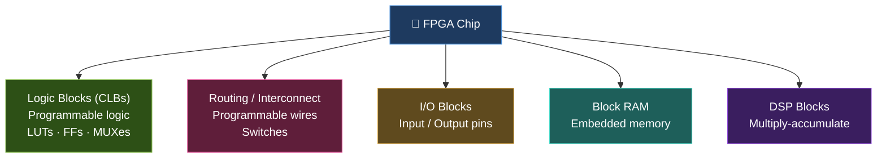
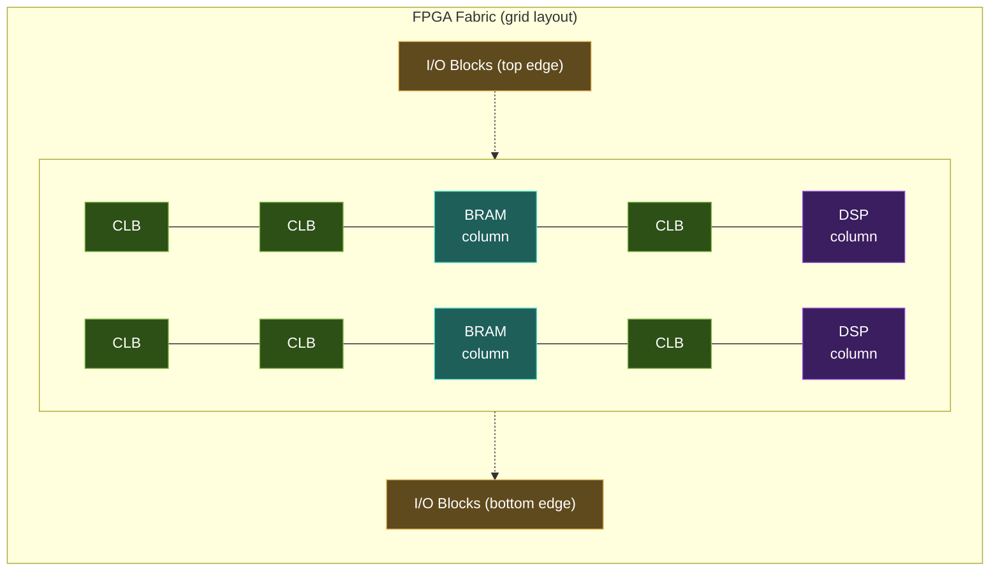
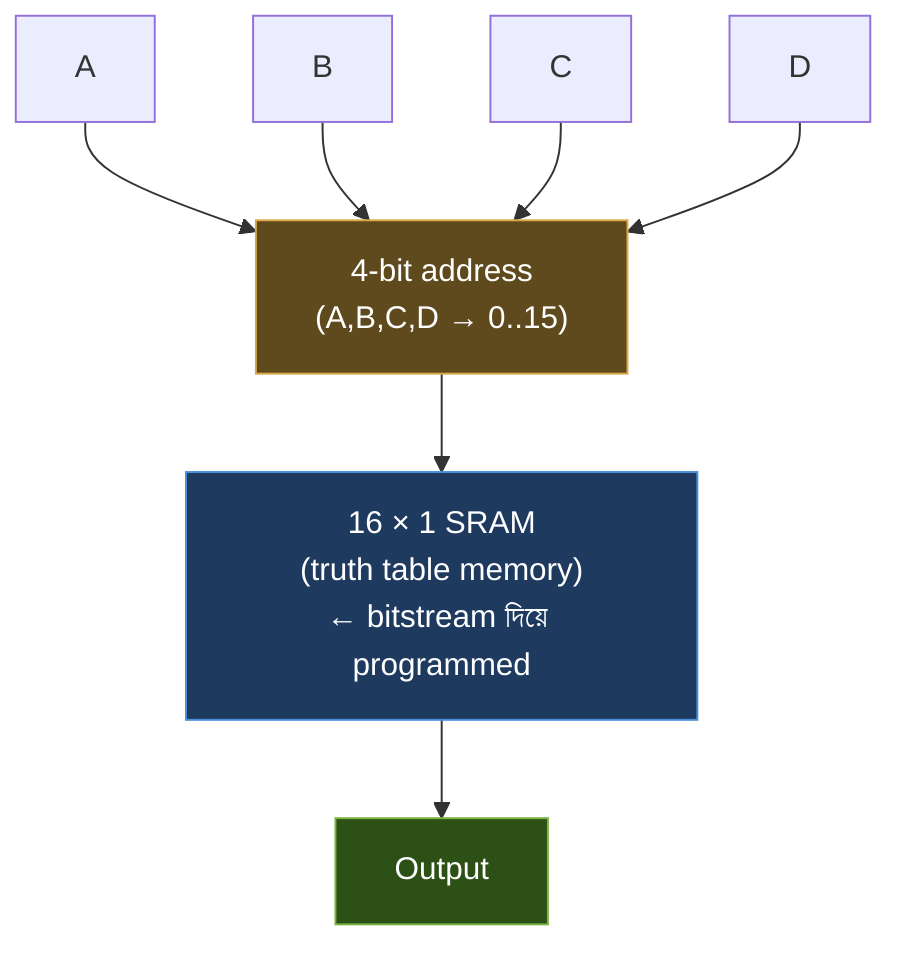
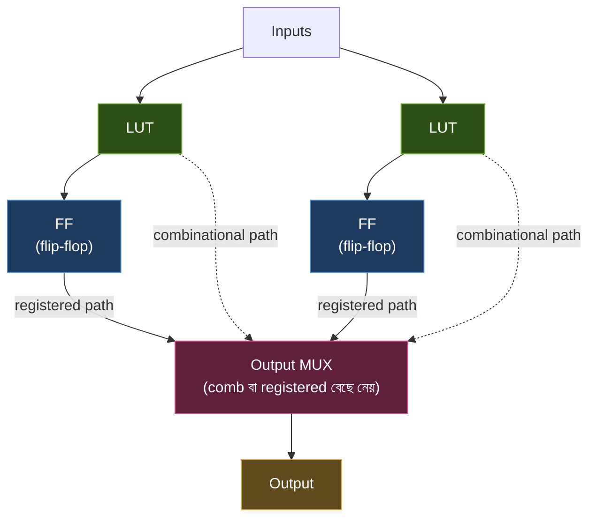
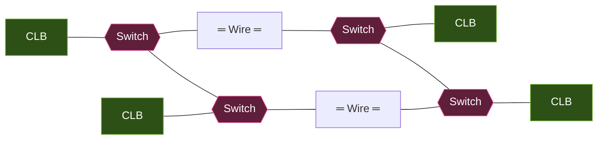
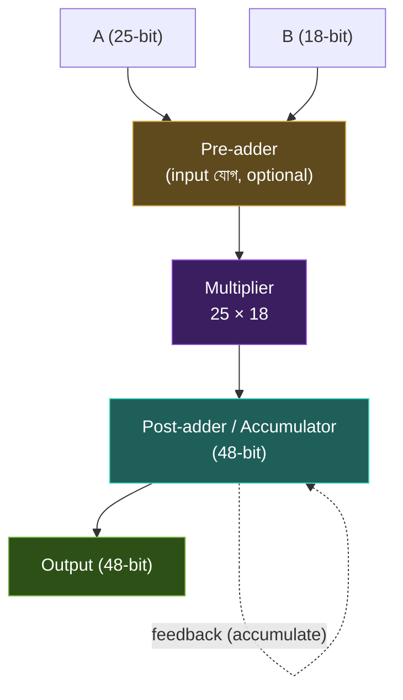
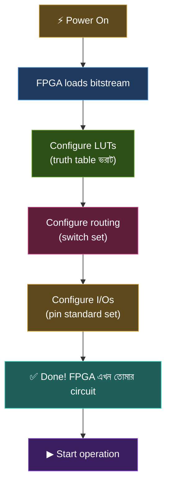
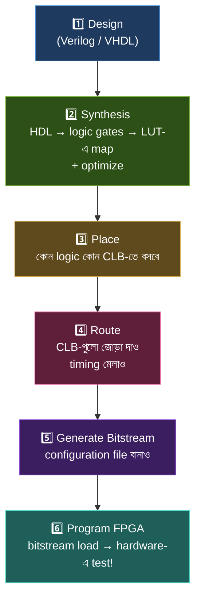

# 🔧 Chapter 9: Build Your Own Understanding of FPGAs
## From Simulation to Silicon - Real Programmable Hardware!

> **"Simulation is software. FPGA is hardware. Time to make it REAL!"**
>
> **"Simulation software। FPGA hardware। এবার REAL বানাও!"**

---

## 🎯 এই Chapter-এ তুমি শিখবে:

```
✅ What is an FPGA? - Programmable chips
✅ FPGA Architecture - LUTs, CLBs, routing
✅ How FPGAs work - configuration & logic
✅ Block RAM - embedded memory
✅ DSP blocks - fast arithmetic
✅ FPGA vs ASIC - when to use what
✅ Major FPGA vendors - Xilinx, Intel, Lattice, Gowin
✅ তোমার processor FPGA-তে deploy করার foundation! 🎉
```

**Time Required:** 1 week (3-4 hours/day)  
**No Hardware Needed Yet:** Pure theory chapter

এতদিন তুমি Verilog লিখেছো, testbench বানিয়েছো, GTKWave-এ waveform দেখেছো। কিন্তু একটা কথা ভেবে দেখো — তোমার সব circuit এতক্ষণ চলছিল **software simulator**-এর ভেতরে, একটা pretend জগতে। কোনো electron নড়াচড়া করেনি, কোনো voltage ওঠানামা করেনি। এই chapter-এ আমরা সেই দেয়ালটা ভাঙবো। তুমি বুঝবে কীভাবে একটা আসল chip — FPGA — তোমার Verilog কোডকে **সত্যিকারের hardware**-এ রূপ দেয়, যেখানে আলো জ্বলে, signal চলে, এবং তোমার design বাস্তবে শ্বাস নেয়।

কিন্তু তার আগে একটা গভীর প্রশ্নের উত্তর দরকার: একটা chip তো কারখানায় তৈরি হওয়ার সময়েই তার কাজ fixed হয়ে যায় (Intel-এর CPU চিরকাল CPU-ই থাকে) — তাহলে একটা chip কীভাবে **কেনার পরে** তোমার ইচ্ছেমতো যেকোনো circuit হয়ে উঠতে পারে? এই magic-এর নামই FPGA। চলো বুঝি কীভাবে এটা সম্ভব।

---

## 🚀 Quick Understanding - 5 মিনিটে FPGA Basics!

### What is FPGA?

```
FPGA = Field Programmable Gate Array

Field:      After manufacturing (in the field)
Programmable: Can be reprogrammed
Gate Array:  Array of logic gates

একটা chip যা তুমি যা চাও তাই বানাতে পারো!
```

নামটা ভেঙে দেখলেই পুরো ব্যাপারটা পরিষ্কার হয়ে যায়। **"Field"** মানে "মাঠে" — অর্থাৎ chip-টা কারখানা থেকে বেরিয়ে আসার পরে, তোমার হাতে, তোমার টেবিলে। **"Programmable"** মানে তুমি বারবার নতুন করে এর behaviour ঠিক করে দিতে পারো। আর **"Gate Array"** মানে এর ভেতরে সাজানো আছে লক্ষ লক্ষ logic gate-এর একটা বিশাল array, যেগুলোকে তুমি যেমন খুশি জুড়ে নিতে পারো।

একটা সুন্দর analogy ভাবো — **LEGO**। একটা ready-made খেলনা গাড়ি (ASIC-এর মতো) দেখতে নিখুঁত, কিন্তু সেটাকে তুমি কখনো প্লেন বানাতে পারবে না। অন্যদিকে এক বাক্স LEGO ব্লক (FPGA-এর মতো) দিয়ে আজ গাড়ি, কাল প্লেন, পরশু রোবট — যা খুশি বানাতে পারো, ভেঙে আবার নতুন করে গড়তে পারো। FPGA হলো ঠিক তেমনই — silicon দিয়ে বানানো এক বাক্স reprogrammable LEGO, যা দিয়ে তুমি adder, counter, এমনকি একটা গোটা RISC-V processor পর্যন্ত গড়ে তুলতে পারো।

### FPGA vs Everything Else:

| Feature | Software (CPU) | FPGA | ASIC |
|---|---|---|---|
| **Speed** | Slow | Fast | Fastest |
| **Flexibility** | Maximum | High | None |
| **Cost/unit** | Low | Medium | High |
| **Volume** | Any | Low/Medium | High |
| **Time to market** | Fast | Fast | Slow |
| **Power** | N/A | Medium | Low |
| **Use case** | General | Acceleration | Mass production |

এই table-টা একটু intuition দিয়ে বুঝে নাও — তিনটে আলাদা দুনিয়ার গল্প এখানে:

- **Software (CPU):** তুমি Python বা C কোড লিখলে, সেটা একটা fixed CPU-এর উপর **একটার পর একটা** instruction হিসেবে চলে। অসম্ভব flexible (যেকোনো কোড লেখো), কিন্তু তুলনায় ধীর — কারণ একটা general-purpose CPU তোমার নির্দিষ্ট কাজের জন্য বানানো না।
- **ASIC:** এটা একটা custom chip যা **শুধু একটাই কাজ** করার জন্য কারখানায় তৈরি — যেমন তোমার ফোনের camera processor। দুনিয়ার সবচেয়ে দ্রুত আর কম-power, কিন্তু একবার বানানো হয়ে গেলে আর এক বিন্দুও বদলানো যায় না, আর বানাতে লাগে কোটি টাকা।
- **FPGA:** এটা মাঝখানের সোনার হরিণ — ASIC-এর মতো hardware-speed-এর কাছাকাছি, অথচ software-এর মতো reprogrammable। তাই শেখা, prototyping আর প্রসেসর বানানোর জন্য এটাই perfect।

```
FPGA = Hardware যা তুমি reprogram করতে পারো!
```

🎉 **এখন তুমি FPGA-এর basic idea বুঝেছো!**

---

## ৯.১ FPGA History - How It All Started

FPGA-এর গল্পটা আসলে একটা সমস্যা সমাধানের গল্প। ১৯৮০-এর দশকে engineer-রা একটা দুষ্টচক্রে আটকে ছিল: নতুন একটা chip বানাতে হলে কারখানায় custom mask তৈরি করতে হতো, যাতে লাগতো কয়েক মাস আর প্রচুর টাকা। design-এ একটাও ভুল থাকলে পুরো প্রক্রিয়া আবার শুরু — আবার মাস, আবার টাকা। কেউ একজন ভাবলো — "এমন একটা chip যদি বানানো যেত, যেটা কেনার পরে নিজের ইচ্ছেমতো configure করা যায়?" সেই ভাবনা থেকেই FPGA-এর জন্ম।

### The Timeline:

```
1984: First FPGA by Xilinx (XC2064)
      - 64 logic blocks
      - Revolutionary concept!

1990s: Competition grows
      - Altera (now Intel)
      - Lattice
      - Actel (now Microchip)

2000s: Modern FPGAs
      - Millions of logic cells
      - Block RAM
      - DSP blocks
      - Hard processors

2010s: Advanced features
      - High-speed transceivers
      - PCIe
      - 100G Ethernet
      - AI accelerators

2020s: Heterogeneous computing
      - FPGA + ARM cores
      - AI/ML engines
      - Ultra-high bandwidth

Today: FPGA everywhere!
      - Data centers
      - 5G networks
      - AI acceleration
      - Space applications
```

লক্ষ্য করো trajectory-টা কত দূর এসেছে: ১৯৮৪ সালের প্রথম FPGA-তে ছিল মাত্র **৬৪টা logic block** — আজকের high-end FPGA-তে থাকে **কয়েক মিলিয়ন** logic cell। অর্থাৎ চার দশকে capacity বেড়েছে প্রায় দশ লক্ষ গুণ! এই বিস্ফোরণের কারণেই আজ FPGA শুধু ছোট glue-logic নয়, বরং data center, 5G base station, এমনকি মহাকাশযানেও বসছে — কারণ space-এ একবার চিপ পাঠানোর পর সেটাকে দূর থেকেই reprogram করে নতুন কাজ দেওয়া যায়, যা একটা fixed ASIC দিয়ে কখনোই সম্ভব হতো না।

### Why FPGAs Matter:

```
Before FPGA:
- Design circuit → Make ASIC → Wait months → $$$
- If design wrong → Start over → More $$$

With FPGA:
- Design circuit → Program FPGA → Test instantly
- Wrong? → Reprogram → No cost!
- Perfect? → Then make ASIC (optional)

FPGA = Hardware prototyping + Production!
```

এই পার্থক্যটাই কেন এত বড় ব্যাপার, সেটা তোমার নিজের অভিজ্ঞতা দিয়ে বুঝে নাও। Verilog-এ একটা bug লিখে ফেললে তুমি কী করো? কোড ঠিক করো, আবার compile করো, আবার simulate করো — কয়েক সেকেন্ডের কাজ। FPGA-ও ঠিক সেই freedom-টা **আসল hardware**-এ দেয়: design ভুল হলে শুধু নতুন bitstream load করো, ব্যস। কিন্তু ASIC-এ একই ভুল মানে কারখানার কোটি টাকার mask আবার বানানো — সেই কারণেই বড় কোম্পানিগুলোও ASIC বানানোর **আগে** FPGA-তে তাদের design বছরের পর বছর test করে। তুমি এই বইয়ে ঠিক সেই professional পথেই হাঁটছো: আগে FPGA-তে নিজের RISC-V চালাবে, তারপর Part 5-এ সেটাকে আসল silicon-এ পাঠাবে।

---

## ৯.২ FPGA Basic Architecture

ভেতরে ঢোকার আগে একটা mental model বানিয়ে নাও। কল্পনা করো একটা বিশাল **পরিকল্পিত শহর**। শহরে আছে অসংখ্য একই রকম বাড়ি (logic block), বাড়িগুলোকে জোড়া দেওয়ার জন্য রাস্তা আর মোড়ের signal (routing/switches), শহরের সাথে বাইরের দুনিয়ার সংযোগের জন্য বিমানবন্দর আর বন্দর (I/O blocks), কিছু বড় গুদাম (Block RAM), আর কয়েকটা বিশেষ কারখানা যেগুলো ভারী হিসাব-নিকাশ করে (DSP blocks)। তোমার design মানে আসলে এই শহরের একটা "নকশা" — কোন বাড়ি কী কাজ করবে আর কোন রাস্তা দিয়ে কাকে যুক্ত করা হবে, সেটাই ঠিক করে দেওয়া।

### The Big Picture:

একটা FPGA chip-এর ভেতরে যে বড় বড় উপাদানগুলো থাকে, সেগুলোর hierarchy এমন:



বাস্তব silicon-এ এই উপাদানগুলো এলোমেলোভাবে ছড়ানো থাকে না — থাকে একটা পরিকল্পিত **grid**-এর মতো। logic block-গুলো সারি-সারি (rows ও columns) সাজানো, তাদের মাঝে মাঝে বুনে দেওয়া আছে routing-এর রাস্তা, আর মাঝে মাঝে BRAM বা DSP-এর column। chip-এর একদম বাইরের কিনারা ঘিরে থাকে I/O block-গুলো, যাতে চারপাশের pin-এর সাথে সহজে যোগ হতে পারে:



### Three Key Components:

পুরো architecture-টা মনে রাখার সহজতম উপায় হলো — এর **তিনটে মূল স্তম্ভ** আছে। বাকি সবকিছু (BRAM, DSP) এই তিনটের উপরে বসানো extra সুবিধা মাত্র:

| # | Component | কাজ কী | analogy |
|---|---|---|---|
| 1 | **Logic Blocks (CLBs)** | তোমার logic বাস্তবায়ন করে; ভেতরে LUT আর flip-flop | শহরের বাড়িঘর |
| 2 | **Routing Network** | block-গুলোকে programmable switch দিয়ে জোড়া দেয় | রাস্তা ও মোড়ের signal |
| 3 | **I/O Blocks** | বাইরের দুনিয়ার (LED, button, pin) সাথে সংযোগ | বিমানবন্দর/বন্দর |

মনে রেখো এই pattern-টা — **"compute, connect, communicate"**। CLB compute করে (হিসাব), routing connect করে (জোড়া দেয়), I/O communicate করে (বাইরে কথা বলে)। যেকোনো FPGA, ছোট হোক বা বড়, এই তিনটে কাজেরই সমন্বয়। এখন চলো প্রতিটা স্তম্ভ গভীরভাবে বুঝি — শুরু করি সবচেয়ে মৌলিক একক, LUT দিয়ে।

---

## ৯.৩ LUT - Look-Up Table (The Heart of FPGA!)

এসে গেছি সেই জায়গায় যেখানে FPGA-এর আসল জাদু লুকিয়ে — **LUT (Look-Up Table)**। এই chapter-এ আর কিছু ভুলে গেলেও LUT-এর intuition-টা ধরে রেখো, কারণ এটাই সেই প্রশ্নের উত্তর যে "একটা chip কেনার পরে কীভাবে যেকোনো circuit হয়ে উঠতে পারে।"

### What is a LUT?

```
LUT = Look-Up Table
- Small memory that implements logic
- Core building block of FPGA
- Can implement ANY boolean function

Think: Truth table in hardware!
```

LUT বোঝার চাবিকাঠি একটাই উপলব্ধি: **logic gate বানানোর দরকার নেই, যদি গেটের উত্তরগুলো আগে থেকে মুখস্থ করে রাখা যায়।**

একটু ভাবো। সাধারণভাবে একটা AND gate বানাতে হলে transistor দিয়ে সত্যিকারের গেট তৈরি করতে হয়। কিন্তু একটা gate আসলে কী? এটা শুধু একটা **truth table** — input দিলে একটা নির্দিষ্ট output দেয়। এখন প্রশ্ন: তুমি যদি সেই truth table-এর সব উত্তর একটা ছোট memory-তে লিখে রাখো, আর input-গুলোকে সেই memory-এর **address** হিসেবে ব্যবহার করো — তাহলে কী হবে? input বদলালেই address বদলাবে, address বদলালেই memory থেকে সঠিক উত্তরটা বেরিয়ে আসবে। ফলাফল: memory-টা হুবহু একটা gate-এর মতো আচরণ করবে, অথচ ভেতরে কোনো gate নেই!

ঠিক এটাই LUT। একদম সহজ ভাষায় — **LUT হলো একটা ছোট্ট memory যেখানে একটা truth table লেখা থাকে, আর input-গুলো হলো সেই table পড়ার address।** তুমি যখন design "program" করো, তখন আসলে এই memory cell-গুলোতে 0/1 লিখে দাও। ভেতরের cell-গুলোর মান বদলে দিলেই একই LUT হয়ে যায় সম্পূর্ণ নতুন একটা gate। এই কারণেই একে বলে **programmable logic** — logic নিজেই নরম মাটির মতো, যেমন ছাঁচে ফেলবে তেমন আকার নেবে।

> 💡 **মূল অন্তর্দৃষ্টি:** একটা LUT কোনো gate-কে *গণনা* করে না; এটা শুধু আগে থেকে রাখা উত্তর *মনে রাখে* এবং *খুঁজে বের করে* (look-up)। আর যেহেতু যেকোনো combinational logic-ই একটা truth table, তাই যথেষ্ট বড় LUT দিয়ে যেকোনো logic বানানো সম্ভব।

### 4-input LUT Example:

```
4-input LUT = 2^4 = 16 memory cells

Can implement any 4-input function:
- AND, OR, XOR, NAND, etc.
- Even complex functions!
```

কেন ঠিক **16টা** cell? কারণ 4টা input-এর সম্ভাব্য combination-এর সংখ্যা হলো 2⁴ = 16 (0000 থেকে 1111 পর্যন্ত)। প্রতিটা সম্ভাব্য input-combination-এর জন্য একটা করে উত্তর জমা রাখতে হবে, তাই ঠিক ১৬টা ঘর দরকার — একটাও বেশি না, একটাও কম না। এখানে দারুণ ব্যাপারটা হলো: যেহেতু **প্রতিটা** combination-এর জন্য আলাদা ঘর আছে, তুমি সেই ঘরগুলোতে যা খুশি মান বসাতে পারো। তার মানে একটা 4-input LUT 4-variable-এর **যেকোনো** boolean function বানাতে পারে — হোক সেটা সহজ AND, কিংবা পাগলাটে কোনো জটিল সমীকরণ। কোনো function-ই এর কাছে "কঠিন" না, কারণ সবার জন্যই শুধু একটা lookup table।

ভেতরের গঠনটা এরকম — input-গুলো একসাথে মিলে একটা address বানায়, সেই address দিয়ে memory থেকে সঠিক bit-টা select হয়ে output-এ আসে:



ভেতরে আসলে কী ঘটছে সেটাও বুঝে রাখো: ওই "16 × 1 RAM" থেকে এক বিট বেছে নেওয়ার কাজটা করে একটা **16-to-1 multiplexer** (MUX)। input A, B, C, D হলো সেই MUX-এর select line, আর ১৬টা memory cell হলো তার ১৬টা data input। তুমি Chapter 3-এ MUX আর memory দুটোই শিখেছো — দেখো, সেই দুটো মৌলিক ব্লক মিলেই FPGA-এর সবচেয়ে গুরুত্বপূর্ণ অংশটা তৈরি! নতুন কিছু না, শুধু পুরোনো জিনিসের চমৎকার সমন্বয়।

### LUT Programming Example:

এবার চোখের সামনে দেখো কীভাবে একটা খালি LUT একটা সত্যিকারের gate হয়ে ওঠে। ধরো আমরা একটা **4-input AND gate** বানাতে চাই (output 1 হবে শুধু তখনই, যখন A, B, C, D চারটেই 1):

```
Want: 4-input AND gate (A & B & C & D)

Truth table:
A B C D | Output | Memory Address | Value
0 0 0 0 |   0    |      0        |   0
0 0 0 1 |   0    |      1        |   0
0 0 1 0 |   0    |      2        |   0
0 0 1 1 |   0    |      3        |   0
...
1 1 1 0 |   0    |     14        |   0
1 1 1 1 |   1    |     15        |   1

Program LUT memory[15] = 1, all others = 0
Now LUT implements AND gate!

Want different function? Reprogram memory!
```

খেয়াল করেছো ব্যাপারটা? AND gate-এর truth table-এ শুধু একটা সারিতেই output 1 — যখন সব input 1, অর্থাৎ address 15-এ। তাই আমরা শুধু `memory[15] = 1` লিখি, বাকি ১৫টা ঘরে 0। ব্যস, LUT-টা এখন নিখুঁত AND gate! এখানেই আসল মজা: তুমি যদি এর বদলে **OR gate** চাও, তাহলে শুধু একটা ঘর (address 0, অর্থাৎ সব input 0) 0 রেখে বাকি সব ১৫টাকে 1 করে দাও — একই hardware, এক বিন্দুও তার না নড়িয়ে, সম্পূর্ণ ভিন্ন একটা gate। এটাই সেই মুহূর্ত যেখানে তুমি অনুভব করবে "programmable logic" কথাটার আসল ওজন।

### LUT Sizes:

LUT সব এক মাপের হয় না। input যত বেশি, memory তত বড় (2ⁿ নিয়মে), তাই একটা trade-off আছে:

| LUT type | Memory cells | কী বোঝায় |
|---|---|---|
| **4-input LUT** | 2⁴ = 16 bits | পুরোনো/ছোট FPGA |
| **5-input LUT** | 2⁵ = 32 bits | মাঝারি |
| **6-input LUT** | 2⁶ = 64 bits | আধুনিক FPGA-এর standard |

trade-off-টা বোঝা জরুরি: **বড় LUT** একসাথে আরও বেশি input-এর জটিল function এক ধাপেই সামলাতে পারে, ফলে সেই function বানাতে কম LUT লাগে আর signal-কে কম gate-এর ভেতর দিয়ে যেতে হয় (দ্রুত)। কিন্তু input এক বাড়লে memory cell দ্বিগুণ হয় — তাই বড় LUT বেশি area আর power খায়, এবং তুমি যদি ছোট function বানাও তাহলে ঘরগুলো খালি পড়ে থাকে (অপচয়)। দশকের পর দশক পরীক্ষার পর industry দেখেছে যে **6-input LUT** এই দড়ি-টানাটানিতে সবচেয়ে ভালো সমঝোতা — তাই আজকের প্রায় সব আধুনিক FPGA (Xilinx, Intel সহ) 6-input LUT ব্যবহার করে।

### LUT Versatility:

এবার Verilog-এর চোখে দেখো। নিচের প্রতিটা `assign` line দেখতে সম্পূর্ণ আলাদা একেকটা circuit, তাই না? অথচ synthesis tool-এর কাছে এদের সবার মানে একটাই — "এই 4টা input দিলে output কী হবে, তার truth table বের করো এবং একটা LUT-এর ১৬টা ঘরে সেটা লিখে দাও।" তাই এই **সবগুলো** ভিন্ন function একটা **মাত্র** LUT-এ এঁটে যায়, শুধু ভেতরের ১৬টা bit-এর মান পাল্টে:

```verilog
// Single 4-input LUT can implement:

// Example 1: AND gate
assign out = a & b & c & d;

// Example 2: OR gate
assign out = a | b | c | d;

// Example 3: XOR chain
assign out = a ^ b ^ c ^ d;

// Example 4: Complex function
assign out = (a & b) | (c & ~d);

// Example 5: 4:1 MUX
assign out = sel[1] ? (sel[0] ? d : c) :
                      (sel[0] ? b : a);

All in ONE LUT! Magic! ✨
```

এখানে একটা গভীর সত্য লুকিয়ে আছে যা তোমার Verilog শেখাকে নতুন আলোয় দেখাবে: তুমি যখন Verilog লেখো, তখন আসলে gate আঁকছো না — তুমি **LUT-গুলো কীভাবে ভরাট হবে সেই truth table বর্ণনা করছো**। synthesis tool তোমার কোড পড়ে, প্রতিটা চিহ্নিত logic-এর truth table বের করে, আর সেগুলোকে FPGA-এর হাজার হাজার খালি LUT-এ ভাগ করে বসিয়ে দেয়। এই কারণেই Example 4-এর মতো একটা "জটিল" function আর Example 1-এর "সহজ" AND — দুটোরই খরচ ঠিক একটাই LUT। FPGA-এর জগতে জটিলতা মাপা হয় কত input লাগছে তা দিয়ে, gate কতগুলো তা দিয়ে নয়।

---

## ৯.৪ CLB - Configurable Logic Block

LUT একা কিন্তু পুরো গল্প নয়। একটা LUT শুধু combinational logic (truth table) দিতে পারে — কিন্তু তোমার circuit-এ তো memory-ও লাগে (Chapter 4-এর flip-flop মনে আছে?), নইলে counter বা register বানাবে কীভাবে? তাই FPGA ডিজাইনাররা LUT-এর সাথে flip-flop আর কিছু helper জুড়ে একটা packaged একক বানিয়েছে — এর নাম **CLB**।

### What is a CLB?

```
CLB = Configurable Logic Block
- Basic logic unit in FPGA
- Contains multiple LUTs
- Also has flip-flops, MUXes
- Building block of all logic
```

CLB-কে ভাবো LUT-এর "আবাসিক ভবন" হিসেবে। একটা একা LUT একটা একলা ইট — দরকারি, কিন্তু একা কিছু বানানো যায় না। CLB হলো সেই ইট দিয়ে তৈরি একটা সম্পূর্ণ ফ্ল্যাট, যেখানে আছে গণনার জন্য কয়েকটা LUT, মনে রাখার জন্য flip-flop, আর signal-কে কোন পথে পাঠানো হবে সেটা ঠিক করার জন্য MUX। FPGA-কে আসলে এই CLB-এর একটা বিশাল array হিসেবেই বানানো হয় — placement tool যখন তোমার design বসায়, তখন এই CLB-এর হিসেবেই বসায়।

ভেতরের data flow-টা এমন — LUT-এ combinational হিসাব হয়, তারপর একটা MUX ঠিক করে output সরাসরি বেরিয়ে যাবে (combinational) নাকি আগে flip-flop-এ গিয়ে এক clock আটকে থাকবে (registered/sequential):



ওই output MUX-টা কেন এত গুরুত্বপূর্ণ, বুঝে নাও: তুমি Verilog-এ যখন `assign y = a & b;` লেখো (combinational), tool MUX-টাকে LUT-এর সরাসরি output বেছে নিতে বলে। আর তুমি যখন `always @(posedge clk)` ব্লকে কিছু লেখো (sequential), tool একই MUX-কে এবার flip-flop-এর output বেছে নিতে বলে। অর্থাৎ একটা CLB একই hardware দিয়ে combinational বা sequential — দুই-ই হতে পারে, শুধু MUX-এর setting বদলে। এটাই CLB-কে "Configurable" বানায়।

### Typical CLB Contents:

```
One CLB usually contains:
✅ 2-4 LUTs (6-input each)
✅ 2-4 Flip-Flops (for sequential logic)
✅ MUXes (for flexible routing)
✅ Carry chain (for fast arithmetic)
✅ Some arithmetic logic

Example (Xilinx Slice):
- 4 × 6-input LUTs
- 8 × Flip-Flops
- Carry chain
- Wide multiplexers
```

এই উপাদানগুলোর মধ্যে একটা আলাদা করে চেনা দরকার — **carry chain**। তুমি Chapter 3-এ দেখেছিলে যে একটা ripple-carry adder-এ carry এক bit থেকে পরের bit-এ গড়িয়ে যায়, আর প্রতিটা ধাপে দেরি জমে। যদি এই carry-গুলো সাধারণ routing-এর রাস্তা দিয়ে এক CLB থেকে আরেক CLB-তে পাঠাতে হতো, তাহলে adder ভয়াবহ ধীর হতো। তাই FPGA-তে carry-এর জন্য আলাদা একটা **dedicated, super-fast তার** বুনে দেওয়া আছে যেটা একটা CLB-এর উপরের ঘর থেকে নিচের ঘরে সরাসরি লাফ দেয় — কোনো programmable switch ছাড়াই। এই কারণেই FPGA-তে addition আর counter এত দ্রুত চলে। (এই কারণেই তোমার RISC-V-এর ALU FPGA-তে চমৎকার পারফর্ম করবে!)

### CLB Flexibility:

যেহেতু এক CLB-তে একসাথে কয়েকটা LUT আর flip-flop থাকে, তাই একটা মাত্র CLB-ই অবাক করার মতো কাজ করতে পারে — শুধু একটা gate নয়, বরং একটা গোটা ছোট sub-circuit:

```
One CLB can implement:

Combinational:
✅ Several logic gates
✅ Small MUX
✅ Comparator
✅ Simple arithmetic

Sequential:
✅ Multiple registers
✅ Shift registers
✅ Small counter
✅ State machine

One CLB = Lots of functionality!
```

এই তালিকাটা মাথায় রাখলে তুমি FPGA-এর "size" বোঝা শুরু করবে। কেউ যখন বলে একটা FPGA-তে "৮,৬৪০টি LUT" আছে, তখন সেটা আসলে একটা পরোক্ষ হিসাব — কয়টা ছোট state machine, counter বা comparator একসাথে FPGA-তে আঁটবে। তোমার design যত বড় হবে (যেমন একটা পুরো RISC-V CPU), তত বেশি CLB খরচ হবে। তাই পরের section-এ যখন routing দেখব, তখন মনে রেখো — শুধু যথেষ্ট CLB থাকলেই হবে না, সেই CLB-গুলোকে একে অপরের সাথে জোড়া দেওয়ার রাস্তাও থাকতে হবে।

---

## ৯.৫ Routing and Interconnect

CLB-গুলো হলো শহরের বাড়ি, কিন্তু রাস্তা ছাড়া শহর অচল। FPGA-এর CLB-গুলোও যদি একে অপরের সাথে কথা বলতে না পারে, তাহলে তারা শুধু বিচ্ছিন্ন কিছু দ্বীপ — কোনো কাজে আসে না। তোমার design যখন একটা LUT-এর output আরেকটা LUT-এর input-এ পাঠাতে চায়, সেই সংযোগটা ঘটায় **routing** বা interconnect। আর এটাই FPGA-এর সবচেয়ে বড় চমকপ্রদ ব্যাপারগুলোর একটা: শুধু logic নয়, **তারগুলোও programmable**।

### The Wiring Problem:

```
Problem: 
- Thousands of CLBs
- Need to connect them
- Connections change per design

Solution:
- Programmable switches
- Routing matrix
- Multiple routing tracks
```

সমস্যাটা একটু গভীরভাবে ধরো। তোমার একটা design-এ CLB #5-এর output হয়তো CLB #900-তে যাওয়া দরকার। কিন্তু পরের design-এ হয়তো সেই একই CLB #5-কে CLB #12-এ পাঠাতে হবে। কারখানা তো আগে থেকে জানে না তুমি কী বানাবে — তাহলে তার পক্ষে আগে থেকে নির্দিষ্ট তার বসানো অসম্ভব। সমাধান হলো একটা বিশাল **জালের মতো সম্ভাব্য তারের network** বুনে রাখা, আর প্রতিটা মোড়ে একটা করে programmable switch বসানো। তুমি (আসলে routing tool) ঠিক করে দাও কোন switch খোলা থাকবে আর কোনটা বন্ধ — তাতেই signal-এর জন্য নির্দিষ্ট পথ তৈরি হয়। এই switch-গুলোও LUT-এর মতোই bitstream দিয়ে set হয়।

### Routing Architecture:

কল্পনা করো CLB-গুলো একটা grid-এ সাজানো, তাদের মাঝে আনুভূমিক ও উল্লম্ব তার (routing tracks) চলে গেছে, আর প্রতিটা সংযোগস্থলে আছে একটা **switch box** — যেটা ঠিক করে কোন তার কোন তারের সাথে জুড়বে:



প্রতিটা switch-এর কাজ একদম সহজ, ঠিক একটা বাতির সুইচের মতো:

```
Switches are programmable:
- Open  = No connection (তার কাটা)
- Closed = Connected     (তার জোড়া)

Your design determines switch settings!
```

এখানে একটা গুরুত্বপূর্ণ বাস্তবতা মাথায় রাখো: আধুনিক FPGA-তে chip-এর জায়গার একটা **বিরাট অংশ** আসলে logic নয়, বরং এই routing — তার আর switch। কারণ CLB বানানো সহজ, কিন্তু "যেকোনো CLB-কে যেকোনো CLB-এর সাথে জোড়া দেওয়া যাবে" — এই নমনীয়তা দিতে গেলে অগণিত সম্ভাব্য পথ আর switch দরকার। তাই FPGA শেখার সময় মনে রেখো, routing কোনো গৌণ ব্যাপার নয়; এটাই অনেক সময় তোমার design-এর গতি আর আকার ঠিক করে দেয়।

### Routing Hierarchy:

সব সংযোগ সমান দূরত্বের নয় — পাশের CLB-এ যাওয়া আর chip-এর উল্টোদিকে যাওয়া আলাদা ব্যাপার। তাই routing-কে কয়েকটা স্তরে ভাগ করা হয়, ঠিক যেমন শহরে গলি, প্রধান সড়ক আর হাইওয়ে থাকে:

| স্তর | কাকে জোড়ে | বৈশিষ্ট্য | analogy |
|---|---|---|---|
| **Local Routing** | কাছাকাছি CLB | দ্রুত, ছোট তার, সীমিত নাগাল | পাড়ার গলি |
| **Global Routing** | দূরের যেকোনো জায়গা | তুলনায় ধীর, কিন্তু সব জায়গায় পৌঁছায় | প্রধান সড়ক |
| **Dedicated Routing** | বিশেষ signal (clock, reset) | optimized পথ, খুব কম skew | জরুরি সেবার আলাদা লেন |

এই hierarchy-এর পেছনের যুক্তিটা সুন্দর: কাছের সংযোগগুলো local routing দিয়ে দ্রুত সারা যায়, আর দূরের জন্য global routing — যেটা ধীর কিন্তু সর্বত্রগামী। আর **clock**-এর জন্য কেন আলাদা dedicated lane? কারণ clock signal-কে চিপের লক্ষ লক্ষ flip-flop-এ **একই সময়ে** পৌঁছাতে হবে — কোনো FF-এ আগে আর কোনোটায় পরে পৌঁছালে (এই সময়ের ফারাককে বলে **skew**) তোমার পুরো সময়-হিসাব ভেঙে পড়বে। তাই clock পায় বিশেষ, সুষম, কম-skew মহাসড়ক — যাতে সবাই একসাথে tick শোনে।

### Routing Challenges:

```
Routing can fail if:
❌ Design too complex for FPGA size
❌ Critical paths too long
❌ Congestion (too many signals)
❌ Poor placement

Good design = Easy routing
Bad design = Routing nightmare!
```

"Routing fail" কথাটা শুনে ভয় পেও না, বরং কেন হয় বুঝে নাও — তাহলে পরে নিজের design-এ এড়াতে পারবে। ভাবো একটা ছোট শহরে অফিস-ছুটির সময় সব রাস্তা জ্যামে আটকে গেছে (**congestion**) — খুব বেশি signal একই এলাকা দিয়ে যেতে চাইছে, কিন্তু রাস্তা কম। কিংবা দুটো ব্লক, যাদের প্রতি clock cycle-এ কথা বলতে হয়, তাদের চিপের দুই কোণে বসিয়ে দেওয়া হয়েছে (**poor placement**) — ফলে signal-কে অনেক দূর দৌড়াতে হয় আর সময়ে পৌঁছায় না (**critical path too long**)। এই কারণেই placement আর routing হাত ধরাধরি করে চলে: কাছের জিনিস কাছে বসালে রাস্তা ছোট হয়, জ্যাম কমে, design দ্রুত চলে। ভালো নকশা মানে শুধু সঠিক logic নয়, বরং সঠিক **জায়গায়** বসানো logic।

---

## ৯.৬ Block RAM (BRAM)

এতক্ষণে একটা প্রশ্ন তোমার মাথায় আসা উচিত: যদি LUT দিয়ে memory বানানো যায় (LUT তো নিজেই একটা ছোট memory!), তাহলে আলাদা করে BRAM-এর দরকার কী? চমৎকার প্রশ্ন। উত্তরটা হলো **দক্ষতা (efficiency)**। তোমার RISC-V processor-এর instruction memory বা data memory-তে হয়তো হাজার হাজার byte লাগবে। সেই বিশাল memory যদি তুমি LUT দিয়ে বানাও, তাহলে তোমার মূল্যবান logic LUT-গুলো প্রায় সবই memory-তে খেয়ে ফেলবে, CPU বানানোর জন্য আর কিছু থাকবে না — এটা হবে রাজপ্রাসাদের সব ইট দিয়ে শুধু একটা গুদাম বানানোর মতো অপচয়। তাই FPGA নির্মাতারা আগে থেকেই চিপের ভেতর কিছু **dedicated memory block** বসিয়ে রাখে — এগুলোই **Block RAM (BRAM)**।

### What is Block RAM?

```
Block RAM = Embedded memory blocks
- Dedicated RAM inside FPGA
- Much faster than external RAM
- Precious resource (limited!)

Typical sizes:
- 18Kb blocks (common)
- 36Kb blocks (dual)
- Can be combined
```

BRAM-কে ভাবো চিপের ভেতরের একটা **built-in গুদাম**। logic দিয়ে memory বানানোর বদলে এখানে আছে ঘনভাবে সাজানো, শুধুমাত্র data রাখার জন্য optimize-করা SRAM cell — তাই একই জায়গায় অনেক বেশি bit ধরে, খরচও কম, গতিও বেশি। বাইরের (external) RAM চিপের থেকেও এটা অনেক দ্রুত, কারণ data-কে চিপের বাইরে pin পেরিয়ে যেতে হয় না — সব হিসাব চিপের ভেতরেই। কিন্তু একটা সতর্কবার্তা: BRAM-এর সংখ্যা **সীমিত** এবং fixed (কারখানায় যতগুলো বসানো, ততগুলোই)। তাই এটা একটা মূল্যবান সম্পদ — পরের chapter-গুলোতে CPU বানানোর সময় তুমি প্রায়ই হিসাব করবে "আমার কত BRAM লাগবে, আছে কতটা?"

### BRAM Features:

একটা সাধারণ LUT-memory-এর তুলনায় BRAM অনেক বেশি ক্ষমতাসম্পন্ন। এর মূল feature-গুলো:

```
✅ True dual-port (two independent ports)
✅ Configurable width × depth
✅ Synchronous read/write
✅ Optional output registers
✅ Write modes (read-first, write-first)
✅ Byte-enable support
```

এর মধ্যে **dual-port** feature-টা কেন এত শক্তিশালী, সেটা একটু বুঝে রাখো — কারণ এটা পরে তোমার processor design-এ সরাসরি কাজে লাগবে। dual-port মানে একই memory-তে **দুটো আলাদা দরজা (port)**, যেগুলো একই সময়ে স্বাধীনভাবে কাজ করতে পারে। ভাবো তোমার RISC-V-এর register file — একটা instruction-এ একসাথে দুটো source register পড়তে হয় (rs1 আর rs2)। dual-port memory দিয়ে তুমি এক ঘড়ির ধাপেই দুটো register একসাথে পড়তে পারো। এমনকি এক port দিয়ে পড়তে পড়তে অন্য port দিয়ে লেখাও সম্ভব!

আরেকটা মজার দিক হলো BRAM-এর **আকার নমনীয়**। একই 18Kb (≈18,000 bit) BRAM-কে তুমি লম্বা-সরু বা খাটো-চওড়া — নানা আকারে কনফিগার করতে পারো, তোমার দরকার অনুযায়ী:

| Configuration | মানে | কখন কাজে লাগে |
|---|---|---|
| 16K × 1 bit | ১৬ হাজার ১-bit ঘর | বড় flag/bitmap |
| 8K × 2 bits | ৮ হাজার ২-bit ঘর | ছোট value-এর array |
| 4K × 4 bits | ৪ হাজার ৪-bit ঘর | nibble data |
| 2K × 9 bits | ২ হাজার ৯-bit (parity সহ) | byte + parity |
| 1K × 18 bits | ১ হাজার ১৮-bit ঘর | চওড়া data |
| 512 × 36 bits | ৫১২টি ৩৬-bit ঘর (combined) | খুব চওড়া word |

লক্ষ্য করো — প্রতিটা সারিতে মোট bit সংখ্যা প্রায় একই (width × depth ≈ 18Kb)। তুমি শুধু ঠিক করছো সেই bit-গুলো কীভাবে সাজানো হবে: অনেক ছোট ঘর, নাকি কম কিন্তু চওড়া ঘর। এই নমনীয়তাই BRAM-কে byte-memory থেকে wide-data-buffer — সব কাজেই উপযোগী করে তোলে।

### BRAM vs Distributed RAM:

তাহলে FPGA-তে আসলে দুরকম memory আছে — BRAM (dedicated block), আর LUT দিয়ে বানানো **Distributed RAM**। কোনটা কখন? এই তুলনাটা মনে রাখলেই সিদ্ধান্ত নেওয়া সহজ:

| Feature | Block RAM | Distributed RAM |
|---|---|---|
| **Built from** | Dedicated memory blocks | LUTs |
| **Capacity** | Large (বড়) | Small (ছোট) |
| **Speed** | Fast | Very fast |
| **Flexibility** | Moderate | High |
| **Use case** | Big memory (CPU memory, buffers) | Small arrays (ছোট LUT, queue) |
| **Power** | Efficient | More power |

স্বজ্ঞাটা এরকম: **বড় memory চাইলে BRAM**, কারণ logic খরচ না করেই হাজার হাজার bit পাওয়া যায়। আর **খুব ছোট, ক্ষিপ্র memory** (যেমন মাত্র কয়েকটা word-এর একটা lookup বা ছোট FIFO) হলে distributed RAM ভালো — কারণ সেটা ঠিক logic-এর পাশেই থাকে, তাই অতি দ্রুত, আর এত ছোট জিনিসের জন্য একটা গোটা BRAM block খরচ করা অপচয় হতো।

```
Rule: Use BRAM when possible!
      Use distributed for small/async memory
```

### BRAM in Your Design:

এখানে একটা দারুণ সুখবর আছে যা তোমার কাজ অনেক সহজ করে দেবে: BRAM ব্যবহার করতে তোমাকে কোনো বিশেষ, কঠিন কোড লিখতে হয় না। তুমি শুধু সাধারণ Verilog-এ একটা memory array আর synchronous read/write বর্ণনা করো — synthesis tool নিজে থেকেই বুঝে নেয় "আরে, এটা তো একটা BRAM-এ সুন্দর বসে যাবে!" এবং স্বয়ংক্রিয়ভাবে একটা dedicated BRAM block বরাদ্দ করে। এই স্বয়ংক্রিয় শনাক্তকরণকে বলে **inference**:

```verilog
// Verilog infers BRAM automatically!

reg [7:0] memory [0:1023];  // 1K × 8

always @(posedge clk) begin
    if (write_en)
        memory[addr] <= data_in;
    data_out <= memory[addr];
end

// Synthesis tool automatically uses BRAM!
// No special code needed!
```

খেয়াল করো একটা সূক্ষ্ম কিন্তু গুরুত্বপূর্ণ বিষয় — পড়ার (read) কাজটাও `always @(posedge clk)` ব্লকের ভেতরে, অর্থাৎ **synchronous**। এটা ঘটনাচক্রে নয়, ইচ্ছাকৃত: আসল BRAM hardware-এ read সবসময় clock-এর সাথে তাল মিলিয়ে হয় (output এক clock পরে আসে)। তাই তুমি যদি Verilog-এ এভাবে লেখো, tool নিশ্চিন্তে BRAM ব্যবহার করতে পারে। কিন্তু যদি ভুল করে asynchronous read লেখো (clock ছাড়া, সরাসরি `assign`), tool বাধ্য হয়ে সেটাকে ব্যয়বহুল distributed RAM (LUT) দিয়ে বানাবে — কারণ BRAM async read পারে না। এই ছোট pattern-টা মনে রাখলে তুমি অজান্তেই LUT অপচয় করা থেকে বাঁচবে; পরের chapter-গুলোতে CPU-এর memory বানানোর সময় এটাই কাজে লাগবে।

---

## ৯.৭ DSP Blocks

BRAM-এর গল্পটা মনে আছে? বড় memory LUT দিয়ে বানানো অপচয়, তাই dedicated block দেওয়া হলো। ঠিক একই যুক্তি এবার অন্য একটা কাজে — **গুণ (multiplication)**। তুমি Chapter 3-এ যদি LUT দিয়ে একটা multiplier বানানোর চেষ্টা করতে, দেখতে এটা ভয়াবহ পরিমাণ logic খায় (গুণ মানে অনেক addition একসাথে)। অথচ signal processing, AI, video — এসব ক্ষেত্রে গুণ লাগে প্রতি সেকেন্ডে কোটি কোটি বার। তাই FPGA নির্মাতারা গুণের জন্যও আলাদা, optimized hardware বসিয়ে দিয়েছে — এগুলোই **DSP block**।

### What are DSP Blocks?

```
DSP = Digital Signal Processing
- Dedicated multiply-accumulate units
- Much faster than LUT-based
- Power efficient

Common in:
- Signal processing
- AI/ML inference
- Video processing
- Math-heavy applications
```

DSP block-কে ভাবো FPGA-এর ভেতরের একটা ছোট, বিশেষায়িত **ক্যালকুলেটর** — যার একমাত্র কাজ বিদ্যুৎগতিতে গুণ করা আর সেই গুণফল যোগ করতে থাকা। "DSP" নামটা এসেছে digital signal processing থেকে, কারণ এই কাজটা (গুণ-করে-যোগ) signal processing-এর প্রাণ। কিন্তু আজকাল এর সবচেয়ে বড় ব্যবহার **AI/ML** — একটা neural network আসলে লক্ষ লক্ষ "গুণ করো, তারপর সব যোগ করো" অপারেশন ছাড়া আর কিছুই নয়। তাই আধুনিক AI-FPGA-তে হাজার হাজার DSP block থাকে, যারা একসাথে সমান্তরালে গুণ চালায়।

### DSP Block Features:

```
Typical DSP48 (Xilinx):
✅ 18×18 or 25×18 multiplier
✅ 48-bit accumulator
✅ Pre-adder
✅ Pattern detector
✅ Pipelined (up to 4 stages)

Can implement:
- Multiply
- Multiply-Add (MAC)
- Multiply-Accumulate
- Filters (FIR, IIR)
- Complex multiply
```

এই feature-গুলোর মধ্যে দুটো শব্দ আলাদা করে বুঝে নাও। প্রথমত **MAC (Multiply-Accumulate)** — এটাই DSP-এর হৃদয়। MAC একই সাথে দুটো কাজ করে: দুটো সংখ্যা গুণ করে, আর সেই ফলটা একটা চলমান যোগফলের (accumulator) সাথে জুড়ে দেয়। `acc = acc + (a × b)` — এই একটামাত্র অপারেশন বারবার চালালেই dot product, filter, এমনকি neural network-এর পুরো হিসাব হয়ে যায়। দ্বিতীয়ত **pipelined** — DSP block-এর ভেতরে কাজটা কয়েক ধাপে ভাগ করা (pre-adder → multiplier → accumulator), আর প্রতি ধাপের মাঝে register বসানো। এর ফলে একটা গুণ শেষ হওয়ার অপেক্ষা না করেই পরের গুণ ঢুকে যেতে পারে — assembly line-এর মতো, প্রতি clock-এ একটা করে ফল বেরোয়। (এই pipelining ধারণাটাই পরে Chapter 16-এ তোমার processor-কে দ্রুত করতে ব্যবহার করবে!)

### DSP Block Structure:

ভেতরের data flow-টা একটা সরল sequence — input দুটো (চাইলে) আগে যোগ হয়, তারপর গুণ হয়, তারপর সেই ফল accumulator-এ জমতে থাকে:



একটা সংখ্যার দিকে নজর দাও — output **48-bit**, অথচ input মাত্র 25 ও 18-bit। কেন এত চওড়া? কারণ accumulate করার সময় তুমি একটার পর একটা গুণফল যোগ করতে থাকো, আর যোগফল ক্রমাগত বড় হয়। যদি accumulator সরু হতো, তাহলে কয়েকটা যোগের পরেই সংখ্যা উপচে পড়ত (overflow)। ৪৮ bit-এর প্রশস্ত accumulator অনেক অনেক বার যোগ করার পরেও নির্ভুল ফল ধরে রাখতে পারে — এই কারণেই DSP block দীর্ঘ MAC sequence-এ এত নির্ভরযোগ্য।

### Using DSP Blocks:

BRAM-এর মতোই, DSP block ব্যবহার করতেও তোমাকে কোনো গূঢ় কোড লিখতে হয় না — শুধু সাধারণভাবে `*` (গুণ) লিখলেই synthesis tool বুঝে নেয় এবং একটা DSP block বরাদ্দ করে। নিচে দেখো: প্রথম উদাহরণে শুধু একটা গুণ (tool DSP-কে শুধু multiplier হিসেবে ব্যবহার করবে), আর দ্বিতীয় উদাহরণে `acc <= acc + (a * b)` — হুবহু সেই MAC pattern, যেটা DSP-কে তার পূর্ণ accumulate mode-এ চালায়:

```verilog
// Multiplication automatically uses DSP

wire [35:0] product;
assign product = a * b;  // 18-bit × 18-bit

// Synthesis uses DSP block automatically!

// Multiply-accumulate
always @(posedge clk) begin
    if (reset)
        acc <= 0;
    else
        acc <= acc + (a * b);
end
// Uses DSP in accumulate mode!
```

একটা সুন্দর pattern নিশ্চয়ই খেয়াল করছো — LUT, BRAM, DSP, তিনটে ক্ষেত্রেই তুমি একই ভাষায় (সাধারণ Verilog) তোমার **ইচ্ছা** বর্ণনা করো, আর synthesis tool নিজে থেকেই সঠিক hardware-এ সেটাকে অনুবাদ করে। তুমি "DSP block বানাও" বলো না, তুমি বলো "গুণ করো" — বাকিটা tool-এর কাজ। এই abstraction-ই Verilog-কে এত শক্তিশালী করে তোলে: তুমি *কী* চাও সেটা বলো, *কীভাবে* হবে সেটা tool সামলায়। (তবে মনে রেখো DSP-ও একটা সীমিত সম্পদ — Tang Nano 9K-তে যেমন এদের সংখ্যা গোনা, তাই বড় design-এ হিসাব করে খরচ করতে হয়।)

---

## ৯.৮ I/O Blocks and Standards

CLB হিসাব করে, BRAM মনে রাখে, DSP গুণ করে — কিন্তু এসব তো চিপের **ভেতরের** কাজ। তোমার design যদি বাইরের দুনিয়ার সাথে কথা বলতে না পারে — LED জ্বালাতে, button পড়তে, sensor থেকে data নিতে — তাহলে সে এক বদ্ধ ঘরে আটকা থাকা প্রতিভা মাত্র। বাইরের জগতের সাথে এই সেতুবন্ধনই করে **I/O block**, যেগুলো চিপের কিনারা ঘিরে বসানো থাকে প্রতিটা physical pin-এর পেছনে।

### I/O Block Features:

I/O block কিন্তু শুধু একটা সাধারণ তার নয় — প্রতিটা pin-এর পেছনে আছে অনেক configurable সুবিধা:

```
I/O Block capabilities:
✅ Multiple voltage standards
   (1.8V, 2.5V, 3.3V, LVDS, etc.)
✅ Input/Output/Bidirectional
✅ Pull-up/Pull-down resistors
✅ Slew rate control
✅ Output drive strength
✅ Input delays/Output delays
✅ DDR (Double Data Rate) support
```

কেন এত feature দরকার? কারণ বাইরের জগতের যন্ত্রগুলো সবাই একই "ভাষায়" কথা বলে না। একটা পুরোনো sensor হয়তো 3.3V-এ চলে, একটা আধুনিক memory chip 1.8V-এ, আর একটা high-speed link দরকার করে বিশেষ differential signal। তাই একই FPGA pin-কে নানা **voltage standard**-এ কনফিগার করা যায়, যাতে যেকোনো প্রতিবেশী যন্ত্রের সাথে মানিয়ে নিতে পারে। বাকি feature-গুলোও বাস্তব সমস্যার সমাধান: **pull-up/pull-down** resistor দিয়ে একটা floating input-কে নির্দিষ্ট 0 বা 1-এ ধরে রাখা যায় (button-এ খুব দরকারি!), **slew rate** আর **drive strength** দিয়ে signal কত জোরে আর কত দ্রুত পাঠানো হবে তা নিয়ন্ত্রণ করা যায়, আর **DDR** দিয়ে এক clock cycle-এ দুবার data পাঠিয়ে গতি দ্বিগুণ করা যায়।

### Common I/O Standards:

প্রতিটা voltage standard আসলে একটা চুক্তি — "কত voltage মানে 1, আর কত voltage মানে 0।" সবচেয়ে প্রচলিত standard-গুলো:

| Standard | Voltage | Use Case |
|---|---|---|
| **LVCMOS33** | 3.3V | General purpose (সবচেয়ে সাধারণ) |
| **LVCMOS25** | 2.5V | পুরোনো chip |
| **LVCMOS18** | 1.8V | আধুনিক chip |
| **LVDS** | Differential | High-speed serial link |
| **LVTTL** | 3.3V | TTL compatible |
| **SSTL** | 1.5V | DDR memory |
| **HSTL** | 1.2V | DDR3 memory |

শুরুতে এই তালিকা মুখস্থ করার দরকার নেই — শুধু একটা জিনিস মাথায় রাখো: তোমার FPGA pin আর তার সাথে যুক্ত যন্ত্রের voltage standard **মিলতে হবে**। Tang Nano 9K-তে তুমি বেশিরভাগ সময় **LVCMOS33** (3.3V) ব্যবহার করবে, কারণ board-এর LED আর button সবই 3.3V-এ চলে। ভুল voltage দিলে হয় signal পড়া যাবে না, নয়তো — সবচেয়ে খারাপ ক্ষেত্রে — pin পুড়ে যেতে পারে। তাই Chapter 10-এ pin assign করার সময় এই মিলটা মিলিয়ে নেবে।

### I/O Planning:

```
Important considerations:
⚠️ Voltage compatibility
⚠️ Current drive capability
⚠️ Signal integrity
⚠️ Bank voltage constraints
⚠️ Differential pairs placement
```

এখানে একটা ব্যাপার আলাদা করে বোঝা দরকার — **bank**। FPGA-এর I/O pin-গুলো এলোমেলো নয়, বরং কয়েকটা দলে (bank) ভাগ করা, আর **একটা bank-এর সব pin-কে একই voltage-এ চলতে হয়**:

```
Banks:
- I/O pins grouped in banks
- All pins in bank = same voltage
- Plan carefully!
```

এই নিয়মটা কেন গুরুত্বপূর্ণ, একটা উদাহরণে বুঝে নাও: ধরো তোমার design-এ কিছু signal 3.3V-এ আর কিছু 1.8V-এ লাগবে। তুমি চাইলেই যেকোনো pin-এ যেকোনো voltage দিতে পারবে না — তোমাকে 3.3V signal-গুলোকে এক bank-এ আর 1.8V signal-গুলোকে আরেক bank-এ ভাগ করে রাখতে হবে, কারণ প্রতিটা bank-কে একটাই voltage সরবরাহ করা হয়। তাই অভিজ্ঞ ডিজাইনাররা design শুরুর আগেই pin আর bank-এর পরিকল্পনা করে নেন। সৌভাগ্যবশত শেখার পর্যায়ে, single-voltage একটা board (যেমন Tang Nano 9K) দিয়ে তোমাকে এই জটিলতা নিয়ে মাথা ঘামাতে হবে না — সবই 3.3V।

---

## ৯.৯ FPGA Configuration

এতক্ষণ আমরা শিখলাম FPGA-তে কী কী আছে — LUT, CLB, routing, BRAM, DSP, I/O। কিন্তু একটা মস্ত প্রশ্ন বাকি: এই সব programmable জিনিসকে আসলে **কে এবং কীভাবে** তোমার design অনুযায়ী set করে দেয়? কে LUT-এর ১৬টা ঘর ভরে, কে কোন switch খোলা-বন্ধ ঠিক করে? উত্তর হলো — **configuration**, আর এর হাতিয়ার একটা ফাইল যার নাম **bitstream**।

### How FPGAs Get Programmed:

```
FPGA = Blank slate at power-on
Need to load configuration!

Configuration = Bitstream
- Binary file
- Configures all LUTs, routing, etc.
- Large file (MB range)

Loading Methods:
1. JTAG (programming cable)
2. SPI Flash (boot from flash)
3. Parallel (fast, rare)
4. Serial (common)
```

সবচেয়ে গুরুত্বপূর্ণ উপলব্ধিটা হলো — **power-on-এর সময় FPGA একদম খালি, একটা সাদা কাগজের মতো (blank slate)।** তার ভেতরের LUT-গুলো খালি, switch-গুলো অনির্দিষ্ট। সে জানেই না তাকে adder হতে হবে নাকি CPU। তোমার design-কে জীবন্ত করতে হলে প্রতিবার চালু হওয়ার পর তাকে একটা configuration শেখাতে হবে।

এই configuration-ই হলো **bitstream** — একটা বিশাল binary ফাইল (megabyte-এর ঘরে), যার প্রতিটা bit আসলে FPGA-এর ভেতরের একেকটা switch বা একেকটা LUT-cell-এর জন্য একটা নির্দেশ: "তুমি 0 হও," "তুমি 1 হও," "এই switch বন্ধ করো।" মনে করো এটা তোমার design-এর একটা সম্পূর্ণ নীলনকশা, যা চিপের লক্ষ লক্ষ configuration bit-কে একে একে set করে দেয়। তুমি Verilog লেখো → synthesis tool সেটাকে LUT/routing-এ রূপ দেয় → আর সেই সব সিদ্ধান্ত শেষে এই একটা bitstream ফাইলে গুটিয়ে রাখা হয়।

### Configuration Process:

power-on থেকে তোমার circuit জীবন্ত হওয়া পর্যন্ত পুরো যাত্রাটা ধাপে ধাপে এমন — FPGA bitstream পড়ে, তারপর একে একে LUT, routing আর I/O set করে, অবশেষে তোমার circuit হয়ে চলতে শুরু করে:



পুরো প্রক্রিয়াটা চমকপ্রদভাবে দ্রুত — **millisecond থেকে সেকেন্ডের** মধ্যে শেষ। অর্থাৎ তুমি board-এ power দেওয়ার চোখের পলকেই খালি FPGA রূপ নেয় তোমার সম্পূর্ণ circuit-এ। Chapter 10-এ যখন প্রথমবার Tang Nano 9K-তে LED জ্বালাবে, তখন এই পুরো process-টাই তোমার চোখের সামনে ঘটবে — Gowin IDE bitstream বানাবে, cable দিয়ে পাঠাবে, আর মুহূর্তেই LED ঝিকমিক করবে।

### Configuration Storage:

এখানে একটা সূক্ষ্ম কিন্তু গুরুত্বপূর্ণ ব্যাপার বুঝে রাখা দরকার, কারণ এটা তোমার দৈনন্দিন কাজে সরাসরি প্রভাব ফেলবে: **bitstream কোথায় জমা থাকবে?** যেহেতু FPGA power গেলেই সব ভুলে যায় (volatile), তাই প্রতিবার চালু হলে কোথাও-না-কোথাও থেকে bitstream-টা আবার লোড করতেই হবে। মূল তিনটে উপায়:

| পদ্ধতি | স্থায়িত্ব | কখন কাজে লাগে |
|---|---|---|
| **JTAG (cable)** | অস্থায়ী — power গেলে মুছে যায় | Development; দ্রুত বারবার নতুন design test করতে |
| **SPI Flash** | স্থায়ী — power cycle-এ টিকে থাকে | Production; board একা চালু হয়ে নিজেই load করে |
| **Embedded Flash** (কিছু FPGA-তে) | স্থায়ী, built-in (বাইরের chip লাগে না) | সুবিধাজনক, কিন্তু সব FPGA-তে থাকে না |

পার্থক্যটা নিজের অভিজ্ঞতায় বুঝবে: শেখার সময় তুমি বারবার design বদলাবে, তাই **JTAG** দিয়ে সরাসরি FPGA-তে লোড করাই সুবিধাজনক — দ্রুত, কিন্তু power বন্ধ করলেই মুছে যায়। আর তোমার design চূড়ান্ত হয়ে গেলে, যখন চাও board প্লাগ-ইন করলেই নিজে থেকে design নিয়ে চালু হোক (computer ছাড়াই), তখন bitstream-টা **SPI Flash**-এ লিখে রাখো — সেটা power cycle-এ টিকে থাকে আর প্রতিবার boot-এ নিজে FPGA-তে লোড হয়। Tang Nano 9K-তে এই দুটো option-ই আছে: "SRAM"-এ লিখলে অস্থায়ী (JTAG-এর মতো), "Flash"-এ লিখলে স্থায়ী।

---

## ৯.১০ FPGA vs ASIC

শুরুতে আমরা একনজরে FPGA, ASIC আর software-এর তুলনা দেখেছিলাম। এখন তুমি FPGA-এর ভেতরটা জানো, তাই এই তুলনাটা আরও গভীরভাবে বোঝার সময়। এই সিদ্ধান্তটা — "FPGA নাকি ASIC?" — হার্ডওয়্যার দুনিয়ার সবচেয়ে মৌলিক প্রশ্নগুলোর একটা, আর এই বইয়ের শেষে তুমি নিজেই এই যাত্রা করবে: FPGA-তে design করে, তারপর ASIC-এ (chip fabrication) পাঠিয়ে।

### The Big Comparison:

| Aspect | FPGA | ASIC |
|---|---|---|
| **Design Time** | Days / Weeks | Months / Years |
| **NRE Cost** (একবারের শুরুর খরচ) | $0 – $1K | $1M – $100M |
| **Unit Cost** (প্রতি পিস) | $5 – $5000 | $0.10 – $100 |
| **Break-even** | Low volume | High volume |
| **Performance** | Good | Best |
| **Power** | Higher | Lower |
| **Flexibility** | Reprogrammable | Fixed |
| **Time to Market** | Fast | Slow |
| **Risk** | Low | High |
| **Changes** | Easy | Impossible |

এই table-টা পড়ার সময় একটা শব্দ আলাদা করে বুঝে নাও — **NRE (Non-Recurring Engineering) cost**, অর্থাৎ design শুরু করার একবারের খরচ (mask বানানো, setup ইত্যাদি)। এখানেই পুরো গল্পের আসল twist লুকিয়ে। ASIC-এর NRE বিশাল (কোটি টাকা), কিন্তু একবার সেই খরচ দিয়ে দিলে প্রতিটা chip বানাতে লাগে মাত্র কয়েক টাকা। উল্টোদিকে FPGA-এর NRE প্রায় শূন্য (শুধু একটা board কিনলেই হলো), কিন্তু প্রতিটা FPGA chip তুলনায় দামি এবং সেই দাম কখনো খুব কমে না।

এর সরাসরি ফল হলো **break-even**-এর ধারণা: তুমি যদি মাত্র কিছু chip বানাও, FPGA সস্তা (বিশাল NRE নেই)। কিন্তু লক্ষ লক্ষ chip বানালে, ASIC-এর কম unit-cost সেই বিশাল NRE-কে পুষিয়ে ফেলে FPGA-এর চেয়ে অনেক সস্তা হয়ে যায়। এই কারণেই তোমার ফোনের চিপ (কোটি কোটি বিক্রি হয়) ASIC, কিন্তু একটা স্যাটেলাইটের বিশেষ চিপ (হাতে গোনা কয়েকটা) প্রায়ই FPGA।

### When to Use FPGA:

```
✅ Low/Medium volume (< 100K units)
✅ Need flexibility
✅ Fast time to market
✅ Frequent updates/changes
✅ Multiple variants
✅ Prototyping ASIC
✅ Custom acceleration
✅ Learning/Education

Examples:
- Network equipment
- Industrial control
- Medical devices
- Aerospace
- Prototypes
```

উপরের প্রতিটা পয়েন্টের পেছনে একটাই সুর — **নমনীয়তা ও কম ঝুঁকি যেখানে সংখ্যার চেয়ে বেশি দরকারি, সেখানেই FPGA**। 5G standard বদলে গেলে network equipment-এর FPGA শুধু reprogram করে দাও; একটা medical device-এ পরে bug ধরা পড়লে field-এ থাকা যন্ত্রেই update পাঠাও। আর সবচেয়ে গুরুত্বপূর্ণ — **শেখা ও prototyping**। ঠিক এই কারণেই আমরা এই বইয়ে FPGA দিয়ে শুরু করছি: তুমি ভুল করতে পারবে, শিখতে পারবে, বারবার চেষ্টা করতে পারবে — কোনো খরচ ছাড়াই।

### When to Use ASIC:

```
✅ High volume (> 1M units)
✅ Cost per unit critical
✅ Power critical (mobile)
✅ Maximum performance
✅ Design is final
✅ Long product life

Examples:
- Smartphones
- Automotive (high vol)
- Consumer electronics
- Cryptocurrency mining
```

ASIC-এর তালিকাটা ঠিক উল্টো গল্প বলে — **যেখানে সংখ্যা বিশাল, প্রতিটা টাকা ও milliwatt গোনা, আর design চূড়ান্ত, সেখানেই ASIC**। smartphone-এ কেন ASIC? কারণ কোটি কোটি বিক্রি হয় (unit cost ছোট রাখা জরুরি), আর battery-তে চলে বলে power-এ কোনো ছাড় দেওয়া যায় না — আর ASIC-ই সবচেয়ে কম power আর সর্বোচ্চ performance দেয়। মূল্য একটাই: একবার বানালে আর বদলানো যায় না। তাই ASIC-এ যাওয়ার আগে design নিখুঁত হতেই হবে — আর সেই নিখুঁত করার কাজটা হয় FPGA-তে।

### FPGA → ASIC Flow:

এই দুটো জগৎ আসলে প্রতিযোগী নয়, বরং একে অপরের পরিপূরক — একসাথে মিলে একটা সুন্দর পথ তৈরি করে। প্রায় প্রতিটা সফল ASIC-এর জীবন শুরু হয় FPGA-তে: তুমি দ্রুত design করো, FPGA-তে test করো, ভুল ঠিক করো, বারবার iterate করো — যতক্ষণ না design একদম নিখুঁত হয়। তারপর সেই পরীক্ষিত design-কেই ASIC-এ পাঠাও:


এই চিত্রটা আসলে **এই গোটা বইয়ের roadmap**। Part 3-এ (এখন) তুমি FPGA-তে design ও test করা শিখছো — ধাপ ১ থেকে ৪। Part 4-এ তুমি FPGA-তেই একটা সম্পূর্ণ RISC-V processor বানাবে আর iterate করবে। আর Part 5-এ (Chapter 21-25) তুমি ধাপ ৫-৬ করবে: সেই পরীক্ষিত processor-কে TinyTapeout-এর মাধ্যমে আসল ASIC chip-এ পরিণত করবে! তাই এখন FPGA ভালো করে শেখার মানে শুধু এই chapter পাশ করা নয় — এটা তোমার নিজের silicon chip পাওয়ার যাত্রার প্রথম ধাপ।

```
FPGA = Perfect prototyping tool!
```

---

## ৯.১১ Major FPGA Vendors

তত্ত্ব তো বুঝলে, এবার বাজারের দিকে তাকাও — FPGA কারা বানায়, আর তুমি কোনটা দিয়ে শুরু করবে? FPGA-এর জগৎটা মূলত কয়েকটা বড় কোম্পানির — প্রত্যেকের আলাদা শক্তি, আলাদা দাম, আর আলাদা tool। মজার ব্যাপার, এদের সবার চিপের ভেতরে কিন্তু সেই একই মূল উপাদান যা তুমি এই chapter-এ শিখলে: LUT, CLB, routing, BRAM, DSP। শুধু সংখ্যা, গতি আর দামে পার্থক্য। চলো চারজন প্রধান খেলোয়াড়ের সাথে পরিচিত হই।

### Xilinx (AMD):

```
Market Leader
Founded: 1984 (invented FPGA!)
Now: Part of AMD (2022)

Popular Families:
✅ Artix-7 (Low cost, $20+)
✅ Spartan-7 (Entry level)
✅ Kintex-7 (Mid-range)
✅ Virtex-7 (High-end)
✅ Zynq (FPGA + ARM)
✅ Versal (AI Engine)

Tools: Vivado (free for small devices)

Pros: Industry standard, huge ecosystem
Cons: Expensive (board + tools for large devices)
```

**Xilinx** হলো এই গল্পের আদি নায়ক — যারা ১৯৮৪ সালে প্রথম FPGA-টাই আবিষ্কার করেছিল (মনে আছে, সেই XC2064?)। আজ এরা AMD-এর অংশ, এবং industry-এর de facto standard। তুমি যদি কোনো বড় কোম্পানিতে FPGA engineer হিসেবে চাকরি করো, খুব সম্ভবত Xilinx-এর চিপ আর তাদের **Vivado** tool-ই ব্যবহার করবে। লক্ষ্য করো এদের family-গুলো কীভাবে সাজানো — entry-level Spartan থেকে high-end Virtex পর্যন্ত একটা সিঁড়ি, আর Zynq-এ তো FPGA-এর সাথে আস্ত ARM processor জোড়া! শক্তি এর বিশাল ecosystem, দুর্বলতা — বড় চিপ আর tool ব্যয়বহুল।

### Intel (Altera):

```
Second Largest
Founded: 1983 as Altera
Acquired: Intel 2015

Popular Families:
✅ Cyclone V (Low cost)
✅ Cyclone 10 (Latest entry)
✅ Arria (Mid-range)
✅ Stratix (High-end)
✅ Agilex (Latest, AI)

Tools: Quartus Prime (free Lite version)

Pros: Good performance, Intel backing
Cons: Complex tools, steeper learning
```

**Intel** এই বাজারে ঢুকেছে **Altera** নামের পুরোনো প্রতিষ্ঠানকে কিনে (২০১৫)। এদের অবস্থান Xilinx-এর ঠিক পরেই — দ্বিতীয় বৃহত্তম। Xilinx-এর মতোই এদেরও entry (Cyclone) থেকে high-end (Stratix) পর্যন্ত পূর্ণ লাইনআপ, আর AI-এর জন্য নতুন Agilex। এদের tool **Quartus Prime** শক্তিশালী, কিন্তু নতুনদের কাছে একটু জটিল মনে হতে পারে — তাই table-এ এদের learning curve "Hard" লেখা।

### Lattice Semiconductor:

```
Small but Mighty
Founded: 1983

Popular Families:
✅ iCE40 (Ultra low power, $2+)
✅ ECP5 (Mid-range, $10+)
✅ CrossLink (Video bridging)
✅ CertusPro-NX (Latest)

Tools: Radiant, iCEcube2
Open Source: Project IceStorm!

Pros: Cheap, low power, open source friendly
Cons: Smaller devices, less resources
```

**Lattice** হলো "ছোট কিন্তু তেজি" — বড় দুজনের মতো বিশাল চিপ এরা বানায় না, কিন্তু সস্তা আর অসম্ভব কম-power চিপে এরা ওস্তাদ (iCE40 মাত্র $2 থেকে শুরু!)। hobbyist দুনিয়ায় Lattice-এর একটা বিশেষ জায়গা আছে একটা কারণে: **Project IceStorm** — একটা open-source toolchain যা দিয়ে কোনো proprietary software ছাড়াই Lattice চিপ program করা যায়। যারা open-source হার্ডওয়্যার ভালোবাসে, তাদের কাছে এটা স্বর্গ।

### Gowin Semiconductor:

```
Chinese Vendor (Growing!)
Founded: 2014

Popular Families:
✅ GW1N-1 (Tiny, $1+)
✅ GW1N-4 (Small, Tang Nano)
✅ GW1N-9 (Medium, Tang Nano 9K) ← We'll use!
✅ GW2A (Advanced)

Tools: Gowin EDA (Free!)

Pros: Very cheap, beginner friendly, good docs
Cons: Newer, smaller ecosystem
```

আর এই হলো আমাদের নায়ক — **Gowin**। চীনের তুলনামূলক নতুন একটা কোম্পানি (২০১৪), কিন্তু দ্রুত বেড়ে উঠছে। কেন আমরা এদেরই বেছেছি? কারণ এরা **অসম্ভব সস্তা, নতুনদের-বান্ধব, আর tool (Gowin EDA) সম্পূর্ণ ফ্রি ও সহজ।** আমাদের পুরো বইয়ের সঙ্গী **Tang Nano 9K** board-এ এদেরই একটা চিপ বসানো — সেটাই তুমি Chapter 10 থেকে হাতে নিয়ে কাজ করবে। দুর্বলতা একটাই: নতুন কোম্পানি বলে ecosystem (tutorial, community) এখনো Xilinx-এর মতো বিশাল নয়। কিন্তু শেখার জন্য এর দাম-আর-সরলতার সমন্বয় অপ্রতিদ্বন্দ্বী।

> 💡 **নোট:** চিপটাকে সংক্ষেপে **GW1N-9** family বলা হয়; Tang Nano 9K-তে আসলে এই family-রই **GW1NR-9** variant-টি বসানো আছে (in-package PSRAM থাকায় নামে বাড়তি 'R')। শেখার জন্য দুটোকে একই চিপ ধরে নিতে পারো।

### Comparison for Beginners:

চারজনকে আলাদা আলাদা দেখলে। এবার একনজরে পাশাপাশি — বিশেষ করে একজন **নতুন শিক্ষার্থীর** চোখে:

| Vendor | Price | Learning | Tools | কাদের জন্য |
|---|---|---|---|---|
| **Xilinx** | $$$ | Medium | Vivado | Industry standard |
| **Intel** | $$$ | Hard | Quartus | Advanced users |
| **Lattice** | $ | Easy | Open source | Hobbyist |
| **Gowin** | $ | Easy | Simple (Gowin EDA) | **শেখার জন্য (আমরা) ✅** |

সিদ্ধান্ত পরিষ্কার — তিনটে কারণের সমন্বয়ে আমরা শেখার জন্য **Gowin (Tang Nano 9K)** বেছেছি: (১) দাম সস্তা, (২) tool সহজ ও ফ্রি, আর (৩) নতুনদের জন্য আদর্শ। তোমার বানানো RISC-V processor পর্যন্ত এই ছোট্ট board অনায়াসে সামলাতে পারবে।

```
For this book: Gowin (Tang Nano 9K)
Why? Cheap, easy tools, perfect for learning!
```

> 💡 **নোট:** Tang Nano 9K board-এর দাম আনুমানিক **২,০০০ টাকা ($25)** — বাজার ও সময়ভেদে একটু কমবেশি হতে পারে।

---

## ৯.১১.৫ আমাদের চিপ — Tang Nano 9K / Gowin GW1NR-9

এতক্ষণ আমরা LUT, CLB, routing, BRAM, DSP নিয়ে কথা বললাম বিমূর্তভাবে। এবার এই সবকিছুকে **একটা সত্যিকারের চিপে** নামিয়ে আনি — যেটা তুমি Chapter 10 থেকে হাতে নিয়ে কাজ করবে। তাহলে সংখ্যাগুলো আর কেবল তত্ত্ব থাকবে না, তোমার নিজের board-এর বাস্তবতা হয়ে উঠবে।

Tang Nano 9K board-এর হৃৎপিণ্ডে আছে **Gowin GW1NR-9** নামের একটা FPGA। চলো দেখি এর ভেতরে ঠিক কতটা সম্পদ আছে — মনে রেখো, এই প্রতিটা সংখ্যা মানেই এই chapter-এ শেখা একেকটা উপাদানের গোনা পরিমাণ:

| সম্পদ (Resource) | পরিমাণ | এই chapter-এর কোন ধারণা |
|---|---|---|
| **LUT (Look-Up Table)** | ৮,৬৪০টি | ৯.৩ — programmable truth table |
| **Flip-Flop (FF)** | ৬,৪৮০টি | ৯.৪ — CLB-এর ভেতরের memory element |
| **Block RAM (BRAM)** | ৪৬৮ Kb | ৯.৬ — embedded memory |
| **On-board clock** | ২৭ MHz | ৯.১২ — timing-এর reference frequency |

এই সংখ্যাগুলোকে নিজের ভাষায় বুঝে নাও:

- **৮,৬৪০টি LUT** — মনে আছে, প্রতিটা LUT একটা ছোট programmable truth table, আর তুমি Verilog-এ যা logic লেখো তা এই LUT-গুলোতেই map হয়? অর্থাৎ তোমার হাতে ৮,৬৪০টি "যেকোনো-গেট-হতে-পারা" ব্লক আছে। একটা সম্পূর্ণ single-cycle RISC-V CPU-এর বেশ বড় অংশ খরচ করবে, কিন্তু এতে অনায়াসে এঁটে যায় — তুমি Part 4-এ নিজেই দেখবে!
- **৬,৪৮০টি FF** — এগুলোই তোমার সব register, counter আর pipeline stage-এর memory। লক্ষ্য করো FF-এর সংখ্যা LUT-এর চেয়ে কম (প্রতি LUT-এর সাথে ১টা FF নয়); এটাই স্বাভাবিক, কারণ সব logic-এর জন্য register লাগে না।
- **৪৬৮ Kb BRAM** — এই dedicated memory দিয়েই তুমি তোমার CPU-এর instruction ও data memory বানাবে, LUT অপচয় না করেই (মনে আছে ৯.৬-এর সেই গুদামের গল্প?)।
- **২৭ MHz clock** — board-এ আগে থেকেই একটা 27 MHz crystal বসানো, যেটা তোমার design-কে প্রতি সেকেন্ডে ২ কোটি ৭০ লক্ষ বার "tick" দেয়। ৯.১২-এর timing constraint-এ এই সংখ্যাটাই তোমার শুরুর reference হবে।

> 💡 **চিন্তার খোরাক:** ৮,৬৪০টি LUT শুনতে কম মনে হতে পারে যখন high-end FPGA-তে কয়েক মিলিয়ন থাকে। কিন্তু ভেবে দেখো — ১৯৮৪ সালের প্রথম FPGA-তে ছিল মাত্র ৬৪টা logic block, আর সেই যুগেও মানুষ দারুণ সব circuit বানিয়েছে। এই ছোট্ট ২,০০০ টাকার board-এ তুমি একটা গোটা working processor বানাবে — যা কিছুদিন আগেও কল্পনাতীত ছিল। সম্পদ সীমিত হলে বরং ভালো: এটা তোমাকে দক্ষ, পরিচ্ছন্ন design করতে শেখায়।

> 💡 **নোট:** উপরের spec — **৮,৬৪০ LUT, ৬,৪৮০ FF, ৪৬৮ Kb BRAM, ২৭ MHz** — হলো Tang Nano 9K-তে বসানো GW1NR-9 চিপের আসল মান (বইয়ের সাথে সঙ্গতিপূর্ণ)। Chapter 10 থেকে এই board নিয়েই কাজ করবে, তাই একবার চোখ বুলিয়ে রাখো।

---

## ৯.১২ FPGA Design Flow

এই chapter-এ আমরা FPGA-এর প্রতিটা অঙ্গ আলাদা করে দেখলাম। এবার পুরো ছবিটা জুড়ে নেওয়ার সময়: তোমার লেখা একটা Verilog ফাইল কীভাবে শেষমেশ একটা চলন্ত চিপে পরিণত হয়? এই পুরো যাত্রার নাম **FPGA design flow** — কয়েকটা স্বয়ংক্রিয় ধাপের শৃঙ্খল, যেটা Chapter 10-এ তুমি Gowin IDE-তে নিজের হাতে চালাবে।

### From Verilog to FPGA:

ভাবো এটা যেন তোমার design-কে hardware-এ "compile" করার প্রক্রিয়া। software-এ যেমন source code → compiler → executable, এখানে তেমনি Verilog → toolchain → bitstream। ধাপগুলো:



প্রতিটা ধাপ এখন তোমার কাছে পরিচিত মনে হওয়া উচিত, কারণ এগুলো এই chapter-এরই ধারণাগুলোকে কাজে লাগায়:

- **Synthesis** তোমার Verilog পড়ে এবং প্রতিটা logic-কে truth table-এ রূপ দিয়ে **LUT**-এ map করে (মনে আছে, ৯.৩-এ আমরা দেখেছিলাম Verilog আসলে LUT ভরাটের বর্ণনা?)।
- **Place** ঠিক করে কোন LUT/logic কোন physical **CLB**-তে বসবে — কাছের জিনিস কাছে বসানোর সেই শিল্প (৯.৫-এ বলা placement)।
- **Route** সেই বসানো CLB-গুলোকে **programmable switch** দিয়ে জোড়া দেয় এবং নিশ্চিত করে signal সময়মতো পৌঁছায়।
- **Bitstream generate** সব সিদ্ধান্তকে সেই একটা configuration ফাইলে গোটায় (৯.৯), আর শেষে **program** ধাপে সেটা চিপে লোড হয়ে তোমার circuit জীবন্ত হয়।

চমৎকার ব্যাপার — এই পুরো শৃঙ্খলটা tool স্বয়ংক্রিয়ভাবে চালায়। তুমি শুধু Verilog লেখো আর "build" চাপো; বাকি ম্যাজিকটা ভেতরে ভেতরে ঘটে।

### Timing Analysis:

flow-এর মধ্যে একটা ধাপ আলাদা করে বোঝা দরকার, কারণ এটাই প্রায়ই তোমার design "কত দ্রুত চলবে" তা ঠিক করবে — **timing analysis**। মূল ধারণা তিনটে:

```
Critical Path = Slowest path in design
Setup Time = Data stable before clock
Hold Time = Data stable after clock
```

এগুলোর intuition একটা analogy দিয়ে ধরো। কল্পনা করো একদল মানুষ হাত ধরাধরি করে দাঁড়িয়ে, আর প্রতি clock tick-এ একজন থেকে পরের জনে একটা বল চালাচালি করছে (data এক flip-flop থেকে পরের flip-flop-এ যাচ্ছে)। পরের tick আসার **আগেই** বলটাকে গন্তব্যে পৌঁছাতে হবে এবং থিতু হতে হবে (**setup time** — clock আসার আগে data stable থাকা চাই)।

এখন প্রশ্ন: পুরো শৃঙ্খলে সবচেয়ে ধীর জোড়াটা কোনটা — যেখানে দূরত্ব সবচেয়ে বেশি, বা মাঝে সবচেয়ে বেশি logic? সেটাই **critical path** — তোমার design-এর সবচেয়ে ধীর পথ। আর এই critical path-ই তোমার সর্বোচ্চ clock speed ঠিক করে দেয়, কারণ clock-কে এত ধীর রাখতেই হবে যাতে এমনকি সবচেয়ে ধীর পথটাও সময়মতো শেষ হয়। (এটা পরে Chapter 16-এ pipelining বোঝার ভিত্তি — লম্বা পথকে ছোট টুকরোয় ভাগ করে দ্রুত clock চালানো।)

```
Timing Constraints:
- Define clock frequency
- Input/output delays
- Multicycle paths

Goal: Meet timing → Design works at target frequency

If timing fails:
- Optimize code
- Add pipeline stages
- Lower clock frequency
- Better placement
```

তুমি tool-কে একটা লক্ষ্য বেঁধে দাও **timing constraint**-এর মাধ্যমে — যেমন "আমার design 27 MHz-এ চলতে হবে" (ঠিক Tang Nano 9K-এর on-board clock-এর মতো!)। tool তখন critical path মেপে দেখে লক্ষ্যটা সম্ভব কিনা। যদি **timing fail** করে (critical path খুব ধীর), তোমার হাতে কয়েকটা অস্ত্র আছে: কোড optimize করা, **pipeline stage যোগ করে লম্বা পথ ভাগ করা** (সবচেয়ে শক্তিশালী উপায়), clock ধীর করা, বা placement উন্নত করা। এই ভারসাম্য খোঁজাই — গতি বনাম সময়-মেলানো — একজন hardware designer-এর আসল দক্ষতা, আর তুমি Part 4-এ processor বানানোর সময় বারবার এই খেলা খেলবে।

---

## ৯.১৩ Chapter 9 Mission Complete!

বাহ, তুমি একটা বড় দেয়াল পার করলে! এই chapter শুরু হয়েছিল একটা ধাঁধা দিয়ে — "একটা chip কীভাবে কেনার পরে যেকোনো circuit হতে পারে?" এখন তুমি উত্তরটা গভীরভাবে জানো: কারণ এর logic আসলে **programmable truth table (LUT)**, এর তার আসলে **programmable switch (routing)**, আর এর পুরো ব্যক্তিত্ব আসলে একটা **bitstream** যা power-on-এ লোড হয়। আগে FPGA ছিল একটা রহস্যময় শব্দ; এখন এটা তোমার কাছে চেনা একটা যন্ত্র, যার ভেতরের প্রতিটা অংশের কাজ তুমি বোঝো।

### তুমি এখন জানো:

```
✅ What is an FPGA
✅ How LUTs work (truth table in hardware!)
✅ CLB structure (LUTs + FFs)
✅ Routing architecture
✅ Block RAM features
✅ DSP blocks for math
✅ I/O capabilities
✅ Configuration process
✅ FPGA vs ASIC tradeoffs
✅ Major vendors
✅ Design flow
✅ Ready for hands-on FPGA! 🎉
```

### Key Concepts Mastered:
```
⭐ LUT = Programmable truth table
⭐ CLB = Group of LUTs + FFs
⭐ Routing = Programmable wires
⭐ BRAM = Embedded memory
⭐ DSP = Hardware multipliers
⭐ Configuration = Loading design
⭐ FPGA = Flexible hardware!
```

### Next Level Unlocked:
```
→ Chapter 10: FPGA Development (Tang Nano 9K)
   তুমি শিখবে: Hands-on FPGA!
   Setup tools, first project, LED blink!
   
   From theory → REAL HARDWARE! 🔧
```

---

## 🎯 Chapter 9 Key Takeaways

### The Magic of FPGA:

```
FPGA is special because:

1. Programmable Hardware
   - Not software on CPU
   - Not fixed ASIC
   - Reconfigurable logic!

2. Parallel Execution
   - All logic runs simultaneously
   - Not sequential like CPU
   - Massive parallelism!

3. Custom Architecture
   - Design exactly what you need
   - No wasted silicon
   - Perfect fit for problem!

4. Fast Prototyping
   - Design → Test in minutes
   - Change and retry quickly
   - Low risk, high speed!
```

এই চারটে পয়েন্টের মধ্যে **২ নম্বরটা (Parallel Execution)** নিয়ে একটু আলাদা করে ভাবো, কারণ এটাই হার্ডওয়্যার-চিন্তা আর সফটওয়্যার-চিন্তার আসল পার্থক্য — আর নতুনরা এখানেই সবচেয়ে বেশি ধাক্কা খায়।

একটা CPU-তে তুমি যখন প্রোগ্রাম চালাও, instruction-গুলো **একটার পর একটা** চলে — যত দ্রুতই হোক, মূলত sequential, একটা সময়ে একটাই কাজ (বা কয়েকটা)। কিন্তু FPGA-তে তোমার লেখা প্রতিটা LUT, প্রতিটা CLB **একই সাথে, প্রতি মুহূর্তে** কাজ করছে। তুমি যদি ১০০০টা আলাদা circuit বানাও, ১০০০টাই একসাথে সমান্তরালে চলবে — কেউ কারো জন্য অপেক্ষা করে না। এটাই FPGA-এর গোপন পরাশক্তি: software যেখানে "ধাপে ধাপে" ভাবে, hardware সেখানে "সব একসাথে" ভাবে।

এই উপলব্ধিটা তোমার Verilog লেখার ধরন বদলে দেবে। Verilog হলো প্রকৃতিগতভাবেই **concurrent** — তোমার প্রতিটা `assign` আর `always` ব্লক একসাথে, সমান্তরালে বাস্তব hardware হয়ে চলে, কোনো নির্দিষ্ট ক্রমে নয়। তুমি C-এর মতো "এই line, তারপর ওই line" ভাবলে ভুল করবে; বরং ভাবতে হবে "এই সব টুকরো একসাথে শ্বাস নিচ্ছে।" এই মানসিকতা একবার রপ্ত হলে, তুমি কেবল FPGA নয়, পরের অধ্যায়ের processor design-ও অনেক স্বচ্ছভাবে বুঝবে — কারণ একটা CPU আসলে অসংখ্য সমান্তরাল অংশের (ALU, register file, control) সুসমন্বিত নাচ।

---

## 🏆 Achievement Unlocked!

```
Level 9: ✅ COMPLETE - FPGA Architecture Expert!
Progress: [█████████░░░░░░░░░░░░░░░░] 36%

XP Gained: +2000
Skills: FPGA Knowledge, Hardware Architecture

Badges Earned:
🥉 FPGA Basics
🥈 LUT Master
🥇 Architecture Understanding
🏅 FPGA vs ASIC Knowledge
🎖️ Vendor Awareness
🏆 Ready for Hardware!

Next: Chapter 10 - Hands-on Tang Nano 9K!
      Real FPGA programming! 🚀
```

---

**[⬅️ Previous: Chapter 8](Chapter_08_Advanced_Verilog.md)** | **[➡️ Next: Chapter 10](Chapter_10_FPGA_Development.md)**

---

<div align="center">

**"You understand FPGAs. Now let's use one for real!"**

**"তুমি FPGA বুঝেছো। এবার real hardware use করো!"**

Made with ❤️ for builders | বানানোর জন্য ভালোবাসা দিয়ে তৈরি

</div>
