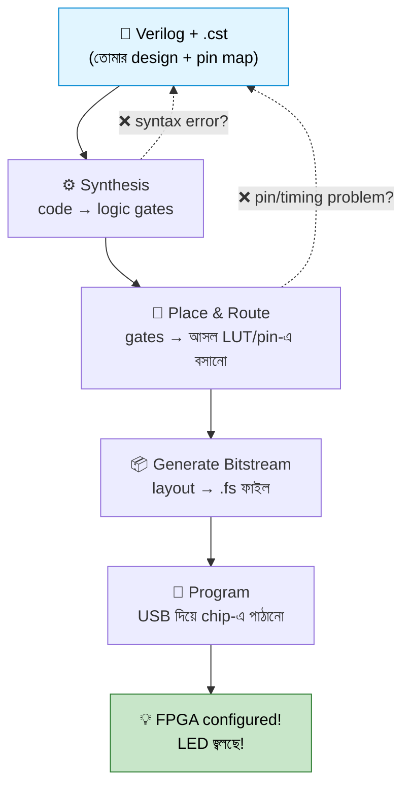

# 🔧 Chapter 10: Build Your Own FPGA Projects - Tang Nano 9K!
## From Code to Hardware - Your First Real FPGA Project!

> **"Simulation was practice. Now it's REAL. Time to blink LEDs with YOUR code!"**
>
> **"Simulation ছিল practice। এখন REAL। তোমার code দিয়ে LED জ্বালাও!"**

---

আগের সব chapter-এ তুমি যা লিখেছ, সেগুলো ছিল কম্পিউটারের ভেতরে—GTKWave-এর সবুজ-হলুদ waveform-এ। সুন্দর, কিন্তু একটু ভৌতিক, তাই না? Code চলছে, অথচ হাতে ধরে দেখা যায় না।

এই chapter-এ সেই দেয়াল ভাঙবে। তোমার লেখা Verilog এবার তামার তার, সিলিকন আর সত্যিকারের আলো হয়ে তোমার টেবিলের ওপর জ্বলবে। একটা LED জ্বলবে-নিভবে—তোমার নিজের লেখা code-এর তালে। প্রথমবার যখন সেটা ঘটবে, গায়ে কাঁটা দেবে। আমি কথা দিলাম। 🔥

ভাবো ব্যাপারটা এভাবে: এতদিন তুমি রান্নার recipe লিখছিলে আর কল্পনায় স্বাদ নিচ্ছিলে। আজ প্রথমবার চুলায় হাঁড়ি চড়াবে। Simulation ছিল recipe, FPGA হলো রান্নাঘর।

## 🎯 এই Chapter-এ তুমি বানাবে:

```
✅ Tang Nano 9K setup - $12 FPGA board!
✅ Gowin EDA installation - free tools
✅ First FPGA project - LED blink
✅ Constraint file - pin mapping
✅ Synthesis & implementation - place & route
✅ Programming - load to FPGA
✅ Debug techniques - real hardware
✅ তোমার processor component FPGA-তে deploy! 🎉
```

**Time Required:** 1 week (4-5 hours/day)  
**Hardware Needed:** Tang Nano 9K board ($12), USB-C cable

> 💡 **Chapter 9 vs Chapter 10:** Chapter 9-এ তুমি শিখেছ FPGA-র *ভেতরে* কী আছে—LUT, Flip-Flop, Block RAM, routing fabric। এই chapter সেই জ্ঞানকে *কাজে* লাগায়: কীভাবে toolchain দিয়ে তোমার design-কে সেই LUT-গুলোতে বসিয়ে দেবে আর board-টা program করবে। Theory থেকে আঙুলের ডগায়।

---

## 🚀 Quick Win - 30 মিনিটে LED Blink!

পুরো chapter পড়ার আগে চলো পুরো যাত্রাটা একনজরে দেখে নিই—যাতে ভেতরে ঢুকলে দিশেহারা না লাগে। এই Quick Win-টা একটা "trailer", পুরো "সিনেমা" নিচে আসছে। চারটা ধাপ, ব্যস:

### Step 1: Get the Board

Tang Nano 9K হলো এই পুরো পার্টের নায়ক—হাতের তালুতে আঁটে এমন একটা ছোট্ট board, অথচ ভেতরে আস্ত একটা FPGA, যেটায় তুমি একটা পুরো RISC-V processor পর্যন্ত ফেলতে পারবে (পরের part-গুলোতে ঠিক সেটাই করব)। দামটাও ছাত্রবান্ধব—এক বেলা ভালো খাবারের সমান।

```
Tang Nano 9K Board:
- Price: $12-15 USD
- FPGA: Gowin GW1NR-9C (8640 LUTs)
- Features:
  ✅ 6 LEDs onboard
  ✅ 2 Buttons
  ✅ HDMI output
  ✅ 32MB PSRAM
  ✅ USB-C (power + programming)
  ✅ Breadboard friendly!

Where to buy:
- AliExpress (cheapest)
- Seeed Studio
- Mouser/DigiKey (expensive)

Shipping: 2-4 weeks from China
```

> 💡 **আগে order দিয়ে রাখো!** China থেকে আসতে ২-৪ সপ্তাহ লাগে। তাই board-টা আজই order করে দাও, আর অপেক্ষার সময়টায় Gowin EDA install করে, নিচের code পড়ে, simulation-এ হাত পাকিয়ে নাও। Board এলে তুমি একদম তৈরি থাকবে—খুলেই সরাসরি LED জ্বালাবে। 📦

### Step 2: Install Tools (Later!)

Gowin EDA—free, একবার বসিয়ে নিলেই হলো। বিস্তারিত নিচে [১০.২](#১০২-gowin-eda-installation)-তে।

### Step 3: First Code

এই পাঁচ লাইনই তোমার প্রথম hardware project। ভয় পেয়ো না—নিচে [১০.৩](#১০৩-your-first-project---led-blink)-এ এক-একটা লাইন খুলে বুঝিয়ে দেব। আপাতত শুধু চোখ বুলিয়ে নাও, কাঠামোটা টের পাও:

```verilog
module led_blink(
    input clk,      // 27 MHz onboard clock
    output reg led  // LED output
);
    reg [24:0] counter;
    
    always @(posedge clk) begin
        counter <= counter + 1;
        led <= counter[24];  // Blink at ~0.8 Hz (full on+off cycle ≈ 1.24s)
    end
endmodule
```

ভেতরের idea-টা এক বাক্যে: একটা counter সেকেন্ডে ২ কোটি ৭০ লক্ষ বার বাড়ছে; আমরা শুধু তার সবচেয়ে ধীরে-বদলানো একটা bit (`counter[24]`) LED-তে জুড়ে দিচ্ছি। তাই LED-টা চোখে দেখার মতো ধীরে blink করে। অঙ্কটা নিচে [১০.৩](#১০৩-your-first-project---led-blink)-এ।

### Step 4: Program FPGA (Details later!)

Synthesize → Place & Route → Bitstream → USB দিয়ে board-এ পাঠাও। চারটা ক্লিক। পুরোটা নিচে [১০.৫](#১০৫-synthesis-and-implementation) আর [১০.৬](#১০৬-programming-the-fpga)-এ।

🎉 **First LED blink - You're now a hardware engineer!**

ব্যস, এটুকুই trailer। এবার আসল সিনেমা—প্রতিটা ধাপ ধীরে, খোলামেলা, বুঝে বুঝে।

---

## ১০.১ Tang Nano 9K Board Overview

হাতে board-টা নেওয়ার আগে চলো একটু পরিচিত হই—কোথায় কী আছে, আর কেন আছে। অস্ত্রটা ভালো করে চিনলে যুদ্ধে আরাম। 🙂

মনে রেখো, এই গোটা board-টা আসলে একটা FPGA chip-কে "ব্যবহারযোগ্য" করার সাজসজ্জা। মাঝখানে বসে আছে আসল নায়ক—GW1NR-9C chip। বাকি সবকিছু (clock, LED, button, USB) তার চারপাশে বসানো সহকারী, যাতে chip-টা বিদ্যুৎ পায়, সময়ের তাল পায়, আর তোমার সাথে কথা বলতে পারে।

### Board Layout:

নিচের ছবিটা board-টাকে ওপর থেকে দেখাচ্ছে। USB-C connector-টা সবার ওপরে—এটাই একসাথে বিদ্যুৎ আর তোমার code, দুটোই ভেতরে পাঠায়:

```
                 Tang Nano 9K (top view)
                       ┌─USB-C─┐
                       │  ▭▭   │   ← power + programming
              ┌────────┴───────┴────────┐
   pin    →   ║ ●                      ● ║   ← pin
   headers    ║                          ║     headers
   (left)     ║   ●  ●  ●  ●  ●  ●       ║     (right)
              ║   └── 6 LEDs (0–5) ──┘   ║
              ║                          ║
              ║      ┌────────────┐      ║
              ║      │  GW1NR-9C  │      ║   ← the FPGA chip
              ║      │   (FPGA)   │      ║      (the real hero)
              ║      └────────────┘      ║
              ║                          ║
              ║   [S1]          [S2]     ║   ← 2 push buttons
              ║                          ║
              ║   [ HDMI ]   [TF card]   ║   ← video out + SD slot
              ║   [   32 MB PSRAM   ]    ║   ← external memory
              ║ ●                      ● ║
              └──────────────────────────┘
                  Size: ~21mm × 72mm
                  (লম্বা-সরু — breadboard-এ দিব্যি বসে যায়)
```

আকারটা খেয়াল করো—একটা চুইংগামের প্যাকেটের চেয়েও ছোট। অথচ এর ভেতরে যত logic আঁটে, ১৯৭০-৮০-এর দশকের আস্ত একটা minicomputer বানানো যেত। প্রযুক্তি কোথায় পৌঁছেছে, একবার ভাবো!

### Key Features:

#### FPGA chip-এর ভেতরের সম্পদ (GW1NR-9C)

এগুলোই তোমার "কাঁচামাল"। একটা design লেখার মানে আসলে এই resource-গুলো খরচ করে কিছু একটা বানানো। তাই কোনটা কী, জেনে রাখা ভালো:

| Resource | পরিমাণ | এটা দিয়ে কী হয় |
|---|---|---|
| **LUTs** (Look-Up Tables) | 8640 | যেকোনো combinational logic—তোমার gate, mux, adder এখানেই বসে |
| **Flip-Flops** | 6480 | state ধরে রাখে—register, counter, FSM-এর memory |
| **Block RAM** | 468 Kb (26 × 18 Kb) | বড় data রাখার জন্য—instruction memory, frame buffer |
| **DSP Multipliers** | 20 × (18×18) | দ্রুত গুণ—signal processing, ALU-এর multiply |
| **PLL** | 1 | clock তৈরি/গুণ করে—27 MHz থেকে অন্য frequency বানায় |
| **User I/O pins** | 174 | বাইরের দুনিয়ার সাথে সংযোগ—LED, button, sensor |

> 💡 LED blink-এ এর প্রায় কিছুই লাগবে না—মাত্র গুটিকয়েক LUT আর Flip-Flop। কিন্তু part 4-এ যখন আস্ত RISC-V processor বানাবে, তখন এই সংখ্যাগুলো হঠাৎ অনেক অর্থবহ হয়ে উঠবে। তখন তুমি নিজেই হিসাব করবে—"আমার design-এ কয়টা LUT লাগল, board-এ আঁটবে তো?"

#### Board-এর onboard সহকারীরা

| Peripheral | কাজ |
|---|---|
| **27 MHz crystal** | পুরো board-এর হৃৎস্পন্দন—প্রতি সেকেন্ডে ২ কোটি ৭০ লক্ষ tick |
| **6 × LEDs** | তোমার প্রথম output (RGB × 2, single color × 3) |
| **2 × Push buttons** (S1, S2) | তোমার প্রথম input |
| **HDMI output** | video project—monitor-এ ছবি পাঠানো যায়! |
| **32 MB PSRAM** | বড় external memory (chip-এর ভেতরের RAM ছোট) |
| **TF card slot** | SD card—file/data storage |
| **USB-C** | একটাই তারে বিদ্যুৎ + programming, দুটোই |

**Power:** USB-C দিয়ে 5V ঢোকে, board-এর onboard regulator সেটাকে FPGA-র পছন্দের 3.3V-এ নামায়। সাধারণ ব্যবহারে টানে মাত্র ~100-200mA—অর্থাৎ তোমার laptop-এর USB port-ই যথেষ্ট, আলাদা power adapter লাগে না। এটাই এই board-টাকে এত সহজ করে তোলে: একটা তার, ব্যস।

### Pin Access — বাইরের দুনিয়ার দরজা:

FPGA chip-এর I/O pin-গুলো board-এর দুপাশের header-এ বের করে আনা আছে। এগুলোকে ভাবো তোমার design-এর হাত-পা—এর মাধ্যমেই সে বাইরের জিনিসপত্র ছোঁয়:

```
সব FPGA pin → দুপাশের header-এ:
- দুই পাশেই সারি সারি pin
- 2.54mm spacing → breadboard-এ হুবহু খাপ খায়
- সরাসরি FPGA GPIO — মাঝে কোনো বাধা নেই
- বাইরের circuit-এ জুড়ে দাও!
```

এই pin-গুলো কেন এত গুরুত্বপূর্ণ? কারণ এগুলোই তোমার design-কে onboard ৬টা LED-র সীমার বাইরে নিয়ে যায়। চাইলে জুড়তে পারো—

- LED strip (অনেকগুলো LED একসাথে)
- নানা sensor (তাপমাত্রা, আলো, দূরত্ব)
- motor (robotics!)
- অন্য chip—SPI, I2C protocol দিয়ে (Chapter 11-এ শিখবে)
- তোমার নিজের বানানো custom peripheral

আপাতত আমরা onboard জিনিস দিয়েই শুরু করব। কিন্তু জেনে রাখো—এই header-গুলোই তোমার playground-কে অসীম করে দেয়।

---

## ১০.২ Gowin EDA Installation

Verilog-এর জন্য তুমি ব্যবহার করেছ Icarus Verilog—কিন্তু সেটা শুধু *simulate* করত, অর্থাৎ কম্পিউটারে নকল করে দেখাত। FPGA-র জন্য দরকার অন্য একটা জিনিস: একটা toolchain যেটা তোমার Verilog-কে আসল chip-এর জন্য *compile* করে। প্রতিটা FPGA নির্মাতার নিজস্ব toolchain থাকে, কারণ প্রতিটা chip-এর ভেতরের গঠন আলাদা—কোন LUT কোথায়, routing কীভাবে, সেটা একমাত্র নির্মাতাই জানে।

Tang Nano 9K-এর chip বানায় **Gowin**, তাই আমাদের toolchain ও Gowin এর—নাম **Gowin EDA** (EDA = Electronic Design Automation)। ভাবো এটাকে FPGA জগতের "GCC + linker" হিসেবে: তোমার source (Verilog) নেয়, আর শেষে এমন একটা ফাইল বানায় (bitstream) যেটা chip সরাসরি বুঝতে পারে।

আর সবচেয়ে ভালো খবর—আমাদের GW1N series chip-এর জন্য এটা **পুরোপুরি free**। কোনো license key কিনতে হবে না।

### System Requirements:

খুব হালকা software, প্রায় যেকোনো মোটামুটি কম্পিউটারেই চলবে:

| বিষয় | দরকার |
|---|---|
| **OS** | Windows 7/8/10/11 (64-bit) ✅, অথবা Linux—Ubuntu 18.04+ / CentOS 7+ ✅ |
| **macOS** | ❌ officially supported না (VM বা dual-boot লাগবে) |
| **CPU** | x86-64, 2+ cores |
| **RAM** | 4GB minimum, 8GB হলে আরাম |
| **Disk** | 5GB free |
| **Display** | 1024×768 বা তার বেশি |
| **License** | **FREE** (GW1N series-এর জন্য) 🎉 |

> 💡 macOS ব্যবহারকারী? হতাশ হয়ো না। অনেকেই Mac-এ একটা Linux/Windows virtual machine (VirtualBox/UTM) বানিয়ে তার ভেতরে Gowin EDA চালায়। একটু ঘোরা পথ, কিন্তু কাজ চলে যায়।

### Installation Steps (Windows):

Windows-এ ব্যাপারটা একদম সোজা—একটা installer download করে next-next করে যাও, ব্যস। নিচের ধাপগুলো মন দিয়ে দেখো:

```
Step 1: Download
Go to: http://www.gowinsemi.com/en/support/download_eda/
Download: Gowin EDA (Education Version)
File: ~1.5 GB

Step 2: Install
- Run installer: Gowin_xxx_win.exe
- Choose installation directory
- Default: C:\Gowin\IDE\
- Click "Install"
- Wait 5-10 minutes

Step 3: License
- Education version = FREE
- No license key needed for GW1N!
- Full featured for our chip

Step 4: Programmer
- Included in IDE
- USB driver auto-installs
- No separate download needed

Step 5: Test
- Launch IDE
- Create test project
- Verify it opens
```

> 💡 **"Education Version" নিলে কেন?** Gowin-এর দুটো সংস্করণ আছে—একটা commercial (license লাগে), একটা Education। আমাদের GW1N series chip-এর জন্য Education version-ই যথেষ্ট, পুরো featured, আর সম্পূর্ণ বিনামূল্যে। তাই license key-এর ঝামেলায় যেয়ো না, সোজা Education version নাও।

### Installation Steps (Linux):

Linux ব্যবহারকারী? নিচের command-গুলো এক-এক করে চালাও। আগের chapter-এ Icarus Verilog বসানোর মতোই terminal-এর কাজ—ভয় নেই। গুরুত্বপূর্ণ ব্যাপারটা শেষ দিকের **USB permissions** ধাপটা: এটা না করলে তোমার Linux machine board-টা চিনবে না (programming-এর সময় "no cable found" বলবে)। তাই ওই ধাপটা বাদ দিও না।

```bash
# Step 1: Download
# Get .tar.gz from Gowin website

# Step 2: Extract
tar -xzf Gowin_xxx_linux.tar.gz
cd Gowin_xxx_linux

# Step 3: Run installer
chmod +x install.sh
./install.sh

# Follow prompts, default: /usr/local/Gowin/

# Step 4: Add to PATH (optional)
echo 'export PATH="/usr/local/Gowin/IDE/bin:$PATH"' >> ~/.bashrc
source ~/.bashrc

# Step 5: USB permissions
sudo cp gowin/programmer/driver/udev/*.rules /etc/udev/rules.d/
sudo udevadm control --reload-rules
sudo udevadm trigger

# Step 6: Launch
gw_ide
```

### IDE First Launch:

প্রথমবার IDE খুলে একটু খালি-খালি লাগবে—কোনো project নেই, code নেই। চিন্তা নেই, একটা নতুন project বানিয়ে নেওয়াই প্রথম কাজ। এখানে একটাই ধাপ ভুল করলে সব ভেস্তে যায়—**Device Selection**। তুমি IDE-কে বলে দিচ্ছ ঠিক কোন chip-এর জন্য compile করতে হবে; ভুল chip বললে toolchain ভুল LUT/pin ধরে নেবে, আর তোমার design board-এ চলবে না। তাই device-টা মন দিয়ে বেছো:

```
When you first open Gowin IDE:

1. Create New Project
   - File → New Project

2. Project Wizard appears
   - Project Name
   - Location
   - Device Selection ← IMPORTANT!

3. Select Device:
   - Family: GW1N-9C
   - Device: GW1NR-LV9QN88PC6/I5
   - (This is Tang Nano 9K chip!)

4. Project created!
   - Ready to add code
```

> ⚠️ ওই লম্বা device নামটা—`GW1NR-LV9QN88PC6/I5`—দেখে ঘাবড়ে যেয়ো না। এটা আসলে chip-এর "পুরো নাম-ঠিকানা": কোন family, কোন package, কত গতির grade, সব এনকোড করা আছে। তোমাকে মুখস্থ করতে হবে না, শুধু list থেকে হুবহু এটা বেছে নিলেই হলো। এটাই Tang Nano 9K-এর chip।

---

## ১০.৩ Your First Project - LED Blink

এসে গেছি আসল জায়গায়। "Hello World" বলতে programmer-রা যা বোঝে, hardware জগতে তার সমতুল্য হলো এই LED blink। সহজ, কিন্তু এর ভেতরেই FPGA development-এর গোটা চক্রটা লুকিয়ে আছে—code লেখা, pin জোড়া, compile, program। একবার এটা পার করলে বাকি সব project একই ছাঁচে গড়া।

আমাদের লক্ষ্য খুব সরল: একটা LED জ্বলবে, নিভবে, আবার জ্বলবে—সেকেন্ডখানেক পর পর। কিন্তু এর পেছনের চিন্তাটাই আসল শিক্ষা, যেটা একটু পরেই খুলে বলব।

### Project Setup:

প্রথমে একটা নতুন project খোলো। নাম দাও `led_blink`, আর device-টা অবশ্যই আগের সেই Tang Nano 9K-এর chip:

```
Step 1: New Project
File → New Project

Project Name: led_blink
Location: Choose folder
Device: GW1NR-LV9QN88PC6/I5
```

### Step 2: Create Verilog File

এবার তোমার code রাখার জন্য একটা Verilog ফাইল বানাও। Project window-এ "Design" এর ওপর right-click করে নতুন ফাইল যোগ করো:

```
In Project window:
Right-click "Design" → Add File → New File

File name: led_blink.v
File type: Verilog

Click OK
```

### Step 3: Write the Code

```verilog
// led_blink.v
// First FPGA project - Blink LED!

module led_blink(
    input  wire clk,      // 27 MHz clock input
    output reg  led       // LED output
);
    // Counter for timing
    // 27,000,000 counts = 1 second
    // Use bit [24]: ~0.8 Hz blink (1.24 s period)
    reg [24:0] counter;
    
    always @(posedge clk) begin
        counter <= counter + 1;
        
        // LED toggles when counter[24] changes
        // This happens every 2^24 / 27MHz = 0.62 seconds
        led <= counter[24];
    end
endmodule
```

### Understanding the Code:

এই code-টা এত ছোট যে অবহেলা করতে ইচ্ছে করে। কোরো না—কারণ এর ভেতরেই একটা সুন্দর কৌশল লুকিয়ে আছে, যেটা না বুঝলে পরের অনেক কিছু আটকে যাবে।

**প্রথমে একটা সমস্যা বুঝি।** Board-এর clock চলছে **27 MHz**—অর্থাৎ সেকেন্ডে ২ কোটি ৭০ লক্ষ বার tick করছে। তুমি যদি LED-কে সরাসরি clock-এ জুড়ে দাও, সেটা সেকেন্ডে কোটিবার জ্বলবে-নিভবে। চোখ তো দূরের কথা, কোনো camera ও সেটা ধরতে পারবে না—LED-টা শুধু আধো-উজ্জ্বল হয়ে জ্বলে থাকবে। তাই আমাদের দরকার একটা উপায়, যেটা এই পাগলাটে গতিকে চোখে দেখার মতো ধীরে নামিয়ে আনবে।

**সমাধান: একটা binary counter।** ভাবো একটা গাড়ির odometer (মাইলেজ মিটার)। সবচেয়ে ডানের অঙ্কটা মুহূর্তে মুহূর্তে বদলায়, কিন্তু বাঁ দিকের অঙ্ক বদলাতে অনেক সময় লাগে। Binary counter ঠিক তাই—কিন্তু base-2-তে:

```
counter[0]  → প্রতি clock-এ flip       (সবচেয়ে দ্রুত)
counter[1]  → প্রতি 2 clock-এ flip
counter[2]  → প্রতি 4 clock-এ flip
...
counter[24] → প্রতি 2^24 clock-এ flip  (অনেক ধীর!)
```

প্রতিটা উঁচু bit নিচের bit-এর ঠিক **অর্ধেক** গতিতে বদলায়। অর্থাৎ counter-টা আসলে clock-কে একের পর এক ২ দিয়ে ভাগ করে যাচ্ছে—একে বলে **clock divider**। আমরা শুধু এমন একটা bit বেছে নেব, যেটা চোখে দেখার মতো ধীরে বদলায়। সেটাই `counter[24]`।

**এবার অঙ্কটা।** কত সময় পর পর `counter[24]` একবার flip করে?

| ধাপ | হিসাব |
|---|---|
| `counter[24]` flip হতে লাগে | 2²⁴ = 16,777,216 clock tick |
| প্রতিটা tick-এর সময় | 1 / 27,000,000 সেকেন্ড |
| তাই flip-এর সময় | 16,777,216 / 27,000,000 ≈ **0.62 সেকেন্ড** |

কিন্তু সাবধান—একটা পূর্ণ blink মানে একবার **জ্বলা + একবার নেভা**, অর্থাৎ দুইবার flip:

```
পূর্ণ period = 2 × 0.62 ≈ 1.24 সেকেন্ড
Frequency   = 1 / 1.24 ≈ 0.81 Hz
```

মানে LED-টা সেকেন্ডে একবারের একটু কম জ্বলবে-নিভবে—ঠিক চোখে দেখার মতো আরামদায়ক গতি। 👁️

> 💡 **এক bit উপরে-নিচে = দ্বিগুণ ধীর/দ্রুত।** Blink খুব দ্রুত লাগছে? `counter[25]` নাও—দ্বিগুণ ধীর হবে। খুব ধীর? `counter[23]` নাও—দ্বিগুণ দ্রুত হবে। প্রতিটা bit ঠিক একটা করে "÷2"। এই অন্তর্দৃষ্টিটা মাথায় গেঁথে নাও—FPGA-তে timing নিয়ে কাজ করতে গেলে বারবার লাগবে।

নিচের comment-গুলো ঠিক এই হিসাবটাই code-এর ভাষায় লিখে রাখে—একটা handy সূত্রসহ:

```verilog
// Clock frequency: 27 MHz = 27,000,000 Hz
// Counter width: 25 bits = 2^25 = 33,554,432

// Bit [24] toggles every:
// 2^24 / 27,000,000 = 16,777,216 / 27,000,000
//                   = 0.621 seconds

// LED period = 2 × 0.621 = 1.24 seconds
// Frequency = 1 / 1.24 = 0.81 Hz

// Want slower? Use counter[25]
// Want faster? Use counter[23]

// Formula:
// Period = 2 × (2^n / clock_freq)
// where n = bit number
```

> 🤔 **একটা সূক্ষ্ম প্রশ্ন—`counter` শুরুতে কী মান নিয়ে থাকে?** খেয়াল করো, আমরা কোথাও `counter <= 0` দিয়ে initialize করিনি। বাস্তবে Gowin-এর FPGA-তে register-গুলো power-on-এর সময় 0 থেকে শুরু হয়, তাই এটা দিব্যি কাজ করে। কিন্তু এটা এই board-এর একটা সুবিধা—সব FPGA এমন নয়। অভ্যাস হিসেবে reset দিয়ে counter পরিষ্কার করে নেওয়া ভালো (নিচে [Project 2](#১০৮-project-2---all-leds-blink-pattern)-এ ঠিক সেটাই button দিয়ে করব)। তবে blink-এর জন্য counter কোন মান থেকে শুরু করল তাতে কিছু আসে যায় না—সে তো অনন্তকাল ধরে শুধু বেড়েই যাবে, আর overflow হয়ে আবার 0-তে ফিরে আসবে, চক্রটা চলতেই থাকবে।

---

## ১০.৪ Constraint File (.cst)

এখানে একটা প্রশ্ন তোমার মাথায় আসা উচিত: তোমার Verilog-এ লেখা আছে `output reg led`—কিন্তু FPGA chip-এর তো **174টা pin**। Toolchain কীভাবে জানবে যে তোমার এই `led` signal-টা ঠিক board-এর কোন LED-তে যাবে? কোন তামার তারে বিদ্যুৎ পাঠাবে?

উত্তর: সে নিজে থেকে **জানে না**। তুমি বলে না দিলে toolchain এমনিতেই যেকোনো একটা খালি pin বেছে নেবে—যেটা হয়তো কোনো LED-র সাথেই জোড়া নেই, বরং HDMI বা একটা header pin-এ চলে যাবে। তখন তোমার code ঠিক, compile-ও ঠিক, অথচ board-এ কিছুই হবে না। এই বিভ্রান্তি ঠেকাতেই **constraint file**।

### What is a Constraint File?

Constraint file (এক্সটেনশন `.cst`) হলো তোমার design আর আসল board-এর মধ্যে **অনুবাদক**। ভাবো এটাকে একটা ঠিকানার খাতা: "আমার `led` signal-টা পাঠাও pin 10-এ, আমার `clk` signal-টা আনো pin 52 থেকে।" Verilog বলে *কী করতে হবে* (logic), আর `.cst` বলে *কোথায় তার জুড়তে হবে* (physical pin)।

```
Constraint file (.cst):
- Maps Verilog ports to FPGA pins
- Sets I/O standards (voltage levels)
- Defines timing constraints
- Required for every FPGA project!

Without .cst:
❌ Tools don't know which pins to use
❌ Synthesis fails
❌ Cannot generate bitstream
```

> 💡 **Simulation-এ এটা লাগেনি কেন?** কারণ simulation-এ কোনো আসল pin নেই—সব কম্পিউটারের ভেতরে কাল্পনিক। সেখানে testbench সরাসরি তোমার signal-গুলো নাড়াচাড়া করে। কিন্তু এখন তোমার signal-গুলোকে আসল ধাতব pin-এ গিয়ে দাঁড়াতে হবে, তাই এই নতুন ফাইল। এটাই simulation আর hardware-এর মাঝখানের সেতু।

### Creating Constraint File:

Verilog ফাইলের মতোই, এটাও project-এ একটা নতুন ফাইল হিসেবে যোগ করো—শুধু type-টা এবার "Physical Constraints":

```
Step 1: Add constraint file
Right-click "Design" → Add File → New File

File name: led_blink.cst
File type: Physical Constraints

Click OK
```

### Writing the Constraints:

```tcl
// led_blink.cst
// Pin constraints for Tang Nano 9K

// Clock input - 27 MHz oscillator
IO_LOC "clk" 52;
IO_PORT "clk" PULL_MODE=UP;

// LED output - LED 0 (blue)
IO_LOC "led" 10;
IO_PORT "led" PULL_MODE=UP DRIVE=8;
```

### Understanding Constraints:

দুটো মাত্র keyword—`IO_LOC` আর `IO_PORT`। চলো ধরে ধরে বুঝি, কারণ এই দুটোই তুমি বারবার ব্যবহার করবে।

**`IO_LOC` — কোন signal কোন pin-এ।** এটাই মূল অনুবাদ:

```
IO_LOC "clk" 52;   →  "clk" signal-টা pin 52-এ বসাও
IO_LOC "led" 10;   →  "led" signal-টা pin 10-এ বসাও
```

ভেতরের quote-এর নামটা (`"clk"`, `"led"`) তোমার Verilog-এর port-এর নামের সাথে **হুবহু** মিলতে হবে—একটা অক্ষর এদিক-ওদিক হলে toolchain signal টাই খুঁজে পাবে না। আর pin নম্বরগুলো আসে Tang Nano 9K-এর schematic থেকে (নিচে reference টেবিল দিচ্ছি)।

**`IO_PORT` — সেই pin-টা কেমন আচরণ করবে।** শুধু কোন pin তা বললেই হয় না, pin-টা কীভাবে চলবে সেটাও ঠিক করতে হয়:

| Property | মানে | কখন লাগে |
|---|---|---|
| `PULL_MODE=UP` | pull-up resistor চালু—signal-টা ছেড়ে দিলে নিজে থেকে HIGH (1)-এ থাকে | floating pin ঠেকাতে, button-এ খুব দরকারি |
| `PULL_MODE=DOWN` | pull-down—ছেড়ে দিলে নিজে থেকে LOW (0)-এ থাকে | উল্টো ক্ষেত্রে |
| `PULL_MODE=NONE` | কোনো pull resistor নেই | বাইরে নিজের resistor থাকলে |
| `DRIVE=8` | output-এর "জোর"—কত mA টানতে পারবে (options: 4, 8, 16, 24) | LED-র উজ্জ্বলতা/load |

**LED-এর জন্য `DRIVE=8` কেন?** DRIVE হলো pin-টা কত current ঠেলে দিতে পারবে তার মাপ (mA-তে)। একটা সাধারণ LED জ্বালাতে এর বেশি লাগে না। বেশি DRIVE মানে একটু বেশি উজ্জ্বল, কিন্তু বেশি বিদ্যুৎ খরচ আর chip-এ বেশি চাপ। তাই 8 mA একটা আরামদায়ক মাঝামাঝি বাছাই।

> 🤔 **Button-এ `PULL_MODE=UP` কেন এত জরুরি?** ভাবো একটা push button—টিপলে এক জায়গায় সংযোগ হয়, ছাড়লে সংযোগ কাটে। ছাড়া অবস্থায় pin-টা কোনো কিছুর সাথেই জোড়া থাকে না—একে বলে "floating"। Floating pin বাতাসের electrical noise ধরে এলোমেলোভাবে 0/1 দেখায়, যেন ভূত! Pull-up resistor সেই floating pin-কে আলতো করে HIGH (1)-এ ধরে রাখে। তাই Tang Nano 9K-এর button-গুলো **active low**—ছাড়লে 1, টিপলে 0। এটাই কারণ নিচের code-গুলোতে তুমি `if (!btn)` বা "btn2 active low (pressed = 0)" দেখবে।

### Tang Nano 9K Pin Reference:

এই টেবিলটা bookmark করে রাখো—পুরো FPGA part জুড়ে বারবার এখানে ফিরে আসবে। এগুলোই Tang Nano 9K-এর কাজের pin-গুলো:

| Signal | Pin | বিস্তারিত |
|---|---|---|
| **Clock** | 52 | 27 MHz oscillator |
| **LED 0** | 10 | Blue |
| **LED 1** | 11 | Green |
| **LED 2** | 13 | Red |
| **LED 3** | 14 | Blue |
| **LED 4** | 15 | Green |
| **LED 5** | 16 | Red |
| **Button S1** | 3 | active low (টিপলে 0) |
| **Button S2** | 4 | active low (টিপলে 0) |
| **HDMI** | 69–77, 79–83 | video output |

> 💡 **পুরো pinout কোথায়?** এই টেবিলে শুধু আমাদের দরকারি pin আছে। চাইলে 174টা pin-এরই সম্পূর্ণ তালিকা পাবে Tang Nano 9K-এর official schematic বা board documentation-এ (online সহজলভ্য)। যখন নিজের sensor/peripheral জুড়বে, তখন ওটা খুলে দরকারি pin খুঁজে নেবে।

---

## ১০.৫ Synthesis and Implementation

Code লেখা, pin জোড়া—দুটোই হলো। এবার সেই code-কে chip-এর ভাষায় অনুবাদ করার পালা। কিন্তু এক লাফে Verilog থেকে চলন্ত chip-এ পৌঁছানো যায় না; মাঝে কয়েকটা ধাপ আছে, যেমন রান্নায় কাটা → ভাজা → সেদ্ধ → পরিবেশন। চলো পুরো পথটা আগে একনজরে দেখি, তারপর প্রতিটা ধাপ আলাদা করে।

### Design Flow Overview:



এক বাক্যে পুরো গল্পটা: তোমার **মানুষের পড়ার মতো** Verilog ধাপে ধাপে রূপ নেয় **chip-এর বোঝার মতো** bitstream-এ, তারপর সেটা USB দিয়ে chip-এ ঢুকে যায়। প্রতিটা ধাপ আগের ধাপের ফল নিয়ে কাজ করে—তাই কোথাও আটকালে আগের ধাপে ফিরে ঠিক করতে হয় (ছবির ফিরতি তীরগুলো ঠিক সেটাই বলছে)।

> 💡 **একটা প্রিয় analogy:** Synthesis যেন রান্নার উপকরণ কাটা-বাছা (recipe থেকে কাঁচামাল ঠিক করা)। Place & Route যেন সেই উপকরণ চুলার কোন বার্নারে, কোন হাঁড়িতে বসবে তা ঠিক করা। Bitstream হলো শেষ পরিবেশনযোগ্য থালা। আর Program হলো থালাটা টেবিলে এনে রাখা—তুমি খেতে (দেখতে) পাও!

### Step-by-Step Process:

**Synthesis মানে কী?** তুমি যে Verilog লিখেছ—`counter <= counter + 1`, `led <= counter[24]`—এগুলো মানুষের পড়ার মতো বর্ণনা। Synthesis সেই বর্ণনাকে অনুবাদ করে আসল digital building block-এ: AND/OR/NOT gate, flip-flop, adder। এ যেন তুমি বললে "আমার একটা গোনা-যন্ত্র চাই", আর synthesizer সেটাকে ভেঙে দিল "তাহলে লাগবে ২৫টা flip-flop আর একটা adder, এভাবে জোড়া।" শেষে সে এই gate-জালটাকে chip-এর সত্যিকার LUT আর FF-এ map করে দেয়।

```
Step 1: Synthesis
Click: Process → Synthesize (or F11)

What happens:
- Reads your Verilog
- Converts to logic gates
- Optimizes logic
- Maps to LUTs and FFs
- Checks for errors

Output:
- Netlist file
- Resource usage report
- Synthesis log

Time: 5-30 seconds

Check Console for:
✅ "Synthesis task successfully"
❌ Errors (fix in code!)
⚠️ Warnings (usually OK)
```

> 💡 Synthesis-এর শেষ ফল হলো একটা **netlist**—মানে "কোন কোন gate/FF লাগবে আর সেগুলো কীভাবে তারে জোড়া" তার একটা তালিকা। এখনো কিন্তু কোনটা chip-এর ঠিক কোথায় বসবে তা ঠিক হয়নি; সেটা পরের ধাপের কাজ। আর Warning দেখে ভয় পেয়ো না—বেশিরভাগ warning নিরীহ; কিন্তু লাল **Error** মানে code-এ ভুল, ওটা আগে সারাও।

### Step 2: Place & Route

**এবার ভূগোলের পালা।** Synthesis বলেছে *কী কী* লাগবে; Place & Route ঠিক করে সেগুলো chip-এর ঠিক *কোথায়* বসবে আর *কীভাবে* একে অপরের সাথে তার দিয়ে জোড়া লাগবে। ভাবো একটা নতুন শহরের পরিকল্পনা: "Place" হলো প্রতিটা বাড়ি (LUT/FF) কোন প্লটে বসবে তা ঠিক করা, আর "Route" হলো বাড়িগুলোর মধ্যে রাস্তা (wire) বানানো। আর তোমার `.cst` ফাইল এখানেই কাজে লাগে—সে বলে দেয় কোন signal ঠিক কোন pin-প্লটে যাবে।

```
Click: Process → Place & Route (or F12)

What happens:
- Reads netlist
- Assigns logic to CLBs
- Routes connections
- Applies constraints
- Timing analysis

Output:
- Placed design
- Routed design
- Timing report
- Resource report

Time: 10-60 seconds

Check for:
✅ "Place & Route task successfully"
✅ Timing constraints met
❌ Routing failures
```

> 💡 কেন এই ধাপটা "timing analysis"-ও করে? কারণ signal-কে এক বাড়ি থেকে আরেক বাড়ি যেতে তারের দৈর্ঘ্য অনুযায়ী একটু সময় লাগে। দূরের বাড়িতে বসালে signal দেরিতে পৌঁছায়—clock-এর তাল মিস হতে পারে। তাই P&R শুধু জোড়া দেয় না, বুদ্ধি করে কাছাকাছি বসায় যাতে সব signal সময়মতো পৌঁছায়। LED blink-এ logic এত ধীর যে এ নিয়ে ভাবতে হয় না, কিন্তু processor বানানোর সময় এটাই হবে আসল লড়াই (timing report নিয়ে নিচে [১০.৯](#১০৯-understanding-reports)-এ আরও আছে)।

### Step 3: Generate Bitstream

**শেষ অনুবাদ।** এখন chip-এর ভেতরে কোথায় কী বসবে, সব ঠিক। এবার সেই পুরো ছকটাকে chip-এর সরাসরি বোঝার মতো 0/1-এর একটা স্রোতে রূপ দিতে হবে—এটাই **bitstream**, ফাইলের নাম শেষ হয় `.fs` দিয়ে। FPGA মূলত খালি বাড়ি; bitstream সেই বাড়িগুলোতে "তুমি AND হও, তুমি FF হও, তোমরা এভাবে জোড়া লাগো" বলে প্রতিটা switch সেট করে দেয়।

```
Usually automatic after Place & Route

Or manually:
Process → Generate Bitstream

Output file:
- impl/pnr/project_name.fs
- This is your bitstream!
- Contains all configuration data

File size: ~1-3 MB
```

> 💡 এই `.fs` ফাইলটাই তোমার শেষ পণ্য—software জগতের `.exe` এর সমতুল্য। পরের ধাপে আমরা শুধু এই ফাইলটাকে USB দিয়ে chip-এ পাঠাব। মজার ব্যাপার: ফাইলের আকার তোমার design-এর জটিলতার ওপর নির্ভর করে না তেমন—এতে পুরো chip-কে configure করার তথ্য থাকে, তাই LED blink হোক বা processor, আকার মোটামুটি একই (~1-3 MB)।

---

## ১০.৬ Programming the FPGA

এই মুহূর্তের জন্যই এতক্ষণের সব পরিশ্রম! তোমার হাতে এখন `.fs` bitstream ফাইল, হাতে board, আর একটা USB তার। "Programming" মানে সেই bitstream-টা USB দিয়ে chip-এ পাঠিয়ে দেওয়া—chip তখন নিজেকে তোমার design অনুযায়ী সাজিয়ে নেয়, আর তোমার code জীবন্ত হয়ে ওঠে। 🎬

### Connecting the Board:

প্রথমে board-টাকে কম্পিউটারের সাথে পরিচয় করিয়ে দিতে হবে। সুবিধা হলো, USB-C তারটাই একসাথে দুটো কাজ করে—বিদ্যুৎ দেয় আর data পাঠায়। তাই আলাদা power লাগে না, একটা তারই যথেষ্ট:

```
Step 1: Connect USB
- Plug Tang Nano 9K to computer
- Use USB-C cable
- Power LED should light up
- No external power needed

Step 2: Driver check (Windows)
- Device Manager
- Look for: "JTAG Debugger"
- Driver should auto-install
- If not, install from IDE folder

Step 3: Verify connection
Tools → Programmer
Click "Cable Settings"
Should detect: "USB Cable"
```

> 💡 তার লাগানোর পর board-এর power LED জ্বলছে কিনা দেখো—এটাই প্রথম "জীবনের লক্ষণ"। আর যে JTAG/USB cable-এর কথা বলা হচ্ছে, সেটা হলো তোমার কম্পিউটার আর chip-এর মধ্যে কথা বলার চ্যানেল। কম্পিউটার যদি cable-টা না চেনে (Windows-এ driver, Linux-এ সেই [udev rules](#installation-steps-linux))—programming-এর সময় "no cable found" বলবে। তখন প্রথমেই এই সংযোগটা যাচাই করো।

### Programming Process:

সংযোগ ঠিক থাকলে এবার আসল কাজ মাত্র কয়েকটা ক্লিক। Programmer খোলো, কোন chip আর কোন mode তা বলো, bitstream ফাইলটা দেখিয়ে দাও, আর "Program" চাপো:

```
Step 1: Open Programmer
Tools → Programmer (Ctrl+Alt+P)

Step 2: Configure
Device: GW1NR-9C
Access Mode: SRAM Mode (temporary)
            or Flash Mode (permanent)

Step 3: Add bitstream
Click "Browse"
Select: impl/pnr/led_blink.fs

Step 4: Program!
Click "Program/Configure" button
Watch progress bar

Time: 5-10 seconds

Result:
✅ Programming success!
✅ LED should start blinking!
```

progress bar পূর্ণ হলো, "success" এলো—আর তোমার চোখের সামনে LED জ্বলে উঠল, নিভল, আবার জ্বলল। থামো এক মুহূর্ত। এই blink-টা সাধারণ কোনো blink নয়—এটা **তোমার লেখা যুক্তি**, যা এখন সিলিকনের ভেতরে বাস্তবে ঘটছে। প্রথমবার এটা দেখার অনুভূতিটা মনে রেখো; এখান থেকেই শুরু। 🎉

### SRAM Mode vs Flash Mode:

উপরে দুটো "Access Mode" দেখলে—SRAM আর Flash। এই পছন্দটা বোঝা জরুরি, কারণ এর ওপর নির্ভর করে তোমার design-টা power বন্ধ করলে টিকে থাকবে নাকি মুছে যাবে।

পার্থক্যটা একটা সহজ analogy-তে: **SRAM mode হলো whiteboard-এ লেখা**—দ্রুত, যতবার খুশি মুছে আবার লেখা যায়, কিন্তু কারেন্ট গেলে সব মুছে যায়। **Flash mode হলো খাতায় কলমে লেখা**—একটু সময় লাগে, কিন্তু বন্ধ করলেও থেকে যায়, পরে board চালু করলে নিজে থেকেই ফিরে আসে।

| Feature | SRAM Mode (whiteboard) | Flash Mode (খাতা) |
|---|---|---|
| **গতি** | দ্রুত (~5s) | ধীর (~20s) |
| **Volatile?** | হ্যাঁ | না |
| **Power cycle-এর পর** | মুছে যায় | টিকে থাকে |
| **কখন ব্যবহার** | Development/testing | Production/final |
| **কতবার লেখা যায়** | অসীম | সীমিত |

**তাহলে কোনটা কখন?**

- **Development-এ SRAM mode।** তুমি বারবার code বদলাবে, বারবার program করবে—তাই দ্রুত আর অসীম-লেখার SRAM-ই আদর্শ। power গেলে মুছে যায়, কিন্তু তাতে কী, তুমি তো আবার program করবেই।
- **Production-এ Flash mode।** যখন design চূড়ান্ত, তখন Flash-এ লেখো—board-টা power পেলেই নিজে থেকে boot হয়ে তোমার design চালাবে, কম্পিউটার ছাড়াই। তোমার বানানো জিনিসটা তখন সত্যিকারের একটা স্বাধীন gadget!

> ⚠️ এখানেই একটা খুব common ভুল হয় (নিচে [১০.১১](#১০১১-common-mistakes--solutions)-এও আছে): SRAM mode-এ program করে board-এর তার খুলে ফেলে, তারপর অবাক হয়—"আমার design গেল কোথায়?!" কিছু যায়নি, SRAM তো volatile—power গেলেই মুছে যায়। তুমি কোন mode-এ আছ, সেটা সবসময় খেয়াল রাখো।

---

## ১০.৭ Debugging on Hardware

এখানে একটা তেতো সত্যি বলে রাখি: hardware debug করা software debug করার চেয়ে কঠিন। কেন? কারণ software-এ তুমি `printf` দিয়ে যেকোনো জায়গায় উঁকি দিতে পারো, breakpoint দিয়ে থামাতে পারো। কিন্তু chip-এর ভেতরে হাজারো signal একসাথে আলোর গতিতে ছুটছে—তুমি সেখানে চোখ রাখতে পারো না, থামাতেও পারো না। design-টা হয় চলছে, নয় চলছে না, আর কেন চলছে না সেটা প্রথমে অদৃশ্য।

তাই hardware debug-এর মূলমন্ত্র একটাই: **অদৃশ্য signal-কে দৃশ্যমান করো।** ভেতরের কোনো signal বুঝতে না পারলে, সেটাকে একটা LED-তে জুড়ে চোখে দেখো। নিচে ঠিক এই কৌশলগুলোই শিখব। আর হতাশ হয়ো না—প্রথম project-এ "কিছু হচ্ছে না" দেখা সবচেয়ে স্বাভাবিক ঘটনা; প্রায় সবাই এর ভেতর দিয়ে যায়।

### Common Issues:

প্রথম দিকে সবচেয়ে বেশি যে সমস্যাটা হয়—LED একদম জ্বলে না। তার পেছনে সাধারণত হাতেগোনা কয়েকটা কারণ, আর প্রায় সবগুলোরই সমাধান এক মিনিটের:

```
Problem 1: LED not blinking
Possible causes:
❌ Wrong pin number in .cst
❌ Clock not connected
❌ Bitstream not loaded
❌ LED reversed (rare)

Solution:
✅ Verify pin numbers
✅ Check constraint file
✅ Reprogram FPGA
✅ Check synthesis log
```

> 💡 খেয়াল করো, চারটা সম্ভাব্য কারণের তিনটাই code-এর ভেতরের নয়—`.cst` এর ভুল pin, clock জোড়া না থাকা, বা bitstream load না হওয়া। অর্থাৎ তোমার Verilog ঠিক থাকলেও এসব হতে পারে। তাই "কিছু হচ্ছে না" দেখলে আগে code না ঘেঁটে, এই বাইরের সংযোগগুলো এক-এক করে মিলিয়ে নাও। ৯০% সময় দোষী এখানেই।

### Debug Techniques:

**কৌশল ১—একাধিক LED ব্যবহার করো।** তোমার যদি সন্দেহ হয় কোন bit ঠিকঠাক কাজ করছে, তাহলে অনেকগুলো bit একসাথে আলাদা আলাদা LED-তে জুড়ে দাও। দ্রুত-ধীর নানা গতিতে LED জ্বলবে, আর চোখেই বুঝবে কোনটা কাজ করছে, কোনটা করছে না। এটা একইসাথে একটা সুন্দর "আমার board জীবিত তো?" পরীক্ষা—অন্তত একটা LED নড়লেই বুঝবে clock আর programming ঠিক আছে:

```
Technique 1: Multiple LEDs
- Assign different counter bits
- See which ones work
- Isolate problem

module led_debug(
    input clk,
    output [5:0] leds
);
    reg [25:0] counter;
    
    always @(posedge clk) begin
        counter <= counter + 1;
    end
    
    // Different rates on different LEDs
    assign leds[0] = counter[20]; // Fast
    assign leds[1] = counter[21];
    assign leds[2] = counter[22];
    assign leds[3] = counter[23];
    assign leds[4] = counter[24];
    assign leds[5] = counter[25]; // Slow
endmodule
```

### Using Onboard Buttons:

LED ছিল তোমার প্রথম output—এবার button, তোমার প্রথম input। এতদিন chip শুধু তোমাকে কিছু *দেখাচ্ছিল*; এবার তুমি তাকে কিছু *বলবে*। কিন্তু button-এর সাথে একটা মজার সমস্যা আছে, যেটা প্রতিটা hardware ডিজাইনারকে একবার না একবার কামড় দেয়—**bounce**।

**Bounce ব্যাপারটা কী?** তুমি ভাবো button টিপলে পরিষ্কারভাবে 1→0 হয়ে যায়। বাস্তবে না! Button-এর ভেতরে দুটো ধাতব পাত আছে; টেপার সময় সেগুলো একবারে লেগে না গিয়ে কয়েক মিলিসেকেন্ড ধরে কাঁপতে কাঁপতে লাগে—যেন একটা বল মেঝেতে কয়েকবার লাফিয়ে তারপর থামে। chip-এর 27 MHz clock-এর চোখে এই কাঁপুনি দেখায় 0-1-0-1-0... অনেকগুলো দ্রুত চাপ হিসেবে! তাই একবার টিপলেও LED হয়তো ৫-৬ বার toggle করে ফেলবে—এলোমেলো, অনিশ্চিত।

**সমাধান: debounce।** কৌশলটা সরল—button-এর মান বদলালে সাথে সাথে বিশ্বাস না করে একটু *অপেক্ষা* করো। যদি signal-টা একটানা কিছুক্ষণ (এখানে ~20ms, একটা counter দিয়ে গোনা) স্থির থাকে, তবেই সেটাকে আসল চাপ হিসেবে মানো। কাঁপুনি ততক্ষণে থেমে গেছে। নিচের code-এ `debounce` counter আর `btn_stable` ঠিক এই কাজটাই করছে—কাঁপুনি উপেক্ষা করে শুধু স্থির অবস্থাটা ধরে:

```verilog
// Button-controlled LED
module button_led(
    input  wire clk,
    input  wire btn,    // Button input
    output reg  led
);
    // Debounce counter
    reg [19:0] debounce;
    reg btn_stable;
    
    always @(posedge clk) begin
        if (btn == btn_stable) begin
            debounce <= 0;
        end else begin
            debounce <= debounce + 1;
            if (debounce == 20'hFFFFF)
                btn_stable <= btn;
        end
    end
    
    // Toggle LED on button press
    always @(posedge clk) begin
        if (btn_stable && debounce == 0)
            led <= ~led;
    end
endmodule

// Constraint file additions:
// IO_LOC "btn" 3;
// IO_PORT "btn" PULL_MODE=UP;
```

### Viewing Internal Signals:

ফিরে আসি সেই মূল সমস্যায়—chip-এর ভেতরের কোনো signal (ধরো একটা FSM-এর state, বা একটা counter-এর মান) সরাসরি দেখা যায় না। এটাই hardware debug-এর সবচেয়ে বড় দেয়াল। কিন্তু কয়েকটা চতুর উপায় আছে এই দেয়াল টপকানোর, সহজ থেকে কঠিনের দিকে:

```
Problem: Can't see internal wires

Solutions:

1. Connect to LEDs
   - Assign internal signals to unused LEDs
   - Visual debugging!
   
2. UART output (advanced)
   - Send debug data via serial
   - Need USB-UART adapter
   
3. Chipscope/Logic Analyzer (advanced)
   - Gowin Analyzer tool
   - Capture internal signals
   - Like oscilloscope for FPGA
```

তিনটা স্তর ভেবে নাও—

1. **LED-তে জুড়ে দাও** (সবচেয়ে সহজ, এখনই পারো)। কোনো খালি LED-তে ভেতরের signal-টা assign করে দাও। FSM কি ঠিক state-এ যাচ্ছে? সেই state-এর bit-গুলো LED-তে দেখাও। এটা আদিম, কিন্তু আশ্চর্য কার্যকর—তোমার ৬টা LED-ই তোমার প্রথম "oscilloscope"।
2. **UART দিয়ে পাঠাও** (একটু advanced)। LED দিয়ে শুধু গুটিকয়েক bit দেখা যায়; কিন্তু একটা ৩২-bit সংখ্যা? তখন serial line দিয়ে data কম্পিউটারে পাঠিয়ে পড়তে পারো—যেন chip তোমাকে `printf` করছে! এটা Chapter 11-এ শিখবে।
3. **Logic Analyzer** (Gowin Analyzer, সবচেয়ে শক্তিশালী)। এটা একদম GTKWave-এর মতো, কিন্তু আসল chip-এর ভেতরে! Design-টা চলন্ত অবস্থায় ভেতরের signal-গুলো "ধরে" রেখে পরে waveform-এ দেখায়—যেন chip-এর ভেতরে একটা ছোট্ট ক্যামেরা বসিয়ে দিলে। প্রথম দিকে দরকার হবে না, কিন্তু processor debug করতে গিয়ে এটাই হবে তোমার সবচেয়ে বড় বন্ধু।

> 💡 মূল শিক্ষাটা আবার মনে করিয়ে দিই: hardware-এ তুমি ভেতরে ঢুকতে পারো না, তাই **ভেতরকে বাইরে আনো**। যত বেশি internal signal-কে চোখে দেখার মতো (LED) বা পড়ার মতো (UART) করে তুলবে, debug তত সহজ হবে। ভালো ডিজাইনাররা code লেখার সময়ই ভাবে—"এটা ভাঙলে আমি কীভাবে দেখব?"

---

## ১০.৮ Project 2 - All LEDs Blink Pattern

একটা LED জ্বালানো তো হলো—কিন্তু সেটা ছিল "Hello World"। এবার একটু রঙ চড়াই। এই project-এ তুমি ছয়টা LED দিয়ে চারটা ভিন্ন আলোর নাচ বানাবে, আর button টিপে এক pattern থেকে আরেক pattern-এ বদলাবে। দেখতে মজার, কিন্তু আসল লাভটা শেখায়: এতে একসাথে আগের শেখা সবকিছু জড়ো হয়—counter, multiple output, button input, reset, আর একটা ছোট্ট state machine (কোন pattern চলছে)।

ভাবো এটাকে একটা mini project—বাড়ির সামনের সাজানো আলো (decorative lights) যেমন নানা pattern-এ জ্বলে, ঠিক তেমন, শুধু পুরোটা তোমার নিজের code-এ।

### Requirements:

আমরা যা বানাতে চাই, এক নজরে:

```
Create interesting LED pattern:
- Use all 6 LEDs
- Different blink rates
- Button to change pattern
- Reset functionality
```

খেয়াল করো এখানে দুটো button-এর দুটো ভিন্ন ভূমিকা: একটা (S1) pattern বদলাবে—যেন remote-এর channel button; আরেকটা (S2) সব reset করবে—যেন একটা "নতুন করে শুরু" সুইচ। এই দুই ভূমিকার বিভাজনটা code-এ কীভাবে আসে, সেটাই এই project-এর মূল শেখার বিষয়।

### Code:

নিচের code-টা একটু লম্বা, কিন্তু ভয় পেয়ো না—তিনটা পরিষ্কার অংশে ভাগ করা: (১) একটা counter যেটা reset হতে পারে, (২) একটা pattern selector যেটা S1 চাপলে বদলায়, আর (৩) একটা `case` block যেটা ঠিক করে প্রতিটা pattern-এ ৬টা LED কেমন দেখাবে। code পড়ার পর নিচে এক-এক করে খুলে বলব:

```verilog
module led_pattern(
    input  wire       clk,      // 27 MHz
    input  wire       btn1,     // S1 button
    input  wire       btn2,     // S2 button (reset)
    output reg  [5:0] leds      // 6 LEDs
);
    reg [25:0] counter;
    reg [1:0] pattern;
    
    // Counter
    always @(posedge clk) begin
        if (!btn2)  // btn2 active low (pressed = 0)
            counter <= 0;
        else
            counter <= counter + 1;
    end
    
    // Pattern selector
    always @(posedge clk) begin
        if (!btn2)
            pattern <= 0;
        else if (!btn1 && counter[20:0] == 0)
            pattern <= pattern + 1;
    end
    
    // LED patterns
    always @(*) begin
        case(pattern)
            2'b00: begin  // All blink together
                leds = {6{counter[24]}};
            end
            
            2'b01: begin  // Running light
                leds = 6'b000001 << counter[23:21];
            end
            
            2'b10: begin  // Alternating
                leds = counter[24] ? 6'b101010 : 6'b010101;
            end
            
            2'b11: begin  // Binary counter
                leds = counter[25:20];
            end
        endcase
    end
endmodule
```

### Understanding the Patterns:

চারটা pattern—প্রতিটার পেছনে একটা সরল bit-কৌশল। বুঝে নিলে নিজেই নতুন pattern বানাতে পারবে:

| Pattern | কী দেখায় | কৌশল |
|---|---|---|
| `2'b00` | ছয়টা LED একসাথে জ্বলে-নেভে | `{6{counter[24]}}` — একটা bit-কে ৬ বার বসিয়ে ছয় LED-কে এক তালে চালানো |
| `2'b01` | একটা আলো বাঁ থেকে ডানে দৌড়ায় | `6'b000001 << ...` — একটা জ্বলন্ত bit-কে শিফট করে সরিয়ে নেওয়া |
| `2'b10` | পরপর LED পালা করে জ্বলে | `101010` আর `010101`-এর মধ্যে পালটাপালটি |
| `2'b11` | LED-তে binary গোনা দেখা | counter-এর কয়েকটা উপরের bit সরাসরি LED-তে দেখানো |

কয়েকটা সূক্ষ্ম জিনিস খেয়াল করো, যেগুলো এই project-কে আগের blink থেকে আলাদা করে:

- **Reset কীভাবে কাজ করছে?** দুটো আলাদা `always` block—একটা counter-এর, একটা pattern selector এর—দুটোই শুরুতে `if (!btn2)` দেখছে। S2 টিপলে (active low, তাই `!btn2`) দুটোই 0-তে ফিরে যায়। এটাই synchronous reset: reset-টা clock edge-এর সাথে তাল মিলিয়ে ঘটে, এলোমেলোভাবে নয়।
- **Pattern বদল "একবারই" কেন?** `else if (!btn1 && counter[20:0] == 0)`—এই `counter[20:0] == 0` শর্তটা একটা সহজ-সরল debounce-এর কাজ করছে: S1 টেপা থাকলেও pattern শুধু তখনই বাড়ে যখন counter-এর নিচের ২১টা bit ঠিক 0 হয়, অর্থাৎ অনেকক্ষণ পরপর একবার। নইলে একবার টিপলেই pattern গুনে গুনে কয়েকশো বার বদলে যেত!
- **`always @(*)` কেন?** LED-র pattern selection block-টা combinational—অর্থাৎ এতে কোনো clock নেই, `pattern` যা-ই হোক সাথে সাথে LED সেট হয়। তাই `@(posedge clk)` নয়, `@(*)`। কোনটা কখন, সেটা তুমি Chapter 6-এ শিখেছ—এখানে বাস্তবে দেখলে।

> 🤔 **নিজে চেষ্টা করো:** এই `case` block-এ আর একটা pattern (`2'b00`–`2'b11` তো শেষ, তাহলে `pattern`-কে 3-bit করে?) যোগ করতে পারবে? যেমন—মাঝ থেকে দুদিকে ছড়িয়ে পড়া আলো? কৌশলগুলো হাতে আছে; শুধু bit নিয়ে একটু খেলো। এভাবেই hands-on শেখা গভীর হয়। 🎨

### Constraint File:

এই project-এ port বেড়েছে—এখন একটা নয়, ছয়টা LED আর দুটো button। তাই `.cst` ফাইলেও প্রতিটা signal-কে আলাদা করে pin দেখিয়ে দিতে হবে। খেয়াল করো button দুটোতে `PULL_MODE=UP` (active low, মনে আছে তো?), আর প্রতিটা LED-তে `DRIVE=8`। pin নম্বরগুলো ঠিক [উপরের reference টেবিল](#tang-nano-9k-pin-reference) থেকে নেওয়া:

```tcl
// led_pattern.cst

// Clock
IO_LOC "clk" 52;
IO_PORT "clk" PULL_MODE=UP;

// Buttons (active low)
IO_LOC "btn1" 3;
IO_PORT "btn1" PULL_MODE=UP;
IO_LOC "btn2" 4;
IO_PORT "btn2" PULL_MODE=UP;

// LEDs
IO_LOC "leds[0]" 10;
IO_LOC "leds[1]" 11;
IO_LOC "leds[2]" 13;
IO_LOC "leds[3]" 14;
IO_LOC "leds[4]" 15;
IO_LOC "leds[5]" 16;

IO_PORT "leds[0]" DRIVE=8;
IO_PORT "leds[1]" DRIVE=8;
IO_PORT "leds[2]" DRIVE=8;
IO_PORT "leds[3]" DRIVE=8;
IO_PORT "leds[4]" DRIVE=8;
IO_PORT "leds[5]" DRIVE=8;
```

---

## ১০.৯ Understanding Reports

Program তো করলে, LED জ্বলল—কাজ শেষ? প্রায়। কিন্তু toolchain তোমাকে কাজের ফাঁকে দুটো খুব দামি রিপোর্ট দেয়, যেগুলো বেশিরভাগ শিক্ষার্থী না পড়ে এড়িয়ে যায়। ভুল করো না—এই দুটো রিপোর্টই পরে processor বানানোর সময় তোমার জীবন বাঁচাবে। এগুলো হলো তোমার design-এর "স্বাস্থ্য পরীক্ষা"।

দুটো প্রশ্নের উত্তর দেয় এরা: (১) আমার design-টা chip-এ **আঁটল তো?** (Resource report), আর (২) আমার design-টা যথেষ্ট **দ্রুত তো?** (Timing report)।

### Resource Utilization Report:

প্রথম রিপোর্ট বলে তুমি chip-এর কতটা "জায়গা" খরচ করলে। মনে আছে chip-এ 8640 LUT, 6480 FF আছে? এই রিপোর্ট দেখায় তার কতগুলো তোমার design গিলে ফেলল:

```
After synthesis, check:
Process → View Reports → Resource Utilization

Example output:
----------------------------------------
RESOURCE UTILIZATION
----------------------------------------
Logic Elements:  45 / 8640 (0.52%)
  - LUTs:       42
  - Registers:  26
  
Block RAM:      0 / 26 (0%)
DSP:            0 / 20 (0%)
PLLs:           0 / 1  (0%)
----------------------------------------

What this means:
- Very small design!
- Lots of room for more
- No memory or DSP used
- Simple LED blink = minimal resources
```

দেখো—মাত্র 0.52%! অর্থাৎ chip-এর ৯৯%-এর বেশি জায়গা এখনো খালি। এটাই LED blink-এর সৌন্দর্য আর সীমাবদ্ধতা একসাথে: এত সহজ যে প্রায় কোনো জায়গাই লাগে না। কিন্তু এই সংখ্যাটা মনে রেখো—part 4-এ যখন RISC-V processor বানাবে, তখন এই শতাংশ হঠাৎ লাফিয়ে উঠবে, আর তুমি চিন্তিত হয়ে ভাববে "আঁটবে তো?" তখন এই রিপোর্টই হবে তোমার পথপ্রদর্শক। design খুব বড় হয়ে গেলে এটা লাল হয়ে বলবে "আর জায়গা নেই"—তখন logic কমাতে হবে।

### Timing Report:

দ্বিতীয় রিপোর্ট আরও সূক্ষ্ম একটা প্রশ্নের উত্তর দেয়: তোমার design কি clock-এর গতির সাথে তাল মেলাতে পারছে? মনে রেখো, প্রতিটা clock edge-এ signal-কে এক জায়গা থেকে আরেক জায়গায় পৌঁছাতে হয়—কিন্তু gate আর তারে দেরি (delay) হয়। যদি পরের clock tick এসে যায় তার আগেই signal গন্তব্যে পৌঁছাতে না পারে, তাহলে ভুল মান ধরা পড়ে—design-টা এলোমেলো ফল দেয়। Timing report বলে দেয় এমন কোনো বিপদ আছে কিনা:

```
Check: Reports → Timing Report

Key metrics:

Fmax (Maximum Frequency):
- How fast your design can run
- Should be > your clock frequency
- Example: Fmax = 250 MHz > 27 MHz ✓

Setup Slack:
- Positive = Good!
- Negative = Timing violation ❌
- Slack = Available - Required

Hold Slack:
- Positive = Good!
- Negative = Timing violation ❌

For LED blink:
- Very slow logic
- Timing always met
- No issues
```

তিনটা শব্দ গেঁথে নাও, কারণ processor design-এ এদের নিয়েই বেশি কুস্তি করবে:

- **Fmax** = তোমার design সর্বোচ্চ কত দ্রুত clock-এ চলতে পারে। এটা যদি তোমার আসল clock (27 MHz)-এর চেয়ে বেশি হয়, তুমি নিরাপদ। উদাহরণে Fmax = 250 MHz, অর্থাৎ design-টা 27 MHz-এ অনায়াসে চলবে—হাতে অঢেল সময়।
- **Setup Slack** = signal-টা পরের clock edge আসার "কতক্ষণ আগে" পৌঁছাল তার মাপ। **Positive মানে ভালো** (সময়ের আগেই পৌঁছেছে), **negative মানে বিপদ** (দেরি হয়ে গেছে)। Slack = যত সময় ছিল − যত সময় লাগল।
- **Hold Slack** = উল্টো বিপদ—signal-টা আবার খুব *তাড়াতাড়ি* বদলে গিয়ে আগের মানটাই নষ্ট করল কিনা। এটাও positive থাকা চাই।

> 💡 **slack-কে ভাবো বাসে ওঠার সময় হিসেবে।** বাস ছাড়বে ৫টায় (পরের clock edge)। তুমি যদি ৪:৫০-এ স্টপে পৌঁছাও—১০ মিনিট হাতে, positive slack, নিশ্চিন্ত। যদি ৫:০৫-এ পৌঁছাও—বাস চলে গেছে, negative slack, design fail। LED blink-এ logic এত ধীর (শুধু একটা counter) যে slack বিশাল positive—কোনো চিন্তা নেই। কিন্তু pipeline করা processor-এ এই কয়েক ন্যানোসেকেন্ড নিয়েই আসল খেলা; তখন এই রিপোর্ট দেখে দেখে design ছেঁটে timing মেলাবে।

---

## ১০.১০ Your 1-Week Build Plan

অনেক ধারণা একসাথে পেলে—এবার একটা ছকে বেঁধে দিই, যাতে দিশা হারিও না। নিচের সাত দিনের পরিকল্পনাটা ধাপে ধাপে সাজানো: প্রতিদিন আগের দিনের ওপর একটু একটু করে গড়ে ওঠে। তাড়াহুড়ো নেই—একদিন আটকে গেলে সেদিনটায় থেকে যাও, পরেরটায় যেয়ো না। মনে রেখো, board আসতে যেহেতু সময় লাগে, Day 1-2 (install + code লেখা + simulation) তুমি board হাতে আসার আগেই সেরে রাখতে পারো। 📅

### Day 1: Setup
```
□ Order Tang Nano 9K
□ Install Gowin EDA
□ Familiarize with IDE
□ Test installation
```

### Day 2: First Project
```
□ Create LED blink project
□ Write Verilog code
□ Create constraint file
□ Synthesize successfully
```

### Day 3: Programming
```
□ Connect board
□ Install drivers
□ Program FPGA (SRAM mode)
□ See first LED blink! 🎉
```

### Day 4: Experiments
```
□ Change blink rate
□ Use multiple LEDs
□ Try different patterns
□ Flash mode programming
```

### Day 5: Interactive
```
□ Add button input
□ Debounce logic
□ LED toggle on press
□ Multiple patterns
```

### Day 6: Complex Design
```
□ Multi-LED patterns
□ State machine
□ Counter display
□ Debug techniques
```

### Day 7: Your Design
```
□ Design own project
□ Implement & test
□ Debug issues
□ Document design
```

---

## ১০.১১ Common Mistakes & Solutions

এই চারটা ভুল প্রায় প্রত্যেক নতুন FPGA শিক্ষার্থী একবার না একবার করে—আমিও করেছি, তুমিও করবে, আর সেটা একদম স্বাভাবিক। আগে থেকে চিনে রাখলে যখন আটকাবে, ঘণ্টার পর ঘণ্টা মাথা চাপড়ানোর বদলে এক মিনিটেই ধরে ফেলবে। তাই এই তালিকাটা মন দিয়ে পড়ো; এটা তোমার "প্রথম-সাহায্য বাক্স"। 🩹

লক্ষ করো একটা মজার মিল: এই চারটার তিনটাই **নীরব** ভুল—compile দিব্যি হয়ে যায়, কোনো লাল error নেই, অথচ board-এ কিছু হয় না। সবচেয়ে বিভ্রান্তিকর ঠিক এই ধরনের ভুল, কারণ toolchain তোমাকে কিছু বলে না।

### Mistake 1: Wrong Pin Numbers ❌

```
Problem:
IO_LOC "led" 99;  // Wrong pin!

Symptom:
- Synthesis passes
- Programming succeeds
- Nothing happens
```

ভুল pin দিলে toolchain অভিযোগ করে না—কারণ pin 99 ও তো একটা বৈধ pin, শুধু সেখানে কোনো LED জোড়া নেই! তোমার signal নিরীহভাবে একটা খালি header pin বা অন্য কিছুতে চলে যায়, আর LED অন্ধকারেই থাকে। এটাই সবচেয়ে common "কিছু হচ্ছে না" এর কারণ। সমাধান—[pin reference টেবিল](#tang-nano-9k-pin-reference) খুলে নম্বরগুলো মিলিয়ে নাও:

```
Solution:
✅ Check Tang Nano 9K schematic
✅ Verify pin numbers
✅ Use correct pins for LEDs
```

### Mistake 2: Missing Constraint File ❌

```
Problem:
No .cst file added

Symptom:
- Synthesis fails
- Error: "No constraint file"
```

এটা অন্তত সৎ ভুল—toolchain সরাসরি বলে দেয় "constraint file নেই"। কারণ pin map ছাড়া সে জানেই না তোমার signal কোথায় যাবে, তাই কাজ থামিয়ে দেয়। নতুনরা প্রায়ই Verilog ফাইল যোগ করে, কিন্তু `.cst` যোগ করতে ভুলে যায়। সমাধান সহজ:

```
Solution:
✅ Create .cst file
✅ Add to project
✅ Define all ports
```

### Mistake 3: Clock Not Constrained ❌

```
Problem:
Clock pin wrong or missing

Symptom:
- No activity on FPGA
- Design doesn't run
```

Clock হলো তোমার design-এর হৃৎস্পন্দন—এটা না থাকলে counter বাড়বে না, কিছুই নড়বে না, পুরো design মৃত। আর mistake 1-এর মতোই, ভুল clock pin দিলে এটাও নীরবে fail করে। তাই LED একদম "জমে গেছে" মনে হলে প্রথমেই clock-টা সন্দেহ করো—pin 52 ঠিক আছে তো?

```
Solution:
✅ IO_LOC "clk" 52;
✅ Verify clock connection
✅ Check timing report
```

### Mistake 4: SRAM vs Flash Confusion ❌

```
Problem:
Programmed in SRAM, power cycled

Symptom:
- Design lost after power off
```

মনে আছে [১০.৬](#১০৬-programming-the-fpga)-এর সেই whiteboard vs খাতা analogy? এখানেই সেটা ফেরত আসে। SRAM mode-এ program করে power বন্ধ করলে design মুছে যায়—এটা bug নয়, SRAM-এর স্বভাব। নতুনরা ভাবে board-টা নষ্ট হয়ে গেছে; আসলে শুধু আবার program করতে হবে (বা Flash mode-এ লিখতে হবে)। তাই সবসময় জানো—তুমি কোন mode-এ আছ:

```
Solution:
✅ Use SRAM for development
✅ Use Flash for production
✅ Know which mode you're in!
```

> 💡 **মূল শিক্ষা:** FPGA জগতে "compile হলো মানেই কাজ করবে" কথাটা খাটে না। উপরের ভুলগুলোর বেশিরভাগই compile পার করে যায়, তবু board-এ চুপচাপ। তাই সবসময় physical দিকটা—pin, clock, mode—আলাদা করে যাচাই করার অভ্যাস গড়ো। code আর hardware, দুটো আলাদা জগৎ; দুটোই মিলতে হয়।

---

## ১০.১২ Chapter 10 Mission Complete!

থামো একটু, আর পেছনে তাকাও। এই chapter শুরুর আগে তোমার code বাস করত কম্পিউটারের ভেতরে—কাল্পনিক waveform-এ। আর এখন? তোমার লেখা যুক্তি সত্যিকারের সিলিকনের ভেতরে চলছে, সত্যিকারের আলো জ্বালাচ্ছে, তোমার আঙুলের চাপে সাড়া দিচ্ছে। সেই অদৃশ্য দেয়ালটা তুমি ভেঙে ফেলেছ। 🎉

আর শুধু একটা LED জ্বালানো শেখোনি—শিখেছ পুরো toolchain flow (synthesis → place & route → bitstream → program), constraint file দিয়ে design-কে আসল pin-এ বাঁধা, আর hardware-এ debug করার সেই কঠিন কিন্তু দামি শিল্পটা। এই workflow টাই তুমি বাকি পুরো বইজুড়ে বারবার ব্যবহার করবে—এমনকি যখন আস্ত একটা processor program করবে, তখনও ঠিক এই একই চারটা ধাপ।

### তুমি এখন পারো:

```
✅ Setup Gowin EDA tools
✅ Create FPGA projects
✅ Write constraint files
✅ Synthesize designs
✅ Program FPGA (SRAM/Flash)
✅ Debug on hardware
✅ Use LEDs and buttons
✅ Deploy Verilog to REAL hardware! 🎉
```

### তুমি বানিয়েছো:
```
✅ LED blink project
✅ Multi-LED patterns
✅ Button-controlled design
✅ Working FPGA system!
✅ REAL hardware from YOUR code! 🔧
```

### Stats:
```
FPGA projects: 2+
LEDs controlled: 6
Code deployed: To real silicon!
Experience: Hardware engineer!
Level: FPGA Developer! 🏆
```

### Next Level Unlocked:
```
→ Chapter 11: FPGA Projects
   তুমি শিখবে: Advanced projects
   UART, VGA, SPI, Real peripherals!
   
   From LEDs → Complete systems!
```

---

## 🎯 Final Project

এবার নিজের পায়ে দাঁড়ানোর পালা। এতক্ষণ যা শিখলে—counter, button, reset, pattern, debug—সব একসাথে জড়ো করে একটা পূর্ণ project বানাও। নিচে কোনো ready-made code দিইনি, ইচ্ছে করেই; কারণ নিজে struggle করে বানালে যা শিখবে, copy-paste করে তার ছিটেফোঁটাও না। আটকে গেলে আগের section-গুলোতে ফিরে যাও, code-গুলো টুকরো টুকরো করে কাজে লাগাও।

### Project: Binary Counter with 7-Segment Display

একটা গোনা-যন্ত্র বানাও যেটা button দিয়ে নিয়ন্ত্রণ করা যায়—ওপরে/নিচে গোনা, reset, গতি বদল, থামানো-চালানো। প্রতিটা feature আসলে এই chapter-এর এক-একটা শেখা ধারণার পরীক্ষা: count = counter, up/down = একটা flag, reset = তোমার চেনা `if (!btn)`, pause = clock enable। সবগুলো জোড়া দিতে পারলে বুঝবে তুমি সত্যিই FPGA developer হয়ে গেছ।

**Requirements:**
```
Create 4-bit counter:
✅ Display on 6 LEDs
✅ Count up/down button
✅ Reset button
✅ Speed control
✅ Pause/resume
✅ Complete documentation

Bonus:
- Add external 7-segment display
- BCD conversion
- Multiple digits
```

---

## 🏆 Achievement Unlocked!

```
Level 10: ✅ COMPLETE - Hardware Engineer!
Progress: [██████████░░░░░░░░░░░░░░░] 40%

XP Gained: +5000 🎉
Skills: FPGA Programming, Hardware Deployment

Badges Earned:
🥉 First FPGA Project
🥈 LED Blink Master
🥇 Constraint File Expert
🏅 Hardware Debugger
🎖️ Multi-Project Developer
🏆 REAL Hardware Engineer!

MILESTONE: 40% COMPLETE! 🎊
You're now deploying to REAL hardware!

Next: Chapter 11 - Advanced FPGA Projects!
      UART, VGA, Peripherals! 🚀
```

---

**[⬅️ Previous: Chapter 9](Chapter_09_FPGA_Architecture.md)** | **[➡️ Next: Chapter 11](Chapter_11_FPGA_Projects.md)**

---

<div align="center">

**"Your code is now running on real silicon. You're a hardware engineer!"**

**"তোমার code এখন real silicon-এ চলছে। তুমি hardware engineer!"**

Made with ❤️ for builders | বানানোর জন্য ভালোবাসা দিয়ে তৈরি

</div>
