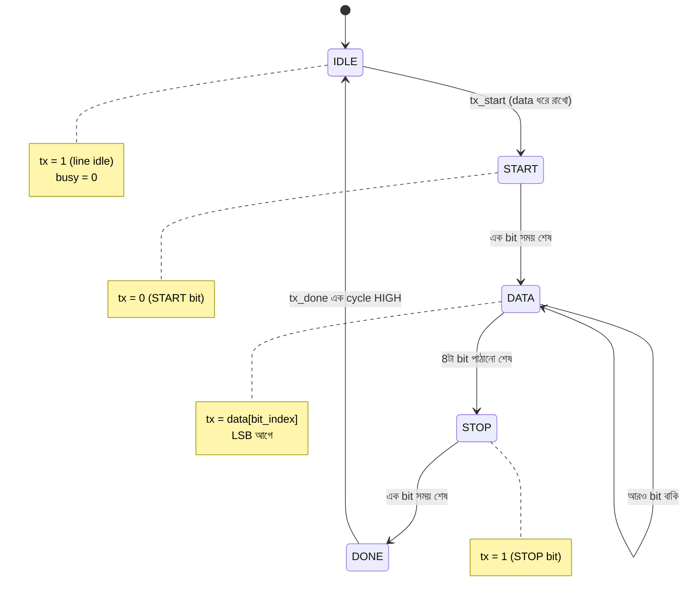
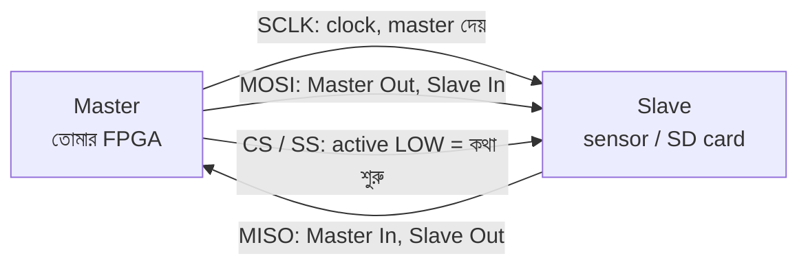
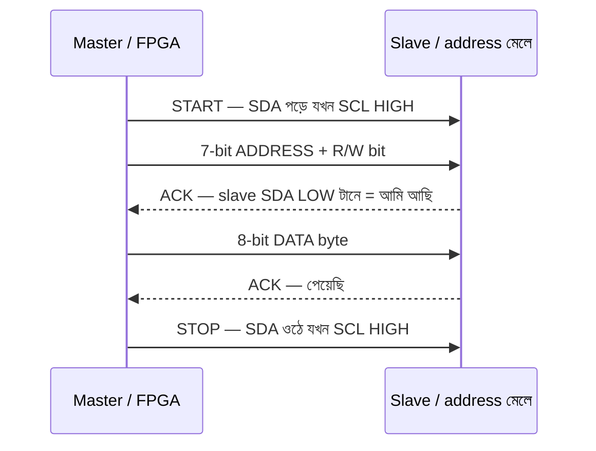

# 🎨 Chapter 11: Build Your Own FPGA Peripherals
## From Blinking LEDs to Real Systems - UART, VGA, and Beyond!

> **"LEDs were just the start. Now build REAL peripherals. Time to go PRO!"**
>
> **"LED শুধু শুরু ছিল। এখন REAL peripherals বানাও। PRO হওয়ার সময়!"**

---

## 🎯 এই Chapter-এ তুমি বানাবে:

```
✅ UART Communication - serial terminal
✅ VGA Output - graphics on monitor
✅ PWM Generator - motor/LED control
✅ SPI Interface - talk to sensors
✅ I2C Controller - multiple devices
✅ Button Debouncing - proper input
✅ Seven-Segment Display - number display
✅ তোমার processor-এর complete I/O system! 🎉
```

**Time Required:** 2 weeks (4-5 hours/day)  
**Hardware:** Tang Nano 9K, Optional: VGA cable, USB-UART, sensors

---

গত chapter-এ তুমি LED জ্বালিয়েছো, button পড়েছো — FPGA তোমার কথা শুনেছে। কিন্তু একটা সত্যিকারের system শুধু আলো জ্বালায় না; সে বাইরের দুনিয়ার সাথে **কথা বলে**। তোমার PC-কে data পাঠায়, sensor থেকে temperature পড়ে, monitor-এ ছবি আঁকে, motor-এর গতি নিয়ন্ত্রণ করে।

এই chapter-টা ঠিক সেই জায়গা — যেখানে তোমার FPGA একটা নিঃসঙ্গ chip থেকে একটা **communicating system** হয়ে ওঠে। আর মজার ব্যাপারটা হলো: প্রতিটা peripheral আসলে কয়েকটা সহজ idea-র উপর দাঁড়িয়ে — timing, shift register, আর state machine। এই তিনটে জিনিস একবার বুঝে গেলে UART, SPI, I2C, VGA — সব একই গল্পের ভিন্ন ভিন্ন রূপ মনে হবে। চলো শুরু করি।

---

## 🚀 Quick Win - 1 ঘণ্টায় UART Terminal!

### UART জিনিসটা আসলে কী?

দুটো chip-কে কথা বলতে হলে সবচেয়ে কম তার লাগে কোন উপায়ে? উত্তর হলো — একটা তার দিয়ে, একটা একটা করে bit পাঠিয়ে। এটাই **serial communication**, আর UART হলো এর সবচেয়ে জনপ্রিয় রূপ।

```
UART = Universal Asynchronous Receiver/Transmitter
- Serial communication protocol
- One wire TX (transmit)
- One wire RX (receive)
- Common baud rates: 9600, 115200 bps

Uses:
✅ Debug output
✅ Sensor data
✅ Command interface
✅ PC communication
```

নামের মধ্যেই পুরো গল্পটা লুকিয়ে আছে। **Asynchronous** শব্দটা সবচেয়ে গুরুত্বপূর্ণ — মানে দুই chip-এর মধ্যে কোনো আলাদা clock তার নেই। তাহলে receiver জানবে কীভাবে কখন bit পড়তে হবে? এখানেই UART-এর সুন্দর কৌশল: পাঠানোর **আগে দুজনে একই গতিতে (baud rate) রাজি হয়ে থাকে**। দুজনের ঘড়ি আলাদা, কিন্তু গতি এক। ঠিক যেন দুজন drummer আলাদা ঘরে বসে, কিন্তু আগে থেকে ঠিক করে রেখেছে — "প্রতি সেকেন্ডে ঠিক ১১৫২০০ বার beat"। তাই একজন বাজালে, অন্যজন না দেখেও তাল মিলিয়ে নিতে পারে।

একটা analogy দিই — UART হলো ওয়াকিটকির মতো, কিন্তু দুটো আলাদা চ্যানেলে (TX আর RX) যাতে দুজন একসাথে কথা বলতে পারে (full-duplex)। আর "baud rate" হলো কথা বলার গতি; দুজনকে একই গতিতে কথা বলতেই হবে, নাহলে একজন আরেকজনের কথা জগাখিচুড়ি শুনবে।

**Asynchronous serial-এর frame কেমন দেখতে?** Idle অবস্থায় line-টা HIGH (1) থাকে। তারপর একটা START bit (0) দিয়ে receiver-কে জানানো হয় "সাবধান, data আসছে", এরপর 8টা data bit (LSB আগে), শেষে একটা STOP bit (1)। নিচের ছবিটা মনে গেঁথে নাও — এই chapter-এর প্রায় সব UART code আসলে এই frame টাই বানায় বা পড়ে:

```
        ┌─START─┬─D0─┬─D1─┬─D2─┬─D3─┬─D4─┬─D5─┬─D6─┬─D7─┬─STOP─
 idle   │       │    │    │    │    │    │    │    │    │      idle
 ───1───┘   0   │ b0 │ b1 │ b2 │ b3 │ b4 │ b5 │ b6 │ b7 │  1   ───1───
        └───────┴────┴────┴────┴────┴────┴────┴────┴────┘
         ↑                                              ↑
   line টানা HIGH থেকে                            আবার HIGH-এ ফিরে যায়
   একবার LOW (0) হওয়া =                         (STOP bit) → পরের byte
   "byte শুরু হচ্ছে"                              এর জন্য তৈরি
   প্রতিটা ঘর = এক bit সময় = (1 / baud rate) সেকেন্ড
```

খেয়াল করো — পুরো synchronization-টা ঘটে ওই একটামাত্র START bit (1→0 transition) থেকে। ওটাই receiver-এর "এখান থেকে গোনা শুরু" সংকেত। তারপর receiver শুধু baud rate ব্যবহার করে গুনে গুনে প্রতিটা bit-এর মাঝখানে গিয়ে value-টা পড়ে নেয়।

### Simple UART TX:

```verilog
module uart_tx #(
    parameter CLK_FREQ = 27_000_000,  // 27 MHz
    parameter BAUD_RATE = 9600
)(
    input wire clk,
    input wire [7:0] data,
    input wire send,
    output reg tx,
    output reg busy
);
    localparam CYCLES_PER_BIT = CLK_FREQ / BAUD_RATE;
    
    reg [15:0] counter;
    reg [3:0] bit_index;
    reg [9:0] tx_data;  // Start + 8 data + Stop
    
    localparam IDLE  = 2'b00;
    localparam START = 2'b01;
    localparam SEND  = 2'b10;
    localparam STOP  = 2'b11;
    reg [1:0] state;
    
    always @(posedge clk) begin
        case (state)
            IDLE: begin
                tx <= 1;
                busy <= 0;
                counter <= 0;
                bit_index <= 0;
                
                if (send) begin
                    tx_data <= {1'b1, data, 1'b0}; // Stop, data, start
                    state <= START;
                    busy <= 1;
                end
            end
            
            START: begin
                tx <= tx_data[0];
                state <= SEND;
            end
            
            SEND: begin
                if (counter < CYCLES_PER_BIT - 1) begin
                    counter <= counter + 1;
                end else begin
                    counter <= 0;
                    bit_index <= bit_index + 1;
                    tx_data <= {1'b1, tx_data[9:1]};
                    
                    if (bit_index == 9) begin
                        state <= IDLE;
                    end
                end
            end
        endcase
    end
endmodule
```

🎉 **First serial communication! Send text to PC!**

**এই code-টা কী করছে, একটু ভেঙে দেখি।** পুরো ব্যাপারটা একটা ছোট্ট state machine — চারটে অবস্থা: `IDLE`, `START`, `SEND`, `STOP`। চলো প্রতিটা অংশের পেছনের যুক্তি বুঝি:

- **`CYCLES_PER_BIT = CLK_FREQ / BAUD_RATE`** — এটাই পুরো UART-এর হৃদয়। তোমার clock চলছে 27 MHz-এ, কিন্তু একটা bit থাকতে হবে অনেক ধীরে (9600 baud মানে প্রতি bit ≈ 104 মাইক্রোসেকেন্ড)। তাই প্রতি bit-এ কতগুলো clock cycle অপেক্ষা করতে হবে? `27,000,000 / 9600 = 2812` cycle। অর্থাৎ FPGA তার দ্রুত ঘড়ির ২৮১২টা টিক গুনে তবেই একটা bit এগোয়। এই counting-ই UART-কে "ধীর" করে receiver-এর তালে মেলায়।

- **`tx_data <= {1'b1, data, 1'b0}`** — এখানে তোমার 8-bit data-টাকে একটা ১০-bit frame-এ মুড়ে ফেলা হচ্ছে: নিচে START bit (0), উপরে STOP bit (1)। কেন এই ক্রম? কারণ পরে আমরা `tx_data[0]` থেকে একটা একটা করে bit বের করব — তাই যেটা আগে যাবে (START), সেটা থাকবে সবচেয়ে নিচের bit-এ।

- **shift register-এর চাল** — `SEND` state-এ প্রতিবার এক bit সময় শেষ হলে `tx_data <= {1'b1, tx_data[9:1]}` চলে। এটা পুরো register-টাকে একঘর ডানে ঠেলে দেয়, আর উপর থেকে 1 (idle/stop মান) ঢুকিয়ে দেয়। ফলে `tx_data[0]` সবসময় পরের পাঠানো bit ধরে রাখে। shift register হলো serial সব protocol-এর সবচেয়ে কাজের যন্ত্র — parallel data-কে এক-এক করে তারে বের করে দেয়, ঠিক যেন একটা PEZ ডিসপেনসার থেকে একটা একটা ক্যান্ডি বেরোয়।

> 💡 **ছোট লক্ষণীয় ব্যাপার:** এই Quick-Win version-টা সহজ রাখার জন্য `START` state-এ counter দিয়ে অপেক্ষা করে না (তাই START bit-টা পরের গুনতির সাথে মিশে যায়) — তুমি কেবল ধারণাটা ধরবে বলে এটা ইচ্ছাকৃত সরল। নিচের "Complete Implementation" version-এ প্রতিটা state ঠিকঠাক `CLKS_PER_BIT` গোনে, যেটা আসল hardware-এ চালানোর উপযোগী। তাই concept বুঝতে এটা, আর board-এ চালাতে নিচেরটা ব্যবহার করো।

---

## ১১.১ UART Communication - Complete Implementation

Quick Win-এ তুমি ধারণাটা পেলে। এবার production-grade version — যেখানে প্রতিটা bit-এর timing নিখুঁত, reset আছে, আর `tx_done`/`tx_busy` সংকেত দিয়ে বাকি system জানতে পারে কখন পাঠানো শেষ। এই দুটো module (TX আর RX) মিলেই তোমার সম্পূর্ণ serial link।

### UART TX (Transmitter):

```verilog
// Complete UART transmitter with FIFO
module uart_tx_complete #(
    parameter CLK_FREQ = 27_000_000,
    parameter BAUD_RATE = 115200
)(
    input wire clk,
    input wire reset,
    input wire [7:0] tx_data,
    input wire tx_start,
    output reg tx,
    output wire tx_busy,
    output wire tx_done
);
    localparam CLKS_PER_BIT = CLK_FREQ / BAUD_RATE;
    
    localparam IDLE  = 3'd0;
    localparam START = 3'd1;
    localparam DATA  = 3'd2;
    localparam STOP  = 3'd3;
    localparam DONE  = 3'd4;
    
    reg [2:0] state;
    reg [15:0] clk_count;
    reg [2:0] bit_index;
    reg [7:0] tx_data_reg;
    reg tx_done_reg;
    
    always @(posedge clk or posedge reset) begin
        if (reset) begin
            state <= IDLE;
            tx <= 1;
            clk_count <= 0;
            bit_index <= 0;
            tx_done_reg <= 0;
        end else begin
            case (state)
                IDLE: begin
                    tx <= 1;
                    clk_count <= 0;
                    bit_index <= 0;
                    tx_done_reg <= 0;
                    
                    if (tx_start) begin
                        tx_data_reg <= tx_data;
                        state <= START;
                    end
                end
                
                START: begin
                    tx <= 0;  // Start bit
                    
                    if (clk_count < CLKS_PER_BIT - 1) begin
                        clk_count <= clk_count + 1;
                    end else begin
                        clk_count <= 0;
                        state <= DATA;
                    end
                end
                
                DATA: begin
                    tx <= tx_data_reg[bit_index];
                    
                    if (clk_count < CLKS_PER_BIT - 1) begin
                        clk_count <= clk_count + 1;
                    end else begin
                        clk_count <= 0;
                        
                        if (bit_index < 7) begin
                            bit_index <= bit_index + 1;
                        end else begin
                            bit_index <= 0;
                            state <= STOP;
                        end
                    end
                end
                
                STOP: begin
                    tx <= 1;  // Stop bit
                    
                    if (clk_count < CLKS_PER_BIT - 1) begin
                        clk_count <= clk_count + 1;
                    end else begin
                        clk_count <= 0;
                        tx_done_reg <= 1;
                        state <= DONE;
                    end
                end
                
                DONE: begin
                    tx_done_reg <= 0;
                    state <= IDLE;
                end
            endcase
        end
    end
    
    assign tx_busy = (state != IDLE);
    assign tx_done = tx_done_reg;
endmodule
```

**TX-এর state machine-টা ছবিতে দেখলে গল্পটা পরিষ্কার হয়।** module-টা পাঁচটা অবস্থার মধ্যে ঘুরপাক খায়, আর প্রতিটা অবস্থায় `clk_count` দিয়ে এক bit সময় (`CLKS_PER_BIT` cycle) পুরো গুনে তবে পরের ধাপে যায়:



লক্ষ্য করো `DATA` state-এর self-loop-টা — ওখানে module-টা আটটা bit পাঠানো পর্যন্ত নিজের কাছেই ফিরে আসে, প্রতিবার `bit_index` এক বাড়িয়ে আর প্রতিটা bit-এর জন্য পুরো `CLKS_PER_BIT` cycle গুনে। আর `DONE` state-টা মাত্র এক cycle-এর জন্য `tx_done` কে HIGH করে দেয়, যাতে বাইরের system একটা পরিষ্কার "পাঠানো শেষ" pulse পায় — এটাকে বলে handshake। `115200` baud বেছে নেওয়ায় এবার এক byte পাঠাতে লাগে মাত্র ~87 মাইক্রোসেকেন্ড, 9600-এর চেয়ে ১২ গুণ দ্রুত।

### UART RX (Receiver):

TX বানানো সহজ ছিল — আমরাই সব নিয়ন্ত্রণ করছি। কিন্তু RX-এর কাজটা আসল চ্যালেঞ্জ: একটা তার দেখে বুঝতে হবে কখন data আসছে, আর কোনো shared clock ছাড়াই প্রতিটা bit ঠিক জায়গায় পড়তে হবে। এর চাবিকাঠি একটাই কৌশল — **bit-এর ঠিক মাঝখানে গিয়ে value পড়া**।

```verilog
module uart_rx #(
    parameter CLK_FREQ = 27_000_000,
    parameter BAUD_RATE = 115200
)(
    input wire clk,
    input wire reset,
    input wire rx,
    output reg [7:0] rx_data,
    output reg rx_valid
);
    localparam CLKS_PER_BIT = CLK_FREQ / BAUD_RATE;
    localparam CLKS_PER_HALF_BIT = CLKS_PER_BIT / 2;
    
    localparam IDLE  = 3'd0;
    localparam START = 3'd1;
    localparam DATA  = 3'd2;
    localparam STOP  = 3'd3;
    
    reg [2:0] state;
    reg [15:0] clk_count;
    reg [2:0] bit_index;
    reg [7:0] rx_data_reg;
    
    always @(posedge clk or posedge reset) begin
        if (reset) begin
            state <= IDLE;
            clk_count <= 0;
            bit_index <= 0;
            rx_valid <= 0;
        end else begin
            case (state)
                IDLE: begin
                    clk_count <= 0;
                    bit_index <= 0;
                    rx_valid <= 0;
                    
                    if (rx == 0) begin  // Start bit detected
                        state <= START;
                    end
                end
                
                START: begin
                    if (clk_count < CLKS_PER_HALF_BIT) begin
                        clk_count <= clk_count + 1;
                    end else begin
                        if (rx == 0) begin  // Verify start bit
                            clk_count <= 0;
                            state <= DATA;
                        end else begin
                            state <= IDLE;  // False start
                        end
                    end
                end
                
                DATA: begin
                    if (clk_count < CLKS_PER_BIT - 1) begin
                        clk_count <= clk_count + 1;
                    end else begin
                        clk_count <= 0;
                        rx_data_reg[bit_index] <= rx;
                        
                        if (bit_index < 7) begin
                            bit_index <= bit_index + 1;
                        end else begin
                            bit_index <= 0;
                            state <= STOP;
                        end
                    end
                end
                
                STOP: begin
                    if (clk_count < CLKS_PER_BIT - 1) begin
                        clk_count <= clk_count + 1;
                    end else begin
                        clk_count <= 0;
                        rx_data <= rx_data_reg;
                        rx_valid <= 1;
                        state <= IDLE;
                    end
                end
            endcase
        end
    end
endmodule
```

**RX-এর আসল চালাকিটা কোথায়?** খেয়াল করো `CLKS_PER_HALF_BIT = CLKS_PER_BIT / 2` — এই অর্ধেক bit-এর অপেক্ষাটাই পুরো receiver-কে নির্ভরযোগ্য করে তোলে। ভেবে দেখো: line-টা HIGH থেকে LOW নামল, মানে START bit শুরু হলো। যদি আমরা ঠিক সেই মুহূর্তে bit গুনতে শুরু করি, তাহলে প্রতিটা bit-এর *কিনারায়* গিয়ে value পড়ব — যেখানে signal-টা ওঠানামা করছে, glitch হওয়ার সবচেয়ে বেশি ঝুঁকি। তাই RX প্রথমে **আধা bit সময় অপেক্ষা করে bit-এর মাঝখানে পৌঁছায়**, তারপর সেখান থেকে এক-এক bit সময় লাফিয়ে প্রতিটা bit-এর কেন্দ্রে গিয়ে sample নেয়। কেন্দ্র হলো সবচেয়ে নিরাপদ জায়গা — দুই পাশে অর্ধেক bit সময়ের buffer, signal তখন স্থির।

নিচের ছবিতে ↑ চিহ্নগুলো দেখাচ্ছে RX ঠিক কোন মুহূর্তে value পড়ছে — প্রতিবার ঘরের মাঝখানে:

```
 line  ──┐ START │ D0  │ D1  │ D2  │ ...│ D7  ┌── STOP
         └───0───┴──b0─┴──b1─┴──b2─┴────┴──b7─┘   1
             ↑       ↑     ↑     ↑          ↑
          আধা bit  পুরো  পুরো  পুরো       পুরো   ← প্রতিটা ↑ এ rx পড়া হয়
          পরে শুরু  bit   bit   bit        bit      (bit-এর ঠিক মাঝখানে)
```

আরেকটা সূক্ষ্ম রক্ষাকবচ আছে `START` state-এ — আধা bit অপেক্ষার পরে আবার `if (rx == 0)` দিয়ে যাচাই করা হয় line-টা এখনো LOW আছে কিনা। যদি না থাকে, তার মানে ওটা আসল START bit ছিল না, কেবল একটা ক্ষণিকের noise বা glitch (false start) — তখন module আবার `IDLE` এ ফিরে যায়। এভাবে একটা ভুল pulse গোটা byte-কে নষ্ট করতে পারে না। কাজ শেষে `rx_valid` এক cycle HIGH হয়ে বাকি system-কে জানায় "একটা byte তৈরি, পড়ে নাও"।

### UART Echo Test:

এবার TX আর RX-কে এক module-এ জুড়ে দিলে কী হয়? একটা **echo** — তুমি keyboard-এ যা টাইপ করবে, FPGA সেটা পড়ে (RX) আর সাথে সাথে ফেরত পাঠাবে (TX), terminal-এ অক্ষরটা ফুটে উঠবে। এটাই তোমার link ঠিকঠাক কাজ করছে কিনা যাচাইয়ের সবচেয়ে সহজ "hello world"।

```verilog
module uart_echo(
    input wire clk,
    input wire reset,
    input wire rx,
    output wire tx
);
    wire [7:0] rx_data;
    wire rx_valid;
    wire tx_busy;
    
    uart_rx #(
        .CLK_FREQ(27_000_000),
        .BAUD_RATE(115200)
    ) rx_inst (
        .clk(clk),
        .reset(reset),
        .rx(rx),
        .rx_data(rx_data),
        .rx_valid(rx_valid)
    );
    
    uart_tx_complete #(
        .CLK_FREQ(27_000_000),
        .BAUD_RATE(115200)
    ) tx_inst (
        .clk(clk),
        .reset(reset),
        .tx_data(rx_data),
        .tx_start(rx_valid && !tx_busy),
        .tx(tx),
        .tx_busy(tx_busy)
    );
endmodule
```

খেয়াল করো `tx_start(rx_valid && !tx_busy)` লাইনটা — এটাই দুই module-কে একসাথে বেঁধে রাখে। নতুন byte পাওয়া গেলে (`rx_valid`) *এবং* TX যদি ব্যস্ত না থাকে (`!tx_busy`), তবেই পাঠানো শুরু হয়। এই ছোট্ট শর্তটা না থাকলে TX পাঠানোর মাঝপথে নতুন byte এসে আগেরটাকে নষ্ট করে দিত। আসল জগতে এটাই flow control-এর সবচেয়ে সরল রূপ — "তুমি ব্যস্ত হলে আমি অপেক্ষা করব"।

> ⚠️ **তার জোড়া দেওয়ার সময় খেয়াল রেখো:** Tang Nano-র TX যাবে USB-UART adapter-এর RX-এ, আর Tang Nano-র RX আসবে adapter-এর TX থেকে — অর্থাৎ tx আর rx **ক্রস** করে জুড়তে হয়। নতুনদের সবচেয়ে কমন ভুল হলো TX→TX, RX→RX সোজা জুড়ে দেওয়া, তাতে কিছুই আসবে না। ভাবো — একজনের মুখ অন্যজনের কানের সাথে জুড়তে হবে, মুখে-মুখে নয়।

### Testing UART:

```
Hardware needed:
- USB-UART adapter (CP2102, FT232, etc.) - $2-5
- 3 wires (TX, RX, GND)

Connections:
Tang Nano TX → UART RX
Tang Nano RX → UART TX
Tang Nano GND → UART GND

Software:
- Windows: PuTTY, RealTerm
- Linux: minicom, screen
- Mac: screen, CoolTerm

Settings:
Baud: 115200
Data: 8 bits
Parity: None
Stop: 1 bit
Flow: None

Test:
1. Open terminal
2. Type characters
3. See them echo back!
```

---

## ১১.২ VGA Output - Display Graphics!

### VGA আসলে কীভাবে কাজ করে?

UART-এ আমরা একটা তারে এক-এক bit পাঠিয়েছি। VGA-তে আমরা একটা পুরো **monitor** কে এক-এক pixel-এ এঁকে ফেলব — কিন্তু মূল idea-টা একই: সব কিছু serial, সময়ের সাথে এক-এক করে।

VGA বুঝতে হলে পুরোনো CRT monitor-এর কথা ভাবো। ভেতরে একটা electron beam পর্দার উপর দিয়ে **বাঁ থেকে ডানে** একটা লাইন এঁকে, তারপর একটু নিচে নেমে আবার বাঁ থেকে ডানে — ঠিক যেভাবে তুমি বই পড়ো, একটা লাইন শেষ করে চোখ ফেরত এনে পরের লাইনে যাও। পুরো পর্দা ভরে গেলে beam আবার উপরে ফিরে আসে, আর গোটা ছবিটা সেকেন্ডে ৬০ বার নতুন করে আঁকা হয় (60 Hz)। আমরা LCD ব্যবহার করি বটে, কিন্তু VGA signal-টা আজও সেই CRT-র নাচের তালেই চলে।

```
VGA Signal:
- HSYNC: Horizontal sync
- VSYNC: Vertical sync
- R, G, B: Color (analog)

Standard resolutions:
640×480 @ 60Hz (most common)
800×600 @ 60Hz
1024×768 @ 60Hz

We'll use: 640×480 @ 60Hz
Pixel clock: 25.175 MHz
```

তাহলে দুটো sync signal কী করে? **HSYNC** হলো "এই লাইন শেষ, beam-কে বাঁয়ে ফিরিয়ে নাও" সংকেত — অর্থাৎ carriage return। আর **VSYNC** হলো "পুরো পর্দা শেষ, beam-কে একদম উপরে-বাঁয়ে ফিরিয়ে নাও" — অর্থাৎ নতুন পাতা। আর `R, G, B` হলো সেই মুহূর্তে beam যে pixel এঁকছে তার রং। তোমার পুরো কাজটা হলো: একটা নিখুঁত ঘড়ির তালে HSYNC আর VSYNC সঠিক সময়ে toggle করা, আর প্রতিটা pixel-এর জন্য সঠিক রং বের করা।

### VGA Timing (640×480):

```
Horizontal timing:
Total: 800 pixels
- Visible: 640 pixels
- Front porch: 16 pixels
- Sync pulse: 96 pixels
- Back porch: 48 pixels

Vertical timing:
Total: 525 lines
- Visible: 480 lines
- Front porch: 10 lines
- Sync pulse: 2 lines
- Back porch: 33 lines

Frequencies:
Pixel clock: 25.175 MHz
H-sync: 31.469 kHz
V-sync: 59.94 Hz
```

**এই "porch" শব্দগুলো কোথা থেকে এলো, আর কেনই বা দরকার?** এখানে একটা মজার ব্যাপার আছে — তুমি ৬৪০ pixel দেখতে চাও, কিন্তু hardware আসলে প্রতি লাইনে **৮০০** pixel সময় খরচ করে। বাকি ১৬০ pixel কোথায় যায়? ওগুলো অদৃশ্য — beam-কে লাইনের শেষ থেকে আবার শুরুতে ফেরত যাওয়ার সময় দেয়। সেই CRT-র যুগে electron beam তাৎক্ষণিক লাফ দিতে পারত না; তাকে থামতে, ফিরতে আর থিতু হতে কিছুটা সময় লাগত। এই "ফাঁকা" সময়টাকেই ভাগ করা হয়:

- **Front porch** — দৃশ্যমান অংশ শেষ হওয়ার পর sync pulse শুরুর আগে ছোট্ট বিরতি (beam-কে থামার সময়)।
- **Sync pulse** — আসল "ফিরে যাও" সংকেত (HSYNC/VSYNC এই সময়টাতে active হয়)।
- **Back porch** — sync শেষ হওয়ার পর আবার আঁকা শুরুর আগে বিরতি (beam-কে নতুন জায়গায় থিতু হওয়ার সময়)।

এই সংখ্যাগুলো VESA standard-এ পাথরে খোদাই করা — তুমি ইচ্ছেমতো বদলাতে পারবে না, নাহলে monitor ছবি ধরতে পারবে না বা "Out of Range" দেখাবে। আর timing-টা একটা সুন্দর nested loop-এর মতো: প্রতি pixel-এ horizontal counter এক বাড়ে; পুরো একটা লাইন (৮০০ pixel) শেষ হলে vertical counter এক বাড়ে; পুরো ৫২৫টা লাইন শেষ হলে এক frame সম্পূর্ণ হয়, আর ৬০ Hz-এ পুরোটা আবার শুরু। pixel clock × লাইন প্রতি pixel × frame প্রতি লাইন ≈ 25.175M, যেটাই H-sync (31.469 kHz) আর V-sync (59.94 Hz) সংখ্যাকে জন্ম দেয়।

### VGA Clock Generator:

পুরো VGA-এর প্রাণভোমরা হলো ওই **25.175 MHz pixel clock** — মনিটর ঠিক এই গতিতে pixel আশা করে। কিন্তু Tang Nano 9K-এর crystal দেয় 27 MHz। এই গরমিল মেটাতেই দরকার একটা clock generator।

```verilog
// Generate 25 MHz from 27 MHz using PLL
module vga_pll(
    input wire clk_in,      // 27 MHz
    output wire clk_out,    // 25 MHz (approx)
    output wire locked
);
    // Tang Nano 9K has built-in PLL
    // Use Gowin IP to generate 25 MHz
    // Tools → IP Core Generator → PLL
    
    // For now, we'll use clock divider (simple but not accurate)
    reg clk_div;
    reg [1:0] counter;
    
    always @(posedge clk_in) begin
        counter <= counter + 1;
        if (counter == 0)
            clk_div <= ~clk_div;
    end
    
    assign clk_out = clk_div;  // 27 MHz / 8 = 3.375 MHz (NOT VGA-ready; use real PLL for 25.175 MHz)
    assign locked = 1;
endmodule
```

> ⚠️ **গুরুত্বপূর্ণ:** উপরের clock divider-টা শুধু *ধারণা* দেখানোর জন্য — এটা VGA-তে চলবে না। কেন? কারণ একটা divider দিয়ে তুমি শুধু পূর্ণসংখ্যা দিয়ে ভাগ করতে পারো (÷2, ÷4, ÷8...), আর 27 MHz-কে কোনো পূর্ণসংখ্যা দিয়ে ভাগ করে কখনো 25.175 MHz পাবে না। এই code-এর `counter` দুই-bit, তাই প্রতি 4 cycle-এ toggle করে, যা দাঁড়ায় **27 MHz ÷ 8 = 3.375 MHz** — VGA-এর জন্য অনেক অনেক ধীর। এজন্যই আসল কাজে **PLL** (Phase-Locked Loop) লাগে, যেটা একটা clock-কে গুণ-ভাগ করে প্রায় যেকোনো frequency বানাতে পারে। Tang Nano 9K-এর built-in PLL আছে; Gowin IDE-তে **Tools → IP Core Generator → PLL** দিয়ে 25.175 MHz (বা কাছাকাছি) clock generate করে এই module-এর জায়গায় বসাবে। নিচের সব VGA logic ঠিক ধরে নেয় তার `clk` ইনপুট সেই সঠিক pixel clock — তাই বোর্ডে চালানোর আগে অবশ্যই PLL জুড়ে নিও।

### VGA Sync Generator:

এটাই VGA-এর মস্তিষ্ক — সেই nested counter যেটা beam-এর অবস্থান হিসাব রাখে আর ঠিক সময়ে sync pulse দেয়। code-টা ঠিক আগের timing table টাকেই Verilog-এ অনুবাদ করছে।

```verilog
module vga_sync(
    input wire clk,         // 25 MHz pixel clock
    input wire reset,
    output reg hsync,
    output reg vsync,
    output reg video_on,
    output reg [9:0] x,
    output reg [9:0] y
);
    // Horizontal timing (800 total)
    localparam H_VISIBLE = 640;
    localparam H_FRONT   = 16;
    localparam H_SYNC    = 96;
    localparam H_BACK    = 48;
    localparam H_TOTAL   = H_VISIBLE + H_FRONT + H_SYNC + H_BACK;
    
    // Vertical timing (525 total)
    localparam V_VISIBLE = 480;
    localparam V_FRONT   = 10;
    localparam V_SYNC    = 2;
    localparam V_BACK    = 33;
    localparam V_TOTAL   = V_VISIBLE + V_FRONT + V_SYNC + V_BACK;
    
    reg [9:0] h_count;
    reg [9:0] v_count;
    
    // Horizontal counter
    always @(posedge clk or posedge reset) begin
        if (reset)
            h_count <= 0;
        else if (h_count == H_TOTAL - 1)
            h_count <= 0;
        else
            h_count <= h_count + 1;
    end
    
    // Vertical counter
    always @(posedge clk or posedge reset) begin
        if (reset)
            v_count <= 0;
        else if (h_count == H_TOTAL - 1) begin
            if (v_count == V_TOTAL - 1)
                v_count <= 0;
            else
                v_count <= v_count + 1;
        end
    end
    
    // Generate sync signals
    always @(posedge clk) begin
        hsync <= (h_count >= H_VISIBLE + H_FRONT) && 
                 (h_count < H_VISIBLE + H_FRONT + H_SYNC);
        
        vsync <= (v_count >= V_VISIBLE + V_FRONT) && 
                 (v_count < V_VISIBLE + V_FRONT + V_SYNC);
    end
    
    // Video enable
    always @(posedge clk) begin
        video_on <= (h_count < H_VISIBLE) && (v_count < V_VISIBLE);
        x <= h_count;
        y <= v_count;
    end
endmodule
```

**code-এর তিনটে অংশ তিনটে স্পষ্ট কাজ করছে।** প্রথম `always` block-টা `h_count` কে প্রতি pixel-এ বাড়ায় আর `H_TOTAL`-এ (৮০০) পৌঁছালে ০ এ ফিরিয়ে আনে — এটাই horizontal beam। দ্বিতীয় block-টা চতুর: `v_count` শুধু তখনই বাড়ে যখন `h_count` তার শেষ মানে পৌঁছায়, অর্থাৎ **একটা পুরো লাইন শেষ হলে তবেই এক ঘর নিচে নামা**। এই দুটো counter মিলে exactly সেই nested loop-টা বানায় যেটা আমরা উপরে কল্পনা করেছিলাম।

তৃতীয় অংশ দুটো জিনিস বের করে: sync signal আর `video_on`। খেয়াল করো `hsync` active হয় শুধু front porch পেরোনোর পর — `(h_count >= H_VISIBLE + H_FRONT) && (h_count < H_VISIBLE + H_FRONT + H_SYNC)` — ঠিক সেই porch হিসাবটাই। আর `video_on` কেবল দৃশ্যমান এলাকায় (৬৪০×৪৮০ box-এর ভেতর) HIGH থাকে; এটাই বলে দেয় "এখন আঁকার সময়, রং পাঠাও"। porch এলাকায় রং অবশ্যই কালো (0) রাখতে হয়, নাহলে monitor বিভ্রান্ত হয় — সেটা পরের module সামলায়।

### Simple Pattern Generator:

sync generator beam-এর অবস্থান (`x, y`) আর "এখন আঁকব কিনা" (`video_on`) দিয়ে দিল। বাকি রইল মজার অংশ — প্রতিটা pixel-এ কী রং দেব? এই module-টা সবচেয়ে সহজ উদাহরণ: পর্দাকে তিন ভাগে ভাগ করে তিনটে উল্লম্ব রঙিন ডোরা আঁকা।

```verilog
module vga_pattern(
    input wire clk,
    input wire reset,
    output wire hsync,
    output wire vsync,
    output wire [2:0] rgb
);
    wire video_on;
    wire [9:0] x, y;
    
    vga_sync sync(
        .clk(clk),
        .reset(reset),
        .hsync(hsync),
        .vsync(vsync),
        .video_on(video_on),
        .x(x),
        .y(y)
    );
    
    // Color patterns
    wire [2:0] color;
    
    // Vertical stripes
    assign color[2] = (x < 213) ? 1 : 0;  // Red
    assign color[1] = (x >= 213 && x < 426) ? 1 : 0;  // Green
    assign color[0] = (x >= 426) ? 1 : 0;  // Blue
    
    assign rgb = video_on ? color : 3'b000;
endmodule
```

এখানেই VGA-এর সৌন্দর্য ধরা পড়ে: রং পুরোপুরি `x` এর একটা **function**। `x < 213` হলে লাল, `213 ≤ x < 426` হলে সবুজ, বাকিটা নীল — ৬৪০ কে মোটামুটি তিন ভাগে ভাগ করা। কোনো frame buffer বা memory লাগেনি; প্রতি pixel-এর রং on-the-fly হিসাব হয়ে যাচ্ছে। এটাকে বলে **procedural/combinational graphics** — তুমি ছবি জমিয়ে রাখছ না, প্রতি মুহূর্তে গণনা করে আঁকছ।

আর সবচেয়ে জরুরি লাইনটা শেষে: `assign rgb = video_on ? color : 3'b000`। এই একটা ternary সব porch এলাকায় রং জোর করে কালো করে দেয়। ভুলে গেলে monitor "blanking" সময়ে রং দেখতে পেয়ে গোটা ছবি বিকৃত করে ফেলবে — এটা VGA-র সবচেয়ে কমন bug। একবার এই কাঠামো বুঝে গেলে তুমি `x, y` দিয়ে যেকোনো শর্ত লিখে বর্গক্ষেত্র, checkerboard, এমনকি bouncing ball ও আঁকতে পারবে।

### VGA Constraint File:

hsync, vsync আর rgb signal-গুলো FPGA-এর কোন physical pin-এ বেরোবে, সেটা constraint file (`.cst`) বলে দেয়। নিচের pin number-গুলো Tang Nano 9K-এর জন্য — board ভিন্ন হলে number ও বদলাবে।

```tcl
// VGA pins on Tang Nano 9K
IO_LOC "hsync" 69;
IO_LOC "vsync" 70;
IO_LOC "rgb[0]" 71;  // Blue
IO_LOC "rgb[1]" 72;  // Green
IO_LOC "rgb[2]" 73;  // Red

IO_PORT "hsync" DRIVE=8;
IO_PORT "vsync" DRIVE=8;
IO_PORT "rgb[0]" DRIVE=8;
IO_PORT "rgb[1]" DRIVE=8;
IO_PORT "rgb[2]" DRIVE=8;
```

---

## ১১.৩ PWM Generation - Motor & LED Control

### PWM কী, আর কেন এটা জাদুর মতো?

একটা মজার সমস্যা দিয়ে শুরু করি। FPGA-এর pin শুধু দুটো জিনিস করতে পারে — পুরো ON (3.3V) বা পুরো OFF (0V)। কোনো মাঝামাঝি voltage নেই। তাহলে তুমি LED-কে **আধা উজ্জ্বল** করবে কীভাবে? বা motor-কে **অর্ধেক গতিতে** ঘোরাবে কীভাবে? উত্তরটা চমকপ্রদ: তুমি আসলে মাঝামাঝি voltage বানাবে না — তুমি pin-টাকে এত **দ্রুত ON-OFF করবে** যে চোখ আর motor গড় মান (average) টাকেই "অর্ধেক" হিসেবে অনুভব করবে।

```
PWM = Pulse Width Modulation
- Digital signal with varying duty cycle
- Duty cycle = % of time HIGH
- Used for: Motor speed, LED brightness, power control

Example:
50% duty: ▀▀▀▀▄▄▄▄▀▀▀▀▄▄▄▄
25% duty: ▀▀▄▄▄▄▄▄▀▀▄▄▄▄▄▄
75% duty: ▀▀▀▀▀▀▄▄▀▀▀▀▀▀▄▄
```

মূল শব্দটা হলো **duty cycle** — মোট সময়ের কত শতাংশ signal-টা HIGH থাকে। উপরের ছবিতে দেখো: 25% duty-তে signal বেশিরভাগ সময় নিচে, তাই LED ম্লান; 75% duty-তে বেশিরভাগ সময় উপরে, তাই LED উজ্জ্বল। কিন্তু চালাকিটা হলো — toggle এত দ্রুত (হাজার হাজার বার প্রতি সেকেন্ডে) যে তুমি আলাদা ON-OFF দেখোই না, শুধু একটা স্থির উজ্জ্বলতা অনুভব করো। ঠিক যেমন একটা ফ্যান দ্রুত ঘুরলে আলাদা পাখা না দেখে একটা ঝাপসা চাকতি দেখো।

analogy-টা আরও পরিষ্কার করি: কল দিয়ে বালতি ভরার সময় তুমি যদি কলটা খুব দ্রুত খোলো-বন্ধ করো, তাহলে বালতিতে পানি জমে একটা গড় হারে — যেন কলটা অর্ধেক খোলা ছিল। PWM-তে voltage হলো সেই "পানির হার", আর capacitor/motor/চোখ হলো সেই বালতি যা গড়টা ধরে রাখে। এই একই কৌশলে class-D amplifier, switching power supply, সবকিছু চলে — তাই এটা শেখা মানে hardware-এর একটা সর্বজনীন idea হাতে পাওয়া।

### Simple PWM Module:

এত শক্তিশালী একটা ধারণা, অথচ এর Verilog এতই সরল যে অবাক হবে — মাত্র একটা counter আর একটা comparison।

```verilog
module pwm #(
    parameter WIDTH = 8  // 8-bit resolution
)(
    input wire clk,
    input wire reset,
    input wire [WIDTH-1:0] duty,  // 0-255 for 8-bit
    output reg pwm_out
);
    reg [WIDTH-1:0] counter;
    
    always @(posedge clk or posedge reset) begin
        if (reset)
            counter <= 0;
        else
            counter <= counter + 1;
    end
    
    always @(posedge clk) begin
        pwm_out <= (counter < duty);
    end
endmodule
```

**এই দুই লাইনে পুরো PWM ধরা আছে।** ভাবো — `counter` একটা 8-bit গণক, তাই এটা 0 থেকে 255 পর্যন্ত গুনে আবার 0-এ ফিরে যায়, বারবার। প্রতিবার এই চক্রে `pwm_out` HIGH থাকে কেবল যতক্ষণ `counter < duty`। তাহলে যদি `duty = 64` (255-এর ~25%), তবে প্রতি চক্রে শুরুর 64 ধাপ HIGH, বাকি 192 ধাপ LOW — মানে ঠিক 25% duty cycle! `duty` বাড়ালে HIGH অংশ বাড়ে, কমালে কমে। এত সহজ।

একটা গুরুত্বপূর্ণ অন্তর্দৃষ্টি: counter-এর width (এখানে 8-bit) দুটো জিনিস ঠিক করে। প্রথমত **resolution** — 8-bit মানে 256 ধাপ উজ্জ্বলতা (0 থেকে 255)। দ্বিতীয়ত **PWM frequency** — পুরো 256-ধাপ চক্র শেষ হতে যত সময় লাগে। 27 MHz clock-এ একটা 8-bit চক্র শেষ হয় `27,000,000 / 256 ≈ 105 kHz` এ, যা চোখ আর motor-এর জন্য যথেষ্ট দ্রুত (flicker ধরা পড়ে না)। চাও বেশি মসৃণ উজ্জ্বলতা? `WIDTH` বাড়াও — কিন্তু তখন PWM frequency কমে যাবে, তাই এটা একটা trade-off।

### LED Breathing Effect:

শুধু স্থির উজ্জ্বলতা তো একঘেয়ে। মানুষের নিঃশ্বাসের মতো LED-কে আস্তে আস্তে উজ্জ্বল-ম্লান করলে কেমন হয়? কৌশলটা হলো — `duty` মানটাকেই ধীরে ধীরে ০ থেকে ২৫৫ এ ওঠাও, তারপর আবার নামাও, অবিরাম।

```verilog
module led_breathe(
    input wire clk,       // 27 MHz
    input wire reset,
    output wire led_pwm
);
    // Slow counter for breathing
    reg [24:0] slow_counter;
    reg [7:0] brightness;
    reg direction;  // 0=increasing, 1=decreasing
    
    always @(posedge clk or posedge reset) begin
        if (reset) begin
            slow_counter <= 0;
            brightness <= 0;
            direction <= 0;
        end else begin
            slow_counter <= slow_counter + 1;
            
            // Update brightness every ~1.24 s (when slow_counter wraps)
            if (slow_counter == 0) begin
                if (direction == 0) begin
                    if (brightness == 255)
                        direction <= 1;
                    else
                        brightness <= brightness + 1;
                end else begin
                    if (brightness == 0)
                        direction <= 0;
                    else
                        brightness <= brightness - 1;
                end
            end
        end
    end
    
    // PWM generator
    pwm #(.WIDTH(8)) pwm_inst(
        .clk(clk),
        .reset(reset),
        .duty(brightness),
        .pwm_out(led_pwm)
    );
endmodule
```

**এখানে দুটো আলাদা গতির ঘড়ি একসাথে চলছে — এটাই শেখার মূল বিষয়।** ভেতরের `pwm_inst` দ্রুত toggle করে আসল উজ্জ্বলতা বানায় (105 kHz)। কিন্তু `brightness` মানটা যদি প্রতি clock cycle-এ বদলাত, তবে breathing এত দ্রুত হতো যে চোখে ধরাই পড়ত না। তাই এখানে একটা **slow counter** (`slow_counter`, 25-bit) দিয়ে গতি কমানো হয়েছে। 25-bit counter ০ এ ফিরে আসে প্রতি `2^25 / 27,000,000 ≈ 1.24` সেকেন্ড পরপর, আর কেবল তখনই (`slow_counter == 0`) `brightness` এক ধাপ বদলায়। `direction` flag-টা ঠিক করে এখন উজ্জ্বলতা বাড়ছে না কমছে — 255-এ পৌঁছালে নামা শুরু, 0-এ পৌঁছালে ওঠা শুরু।

এই "fast PWM + slow modulation" প্যাটার্নটা মনে রেখো — এটা hardware-এ সর্বত্র ফিরে আসে। নিচের তলায় একটা দ্রুত carrier, উপরের তলায় ধীর একটা control signal যা carrier-কে আকার দেয়। audio, radio, motor — সবখানে একই কাঠামো।

### RGB LED Control:

একটা LED সামলাতে পারলে তিনটে সামলানো সহজ — শুধু তিনটে PWM module পাশাপাশি বসিয়ে দাও, প্রতিটা এক রঙের (লাল, সবুজ, নীল) জন্য। তিনটে duty মান বদলে তুমি লক্ষ লক্ষ রং বানাতে পারবে।

```verilog
module rgb_led_pwm(
    input wire clk,
    input wire [7:0] red_duty,
    input wire [7:0] green_duty,
    input wire [7:0] blue_duty,
    output wire red_pwm,
    output wire green_pwm,
    output wire blue_pwm
);
    pwm #(.WIDTH(8)) red_pwm_inst(
        .clk(clk),
        .reset(1'b0),
        .duty(red_duty),
        .pwm_out(red_pwm)
    );
    
    pwm #(.WIDTH(8)) green_pwm_inst(
        .clk(clk),
        .reset(1'b0),
        .duty(green_duty),
        .pwm_out(green_pwm)
    );
    
    pwm #(.WIDTH(8)) blue_pwm_inst(
        .clk(clk),
        .reset(1'b0),
        .duty(blue_duty),
        .pwm_out(blue_pwm)
    );
endmodule
```

এটাই হলো module reuse-এর শক্তি — একই `pwm` module তিনবার instantiate করে তিনটে আলাদা চ্যানেল পেয়ে গেলে। RGB-এর গণিতটা তোমার পরিচিত: লাল+সবুজ = হলুদ, তিনটেই পূর্ণ = সাদা, তিনটেই কম = ম্লান। duty মানগুলো একটু একটু করে বদলালে color fade/rainbow effect পাবে — তোমার আগের breathing logic-টা এখানে জুড়ে দিলেই RGB breathing!

---

## ১১.৪ Button Debouncing - Proper Input Handling

### Debounce কেন লাগে?

একটা button চাপা তো সহজ মনে হয় — চাপলে 1, ছাড়লে 0। কিন্তু বাস্তবে ভেতরে দুটো ধাতব সংস্পর্শ যখন মেলে, তারা তাৎক্ষণিকভাবে স্থির হয় না — মাইক্রোসেকেন্ডের জন্য কয়েকবার লাফিয়ে লাফিয়ে ছোঁয়া লাগে-ছাড়ে, ঠিক যেমন একটা বল মেঝেতে পড়ে কয়েকবার লাফায় তারপর থামে। এই যান্ত্রিক কম্পনকে বলে **bounce**।

```
Button presses are noisy:
Physical: ▀▄▀▄▀▀▀▀▀▀▀▀▄▀▄▄▄
Desired:  ▄▄▄▄▀▀▀▀▀▀▀▀▀▄▄▄▄

Without debounce:
- Multiple false triggers
- Unreliable input
- Bad user experience

With debounce:
- Clean single trigger
- Reliable operation
- Professional behavior
```

সমস্যাটা হলো — তোমার FPGA চলছে 27 MHz-এ, মানে প্রতি ~37 ন্যানোসেকেন্ডে একবার line পড়ছে। এই বিদ্যুৎগতির চোখে button-এর কয়েক মিলিসেকেন্ডের bounce-টা শত শত আলাদা ON-OFF-এর মতো দেখায়! ফলে তুমি একবার চাপলে counter হয়তো ৫ বার বেড়ে যাবে। মানুষের কাছে এক ধাক্কা, FPGA-এর কাছে অনেকগুলো — এই গরমিলই debounce-এর আসল কারণ।

সমাধানের idea-টা সহজ আর সুন্দর: **একটা পরিবর্তনকে তখনই সত্যি বলে মানো, যখন signal-টা একটানা কিছু সময় (যেমন 20ms) ধরে স্থির থাকে।** bounce-এর লাফালাফি কয়েক মিলিসেকেন্ডেই থেমে যায়, তাই 20ms স্থিরতা মানে button সত্যিই থিতু হয়েছে। এটা যেন একটা ধৈর্যশীল প্রহরী — "একবার পরিবর্তন দেখেই বিশ্বাস করব না, ২০ মিলিসেকেন্ড একই থাকলে তবে মানব"।

### Debounce Module:

```verilog
module debounce #(
    parameter CLK_FREQ = 27_000_000,
    parameter DEBOUNCE_TIME_MS = 20  // 20ms debounce
)(
    input wire clk,
    input wire button_in,
    output reg button_out
);
    localparam COUNTER_MAX = CLK_FREQ / 1000 * DEBOUNCE_TIME_MS;
    
    reg [19:0] counter;
    reg button_sync_0, button_sync_1;
    
    // Synchronizer (avoid metastability)
    always @(posedge clk) begin
        button_sync_0 <= button_in;
        button_sync_1 <= button_sync_0;
    end
    
    // Debounce logic
    always @(posedge clk) begin
        if (button_out != button_sync_1) begin
            counter <= counter + 1;
            if (counter >= COUNTER_MAX) begin
                button_out <= button_sync_1;
                counter <= 0;
            end
        end else begin
            counter <= 0;
        end
    end
endmodule
```

**code-এ দুটো আলাদা সুরক্ষা একসাথে কাজ করছে।** প্রথমটা হলো **synchronizer** — ওই দুটো flip-flop (`button_sync_0`, `button_sync_1`)। button-টা তোমার FPGA-এর clock-এর সাথে কোনো সম্পর্ক ছাড়াই যেকোনো মুহূর্তে বদলাতে পারে। যদি ঠিক clock edge-এর সময় বদলায়, flip-flop "metastable" হয়ে যেতে পারে — মানে কিছুক্ষণের জন্য 0 ও না, 1 ও না, একটা অনিশ্চিত মাঝামাঝি অবস্থায় ঝুলে থাকে, যা পুরো circuit-কে অনিশ্চিত করে দেয়। external signal-কে পরপর দুটো flip-flop দিয়ে চালালে এই অনিশ্চয়তা প্রথম flip-flop-এ শোষিত হয়ে যায়, দ্বিতীয়টা থেকে পরিষ্কার মান বের হয়। যেকোনো asynchronous input-এর জন্য এটা বাধ্যতামূলক নিয়ম।

দ্বিতীয়টা হলো আসল **debounce timer**। `COUNTER_MAX = CLK_FREQ / 1000 * DEBOUNCE_TIME_MS` হলো 20ms-তে কত clock cycle হয় (27 MHz-এ ≈ 540,000)। logic-টা পড়ো: যতক্ষণ নতুন (synced) মান আর বর্তমান output আলাদা, `counter` বাড়তে থাকে; কিন্তু মাঝপথে যদি signal আবার বদলে যায় (bounce!), `else` শাখা counter-কে ০ এ রিসেট করে দেয়। অর্থাৎ counter পুরো `COUNTER_MAX` এ পৌঁছাবে কেবল তখনই যখন signal একটানা 20ms স্থির ছিল — তখনই output বদলায়। এক ঝলক bounce timer-কে বারবার শূন্য থেকে শুরু করায়, তাই false trigger হয় না।

### Edge Detector:

Debounce দিল পরিষ্কার একটা *level* (চাপা অবস্থায় HIGH, ছাড়া অবস্থায় LOW)। কিন্তু "button চাপা হলো" — এই *ঘটনা* (event) তো একটা মুহূর্ত, level নয়। Counter এক বাড়াতে চাইলে তোমার সেই চাপার ঠিক মুহূর্তটা ধরা দরকার, নাহলে button ধরে রাখলেই counter পাগলের মতো বাড়তে থাকবে। এই কাজটাই করে edge detector।

```verilog
module edge_detect(
    input wire clk,
    input wire signal_in,
    output wire rising_edge,
    output wire falling_edge
);
    reg signal_delayed;
    
    always @(posedge clk) begin
        signal_delayed <= signal_in;
    end
    
    assign rising_edge  = signal_in && !signal_delayed;
    assign falling_edge = !signal_in && signal_delayed;
endmodule
```

**এই কৌশলটা ছোট কিন্তু সর্বত্র লাগে।** module-টা signal-এর এক cycle আগের মান (`signal_delayed`) মনে রাখে, তারপর এখনকার মানের সাথে তুলনা করে। `rising_edge` HIGH হয় ঠিক সেই এক cycle-এ যখন আগে 0 ছিল কিন্তু এখন 1 — অর্থাৎ মাত্রই উঠল। একইভাবে `falling_edge` ধরে নামার মুহূর্ত। ফলাফল: তুমি button যতক্ষণই চেপে ধরে রাখো, `rising_edge` শুধু এক cycle-এর জন্য একটা পরিষ্কার pulse দেবে — ঠিক যা একটা counter-কে exactly একবার বাড়াতে দরকার। "অবস্থা থেকে ঘটনা" বের করার এটাই আদর্শ উপায়।

### Button Counter Example:

এবার তিনটে টুকরো জুড়ে একটা পূর্ণ, নির্ভরযোগ্য input chain বানাই: কাঁচা button → **debounce** (পরিষ্কার level) → **edge detect** (একক pulse) → **counter**। এটাই প্রতিটা professional design-এ button সামলানোর আদর্শ pipeline।

```verilog
module button_counter(
    input wire clk,
    input wire reset,
    input wire button,
    output reg [7:0] count,
    output wire [5:0] leds
);
    wire button_clean;
    wire button_pressed;
    
    // Debounce
    debounce #(
        .CLK_FREQ(27_000_000),
        .DEBOUNCE_TIME_MS(20)
    ) debounce_inst (
        .clk(clk),
        .button_in(button),
        .button_out(button_clean)
    );
    
    // Edge detect
    edge_detect edge_inst(
        .clk(clk),
        .signal_in(button_clean),
        .rising_edge(button_pressed),
        .falling_edge()
    );
    
    // Counter
    always @(posedge clk or posedge reset) begin
        if (reset)
            count <= 0;
        else if (button_pressed)
            count <= count + 1;
    end
    
    // Display count on LEDs
    assign leds = count[5:0];
endmodule
```

লক্ষ্য করো signal-টা কীভাবে chain ধরে প্রবাহিত হলো: কাঁচা `button` → `debounce_inst` → পরিষ্কার `button_clean` → `edge_inst` → একক-cycle `button_pressed` → counter। এই `button_pressed` pulse টাই counter বাড়ায়, তাই তুমি যতই button চেপে ধরে রাখো, প্রতি চাপে count ঠিক **একবার** বাড়ে। `falling_edge()` কে খালি রাখা হয়েছে কারণ এখানে শুধু চাপার মুহূর্তটাই দরকার, ছাড়ার নয়। এই pattern-টা মাথায় গেঁথে নাও — পরের প্রায় সব project-এ button পড়তে এটাই ব্যবহার করবে।

---

## ১১.৫ Seven-Segment Display

### 7-Segment Encoding:

সাতটা LED-কে "৮" আকারে সাজালে তুমি যেকোনো অঙ্ক ০-৯ (আর কিছু অক্ষর) দেখাতে পারো — এটাই seven-segment display, ঘড়ি-microwave-calculator-এর সেই চেনা লাল অঙ্কগুলো। প্রতিটা সেগমেন্টের একটা নাম আছে (a থেকে g), আর একটা অঙ্ক বানানো মানে ঠিক কোন কোন সেগমেন্ট জ্বালাতে হবে সেটা ঠিক করা।

```
Segment layout:
     aaa
    f   b
    f   b
     ggg
    e   c
    e   c
     ddd

Segment bits: {dp, g, f, e, d, c, b, a}
```

উপরের ASCII map-টা ভালো করে দেখো — উপরের আড়াআড়ি দাগ `a`, ডান দিকের দুটো `b` (উপরে) আর `c` (নিচে), নিচের দাগ `d`, বাঁ দিকের `e` (নিচে) আর `f` (উপরে), আর মাঝখানের দাগ `g`। শেষে `dp` মানে decimal point। এই ৮টা bit-কে আমরা এক byte-এ সাজাই: `{dp, g, f, e, d, c, b, a}`। তাহলে যেকোনো অঙ্ক = ৮ bit-এর একটা pattern, যেখানে 1 মানে "এই সেগমেন্ট জ্বলবে"। যেমন "৭" বানাতে শুধু উপরের `a` আর ডানের `b, c` জ্বালালেই হয় — বাকি সব নেভানো।

### BCD to 7-Segment Decoder:

এবার দরকার একটা অনুবাদক: input-এ একটা 4-bit সংখ্যা (০-৯) দাও, output-এ সেই অঙ্কের ৮-bit সেগমেন্ট pattern পাও। এটা আসলে একটা lookup table — প্রতিটা অঙ্কের জন্য হাতে হিসাব করা pattern।

```verilog
module bcd_to_7seg(
    input wire [3:0] bcd,       // 0-9
    output reg [7:0] segments   // {dp, g, f, e, d, c, b, a}
);
    always @(*) begin
        case (bcd)
            4'd0: segments = 8'b00111111;  // 0
            4'd1: segments = 8'b00000110;  // 1
            4'd2: segments = 8'b01011011;  // 2
            4'd3: segments = 8'b01001111;  // 3
            4'd4: segments = 8'b01100110;  // 4
            4'd5: segments = 8'b01101101;  // 5
            4'd6: segments = 8'b01111101;  // 6
            4'd7: segments = 8'b00000111;  // 7
            4'd8: segments = 8'b01111111;  // 8
            4'd9: segments = 8'b01101111;  // 9
            default: segments = 8'b00000000;
        endcase
    end
endmodule
```

**একটা encoding হাতে মিলিয়ে দেখি, তাহলে পুরো table পরিষ্কার হবে।** ধরো `4'd7` → `8'b00000111`। bit-গুলো ডান থেকে বাঁ পড়ো (`a` সবচেয়ে ডানে): `a=1, b=1, c=1`, বাকি `d,e,f,g,dp` সব 0। মানে উপরের দাগ আর ডানের দুটো খাড়া দাগ জ্বলবে — ঠিক "৭"! আবার `4'd1` → `8'b00000110`: শুধু `b=1, c=1`, অর্থাৎ ডানের দুটো দাগ — পরিষ্কার "১"। এভাবে প্রতিটা সংখ্যার pattern-টা আসলে ওই ৮-segment ছবির সরাসরি অনুবাদ।

এটা একটা `always @(*)` block, তাই পুরোটা **combinational** — কোনো clock নেই, কোনো memory নেই। input বদলালেই output সাথে সাথে বদলায়, একটা সত্যিকারের decoder-এর মতো। `default` শাখাটা ভুলে যেও না: ০-৯ এর বাইরে কোনো মান এলে (যেমন 4'd10–4'd15) সব segment নিভিয়ে দেয়, যাতে আবোলতাবোল কিছু না দেখায়।

### Multi-Digit Display (Multiplexed):

একটা অঙ্ক তো দেখালে — কিন্তু ঘড়িতে তো ৪টে অঙ্ক লাগে। সমস্যা: ৪টে digit × ৮টা segment = ৩২টা তার! Tang Nano-এ এত pin নেই। সমাধানটা চোখকে ফাঁকি দেওয়ার এক চমৎকার কৌশল — **time multiplexing**।

```verilog
module seven_seg_display(
    input wire clk,
    input wire [15:0] number,  // 4 digits (hex)
    output reg [3:0] digit_select,  // Which digit
    output wire [7:0] segments      // Segment data
);
    reg [1:0] current_digit;
    reg [15:0] counter;
    reg [3:0] current_bcd;
    
    // Multiplex timer (~410 Hz per digit = ~100 Hz refresh)
    always @(posedge clk) begin
        counter <= counter + 1;
        if (counter == 0) begin
            current_digit <= current_digit + 1;
        end
    end
    
    // Select current digit
    always @(*) begin
        case (current_digit)
            0: begin
                digit_select = 4'b1110;
                current_bcd = number[3:0];
            end
            1: begin
                digit_select = 4'b1101;
                current_bcd = number[7:4];
            end
            2: begin
                digit_select = 4'b1011;
                current_bcd = number[11:8];
            end
            3: begin
                digit_select = 4'b0111;
                current_bcd = number[15:12];
            end
        endcase
    end
    
    // Decode BCD to segments
    bcd_to_7seg decoder(
        .bcd(current_bcd),
        .segments(segments)
    );
endmodule
```

**multiplexing-এর মূল চাল কী?** আমরা সব digit একসাথে জ্বালাই না — বরং একসময় শুধু **একটা** digit জ্বালাই, তারপর দ্রুত পরেরটায় যাই, এভাবে চক্রাকারে ঘুরতে থাকি। ৮টা segment তার সব digit-এ শেয়ার করা থাকে, আর `digit_select` ঠিক করে এই মুহূর্তে কোন digit "চালু"। যেহেতু আমরা প্রতি সেকেন্ডে শত শত বার পুরো চক্র ঘুরি, তোমার চোখ আলাদা আলাদা জ্বলা ধরতে পারে না — **persistence of vision** এর কারণে চারটে digit একসাথে স্থির জ্বলছে বলে মনে হয়। ঠিক যেমন সিনেমা আসলে আলাদা ছবির দ্রুত পরম্পরা, কিন্তু চোখে নড়াচড়া মনে হয়।

code-এ `current_digit` (০-৩) চক্রাকারে বাড়ে, আর প্রতিটা মানে দুটো জিনিস ঠিক হয়: কোন digit চালু (`digit_select`, যেমন `4'b1110` মানে শুধু প্রথম digit — active-low) আর সেই digit-এ কোন ৪ bit দেখাব (`number` এর সঠিক অংশ)। তারপর সেই 4-bit আমাদের আগের `bcd_to_7seg` decoder-এ গিয়ে segment pattern-এ পরিণত হয়। `counter == 0` শর্তটা switching গতি নিয়ন্ত্রণ করে — comment অনুযায়ী প্রতি digit ~410 Hz, মানে পুরো 4-digit refresh ~100 Hz, যা flicker-free দেখানোর জন্য যথেষ্ট দ্রুত। খুব ধীর করলে digit-গুলো আলাদা আলাদা ঝিকমিক করবে; খুব দ্রুত করলে অপ্রয়োজনীয়।

---

## ১১.৬ SPI Interface

### SPI Basics:

UART asynchronous ছিল — কোনো shared clock নেই, তাই দুজনকে আগেই baud rate-এ রাজি হতে হয়। SPI ঠিক উল্টো দর্শন: এখানে master একটা **clock তার (SCLK) ভাগ করে দেয়**, তাই কোনো baud rate-এর ঝামেলা নেই, আর গতি অনেক বেশি হতে পারে। এর দাম? বেশি তার লাগে — চারটে।

```
SPI = Serial Peripheral Interface
4 wires:
- SCLK: Clock (master generates)
- MOSI: Master Out, Slave In
- MISO: Master In, Slave Out
- CS: Chip Select (active low)

Modes (CPOL, CPHA):
Mode 0: CPOL=0, CPHA=0 (most common)
Mode 1: CPOL=0, CPHA=1
Mode 2: CPOL=1, CPHA=0
Mode 3: CPOL=1, CPHA=1
```

চারটে তারের ভূমিকা ছবিতে দেখলে মাথায় বসে যায়। master হলো বস — সে clock দেয় আর কথা শুরু করে; slave শুধু সাড়া দেয়:



মূল অন্তর্দৃষ্টি: SPI আসলে একটা **ঘুরন্ত shift register** — master আর slave-এর register দুটো একটা বৃত্তে জোড়া। প্রতি clock pulse-এ master-এর একটা bit MOSI দিয়ে slave-এ যায়, আর একই সময়ে slave-এর একটা bit MISO দিয়ে master-এ আসে। অর্থাৎ পাঠানো আর গ্রহণ একসাথে ঘটে (full-duplex) — ৮ pulse পরে দুজনের byte পুরো বিনিময় হয়ে যায়। এটা ভাবো দুজন মানুষের হাতে দুটো বালতি জল, একটা চক্রে — একজন ঢালতে ঢালতেই অন্যজন ভরছে।

আর **CPOL/CPHA** নিয়ে ঘাবড়িও না। এই দুটো শুধু ঠিক করে: clock idle অবস্থায় HIGH না LOW থাকবে (CPOL), আর data কোন edge-এ পড়া হবে — উঠন্ত না নামন্ত (CPHA)। চারটে সংমিশ্রণে চারটে "Mode"। অধিকাংশ chip **Mode 0** (CPOL=0, CPHA=0) ব্যবহার করে, তাই সেটাই default ধরে এগোলে বেশিরভাগ সময় চলে যাবে — শুধু sensor-এর datasheet একবার মিলিয়ে নিও।

### SPI Master:

আমাদের module-টা master, তাই এটাই clock বানায় আর transfer চালায়। মূলত একটা state machine যা CS নামায়, ৮ bit shift করে বিনিময় করে, তারপর CS তোলে।

```verilog
module spi_master #(
    parameter CLK_DIV = 4  // SPI clock = sys_clk / (2*CLK_DIV)
)(
    input wire clk,
    input wire reset,
    input wire [7:0] tx_data,
    input wire start,
    output reg [7:0] rx_data,
    output reg busy,
    output reg sclk,
    output reg mosi,
    input wire miso,
    output reg cs
);
    reg [3:0] bit_counter;
    reg [7:0] tx_buffer;
    reg [7:0] rx_buffer;
    reg [7:0] clk_counter;
    
    localparam IDLE = 2'b00;
    localparam TRANSFER = 2'b01;
    localparam DONE = 2'b10;
    reg [1:0] state;
    
    always @(posedge clk or posedge reset) begin
        if (reset) begin
            state <= IDLE;
            cs <= 1;
            sclk <= 0;
            busy <= 0;
            bit_counter <= 0;
            clk_counter <= 0;
        end else begin
            case (state)
                IDLE: begin
                    cs <= 1;
                    sclk <= 0;
                    busy <= 0;
                    
                    if (start) begin
                        tx_buffer <= tx_data;
                        bit_counter <= 0;
                        clk_counter <= 0;
                        cs <= 0;
                        busy <= 1;
                        state <= TRANSFER;
                    end
                end
                
                TRANSFER: begin
                    clk_counter <= clk_counter + 1;
                    
                    if (clk_counter == CLK_DIV - 1) begin
                        sclk <= ~sclk;
                        clk_counter <= 0;
                        
                        if (sclk == 0) begin
                            // Rising edge - output data
                            mosi <= tx_buffer[7];
                        end else begin
                            // Falling edge - sample data
                            rx_buffer <= {rx_buffer[6:0], miso};
                            tx_buffer <= {tx_buffer[6:0], 1'b0};
                            bit_counter <= bit_counter + 1;
                            
                            if (bit_counter == 7) begin
                                state <= DONE;
                            end
                        end
                    end
                end
                
                DONE: begin
                    cs <= 1;
                    sclk <= 0;
                    rx_data <= rx_buffer;
                    state <= IDLE;
                end
            endcase
        end
    end
endmodule
```

**code-টা ঠিক উপরের ঘুরন্ত-register গল্পটাই বাস্তবায়ন করছে।** `CLK_DIV` parameter দিয়ে SPI clock-কে system clock থেকে ধীর করা হয় — comment বলছে `SPI clock = sys_clk / (2*CLK_DIV)`, কারণ SCLK এক পূর্ণ চক্র পেতে দুবার toggle (HIGH তারপর LOW) করতে হয়, প্রতিবার `CLK_DIV` cycle গুনে। `start` এলে module CS নামায় (`cs <= 0`, slave-কে জাগায়) আর `TRANSFER` এ ঢোকে।

`TRANSFER` এর ভেতরের timing টাই আসল। প্রতিবার SCLK toggle হওয়ার সময় দুটো ভিন্ন কাজ হয়, যা Mode 0-এর নিয়ম মেনে চলে: SCLK যখন উঠছে (rising edge), master নতুন bit MOSI-তে বসায় (`mosi <= tx_buffer[7]` — সবচেয়ে উপরের bit, কারণ SPI MSB আগে পাঠায়); আর SCLK যখন নামছে (falling edge), দুই দিকেই sample/shift হয় — MISO থেকে আসা bit `rx_buffer` এ ঢোকে আর `tx_buffer` একঘর shift হয়। ৮ bit (`bit_counter == 7`) পেরোলে `DONE`, যেখানে CS উঠে যায় (transfer শেষ) আর গৃহীত byte `rx_data` তে দেওয়া হয়। লক্ষ্য করো একই module একসাথে পাঠাচ্ছে আর পড়ছে — এটাই full-duplex-এর সৌন্দর্য।

---

## ১১.৭ I2C Interface

### I2C Basics:

SPI দ্রুত, কিন্তু প্রতিটা নতুন device-এর জন্য একটা করে আলাদা CS তার লাগে — ১০টা sensor মানে ১০টা CS pin। I2C এই সমস্যার সম্পূর্ণ ভিন্ন সমাধান দেয়: **মাত্র দুটো তারে যত খুশি device** জোড়ো, প্রত্যেকের আলাদা ঠিকানা (address) দিয়ে আলাদা করো। দাম? গতি কম, আর timing একটু জটিল।

```
I2C = Inter-Integrated Circuit
2 wires (both open-drain):
- SCL: Clock
- SDA: Data

Features:
- Multi-master capable
- Addressable devices (7-bit or 10-bit)
- Speeds: 100kHz (standard), 400kHz (fast)

Transaction:
START → ADDRESS → ACK → DATA → ACK → STOP
```

**"open-drain" শব্দটাই I2C বোঝার চাবি।** ভাবো দুটো তারে অনেকগুলো device জোড়া — যদি একজন line-টাকে HIGH টানে আর আরেকজন LOW, তবে short circuit! এই সংঘর্ষ এড়াতে I2C-তে কোনো device কখনো line-কে জোর করে HIGH করে না; সবাই কেবল **LOW টানতে** পারে, আর line-কে HIGH-এ ফেরানোর কাজ করে একটা pull-up resistor। ফলাফল একটা "wired-AND": যে কেউ LOW টানলেই line LOW, কেউ না টানলে তবেই HIGH। এটা যেন একদল লোক একটা দড়ি ধরে আছে — যে কেউ টানলেই দড়ি নামে, সবাই ছাড়লে তবেই দড়ি উপরে ওঠে। এজন্যই code-এ তুমি `1'bz` (high-impedance, "ছেড়ে দাও") দেখবে, কখনো জোর করে `1'b1` নয়।

একটা সম্পূর্ণ I2C লেনদেন কীভাবে এগোয়, সেটা ছবিতে:



দুটো জিনিস খেয়াল করো। প্রথমত, **START আর STOP বিশেষ** — সাধারণত SDA শুধু SCL LOW থাকা অবস্থায় বদলায়, কিন্তু START/STOP ইচ্ছাকৃতভাবে SCL HIGH অবস্থায় SDA বদলায়, যাতে এরা data থেকে আলাদা করে চেনা যায় (একটা "শুরু/শেষ" ঘণ্টা)। দ্বিতীয়ত, প্রতিটা byte-এর পর **ACK** — যে slave-এর address মিলেছে সে SDA LOW টেনে বলে "হ্যাঁ, আমি শুনছি"। কোনো ACK না এলে (line HIGH থেকে গেলে) master বুঝে নেয় ওই address-এ কেউ নেই — এটাই `ack_error`।

### I2C Master (Simplified):

পুরো I2C protocol-টা timing-সংবেদনশীল আর বেশ লম্বা, তাই এখানে কাঠামোটা দেখানো হয়েছে — state-গুলো আর open-drain output — যাতে তুমি মূল গঠনটা ধরতে পারো। বাকি state-গুলো ভরাট করা তোমার জন্য একটা চমৎকার অনুশীলন।

```verilog
module i2c_master #(
    parameter CLK_FREQ = 27_000_000,
    parameter I2C_FREQ = 100_000
)(
    input wire clk,
    input wire reset,
    input wire [6:0] slave_addr,
    input wire [7:0] data,
    input wire start,
    input wire rw,  // 0=write, 1=read
    output reg [7:0] read_data,
    output reg busy,
    output reg ack_error,
    inout wire sda,
    inout wire scl
);
    localparam DIVIDER = CLK_FREQ / (4 * I2C_FREQ);
    
    // State machine
    localparam IDLE = 0;
    localparam START_COND = 1;
    localparam ADDRESS = 2;
    localparam ACK_ADDR = 3;
    localparam DATA_TX = 4;
    localparam ACK_DATA = 5;
    localparam STOP_COND = 6;
    
    reg [3:0] state;
    reg [15:0] clk_div;
    reg [3:0] bit_count;
    reg [7:0] shift_reg;
    reg sda_out, scl_out;
    reg sda_oe, scl_oe;
    
    // Open-drain outputs
    assign sda = sda_oe ? 1'b0 : 1'bz;
    assign scl = scl_oe ? 1'b0 : 1'bz;
    
    always @(posedge clk or posedge reset) begin
        if (reset) begin
            state <= IDLE;
            busy <= 0;
            sda_oe <= 0;
            scl_oe <= 0;
        end else begin
            // State machine implementation
            // (Simplified - full I2C needs careful timing)
            case (state)
                IDLE: begin
                    if (start) begin
                        busy <= 1;
                        state <= START_COND;
                        shift_reg <= {slave_addr, rw};
                        bit_count <= 8;
                    end
                end
                // ... other states
            endcase
        end
    end
endmodule
```

**code-এর দুটো অংশ এই মুহূর্তে সবচেয়ে গুরুত্বপূর্ণ।** প্রথম, `DIVIDER = CLK_FREQ / (4 * I2C_FREQ)` — এটা SCL-এর গতি ঠিক করে। কেন `4` দিয়ে? কারণ I2C-তে এক bit-এর চক্রকে চার ভাগে ভাগ করা সুবিধাজনক (SDA সেট করার সময়, SCL তোলা, SCL ধরে রাখা, SCL নামানো) — তাই প্রতি quarter-এর জন্য আলাদা timing দরকার। দ্বিতীয় এবং সবচেয়ে শিক্ষণীয় অংশ ওই দুই লাইন:

```
assign sda = sda_oe ? 1'b0 : 1'bz;
assign scl = scl_oe ? 1'b0 : 1'bz;
```

এটাই উপরে বলা open-drain-এর সরাসরি বাস্তবায়ন। `sda_oe` (output enable) HIGH হলে line-কে `1'b0` (LOW) টানা হয়; নাহলে `1'bz` — অর্থাৎ pin-টা ছেড়ে দেওয়া হয় (high-impedance), আর pull-up resistor তখন line-কে HIGH-এ টেনে নেয়। লক্ষ্য করো কোথাও `1'b1` নেই — আমরা **কখনো জোর করে HIGH করি না**, শুধু LOW টানি বা ছেড়ে দিই। এই একটা প্যাটার্নই multiple device-কে নিরাপদে এক bus-এ থাকতে দেয়।

`inout` keyword-টাও নতুন — SDA দ্বিমুখী, কারণ একই তারে master পাঠায় আবার slave-এর ACK ও পড়ে। তাই এটা শুধু `output` বা `input` নয়, দুই-ই।

---

## ১১.৮ Complete Project - Multi-Function System

### System Architecture:

এতক্ষণ একটা একটা করে peripheral বানালে। এবার আসল মজা — সবগুলো একসাথে জুড়ে একটা পূর্ণ system বানানো, ঠিক যেমন তোমার ভবিষ্যৎ processor-এর চারপাশে থাকবে। এটাই দেখায় কীভাবে ছোট ছোট নির্ভরযোগ্য block জুড়ে বড় কিছু দাঁড়ায়।

```verilog
module multi_function_system(
    input wire clk,         // 27 MHz
    input wire reset,
    input wire [1:0] buttons,
    input wire uart_rx,
    output wire uart_tx,
    output wire [5:0] leds,
    output wire hsync,
    output wire vsync,
    output wire [2:0] vga_rgb
);
    // Mode selection
    reg [2:0] mode;
    
    always @(posedge clk or posedge reset) begin
        if (reset)
            mode <= 0;
        else if (button_press[0])
            mode <= mode + 1;
    end
    
    // Button debouncing
    wire [1:0] buttons_clean;
    wire [1:0] button_press;
    
    debounce #(.DEBOUNCE_TIME_MS(20)) deb0(
        .clk(clk),
        .button_in(buttons[0]),
        .button_out(buttons_clean[0])
    );
    
    edge_detect edge0(
        .clk(clk),
        .signal_in(buttons_clean[0]),
        .rising_edge(button_press[0]),
        .falling_edge()
    );
    
    // UART echo
    wire [7:0] uart_rx_data;
    wire uart_rx_valid;
    wire uart_tx_busy;
    
    uart_rx uart_rx_inst(
        .clk(clk),
        .reset(reset),
        .rx(uart_rx),
        .rx_data(uart_rx_data),
        .rx_valid(uart_rx_valid)
    );
    
    uart_tx_complete uart_tx_inst(
        .clk(clk),
        .reset(reset),
        .tx_data(uart_rx_data),
        .tx_start(uart_rx_valid && !uart_tx_busy),
        .tx(uart_tx),
        .tx_busy(uart_tx_busy)
    );
    
    // VGA output
    vga_pattern vga_inst(
        .clk(clk),
        .reset(reset),
        .hsync(hsync),
        .vsync(vsync),
        .rgb(vga_rgb)
    );
    
    // LED control based on mode
    assign leds = mode;
endmodule
```

**এই top module-টা আসলে একটা orchestra-র conductor।** নিজে কোনো সুর বাজায় না — শুধু আগের বানানো player-গুলোকে (debounce, edge_detect, uart_rx, uart_tx_complete, vga_pattern) instantiate করে আর তাদের তার দিয়ে জুড়ে দেয়। তোমার পুরো processor-এর I/O system ঠিক এভাবেই গড়ে উঠবে: একটা শীর্ষ module, ভেতরে অনেকগুলো বিশেষায়িত block।

প্রবাহটা লক্ষ্য করো — button → debounce → edge detect থেকে আসা পরিষ্কার `button_press[0]` দিয়ে `mode` register এক বাড়ে, অর্থাৎ প্রতি চাপে system পরের mode-এ যায়। UART অংশটা আমাদের আগের echo — যা টাইপ করবে ফেরত আসবে। আর VGA সবসময় ডোরাকাটা pattern এঁকে চলে। এই pattern — "একটা mode register, button দিয়ে বদলানো, আর সেই অনুযায়ী আচরণ" — embedded system-এ সর্বব্যাপী।

> 💡 **এগিয়ে যাওয়ার সুযোগ:** এই কাঠামোটা ইচ্ছাকৃত কঙ্কাল — `mode` এখন শুধু LED-তে দেখায়, কিন্তু তুমি সহজেই `case (mode)` দিয়ে আলাদা আলাদা আচরণ যোগ করতে পারো (mode 0 = UART echo, mode 1 = PWM breathing, mode 2 = 7-segment counter...)। এটাই Final Project-এর ভিত্তি।

---

## ১১.৯ Your 2-Week Build Plan

### Week 1: Communication

**Day 1-2: UART**
```
□ Implement UART TX
□ Implement UART RX
□ Test echo
□ Send debug messages
```

**Day 3-4: Button Debouncing**
```
□ Debounce module
□ Edge detection
□ Button counter
□ Test reliability
```

**Day 5-7: PWM**
```
□ Basic PWM
□ LED breathing
□ RGB LED control
□ Motor control (if available)
```

### Week 2: Display & Integration

**Day 8-10: VGA**
```
□ VGA sync generator
□ Pattern generation
□ Simple graphics
□ Test on monitor
```

**Day 11-12: Seven-Segment**
```
□ BCD decoder
□ Multi-digit display
□ Counter display
□ Integration
```

**Day 13-14: Final Project**
```
□ Multi-function system
□ All peripherals integrated
□ User interface
□ Documentation
```

---

## ১১.১০ Chapter 11 Mission Complete!

### তুমি এখন পারো:

```
✅ UART communication (TX/RX)
✅ VGA graphics output
✅ PWM generation
✅ Button debouncing
✅ Seven-segment display
✅ SPI interface basics
✅ I2C interface basics
✅ Complete peripheral systems
✅ Multi-function FPGA designs! 🎉
```

### তুমি বানিয়েছো:
```
✅ Serial terminal
✅ VGA display
✅ LED effects
✅ Input handling
✅ Display drivers
✅ Complete I/O system!
✅ Professional peripherals! 🔧
```

### Stats:
```
Peripherals implemented: 7+
Protocols mastered: 4
Lines of Verilog: 1000+
Real hardware systems: Multiple
Level: FPGA Systems Engineer! 🏆
```

### Next Level Unlocked:
```
→ Chapter 12: Processor Architecture
   তুমি শিখবে: CPU design basics
   ISA, datapath, control unit!
   
   From peripherals → PROCESSOR! 🚀
```

---

## 🎯 Final Project

### Project: Complete FPGA System

**Requirements:**
```
Build integrated system:
✅ UART command interface
✅ VGA status display
✅ PWM outputs (2 channels)
✅ Button inputs (debounced)
✅ LED indicators
✅ Seven-segment display
✅ Complete documentation

Features:
- Command parser (UART)
- Interactive controls
- Visual feedback
- Professional operation
```

---

## 🏆 Achievement Unlocked!

```
Level 11: ✅ COMPLETE - Systems Engineer!
Progress: [███████████░░░░░░░░░░░░░░] 44%

XP Gained: +4000
Skills: Peripherals, Protocols, System Integration

Badges Earned:
🥉 UART Master
🥈 VGA Graphics
🥇 PWM Expert
🏅 Protocol Implementer
🎖️ System Integrator
🏆 Professional FPGA Engineer

FPGA PART COMPLETE! 🎊

Next: Chapter 12 - Build Your Own Processor!
      Design your own CPU! 🖥️
```

---

**[⬅️ Previous: Chapter 10](Chapter_10_FPGA_Development.md)** | **[➡️ Next: Chapter 12](Chapter_12_Processor_Architecture.md)**

---

<div align="center">

**"You mastered FPGA systems. Now build your own PROCESSOR!"**

**"তুমি FPGA systems master করেছো। এবার নিজের PROCESSOR বানাও!"**

Made with ❤️ for builders | বানানোর জন্য ভালোবাসা দিয়ে তৈরি

</div>
