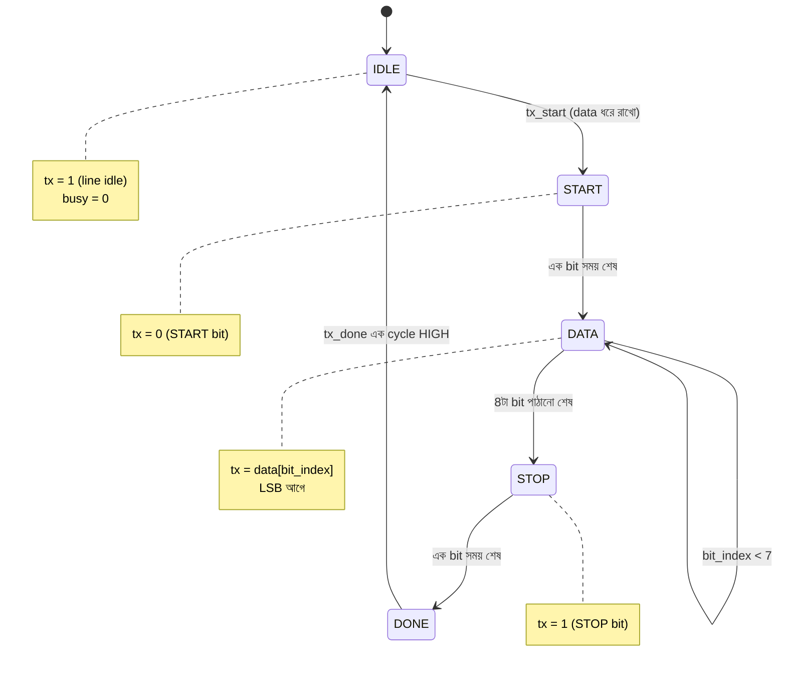

# 🎨 Chapter 11: Build Your Own FPGA Peripherals
## From Blinking LEDs to Real Systems - UART, VGA, and Beyond!

> **"LEDs were just the start. Now build REAL peripherals. Time to go PRO!"**
>
> **"LED শুধু শুরু ছিল। এখন REAL peripherals বানাও। PRO হওয়ার সময়!"**

---

## 🎯 এই Chapter এ তুমি বানাবে:

```
✅ UART Communication - serial terminal
✅ VGA Output - graphics on monitor
✅ PWM Generator - motor/LED control
✅ SPI Interface - talk to sensors
✅ I2C Controller - multiple devices
✅ Button Debouncing - proper input
✅ Seven-Segment Display - number display
✅ তোমার processor এর complete I/O system! 🎉
```

**Time Required:** 2 weeks (4-5 hours/day)  
**Hardware:** Tang Nano 9K, Optional: VGA cable, USB-UART, sensors

---

গত chapter এ তুমি LED জ্বালিয়েছো, button পড়েছো — FPGA তোমার কথা শুনেছে। কিন্তু একটা সত্যিকারের system শুধু আলো জ্বালায় না; সে বাইরের দুনিয়ার সাথে **কথা বলে**। তোমার PC কে data পাঠায়, sensor থেকে temperature পড়ে, monitor এ ছবি আঁকে, motor এর গতি নিয়ন্ত্রণ করে।

এই chapter টা ঠিক সেই জায়গা — যেখানে তোমার FPGA একটা নিঃসঙ্গ chip থেকে একটা **communicating system** হয়ে ওঠে। আর মজার ব্যাপারটা হলো: প্রতিটা peripheral আসলে কয়েকটা সহজ idea-র উপর দাঁড়িয়ে — timing, shift register, আর state machine। এই তিনটে জিনিস একবার বুঝে গেলে UART, SPI, I2C, VGA — সব একই গল্পের ভিন্ন ভিন্ন রূপ মনে হবে। চলো শুরু করি।

---

## 🚀 Quick Win - 1 ঘণ্টায় UART Terminal!

### UART জিনিসটা আসলে কী?

দুটো chip কে কথা বলতে হলে সবচেয়ে কম তার লাগে কোন উপায়ে? উত্তর হলো — একটা তার দিয়ে, একটা একটা করে bit পাঠিয়ে। এটাই **serial communication**, আর UART হলো এর সবচেয়ে জনপ্রিয় রূপ।

```
UART = Universal Asynchronous Receiver/Transmitter
- Serial communication protocol
- One wire TX (transmit)
- One wire RX (receive)
- Common baud rates: 9600, 115200 bps

Uses:
✅ Debug output
✅ Sensor data
✅ Command interface
✅ PC communication
```

নামের মধ্যেই পুরো গল্পটা লুকিয়ে আছে। **Asynchronous** শব্দটা সবচেয়ে গুরুত্বপূর্ণ — মানে দুই chip এর মধ্যে কোনো আলাদা clock তার নেই। তাহলে receiver জানবে কীভাবে কখন bit পড়তে হবে? এখানেই UART এর সুন্দর কৌশল: পাঠানোর **আগে দুজনে একই গতিতে (baud rate) রাজি হয়ে থাকে**। দুজনের ঘড়ি আলাদা, কিন্তু গতি এক। ঠিক যেন দুজন drummer আলাদা ঘরে বসে, কিন্তু আগে থেকে ঠিক করে রেখেছে — "প্রতি সেকেন্ডে ঠিক ১১৫২০০ বার beat"। তাই একজন বাজালে, অন্যজন না দেখেও তাল মিলিয়ে নিতে পারে।

একটা analogy দিই — UART হলো ওয়াকিটকির মতো, কিন্তু দুটো আলাদা চ্যানেলে (TX আর RX) যাতে দুজন একসাথে কথা বলতে পারে (full-duplex)। আর "baud rate" হলো কথা বলার গতি; দুজনকে একই গতিতে কথা বলতেই হবে, নাহলে একজন আরেকজনের কথা জগাখিচুড়ি শুনবে।

**Asynchronous serial-এর frame কেমন দেখতে?** Idle অবস্থায় line টা HIGH (1) থাকে। তারপর একটা START bit (0) দিয়ে receiver কে জানানো হয় "সাবধান, data আসছে", এরপর 8টা data bit (LSB আগে), শেষে একটা STOP bit (1)। নিচের ছবিটা মনে গেঁথে নাও — এই chapter এর প্রায় সব UART code আসলে এই frame টাই বানায় বা পড়ে:

```
        ┌─START─┬─D0─┬─D1─┬─D2─┬─D3─┬─D4─┬─D5─┬─D6─┬─D7─┬─STOP─
 idle   │       │    │    │    │    │    │    │    │    │      idle
 ───1───┘   0   │ b0 │ b1 │ b2 │ b3 │ b4 │ b5 │ b6 │ b7 │  1   ───1───
        └───────┴────┴────┴────┴────┴────┴────┴────┴────┘
         ↑                                              ↑
   line টানা HIGH থেকে                            আবার HIGH-এ ফিরে যায়
   একবার LOW (0) হওয়া =                         (STOP bit) → পরের byte
   "byte শুরু হচ্ছে"                              এর জন্য তৈরি
   প্রতিটা ঘর = এক bit সময় = (1 / baud rate) সেকেন্ড
```

খেয়াল করো — পুরো synchronization টা ঘটে ওই একটামাত্র START bit (1→0 transition) থেকে। ওটাই receiver এর "এখান থেকে গোনা শুরু" সংকেত। তারপর receiver শুধু baud rate ব্যবহার করে গুনে গুনে প্রতিটা bit এর মাঝখানে গিয়ে value টা পড়ে নেয়।

### Simple UART TX:

```verilog
module uart_tx #(
    parameter CLK_FREQ = 27_000_000,  // 27 MHz
    parameter BAUD_RATE = 9600
)(
    input wire clk,
    input wire [7:0] data,
    input wire send,
    output reg tx,
    output reg busy
);
    localparam CYCLES_PER_BIT = CLK_FREQ / BAUD_RATE;
    
    reg [15:0] counter;
    reg [3:0] bit_index;
    reg [9:0] tx_data;  // Start + 8 data + Stop
    
    localparam IDLE  = 2'b00;
    localparam START = 2'b01;
    localparam SEND  = 2'b10;
    localparam STOP  = 2'b11;
    reg [1:0] state;
    
    always @(posedge clk) begin
        case (state)
            IDLE: begin
                tx <= 1;
                busy <= 0;
                counter <= 0;
                bit_index <= 0;
                
                if (send) begin
                    tx_data <= {1'b1, data, 1'b0}; // Stop, data, start
                    state <= START;
                    busy <= 1;
                end
            end
            
            START: begin
                tx <= tx_data[0];
                state <= SEND;
            end
            
            SEND: begin
                if (counter < CYCLES_PER_BIT - 1) begin
                    counter <= counter + 1;
                end else begin
                    counter <= 0;
                    bit_index <= bit_index + 1;
                    tx_data <= {1'b1, tx_data[9:1]};
                    
                    if (bit_index == 9) begin
                        state <= IDLE;
                    end
                end
            end
        endcase
    end
endmodule
```

🎉 **First serial communication! Send text to PC!**

**এই code টা কী করছে, একটু ভেঙে দেখি।** পুরো ব্যাপারটা একটা ছোট্ট state machine — চারটে অবস্থা: `IDLE`, `START`, `SEND`, `STOP`। চলো প্রতিটা অংশের পেছনের যুক্তি বুঝি:

- **`CYCLES_PER_BIT = CLK_FREQ / BAUD_RATE`** — এটাই পুরো UART এর হৃদয়। তোমার clock চলছে 27 MHz এ, কিন্তু একটা bit থাকতে হবে অনেক ধীরে (9600 baud মানে প্রতি bit ≈ 104 মাইক্রোসেকেন্ড)। তাই প্রতি bit এ কতগুলো clock cycle অপেক্ষা করতে হবে? `27,000,000 / 9600 = 2812` cycle। অর্থাৎ FPGA তার দ্রুত ঘড়ির ২৮১২টা টিক গুনে তবেই একটা bit এগোয়। এই counting-ই UART কে "ধীর" করে receiver এর তালে মেলায়।

- **`tx_data <= {1'b1, data, 1'b0}`** — এখানে তোমার 8-bit data টাকে একটা ১০-bit frame এ মুড়ে ফেলা হচ্ছে: নিচে START bit (0), উপরে STOP bit (1)। কেন এই ক্রম? কারণ পরে আমরা `tx_data[0]` থেকে একটা একটা করে bit বের করব — তাই যেটা আগে যাবে (START), সেটা থাকবে সবচেয়ে নিচের bit এ।

- **shift register এর চাল** — `SEND` state এ প্রতিবার এক bit সময় শেষ হলে `tx_data <= {1'b1, tx_data[9:1]}` চলে। এটা পুরো register টাকে একঘর ডানে ঠেলে দেয়, আর উপর থেকে 1 (idle/stop মান) ঢুকিয়ে দেয়। ফলে `tx_data[0]` সবসময় পরের পাঠানো bit ধরে রাখে। shift register হলো serial সব protocol-এর সবচেয়ে কাজের যন্ত্র — parallel data কে এক-এক করে তারে বের করে দেয়, ঠিক যেন একটা PEZ ক্যান্ডির বাক্স থেকে একটা একটা lozenge বেরোয়।

> 💡 **ছোট লক্ষ্যণীয় ব্যাপার:** এই Quick-Win version টা সহজ রাখার জন্য `START` state এ counter দিয়ে অপেক্ষা করে না (তাই START bit টা পরের গুনতির সাথে মিশে যায়) — তুমি কেবল ধারণাটা ধরবে বলে এটা ইচ্ছাকৃত সরল। নিচের "Complete Implementation" version এ প্রতিটা state ঠিকঠাক `CLKS_PER_BIT` গোনে, যেটা আসল hardware এ চালানোর উপযোগী। তাই concept বুঝতে এটা, আর board এ চালাতে নিচেরটা ব্যবহার করো।

---

## ১১.১ UART Communication - Complete Implementation

Quick Win এ তুমি ধারণাটা পেলে। এবার production-grade version — যেখানে প্রতিটা bit এর timing নিখুঁত, reset আছে, আর `tx_done`/`tx_busy` সংকেত দিয়ে বাকি system জানতে পারে কখন পাঠানো শেষ। এই দুটো module (TX আর RX) মিলেই তোমার সম্পূর্ণ serial link।

### UART TX (Transmitter):

```verilog
// Complete UART transmitter with FIFO
module uart_tx_complete #(
    parameter CLK_FREQ = 27_000_000,
    parameter BAUD_RATE = 115200
)(
    input wire clk,
    input wire reset,
    input wire [7:0] tx_data,
    input wire tx_start,
    output reg tx,
    output wire tx_busy,
    output wire tx_done
);
    localparam CLKS_PER_BIT = CLK_FREQ / BAUD_RATE;
    
    localparam IDLE  = 3'd0;
    localparam START = 3'd1;
    localparam DATA  = 3'd2;
    localparam STOP  = 3'd3;
    localparam DONE  = 3'd4;
    
    reg [2:0] state;
    reg [15:0] clk_count;
    reg [2:0] bit_index;
    reg [7:0] tx_data_reg;
    reg tx_done_reg;
    
    always @(posedge clk or posedge reset) begin
        if (reset) begin
            state <= IDLE;
            tx <= 1;
            clk_count <= 0;
            bit_index <= 0;
            tx_done_reg <= 0;
        end else begin
            case (state)
                IDLE: begin
                    tx <= 1;
                    clk_count <= 0;
                    bit_index <= 0;
                    tx_done_reg <= 0;
                    
                    if (tx_start) begin
                        tx_data_reg <= tx_data;
                        state <= START;
                    end
                end
                
                START: begin
                    tx <= 0;  // Start bit
                    
                    if (clk_count < CLKS_PER_BIT - 1) begin
                        clk_count <= clk_count + 1;
                    end else begin
                        clk_count <= 0;
                        state <= DATA;
                    end
                end
                
                DATA: begin
                    tx <= tx_data_reg[bit_index];
                    
                    if (clk_count < CLKS_PER_BIT - 1) begin
                        clk_count <= clk_count + 1;
                    end else begin
                        clk_count <= 0;
                        
                        if (bit_index < 7) begin
                            bit_index <= bit_index + 1;
                        end else begin
                            bit_index <= 0;
                            state <= STOP;
                        end
                    end
                end
                
                STOP: begin
                    tx <= 1;  // Stop bit
                    
                    if (clk_count < CLKS_PER_BIT - 1) begin
                        clk_count <= clk_count + 1;
                    end else begin
                        clk_count <= 0;
                        tx_done_reg <= 1;
                        state <= DONE;
                    end
                end
                
                DONE: begin
                    tx_done_reg <= 0;
                    state <= IDLE;
                end
            endcase
        end
    end
    
    assign tx_busy = (state != IDLE);
    assign tx_done = tx_done_reg;
endmodule
```

**TX এর state machine টা ছবিতে দেখলে গল্পটা পরিষ্কার হয়।** module টা পাঁচটা অবস্থার মধ্যে ঘুরপাক খায়, আর প্রতিটা অবস্থায় `clk_count` দিয়ে এক bit সময় (`CLKS_PER_BIT` cycle) পুরো গুনে তবে পরের ধাপে যায়:



লক্ষ্য করো `DATA` state এর self-loop টা — ওখানে module টা আটটা bit পাঠানো পর্যন্ত নিজের কাছেই ফিরে আসে, প্রতিবার `bit_index` এক বাড়িয়ে আর প্রতিটা bit এর জন্য পুরো `CLKS_PER_BIT` cycle গুনে। আর `DONE` state টা মাত্র এক cycle এর জন্য `tx_done` কে HIGH করে দেয়, যাতে বাইরের system একটা পরিষ্কার "পাঠানো শেষ" pulse পায় — এটাকে বলে handshake। `115200` baud বেছে নেওয়ায় এবার এক byte পাঠাতে লাগে মাত্র ~87 মাইক্রোসেকেন্ড, 9600 এর চেয়ে ১২ গুণ দ্রুত।

### UART RX (Receiver):

TX বানানো সহজ ছিল — আমরাই সব নিয়ন্ত্রণ করছি। কিন্তু RX এর কাজটা আসল চ্যালেঞ্জ: একটা তার দেখে বুঝতে হবে কখন data আসছে, আর কোনো shared clock ছাড়াই প্রতিটা bit ঠিক জায়গায় পড়তে হবে। এর চাবিকাঠি একটাই কৌশল — **bit এর ঠিক মাঝখানে গিয়ে value পড়া**।

```verilog
module uart_rx #(
    parameter CLK_FREQ = 27_000_000,
    parameter BAUD_RATE = 115200
)(
    input wire clk,
    input wire reset,
    input wire rx,
    output reg [7:0] rx_data,
    output reg rx_valid
);
    localparam CLKS_PER_BIT = CLK_FREQ / BAUD_RATE;
    localparam CLKS_PER_HALF_BIT = CLKS_PER_BIT / 2;
    
    localparam IDLE  = 3'd0;
    localparam START = 3'd1;
    localparam DATA  = 3'd2;
    localparam STOP  = 3'd3;
    
    reg [2:0] state;
    reg [15:0] clk_count;
    reg [2:0] bit_index;
    reg [7:0] rx_data_reg;
    
    always @(posedge clk or posedge reset) begin
        if (reset) begin
            state <= IDLE;
            clk_count <= 0;
            bit_index <= 0;
            rx_valid <= 0;
        end else begin
            case (state)
                IDLE: begin
                    clk_count <= 0;
                    bit_index <= 0;
                    rx_valid <= 0;
                    
                    if (rx == 0) begin  // Start bit detected
                        state <= START;
                    end
                end
                
                START: begin
                    if (clk_count < CLKS_PER_HALF_BIT) begin
                        clk_count <= clk_count + 1;
                    end else begin
                        if (rx == 0) begin  // Verify start bit
                            clk_count <= 0;
                            state <= DATA;
                        end else begin
                            state <= IDLE;  // False start
                        end
                    end
                end
                
                DATA: begin
                    if (clk_count < CLKS_PER_BIT - 1) begin
                        clk_count <= clk_count + 1;
                    end else begin
                        clk_count <= 0;
                        rx_data_reg[bit_index] <= rx;
                        
                        if (bit_index < 7) begin
                            bit_index <= bit_index + 1;
                        end else begin
                            bit_index <= 0;
                            state <= STOP;
                        end
                    end
                end
                
                STOP: begin
                    if (clk_count < CLKS_PER_BIT - 1) begin
                        clk_count <= clk_count + 1;
                    end else begin
                        clk_count <= 0;
                        rx_data <= rx_data_reg;
                        rx_valid <= 1;
                        state <= IDLE;
                    end
                end
            endcase
        end
    end
endmodule
```

### UART Echo Test:

```verilog
module uart_echo(
    input wire clk,
    input wire reset,
    input wire rx,
    output wire tx
);
    wire [7:0] rx_data;
    wire rx_valid;
    wire tx_busy;
    
    uart_rx #(
        .CLK_FREQ(27_000_000),
        .BAUD_RATE(115200)
    ) rx_inst (
        .clk(clk),
        .reset(reset),
        .rx(rx),
        .rx_data(rx_data),
        .rx_valid(rx_valid)
    );
    
    uart_tx_complete #(
        .CLK_FREQ(27_000_000),
        .BAUD_RATE(115200)
    ) tx_inst (
        .clk(clk),
        .reset(reset),
        .tx_data(rx_data),
        .tx_start(rx_valid && !tx_busy),
        .tx(tx),
        .tx_busy(tx_busy)
    );
endmodule
```

### Testing UART:

```
Hardware needed:
- USB-UART adapter (CP2102, FT232, etc.) - $2-5
- 3 wires (TX, RX, GND)

Connections:
Tang Nano TX → UART RX
Tang Nano RX → UART TX
Tang Nano GND → UART GND

Software:
- Windows: PuTTY, RealTerm
- Linux: minicom, screen
- Mac: screen, CoolTerm

Settings:
Baud: 115200
Data: 8 bits
Parity: None
Stop: 1 bit
Flow: None

Test:
1. Open terminal
2. Type characters
3. See them echo back!
```

---

## ১১.২ VGA Output - Display Graphics!

### VGA Basics:

```
VGA Signal:
- HSYNC: Horizontal sync
- VSYNC: Vertical sync
- R, G, B: Color (analog)

Standard resolutions:
640×480 @ 60Hz (most common)
800×600 @ 60Hz
1024×768 @ 60Hz

We'll use: 640×480 @ 60Hz
Pixel clock: 25.175 MHz
```

### VGA Timing (640×480):

```
Horizontal timing:
Total: 800 pixels
- Visible: 640 pixels
- Front porch: 16 pixels
- Sync pulse: 96 pixels
- Back porch: 48 pixels

Vertical timing:
Total: 525 lines
- Visible: 480 lines
- Front porch: 10 lines
- Sync pulse: 2 lines
- Back porch: 33 lines

Frequencies:
Pixel clock: 25.175 MHz
H-sync: 31.469 kHz
V-sync: 59.94 Hz
```

### VGA Clock Generator:

```verilog
// Generate 25 MHz from 27 MHz using PLL
module vga_pll(
    input wire clk_in,      // 27 MHz
    output wire clk_out,    // 25 MHz (approx)
    output wire locked
);
    // Tang Nano 9K has built-in PLL
    // Use Gowin IP to generate 25 MHz
    // Tools → IP Core Generator → PLL
    
    // For now, we'll use clock divider (simple but not accurate)
    reg clk_div;
    reg [1:0] counter;
    
    always @(posedge clk_in) begin
        counter <= counter + 1;
        if (counter == 0)
            clk_div <= ~clk_div;
    end
    
    assign clk_out = clk_div;  // 27 MHz / 8 = 3.375 MHz (NOT VGA-ready; use real PLL for 25.175 MHz)
    assign locked = 1;
endmodule
```

### VGA Sync Generator:

```verilog
module vga_sync(
    input wire clk,         // 25 MHz pixel clock
    input wire reset,
    output reg hsync,
    output reg vsync,
    output reg video_on,
    output reg [9:0] x,
    output reg [9:0] y
);
    // Horizontal timing (800 total)
    localparam H_VISIBLE = 640;
    localparam H_FRONT   = 16;
    localparam H_SYNC    = 96;
    localparam H_BACK    = 48;
    localparam H_TOTAL   = H_VISIBLE + H_FRONT + H_SYNC + H_BACK;
    
    // Vertical timing (525 total)
    localparam V_VISIBLE = 480;
    localparam V_FRONT   = 10;
    localparam V_SYNC    = 2;
    localparam V_BACK    = 33;
    localparam V_TOTAL   = V_VISIBLE + V_FRONT + V_SYNC + V_BACK;
    
    reg [9:0] h_count;
    reg [9:0] v_count;
    
    // Horizontal counter
    always @(posedge clk or posedge reset) begin
        if (reset)
            h_count <= 0;
        else if (h_count == H_TOTAL - 1)
            h_count <= 0;
        else
            h_count <= h_count + 1;
    end
    
    // Vertical counter
    always @(posedge clk or posedge reset) begin
        if (reset)
            v_count <= 0;
        else if (h_count == H_TOTAL - 1) begin
            if (v_count == V_TOTAL - 1)
                v_count <= 0;
            else
                v_count <= v_count + 1;
        end
    end
    
    // Generate sync signals
    always @(posedge clk) begin
        hsync <= (h_count >= H_VISIBLE + H_FRONT) && 
                 (h_count < H_VISIBLE + H_FRONT + H_SYNC);
        
        vsync <= (v_count >= V_VISIBLE + V_FRONT) && 
                 (v_count < V_VISIBLE + V_FRONT + V_SYNC);
    end
    
    // Video enable
    always @(posedge clk) begin
        video_on <= (h_count < H_VISIBLE) && (v_count < V_VISIBLE);
        x <= h_count;
        y <= v_count;
    end
endmodule
```

### Simple Pattern Generator:

```verilog
module vga_pattern(
    input wire clk,
    input wire reset,
    output wire hsync,
    output wire vsync,
    output wire [2:0] rgb
);
    wire video_on;
    wire [9:0] x, y;
    
    vga_sync sync(
        .clk(clk),
        .reset(reset),
        .hsync(hsync),
        .vsync(vsync),
        .video_on(video_on),
        .x(x),
        .y(y)
    );
    
    // Color patterns
    wire [2:0] color;
    
    // Vertical stripes
    assign color[2] = (x < 213) ? 1 : 0;  // Red
    assign color[1] = (x >= 213 && x < 426) ? 1 : 0;  // Green
    assign color[0] = (x >= 426) ? 1 : 0;  // Blue
    
    assign rgb = video_on ? color : 3'b000;
endmodule
```

### VGA Constraint File:

```tcl
// VGA pins on Tang Nano 9K
IO_LOC "hsync" 69;
IO_LOC "vsync" 70;
IO_LOC "rgb[0]" 71;  // Blue
IO_LOC "rgb[1]" 72;  // Green
IO_LOC "rgb[2]" 73;  // Red

IO_PORT "hsync" DRIVE=8;
IO_PORT "vsync" DRIVE=8;
IO_PORT "rgb[0]" DRIVE=8;
IO_PORT "rgb[1]" DRIVE=8;
IO_PORT "rgb[2]" DRIVE=8;
```

---

## ১১.৩ PWM Generation - Motor & LED Control

### What is PWM?

```
PWM = Pulse Width Modulation
- Digital signal with varying duty cycle
- Duty cycle = % of time HIGH
- Used for: Motor speed, LED brightness, power control

Example:
50% duty: ▀▀▀▀▄▄▄▄▀▀▀▀▄▄▄▄
25% duty: ▀▀▄▄▄▄▄▄▀▀▄▄▄▄▄▄
75% duty: ▀▀▀▀▀▀▄▄▀▀▀▀▀▀▄▄
```

### Simple PWM Module:

```verilog
module pwm #(
    parameter WIDTH = 8  // 8-bit resolution
)(
    input wire clk,
    input wire reset,
    input wire [WIDTH-1:0] duty,  // 0-255 for 8-bit
    output reg pwm_out
);
    reg [WIDTH-1:0] counter;
    
    always @(posedge clk or posedge reset) begin
        if (reset)
            counter <= 0;
        else
            counter <= counter + 1;
    end
    
    always @(posedge clk) begin
        pwm_out <= (counter < duty);
    end
endmodule
```

### LED Breathing Effect:

```verilog
module led_breathe(
    input wire clk,       // 27 MHz
    input wire reset,
    output wire led_pwm
);
    // Slow counter for breathing
    reg [24:0] slow_counter;
    reg [7:0] brightness;
    reg direction;  // 0=increasing, 1=decreasing
    
    always @(posedge clk or posedge reset) begin
        if (reset) begin
            slow_counter <= 0;
            brightness <= 0;
            direction <= 0;
        end else begin
            slow_counter <= slow_counter + 1;
            
            // Update brightness every ~100ms
            if (slow_counter == 0) begin
                if (direction == 0) begin
                    if (brightness == 255)
                        direction <= 1;
                    else
                        brightness <= brightness + 1;
                end else begin
                    if (brightness == 0)
                        direction <= 0;
                    else
                        brightness <= brightness - 1;
                end
            end
        end
    end
    
    // PWM generator
    pwm #(.WIDTH(8)) pwm_inst(
        .clk(clk),
        .reset(reset),
        .duty(brightness),
        .pwm_out(led_pwm)
    );
endmodule
```

### RGB LED Control:

```verilog
module rgb_led_pwm(
    input wire clk,
    input wire [7:0] red_duty,
    input wire [7:0] green_duty,
    input wire [7:0] blue_duty,
    output wire red_pwm,
    output wire green_pwm,
    output wire blue_pwm
);
    pwm #(.WIDTH(8)) red_pwm_inst(
        .clk(clk),
        .reset(1'b0),
        .duty(red_duty),
        .pwm_out(red_pwm)
    );
    
    pwm #(.WIDTH(8)) green_pwm_inst(
        .clk(clk),
        .reset(1'b0),
        .duty(green_duty),
        .pwm_out(green_pwm)
    );
    
    pwm #(.WIDTH(8)) blue_pwm_inst(
        .clk(clk),
        .reset(1'b0),
        .duty(blue_duty),
        .pwm_out(blue_pwm)
    );
endmodule
```

---

## ১১.৪ Button Debouncing - Proper Input Handling

### Why Debounce?

```
Button presses are noisy:
Physical: ▀▄▀▄▀▀▀▀▀▀▀▀▄▀▄▄▄
Desired:  ▄▄▄▄▀▀▀▀▀▀▀▀▀▄▄▄▄

Without debounce:
- Multiple false triggers
- Unreliable input
- Bad user experience

With debounce:
- Clean single trigger
- Reliable operation
- Professional behavior
```

### Debounce Module:

```verilog
module debounce #(
    parameter CLK_FREQ = 27_000_000,
    parameter DEBOUNCE_TIME_MS = 20  // 20ms debounce
)(
    input wire clk,
    input wire button_in,
    output reg button_out
);
    localparam COUNTER_MAX = CLK_FREQ / 1000 * DEBOUNCE_TIME_MS;
    
    reg [19:0] counter;
    reg button_sync_0, button_sync_1;
    
    // Synchronizer (avoid metastability)
    always @(posedge clk) begin
        button_sync_0 <= button_in;
        button_sync_1 <= button_sync_0;
    end
    
    // Debounce logic
    always @(posedge clk) begin
        if (button_out != button_sync_1) begin
            counter <= counter + 1;
            if (counter >= COUNTER_MAX) begin
                button_out <= button_sync_1;
                counter <= 0;
            end
        end else begin
            counter <= 0;
        end
    end
endmodule
```

### Edge Detector:

```verilog
module edge_detect(
    input wire clk,
    input wire signal_in,
    output wire rising_edge,
    output wire falling_edge
);
    reg signal_delayed;
    
    always @(posedge clk) begin
        signal_delayed <= signal_in;
    end
    
    assign rising_edge  = signal_in && !signal_delayed;
    assign falling_edge = !signal_in && signal_delayed;
endmodule
```

### Button Counter Example:

```verilog
module button_counter(
    input wire clk,
    input wire reset,
    input wire button,
    output reg [7:0] count,
    output wire [5:0] leds
);
    wire button_clean;
    wire button_pressed;
    
    // Debounce
    debounce #(
        .CLK_FREQ(27_000_000),
        .DEBOUNCE_TIME_MS(20)
    ) debounce_inst (
        .clk(clk),
        .button_in(button),
        .button_out(button_clean)
    );
    
    // Edge detect
    edge_detect edge_inst(
        .clk(clk),
        .signal_in(button_clean),
        .rising_edge(button_pressed),
        .falling_edge()
    );
    
    // Counter
    always @(posedge clk or posedge reset) begin
        if (reset)
            count <= 0;
        else if (button_pressed)
            count <= count + 1;
    end
    
    // Display count on LEDs
    assign leds = count[5:0];
endmodule
```

---

## ১১.৫ Seven-Segment Display

### 7-Segment Encoding:

```
Segment layout:
     aaa
    f   b
    f   b
     ggg
    e   c
    e   c
     ddd

Segment bits: {dp, g, f, e, d, c, b, a}
```

### BCD to 7-Segment Decoder:

```verilog
module bcd_to_7seg(
    input wire [3:0] bcd,       // 0-9
    output reg [7:0] segments   // {dp, g, f, e, d, c, b, a}
);
    always @(*) begin
        case (bcd)
            4'd0: segments = 8'b00111111;  // 0
            4'd1: segments = 8'b00000110;  // 1
            4'd2: segments = 8'b01011011;  // 2
            4'd3: segments = 8'b01001111;  // 3
            4'd4: segments = 8'b01100110;  // 4
            4'd5: segments = 8'b01101101;  // 5
            4'd6: segments = 8'b01111101;  // 6
            4'd7: segments = 8'b00000111;  // 7
            4'd8: segments = 8'b01111111;  // 8
            4'd9: segments = 8'b01101111;  // 9
            default: segments = 8'b00000000;
        endcase
    end
endmodule
```

### Multi-Digit Display (Multiplexed):

```verilog
module seven_seg_display(
    input wire clk,
    input wire [15:0] number,  // 4 digits (hex)
    output reg [3:0] digit_select,  // Which digit
    output wire [7:0] segments      // Segment data
);
    reg [1:0] current_digit;
    reg [15:0] counter;
    reg [3:0] current_bcd;
    
    // Multiplex timer (~1kHz per digit = ~250Hz refresh)
    always @(posedge clk) begin
        counter <= counter + 1;
        if (counter == 0) begin
            current_digit <= current_digit + 1;
        end
    end
    
    // Select current digit
    always @(*) begin
        case (current_digit)
            0: begin
                digit_select = 4'b1110;
                current_bcd = number[3:0];
            end
            1: begin
                digit_select = 4'b1101;
                current_bcd = number[7:4];
            end
            2: begin
                digit_select = 4'b1011;
                current_bcd = number[11:8];
            end
            3: begin
                digit_select = 4'b0111;
                current_bcd = number[15:12];
            end
        endcase
    end
    
    // Decode BCD to segments
    bcd_to_7seg decoder(
        .bcd(current_bcd),
        .segments(segments)
    );
endmodule
```

---

## ১১.৬ SPI Interface

### SPI Basics:

```
SPI = Serial Peripheral Interface
4 wires:
- SCLK: Clock (master generates)
- MOSI: Master Out, Slave In
- MISO: Master In, Slave Out
- CS: Chip Select (active low)

Modes (CPOL, CPHA):
Mode 0: CPOL=0, CPHA=0 (most common)
Mode 1: CPOL=0, CPHA=1
Mode 2: CPOL=1, CPHA=0
Mode 3: CPOL=1, CPHA=1
```

### SPI Master:

```verilog
module spi_master #(
    parameter CLK_DIV = 4  // SPI clock = sys_clk / (2*CLK_DIV)
)(
    input wire clk,
    input wire reset,
    input wire [7:0] tx_data,
    input wire start,
    output reg [7:0] rx_data,
    output reg busy,
    output reg sclk,
    output reg mosi,
    input wire miso,
    output reg cs
);
    reg [3:0] bit_counter;
    reg [7:0] tx_buffer;
    reg [7:0] rx_buffer;
    reg [7:0] clk_counter;
    
    localparam IDLE = 2'b00;
    localparam TRANSFER = 2'b01;
    localparam DONE = 2'b10;
    reg [1:0] state;
    
    always @(posedge clk or posedge reset) begin
        if (reset) begin
            state <= IDLE;
            cs <= 1;
            sclk <= 0;
            busy <= 0;
            bit_counter <= 0;
            clk_counter <= 0;
        end else begin
            case (state)
                IDLE: begin
                    cs <= 1;
                    sclk <= 0;
                    busy <= 0;
                    
                    if (start) begin
                        tx_buffer <= tx_data;
                        bit_counter <= 0;
                        clk_counter <= 0;
                        cs <= 0;
                        busy <= 1;
                        state <= TRANSFER;
                    end
                end
                
                TRANSFER: begin
                    clk_counter <= clk_counter + 1;
                    
                    if (clk_counter == CLK_DIV - 1) begin
                        sclk <= ~sclk;
                        clk_counter <= 0;
                        
                        if (sclk == 0) begin
                            // Rising edge - output data
                            mosi <= tx_buffer[7];
                        end else begin
                            // Falling edge - sample data
                            rx_buffer <= {rx_buffer[6:0], miso};
                            tx_buffer <= {tx_buffer[6:0], 1'b0};
                            bit_counter <= bit_counter + 1;
                            
                            if (bit_counter == 7) begin
                                state <= DONE;
                            end
                        end
                    end
                end
                
                DONE: begin
                    cs <= 1;
                    sclk <= 0;
                    rx_data <= rx_buffer;
                    state <= IDLE;
                end
            endcase
        end
    end
endmodule
```

---

## ১১.৭ I2C Interface

### I2C Basics:

```
I2C = Inter-Integrated Circuit
2 wires (both open-drain):
- SCL: Clock
- SDA: Data

Features:
- Multi-master capable
- Addressable devices (7-bit or 10-bit)
- Speeds: 100kHz (standard), 400kHz (fast)

Transaction:
START → ADDRESS → ACK → DATA → ACK → STOP
```

### I2C Master (Simplified):

```verilog
module i2c_master #(
    parameter CLK_FREQ = 27_000_000,
    parameter I2C_FREQ = 100_000
)(
    input wire clk,
    input wire reset,
    input wire [6:0] slave_addr,
    input wire [7:0] data,
    input wire start,
    input wire rw,  // 0=write, 1=read
    output reg [7:0] read_data,
    output reg busy,
    output reg ack_error,
    inout wire sda,
    inout wire scl
);
    localparam DIVIDER = CLK_FREQ / (4 * I2C_FREQ);
    
    // State machine
    localparam IDLE = 0;
    localparam START_COND = 1;
    localparam ADDRESS = 2;
    localparam ACK_ADDR = 3;
    localparam DATA_TX = 4;
    localparam ACK_DATA = 5;
    localparam STOP_COND = 6;
    
    reg [3:0] state;
    reg [15:0] clk_div;
    reg [3:0] bit_count;
    reg [7:0] shift_reg;
    reg sda_out, scl_out;
    reg sda_oe, scl_oe;
    
    // Open-drain outputs
    assign sda = sda_oe ? 1'b0 : 1'bz;
    assign scl = scl_oe ? 1'b0 : 1'bz;
    
    always @(posedge clk or posedge reset) begin
        if (reset) begin
            state <= IDLE;
            busy <= 0;
            sda_oe <= 0;
            scl_oe <= 0;
        end else begin
            // State machine implementation
            // (Simplified - full I2C needs careful timing)
            case (state)
                IDLE: begin
                    if (start) begin
                        busy <= 1;
                        state <= START_COND;
                        shift_reg <= {slave_addr, rw};
                        bit_count <= 8;
                    end
                end
                // ... other states
            endcase
        end
    end
endmodule
```

---

## ১১.৮ Complete Project - Multi-Function System

### System Architecture:

```verilog
module multi_function_system(
    input wire clk,         // 27 MHz
    input wire reset,
    input wire [1:0] buttons,
    input wire uart_rx,
    output wire uart_tx,
    output wire [5:0] leds,
    output wire hsync,
    output wire vsync,
    output wire [2:0] vga_rgb
);
    // Mode selection
    reg [2:0] mode;
    
    always @(posedge clk or posedge reset) begin
        if (reset)
            mode <= 0;
        else if (button_press[0])
            mode <= mode + 1;
    end
    
    // Button debouncing
    wire [1:0] buttons_clean;
    wire [1:0] button_press;
    
    debounce #(.DEBOUNCE_TIME_MS(20)) deb0(
        .clk(clk),
        .button_in(buttons[0]),
        .button_out(buttons_clean[0])
    );
    
    edge_detect edge0(
        .clk(clk),
        .signal_in(buttons_clean[0]),
        .rising_edge(button_press[0]),
        .falling_edge()
    );
    
    // UART echo
    wire [7:0] uart_rx_data;
    wire uart_rx_valid;
    wire uart_tx_busy;
    
    uart_rx uart_rx_inst(
        .clk(clk),
        .reset(reset),
        .rx(uart_rx),
        .rx_data(uart_rx_data),
        .rx_valid(uart_rx_valid)
    );
    
    uart_tx_complete uart_tx_inst(
        .clk(clk),
        .reset(reset),
        .tx_data(uart_rx_data),
        .tx_start(uart_rx_valid && !uart_tx_busy),
        .tx(uart_tx),
        .tx_busy(uart_tx_busy)
    );
    
    // VGA output
    vga_pattern vga_inst(
        .clk(clk),
        .reset(reset),
        .hsync(hsync),
        .vsync(vsync),
        .rgb(vga_rgb)
    );
    
    // LED control based on mode
    assign leds = mode;
endmodule
```

---

## ১১.৯ Your 2-Week Build Plan

### Week 1: Communication

**Day 1-2: UART**
```
□ Implement UART TX
□ Implement UART RX
□ Test echo
□ Send debug messages
```

**Day 3-4: Button Debouncing**
```
□ Debounce module
□ Edge detection
□ Button counter
□ Test reliability
```

**Day 5-7: PWM**
```
□ Basic PWM
□ LED breathing
□ RGB LED control
□ Motor control (if available)
```

### Week 2: Display & Integration

**Day 8-10: VGA**
```
□ VGA sync generator
□ Pattern generation
□ Simple graphics
□ Test on monitor
```

**Day 11-12: Seven-Segment**
```
□ BCD decoder
□ Multi-digit display
□ Counter display
□ Integration
```

**Day 13-14: Final Project**
```
□ Multi-function system
□ All peripherals integrated
□ User interface
□ Documentation
```

---

## ১১.১০ Chapter 11 Mission Complete!

### তুমি এখন পারো:

```
✅ UART communication (TX/RX)
✅ VGA graphics output
✅ PWM generation
✅ Button debouncing
✅ Seven-segment display
✅ SPI interface basics
✅ I2C interface basics
✅ Complete peripheral systems
✅ Multi-function FPGA designs! 🎉
```

### তুমি বানিয়েছো:
```
✅ Serial terminal
✅ VGA display
✅ LED effects
✅ Input handling
✅ Display drivers
✅ Complete I/O system!
✅ Professional peripherals! 🔧
```

### Stats:
```
Peripherals implemented: 7+
Protocols mastered: 4
Lines of Verilog: 1000+
Real hardware systems: Multiple
Level: FPGA Systems Engineer! 🏆
```

### Next Level Unlocked:
```
→ Chapter 12: Processor Architecture
   তুমি শিখবে: CPU design basics
   ISA, datapath, control unit!
   
   From peripherals → PROCESSOR! 🚀
```

---

## 🎯 Final Project

### Project: Complete FPGA System

**Requirements:**
```
Build integrated system:
✅ UART command interface
✅ VGA status display
✅ PWM outputs (2 channels)
✅ Button inputs (debounced)
✅ LED indicators
✅ Seven-segment display
✅ Complete documentation

Features:
- Command parser (UART)
- Interactive controls
- Visual feedback
- Professional operation
```

---

## 🏆 Achievement Unlocked!

```
Level 11: ✅ COMPLETE - Systems Engineer!
Progress: [█████████████████████████████████] 55%

XP Gained: +4000
Skills: Peripherals, Protocols, System Integration

Badges Earned:
🥉 UART Master
🥈 VGA Graphics
🥇 PWM Expert
🏅 Protocol Implementer
🎖️ System Integrator
🏆 Professional FPGA Engineer

FPGA PART COMPLETE! 🎊

Next: Chapter 12 - Build Your Own Processor!
      Design your own CPU! 🖥️
```

---

**[⬅️ Previous: Chapter 10](Chapter_10_FPGA_Development.md)** | **[➡️ Next: Chapter 12](Chapter_12_Processor_Architecture.md)**

---

<div align="center">

**"You mastered FPGA systems. Now build your own PROCESSOR!"**

**"তুমি FPGA systems master করেছো। এবার নিজের PROCESSOR বানাও!"**

Made with ❤️ for builders | বানানোর জন্য ভালোবাসা দিয়ে তৈরি

</div>
