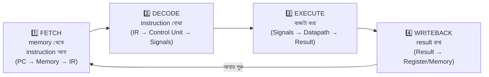
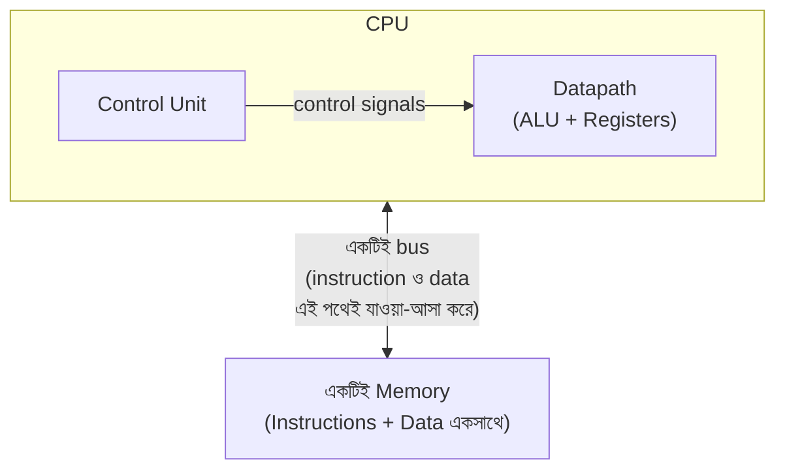
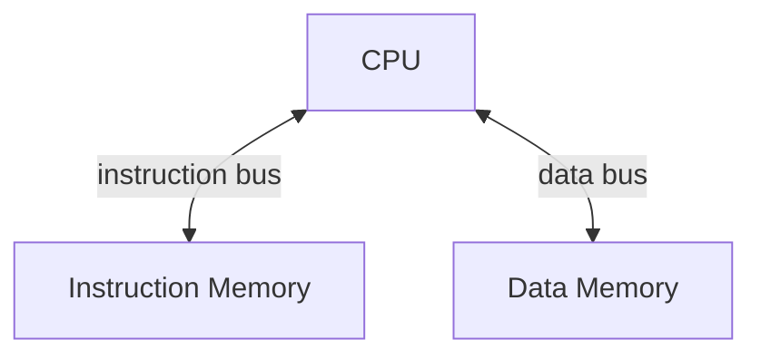
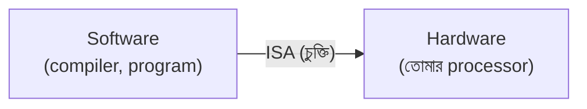
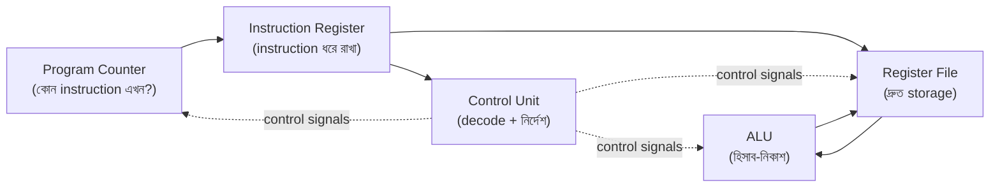

# 🖥️ Chapter 12: Build Your Own Processor - Architecture Basics
## From Circuits to CPU - Understanding How Processors Work!

> **"Gates were building blocks. Now build the COMPUTER. Time to create intelligence!"**
>
> **"Gates ছিল building blocks। এখন COMPUTER বানাও। Intelligence তৈরি করো!"**

---

## 🎯 এই Chapter এ তুমি শিখবে:

```
✅ What is a Processor? - CPU fundamentals
✅ Instruction Set Architecture (ISA) - the interface
✅ CPU Components - datapath & control
✅ Instruction Execution - fetch-decode-execute
✅ Simple CPU Design - 8-bit processor
✅ Register File - fast storage
✅ ALU Integration - arithmetic unit
✅ তোমার নিজের processor এর architecture! 🎉
```

**Time Required:** 1 week (5-6 hours/day)  
**Prerequisites:** Chapters 1-11 complete

---

## 🚀 Quick Understanding - ৫ মিনিটে Processor Basics!

### Processor আসলে কী?

এতদিন তুমি gate, adder, register, FSM — এগুলো আলাদা আলাদা বানিয়েছো। একটা **processor** হলো এই সবকিছুকে এমনভাবে জুড়ে দেওয়া যেন তারা একসাথে মিলে **memory-তে রাখা instruction পড়ে, একটার পর একটা চালিয়ে যায়**। অর্থাৎ processor কোনো জাদুর বাক্স নয় — তুমি এতদিন যা শিখেছো, তারই একটা সাজানো-গোছানো রূপ।

একটা CPU কে মূলত তিন ভাগে ভাবলে সবচেয়ে সহজ হয়:

- **Datapath** — যেখানে আসল কাজটা হয়। এখানে থাকে register (data রাখার জায়গা), ALU (যোগ-বিয়োগ-AND-OR করার unit), আর multiplexer (কোন data কোথায় যাবে সেই রাস্তা ঠিক করার switch)। Datapath হলো processor-এর হাত-পা।
- **Control Unit** — যে ঠিক করে দেয় কখন কী হবে। সে instruction পড়ে decode করে, তারপর datapath-এর প্রতিটা অংশকে control signal পাঠায়: "এখন ALU যোগ করবে", "এখন এই register-এ লিখবে"। Control unit হলো processor-এর মস্তিষ্ক।
- **Memory Interface** — বাইরের memory-র সাথে কথা বলার জানালা। এর মধ্য দিয়ে instruction আসে, আবার data load/store হয়।

একটা **কারখানার** সাথে মিলিয়ে দেখো, পুরো ছবিটা পরিষ্কার হয়ে যাবে:

| কারখানা | Processor | কাজ |
|---|---|---|
| শ্রমিক ও মেশিন | Datapath (ALU, register) | আসল উৎপাদন |
| ম্যানেজার ও রুটিন | Control Unit | কে কখন কী করবে ঠিক করা |
| গুদাম | Memory | কাঁচামাল ও পণ্য জমা রাখা |

ম্যানেজার নিজে হাতে কিছু বানায় না, কিন্তু তার নির্দেশ ছাড়া শ্রমিকেরাও জানে না কী করতে হবে — control unit আর datapath-এর সম্পর্কটা ঠিক এমনই।

### Instruction Execution Cycle:

Processor কখনো থামে না। সে একটা ছোট্ট চক্র (cycle) বারবার ঘোরাতে থাকে — প্রতিটা চক্রে একটা করে instruction-কে জন্ম থেকে মৃত্যু পর্যন্ত নিয়ে যায়। চারটে মূল ধাপ:



লক্ষ করো — শেষ ধাপের পর তীরটা আবার প্রথম ধাপে ফিরে গেছে। এই ঘুরতে থাকা চক্রই হলো একটা জীবন্ত processor-এর হৃৎস্পন্দন। তোমার ল্যাপটপ, ফোন, এমনকি মাইক্রোওয়েভ ওভেনের ভেতরের chip — সবাই এই একই চক্র সেকেন্ডে কোটি কোটি বার ঘোরাচ্ছে। ছোট হোক বা বড়, প্রতিটা CPU-র গল্প এখান থেকেই শুরু।

🎉 **ব্যস, এটুকুতেই তুমি processor-এর মূল ধারণাটা ধরে ফেলেছো!**

---

## ১২.১ Processor Architecture Overview

Processor বানানোর আগে একটা বড় সিদ্ধান্ত নিতে হয়: **instruction আর data একই memory-তে রাখবে, নাকি আলাদা?** শুনতে সামান্য মনে হলেও এই একটা সিদ্ধান্তের উপরেই পুরো computer-এর গঠন দাঁড়িয়ে আছে। দুটো ঐতিহাসিক উত্তর আছে — Von Neumann আর Harvard। চলো দুটোই বুঝে নিই।

### Von Neumann Architecture:

১৯৪৫ সালে গণিতবিদ John von Neumann একটা যুগান্তকারী ধারণা দেন: program (অর্থাৎ instruction) আর data — দুটোকেই **একই memory-তে, একসাথে** রাখা যায়। এর আগে computer-কে নতুন কাজ করাতে হলে তার ভেতরের তার (wire) খুলে নতুন করে জুড়তে হতো। von Neumann বললেন, "তারের বদলে memory-তে নতুন instruction লিখে দাও — হার্ডওয়্যার একই থাকবে, শুধু program পাল্টে গেলেই computer নতুন কাজ করবে।" এই **stored-program** ধারণাটাই আধুনিক computer-এর ভিত্তি।



এর মূল ভাবনাগুলো:

- **Stored program** — program memory-তেই থাকে, তাই software পাল্টে computer-কে নতুন কাজ করানো যায়।
- **একই memory-তে code আর data** — সরল ডিজাইন, কম তার, কম খরচ।
- **Sequential execution** — instruction গুলো একটার পর একটা চলে, আমাদের চেনা fetch-decode-execute চক্র মেনে।

তবে একটা দুর্বলতাও আছে: যেহেতু instruction আর data একই রাস্তা (bus) দিয়ে যাতায়াত করে, processor একই সময়ে instruction **আর** data — দুটো আনতে পারে না। একটা আনতে গেলে অন্যটাকে দাঁড়িয়ে থাকতে হয়। এই সীমাবদ্ধতাটার নাম **"von Neumann bottleneck"**, আর এখান থেকেই পরের ধারণাটা জন্ম নেয়।

### Harvard Architecture:

Harvard architecture এই bottleneck-টাকেই সমাধান করে — খুব সোজা উপায়ে: **instruction আর data-র জন্য আলাদা আলাদা memory আর আলাদা bus** বানিয়ে দাও। তাহলে processor এক হাতে instruction আনতে পারে, একই মুহূর্তে অন্য হাতে data — কোনো ঠেলাঠেলি নেই।



এর সুবিধাগুলো:

- **একই সময়ে instruction আর data আনা যায়** — দুটো আলাদা পথ থাকায় কোনো conflict নেই।
- **বেশি bandwidth** — প্রতি cycle-এ বেশি কাজ এগোয়।
- তাই DSP (Digital Signal Processor) আর অনেক microcontroller-এ Harvard ব্যবহার হয়, যেখানে গতিটা খুব জরুরি।

আমরা এই বইয়ে একটা মাঝামাঝি পথ — **Modified Harvard** — বেছে নেব, যেটা আসলে দুই দুনিয়ার সেরাটা একসাথে দেয়:

- প্রোগ্রামারের কাছে একটাই memory address space (von Neumann-এর মতো সরল)।
- কিন্তু ভেতরে instruction আর data-র জন্য আলাদা cache (Harvard-এর মতো দ্রুত)।

বাস্তবে তোমার ফোন আর ল্যাপটপের প্রায় সব আধুনিক processor ঠিক এই Modified Harvard পথেই চলে — তাই তুমি যা বানাবে, তা মোটেও খেলনা নয়, একদম শিল্পজগতের পথ।

---

## ১২.২ Instruction Set Architecture (ISA)

### ISA জিনিসটা আসলে কী?

ধরো তুমি একটা restaurant-এ গেছো। তুমি রান্নাঘরে গিয়ে নিজে রান্না করো না, আবার রাঁধুনিও তোমার টেবিলে এসে জিজ্ঞেস করে না কীভাবে তরকারি কাটতে হবে। মাঝখানে থাকে একটা **menu** — তুমি menu দেখে অর্ডার দাও, রাঁধুনি সেই অর্ডার পেয়ে রান্না করে। তুমি জানো না রান্নাঘরে কী হচ্ছে, রাঁধুনি জানে না তুমি কে — দুজনকে শুধু menu-টা মেলাতে হয়।

**ISA (Instruction Set Architecture)** হলো হার্ডওয়্যার আর সফটওয়্যারের মাঝখানের ঠিক সেই menu — একটা **চুক্তি (contract)**। সফটওয়্যার (compiler, programmer) জানে কোন কোন instruction পাঠানো যাবে; হার্ডওয়্যার জানে সেই instruction পেলে কী করতে হবে। ভেতরে হার্ডওয়্যার কীভাবে বানানো হয়েছে তা সফটওয়্যারকে জানতে হয় না — এটাই ISA-র সৌন্দর্য।

একটা ISA মূলত এই জিনিসগুলো ঠিক করে দেয়:

- **Instructions** — কোন কোন operation করা যাবে (যোগ, load, jump...)।
- **Registers** — কতগুলো register আছে, প্রতিটা কত bit।
- **Data types** — byte, word ইত্যাদি কত বড়।
- **Addressing modes** — memory থেকে data খুঁজে বের করার নিয়ম।
- **Memory model** — memory কীভাবে সাজানো ও আচরণ করে।



এই চুক্তির আসল শক্তিটা হলো **স্বাধীনতা**: একই ISA মেনে Intel আর AMD আলাদা আলাদা chip বানায়, কিন্তু দুটোতেই একই Windows চলে। আবার তুমি আজ যে program লিখলে, সেটা ভবিষ্যতের আরও দ্রুত chip-এও চলবে — যতক্ষণ ISA এক থাকে। কিছু চেনা উদাহরণ:

- **x86/x64** — Intel, AMD-র desktop/laptop processor।
- **ARM** — প্রায় সব ফোন আর tablet।
- **RISC-V** — open-source, যে কেউ বিনামূল্যে ব্যবহার করতে পারে ← **আমরা এটাই বানাবো!**
- **MIPS** — পড়াশোনার জন্য জনপ্রিয়।

### RISC vs CISC:

ISA নিয়ে গত কয়েক দশকে একটা বড় দার্শনিক বিতর্ক চলেছে: instruction গুলো কেমন হওয়া উচিত? দুটো ঘরানা আছে।

**CISC (Complex Instruction Set Computer)** বলে — "একটা instruction দিয়েই অনেক কাজ করিয়ে নাও।" যেমন x86-এ এমন একটা instruction আছে যা একই সাথে memory থেকে data আনে, যোগ করে, আবার memory-তে ফেরত রাখে। সুবিধা: program ছোট হয়, compiler-এর কাজ সহজ। অসুবিধা: হার্ডওয়্যার জটিল, আর প্রতিটা instruction চালাতে কত সময় লাগবে তা আগে থেকে বলা কঠিন।

**RISC (Reduced Instruction Set Computer)** বলে উল্টোটা — "প্রতিটা instruction ছোট, সরল আর দ্রুত রাখো; বড় কাজ হলে কয়েকটা instruction জুড়ে করে নাও।" সুবিধা: হার্ডওয়্যার সরল, timing নিয়মিত, pipeline করা সহজ। এই কারণেই আজকের প্রায় সব নতুন ডিজাইন (ARM, RISC-V) RISC।

পাশাপাশি রাখলে পার্থক্যটা স্পষ্ট হয়:

| Feature | RISC | CISC |
|---|---|---|
| Philosophy | সরল instruction | জটিল instruction |
| Instructions | কম, সহজ | বেশি, বিচিত্র |
| Cycles/instruction | ১ (ideal) | একাধিক |
| Instruction size | Fixed (নির্দিষ্ট) | Variable (পরিবর্তনশীল) |
| Registers | বেশি (৩২টি) | কম (৮–১৬টি) |
| Addressing | সরল | জটিল |
| Compiler | জটিল | সরল |
| Examples | ARM, RISC-V | x86 |

আমরা **RISC** পথেই হাঁটব, আর কারণগুলো খুবই বাস্তব:

- **সরল হার্ডওয়্যার** — কম gate মানে তোমার পক্ষে নিজে বানানো সম্ভব।
- **Pipelining সহজ** — সব instruction একই আকারের হওয়ায় পরের chapter-গুলোতে pipeline বানানো সহজ হবে।
- **Predictable timing** — কোন instruction কত সময় নেবে তা আগে থেকেই জানা।
- **শেখার জন্য সেরা** — কম জটিলতা মানে তুমি গঠনটা পরিষ্কার দেখতে পাবে।

### আমাদের Simple ISA (শেখার জন্য):

বড় ISA সরাসরি বানাতে গেলে ঘাবড়ে যাবে। তাই এই chapter-এ আমরা নিজেরাই একটা **খেলনা ISA** ডিজাইন করব — যথেষ্ট ছোট যেন মাথায় পুরোটা ধরে, আবার যথেষ্ট সম্পূর্ণ যেন সত্যিকারের program চালানো যায়। পরের chapter-এ আমরা এই ভিত্তির উপরেই আসল RISC-V-তে যাব।

আমাদের processor-টা হবে:

- **8-bit data width** — একবারে ৮ bit data নিয়ে কাজ করে।
- **8-bit address** — মানে $2^8 = 256$ byte পর্যন্ত memory ঠিকানা দেওয়া যায়।
- **৪টি register** (R0–R3) — অল্প কিন্তু যথেষ্ট।
- **৮টি instruction** — মূল কাজগুলো ঢেকে ফেলার মতো।

প্রতিটা instruction ঠিক ৮ bit — fixed size, একদম RISC ঘরানার। ৮টা bit তিন ভাগে ভাগ করা: কোন কাজ (opcode), আর দুটো register কোনগুলো (Reg A, Reg B)।

```
 bit:   7   6   5   4   3   2   1   0
       ┌───────────────┬───────┬───────┐
       │    Opcode     │ Reg A │ Reg B │
       │    (4 bit)    │ (2 b) │ (2 b) │
       └───────────────┴───────┴───────┘
```

Opcode ৪ bit মানে $2^4 = 16$টা ভিন্ন কাজ লেখা সম্ভব, যার মধ্যে আমরা ৮টা ব্যবহার করছি। আর Reg A / Reg B ২ bit করে — $2^2 = 4$টা register-কে ঠিকঠাক চিনিয়ে দেওয়ার জন্য যথেষ্ট। নিচে আমাদের ৮টা instruction:

| Opcode | Instruction | কাজ |
|---|---|---|
| `0000` | NOP | কিছুই করে না (no operation) |
| `0001` | LOAD | memory থেকে register-এ data আনা |
| `0010` | STORE | register থেকে memory-তে data রাখা |
| `0011` | ADD | দুই register যোগ করা |
| `0100` | SUB | বিয়োগ করা |
| `0101` | AND | bit-wise AND |
| `0110` | OR | bit-wise OR |
| `0111` | JUMP | শর্তহীনভাবে অন্য জায়গায় লাফ দেওয়া |
| `1000` | BEQ | সমান হলে branch করা (branch if equal) |

ছোট, কিন্তু সম্পূর্ণ — যোগ-বিয়োগ আছে, logic আছে, memory আছে, আর loop বানানোর জন্য jump/branch-ও আছে। এটুকু দিয়েই সত্যিকারের program লেখা যায়, যা তুমি একটু পরেই দেখবে!

---

## ১২.৩ CPU Components

এবার আসল মজা শুরু। একটা processor আসলে কয়েকটা ছোট ছোট building block-এর সমষ্টি, আর তুমি এর প্রতিটাই এর আগের chapter-গুলোতে বানিয়েছো। চলো প্রতিটা block আলাদা করে বুঝে নিই — কে কী কাজ করে, কেন দরকার — তারপর একসাথে জুড়ে দেব। নিচের ছবিটা মাথায় রেখো, পুরো section জুড়ে আমরা এই অংশগুলোই একে একে বানাবো:



পাঁচটা অংশ: **PC, IR, Register File, ALU, Control Unit**। কঠিন তীরগুলো (data path) দেখাচ্ছে data কোন পথে বয়ে যায়, আর ফুটকি-তীরগুলো (control signals) দেখাচ্ছে control unit কীভাবে বাকিদের পরিচালনা করে। এই দুই ধরনের সংযোগের পার্থক্যটা মনে রাখা খুব জরুরি — data আর control আলাদা জিনিস।

### ১. Program Counter (PC):

প্রথম প্রশ্ন: processor কীভাবে জানে এখন **কোন** instruction চালাতে হবে? উত্তর হলো **Program Counter (PC)** — একটা ছোট্ট register যা memory-তে পরের instruction-এর ঠিকানা ধরে রাখে। তুমি একটা বই পড়ার সময় আঙুল দিয়ে যে লাইনটা পড়ছ তা দেখিয়ে রাখো না? PC ঠিক সেই আঙুল।

প্রতিবার একটা instruction শেষ হলে PC সাধারণত **এক বেড়ে যায়** (`PC = PC + 1`), যাতে পরের বার পরের ঠিকানার instruction আসে — অর্থাৎ লাইনগুলো একটার পর একটা পড়া হয়। কিন্তু jump বা branch হলে আঙুলটা লাফ দিয়ে অন্য লাইনে চলে যায় — তখন PC-তে সরাসরি গন্তব্যের ঠিকানা বসে যায়। এই "+1 না লাফ" সিদ্ধান্তটাই program-এর flow নিয়ন্ত্রণ করে। আর reset হলে PC `0`-তে ফিরে যায়, কারণ আমাদের program সবসময় address `0` থেকে শুরু:

```verilog
// Program Counter - tracks current instruction
module program_counter(
    input wire clk,
    input wire reset,
    input wire [7:0] pc_next,  // Next PC value
    input wire pc_write,        // Enable write
    output reg [7:0] pc         // Current PC
);
    always @(posedge clk or posedge reset) begin
        if (reset)
            pc <= 8'h00;  // Start at address 0
        else if (pc_write)
            pc <= pc_next;
    end
endmodule

// Normal operation: PC = PC + 1
// Branch/Jump: PC = target address
```

খেয়াল করো `pc_write` signal-টা — control unit যখন এটা `1` করে দেয় কেবল তখনই PC নতুন মান নেয়। মানে control unit ঠিক করে দেয় কখন আঙুলটা সামনে এগোবে আর কখন দাঁড়িয়ে থাকবে। এই ধরনের "enable" signal দিয়েই control unit গোটা datapath-কে তাল মিলিয়ে চালায়।

### ২. Instruction Register (IR):

PC শুধু ঠিকানা দেয়; কিন্তু সেই ঠিকানা থেকে memory যে instruction-টা ফেরত পাঠায়, সেটাকে কোথাও তো রাখতে হবে যাতে decode আর execute করার সময়টুকু হাতে পাওয়া যায়। সেই কাজটাই করে **Instruction Register (IR)** — এটা চলমান instruction-টাকে আঁকড়ে ধরে রাখে।

কেন আলাদা register লাগে? কারণ পরের cycle-এ PC বদলে যেতে পারে, memory অন্য ঠিকানার data দিতে শুরু করতে পারে — কিন্তু আমরা চাই এখনকার instruction-টা পুরো execution জুড়ে স্থির থাকুক। IR হলো সেই স্থির ছবি (snapshot): একবার ভেতরে নিয়ে নিলে, পরে memory যা-ই করুক, আমাদের instruction নিরাপদ।

```verilog
// Holds current instruction being executed
module instruction_register(
    input wire clk,
    input wire reset,
    input wire [7:0] instruction,
    input wire ir_write,
    output reg [7:0] ir
);
    always @(posedge clk or posedge reset) begin
        if (reset)
            ir <= 8'h00;
        else if (ir_write)
            ir <= instruction;
    end
endmodule

// Decode fields:
wire [3:0] opcode = ir[7:4];
wire [1:0] reg_a  = ir[3:2];
wire [1:0] reg_b  = ir[1:0];
```

### 3. Register File:

```verilog
// Register File - fast storage
module register_file(
    input wire clk,
    input wire reset,
    // Read ports
    input wire [1:0] read_addr1,
    input wire [1:0] read_addr2,
    output wire [7:0] read_data1,
    output wire [7:0] read_data2,
    // Write port
    input wire [1:0] write_addr,
    input wire [7:0] write_data,
    input wire write_enable
);
    // 4 registers: R0, R1, R2, R3
    reg [7:0] registers [0:3];
    
    // Combinational read
    assign read_data1 = registers[read_addr1];
    assign read_data2 = registers[read_addr2];
    
    // Sequential write
    always @(posedge clk or posedge reset) begin
        if (reset) begin
            registers[0] <= 8'h00;
            registers[1] <= 8'h00;
            registers[2] <= 8'h00;
            registers[3] <= 8'h00;
        end else if (write_enable) begin
            registers[write_addr] <= write_data;
        end
    end
endmodule
```

### 4. ALU (Arithmetic Logic Unit):

```verilog
module alu(
    input wire [7:0] a,
    input wire [7:0] b,
    input wire [2:0] alu_op,
    output reg [7:0] result,
    output wire zero,
    output wire negative
);
    // ALU operations
    localparam OP_ADD = 3'b000;
    localparam OP_SUB = 3'b001;
    localparam OP_AND = 3'b010;
    localparam OP_OR  = 3'b011;
    localparam OP_XOR = 3'b100;
    localparam OP_SLL = 3'b101;  // Shift left
    localparam OP_SRL = 3'b110;  // Shift right
    localparam OP_PASS= 3'b111;  // Pass through
    
    always @(*) begin
        case (alu_op)
            OP_ADD:  result = a + b;
            OP_SUB:  result = a - b;
            OP_AND:  result = a & b;
            OP_OR:   result = a | b;
            OP_XOR:  result = a ^ b;
            OP_SLL:  result = a << b[2:0];
            OP_SRL:  result = a >> b[2:0];
            OP_PASS: result = a;
            default: result = 8'h00;
        endcase
    end
    
    // Flags
    assign zero = (result == 8'h00);
    assign negative = result[7];
endmodule
```

### 5. Control Unit:

```verilog
module control_unit(
    input wire clk,
    input wire reset,
    input wire [3:0] opcode,
    input wire zero_flag,
    // Control signals
    output reg pc_write,
    output reg ir_write,
    output reg reg_write,
    output reg mem_read,
    output reg mem_write,
    output reg [2:0] alu_op,
    output reg [1:0] alu_src,
    output reg pc_src
);
    // State machine
    localparam FETCH   = 3'b000;
    localparam DECODE  = 3'b001;
    localparam EXECUTE = 3'b010;
    localparam MEMORY  = 3'b011;
    localparam WRITEBACK = 3'b100;
    
    reg [2:0] state;
    
    always @(posedge clk or posedge reset) begin
        if (reset)
            state <= FETCH;
        else begin
            case (state)
                FETCH:     state <= DECODE;
                DECODE:    state <= EXECUTE;
                EXECUTE:   state <= MEMORY;
                MEMORY:    state <= WRITEBACK;
                WRITEBACK: state <= FETCH;
                default:   state <= FETCH;
            endcase
        end
    end
    
    // Control signal generation
    always @(*) begin
        // Default values
        pc_write = 0;
        ir_write = 0;
        reg_write = 0;
        mem_read = 0;
        mem_write = 0;
        alu_op = 3'b000;
        alu_src = 2'b00;
        pc_src = 0;
        
        case (state)
            FETCH: begin
                mem_read = 1;
                ir_write = 1;
            end
            
            DECODE: begin
                // Decode instruction
            end
            
            EXECUTE: begin
                case (opcode)
                    4'b0011: alu_op = 3'b000; // ADD
                    4'b0100: alu_op = 3'b001; // SUB
                    4'b0101: alu_op = 3'b010; // AND
                    4'b0110: alu_op = 3'b011; // OR
                    default: alu_op = 3'b000;
                endcase
            end
            
            WRITEBACK: begin
                reg_write = 1;
                pc_write = 1;
            end
        endcase
    end
endmodule
```

---

## ১২.৪ Instruction Execution - Detailed

### Fetch Stage:

```
Purpose: Get next instruction from memory

Steps:
1. PC → Memory Address
2. Read instruction from memory
3. Instruction → IR (Instruction Register)
4. PC ← PC + 1 (for next time)

Verilog pseudocode:
address = PC;
instruction = memory[address];
IR = instruction;
PC = PC + 1;

Timing:
- 1 clock cycle
- Memory read
- IR update
```

### Decode Stage:

```
Purpose: Understand the instruction

Steps:
1. Extract opcode from IR
2. Extract operands (registers)
3. Generate control signals
4. Read register values if needed

Example:
IR = 0011_01_10  (ADD R1, R2)
     ^^^^ ^^ ^^
     │    │  └─ Reg B (R2)
     │    └──── Reg A (R1)
     └───────── Opcode (ADD)

Control unit generates:
- ALU operation: ADD
- Register read: R1, R2
- Register write: R1
- Memory: no access
```

### Execute Stage:

```
Purpose: Perform the operation

Steps:
1. ALU performs calculation
2. Or memory address calculation
3. Or branch target calculation

Examples:

ADD R1, R2:
  ALU_result = R1 + R2

LOAD R1, [R2]:
  Address = R2

JUMP target:
  PC_next = target

Timing:
- 1 clock cycle
- ALU operation
- Result generated
```

### Memory Stage:

```
Purpose: Access memory if needed

Operations:
1. LOAD: Read from memory
   data = memory[address]

2. STORE: Write to memory
   memory[address] = data

3. Other instructions: Skip

Timing:
- 1 clock cycle (if memory access)
- 0 cycles (if no access)
```

### Writeback Stage:

```
Purpose: Save results

Steps:
1. Write ALU result to register
2. Or write memory data to register
3. Update PC

Example:
ADD R1, R2:
  R1 ← ALU_result
  PC ← PC + 1

LOAD R1, [R2]:
  R1 ← memory_data
  PC ← PC + 1

Timing:
- 1 clock cycle
- Register write
- PC update
```

---

## ১২.৫ Simple 8-bit Processor - Complete Design

### Top-Level Architecture:

```verilog
module simple_processor(
    input wire clk,
    input wire reset,
    // Memory interface
    output wire [7:0] mem_addr,
    input wire [7:0] mem_read_data,
    output wire [7:0] mem_write_data,
    output wire mem_read,
    output wire mem_write,
    // Debug outputs
    output wire [7:0] pc_out,
    output wire [7:0] ir_out
);
    // Internal signals
    wire [7:0] pc, pc_next;
    wire [7:0] ir;
    wire [7:0] alu_a, alu_b, alu_result;
    wire [7:0] reg_read1, reg_read2, reg_write_data;
    wire [1:0] reg_addr1, reg_addr2, reg_write_addr;
    wire [2:0] alu_op;
    wire [3:0] opcode;
    wire zero, negative;
    wire pc_write, ir_write, reg_write;
    
    // Program Counter
    program_counter pc_inst(
        .clk(clk),
        .reset(reset),
        .pc_next(pc_next),
        .pc_write(pc_write),
        .pc(pc)
    );
    
    // Instruction Register
    instruction_register ir_inst(
        .clk(clk),
        .reset(reset),
        .instruction(mem_read_data),
        .ir_write(ir_write),
        .ir(ir)
    );
    
    // Decode instruction
    assign opcode = ir[7:4];
    assign reg_addr1 = ir[3:2];
    assign reg_addr2 = ir[1:0];
    assign reg_write_addr = ir[3:2];
    
    // Register File
    register_file rf_inst(
        .clk(clk),
        .reset(reset),
        .read_addr1(reg_addr1),
        .read_addr2(reg_addr2),
        .read_data1(reg_read1),
        .read_data2(reg_read2),
        .write_addr(reg_write_addr),
        .write_data(reg_write_data),
        .write_enable(reg_write)
    );
    
    // ALU
    assign alu_a = reg_read1;
    assign alu_b = reg_read2;
    
    alu alu_inst(
        .a(alu_a),
        .b(alu_b),
        .alu_op(alu_op),
        .result(alu_result),
        .zero(zero),
        .negative(negative)
    );
    
    // Control Unit
    control_unit cu_inst(
        .clk(clk),
        .reset(reset),
        .opcode(opcode),
        .zero_flag(zero),
        .pc_write(pc_write),
        .ir_write(ir_write),
        .reg_write(reg_write),
        .mem_read(mem_read),
        .mem_write(mem_write),
        .alu_op(alu_op),
        .alu_src(),
        .pc_src()
    );
    
    // PC increment
    assign pc_next = pc + 1;
    
    // Memory interface
    assign mem_addr = pc;
    assign mem_write_data = reg_read2;
    assign reg_write_data = alu_result;
    
    // Debug
    assign pc_out = pc;
    assign ir_out = ir;
endmodule
```

---

## ১২.৬ Sample Programs

### Program 1: Add Two Numbers

```assembly
; Add R1 and R2, store in R1
; R1 = 5, R2 = 3
; Expected: R1 = 8

Address | Instruction | Description
--------|-------------|-------------
0x00    | 0011_01_10  | ADD R1, R2
0x01    | 0000_00_00  | NOP (halt)

Binary:
0x00: 00110110  (ADD R1, R2)
0x01: 00000000  (NOP)
```

### Program 2: Load and Store

```assembly
; Load value from memory, add, store back
Address | Instruction | Description
--------|-------------|-------------
0x00    | 0001_01_00  | LOAD R1, [R0]
0x01    | 0011_01_10  | ADD R1, R2
0x02    | 0010_01_00  | STORE R1, [R0]
0x03    | 0000_00_00  | NOP

; If memory[R0] = 10, R2 = 5
; Result: memory[R0] = 15
```

### Program 3: Simple Loop

```assembly
; Count from 0 to 10
Address | Instruction | Description
--------|-------------|-------------
0x00    | 0001_01_11  | LOAD R1, [R3]  ; Load counter
0x01    | 0011_01_10  | ADD R1, R2     ; R2 = 1 (increment)
0x02    | 0010_01_11  | STORE R1, [R3] ; Save counter
0x03    | 1000_01_00  | BEQ R1, R0     ; If R1=R0, exit
0x04    | 0111_00_00  | JUMP 0x00      ; Loop back
0x05    | 0000_00_00  | NOP            ; Done

; R0 = 10 (target)
; R2 = 1  (increment)
; R3 = address of counter
```

---

## ১২.৭ Processor Performance

### Clock Cycles Per Instruction (CPI):

```
Ideal RISC: CPI = 1
Our simple processor: CPI = 5

Stages:
1. Fetch     - 1 cycle
2. Decode    - 1 cycle
3. Execute   - 1 cycle
4. Memory    - 1 cycle (if needed)
5. Writeback - 1 cycle

Total: 5 cycles per instruction

Can we do better?
Yes! Pipelining! (Next chapters)
```

### Processor Speed:

```
Clock frequency: f Hz
CPI: cycles per instruction
Instructions per second (IPS):

IPS = f / CPI

Example:
f = 27 MHz (Tang Nano 9K)
CPI = 5
IPS = 27,000,000 / 5 = 5,400,000 IPS
    = 5.4 MIPS (Million Instructions Per Second)

Not bad for a simple processor!
```

---

## ১২.৮ Your 1-Week Build Plan

### Day 1: PC and IR
```
□ Implement Program Counter
□ Implement Instruction Register
□ Test with testbench
□ Understand control flow
```

### Day 2: Register File
```
□ Design register file
□ Multiple read/write ports
□ Test thoroughly
□ Debug issues
```

### Day 3: ALU
```
□ Complete ALU implementation
□ All operations
□ Flag generation
□ Test each operation
```

### Day 4: Control Unit
```
□ State machine design
□ Control signal generation
□ Instruction decoding
□ Test FSM
```

### Day 5: Integration
```
□ Connect all components
□ Top-level module
□ Wire everything
□ First synthesis
```

### Day 6: Memory Interface
```
□ Memory controller
□ Read/write timing
□ Integration
□ Test with simple program
```

### Day 7: Testing
```
□ Run sample programs
□ Debug issues
□ Waveform analysis
□ Documentation
```

---

## ১২.৯ Chapter 12 Mission Complete!

### তুমি এখন জানো:

```
✅ Processor architecture fundamentals
✅ ISA concepts (RISC vs CISC)
✅ CPU components (PC, IR, RF, ALU, CU)
✅ Instruction execution cycle
✅ Control unit design
✅ Simple processor design
✅ Assembly programming basics
✅ তোমার processor architecture! 🎉
```

### তুমি ডিজাইন করেছো:
```
✅ Program Counter
✅ Instruction Register
✅ Register File (4 registers)
✅ ALU (8 operations)
✅ Control Unit (FSM)
✅ Complete 8-bit processor!
✅ Sample programs! 💻
```

### Stats:
```
Components designed: 5
Instructions: 8
Register file: 4 registers
Data width: 8-bit
CPI: 5 cycles
Level: Processor Architect! 🏆
```

### Next Level Unlocked:
```
→ Chapter 13: RISC-V Basics
   তুমি শিখবে: Real ISA!
   Industry-standard architecture!
   
   From toy → Professional CPU!
```

---

## 🎯 Final Project

### Project: Enhanced 8-bit Processor

**Add features:**
```
✅ More instructions (16 total)
✅ More registers (8 total)
✅ Immediate values
✅ Conditional branches
✅ Stack operations
✅ Interrupt support (basic)

Test with:
- Fibonacci sequence
- Sorting algorithm
- Calculator program
```

---

## 🏆 Achievement Unlocked!

```
Level 12: ✅ COMPLETE - Processor Architect!
Progress: [██████████████████████████████] 60%

XP Gained: +5000 🎉
Skills: CPU Design, ISA, Architecture

Badges Earned:
🥉 Datapath Designer
🥈 Control Unit Expert
🥇 ISA Architect
🏅 Processor Builder
🎖️ Assembly Programmer
🏆 CPU Architect

PROCESSOR PART STARTED! 🖥️

Next: Chapter 13 - RISC-V Architecture!
      Real-world ISA! 🚀
```

---

**[⬅️ Previous: Chapter 11](Chapter_11_FPGA_Projects.md)** | **[➡️ Next: Chapter 13](Chapter_13_RISCV_Basics.md)**

---

<div align="center">

**"You designed your first processor. Now make it REAL with RISC-V!"**

**"তুমি প্রথম processor design করেছো। এবার RISC-V দিয়ে REAL বানাও!"**

Made with ❤️ for builders | বানানোর জন্য ভালোবাসা দিয়ে তৈরি

</div>
