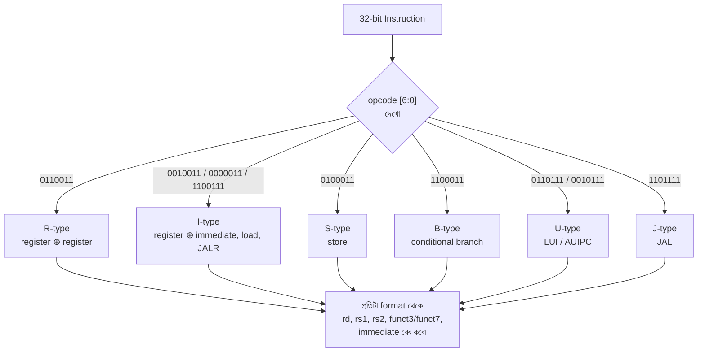

# 🚀 Chapter 13: Build Your Own RISC-V Processor - ISA Fundamentals
## From Toy CPU to Real Architecture - RISC-V RV32I!

> **"8-bit was learning. RISC-V is professional. Time to build REAL processors!"**
>
> **"8-bit ছিল শেখা। RISC-V professional। এবার REAL processor বানাও!"**

---

## 🎯 এই Chapter এ তুমি শিখবে:

```
✅ RISC-V Overview - open ISA
✅ RV32I Base Integer - 32-bit core
✅ Instruction Formats - 6 types
✅ Register Set - 32 registers
✅ Instruction Set - 47 instructions
✅ Addressing Modes - memory access
✅ Calling Convention - function calls
✅ তোমার RISC-V processor এর specification! 🎉
```

**Time Required:** 1 week (5-6 hours/day)  
**Prerequisites:** Chapter 12 complete

---

## 🚀 Quick Understanding - 10 মিনিটে RISC-V!

### What is RISC-V?

আগের chapter-এ তুমি একটা ছোট toy CPU বানিয়েছিলে — নিজের মন মতো instruction বানিয়ে। সেটা শেখার জন্য দারুণ ছিল, কিন্তু তোমার বানানো instruction set শুধু তোমার CPU-তেই চলত। RISC-V হলো এমন একটা **ISA (Instruction Set Architecture)** — মানে CPU আর software-এর মধ্যেকার "চুক্তি" — যেটা সারা পৃথিবী মেনে চলে। তুমি যদি RISC-V বানাও, তাহলে পৃথিবীর তৈরি লক্ষ লক্ষ RISC-V program তোমার চিপে চলবে। এটাই হলো একটা standard ISA শেখার আসল মজা।

নামটা এসেছে UC Berkeley-র গবেষণা থেকে। ওদের পঞ্চম (5th) RISC ISA প্রজেক্ট বলে নাম **RISC-V** (আগের চারটা: RISC-I, RISC-II, SOAR, SPUR)। রোমান সংখ্যা V মানে পাঁচ, তাই উচ্চারণ **"Risk Five"** — "রিস্ক ভি" নয়।

```
RISC-V = UC Berkeley-র পঞ্চম (5th) RISC ISA (RISC-I, RISC-II, SOAR, SPUR, তারপর RISC-V)

Key facts:
✅ Open source (free to use!)
✅ Modular design (pick what you need)
✅ Clean, simple ISA
✅ Growing rapidly
✅ Industry adoption (Google, NVIDIA, etc.)

Pronunciation: "Risk Five"
```

**কেন RISC-V বেছে নিলাম?** ARM বা x86 দিয়েও তো CPU বানানো যায় — কিন্তু সেগুলো বানাতে হলে কোম্পানিকে মোটা অঙ্কের licensing fee দিতে হয়, আর ISA-র full spec বাইরের কেউ পায় না। RISC-V-এর spec সম্পূর্ণ খোলা ও বিনামূল্যে — তুমি, আমি, যে কেউ এটা পড়তে, বানাতে, এমনকি বিক্রিও করতে পারি। শেখার জন্য আরও বড় সুবিধা: ISA-টা ছোট আর পরিষ্কার, তাই গোটা base set একজন মানুষ এক সপ্তাহেই মাথায় ঢুকিয়ে ফেলতে পারে। শিল্প-জগতেও (Google, NVIDIA, Western Digital) দ্রুত জায়গা করে নিচ্ছে — তাই এটা শুধু "পড়ার জিনিস" নয়, ভবিষ্যতের চাকরির জিনিসও।

```
Why RISC-V?
- No licensing fees (unlike ARM, x86)
- Educational friendly
- Research friendly
- Production ready
- Future-proof

Perfect for learning!
```

### RISC-V Modularity:

RISC-V-এর সবচেয়ে সুন্দর idea হলো **modularity**। পুরো ISA এক ঢেলা নয় — একটা ছোট base আর তার ওপর ইচ্ছেমতো লাগানো extension। ভাবো একটা মোবাইল প্ল্যানের মতো: base plan সবার লাগে, বাকি features (data pack, calling) যার যেটা দরকার সে সেটা নেয়। তোমার IoT sensor-এ floating point দরকার নেই, তাই F/D extension বাদ — চিপ ছোট, সস্তা, কম power খায়। আবার supercomputer-এ vector (V) লাগবে — সেটা লাগিয়ে নাও। base অংশটা কখনো বদলায় না, তাই base-এর জন্য লেখা software চিরকাল চলবে।

প্রথমে base ISA বেছে নিতে হয় — মূলত register আর data কত বিট চওড়া হবে সেটাই ঠিক করে:

| Base ISA | Width | মানে |
|----------|-------|------|
| RV32I | 32-bit | integer register ও data ৩২ বিট |
| RV64I | 64-bit | integer register ও data ৬৪ বিট |
| RV128I | 128-bit | integer register ও data ১২৮ বিট |

তারপর দরকার মতো extension লাগানো যায় (প্রতিটার একটা করে অক্ষর):

| Extension | কাজ |
|-----------|-----|
| M | Multiply / Divide |
| A | Atomic operations (lock-free sharing) |
| F | Single-precision floating point |
| D | Double-precision floating point |
| C | Compressed instructions (16-bit, code ছোট করে) |
| V | Vector operations |

> উদাহরণ: একটা সাধারণ Linux-চালানো চিপকে বলা হয় **RV64GC** — এখানে `G` হলো `IMAFD` একসাথে (general-purpose set), আর `C` হলো compressed।

```
We'll implement: RV32I
(Base 32-bit, enough for complete processor!)
```

আমরা বানাব শুধু **RV32I** — মানে base 32-bit integer set, কোনো extension ছাড়া। শুনতে সীমিত লাগলেও এটা একটা সম্পূর্ণ, কাজ-করা Turing-complete প্রসেসর — এতেই loop, function, recursion, এমনকি একটা ছোট OS পর্যন্ত চলে। guণ-ভাগ (M) না থাকলে সেগুলো add আর shift দিয়ে software-এ করে নেওয়া যায়। শেখার জন্য এটাই perfect: যথেষ্ট ছোট যে পুরোটা বানানো যায়, আবার যথেষ্ট আসল যে গর্ব করা যায়।

### RV32I at a Glance:

এবার RV32I-র মূল মাপগুলো এক নজরে দেখে নাও। এই কয়েকটা সংখ্যাই তোমার পুরো প্রসেসরের কাঠামো ঠিক করে দেবে — register কত চওড়া হবে, memory address bus কত বিট হবে, instruction fetch করার সময় কত বিট পড়তে হবে।

```
Data width: 32-bit
Address width: 32-bit (4GB memory)
Registers: 32 × 32-bit
Instructions: 47 base instructions
Instruction size: 32-bit (fixed)
```

এখানে একটা ছোট অথচ বিশাল গুরুত্বপূর্ণ কথা: instruction size **fixed 32-bit**। x86-এ একটা instruction ১ বাইট থেকে ১৫ বাইট পর্যন্ত হতে পারে, তাই decoder-কে আগে বুঝতে হয় "এই instruction-টা কত লম্বা" তারপর পড়তে হয় — ভয়ানক জটিল। RISC-V-এ প্রতিটা instruction ঠিক ৪ বাইট, তাই পরের instruction সবসময় `PC + 4`-এ। এই একটা সিদ্ধান্তই তোমার hardware-কে অসম্ভব সহজ করে দেয়, আর Chapter 14-এ যখন CPU বানাবে তখন এর সুফল হাতেনাতে পাবে।

instruction-গুলোকে কাজের ধরন অনুযায়ী ভাগ করা যায় — পুরো RV32I আসলে এই কয়েকটা পরিবারেই আঁটে:

```
Instruction types:
- Arithmetic (ADD, SUB, etc.)
- Logical (AND, OR, XOR)
- Shifts (SLL, SRL, SRA)
- Branches (BEQ, BNE, etc.)
- Loads (LW, LH, LB)
- Stores (SW, SH, SB)
- Jumps (JAL, JALR)
- System (ECALL, EBREAK)
```

🎉 **Now you know what RISC-V is!**

---

## ১৩.১ RISC-V Philosophy

একটা ISA শুধু instruction-এর তালিকা নয় — এর পেছনে কিছু design দর্শন থাকে, যেগুলো প্রতিটা সিদ্ধান্তের কারণ ব্যাখ্যা করে। RISC-V কেন এত সহজ, কেন এমনভাবে বিটগুলো সাজানো — এই পাঁচটা নীতি বুঝলে পরের সব encoding তোমার কাছে "মুখস্থ করার জিনিস" না হয়ে "যুক্তিসঙ্গত জিনিস" মনে হবে।

### Design Principles:

```
1. Simplicity
   - Clean, orthogonal ISA
   - Easy to understand
   - Easy to implement

2. Modularity
   - Base + Extensions
   - Only pay for what you use
   - Scalable

3. Stability
   - Base never changes
   - Extensions frozen when ratified
   - Software compatibility

4. Openness
   - Free to use
   - Open specification
   - Community driven

5. Extensibility
   - Custom extensions allowed
   - Standard extensions defined
   - Room for innovation
```

এই নীতিগুলো একটু খুলে বলি, কারণ এগুলোই RISC-V-কে শেখার জন্য আদর্শ বানিয়েছে:

- **Simplicity (সরলতা):** ISA-টা "orthogonal" — মানে যেকোনো operation যেকোনো register-এর সাথে একইভাবে কাজ করে, কোনো register-এর গোপন বিশেষ নিয়ম নেই (x0 ছাড়া)। কম special case মানে hardware-এ কম তার, কম bug।
- **Modularity (মডুলারিটি):** base + extension — যেটা আগেই দেখলে। তুমি শুধু যা ব্যবহার করবে তার জন্যই transistor খরচ করবে।
- **Stability (স্থায়িত্ব):** base ISA একবার ঠিক হলে আর কখনো বদলায় না। আজ RV32I-র জন্য লেখা program ৫০ বছর পরেও চলবে। তাই তুমি যা শিখছ তা কখনো অচল হবে না।
- **Openness (উন্মুক্ততা):** spec সবার জন্য খোলা, community চালায়। কোনো কোম্পানি একদিন "এখন থেকে টাকা দাও" বলতে পারবে না।
- **Extensibility (সম্প্রসারণযোগ্যতা):** চাইলে তুমি নিজের custom instruction পর্যন্ত যোগ করতে পারো — opcode-এর কিছু জায়গা ইচ্ছে করেই খালি রাখা আছে। গবেষক ও startup-দের জন্য স্বর্গ।

### RISC-V vs Others:

তিনটা বড় ISA পাশাপাশি রাখলে RISC-V কেন শেখার জন্য সেরা সেটা পরিষ্কার হয়ে যায়। x86 (তোমার ল্যাপটপের Intel/AMD) দশকের পর দশক ধরে পুরোনো জিনিস বহন করছে বলে ভয়ানক জটিল; ARM (তোমার ফোনের চিপ) অনেক পরিষ্কার কিন্তু licensed ও closed। RISC-V নতুন বলে অতীতের বোঝা নেই, খোলা বলে যে কেউ ব্যবহার করতে পারে:

| Feature | RISC-V | ARM | x86 |
|---------|--------|-----|-----|
| License | Free | $$$ | $$$ |
| ISA | Open | Closed | Closed |
| Simplicity | High | Medium | Low |
| Modular | Yes | No | No |
| Education | Best | Good | Complex |
| Industry | Growing | Mature | Mature |
| Custom | Easy | Hard | No |

```
RISC-V perfect for:
✅ Learning
✅ Research
✅ Custom processors
✅ IoT/Embedded
✅ Future projects
```

---

## ১৩.২ Register Set - 32 Registers

প্রসেসর সরাসরি memory নিয়ে কাজ করে না — memory অনেক দূরে আর ধীর। তার বদলে CPU-র ভেতরেই কয়েকটা super-fast ছোট খোপ থাকে, যাদের বলে **register**। যা নিয়ে এই মুহূর্তে হিসাব হচ্ছে, সেটা register-এ থাকে; কাজ শেষ হলে memory-তে ফেরত পাঠানো হয়। RISC-V-এ এমন register আছে ঠিক ৩২টা — এই সংখ্যাটা ইচ্ছাকৃত: register address করতে লাগে মাত্র ৫ বিট (২⁵ = ৩২), আর এই ৫ বিট instruction-এ চমৎকারভাবে এঁটে যায় (পরের section-এ দেখবে)।

### Register Overview:

```
32 registers: x0 to x31
Each: 32 bits wide
Total: 1024 bits storage

x0: Always zero (hardwired)
x1-x31: General purpose
```

Hardware-এর চোখে register-গুলোর নাম শুধু `x0` থেকে `x31` — সবগুলোই সমান, যেকোনো কাজে লাগানো যায়। কিন্তু একটা বড় program-এ সবাই যদি যেমন খুশি register ব্যবহার করে, তাহলে দুটো function একসাথে কাজ করতে গেলে গন্ডগোল লেগে যাবে — একজনের data আরেকজন মুছে ফেলবে। তাই RISC-V community একটা সামাজিক চুক্তি ঠিক করেছে: কোন register কোন কাজে ব্যবহার হবে। এই চুক্তির নাম **ABI (Application Binary Interface)**, আর প্রতিটা register-কে দেওয়া হয়েছে একটা মনে-রাখা-সহজ নাম:

```
ABI Names:
x0  = zero  (always 0)
x1  = ra    (return address)
x2  = sp    (stack pointer)
x3  = gp    (global pointer)
x4  = tp    (thread pointer)
x5-x7 = t0-t2 (temporaries)
x8  = s0/fp (saved/frame pointer)
x9  = s1    (saved)
x10-x11 = a0-a1 (arguments/return)
x12-x17 = a2-a7 (arguments)
x18-x27 = s2-s11 (saved)
x28-x31 = t3-t6 (temporaries)
```

> মনে রেখো: এই ABI নাম শুধু মানুষ আর assembler-এর সুবিধার জন্য। তোমার hardware কখনো `sp` বা `ra` দেখে না — সে শুধু ৫-বিট নম্বর দেখে। `sp` মানে শুধু "register নম্বর ২", `ra` মানে "register নম্বর ১"।

### Register Table:

| Reg | ABI | Description |
|-----|-----|-------------|
| x0 | zero | Hardwired zero |
| x1 | ra | Return address |
| x2 | sp | Stack pointer |
| x3 | gp | Global pointer |
| x4 | tp | Thread pointer |
| x5-7 | t0-2 | Temporaries |
| x8 | s0/fp | Saved register / Frame pointer |
| x9 | s1 | Saved register |
| x10-11 | a0-1 | Function args / return values |
| x12-17 | a2-7 | Function arguments |
| x18-27 | s2-11 | Saved registers |
| x28-31 | t3-6 | Temporaries |

টেবিলটা ভয় পাওয়ার দরকার নেই — এটা মুখস্থ করার নয়, বোঝার। মূলত register-গুলো তিন দলে ভাগ:

- **বিশেষ কাজের register (x0–x4):** `zero` সবসময় ০, `ra` function থেকে ফেরার ঠিকানা রাখে, `sp` stack-এর মাথা দেখায়, `gp`/`tp` global ও thread data-র দিকে আঙুল রাখে।
- **Argument register (a0–a7):** function-কে কী input দিচ্ছ তা এগুলোতে যায়, আর উত্তর `a0`/`a1`-এ ফেরত আসে। ঠিক যেন function-এর "ইনবক্স আর আউটবক্স"।
- **কাজ-চালানো register দুই ধরনের — এখানেই আসল চালাকি:**

```
Caller-saved: t0-t6, a0-a7
Callee-saved: s0-s11
```

এই caller-saved বনাম callee-saved ব্যাপারটা প্রথমে গোলমেলে লাগে, কিন্তু idea-টা খুব সহজ। ভাবো তুমি (caller) একটা function-কে (callee) ডাকছ:

- **`t` (temporary) register caller-saved:** callee এগুলো যখন খুশি নষ্ট করতে পারে। তাই function call-এর আগে যদি কোনো `t` register-এ দরকারি কিছু থাকে, **তোমাকেই** তা stack-এ সরিয়ে রাখতে হবে। "ক্ষণস্থায়ী জিনিস, নিজ দায়িত্বে রাখো।"
- **`s` (saved) register callee-saved:** callee প্রতিশ্রুতি দেয় — এগুলো ব্যবহার করলেও ফেরার আগে আগের মান ফিরিয়ে দেবে। তাই call-এর পরেও `s` register-এ তোমার data অক্ষত থাকবে। "টেকসই জিনিস, ধার নিলে যেমন ছিল তেমন ফেরত দাও।"

এই দুই দল থাকার কারণ efficiency: ছোট, ক্ষণিকের হিসাবের জন্য `t` register (save করার ঝামেলা নেই), আর loop জুড়ে টিকে থাকা মানের জন্য `s` register। section ১৩.৬-এ calling convention দেখলে এটা পুরোপুরি পরিষ্কার হবে।

### x0 (zero register):

৩২টা register-এর মধ্যে `x0` একদম অন্যরকম, আর এটাই RISC-V-এর অন্যতম সেরা design-চাল। `x0` সবসময় ০ পড়ে, আর এতে যা-ই লেখো তা নীরবে ফেলে দেওয়া হয় — মানে এটা একটা constant ০, কোনো সাধারণ register নয়।

```
Special property:
- Always reads as 0
- Writes are discarded
```

প্রথমে মনে হতে পারে — পুরো একটা register "নষ্ট" করে ০ রাখা কেন? কিন্তু এই একটা register থাকার ফলে ISA থেকে অসংখ্য আলাদা instruction বাদ দেওয়া যায়। যেমন `MV` (এক register থেকে আরেকটায় copy), `NOP` (কিছু না করা), `NEG` (চিহ্ন উল্টানো) — এদের জন্য আলাদা instruction লাগে না, `x0`-কে চালাকি করে ব্যবহার করলেই হয়। কম instruction = সহজ hardware। দেখো কীভাবে:

```
Uses:
1. Generate constant 0
   addi x5, x0, 0  # x5 = 0

2. Discard results
   add x0, x5, x6  # Compute but throw away

3. Comparisons
   beq x5, x0, label  # Branch if x5 == 0

4. NOP instruction
   addi x0, x0, 0  # Do nothing
```

এখানে ব্যাখ্যা: `x0 + 0` সবসময় ০, তাই কোনো রেজিস্টারে ০ বসাতে `addi x5, x0, 0`। ফলাফল ফেলে দিতে চাইলে গন্তব্য `x0` করো — হিসাব হয় ঠিকই, কিন্তু কোথাও জমা হয় না। `x0`-র সাথে তুলনা করে সহজে "শূন্য কিনা" পরীক্ষা করা যায়। আর "কিছু না করা" (NOP) মানে শুধু `x0`-তে ০ যোগ করা।

```
Hardware: Just wire to 0!
```

আর সবচেয়ে মজার অংশ — এটা hardware-এ বানাতে কার্যত **কিছুই লাগে না**। অন্য ৩১টা register flip-flop দিয়ে তৈরি, কিন্তু `x0`-র জন্য তোমাকে শুধু output-টা স্থায়ীভাবে ০ (ground)-এর সাথে তার লাগিয়ে দিতে হবে, আর write হলে সেটা উপেক্ষা করতে হবে। একটা feature যা software-কে অনেক সহজ করে অথচ hardware-এ একদম free — এর চেয়ে সুন্দর design আর কী হতে পারে!

---

## ১৩.৩ Instruction Formats - 6 Types

এবার আমরা chapter-টার আসল হৃদয়ে ঢুকছি। একটা instruction শেষ পর্যন্ত শুধু ৩২টা ০ আর ১ — তোমার CPU-কে এই ৩২ বিট দেখে বুঝতে হবে: কোন কাজ করতে হবে, কোন register থেকে data নিতে হবে, ফল কোথায় রাখতে হবে। সেই ৩২ বিটকে অর্থপূর্ণ টুকরোয় (field) ভাগ করার নিয়মই হলো **instruction format**।

প্রশ্ন হলো — একটাই format দিয়ে কাজ চলত না? চলত না, কারণ ভিন্ন instruction-এর ভিন্ন জিনিস দরকার। `ADD`-এর তিনটা register লাগে (দুটো input, একটা output), কিন্তু `ADDI`-র দুটো register আর একটা constant লাগে; `LUI`-র শুধু একটা বড় constant লাগে। সবার জন্য জোর করে একই খোপ রাখলে বিট নষ্ট হতো। তাই RISC-V ৬টা format রাখে — R, I, S, B, U, J — প্রতিটা একেক ধরনের কাজের জন্য মাপমতো বানানো।

### Format Overview:

```
All instructions: 32 bits
6 formats: R, I, S, B, U, J
```

কিন্তু এখানেই RISC-V-র আসল মাস্টারস্ট্রোক। ৬টা format আলাদা হলেও, যে field-গুলো সব format-এ লাগে সেগুলোকে **সবসময় একই বিট-অবস্থানে** রাখা হয়েছে। register নম্বরগুলো (`rd`, `rs1`, `rs2`) এক জায়গায়, opcode সবসময় শেষের ৭ বিটে। এর ফল ভয়ংকর সুন্দর: তোমার decoder format জানার **আগেই** register নম্বর আর opcode টেনে বের করতে শুরু করতে পারে, কারণ সেগুলো যে কোথায় থাকবে তা নিশ্চিত। মানে কম তার, কম মুখস্থ, দ্রুত decode। নিচের common field-গুলো মনে রাখো — এগুলোই সব format জুড়ে এক জায়গায় বসে থাকে:

```
Common fields:
- opcode: [6:0] (7 bits) - Operation type
- rd: [11:7] (5 bits) - Destination register
- rs1: [19:15] (5 bits) - Source register 1
- rs2: [24:20] (5 bits) - Source register 2
- funct3: [14:12] (3 bits) - Function modifier
- funct7: [31:25] (7 bits) - Function modifier
```

field-গুলোর ভূমিকা বুঝে নাও — পুরো chapter-টা এদের ওপর দাঁড়িয়ে:

- **opcode (৭ বিট):** সবচেয়ে বড় শ্রেণিবিভাগ — "এটা কি R-type হিসাব, নাকি load, নাকি branch?" decoder সবার আগে এটাই দেখে।
- **funct3 (৩ বিট) ও funct7 (৭ বিট):** opcode-এর ভেতরে আরও সূক্ষ্ম পার্থক্য। যেমন সব R-type-এর opcode এক (`0110011`), কিন্তু `ADD` আর `SUB` আলাদা হয় funct7 দিয়ে, আর `ADD` থেকে `AND` আলাদা হয় funct3 দিয়ে। ভাবো opcode = পদবি, funct = নাম।
- **rd:** destination — ফলাফল কোন register-এ লিখব।
- **rs1, rs2:** source — কোন register থেকে input পড়ব।

> **কেন বিট-অবস্থান উল্টো দিক থেকে লেখা?** নিচের প্রতিটা চিত্রে বিট ৩১ বাঁয়ে, বিট ০ ডানে — কারণ বাইনারিতে সবচেয়ে দামি বিট (MSB) বাঁয়ে থাকে, ঠিক যেমন দশমিকে "১২৩"-এর ১ সবচেয়ে দামি। তাই চিত্রগুলো ডান থেকে বাঁয়ে পড়লে বিট-নম্বর ০, ১, ২... বাড়ে।

তোমার decoder কীভাবে opcode দেখে format বাছে — পুরো ব্যাপারটা এক চিত্রে:



### R-Type (Register):

সবচেয়ে সহজটা দিয়ে শুরু করি। R-type হলো "register only" format — তিনটাই register, কোনো constant নেই। `rs1` আর `rs2` থেকে দুটো মান পড়ে, কিছু হিসাব করে, ফল `rd`-তে রাখে। যেহেতু কোনো immediate লাগে না, পুরো ৩২ বিট ভাগ হয় শুধু register আর function-নির্দেশক field-এর মধ্যে — তাই এখানে দুটো করে function field (`funct3` ও `funct7`) রাখার জায়গা থাকে, যা দিয়ে অনেক operation একই opcode-এ আঁটানো যায়।

```
Used for: Register-to-register operations

Format:
   31        25 24    20 19    15 14    12 11     7 6       0
  ┌────────────┬────────┬────────┬────────┬────────┬─────────┐
  │   funct7   │  rs2   │  rs1   │ funct3 │   rd   │ opcode  │
  └────────────┴────────┴────────┴────────┴────────┴─────────┘
     7 bits      5 bits   5 bits   3 bits   5 bits    7 bits

Examples:
- ADD, SUB, AND, OR, XOR
- SLL, SRL, SRA
- SLT, SLTU
```

লক্ষ করো — সব R-type instruction-এর opcode একই: `0110011`। তাহলে CPU `ADD` আর `SUB`-এর তফাত বোঝে কীভাবে? ঠিক এখানেই `funct3` আর `funct7`-এর কাজ। `funct3` মূল operation বাছে (যোগ/বিয়োগ একই funct3, কিন্তু AND/OR/XOR আলাদা), আর `funct7`-এর একটা বিট দিয়ে যমজ operation আলাদা করা হয় — যেমন `ADD` (funct7 = `0000000`) বনাম `SUB` (funct7 = `0100000`), একইভাবে `SRL` বনাম `SRA`। চমৎকার ব্যাপার: এতে বিয়োগের জন্য আলাদা opcode খরচ করতে হয় না।

```
Example: ADD x5, x6, x7
- funct7 = 0000000
- rs2 = x7 (00111)
- rs1 = x6 (00110)
- funct3 = 000
- rd = x5 (00101)
- opcode = 0110011
```

উপরের `ADD x5, x6, x7`-কে ডান থেকে বাঁয়ে জোড়া দিলে পুরো ৩২ বিট দাঁড়ায়: `0000000 00111 00110 000 00101 0110011`। তোমার বানানো decoder ঠিক এভাবেই উল্টো পথে — ৩২ বিট কেটে কেটে field বের করবে। এটাই Chapter 14-এর প্রথম ধাপ।

### I-Type (Immediate):

এবার একটু বুদ্ধি লাগে। অনেক সময় আমরা একটা register আর একটা **ধ্রুব সংখ্যার (constant)** মধ্যে কাজ করতে চাই — যেমন `x6 + 10`। এই constant-কে বলে **immediate** ("তাৎক্ষণিক", কারণ এটা instruction-এর ভেতরেই বসানো, কোনো register থেকে আনতে হয় না)। R-type-এ `rs2` আর `funct7` যে ১২ বিট জায়গা নিত, I-type সেই পুরো জায়গাটাকে এক করে একটা ১২-বিট immediate বানায়। load instruction-ও (`LW` ইত্যাদি) এই format ব্যবহার করে — কারণ address মানে `rs1 + offset`, আর offset-ও একটা immediate।

```
Used for: Register-immediate operations, loads

Format:
   31                     20 19    15 14    12 11     7 6       0
  ┌─────────────────────────┬────────┬────────┬────────┬─────────┐
  │       imm[11:0]         │  rs1   │ funct3 │   rd   │ opcode  │
  └─────────────────────────┴────────┴────────┴────────┴─────────┘
          12 bits             5 bits   3 bits   5 bits    7 bits

Examples:
- ADDI, ANDI, ORI, XORI
- SLTI, SLTIU
- LW, LH, LB, LHU, LBU
- JALR
```

```
Immediate: Sign-extended to 32 bits
```

এখানে একটা জরুরি ধারণা: **sign-extension**। immediate মাত্র ১২ বিট, কিন্তু হিসাব হয় ৩২ বিটে। তাহলে বাকি ২০ বিট কী দিয়ে ভরবে? শুধু ০ দিয়ে ভরলে ঋণাত্মক সংখ্যা নষ্ট হয়ে যাবে। তাই RISC-V immediate-এর সবচেয়ে বাঁ দিকের বিট (চিহ্ন-বিট, bit 11) **নকল করে** বাকি ২০ বিট ভরে। ফলে `-5` (যার চিহ্ন-বিট ১) ৩২ বিটেও `-5` থাকে, আর `+10` (চিহ্ন-বিট ০) `+10`-ই থাকে। এজন্যই `SUBI` নামে কোনো instruction লাগে না — `ADDI x5, x5, -5` দিয়েই বিয়োগ হয়ে যায়, কারণ immediate ঋণাত্মক হতে পারে।

```
Example: ADDI x5, x6, 10
- imm = 000000001010
- rs1 = x6
- funct3 = 000
- rd = x5
- opcode = 0010011
```

### S-Type (Store):

এখানে এমন একটা design সিদ্ধান্ত আসছে যা প্রথমে অদ্ভুত লাগে, কিন্তু এর পেছনের যুক্তি বুঝলে তুমি RISC-V-র চিন্তাভাবনা ধরে ফেলবে। store instruction (`SW` ইত্যাদি) memory-তে data লেখে: address = `rs1 + offset`, আর লেখার data আসে `rs2` থেকে। মানে এখানে **দুটো register আর একটা immediate** — তিনটাই লাগে। কিন্তু সমস্যা: I-type-এর মতো একটানা ১২ বিট immediate রাখলে `rs2`-এর জায়গা থাকে না।

সমাধান: immediate-টাকে দু'টুকরো করে দাও। উপরের ৭ বিট (`imm[11:5]`) যায় একদম বাঁ দিকে, নিচের ৫ বিট (`imm[4:0]`) যায় যেখানে I-type-এ `rd` থাকত:

```
Used for: Store instructions

Format:
   31        25 24    20 19    15 14    12 11      7 6       0
  ┌────────────┬────────┬────────┬────────┬─────────┬─────────┐
  │  imm[11:5] │  rs2   │  rs1   │ funct3 │ imm[4:0]│ opcode  │
  └────────────┴────────┴────────┴────────┴─────────┴─────────┘
     7 bits      5 bits   5 bits   3 bits    5 bits    7 bits
```

```
Immediate split: [11:5] and [4:0]
Why? Keep rs1, rs2, funct3 in same position
```

**কেন এই অদ্ভুত ভাঙাভাঙি?** কারণটা hardware সরলতা। খেয়াল করো — immediate-কে টুকরো করেও `rs1` (বিট 19:15), `rs2` (বিট 24:20), আর `funct3` (বিট 14:12) ঠিক সেই একই জায়গায় রাখা হয়েছে যেখানে এরা R/I-type-এ থাকে! মানুষের কাছে immediate ভাঙা বিরক্তিকর, কিন্তু hardware কখনো অভিযোগ করে না — তার কাছে immediate-এর টুকরো জোড়া লাগানো মানে শুধু কয়েকটা তার এদিক-সেদিক করা, প্রায় free। বিনিময়ে register-পড়ার আর funct3-decode-করার তারগুলো **প্রতিটা format-এ এক** থাকে, যা অনেক বড় সাশ্রয়। মূলমন্ত্র: **register আর funct3-এর অবস্থান পবিত্র, immediate যেদিকে খুশি ভাঙো।**

```
Examples:
- SW, SH, SB

Example: SW x7, 8(x6)
- imm[11:5] = 0000000
- rs2 = x7 (data)
- rs1 = x6 (base)
- funct3 = 010
- imm[4:0] = 01000
- opcode = 0100011
```

উপরের উদাহরণে offset `8` = বাইনারি `000000001000`। এটাকে ভাঙলে: উপরের ৭ বিট `0000000` যায় `imm[11:5]`-এ, নিচের ৫ বিট `01000` যায় `imm[4:0]`-এ। CPU পড়ার সময় এই দুই টুকরো আবার জোড়া দিয়ে আসল `8` ফিরে পায়।

### B-Type (Branch):

branch হলো শর্তসাপেক্ষ লাফ — "যদি `rs1 == rs2` হয় তবে এখান থেকে এতদূর সরে যাও"। তাই এখানেও দুটো register (`rs1`, `rs2`, যাদের তুলনা করা হবে) আর একটা immediate (কতদূর লাফাব, সেই offset) লাগে — কাঠামোটা S-type-এর মতোই। কিন্তু branch-এর offset-টা একটু বিশেষ, আর সেটাই এই format-কে সবচেয়ে কৌতূহলোদ্দীপক বানিয়েছে।

প্রথমে দুটো সরল কথা বুঝে নাও:

১. **offset হলো PC-relative:** branch কোনো absolute address-এ যায় না, বরং বর্তমান PC থেকে কত বাইট আগে/পরে — সেই relative দূরত্বে যায়। তাই code memory-তে যেখানেই বসুক, branch ঠিক কাজ করে।

২. **imm[0] সবসময় ০:** যেহেতু প্রতিটা instruction অন্তত ২ বাইটে aligned (RV32I-তে ৪ বাইট), branch-এর গন্তব্য কখনো বেজোড় বাইটে হতে পারে না। মানে offset-এর সবচেয়ে নিচের বিট সবসময় ০ — তাহলে সেটা instruction-এ জমা রাখার দরকারই নেই! এই একটা চালাকিতে একটা বিট বেঁচে যায়, আর সেই বাড়তি বিট দিয়ে branch-এর range দ্বিগুণ হয় (±4KB)।

```
Used for: Conditional branches

Format:
31   30        25 24    20 19    15 14  12 11   8 7   6      0
┌─────┬───────────┬────────┬────────┬──────┬──────┬─┬────────┐
│imm12│ imm[10:5] │  rs2   │  rs1   │funct3│imm   │0│ opcode │
│     │           │        │        │      │[4:1] │ │        │
└─────┴───────────┴────────┴────────┴──────┴──────┴─┴────────┘
 1bit   6 bits     5 bits   5 bits  3 bits  4bits 1  7 bits

Immediate: PC-relative byte offset; imm[0] সবসময় 0 (2-byte aligned)
Range: ±4KB

Examples:
- BEQ, BNE, BLT, BGE, BLTU, BGEU

Note: imm[0] always 0 (halfword aligned)
      Reconstructed: {imm[12], imm[10:5], imm[4:1], 0}
```

দেখো immediate-এর বিটগুলো কেমন এলোমেলোভাবে ছড়িয়ে আছে — `imm[12]`, `imm[10:5]`, `imm[4:1]` নানা জায়গায়। **এটা পাগলামি নয়, এটা প্রকৌশল।** RISC-V ইচ্ছে করে immediate-এর প্রতিটা বিটকে ঠিক সেই অবস্থানে রেখেছে যেখানে সেটা I/S-type immediate-এর একই-নামের বিটের সাথে যতটা সম্ভব মেলে। ফলে immediate sign-extend করার জন্য যে hardware লাগে তা সব format-এ প্রায় একই তার দিয়ে চলে — আলাদা আলাদা বানাতে হয় না। মানুষের চোখে বিরক্তিকর, কিন্তু এই "scrambling" তোমার চিপের immediate-generator-কে অনেক ছোট করে দেয়। CPU চালানোর সময় এই ছড়ানো টুকরোগুলো জোড়া দিয়ে আর সবচেয়ে নিচে একটা ০ বসিয়ে আসল offset বানায়।

> ⚠️ **FLAG (সম্ভাব্য encoding ভুল — আমি বদলাইনি):** উপরের bit-field চিত্রে বিট ৭-এর ঘরটা `0` লেখা, আর reconstruction-এ আছে `{imm[12], imm[10:5], imm[4:1], 0}`। কিন্তু RISC-V spec অনুযায়ী B-type-এ **বিট ৭ ধরে রাখে `imm[11]`** (offset-এর ১১তম বিট), আর যে বিটটা সবসময় ০ সেটা হলো `imm[0]` — যেটা মোটেই জমা রাখা হয় না (implicit)। সঠিক reconstruction হওয়া উচিত `{imm[12], imm[11], imm[10:5], imm[4:1], 0}` (১২+১১+৬+৪+১ = ১৩ বিট সমান ±4KB range)। নির্দেশ অনুযায়ী encoding-sensitive অংশ আমি পরিবর্তন করিনি — লেখক/maintainer যেন spec-এর সাথে মিলিয়ে নিশ্চিত করেন।

### U-Type (Upper immediate):

একটা সমস্যা ভাবো: তোমার register ৩২ বিট, কিন্তু instruction-ও ৩২ বিট। তাহলে একটা পূর্ণ ৩২-বিট constant register-এ বসাবে কীভাবে? পুরো ৩২ বিট তো immediate-এ আঁটবে না — opcode আর rd-র জন্যও তো জায়গা চাই। I-type immediate মাত্র ১২ বিট, যা দিয়ে বড়জোর ছোট সংখ্যা হয়।

RISC-V-র সমাধান দু'ধাপে: একটা বড় constant-কে ভাগ করো **উপরের ২০ বিট + নিচের ১২ বিট**-এ। U-type format এই উপরের ২০ বিট সামলায় — `imm[31:12]` সরাসরি register-এর উপরের অংশে বসিয়ে দেয়, নিচের ১২ বিট ০ করে। এত বড় immediate রাখতে গিয়ে এখানে কোনো register source বা funct field-এর জায়গাই থাকে না — শুধু ২০-বিট immediate, rd, আর opcode:

```
Used for: Large immediate values

Format:
   31                                     12 11     7 6       0
  ┌─────────────────────────────────────────┬────────┬─────────┐
  │              imm[31:12]                  │   rd   │ opcode  │
  └─────────────────────────────────────────┴────────┴─────────┘
                  20 bits                      5 bits    7 bits

Immediate placed in upper 20 bits
Lower 12 bits = 0

Examples:
- LUI (Load Upper Immediate)
- AUIPC (Add Upper Immediate to PC)

Example: LUI x5, 0x12345
Result: x5 = 0x12345000
```

দুটো U-type instruction আছে, আর এদের জুড়ি দিয়েই বড় constant ও দূরের address তৈরি হয়:

- **LUI (Load Upper Immediate):** ২০-বিট immediate-কে register-এর উপরের ২০ বিটে বসায়, নিচের ১২ বিট ০। উপরের উদাহরণে `LUI x5, 0x12345` → `x5 = 0x12345000` (খেয়াল করো, `0x12345`-এর পরে তিনটা শূন্য — কারণ ১২ বিট = ৩ hex অঙ্ক ফাঁকা)। এবার নিচের ১২ বিট ভরতে একটা `ADDI` চালাও — দুটো মিলে যেকোনো ৩২-বিট constant! এই জোড়াটাই assembler-এর `LI` pseudo-instruction।
- **AUIPC (Add Upper Immediate to PC):** একই উপরের-২০-বিট immediate, কিন্তু এবার সেটা PC-র সাথে যোগ হয়। এতে "এখান থেকে এতদূর" ধরনের PC-relative address বানানো যায় — position-independent code-এর জন্য অপরিহার্য (`AUIPC + ADDI` = `LA` pseudo-instruction)।

### J-Type (Jump):

শেষ format — unconditional jump, মানে কোনো শর্ত ছাড়াই লাফ, প্রধানত `JAL` (function call) এর জন্য। যেহেতু এখানে তুলনা করার দরকার নেই, কোনো `rs1`/`rs2` লাগে না — তাই সেই বাঁচানো জায়গা পুরোটা চলে যায় immediate-এ। ফলে J-type-এর offset বিশাল: পুরো ২০ বিট (B-type-এর ১২ বিটের তুলনায়), মানে range ±1MB — অনেক দূরের function-ও ডাকা যায়।

```
Used for: Unconditional jumps

Format:
31      31 30        21 20      20 19          12 11      7 6        0
┌─────────┬────────────┬──────────┬──────────────┬─────────┬──────────┐
│  imm20  │  imm[10:1] │  imm11   │  imm[19:12]  │   rd    │  opcode  │
└─────────┴────────────┴──────────┴──────────────┴─────────┴──────────┘
   1 bit      10 bits     1 bit        8 bits       5 bits     7 bits

Immediate: PC-relative byte offset; imm[0] সবসময় 0 (2-byte aligned)
Range: ±1MB

Example:
- JAL (Jump and Link)

Note: Stores PC+4 in rd
      Immediate encoding scrambled (for efficient layout)
```

কয়েকটা জিনিস খেয়াল করো। প্রথমত, এখানে field-গুলোর নাম immediate-এর বিট-সূচক দিয়ে দেওয়া: `imm20` মানে offset-এর বিট ২০, `imm11` মানে বিট ১১, `imm[10:1]` মানে বিট ১০ থেকে ১ — মানুষের পড়ার সুবিধার জন্য। B-type-এর মতোই এখানেও offset-এর বিট ০ জমা থাকে না (সবসময় ০, কারণ alignment), তাই reconstruction-এ সবশেষে একটা ০ বসে।

দ্বিতীয়ত, এই বিটগুলোও ইচ্ছাকৃতভাবে এলোমেলো — একই কারণে: যত বেশি immediate-বিট অন্য format-এর সমনামী বিটের সাথে অবস্থান ভাগ করে, immediate-জোড়া-লাগানোর hardware তত ছোট হয়। শেখার সময় এটা মুখস্থ করার দরকার নেই; শুধু বুঝে রাখো — RISC-V সিলিকনে কয়েকটা multiplexer বাঁচানোর জন্য মানুষের একটু চোখের কষ্ট মেনে নিয়েছে।

তৃতীয়ত, "Jump and **Link**"-এর "Link" অংশটা গুরুত্বপূর্ণ: লাফ দেওয়ার আগে `JAL` পরবর্তী instruction-এর ঠিকানা (`PC+4`) `rd`-তে (সাধারণত `ra`) জমা রাখে। এই জমানো ঠিকানা ধরেই function শেষে আবার ফেরা যায় (`ret`)। এটাই function call-এর ভিত্তি, যা তুমি section ১৩.৬-এ হাতে-কলমে দেখবে।

---

## ১৩.৪ RV32I Instruction Set - Complete

format-গুলো বোঝা হয়ে গেছে — এবার দেখি ওই খোপগুলো দিয়ে আসলে কী কী কাজ করা যায়। পুরো RV32I মাত্র ৪৭টা instruction, আর এদেরকে কয়েকটা পরিবারে ভাগ করলে মনে রাখা সহজ। মনে রেখো, এই কয়েকটা সরল instruction দিয়েই গেম, OS, AI — পৃথিবীর সব software চলে। জটিল কাজ মানে বহু সরল instruction-এর সাজানো ক্রম, ঠিক যেমন বড় দালান অসংখ্য সাধারণ ইটের।

### Arithmetic Instructions:

সবচেয়ে চেনা পরিবার — যোগ আর বিয়োগ। `ADD` দুটো register যোগ করে (R-type), `ADDI` একটা register-এর সাথে constant যোগ করে (I-type), `SUB` বিয়োগ করে।

```
ADD   rd, rs1, rs2    # rd = rs1 + rs2
ADDI  rd, rs1, imm    # rd = rs1 + imm
SUB   rd, rs1, rs2    # rd = rs1 - rs2

Note: No SUBI (use ADDI with negative immediate)

Examples:
ADD  x5, x6, x7       # x5 = x6 + x7
ADDI x5, x6, 10       # x5 = x6 + 10
SUB  x5, x6, x7       # x5 = x6 - x7
ADDI x5, x5, -5       # x5 = x5 - 5
```

খেয়াল করেছ — `SUBI` বলে কিছু নেই? দরকারই নেই। `ADDI`-র immediate তো ঋণাত্মক হতে পারে (sign-extended), তাই "৫ বিয়োগ" মানে শুধু "−৫ যোগ": `ADDI x5, x5, -5`। একটা পুরো instruction বাঁচানো গেল — এটাই RISC-V-র সেই minimalism, যেটা hardware-কে ছোট রাখে।

### Logical Instructions:

bitwise যুক্তি — প্রতিটা বিটের ওপর আলাদাভাবে AND/OR/XOR। প্রতিটার register-register (R-type) আর register-immediate (I-type) দুই রূপ আছে। এগুলো দিয়ে নির্দিষ্ট বিট set/clear/toggle করা হয় — যাকে বলে bit masking, embedded programming-এ যার দরকার পদে পদে।

```
AND   rd, rs1, rs2    # rd = rs1 & rs2
ANDI  rd, rs1, imm    # rd = rs1 & imm
OR    rd, rs1, rs2    # rd = rs1 | rs2
ORI   rd, rs1, imm    # rd = rs1 | imm
XOR   rd, rs1, rs2    # rd = rs1 ^ rs2
XORI  rd, rs1, imm    # rd = rs1 ^ imm

Examples:
AND  x5, x6, x7       # Bitwise AND
ORI  x5, x6, 0xFF     # Set lower 8 bits
XOR  x5, x5, x5       # Clear register (x5 = 0)
```

ছোট কৌশল লক্ষ করো: `XOR x5, x5, x5` — যেকোনো সংখ্যাকে নিজের সাথে XOR করলে ০, তাই এটা register পরিষ্কার করার একটা চটপটে উপায়। আর `ORI ..., 0xFF` দিয়ে নিচের ৮ বিট জোর করে ১ বানানো যায়। এই ধরনের mask-চাল bit নিয়ে কাজ করার রুটি-রুজি।

### Shift Instructions:

shift মানে register-এর বিটগুলো বাঁয়ে বা ডানে সরানো। বাঁয়ে এক ঘর সরানো = ২ দিয়ে গুণ, ডানে এক ঘর = ২ দিয়ে ভাগ — তাই multiply/divide instruction ছাড়াও shift দিয়ে দ্রুত গুণ-ভাগ করা যায় (যখন গুণক ২-এর ঘাত)।

```
SLL   rd, rs1, rs2    # rd = rs1 << rs2[4:0]
SLLI  rd, rs1, shamt  # rd = rs1 << shamt
SRL   rd, rs1, rs2    # rd = rs1 >> rs2[4:0] (logical)
SRLI  rd, rs1, shamt  # rd = rs1 >> shamt (logical)
SRA   rd, rs1, rs2    # rd = rs1 >> rs2[4:0] (arithmetic)
SRAI  rd, rs1, shamt  # rd = rs1 >> shamt (arithmetic)

Shift amount: 5 bits (0-31)

Examples:
SLLI x5, x6, 2        # x5 = x6 << 2 (multiply by 4)
SRLI x5, x6, 3        # x5 = x6 >> 3 (divide by 8)
SRAI x5, x6, 4        # Arithmetic right shift (sign extend)
```

দুটো জিনিস বুঝে রাখো। প্রথমত, **logical (SRL) বনাম arithmetic (SRA) ডান-shift**: SRL উপরে ০ ভরে, কিন্তু SRA চিহ্ন-বিট নকল করে উপরে ভরে — যাতে ঋণাত্মক সংখ্যা ডানে সরালেও ঋণাত্মকই থাকে (অর্থাৎ চিহ্নসহ ভাগ ঠিক থাকে)। বাঁ-shift-এ এই ঝামেলা নেই, তাই SLL একটাই। দ্বিতীয়ত, shift amount কেন মাত্র **৫ বিট (0–31)**? কারণ ৩২-বিট register-কে ৩২ বা তার বেশি ঘর সরানোর কোনো মানে নেই (সব বিট বেরিয়ে যাবে), আর ০–৩১ ঠিক ৫ বিটেই ধরে।

### Compare Instructions:

তুলনা — "rs1 কি rs2-এর চেয়ে ছোট?" উত্তর হ্যাঁ হলে rd-তে ১, না হলে ০ বসে (Set if Less Than)। `signed` রূপ ঋণাত্মক সংখ্যা বোঝে, `unsigned` রূপ সব সংখ্যাকে ধনাত্মক ধরে — address তুলনায় এই unsigned রূপ লাগে। এই ১/০ ফল পরে branch বা শর্তের ভিত্তি হয়।

```
SLT   rd, rs1, rs2    # rd = (rs1 < rs2) ? 1 : 0 (signed)
SLTI  rd, rs1, imm    # rd = (rs1 < imm) ? 1 : 0 (signed)
SLTU  rd, rs1, rs2    # rd = (rs1 < rs2) ? 1 : 0 (unsigned)
SLTIU rd, rs1, imm    # rd = (rs1 < imm) ? 1 : 0 (unsigned)

Set if Less Than

Examples:
SLT  x5, x6, x7       # x5 = 1 if x6 < x7
SLTI x5, x6, 10       # x5 = 1 if x6 < 10
```

### Branch Instructions:

এতক্ষণ instruction-গুলো সরলরেখায় একটার পর একটা চলছিল। branch হলো সেই জিনিস যা program-কে সিদ্ধান্ত নিতে শেখায় — "if এই শর্ত সত্যি, তবে অন্য জায়গায় লাফাও, নইলে পরের instruction-এ যাও"। এটাই loop আর if-else-এর হৃদয়। ছয়টা branch ছয় রকম তুলনা ঢাকে: সমান/অসমান (BEQ/BNE), ছোট/বড়-সমান signed (BLT/BGE) আর unsigned (BLTU/BGEU)।

```
BEQ  rs1, rs2, offset # Branch if rs1 == rs2
BNE  rs1, rs2, offset # Branch if rs1 != rs2
BLT  rs1, rs2, offset # Branch if rs1 < rs2 (signed)
BGE  rs1, rs2, offset # Branch if rs1 >= rs2 (signed)
BLTU rs1, rs2, offset # Branch if rs1 < rs2 (unsigned)
BGEU rs1, rs2, offset # Branch if rs1 >= rs2 (unsigned)

PC-relative addressing
Range: ±4KB

Examples:
BEQ  x5, x6, loop     # if (x5 == x6) goto loop
BNE  x5, x0, skip     # if (x5 != 0) goto skip
BLT  x5, x6, less     # if (x5 < x6) goto less
```

খেয়াল করেছ "বড়" (BGT) বা "ছোট-সমান" (BLE) নেই? দরকার নেই — operand দুটো উল্টে দিলেই হয়। `a > b` মানে তো `b < a`, তাই `BGT a, b` লেখার বদলে assembler নীরবে `BLT b, a` বানিয়ে দেয়। আবারও সেই minimalism: কম instruction, একই ক্ষমতা।

### Jump Instructions:

branch যায় কাছাকাছি (±4KB), আর শর্তসাপেক্ষ। jump যায় শর্ত ছাড়াই, অনেক দূরে, এবং প্রধানত function call/return-এর জন্য। দুটো jump: `JAL` (PC-relative, J-type) আর `JALR` (register-এর ঠিকানায় লাফ, I-type)।

```
JAL  rd, offset       # rd = PC+4; PC = PC + offset
JALR rd, rs1, offset  # rd = PC+4; PC = rs1 + offset

JAL: Jump and Link (function calls)
JALR: Jump and Link Register (return, indirect)

Examples:
JAL  x1, function     # Call function, save return in x1(ra)
JALR x0, x1, 0        # Return (jump to address in x1)
JAL  x0, label        # Unconditional jump (discard return)
```

লক্ষ করো `x0`-র চালাকি আবার ফিরে এসেছে: `JAL x1, function` function ডাকে আর ফেরার ঠিকানা `ra`-তে রাখে; কিন্তু `JAL x0, label`-এ ফেরার ঠিকানা `x0`-তে গিয়ে হারিয়ে যায় — মানে শুধুই লাফ, ফেরার ইচ্ছা নেই (এটাই `j` pseudo-instruction)। আর `JALR x0, x1, 0` মানে "`ra`-তে রাখা ঠিকানায় ফিরে যাও" — অর্থাৎ function থেকে return (`ret`)।

### Load Instructions:

register সব data ধরে রাখতে পারে না — বড় data থাকে memory-তে। load মানে memory থেকে register-এ data আনা। ঠিকানা হিসাব হয় `rs1 + offset` (base + displacement)। কত বাইট আনছ তার ওপর নাম বদলায়: Word (৪ বাইট), Halfword (২ বাইট), Byte (১ বাইট)।

```
LW   rd, offset(rs1)  # Load Word (32-bit)
LH   rd, offset(rs1)  # Load Halfword (16-bit, sign extend)
LHU  rd, offset(rs1)  # Load Halfword Unsigned
LB   rd, offset(rs1)  # Load Byte (8-bit, sign extend)
LBU  rd, offset(rs1)  # Load Byte Unsigned

Address = rs1 + offset
offset: 12-bit signed

Examples:
LW   x5, 0(x6)        # x5 = memory[x6]
LW   x5, 8(x6)        # x5 = memory[x6 + 8]
LH   x5, 4(x6)        # Load 16-bit, sign extend
LBU  x5, 0(x6)        # Load byte, zero extend
```

ছোট data (byte/halfword) ৩২-বিট register-এ বসানোর সময় উপরের খালি বিট কী দিয়ে ভরবে? এখানেই signed বনাম unsigned রূপ: `LB`/`LH` চিহ্ন-বিট নকল করে (sign-extend, ঋণাত্মক সংখ্যার জন্য ঠিক), আর `LBU`/`LHU` ০ দিয়ে ভরে (zero-extend, byte/অক্ষর/রঙের মতো ধনাত্মক data-র জন্য)। ভুল রূপ বাছলে data নষ্ট — তাই signed না unsigned, সেটা ভেবে নিতে হয়।

### Store Instructions:

store হলো load-এর উল্টো — register থেকে data নিয়ে memory-তে লেখা। ঠিকানা সেই একই `rs1 + offset`, আর যে data লিখবে তা আসে `rs2` থেকে। এখানে sign/zero-extend-এর প্রশ্ন নেই, কারণ তুমি শুধু নিচের কয়েকটা বাইট memory-তে লিখছ — উপরের বিট নিয়ে ভাবার দরকার নেই।

```
SW  rs2, offset(rs1)  # Store Word
SH  rs2, offset(rs1)  # Store Halfword
SB  rs2, offset(rs1)  # Store Byte

Address = rs1 + offset
Data from rs2

Examples:
SW  x7, 0(x6)         # memory[x6] = x7
SW  x7, 12(x6)        # memory[x6 + 12] = x7
SH  x7, 2(x6)         # Store 16-bit
SB  x7, 0(x6)         # Store byte
```

### Upper Immediate:

মনে আছে section ১৩.৩-এ U-type দেখার সময় বলেছিলাম — ৩২-বিট constant একটা ১২-বিট immediate-এ আঁটে না? এই দুটো instruction সেই সমস্যার সমাধান। `LUI` একটা বড় সংখ্যার উপরের ২০ বিট register-এ বসায়, আর `AUIPC` সেই ২০ বিট PC-র সাথে যোগ করে দূরের ঠিকানা বানায়।

```
LUI   rd, imm         # rd = imm << 12
AUIPC rd, imm         # rd = PC + (imm << 12)

LUI: Load Upper Immediate
AUIPC: Add Upper Immediate to PC

Examples:
LUI   x5, 0x12345     # x5 = 0x12345000
AUIPC x5, 0x1000      # x5 = PC + 0x01000000

Used for:
- Loading large constants (LUI + ADDI)
- PC-relative addressing (AUIPC + offset)
```

### System Instructions:

শেষ দুটো instruction হিসাব-নিকাশের নয়, বরং বাইরের জগতের সাথে কথা বলার। তোমার program নিজে থেকে screen-এ লিখতে বা file খুলতে পারে না — এসব OS-এর কাজ। `ECALL` দিয়ে program OS-কে "এই কাজটা করে দাও" বলে অনুরোধ পাঠায় (system call), আর `EBREAK` debugger-কে থামতে বলে — breakpoint বসানোর সময় এটাই কাজে লাগে।

```
ECALL                 # Environment call (syscall)
EBREAK                # Environment break (debugger)

ECALL: Transfer to OS
EBREAK: Transfer to debugger

Examples:
ECALL                 # Make system call
EBREAK                # Breakpoint
```

### Pseudo-Instructions:

এবার একটা স্বস্তির খবর। assembly লিখতে গিয়ে তোমাকে সবসময় `x0`-চালাকি মনে রাখতে হবে না। **Pseudo-instruction** হলো assembler-এর দেওয়া পড়তে-সহজ ছদ্মনাম — তুমি `ret` লেখো, assembler নীরবে সেটাকে আসল `JALR x0, x1, 0`-তে বদলে দেয়। মানে এগুলো hardware-এ নতুন কোনো instruction নয় (তোমার CPU-কে এদের জন্য আলাদা কিছু বানাতে হবে না), শুধু লেখার সুবিধা। নিচের প্রতিটার ডান পাশে দেখো কোন সত্যিকারের instruction(গুলো)-তে এটা অনুবাদ হয়:

```
Not real instructions, but assembler shortcuts:

NOP              → ADDI x0, x0, 0
MV   rd, rs1     → ADDI rd, rs1, 0
NOT  rd, rs1     → XORI rd, rs1, -1
NEG  rd, rs1     → SUB  rd, x0, rs1
LI   rd, imm     → LUI + ADDI (for large imm)
LA   rd, label   → AUIPC + ADDI
J    offset      → JAL x0, offset
JR   rs1         → JALR x0, rs1, 0
RET              → JALR x0, x1, 0
CALL offset      → JAL x1, offset
```

---

## ১৩.৫ Addressing Modes

"Addressing mode" মানে — একটা instruction তার operand (data বা ঠিকানা) কোথা থেকে পায়, সেই নিয়ম। কিছু ISA-তে অসংখ্য জটিল mode থাকে, কিন্তু RISC-V minimalism মেনে মাত্র কয়েকটা সরল mode রাখে। মজার ব্যাপার — তুমি উপরের instruction-গুলোতে এদের ইতিমধ্যে ব্যবহার করেই ফেলেছ; এখানে শুধু নাম দিয়ে গুছিয়ে নিচ্ছি।

### 1. Register Direct:

operand সরাসরি register-এর ভেতরের মান। সবচেয়ে দ্রুত — memory ছোঁয়াই লাগে না।

```
Operation uses register contents directly

ADD x5, x6, x7    # x5 = x6 + x7
```

### 2. Immediate:

operand একটা ধ্রুব সংখ্যা, instruction-এর ভেতরেই বসানো। ছোট ছোট constant-এর জন্য আদর্শ।

```
Operation uses constant value

ADDI x5, x6, 10   # x5 = x6 + 10
```

### 3. Base + Displacement:

memory ঠিকানা = একটা register (base) + একটা constant (offset)। array বা struct-এর ভেতর নির্দিষ্ট ঘরে পৌঁছাতে এটাই ব্যবহার হয় — base-এ array-র শুরু, offset-এ কততম ঘর। সব load/store এই mode-এ চলে।

```
Memory address = register + offset

LW x5, 8(x6)      # x5 = memory[x6 + 8]
SW x7, 12(x6)     # memory[x6 + 12] = x7
```

### 4. PC-Relative:

গন্তব্য = বর্তমান PC + offset। code memory-তে যেখানেই বসুক, branch/jump ঠিক কাজ করে — কারণ ঠিকানা "এখান থেকে কতদূর" হিসেবে গোনা হয়, কোনো fixed ঠিকানা নয়। এটাই relocatable code-এর ভিত্তি।

```
Target address = PC + offset

BEQ x5, x6, label # if equal, goto PC + offset
JAL x1, function  # call PC + offset
```

### 5. Register Indirect:

গন্তব্য = একটা register-এ রাখা ঠিকানা (+ offset)। ঠিকানা compile-time-এ জানা না থাকলে — যেমন function থেকে return, বা runtime-এ ঠিক হওয়া function pointer — এই mode লাগে।

```
Target address = register + offset

JALR x0, x1, 0    # goto address in x1
```

---

## ১৩.৬ Calling Convention

### Function Call Example:

```assembly
# Caller
main:
    addi sp, sp, -4      # Allocate stack
    sw   x1, 0(sp)       # Save return address
    
    li   a0, 5           # First argument
    li   a1, 3           # Second argument
    jal  x1, add_func    # Call function
    
    # Result in a0
    
    lw   x1, 0(sp)       # Restore return address
    addi sp, sp, 4       # Deallocate stack
    ret                  # Return

# Callee
add_func:
    add  a0, a0, a1      # a0 = a0 + a1
    ret                  # Return (result in a0)
```

### Register Usage:

```
Arguments: a0-a7 (x10-x17)
Return values: a0-a1 (x10-x11)
Return address: ra (x1)
Stack pointer: sp (x2)
Frame pointer: fp/s0 (x8)

Temporaries: t0-t6 (caller-saved)
Saved: s0-s11 (callee-saved)
```

---

## ১৩.৭ Your 1-Week Build Plan

### Day 1: ISA Study
```
□ Read RISC-V spec (relevant parts)
□ Understand all instruction formats
□ Study each instruction
□ Create reference sheet
```

### Day 2: Instruction Decoder
```
□ Design decoder logic
□ Extract fields from instruction
□ Generate control signals
□ Test with examples
```

### Day 3: Register File
```
□ 32-register implementation
□ x0 = 0 enforcement
□ Dual-port read
□ Single-port write
```

### Day 4: ALU Design
```
□ All arithmetic operations
□ All logical operations
□ Shifts (SLL, SRL, SRA)
□ Comparisons
```

### Day 5: Branch Logic
```
□ Branch comparators
□ PC calculation
□ Target address generation
□ Test branches
```

### Day 6: Memory Interface
```
□ Load unit (LW, LH, LB, LHU, LBU)
□ Store unit (SW, SH, SB)
□ Address calculation
□ Byte/halfword alignment
```

### Day 7: Integration
```
□ Connect all components
□ Control unit
□ Test simple programs
□ Debug issues
```

---

## ১৩.৮ Chapter 13 Mission Complete!

### তুমি এখন জানো:

```
✅ RISC-V philosophy and design
✅ RV32I complete instruction set
✅ 6 instruction formats
✅ 32 register conventions
✅ All 47 base instructions
✅ Addressing modes
✅ Calling conventions
✅ Ready to implement RISC-V! 🎉
```

### তুমি শিখেছো:
```
✅ Industry-standard ISA
✅ Professional architecture
✅ Complete specification
✅ Real-world design
✅ Production-ready knowledge
✅ RISC-V expertise! 🏆
```

### Stats:
```
Instructions learned: 47
Formats mastered: 6
Registers: 32
ISA: Industry standard
Level: RISC-V Architect! 🚀
```

### Next Level Unlocked:
```
→ Chapter 14: Single-Cycle RISC-V Processor
   তুমি বানাবে: Complete RV32I CPU!
   1 cycle per instruction!
   
   From ISA → Real processor!
```

---

## 🎯 Final Project

### Project: RISC-V Assembly Programs

**Write and test:**
```
✅ Factorial function (recursion)
✅ Fibonacci sequence
✅ String copy
✅ Bubble sort
✅ Matrix multiplication

Use:
- All instruction types
- Function calls
- Stack operations
- Loops and branches
```

---

## 🏆 Achievement Unlocked!

```
Level 13: ✅ COMPLETE - RISC-V Expert!
Progress: [███████████████████████████████] 65%

XP Gained: +4000
Skills: RISC-V ISA, Professional Architecture

Badges Earned:
🥉 Instruction Format Master
🥈 ISA Expert
🥇 RISC-V Programmer
🏅 Architecture Specialist
🎖️ Industry Standard
🏆 Professional CPU Architect

Next: Chapter 14 - Build Complete RISC-V CPU!
      Single-cycle processor! 💻
```

---

**[⬅️ Previous: Chapter 12](Chapter_12_Processor_Architecture.md)** | **[➡️ Next: Chapter 14](Chapter_14_Single_Cycle_CPU.md)**

---

<div align="center">

**"You know RISC-V. Now BUILD the processor!"**

**"তুমি RISC-V জানো। এবার processor বানাও!"**

Made with ❤️ for builders | বানানোর জন্য ভালোবাসা দিয়ে তৈরি

</div>
