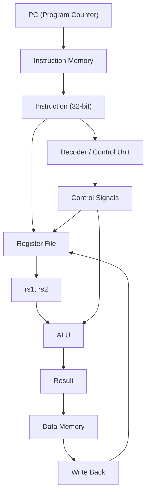
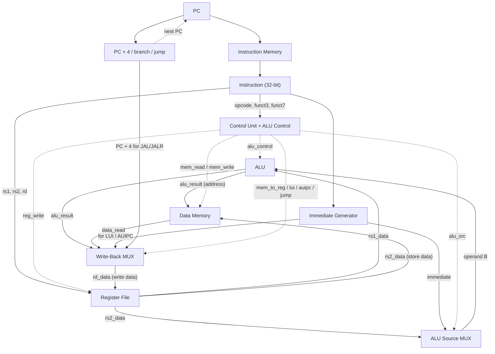
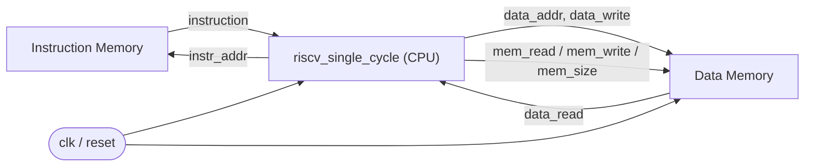

# 💻 Chapter 14: Build Your Own RISC-V Processor - Single-Cycle Design
## From ISA to Silicon - Complete Working CPU in Verilog!

> **"ISA was the plan. Now BUILD it. Time to create your own RISC-V processor!"**
>
> **"ISA ছিল plan। এবার বানাও। নিজের RISC-V processor তৈরি করো!"**

---

## 🎯 এই Chapter এ তুমি বানাবে:

```
✅ Complete RV32I Processor - 47 instructions
✅ Datapath Design - all paths & components
✅ Control Unit - instruction decoder
✅ Memory Interface - instruction & data
✅ ALU with all operations
✅ Branch Logic - comparisons & jumps
✅ Working CPU - runs real programs!
✅ তোমার নিজের RISC-V processor! 🎉
```

**Time Required:** 2 weeks (6-7 hours/day)  
**Prerequisites:** Chapters 12-13 complete

---

## 🌟 একটু থামো — তুমি অনেক দূর এসেছ!

এটাই সেই অধ্যায় যার জন্য এত পরিশ্রম: **তোমার নিজের CPU**। 🏅 আর গোপন কথা —
যন্ত্রাংশগুলো তুমি আগেই বানিয়ে ফেলেছ:

- **ALU** → Chapter 3 ও 5
- **Register File** → Chapter 4 ও 8
- **Program Counter ও Control logic** → Chapter 6

আজ আমরা শুধু এই টুকরোগুলো **তার দিয়ে জুড়ব**। নতুন কঠিন কিছু না — শুধু সংযোগ।

### 🚀 QUICK WIN (২ মিনিট): CPU-কে চোখে দেখো

পুরো datapath বানানোর আগে একটা instruction-এর যাত্রা মনে মনে অনুসরণ করো —
`add x3, x1, x2`:

```
1. Fetch     → PC দিয়ে memory থেকে instruction আনো
2. Decode    → বুঝলে: ADD, rs1=x1, rs2=x2, rd=x3
3. Read      → register file থেকে x1, x2 পড়ো
4. Execute   → ALU-তে x1 + x2 করো
5. Writeback → ফল x3-তে লেখো
```

ব্যস! একটা CPU আসলে এই ৫টা ধাপ বারবার করে। বুঝে ফেলেছ মানে অর্ধেক কাজ শেষ।
চলো এবার Verilog-এ বানাই! 💪

---

## 🚀 Quick Overview - Single-Cycle Processor

### Single-Cycle মানে কী?

নামটাই সব বলে দেয়: **single-cycle** মানে প্রতিটা instruction শুরু থেকে শেষ পর্যন্ত
**একটা মাত্র clock cycle-এ** সম্পূর্ণ হয়। clock-এর একটা rising edge আসে, আর তার
পরের rising edge আসার আগেই — instruction fetch হয়, decode হয়, ALU হিসাব করে,
দরকার হলে memory পড়ে/লেখে, এবং ফল register-এ ফিরে যায়। সব এক ধাক্কায়।

এটা বোঝার সবচেয়ে সহজ উপমা — **এক নিঃশ্বাসে একটা পুরো কাজ শেষ করা**। তুমি দম
নিলে (clock edge), একটা কাজ করলে, আবার দম নেওয়ার আগেই কাজটা শেষ। প্রতিটা কাজ
আলাদা দমে। কাজ ছোট হোক বা বড়, প্রতিটার জন্য তুমি একটা পুরো দম খরচ করছ।

এই "এক দমে এক কাজ" নকশার ভালো-মন্দ দুটোই আছে:

| দিক | কেন | মানে কী |
|------|-----|---------|
| ✅ Control logic সরল | কোনো state রাখতে হয় না, কোন cycle-এ আছি মনে রাখতে হয় না | বোঝা ও debug করা সহজ |
| ✅ Implement করা সহজ | পুরো ছবিটা একসাথে চোখের সামনে | শেখার জন্য আদর্শ |
| ✅ Debug করা সহজ | প্রতি cycle = ঠিক একটা instruction | waveform পড়া সোজা |
| ❌ Clock ধীর | সবচেয়ে ধীর instruction-ই cycle-এর দৈর্ঘ্য ঠিক করে | frequency কম |
| ❌ অপচয় | দ্রুত instruction-ও পুরো সময় বসে থাকে | শক্তি ও সময় নষ্ট |
| ❌ বাস্তবে অব্যবহৃত | আসল chip pipeline ব্যবহার করে | তবে শেখার জন্য চমৎকার! |

মূল কথাটা মনে রেখো — যেহেতু সব instruction-কে **একই দৈর্ঘ্যের** cycle-এর মধ্যে
শেষ হতে হয়, সেই cycle-টা যথেষ্ট লম্বা হতে হবে যেন **সবচেয়ে ধীর** instruction-ও
শেষ করতে পারে (সাধারণত `load`, কারণ সে memory পড়ে আবার register-এ লেখে)। ফলে
সরল `add`-ও সেই লম্বা সময় ধরে অপেক্ষা করে। এটাই single-cycle-এর জন্মগত সীমা —
আর ঠিক এই সমস্যা সমাধানের গল্পই Chapter 15 (multi-cycle) ও Chapter 16
(pipeline)। কিন্তু সরলতার জন্য, শেখার শুরুটা এখান থেকেই সেরা।

```
Clock Period = Longest instruction path
All instructions take same time
```

### Datapath Overview — পাখির চোখে পুরো ছবি

আগে পুরো গল্পটা এক নজরে দেখে নাও। তথ্য (data) একটা নদীর মতো বাঁ থেকে ডানে বয়ে
যায়: **PC** ঠিক করে কোন instruction আনতে হবে → **instruction memory** সেটা
এনে দেয় → **decoder** সেটা পড়ে বুঝে control signal বানায় → **register file**
থেকে operand পড়া হয় → **ALU** হিসাব করে → দরকার হলে **data memory** পড়ে/লেখে →
শেষে ফল আবার **register file**-এ ফিরে লেখা হয় (writeback)। এই একই চক্র প্রতি
cycle-এ ঘুরতে থাকে।



খেয়াল করো, তীরটা শেষে আবার register file-এ ফিরে এসেছে — এটাই **writeback**, যেখানে
এক instruction-এর ফল পরের instruction-এর জন্য তৈরি হয়ে যায়। এই "ফিরে আসা"-টাই
একটা CPU-কে জীবন্ত করে তোলে: প্রতিটা instruction আগেরটার রেখে যাওয়া অবস্থার উপর
কাজ করে।

🎉 **This chapter = Complete working CPU!**

---

## ১৪.১ Complete Datapath Design

একটা CPU আসলে কয়েকটা চেনা যন্ত্রাংশের একটা **দল** — আর তোমার দারুণ ব্যাপার হলো,
এই দলের প্রায় প্রত্যেককে তুমি আগের অধ্যায়ে আলাদা আলাদা বানিয়ে ফেলেছ। এখানে আমরা
তাদের নাম ধরে ডেকে নিই, পরিচয় ঝালিয়ে নিই, তারপর তার দিয়ে জুড়ে দল বানাই।

### Major Components — দলের সদস্যরা

| # | Component | কাজ | উপমা |
|---|-----------|-----|------|
| 1 | **Program Counter (PC)** | এখন কোন instruction চলছে তার address ধরে রাখে, প্রতি cycle-এ আপডেট হয় | বইয়ের bookmark — কোন লাইনে আছ |
| 2 | **Instruction Memory** | পুরো program জমা রাখে, শুধু পড়া যায় (read-only) | রেসিপি বই — শুধু পড়ছ, লিখছ না |
| 3 | **Register File** | ৩২টা register; একসাথে ২টা পড়া (read) ও ১টা লেখা (write) যায় | হাতের কাছের ৩২টা scratchpad |
| 4 | **ALU** | সব arithmetic/logic হিসাব ও তুলনা | দলের ক্যালকুলেটর |
| 5 | **Data Memory** | load/store-এর data; পড়া ও লেখা দুটোই | বড় গুদাম — দূরে, কিন্তু অনেক জায়গা |
| 6 | **Control Unit** | instruction পড়ে সবাইকে নির্দেশ (control signal) দেয় | দলের পরিচালক/conductor |
| 7 | **Multiplexer (MUX)** | কোন তার থেকে data নেবে তা বেছে নেয় | রেলের কাঁটা — কোন লাইনে গাড়ি যাবে |
| 8 | **Adder** | যোগ করে: PC+4, branch target ইত্যাদি | ছোট ডেডিকেটেড যোগকারী |

এদের মধ্যে **Control Unit** আর **MUX** দুটো নতুন ভূমিকায় মনোযোগ দাবি করে। বাকি
সবাই data নিয়ে কাজ করে; এই দুজন ঠিক করে data **কোন পথে** যাবে। Control Unit হলো
মস্তিষ্ক (instruction পড়ে সিদ্ধান্ত নেয়), আর MUX হলো সেই সিদ্ধান্ত কার্যকর করার
সুইচ। একই datapath দিয়ে ৪৭টা আলাদা instruction চলতে পারে শুধু এই কারণে — প্রতিটার
জন্য Control Unit আলাদা signal দেয়, আর MUX সেই অনুযায়ী আলাদা পথ খুলে দেয়।

### Datapath Diagram — এই চ্যাপ্টারের হৃদয় 🫀

এই একটা ছবি যদি মাথায় গেঁথে যায়, তাহলে পুরো single-cycle CPU তোমার মুঠোয়। নিচের
diagram-এ data কীভাবে বইয়ে যায় সেটা **শক্ত তীর** দিয়ে দেখানো, আর Control Unit কে
কোন signal কাকে পাঠিয়ে পথ ঠিক করে দিচ্ছে সেটা **ডটেড তীর** দিয়ে দেখানো। ভাবো,
শক্ত তীরগুলো হলো রাস্তা (data এদের উপর দিয়ে চলে), আর ডটেড তীরগুলো হলো ট্রাফিক
সিগন্যাল (Control Unit এদের দিয়ে রাস্তা খোলে-বন্ধ করে):



এখন diagram-টা পড়ার নিয়ম — উপর থেকে নিচে, প্রতিটা মোড়ে নিজেকে একটা প্রশ্ন করো:

1. **PC → Instruction Memory**: "এই cycle-এ কোন instruction?" PC address দেয়, IMEM
   ৩২-bit instruction ফেরত দেয়। পাশাপাশি একটা যোগকারী `PC + 4` হিসাব করে রাখে —
   কারণ পরের instruction সাধারণত পরের ঘরেই (`branch`/`jump` না হলে)।
2. **Instruction → তিন দিকে ভাগ**: instruction-এর bit-গুলো একসাথে তিন জায়গায় যায় —
   Control Unit-এ (`opcode`/`funct` পড়ে সিদ্ধান্ত), Register File-এ (`rs1`/`rs2`/`rd`
   কোন register), আর Immediate Generator-এ (ভেতরে লুকানো ধ্রুবক বের করতে)।
3. **ALU Source MUX**: এখানেই প্রথম বড় সিদ্ধান্ত — ALU-র দ্বিতীয় হাতে কী যাবে?
   `rs2_data` (যেমন `add x3,x1,x2`) নাকি `immediate` (যেমন `addi x3,x1,10`)? Control
   Unit-এর `alu_src` signal সেই সুইচ টেপে।
4. **ALU**: আসল হিসাব — যোগ, বিয়োগ, AND, shift, তুলনা... কোনটা করবে সেটা
   `alu_control` বলে দেয়।
5. **Data Memory**: শুধু `load`/`store`-এর জন্য। ALU-র ফলটা এখানে **address** হিসেবে
   কাজ করে (মনে রেখো, `lw`/`sw`-তে ALU ঠিকানা যোগ করে), আর `rs2_data` হলো `store`-এ
   লেখার data।
6. **Write-Back MUX**: শেষ বড় সিদ্ধান্ত — register-এ ঠিক **কোন** মানটা ফিরবে? ALU-র
   ফল? memory থেকে পড়া data? `LUI`-এর immediate? নাকি `JAL`-এর `PC+4` (return
   address)? Control Unit-এর কয়েকটা signal মিলে এই MUX-এর পথ ঠিক করে।
7. **Register File-এ writeback**: `reg_write` signal `1` হলে নির্বাচিত মানটা `rd`
   register-এ লেখা হয় — পরের instruction-এর জন্য তৈরি।

> 💡 **মূল অন্তর্দৃষ্টি:** datapath-টা **স্থির** (fixed) — তার আর গেট একবার বসানোর পর
> আর নড়ে না। যা বদলায় তা হলো **MUX-এর select আর control signal**। এই দুটো বদলে গিয়েই
> একই হার্ডওয়্যার একবার `add`, একবার `lw`, একবার `beq` চালায়। তাই control signal-গুলো
> ঠিকভাবে বোঝা মানে পুরো CPU বোঝা — আর সেটাই আমরা ১৪.৭-এ করব।

---

## ১৪.২ Program Counter Module

CPU-র গল্প শুরু হয় এখান থেকেই — **PC (Program Counter)** হলো সেই register যে ধরে
রাখে "এই মুহূর্তে কোন instruction-এর address-এ আছি"। ভাবো একটা বই পড়ছ আর তোমার
আঙুল কোন লাইনে আছে — PC হলো সেই আঙুল।

PC-র দুটোই বৈশিষ্ট্য খেয়াল করার মতো। প্রথমত, এটা **sequential** — `always @(posedge
clk)`, অর্থাৎ প্রতি clock edge-এ একবার করে আপডেট হয়, এর মাঝে স্থির থাকে। এই
স্থিরতাটাই দরকারি: পুরো cycle জুড়ে instruction memory একই address দেখবে, না হলে
fetch ঠিকঠাক হবে না। দ্বিতীয়ত, **reset** এলে PC `0`-তে ফিরে যায় — কারণ আমাদের
program memory-র শূন্য address থেকে শুরু হয়, তাই CPU চালু হলেই সে প্রথম
instruction-টা ধরবে।

```verilog
module program_counter(
    input wire clk,
    input wire reset,
    input wire [31:0] pc_next,
    output reg [31:0] pc
);
    always @(posedge clk or posedge reset) begin
        if (reset)
            pc <= 32'h00000000;  // Start at address 0
        else
            pc <= pc_next;
    end
endmodule
```

### PC Update Logic — পরের instruction কোথায়?

PC তো শুধু একটা মান **ধরে রাখে**; কিন্তু পরের cycle-এ সে কোন মান নেবে, সেটা ঠিক করে
এই `pc_update` module। আর সেটা একটা ছোট্ট অগ্রাধিকার-সিদ্ধান্ত (priority decision):

- **jump হলে** → সরাসরি `jump_target`-এ লাফ দাও (`JAL`/`JALR`)।
- নাহলে **branch নেওয়া হলে** → `branch_target`-এ যাও (`beq`/`bne` ইত্যাদি যখন শর্ত সত্য)।
- নাহলে → সবচেয়ে সাধারণ পথ, পরের পরপর instruction, অর্থাৎ `pc_current + 4`।

কেন **+4**? কারণ প্রতিটা RV32I instruction ঠিক **৪ byte** (৩২ bit)। তাই পরের
instruction ঠিক ৪ ঘর পরে। এটা `always @(*)` দিয়ে লেখা — মানে **combinational**,
কোনো clock লাগে না; input বদলালেই output সঙ্গে সঙ্গে বদলায়। এই হিসাবটা চলতি cycle-এ
হয়ে যায়, আর তার ফল পরের clock edge-এ PC গিলে নেয়। এভাবেই "এখন কোথায় আছি" আর
"পরে কোথায় যাব" — এই দুটো কাজ পরিষ্কার দুই module-এ ভাগ হয়ে যায়।

```verilog
module pc_update(
    input wire [31:0] pc_current,
    input wire [31:0] branch_target,
    input wire [31:0] jump_target,
    input wire branch_taken,
    input wire jump,
    output reg [31:0] pc_next
);
    always @(*) begin
        if (jump)
            pc_next = jump_target;
        else if (branch_taken)
            pc_next = branch_target;
        else
            pc_next = pc_current + 4;  // Sequential
    end
endmodule
```

---

## ১৪.৩ Register File - 32 Registers

ALU যদি দলের ক্যালকুলেটর হয়, তাহলে **register file** হলো তার হাতের কাছের scratchpad —
৩২টা ৩২-bit register (`x0` থেকে `x31`), যেখানে CPU তার চলতি কাজের data রাখে। memory
দূরের গুদাম (ধীর); register file নাকের ডগায় (দ্রুত)। তাই প্রায় প্রতিটা instruction
register নিয়েই কাজ করে।

এই module-টায় তিনটা সূক্ষ্ম কিন্তু গুরুত্বপূর্ণ নকশা-সিদ্ধান্ত লুকিয়ে আছে, খেয়াল করো:

- **দুটো read, একটা write — একসাথে।** single-cycle CPU-তে একটা instruction (যেমন
  `add x3,x1,x2`) এক cycle-এই দুই operand পড়বে (`x1`, `x2`) এবং ফল লিখবে (`x3`)। তাই
  দুটো read port (`rs1`/`rs2`) আর একটা write port (`rd`) — তিনটাই একসাথে দরকার।
- **read আর write-এর সময় আলাদা।** write হয় `always @(posedge clk)`-এ, অর্থাৎ
  **clock edge-এ** (sequential)। কিন্তু read হয় নিচের `assign` দিয়ে —
  **combinational**, কোনো clock ছাড়াই সঙ্গে সঙ্গে। এতে একই cycle-এ আগে operand পড়া,
  তারপর ALU হিসাব, তারপর edge-এ ফল লেখা — সব সুন্দর মিলে যায়।
- **`x0` সবসময় শূন্য।** RISC-V-এর নিয়ম: `x0` register সবসময় `0`, তাতে যত খুশি লেখো
  কিছু বদলায় না। তাই write-এ `rd_addr != 0` শর্ত (x0-তে লেখা আটকানো), আর read-এ
  `rs?_addr == 0` হলে সরাসরি `0` ফেরত। এই ছোট্ট নিয়মটা অনেক কাজে লাগে — `add x5,x0,x6`
  মানেই `x5 = x6` (copy), `addi x5,x0,10` মানেই `x5 = 10` (constant load)।

```verilog
module register_file(
    input wire clk,
    input wire reset,
    // Read ports
    input wire [4:0] rs1_addr,
    input wire [4:0] rs2_addr,
    output wire [31:0] rs1_data,
    output wire [31:0] rs2_data,
    // Write port
    input wire [4:0] rd_addr,
    input wire [31:0] rd_data,
    input wire reg_write
);
    // 32 registers, x0-x31
    reg [31:0] registers [0:31];
    
    integer i;
    always @(posedge clk or posedge reset) begin
        if (reset) begin
            for (i = 0; i < 32; i = i + 1)
                registers[i] <= 32'h00000000;
        end else if (reg_write && rd_addr != 0) begin
            registers[rd_addr] <= rd_data;
        end
    end
    
    // x0 is always 0
    assign rs1_data = (rs1_addr == 0) ? 32'h00000000 : registers[rs1_addr];
    assign rs2_data = (rs2_addr == 0) ? 32'h00000000 : registers[rs2_addr];
endmodule
```

---

## ১৪.৪ ALU - Complete Operations

**ALU (Arithmetic Logic Unit)** হলো CPU-র হিসাবকারী মাংসপেশি। দুটো ৩২-bit input
(`a`, `b`) নেয়, একটা ৪-bit `alu_control` দেখে ঠিক করে কোন কাজটা করবে, আর একটা ৩২-bit
`result` ফেরত দেয়। তুমি এটা Chapter 3 ও 5-এ আগেই বানিয়েছ — এখানে শুধু সব
operation একসাথে এনে CPU-র কাজে লাগাচ্ছি।

দুটো জিনিস নতুন করে খেয়াল করার মতো। প্রথমত, `alu_control` একটা **selector** — পুরো
ALU হলো একটা বড় MUX, যা `alu_control`-এর মান দেখে কোন হিসাবের ফলটা বাইরে পাঠাবে তা
বেছে নেয়। দ্বিতীয়ত, পাশে দুটো ছোট কিন্তু দামি signal: `zero` (ফল `0` কিনা — branch-এর
সমতা যাচাইয়ে কাজে লাগে) আর `negative` (ফলের সবচেয়ে উপরের bit, অর্থাৎ চিহ্ন)।

```verilog
module alu(
    input wire [31:0] a,
    input wire [31:0] b,
    input wire [3:0] alu_control,
    output reg [31:0] result,
    output wire zero,
    output wire negative
);
    // ALU operations
    localparam ALU_ADD  = 4'b0000;
    localparam ALU_SUB  = 4'b0001;
    localparam ALU_AND  = 4'b0010;
    localparam ALU_OR   = 4'b0011;
    localparam ALU_XOR  = 4'b0100;
    localparam ALU_SLL  = 4'b0101;  // Shift left logical
    localparam ALU_SRL  = 4'b0110;  // Shift right logical
    localparam ALU_SRA  = 4'b0111;  // Shift right arithmetic
    localparam ALU_SLT  = 4'b1000;  // Set less than (signed)
    localparam ALU_SLTU = 4'b1001;  // Set less than (unsigned)
    
    always @(*) begin
        case (alu_control)
            ALU_ADD:  result = a + b;
            ALU_SUB:  result = a - b;
            ALU_AND:  result = a & b;
            ALU_OR:   result = a | b;
            ALU_XOR:  result = a ^ b;
            ALU_SLL:  result = a << b[4:0];
            ALU_SRL:  result = a >> b[4:0];
            ALU_SRA:  result = $signed(a) >>> b[4:0];
            ALU_SLT:  result = ($signed(a) < $signed(b)) ? 32'h00000001 : 32'h00000000;
            ALU_SLTU: result = (a < b) ? 32'h00000001 : 32'h00000000;
            default:  result = 32'h00000000;
        endcase
    end
    
    assign zero = (result == 32'h00000000);
    assign negative = result[31];
endmodule
```

এই ১০টা operation মিলে RV32I-এর সব arithmetic ও logic instruction চালাতে পারে।
এক নজরে দেখে নাও কোন code কোন কাজ করে:

| `alu_control` | Operation | কাজ | উদাহরণ instruction |
|:---:|:---|:---|:---|
| `0000` | ADD  | যোগ | `add`, `addi`, এবং `lw`/`sw`-এর address হিসাব |
| `0001` | SUB  | বিয়োগ | `sub`, এবং branch-এর তুলনা |
| `0010` | AND  | bitwise AND | `and`, `andi` |
| `0011` | OR   | bitwise OR | `or`, `ori` |
| `0100` | XOR  | bitwise XOR | `xor`, `xori` |
| `0101` | SLL  | বাঁয়ে shift (logical) | `sll`, `slli` |
| `0110` | SRL  | ডানে shift (logical, উপরে ০ ভরে) | `srl`, `srli` |
| `0111` | SRA  | ডানে shift (arithmetic, চিহ্ন রক্ষা করে) | `sra`, `srai` |
| `1000` | SLT  | signed তুলনা: `a < b` হলে ১ | `slt`, `slti` |
| `1001` | SLTU | unsigned তুলনা: `a < b` হলে ১ | `sltu`, `sltiu` |

> 💡 **SRL বনাম SRA — কেন দুটো?** SRL উপরের খালি জায়গায় সবসময় `0` ভরে; ঠিক আছে
> যদি সংখ্যাটা unsigned হয়। কিন্তু signed (ঋণাত্মক) সংখ্যা ডানে shift করলে চিহ্নটা
> রাখা দরকার — না হলে `-8 >> 1` ভুল করে বড় ধনাত্মক সংখ্যা হয়ে যাবে। তাই SRA চিহ্ন
> bit-টা টেনে নামায় (`$signed(a) >>> ...`)। ছোট পার্থক্য, কিন্তু গণিতে বিরাট তফাত।

---

## ১৪.৫ Branch Comparator

Branch instruction (`beq`, `bne`, `blt`...) হলো program-কে "যদি... তাহলে..." বলার
উপায় — loop, `if`, সব শর্তের ভিত্তি। কিন্তু একটা প্রশ্ন: branch নেওয়া হবে কি হবে না,
সেই সিদ্ধান্ত কে নেয়? এখানে আমরা ALU-র উপর সব ভার না দিয়ে একটা ছোট ডেডিকেটেড
**branch comparator** বানিয়েছি, যে শুধু দুটো register-এর মান তুলনা করে এক bit answer
দেয়: `branch_taken` (১ মানে শর্ত সত্য, লাফ দাও)।

কোন তুলনা করবে সেটা ঠিক করে `funct3` — instruction-এর ভেতরের ৩-bit ক্ষেত্র, যা
RISC-V-এর encoding-এ প্রতিটা branch-কে আলাদা করে। নিচের `case` ঠিক সেই encoding-ই
অনুসরণ করছে:

```verilog
module branch_comparator(
    input wire [31:0] rs1_data,
    input wire [31:0] rs2_data,
    input wire [2:0] funct3,
    output reg branch_taken
);
    wire signed [31:0] rs1_signed = rs1_data;
    wire signed [31:0] rs2_signed = rs2_data;
    
    always @(*) begin
        case (funct3)
            3'b000: branch_taken = (rs1_data == rs2_data);              // BEQ
            3'b001: branch_taken = (rs1_data != rs2_data);              // BNE
            3'b100: branch_taken = (rs1_signed < rs2_signed);           // BLT
            3'b101: branch_taken = (rs1_signed >= rs2_signed);          // BGE
            3'b110: branch_taken = (rs1_data < rs2_data);               // BLTU
            3'b111: branch_taken = (rs1_data >= rs2_data);              // BGEU
            default: branch_taken = 1'b0;
        endcase
    end
endmodule
```

ছয়টা branch, তিন জোড়ায় ভাগ — প্রতি জোড়া একে অপরের উল্টো:

| `funct3` | Instruction | শর্ত | মানে |
|:---:|:---:|:---|:---|
| `000` | BEQ  | `rs1 == rs2` | সমান হলে |
| `001` | BNE  | `rs1 != rs2` | অসমান হলে |
| `100` | BLT  | `rs1 < rs2` (signed) | ছোট হলে (চিহ্ন ধরে) |
| `101` | BGE  | `rs1 >= rs2` (signed) | বড়-বা-সমান হলে (চিহ্ন ধরে) |
| `110` | BLTU | `rs1 < rs2` (unsigned) | ছোট হলে (চিহ্ন ছাড়া) |
| `111` | BGEU | `rs1 >= rs2` (unsigned) | বড়-বা-সমান হলে (চিহ্ন ছাড়া) |

> 💡 **signed বনাম unsigned কেন আলাদা?** `BLT` ব্যবহার করে `wire signed`, তাই
> `0xFFFFFFFF`-কে `-1` ধরে (ছোট)। কিন্তু `BLTU`-তে একই bit-pattern হলো
> ৪,২৯৪,৯৬৭,২৯৫ (বিশাল ধনাত্মক)। তাই `-1 < 5` সত্য (BLT), অথচ unsigned-এ
> `4294967295 < 5` মিথ্যা (BLTU)। দুটোই দরকার — তোমার ডেটা signed না unsigned, সেই
> বুঝে compiler ঠিক branch-টা বেছে নেয়।

---

## ১৪.৬ Immediate Generator

অনেক instruction-এর ভেতরে একটা **ধ্রুবক (constant)** লুকানো থাকে — `addi x5,x0,10`-এর
সেই `10`, বা `lw x5, 8(x6)`-এর সেই offset `8`। এই ভেতরে-লেখা ধ্রুবককে বলে
**immediate**। Immediate Generator-এর কাজ একটাই: instruction-এর bit-গুলো থেকে এই
ধ্রুবকটা বের করে পুরো ৩২ bit-এ সাজিয়ে দেওয়া।

কিন্তু একটা মোচড় আছে — RISC-V immediate-এর bit-গুলোকে instruction-এর মধ্যে **এলোমেলো
করে** ছড়িয়ে রাখে! কেন এই পাগলামি? হার্ডওয়্যারের সুবিধার জন্য: এভাবে সাজালে প্রতিটা
format-এ immediate-এর বেশিরভাগ bit একই তারে থাকে, ফলে decode-এর জন্য কম MUX লাগে।
মানুষের চোখে এলোমেলো, কিন্তু সিলিকনের জন্য পরিপাটি। তাই প্রতিটা format-এর জন্য আলাদা
নিয়মে bit-গুলো জোড়া লাগাতে হয় — `case (opcode)` ঠিক সেটাই করছে।

আর একটা সাধারণ থিম খেয়াল করো: প্রায় সব immediate **sign-extended**। মানে immediate-এর
সবচেয়ে উপরের bit (`instruction[31]`) বারবার নকল করে উপরের খালি জায়গা ভরা হয় (যেমন
`{{20{instruction[31]}}, ...}`), যাতে ঋণাত্মক ধ্রুবক ৩২ bit-এও ঋণাত্মকই থাকে।

```verilog
module imm_gen(
    input wire [31:0] instruction,
    output reg [31:0] immediate
);
    wire [6:0] opcode = instruction[6:0];
    
    always @(*) begin
        case (opcode)
            // I-Type (ADDI, SLTI, XORI, ORI, ANDI, loads, JALR)
            7'b0010011, 7'b0000011, 7'b1100111: begin
                immediate = {{20{instruction[31]}}, instruction[31:20]};
            end
            
            // S-Type (stores)
            7'b0100011: begin
                immediate = {{20{instruction[31]}}, instruction[31:25], instruction[11:7]};
            end
            
            // B-Type (branches)
            7'b1100011: begin
                immediate = {{19{instruction[31]}}, instruction[31], 
                            instruction[7], instruction[30:25], 
                            instruction[11:8], 1'b0};
            end
            
            // U-Type (LUI, AUIPC)
            7'b0110111, 7'b0010111: begin
                immediate = {instruction[31:12], 12'b0};
            end
            
            // J-Type (JAL)
            7'b1101111: begin
                immediate = {{11{instruction[31]}}, instruction[31], 
                            instruction[19:12], instruction[20], 
                            instruction[30:21], 1'b0};
            end
            
            default: immediate = 32'h00000000;
        endcase
    end
endmodule
```

পাঁচটা immediate format, পাঁচ রকম instruction-এর জন্য:

| Format | কাদের জন্য | immediate-এ কী থাকে |
|:---:|:---|:---|
| **I-type** | `ADDI`/`SLTI`/`XORI`... loads, `JALR` | ছোট ১২-bit signed ধ্রুবক বা offset |
| **S-type** | stores (`SW`/`SH`/`SB`) | store-এর address offset (bit-গুলো দুই টুকরোয় ভাগ) |
| **B-type** | branches | branch target পর্যন্ত দূরত্ব (২-এর গুণিতক, তাই সবচেয়ে নিচে `0`) |
| **U-type** | `LUI`, `AUIPC` | উপরের ২০ bit (নিচের ১২ bit `0`) — বড় ধ্রুবক বানাতে |
| **J-type** | `JAL` | jump target পর্যন্ত দূরত্ব (B-এর মতোই নিচে `0`) |

> 💡 **B ও J-এর নিচে `1'b0` কেন?** branch ও jump target সবসময় জোড় address-এ
> (২ byte-এর গুণিতক), তাই সবচেয়ে নিচের bit সবসময় `0` — সেটা encode করার দরকারই নেই,
> hardware-ই বসিয়ে দেয়। এতে একই bit-সংখ্যায় দ্বিগুণ দূর লাফানো যায়।

---

## ১৪.৭ Control Unit - Complete Decoder

এতক্ষণ আমরা যন্ত্রাংশ বানিয়েছি; এবার দলের **পরিচালক** — Control Unit। মনে আছে
datapath diagram-এর সেই ডটেড তীরগুলো? সব ওখান থেকেই বের হয়। Control Unit-এর কাজ
একটাই, কিন্তু সবচেয়ে দামি: instruction-এর `opcode` (ও দরকারে `funct3`/`funct7`) পড়ে
ঠিক করে দেওয়া **প্রতিটা MUX কোন পথ নেবে, কে data পড়বে/লিখবে, memory চলবে কিনা** —
অর্থাৎ control signal-গুলোর মান।

এটা পুরোটাই **combinational** — `always @(*)` দিয়ে লেখা একটা বড় lookup table। কোনো
state নেই, clock নেই; `opcode` ঢুকলেই signal বেরিয়ে আসে। এই সরলতাই single-cycle-এর
সৌন্দর্য।

কোডটা পড়ার সময় **একটা প্যাটার্ন** খেয়াল রাখো, এটাই সব বোঝার চাবি: প্রথমে সব signal
**default `0`** করে দেওয়া হয় (অর্থাৎ "কিছু করবে না" — কোনো write না, কোনো memory
access না)। তারপর প্রতিটা `opcode`-এর জন্য শুধু **যেগুলো `1` হওয়া দরকার** সেগুলোই
on করা হয়। এই "default off, তারপর প্রয়োজন মতো on" কৌশলে ভুলে কোনো signal ছেড়ে দেওয়ার
ঝুঁকি থাকে না — যা বলোনি, তা আপনিই `0`।

```verilog
module control_unit(
    input wire [6:0] opcode,
    input wire [2:0] funct3,
    input wire [6:0] funct7,
    // Control signals
    output reg branch,
    output reg mem_read,
    output reg mem_to_reg,
    output reg [1:0] alu_op,
    output reg mem_write,
    output reg alu_src,
    output reg reg_write,
    output reg jump,
    output reg auipc,
    output reg lui
);
    always @(*) begin
        // Default values
        branch = 0;
        mem_read = 0;
        mem_to_reg = 0;
        alu_op = 2'b00;
        mem_write = 0;
        alu_src = 0;
        reg_write = 0;
        jump = 0;
        auipc = 0;
        lui = 0;
        
        case (opcode)
            // R-type (ADD, SUB, AND, OR, XOR, SLL, SRL, SRA, SLT, SLTU)
            7'b0110011: begin
                reg_write = 1;
                alu_op = 2'b10;  // ALU uses funct3/funct7
            end
            
            // I-type arithmetic (ADDI, SLTI, SLTIU, XORI, ORI, ANDI)
            7'b0010011: begin
                reg_write = 1;
                alu_src = 1;  // Use immediate
                alu_op = 2'b10;
            end
            
            // Load instructions (LW, LH, LB, LHU, LBU)
            7'b0000011: begin
                reg_write = 1;
                alu_src = 1;
                mem_read = 1;
                mem_to_reg = 1;
                alu_op = 2'b00;  // ADD for address
            end
            
            // Store instructions (SW, SH, SB)
            7'b0100011: begin
                alu_src = 1;
                mem_write = 1;
                alu_op = 2'b00;  // ADD for address
            end
            
            // Branch instructions (BEQ, BNE, BLT, BGE, BLTU, BGEU)
            7'b1100011: begin
                branch = 1;
                alu_op = 2'b01;  // Subtraction for compare
            end
            
            // JAL
            7'b1101111: begin
                reg_write = 1;
                jump = 1;
            end
            
            // JALR
            7'b1100111: begin
                reg_write = 1;
                alu_src = 1;
                jump = 1;
                alu_op = 2'b00;  // ADD for target
            end
            
            // LUI
            7'b0110111: begin
                reg_write = 1;
                lui = 1;
            end
            
            // AUIPC
            7'b0010111: begin
                reg_write = 1;
                auipc = 1;
            end
            
            default: begin
                // NOP or invalid instruction
            end
        endcase
    end
endmodule
```

প্রতিটা signal আসলে কী বলছে, তা না বুঝলে এই module শুধু রহস্য মনে হবে। তাই সংক্ষেপে:

| Signal | `1` হলে মানে |
|:---|:---|
| `reg_write` | ফল register-এ লেখো (writeback করো) |
| `alu_src` | ALU-র দ্বিতীয় হাতে `rs2` নয়, `immediate` দাও |
| `mem_read` | data memory থেকে পড়ো (load) |
| `mem_write` | data memory-তে লেখো (store) |
| `mem_to_reg` | register-এ ALU-র ফল নয়, memory থেকে পড়া data লেখো |
| `branch` | এটা branch instruction (comparator-এর সাথে মিলে target ঠিক হবে) |
| `jump` | এটা jump (`JAL`/`JALR`) |
| `lui` / `auipc` | এই দুটো বিশেষ upper-immediate instruction-এর জন্য |
| `alu_op` | ALU Control-কে ইঙ্গিত: এটা কোন ধরনের কাজ (নিচে ১৪.৭-এর শেষাংশে) |

এবার পুরো ছবিটা এক টেবিলে — প্রতিটা instruction-শ্রেণির জন্য Control Unit ঠিক কোন
signal-গুলো on করে। এই একটা টেবিল মুখস্থ না করে **বুঝলে** তুমি যেকোনো instruction-এর
পথ চোখ বুজে আঁকতে পারবে (`-` মানে `0`/আলগা):

| opcode | শ্রেণি | `reg_write` | `alu_src` | `mem_read` | `mem_write` | `mem_to_reg` | `branch` | `jump` | `alu_op` |
|:---|:---|:---:|:---:|:---:|:---:|:---:|:---:|:---:|:---:|
| `0110011` | R-type | 1 | - | - | - | - | - | - | `10` |
| `0010011` | I-arith | 1 | 1 | - | - | - | - | - | `10` |
| `0000011` | Load | 1 | 1 | 1 | - | 1 | - | - | `00` |
| `0100011` | Store | - | 1 | - | 1 | - | - | - | `00` |
| `1100011` | Branch | - | - | - | - | - | 1 | - | `01` |
| `1101111` | JAL | 1 | - | - | - | - | - | 1 | - |
| `1100111` | JALR | 1 | 1 | - | - | - | - | 1 | `00` |
| `0110111` | LUI | 1 | - | - | - | - | - | - | (`lui`=1) |
| `0010111` | AUIPC | 1 | - | - | - | - | - | - | (`auipc`=1) |

> 💡 **টেবিলটা পড়ার সহজ পথ:** শুধু জিজ্ঞেস করো "এই instruction কি register-এ ফল
> লেখে?" (→ `reg_write`), "ALU-র দ্বিতীয় হাতে immediate লাগবে?" (→ `alu_src`),
> "memory ছোঁবে?" (→ `mem_read`/`mem_write`)। এই তিন প্রশ্নের উত্তরেই বেশিরভাগ signal
> বেরিয়ে আসে। যেমন `lw` সব দিক দিয়েই "হ্যাঁ": register-এ লেখে, immediate লাগে (offset),
> এবং memory পড়ে — তাই তার সারিতে এত `1`।

### ALU Control:

`alu_op` মাত্র ২ bit — তাহলে সে কীভাবে ALU-র ১০টা operation আলাদা করে? উত্তর: করে
না, একাই করে না। এখানেই একটা সুন্দর **দুই-স্তরের decode** কৌশল। Control Unit মোটা
দাগে বলে "এটা কোন ধরনের কাজ" (`alu_op`), আর এই `alu_control` module তার সাথে
`funct3`/`funct7`-এর সূক্ষ্ম তথ্য মিলিয়ে ঠিক ৪-bit `alu_control_out` বানায়:

- `alu_op = 00` → load/store, সবসময় **ADD** (address হিসাব)।
- `alu_op = 01` → branch, সবসময় **SUB** (দুই মান বিয়োগ করে তুলনা)।
- `alu_op = 10` → R-type বা I-arith — এখানেই `funct3`/`funct7` দেখে আসল operation
  (`ADD`/`SUB`/`AND`/`OR`/`SLL`...) বাছাই হয়।

কেন এই দুই-স্তর? কারণ load, store, branch-এর জন্য `funct3` দেখার দরকারই নেই (ALU
শুধু যোগ/বিয়োগ করবে), তাই Control Unit ছোট ইঙ্গিতেই কাজ সারে। শুধু arithmetic-এর
বেলায় (`alu_op=10`) পুরো `funct3`/`funct7` দরকার — আর সেই কাজটা এই আলাদা module-এ
সরিয়ে রাখলে Control Unit ছোট ও পরিষ্কার থাকে।

```verilog
module alu_control(
    input wire [1:0] alu_op,
    input wire [2:0] funct3,
    input wire [6:0] funct7,
    input wire is_rtype,   // 1 only for R-type (OP); ADDI must never become SUB
    output reg [3:0] alu_control_out
);
    always @(*) begin
        case (alu_op)
            2'b00: begin  // Load/Store (ADD)
                alu_control_out = 4'b0000;  // ADD
            end
            
            2'b01: begin  // Branch (SUB)
                alu_control_out = 4'b0001;  // SUB
            end
            
            2'b10: begin  // R-type or I-type
                case (funct3)
                    3'b000: begin  // ADD / SUB
                        // SUB only for R-type. For I-type (ADDI) instr[30] is an
                        // immediate bit, NOT funct7 — there is no SUBI in RV32I.
                        if (funct7[5] && is_rtype)
                            alu_control_out = 4'b0001;  // SUB
                        else
                            alu_control_out = 4'b0000;  // ADD
                    end
                    3'b001: alu_control_out = 4'b0101;  // SLL
                    3'b010: alu_control_out = 4'b1000;  // SLT
                    3'b011: alu_control_out = 4'b1001;  // SLTU
                    3'b100: alu_control_out = 4'b0100;  // XOR
                    3'b101: begin  // SRL/SRA
                        if (funct7[5])
                            alu_control_out = 4'b0111;  // SRA
                        else
                            alu_control_out = 4'b0110;  // SRL
                    end
                    3'b110: alu_control_out = 4'b0011;  // OR
                    3'b111: alu_control_out = 4'b0010;  // AND
                    default: alu_control_out = 4'b0000;
                endcase
            end
            
            default: alu_control_out = 4'b0000;
        endcase
    end
endmodule
```

> ⚠️ **একটা সূক্ষ্ম ফাঁদ — `is_rtype` কেন দরকার?** খেয়াল করো `funct3 == 000`-এর
> ভেতরে `if (funct7[5] && is_rtype)` শর্ত। `add` আর `sub` দুটোরই `funct3` `000`;
> তাদের আলাদা করে `funct7`-এর bit 5 (`add`-এ `0`, `sub`-এ `1`)। কিন্তু `addi`-তে
> সেই একই bit আসলে **immediate-এর অংশ**, `funct7` নয় — RV32I-তে `SUBI` বলে কিছু
> নেই! তাই `is_rtype` (শুধু R-type হলে `1`) দিয়ে নিশ্চিত করা হয় যে immediate-এর `1`
> ভুল করে `addi`-কে `sub` বানিয়ে না ফেলে। এটাই সেই ধরনের সূক্ষ্ম বাগ যা simulation
> ছাড়া ধরা কঠিন — আর এই কোড সেটা ধরে রেখেছে।

---

## ১৪.৮ Top-Level Processor

এই মুহূর্তটার জন্যই এত আয়োজন। 🎉 এতক্ষণ আমরা টুকরো টুকরো module বানিয়েছি; এবার
সেগুলো **তার দিয়ে জুড়ে** একটা জীবন্ত CPU বানাব। এই `riscv_single_cycle` module-টা
আসলে datapath diagram-এরই Verilog রূপ — প্রতিটা `wire` সেই diagram-এর একটা তীর,
প্রতিটা module-instance একটা বাক্স।

কোডটা পড়ার আগে এর গঠনটা মাথায় রাখো, তাহলে হারিয়ে যাবে না:

1. **Internal wires ঘোষণা** — module-গুলোর মাঝে data বইবে যেসব তারে।
2. **Instruction fields বের করা** — `instruction`-এর bit কেটে `opcode`, `rs1`, `rd`...
   আলাদা করা (RISC-V-এর fixed encoding বলে এটা শুধু তার কেটে নেওয়া, কোনো হিসাব নয়)।
3. **প্রতিটা module instantiate করা** — PC, register file, ALU, control unit...
   প্রত্যেককে তার port-এ সঠিক wire জুড়ে দেওয়া।
4. **MUX-গুলো `assign` দিয়ে বানানো** — diagram-এর সেই গুরুত্বপূর্ণ সিদ্ধান্ত-বিন্দু,
   যেমন ALU source MUX আর write-back MUX।

বিশেষভাবে তিনটে `assign` লাইনে চোখ রাখো, এগুলোই পুরো CPU-র "জোড়": (ক) `alu_b =
alu_src ? immediate : rs2_data` — ALU source MUX; (খ) `rd_data = lui ? ... : auipc ?
... : ...` — writeback MUX, একটা সাজানো অগ্রাধিকার-শিকল; (গ) `jump_target` — `JALR`
আর `JAL`-এর target আলাদাভাবে হিসাব। বাকি সব শুধু আগের module-গুলো সঠিক তারে বসানো।

```verilog
module riscv_single_cycle(
    input wire clk,
    input wire reset,
    // Memory interfaces
    output wire [31:0] instr_addr,
    input wire [31:0] instruction,
    output wire [31:0] data_addr,
    output wire [31:0] data_write,
    input wire [31:0] data_read,
    output wire mem_write,
    output wire mem_read,
    output wire [2:0] mem_size,  // Byte, halfword, word
    // Debug
    output wire [31:0] pc_debug
);
    // Internal signals
    wire [31:0] pc, pc_next;
    wire [31:0] immediate;
    wire [31:0] rs1_data, rs2_data, rd_data;
    wire [31:0] alu_result, alu_b;
    wire [31:0] branch_target, jump_target;
    wire [3:0] alu_control_sig;
    wire [1:0] alu_op;
    
    wire branch, jump, alu_src, reg_write;
    wire mem_to_reg, auipc, lui;
    wire branch_taken;
    wire zero, negative;
    
    // Extract instruction fields
    wire [6:0] opcode = instruction[6:0];
    wire [4:0] rd = instruction[11:7];
    wire [2:0] funct3 = instruction[14:12];
    wire [4:0] rs1 = instruction[19:15];
    wire [4:0] rs2 = instruction[24:20];
    wire [6:0] funct7 = instruction[31:25];
    
    // Program Counter
    program_counter pc_inst(
        .clk(clk),
        .reset(reset),
        .pc_next(pc_next),
        .pc(pc)
    );
    
    // PC Update Logic
    assign branch_target = pc + immediate;
    assign jump_target = (opcode == 7'b1100111) ? 
                        (rs1_data + immediate) & ~32'h1 :  // JALR
                        (pc + immediate);                    // JAL
    
    pc_update pc_update_inst(
        .pc_current(pc),
        .branch_target(branch_target),
        .jump_target(jump_target),
        .branch_taken(branch & branch_taken),
        .jump(jump),
        .pc_next(pc_next)
    );
    
    // Instruction memory interface
    assign instr_addr = pc;
    
    // Immediate Generator
    imm_gen imm_gen_inst(
        .instruction(instruction),
        .immediate(immediate)
    );
    
    // Register File
    register_file rf_inst(
        .clk(clk),
        .reset(reset),
        .rs1_addr(rs1),
        .rs2_addr(rs2),
        .rs1_data(rs1_data),
        .rs2_data(rs2_data),
        .rd_addr(rd),
        .rd_data(rd_data),
        .reg_write(reg_write)
    );
    
    // Control Unit
    control_unit ctrl_inst(
        .opcode(opcode),
        .funct3(funct3),
        .funct7(funct7),
        .branch(branch),
        .mem_read(mem_read),
        .mem_to_reg(mem_to_reg),
        .alu_op(alu_op),
        .mem_write(mem_write),
        .alu_src(alu_src),
        .reg_write(reg_write),
        .jump(jump),
        .auipc(auipc),
        .lui(lui)
    );
    
    // ALU Control
    alu_control alu_ctrl_inst(
        .alu_op(alu_op),
        .funct3(funct3),
        .funct7(funct7),
        .is_rtype(opcode == 7'b0110011),  // R-type only
        .alu_control_out(alu_control_sig)
    );
    
    // ALU Source Mux
    assign alu_b = alu_src ? immediate : rs2_data;
    
    // ALU
    alu alu_inst(
        .a(rs1_data),
        .b(alu_b),
        .alu_control(alu_control_sig),
        .result(alu_result),
        .zero(zero),
        .negative(negative)
    );
    
    // Branch Comparator
    branch_comparator branch_comp(
        .rs1_data(rs1_data),
        .rs2_data(rs2_data),
        .funct3(funct3),
        .branch_taken(branch_taken)
    );
    
    // Data Memory Interface
    assign data_addr = alu_result;
    assign data_write = rs2_data;
    assign mem_size = funct3;  // Byte/halfword/word from funct3
    
    // Write-back Mux
    assign rd_data = lui ? immediate :
                    auipc ? (pc + immediate) :
                    jump ? (pc + 4) :
                    mem_to_reg ? data_read :
                    alu_result;
    
    // Debug
    assign pc_debug = pc;
endmodule
```

### Write-Back MUX-টা একটু ভেঙে দেখা

ওই শেষের `rd_data` assign-টা প্রথম দেখায় গোলমেলে লাগতে পারে, কিন্তু এটা আসলে একটা
সাজানো **অগ্রাধিকার-শিকল** (priority chain) — উপর থেকে নিচে যেটা প্রথম সত্য, সেটাই
জেতে:

| অগ্রাধিকার | শর্ত | register-এ কী লেখা হয় | কোন instruction |
|:---:|:---|:---|:---|
| ১ | `lui` | `immediate` | `LUI` |
| ২ | `auipc` | `pc + immediate` | `AUIPC` |
| ৩ | `jump` | `pc + 4` (return address) | `JAL`, `JALR` |
| ৪ | `mem_to_reg` | `data_read` (memory থেকে) | `lw` ইত্যাদি |
| ৫ | (default) | `alu_result` | `add`, `addi`, `slt`... |

খেয়াল করো `jump` হলে register-এ যায় `pc + 4` — কারণ function থেকে ফেরার সময় CPU-কে
জানতে হবে কোথায় ফিরবে, আর সেটা হলো `jal`-এর ঠিক পরের instruction। এটাই
`jal ra, func`-এর সেই "ra-তে return address রাখা"।

### এক instruction-এর পুরো যাত্রা — `lw x5, 8(x6)`

এই module-টা সত্যিই বুঝেছ কিনা যাচাই করতে, একটা load instruction-কে উপরের তারগুলো
ধরে ধরে অনুসরণ করো:

1. `pc` → `instr_addr` → instruction memory `lw x5, 8(x6)` ফেরত দেয়।
2. fields কাটা হয়: `opcode=0000011`, `rs1=x6`, `rd=x5`, `funct3=010` (word)।
3. Control Unit `opcode` দেখে on করে: `reg_write`, `alu_src`, `mem_read`,
   `mem_to_reg`; `alu_op=00`।
4. imm_gen ৮ (offset) বের করে; register file `x6`-এর মান পড়ে (`rs1_data`)।
5. `alu_src=1`, তাই ALU-র দ্বিতীয় হাতে যায় `immediate` (৮)। ALU Control `alu_op=00`
   থেকে **ADD** ঠিক করে → `alu_result = x6 + 8` = **address**।
6. সেই address `data_addr`-এ যায়; `mem_read=1`, তাই data memory পড়ে `data_read` দেয়।
7. write-back MUX-এ `mem_to_reg=1`, তাই `data_read`-ই বেছে নেওয়া হয়; `reg_write=1`,
   তাই পরের clock edge-এ সেটা `x5`-এ লেখা হয়। ✅

এই একটাই সাত-ধাপের গল্প — শুধু control signal আর MUX-এর পথ বদলে — `add` থেকে `beq`,
সব instruction-এই খাটে। এটাই single-cycle CPU-র পুরো জাদু।

---

## ১৪.৯ Memory System

CPU তো বানানো হলো, কিন্তু সে চলবে কোন program-এ, আর data রাখবে কোথায়? এর উত্তর
দুটো memory — **instruction memory** (program রাখে) আর **data memory** (load/store-এর
data রাখে)। এই দুটোকে আলাদা রাখা হলো **Harvard architecture** (Chapter 12-এর সেই
ধারণা): instruction আর data-র জন্য আলাদা পথ। তাতে এক cycle-এই একসাথে instruction
fetch ও data access করা যায় — single-cycle-এর জন্য একদম দরকারি।

### Instruction Memory — শুধু পড়ার রেসিপি বই

instruction memory-র কাজ সরল: address দাও, instruction নাও। এটা **read-only** — CPU
এখানে কখনো লেখে না, শুধু পড়ে। তাই এটা পুরোপুরি combinational (`assign`), কোনো clock
লাগে না।

```verilog
module instruction_memory #(
    parameter MEM_SIZE = 1024  // 1KB = 256 instructions
)(
    input wire [31:0] address,
    output wire [31:0] instruction
);
    reg [31:0] memory [0:MEM_SIZE/4-1];
    
    // Initialize with program
    initial begin
        $readmemh("program.hex", memory);
    end
    
    // Word-aligned read
    assign instruction = memory[address[31:2]];
endmodule
```

দুটো ছোট কিন্তু জরুরি কৌশল এখানে। প্রথমত, `$readmemh("program.hex", memory)` —
এটা simulation শুরুতে একটা hex ফাইল থেকে তোমার compiled program memory-তে ভরে দেয়
(এই program.hex-ই তুমি ১৪.১১-এর assembly থেকে বানাবে)। দ্বিতীয়ত, `memory[address[31:2]]`-এ
নিচের ২ bit ফেলে দেওয়া হয়েছে — কেন? কারণ memory array-টা **word** (৩২-bit) দিয়ে
সাজানো, কিন্তু address byte গোনে। প্রতিটা word ৪ byte, তাই byte-address-কে
word-index-এ বদলাতে ৪ দিয়ে ভাগ করতে হয় — আর binary-তে ৪ দিয়ে ভাগ মানে নিচের ২ bit
কেটে ফেলা (`>> 2`)। সহজ কথায়: byte 0,1,2,3 সবাই word 0; byte 4,5,6,7 word 1।

### Data Memory — বড় কিন্তু খুঁতখুঁতে গুদাম

Data memory-টা instruction memory-র চেয়ে চটপটে: এখানে পড়া **ও** লেখা দুটোই হয়, আর
এক, দুই, বা চার byte-এ (byte/half/word) কাজ করা যায়। তাই এটা byte-array হিসেবে বানানো
(`reg [7:0] memory`), আর `mem_size` (`funct3` থেকে আসা) ঠিক করে কত byte ছোঁবে। পড়া
combinational (সঙ্গে সঙ্গে), কিন্তু লেখা clock edge-এ — যাতে দুর্ঘটনাবশত data নষ্ট না
হয়।

```verilog
module data_memory #(
    parameter MEM_SIZE = 4096  // 4KB
)(
    input wire clk,
    input wire [31:0] address,
    input wire [31:0] write_data,
    input wire mem_write,
    input wire mem_read,
    input wire [2:0] mem_size,  // 0=byte, 1=half, 2=word
    output reg [31:0] read_data
);
    reg [7:0] memory [0:MEM_SIZE-1];
    
    wire [1:0] byte_offset = address[1:0];
    
    // Read
    always @(*) begin
        if (mem_read) begin
            case (mem_size)
                3'b000: begin  // LB (sign-extend)
                    read_data = {{24{memory[address][7]}}, memory[address]};
                end
                3'b001: begin  // LH (sign-extend)
                    read_data = {{16{memory[address+1][7]}}, 
                                memory[address+1], memory[address]};
                end
                3'b010: begin  // LW
                    read_data = {memory[address+3], memory[address+2],
                                memory[address+1], memory[address]};
                end
                3'b100: begin  // LBU (zero-extend)
                    read_data = {24'b0, memory[address]};
                end
                3'b101: begin  // LHU (zero-extend)
                    read_data = {16'b0, memory[address+1], memory[address]};
                end
                default: read_data = 32'h00000000;
            endcase
        end else begin
            read_data = 32'h00000000;
        end
    end
    
    // Write
    always @(posedge clk) begin
        if (mem_write) begin
            case (mem_size)
                3'b000: begin  // SB
                    memory[address] <= write_data[7:0];
                end
                3'b001: begin  // SH
                    memory[address] <= write_data[7:0];
                    memory[address+1] <= write_data[15:8];
                end
                3'b010: begin  // SW
                    memory[address] <= write_data[7:0];
                    memory[address+1] <= write_data[15:8];
                    memory[address+2] <= write_data[23:16];
                    memory[address+3] <= write_data[31:24];
                end
            endcase
        end
    end
endmodule
```

> 💡 **`LB` বনাম `LBU` — চিহ্নের গল্প আবার।** খেয়াল করো `LB` (signed) byte পড়ার সময়
> উপরের ২৪ bit ভরে byte-এর চিহ্ন bit দিয়ে (`{{24{memory[address][7]}}, ...}`), যাতে
> ঋণাত্মক byte ৩২ bit-এও ঋণাত্মক থাকে। কিন্তু `LBU` (unsigned) উপরে শুধু `0` ভরে
> (`{24'b0, ...}`)। `SW`-এর সময় little-endian সাজানো খেয়াল করো — নিচের byte নিচের
> address-এ (`memory[address] <= write_data[7:0]`)। এই খুঁটিনাটিগুলোই একটা CPU-কে আসল
> RISC-V নিয়মের সাথে মেলায়।

---

## ১৪.১০ Complete System with Memories

এবার শেষ জোড়াটা — CPU আর দুটো memory-কে এক বাক্সে এনে একটা **চলমান কম্পিউটার**
বানানো। এই `riscv_system` module-টা শুধু তিনটে জিনিস জোড়ে: তোমার `riscv_single_cycle`
CPU, একটা `instruction_memory`, আর একটা `data_memory`। CPU-র "memory interface"
port-গুলো (যেগুলো ১৪.৮-এ বাইরে বের করে রেখেছিলে) এখানে এসে memory-র সাথে হাত মেলায়।



খেয়াল করো instruction memory-তে শুধু একটা তীর CPU থেকে যায় (`instr_addr`) আর একটা
ফিরে আসে (`instruction`) — কারণ ওটা read-only। কিন্তু data memory-তে দুদিকেই তীর,
কারণ load-এ পড়ে আর store-এ লেখে। এই দুটো memory আলাদা থাকাতেই (Harvard) এক cycle-এ
একসাথে fetch ও data access সম্ভব।

```verilog
module riscv_system(
    input wire clk,
    input wire reset
);
    // Processor signals
    wire [31:0] instr_addr, instruction;
    wire [31:0] data_addr, data_write, data_read;
    wire mem_write, mem_read;
    wire [2:0] mem_size;
    wire [31:0] pc_debug;
    
    // Processor
    riscv_single_cycle cpu(
        .clk(clk),
        .reset(reset),
        .instr_addr(instr_addr),
        .instruction(instruction),
        .data_addr(data_addr),
        .data_write(data_write),
        .data_read(data_read),
        .mem_write(mem_write),
        .mem_read(mem_read),
        .mem_size(mem_size),
        .pc_debug(pc_debug)
    );
    
    // Instruction Memory
    instruction_memory #(.MEM_SIZE(1024)) imem(
        .address(instr_addr),
        .instruction(instruction)
    );
    
    // Data Memory
    data_memory #(.MEM_SIZE(4096)) dmem(
        .clk(clk),
        .address(data_addr),
        .write_data(data_write),
        .mem_write(mem_write),
        .mem_read(mem_read),
        .mem_size(mem_size),
        .read_data(data_read)
    );
endmodule
```

---

## ১৪.১১ Sample Programs

CPU তৈরি — এবার তাকে কিছু করতে দাও! নিচের তিনটা ছোট program ক্রমশ কঠিন হয়েছে:
সরল যোগ → loop → function call। প্রতিটা চালালে তোমার datapath-এর আলাদা আলাদা অংশ
পরীক্ষা হবে, আর তুমি নিজের চোখে দেখবে নকশাটা সত্যিই কাজ করছে।

### Program 1: Simple Addition — প্রথম নিঃশ্বাস

সবচেয়ে সহজটা দিয়ে শুরু: দুটো সংখ্যা যোগ করে memory-তে রাখা। এটা মূলত `addi`
(immediate দিয়ে register সাজানো), `add` (R-type যোগ), আর `sw` (store) — তিনটা
চিনিয়ে দেয়। নিচে assembly-র পাশেই hex machine code দেওয়া আছে; এই hex-ই তোমার
`program.hex`-এ যাবে।

```assembly
# Add two numbers and store result
# x5 = 10 + 20 = 30

main:
    addi x5, x0, 10     # x5 = 10
    addi x6, x0, 20     # x6 = 20
    add  x7, x5, x6     # x7 = x5 + x6 = 30
    sw   x7, 0(x0)      # Store result to address 0
    ebreak              # Stop

# Machine code (hex):
# 00A00293  # addi x5, x0, 10
# 01400313  # addi x6, x0, 20
# 006283B3  # add x7, x5, x6
# 00702023  # sw x7, 0(x0)
# 00100073  # ebreak
```

### Program 2: Loop (Sum 1 to 10) — branch-এর আসল পরীক্ষা

এবার একটু রক্ত-মাংস: ১ থেকে ১০ পর্যন্ত যোগফল বের করা loop দিয়ে। এখানেই তোমার
`branch_comparator` আর PC update logic আসল পরীক্ষায় পড়ে — `bne x6, x7, loop` যতক্ষণ
`x6 != x7`, ততক্ষণ PC-কে `loop`-এ ফিরিয়ে নেয়। শর্ত মিথ্যা হলে branch নেওয়া হয় না,
PC স্বাভাবিকভাবে `+4` এগোয় আর loop থেকে বেরোয়। মনে মনে কয়েকবার চক্রটা ঘুরিয়ে দেখো —
`x5`-এ যোগফল জমছে, `x6` বাড়ছে।

```assembly
# Sum numbers from 1 to 10
# Result in x5

main:
    addi x5, x0, 0      # sum = 0
    addi x6, x0, 1      # i = 1
    addi x7, x0, 11     # limit = 11

loop:
    add  x5, x5, x6     # sum += i
    addi x6, x6, 1      # i++
    bne  x6, x7, loop   # if i != 11, continue
    
    sw   x5, 0(x0)      # Store result
    ebreak              # Stop
```

### Program 3: Function Call — jump আর return

সবচেয়ে কঠিনটা: একটা function ডাকা ও সেখান থেকে ফেরা। এটা `jal`/`jalr` এবং stack
ব্যবহার দেখায়। `jal ra, add_func` লাফ দেওয়ার ঠিক আগে return address (`pc+4`) `ra`-তে
রেখে যায় (মনে আছে writeback MUX-এর সেই ৩ নম্বর অগ্রাধিকার?); function শেষে
`jalr x0, ra, 0` সেই `ra`-তে ফিরে যায়। আর `sp` দিয়ে stack-এ `ra` জমা রাখা — যাতে
function-এর ভেতরে আরেকটা call হলেও return address হারিয়ে না যায়।

```assembly
# Function call example
# Call add_func(5, 3)

main:
    addi sp, sp, -4     # Allocate stack
    sw   ra, 0(sp)      # Save return address
    
    addi a0, x0, 5      # arg1 = 5
    addi a1, x0, 3      # arg2 = 3
    jal  ra, add_func   # Call function
    
    # Result in a0
    sw   a0, 0(x0)      # Store result
    
    lw   ra, 0(sp)      # Restore ra
    addi sp, sp, 4      # Deallocate stack
    ebreak              # Stop

add_func:
    add  a0, a0, a1     # a0 = a0 + a1
    jalr x0, ra, 0      # Return
```

---

## ১৪.১২ Testing the Processor

বানানো শেষ, কিন্তু সত্যিই কাজ করছে কিনা **চোখে না দেখলে** বিশ্বাস নেই — আর সেটাই
testbench-এর কাজ। testbench নিজে কোনো হার্ডওয়্যার নয়; এটা একটা সিমুলেশন-পরিবেশ যা
তোমার CPU-কে একটা clock দেয়, reset দিয়ে চালু করে, কিছু cycle চালায়, আর ভেতরের সংকেত
দেখায়।

কোডে তিনটে অংশ খেয়াল করো: (১) **clock generation** — `forever #5 clk = ~clk` প্রতি
৫ একক পর পর clock উল্টে ১০ns period বানায়; (২) **reset দিয়ে শুরু** — কিছুক্ষণ
`reset=1` রেখে CPU-কে পরিষ্কার অবস্থায় আনা, তারপর `reset=0` করে ছেড়ে দেওয়া;
(৩) **monitor** — প্রতি clock edge-এ `PC` ও চলতি `instruction` ছাপানো, যাতে instruction
এক-এক করে এগোনো দেখা যায়। সাথে `$dumpvars` সব signal একটা `.vcd` ফাইলে রাখে — যেটা
GTKWave-এ খুলে তুমি প্রতিটা তার ঢেউয়ের মতো দেখতে পারবে।

```verilog
module riscv_tb;
    reg clk;
    reg reset;
    
    // Instantiate system
    riscv_system dut(
        .clk(clk),
        .reset(reset)
    );
    
    // Clock generation
    initial begin
        clk = 0;
        forever #5 clk = ~clk;  // 10ns period
    end
    
    // Test
    initial begin
        $dumpfile("riscv.vcd");
        $dumpvars(0, riscv_tb);
        
        // Reset
        reset = 1;
        #20;
        reset = 0;
        
        // Run for 1000 cycles
        #10000;
        
        // Check results
        $display("Test Complete!");
        $display("PC = %h", dut.pc_debug);
        
        $finish;
    end
    
    // Monitor
    always @(posedge clk) begin
        if (!reset) begin
            $display("PC=%h Instr=%h", 
                    dut.cpu.pc, dut.cpu.instruction);
        end
    end
endmodule
```

---

## ১৪.১৩ Performance Analysis

### Clock Cycle Time:

```
Critical path (longest delay):
PC → Instruction Memory → Register File → 
ALU → Data Memory → Register File

Estimated delays (in ns, typical FPGA):
- Memory access: 5ns
- Register file: 2ns
- ALU: 3ns
- Muxes/routing: 2ns

Total: ~12ns
Max frequency: 1 / 12ns = 83 MHz

But all instructions take same time!
Waste for simple instructions!
```

### CPI (Cycles Per Instruction):

```
Single-cycle: CPI = 1 (by definition)

Every instruction takes 1 cycle
Even simple ADD takes as long as LOAD!

Improvement possible? Yes!
- Multi-cycle (Chapter 15)
- Pipeline (Chapter 16)
```

---

## ১৪.১৪ Your 2-Week Build Plan

### Week 1: Components

**Day 1-2: Basic Components**
```
□ Program Counter
□ Register File
□ ALU
□ Test individually
```

**Day 3-4: Control**
```
□ Immediate Generator
□ Control Unit
□ ALU Control
□ Test decoding
```

**Day 5-7: Integration**
```
□ Connect datapath
□ Add multiplexers
□ Memory interfaces
□ Initial integration test
```

### Week 2: Testing & Debugging

**Day 8-10: Memory System**
```
□ Instruction memory
□ Data memory
□ Load/Store logic
□ Test memory operations
```

**Day 11-12: Complete Testing**
```
□ All instruction types
□ Sample programs
□ Edge cases
□ Debug issues
```

**Day 13-14: Optimization & Deployment**
```
□ Fix bugs
□ Optimize timing
□ FPGA deployment
□ Final testing
```

---

## ১৪.১৫ Chapter 14 Mission Complete!

### তুমি এখন পারো:

```
✅ Design complete RISC-V processor
✅ Implement all RV32I instructions
✅ Create datapath from scratch
✅ Write control unit logic
✅ Handle all instruction formats
✅ Memory interface design
✅ Test with real programs
✅ Deploy to FPGA
✅ তোমার নিজের CPU বানিয়েছো! 🎉
```

### তুমি বানিয়েছো:
```
✅ Complete RV32I processor
✅ 32-register file
✅ Full ALU
✅ Control unit
✅ Memory system
✅ Working CPU!
✅ Runs real RISC-V code! 💻
```

### Stats:
```
Instructions: 47 (all RV32I)
Registers: 32 × 32-bit
Data width: 32-bit
Address space: 4GB
CPI: 1 (single-cycle)
Lines of code: 800+
Level: CPU Designer! 🏆
```

### Next Level Unlocked:
```
→ Chapter 15: Multi-Cycle Processor
   তুমি শিখবে: Resource sharing
   Multiple cycles per instruction!
   
   From simple → Efficient!
```

---

## 🎯 Final Project

### Project: Enhanced RISC-V Processor

**Add features:**
```
✅ Exception handling (basic)
✅ Performance counters
✅ Debug interface
✅ UART output
✅ Deploy to Tang Nano 9K
✅ Run Fibonacci on hardware!

Requirements:
- All features integrated
- Tested on FPGA
- Real program execution
- Documentation
```

---

## 🏆 Achievement Unlocked!

```
Level 14: ✅ COMPLETE - CPU Designer!
Progress: [████████████████████████████████] 70%

XP Gained: +10000 🎉🎉🎉
Skills: CPU Design, RISC-V Implementation

Badges Earned:
🥉 Datapath Designer
🥈 Control Unit Master
🥇 RISC-V Implementer
🏅 Memory System Designer
🎖️ Complete Processor
🏆 Professional CPU Architect
⭐ WORKING CPU BUILDER! ⭐

YOU BUILT A REAL PROCESSOR! 🖥️

Next: Chapter 15 - Multi-Cycle Processor!
      Better efficiency! 🚀
```

---

**[⬅️ Previous: Chapter 13](Chapter_13_RISCV_Basics.md)** | **[➡️ Next: Chapter 15](Chapter_15_Multi_Cycle_CPU.md)**

---

<div align="center">

**"You built a complete RISC-V processor! This is AMAZING!"**

**"তুমি complete RISC-V processor বানিয়েছো! এটা AMAZING!"**

Made with ❤️ for builders | বানানোর জন্য ভালোবাসা দিয়ে তৈরি

</div>
