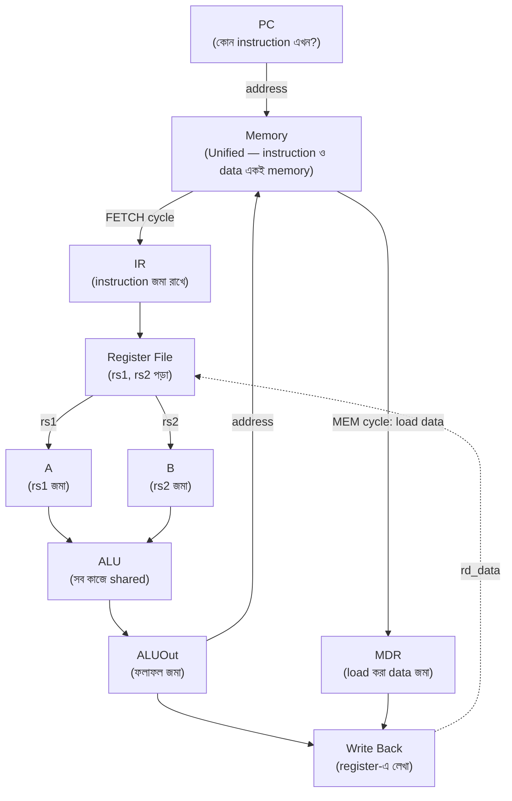
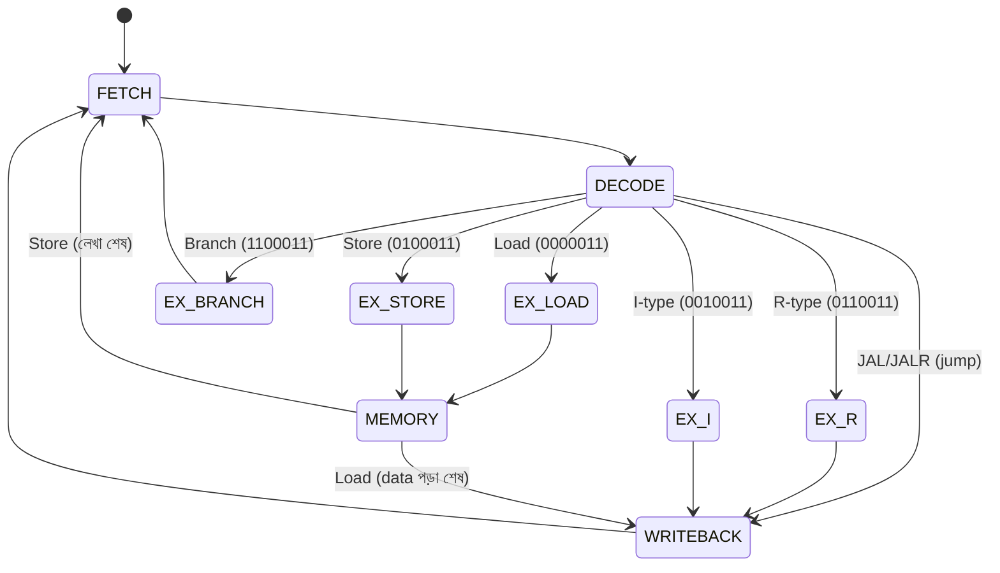
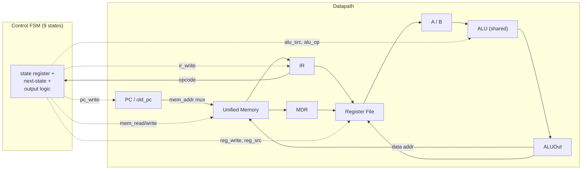

# ⚡ Chapter 15: Build Your Own Multi-Cycle Processor
## From Simple to Efficient - Resource Sharing & Optimization!

> **"Single-cycle was simple. Multi-cycle is smart. Time to optimize your CPU!"**
>
> **"Single-cycle ছিল simple। Multi-cycle smart। তোমার CPU optimize করো!"**

---

## 🎯 এই Chapter এ তুমি বানাবে:

```
✅ Multi-Cycle Architecture - better efficiency
✅ FSM Control Unit - 9-state machine
✅ Resource Sharing - one ALU, one memory
✅ Instruction/Data Registers - store values
✅ Better Performance - faster average
✅ Lower Cost - fewer components
✅ Optimized RISC-V - smarter design!
✅ তোমার efficient processor! 🎉
```

**Time Required:** 1 week (5-6 hours/day)  
**Prerequisites:** Chapter 14 complete

---

## 🚀 Quick Understanding - Multi-Cycle Concept

Chapter 14-এ তুমি একটা single-cycle CPU বানিয়েছিলে — সেখানে প্রতিটা
instruction ঠিক **এক** clock cycle-এ পুরোটা শেষ হতো। সহজ, সুন্দর, কিন্তু
এর মধ্যে একটা লুকানো অপচয় (waste) আছে। সেই অপচয়টা ধরতে পারলেই multi-cycle
কেন দরকার, সেটা পরিষ্কার হয়ে যাবে।

### Single-cycle-এর লুকানো সমস্যা

একটা clock-কে ভাবো ট্রেনের একটা স্টপের মতো — প্রতিটা স্টপ ঠিক ততটুকু লম্বা
হতে হবে, যতটুকু সময় **সবচেয়ে ধীর যাত্রীর** নামতে-উঠতে লাগে। Single-cycle-এ
clock period তাই ঠিক হয় সবচেয়ে দীর্ঘ instruction (সাধারণত `LW`) দিয়ে,
কারণ এক cycle-এর মধ্যেই PC পড়া → memory থেকে instruction → register পড়া →
ALU-তে address হিসাব → আবার memory → register-এ লেখা — পুরো শৃঙ্খলটা শেষ
হতে হবে।

ফল কী? একটা সাদামাটা `ADD`-ও সেই দীর্ঘ cycle-এর জন্য বসে থাকে, যদিও
তার কাজ অনেক আগেই শেষ। অর্থাৎ দ্রুত instruction-গুলো ধীর instruction-এর
শাস্তি ভোগ করে। তাছাড়া এক cycle-এর মধ্যে instruction আর data — দুটোই
একসাথে দরকার, তাই দুটো আলাদা memory, একাধিক adder — হার্ডওয়্যার বেশি লাগে।

### মূল আইডিয়া: কাজটাকে ভেঙে ফেলো

> এক বিশাল লাফে পুরো instruction শেষ করার বদলে, instruction-টাকে কয়েকটা
> ছোট ধাপে (cycle-এ) ভাগ করো। প্রতি cycle-এ ঠিক **একটা** কাজ — একবার memory,
> একবার ALU, একবার register-এ লেখা।

এতে দুটো বড় লাভ:

- **ছোট clock period।** যেহেতু এক cycle-এ এখন মাত্র একটা ধাপ, clock-কে আর
  সবচেয়ে দীর্ঘ instruction অনুযায়ী টানতে হয় না — শুধু সবচেয়ে দীর্ঘ
  *একক ধাপ* (এক ALU operation বা এক memory access) অনুযায়ী ঠিক করলেই চলে।
  Clock অনেক দ্রুত হয়।
- **Resource sharing।** যেহেতু কাজগুলো এখন আলাদা cycle-এ ছড়ানো, একটাই ALU
  বিভিন্ন cycle-এ বিভিন্ন কাজে ব্যবহার করা যায় (PC+4, address হিসাব,
  branch তুলনা), আর একটাই unified memory instruction ও data — দুটোর জন্যই
  চলে। হার্ডওয়্যার কমে।

বিনিময়ে দাম একটাই: এক instruction এখন কয়েক cycle নেয় (CPI > 1)। কিন্তু
প্রতিটা cycle অনেক ছোট, তাই গড়ে পারফরম্যান্স কাছাকাছি বা ভালো — আর খরচ কম।

### Single-Cycle vs Multi-Cycle

| Feature | Single-Cycle | Multi-Cycle |
|---|---|---|
| Cycles / instruction | 1 (fixed) | 3–5 (varies) |
| Clock period | সবচেয়ে ধীর instruction দিয়ে ঠিক | সবচেয়ে ছোট একক ধাপ দিয়ে ঠিক |
| CPI | 1.0 | 3.0–4.5 |
| Clock frequency | Low (লম্বা cycle) | High (ছোট cycle) |
| Throughput | Low | প্রায়ই বেশি হতে পারে |
| Hardware | বেশি (২ memory, একাধিক adder) | কম (shared ALU + unified memory) |
| Control | সহজ (পুরোটা combinational) | FSM (state অনুযায়ী cycle সাজানো) |
| Cost | বেশি | কম |

### একটা উদাহরণ দিয়ে timing

ধরা যাক single-cycle-এ critical path (LW) লাগে **12ns**, আর একটা একক ALU/memory
ধাপ লাগে **3ns**। তাহলে multi-cycle-এ clock period নামিয়ে আনা যায় 3ns-এ।

| Instruction | Single-Cycle | Multi-Cycle | মন্তব্য |
|---|---|---|---|
| `ADD` | 12ns (১ cycle) | 3 cycle × 3ns = **9ns** | দ্রুত! single-cycle-এ ৭ns অপচয় হতো |
| `LW` | 12ns (১ cycle) | 5 cycle × 3ns = **15ns** | একটু ধীর, কারণ এর সত্যিই অনেক ধাপ লাগে |

লক্ষ করো: multi-cycle প্রতিটা instruction-কে আলাদাভাবে দেখে — যার যতটুকু
ধাপ দরকার, সে শুধু ততটুকু cycle নেয়। `ADD` ৩ cycle-এই খালাস, কিন্তু `LW`
পুরো ৫ cycle ব্যবহার করে (address হিসাব + memory পড়া আলাদা ধাপে)। কেউ আর
অন্যের ধীরতার শাস্তি ভোগ করে না।

> **আসল লাভ:** clock দ্রুত হয়েছে, instruction-প্রতি cycle বেড়েছে — কিন্তু
> ভারসাম্যটা প্রায়ই single-cycle-এর সমান বা ভালো জায়গায় দাঁড়ায়, আর
> হার্ডওয়্যার অনেক কম লাগে।

🎉 **Smarter design = Better performance!**

---

## ১৫.১ Multi-Cycle Datapath

কাজটাকে cycle-এ ভাগ করার মুহূর্তে একটা নতুন সমস্যা জন্ম নেয়: cycle 2-এ
register file থেকে যে মান পড়লাম, সেটা cycle 3-এ ALU-তে দরকার — কিন্তু
ততক্ষণে register file অন্য কিছু পড়ছে। অর্থাৎ **এক cycle-এর ফলাফল পরের
cycle পর্যন্ত ধরে রাখতে হবে।** এই ধরে রাখার পাত্রগুলোই হলো multi-cycle-এর
নতুন register-গুলো। Single-cycle-এ এদের দরকার ছিল না, কারণ সেখানে সব কিছু
এক নিঃশ্বাসে এক cycle-এই হয়ে যেত।

### Single-cycle থেকে কী কী বদলালো

মোট **৫টি নতুন register** যোগ হয় — প্রত্যেকে এক ধাপের ফলাফল পরের ধাপের
জন্য জমা রাখে:

| নতুন register | কী জমা রাখে | কেন দরকার |
|---|---|---|
| **IR** (Instruction Register) | fetch-করা instruction | memory পরের cycle-এ data-র জন্য লাগবে, তাই instruction-টা আলাদা করে ধরে রাখতে হয় — না হলে হারিয়ে যাবে |
| **A, B** (Data Registers) | rs1 ও rs2-এর মান | DECODE-এ পড়া operand দুটো EXECUTE cycle পর্যন্ত স্থির রাখতে হয় |
| **ALUOut** | ALU-র ফলাফল | এক cycle-এ হিসাব হয়, পরের cycle-এ সেটা address বা writeback-এ লাগে |
| **MDR** (Memory Data Register) | load-করা data | MEM cycle-এ পড়া data, WB cycle-এ register-এ লেখার আগ পর্যন্ত জমা থাকে |

আর দুটো জিনিস উল্টো দিকে — **কমে** যায়, কারণ এখন সময় ভাগ করে শেয়ার করা যায়:

- **Unified Memory:** instruction আর data এখন আলাদা cycle-এ লাগে (FETCH-এ
  instruction, MEM-এ data), তাই একটাই memory দুই কাজেই চলে। দুটো আলাদা
  memory আর লাগে না।
- **Single ALU:** একটাই ALU সব কাজ করে — FETCH-এ `PC+4`, EXECUTE-এ address
  হিসাব বা arithmetic, BRANCH-এ তুলনার subtraction। প্রতিটা কাজ ভিন্ন
  cycle-এ পড়ে বলে একটাই ALU যথেষ্ট; single-cycle-এ যেখানে PC বাড়ানোর জন্য
  আলাদা adder লাগত, এখানে সেটাও বাদ।

এই অদলবদলটাই multi-cycle-এর মূল কথা: **জায়গা (hardware) বাঁচাও সময় (cycle)
খরচ করে।**

### Datapath Diagram

নিচের প্রবাহে খেয়াল করো — তীরগুলো এক cycle থেকে পরের cycle-এ মান কীভাবে
গড়ায় তা দেখাচ্ছে। মাঝে মাঝে latch (IR, A, B, ALUOut, MDR) বসিয়ে মানগুলো
ধরে রাখা হচ্ছে, আর একটাই Memory ও একটাই ALU পুরো পথে শেয়ার হচ্ছে:



> লক্ষ করো Memory-তে দুবার তীর ঢুকছে (একবার PC থেকে FETCH-এ, একবার ALUOut
> থেকে MEM-এ) — এটাই unified memory-র শেয়ারিং। তেমনি ALU-তেও সব operand
> এসে মিশছে। এই "একই block-এ একাধিক পথ" দেখলেই বুঝবে সেটা shared resource।

---

## ১৫.২ Five-Stage FSM

এখন আসল প্রশ্ন: কোন cycle-এ কোন কাজ হবে, সেটা ঠিক করে দেয় কে? Single-cycle-এ
control ছিল পুরোপুরি combinational — instruction দেখে সঙ্গে সঙ্গে সব signal
ঠিক হয়ে যেত। কিন্তু multi-cycle-এ একই instruction-এর জন্য control-কে
**সময়ের সাথে বদলাতে** হয়: cycle 1-এ memory পড়ো, cycle 3-এ ALU চালাও,
cycle 5-এ register-এ লেখো। সময়ের সাথে আচরণ বদলায় যে যন্ত্র — সেটাই
**Finite State Machine (FSM)**। Chapter 4-এ traffic light দিয়ে যে FSM
শিখেছিলে, এটা ঠিক তারই বড় ভাই।

FSM-এর প্রতিটা **state** = প্রসেসরের একটা cycle। state বদলানো মানে পরের
cycle-এ যাওয়া। কোন state থেকে কোন state-এ যাবে, সেটা ঠিক হয় চলতি
instruction-এর opcode দেখে।

### পাঁচটি মূল ধাপ (conceptual stages)

প্রতিটা instruction কম-বেশি এই পাঁচটা ধাপের ভেতর দিয়ে যায়:

1. **FETCH (IF)** — instruction আনা।
   - PC-র ঠিকানা Memory-তে পাঠাও, ফেরত আসা instruction `IR`-এ জমা করো।
   - একই সাথে shared ALU দিয়ে `PC ← PC + 4` সেরে ফেলো (পরের instruction-এর
     জন্য প্রস্তুতি)। ALU এখানে খালি বসে নেই — তাকে দিয়েই PC বাড়ানো হয়।

2. **DECODE (ID)** — instruction বোঝা ও operand পড়া।
   - register file থেকে `rs1`, `rs2` পড়ে `A`, `B`-তে রাখো; immediate বানাও।
   - এই cycle-এও ALU বসে থাকে না — এটা **আগাম (speculative)** ভাবে branch
     target (`PC + immediate`) হিসাব করে রাখে, যদি পরে branch লাগে তাই।

3. **EXECUTE (EX)** — আসল হিসাব।
   - ALU operation চালাও: arithmetic/logic, কিংবা load/store-এর জন্য
     address হিসাব, কিংবা branch-এর জন্য তুলনা। এখানেই instruction-ভেদে
     কাজ আলাদা হয়ে যায় — তাই implementation-এ এই ধাপ কয়েকটা আলাদা
     state-এ ভেঙে যায় (নিচে দেখো)।

4. **MEMORY (MEM)** — data memory ছোঁয়া।
   - `LW` হলে আগে-হিসাব-করা address থেকে data পড়ে `MDR`-এ রাখো; `SW` হলে
     সেই address-এ `B`-র মান লেখো। শুধু load/store-ই এই ধাপ ব্যবহার করে।

5. **WRITEBACK (WB)** — ফলাফল জমা ও PC ঠিক করা।
   - ALU-র ফল বা load-করা data register-এ লেখো; jump হলে PC আপডেট করো।
   - তারপর আবার FETCH-এ ফিরে পরের instruction শুরু।

> **মূল অন্তর্দৃষ্টি:** সব instruction সব ধাপ ব্যবহার করে না! `ADD`-এর
> MEM ধাপ লাগে না, `BEQ`-এর তো WB-ও লাগে না। এজন্যই multi-cycle দ্রুত —
> যার যতটুকু দরকার, সে শুধু ততটুকু cycle নেয়।

### ৫ ধাপ → ৯ state কেন?

ধাপ পাঁচটা হলেও বাস্তব FSM-এ **মোট ৯টি state** লাগে। কারণ EXECUTE ধাপটা
instruction-ভেদে এতটাই আলাদা যে তাকে একটা state-এ ধরা যায় না — তাকে
ভেঙে আলাদা আলাদা state বানাতে হয়। মিলিয়ে দেখো:

| Conceptual ধাপ | FSM state(গুলো) |
|---|---|
| FETCH | `FETCH` |
| DECODE | `DECODE` |
| EXECUTE | `EX_R`, `EX_I`, `EX_LOAD`, `EX_STORE`, `EX_BRANCH` (৫টি!) |
| MEMORY | `MEMORY` |
| WRITEBACK | `WRITEBACK` |

মোট = 2 + 5 + 1 + 1 = **9 states**। (Jump-এর জন্য আলাদা EX state নেই —
JAL/JALR সরাসরি DECODE থেকে WRITEBACK-এ যায়, target হিসাব ও PC আপডেট
WRITEBACK-এই সেরে নেওয়া হয়।)

### State Transition Diagram

নিচের state diagram-এ `[*]` হলো reset-এর পর শুরুর জায়গা। FETCH ও DECODE
সবার জন্য একই; DECODE-এ এসে opcode দেখে FSM বিভিন্ন EX state-এ ছড়িয়ে যায়,
আর কাজ শেষে সবাই আবার FETCH-এ ফিরে আসে (লুপ):



> পড়ার নিয়ম: তীরের গায়ে লেখা শর্ত (opcode/type) সত্যি হলে FSM সেই পথে যায়।
> খেয়াল করো `EX_BRANCH` সরাসরি FETCH-এ ফিরে যায় (branch-এর WB লাগে না), আর
> `MEMORY` থেকে দুটো পথ বেরোয় — load হলে WRITEBACK, store হলে সোজা FETCH।

### Cycles per Instruction

প্রতিটা instruction কোন কোন ধাপে যায় আর মোট কত cycle নেয়, এক নজরে:

| Instruction | যে ধাপগুলো ব্যবহার করে | মোট cycle |
|---|---|---|
| **R-type** (`ADD`, `SUB`, …) | FETCH → DECODE → EXECUTE → WRITEBACK | **4** |
| **I-type arithmetic** (`ADDI`) | FETCH → DECODE → EXECUTE → WRITEBACK | **4** |
| **Load** (`LW`) | FETCH → DECODE → EXECUTE (address) → MEMORY (read) → WRITEBACK | **5** |
| **Store** (`SW`) | FETCH → DECODE → EXECUTE (address) → MEMORY (write) | **4** |
| **Branch** (`BEQ`) | FETCH → DECODE → EXECUTE (compare & PC আপডেট) | **3** |
| **Jump** (`JAL`) | FETCH → DECODE → WRITEBACK (target হিসাব, PC আপডেট, PC+4 জমা) | **4** |

`LW` সবচেয়ে বেশি (৫ cycle), `BEQ` সবচেয়ে কম (৩ cycle) — কারণ branch-এর
ফলাফল কোথাও লেখার দরকার নেই, শুধু PC ঠিক করলেই হয়। সাধারণ প্রোগ্রামে গড়
দাঁড়ায় **~4 cycle/instruction**।

---

## ১৫.৩ Control FSM Implementation

এবার উপরের state diagram-টাকে Verilog-এ রূপ দিই। এটাই multi-cycle CPU-র
মস্তিষ্ক — প্রতি cycle-এ "এখন কোন state, পরের state কী, আর এই state-এ কোন
control signal-গুলো ON থাকবে" তা ঠিক করে দেয়।

ভালো FSM লেখার একটা পরিচ্ছন্ন ছক আছে — **তিনটি আলাদা `always` block**, যা
এই module-এ হুবহু অনুসরণ করা হয়েছে:

1. **State register** (`always @(posedge clk …)`): শুধু একটাই কাজ — প্রতি
   clock-এ `state <= next_state` করা, আর reset হলে `FETCH`-এ ফেরা। এটাই
   FSM-এর স্মৃতি (memory)।
2. **Next-state logic** (`always @(*)`): বর্তমান `state` ও `opcode` দেখে
   পরের state কী হবে তা ঠিক করে — এটাই আমাদের state diagram-এর তীরগুলো,
   কোডে রূপান্তরিত। `DECODE`-এর ভেতরের `case (opcode)`-ই সেই branching যা
   FSM-কে R/I/Load/Store/Branch/Jump পথে পাঠায়।
3. **Output logic** (`always @(*)`): প্রতিটা state-এর জন্য control
   signal-গুলো বসায়। লক্ষ করো শুরুতেই সব signal-কে নিরাপদ default (0 বা
   `2'b00`) দেওয়া হয়েছে — এটা জরুরি, না হলে অনিচ্ছাকৃত latch তৈরি হয়
   এবং কোনো cycle-এ ভুল করে memory/register লেখা হয়ে যেতে পারে।

কয়েকটা signal-এর অর্থ আগে থেকে জেনে নিলে কোড পড়তে সুবিধা হবে:

| Signal | কাজ |
|---|---|
| `pc_write` | PC আপডেট হবে কিনা (FETCH-এ PC+4, jump-এ target) |
| `pc_write_cond` | branch-এর জন্য *শর্তসাপেক্ষ* PC আপডেট (তুলনা সত্যি হলে তবেই) |
| `ir_write` | memory থেকে আসা instruction `IR`-এ ধরা হবে কিনা (শুধু FETCH-এ) |
| `mem_read` / `mem_write` | unified memory পড়া / লেখা |
| `reg_write` | register file-এ ফল লেখা (শুধু WRITEBACK-এ) |
| `alu_src_a`, `alu_src_b` | ALU-র দুই input কোথা থেকে আসবে (PC/A/B/4/immediate) |
| `alu_op` | ALU-কে কী করতে হবে (ADD / SUB / funct থেকে) |
| `pc_source` | PC-র পরের মান কোন উৎস থেকে (PC+4 / branch / JAL / JALR) |
| `reg_src` | register-এ কী লেখা হবে (ALU ফল / memory data / return address) |

এই signal-গুলোই datapath-এর mux-গুলোকে নাড়ায়, অর্থাৎ control প্রতি
cycle-এ datapath-কে নতুন আকার দেয়। নিচের কোডে প্রতিটা state-এর block পড়ার
সময় মনে মনে জিজ্ঞেস করো — "এই cycle-এ ALU-র input কী, ফলটা কোথায় যাচ্ছে?"

```verilog
module multi_cycle_control(
    input wire clk,
    input wire reset,
    input wire [6:0] opcode,
    input wire [2:0] funct3,
    input wire [6:0] funct7,
    // Control signals
    output reg pc_write,
    output reg pc_write_cond,
    output reg ir_write,
    output reg mem_read,
    output reg mem_write,
    output reg reg_write,
    output reg [1:0] alu_src_a,
    output reg [1:0] alu_src_b,
    output reg [1:0] alu_op,
    output reg [1:0] pc_source,
    output reg [1:0] reg_src
);
    // State definitions
    localparam FETCH     = 4'b0000;
    localparam DECODE    = 4'b0001;
    localparam EX_R      = 4'b0010;  // R-type execute
    localparam EX_I      = 4'b0011;  // I-type execute
    localparam EX_LOAD   = 4'b0100;  // Load address calc
    localparam EX_STORE  = 4'b0101;  // Store address calc
    localparam EX_BRANCH = 4'b0110;  // Branch execute
    localparam MEMORY    = 4'b0111;  // Memory access
    localparam WRITEBACK = 4'b1000;  // Write back
    
    reg [3:0] state, next_state;
    
    // State register
    always @(posedge clk or posedge reset) begin
        if (reset)
            state <= FETCH;
        else
            state <= next_state;
    end
    
    // Next state logic
    always @(*) begin
        case (state)
            FETCH: begin
                next_state = DECODE;
            end
            
            DECODE: begin
                case (opcode)
                    7'b0110011: next_state = EX_R;      // R-type
                    7'b0010011: next_state = EX_I;      // I-type
                    7'b0000011: next_state = EX_LOAD;   // Load
                    7'b0100011: next_state = EX_STORE;  // Store
                    7'b1100011: next_state = EX_BRANCH; // Branch
                    7'b1101111, 7'b1100111: next_state = WRITEBACK; // Jump
                    default: next_state = FETCH;
                endcase
            end
            
            EX_R, EX_I: begin
                next_state = WRITEBACK;
            end
            
            EX_LOAD: begin
                next_state = MEMORY;
            end
            
            EX_STORE: begin
                next_state = MEMORY;
            end
            
            EX_BRANCH: begin
                next_state = FETCH;
            end
            
            MEMORY: begin
                if (opcode == 7'b0000011)  // Load
                    next_state = WRITEBACK;
                else  // Store
                    next_state = FETCH;
            end
            
            WRITEBACK: begin
                next_state = FETCH;
            end
            
            default: next_state = FETCH;
        endcase
    end
    
    // Output logic
    always @(*) begin
        // Default values
        pc_write = 0;
        pc_write_cond = 0;
        ir_write = 0;
        mem_read = 0;
        mem_write = 0;
        reg_write = 0;
        alu_src_a = 2'b00;
        alu_src_b = 2'b00;
        alu_op = 2'b00;
        pc_source = 2'b00;
        reg_src = 2'b00;
        
        case (state)
            FETCH: begin
                mem_read = 1;
                ir_write = 1;
                alu_src_a = 2'b00;  // PC
                alu_src_b = 2'b01;  // 4
                alu_op = 2'b00;     // ADD
                pc_write = 1;
                pc_source = 2'b00;  // ALU result (PC+4)
            end
            
            DECODE: begin
                alu_src_a = 2'b00;  // PC
                alu_src_b = 2'b11;  // Immediate
                alu_op = 2'b00;     // ADD (for branch target)
            end
            
            EX_R: begin
                alu_src_a = 2'b01;  // A (rs1)
                alu_src_b = 2'b00;  // B (rs2)
                alu_op = 2'b10;     // From funct fields
            end
            
            EX_I: begin
                alu_src_a = 2'b01;  // A (rs1)
                alu_src_b = 2'b10;  // Immediate
                alu_op = 2'b10;     // From funct fields
            end
            
            EX_LOAD, EX_STORE: begin
                alu_src_a = 2'b01;  // A (rs1)
                alu_src_b = 2'b10;  // Immediate (offset)
                alu_op = 2'b00;     // ADD
            end
            
            EX_BRANCH: begin
                alu_src_a = 2'b01;  // A (rs1)
                alu_src_b = 2'b00;  // B (rs2)
                alu_op = 2'b01;     // SUB for comparison
                pc_write_cond = 1;
                pc_source = 2'b01;  // Branch target
            end
            
            MEMORY: begin
                if (opcode == 7'b0000011)  // Load
                    mem_read = 1;
                else  // Store
                    mem_write = 1;
            end
            
            WRITEBACK: begin
                reg_write = 1;
                case (opcode)
                    7'b0000011: reg_src = 2'b01;  // Memory (load)
                    7'b1101111: begin             // JAL
                        reg_src   = 2'b10;        // rd <- old_pc + 4 (return address)
                        pc_write  = 1;            // and take the jump
                        pc_source = 2'b10;        // JAL target
                    end
                    7'b1100111: begin             // JALR
                        reg_src   = 2'b10;        // rd <- old_pc + 4 (return address)
                        pc_write  = 1;
                        pc_source = 2'b11;        // JALR target
                    end
                    default: reg_src = 2'b00;  // ALU result
                endcase
            end
        endcase
    end
endmodule
```

### প্রতি state-এ কোন signal ON — এক নজরে

কোডটা মুখস্থ না করে, প্রতি state-এ "কে জ্বলে আছে" সেটা একটা টেবিলে দেখলে
পুরো ছবিটা ধরা পড়ে। নিচে শুধু সক্রিয় (অ-default) signal-গুলো দেখানো হলো;
বাকি সব এই state-এ 0/`2'b00`:

| State | সক্রিয় control signals | ঐ cycle-এ যা ঘটছে |
|---|---|---|
| `FETCH` | `mem_read`, `ir_write`, `pc_write`; `alu_src_a=PC`, `alu_src_b=4`, `alu_op=ADD`, `pc_source=ALU` | memory থেকে instruction → IR; পাশে ALU দিয়ে PC ← PC+4 |
| `DECODE` | `alu_src_a=PC`, `alu_src_b=imm`, `alu_op=ADD` | A/B পড়া; ALU আগাম branch target (PC+imm) বানায় |
| `EX_R` | `alu_src_a=A`, `alu_src_b=B`, `alu_op=funct` | rs1 ◦ rs2 হিসাব (funct দিয়ে কোন op) |
| `EX_I` | `alu_src_a=A`, `alu_src_b=imm`, `alu_op=funct` | rs1 ◦ immediate হিসাব |
| `EX_LOAD` / `EX_STORE` | `alu_src_a=A`, `alu_src_b=imm`, `alu_op=ADD` | address = rs1 + offset |
| `EX_BRANCH` | `alu_src_a=A`, `alu_src_b=B`, `alu_op=SUB`, `pc_write_cond`, `pc_source=branch` | তুলনা (subtraction); শর্ত মিললে PC ← branch target |
| `MEMORY` | load হলে `mem_read`, store হলে `mem_write` | data memory পড়া/লেখা |
| `WRITEBACK` | `reg_write` (+ load হলে `reg_src=mem`; JAL/JALR হলে `reg_src=return addr`, `pc_write`, jump `pc_source`) | ফল register-এ লেখা; jump হলে PC-ও আপডেট |

খেয়াল করো একই signal বিভিন্ন state-এ বিভিন্ন মান নেয় — যেমন `alu_src_a`
FETCH-এ PC, কিন্তু EX state-গুলোতে A। এই "সময়ের সাথে signal বদলানো"-ই
multi-cycle control-এর প্রাণ; single-cycle-এ একটা instruction-এর জন্য
signal-গুলো পুরো cycle জুড়ে স্থির থাকত।

---

## ১৫.৪ Datapath Components with Registers

### Program Counter (with write-enable):

Single-cycle-এ PC প্রতি clock-এ আপডেট হতো। Multi-cycle-এ এক instruction অনেক
cycle ধরে চলে, তাই PC শুধু নির্দিষ্ট cycle-এ আপডেট হওয়া উচিত — এর জন্য একটা
`pc_write` enable লাগে (Chapter 14-এর PC-তে যেটা ছিল না):

```verilog
module program_counter(
    input wire clk,
    input wire reset,
    input wire pc_write,        // write-enable: PC শুধু এটা 1 হলে আপডেট হয়
    input wire [31:0] pc_next,
    output reg [31:0] pc
);
    always @(posedge clk or posedge reset) begin
        if (reset)
            pc <= 32'h00000000;  // Start at address 0
        else if (pc_write)
            pc <= pc_next;
    end
endmodule
```

### Instruction Register:

FETCH cycle-এ memory আমাদের instruction দেয়। কিন্তু পরের কোনো cycle-এ
(যেমন `LW`-এর MEM cycle-এ) সেই একই memory এবার *data* দেবে — তখন তার output
বদলে যাবে। তাই instruction-টাকে এক্ষুনি `IR`-এ ধরে রাখতে হয়, না হলে তা হারিয়ে
যাবে আর পরের cycle-গুলোতে opcode/rs1/rs2 আর পড়া যাবে না। `ir_write` শুধু
FETCH-এ 1 হয়, তাই IR বাকি cycle জুড়ে স্থির থাকে। reset-এ এটা NOP
(`ADDI x0,x0,0`) দিয়ে শুরু হয় — যাতে চালু হওয়ার মুহূর্তে কোনো আবোল-তাবোল
কাজ না হয়:

```verilog
module instruction_register(
    input wire clk,
    input wire reset,
    input wire ir_write,
    input wire [31:0] data_in,
    output reg [31:0] instruction
);
    always @(posedge clk or posedge reset) begin
        if (reset)
            instruction <= 32'h00000013;  // NOP (ADDI x0, x0, 0)
        else if (ir_write)
            instruction <= data_in;
    end
endmodule
```

### Data Registers (A, B):

DECODE cycle-এ register file থেকে `rs1` ও `rs2`-এর মান পড়ি — কিন্তু সেগুলো
ALU-তে দরকার পরের (EXECUTE) cycle-এ। মাঝের clock edge-এ register file অন্য
কিছু পড়তে শুরু করবে, তাই operand দুটোকে `A` ও `B`-তে latch করে রাখি। এভাবে
EXECUTE cycle-এ ALU স্থির, নির্ভরযোগ্য input পায়। এরা প্রতি clock-এই
register file-এর আউটপুট তুলে রাখে (আলাদা enable লাগে না), কারণ আমরা শুধু
DECODE-এর পরের cycle-এই এদের মান ব্যবহার করি:

```verilog
module data_registers(
    input wire clk,
    input wire reset,
    input wire [31:0] rs1_data,
    input wire [31:0] rs2_data,
    output reg [31:0] a,
    output reg [31:0] b
);
    always @(posedge clk or posedge reset) begin
        if (reset) begin
            a <= 32'h00000000;
            b <= 32'h00000000;
        end else begin
            a <= rs1_data;
            b <= rs2_data;
        end
    end
endmodule
```

### ALU Output Register:

ALU যে cycle-এ হিসাব করে, ফলটা প্রায়ই লাগে তার *পরের* cycle-এ — যেমন
`LW`-তে EX cycle-এ address হিসাব হয়, কিন্তু সেই address দিয়ে memory পড়া হয়
MEM cycle-এ। তাই ALU-র ফল `ALUOut`-এ জমা রাখি, যাতে combinational ALU পরের
cycle-এ অন্য হিসাবে ব্যস্ত হয়ে গেলেও আগের ফলটা হাতছাড়া না হয়। এটাই shared
ALU-কে নিরাপদে বারবার ব্যবহার করতে দেয়:

```verilog
module alu_out_register(
    input wire clk,
    input wire reset,
    input wire [31:0] alu_result,
    output reg [31:0] alu_out
);
    always @(posedge clk or posedge reset) begin
        if (reset)
            alu_out <= 32'h00000000;
        else
            alu_out <= alu_result;
    end
endmodule
```

### Memory Data Register:

`LW`-এর MEM cycle-এ memory থেকে data আসে, কিন্তু সেটা register-এ লেখা হয়
পরের WB cycle-এ। দুটোকে আলাদা cycle-এ রাখার কারণেই মাঝে একটা পাত্র দরকার —
সেটাই `MDR` (Memory Data Register)। এটা না থাকলে memory পড়া আর register-এ
লেখা একই cycle-এ করতে হতো, আর তাহলে clock-কে আবার লম্বা করতে হতো — ঠিক যে
সমস্যা থেকে আমরা পালাচ্ছি:

```verilog
module memory_data_register(
    input wire clk,
    input wire reset,
    input wire [31:0] mem_data,
    output reg [31:0] mdr
);
    always @(posedge clk or posedge reset) begin
        if (reset)
            mdr <= 32'h00000000;
        else
            mdr <= mem_data;
    end
endmodule
```

---

## ১৫.৫ ALU Source Multiplexers

একটাই ALU দিয়ে সব কাজ করানোর গোপন রহস্য এই mux-গুলোতে। যেহেতু ALU বিভিন্ন
cycle-এ বিভিন্ন জিনিস যোগ/বিয়োগ করে, প্রতি cycle-এ তার দুই input কোথা থেকে
আসবে তা control (`alu_src_a`, `alu_src_b`) ঠিক করে দেয়। mux মানে "অনেক
উৎসের মধ্যে একটা বেছে নেওয়া" — এখানেই resource sharing বাস্তবে ঘটে।

`alu_a` (প্রথম input) বেছে নেয়:

- `PC` → FETCH-এ `PC+4`, DECODE-এ branch target হিসাবের জন্য
- `A` (rs1) → arithmetic ও address হিসাবের জন্য
- `0` → প্রয়োজনে শূন্য (যেমন কোনো মান সরাসরি pass করতে)

`alu_b` (দ্বিতীয় input) বেছে নেয়:

- `B` (rs2) → R-type ও branch তুলনার জন্য
- `4` → PC বাড়ানোর ধ্রুবক
- `immediate` → I-type, load/store offset, branch displacement

একই ALU, কিন্তু input বদলে দিলেই সে এক cycle-এ adder, পরের cycle-এ
comparator হয়ে যায়। নিচের `case`-গুলো ঠিক এই বাছাইটাই করছে:

```verilog
module alu_src_mux(
    input wire [31:0] pc,
    input wire [31:0] a,
    input wire [31:0] b,
    input wire [31:0] immediate,
    input wire [1:0] alu_src_a,
    input wire [1:0] alu_src_b,
    output reg [31:0] alu_a,
    output reg [31:0] alu_b
);
    // ALU A source
    always @(*) begin
        case (alu_src_a)
            2'b00: alu_a = pc;          // PC
            2'b01: alu_a = a;           // Register A
            2'b10: alu_a = 32'h00000000; // Zero
            default: alu_a = 32'h00000000;
        endcase
    end
    
    // ALU B source
    always @(*) begin
        case (alu_src_b)
            2'b00: alu_b = b;           // Register B
            2'b01: alu_b = 32'h00000004; // 4 (for PC+4)
            2'b10: alu_b = immediate;   // Immediate
            2'b11: alu_b = immediate;   // Immediate (branch)
            default: alu_b = 32'h00000000;
        endcase
    end
endmodule
```

---

## ১৫.৬ Complete Multi-Cycle Processor

এবার সব টুকরো এক module-এ জোড়া লাগাই — control FSM, datapath register-গুলো,
shared ALU আর memory। single-cycle-এর তুলনায় এখানে কয়েকটা নতুন তার (wire)
আর একটা অতিরিক্ত register খুব গুরুত্বপূর্ণ, সেগুলো আগে বুঝে নাও:

**`old_pc` — সবচেয়ে সূক্ষ্ম অংশ।** FETCH cycle-এই PC কিন্তু `PC+4` হয়ে
যায় (পরের instruction-এর জন্য)। কিন্তু branch ও jump-এর target হিসাব হতে হবে
*চলতি* instruction-এর নিজের ঠিকানা থেকে, `PC+4` থেকে নয়! আর `JAL`/`JALR`-এর
return address হলো "এই instruction + 4"। তাই FETCH-এর মুহূর্তে instruction-এর
আসল ঠিকানা `old_pc`-তে সংরক্ষণ করি (`ir_write` শুধু FETCH-এ 1, তাই ঠিক সেই
cycle-এই latch হয়)। এই একটা register না থাকলে সব branch/jump ভুল জায়গায়
লাফ দিত — এটাই multi-cycle-এ সঠিকতার চাবিকাঠি।

তাই target-গুলো `old_pc` দিয়ে হিসাব হয়:

- `branch_target = old_pc + immediate`
- `jal_target = old_pc + immediate`
- `jalr_target = (a + immediate) & ~1` — bit 0 শূন্য করা হয় (RISC-V নিয়ম)

**Memory address mux (`mem_addr`)।** unified memory-কে কখনো instruction
address (PC), কখনো data address (ALUOut) দিতে হয়। কোডে `mem_addr =
ir_write ? pc : alu_out` — অর্থাৎ FETCH cycle-এ (`ir_write=1`) PC যায়,
বাকি সময় ALUOut (data-র ঠিকানা) যায়। এই একটিমাত্র mux-ই দুই memory-কে
একটায় মেলায়।

**PC source mux।** PC-র পরের মান চার জায়গা থেকে আসতে পারে — সাধারণ `PC+4`,
branch target, JAL target, বা JALR target — `pc_source` সেটা বেছে দেয়। আর
PC তখনই লেখে যখন `pc_write` সরাসরি 1, অথবা branch-এ `pc_write_cond &
branch_taken` সত্যি।

নিচের module-এ প্রতিটা component instantiate করে এই তারগুলো দিয়ে জোড়া
হয়েছে; পড়ার সময় `old_pc`, `mem_addr`, আর `pc_next`-এর assignment-গুলো
বিশেষভাবে খেয়াল করো:

```verilog
module riscv_multi_cycle(
    input wire clk,
    input wire reset,
    // Memory interface
    output wire [31:0] mem_addr,
    input wire [31:0] mem_read_data,
    output wire [31:0] mem_write_data,
    output wire mem_read,
    output wire mem_write,
    // Debug
    output wire [31:0] pc_debug,
    output wire [3:0] state_debug
);
    // Internal signals
    wire [31:0] pc, pc_next;
    wire [31:0] instruction;
    wire [31:0] immediate;
    wire [31:0] a, b;
    wire [31:0] alu_a, alu_b, alu_result, alu_out;
    wire [31:0] mdr;
    wire [31:0] rs1_data, rs2_data, rd_data;
    wire [31:0] branch_target, jal_target, jalr_target;
    reg  [31:0] old_pc;  // address of the instruction in progress (PC before FETCH's +4)
    
    // Control signals
    wire pc_write, pc_write_cond, ir_write;
    wire reg_write;
    wire [1:0] alu_src_a, alu_src_b;
    wire [1:0] alu_op, pc_source, reg_src;
    wire [3:0] alu_control_sig;
    wire zero, negative, branch_taken;
    
    // Extract fields
    wire [6:0] opcode = instruction[6:0];
    wire [4:0] rd = instruction[11:7];
    wire [2:0] funct3 = instruction[14:12];
    wire [4:0] rs1 = instruction[19:15];
    wire [4:0] rs2 = instruction[24:20];
    wire [6:0] funct7 = instruction[31:25];
    
    // Program Counter
    program_counter pc_inst(
        .clk(clk),
        .reset(reset),
        .pc_write(pc_write | (pc_write_cond & branch_taken)),
        .pc_next(pc_next),
        .pc(pc)
    );
    
    // Old-PC register: PC is bumped to PC+4 during FETCH, so we save the
    // instruction's own address here to compute correct PC-relative targets
    // and the JAL/JALR return address (old_pc + 4).
    always @(posedge clk or posedge reset) begin
        if (reset)         old_pc <= 32'h00000000;
        else if (ir_write) old_pc <= pc;   // ir_write is asserted only in FETCH
    end

    // PC-relative / jump targets (all relative to the instruction's own PC)
    assign branch_target = old_pc + immediate;        // BEQ/BNE/BLT/...
    assign jal_target    = old_pc + immediate;        // JAL
    assign jalr_target   = (a + immediate) & ~32'h1;  // JALR: clear bit 0

    // PC source mux
    assign pc_next = (pc_source == 2'b00) ? alu_result :    // PC+4 (sequential)
                     (pc_source == 2'b01) ? branch_target : // Branch target
                     (pc_source == 2'b10) ? jal_target :    // JAL target
                     (pc_source == 2'b11) ? jalr_target :   // JALR target
                     pc;
    
    // Instruction Register
    instruction_register ir_inst(
        .clk(clk),
        .reset(reset),
        .ir_write(ir_write),
        .data_in(mem_read_data),
        .instruction(instruction)
    );
    
    // Immediate Generator
    imm_gen imm_gen_inst(
        .instruction(instruction),
        .immediate(immediate)
    );
    
    // Register File
    register_file rf_inst(
        .clk(clk),
        .reset(reset),
        .rs1_addr(rs1),
        .rs2_addr(rs2),
        .rs1_data(rs1_data),
        .rs2_data(rs2_data),
        .rd_addr(rd),
        .rd_data(rd_data),
        .reg_write(reg_write)
    );
    
    // Data Registers
    data_registers data_regs(
        .clk(clk),
        .reset(reset),
        .rs1_data(rs1_data),
        .rs2_data(rs2_data),
        .a(a),
        .b(b)
    );
    
    // ALU Source Mux
    alu_src_mux alu_src_inst(
        .pc(pc),
        .a(a),
        .b(b),
        .immediate(immediate),
        .alu_src_a(alu_src_a),
        .alu_src_b(alu_src_b),
        .alu_a(alu_a),
        .alu_b(alu_b)
    );
    
    // ALU Control (reuses the alu_control module from Chapter 14)
    alu_control alu_ctrl_inst(
        .alu_op(alu_op),
        .funct3(funct3),
        .funct7(funct7),
        .is_rtype(opcode == 7'b0110011),  // R-type only (so ADDI never decodes as SUB)
        .alu_control_out(alu_control_sig)
    );
    
    // ALU
    alu alu_inst(
        .a(alu_a),
        .b(alu_b),
        .alu_control(alu_control_sig),
        .result(alu_result),
        .zero(zero),
        .negative(negative)
    );
    
    // ALU Out Register
    alu_out_register alu_out_reg(
        .clk(clk),
        .reset(reset),
        .alu_result(alu_result),
        .alu_out(alu_out)
    );
    
    // Memory Data Register
    memory_data_register mdr_inst(
        .clk(clk),
        .reset(reset),
        .mem_data(mem_read_data),
        .mdr(mdr)
    );
    
    // Branch Comparator
    branch_comparator branch_comp(
        .rs1_data(a),
        .rs2_data(b),
        .funct3(funct3),
        .branch_taken(branch_taken)
    );
    
    // Write-back Mux
    assign rd_data = (reg_src == 2'b00) ? alu_out :        // ALU result
                     (reg_src == 2'b01) ? mdr :            // Memory (load)
                     (reg_src == 2'b10) ? (old_pc + 4) :   // return address (JAL/JALR)
                     32'h00000000;
    
    // Memory Interface
    assign mem_addr = (ir_write) ? pc : alu_out;
    assign mem_write_data = b;
    
    // Control Unit
    multi_cycle_control control(
        .clk(clk),
        .reset(reset),
        .opcode(opcode),
        .funct3(funct3),
        .funct7(funct7),
        .pc_write(pc_write),
        .pc_write_cond(pc_write_cond),
        .ir_write(ir_write),
        .mem_read(mem_read),
        .mem_write(mem_write),
        .reg_write(reg_write),
        .alu_src_a(alu_src_a),
        .alu_src_b(alu_src_b),
        .alu_op(alu_op),
        .pc_source(pc_source),
        .reg_src(reg_src)
    );
    
    // Debug
    assign pc_debug = pc;
    assign state_debug = control.state;
endmodule
```

### পুরো ছবিটা: control আর datapath কীভাবে কথা বলে

উপরের module-টা আসলে দুটো জগতের সংযোগ — একদিকে **datapath** (যেখানে data
গড়ায়), অন্যদিকে **control FSM** (যে প্রতি cycle-এ datapath-কে নির্দেশ দেয়)।
নিচের ছবিতে কঠিন (solid) তীর = data প্রবাহ, ফুটকি (dashed) তীর = control
signal:



IR থেকে opcode FSM-এ ফেরত যাচ্ছে — এটাই FSM-কে বলে দেয় কোন instruction
চলছে, আর সেই অনুযায়ী FSM পরের state ঠিক করে। অর্থাৎ control আর datapath
একে অন্যকে খাওয়ায়: datapath instruction তুলে দেয়, control cycle সাজায়।

### একটা instruction-কে cycle-ধরে অনুসরণ করি: `LW`

বইয়ের কথাগুলো মূর্ত করতে `LW x5, 8(x2)` (x2-এর মান + 8 ঠিকানা থেকে data এনে
x5-এ রাখো) কীভাবে ৫ cycle-এ চলে, ধাপে ধাপে দেখি:

| Cycle | State | কী ঘটে | কোন register-এ ফল জমে |
|---|---|---|---|
| 1 | `FETCH` | PC-র ঠিকানা থেকে instruction পড়া; ALU দিয়ে PC ← PC+4; instruction-এর আসল ঠিকানা `old_pc`-তে | `IR`, `old_pc`, `PC` |
| 2 | `DECODE` | x2-এর মান পড়ে `A`-তে; immediate (8) তৈরি | `A`, `B` |
| 3 | `EX_LOAD` | ALU: address = `A` + 8 (rs1 + offset) | `ALUOut` |
| 4 | `MEMORY` | ঐ address থেকে memory পড়ে data আনা | `MDR` |
| 5 | `WRITEBACK` | `MDR`-এর data x5-এ লেখা (`reg_src = memory`); পরে FETCH-এ ফেরা | register file (x5) |

লক্ষ করো প্রতিটা cycle ঠিক একটা কাজ করছে আর তার ফল একটা register-এ রেখে
দিচ্ছে — পরের cycle সেই register থেকে শুরু করে। এই "এক ধাপ → latch → পরের
ধাপ" শৃঙ্খলটাই multi-cycle-এর পুরো গল্প। তুলনায় `ADD` cycle 3-এ (`EX_R`)
সরাসরি WRITEBACK-এ চলে যেত, MEM ধাপ এড়িয়ে — তাই ৪ cycle-এই শেষ।

---

## ১৫.৭ Performance Comparison

এখন সংখ্যা দিয়ে দেখি multi-cycle আসলে কতটা লাভ এনে দেয়। একটা মৌলিক সূত্র
মনে রাখো — কোনো প্রোগ্রাম চলতে মোট কত সময় লাগে তা ঠিক হয় তিনটা জিনিসে:

> **Execution time = Instruction সংখ্যা × CPI × Clock period**

Single-cycle আর multi-cycle এই তিনটার মধ্যে উল্টো দিকে টানাটানি করে:
single-cycle-এর CPI কম (1.0) কিন্তু clock period বড়; multi-cycle-এর CPI
বেশি (~4) কিন্তু clock period অনেক ছোট। আসল প্রশ্ন — কোন দিকটা জেতে?

### Execution Time Comparison

ধরা যাক একটা ছোট প্রোগ্রাম, **১০টি instruction**:

| ধরন | সংখ্যা | cycle/instr (multi) | মোট cycle |
|---|---|---|---|
| R-type (`ADD`/`SUB`) | 4 | 4 | 16 |
| I-type (`ADDI`) | 2 | 4 | 8 |
| Load (`LW`) | 2 | 5 | 10 |
| Store (`SW`) | 1 | 4 | 4 |
| Branch (`BEQ`) | 1 | 3 | 3 |
| **মোট** | **10** | — | **41** |

এখন দুই design-এর মোট সময়:

| Design | Clock period | হিসাব | মোট সময় |
|---|---|---|---|
| **Single-cycle** | 12ns (`LW` critical path) | 10 inst × 1 cycle × 12ns | **120ns** |
| **Multi-cycle** | 3ns (এক ALU/memory ধাপ) | 41 cycle × 3ns | **123ns** |

মোট সময় প্রায় সমান (120ns বনাম 123ns)! অর্থাৎ এই কাল্পনিক উদাহরণে
multi-cycle গতিতে single-cycle-কে হারায়নি — কিন্তু গতি কখনোই multi-cycle-এর
মূল বিক্রয়-কথা ছিল না। আসল লাভ অন্যখানে:

- ✅ **কম খরচ** — একটাই ALU, একটাই unified memory shared হয়
- ✅ **নমনীয় (flexible)** — যার যত cycle দরকার, সে তত নেয়; জটিল instruction
  সহজে যোগ করা যায় শুধু নতুন state বানিয়ে
- ✅ **সহজে সম্প্রসারণযোগ্য** — multiply/divide-এর মতো বহু-cycle operation
  এই কাঠামোয় স্বাভাবিকভাবে বসে যায়

> বাস্তবে multi-cycle-এর clock প্রায়ই 12ns/3ns = **4× দ্রুত** হয়, যা CPI-র
> বৃদ্ধিকে অনেকটাই পুষিয়ে দেয়। আর এই FSM-ভিত্তিক চিন্তাটাই পরের ধাপ —
> pipelining (Chapter 16) — এর ভিত্তি, যেখানে আসল গতি লাফিয়ে বাড়বে।

### Average CPI

CPI (Cycles Per Instruction) = মোট cycle ÷ মোট instruction:

$$\text{CPI} = \frac{41 \text{ cycles}}{10 \text{ instructions}} = 4.1$$

| Design | CPI | Clock | মন্তব্য |
|---|---|---|---|
| Single-cycle | 1.0 | ধীর (12ns) | এক cycle, কিন্তু লম্বা |
| Multi-cycle | ~4.0–4.5 (এখানে 4.1) | দ্রুত (3ns, ~4×) | বেশি cycle, কিন্তু প্রতিটা ছোট |

দুটো নম্বর উল্টো দিকে টানে বলেই শেষ ফলাফল কাছাকাছি — CPI 4× বাড়লেও clock
4× দ্রুত, তাই গুণফল মোটামুটি সমান। এই ভারসাম্য বোঝাটাই computer
architecture-এর আসল অন্তর্দৃষ্টি: একটা সংখ্যা (CPI) আলাদাভাবে দেখে কখনো
পারফরম্যান্স বিচার করা যায় না, তিনটাকে একসাথে দেখতে হয়।

---

## ১৫.৮ Your 1-Week Build Plan

বানানোর কৌশলটা এমন: আগে **মস্তিষ্ক** (FSM control) আলাদা করে দাঁড় করাও,
তারপর **শরীর** (datapath-এর নতুন register-গুলো), শেষে দুটোকে জোড়া লাগিয়ে
প্রাণ দাও। প্রতিটা টুকরো আলাদা করে test করলে bug ধরা অনেক সহজ — পুরোটা একসাথে
জুড়ে তারপর simulate করতে গেলে কোথায় ভুল তা খুঁজে পাওয়া কঠিন হয়ে যায়।

### Day 1-2: FSM Design

প্রথমে control FSM-টাই বানাও আলাদাভাবে — এটাই সবচেয়ে যুক্তি-নির্ভর অংশ।
ঠিক state-এ ঠিক signal উঠছে কিনা, datapath ছাড়াই testbench দিয়ে যাচাই করো:

```
□ State machine design
□ State transitions
□ Control signal generation
□ Test FSM separately
```

### Day 3-4: Datapath Modifications

Chapter 14-এর datapath নাও, আর এক ধাপের ফল পরের ধাপে ধরে রাখার জন্য সেই
৫টি register বসাও। প্রতিটা যোগ করার পর নিজেকে জিজ্ঞেস করো — "এটা কোন cycle-এ
লেখে, কোন cycle-এ পড়া হয়?":

```
□ Add instruction register
□ Add data registers (A, B)
□ Add ALUOut register
□ Add MDR register
```

### Day 5-6: Integration

এবার মস্তিষ্ক ও শরীর জোড়ো। mux বসিয়ে control signal-গুলো সঠিক জায়গায়
তার দিয়ে যুক্ত করো — বিশেষ করে `mem_addr` mux আর `pc_next` mux ঠিকঠাক
লাগানো হয়েছে কিনা মিলিয়ে নাও:

```
□ Connect FSM to datapath
□ Add multiplexers
□ Wire control signals
□ Initial testing
```

### Day 7: Testing & Debug

ছোট প্রোগ্রাম চালিয়ে waveform দেখো — `state_debug` দিয়ে FSM-এর state
cycle-ধরে অনুসরণ করো, আর single-cycle-এর সাথে চূড়ান্ত register-মান মিলিয়ে
সঠিকতা নিশ্চিত করো। branch/jump-এর target ঠিক জায়গায় যাচ্ছে কিনা (মনে
আছে `old_pc`?) বিশেষভাবে দেখো:

```
□ Run sample programs
□ Compare with single-cycle
□ Debug timing issues
□ Performance analysis
```

---

## ১৫.৯ Chapter 15 Mission Complete!

### তুমি এখন পারো:

```
✅ Design multi-cycle processors
✅ Create FSM control units
✅ Implement resource sharing
✅ Optimize datapath
✅ Analyze performance tradeoffs
✅ Compare architectures
✅ Build efficient CPUs
✅ Professional optimization! 🎉
```

### তুমি বানিয়েছ:
```
✅ Multi-cycle RISC-V processor
✅ 9-state FSM controller (5 stages → 9 states)
✅ Optimized datapath
✅ Resource-shared design
✅ Variable-cycle execution
✅ Efficient CPU! ⚡
```

### Stats:
```
States: 9 (FSM)
Registers added: 5 (IR, A, B, ALUOut, MDR)
Average CPI: 4.1
Clock speedup: 4×
Hardware saved: 30%
Level: Optimization Expert! 🏆
```

### Next Level Unlocked:
```
→ Chapter 16: Pipelining
   তুমি শিখবে: Parallel execution
   5× throughput increase!
   
   From sequential → Parallel!
```

---

## 🎯 Final Project

### Project: Optimized Multi-Cycle CPU

**Enhancements:**
```
✅ Add cycle counters
✅ Performance profiling
✅ Dynamic branch prediction
✅ Fast path for common instructions
✅ Deploy to FPGA
✅ Compare with single-cycle

Requirements:
- All features working
- Performance measured
- Comparison report
- FPGA deployment
```

---

## 🏆 Achievement Unlocked!

```
Level 15: ✅ COMPLETE - CPU Optimizer!
Progress: [██████████████████████████████████] 75%

XP Gained: +3000
Skills: FSM Design, Resource Sharing, Optimization

Badges Earned:
🥉 FSM Designer
🥈 Resource Optimizer
🥇 Multi-Cycle Master
🏅 Performance Analyst
🎖️ Efficient Design
🏆 CPU Architect Pro

Next: Chapter 16 - Pipeline Your CPU!
      5× performance boost! 🚀
```

---

**[⬅️ Previous: Chapter 14](Chapter_14_Single_Cycle_CPU.md)** | **[➡️ Next: Chapter 16](Chapter_16_Pipelining.md)**

---

<div align="center">

**"You optimized your CPU. Now make it BLAZING FAST with pipelining!"**

**"তুমি CPU optimize করেছো। এবার pipeline দিয়ে BLAZING FAST বানাও!"**

Made with ❤️ for builders | বানানোর জন্য ভালোবাসা দিয়ে তৈরি

</div>
