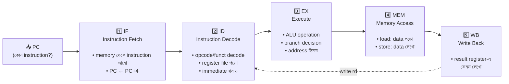
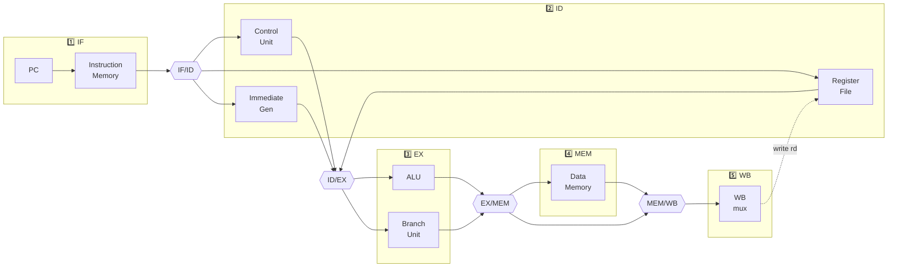

# 🚀 Chapter 16: Build Your Own Pipelined Processor
## From Sequential to Parallel - 5× Performance Boost!

> **"Sequential was slow. Parallel is FAST. Time to unleash true performance!"**
>
> **"Sequential ছিল slow। Parallel FAST। এবার true performance unleash করো!"**

---

## 🎯 এই Chapter-এ তুমি বানাবে:

```
✅ 5-Stage Pipeline - parallel execution
✅ Pipeline Registers - isolate stages
✅ Hazard Detection - identify problems
✅ Ideal Pipeline - maximum throughput
✅ Performance Analysis - 5× speedup!
✅ Pipeline Diagrams - visual execution
✅ Real Pipelined CPU - working design!
✅ তোমার high-performance processor! 🎉
```

**Time Required:** 2 weeks (6-8 hours/day)  
**Prerequisites:** Chapters 14-15 complete

গত দুই chapter-এ তুমি দুই ধরনের CPU বানিয়েছো। Chapter 14-এর single-cycle
CPU প্রতিটা instruction এক ক্লকেই শেষ করে — কিন্তু সেই ক্লকটাকে এত লম্বা হতে
হয় যে সবচেয়ে ধীর instruction-টাও তার ভেতরে এঁটে যায়, তাই clock frequency
কম। Chapter 15-এর multi-cycle CPU হার্ডওয়্যার শেয়ার করে ছোট ক্লক চালায়,
কিন্তু প্রতিটা instruction শেষ করতে কয়েক ক্লক লাগে, তাই CPI বেড়ে যায়।

দুটোরই একটা সাধারণ সমস্যা আছে: **এক সময়ে শুধু একটা instruction নিয়ে কাজ
হচ্ছে।** একটা instruction পুরোপুরি শেষ না হওয়া পর্যন্ত পরেরটা শুরুই হয় না।
হার্ডওয়্যারের বেশিরভাগ অংশ তখন বসে থাকে — ALU যখন কাজ করছে, instruction
memory আর register file চুপচাপ দাঁড়িয়ে।

এই chapter-এ আমরা সেই অপচয়টা বন্ধ করবো। **Pipelining** হলো একটা instruction
শেষ হওয়ার আগেই পরেরটা শুরু করে দেওয়ার কৌশল — যেন একসাথে অনেকগুলো instruction
চলন্ত অবস্থায় থাকে, প্রতিটা আলাদা ধাপে। ছোট ক্লক থাকবে (multi-cycle-এর মতো),
আবার প্রতি ক্লকে একটা করে instruction শেষও হবে (single-cycle-এর throughput-এর
মতো)। দুই জগতের সেরাটা। আধুনিক প্রতিটা প্রসেসর — তোমার ফোন, ল্যাপটপ, সার্ভার
— এই একই কৌশলেই দ্রুত চলে।

---

## 🚀 Quick Understanding - Pipeline Magic!

### What is Pipelining? — একটা assembly line-এর গল্প

Pipelining বোঝার সবচেয়ে সহজ উপায় হলো একটা গাড়ির factory-র assembly line
কল্পনা করা। ধরো একটা গাড়ি বানাতে তিনটা ধাপ লাগে: **Build** (কাঠামো জোড়া),
**Paint** (রং করা), **Test** (পরীক্ষা) — প্রতিটায় ১ ঘণ্টা।

প্রথমে ভাবো **assembly line ছাড়া** কীভাবে হতো — একজন কারিগর একটা গাড়ি পুরো
শেষ করে তবেই পরের গাড়ি ধরছে। Paint-station আর Test-station তখন খালি পড়ে আছে,
কারণ একসাথে শুধু একটা গাড়িতেই হাত পড়ছে। এটাই ঠিক single-cycle / multi-cycle
CPU-র অবস্থা।

```
Without Pipeline (Sequential):
Car 1: [Build] → [Paint] → [Test] → Done (3 hours)
Car 2:                              [Build] → [Paint] → [Test] → Done
Total: 6 hours for 2 cars
```

এবার আসল assembly line-এর জাদু। তিনটা station-কে আলাদা রাখো, আর প্রতিটায়
আলাদা কর্মী বসাও। Car 1 Build শেষ করে Paint-এ চলে গেলে, খালি হওয়া
Build-station-এ সঙ্গে সঙ্গে Car 2 ঢুকে যায়। কোনো station আর বসে থাকে না —
সব সময় তিনটা গাড়িতে একসাথে কাজ চলছে, প্রতিটা ভিন্ন ধাপে:

```
With Pipeline (Parallel):
Time 0: Car 1 [Build]
Time 1: Car 1 [Paint], Car 2 [Build]
Time 2: Car 1 [Test],  Car 2 [Paint], Car 3 [Build]
Time 3: Car 1 Done,    Car 2 [Test],  Car 3 [Paint], Car 4 [Build]

Throughput: 1 car/hour (vs 1 car/3 hours)
3× speedup!

CPU Pipeline = Same idea!
Execute multiple instructions simultaneously!
```

এখানে দুটো ভিন্ন জিনিস আলাদা করে বোঝা খুব জরুরি, কারণ পুরো chapter এই
পার্থক্যের উপর দাঁড়িয়ে:

- **Latency (একটা গাড়ির নিজের সময়):** একটা গাড়ির এখনও ৩ ঘণ্টা লাগছে।
  Pipeline একটা গাড়িকে দ্রুত বানায় না।
- **Throughput (প্রতি ঘণ্টায় কয়টা গাড়ি বের হয়):** line ভরে যাওয়ার পর প্রতি
  ঘণ্টায় একটা করে গাড়ি বেরোচ্ছে। আগে যেখানে ৩ ঘণ্টায় একটা, এখন ১ ঘণ্টায়
  একটা — এটাই ৩× speedup।

মনে রাখো — **pipeline একটা কাজকে দ্রুত করে না, কিন্তু একসাথে অনেক কাজ চালিয়ে
ঘণ্টায় বেশি কাজ শেষ করে।** তিন-ধাপের line-এ একটা গাড়ি দ্রুত বেরোয় না, কিন্তু
গোটা factory তিনগুণ বেশি গাড়ি ডেলিভারি দেয়। CPU-তেও ঠিক তাই হবে: একটা
instruction-এর latency কমবে না, কিন্তু পুরো প্রোগ্রাম অনেক দ্রুত শেষ হবে।

> 💡 **আরেকটা পরিচিত উদাহরণ:** বাড়িতে কাপড় ধোয়ার কথা ভাবো — washing machine,
> তারপর dryer, তারপর ভাঁজ করা। এক বোঝা কাপড় পুরো শেষ করে তবেই পরের বোঝা
> machine-এ দিলে dryer অর্ধেক সময় খালি বসে থাকে। বুদ্ধিমান মানুষ কী করে?
> প্রথম বোঝা dryer-এ গেলেই দ্বিতীয় বোঝা washing machine-এ ঢুকিয়ে দেয়।
> এটাই pipelining — খালি থাকা যন্ত্রকে কখনো বসে থাকতে না দেওয়া।

### CPU Pipeline Stages: পাঁচটা station

CPU-তে একটা instruction চালাতে যে কাজগুলো লাগে — তা আসলে চিরকালই কয়েকটা ধাপে
ভাগ করা ছিল। Single-cycle CPU-তে ওই ধাপগুলো এক ক্লকের ভেতর পরপর ঘটে যায়।
Pipeline শুধু সেই স্বাভাবিক ধাপগুলোর মাঝখানে দেয়াল তুলে দেয়, যেন প্রতিটা ধাপ
আলাদা station হয়ে যায় আর একসাথে পাঁচটা ভিন্ন instruction নিয়ে কাজ করতে পারে।

Classic RISC pipeline-এ station পাঁচটা — IF → ID → EX → MEM → WB। নিচের
flowchart-এ দেখো কোন station-এ instruction কোন রূপ নিয়ে এগোচ্ছে, আর তোমার
single-cycle CPU-র কোন ব্লকটা সেখানে কাজ করছে:



প্রতিটা station-এর কাজ আলাদা করে মনে গেঁথে নাও — পুরো chapter জুড়ে এই পাঁচটা
নাম বারবার আসবে:

```
5-Stage RISC-V Pipeline:

1. IF (Instruction Fetch)
   - Fetch instruction from memory
   - Update PC

2. ID (Instruction Decode)
   - Decode instruction
   - Read registers
   - Generate immediate

3. EX (Execute)
   - ALU operation
   - Branch decision
   - Address calculation

4. MEM (Memory)
   - Load/Store data
   - Access memory

5. WB (Write Back)
   - Write result to register
```

লক্ষ করো — এই পাঁচটা ধাপ মোটামুটি সমান কাজের ভাগে কাটা। তাই প্রতিটা stage-এর
জন্য একটা ছোট, প্রায় সমান-দৈর্ঘ্যের ক্লক পিরিয়ড যথেষ্ট। Single-cycle-এ যে এক
লম্বা ক্লকে পাঁচটা কাজই করতে হতো, সেটাকে পাঁচ ভাগে কেটে পাঁচগুণ দ্রুত ক্লক
চালানোই pipeline-এর মূল চাল।

### Pipeline Visualization: পুরো chapter-এর হৃদয়

এই একটা ছবি যদি ভালো করে বুঝে ফেলো, তাহলে pipelining-এর পুরো ধারণাটাই তোমার
হাতের মুঠোয়। নিচের চার্টে প্রতিটা সারি একটা instruction, প্রতিটা কলাম একটা
clock cycle। লক্ষ করো প্রতিটা instruction কীভাবে আগেরটার ঠিক এক ধাপ পিছনে,
সিঁড়ির ধাপের মতো নেমে এসেছে — Inst2 শুরু হয় Inst1-এর IF শেষ হওয়ামাত্র, তখন
Inst1 ID-তে চলে গেছে।

```
Time →
Cycle: 1    2    3    4    5    6    7    8
Inst1: IF   ID   EX   MEM  WB
Inst2:      IF   ID   EX   MEM  WB
Inst3:           IF   ID   EX   MEM  WB
Inst4:                IF   ID   EX   MEM  WB
Inst5:                     IF   ID   EX   MEM  WB

After 5 cycles:
- 1 instruction completes per cycle!
- 5 instructions in flight simultaneously!
- 5× throughput (ideal case)!
```

ছবিটা **দুই দিক থেকে** পড়তে শেখো — এই দুই দৃষ্টিভঙ্গিই pipeline বোঝার চাবি:

- **একটা সারি বরাবর (একটা instruction-এর যাত্রা):** Inst1-কে অনুসরণ করো — সে
  IF → ID → EX → MEM → WB, পাঁচটা cycle পার করে শেষ হয়। অর্থাৎ একটা
  instruction-এর **latency এখনও ৫ cycle**, ঠিক single-cycle-এর সমান কাজ।
  Pipeline একে দ্রুত করেনি।
- **একটা কলাম বরাবর (এক cycle-এ পুরো হার্ডওয়্যার):** Cycle 5-এর কলামটা উপর-নিচ
  পড়ো — একই মুহূর্তে Inst1 WB-তে, Inst2 MEM-এ, Inst3 EX-এ, Inst4 ID-তে,
  Inst5 IF-এ। অর্থাৎ পাঁচটা station-ই একসাথে ব্যস্ত, **পাঁচটা instruction
  একসঙ্গে চলন্ত (in flight)।**

একই চার্ট table আকারে — খালি ঘরগুলো হলো pipeline এখনও "ভরছে" (fill) বা
"খালি হচ্ছে" (drain), আর হলুদ-চিহ্নিত cycle 5 থেকে cycle 9 পর্যন্ত হলো
**steady state**, যেখানে প্রতি cycle-এ ঠিক একটা instruction শেষ হয়:

| Instruction | C1 | C2 | C3 | C4 | C5 | C6 | C7 | C8 | C9 |
|:-----------:|:--:|:--:|:--:|:--:|:--:|:--:|:--:|:--:|:--:|
| **Inst1**   | IF | ID | EX | MEM| **WB** |    |    |    |    |
| **Inst2**   |    | IF | ID | EX | MEM| WB |    |    |    |
| **Inst3**   |    |    | IF | ID | EX | MEM| WB |    |    |
| **Inst4**   |    |    |    | IF | ID | EX | MEM| WB |    |
| **Inst5**   |    |    |    |    | IF | ID | EX | MEM| WB |

খেয়াল করো: প্রথম instruction-টা cycle 5-এ শেষ হয় (pipeline ভরতে ৫ cycle
লাগে)। কিন্তু এরপর Inst2 শেষ হয় cycle 6-এ, Inst3 cycle 7-এ — **প্রতি cycle-এ
একটা করে।** এই "প্রতি cycle-এ একটা শেষ" হওয়াটাই throughput = 1 instruction
per cycle, আর এখান থেকেই আসে আদর্শ 5× speedup।

🎉 **This is how modern processors achieve speed!** আধুনিক প্রসেসর গাড়ির
assembly line-এর মতোই — কখনো কোনো station-কে বসে থাকতে দেয় না।

---

## ১৬.১ Pipeline Benefits

### Performance Gain: latency বনাম throughput

এখন একটু সংখ্যা দিয়ে দেখি pipeline আসলে কতটা লাভ এনে দেয়। ধরো একটা প্রোগ্রামে
১০০টা instruction আছে। মনে রাখো — pipeline করার পরেও প্রতিটা stage একই কাজ
করছে, তাই একটা instruction-এর এখনও ৫টা ধাপ লাগছে। কিন্তু সব instruction যেহেতু
একে অপরের পিছু পিছু সিঁড়ির ধাপে নামছে, প্রথমটা শেষ হওয়ার পর বাকি ৯৯টা প্রতি
cycle-এ একটা করে বেরিয়ে আসে।

```
Non-Pipelined:
Time per instruction: 5 cycles
100 instructions: 500 cycles

Pipelined (Ideal):
Time per instruction: Still 5 cycles (latency)
But: 1 instruction completes per cycle (throughput)
100 instructions: 5 + 99 = 104 cycles

Speedup: 500/104 ≈ 4.8× !

General formula:
Speedup = (Pipeline depth) × (Efficiency)
Ideal 5-stage: 5×
```

সংখ্যাটা একটু ভেঙে দেখো — `5 + 99` কেন? প্রথম instruction-টা pipeline-কে
**ভরাতে** ৫ cycle নেয় (এটাকে বলে *fill* বা *pipeline startup*)। এরপর pipeline
পুরো ভর্তি, তাই বাকি ৯৯টা instruction একটার পিঠে একটা, প্রতি cycle-এ একটা করে
বেরিয়ে যায় — ৯৯ cycle। মোট 104 cycle।

আদর্শভাবে speedup হওয়ার কথা ছিল ঠিক **৫×** (পাঁচ stage), কিন্তু পেলাম 4.8×।
এই সামান্য কমতির কারণ ওই শুরুর ৫ cycle-এর fill — যতক্ষণ pipeline ভরছে, ততক্ষণ
পুরো হার্ডওয়্যার ব্যবহার হচ্ছে না। প্রোগ্রাম যত লম্বা, এই fill-এর ভাগ তত ছোট
হয়ে আসে আর speedup তত খাঁটি ৫×-এর কাছে পৌঁছায়। যেমন ১০,০০০ instruction হলে
সময় হবে `5 + 9999 = 10004` cycle, speedup `50000 / 10004 ≈ 4.998×` — প্রায়
নিখুঁত ৫×।

মূল সূত্রটা মাথায় রাখো — এটাই pipeline-এর প্রতিশ্রুতি:

> **Speedup = Pipeline depth × Efficiency**

Depth মানে stage-সংখ্যা (আমাদের ৫), আর efficiency হলো pipeline কতটা ভরা
থাকছে (আদর্শে ১, বাস্তবে hazard-এর কারণে একটু কম — সেটা পরের chapter-এ)।
আর হ্যাঁ, খেয়াল রাখো একটা instruction-এর latency কিন্তু একটুও কমেনি — এখনও
৫ cycle। আমরা প্রতিটা গাড়িকে দ্রুত বানাইনি; আমরা factory-র throughput বাড়িয়েছি।

### Why Not Just Increase Clock? — শুধু ক্লক বাড়ালেই তো হয়?

স্বাভাবিক প্রশ্ন — দ্রুত চাই, তাহলে clock frequency বাড়িয়ে দিলেই তো হলো,
এত কষ্ট করে stage ভাঙার দরকার কী? সমস্যা হলো ক্লক ইচ্ছেমতো বাড়ানো যায় না।
একটা clock cycle-কে এত ছোট করা যায় না যে সবচেয়ে লম্বা combinational পথটা —
**critical path** — তার ভেতরে শেষ না হয়। Single-cycle CPU-তে সেই critical
path হলো IF থেকে WB পর্যন্ত পুরো পথ; সিগন্যালকে গেটের পর গেট পেরিয়ে যেতে যে
সময় লাগে, ক্লককে অন্তত ততটা লম্বা হতেই হবে, নাহলে ভুল মান latch হয়ে যাবে।

```
Problem with faster clock:
❌ Critical path limits speed
❌ Can't make combinational logic infinitely fast
❌ Power increases dramatically

Pipeline solution:
✅ Break into smaller stages
✅ Each stage faster
✅ Overall throughput increases
✅ More efficient
```

Pipeline এই দেয়ালটা ভাঙে চালাকি করে — combinational logic-কে দ্রুত না বানিয়ে,
সেই লম্বা পথটাকেই ছোট ছোট টুকরোয় (stage-এ) কেটে দেয়। এখন ক্লককে শুধু **সবচেয়ে
ধীর একটা stage**-এর সমান লম্বা হলেই চলে, পুরো পথের সমান নয়। পাঁচ ভাগে কাটলে
critical path প্রায় এক-পঞ্চমাংশ, তাই ক্লক প্রায় পাঁচগুণ দ্রুত চালানো যায় —
আর এটাই আসল উৎস ওই 5× throughput-এর। (ব্যবহারিকভাবে stage-গুলো একদম সমান হয়
না, আর প্রতিটা pipeline register নিজেও সামান্য বিলম্ব যোগ করে, তাই লাভ ঠিক
পাঁচগুণ নয়, একটু কম।)

তাহলে আরও বেশি stage-এ কাটলেই কি আরও দ্রুত? এক জায়গা পর্যন্ত — হ্যাঁ। কিন্তু
stage যত বাড়ে, register-এর overhead বাড়ে, hazard সামলানো কঠিন হয়, branch ভুল
হলে শাস্তি (penalty) বাড়ে, আর power খরচ লাফিয়ে বাড়ে। তাই বাস্তবে একটা balance
আছে:

| Pipeline depth | কোথায় ব্যবহার হয় | বৈশিষ্ট্য |
|:--------------:|:-----------------|:----------|
| 5–7 stages | Embedded / low-power CPU | সরল, কম power, hazard সহজ |
| 10–20 stages | Desktop processor | বেশি clock, বেশি জটিলতা |
| 20–31 stages | Intel Pentium 4 (Northwood 20, Prescott 31) | অতিরিক্ত গভীর — too deep! |

Pentium 4-এর Prescott-কোর ৩১ stage পর্যন্ত গিয়েছিল, কিন্তু এত গভীর pipeline-এ
একটা branch ভুল হলে এতগুলো cycle নষ্ট হতো যে লাভের চেয়ে ক্ষতি বেশি — তাই Intel
পরে আবার অগভীর design-এ ফিরে আসে। আমরা শিখব **classic 5-stage RISC** pipeline —
শেখার জন্য আদর্শ, যথেষ্ট দ্রুত, আর hazard বোঝার জন্য সবচেয়ে পরিষ্কার।

```
We'll use 5 stages: Classic RISC!
```

---

## ১৬.২ Pipeline Registers

### Between Each Stage: প্রতিটা station-এর মাঝে দেয়াল

এবার সবচেয়ে গুরুত্বপূর্ণ প্রশ্ন — পাঁচটা instruction যদি একসাথে চলন্ত থাকে,
তাহলে তাদের তথ্য একটার সঙ্গে আরেকটার মিশে যায় না কেন? Inst1-এর ALU result আর
Inst2-এর register-পড়া মান তো একই তারের উপর দিয়েই যাচ্ছে — গোলমাল হবে না?

উত্তর হলো **pipeline register**। প্রতি দুই stage-এর ঠিক মাঝখানে একটা করে
register বসানো — IF আর ID-এর মাঝে IF/ID, ID আর EX-এর মাঝে ID/EX, এভাবে চারটা।
প্রতি ক্লকের প্রান্তে (posedge) এরা আগের stage-এর ফলাফল ছবি তুলে ধরে রাখে আর
পরের stage-এর হাতে তুলে দেয়। assembly line-এ এ যেন এক station আর পরের
station-এর মাঝখানের **conveyor belt** — গাড়িটা (এবং তার সঙ্গে লাগানো কাজের
নির্দেশ-চিরকুট) পরের station-এ নিয়ে যায়, কিন্তু দুই station-কে আলাদাও রাখে।

এই register-গুলোর চারটা কাজ:

```
Pipeline registers:
- Isolate stages
- Hold values for next stage
- Enable parallel execution
- Store control signals
```

খুব জরুরি একটা ব্যাপার — register শুধু *data* (যেমন ALU-র ইনপুট) বহন করে না,
**control signal-ও** বহন করে। কারণ একটা instruction যখন EX-তে, তার `reg_write`
বা `mem_read`-এর সিদ্ধান্ত তো নেওয়া হয়েছিল ID stage-এ control unit থেকে। সেই
সিদ্ধান্তগুলোকে instruction-এর সঙ্গে সঙ্গে নিচের stage পর্যন্ত ভ্রমণ করাতে হয়,
নাহলে MEM বা WB stage বুঝবেই না এই instruction-টা কী করতে চায়। তাই control
signal হলো গাড়ির গায়ে সাঁটানো কাজের চিরকুট — গাড়ির সঙ্গে সঙ্গে belt বেয়ে যায়।

কোন register-এ কী থাকে, সেটা যুক্তি দিয়ে বোঝা যায়: একটা stage যে ফল বানায়, আর
যেসব মান পরে কোনো stage-এ আবার লাগবে — শুধু সেগুলোই পরের register-এ ঢোকে।
যেমন `rs2_data` EX পেরিয়েও EX/MEM-এ থেকে যায়, কারণ store instruction-এ MEM
stage-এ ওই মানটাই memory-তে লেখা হবে। নিচের diagram-এ চারটা register আর তাদের
বহন করা ক্ষেত্রগুলো দেখো:

```mermaid
flowchart LR
    subgraph IFID["🟦 IF/ID Register"]
        direction TB
        a1["Instruction (32b)"]
        a2["PC + 4 (32b)"]
    end
    subgraph IDEX["🟩 ID/EX Register"]
        direction TB
        b1["PC + 4"]
        b2["rs1_data"]
        b3["rs2_data"]
        b4["Immediate"]
        b5["rd_addr"]
        b6["Control signals"]
    end
    subgraph EXMEM["🟨 EX/MEM Register"]
        direction TB
        c1["ALU result"]
        c2["rs2_data (store)"]
        c3["rd_addr"]
        c4["Control signals"]
    end
    subgraph MEMWB["🟧 MEM/WB Register"]
        direction TB
        d1["ALU result"]
        d2["Memory data"]
        d3["rd_addr"]
        d4["Control signals"]
    end
    IFID --> IDEX --> EXMEM --> MEMWB
```



লক্ষ করো `rd_addr` (কোন register-এ লিখতে হবে তার ঠিকানা) আর control signal-গুলো
**চারটা register জুড়েই** পাড়ি দিচ্ছে — কারণ সিদ্ধান্ত হয় ID-তে, কিন্তু আসল
লেখা হয় একদম শেষে WB-তে, পাঁচ cycle পরে। instruction-টাকে নিজের পরিচয় আর
উদ্দেশ্য সঙ্গে নিয়েই পুরো pipeline পাড়ি দিতে হয়।

### Pipeline Register Implementation:

প্রতিটা pipeline register আসলে চেনা সেই Chapter 4-এর জিনিস — একগুচ্ছ D
flip-flop, যারা প্রতি `posedge clk`-এ ইনপুট ধরে রাখে। শুধু কয়েকটা বাড়তি
নিয়ন্ত্রণ যোগ হয়েছে, যেগুলো নিচের কোডে খেয়াল রাখো:

- **`reset`:** চালু হওয়ার সময় register-কে নিরাপদ মানে (NOP / শূন্য) বসিয়ে দেয়,
  যেন আবর্জনা মান pipeline-এ ঢুকে না পড়ে।
- **`flush`:** register-টাকে জোর করে NOP-এ পরিণত করে — অর্থাৎ একটা "bubble"
  (খালি instruction) ঢুকিয়ে দেয়। branch ভুল হলে ভুল পথে আনা instruction
  এভাবেই বাতিল হবে (বিস্তারিত পরের chapter-এ)।
- **`stall`:** register-কে এই ক্লকে পুরনো মানই ধরে রাখতে বলে — instruction-টাকে
  এক জায়গায় থামিয়ে রাখে, যেন pipeline এক cycle অপেক্ষা করে।

মন দিয়ে দেখো IF/ID-তে reset/flush হলে instruction-এর জায়গায় কেন
`32'h00000013` বসছে — ওটাই RISC-V-এর `addi x0, x0, 0`, অর্থাৎ "কিছু করো না"
NOP। এমন একটা instruction pipeline-এ গিয়ে কোনো ক্ষতি করে না, কারণ সে `x0`-তে
শূন্য যোগ করে — যার কোনো effect নেই।

```verilog
// IF/ID Pipeline Register
module if_id_register(
    input wire clk,
    input wire reset,
    input wire stall,
    input wire flush,
    input wire [31:0] instruction_in,
    input wire [31:0] pc_plus_4_in,
    output reg [31:0] instruction_out,
    output reg [31:0] pc_plus_4_out
);
    always @(posedge clk or posedge reset) begin
        if (reset || flush) begin
            instruction_out <= 32'h00000013;  // NOP
            pc_plus_4_out <= 32'h00000000;
        end else if (!stall) begin
            instruction_out <= instruction_in;
            pc_plus_4_out <= pc_plus_4_in;
        end
    end
endmodule

// ID/EX Pipeline Register
module id_ex_register(
    input wire clk,
    input wire reset,
    input wire flush,
    // Inputs
    input wire [31:0] pc_plus_4_in,
    input wire [31:0] rs1_data_in,
    input wire [31:0] rs2_data_in,
    input wire [31:0] immediate_in,
    input wire [4:0] rd_addr_in,
    input wire [4:0] rs1_addr_in,
    input wire [4:0] rs2_addr_in,
    // Control signals in
    input wire reg_write_in,
    input wire mem_read_in,
    input wire mem_write_in,
    input wire mem_to_reg_in,
    input wire [3:0] alu_control_in,
    input wire alu_src_in,
    input wire branch_in,
    input wire jump_in,
    input wire [2:0] funct3_in,
    input wire lui_in,
    // Outputs
    output reg [31:0] pc_plus_4_out,
    output reg [31:0] rs1_data_out,
    output reg [31:0] rs2_data_out,
    output reg [31:0] immediate_out,
    output reg [4:0] rd_addr_out,
    output reg [4:0] rs1_addr_out,
    output reg [4:0] rs2_addr_out,
    // Control signals out
    output reg reg_write_out,
    output reg mem_read_out,
    output reg mem_write_out,
    output reg mem_to_reg_out,
    output reg [3:0] alu_control_out,
    output reg alu_src_out,
    output reg branch_out,
    output reg jump_out,
    output reg [2:0] funct3_out,
    output reg lui_out
);
    always @(posedge clk or posedge reset) begin
        if (reset || flush) begin
            pc_plus_4_out <= 32'h00000000;
            rs1_data_out <= 32'h00000000;
            rs2_data_out <= 32'h00000000;
            immediate_out <= 32'h00000000;
            rd_addr_out <= 5'b00000;
            rs1_addr_out <= 5'b00000;
            rs2_addr_out <= 5'b00000;
            reg_write_out <= 0;
            mem_read_out <= 0;
            mem_write_out <= 0;
            mem_to_reg_out <= 0;
            alu_control_out <= 4'b0000;
            alu_src_out <= 0;
            branch_out <= 0;
            jump_out <= 0;
            funct3_out <= 3'b000;
            lui_out <= 0;
        end else begin
            pc_plus_4_out <= pc_plus_4_in;
            rs1_data_out <= rs1_data_in;
            rs2_data_out <= rs2_data_in;
            immediate_out <= immediate_in;
            rd_addr_out <= rd_addr_in;
            rs1_addr_out <= rs1_addr_in;
            rs2_addr_out <= rs2_addr_in;
            reg_write_out <= reg_write_in;
            mem_read_out <= mem_read_in;
            mem_write_out <= mem_write_in;
            mem_to_reg_out <= mem_to_reg_in;
            alu_control_out <= alu_control_in;
            alu_src_out <= alu_src_in;
            branch_out <= branch_in;
            jump_out <= jump_in;
            funct3_out <= funct3_in;
            lui_out <= lui_in;
        end
    end
endmodule

// EX/MEM Pipeline Register
module ex_mem_register(
    input wire clk,
    input wire reset,
    // Inputs
    input wire [31:0] alu_result_in,
    input wire [31:0] rs2_data_in,
    input wire [31:0] pc_plus_4_in,
    input wire [4:0] rd_addr_in,
    input wire [2:0] funct3_in,
    // Control signals in
    input wire reg_write_in,
    input wire mem_read_in,
    input wire mem_write_in,
    input wire mem_to_reg_in,
    input wire jump_in,
    // Outputs
    output reg [31:0] alu_result_out,
    output reg [31:0] rs2_data_out,
    output reg [31:0] pc_plus_4_out,
    output reg [4:0] rd_addr_out,
    output reg [2:0] funct3_out,
    // Control signals out
    output reg reg_write_out,
    output reg mem_read_out,
    output reg mem_write_out,
    output reg mem_to_reg_out,
    output reg jump_out
);
    // Note: EX/MEM needs no flush. An instruction here is OLDER than a branch
    // resolving in EX, so it must always complete; bubbles arrive naturally
    // from a flushed/stalled ID/EX register upstream.
    always @(posedge clk or posedge reset) begin
        if (reset) begin
            alu_result_out <= 32'h00000000;
            rs2_data_out   <= 32'h00000000;
            pc_plus_4_out  <= 32'h00000000;
            rd_addr_out    <= 5'b00000;
            funct3_out     <= 3'b000;
            reg_write_out  <= 0;
            mem_read_out   <= 0;
            mem_write_out  <= 0;
            mem_to_reg_out <= 0;
            jump_out       <= 0;
        end else begin
            alu_result_out <= alu_result_in;
            rs2_data_out   <= rs2_data_in;
            pc_plus_4_out  <= pc_plus_4_in;
            rd_addr_out    <= rd_addr_in;
            funct3_out     <= funct3_in;
            reg_write_out  <= reg_write_in;
            mem_read_out   <= mem_read_in;
            mem_write_out  <= mem_write_in;
            mem_to_reg_out <= mem_to_reg_in;
            jump_out       <= jump_in;
        end
    end
endmodule

// MEM/WB Pipeline Register
module mem_wb_register(
    input wire clk,
    input wire reset,
    // Inputs
    input wire [31:0] alu_result_in,
    input wire [31:0] mem_data_in,
    input wire [31:0] pc_plus_4_in,
    input wire [4:0] rd_addr_in,
    // Control signals in
    input wire reg_write_in,
    input wire mem_to_reg_in,
    input wire jump_in,
    // Outputs
    output reg [31:0] alu_result_out,
    output reg [31:0] mem_data_out,
    output reg [31:0] pc_plus_4_out,
    output reg [4:0] rd_addr_out,
    // Control signals out
    output reg reg_write_out,
    output reg mem_to_reg_out,
    output reg jump_out
);
    always @(posedge clk or posedge reset) begin
        if (reset) begin
            alu_result_out <= 32'h00000000;
            mem_data_out   <= 32'h00000000;
            pc_plus_4_out  <= 32'h00000000;
            rd_addr_out    <= 5'b00000;
            reg_write_out  <= 0;
            mem_to_reg_out <= 0;
            jump_out       <= 0;
        end else begin
            alu_result_out <= alu_result_in;
            mem_data_out   <= mem_data_in;
            pc_plus_4_out  <= pc_plus_4_in;
            rd_addr_out    <= rd_addr_in;
            reg_write_out  <= reg_write_in;
            mem_to_reg_out <= mem_to_reg_in;
            jump_out       <= jump_in;
        end
    end
endmodule
```

---

## ১৬.৩ Pipelined Datapath

### Complete Pipeline Stages: পুরো ছবি একসাথে

এবার সব টুকরো জোড়া লাগাই। মজার ব্যাপার হলো — pipelined datapath-এ ব্যবহৃত
হার্ডওয়্যার ব্লকগুলো প্রায় সবই তোমার Chapter 14-এর single-cycle CPU থেকেই
চেনা: একটাই PC, instruction memory, register file, ALU, data memory। শুধু
সেগুলোকে পাঁচ ভাগে সাজিয়ে, প্রতি ভাগের মাঝে একটা করে pipeline register
বসিয়ে দিয়েছি।

নিচের datapath-এ লক্ষ করো তথ্য বাঁদিক থেকে ডানদিকে — IF থেকে WB-র দিকে —
এগোচ্ছে, আর প্রতি দুই stage-এর মাঝে একটা register পাহারায় দাঁড়িয়ে। শুধু
একটা তার উল্টোদিকে ফিরছে: WB stage যে মান হিসাব করে, সেটা register file-এ
ফেরত লেখার জন্য ID stage-এ ফিরে যায় (নিচে dashed তীর)।



প্রতিটা stage আলাদা করে দেখলে এই কাজগুলো ঘটছে — এই তালিকাটাই নিচের প্রতিটা
Verilog module-এ রূপ নেবে:

```
Stage 1: IF (Instruction Fetch)
┌─────────┐
│   PC    │──→ Instruction Memory ──→ IF/ID
└─────────┘

Stage 2: ID (Instruction Decode)
IF/ID ──→ Control Unit
      ──→ Register File ──→ ID/EX
      ──→ Immediate Gen

Stage 3: EX (Execute)
ID/EX ──→ ALU ──→ EX/MEM
      ──→ Branch Unit

Stage 4: MEM (Memory Access)
EX/MEM ──→ Data Memory ──→ MEM/WB

Stage 5: WB (Write Back)
MEM/WB ──→ Register File
```

এখন আমরা প্রতিটা stage-কে আলাদা Verilog module হিসেবে লিখব। সুন্দর ব্যাপার
হলো প্রতিটা module ছোট আর একটামাত্র কাজে মন দেয় — ঠিক assembly line-এর একেকটা
station-এর মতো, যে শুধু নিজের একটা কাজ জানে। পরের section-এ এই module-গুলোকে আর
চারটা pipeline register দিয়ে জুড়ে পুরো প্রসেসর দাঁড় করাবো।

### IF Stage (Instruction Fetch):

pipeline-এর প্রথম station — এর একটাই কাজ: "এরপর কোন instruction?"। PC বলে দেয়
কোন ঠিকানা থেকে instruction আনতে হবে, instruction memory সেই word ফেরত দেয়, আর
PC নিজে এগিয়ে যায় পরের instruction-এর দিকে (`pc + 4`)। লক্ষ করো PC-update-এ
`stall` শর্ত আছে — pipeline থামাতে হলে PC যেন এক জায়গাতেই দাঁড়িয়ে থাকে, একই
instruction বারবার fetch করে। আর `branch_taken` হলে PC সাধারণ `pc+4`-এর বদলে
`branch_target`-এ লাফ দেয়।

```verilog
module if_stage(
    input wire clk,
    input wire reset,
    input wire stall,
    input wire branch_taken,
    input wire [31:0] branch_target,
    input wire [31:0] instruction_in,   // fetched word from external instruction memory
    output reg [31:0] pc,
    output wire [31:0] instruction,
    output wire [31:0] pc_plus_4
);
    wire [31:0] pc_next;
    
    // PC update
    always @(posedge clk or posedge reset) begin
        if (reset)
            pc <= 32'h00000000;
        else if (!stall)
            pc <= pc_next;
    end
    
    // PC source mux
    assign pc_next = branch_taken ? branch_target : (pc + 4);
    assign pc_plus_4 = pc + 4;
    
    // Instruction comes from outside (instruction memory / cache lives in the
    // SoC, not inside the pipeline) — pc is exposed as the fetch address.
    assign instruction = instruction_in;
endmodule
```

### ID Stage (Instruction Decode):

দ্বিতীয় station instruction-টাকে "পড়ে বোঝে"। ৩২-বিট instruction-কে টুকরো করে
বের করে — opcode, rd, rs1, rs2, funct3, funct7। তারপর তিনটা কাজ একসাথে হয়:
register file থেকে `rs1`, `rs2`-এর মান পড়া হয়; immediate generator instruction
থেকে constant মান বানায়; আর control unit ঠিক করে এই instruction-এর জন্য কোন
কোন control signal লাগবে (`reg_write`, `mem_read`, `alu_src`, ইত্যাদি)।

দুটো জিনিস খেয়াল রাখো। এক — register file-এর **write port** আসলে WB stage থেকে
আসা সিগন্যালে চলছে (`wb_rd_addr`, `wb_rd_data`), অর্থাৎ এক instruction এখানে
register পড়ছে আর পাঁচ cycle আগের আরেকটা instruction একই সময়ে register-এ লিখছে।
দুই — control unit-এর দেওয়া `alu_op`-কে `alu_control` module পরিণত করে চূড়ান্ত
৪-বিট ALU control-এ, যেটা instruction-এর সঙ্গে EX stage পর্যন্ত ভ্রমণ করবে।

```verilog
module id_stage(
    input wire clk,
    input wire reset,
    input wire [31:0] instruction,
    input wire [31:0] pc_plus_4,
    // From WB stage (write back)
    input wire [4:0] wb_rd_addr,
    input wire [31:0] wb_rd_data,
    input wire wb_reg_write,
    // Outputs
    output wire [31:0] rs1_data,
    output wire [31:0] rs2_data,
    output wire [31:0] immediate,
    output wire [4:0] rd_addr,
    output wire [4:0] rs1_addr,
    output wire [4:0] rs2_addr,
    // Control signals
    output wire reg_write,
    output wire mem_read,
    output wire mem_write,
    output wire mem_to_reg,
    output wire [3:0] alu_control,
    output wire alu_src,
    output wire branch,
    output wire jump,
    output wire lui
);
    // Extract instruction fields
    wire [6:0] opcode = instruction[6:0];
    assign rd_addr = instruction[11:7];
    wire [2:0] funct3 = instruction[14:12];
    assign rs1_addr = instruction[19:15];
    assign rs2_addr = instruction[24:20];
    wire [6:0] funct7 = instruction[31:25];
    
    // Register File
    register_file rf(
        .clk(clk),
        .reset(reset),
        .rs1_addr(rs1_addr),
        .rs2_addr(rs2_addr),
        .rs1_data(rs1_data),
        .rs2_data(rs2_data),
        .rd_addr(wb_rd_addr),
        .rd_data(wb_rd_data),
        .reg_write(wb_reg_write)
    );
    
    // Immediate Generator
    imm_gen imm_gen_inst(
        .instruction(instruction),
        .immediate(immediate)
    );
    
    // Control Unit (Chapter 14): produces the 2-bit alu_op plus control bits.
    // alu_control (Chapter 14) then turns alu_op + funct fields into the 4-bit
    // ALU control that travels down the pipeline with the instruction.
    wire [1:0] alu_op;
    control_unit ctrl(
        .opcode(opcode),
        .funct3(funct3),
        .funct7(funct7),
        .branch(branch),
        .mem_read(mem_read),
        .mem_to_reg(mem_to_reg),
        .alu_op(alu_op),
        .mem_write(mem_write),
        .alu_src(alu_src),
        .reg_write(reg_write),
        .jump(jump),
        .auipc(),
        .lui(lui)
    );

    alu_control alu_ctrl(
        .alu_op(alu_op),
        .funct3(funct3),
        .funct7(funct7),
        .is_rtype(opcode == 7'b0110011),
        .alu_control_out(alu_control)
    );
endmodule
```

### EX Stage (Execute):

তৃতীয় station হলো আসল হিসাব-নিকাশের জায়গা। ALU এখানে যোগ-বিয়োগ, AND/OR,
তুলনা — যা দরকার তাই করে। `alu_src` mux ঠিক করে ALU-র দ্বিতীয় ইনপুট আসবে
register (`rs2_data`) থেকে নাকি immediate থেকে — R-type-এ register, কিন্তু
`addi` বা load/store-এ immediate। একই সঙ্গে branch comparator দেখে শর্তটা সত্যি
কিনা, আর সেটা `branch` signal-এর সঙ্গে AND করে চূড়ান্ত `branch_taken` ঠিক হয়।

খেয়াল করো branch target হিসাব হচ্ছে branch-এর **নিজের PC** থেকে — কোডের মন্তব্য
বলছে কেন `pc_plus_4 - 4` করে আসল branch-PC বের করে তার সঙ্গে immediate যোগ করা
হচ্ছে। এই stage থেকেই (EX) branch-এর সিদ্ধান্ত আসে, তাই branch ভুল হলে এর পরের
দুটো instruction-কে বাতিল করতে হবে — সেটাই উপরের `flush` logic-এর কাজ।

```verilog
module ex_stage(
    input wire [31:0] pc_plus_4,
    input wire [31:0] rs1_data,
    input wire [31:0] rs2_data,
    input wire [31:0] immediate,
    input wire [3:0] alu_control,
    input wire alu_src,
    input wire branch,
    input wire [2:0] funct3,
    output wire [31:0] alu_result,
    output wire branch_taken,
    output wire [31:0] branch_target
);
    wire [31:0] alu_b;
    wire zero;
    
    // ALU source mux
    assign alu_b = alu_src ? immediate : rs2_data;
    
    // ALU
    alu alu_inst(
        .a(rs1_data),
        .b(alu_b),
        .alu_control(alu_control),
        .result(alu_result),
        .zero(zero),
        .negative()
    );
    
    // Branch comparator (drives a separate net, then AND with branch —
    // driving branch_taken from both the port and an assign is illegal)
    wire comp_taken;
    branch_comparator branch_comp(
        .rs1_data(rs1_data),
        .rs2_data(rs2_data),
        .funct3(funct3),
        .branch_taken(comp_taken)
    );
    
    assign branch_taken = branch & comp_taken;
    // Target is relative to the branch's OWN PC; we carry pc_plus_4 (= branchPC+4)
    assign branch_target = (pc_plus_4 - 32'd4) + immediate;
endmodule
```

### MEM Stage (Memory Access):

চতুর্থ station শুধু load আর store instruction-এর জন্য সত্যিকারের ব্যস্ত — বাকি
সব instruction এখান দিয়ে কেবল হেঁটে চলে যায়। load হলে ALU-র হিসাব করা ঠিকানা
থেকে data memory পড়ে, আর store হলে `rs2_data`-র মান ওই ঠিকানায় লেখে। মন দিয়ে
দেখো এখানে memory নিজে এই module-এর ভেতরে নেই — module শুধু বাইরের data
memory-র সঙ্গে কথা বলার তারগুলো (address, write data, read/write signal, size)
বের করে দেয়। কারণ বাস্তবে data memory বা cache থাকে SoC-তে, pipeline-এর বাইরে।

```verilog
module mem_stage(
    // Data-memory bus — the memory now lives outside the pipeline (SoC/cache)
    input wire [31:0] alu_result,     // = data address
    input wire [31:0] rs2_data,       // = store data
    input wire mem_read,
    input wire mem_write,
    input wire [2:0] funct3,
    output wire [31:0] data_address,
    output wire [31:0] data_write,
    output wire data_mem_read,
    output wire data_mem_write,
    output wire [2:0] data_size,
    input wire [31:0] read_data,      // load result from external data memory
    output wire [31:0] mem_data       // forwarded to WB
);
    assign data_address   = alu_result;
    assign data_write     = rs2_data;
    assign data_mem_read  = mem_read;
    assign data_mem_write = mem_write;
    assign data_size      = funct3;
    assign mem_data       = read_data;
endmodule
```

### WB Stage (Write Back):

শেষ station-এর কাজ সবচেয়ে ছোট, কিন্তু জরুরি — instruction-এর ফলাফল register
file-এ ফেরত লেখা। এখানে আসলে শুধু একটা mux: register-এ কোন মানটা যাবে?
তিনটা সম্ভাবনা — jump হলে return address (`pc_plus_4`), load হলে memory থেকে
আনা data (`mem_data`), আর সাধারণ ALU instruction হলে `alu_result`। এই বাছাই করা
মানটাই তারের মাধ্যমে ID stage-এর register file-এর write port-এ ফিরে যায়, যেন
পাঁচ cycle আগে শুরু হওয়া instruction-টা অবশেষে নিজের ফল সংরক্ষণ করতে পারে।

```verilog
module wb_stage(
    input wire [31:0] alu_result,
    input wire [31:0] mem_data,
    input wire [31:0] pc_plus_4,
    input wire mem_to_reg,
    input wire jump,
    output wire [31:0] wb_data
);
    assign wb_data = jump ? pc_plus_4 :
                     mem_to_reg ? mem_data :
                     alu_result;
endmodule
```

---

## ১৬.৪ Complete Pipelined Processor

এবার আসল মুহূর্ত — সব stage আর সব pipeline register জুড়ে পুরো প্রসেসর। নিচের
top-level module-টা দেখতে লম্বা, কিন্তু ভয় পেও না: এটা আসলে আমাদের চেনা জিনিসই
পরপর সাজানো। গঠনটা একদম সোজা — **stage → register → stage → register …**
এই ছন্দে পাঁচটা stage আর চারটা register পরপর instantiate করা।

পড়ার সময় wire-গুলোর নামের উপসর্গ (prefix) খেয়াল করলেই পুরো গল্পটা পরিষ্কার
হয়ে যাবে — নাম দিয়েই বোঝা যায় সিগন্যালটা pipeline-এর কোন অংশে আছে:

- `if_*` — IF stage থেকে বেরোনো signal (যেমন `if_instruction`)।
- `id_*` — IF/ID register পেরিয়ে ID stage-এ পৌঁছানো signal।
- `ex_*` — ID/EX register পেরিয়ে EX stage-এ পৌঁছানো signal।
- `mem_*` — EX/MEM register পেরিয়ে MEM stage-এ পৌঁছানো signal।
- `wb_*` — MEM/WB register পেরিয়ে WB stage-এ পৌঁছানো signal।

অর্থাৎ একটা মান যখন এক register থেকে পরের stage-এ যায়, তার prefix-ও বদলে যায় —
`if_instruction` → register → `id_instruction`। এই নামকরণ নিজেই pipeline-এর
প্রবাহের ছবি এঁকে দেয়। আর একদম নিচে দুটো ছোট লাইন আছে —
`if_id_flush = ex_branch_taken` আর `id_ex_flush = ex_branch_taken` — যেগুলো
branch নেওয়া হলে ভুল পথে আনা দুটো instruction-কে flush করে দেয়। (এই
control-hazard সামলানোর পুরো গল্প তোমার অপেক্ষা করছে Chapter 17-এ।)

```verilog
module riscv_pipelined(
    input wire clk,
    input wire reset,
    // Debug
    output wire [31:0] pc_debug
);
    // IF stage signals
    wire [31:0] if_pc, if_instruction, if_pc_plus_4;
    wire if_stall;
    
    // IF/ID pipeline register
    wire [31:0] id_instruction, id_pc_plus_4;
    wire if_id_flush;
    
    // ID stage signals
    wire [31:0] id_rs1_data, id_rs2_data, id_immediate;
    wire [4:0] id_rd_addr, id_rs1_addr, id_rs2_addr;
    wire id_reg_write, id_mem_read, id_mem_write;
    wire id_mem_to_reg, id_alu_src, id_branch, id_jump;
    wire [3:0] id_alu_control;
    
    // ID/EX pipeline register
    wire [31:0] ex_pc_plus_4, ex_rs1_data, ex_rs2_data, ex_immediate;
    wire [4:0] ex_rd_addr, ex_rs1_addr, ex_rs2_addr;
    wire ex_reg_write, ex_mem_read, ex_mem_write;
    wire ex_mem_to_reg, ex_alu_src, ex_branch, ex_jump;
    wire [3:0] ex_alu_control;
    wire [2:0] ex_funct3;
    wire id_ex_flush;
    
    // EX stage signals
    wire [31:0] ex_alu_result, ex_branch_target;
    wire ex_branch_taken;
    
    // EX/MEM pipeline register
    wire [31:0] mem_alu_result, mem_rs2_data, mem_pc_plus_4;
    wire [4:0] mem_rd_addr;
    wire mem_reg_write, mem_mem_read, mem_mem_write;
    wire mem_mem_to_reg, mem_jump;
    wire [2:0] mem_funct3;
    
    // MEM stage signals
    wire [31:0] mem_data;
    
    // MEM/WB pipeline register
    wire [31:0] wb_alu_result, wb_mem_data, wb_pc_plus_4;
    wire [4:0] wb_rd_addr;
    wire wb_reg_write, wb_mem_to_reg, wb_jump;
    
    // WB stage signals
    wire [31:0] wb_data;
    
    // IF Stage
    // Instruction memory (internal to this self-contained pipeline; loads program.hex)
    wire [31:0] if_imem_data;
    instruction_memory imem(.address(if_pc), .instruction(if_imem_data));

    if_stage if_stage_inst(
        .clk(clk),
        .reset(reset),
        .stall(if_stall),
        .branch_taken(ex_branch_taken),
        .branch_target(ex_branch_target),
        .instruction_in(if_imem_data),
        .pc(if_pc),
        .instruction(if_instruction),
        .pc_plus_4(if_pc_plus_4)
    );
    
    // IF/ID Pipeline Register
    if_id_register if_id_reg(
        .clk(clk),
        .reset(reset),
        .stall(if_stall),
        .flush(if_id_flush),
        .instruction_in(if_instruction),
        .pc_plus_4_in(if_pc_plus_4),
        .instruction_out(id_instruction),
        .pc_plus_4_out(id_pc_plus_4)
    );
    
    // ID Stage
    id_stage id_stage_inst(
        .clk(clk),
        .reset(reset),
        .instruction(id_instruction),
        .pc_plus_4(id_pc_plus_4),
        .wb_rd_addr(wb_rd_addr),
        .wb_rd_data(wb_data),
        .wb_reg_write(wb_reg_write),
        .rs1_data(id_rs1_data),
        .rs2_data(id_rs2_data),
        .immediate(id_immediate),
        .rd_addr(id_rd_addr),
        .rs1_addr(id_rs1_addr),
        .rs2_addr(id_rs2_addr),
        .reg_write(id_reg_write),
        .mem_read(id_mem_read),
        .mem_write(id_mem_write),
        .mem_to_reg(id_mem_to_reg),
        .alu_control(id_alu_control),
        .alu_src(id_alu_src),
        .branch(id_branch),
        .jump(id_jump)
    );
    
    // ID/EX Pipeline Register
    id_ex_register id_ex_reg(
        .clk(clk),
        .reset(reset),
        .flush(id_ex_flush),
        .pc_plus_4_in(id_pc_plus_4),
        .rs1_data_in(id_rs1_data),
        .rs2_data_in(id_rs2_data),
        .immediate_in(id_immediate),
        .rd_addr_in(id_rd_addr),
        .rs1_addr_in(id_rs1_addr),
        .rs2_addr_in(id_rs2_addr),
        .reg_write_in(id_reg_write),
        .mem_read_in(id_mem_read),
        .mem_write_in(id_mem_write),
        .mem_to_reg_in(id_mem_to_reg),
        .alu_control_in(id_alu_control),
        .alu_src_in(id_alu_src),
        .branch_in(id_branch),
        .jump_in(id_jump),
        .funct3_in(id_instruction[14:12]),
        .lui_in(1'b0),
        .pc_plus_4_out(ex_pc_plus_4),
        .rs1_data_out(ex_rs1_data),
        .rs2_data_out(ex_rs2_data),
        .immediate_out(ex_immediate),
        .rd_addr_out(ex_rd_addr),
        .rs1_addr_out(ex_rs1_addr),
        .rs2_addr_out(ex_rs2_addr),
        .reg_write_out(ex_reg_write),
        .mem_read_out(ex_mem_read),
        .mem_write_out(ex_mem_write),
        .mem_to_reg_out(ex_mem_to_reg),
        .alu_control_out(ex_alu_control),
        .alu_src_out(ex_alu_src),
        .branch_out(ex_branch),
        .jump_out(ex_jump),
        .funct3_out(ex_funct3)
    );
    
    // EX Stage
    ex_stage ex_stage_inst(
        .pc_plus_4(ex_pc_plus_4),
        .rs1_data(ex_rs1_data),
        .rs2_data(ex_rs2_data),
        .immediate(ex_immediate),
        .alu_control(ex_alu_control),
        .alu_src(ex_alu_src),
        .branch(ex_branch),
        .funct3(ex_funct3),
        .alu_result(ex_alu_result),
        .branch_taken(ex_branch_taken),
        .branch_target(ex_branch_target)
    );
    
    // EX/MEM Pipeline Register
    ex_mem_register ex_mem_reg(
        .clk(clk),
        .reset(reset),
        .alu_result_in(ex_alu_result),
        .rs2_data_in(ex_rs2_data),
        .pc_plus_4_in(ex_pc_plus_4),
        .rd_addr_in(ex_rd_addr),
        .reg_write_in(ex_reg_write),
        .mem_read_in(ex_mem_read),
        .mem_write_in(ex_mem_write),
        .mem_to_reg_in(ex_mem_to_reg),
        .jump_in(ex_jump),
        .funct3_in(ex_funct3),
        .alu_result_out(mem_alu_result),
        .rs2_data_out(mem_rs2_data),
        .pc_plus_4_out(mem_pc_plus_4),
        .rd_addr_out(mem_rd_addr),
        .reg_write_out(mem_reg_write),
        .mem_read_out(mem_mem_read),
        .mem_write_out(mem_mem_write),
        .mem_to_reg_out(mem_mem_to_reg),
        .jump_out(mem_jump),
        .funct3_out(mem_funct3)
    );
    
    // MEM Stage
    // Data memory (internal to this self-contained pipeline)
    wire [31:0] d_addr, d_wdata, d_rdata;
    wire d_read, d_write;
    wire [2:0] d_size;
    mem_stage mem_stage_inst(
        .alu_result(mem_alu_result),
        .rs2_data(mem_rs2_data),
        .mem_read(mem_mem_read),
        .mem_write(mem_mem_write),
        .funct3(mem_funct3),
        .data_address(d_addr),
        .data_write(d_wdata),
        .data_mem_read(d_read),
        .data_mem_write(d_write),
        .data_size(d_size),
        .read_data(d_rdata),
        .mem_data(mem_data)
    );
    data_memory dmem(
        .clk(clk),
        .address(d_addr),
        .write_data(d_wdata),
        .mem_write(d_write),
        .mem_read(d_read),
        .mem_size(d_size),
        .read_data(d_rdata)
    );
    
    // MEM/WB Pipeline Register
    mem_wb_register mem_wb_reg(
        .clk(clk),
        .reset(reset),
        .alu_result_in(mem_alu_result),
        .mem_data_in(mem_data),
        .pc_plus_4_in(mem_pc_plus_4),
        .rd_addr_in(mem_rd_addr),
        .reg_write_in(mem_reg_write),
        .mem_to_reg_in(mem_mem_to_reg),
        .jump_in(mem_jump),
        .alu_result_out(wb_alu_result),
        .mem_data_out(wb_mem_data),
        .pc_plus_4_out(wb_pc_plus_4),
        .rd_addr_out(wb_rd_addr),
        .reg_write_out(wb_reg_write),
        .mem_to_reg_out(wb_mem_to_reg),
        .jump_out(wb_jump)
    );
    
    // WB Stage
    wb_stage wb_stage_inst(
        .alu_result(wb_alu_result),
        .mem_data(wb_mem_data),
        .pc_plus_4(wb_pc_plus_4),
        .mem_to_reg(wb_mem_to_reg),
        .jump(wb_jump),
        .wb_data(wb_data)
    );
    
    // Control hazard detection (for flush signals)
    assign if_id_flush = ex_branch_taken;
    assign id_ex_flush = ex_branch_taken;
    
    // Debug
    assign pc_debug = if_pc;
endmodule
```

---

## ১৬.৫ Pipeline Performance

প্রসেসরের গতি মাপার একটা সুন্দর সমীকরণ আছে, যেটা পুরো বইয়ে বারবার কাজে লাগবে:

> **Execution time = Instruction count × CPI × Clock period**

এখানে **CPI** মানে *Cycles Per Instruction* — গড়ে একটা instruction শেষ করতে কয়
cycle লাগে। তিন ধরনের CPU-র চরিত্র এই সমীকরণ দিয়েই বোঝা যায়, আর pipeline কেন
জেতে সেটাও পরিষ্কার হয়:

| CPU ধরন | CPI | Clock period | মন্তব্য |
|:--------|:---:|:------------:|:--------|
| Single-cycle | 1 | খুব লম্বা (পুরো পথ এক ক্লকে) | CPI ভালো, কিন্তু ক্লক ধীর |
| Multi-cycle | 4–5 | ছোট | ক্লক দ্রুত, কিন্তু CPI খারাপ |
| **Pipelined** | **≈ 1** | **ছোট** | **দুটোরই সেরা — তাই দ্রুত!** |

মূল অন্তর্দৃষ্টি এটাই — single-cycle-এর ভালো CPI আর multi-cycle-এর ছোট clock
period, pipeline দুটোকে **একসাথে** পায়। সেই কারণেই pipeline সবচেয়ে দ্রুত।
এবার সংখ্যা দিয়ে দেখি।

### Ideal Case:

```
100 instructions:

Non-pipelined: 100 × 5 = 500 cycles

Pipelined:
Fill time: 5 cycles (first instruction)
Steady state: 99 cycles (one per cycle)
Total: 5 + 99 = 104 cycles

Speedup: 500 / 104 = 4.8×!

CPI: 104 / 100 = 1.04
(Almost 1!)
```

CPI = 1.04 মানে গড়ে প্রতিটা instruction-এ প্রায় একটাই cycle খরচ হচ্ছে —
আদর্শ pipeline-এর লক্ষ্যই হলো CPI-কে ঠিক ১-এর কাছে নিয়ে আসা। ১.০৪-এর ওই
সামান্য বাড়তি অংশ পুরোটাই শুরুর fill থেকে আসছে, আর প্রোগ্রাম লম্বা হলে সেটা
আরও কমে ১-এর গায়ে লেগে যায়।

### Real Performance: বাস্তবে কী হয়?

উপরের হিসাবটা **আদর্শ** pipeline-এর — যেখানে ধরে নিয়েছি প্রতি cycle-এ নিখুঁতভাবে
একটা instruction শেষ হচ্ছে, কখনো কোনো বাধা নেই। বাস্তবে instruction-রা একে
অপরের উপর নির্ভর করে (একটার ফল পরেরটার ইনপুট), আর branch-এর পথ আগে থেকে জানা
থাকে না। এই সমস্যাগুলোকে বলে **hazard**, আর এদের সামলাতে মাঝে মাঝে pipeline
থামাতে (stall) বা bubble ঢোকাতে হয়, যাতে CPI একটু বেড়ে যায়:

```
With hazards (Chapter 17):
- Data hazards: +stalls
- Control hazards: +flushes
- Structural hazards: rare

Real CPI: 1.2 - 1.5

Still 3-4× better than non-pipelined!
```

খেয়াল করো — বাস্তব CPI ১.২–১.৫ হয়ে গেলেও pipeline এখনও single-cycle-এর চেয়ে
৩-৪ গুণ দ্রুত। অর্থাৎ hazard-এর শাস্তি দিয়েও pipeline বিপুল লাভেই থাকে।
**তবে এই chapter-এ আমরা ইচ্ছে করেই আদর্শ, পরিষ্কার pipeline নিয়েই থাকছি** —
hazard কীভাবে চিনতে হয় আর কীভাবে forwarding/stalling দিয়ে সামলাতে হয়, সেই
পুরো গল্প তোমার জন্য তোলা রইল ঠিক পরের chapter-এ।

---

## ১৬.৬ Pipeline Diagrams

pipeline নিয়ে কাজ করার সময় তুমি বারবার একটা ছবি আঁকবে — **space-time diagram**
(একে instruction-time diagram-ও বলে)। এটাই pipeline-চিন্তার মূল ভাষা: একদিকে
সময় (cycle), আরেকদিকে instruction। ধরো পরপর পাঁচটা সাধারণ instruction —
ADD, SUB, AND, OR, XOR — pipeline-এ ঢুকছে। নিচে দেখো প্রতিটা কীভাবে সিঁড়ির
ধাপে এক cycle পিছিয়ে নামছে:

```
Time (cycles) →
0   1   2   3   4   5   6   7   8

ADD  IF  ID  EX  MEM WB
SUB      IF  ID  EX  MEM WB
AND          IF  ID  EX  MEM WB
OR               IF  ID  EX  MEM WB
XOR                  IF  ID  EX  MEM WB
```

এই ছবিটা পড়ার দুটো শক্তিশালী উপায় আছে — মনে আছে তো, আগেও বলেছিলাম?

- **সারি বরাবর (→):** একটা instruction-এর জীবনকাহিনি — সে কোন cycle-এ কোন stage
  পার করছে। এতে বোঝা যায় তার latency।
- **কলাম বরাবর (↓):** একটা নির্দিষ্ট cycle-এ কোন কোন stage একসাথে ব্যস্ত। এতে
  বোঝা যায় hardware utilization।

কলাম বরাবর উল্টো করে পড়লে আরেকটা দরকারি ছবি পাওয়া যায় — **প্রতিটা stage কখন
কোন instruction নিয়ে ব্যস্ত।** নিচে table-এ দেখো cycle 4 (সংখ্যায় 0-থেকে-গোনা)
নাগাদ পাঁচটা stage-ই একসঙ্গে কাজ করছে — কোনো খালি নেই, পূর্ণ utilization:

| Stage | C0 | C1 | C2 | C3 | C4 | C5 | C6 | C7 | C8 |
|:------|:--:|:--:|:--:|:--:|:--:|:--:|:--:|:--:|:--:|
| **IF**  | ADD | SUB | AND | OR  | XOR |     |     |     |     |
| **ID**  |     | ADD | SUB | AND | OR  | XOR |     |     |     |
| **EX**  |     |     | ADD | SUB | AND | OR  | XOR |     |     |
| **MEM** |     |     |     | ADD | SUB | AND | OR  | XOR |     |
| **WB**  |     |     |     |     | ADD | SUB | AND | OR  | XOR |

একই তথ্য সরল ASCII-তে, stage বরাবর সাজানো:

```
Stage usage:
IF:  ADD SUB AND OR  XOR
ID:      ADD SUB AND OR  XOR
EX:          ADD SUB AND OR  XOR
MEM:             ADD SUB AND OR
WB:                  ADD SUB AND

All stages busy!
Maximum utilization!
```

মাঝখানের cycle-গুলোতে (যখন pipeline পুরো ভরা) প্রতিটা table-কলামে পাঁচটা ভিন্ন
instruction-এর নাম — অর্থাৎ পাঁচটা hardware unit-ই একসাথে কাজ করছে, একটাও বসে
নেই। এটাই pipeline-এর সাফল্যের ছবি: assembly line-এর প্রতিটা station সব সময়
ব্যস্ত। আর এই table-ই হবে তোমার ডিবাগিং-এর সবচেয়ে বড় বন্ধু — পরের chapter-এ
যখন hazard আসবে, তখন এর ভেতরে হঠাৎ ফাঁকা ঘর (bubble) দেখা দেবে, আর সেই ফাঁকাই
তোমাকে দেখাবে কোথায় pipeline থমকে গেছে।

---

## ১৬.৭ Your 2-Week Build Plan

তত্ত্ব যথেষ্ট হয়েছে — এবার হাতে-কলমে বানানোর পালা। ভালো খবর হলো, তুমি একদম
শূন্য থেকে শুরু করছো না; এই pipeline-এর প্রায় প্রতিটা ছোট ব্লক (ALU, register
file, control unit, immediate generator) তোমার Chapter 14-এর single-cycle CPU
থেকেই আসছে। এই দুই সপ্তাহের কাজ মূলত সেই চেনা ব্লকগুলোকে পাঁচ ভাগে সাজানো আর
চারটা pipeline register দিয়ে জোড়া দেওয়া।

পরামর্শ — **নিচ থেকে উপরে (bottom-up) বানাও।** আগে ছোট ছোট অংশ (register, তারপর
stage) আলাদা করে testbench দিয়ে যাচাই করো, তারপর সব জোড়া লাগাও। তাড়াহুড়ো করে
পুরোটা একসাথে জুড়ে দিলে ভুল খুঁজে বের করা কঠিন হয়ে যায়। এক সপ্তাহ গঠন বানাতে,
আরেক সপ্তাহ পরীক্ষা আর performance মাপতে — এই হলো পরিকল্পনা:

### Week 1: Pipeline Structure

**Day 1-2: Pipeline Registers**
```
□ IF/ID register
□ ID/EX register
□ EX/MEM register
□ MEM/WB register
```

**Day 3-4: Stage Modules**
```
□ IF stage
□ ID stage
□ EX stage
□ MEM stage
□ WB stage
```

**Day 5-7: Integration**
```
□ Connect all stages
□ Wire pipeline registers
□ Control signal propagation
□ Initial testing
```

### Week 2: Testing & Analysis

**Day 8-10: Testing**
```
□ Run simple programs
□ Analyze pipeline behavior
□ Visualize execution
□ Verify correctness
```

**Day 11-12: Performance**
```
□ Measure CPI
□ Calculate speedup
□ Compare with single-cycle
□ Optimization
```

**Day 13-14: Documentation**
```
□ Pipeline diagrams
□ Performance reports
□ Final testing
□ Prepare for hazards
```

---

## ১৬.৮ Chapter 16 Mission Complete!

একটু থেমে ভাবো তুমি আসলে কী অর্জন করলে। এই chapter-এ তুমি assembly line-এর সেই
সরল ধারণাটা — কোনো station-কে বসে থাকতে না দেওয়া — সিলিকনের একটা প্রসেসরে রূপ
দিলে। পথে তুমি যে তিনটা ধারণা শিখলে, সারাজীবন কাজে লাগবে:

- **Latency ≠ Throughput।** একটা instruction-এর latency এখনও ৫ cycle, কিন্তু
  throughput প্রতি cycle-এ একটা — pipeline একটা কাজকে দ্রুত করে না, একসাথে অনেক
  কাজ চালিয়ে ঘণ্টায় বেশি কাজ শেষ করে।
- **Pipeline register-ই জাদুকর।** চারটা register পাঁচটা stage-কে আলাদা রাখে,
  যেন পাঁচটা instruction একে অপরের সঙ্গে না মিশে একসাথে চলতে পারে — data আর
  control signal দুটোই তারা বহন করে।
- **ছোট ক্লক + CPI≈১।** লম্বা critical path-কে পাঁচ ভাগে কেটে ক্লক প্রায়
  পাঁচগুণ দ্রুত করা গেল, অথচ CPI প্রায় ১-ই রইল — এখান থেকেই আসে আদর্শ 5× speedup।

কিন্তু মনে রেখো — এটা ছিল **আদর্শ, পরিষ্কার** pipeline। আমরা ধরে নিয়েছি
instruction-রা একে অপরের উপর নির্ভর করে না আর branch-এর পথ আগেই জানা। বাস্তব
প্রোগ্রামে সেটা সত্যি নয়, আর সেখানেই শুরু হবে তোমার পরের রোমাঞ্চ।

### তুমি এখন পারো:

```
✅ Design pipelined processors
✅ Implement pipeline registers
✅ Create 5-stage pipeline
✅ Analyze performance
✅ Calculate speedup
✅ Draw pipeline diagrams
✅ Understand throughput
✅ Build high-performance CPUs! 🎉
```

### তুমি বানিয়েছো:
```
✅ 5-stage pipelined RISC-V
✅ 4 pipeline registers
✅ Parallel execution engine
✅ Near 5× speedup
✅ Modern processor design
✅ High-performance CPU! 🚀
```

### Stats:
```
Pipeline stages: 5
Throughput: 1 inst/cycle (ideal)
Speedup: 4.8× (ideal)
Parallelism: 5 instructions
CPI: 1.04 (ideal)
Level: High-Performance Architect! 🏆
```

### Next Level Unlocked:
```
→ Chapter 17: Hazards & Forwarding
   তুমি শিখবে: Handle dependencies
   Data forwarding, stalling, flushing!
   
   From ideal → Real pipeline!
```

---

## 🎯 Final Project

### Project: Performance Analysis

**Compare all three:**
```
✅ Single-cycle CPU
✅ Multi-cycle CPU
✅ Pipelined CPU

Metrics:
- Clock period
- CPI
- Total execution time
- Hardware cost
- Power consumption (estimate)

Programs:
- Matrix multiply
- Fibonacci
- Sorting
- Real benchmark!

Create comprehensive report!
```

---

## 🏆 Achievement Unlocked!

```
Level 16: ✅ COMPLETE - Performance Engineer!
Progress: [████████████████░░░░░░░░░] 64%

XP Gained: +5000 🎉
Skills: Pipelining, Parallel Execution, Performance

Badges Earned:
🥉 Pipeline Designer
🥈 Parallel Execution Master
🥇 Throughput Optimizer
🏅 Performance Analyst
🎖️ Modern CPU Architect
🏆 High-Performance Expert
⭐ 5× SPEEDUP ACHIEVED! ⭐

YOU BUILT A FAST PROCESSOR! 🚀⚡

Next: Chapter 17 - Real Pipeline!
      Handle hazards! Fix problems! 🛠️
```

---

**[⬅️ Previous: Chapter 15](Chapter_15_Multi_Cycle_CPU.md)** | **[➡️ Next: Chapter 17](Chapter_17_Hazards_Forwarding.md)**

---

<div align="center">

**"You pipelined your CPU! 5× faster! Now handle the HAZARDS!"**

**"তুমি pipeline করেছো! 5× দ্রুত! এবার HAZARDS handle করো!"**

Made with ❤️ for builders | বানানোর জন্য ভালোবাসা দিয়ে তৈরি

</div>
