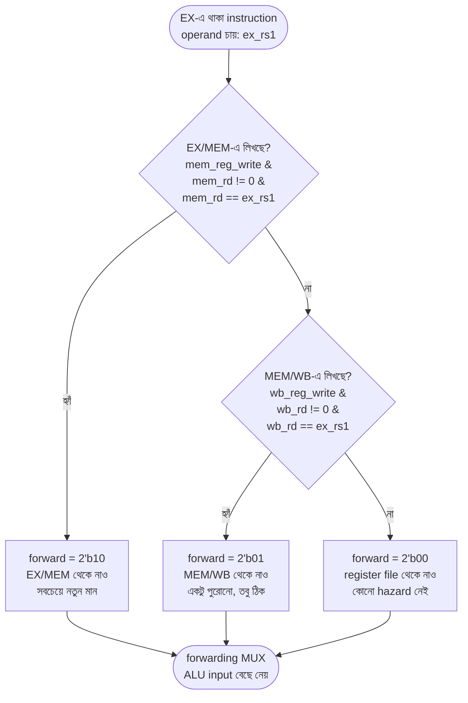
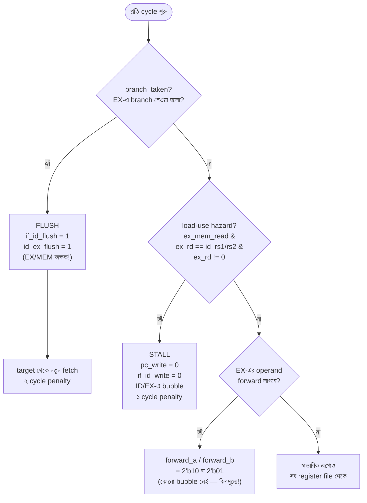

# 🛠️ Chapter 17: Pipeline Hazards & Forwarding
## From Ideal to Real - Handle Dependencies & Make It Work!

> **"Ideal pipeline was fast. But broken. Time to FIX it and make it REAL!"**
>
> **"Ideal pipeline ছিল fast। কিন্তু broken। এবার FIX করো আর REAL বানাও!"**

---

## 🎯 এই Chapter এ তুমি বানাবে:

```
✅ Data Hazard Detection - find dependencies
✅ Forwarding Unit - bypass data
✅ Stall Logic - wait when needed
✅ Control Hazard Handling - branches
✅ Branch Prediction - reduce penalty
✅ Hazard Resolution - complete solution
✅ Real Pipeline - working correctly!
✅ তোমার production-ready CPU! 🎉
```

**Time Required:** 2 weeks (7-8 hours/day)  
**Prerequisites:** Chapter 16 complete

---

## 🚀 Quick Understanding - Pipeline এর আসল সমস্যা!

Chapter 16-এ তুমি pipeline বানিয়েছিলে — পাঁচটা instruction পাশাপাশি, প্রতি cycle-এ একটা করে শেষ হচ্ছে, কাগজে-কলমে ৫× speedup। কিন্তু একটা সমস্যা চাপা পড়ে ছিল: ওই pipeline ধরে নিয়েছিল প্রতিটা instruction তার আগেরটার থেকে সম্পূর্ণ স্বাধীন। **আসল program কখনো এমন হয় না।**

একটা instruction প্রায়ই আগেরটার হিসাবের ফলাফল ব্যবহার করতে চায়। আর সেই ফলাফল তখনো pipeline-এর ভেতরে আটকে আছে — register file-এ লেখা হয়নি। এই "চাওয়া আর পাওয়ার মাঝের ফাঁক"-কেই বলে **hazard**।

### Hazard আসলে কী?

Hazard মানে এমন একটা পরিস্থিতি যেখানে পরের instruction-কে তার নির্ধারিত cycle-এ চালালে **ভুল উত্তর** আসবে, কারণ pipeline এখনো প্রস্তুত নয়। তিনটা ভিন্ন কারণে এটা ঘটতে পারে — আর তিনটারই আলাদা নাম আছে:

| ধরন | কেন হয় | কতটা সাধারণ | এই বইয়ের সমাধান |
|------|---------|-------------|------------------|
| **Structural Hazard** | একই hardware একসাথে দুজনের লাগে (একটাই memory port, একটাই ALU) | বিরল — RISC-V-এ instruction ও data memory আলাদা | নকশাতেই এড়ানো |
| **Data Hazard** | আগের instruction-এর result এখনো তৈরি হয়নি, পরেরটা সেটা চায় (RAW dependency) | **সবচেয়ে সাধারণ** | Forwarding, দরকারে stall |
| **Control Hazard** | branch/jump-এর সিদ্ধান্ত হওয়ার আগেই পরের instruction fetch করে ফেলি | ঘন ঘন (কোডে অনেক branch থাকে) | Predict not-taken + flush |

এই তিনটার **সবগুলো** ঠিকঠাক সামলাতে না পারলে তোমার CPU ভুল প্রোগ্রাম চালাবে। এই chapter-এর পুরো লক্ষ্য — তিনটাকেই জয় করা।

### একটা চোখে-দেখা Data Hazard

ভাবো এই দুই লাইন:

```assembly
ADD x1, x2, x3    # x1 = x2 + x3
SUB x4, x1, x5    # x4 = x1 - x5  ← needs x1!
```

`SUB` কাজ করতে চায় `x1` দিয়ে, কিন্তু `x1` সবেমাত্র আগের `ADD` তৈরি করছে। সমস্যাটা সময়ের। দেখো কখন কী ঘটে:

```text
                        ┌─ ADD এখানে x1 হিসাব করে (EX, cycle 3)
                        │
   Cycle:  1     2     3     4     5
   ADD:   [IF]  [ID]  [EX]  [MEM] [WB] ─┐
   SUB:         [IF]  [ID]  [EX]  ...   │
                       ▲                │
                       │                └─ কিন্তু x1 register file-এ
                       │                   লেখা হয় এখানে (WB, cycle 5)!
                       └─ SUB তার operand পড়তে চায় ID-তে (cycle 3) —
                          x1 তখনো পুরোনো (ভুল) মান! 💥
```

`ADD`-এর ফলাফল register file-এ পৌঁছায় cycle 5-এ, কিন্তু `SUB` operand চায় cycle 3-এ। দুই cycle-এর ফাঁক। কিছু না করলে `SUB` পাবে `x1`-এর পুরোনো মান — **ভুল উত্তর**।

আসল কথাটা খেয়াল করো: ALU তো `x1`-এর মান cycle 3-এর শেষেই বের করে ফেলেছে! সেটা শুধু register file-এ পৌঁছাতে দেরি হচ্ছে। তাহলে আমরা register file-এ লেখার জন্য অপেক্ষা না করে **সরাসরি ALU-র আউটপুট থেকে মানটা ছিনিয়ে নিয়ে** পরের instruction-এর হাতে দিয়ে দিই না কেন?

এই "লেখার আগেই ফলাফল ধরে ফেলা"-ই হলো **Forwarding** (বা bypassing) — এই chapter-এর প্রধান অস্ত্র। ✅

🎉 **এই chapter = তোমার pipeline-কে সত্যিকারের কাজ করানো!**

---

## ১৭.১ Data Hazards - মূল সমস্যা

Data hazard-এর জন্ম একটা মাত্র সম্পর্ক থেকে: একটা instruction এমন register পড়তে চায় যেটাতে আগের কোনো instruction এখনো লিখে শেষ করেনি। বইয়ের ভাষায় এটাকে বলে **RAW (Read-After-Write) dependency** — আগে লেখা, পরে পড়া, কিন্তু পড়াটা লেখা শেষ হওয়ার আগেই চলে আসছে।

মজার ব্যাপার হলো — সব RAW dependency একইরকম বিপজ্জনক নয়। কোনটা কত cycle আগের instruction-এর উপর নির্ভর করছে, আর সেই আগের instruction-টা ALU-result না memory-load — এই দুটোর উপর নির্ভর করে সমাধান বদলে যায়। তাই data hazard-কে আমরা তিন ভাগে ভাগ করি:

| Hazard | আগের instruction কোথায় | কী দিয়ে সমাধান | কেন |
|--------|--------------------------|-----------------|------|
| **EX Hazard** (ALU→ALU) | ঠিক আগেরটা, এখন EX/MEM-এ | EX/MEM থেকে forward (`2'b10`) | ALU result তৈরি, শুধু forward করলেই হয় |
| **MEM Hazard** (এক ধাপ পুরোনো) | দুই আগেরটা, এখন MEM/WB-এ | MEM/WB থেকে forward (`2'b01`) | result এখনো register-এ যায়নি, কিন্তু পাওয়া যায় |
| **Load-Use Hazard** | আগেরটা একটা `LW`, এখন EX-এ | **Forward করা যায় না — STALL!** | load-এর data MEM শেষ না হলে আসেই না |

প্রথম দুটোর মধ্যে পার্থক্যটা শুধু "কত পুরোনো"। তৃতীয়টা মৌলিকভাবে আলাদা — সেখানে data **সময়মতো অস্তিত্বেই থাকে না**, তাই forwarding অসহায়। ওটা একটু পরেই আলাদা করে দেখব।

### তিন রকম Data Hazard — কোডে

```assembly
# Example 1: EX Hazard (ঠিক পরের instruction চায়)
ADD x1, x2, x3    # x1 = x2 + x3
SUB x4, x1, x5    # Uses x1 (EX hazard)  → EX/MEM থেকে forward
AND x6, x7, x8    # No hazard

# Example 2: MEM Hazard (এক instruction ফাঁক, তবু পুরোনো মান লেখা হয়নি)
ADD x1, x2, x3    # x1 = x2 + x3
NOP               # (bubble)
SUB x4, x1, x5    # Uses x1 (MEM hazard)  → MEM/WB থেকে forward

# Example 3: Load-Use Hazard (forwarding-ও যথেষ্ট নয়)
LW  x1, 0(x2)     # Load x1 from memory
ADD x4, x1, x5    # Uses x1 IMMEDIATELY
                  # Must stall! Data not ready yet!
```

### এক ইউনিট, দুই দায়িত্ব: detection আর forwarding

নিচের `hazard_detection_unit` আসলে দুটো কাজ একসাথে করে। প্রথমত, এটা ঠিক করে **কখন থামতে হবে** (load-use stall)। দ্বিতীয়ত, এটা ঠিক করে **কোথা থেকে data ছিনিয়ে আনতে হবে** (`forward_a`, `forward_b`)।

খেয়াল করার মতো একটা সূক্ষ্ম ব্যাপার: stall detect করতে এটা **ID stage**-এর source register (`id_rs1`, `id_rs2`) দেখে — কারণ load-এর data ঠিক পরের instruction যখন ID-তে, তখনই ধরে ফেলতে হয়। কিন্তু forwarding ঠিক করতে এটা **EX stage**-এর source register (`ex_rs1`, `ex_rs2`) দেখে — কারণ forward করা মান যে instruction ব্যবহার করবে, সে তখন EX-এ বসে ALU চালাচ্ছে। দুই কাজ, দুই জায়গার register — গুলিয়ে ফেলো না।

আর priority-র যুক্তিটাও সহজ: একই register যদি EX/MEM আর MEM/WB **দুই** জায়গাতেই পাওয়া যায়, তাহলে EX/MEM-টা জেতে — কারণ ওটাই **সবচেয়ে সাম্প্রতিক** (নতুন) মান।

### Data Hazard Detection:

```verilog
module hazard_detection_unit(
    // ID stage (consumer — used for load-use stall detection)
    input wire [4:0] id_rs1,
    input wire [4:0] id_rs2,
    // EX stage: sources of the instruction in EX (used for forwarding),
    //           plus its rd / mem_read (to detect a load feeding the next instr)
    input wire [4:0] ex_rs1,
    input wire [4:0] ex_rs2,
    input wire [4:0] ex_rd,
    input wire ex_reg_write,
    input wire ex_mem_read,
    // MEM stage = EX/MEM register output (forward source 2'b10)
    input wire [4:0] mem_rd,
    input wire mem_reg_write,
    // WB stage = MEM/WB register output (forward source 2'b01)
    input wire [4:0] wb_rd,
    input wire wb_reg_write,
    // Outputs
    output wire stall,
    output wire [1:0] forward_a,
    output wire [1:0] forward_b
);
    // Load-Use Hazard: a load is in EX and the next instruction (in ID) needs
    // its result. Forwarding can't help (data arrives a cycle too late) -> stall.
    wire load_use_hazard = ex_mem_read &&
                          ((ex_rd == id_rs1) || (ex_rd == id_rs2)) &&
                          (ex_rd != 0);

    assign stall = load_use_hazard;

    // Forwarding feeds the instruction in EX. Compare ITS source registers
    // (ex_rs1/ex_rs2) against the destinations sitting in EX/MEM (mem_rd -> 2'b10)
    // and MEM/WB (wb_rd -> 2'b01). EX/MEM has priority (most recent value).
    assign forward_a =
        (mem_reg_write && (mem_rd != 0) && (mem_rd == ex_rs1)) ? 2'b10 :
        (wb_reg_write  && (wb_rd  != 0) && (wb_rd  == ex_rs1)) ? 2'b01 :
        2'b00;

    assign forward_b =
        (mem_reg_write && (mem_rd != 0) && (mem_rd == ex_rs2)) ? 2'b10 :
        (wb_reg_write  && (wb_rd  != 0) && (wb_rd  == ex_rs2)) ? 2'b01 :
        2'b00;
endmodule
```

### এই ইউনিট মাথার ভেতরে কী ভাবছে

প্রতিটা source register (ধরো `forward_a`-এর জন্য `ex_rs1`)-এর জন্য ইউনিটটা একটা ছোট প্রশ্নের সিঁড়ি বেয়ে নামে। প্রথমে সবচেয়ে নতুন মান (EX/MEM) খোঁজে, না পেলে একটু পুরোনোটা (MEM/WB), তাও না পেলে register file-এই ভরসা রাখে। এটাই priority। আর প্রতিটা মিলে অবশ্যই দুটো শর্ত — যে stage থেকে আনছি সে আসলেই register-এ লিখবে (`reg_write`), আর সেই destination যেন `x0` না হয় (RISC-V-এ `x0` সবসময় শূন্য, ওটা forward করার মানে নেই):



`forward_b` (অর্থাৎ `ex_rs2`)-এর জন্যও হুবহু একই সিঁড়ি, শুধু `ex_rs1`-এর জায়গায় `ex_rs2`। দুটো source register, দুটো স্বাধীন decision — তাই দুটো আলাদা MUX।

---

## ১৭.২ Forwarding Unit

Forwarding-এর পুরো ধারণাটা এক বাক্যে: **register file-এ মান পৌঁছানোর জন্য অপেক্ষা না করে, যেখানে মানটা ইতিমধ্যে তৈরি হয়ে আছে সেখান থেকেই তুলে এনে ALU-র হাতে দিয়ে দাও।** ALU তার operand কোথা থেকে পাবে — register file থেকে, নাকি pipeline register থেকে — সেটা ঠিক করার জন্য আমরা ALU-র ঠিক সামনে একটা MUX বসাই। সেই MUX-এর select line-ই হলো আমাদের `forward_a` / `forward_b`।

### কোথা থেকে কোন মান — তিনটা উৎস

| Select | উৎস | কোন stage থেকে আসে | কখন বেছে নিই |
|--------|------|---------------------|--------------|
| `2'b00` | Register file | স্বাভাবিক পড়া | কোনো hazard নেই |
| `2'b01` | MEM/WB register | দুই-আগের instruction-এর result | MEM hazard |
| `2'b10` | EX/MEM register | ঠিক-আগের instruction-এর result | EX hazard |

দুটো হিসাব মিলে গেলে কে জেতে? **EX/MEM (`2'b10`)** — কারণ একই register দুবার লেখা হলে সবচেয়ে নতুন (ঠিক আগেরটা) মানই সঠিক। উপরের কোডে EX/MEM-এর শর্তটা আগে আসে বলে এই priority নিজে থেকেই বজায় থাকে।

> **মনে রাখার সহজ ছবি:** `2'b10`-এর `1` যেন বলছে "এক ধাপ পিছনে" (EX/MEM), আর `2'b01`-এর `1` যেন বলছে "দুই ধাপ পিছনে" (MEM/WB)। যত কাছের উৎস, তত নতুন মান, তত বেশি priority।

### Forwarding Multiplexers:

```verilog
module forwarding_mux(
    input wire [31:0] register_data,
    input wire [31:0] ex_mem_data,
    input wire [31:0] mem_wb_data,
    input wire [1:0] forward_select,
    output reg [31:0] forwarded_data
);
    always @(*) begin
        case (forward_select)
            2'b00: forwarded_data = register_data;  // From register file
            2'b01: forwarded_data = mem_wb_data;    // From MEM/WB
            2'b10: forwarded_data = ex_mem_data;    // From EX/MEM
            default: forwarded_data = register_data;
        endcase
    end
endmodule
```

এই MUX-টাই forwarding-এর হাত-পা। তিনটা সম্ভাব্য মান তার সামনে — register file-এর মান, EX/MEM-এর মান, MEM/WB-এর মান — আর `forward_select` বলে দেয় কোনটা ALU-তে যাবে। নিচের দৃশ্যটা মাথায় রাখো: forwarding হলো একটা "shortcut তার", যা pipeline register থেকে ফলাফল তুলে নিয়ে এক-দুই stage **পিছনে** ALU-র input-এ ফেরত পাঠায় — register file ঘুরে আসার দীর্ঘ পথ বাদ দিয়ে।

```text
            ┌──────────────────── EX/MEM থেকে shortcut (2'b10) ────────────────────┐
            │                ┌──────────── MEM/WB থেকে shortcut (2'b01) ────────┐  │
            │                │                                                  │  │
            ▼                ▼                                                  │  │
   ID ──► [ID/EX] ──► [ MUX ]──► ALU ──► [EX/MEM] ──► MEM ──► [MEM/WB] ──► WB ──┘  │
                        ▲                     │                                    │
                        │                     └────────────────────────────────────┘
                  register file
                  এর মান (2'b00)
```

মান তৈরি হয় ডান দিকে (EX/MEM, MEM/WB), আর তারটা সেটা টেনে আনে বাম দিকের ALU input-এ — সময়ের দিক থেকে "ভবিষ্যতের নিজের কাছ থেকে ধার নেওয়া" নয়, বরং **আগের instruction-এর সদ্য-তৈরি ফলাফল পরের instruction-এর হাতে তুলে দেওয়া**।

### Updated EX Stage with Forwarding:

```verilog
module ex_stage_with_forwarding(
    input wire [31:0] pc_plus_4,
    input wire [31:0] rs1_data,
    input wire [31:0] rs2_data,
    input wire [31:0] immediate,
    // Forwarding inputs
    input wire [31:0] ex_mem_alu_result,
    input wire [31:0] mem_wb_write_data,
    input wire [1:0] forward_a,
    input wire [1:0] forward_b,
    // Control
    input wire [3:0] alu_control,
    input wire alu_src,
    input wire branch,
    input wire [2:0] funct3,
    input wire lui,
    // Outputs
    output wire [31:0] alu_result,
    output wire branch_taken,
    output wire [31:0] branch_target,
    output wire [31:0] store_data   // forwarded rs2 — the value a store writes
);
    wire [31:0] alu_a, alu_b;
    wire [31:0] forwarded_rs1, forwarded_rs2;
    wire [31:0] alu_core;
    wire zero;
    
    // Forwarding mux for rs1
    forwarding_mux fwd_a(
        .register_data(rs1_data),
        .ex_mem_data(ex_mem_alu_result),
        .mem_wb_data(mem_wb_write_data),
        .forward_select(forward_a),
        .forwarded_data(forwarded_rs1)
    );
    
    // Forwarding mux for rs2
    forwarding_mux fwd_b(
        .register_data(rs2_data),
        .ex_mem_data(ex_mem_alu_result),
        .mem_wb_data(mem_wb_write_data),
        .forward_select(forward_b),
        .forwarded_data(forwarded_rs2)
    );
    
    // ALU inputs
    assign alu_a = forwarded_rs1;
    assign alu_b = alu_src ? immediate : forwarded_rs2;
    
    // ALU
    alu alu_inst(
        .a(alu_a),
        .b(alu_b),
        .alu_control(alu_control),
        .result(alu_core),
        .zero(zero),
        .negative()
    );
    // LUI writes the upper immediate directly (it has no register operands)
    assign alu_result = lui ? immediate : alu_core;
    
    // Branch comparator (drives a separate net, then AND with branch —
    // driving branch_taken from both the port and an assign is illegal)
    wire comp_taken;
    branch_comparator branch_comp(
        .rs1_data(forwarded_rs1),
        .rs2_data(forwarded_rs2),
        .funct3(funct3),
        .branch_taken(comp_taken)
    );
    
    assign branch_taken = branch & comp_taken;
    // Target is relative to the branch's OWN PC; we carry pc_plus_4 (= branchPC+4)
    assign branch_target = (pc_plus_4 - 32'd4) + immediate;
    assign store_data = forwarded_rs2;   // stores must use the forwarded value
endmodule
```

এই module-টা একটু খুঁটিয়ে দেখো, কারণ এখানেই forwarding আসল কাজে লাগে। দুটো `forwarding_mux` — একটা `rs1`-এর জন্য (`fwd_a`), একটা `rs2`-এর জন্য (`fwd_b`) — register file-এর মান নিতে হবে নাকি কোনো pipeline register থেকে shortcut নিতে হবে, সেটা ঠিক করে। তাদের output `forwarded_rs1` আর `forwarded_rs2`-ই হলো ALU-র **আসল** input।

আরও তিনটা সূক্ষ্ম জায়গা খেয়াল করো:

- **Store-এর data-ও forward হয়।** `store_data = forwarded_rs2` — অর্থাৎ `SW`-এর যে মান memory-তে লেখা হবে সেটাও forwarded রাস্তা থেকে আসে। আগের instruction-এর ফলাফল সাথে সাথে store করতে চাইলে এটা না থাকলে ভুল মান লেখা হতো।
- **Branch comparator-ও forwarded মান পায়।** `branch_comp`-কে `forwarded_rs1`/`forwarded_rs2` দেওয়া হয়েছে, register file-এর কাঁচা মান নয় — তাই `BEQ x1, x2`-এর ঠিক আগে যদি `x1` তৈরি হয়, তাহলে branch-ও সঠিক তুলনা করে।
- **branch penalty কেন ২।** এই comparator EX stage-এ বসে। মানে branch নেওয়া হবে কি না, সেটা জানা যায় instruction EX-এ পৌঁছানোর পর — ততক্ষণে তার পিছনে দুটো instruction (IF/ID আর ID/EX-এ) ঢুকে গেছে। ভুল পথে গেলে ওই দুটোকে ফেলে দিতে হয় → **২ cycle penalty**। (এটা একটা verified-correct নকশাগত সিদ্ধান্ত, পরের section-এ পুরোটা দেখব।)

---

## ১৭.৩ Pipeline Stalling

Forwarding দারুণ — কিন্তু একটা ক্ষেত্রে সে সম্পূর্ণ অসহায়। ভাবো:

```assembly
LW  x1, 0(x2)     # x1 memory থেকে আসবে
ADD x4, x1, x3    # x1 এখুনি লাগবে
```

`ADD` চায় `x1`, আর `LW` এখনো `x1` **আনছে**। সমস্যাটা টের পেতে দুটো instruction-কে পাশাপাশি timeline-এ বসাও:

```text
   Cycle:  1     2     3      4      5
   LW:    [IF]  [ID]  [EX]  [MEM]  [WB]
                              ▲
                              └─ x1-এর data সবে এখানে memory থেকে আসে!
   ADD:         [IF]  [ID]  [EX]   ...
                              ▲
                              └─ কিন্তু ADD তার operand চায় এখানেই (cycle 4-এর EX)
```

দেখো — `LW`-এর data হাতে আসে cycle 4-এর **শেষে** (MEM stage শেষ হলে), অথচ `ADD`-এর EX-ও চলছে ঠিক সেই cycle 4-এই। ALU-result-এর বেলায় forwarding কাজ করত, কারণ ALU-result আগের cycle-এই তৈরি হয়ে থাকত। কিন্তু load-এর data **ভবিষ্যৎ থেকে** আসছে — যে cycle-এ দরকার, সেই cycle শেষ হওয়ার আগে অস্তিত্বেই নেই। ভবিষ্যৎ থেকে forward করা যায় না।

তাহলে উপায়? **`ADD`-কে এক cycle থামিয়ে দাও।** এক cycle অপেক্ষা করলে `LW`-এর data MEM/WB-তে চলে আসবে, আর তখন স্বাভাবিক forwarding-ই সেটা `ADD`-এর কাছে পৌঁছে দেবে। এই "এক cycle থামা"-কেই বলে **stall**, আর থেমে থাকার সময় pipeline-এ যে ফাঁকা slot ঢোকে তাকে বলে **bubble** (একটা NOP-এর মতো — কিছুই করে না, শুধু জায়গা দখল করে এগোয়)।

### Stall ঠিক কী করে

stall মানে আসলে pipeline-এর সামনের অংশটাকে **এক cycle স্থির রাখা**:

| সংকেত | stall-এর সময় | কেন |
|--------|----------------|------|
| `pc_write = 0` | PC একই জায়গায় আটকে থাকে | একই instruction আবার fetch হবে, এগোবে না |
| `if_id_write = 0` | IF/ID register বদলায় না | ID-তে থাকা instruction জায়গা ধরে রাখে |
| ID/EX-এ bubble | একটা NOP EX-এ ঢোকে | যে instruction থামল, তার বদলে ফাঁকা কাজ এগোয় |

লক্ষ করো — সামনের দুটো (PC, IF/ID) **জমে যায়**, কিন্তু পিছনের অংশ (EX, MEM, WB) **চলতেই থাকে**। এটাই দরকার: `LW`-কে তো এগিয়ে MEM-এ পৌঁছাতে হবে, নাহলে data আসবে কোত্থেকে? শুধু load-use-এর জন্য **মাত্র ১ cycle** stall লাগে — তারপর forwarding বাকিটা সামলে নেয়।

### Stall Implementation:

```verilog
module stall_controller(
    input wire stall_request,
    output reg pc_write,
    output reg if_id_write
);
    // On a load-use stall: freeze PC and IF/ID. The ID/EX bubble is inserted
    // by the ID/EX register's own flush input (id_ex_flush || stall), so this
    // controller must NOT also drive id_ex_flush (that was a double-driver).
    always @(*) begin
        if (stall_request) begin
            pc_write = 0;       // Don't update PC
            if_id_write = 0;    // Keep IF/ID same
        end else begin
            pc_write = 1;       // Normal operation
            if_id_write = 1;
        end
    end
endmodule
```

### Load-Use Example with Stall:

এক cycle stall ঢুকলে পুরো ছবিটা কেমন দাঁড়ায় দেখো। `ADD` cycle 3-এ ID-তে আটকে থাকে (পুনরায় ID), একটা bubble EX-এ এগিয়ে যায়, আর `LW` ততক্ষণে MEM/WB-তে পৌঁছে গিয়ে data হাতে নিয়ে নেয় — তারপর সেই data স্বাভাবিক forwarding দিয়ে `ADD`-এর কাছে পৌঁছায়:

```assembly
LW  x1, 0(x2)     # Load x1
ADD x4, x1, x3    # Use x1
```

```text
   Cycle:    1     2     3       4      5      6      7
   LW:      [IF]  [ID]  [EX]   [MEM]  [WB]
   ADD:           [IF]  [ID]   [ID]   [EX]   [MEM]  [WB]
                         │       ▲      ▲
                  stall এখানে    │      │
                  ধরা পড়ে        │      └─ LW এখন MEM/WB-এ; data
                  (LW EX-এ,      │         forward হয়ে ADD-এর EX-এ আসে ✅
                  ADD ID-তে)     └─ ADD এক cycle ID-তে আটকে (পুনরায় ID)
   bubble:               · · · ►[EX]──► (NOP, কিছুই করে না)
```

**মোট খরচ: ঠিক ১ cycle penalty।** একটা মাত্র bubble, তার বেশি নয়। তুলনা করো branch-এর সাথে (পরে দেখব) — সেখানে ভুল হলে **দুটো** instruction ফেলে দিতে হয়। load-use তুলনায় সস্তা, কিন্তু `LW`-এর ঠিক পরেই তার ফলাফল ব্যবহার করলে এটা প্রতিবার লাগবেই — তাই ভালো compiler `LW` আর তার ব্যবহারকারীর মাঝে অন্য একটা স্বাধীন instruction ঢুকিয়ে দিয়ে এই bubble-টাও বাঁচানোর চেষ্টা করে।

---

## ১৭.৪ Control Hazards

Data hazard ছিল "কোন **মান** ব্যবহার করব" নিয়ে সমস্যা। Control hazard আরও গভীর — এটা "**কোন instruction**-ই বা পরে চালাব" নিয়ে সমস্যা।

মুশকিলটা হলো: pipeline প্রতি cycle-এ একটা নতুন instruction fetch করতে চায়, থামতে চায় না। কিন্তু একটা `BEQ` (branch) দেখলে পরের instruction কোনটা — সেটা নির্ভর করে branch নেওয়া হবে কি না-র উপর, আর সেই সিদ্ধান্ত আমাদের নকশায় হয় **EX stage**-এ। ততক্ষণে pipeline তো বসে থাকেনি — সে অনুমানের উপর ভিত্তি করে পরের দুটো instruction (`branch+4`, `branch+8`) fetch করে ফেলেছে।

```text
   Cycle:  1     2     3
   BEQ:   [IF]  [ID]  [EX]  ◄── branch নেওয়া হবে কি না, জানা গেল এখানে
                 ▲     ▲
                 │     └─ ততক্ষণে BEQ+8 ঢুকছে (cycle 3-এ IF)
                 └─ আর BEQ+4 আগেই ঢুকে গেছে (cycle 2-এ IF)
```

branch যদি শেষ পর্যন্ত নেওয়া হয়, তাহলে ওই দুটো fetch করা instruction **ভুল পথের** — তাদের ফেলে দিতে হবে। এটাই control hazard।

### কোন কৌশল বেছে নেব

| কৌশল | কী করে | খরচ | আমরা? |
|------|---------|------|--------|
| Always stall | প্রতি branch-এ অপেক্ষা করি | সবসময় ২ cycle | ❌ বেশি দামি |
| **Predict not-taken** | ধরে নিই branch নেওয়া হবে **না**, সোজা চলতে থাকি | ভুল হলেই কেবল ২ cycle | ✅ **আমাদের পছন্দ** |
| Predict taken | ধরে নিই নেওয়া হবে | target আগে লাগে, জটিল | পরে |
| Branch predictor | ইতিহাস দেখে অনুমান | hardware বেশি, কিন্তু দ্রুত | §১৭.৭-এ ঝলক |

আমরা **predict not-taken** বেছে নিচ্ছি কারণ এটা সরল আর প্রায়-বিনামূল্যে: branch নেওয়া **না** হলে আমরা যা fetch করেছিলাম তা-ই তো ঠিক ছিল — কোনো খরচ নেই। শুধু যখন অনুমান ভুল হয় (branch আসলে নেওয়া হয়), তখনই দণ্ড।

### Predict Not-Taken — কীভাবে কাজ করে

ধাপগুলো সহজ: (১) সবসময় ধরে নাও branch নেওয়া হবে না, তাই PC+4 fetch করতে থাকো। (২) EX-এ গিয়ে যদি দেখা যায় সত্যিই নেওয়া হয়নি — দারুণ, কিছুই করার নেই। (৩) যদি দেখা যায় নেওয়া হয়েছে — তাহলে ভুল পথের দুটো instruction **flush** (মুছে bubble বানাও) করো আর target থেকে নতুন করে fetch শুরু করো।

branch **taken** হলে সেই ২-cycle penalty-র ছবি:

```text
   Cycle:   1     2      3       4      5      6
   BEQ:    [IF]  [ID]   [EX]   [MEM]  [WB]
                         ▲
                         └─ taken! পিছনের দুটো ভুল পথ — flush করো
   BEQ+4:        [IF]   [ID]   [XX]                  ◄── flushed (bubble)
   BEQ+8:               [IF]   [XX]                  ◄── flushed (bubble)
   Target:                     [IF]   [ID]   [EX] ...  ◄── এখান থেকে সঠিক পথ

   XX = মুছে ফেলা (wasted) instruction → ঠিক ২টা bubble = ২ cycle penalty
```

### Branch Flush Logic:

```verilog
module branch_controller(
    input wire branch_taken,
    output reg if_id_flush,
    output reg id_ex_flush
);
    // Branch resolves in EX, so only the two younger instructions (in IF/ID
    // and ID/EX) are on the wrong path. The instruction in EX/MEM is OLDER
    // than the branch and must complete — do NOT flush EX/MEM.
    always @(*) begin
        if (branch_taken) begin
            if_id_flush = 1;   // Flush IF/ID (branch+8, wrong path)
            id_ex_flush = 1;   // Flush ID/EX (branch+4, wrong path)
        end else begin
            if_id_flush = 0;
            id_ex_flush = 0;
        end
    end
endmodule
```

এখানে সবচেয়ে গুরুত্বপূর্ণ সিদ্ধান্ত — **ঠিক কোন কোন register flush হবে**। branch resolve হয় EX-এ, তাই ভুল পথে শুধু তার চেয়ে **ছোট** (younger) দুটো instruction: একটা IF/ID-তে, একটা ID/EX-তে। তাই ওই দুটোই flush। কিন্তু EX/MEM-এ যেটা আছে সেটা branch-এর চেয়ে **পুরোনো** — সে ভুল পথের নয়, তাকে শেষ হতে দিতেই হবে। **EX/MEM কখনো flush করো না** — করলে একটা সঠিক instruction হারিয়ে যাবে।

### পুরো নিয়ন্ত্রণ এক ছবিতে: কখন stall, কখন flush

প্রতি cycle-এ pipeline-কে তিনটা প্রশ্নের একটা সিঁড়ি বেয়ে নামতে হয় — থামব? মুছব? নাকি স্বাভাবিক চলব? নিচের flowchart-এ পুরো নিয়ন্ত্রণ-যুক্তি একসাথে:



খেয়াল করো এই সিঁড়িতে একটা নীরব priority আছে: branch flush সবার আগে (সবচেয়ে জরুরি, ভুল পথ মুছতেই হবে), তারপর load-use stall, আর শেষে forwarding — যেটা একদম **বিনামূল্যে** hazard সারায়, কোনো cycle নষ্ট না করেই। এজন্যই forwarding-ই আমাদের প্রথম পছন্দ, আর stall/flush শেষ ভরসা।

---

## ১৭.৫ Complete Pipeline with Hazard Handling

এবার সব টুকরো একসাথে জোড়া লাগানোর পালা। নিচের `riscv_pipelined_with_hazards` হলো Chapter 16-এর সেই pipeline-ই, কিন্তু এবার তার সাথে যুক্ত হয়েছে আমাদের তিন রক্ষী: `hazard_detection_unit` (forward আর stall ঠিক করে), `stall_controller` (PC/IF-ID জমিয়ে দেয়), আর `branch_controller` (ভুল পথ flush করে)।

পড়ার সময় তিনটা সংযোগ খুঁজে বের করো — এগুলোই পুরো hazard-handling-এর শিরা-উপশিরা:

- **forwarding-এর shortcut তার:** EX stage-কে `mem_alu_result` (EX/MEM থেকে) আর `wb_data` (MEM/WB থেকে) দেওয়া হয়েছে — এ দুটোই forwarding MUX-এর কাঁচামাল।
- **stall-এর জমাট হাত:** `stall` সংকেত একসাথে IF stage, IF/ID register জমিয়ে দেয়, আর ID/EX register-এ bubble ঢোকায় (`id_ex_flush || stall`)।
- **branch-এর মুছে ফেলা হাত:** `ex_branch_taken` থেকে `if_id_flush` আর `id_ex_flush` তৈরি হয়ে ভুল পথের দুটো instruction মুছে দেয়।

```verilog
module riscv_pipelined_with_hazards(
    input wire clk,
    input wire reset,
    // Instruction interface (instruction memory / cache lives outside the core)
    input wire cache_stall,             // freeze the front of the pipeline (e.g. cache miss)
    input wire [31:0] instruction,      // fetched word for address pc_debug
    // Data memory interface
    output wire [31:0] data_address,
    output wire [31:0] data_write,
    output wire data_read_enable,
    output wire data_write_enable,
    output wire [2:0] data_funct3,
    input wire [31:0] data_read,
    // Debug
    output wire [31:0] pc_debug,        // current instruction-fetch address
    output wire [31:0] cycles_debug,
    output wire [31:0] stalls_debug
);
    // Performance counters
    reg [31:0] cycle_count;
    reg [31:0] stall_count;
    
    always @(posedge clk or posedge reset) begin
        if (reset) begin
            cycle_count <= 0;
            stall_count <= 0;
        end else begin
            cycle_count <= cycle_count + 1;
            if (stall)
                stall_count <= stall_count + 1;
        end
    end
    
    // IF stage signals
    wire [31:0] if_pc, if_instruction, if_pc_plus_4;
    wire pc_write, if_id_write;
    
    // IF/ID pipeline register
    wire [31:0] id_instruction, id_pc_plus_4;
    wire if_id_flush;
    
    // ID stage signals
    wire [31:0] id_rs1_data, id_rs2_data, id_immediate;
    wire [4:0] id_rd_addr, id_rs1_addr, id_rs2_addr;
    wire id_reg_write, id_mem_read, id_mem_write;
    wire id_mem_to_reg, id_alu_src, id_branch, id_jump;
    wire [3:0] id_alu_control;
    wire [2:0] id_funct3;
    
    // ID/EX pipeline register
    wire [31:0] ex_pc_plus_4, ex_rs1_data, ex_rs2_data, ex_immediate;
    wire [4:0] ex_rd_addr, ex_rs1_addr, ex_rs2_addr;
    wire ex_reg_write, ex_mem_read, ex_mem_write;
    wire ex_mem_to_reg, ex_alu_src, ex_branch, ex_jump;
    wire [3:0] ex_alu_control;
    wire [2:0] ex_funct3;
    wire id_ex_flush;
    
    // EX stage signals
    wire [31:0] ex_alu_result, ex_branch_target;
    wire [31:0] ex_store_data;   // forwarded rs2 for stores
    wire ex_branch_taken;
    wire [1:0] forward_a, forward_b;
    
    // EX/MEM pipeline register
    wire [31:0] mem_alu_result, mem_rs2_data, mem_pc_plus_4;
    wire [4:0] mem_rd_addr;
    wire mem_reg_write, mem_mem_read, mem_mem_write;
    wire mem_mem_to_reg, mem_jump;
    wire [2:0] mem_funct3;
    
    // MEM stage signals
    wire [31:0] mem_data;
    
    // MEM/WB pipeline register
    wire [31:0] wb_alu_result, wb_mem_data, wb_pc_plus_4;
    wire [4:0] wb_rd_addr;
    wire wb_reg_write, wb_mem_to_reg, wb_jump;
    
    // WB stage signals
    wire [31:0] wb_data;
    
    // Hazard detection
    wire stall;
    
    hazard_detection_unit hazard_unit(
        .id_rs1(id_rs1_addr),
        .id_rs2(id_rs2_addr),
        .ex_rs1(ex_rs1_addr),
        .ex_rs2(ex_rs2_addr),
        .ex_rd(ex_rd_addr),
        .ex_reg_write(ex_reg_write),
        .ex_mem_read(ex_mem_read),
        .mem_rd(mem_rd_addr),
        .mem_reg_write(mem_reg_write),
        .wb_rd(wb_rd_addr),
        .wb_reg_write(wb_reg_write),
        .stall(stall),
        .forward_a(forward_a),
        .forward_b(forward_b)
    );
    
    // Stall controller
    stall_controller stall_ctrl(
        .stall_request(stall),
        .pc_write(pc_write),
        .if_id_write(if_id_write)
    );
    
    // Branch controller
    branch_controller branch_ctrl(
        .branch_taken(ex_branch_taken),
        .if_id_flush(if_id_flush),
        .id_ex_flush(id_ex_flush)   // branch resolves in EX → flush IF/ID + ID/EX only
    );
    
    // IF Stage
    if_stage if_stage_inst(
        .clk(clk),
        .reset(reset),
        .stall(!pc_write || cache_stall),
        .branch_taken(ex_branch_taken),
        .branch_target(ex_branch_target),
        .instruction_in(instruction),
        .pc(if_pc),
        .instruction(if_instruction),
        .pc_plus_4(if_pc_plus_4)
    );
    
    // IF/ID Pipeline Register
    if_id_register if_id_reg(
        .clk(clk),
        .reset(reset),
        .stall(!if_id_write || cache_stall),
        .flush(if_id_flush),
        .instruction_in(if_instruction),
        .pc_plus_4_in(if_pc_plus_4),
        .instruction_out(id_instruction),
        .pc_plus_4_out(id_pc_plus_4)
    );
    
    // ID Stage
    id_stage id_stage_inst(
        .clk(clk),
        .reset(reset),
        .instruction(id_instruction),
        .pc_plus_4(id_pc_plus_4),
        .wb_rd_addr(wb_rd_addr),
        .wb_rd_data(wb_data),
        .wb_reg_write(wb_reg_write),
        .rs1_data(id_rs1_data),
        .rs2_data(id_rs2_data),
        .immediate(id_immediate),
        .rd_addr(id_rd_addr),
        .rs1_addr(id_rs1_addr),
        .rs2_addr(id_rs2_addr),
        .reg_write(id_reg_write),
        .mem_read(id_mem_read),
        .mem_write(id_mem_write),
        .mem_to_reg(id_mem_to_reg),
        .alu_control(id_alu_control),
        .alu_src(id_alu_src),
        .branch(id_branch),
        .jump(id_jump),
        .lui(id_lui)
    );
    
    assign id_funct3 = id_instruction[14:12];
    wire id_lui, ex_lui;   // LUI control, plumbed ID -> EX
    
    // ID/EX Pipeline Register
    id_ex_register id_ex_reg(
        .clk(clk),
        .reset(reset),
        .flush(id_ex_flush || stall),
        .pc_plus_4_in(id_pc_plus_4),
        .rs1_data_in(id_rs1_data),
        .rs2_data_in(id_rs2_data),
        .immediate_in(id_immediate),
        .rd_addr_in(id_rd_addr),
        .rs1_addr_in(id_rs1_addr),
        .rs2_addr_in(id_rs2_addr),
        .funct3_in(id_funct3),
        .lui_in(id_lui),
        .reg_write_in(id_reg_write),
        .mem_read_in(id_mem_read),
        .mem_write_in(id_mem_write),
        .mem_to_reg_in(id_mem_to_reg),
        .alu_control_in(id_alu_control),
        .alu_src_in(id_alu_src),
        .branch_in(id_branch),
        .jump_in(id_jump),
        .pc_plus_4_out(ex_pc_plus_4),
        .rs1_data_out(ex_rs1_data),
        .rs2_data_out(ex_rs2_data),
        .immediate_out(ex_immediate),
        .rd_addr_out(ex_rd_addr),
        .rs1_addr_out(ex_rs1_addr),
        .rs2_addr_out(ex_rs2_addr),
        .funct3_out(ex_funct3),
        .lui_out(ex_lui),
        .reg_write_out(ex_reg_write),
        .mem_read_out(ex_mem_read),
        .mem_write_out(ex_mem_write),
        .mem_to_reg_out(ex_mem_to_reg),
        .alu_control_out(ex_alu_control),
        .alu_src_out(ex_alu_src),
        .branch_out(ex_branch),
        .jump_out(ex_jump)
    );
    
    // EX Stage with Forwarding
    ex_stage_with_forwarding ex_stage_inst(
        .pc_plus_4(ex_pc_plus_4),
        .rs1_data(ex_rs1_data),
        .rs2_data(ex_rs2_data),
        .immediate(ex_immediate),
        .ex_mem_alu_result(mem_alu_result),
        .mem_wb_write_data(wb_data),
        .forward_a(forward_a),
        .forward_b(forward_b),
        .alu_control(ex_alu_control),
        .alu_src(ex_alu_src),
        .branch(ex_branch),
        .funct3(ex_funct3),
        .lui(ex_lui),
        .alu_result(ex_alu_result),
        .branch_taken(ex_branch_taken),
        .branch_target(ex_branch_target),
        .store_data(ex_store_data)
    );
    
    // EX/MEM Pipeline Register
    ex_mem_register ex_mem_reg(
        .clk(clk),
        .reset(reset),
        .alu_result_in(ex_alu_result),
        .rs2_data_in(ex_store_data),
        .pc_plus_4_in(ex_pc_plus_4),
        .rd_addr_in(ex_rd_addr),
        .funct3_in(ex_funct3),
        .reg_write_in(ex_reg_write),
        .mem_read_in(ex_mem_read),
        .mem_write_in(ex_mem_write),
        .mem_to_reg_in(ex_mem_to_reg),
        .jump_in(ex_jump),
        .alu_result_out(mem_alu_result),
        .rs2_data_out(mem_rs2_data),
        .pc_plus_4_out(mem_pc_plus_4),
        .rd_addr_out(mem_rd_addr),
        .funct3_out(mem_funct3),
        .reg_write_out(mem_reg_write),
        .mem_read_out(mem_mem_read),
        .mem_write_out(mem_mem_write),
        .mem_to_reg_out(mem_mem_to_reg),
        .jump_out(mem_jump)
    );
    
    // MEM Stage
    mem_stage mem_stage_inst(
        .alu_result(mem_alu_result),
        .rs2_data(mem_rs2_data),
        .mem_read(mem_mem_read),
        .mem_write(mem_mem_write),
        .funct3(mem_funct3),
        .data_address(data_address),
        .data_write(data_write),
        .data_mem_read(data_read_enable),
        .data_mem_write(data_write_enable),
        .data_size(data_funct3),
        .read_data(data_read),
        .mem_data(mem_data)
    );
    
    // MEM/WB Pipeline Register
    mem_wb_register mem_wb_reg(
        .clk(clk),
        .reset(reset),
        .alu_result_in(mem_alu_result),
        .mem_data_in(mem_data),
        .pc_plus_4_in(mem_pc_plus_4),
        .rd_addr_in(mem_rd_addr),
        .reg_write_in(mem_reg_write),
        .mem_to_reg_in(mem_mem_to_reg),
        .jump_in(mem_jump),
        .alu_result_out(wb_alu_result),
        .mem_data_out(wb_mem_data),
        .pc_plus_4_out(wb_pc_plus_4),
        .rd_addr_out(wb_rd_addr),
        .reg_write_out(wb_reg_write),
        .mem_to_reg_out(wb_mem_to_reg),
        .jump_out(wb_jump)
    );
    
    // WB Stage
    wb_stage wb_stage_inst(
        .alu_result(wb_alu_result),
        .mem_data(wb_mem_data),
        .pc_plus_4(wb_pc_plus_4),
        .mem_to_reg(wb_mem_to_reg),
        .jump(wb_jump),
        .wb_data(wb_data)
    );
    
    // Debug outputs
    assign pc_debug = if_pc;
    assign cycles_debug = cycle_count;
    assign stalls_debug = stall_count;
endmodule
```

---

## ১৭.৬ Performance Analysis

Chapter 16-এর "৫× speedup" ছিল স্বপ্ন — যেখানে কোনো hazard নেই। বাস্তবে hazard আছে, আর প্রতিটা stall বা flush কয়েকটা cycle "ভাড়া" নেয়। তাই বাস্তব হিসাবের ভাষা CPI — **Cycles Per Instruction**, গড়ে প্রতি instruction-এ কত cycle লাগছে। আদর্শ pipeline-এ এটা 1.0; আমাদের hazard-গুলো এটাকে একটু একটু করে বাড়ায়।

### CPI কোথা থেকে বাড়ে

| উৎস | CPI-তে যোগ | কেন |
|------|------------|------|
| Base (ideal) | 1.0 | প্রতি cycle একটা instruction শেষ |
| Data hazards | +0.1–0.3 | forwarding বেশিরভাগ সারায়, তাই কম |
| Load-use stalls | +0.2–0.5 | প্রতিটায় ১ bubble |
| Branch mispredictions | +0.5–1.0 | প্রতিটায় ২ bubble — সবচেয়ে দামি |
| **Typical মোট** | **CPI = 1.3–1.5** | বাস্তব pipeline-এর স্বাভাবিক মান |

খেয়াল করো branch misprediction-ই সবচেয়ে বেশি যোগ করে — কারণ ২ cycle penalty load-use-এর ১ cycle-এর দ্বিগুণ, আর কোডে branch থাকে প্রচুর। এজন্যই §১৭.৭-এর branch prediction এত গুরুত্বপূর্ণ।

### ১০০ instruction-এর হিসাব

```text
   Cycles ≈ 5 (pipeline fill) + 99 (বাকি instruction) + stalls
          ≈ 104 + 30
          ≈ 134 cycles

   Single-cycle হলে লাগত: 100 instruction × 5 = 500 cycle-সমতুল্য কাজ
   Speedup = 500 / 134 ≈ 3.7×
```

প্রথম instruction-টা pipeline ভরাতে ৫ cycle নেয়, তারপর বাকি ৯৯টা আদর্শভাবে এক cycle করে — সাথে hazard-এর জন্য ~৩০ cycle stall যোগ হয়। ফল: ১০০ instruction-এ ~১৩৪ cycle। স্বপ্নের ৫× না হলেও এটা সত্যিকারের **3.7×** — আর এটাই আসল CPU-তে পাওয়া যায়। বাস্তব speedup সাধারণত **3.5–4.0×**।

> **মনে রেখো:** ৫× ছিল কাগজের সংখ্যা; 3.7× তোমার হাতে গড়া সত্যিকারের, কাজ-করা সংখ্যা। কম শোনালেও এটাই অনেক বেশি দামি।

### Optimization Strategies — আরও দ্রুত করার পথ

| কৌশল | কী করে | কে করে |
|------|---------|--------|
| **Better forwarding** | আরও বেশি stage থেকে forward, stall কমাও | hardware |
| **Branch prediction** | taken/not-taken অনুমান + branch target buffer, flush কমাও | hardware |
| **Code scheduling** | স্বাধীন instruction এগিয়ে এনে hazard-এর মাঝে ফাঁক ভরাও | compiler |
| **Hardware scheduling** | out-of-order, superscalar (একসাথে একাধিক issue) | hardware (advanced) |

প্রথম দুটো এই chapter-এই ছুঁয়েছি। তৃতীয়টা compiler-এর কাজ — সে `LW`-এর ঠিক পরে তার ব্যবহারকারী না বসিয়ে মাঝে অন্য কাজ ঢুকিয়ে bubble বাঁচায়। চতুর্থটা — out-of-order আর superscalar — হলো আসল আধুনিক CPU-র জাদু, যেগুলো Chapter 20-এ দেখবে।

---

## ১৭.৭ Advanced: Branch Prediction

আমাদের "predict not-taken" কৌশলটা সরল, কিন্তু একগুঁয়ে — সে প্রতিবার একই অনুমান করে। অথচ আসল কোডে loop থাকে, আর loop-এর branch প্রায় **সবসময়** taken হয় (loop-এ ফিরে যাওয়ার জন্য)! এমন branch-এ "not-taken" অনুমান প্রতিবার ভুল হবে → প্রতি iteration-এ ২ cycle নষ্ট।

বুদ্ধিমান উপায়: **ইতিহাস মনে রাখো।** কোনো branch গতবার taken হলে এবারও সম্ভবত হবে — এই সরল অনুমানই বেশিরভাগ সময় কাজ করে।

সবচেয়ে ছোট predictor হলো **1-bit predictor**: প্রতিটা branch-এর জন্য মাত্র এক bit রাখো — "গতবার taken ছিল কি?" পরের বার সেই bit-ই হলো অনুমান। নিচের module ঠিক এটাই করে: PC-র কিছু bit দিয়ে একটা ছোট table-এ index করে (`pc[7:2]`), সেই entry-র মান পড়ে অনুমান দেয়, আর branch resolve হলে আসল ফল দিয়ে entry-টা update করে।

> **1-bit-এর দুর্বলতা:** loop শেষ হওয়ার সময় branch একবার উল্টো যায় — তখন 1-bit predictor **দুবার** ভুল করে (একবার বেরোনোর সময়, একবার পরের বার ঢোকার সময়)। এটা সারাতেই আসে **2-bit predictor** (saturating counter), যা একবার উল্টো ফল দেখলেই মত বদলায় না — কিন্তু সেটা তোমার final project-এর জন্য তোলা রইল।

### Simple 1-bit Predictor:

```verilog
module branch_predictor(
    input wire clk,
    input wire reset,
    input wire [31:0] pc,
    input wire branch_taken_actual,
    input wire update,
    output reg prediction
);
    // Simple prediction table (64 entries)
    reg [0:63] prediction_table;
    wire [5:0] index = pc[7:2];  // Use bits [7:2] as index
    
    // Initialize to not-taken
    integer i;
    initial begin
        for (i = 0; i < 64; i = i + 1)
            prediction_table[i] = 0;
    end
    
    // Prediction
    always @(*) begin
        prediction = prediction_table[index];
    end
    
    // Update on branch resolution
    always @(posedge clk or posedge reset) begin
        if (reset) begin
            for (i = 0; i < 64; i = i + 1)
                prediction_table[i] <= 0;
        end else if (update) begin
            prediction_table[index] <= branch_taken_actual;
        end
    end
endmodule
```

---

## ১৭.৮ Testing & Debugging

hazard-handling-এর সবচেয়ে ভয়ের ব্যাপার — ভুল হলে CPU **crash করে না**, শুধু চুপচাপ ভুল উত্তর দেয়। তাই শুধু "চলে কি না" দেখলে হবে না, **সঠিক উত্তর দেয় কি না** দেখতে হবে। ভালো testbench-এ এমন program চালাও যেখানে তিন রকম hazard-ই ঘটে — পরপর-নির্ভরশীল ALU instruction (forwarding পরীক্ষা), `LW`-এর ঠিক পরে তার ব্যবহার (load-use stall পরীক্ষা), আর taken branch (flush পরীক্ষা)।

নিচের testbench DUT-এর সাথে আলাদা instruction ও data memory জুড়ে দেয়, program চালায়, আর শেষে performance counter পড়ে CPI ও stall rate ছাপে। ডিবাগ করার সময় `.vcd` ফাইলটা GTKWave-এ খুলে `forward_a`/`forward_b` ঠিক সময়ে `2'b10`/`2'b01` হচ্ছে কি না, আর `stall` সংকেত load-use-এর সময় উঠছে কি না — এই দুটো সবার আগে দেখো।

### Comprehensive Testbench:

```verilog
module pipeline_hazards_tb;
    reg clk, reset;
    wire [31:0] pc_debug, cycles, stalls;

    // External memories (the core exposes instruction + data buses)
    wire [31:0] instruction, data_address, data_write, data_read;
    wire data_read_enable, data_write_enable;
    wire [2:0] data_funct3;

    instruction_memory imem(.address(pc_debug), .instruction(instruction));
    data_memory dmem(
        .clk(clk), .address(data_address), .write_data(data_write),
        .mem_write(data_write_enable), .mem_read(data_read_enable),
        .mem_size(data_funct3), .read_data(data_read));

    // DUT
    riscv_pipelined_with_hazards dut(
        .clk(clk),
        .reset(reset),
        .cache_stall(1'b0),
        .instruction(instruction),
        .data_address(data_address),
        .data_write(data_write),
        .data_read_enable(data_read_enable),
        .data_write_enable(data_write_enable),
        .data_funct3(data_funct3),
        .data_read(data_read),
        .pc_debug(pc_debug),
        .cycles_debug(cycles),
        .stalls_debug(stalls)
    );
    
    // Clock
    initial begin
        clk = 0;
        forever #5 clk = ~clk;
    end
    
    // Test program with hazards
    initial begin
        $dumpfile("pipeline.vcd");
        $dumpvars(0, pipeline_hazards_tb);
        
        // Reset
        reset = 1;
        #20;
        reset = 0;
        
        // Run
        #2000;
        
        // Results
        $display("========================================");
        $display("Pipeline Performance Analysis");
        $display("========================================");
        $display("Total Cycles: %d", cycles);
        $display("Stall Cycles: %d", stalls);
        $display("CPI: %.2f", cycles / 100.0);
        $display("Stall Rate: %.1f%%", (stalls * 100.0) / cycles);
        $display("========================================");
        
        $finish;
    end
    
    // Monitor
    always @(posedge clk) begin
        if (!reset && pc_debug != 0) begin
            $display("Cycle %d: PC=%h, Stalls=%d", 
                    cycles, pc_debug, stalls);
        end
    end
endmodule
```

---

## ১৭.৯ Your 2-Week Build Plan

পরিকল্পনাটা সাজানো হয়েছে সহজ থেকে কঠিনের দিকে, আর প্রতি ধাপ আগেরটার উপর দাঁড়িয়ে। প্রথম সপ্তাহে data hazard — আগে detection, তারপর forwarding (বিনামূল্যের সমাধান), শেষে stall (যেখানে forwarding হার মানে)। দ্বিতীয় সপ্তাহে control hazard ও সব একসাথে জোড়া, তারপর মাপজোক আর optimization। প্রতিটা ধাপ আলাদা করে test করো — সব একসাথে জুড়ে তারপর ভুল খুঁজলে মাথা খারাপ হয়ে যাবে।

### Week 1: Hazard Detection

**Day 1-2: Data Hazard Detection**
```
□ Hazard detection unit
□ Compare register addresses
□ Generate forwarding signals
□ Test detection
```

**Day 3-4: Forwarding Unit**
```
□ Forwarding multiplexers
□ EX/MEM forwarding
□ MEM/WB forwarding
□ Test forwarding
```

**Day 5-7: Stalling Logic**
```
□ Stall controller
□ PC freeze logic
□ Bubble insertion
□ Load-use handling
```

### Week 2: Control Hazards & Integration

**Day 8-10: Branch Handling**
```
□ Branch flush logic
□ Predict not-taken
□ Flush mechanism
□ Test branches
```

**Day 11-12: Complete Integration**
```
□ All hazard logic
□ Full pipeline
□ Comprehensive testing
□ Debug issues
```

**Day 13-14: Optimization & Analysis**
```
□ Performance measurement
□ Branch prediction (optional)
□ Code optimization
□ Final testing
```

---

## ১৭.১০ Chapter 17 Mission Complete!

### তুমি এখন পারো:

```
✅ Detect data hazards
✅ Implement forwarding
✅ Handle stalls
✅ Resolve control hazards
✅ Analyze pipeline performance
✅ Optimize instruction sequences
✅ Build real pipelined processors
✅ Production-ready CPU design! 🎉
```

### তুমি বানিয়েছো:
```
✅ Complete hazard detection
✅ Forwarding unit
✅ Stall controller
✅ Branch handler
✅ Real working pipeline
✅ 3.5-4× speedup (real!)
✅ Production CPU! 💻
```

### Stats:
```
Hazard types handled: 3
Forwarding paths: 2
Stall cases: 1
Branch penalty: 2 cycles
Real CPI: 1.3-1.5
Real speedup: 3.5-4.0×
Level: Pipeline Expert! 🏆
```

### Next Level Unlocked:
```
→ Chapter 18: Memory Hierarchy
   তুমি শিখবে: Cache design
   10× faster memory access!
   
   From slow → FAST memory!
```

---

## 🎯 Final Project

### Project: Pipeline Optimizer

**Build & Optimize:**
```
✅ Complete pipeline with all hazards
✅ Performance profiling
✅ Branch predictor (1-bit or 2-bit)
✅ Code scheduler (software)
✅ Comparison analysis

Benchmarks:
- Fibonacci
- Matrix multiply
- Quicksort
- Real programs!

Report:
- CPI achieved
- Stall analysis
- Branch prediction accuracy
- Optimization impact
```

---

## 🏆 Achievement Unlocked!

```
Level 17: ✅ COMPLETE - Pipeline Master!
Progress: [████████████████████████████████████] 85%

XP Gained: +4000
Skills: Hazard Handling, Forwarding, Real Pipeline

Badges Earned:
🥉 Hazard Detective
🥈 Forwarding Master
🥇 Stall Handler
🏅 Branch Specialist
🎖️ Real Pipeline Designer
🏆 Production CPU Architect
⭐ WORKING PIPELINE! ⭐

YOUR CPU ACTUALLY WORKS NOW! 💻✅

Next: Chapter 18 - Memory Hierarchy!
      Cache design! 10× speedup! 🚀
```

---

**[⬅️ Previous: Chapter 16](Chapter_16_Pipelining.md)** | **[➡️ Next: Chapter 18](Chapter_18_Memory_Hierarchy.md)**

---

<div align="center">

**"Your pipeline WORKS! Data flows, hazards handled. Now add CACHE!"**

**"তোমার pipeline WORKS! Data flows, hazards handled। এবার CACHE যোগ করো!"**

Made with ❤️ for builders | বানানোর জন্য ভালোবাসা দিয়ে তৈরি

</div>
