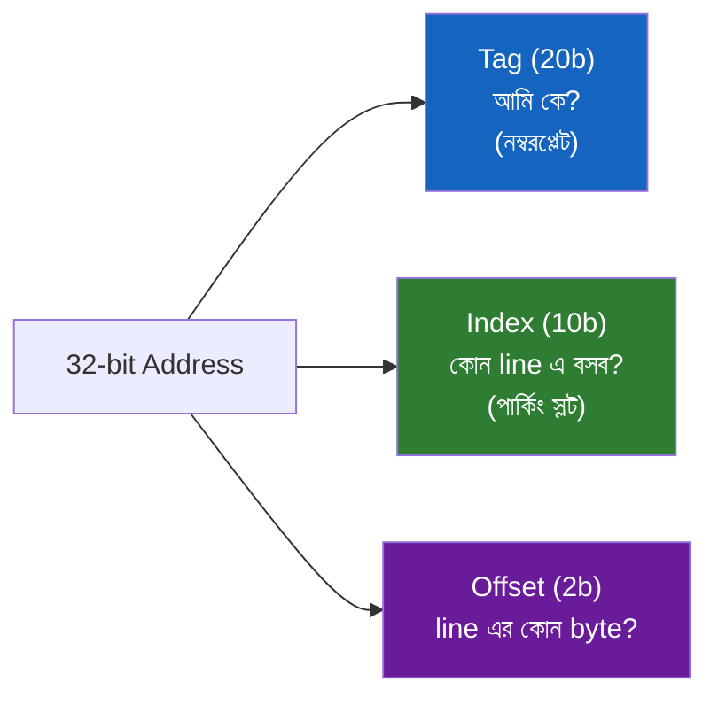
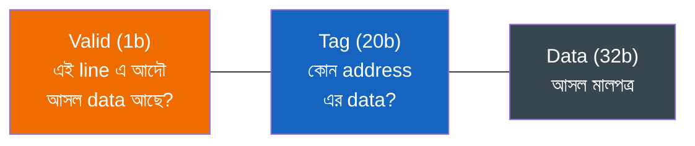
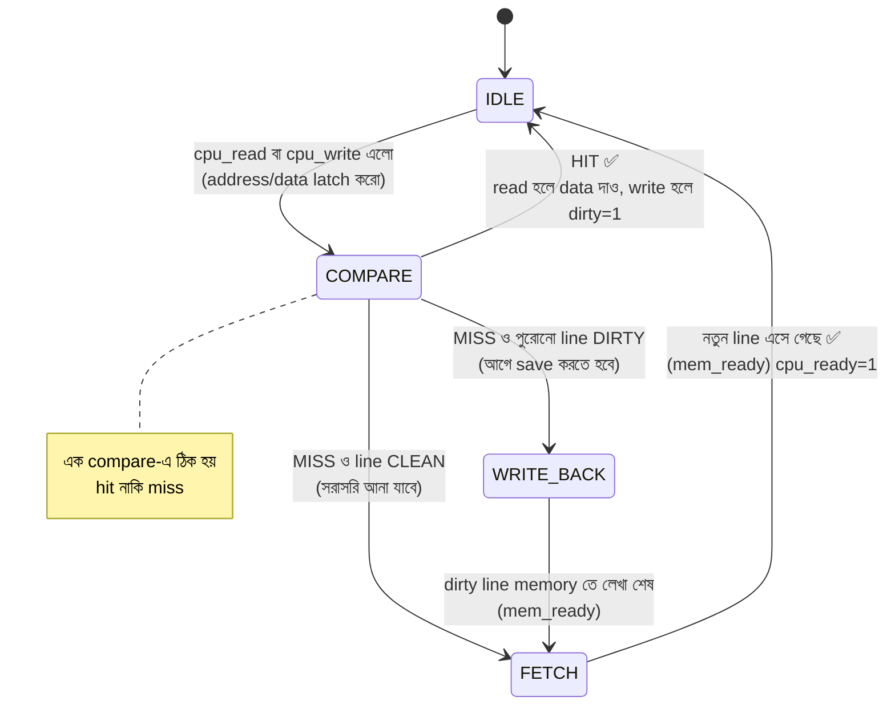
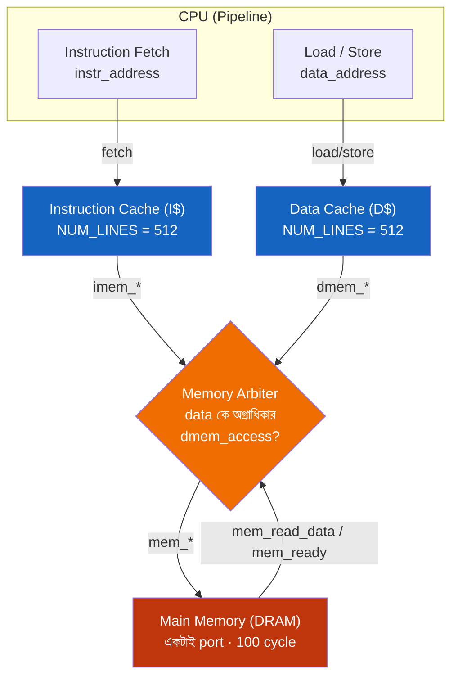

# 💾 Chapter 18: Memory Hierarchy & Cache Design
## From Slow to Fast - 10× Memory Performance Boost!

> **"Memory is slow. Cache is FAST. Time to build the bridge!"**
>
> **"Memory slow। Cache FAST। এবার bridge বানাও!"**

---

## 🎯 এই Chapter এ তুমি বানাবে:

```
✅ Cache Fundamentals - why we need it
✅ Direct-Mapped Cache - simple & fast
✅ Cache Controller - hit/miss logic
✅ Write Policies - write-through/back
✅ Cache Performance - hit rate analysis
✅ Memory System - complete integration
✅ Real Cache - 10× speedup!
✅ তোমার high-performance memory! 🎉
```

**Time Required:** 2 weeks (6-8 hours/day)  
**Prerequisites:** Chapter 17 complete

---

## 🚀 Quick Understanding - The Memory Problem!

আগের কয়েকটা chapter এ তুমি pipeline বানিয়েছো, hazard সামলেছো, forwarding দিয়ে প্রতি cycle এ একটা করে instruction বের করার চেষ্টা করেছো। কিন্তু একটা নোংরা সত্য এতক্ষণ আমরা লুকিয়ে রেখেছিলাম: **memory ভয়ংকর slow।** তোমার ঝকঝকে pipeline প্রতিবার একটা `LW` বা `SW` instruction এ থমকে যায়, কারণ যেখান থেকে data আনতে হবে — সেই DRAM — CPU এর তুলনায় কচ্ছপের গতিতে চলে।

এই সমস্যাটার একটা নাম আছে — **the memory wall** (মেমরি দেয়াল)। প্রসেসর প্রতি বছর দ্রুততর হয়েছে, কিন্তু DRAM সেই গতিতে দ্রুত হয়নি। ফলে দুটোর মাঝখানে একটা বিশাল গতি-পার্থক্যের দেয়াল গড়ে উঠেছে। CPU যত দ্রুতই হোক, সে memory র জন্য বসে থাকে — অনেকটা Ferrari নিয়ে ঢাকার জ্যামে আটকে থাকার মতো। এই chapter এর পুরো লড়াইটাই এই দেয়াল ভাঙা নিয়ে।

### The Problem - সংখ্যায় দেখো:

```
CPU Speed:
Modern CPU: 1-5 GHz (1 cycle = 0.2-1 ns)
Can execute 1 instruction per cycle

Memory Speed:
DRAM: 50-100 ns access time
50-100 cycles to read one value!

Gap: 100× difference! 💥

Without cache:
ADD x1, x2, x3    # 1 cycle
LW  x4, 0(x5)     # 100 cycles! 😱

Average CPI: 20-30!
Pipeline useless!
```

খেয়াল করো ব্যাপারটা কত নিষ্ঠুর। `ADD` এক cycle এ শেষ — register-এ-register হিসাব, কোনো memory লাগে না। কিন্তু পরের লাইনের `LW` (load word) DRAM থেকে data আনতে গিয়ে **১০০ cycle** খেয়ে ফেলল! এই একটা instruction তোমার আগের ৯৯টা instruction এর সব লাভ গিলে খায়। গড় CPI (cycles per instruction) তখন ১ এর কাছাকাছি থাকে না — লাফিয়ে ২০-৩০ এ চলে যায়। মানে তোমার ৫-stage pipeline, forwarding, branch prediction — সব পরিশ্রম জলে। **Memory ই এখন bottleneck।**

### The Solution: Cache!

সমাধানটা চমৎকার সরল একটা পর্যবেক্ষণ থেকে আসে — প্রোগ্রাম সব data সমান হারে ব্যবহার করে না। কিছু data বারবার লাগে, কিছু কদাচিৎ। তাহলে যেগুলো বারবার লাগে, সেগুলোকে যদি একটা **ছোট কিন্তু দ্রুত** memory তে CPU এর পাশে রেখে দিই? এই ছোট, দ্রুত, CPU-সংলগ্ন memory টাই **cache**।

```
Cache = Small, fast memory
Close to CPU
Stores frequently used data

Cache Speed: 1-3 ns (1-3 cycles)
DRAM Speed: 50-100 ns (50-100 cycles)

Speedup: 30-50×!
```

Cache কোনো একক জিনিস নয় — এটা একটা **পুরো স্তরবিন্যাস (hierarchy)** এর অংশ। আমরা কয়েকটা স্তর সাজাই: একদম ছোট আর বিদ্যুৎ-গতির memory CPU এর গা ঘেঁষে, তারপর একটু বড় কিন্তু একটু ধীর, তারপর আরও বড় আরও ধীর — এভাবে। উপরের স্তর দ্রুত কিন্তু দামি (তাই ছোট), নিচের স্তর সস্তা কিন্তু ধীর (তাই বিশাল)। নিচের পিরামিডে প্রতিটা স্তরের আকার, গতি আর দাম একসাথে দেখো:

```mermaid
flowchart TB
    R["⚡ Registers<br/>32×4B · 0 cycle · দামি $$$$$"]
    L1["L1 Cache<br/>32 KB · 1-3 cycle · $$$$"]
    L2["L2 Cache<br/>256 KB · 10 cycle · $$$"]
    L3["L3 Cache<br/>8 MB · 30 cycle · $$"]
    DR["DRAM (Main Memory)<br/>8 GB · 100 cycle · $"]
    SS["💽 SSD / Disk<br/>1 TB · 10000 cycle · সস্তা ¢"]

    R --> L1 --> L2 --> L3 --> DR --> SS

    classDef fast fill:#1b5e20,stroke:#a5d6a7,color:#fff
    classDef mid fill:#33691e,stroke:#c5e1a5,color:#fff
    classDef slow fill:#bf360c,stroke:#ffab91,color:#fff
    class R,L1 fast
    class L2,L3 mid
    class DR,SS slow
```

| Level | Size | Speed | Cost |
|---|---|---|---|
| Registers | 32×4B | 0 cycle | $$$$$ |
| L1 Cache | 32 KB | 1-3 cycle | $$$$ |
| L2 Cache | 256 KB | 10 cycle | $$$ |
| L3 Cache | 8 MB | 30 cycle | $$ |
| DRAM | 8 GB | 100 cycle | $ |
| SSD | 1 TB | 10000 cycle | ¢ |

উপরের দিকে উঠতে থাকলে — দ্রুত, ছোট, দামি। নিচের দিকে নামতে থাকলে — ধীর, বিশাল, সস্তা। এই chapter এ আমরা বানাবো **L1 Cache** — যে স্তরটা সরাসরি CPU এর সাথে কথা বলে এবং সবচেয়ে বেশি কাজে লাগে।

🎉 **Cache = দ্রুত memory র গতি + slow memory র আকার!** দুটোর সেরাটা একসাথে — এটাই memory hierarchy র পুরো জাদু।

---

## ১৮.১ Cache Fundamentals

### কেন cache আদৌ কাজ করে? — Locality র গল্প

এখানে একটা গভীর প্রশ্ন আসে। Cache তো ছোট — সে তো পুরো 8 GB DRAM ধরে রাখতে পারে না। তাহলে মাত্র 32 KB জায়গায় কী এমন রাখবে যাতে বেশিরভাগ সময় কাজ চলে যায়? উত্তরটা প্রোগ্রামের একটা চমৎকার স্বভাবে লুকিয়ে — **locality (স্থানীয়তা)**। প্রোগ্রাম memory কে এলোমেলোভাবে ছোঁয় না; সে একটা গোছানো, অনুমান-যোগ্য প্যাটার্নে ছোঁয়। এই প্যাটার্ন দুই রকম:

**Temporal locality (সময়গত স্থানীয়তা):** এইমাত্র যে data ব্যবহার করেছো, সেটা আবার শিগগিরই লাগার সম্ভাবনা বেশি। ভাবো একটা `for` loop এর কথা — loop variable `i` প্রতি iteration এ পড়া হয়, লেখা হয়, আবার পড়া হয়। একবার ব্যবহার মানে আরও বহুবার ব্যবহার।

**Spatial locality (স্থানগত স্থানীয়তা):** এইমাত্র যে address ছুঁয়েছো, তার ঠিক পাশের address গুলোও শিগগিরই লাগার সম্ভাবনা বেশি। একটা array এর উপর দিয়ে হাঁটো — `a[0]`, তারপর `a[1]`, তারপর `a[2]`... পরপর সাজানো। অথবা instruction গুলো — সাধারণত একটার পর একটা execute হয়।

#### একটা everyday analogy — তোমার পড়ার টেবিল

Locality বোঝার সবচেয়ে সহজ উপায় — তোমার পড়াশোনার ব্যবস্থাটা ভাবো:

- **টেবিলের উপর (desk)** = registers/L1 cache। যে দুই-তিনটা বই এই মুহূর্তে পড়ছো, হাত বাড়ালেই পাও। ০ সেকেন্ড। কিন্তু টেবিল ছোট — বেশি বই রাখা যায় না।
- **পাশের তাক (shelf)** = L2/L3 cache। চেয়ার ছেড়ে দুই পা হেঁটে বইটা আনতে হবে। কয়েক সেকেন্ড। অনেক বেশি বই ধরে।
- **library (লাইব্রেরি)** = DRAM/disk। হেঁটে লাইব্রেরিতে গিয়ে, খুঁজে, ধার নিয়ে ফিরতে হবে। অনেক সময়। কিন্তু প্রায় সব বই-ই আছে।

এখন temporal locality: যে বইটা একটু আগে টেবিলে এনেছিলে, সেটা টেবিলেই রেখে দাও — কারণ আবার লাগবে। আর spatial locality: একটা বই আনতে লাইব্রেরিতে গেলে শুধু সেটাই নয়, **একই বিষয়ের আশপাশের বইগুলোও** একসাথে এনে রাখো — কারণ পরের অধ্যায়েই হয়তো সেগুলো লাগবে। Cache হুবহু এই দুটো কাজ করে: সদ্য ব্যবহৃত data কাছে রাখে, আর miss হলে শুধু একটা byte নয়, পুরো একটা **line** (পাশের data সহ) টেনে আনে।

### How Cache Works - ধাপে ধাপে:

```
1. CPU requests data at address A
2. Check if A is in cache (HIT or MISS)
3. If HIT: Return data immediately (1 cycle)
4. If MISS: Fetch from memory (100 cycles)
            Store in cache
            Return data

Next time: HIT! Fast!

Locality principles:
- Temporal: Recently used → likely used again
- Spatial: Nearby addresses → likely used together

Cache exploits locality!
```

পুরো খেলাটা দুটো শব্দে — **HIT আর MISS**। CPU যে address চাইল, সেটা যদি cache এ থাকে — **hit**, ১ cycle এ data হাতে। না থাকলে — **miss**, DRAM থেকে ১০০ cycle খরচ করে আনতে হবে, তারপর cache এ বসিয়ে রাখতে হবে। মজাটা হলো: প্রথমবার miss হলেও, locality র কারণে **পরের বার সেটা hit হবে।** তাই একবারের ১০০ cycle খরচ পরের অনেকবারের ১ cycle দিয়ে পুষিয়ে যায়। Cache এর পুরো লাভ এই বাজি থেকেই আসে — আর locality থাকার কারণে এই বাজিতে আমরা প্রায় সবসময় জিতি।

### Cache Organization - cache ভেতরে কেমন সাজানো?

Cache কে আমরা ছোট ছোট খোপে ভাগ করি। শব্দ তিনটা মনে রাখো:

- **Line / Block:** storage এর সবচেয়ে ছোট একক। Cache একবারে একটা গোটা line আনে বা ফেলে — একটা একলা byte নিয়ে কারবার করে না (মনে আছে spatial locality? পাশের data ও সাথে আনাই বুদ্ধিমানের কাজ)।
- **Set:** কয়েকটা line এর একটা দল।
- **Way:** একটা set এর ভেতর কয়টা line ধরে — সেই সংখ্যা।

এই "way" এর সংখ্যা দিয়েই cache এর তিন রকম ধরন ঠিক হয়। মূল প্রশ্ন একটাই: **DRAM এর একটা নির্দিষ্ট address cache এর ঠিক কোথায় বসতে পারবে?**

```
Types:
1. Direct-Mapped: 1 way
   - Simple, fast
   - More conflicts

2. Set-Associative: 2-8 ways
   - Flexible
   - More complex

3. Fully-Associative: N ways
   - Most flexible
   - Most complex

We'll implement Direct-Mapped!
```

একটা সহজ analogy দিয়ে তিনটা ধরন বোঝো — পার্কিং লটে গাড়ি রাখার নিয়ম:

- **Direct-Mapped (1 way):** প্রতিটা গাড়ির জন্য একটাই নির্দিষ্ট স্লট বরাদ্দ। তোমার গাড়ি শুধু "তোমার" স্লটেই বসবে — সেখানে অন্য কারও গাড়ি থাকলে তাকে সরিয়েই তোমাকে ঢুকতে হবে। খুঁজে পাওয়া বিদ্যুৎ-গতির (একটাই জায়গা দেখলেই হলো), কিন্তু conflict বেশি — দুটো জনপ্রিয় গাড়ি একই স্লট চাইলে তারা পালা করে একে অপরকে লাথি মেরে বের করতে থাকে।
- **Set-Associative (2-8 ways):** গাড়ি একটা নির্দিষ্ট সারিতে (set) যাবে, কিন্তু সেই সারির ২-৮টা স্লটের যেকোনোটায় বসতে পারে। বেশ নমনীয়, conflict কম। বিনিময়ে খুঁজতে গেলে কয়েকটা স্লট একসাথে দেখতে হয় — logic একটু জটিল।
- **Fully-Associative (N ways):** যেকোনো গাড়ি যেকোনো খালি স্লটে। সবচেয়ে নমনীয়, conflict সবচেয়ে কম। কিন্তু খুঁজতে গেলে **পুরো লট** একসাথে দেখতে হয় — সবচেয়ে দামি, সবচেয়ে জটিল।

আমরা শুরু করব সবচেয়ে সহজটা দিয়ে — **Direct-Mapped।** এক-স্লট-এক-গাড়ি নিয়ম মানে hit/miss logic হবে মাত্র একটা তুলনা, আর তা একদম ঝকঝকে দ্রুত। শেখার জন্য আদর্শ।

### Direct-Mapped Cache Structure - address টা কীভাবে ভাঙি?

এটা পুরো chapter এর সবচেয়ে গুরুত্বপূর্ণ ধারণা, তাই ধীরে ধীরে বুঝি। CPU একটা ৩২-bit address দেয়। আমাদের cache এর line আছে মাত্র ১০২৪টা — অথচ address দিয়ে ঠিকানা দেওয়া যায় ৪ গিগাবাইট। তাহলে এই বিশাল address space টা মাত্র ১০২৪টা খোপে কীভাবে ঢোকাই, আর পরে কী করে চিনি কোন data কোন খোপে আছে?

কৌশলটা হলো — **৩২টা bit কে তিন টুকরোয় কাটো**, প্রতি টুকরোর আলাদা কাজ:

```
Address breakdown (32-bit):

  bit 31 ................ 12 │ 11 ........ 2 │ 1 . 0
 ┌────────────────────────┬──────────────┬──────────┐
 │          Tag           │    Index     │  Offset  │
 └────────────────────────┴──────────────┴──────────┘
         20 bits               10 bits      2 bits
       "কোন address?"       "কোন line?"   "কোন byte?"
```

ডান দিক থেকে বাঁ দিকে পড়লে এটা সবচেয়ে সহজ মনে হয়:

- **Offset (নিচের ২ bit):** line এর ভেতর কোন byte? আমাদের line ৪ byte, আর ৪টা byte কে আলাদা করতে লাগে ঠিক ২ bit (২² = ৪)। অর্থাৎ একদম ছোট, line-এর-ভেতরের ঠিকানা।
- **Index (পরের ১০ bit):** কোন cache line এ যাব? ১০২৪টা line কে আলাদা করতে লাগে ঠিক ১০ bit (২¹⁰ = ১০২৪)। এটাই সেই "নির্দিষ্ট পার্কিং স্লট" — direct-mapped এ index সরাসরি বলে দেয় গাড়ি কোথায় বসবে। **কোনো খোঁজাখুঁজি নেই**, index দেখো আর সোজা সেই line এ যাও।
- **Tag (উপরের ২০ bit):** বাকি ২০ bit। এটা কেন লাগে? কারণ একই index অনেক ভিন্ন address এর হতে পারে! ভাবো — index এর ১০ bit একই রেখে উপরের ২০ bit বদলালে অসংখ্য আলাদা address পাওয়া যায়, অথচ সবগুলো **একই line** এ map করে। তাহলে এই মুহূর্তে সেই line এ আসলে কোন address টা বসে আছে, সেটা চেনার জন্যই tag — এটাই গাড়ির "নম্বরপ্লেট"।

#### একটা mental model — তিন প্রশ্ন

প্রতিটা address কে তিনটা প্রশ্নের উত্তর হিসেবে ভাবো:



Hit/miss সিদ্ধান্ত এখন একদম পরিষ্কার দুই-ধাপের নাচ: (১) **index** দিয়ে সোজা line টায় যাও, (২) সেই line এ লেখা **tag** তোমার address এর tag এর সাথে মিলিয়ে দেখো। মিললে — **hit!** না মিললে — **miss।** (আর line টা আগে কখনো ভরা না হলে? সেটা চেনার জন্যই valid bit, একটু পরেই আসছে।)

#### একটা cache line এর ভেতরে কী থাকে?

শুধু data রাখলেই তো চলবে না — পরে চিনতে হবে এই data টা আদৌ বৈধ কিনা, আর কোন address এর। তাই প্রতিটা line এ তিনটা জিনিস:

```
Cache line:
┌───────┬─────┬──────────────────────┐
│ Valid │ Tag │       Data (32b)     │
└───────┴─────┴──────────────────────┘
  1 bit  20b         32 bits
```



- **Valid bit:** reset এর পর cache খালি — তখন প্রতিটা line এ এলোমেলো আবর্জনা থাকতে পারে, যেটা ভুলে data ভেবে ফেললে বিপর্যয়। Valid bit = 0 মানে "এই খোপ এখনো ব্যবহার হয়নি, এর tag/data কে বিশ্বাস করো না"। তাই hit হতে গেলে দুটো শর্ত একসাথে লাগে: valid bit ১ **এবং** tag মিলেছে।
- **Tag:** উপরে যে নম্বরপ্লেট বললাম — চিনতে সাহায্য করে এই data টা কোন address এর।
- **Data:** আসল ৩২-bit মালপত্র, যেটা CPU আসলে চায়।

আর পুরোটা যোগ করলে:

```
Total: 1024 lines × (1 + 20 + 32) = 53 Kb
Cache size: 4 KB (data only)
```

মানে গোটা cache এর হিসাবি storage প্রায় ৫৩ Kb, কিন্তু এর মধ্যে কেবল **data** অংশ ১০২৪ × ৪ byte = **৪ KB**। বাকিটা (valid + tag) হলো "overhead" — hit/miss চেনার জন্য যে ছোট দাম দিতে হয়। এই ৪ KB ই আমরা এখন Verilog এ বানাব।

---

## ১৮.২ Direct-Mapped Cache Implementation

তত্ত্ব শেষ — এবার silicon-এর ভাষায় লিখি। নিচের module টা ঠিক যা যা উপরে আলোচনা করলাম, তাই করে: address কে tag/index/offset এ ভাঙে, একটা তুলনায় hit/miss ঠিক করে, আর miss হলে একটা ছোট state machine দিয়ে DRAM থেকে data টেনে এনে cache এ বসায়।

পড়ার আগে কোডের কয়েকটা মূল অংশ চিনে নাও, তাহলে পুরোটা সহজে ধরা পড়বে:

- **Cache storage:** তিনটা আলাদা array — `valid`, `tag`, আর `data` — প্রতিটায় `NUM_LINES` (১০২৪) টা ঘর। মনে আছে cache line এর তিনটা ক্ষেত্র? এখানে সেগুলো তিনটা সমান্তরাল array হয়ে গেছে, যাদের `index` দিয়ে একসাথে ঠিকানা দেওয়া হয়।
- **Address decomposition:** `offset`, `index`, `addr_tag` — হুবহু আমাদের bit-split। লক্ষ করো `index = address[11:2]` (১০ bit) আর `addr_tag = address[31:12]` (২০ bit); নিচের ২ bit offset, যেটা word-access এ আমরা ফেলে দিই।
- **Hit/Miss logic:** `cache_hit = valid[index] && (tag[index] == addr_tag)` — ঠিক সেই দুই-শর্তের নিয়ম, এক লাইনে। valid হতে হবে **এবং** tag মিলতে হবে।
- **State machine:** `IDLE` এ বসে অপেক্ষা; miss হলে `FETCH` এ গিয়ে memory র `mem_ready` এর জন্য বসে থাকে, data এলে cache এ বসিয়ে আবার `IDLE` এ ফেরে। (এই version টা write এ **write-through** করে — write হলে cache এবং memory দুটোতেই একসাথে লেখে; write policy নিয়ে বিস্তারিত একটু পরে।)

### Cache Module:

```verilog
module cache_direct_mapped #(
    parameter CACHE_SIZE = 4096,  // 4KB
    parameter LINE_SIZE = 4,      // 4 bytes per line
    parameter NUM_LINES = 1024    // 1024 lines
)(
    input wire clk,
    input wire reset,
    // CPU interface
    input wire [31:0] address,
    input wire [31:0] write_data,
    input wire read_enable,
    input wire write_enable,
    output reg [31:0] read_data,
    output reg hit,
    output reg miss,
    // Memory interface
    output reg [31:0] mem_address,
    output reg [31:0] mem_write_data,
    output reg mem_read,
    output reg mem_write,
    input wire [31:0] mem_read_data,
    input wire mem_ready
);
    // Cache storage
    reg valid [0:NUM_LINES-1];
    reg [19:0] tag [0:NUM_LINES-1];
    reg [31:0] data [0:NUM_LINES-1];
    
    // Address decomposition
    wire [1:0] offset = address[1:0];
    wire [9:0] index = address[11:2];
    wire [19:0] addr_tag = address[31:12];
    
    // Hit/Miss logic
    wire cache_hit = valid[index] && (tag[index] == addr_tag);
    wire cache_miss = !cache_hit;
    
    // State machine for handling misses
    localparam IDLE = 2'b00;
    localparam FETCH = 2'b01;
    localparam WRITE_BACK = 2'b10;
    
    reg [1:0] state;
    
    // Initialize
    integer i;
    initial begin
        for (i = 0; i < NUM_LINES; i = i + 1) begin
            valid[i] = 0;
            tag[i] = 0;
            data[i] = 0;
        end
        state = IDLE;
    end
    
    // Cache logic
    always @(posedge clk or posedge reset) begin
        if (reset) begin
            for (i = 0; i < NUM_LINES; i = i + 1) begin
                valid[i] <= 0;
            end
            state <= IDLE;
            hit <= 0;
            miss <= 0;
        end else begin
            case (state)
                IDLE: begin
                    if (read_enable) begin
                        if (cache_hit) begin
                            // Cache hit
                            read_data <= data[index];
                            hit <= 1;
                            miss <= 0;
                        end else begin
                            // Cache miss - fetch from memory
                            miss <= 1;
                            hit <= 0;
                            mem_address <= {address[31:2], 2'b00};
                            mem_read <= 1;
                            state <= FETCH;
                        end
                    end else if (write_enable) begin
                        if (cache_hit) begin
                            // Write hit
                            data[index] <= write_data;
                            hit <= 1;
                            miss <= 0;
                            // Write-through: also write to memory
                            mem_address <= {address[31:2], 2'b00};
                            mem_write_data <= write_data;
                            mem_write <= 1;
                        end else begin
                            // Write miss - allocate in cache
                            miss <= 1;
                            hit <= 0;
                            mem_address <= {address[31:2], 2'b00};
                            mem_read <= 1;
                            state <= FETCH;
                        end
                    end else begin
                        hit <= 0;
                        miss <= 0;
                    end
                end
                
                FETCH: begin
                    if (mem_ready) begin
                        // Got data from memory
                        data[index] <= mem_read_data;
                        tag[index] <= addr_tag;
                        valid[index] <= 1;
                        read_data <= mem_read_data;
                        mem_read <= 0;
                        hit <= 1;
                        miss <= 0;
                        state <= IDLE;
                    end
                end
                
                default: state <= IDLE;
            endcase
        end
    end
endmodule
```

কোডটা ছোট, কিন্তু এর মধ্যে পুরো cache-দর্শন লুকিয়ে। হিসাবের কেন্দ্রবিন্দু সেই একটা লাইন — `cache_hit = valid[index] && (tag[index] == addr_tag)`। এই combinational তুলনাটা প্রতি cycle এ নিজে নিজে হয়ে যায়; state machine শুধু তখনই কষ্ট করে যখন miss হয় এবং DRAM এ যেতে হয়। Read hit হলে `read_data <= data[index]` — এক cycle, ব্যস। কিন্তু miss হলে `FETCH` state এ গিয়ে `mem_ready` এর জন্য বসে থাকা — সেই ১০০ cycle এর শাস্তি এখানেই। এই version এ write hit হলে cache এবং memory দুটোতেই একসাথে লেখা হয় (write-through), তাই এখানে কোনো dirty bit নেই।

> 💡 **খেয়াল করো:** এই সরল cache এ miss হলেই আমরা সরাসরি নতুন data বসিয়ে দিই — পুরোনো line এ যা ছিল তা নিয়ে আলাদা করে ভাবি না, কারণ write-through নীতিতে cache এর সব কিছুর একটা copy memory তেও থাকে। পরের section এ যখন **write-back** এ যাব, তখন এই "পুরোনো line টা কি memory তে লিখে রেখে আসতে হবে?" প্রশ্নটাই FSM কে জটিল করে তুলবে।

---

## ১৮.৩ Cache Controller

আগের module টা hit/miss বুঝিয়েছে, কিন্তু একটা জায়গায় সে অপচয়ী — write-through এ **প্রতিটা** write সরাসরি DRAM এ যায়। ভাবো একটা loop যা একই variable এ হাজারবার লেখে — তাহলে হাজারবার DRAM এ ১০০-cycle যাত্রা! এটা locality র অপমান। আরও বুদ্ধিমান উপায় হলো **write-back**: write গুলো শুধু cache এ জমা রাখো, আর সেই line টা যখন cache থেকে বিদায় নিতে যাবে তখন একবারে memory তে ফেরত পাঠাও।

এই আরও পরিণত controller টায় তাই দুটো নতুন জিনিস:

- **`dirty` bit:** প্রতিটা line এর জন্য একটা পতাকা। Cache এ data লেখা হয়েছে কিন্তু এখনো memory তে ফেরত যায়নি — এমন line কে "dirty" বলি। Dirty না হলে (clean) line টা ফেলে দেওয়া নিরাপদ, কারণ memory তে এর হুবহু copy আছে। Dirty হলে ফেলার আগে অবশ্যই memory তে লিখে আসতে হবে, নইলে তোমার লেখা চিরতরে হারিয়ে যাবে।
- **Statistics counters:** `hit_count`, `miss_count`, `access_count` — কতবার hit, কতবার miss, মোট কতবার access। এগুলো দিয়েই পরে আমরা hit rate আর AMAT হিসাব করব। (পরিমাপ না করলে optimize করবে কী?)

#### Controller এর FSM — পাঁচটা state

লক্ষ করো state এবার আর তিনটা নয়, পাঁচটা: `IDLE → COMPARE → {hit হলে IDLE | miss হলে FETCH, আর dirty হলে আগে WRITE_BACK} → IDLE`। ছবিতে পুরো পথটা একসাথে দেখো:



পথটা গল্পের মতো পড়ো: CPU কিছু চাইল → `COMPARE` এ tag মিলিয়ে দেখি। মিললে (hit) সাথে সাথে কাজ সেরে `IDLE` এ ফিরি। না মিললে (miss) — এখন একটা কাঁটা: যে line টা সরিয়ে নতুন data বসাব, সেটা কি dirty? Dirty হলে আগে `WRITE_BACK` এ গিয়ে পুরোনো data memory তে নিরাপদে রেখে আসি, তারপর `FETCH`। Clean হলে সোজা `FETCH` — সেখানে নতুন line টেনে এনে বসাই, CPU কে `cpu_ready` সংকেত দিই, আর `IDLE` এ ফিরি। এই "dirty হলে আগে লিখে এসো" শাখাটাই write-back কে write-through এর চেয়ে চালাক বানায়।

### Advanced Cache with Write-Back:

```verilog
module cache_controller #(
    parameter NUM_LINES = 1024
)(
    input wire clk,
    input wire reset,
    // CPU interface
    input wire [31:0] cpu_address,
    input wire [31:0] cpu_write_data,
    input wire cpu_read,
    input wire cpu_write,
    output reg [31:0] cpu_read_data,
    output reg cpu_ready,
    // Memory interface
    output reg [31:0] mem_address,
    output reg [31:0] mem_write_data,
    output reg mem_read,
    output reg mem_write,
    input wire [31:0] mem_read_data,
    input wire mem_ready,
    // Statistics
    output reg [31:0] hit_count,
    output reg [31:0] miss_count,
    output reg [31:0] access_count
);
    // Cache storage
    reg valid [0:NUM_LINES-1];
    reg dirty [0:NUM_LINES-1];  // For write-back
    reg [19:0] tag [0:NUM_LINES-1];
    reg [31:0] data [0:NUM_LINES-1];
    
    // Address fields
    wire [9:0] index = cpu_address[11:2];
    wire [19:0] addr_tag = cpu_address[31:12];
    
    // Hit/Miss
    wire hit = valid[index] && (tag[index] == addr_tag);
    wire miss = !hit;
    
    // States
    localparam IDLE = 3'b000;
    localparam COMPARE = 3'b001;
    localparam ALLOCATE = 3'b010;
    localparam WRITE_BACK = 3'b011;
    localparam FETCH = 3'b100;
    
    reg [2:0] state;
    reg [31:0] saved_address;
    reg [31:0] saved_write_data;
    reg saved_write;
    
    integer i;
    initial begin
        for (i = 0; i < NUM_LINES; i = i + 1) begin
            valid[i] = 0;
            dirty[i] = 0;
            tag[i] = 0;
            data[i] = 0;
        end
        state = IDLE;
        hit_count = 0;
        miss_count = 0;
        access_count = 0;
    end
    
    always @(posedge clk or posedge reset) begin
        if (reset) begin
            for (i = 0; i < NUM_LINES; i = i + 1) begin
                valid[i] <= 0;
                dirty[i] <= 0;
            end
            state <= IDLE;
            cpu_ready <= 0;
            hit_count <= 0;
            miss_count <= 0;
            access_count <= 0;
        end else begin
            case (state)
                IDLE: begin
                    cpu_ready <= 0;
                    if (cpu_read || cpu_write) begin
                        access_count <= access_count + 1;
                        saved_address <= cpu_address;
                        saved_write_data <= cpu_write_data;
                        saved_write <= cpu_write;
                        state <= COMPARE;
                    end
                end
                
                COMPARE: begin
                    if (hit) begin
                        // Cache hit
                        hit_count <= hit_count + 1;
                        if (saved_write) begin
                            // Write hit
                            data[index] <= saved_write_data;
                            dirty[index] <= 1;  // Mark dirty
                        end else begin
                            // Read hit
                            cpu_read_data <= data[index];
                        end
                        cpu_ready <= 1;
                        state <= IDLE;
                    end else begin
                        // Cache miss
                        miss_count <= miss_count + 1;
                        if (valid[index] && dirty[index]) begin
                            // Need to write back dirty line
                            state <= WRITE_BACK;
                        end else begin
                            // Can fetch directly
                            state <= FETCH;
                        end
                    end
                end
                
                WRITE_BACK: begin
                    // Write dirty line to memory
                    mem_address <= {tag[index], index, 2'b00};
                    mem_write_data <= data[index];
                    mem_write <= 1;
                    if (mem_ready) begin
                        mem_write <= 0;
                        dirty[index] <= 0;
                        state <= FETCH;
                    end
                end
                
                FETCH: begin
                    // Fetch new line from memory
                    mem_address <= {saved_address[31:2], 2'b00};
                    mem_read <= 1;
                    if (mem_ready) begin
                        mem_read <= 0;
                        data[index] <= mem_read_data;
                        tag[index] <= addr_tag;
                        valid[index] <= 1;
                        
                        if (saved_write) begin
                            // Write miss - update with new data
                            data[index] <= saved_write_data;
                            dirty[index] <= 1;
                        end else begin
                            // Read miss
                            cpu_read_data <= mem_read_data;
                            dirty[index] <= 0;
                        end
                        
                        cpu_ready <= 1;
                        state <= IDLE;
                    end
                end
                
                default: state <= IDLE;
            endcase
        end
    end
endmodule
```

কোডের দুটো সূক্ষ্ম কিন্তু জরুরি জায়গা খেয়াল করো। প্রথমত, request আসামাত্র `IDLE` এ আমরা `saved_address`, `saved_write_data`, `saved_write` এ সব কিছু **latch** করে রাখি। কেন? কারণ miss সামলাতে কয়েক cycle লাগে, আর ততক্ষণে CPU এর দেওয়া original সংকেতগুলো বদলে যেতে পারে — তাই নিজের কাছে একটা copy রেখে দেওয়া। দ্বিতীয়ত, `WRITE_BACK` এ পুরোনো line এর address টা আমরা `{tag[index], index, 2'b00}` দিয়ে বানাই — মানে **সেই line এ এখন যে tag বসে আছে** সেটা আর index জুড়ে। এটাই গুরুত্বপূর্ণ: dirty data যে address থেকে এসেছিল, ঠিক সেখানেই ফেরত পাঠাতে হবে, নতুন আসা address এ নয়।

#### Write-Through বনাম Write-Back — কোনটা কখন?

এই দুই নীতি cache design এর একটা ক্লাসিক tradeoff। দুটোকে পাশাপাশি দেখো:

| | Write-Through | Write-Back |
|---|---|---|
| **Write করলে কোথায় যায়** | cache + memory দুটোতেই, প্রতিবার | শুধু cache এ; memory তে পরে, line বিদায়ের সময় |
| **Dirty bit লাগে?** | না | হ্যাঁ (কোন line এখনো memory তে লেখা হয়নি বোঝাতে) |
| **Memory traffic** | বেশি (প্রতি write এ DRAM যাত্রা) | কম (একই line এ বহু write মিলে একবারে যায়) |
| **জটিলতা** | সরল | জটিল (eviction এ writeback সামলাতে হয়) |
| **Memory সবসময় up-to-date?** | হ্যাঁ | না (cache এ সবচেয়ে নতুন copy থাকতে পারে) |
| **কে ব্যবহার করে** | ১৮.২ এর সরল cache | এই controller, আর বেশিরভাগ আসল CPU |

মূল অন্তর্দৃষ্টি: write-through সরল আর memory সবসময় সঠিক রাখে, কিন্তু locality র সুযোগ নষ্ট করে — একই জায়গায় বারবার লিখলেও প্রতিবার DRAM এ যায়। Write-back সেই অপচয় বন্ধ করে দেয়: একটা line এ যতবার খুশি লেখো, DRAM এ যাত্রা মাত্র একবার — যখন line টা সত্যিই বিদায় নেয়। বিনিময়ে দাম দিতে হয় জটিলতায় (dirty bit, eviction এর সময় writeback) এবং একটা ঝুঁকিতে — power চলে গেলে dirty line এর সর্বশেষ লেখা হারিয়ে যেতে পারে, কারণ সেটা তখনো শুধু cache এ ছিল। এই কারণেই বেশিরভাগ আসল উচ্চ-কর্মক্ষমতার CPU write-back ব্যবহার করে।

---

## ১৮.৪ Memory System Integration

এতক্ষণ একটা একলা cache বানিয়েছি। কিন্তু একটা আসল প্রসেসর memory কে **দুই ভিন্ন কারণে** ছোঁয়: (১) instruction আনতে (fetch), আর (২) data পড়তে-লিখতে (load/store)। মনে আছে Harvard architecture? এই দুটো কাজের প্যাটার্ন আলাদা — instruction সাধারণত পরপর সাজানো (শক্তিশালী spatial locality), data এদিক-সেদিক ছড়ানো। তাই দুটোকে আলাদা cache দিলে দুজনেই নিজের মতো ভালো কাজ করে, আর একে অপরের জায়গা দখল করে না।

তাই আমরা বানাই **দুটো cache** — একটা instruction cache (I$), একটা data cache (D$) — দুটোই আমাদের সেই write-back `cache_controller` এর instance। কিন্তু পেছনে DRAM তো একটাই, আর তার port ও একটাই। দুটো cache একসাথে DRAM চাইলে কে আগে পাবে? এই দ্বন্দ্ব মেটায় একটা **memory arbiter (সালিশকারী)**।

এই arbiter এর নিয়মটা সরল কিন্তু সূক্ষ্ম: **data কে অগ্রাধিকার দাও।** কেন? কারণ data access (LW/SW) প্রায়ই pipeline এর সেই instruction যেটা সামনে এগোতে আটকে আছে; তাকে আগে ছেড়ে দিলে pipeline দ্রুত খোলে। Data যখন memory চায় (পড়া বা লেখা), তখন সে port পায়; বাকি সময় instruction fetch পায়। কোডে আছে `dmem_access = dmem_read || dmem_write` — এই এক লাইনই সিদ্ধান্তটা নেয়।

> ⚠️ একটা সূক্ষ্ম bug-ফাঁদ এখানে আছে, যা কোডের comment-এ বিশেষভাবে সাবধান করা: instruction fetch যখন data র কাছে port হারায়, তখন তাকে অবশ্যই **stall** করতে হবে — `mem_write` সংকেত যেন কখনো ভুল করে instruction address এ গিয়ে না পড়ে। নিচের arbiter এ তাই write সবসময় data র দিকে steer করা হয়েছে।

### Complete Memory Subsystem:

```verilog
module memory_system(
    input wire clk,
    input wire reset,
    // CPU instruction interface
    input wire [31:0] instr_address,
    input wire instr_read,
    output wire [31:0] instruction,
    output wire instr_ready,
    // CPU data interface
    input wire [31:0] data_address,
    input wire [31:0] data_write,
    input wire data_read,
    input wire data_write_enable,
    output wire [31:0] data_read_out,
    output wire data_ready,
    // Memory statistics
    output wire [31:0] instr_hits,
    output wire [31:0] instr_misses,
    output wire [31:0] data_hits,
    output wire [31:0] data_misses
);
    // Main memory
    wire [31:0] mem_address;
    wire [31:0] mem_write_data;
    wire mem_read, mem_write;
    wire [31:0] mem_read_data;
    wire mem_ready;
    
    main_memory main_mem(
        .clk(clk),
        .reset(reset),
        .address(mem_address),
        .write_data(mem_write_data),
        .read_enable(mem_read),
        .write_enable(mem_write),
        .read_data(mem_read_data),
        .ready(mem_ready)
    );
    
    // Instruction cache
    wire [31:0] imem_address, imem_write_data;
    wire imem_read, imem_write;
    wire [31:0] imem_read_data;
    wire imem_ready;
    
    cache_controller #(.NUM_LINES(512)) icache(
        .clk(clk),
        .reset(reset),
        .cpu_address(instr_address),
        .cpu_write_data(32'h00000000),
        .cpu_read(instr_read),
        .cpu_write(1'b0),
        .cpu_read_data(instruction),
        .cpu_ready(instr_ready),
        .mem_address(imem_address),
        .mem_write_data(imem_write_data),
        .mem_read(imem_read),
        .mem_write(imem_write),
        .mem_read_data(mem_read_data),
        .mem_ready(mem_ready),
        .hit_count(instr_hits),
        .miss_count(instr_misses)
    );
    
    // Data cache
    wire [31:0] dmem_address, dmem_write_data;
    wire dmem_read, dmem_write;
    wire [31:0] dmem_read_data;
    wire dmem_ready;
    
    cache_controller #(.NUM_LINES(512)) dcache(
        .clk(clk),
        .reset(reset),
        .cpu_address(data_address),
        .cpu_write_data(data_write),
        .cpu_read(data_read),
        .cpu_write(data_write_enable),
        .cpu_read_data(data_read_out),
        .cpu_ready(data_ready),
        .mem_address(dmem_address),
        .mem_write_data(dmem_write_data),
        .mem_read(dmem_read),
        .mem_write(dmem_write),
        .mem_read_data(mem_read_data),
        .mem_ready(mem_ready),
        .hit_count(data_hits),
        .miss_count(data_misses)
    );
    
    // Memory arbiter (prioritize data access over instruction fetch).
    // Data has the port whenever it reads OR writes; otherwise instruction
    // fetch gets it. (The instruction cache must stall while data has the
    // port — never let mem_write steer to the instruction address.)
    wire dmem_access = dmem_read || dmem_write;
    assign mem_address    = dmem_access ? dmem_address : imem_address;
    assign mem_write_data = dmem_write_data;
    assign mem_read       = dmem_access ? dmem_read : imem_read;
    assign mem_write      = dmem_write;
endmodule
```

পুরো subsystem টা একসাথে দেখলে গঠনটা পরিষ্কার হয় — দুটো cache, মাঝে একটা arbiter, পেছনে একটা DRAM:



খেয়াল করো দুটো cache দুজনেই DRAM থেকে আসা **একই** `mem_read_data` আর `mem_ready` তার শোনে — কারণ একসময় শুধু একজনই DRAM ব্যবহার করছে (arbiter সেটাই নিশ্চিত করে)। আর হিসাবের সুবিধার জন্য প্রতিটা cache নিজের `hit_count`/`miss_count` আলাদা করে বের করে দেয়, যাতে আমরা I$ আর D$ এর কর্মক্ষমতা আলাদা করে মাপতে পারি।

> 📝 মনে রাখো এখানে I$ আর D$ উভয়েরই `NUM_LINES = 512` — মানে এই system এ প্রতিটা cache ৫১২ line, ১৮.১ এর উদাহরণের ১০২৪ line নয়। আকারটা parameter দিয়ে সহজে বদলানো যায়, আর শেষের build plan এ ঠিক এটাই tune করে দেখার কথা বলা আছে।

---

## ১৮.৫ Cache Performance Analysis

Cache বানালেই হলো না — সেটা আসলে কত লাভ দিচ্ছে তা মাপতে জানতে হবে। এখানে দুটো প্রশ্নের উত্তর খুঁজি: cache কত ভাগ সময় hit দিচ্ছে, আর তার ফলে গড়ে একটা memory access কত cycle লাগছে।

### Performance Metrics:

```
Hit Rate = Hits / Total Accesses
Miss Rate = Misses / Total Accesses = 1 - Hit Rate

Average Memory Access Time (AMAT):
AMAT = Hit Time + (Miss Rate × Miss Penalty)
```

সবচেয়ে গুরুত্বপূর্ণ সূত্রটা এই **AMAT (Average Memory Access Time)** — গড়ে একটা memory access কত cycle খায়। সূত্রটা সহজ গল্পে পড়ো: **প্রতিবার** তুমি অন্তত hit time টা দাও (cache টা তো দেখতেই হবে), আর **মাঝে মাঝে** (miss rate এর হারে) উপরি একটা বড় জরিমানা (miss penalty) দিতে হয় DRAM এ যাওয়ার জন্য। তাই —

> **AMAT = সবসময়ের ছোট খরচ + (কতবার miss হয়) × (miss এর বড় খরচ)**

এবার সংখ্যা বসিয়ে দেখি কত শক্তিশালী এই ব্যাপারটা:

```
Example:
Hit Rate: 95%
Hit Time: 1 cycle
Miss Penalty: 100 cycles

AMAT = 1 + (0.05 × 100)
     = 1 + 5
     = 6 cycles

Speedup vs no cache: 100 / 6 = 16.7×!

If Hit Rate: 90%
AMAT = 1 + (0.10 × 100) = 11 cycles
Speedup: 9×

Hit rate is CRITICAL!
```

এই উদাহরণটা গায়ে কাঁটা দেওয়ার মতো। Cache ছাড়া প্রতিটা access ১০০ cycle। কিন্তু মাত্র ৯৫% hit rate এ গড় access নেমে আসে **৬ cycle** এ — প্রায় ১৭ গুণ দ্রুত! পুরো জাদুটা হলো: ৯৫% সময় তুমি ১ cycle এ কাজ সারো, আর সেই বড় ১০০-cycle জরিমানা মাত্র ৫% সময় গুনতে হয়।

এবার সবচেয়ে চমকপ্রদ পাঠটা টেবিলে সাজিয়ে দেখো — hit rate সামান্য কমলে কী হয়:

| Hit Rate | Miss Rate | AMAT হিসাব | AMAT | Speedup vs no-cache |
|---|---|---|---|---|
| 95% | 5% | 1 + (0.05 × 100) | **6 cycles** | 100 / 6 ≈ **16.7×** |
| 90% | 10% | 1 + (0.10 × 100) | **11 cycles** | 100 / 11 ≈ **9×** |

লক্ষ করো — hit rate মাত্র ৫ শতাংশ-বিন্দু কমল (৯৫% → ৯০%), কিন্তু AMAT প্রায় **দ্বিগুণ** হয়ে গেল (৬ → ১১), আর speedup প্রায় অর্ধেক (১৭× → ৯×)! কারণটা সূত্রেই লেখা: miss penalty (১০০) এত বিশাল যে অল্প কিছু বাড়তি miss-ই গড়কে টেনে অনেক উপরে তুলে দেয়। এই জন্যই **hit rate সবচেয়ে গুরুত্বপূর্ণ সংখ্যা** — cache design এর প্রায় সব পরিশ্রম এই একটা সংখ্যাকে যতটা সম্ভব ১০০% এর কাছে নেওয়ার জন্য।

### Improving Hit Rate - hit rate বাড়ানোর পাঁচটা অস্ত্র

যেহেতু hit rate ই সব, প্রকৌশলীরা এটা বাড়াতে নানা কৌশল খাটান। প্রতিটার পেছনে একই সুর — হয় cache এ বেশি data ধরাও, নয় conflict কমাও, নয় ভবিষ্যৎ আন্দাজ করো। কিন্তু প্রতিটারই একটা দাম আছে (জায়গা, logic, বা জটিলতা):

```
1. Larger Cache
   - More lines
   - More data stored
   - But more expensive

2. Associativity
   - 2-way, 4-way
   - Reduce conflicts
   - More complex

3. Better Replacement
   - LRU (Least Recently Used)
   - Better than random
   - More logic

4. Prefetching
   - Predict future accesses
   - Fetch early
   - Complex

5. Software Optimization
   - Compiler optimization
   - Data structure layout
   - Access patterns
```

প্রতিটার অন্তর্দৃষ্টি ধরো:

1. **বড় cache:** সহজতম উপায় — বেশি line, বেশি data ধরে রাখা যায়, তাই miss কম। কিন্তু cache দামি (দ্রুত SRAM), আর বড় হলে hit time-ও একটু বাড়ে। তাই অসীম বড় করা যায় না — এটা একটা ভারসাম্য।
2. **Associativity:** মনে আছে direct-mapped এর পার্কিং সমস্যা? দুটো জনপ্রিয় address একই index চাইলে তারা একে অপরকে বারবার লাথি মেরে বের করে (conflict miss)। ২-way বা ৪-way করলে একই index এ একাধিক জায়গা থাকে, তাই দুজনেই একসাথে থাকতে পারে — conflict কমে। দাম: tag মেলাতে এখন একাধিক তুলনা লাগে, logic জটিল।
3. **ভালো Replacement নীতি:** associative cache এ যখন জায়গা ভরে যায়, কোন line ফেলব? **LRU (Least Recently Used)** — যেটা সবচেয়ে বেশিদিন ব্যবহার হয়নি সেটা ফেলো। এটা temporal locality র সাথে দারুণ খাপ খায় (সদ্য ব্যবহৃত জিনিস আবার লাগবে, তাই সেটা রাখো)। এলোমেলো (random) ফেলার চেয়ে ভালো, কিন্তু "কে কখন শেষ ব্যবহৃত" তা মনে রাখতে বাড়তি logic লাগে।
4. **Prefetching:** ভবিষ্যৎ আন্দাজ করে data **আগেভাগে** এনে রাখা। যেমন তুমি `a[0]` চাইলে cache আন্দাজ করতে পারে পরেরবার `a[1]`, `a[2]` লাগবে (spatial locality!) — তাই সেগুলো আগেই টেনে আনে। ঠিক আন্দাজ হলে miss সরাসরি hit এ পরিণত হয়; ভুল আন্দাজ হলে অযথা bandwidth নষ্ট। জটিল কিন্তু শক্তিশালী।
5. **Software optimization:** সবচেয়ে কম মনে রাখা অথচ সবচেয়ে শক্তিশালী অস্ত্র — hardware নয়, **code টাই** cache-বান্ধব করে লেখা। Compiler optimization, data structure কে memory তে গোছানোভাবে সাজানো, array পরপর পড়া (locality বাড়ে) — এগুলো hardware না বদলেও hit rate নাটকীয়ভাবে বাড়ায়। একটা matrix কে সারি-ক্রমে নাকি কলাম-ক্রমে পড়ছ, এই ছোট পছন্দই কখনো কখনো কয়েকগুণ গতির পার্থক্য গড়ে দেয়।

---

## ১৮.৬ Main Memory Model

Cache কে test করতে গেলে একটা "slow" memory লাগবে — যেটা আসল DRAM এর মতো ১০০ cycle দেরি করে। নিচের module টা সেই DRAM কে নকল করে। আসল DRAM এর জটিল ভেতরকার কারিগরি (refresh, row/column) আমরা বাদ দিই; শুধু যে আচরণটা cache এর কাছে গুরুত্বপূর্ণ সেটাই রাখি — **request পেলে ১০০ cycle গোনে, তারপর data দিয়ে `ready` তোলে।**

কোডে তিনটা জিনিস খেয়াল করো:

- **`ACCESS_CYCLES = 100`:** এই counter ই সেই memory wall কে নকল করে। `BUSY` state এ `access_counter` ১০০ পর্যন্ত গোনে — এটাই আমাদের miss penalty।
- **byte-wise storage:** `memory` array টা `[7:0]` অর্থাৎ byte এর array। একটা ৩২-bit word পড়তে/লিখতে পরপর চারটা byte জোড়া লাগে (little-endian — সবচেয়ে নিচের byte সবচেয়ে নিচের address এ)।
- **latching:** request আসামাত্র `op_is_write`, `addr_latched`, `wdata_latched` এ সব latch করা হয় — কারণ ১০০ cycle অপেক্ষার মধ্যে CPU/cache এর দেওয়া strobe সংকেত নেমে যেতে পারে, কিন্তু memory কে মূল অনুরোধটা মনে রাখতেই হবে।

### Simple DRAM Model:

```verilog
module main_memory #(
    parameter MEM_SIZE = 65536,  // 64KB
    parameter ACCESS_CYCLES = 100 // Simulate DRAM latency
)(
    input wire clk,
    input wire reset,
    input wire [31:0] address,
    input wire [31:0] write_data,
    input wire read_enable,
    input wire write_enable,
    output reg [31:0] read_data,
    output reg ready
);
    // Memory storage
    reg [7:0] memory [0:MEM_SIZE-1];
    
    // Access counter
    reg [7:0] access_counter;
    
    // State
    localparam IDLE = 1'b0;
    localparam BUSY = 1'b1;
    reg state;
    reg op_is_write;           // latched op type (the strobe may drop during the wait)
    reg [31:0] addr_latched;   // latched address
    reg [31:0] wdata_latched;  // latched write data
    
    always @(posedge clk or posedge reset) begin
        if (reset) begin
            state <= IDLE;
            ready <= 0;
            access_counter <= 0;
        end else begin
            case (state)
                IDLE: begin
                    ready <= 0;
                    if (read_enable || write_enable) begin
                        access_counter <= 0;
                        op_is_write   <= write_enable;  // latch op + address + data now
                        addr_latched  <= address;
                        wdata_latched <= write_data;
                        state <= BUSY;
                    end
                end
                
                BUSY: begin
                    if (access_counter < ACCESS_CYCLES - 1) begin
                        access_counter <= access_counter + 1;
                    end else begin
                        // Access complete
                        if (!op_is_write) begin
                            // Read (use latched address/op — the strobe may have dropped)
                            read_data <= {memory[addr_latched + 3],
                                        memory[addr_latched + 2],
                                        memory[addr_latched + 1],
                                        memory[addr_latched]};
                        end else begin
                            // Write
                            memory[addr_latched]     <= wdata_latched[7:0];
                            memory[addr_latched + 1] <= wdata_latched[15:8];
                            memory[addr_latched + 2] <= wdata_latched[23:16];
                            memory[addr_latched + 3] <= wdata_latched[31:24];
                        end
                        ready <= 1;
                        state <= IDLE;
                    end
                end
            endcase
        end
    end
endmodule
```

এই module টার গোটা চরিত্র দুটো state এ — `IDLE` এ অপেক্ষা, `BUSY` এ ১০০ cycle গোনা। লক্ষ করো read এর সময় চারটা byte কে `{memory[addr+3], memory[addr+2], memory[addr+1], memory[addr]}` ক্রমে জোড়া হচ্ছে — সবচেয়ে উপরের byte (bit 31:24) সবচেয়ে বড় address থেকে। এটাই little-endian বিন্যাস, যা RISC-V মেনে চলে। আর latch করা `addr_latched`/`op_is_write` ব্যবহারের কারণ কোডের comment এ স্পষ্ট: strobe drop হলেও যেন সঠিক জায়গায় সঠিক কাজটা হয়। এই একটা module-ই আমাদের পুরো "memory wall" — cache এর প্রতিটা miss এখানে এসে ১০০ cycle জরিমানা দিয়ে যায়, ঠিক যেমনটা আমরা মাপতে চেয়েছিলাম।

---

## ১৮.৭ Processor with Cache Integration

এবার সব টুকরো এক জায়গায় — আমাদের আগের pipelined RISC-V প্রসেসরের সাথে পুরো memory subsystem টা জোড়া লাগাই। সবচেয়ে জরুরি প্রশ্ন: cache যখন miss করে ১০০ cycle ধরে DRAM এ যায়, তখন pipeline কী করবে? উত্তর — তাকে **অপেক্ষা করতে হবে**, নইলে cache থেকে এখনো-না-আসা আবোল-তাবোল data নিয়ে কাজ করে ফেলবে।

এই অপেক্ষাটাই `cache_stall`:

```
wire cache_stall = !if_instr_ready || !data_ready;
```

পড়ো এভাবে — **instruction এখনো ready না হলে, অথবা data এখনো ready না হলে, পুরো pipeline থামাও।** মনে আছে আগের chapter এর hazard stall? এটা সেই একই ধারণা, কিন্তু কারণটা এখন memory। যেকোনো একটা cache miss হলেই `cache_stall` উঠে যায়, আর pipeline জমে অপেক্ষা করে — যতক্ষণ না cache miss সামলে `ready` তোলে। এই সংকেতটাই memory subsystem আর pipeline এর মধ্যে সেতু।

### Updated Pipeline with Cache:

```verilog
module riscv_with_cache(
    input wire clk,
    input wire reset,
    // Debug
    output wire [31:0] pc_debug,
    output wire [31:0] cycles_debug,
    output wire [31:0] cache_hits_debug,
    output wire [31:0] cache_misses_debug
);
    // Pipeline signals (same as before)
    wire [31:0] if_pc, if_instruction;
    wire if_instr_ready;
    
    // Memory system
    wire [31:0] data_address, data_write, data_read;
    wire data_read_enable, data_write_enable;
    wire data_ready;
    
    wire [31:0] instr_hits, instr_misses;
    wire [31:0] data_hits, data_misses;
    
    // Stall on cache miss
    wire cache_stall = !if_instr_ready || !data_ready;
    
    // Memory system
    memory_system mem_sys(
        .clk(clk),
        .reset(reset),
        .instr_address(if_pc),
        .instr_read(1'b1),
        .instruction(if_instruction),
        .instr_ready(if_instr_ready),
        .data_address(data_address),
        .data_write(data_write),
        .data_read(data_read_enable),
        .data_write_enable(data_write_enable),
        .data_read_out(data_read),
        .data_ready(data_ready),
        .instr_hits(instr_hits),
        .instr_misses(instr_misses),
        .data_hits(data_hits),
        .data_misses(data_misses)
    );
    
    // Pipeline (modified to handle cache stalls)
    riscv_pipelined_with_hazards pipeline(
        .clk(clk),
        .reset(reset),
        .cache_stall(cache_stall),
        .instruction(if_instruction),
        .data_read(data_read),
        .data_address(data_address),
        .data_write(data_write),
        .data_read_enable(data_read_enable),
        .data_write_enable(data_write_enable),
        .pc_debug(if_pc)
    );
    
    // Statistics
    assign cache_hits_debug = instr_hits + data_hits;
    assign cache_misses_debug = instr_misses + data_misses;
    
    // Performance counter
    reg [31:0] cycle_count;
    always @(posedge clk or posedge reset) begin
        if (reset)
            cycle_count <= 0;
        else
            cycle_count <= cycle_count + 1;
    end
    assign cycles_debug = cycle_count;
endmodule
```

দুটো জিনিস খেয়াল করো। প্রথমত, `cache_stall` সংকেতটা pipeline এ পাঠানো হচ্ছে — যাতে miss এর সময় সে নিজেকে জমিয়ে রাখে। দ্বিতীয়ত, debug output হিসেবে মোট hit (`instr_hits + data_hits`), মোট miss, আর মোট cycle বের করা হচ্ছে — ঠিক সেই সংখ্যাগুলো যা দিয়ে পরের section এ আমরা hit rate আর AMAT মাপব। এই module টাই তোমার "cache সহ সম্পূর্ণ প্রসেসর" — Chapter 14-17 এর CPU, এখন একটা আসল memory hierarchy পরে।

---

## ১৮.৮ Performance Testing

বানানো শেষ — এবার প্রমাণ করি cache সত্যিই কাজ করছে। নিচের testbench টা প্রসেসরটা কিছুক্ষণ চালায়, hit/miss গোনে, তারপর নিজে থেকেই hit rate, miss rate, AMAT, আর speedup হিসাব করে ছাপিয়ে দেয়। মনে রাখো — এগুলো আর কাগজের হিসাব নয়, তোমার নিজের বানানো hardware এর আসল সংখ্যা।

লক্ষ করো testbench এর শেষ কয়েক লাইন ঠিক আমাদের ১৮.৫ এর সূত্রগুলোই কোডে রূপ নিয়েছে — `hit_rate = hits / (hits + misses)`, তারপর `amat = 1.0 + (miss_rate * 100.0)`, আর `speedup = 100.0 / amat`। অর্থাৎ তত্ত্ব আর পরীক্ষা এখানে হাত মেলায়।

> 💡 `real hit_rate, miss_rate, amat;` declaration গুলো module এর একদম উপরে কেন? কোডের comment-ই বলে দিচ্ছে — Verilog block এর মাঝখানে নতুন declaration করতে দেয় না, তাই floating-point হিসাবের variable গুলো শুরুতেই ঘোষণা করা হয়েছে।

### Cache Benchmark:

```verilog
module cache_benchmark;
    reg clk, reset;
    wire [31:0] pc, cycles, hits, misses;
    real hit_rate, miss_rate, amat;   // module level: Verilog forbids declarations mid-block
    
    riscv_with_cache dut(
        .clk(clk),
        .reset(reset),
        .pc_debug(pc),
        .cycles_debug(cycles),
        .cache_hits_debug(hits),
        .cache_misses_debug(misses)
    );
    
    initial begin
        clk = 0;
        forever #5 clk = ~clk;
    end
    
    initial begin
        $dumpfile("cache_perf.vcd");
        $dumpvars(0, cache_benchmark);
        
        reset = 1;
        #20;
        reset = 0;
        
        // Run benchmark
        #100000;
        
        // Results
        $display("========================================");
        $display("Cache Performance Analysis");
        $display("========================================");
        $display("Total Cycles: %d", cycles);
        $display("Cache Hits: %d", hits);
        $display("Cache Misses: %d", misses);
        $display("Hit Rate: %.2f%%", (hits * 100.0) / (hits + misses));
        $display("Miss Rate: %.2f%%", (misses * 100.0) / (hits + misses));
        
        // Calculate AMAT
        hit_rate = hits / (hits + misses + 0.0);
        miss_rate = 1.0 - hit_rate;
        amat = 1.0 + (miss_rate * 100.0);
        $display("AMAT: %.2f cycles", amat);
        $display("Speedup vs no cache: %.2fx", 100.0 / amat);
        $display("========================================");
        
        $finish;
    end
endmodule
```

Simulation চালালে তুমি একটা পরিষ্কার রিপোর্ট পাবে — মোট cycle, hit/miss সংখ্যা, hit rate শতাংশে, AMAT cycle এ, আর সবচেয়ে তৃপ্তিদায়ক লাইনটা: cache ছাড়ার তুলনায় কত গুণ speedup। `$dumpfile`/`$dumpvars` দিয়ে একটা VCD ও তৈরি হবে, যেটা GTKWave এ খুলে তুমি cycle-by-cycle দেখতে পারবে কখন cache hit দিচ্ছে আর কখন miss এ DRAM এ যাচ্ছে। এটাই তোমার cache কে চোখে দেখার সুযোগ।

---

## ১৮.৯ Your 2-Week Build Plan

পুরো chapter একসাথে দেখলে অনেক মনে হতে পারে, তাই দুই সপ্তাহে ভেঙে নাও। প্রথম সপ্তাহ — একটা cache কে একলা দাঁড় করানো এবং test করা; দ্বিতীয় সপ্তাহ — সেটাকে প্রসেসরে জুড়ে পুরো system বানানো ও tune করা। প্রতিদিন ছোট, অর্জনযোগ্য লক্ষ্য — তাড়াহুড়ো নয়, প্রতিটা ধাপ বুঝে এগোও।

### Week 1: Cache Implementation

**Day 1-2: Direct-Mapped Cache**
```
□ Cache storage arrays
□ Tag comparison logic
□ Hit/Miss detection
□ Basic read/write
```

**Day 3-4: Cache Controller**
```
□ State machine
□ Miss handling
□ Write policies
□ Memory interface
```

**Day 5-7: Testing**
```
□ Unit tests
□ Hit/Miss scenarios
□ Performance measurement
□ Debug issues
```

### Week 2: Integration & Optimization

**Day 8-10: Memory System**
```
□ Instruction cache
□ Data cache
□ Memory arbiter
□ Complete integration
```

**Day 11-12: Processor Integration**
```
□ Connect to pipeline
□ Handle cache stalls
□ Test complete system
□ Performance analysis
```

**Day 13-14: Optimization**
```
□ Tuning cache parameters
□ Performance benchmarks
□ Comparison analysis
□ Final documentation
```

---

## ১৮.১০ Chapter 18 Mission Complete!

### তুমি এখন পারো:

```
✅ Design cache systems
✅ Implement direct-mapped cache
✅ Create cache controllers
✅ Handle write policies
✅ Analyze cache performance
✅ Integrate memory hierarchy
✅ Optimize memory systems
✅ Build high-performance memory! 🎉
```

### তুমি বানিয়েছো:
```
✅ Direct-mapped cache (4KB)
✅ Cache controller (FSM)
✅ Memory subsystem
✅ Dual cache (I$ + D$)
✅ Performance counters
✅ 10-15× memory speedup!
✅ Complete memory system! 💾
```

### Stats:
```
Cache size: 4 KB
Cache lines: 1024
Hit time: 1 cycle
Miss penalty: 100 cycles
Typical hit rate: 90-95%
Memory speedup: 10-15×
Level: Memory Architect! 🏆
```

### Next Level Unlocked:
```
→ Chapter 19: Complete System
   তুমি বানাবে: Full SoC!
   UART, GPIO, Interrupts!
   
   From CPU → Complete Computer!
```

---

## 🎯 Final Project

### Project: Cache Performance Study

**Build & Analyze:**
```
✅ Multiple cache configurations
   - Direct-mapped
   - 2-way associative
   - Different sizes

✅ Performance comparison
   - Hit rates
   - AMAT
   - Speedup

✅ Workload analysis
   - Sequential access
   - Random access
   - Real programs

Report:
- Best configuration
- Tradeoff analysis
- Design recommendations
```

---

## 🏆 Achievement Unlocked!

```
Level 18: ✅ COMPLETE - Memory Architect!
Progress: [██████████████████░░░░░░░] 72%

XP Gained: +3500
Skills: Cache Design, Memory Systems, Performance

Badges Earned:
🥉 Cache Designer
🥈 Memory Optimizer
🥇 Performance Analyst
🏅 Memory Hierarchy Master
🎖️ System Integrator
🏆 Complete Memory Architect
⭐ 10× MEMORY SPEEDUP! ⭐

FAST MEMORY SYSTEM BUILT! 💾⚡

Next: Chapter 19 - Complete System!
      UART! GPIO! Full computer! 🖥️
```

---

**[⬅️ Previous: Chapter 17](Chapter_17_Hazards_Forwarding.md)** | **[➡️ Next: Chapter 19](Chapter_19_Complete_System.md)**

---

<div align="center">

**"Memory is 10× faster now! Time to build a COMPLETE COMPUTER!"**

**"Memory এখন 10× দ্রুত! এবার COMPLETE COMPUTER বানাও!"**

Made with ❤️ for builders | বানানোর জন্য ভালোবাসা দিয়ে তৈরি

</div>
