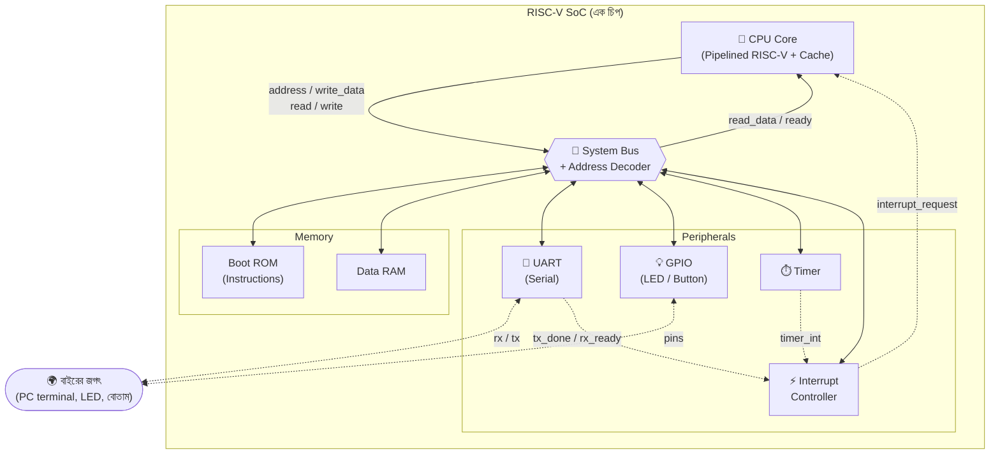
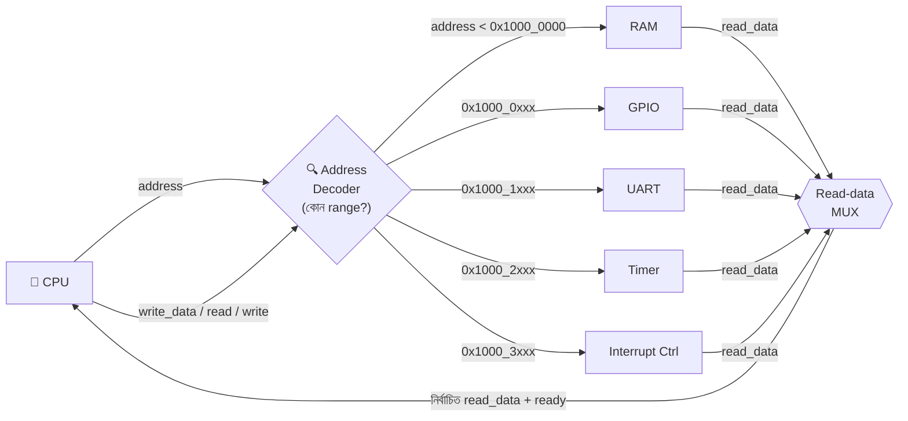

# 🖥️ Chapter 19: Build Your Own Complete Computer System
## From CPU to SoC - A Real Working Computer with I/O!

> **"You built the CPU. Now add PERIPHERALS. Time to make a REAL COMPUTER!"**
>
> **"তুমি CPU বানিয়েছো। এবার PERIPHERALS যোগ করো। REAL COMPUTER বানাও!"**

---

## 🎯 এই Chapter এ তুমি বানাবে:

```
✅ UART (Serial Communication) - talk to computer
✅ GPIO (Input/Output) - LEDs, buttons
✅ Interrupt Controller - handle events
✅ Timer - time management
✅ Memory-Mapped I/O - unified address space
✅ Complete SoC - System-on-Chip
✅ Working Computer - interact with world!
✅ তোমার complete system! 🎉
```

**Time Required:** 2 weeks (8-10 hours/day)  
**Prerequisites:** Chapters 12-18 complete

---

## 🚀 Quick Understanding - From CPU to Computer!

### একটা Computer System আসলে কী?

এতদিন তুমি যা বানিয়েছো সেটা অসাধারণ — একটা পুরো RISC-V CPU, যেটা instruction
fetch করে, decode করে, ALU দিয়ে হিসাব করে, register-এ ফলাফল লেখে। কিন্তু একটা
সত্যি কথা বলি: **CPU একা বসে থাকলে সে অন্ধ আর বোবা।** সে দুনিয়ার সাথে কথা বলতে
পারে না, কারো কথা শুনতে পারে না, সময়ের হিসাব রাখতে পারে না।

ভাবো তো — তোমার মস্তিষ্ক যত শক্তিশালীই হোক, যদি চোখ, কান, হাত, মুখ না থাকে
তাহলে সে বাইরের জগতের সাথে কিছুই করতে পারবে না। CPU-র অবস্থাও ঠিক তাই। তাকে
একটা **সম্পূর্ণ computer** বানাতে হলে তার চারপাশে আরো কিছু অঙ্গ লাগাতে হবে:

```
CPU একা যথেষ্ট নয়!

দরকার:
✅ CPU (processor)        ← এটা তুমি বানিয়েছো! (মস্তিষ্ক)
✅ Memory (cache + RAM)   ← এটাও বানিয়েছো!     (স্মৃতি)
✅ Input devices (keyboard, buttons)   ← কান/চোখ
✅ Output devices (screen, LEDs)       ← মুখ/হাত
✅ Communication (UART, SPI, I2C)      ← ভাষা
✅ Timers (delays, scheduling)         ← সময়জ্ঞান
✅ Interrupts (event handling)         ← চমকে ওঠার ক্ষমতা

সব মিলে = COMPLETE COMPUTER! 🖥️
```

এই বাড়তি অঙ্গগুলোকে আমরা বলি **peripheral** (পেরিফেরাল) — অর্থাৎ CPU-র "প্রান্তে"
বসে থাকা সহকারী মডিউল। UART কথা বলে, GPIO আলো জ্বালায় বা বোতাম পড়ে, Timer
সময় গোনে, Interrupt Controller জরুরি ঘটনা ঘটলে CPU-কে খবর দেয়। আর এই সব কিছুকে
একসাথে জুড়ে রাখে একটা **bus** — তথ্যের রাজপথ।

> 💡 **মূল intuition:** CPU হলো মাথা, peripheral গুলো হলো ইন্দ্রিয়, আর bus হলো
> স্নায়ুতন্ত্র (nervous system) — যেটা মাথা থেকে ইন্দ্রিয়ে আর ইন্দ্রিয় থেকে
> মাথায় সংকেত বয়ে নিয়ে যায়। এই তিনটা একসাথে হলেই কেবল একটা জড় চিপ "জীবন্ত
> computer" হয়ে ওঠে।

### System-on-Chip (SoC):

আগের যুগে computer-এর প্রতিটা অংশ ছিল আলাদা চিপ — একটা চিপে CPU, একটা চিপে
memory, আরেকটা চিপে I/O controller। সেগুলোকে মাদারবোর্ডে তার দিয়ে জোড়া লাগানো
হতো। কিন্তু আজকের দিনে এই **সব কিছু একটাই সিলিকন চিপের ভেতরে** ঢুকিয়ে দেওয়া
যায়। এটাকেই বলে **System-on-Chip (SoC)** — মানে "এক চিপেই গোটা সিস্টেম"।

তোমার ফোনের ভেতরের Snapdragon, Apple-এর M-series, Raspberry Pi-এর Broadcom চিপ,
এমনকি ছোট্ট Arduino-র ATmega — এগুলো সবই SoC। এই chapter-এ তুমি ঠিক একই জিনিস
বানাবে, শুধু ছোট স্কেলে: একটা চিপে CPU + memory + চারটা peripheral + bus।

```
এক চিপের ভেতরে সব কিছু:
┌──────────────────────────────────────┐
│            RISC-V SoC                 │
├──────────────────────────────────────┤
│  CPU Core (Pipelined + Cache)        │
├──────────────────────────────────────┤
│  Memory (ROM + RAM)                  │
├──────────────────────────────────────┤
│  Peripherals:                        │
│    - UART (Serial)                   │
│    - GPIO (I/O pins)                 │
│    - Timer                           │
│    - Interrupt Controller            │
├──────────────────────────────────────┤
│  Bus (সব কিছু জুড়ে রাখে)             │
└──────────────────────────────────────┘

Raspberry Pi, Arduino — সব এভাবেই বানানো!
```

এবার এই স্তরগুলোকে একটা সত্যিকারের **block diagram** হিসেবে দেখি — কে কার সাথে
কীভাবে যুক্ত। নিচের ছবিতে খেয়াল করো: CPU সরাসরি কোনো peripheral-এর সাথে যুক্ত
নয়। CPU কথা বলে **শুধু bus-এর সাথে**, আর bus সিদ্ধান্ত নেয় কোন কথাটা কার কাছে
যাবে। এটাই SoC-র মূল কাঠামো।



> 💡 এই ছবিটা পুরো chapter-এর **মানচিত্র**। প্রতিটা section-এ আমরা এই ছবির একটা
> করে box-এর ভেতরে ঢুকব: প্রথমে peripheral গুলো (UART, GPIO, Timer, IntC),
> তারপর bus, তারপর সব কিছু এক জায়গায় জোড়া লাগিয়ে পূর্ণ SoC। যখনই হারিয়ে যাবে
> মনে হবে, এই ছবিতে ফিরে এসো — দেখো এখন কোন box-এ আছো।

### Memory-Mapped I/O:

এখন আসছি এই পুরো chapter-এর সবচেয়ে সুন্দর ধারণাটায় — **memory-mapped I/O**।
প্রশ্নটা হলো: CPU কীভাবে UART বা LED-র সাথে কথা বলবে? RISC-V-এ তো আলাদা করে
কোনো "UART-এ লেখো" বা "LED পড়ো" instruction নেই! তোমার CPU চেনে শুধু `LW`
(load word) আর `SW` (store word) — যেগুলো memory থেকে পড়ে আর memory-তে লেখে।

এখানেই আসে একটা চমৎকার কৌশল। আমরা প্রতিটা peripheral-কে **একটা করে নকল memory
ঠিকানা (address)** দিয়ে দিই। CPU যখন ঐ ঠিকানায় `SW` করে, ঠিকানাটা আসলে কোনো RAM
cell-এ যায় না — যায় peripheral-এর register-এ। আর peripheral সেই ডেটা দেখে কাজ
করে (যেমন UART বাইটটা serial line-এ পাঠিয়ে দেয়)। CPU-র কাছে মনে হয় সে শুধু
memory-তেই লিখছে; কিন্তু আসলে সে একটা যন্ত্রকে আদেশ দিচ্ছে।

এটাকে বলে **memory-mapped I/O** — অর্থাৎ I/O যন্ত্রগুলোকে memory-র ঠিকানার মানচিত্রে
(map) বসিয়ে দেওয়া। এর বিশাল সুবিধা: তোমার CPU-তে একটাও বাড়তি instruction
যোগ করতে হয় না! `LW`/`SW` দিয়েই সব peripheral চালানো যায়।

```
একটাই unified address space:
0x00000000 - 0x00003FFF: Boot ROM (16KB)
0x00004000 - 0x0000FFFF: RAM (48KB)
0x10000000 - 0x10000FFF: GPIO
0x10001000 - 0x10001FFF: UART
0x10002000 - 0x10002FFF: Timer
0x10003000 - 0x10003FFF: Interrupt Ctrl

Memory-র মতো করেই access করো:
LW x5, 0x10001000(x0)  # UART পড়ো
SW x6, 0x10000000(x0)  # GPIO তে লেখো

সহজ! Unified! শক্তিশালী!
```

পুরো **address map** টা একটা পরিষ্কার table-এ দেখি। প্রতিটা সারি একটা করে
ঠিকানার পরিসর (range), আর প্রতিটা পরিসর একটা নির্দিষ্ট জিনিসের দখলে। খেয়াল
করো — memory আছে নিচের দিকে (`0x0...`) আর peripheral গুলো অনেক উঁচুতে
(`0x1000_0000` থেকে)। এই ফাঁকটা ইচ্ছে করেই রাখা, যাতে address decode করা সহজ হয়:

| Address পরিসর (range) | আকার | কে দখল করে আছে | কাজ |
|---|---|---|---|
| `0x00000000 – 0x00003FFF` | 16 KB | **Boot ROM** | যে program চলবে (instructions) |
| `0x00004000 – 0x0000FFFF` | 48 KB | **RAM** | ভেরিয়েবল, stack, ডেটা |
| `0x10000000 – 0x10000FFF` | 4 KB | **GPIO** | LED জ্বালানো, বোতাম পড়া |
| `0x10001000 – 0x10001FFF` | 4 KB | **UART** | serial-এ লেখা/পড়া |
| `0x10002000 – 0x10002FFF` | 4 KB | **Timer** | সময় গোনা, periodic interrupt |
| `0x10003000 – 0x10003FFF` | 4 KB | **Interrupt Ctrl** | কোন peripheral CPU-কে ডাকছে |

> 💡 **চাবিকাঠি:** ঠিকানার উপরের কয়েকটা bit দেখেই বলে দেওয়া যায় কথাটা কার জন্য।
> ঠিকানা `0x1000_0000`-এর নিচে হলে → memory; তা না হলে দ্বিতীয় hex digit বলে দেয়
> কোন peripheral (`0`=GPIO, `1`=UART, `2`=Timer, `3`=IntC)। এই "ঠিকানা দেখে
> গন্তব্য ঠিক করা"-র কাজটাই হলো **address decoding**, যেটা bus করে — section ১৯.৫-এ
> বিস্তারিত দেখব।

🎉 **এই chapter = একটা COMPLETE WORKING COMPUTER!**

---

## ১৯.১ UART (Universal Asynchronous Receiver/Transmitter)

### UART আসলে কী?

চলো প্রথম peripheral দিয়ে শুরু করি — UART, তোমার computer-এর **মুখ আর কান**।
এর মাধ্যমেই তোমার SoC তোমার laptop-এর সাথে কথা বলবে: program-এর `printf` এর লেখা
তোমার terminal-এ ফুটে উঠবে, আর তুমি keyboard-এ যা টাইপ করবে তা SoC শুনতে পাবে।
প্রথমবার যখন নিজের বানানো চিপ থেকে স্ক্রিনে "Hello, World!" দেখবে — সেই অনুভূতিটা
ভোলার মতো না!

UART-এর পুরো নাম **Universal Asynchronous Receiver/Transmitter**। নামটা ভাঙি:

- **Serial** — ডেটা যায় **একটা একটা bit করে**, একটা মাত্র তারের ওপর দিয়ে, একের
  পর এক। তুলনায় parallel-এ ৮টা bit ৮টা আলাদা তারে একসাথে যেত। Serial ধীর, কিন্তু
  তারের সংখ্যা মাত্র দুটো (TX আর RX) — তাই সস্তা আর সহজ।
- **Asynchronous** — পাঠানো আর পাওয়ার মধ্যে **আলাদা কোনো clock তার নেই**। তাহলে
  receiver বুঝবে কীভাবে কখন bit পড়তে হবে? দুপক্ষ আগে থেকেই একটা গতিতে রাজি
  হয়ে থাকে — সেটার নাম **baud rate** (যেমন 115200 bit/সেকেন্ড)। দুজনেই একই
  ঘড়ির গতিতে চললে আলাদা clock তার লাগে না।

একটা চিঠির খামের সাথে তুলনা করো। লাইন স্বাভাবিক অবস্থায় থাকে high (১)। transmit
শুরু হলে প্রথমে যায় একটা **start bit** (০) — "সাবধান, বার্তা আসছে!"। তারপর ৮টা
**data bit** (আসল বাইট)। শেষে একটা **stop bit** (১) — "শেষ হলো"। receiver
start bit-এর পতন (high→low) দেখে জেগে ওঠে, তারপর baud rate ধরে ঠিক সময়ে সময়ে
bit গুলো পড়ে নেয়।

```
UART = Serial communication
এক সময়ে এক bit করে data পাঠানো/পাওয়া
USB-Serial দিয়ে computer-এর সাথে যুক্ত

ব্যবহার:
✅ Debug output (printf)
✅ Terminal communication
✅ Text পাঠানো/পাওয়া
✅ Program upload
✅ Console interface

Embedded systems-এ একদম standard!
```

UART-এর ভেতরে তিনটা আলাদা যন্ত্র কাজ করে, প্রতিটাকে আলাদা করে চিনে রাখো —
নিচের কোডে ঠিক এই তিনটাই পাবে:

| অংশ | কাজ |
|---|---|
| **Baud rate generator** | ঠিক গতিতে "tick" বানায় — প্রতি bit-এর সময় মেপে দেয় |
| **Transmitter (TX)** | বাইটটাকে start + ৮ data + stop bit-এ সাজিয়ে একটা একটা করে বের করে দেয় |
| **Receiver (RX)** | লাইন থেকে আসা bit গুলো শুনে আবার একটা পূর্ণ বাইটে জোড়া লাগায় |

### UART Implementation:

নিচের কোডে ঠিক উপরের তিনটা অংশই খুঁজে পাবে। **Baud rate generator** হিসাব করে
`BAUD_DIV = CLOCK_FREQ / BAUD_RATE` — অর্থাৎ এক bit পাঠাতে clock-এর কয়টা ধাপ
লাগবে — তারপর সেই সংখ্যক ধাপ পরপর একটা `baud_tick` তোলে। **Transmitter** এই
tick-এর তালে তালে `tx_shift` register থেকে একটা একটা bit `tx` পিনে বের করে।
**Receiver** আগে RX সিগন্যালকে দুই flip-flop দিয়ে synchronize করে (metastability
এড়াতে), start bit ধরে, তারপর bit জমিয়ে `rx_data`-তে পূর্ণ বাইট বানায়।

```verilog
module uart #(
    parameter CLOCK_FREQ = 50000000,  // 50 MHz
    parameter BAUD_RATE = 115200       // Standard baud rate
)(
    input wire clk,
    input wire reset,
    // CPU interface
    input wire [31:0] address,
    input wire [31:0] write_data,
    input wire write_enable,
    input wire read_enable,
    output reg [31:0] read_data,
    // UART pins
    input wire rx,
    output wire tx,
    // Interrupt
    output reg tx_done,
    output reg rx_ready
);
    // Baud rate generator
    localparam BAUD_DIV = CLOCK_FREQ / BAUD_RATE;
    reg [15:0] baud_counter;
    reg baud_tick;
    
    always @(posedge clk or posedge reset) begin
        if (reset) begin
            baud_counter <= 0;
            baud_tick <= 0;
        end else begin
            if (baud_counter >= BAUD_DIV - 1) begin
                baud_counter <= 0;
                baud_tick <= 1;
            end else begin
                baud_counter <= baud_counter + 1;
                baud_tick <= 0;
            end
        end
    end
    
    // Transmitter
    reg [7:0] tx_data;
    reg tx_start;
    reg tx_busy;
    reg [3:0] tx_bit_count;
    reg [9:0] tx_shift;
    
    assign tx = tx_shift[0];
    
    always @(posedge clk or posedge reset) begin
        if (reset) begin
            tx_shift <= 10'b1111111111;
            tx_busy <= 0;
            tx_bit_count <= 0;
            tx_done <= 0;
        end else begin
            tx_done <= 0;
            
            if (tx_start && !tx_busy) begin
                // Start transmission
                tx_shift <= {1'b1, tx_data, 1'b0};  // Stop, Data, Start
                tx_busy <= 1;
                tx_bit_count <= 0;
            end else if (tx_busy && baud_tick) begin
                if (tx_bit_count < 9) begin
                    tx_shift <= {1'b1, tx_shift[9:1]};
                    tx_bit_count <= tx_bit_count + 1;
                end else begin
                    tx_busy <= 0;
                    tx_done <= 1;
                end
            end
        end
    end
    
    // Receiver
    reg [7:0] rx_data;
    reg rx_busy;
    reg [3:0] rx_bit_count;
    reg [8:0] rx_shift;
    reg rx_sync, rx_sync2;
    
    // Synchronize RX
    always @(posedge clk) begin
        rx_sync <= rx;
        rx_sync2 <= rx_sync;
    end
    
    always @(posedge clk or posedge reset) begin
        if (reset) begin
            rx_busy <= 0;
            rx_bit_count <= 0;
            rx_ready <= 0;
            rx_data <= 0;
        end else begin
            if (!rx_busy && !rx_sync2) begin
                // Start bit detected
                rx_busy <= 1;
                rx_bit_count <= 0;
                rx_ready <= 0;
            end else if (rx_busy && baud_tick) begin
                if (rx_bit_count < 8) begin
                    rx_shift <= {rx_sync2, rx_shift[8:1]};
                    rx_bit_count <= rx_bit_count + 1;
                end else begin
                    // Stop bit
                    rx_data <= rx_shift[7:0];
                    rx_ready <= 1;
                    rx_busy <= 0;
                end
            end
        end
    end
    
    // Register interface
    localparam UART_DATA = 2'b00;
    localparam UART_STATUS = 2'b01;
    
    wire [1:0] reg_addr = address[3:2];
    
    always @(posedge clk or posedge reset) begin
        if (reset) begin
            tx_start <= 0;
        end else begin
            tx_start <= 0;
            
            if (write_enable) begin
                case (reg_addr)
                    UART_DATA: begin
                        tx_data <= write_data[7:0];
                        tx_start <= 1;
                    end
                endcase
            end
        end
    end
    
    always @(*) begin
        case (reg_addr)
            UART_DATA: read_data = {24'h0, rx_data};
            UART_STATUS: read_data = {30'h0, tx_busy, rx_ready};  // bit0=rx_ready, bit1=tx_busy
            default: read_data = 32'h0;
        endcase
    end
endmodule
```

### UART-এর Register Map

CPU UART-কে দেখে দুটো register হিসেবে — মনে রাখো, এগুলো memory-mapped, তাই CPU
এদের সাধারণ ঠিকানার মতো করেই পড়ে/লেখে। কোডের ভেতরে `reg_addr = address[3:2]`
দিয়ে ঠিক করা হয় কোন register: ঠিকানার `[3:2]` bit `00` হলে DATA, `01` হলে STATUS:

| Offset | নাম | Access | বর্ণনা |
|---|---|---|---|
| `+0x0` (`0x10001000`) | **DATA** | Write → পাঠাও | লেখা byte transmit হয়; পড়লে শেষ পাওয়া byte |
| `+0x4` (`0x10001004`) | **STATUS** | Read | কাজ চলছে কিনা জানায় (নিচের bit দেখো) |

এই STATUS register-টা **সবচেয়ে জরুরি ধারণা**, তাই আলাদা করে bit-layout দেখি।
লক্ষ্য করো কোডে লেখা `{30'h0, tx_busy, rx_ready}` — অর্থাৎ সবচেয়ে নিচের bit
(bit 0) হলো `rx_ready`, তার ওপরের bit (bit 1) হলো `tx_busy`:

| Bit | নাম | মানে |
|---|---|---|
| **bit 0** | `rx_ready` | ১ = একটা নতুন byte এসে গেছে, পড়ে নাও |
| **bit 1** | `tx_busy` | ১ = এখনো আগের byte পাঠানো চলছে, অপেক্ষা করো |
| bit 2–31 | — | অব্যবহৃত (সবসময় ০) |

> 💡 এজন্যই software-এ byte পাঠানোর আগে আমরা লিখি `while (status & 0x2);` —
> অর্থাৎ bit 1 (`tx_busy`) ০ না হওয়া পর্যন্ত অপেক্ষা করো। এই "অপেক্ষা করে
> তারপর কাজ"-কে বলে **polling**। section ১৯.৭-এর `uart_putc()` ফাংশনে এটা ঠিক
> এভাবেই কাজ করতে দেখবে। তখন এই table-এ ফিরে এসো — hardware আর software একদম
> মিলে যাবে।

---

## ১৯.২ GPIO (General Purpose Input/Output)

GPIO হলো তোমার computer-এর **হাত আর চোখ** — সবচেয়ে সহজ অথচ সবচেয়ে মজার
peripheral। এর পুরো নাম **General Purpose Input/Output**: একগুচ্ছ পিন (এখানে ৩২টা),
যার প্রতিটাকে তুমি ইচ্ছেমতো **output** বানাতে পারো (LED জ্বালাতে) বা **input**
বানাতে পারো (বোতাম/সুইচ পড়তে)। "General purpose" মানেই — কোনো নির্দিষ্ট কাজে
বাঁধা নেই, যা খুশি জোড়ো।

প্রতিটা পিনের একটা **দিক (direction)** আছে: সে কি বাইরে সংকেত পাঠাবে (output),
নাকি বাইরে থেকে সংকেত পড়বে (input)? এই দিকটাই ঠিক করে দেয় **direction register**
(কোডে `gpio_dir`) — কোনো bit ১ হলে সেই পিন output, ০ হলে input। তাই LED জ্বালানোর
আগে দুটো ধাপ: (১) পিনটাকে output বানাও (direction-এ ১ লেখো), (২) data register-এ
১ লেখো।

### GPIO Implementation:

নিচের কোডে তিনটা জিনিস খেয়াল করো। **এক**, input পিনগুলো সরাসরি না পড়ে আগে
`gpio_input_sync`-এ একবার register করে নেওয়া হয় — কারণ বাইরের বোতাম তোমার
clock-এর সাথে তাল মিলিয়ে চাপে না, তাই synchronize না করলে metastability হতে পারে।
**দুই**, output লাইনে `gpio_out = gpio_data & gpio_dir` — অর্থাৎ একটা পিন তখনই
সত্যিকারের সংকেত পাঠায় যখন তার direction ১ (output); input পিন কখনো জোর করে
লাইন চালায় না। **তিন**, পড়ার সময় তিনটা আলাদা register পাওয়া যায় — DATA, DIR,
আর INPUT (লাইভ বোতামের মান)।

```verilog
module gpio #(
    parameter NUM_PINS = 32
)(
    input wire clk,
    input wire reset,
    // CPU interface
    input wire [31:0] address,
    input wire [31:0] write_data,
    input wire write_enable,
    input wire read_enable,
    output reg [31:0] read_data,
    // GPIO pins
    input wire [NUM_PINS-1:0] gpio_in,
    output reg [NUM_PINS-1:0] gpio_out,
    output reg [NUM_PINS-1:0] gpio_dir  // 0=input, 1=output
);
    // Registers
    reg [NUM_PINS-1:0] gpio_data;
    reg [NUM_PINS-1:0] gpio_input_sync;
    
    // Register map
    localparam GPIO_DATA = 2'b00;      // R/W: GPIO data
    localparam GPIO_DIR = 2'b01;       // R/W: Direction
    localparam GPIO_INPUT = 2'b10;     // R: Input values
    
    wire [1:0] reg_addr = address[3:2];
    
    // Synchronize inputs
    always @(posedge clk) begin
        gpio_input_sync <= gpio_in;
    end
    
    // Output logic
    always @(posedge clk or posedge reset) begin
        if (reset) begin
            gpio_data <= 0;
            gpio_dir <= 0;
        end else if (write_enable) begin
            case (reg_addr)
                GPIO_DATA: gpio_data <= write_data[NUM_PINS-1:0];
                GPIO_DIR: gpio_dir <= write_data[NUM_PINS-1:0];
            endcase
        end
    end
    
    // Assign outputs
    always @(*) begin
        gpio_out = gpio_data & gpio_dir;  // Only output if dir=1
    end
    
    // Read logic
    always @(*) begin
        case (reg_addr)
            GPIO_DATA: read_data = {{(32-NUM_PINS){1'b0}}, gpio_data};
            GPIO_DIR: read_data = {{(32-NUM_PINS){1'b0}}, gpio_dir};
            GPIO_INPUT: read_data = {{(32-NUM_PINS){1'b0}}, gpio_input_sync};
            default: read_data = 32'h0;
        endcase
    end
endmodule
```

### GPIO-র Register Map

GPIO তিনটা register দেখায় (আবারও `address[3:2]` দিয়ে নির্বাচন):

| Offset | নাম | Access | বর্ণনা |
|---|---|---|---|
| `+0x0` (`0x10000000`) | **DATA** | R/W | output পিনে কী মান যাবে (LED on/off) |
| `+0x4` (`0x10000004`) | **DIR** | R/W | প্রতিটা পিনের দিক — ১=output, ০=input |
| `+0x8` (`0x10000008`) | **INPUT** | R | পিনে এখন বাইরে থেকে আসা লাইভ মান (বোতাম) |

> 💡 কেন DATA আর INPUT আলাদা? DATA হলো তুমি যা **লিখতে চাও** (output), আর INPUT
> হলো বাইরের জগৎ থেকে যা **আসছে** (বোতামের চাপ)। একটা পিনকে output বানালে DATA
> পড়লে নিজের লেখা মানই ফেরত পাবে; কিন্তু বোতাম পড়তে হলে INPUT register পড়তে হবে।

---

## ১৯.৩ Timer

Timer হলো তোমার computer-এর **ঘড়ি আর অ্যালার্ম** — সময়জ্ঞান। CPU নিজে সময় মাপতে
পারে না; সে শুধু instruction চালায়। কিন্তু বাস্তব কাজে সময়ের হিসাব দরকার হয়
পদে পদে: "প্রতি ১ সেকেন্ডে LED জ্বালাও-নেভাও", "০.৫ সেকেন্ড অপেক্ষা করো", "প্রতি
১০ মিলিসেকেন্ডে একবার sensor পড়ো"। এই সব কাজের পেছনে থাকে একটা timer।

ভেতরের কৌশলটা চমৎকার সরল — একটা **counter** যেটা প্রতি clock-এ এক করে বাড়ে।
clock-এর গতি জানা আছে (যেমন 27 MHz), তাই গুনে গুনে সময় বের করা যায়: যদি প্রতি
সেকেন্ডে ২ কোটি ৭০ লক্ষ tick হয়, তাহলে ২ কোটি ৭০ লক্ষ গুনলেই ১ সেকেন্ড পার!

দুটো বাড়তি অংশ এটাকে আরো কাজের করে তোলে — কোডে দুটোই পাবে:

- **Compare register** — তুমি একটা লক্ষ্য সংখ্যা সেট করো। counter সেই সংখ্যায়
  পৌঁছালে timer একটা **interrupt** তোলে আর counter আবার ০ থেকে শুরু করে। এভাবে
  একদম নিয়মিত (periodic) সংকেত পাওয়া যায় — যেমন প্রতি ১ সেকেন্ডে একটা "টিক"।
- **Prescaler** — counter খুব দ্রুত বাড়ে (clock-এর গতিতে)। বড় সময় মাপতে হলে
  সংখ্যাটা বিশাল হয়ে যায়। prescaler আগে clock-কে "ভাগ" করে ধীর করে দেয় — যেমন
  প্রতি ১০০০ clock-এ একবার counter বাড়াও — যাতে ছোট সংখ্যাতেও বড় সময় মাপা যায়।

### Timer Implementation:

নিচের কোডে লক্ষ্য করো prescaler কীভাবে কাজ করে: প্রতি clock-এ `prescaler_count`
বাড়ে, আর সেটা `prescaler`-এ পৌঁছালে তবেই আসল `counter` এক ধাপ এগোয়। তারপর
`counter >= compare` হলে `timer_interrupt` ১ হয় (এক clock-এর জন্য) এবং counter
আবার ০-তে রিসেট হয়ে নতুন চক্র শুরু করে।

```verilog
module timer(
    input wire clk,
    input wire reset,
    // CPU interface
    input wire [31:0] address,
    input wire [31:0] write_data,
    input wire write_enable,
    input wire read_enable,
    output reg [31:0] read_data,
    // Interrupt
    output reg timer_interrupt
);
    // Registers
    reg [31:0] counter;
    reg [31:0] compare;
    reg enable;
    reg [31:0] prescaler;
    reg [31:0] prescaler_count;
    
    // Register map
    localparam TIMER_COUNTER = 2'b00;   // R/W: Current count
    localparam TIMER_COMPARE = 2'b01;   // R/W: Compare value
    localparam TIMER_CONTROL = 2'b10;   // R/W: Control register
    localparam TIMER_PRESCALER = 2'b11; // R/W: Prescaler
    
    wire [1:0] reg_addr = address[3:2];
    
    // Timer logic
    always @(posedge clk or posedge reset) begin
        if (reset) begin
            counter <= 0;
            compare <= 32'hFFFFFFFF;
            enable <= 0;
            prescaler <= 0;
            prescaler_count <= 0;
            timer_interrupt <= 0;
        end else begin
            timer_interrupt <= 0;
            
            // Handle writes
            if (write_enable) begin
                case (reg_addr)
                    TIMER_COUNTER: counter <= write_data;
                    TIMER_COMPARE: compare <= write_data;
                    TIMER_CONTROL: enable <= write_data[0];
                    TIMER_PRESCALER: prescaler <= write_data;
                endcase
            end
            
            // Counter logic
            if (enable) begin
                if (prescaler_count >= prescaler) begin
                    prescaler_count <= 0;
                    counter <= counter + 1;
                    
                    // Check for match
                    if (counter >= compare) begin
                        counter <= 0;
                        timer_interrupt <= 1;
                    end
                end else begin
                    prescaler_count <= prescaler_count + 1;
                end
            end
        end
    end
    
    // Read logic
    always @(*) begin
        case (reg_addr)
            TIMER_COUNTER: read_data = counter;
            TIMER_COMPARE: read_data = compare;
            TIMER_CONTROL: read_data = {31'h0, enable};
            TIMER_PRESCALER: read_data = prescaler;
            default: read_data = 32'h0;
        endcase
    end
endmodule
```

### Timer-এর Register Map

Timer চারটা register দেখায়:

| Offset | নাম | Access | বর্ণনা |
|---|---|---|---|
| `+0x0` (`0x10002000`) | **COUNTER** | R/W | এখনকার গণনা; লিখলে counter রিসেট/সেট হয় |
| `+0x4` (`0x10002004`) | **COMPARE** | R/W | লক্ষ্য সংখ্যা — এতে পৌঁছালে interrupt |
| `+0x8` (`0x10002008`) | **CONTROL** | R/W | bit 0 = enable (১ হলে timer চলে) |
| `+0xC` (`0x1000200C`) | **PRESCALER** | R/W | clock কত ভাগ করে counter বাড়বে |

> 💡 কাজে লাগানোর ক্রম: COMPARE-এ লক্ষ্য লেখো → (দরকার হলে) PRESCALER সেট করো →
> CONTROL-এ ১ লিখে timer চালু করো। তারপর counter আপনাআপনি বাড়তে থাকবে আর
> COMPARE-এ পৌঁছালেই interrupt তুলবে। section ১৯.৭-এর Timer Interrupt উদাহরণে
> ঠিক এই ক্রমটাই দেখবে।

---

## ১৯.৪ Interrupt Controller

এখন আসছি সবচেয়ে চতুর peripheral-এ — Interrupt Controller, তোমার computer-এর
**চমকে ওঠার ক্ষমতা**। একটা প্রশ্ন দিয়ে শুরু করি: timer যখন "টিক" করে বা UART-এ
নতুন byte আসে, CPU কীভাবে জানবে?

একটা সহজ উপায় হলো **polling** — CPU বারবার লুপে গিয়ে status পড়ে দেখে "কিছু
হয়েছে কি? না? আবার দেখি..."। কিন্তু এটা অপচয়; CPU সময় নষ্ট করে শুধু খোঁজ
নিতে নিতে। বাস্তব জীবনে তুমি কি দরজার সামনে দাঁড়িয়ে প্রতি সেকেন্ডে দরজা খুলে
দেখো অতিথি এসেছে কিনা? না — তুমি নিজের কাজ করো, অতিথি এলে **কলিং বেল বাজে**, তখন
তুমি কাজ থামিয়ে দরজা খোলো, তারপর আবার কাজে ফিরে আসো।

**Interrupt** হলো ঠিক সেই কলিং বেল। কোনো peripheral-এর কিছু ঘটলে সে CPU-কে একটা
সংকেত পাঠায়; CPU তখন চলতি কাজ থামিয়ে একটা বিশেষ ফাংশন (**ISR** — Interrupt
Service Routine) চালায়, কাজ সেরে আবার ঠিক যেখানে ছিল সেখানে ফিরে আসে।

কিন্তু একটা সমস্যা: CPU-র তো একটাই "কলিং বেল" তার, অথচ peripheral অনেকগুলো
(UART, Timer, ...)। কে বেল বাজাল? এখানেই আসে **Interrupt Controller**। সে সব
peripheral-এর interrupt লাইন একসাথে শোনে, **priority** অনুযায়ী সবচেয়ে জরুরিটা
বেছে নেয়, আর CPU-কে একটাই সংকেত দিয়ে বলে "X নম্বর interrupt এসেছে"। তিনটা ধাপ:

| ধাপ | কাজ |
|---|---|
| **Latch (ধরে রাখা)** | interrupt এলে `pending` bit তুলে রাখে, যাতে CPU দেরিতে দেখলেও মিস না হয় |
| **Mask (ছাঁকা)** | `enable` register দিয়ে শুধু যেগুলো software চায় সেগুলোই CPU-তে যায় |
| **Priority encode** | একসাথে অনেকগুলো এলে সবচেয়ে গুরুত্বপূর্ণটা বেছে CPU-কে জানায় |

### Interrupt Controller:

নিচের কোডে এই তিন ধাপ মিলিয়ে নাও। `interrupt_pending <= interrupt_pending |
interrupt_sources` লাইনটা নতুন interrupt **latch** করে রাখে। priority encoder-এর
লুপ (`for i = 7 downto 0`) সব pending-আর-enabled bit-এর মধ্যে সবচেয়ে বড় index-টা
বেছে `interrupt_id`-তে রাখে — মানে বড় নম্বরের interrupt-এর priority বেশি। আর
software `INT_ACK`-এ লিখে কোনো interrupt-কে "দেখা হয়ে গেছে" বলে clear করতে পারে।

```verilog
module interrupt_controller(
    input wire clk,
    input wire reset,
    // CPU interface
    input wire [31:0] address,
    input wire [31:0] write_data,
    input wire write_enable,
    input wire read_enable,
    output reg [31:0] read_data,
    // Interrupt sources
    input wire [7:0] interrupt_sources,
    // CPU interrupt
    output reg interrupt_request,
    output reg [7:0] interrupt_id,
    input wire interrupt_ack
);
    // Registers
    reg [7:0] interrupt_enable;
    reg [7:0] interrupt_pending;
    reg [7:0] interrupt_priority [0:7];
    
    // Register map
    localparam INT_PENDING = 2'b00;   // R: Pending interrupts
    localparam INT_ENABLE = 2'b01;    // R/W: Enable mask
    localparam INT_PRIORITY = 2'b10;  // R/W: Priority (not used in simple)
    localparam INT_ACK = 2'b11;       // W: Acknowledge
    
    wire [1:0] reg_addr = address[3:2];
    
    // Latch interrupt sources
    always @(posedge clk or posedge reset) begin
        if (reset) begin
            interrupt_pending <= 0;
            interrupt_enable <= 0;
        end else begin
            // Latch new interrupts
            interrupt_pending <= interrupt_pending | interrupt_sources;
            
            // Handle writes
            if (write_enable) begin
                case (reg_addr)
                    INT_ENABLE: interrupt_enable <= write_data[7:0];
                    INT_ACK: interrupt_pending <= interrupt_pending & ~write_data[7:0];
                endcase
            end
        end
    end
    
    // Priority encoder (find highest priority interrupt)
    integer i;
    always @(*) begin
        interrupt_request = 0;
        interrupt_id = 0;
        
        for (i = 7; i >= 0; i = i - 1) begin
            if (interrupt_pending[i] && interrupt_enable[i]) begin
                interrupt_request = 1;
                interrupt_id = i;
            end
        end
    end
    
    // Read logic
    always @(*) begin
        case (reg_addr)
            INT_PENDING: read_data = {24'h0, interrupt_pending};
            INT_ENABLE: read_data = {24'h0, interrupt_enable};
            default: read_data = 32'h0;
        endcase
    end
endmodule
```

### Interrupt Controller-এর Register Map

| Offset | নাম | Access | বর্ণনা |
|---|---|---|---|
| `+0x0` (`0x10003000`) | **PENDING** | R | কোন কোন interrupt এসে অপেক্ষা করছে |
| `+0x4` (`0x10003004`) | **ENABLE** | R/W | mask — কোন interrupt CPU পর্যন্ত যাবে |
| `+0x8` (`0x10003008`) | **PRIORITY** | R/W | priority (এই সরল ভার্সনে ব্যবহৃত নয়) |
| `+0xC` (`0x1000300C`) | **ACK** | W | "দেখা হয়ে গেছে" — pending bit clear করে |

এই ৮টা interrupt লাইনের কোনটা কোন bit, সেটা SoC-তে ঠিক করা আছে (section ১৯.৬-এ
`interrupt_sources` লাইনটা দেখো)। মূল তিনটা:

| Bit | উৎস | কখন ওঠে |
|---|---|---|
| **bit 0** | `rx_ready` (UART) | নতুন byte এসেছে |
| **bit 1** | `tx_done` (UART) | byte পাঠানো শেষ |
| **bit 2** | `timer_int` (Timer) | counter COMPARE-এ পৌঁছেছে |
| bit 3–7 | — | অব্যবহৃত |

> ⚠️ **একটা গুরুত্বপূর্ণ note (technical flag, কোড ঠিক আছে):** এই chapter-এর CPU
> core (Chapter 17-এর pipelined RISC-V) **interrupt সার্ভিস করে না** — SoC-তে
> `assign interrupt_ack = 1'b0;` লেখা আছে আর কোডের কমেন্টেও বলা: "this core does
> not service interrupts"। মানে Interrupt Controller সঠিকভাবে interrupt **ধরে,
> জমায় আর রিপোর্ট করে**, কিন্তু CPU সেটা পেয়ে নিজে থেকে ISR-এ লাফ দেয় না।
> তাই section ১৯.৭-এর Timer Interrupt উদাহরণে `timer_isr()` আপনাআপনি চলবে না;
> ঐ pattern-টা ভবিষ্যতে CPU-তে interrupt সাপোর্ট যোগ করার নকশা হিসেবে রাখা।
> এখন interrupt status জানতে software-এ PENDING register **poll** করে নিতে পারো।

---

## ১৯.৫ Memory Bus & Address Decoder

এতক্ষণ আমরা আলাদা আলাদা অঙ্গ বানালাম। এবার দরকার **স্নায়ুতন্ত্র** — যেটা সবাইকে
জুড়বে। সেটাই **system bus**। আর bus-এর প্রধান কাজ একটাই, কিন্তু অসম্ভব জরুরি:
**address decoding** — অর্থাৎ CPU যে ঠিকানায় কথা বলছে, সেটা দেখে ঠিক করা কথাটা
কার কাছে যাবে।

মনে আছে memory-mapped I/O-র কথা? CPU শুধু একটা ঠিকানা আর "read/write" সংকেত
পাঠায় — সে জানেই না ওপাশে memory আছে নাকি UART। bus-ই গোয়েন্দার মতো ঠিকানা
পরীক্ষা করে সিদ্ধান্ত নেয়:

- ঠিকানা `0x1000_0000`-এর **নিচে**? → এটা memory; RAM-কে জাগাও।
- `0x1000_0000`–`0x1000_0FFF`? → GPIO।
- `0x1000_1000`–`0x1000_1FFF`? → UART।
- `0x1000_2000`–`0x1000_2FFF`? → Timer।
- `0x1000_3000`–`0x1000_3FFF`? → Interrupt Controller।

bus এই কাজটা দুই দিকে করে। **লেখার সময়** (write): শুধু নির্বাচিত গন্তব্যের
`select` সংকেত ১ করে, বাকিদের ০ — যাতে একসাথে দুজন একই data না নেয়। **পড়ার
সময়** (read): সব peripheral একসাথে নিজেদের `read_data` পাঠায়, কিন্তু bus একটা
বড় **mux** দিয়ে শুধু নির্বাচিত জনেরটা CPU-কে ফেরত দেয়। এই দিকনির্দেশনাটা
ছবিতে দেখো:



### System Bus:

নিচের কোডে decode লজিকটা সরাসরি দেখা যায় — প্রতিটা `_select` সংকেত একটা ঠিকানার
পরিসর পরীক্ষা করে (`address >= ... && address < ...`)। `mem_select` সত্য হয় যখন
ঠিকানা `0x1000_0000`-এর নিচে। নিচের `always @(*)` block-টাই হলো সেই **read-data
mux**: যে `_select` সত্য, তার `read_data` CPU-তে যায়। আর `ready` সংকেত খেয়াল
করো — peripheral সাথে সাথে উত্তর দেয় (`ready = 1`), কিন্তু memory নিজের
`mem_ready` দিয়ে বলে সে প্রস্তুত কিনা।

```verilog
module system_bus(
    input wire clk,
    input wire reset,
    // CPU interface
    input wire [31:0] address,
    input wire [31:0] write_data,
    input wire read_enable,
    input wire write_enable,
    output reg [31:0] read_data,
    output reg ready,
    // Memory interface
    output wire [31:0] mem_address,
    output wire [31:0] mem_write_data,
    output wire mem_read,
    output wire mem_write,
    input wire [31:0] mem_read_data,
    input wire mem_ready,
    // Peripheral interfaces
    output wire uart_select,
    output wire gpio_select,
    output wire timer_select,
    output wire intc_select,
    input wire [31:0] uart_read_data,
    input wire [31:0] gpio_read_data,
    input wire [31:0] timer_read_data,
    input wire [31:0] intc_read_data
);
    // Address decode
    wire mem_select = (address < 32'h10000000);
    assign uart_select = (address >= 32'h10001000) && (address < 32'h10002000);
    assign gpio_select = (address >= 32'h10000000) && (address < 32'h10001000);
    assign timer_select = (address >= 32'h10002000) && (address < 32'h10003000);
    assign intc_select = (address >= 32'h10003000) && (address < 32'h10004000);
    
    // Memory signals
    assign mem_address = address;
    assign mem_write_data = write_data;
    assign mem_read = read_enable && mem_select;
    assign mem_write = write_enable && mem_select;
    
    // Read data mux
    always @(*) begin
        if (mem_select)
            read_data = mem_read_data;
        else if (uart_select)
            read_data = uart_read_data;
        else if (gpio_select)
            read_data = gpio_read_data;
        else if (timer_select)
            read_data = timer_read_data;
        else if (intc_select)
            read_data = intc_read_data;
        else
            read_data = 32'h0;
    end
    
    // Ready signal
    always @(*) begin
        if (mem_select)
            ready = mem_ready;
        else
            ready = 1;  // Peripherals respond immediately
    end
endmodule
```

---

## ১৯.৬ Complete SoC Integration

এই মুহূর্তটার জন্যই এতক্ষণের সব পরিশ্রম! আমাদের কাছে এখন আছে CPU (আগের
chapter-গুলোর), চারটা peripheral, একটা bus, আর memory। এবার সবগুলোকে এক জায়গায়
জুড়ে একটা পূর্ণ **SoC** বানাব — chapter-এর শুরুর সেই block diagram-টা এবার
জীবন্ত Verilog হয়ে উঠবে।

ভাবো এটা একটা **wiring diagram** — অনেকটা electrician যেভাবে বাড়ির সব যন্ত্র এক
মিটার-বোর্ডে জোড়ে। `riscv_soc` মডিউলটা নিজে নতুন কোনো লজিক বানায় না; সে শুধু
আগের মডিউলগুলোকে `instantiate` করে আর তাদের তার (wire) ঠিকঠাক জোড়ে। কয়েকটা
গুরুত্বপূর্ণ সংযোগ আগে থেকেই বুঝে নাও, তাহলে কোডটা গল্পের মতো পড়া যাবে:

| সংযোগ | কে কার সাথে | কেন |
|---|---|---|
| `cpu_data_addr` → সবার `address` | CPU → bus + সব peripheral | একই ঠিকানা সবাই দেখে, কিন্তু কাজ করে শুধু নির্বাচিত জন |
| `cpu_write && uart_sel` | bus-এর select → peripheral-এর write | gating: শুধু নির্বাচিত peripheral-ই লেখা নেয় |
| `cpu_instr_addr` → `imem` | CPU-র PC → instruction memory | কোন instruction fetch হবে |
| `bus_mem_*` → `dmem` | bus → data memory | bus-এর গেট করা memory সংকেত (একাধিক driver এড়াতে আলাদা) |
| `interrupt_sources` | peripheral → IntC | কোন peripheral interrupt তুলেছে |

> 💡 খেয়াল করো প্রতিটা peripheral-এর `write_enable`-এ লেখা `cpu_write && xxx_sel` —
> এই **AND**-টাই হলো address decoding-এর শেষ ধাপ: CPU লিখতে চাইছে (`cpu_write`)
> **এবং** ঠিকানা এই peripheral-এর (`xxx_sel`), তবেই সে লেখা গ্রহণ করবে। এভাবে
> একটা `SW` ঠিক একটাই গন্তব্যে পৌঁছায়।

```verilog
module riscv_soc(
    input wire clk,
    input wire reset,
    // UART
    input wire uart_rx,
    output wire uart_tx,
    // GPIO
    input wire [31:0] gpio_in,
    output wire [31:0] gpio_out,
    // Debug
    output wire [31:0] pc_debug
);
    // CPU signals
    wire [31:0] cpu_instr_addr, cpu_data_addr;
    wire [31:0] cpu_write_data, cpu_read_data;
    wire cpu_read, cpu_write;
    wire cpu_ready;
    
    // Interrupt
    wire interrupt_request;
    wire [7:0] interrupt_id;
    wire interrupt_ack;
    
    // Memory system
    wire [31:0] mem_read_data;
    wire mem_ready;
    // Bus -> memory side (driven by the bus and gated by its address decode;
    // kept separate from the CPU's own request nets to avoid multiple drivers)
    wire [31:0] bus_mem_addr, bus_mem_wdata;
    wire bus_mem_read, bus_mem_write;
    
    // Peripheral data
    wire [31:0] uart_data, gpio_data, timer_data, intc_data;
    wire uart_sel, gpio_sel, timer_sel, intc_sel;
    
    // Interrupt sources
    wire uart_tx_done, uart_rx_ready;
    wire timer_int;
    wire [7:0] interrupt_sources = {5'b0, timer_int, uart_tx_done, uart_rx_ready};
    
    // Instruction memory (loads program.hex); the CPU exposes pc as the fetch address
    wire [31:0] cpu_instruction;
    wire [2:0]  cpu_data_funct3;
    instruction_memory imem(
        .address(cpu_instr_addr),
        .instruction(cpu_instruction)
    );

    // CPU Core = the Chapter-17 pipelined RISC-V (external memory interface)
    riscv_pipelined_with_hazards cpu(
        .clk(clk),
        .reset(reset),
        .cache_stall(1'b0),                 // single-cycle memory: never stalls
        .instruction(cpu_instruction),
        .data_address(cpu_data_addr),
        .data_write(cpu_write_data),
        .data_read_enable(cpu_read),
        .data_write_enable(cpu_write),
        .data_funct3(cpu_data_funct3),
        .data_read(cpu_read_data),
        .pc_debug(cpu_instr_addr)
    );
    assign pc_debug = cpu_instr_addr;
    assign interrupt_ack = 1'b0;            // this core does not service interrupts
    
    // System Bus
    system_bus bus(
        .clk(clk),
        .reset(reset),
        .address(cpu_data_addr),
        .write_data(cpu_write_data),
        .read_enable(cpu_read),
        .write_enable(cpu_write),
        .read_data(cpu_read_data),
        .ready(cpu_ready),
        .mem_address(bus_mem_addr),
        .mem_write_data(bus_mem_wdata),
        .mem_read(bus_mem_read),
        .mem_write(bus_mem_write),
        .mem_read_data(mem_read_data),
        .mem_ready(mem_ready),
        .uart_select(uart_sel),
        .gpio_select(gpio_sel),
        .timer_select(timer_sel),
        .intc_select(intc_sel),
        .uart_read_data(uart_data),
        .gpio_read_data(gpio_data),
        .timer_read_data(timer_data),
        .intc_read_data(intc_data)
    );
    
    // UART
    uart uart_inst(
        .clk(clk),
        .reset(reset),
        .address(cpu_data_addr),
        .write_data(cpu_write_data),
        .write_enable(cpu_write && uart_sel),
        .read_enable(cpu_read && uart_sel),
        .read_data(uart_data),
        .rx(uart_rx),
        .tx(uart_tx),
        .tx_done(uart_tx_done),
        .rx_ready(uart_rx_ready)
    );
    
    // GPIO
    gpio gpio_inst(
        .clk(clk),
        .reset(reset),
        .address(cpu_data_addr),
        .write_data(cpu_write_data),
        .write_enable(cpu_write && gpio_sel),
        .read_enable(cpu_read && gpio_sel),
        .read_data(gpio_data),
        .gpio_in(gpio_in),
        .gpio_out(gpio_out),
        .gpio_dir()
    );
    
    // Timer
    timer timer_inst(
        .clk(clk),
        .reset(reset),
        .address(cpu_data_addr),
        .write_data(cpu_write_data),
        .write_enable(cpu_write && timer_sel),
        .read_enable(cpu_read && timer_sel),
        .read_data(timer_data),
        .timer_interrupt(timer_int)
    );
    
    // Interrupt Controller
    interrupt_controller intc(
        .clk(clk),
        .reset(reset),
        .address(cpu_data_addr),
        .write_data(cpu_write_data),
        .write_enable(cpu_write && intc_sel),
        .read_enable(cpu_read && intc_sel),
        .read_data(intc_data),
        .interrupt_sources(interrupt_sources),
        .interrupt_request(interrupt_request),
        .interrupt_id(interrupt_id),
        .interrupt_ack(interrupt_ack)
    );
    
    // Data memory: single-cycle RAM for the bus's memory region (word accesses)
    data_memory dmem(
        .clk(clk),
        .address(bus_mem_addr),
        .write_data(bus_mem_wdata),
        .mem_write(bus_mem_write),
        .mem_read(bus_mem_read),
        .mem_size(3'b010),
        .read_data(mem_read_data)
    );
    assign mem_ready = 1'b1;   // combinational RAM is always ready
endmodule
```

---

## ১৯.৭ Software Examples

এতক্ষণ আমরা **hardware** বানালাম। কিন্তু hardware একা কিছুই করে না — তাকে
আদেশ দিতে হয়। এই section-এ আমরা দেখব **software কীভাবে hardware-কে চালায়**, আর
এখানেই memory-mapped I/O-র পুরো সৌন্দর্য চোখে পড়বে।

মূল কৌশলটা C-তে একটাই লাইন: আমরা peripheral-এর ঠিকানাকে একটা **pointer** বানাই,
আর সেই pointer-এ লেখা/পড়া করি। মনে রাখো এই pointer গুলো `volatile` — যেমন
`volatile unsigned int *uart_data = (unsigned int*)0x10001000;`।

`volatile` শব্দটা কেন এত জরুরি? এটা compiler-কে বলে: "এই ঠিকানার মান যেকোনো
মুহূর্তে নিজে থেকে বদলে যেতে পারে (কারণ ওপাশে hardware আছে), তাই তুমি একে
optimize করে ফেলো না, প্রতিবার সত্যিকারের পড়ো/লেখো।" `volatile` না দিলে compiler
ভাবতে পারে "একই মান বারবার পড়ার দরকার কী?" — আর তোমার পুরো polling loop উড়ে
যাবে! এটা embedded programming-এর একটা ক্লাসিক ফাঁদ।

নিচের প্রতিটা উদাহরণে দেখো — pointer-এ `*ptr = value` (store) মানে peripheral-কে
লেখা, আর `value = *ptr` (load) মানে peripheral পড়া। এগুলোই compile হয়ে তোমার
CPU-র `SW` আর `LW` instruction হয়, যা bus হয়ে ঠিক peripheral-এ পৌঁছায়।

### Example 1: Hello World via UART

প্রথম উদাহরণ — নিজের চিপ থেকে "Hello, World!" ছাপানো। `uart_putc()` ফাংশনটা
section ১৯.১-এর STATUS register table-এর সাথে হুবহু মিলিয়ে পড়ো: `while (*uart_status
& 0x2);` লাইনটা bit 1 (`tx_busy`) ১ থাকা পর্যন্ত অপেক্ষা করে — অর্থাৎ আগের byte
পাঠানো শেষ হওয়ার জন্য **poll** করে। তারপর `*uart_data = c;` দিয়ে নতুন byte
পাঠায়। `uart_puts()` শুধু এক এক করে string-এর প্রতিটা অক্ষরে `uart_putc()` ডাকে।

```c
// Memory-mapped I/O addresses
#define UART_DATA   0x10001000
#define UART_STATUS 0x10001004

void uart_putc(char c) {
    volatile unsigned int *uart_data = (unsigned int*)UART_DATA;
    volatile unsigned int *uart_status = (unsigned int*)UART_STATUS;
    
    // Wait while TX is busy (bit1 = tx_busy; bit0 is rx_ready)
    while (*uart_status & 0x2);
    
    // Send character
    *uart_data = c;
}

void uart_puts(const char *s) {
    while (*s) {
        uart_putc(*s++);
    }
}

int main() {
    uart_puts("Hello, World from RISC-V!\n");
    while(1);
    return 0;
}
```

### Assembly Version:

একই কাজ assembly-তে দেখলে hardware-software সংযোগটা আরো স্পষ্ট হয় — কারণ এখানে
সরাসরি `LW`/`SW`/`LB` instruction চোখে পড়ে। `lb t2, 0(a0)` দিয়ে string-এর একটা
byte পড়ে, `lw t3, 0(t1)` দিয়ে UART STATUS পড়ে, `andi t3, t3, 2` দিয়ে শুধু
bit 1 (`tx_busy`) আলাদা করে, আর `sw t2, 0(t0)` দিয়ে byte-টা UART DATA-তে পাঠায়।
লক্ষ্য করো — এটাই সেই C কোড, শুধু compiler যা করত তা আমরা হাতে লিখলাম।

```assembly
.section .text
.global _start

_start:
    # Initialize stack
    li sp, 0x10000
    
    # Print "Hello"
    la a0, hello_msg
    call uart_puts
    
    # Loop forever
loop:
    j loop

uart_puts:
    li t0, 0x10001000  # UART_DATA
    li t1, 0x10001004  # UART_STATUS
print_loop:
    lb t2, 0(a0)       # Load character
    beqz t2, print_done
    
wait_tx:
    lw t3, 0(t1)       # Read UART status
    andi t3, t3, 2     # bit1 = tx_busy
    bnez t3, wait_tx   # spin while transmitting
    
    sw t2, 0(t0)       # Send character
    addi a0, a0, 1
    j print_loop
    
print_done:
    ret

.section .rodata
hello_msg:
    .asciz "Hello, World!\n"
```

### Example 2: Blink LED

এবার GPIO দিয়ে LED জ্বালানো — হার্ডওয়্যারের চিরন্তন "Hello World"। section
১৯.২-এ বলা দুই ধাপ এখানে কোডে দেখো: প্রথমে `*gpio_dir = 0x1;` দিয়ে পিন ০-কে
**output** বানানো (DIR register-এ bit 0 = ১), তারপর লুপে `*gpio_data` এ পালা করে
`0x1` (LED on) আর `0x0` (LED off) লেখা। মাঝে `delay()` ফাংশন শুধু একটা ফাঁকা
লুপ চালিয়ে কিছুক্ষণ সময় নষ্ট করে, যাতে চোখে blink দেখা যায়।

```c
#define GPIO_DATA 0x10000000
#define GPIO_DIR  0x10000004

void delay(int cycles) {
    for (int i = 0; i < cycles; i++);
}

int main() {
    volatile unsigned int *gpio_data = (unsigned int*)GPIO_DATA;
    volatile unsigned int *gpio_dir = (unsigned int*)GPIO_DIR;
    
    // Set pin 0 as output
    *gpio_dir = 0x1;
    
    // Blink forever
    while(1) {
        *gpio_data = 0x1;  // LED on
        delay(1000000);
        *gpio_data = 0x0;  // LED off
        delay(1000000);
    }
    
    return 0;
}
```

### Example 3: Timer Interrupt

শেষ উদাহরণ — Timer interrupt দিয়ে নিয়মিত "টিক" গোনা। section ১৯.৩-এর Timer
register ক্রম এখানে হুবহু দেখা যায়: COMPARE-এ লক্ষ্য (১০০০) লেখা → IntC-র ENABLE-এ
`0x4` লিখে timer-এর interrupt (bit 2) চালু করা → CONTROL-এ `0x1` লিখে timer
চালু করা। `timer_isr()` হলো সেই ISR যেটা প্রতি interrupt-এ `tick_count` বাড়ানোর
কথা।

> ⚠️ **মনে রাখো (১৯.৪-এ যে কথাটা বলেছিলাম):** এই chapter-এর CPU core এখনো interrupt
> সার্ভিস করে না (`interrupt_ack` হার্ডওয়্যারে `1'b0`)। তাই নিচের `timer_isr()`
> আপনাআপনি **চলবে না**, আর `csrsi mstatus, 0x8` লাইনটাও এই core-এ কার্যকর হবে না।
> এই উদাহরণটা interrupt-driven programming-এর **নকশা** দেখায় — পরে CPU-তে
> interrupt সাপোর্ট যোগ করলে ঠিক এভাবেই কাজ করবে। এখন যদি `tick_count`-এর মতো
> আচরণ চাও, তাহলে main loop-এ Timer-এর COUNTER বা IntC-র PENDING register
> **poll** করে নাও।

```c
#define TIMER_COUNTER  0x10002000
#define TIMER_COMPARE  0x10002004
#define TIMER_CONTROL  0x10002008
#define INT_ENABLE     0x10003004

volatile int tick_count = 0;

void timer_isr() {
    tick_count++;
}

int main() {
    volatile unsigned int *timer_compare = (unsigned int*)TIMER_COMPARE;
    volatile unsigned int *timer_control = (unsigned int*)TIMER_CONTROL;
    volatile unsigned int *int_enable = (unsigned int*)INT_ENABLE;
    
    // Configure timer (interrupt every 1000 cycles)
    *timer_compare = 1000;
    
    // Enable timer interrupt
    *int_enable = 0x4;  // Bit 2 = timer
    
    // Start timer
    *timer_control = 0x1;
    
    // Enable global interrupts
    asm("csrsi mstatus, 0x8");
    
    while(1) {
        // Main loop
    }
    
    return 0;
}
```

---

## ১৯.৮ FPGA Deployment

এতক্ষণ যা বানালে তা simulation-এ চলে — কিন্তু আসল মজা তো বাস্তব hardware-এ!
এবার পুরো SoC-টা তোমার Tang Nano 9K বোর্ডে নামাবে, আর সত্যিকারের LED জ্বলবে,
সত্যিকারের বোতাম কাজ করবে, USB-তে terminal খুললে "Hello, World!" দেখা যাবে।

এর জন্য দরকার একটা **top module** — যেটা তোমার SoC-র abstract পিনগুলোকে (gpio_in,
gpio_out, uart_rx/tx) বোর্ডের **বাস্তব physical পিনের** সাথে জোড়ে। দুটো ধাপ:

1. **Top module** — বোর্ডের LED আর বোতামকে SoC-র GPIO-র সাথে map করা। যেমন
   `assign led = gpio_out[5:0];` — GPIO output-এর নিচের ৬ bit সরাসরি ৬টা LED-তে;
   আর `assign gpio_in = {30'b0, btn};` — দুটো বোতাম GPIO input-এর নিচের ২ bit-এ।
   খেয়াল করো `reset = !btn_reset` — কারণ বোর্ডের বোতাম **active-low** (চাপলে ০)।
2. **Constraints file** — কোন signal বোর্ডের কোন physical পিনে যাবে, সেটা বলে দেওয়া।
   এটা ছাড়া synthesis tool জানবে না `clk` তারটা আসলে চিপের কোন পায়ে আসছে।

### Tang Nano 9K Pin Mapping:

```verilog
module top(
    input wire clk,      // 27 MHz onboard
    input wire btn_reset,
    // UART
    input wire uart_rx,
    output wire uart_tx,
    // LEDs
    output wire [5:0] led,
    // Buttons
    input wire [1:0] btn
);
    wire reset = !btn_reset;  // Active low button
    wire [31:0] gpio_in, gpio_out;
    
    // Map buttons to GPIO input
    assign gpio_in = {30'b0, btn};
    
    // Map GPIO output to LEDs
    assign led = gpio_out[5:0];
    
    // SoC instance
    riscv_soc soc(
        .clk(clk),
        .reset(reset),
        .uart_rx(uart_rx),
        .uart_tx(uart_tx),
        .gpio_in(gpio_in),
        .gpio_out(gpio_out),
        .pc_debug()
    );
endmodule
```

### Constraints File:

নিচের `.cst` ফাইলটা Gowin tool-কে বলে দেয় প্রতিটা signal চিপের কোন physical
পায়ে (LOCATION) বসবে আর কোন voltage standard (এখানে `LVCMOS33` = ৩.৩V) ব্যবহার
করবে। মনে রেখো — এই LOCATION গুলো Tang Nano 9K-এর জন্য নির্দিষ্ট; অন্য বোর্ডে
নম্বর আলাদা হবে। বোর্ডের datasheet বা pinout ছবি দেখে মিলিয়ে নিও।

```tcl
# Clock
set_pin_assignment {clk} {LOCATION = H11; IOSTANDARD = LVCMOS33;}

# Reset button
set_pin_assignment {btn_reset} {LOCATION = D16; IOSTANDARD = LVCMOS33;}

# UART
set_pin_assignment {uart_rx} {LOCATION = T13; IOSTANDARD = LVCMOS33;}
set_pin_assignment {uart_tx} {LOCATION = T14; IOSTANDARD = LVCMOS33;}

# LEDs
set_pin_assignment {led[0]} {LOCATION = C14; IOSTANDARD = LVCMOS33;}
set_pin_assignment {led[1]} {LOCATION = D14; IOSTANDARD = LVCMOS33;}
set_pin_assignment {led[2]} {LOCATION = E14; IOSTANDARD = LVCMOS33;}
set_pin_assignment {led[3]} {LOCATION = F14; IOSTANDARD = LVCMOS33;}
set_pin_assignment {led[4]} {LOCATION = G14; IOSTANDARD = LVCMOS33;}
set_pin_assignment {led[5]} {LOCATION = H14; IOSTANDARD = LVCMOS33;}
```

---

## ১৯.৯ Your 2-Week Build Plan

পুরো SoC একসাথে দেখলে বিশাল মনে হতে পারে — কিন্তু ভয় পেয়ো না। গোটা হাতিকে একবারে
গিলতে যেও না; এক কামড়ে এক টুকরো। নিচের পরিকল্পনাটা ঠিক সেভাবে সাজানো: প্রথম
সপ্তাহে এক এক করে peripheral বানাও আর আলাদাভাবে test করো; দ্বিতীয় সপ্তাহে bus
দিয়ে সব জুড়ে software চালাও আর শেষে FPGA-তে নামাও। প্রতিটা peripheral যেহেতু
স্বাধীন, তাই একটা শেষ করে test করে তবেই পরেরটায় যাও — এতে bug খোঁজা সহজ হবে।

### Week 1: Peripherals

**Day 1-3: UART**
```
□ Baud rate generator
□ Transmitter
□ Receiver
□ Test with serial terminal
```

**Day 4-5: GPIO**
```
□ Input/output logic
□ Direction control
□ Test with LEDs
```

**Day 6-7: Timer & Interrupts**
```
□ Timer counter
□ Interrupt controller
□ Interrupt handling
```

### Week 2: Integration

**Day 8-10: System Integration**
```
□ Memory-mapped I/O
□ Address decoder
□ Bus arbiter
□ Complete SoC
```

**Day 11-12: Software**
```
□ Hello World
□ LED blink
□ Timer interrupts
□ Test programs
```

**Day 13-14: FPGA Deployment**
```
□ Synthesize
□ Program FPGA
□ Test on hardware
□ Celebrate! 🎉
```

---

## ১৯.১০ Chapter 19 Mission Complete!

থামো একটু — পেছনে তাকাও। এই chapter-এ তুমি একটা জড় CPU-কে একটা **জীবন্ত
computer** বানিয়ে ফেলেছো। পুরো গল্পটা এক নিঃশ্বাসে মনে করে নাও:

> CPU (মাথা) কথা বলে **bus** (স্নায়ুতন্ত্র)-এর সাথে। bus **address decode** করে
> ঠিক করে কথাটা **memory**-তে যাবে নাকি কোনো **peripheral**-এ। peripheral গুলো
> memory-র মতোই ঠিকানায় বসে আছে (**memory-mapped I/O**), তাই CPU শুধু `LW`/`SW`
> দিয়েই UART-এ লেখে (মুখ), GPIO পড়ে/লেখে (হাত-চোখ), Timer-এ সময় গোনে (ঘড়ি),
> আর IntC জরুরি ঘটনা ধরে (কলিং বেল)। আর এই সব হার্ডওয়্যারকে নাচায় **software** —
> `volatile` pointer দিয়ে।

পুরো address map একনজরে, যাতে কোন ঠিকানায় কী আছে কখনো ভুলে না যাও:

| Address | Block | মূল register |
|---|---|---|
| `0x0000_0000`+ | Memory (ROM/RAM) | — |
| `0x1000_0000` | GPIO | DATA / DIR / INPUT |
| `0x1000_1000` | UART | DATA / STATUS |
| `0x1000_2000` | Timer | COUNTER / COMPARE / CONTROL / PRESCALER |
| `0x1000_3000` | Interrupt Ctrl | PENDING / ENABLE / ACK |

### তুমি এখন পারো:

```
✅ Design complete SoCs
✅ Implement UART communication
✅ Create GPIO interfaces
✅ Build interrupt controllers
✅ Memory-mapped I/O design
✅ System integration
✅ Software/hardware co-design
✅ Build REAL COMPUTERS! 🎉
```

### তুমি বানিয়েছো:
```
✅ UART module (serial comm)
✅ GPIO (32 pins)
✅ Timer with interrupts
✅ Interrupt controller
✅ Complete SoC
✅ Working computer system!
✅ A REAL COMPUTER! 🖥️
```

### Stats:
```
Modules: 6 (CPU + 4 peripherals + bus)
Peripherals: UART, GPIO, Timer, IntC
Address space: 256 MB
I/O pins: 32 + UART
Software: C + Assembly
Level: System Architect! 🏆
```

### Next Level Unlocked:
```
→ Chapter 20: Advanced Topics
   তুমি শিখবে: Future of CPUs
   Superscalar, OoO, Vectors!
   
   From complete → ADVANCED!
```

---

## 🎯 Final Project

এবার সব শেখা এক জায়গায় এনে একটা সত্যিকারের **interactive application** বানাও —
যেখানে চারটা peripheral একসাথে কাজ করবে। নিচের "Simon Says" গেমটা চমৎকার একটা
challenge: LED একটা pattern দেখাবে (GPIO output), তুমি বোতাম চেপে সেটা মেলাবে
(GPIO input), Timer ঠিক করবে কতক্ষণ pattern দেখাবে আর কতটুকু সময় পাবে, আর UART-এ
score ছাপা হবে। এই একটা প্রজেক্টেই তোমার পুরো SoC-র সব অংশের পরীক্ষা হয়ে যাবে —
আর তুমি বুঝবে hardware + software মিলে কীভাবে একটা পূর্ণ সিস্টেম হয়ে ওঠে।

**Build Complete Application:**
```
✅ UART terminal interface
✅ LED patterns (GPIO)
✅ Button input
✅ Timer-based game
✅ Interrupt-driven
✅ Deploy to FPGA

Example: Simon Says game
- LEDs show pattern
- Buttons for input
- Timer for timing
- UART for score
- Complete system!
```

---

## 🏆 Achievement Unlocked!

```
Level 19: ✅ COMPLETE - System Builder!
Progress: [███████████████████░░░░░░] 76%

XP Gained: +5000 🎉
Skills: SoC Design, Peripherals, System Integration

Badges Earned:
🥉 Peripheral Designer
🥈 SoC Integrator
🥇 System Architect
🏅 Hardware/Software Co-Design
🎖️ Complete Computer Builder
🏆 Professional System Designer
⭐ WORKING COMPUTER BUILT! ⭐

YOU BUILT A COMPLETE COMPUTER! 🖥️🎊

Next: Chapter 20 - Advanced Topics!
      Future of computing! 🚀
```

---

**[⬅️ Previous: Chapter 18](Chapter_18_Memory_Hierarchy.md)** | **[➡️ Next: Chapter 20](Chapter_20_Advanced_Topics.md)**

---

<div align="center">

**"You built a COMPLETE COMPUTER! From gates to working system! ONE MORE CHAPTER!"**

**"তুমি COMPLETE COMPUTER বানিয়েছো! Gates থেকে working system! আরো এক CHAPTER!"**

Made with ❤️ for builders | বানানোর জন্য ভালোবাসা দিয়ে তৈরি

</div>
