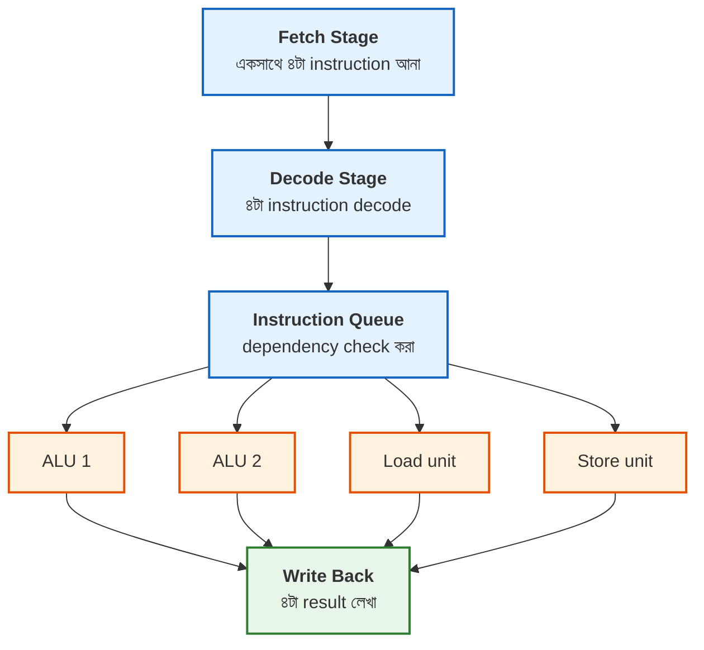
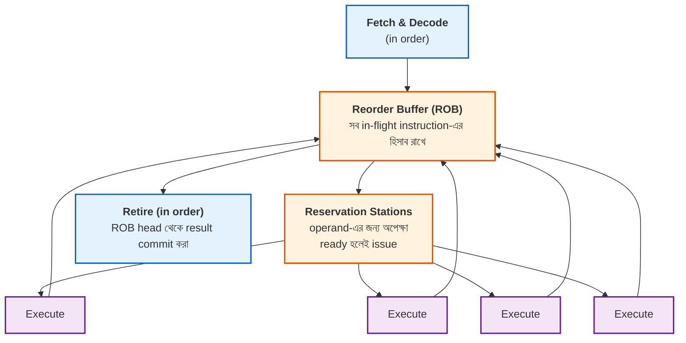
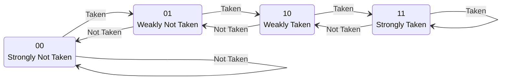
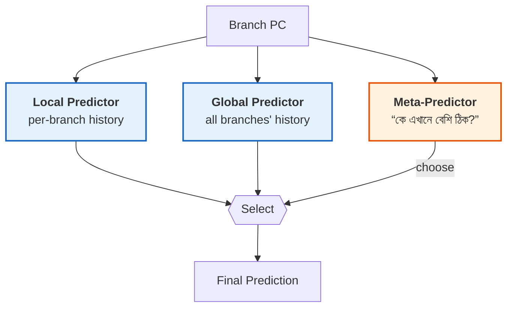
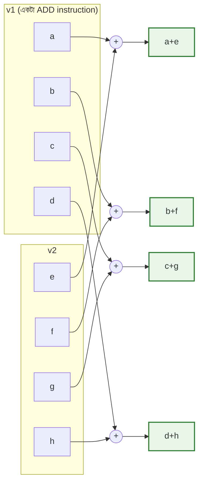
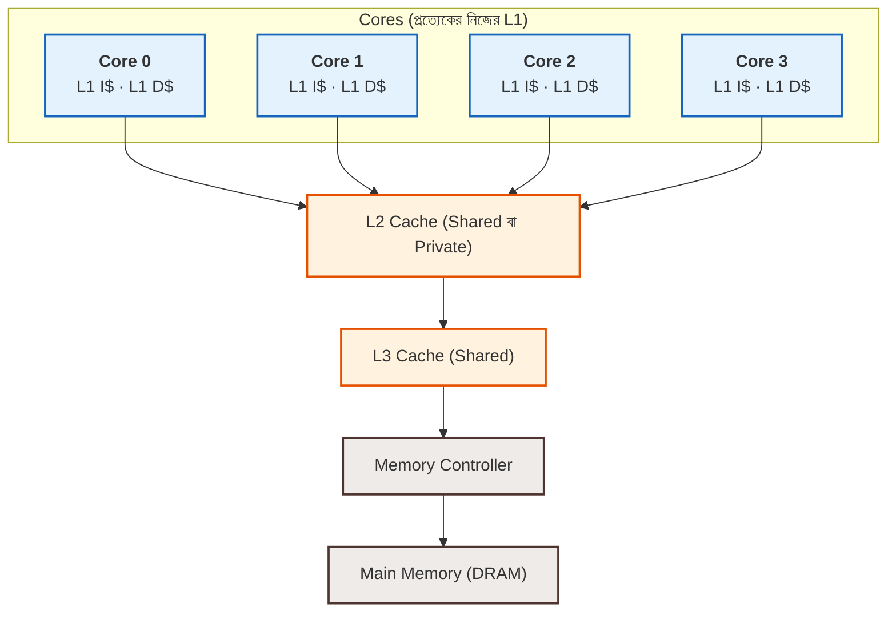
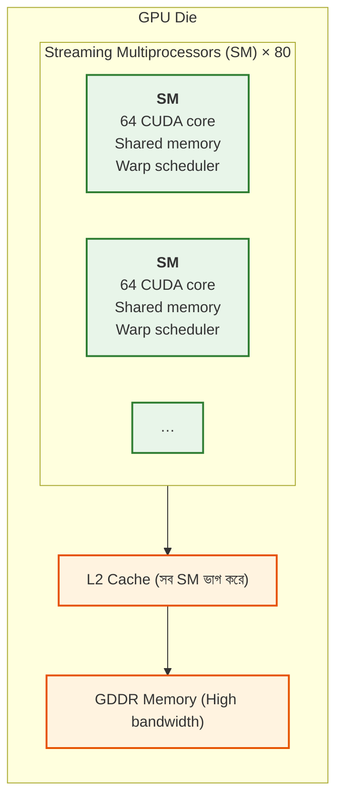

# 🚀 Chapter 20: Advanced Topics & Future of Computing
## From Foundation to Frontier - The Cutting Edge!

> **"You built a computer. Now learn the FUTURE. Welcome to the bleeding edge!"**
>
> **"তুমি computer বানিয়েছো। এবার FUTURE শেখো। Bleeding edge-এ স্বাগতম!"**

---

## 🎯 এই Chapter-এ তুমি শিখবে:

```
✅ Superscalar Execution - multiple instructions/cycle
✅ Out-of-Order Execution - dynamic scheduling
✅ Branch Prediction - advanced techniques
✅ SIMD & Vector Processing - data parallelism
✅ Multi-Core Systems - thread-level parallelism
✅ GPU Architecture - massive parallelism
✅ Future Directions - quantum, neuromorphic
✅ তোমার design journey সম্পূর্ণ! 🎉
```

**Time Required:** 1-2 weeks (self-paced learning)  
**Prerequisites:** Chapters 1-19 complete

---

## 🌟 ভয় কোরো না — এটা একটা ভ্রমণ, পরীক্ষা নয়

তুমি ইতিমধ্যে একটা **কাজ করা computer** বানিয়ে ফেলেছ — এটা বিশাল অর্জন। 🎉

এই অধ্যায়ের সব একবারে আয়ত্ত করতে হবে না। ভাবো তুমি একটা নতুন শহর ঘুরে দেখছ:
আজ জানবে কোথায় কী আছে (superscalar, out-of-order, GPU…), পরে যেটা দরকার
সেটায় গভীরে যাবে। চলো, frontier-টা একটু ঘুরে আসি! 🚀

---

## 🚀 Quick Overview - The Modern Era!

তুমি গত ১৯টা অধ্যায়ে যা বানিয়েছ, সেটা একটা **পূর্ণাঙ্গ, কাজ করা computer**।
কিন্তু একটা মজার সত্যি জেনে রাখো — তোমার সেই CPU আর Apple-এর M-series বা
Intel-এর Core i9-এর মধ্যে পার্থক্যটা *মূলনীতির* (principle) নয়, *মাত্রার*
(scale) আর *চালাকির* (cleverness)। দুটোই instruction fetch করে, decode করে,
execute করে, result লেখে। তফাৎ শুধু — modern CPU একই কাজ অনেক বেশি smart
ভাবে, অনেক বেশি সমান্তরালে (in parallel) করে।

এই অধ্যায়ে আমরা ঠিক সেই "চালাকিগুলো" দেখব — কীভাবে একটা single-cycle ধারণা
থেকে শুরু করে engineer-রা আজকের দানবীয় (monstrous) performance পেয়েছে।

### Where We've Been — তুমি কতদূর এসেছ:

| অধ্যায় | কী শিখলে | মূল লাভ |
|--------|-----------|----------|
| Ch 1-4 | Digital foundations | গেট থেকে circuit |
| Ch 5-8 | Verilog mastery | Hardware-কে code-এ লেখা |
| Ch 9-11 | FPGA deployment | আসল hardware-এ চালানো |
| Ch 12-13 | CPU architecture | CPU-র ভেতরের নকশা |
| Ch 14 | Single-cycle | CPI = 1, কিন্তু clock ধীর |
| Ch 15 | Multi-cycle | Resource sharing |
| Ch 16 | Pipeline | Throughput = ~1 inst/cycle |
| Ch 17 | Hazards | Pipeline-কে নির্ভুল করা |
| Ch 18 | Cache | Memory ~10× দ্রুত |
| Ch 19 | Complete system | Peripherals সহ পূর্ণ SoC |

**Result:** একটা Working computer! ✅ — pipelining + cache মিলিয়ে naive
single-cycle design-এর তুলনায় মোটামুটি **3-4× speedup**।

### Where Computing is Going — সামনে কী আছে:

```
Modern Processors:
✅ Superscalar (4-6 inst/cycle)
✅ Out-of-order execution
✅ Speculative execution
✅ Deep pipelines (15-20 stages)
✅ Advanced branch prediction
✅ SIMD/Vector units
✅ Multi-core (8-64 cores)
✅ Huge caches (MB)

Performance: 100-1000× your design!
But same principles! 🚀
```

এই তালিকাটা ভয় পাওয়ার মতো লাগতে পারে, কিন্তু একটা কথা মনে রাখো: এর
প্রতিটা trick-এর পেছনে একটাই সহজ লক্ষ্য — **কোনো cycle যেন বসে বসে নষ্ট না
হয়** (keep the hardware busy)। তোমার pipeline-এ stall হলে যেমন cycle নষ্ট
হতো, modern CPU হলো সেই নষ্ট cycle-গুলো একে একে উদ্ধার করার গল্প। আমরা এক এক করে
দেখব কীভাবে।

🎉 **This chapter = Understanding modern CPUs!**

---

## ২০.১ Superscalar Execution

### What is Superscalar?

তোমার pipelined CPU-র সবচেয়ে ভালো অবস্থায়ও প্রতি cycle-এ **একটামাত্র**
instruction শেষ হয় (throughput = 1 IPC)। কিন্তু একটু ভেবে দেখো — তোমার
datapath-এ তো একটাই ALU। যদি **দুটো, তিনটে, চারটে ALU** বসিয়ে দাও, আর প্রতি
cycle-এ একসাথে কয়েকটা instruction পাঠাও, তাহলে?

এটাই **superscalar**-এর মূল আইডিয়া: pipeline-কে শুধু *গভীর* (deep) না করে,
*চওড়া* (wide) করা।

> 🏪 **দোকানের analogy:** ভাবো একটা মুদি দোকানে একটাই cash counter।
> Pipelining মানে — counter-এ একটা লোক টাকা নিচ্ছে, আরেকজন packet করছে,
> আরেকজন bag-এ ভরছে; line দ্রুত এগোয়, কিন্তু একসাথে এক customer-ই বেরোয়।
> Superscalar মানে — **চারটে counter পাশাপাশি** খুলে দেওয়া। এখন এক "tick"-এ
> চারজন customer একসাথে বেরোতে পারে! এটাই scalar থেকে superscalar-এ লাফ।

```
Scalar (Your CPU):
- Execute 1 instruction per cycle
- Throughput = 1 IPC (Instruction Per Cycle)

Superscalar:
- Execute 2-6 instructions per cycle
- Throughput = 2-6 IPC
- Multiple execution units

Example: 4-way superscalar
Cycle 1: ADD, SUB, AND, OR (all at once!)
Cycle 2: XOR, SLL, SRL, LW  (all at once!)

4× performance! 🚀
```

একটা শব্দ মনে রাখো: **issue width**। 4-way superscalar মানে issue width = 4,
অর্থাৎ প্রতি cycle-এ সর্বোচ্চ ৪টা instruction execution unit-এ পাঠানো যায়।
বাস্তবে সবসময় ৪টা পাওয়া যায় না (কারণ instruction-গুলো একে অপরের ফলের জন্য
অপেক্ষা করতে পারে), তাই আসল IPC প্রায়ই 4-এর চেয়ে কম থাকে — এই ফাঁকটা পূরণ
করতেই পরের section-এর out-of-order execution আসে।

### Superscalar Architecture:

প্রতিটা stage এখন একসাথে **৪টা** করে instruction সামলায়। লক্ষ করো —
Instruction Queue-তে dependency check হয়, তারপর instruction-গুলো বিভিন্ন
execution unit-এ ভাগ হয়ে যায় (ALU-র কাজ ALU-তে, memory-র কাজ Load/Store
unit-এ):



মূল কথা: **একাধিক execution unit, parallel operation**। একটা ALU যখন ADD
করছে, পাশের ALU তখন SUB করছে — কেউ কারো জন্য বসে নেই।

### Requirements — এর জন্য কী কী লাগে:

Superscalar বানানো সহজ নয়; "একসাথে ৪টা" করতে গেলে hardware-এর প্রায় সব
জায়গাই চওড়া করতে হয়:

| যা লাগে | কেন লাগে |
|----------|-----------|
| **Multiple Execution Units** (2-4 ALU, 2 Load/Store, Branch unit, FPU) | একসাথে কয়েকটা instruction চালাতে আলাদা আলাদা hardware দরকার |
| **Wide Datapath** (4+ instruction fetch, 8+ register read, 4+ result write) | চারটা instruction-এর প্রতিটার operand আনতে register file-এ অনেক read/write port চাই |
| **Dependency Checking** | একই cycle-এর instruction-গুলো একে অপরের ফলের উপর নির্ভর করে কিনা — সব জোড়া (combination) দ্রুত মিলিয়ে দেখতে হয় |
| **Instruction Scheduling** | স্বাধীন (independent) instruction খুঁজে execution unit-গুলো ভরে রাখা, যাতে throughput সর্বোচ্চ হয় |

লক্ষ করো register file-এর port-এর কথাটা — এটাই সবচেয়ে ব্যয়বহুল অংশগুলোর
একটা। ৪টা instruction-এর প্রতিটার ২টা করে source operand মানে register
file-এ **৮টা read port** আর ৪টা destination-এর জন্য **৪টা write port** চাই।
Port যত বাড়ে, register file তত বড়, ধীর আর বিদ্যুৎ-খেকো হয় — তাই issue width
বাড়ানোর একটা practical সীমা থাকে।

**Complexity: High! কিন্তু Benefit: 2-4× performance!** এই trade-off-টাই
superscalar-এর গল্প।

---

## ২০.২ Out-of-Order Execution

### The Problem — superscalar-ও আটকে যায়:

Superscalar-এ একসাথে ৪টা execution unit থাকলেই হবে না — সেগুলো ভরে রাখার মতো
স্বাধীন instruction-ও তো লাগবে! আর সমস্যাটা হলো, একটা instruction যদি অনেকক্ষণ
ধরে আটকে থাকে (যেমন cache miss-এ LW), তাহলে in-order pipeline-এ তার *পেছনের*
সব instruction-ও দাঁড়িয়ে থাকতে বাধ্য — যদিও তারা ওই LW-র ফলের সাথে কোনো
সম্পর্কই রাখে না!

```
In-order pipeline:
ADD x1, x2, x3    # Takes 1 cycle
LW  x4, 0(x5)     # Takes 5 cycles (cache miss!)
ADD x6, x1, x7    # Independent! But must wait!
ADD x8, x9, x10   # Independent! But must wait!

Wasted cycles! 😢
```

> 🚦 **ট্রাফিকের analogy:** ভাবো এক লেনের রাস্তায় সামনের গাড়িটা নষ্ট হয়ে
> দাঁড়িয়ে গেছে। In-order মানে — পেছনের সব গাড়ি আটকে, যদিও তাদের অন্য রাস্তায়
> যাওয়ার কথা ছিল। Out-of-order মানে — পেছনের গাড়িগুলোকে পাশ কাটিয়ে এগিয়ে
> যেতে দেওয়া, আর নষ্ট গাড়িটা ঠিক হলে পরে তাকে তার আসল ক্রমে (order) জায়গা
> করে দেওয়া। কেউ অযথা বসে থাকে না।

### Out-of-Order Solution — তিনটে সোনালী নিয়ম:

Out-of-order (OoO) execution-এর পুরো দর্শন তিনটে বাক্যে ধরা যায়:

1. **Fetch in order** — instruction-গুলো program-এর ক্রমেই আসে।
2. **Execute out of order** — যেটার operand তৈরি, সেটাই আগে চলে (when ready!)।
3. **Retire in order** — কিন্তু ফল *commit*/লেখা হয় আবার program-এর ক্রমেই,
   যাতে বাইরে থেকে দেখে মনে হয় সব নিয়মমাফিক ক্রমেই হয়েছে।

```
Example:
ADD x1, x2, x3    # Execute cycle 1
LW  x4, 0(x5)     # Start cycle 1, complete cycle 5
ADD x6, x1, x7    # Waits (depends on x1)
ADD x8, x9, x10   # Execute cycle 2! (independent)

Reorder: Execute ADD x8 before LW completes!
```

এই "in-order retire" অংশটাই জাদু: ভেতরে hardware যত খুশি এলোমেলো ক্রমে কাজ
করুক, programmer-এর কাছে প্রোগ্রামটা ঠিক যেভাবে লেখা হয়েছিল সেভাবেই চলছে বলে
মনে হয়। এতে exception/interrupt এলেও precise রাখা যায় — ঠিক কোন instruction
পর্যন্ত শেষ হয়েছে তা পরিষ্কার থাকে।

### Architecture:

OoO engine-এর তিনটে মূল অংশ: instruction-গুলো ক্রমে রাখার জন্য **Reorder
Buffer (ROB)**, operand আসার জন্য অপেক্ষা করার জন্য **Reservation Stations**,
আর ভরসা রাখার জন্য একাধিক **execution unit**:



খেয়াল করো নীল box দুটো (Fetch/Decode আর Retire) ক্রম মেনে চলে, কমলা আর বেগুনি
অংশটুকুই কেবল "out of order" — অর্থাৎ এলোমেলো ক্রমটা সাবধানে দুটো in-order
দেয়ালের মাঝে আটকে রাখা হয়। ফলাফল: **dynamic scheduling** আর **memory latency
লুকিয়ে ফেলা** (hide memory latency) — LW যখন cache থেকে data আনছে, সেই সময়টায়
পেছনের স্বাধীন কাজগুলো এগিয়ে যায়।

### Key Concepts — পেছনের তিনটে স্তম্ভ:

OoO কাজ করানোর জন্য তিনটে ধারণা না বুঝলেই নয়:

**1. Register Renaming — ভুয়া নির্ভরতা (false dependency) মুছে ফেলা।**
ভাবো দুটো আলাদা কাজ ভুলবশত একই register `x1` ব্যবহার করছে — অথচ তাদের মধ্যে
আসল কোনো data সম্পর্ক নেই, শুধু নামটাই এক (WAR/WAW hazard)। Hardware ভেতরে
আসল register-এর চেয়ে অনেক বেশি **physical register** রাখে, আর logical নাম
(`x1`)-কে আলাদা আলাদা physical register-এ map করে দেয়। নাম আলাদা হয়ে গেলে আর
অযথা অপেক্ষা থাকে না।

> 📝 **খাতার analogy:** দুজন ছাত্র দুটো আলাদা অঙ্ক করছে, কিন্তু দুজনেই উত্তর
> লিখতে চাইছে "Answer" নামের একই লাইনে। Renaming মানে — তাদের দুটো আলাদা খাতা
> দিয়ে দেওয়া। এখন কেউ কারো লেখা শেষ হওয়ার জন্য অপেক্ষা করে না।

**2. Tomasulo's Algorithm — dynamic scheduling-এর ক্লাসিক রেসিপি।** ১৯৬৭
সালে IBM-এর Robert Tomasulo যে কৌশল বের করেন: reservation station-এ
instruction অপেক্ষা করে, আর কোনো execution unit ফল বের করলে সেটা **Common
Data Bus (CDB)** দিয়ে একসাথে সবার কাছে broadcast হয়; যে যে instruction সেই
ফলের জন্য বসে ছিল, তারা সঙ্গে সঙ্গে operand পেয়ে চালু হয়ে যায়।

**3. Reorder Buffer (ROB) — শৃঙ্খলার অভিভাবক।** ROB program order ধরে রাখে,
**speculative execution** (অনুমানের ভিত্তিতে আগেভাগে চালানো) সম্ভব করে, আর
কোনো গন্ডগোল (exception/mispredict) হলে সেই অনুমানের ফল মুছে আগের নিরাপদ
অবস্থায় **rollback** করতে দেয়।

এই পুরো যন্ত্রপাতি **Intel, AMD, ARM**-এর high-end core-এ ব্যবহৃত হয়। দাম?
**Complexity: Very high!** লাভ? in-order superscalar-এর তুলনায় সাধারণত
**~20-30% performance** — তবে এই সংখ্যাটা workload-ভেদে অনেক বদলায় (নিচের
নোট দেখো)।

> ⚠️ **একটা সতর্কবার্তা:** "Benefit: 20-30% performance" সংখ্যাটা একটা মোটা
> দাগের estimate; out-of-order-এর আসল লাভ workload আর baseline-এর উপর প্রচণ্ড
> নির্ভরশীল (memory-heavy code-এ অনেক বেশি, সরল compute-এ কম)। সংখ্যাটা
> চূড়ান্ত fact হিসেবে না নিয়ে "rough ballpark" হিসেবে পড়ো।

---

## ২০.৩ Advanced Branch Prediction

### Why Critical? — ভুল অনুমানের দাম এত বেশি কেন?

Pipeline যত গভীর (deep), branch ভুল অনুমান করার শাস্তি তত বেশি। কেন? কারণ
branch-এর আসল ফল জানার আগেই তুমি pipeline-এ পরের অনেকগুলো instruction ঢুকিয়ে
ফেলেছ। অনুমান ভুল হলে সেই সব instruction **ফেলে দিতে** হয় (flush) — আর সেই
ফেলে দেওয়া cycle-গুলোই হলো **mispredict penalty**।

```
Your simple predictor: 70-80% accuracy
Modern predictors: 95-99% accuracy!

Impact:
Pipeline depth: 15-20 stages
Mispredict penalty: 15-20 cycles!

At 80%: 0.2 × 20 = 4 cycles wasted
At 95%: 0.05 × 20 = 1 cycle wasted

Better prediction = HUGE impact! 🚀
```

হিসাবটা একবার ভালো করে দেখো — accuracy ৮০% থেকে ৯৫%-এ নিলে প্রতি branch-এ গড়
**৪ cycle থেকে ১ cycle**-এ নেমে আসে, অর্থাৎ **৪ গুণ** কম অপচয়! মাত্র ১৫%
বেশি accuracy এত বড় পার্থক্য করে, কারণ penalty-টা (২০ cycle) বিশাল। এজন্যই
modern CPU branch prediction-এ বিপুল hardware ঢালে।

> 🌧️ **আবহাওয়ার analogy:** branch prediction অনেকটা আবহাওয়ার পূর্বাভাসের মতো।
> ভুল হলে ছাতা ছাড়া বেরিয়ে ভিজে যাও (penalty)। তুমি যত বেশি অতীতের pattern
> দেখবে ("গত কদিন বিকেলে বৃষ্টি হয়েছে"), পূর্বাভাস তত নিখুঁত হবে। নিচের
> technique-গুলো ঠিক এভাবেই — কম থেকে বেশি ইতিহাস কাজে লাগিয়ে — accuracy
> বাড়ায়।

### Prediction Techniques:

#### 1. Two-Bit Saturating Counter — এক ভুলেই মত বদলায় না:

১-bit predictor-এর সমস্যা: একটা loop-এর শেষ iteration-এ একবার ভুল হলেই সে
পুরো মত বদলে ফেলে, ফলে পরের loop-এর শুরুতেও আবার ভুল করে — অর্থাৎ একটা ভুলে
**দুটো** misprediction! ২-bit counter এই সমস্যা সারায়: মত বদলানোর আগে দুবার
ভুল হওয়া লাগে। তাই এক-আধটা ব্যতিক্রমে (যেমন loop-এর শেষ বার) সে টলে না।

State machine-টা এরকম — taken হলে ডানে সরো (আরও "Taken"-এর দিকে), not-taken
হলে বাঁয়ে; দুই প্রান্তে গিয়ে saturate করে (আর বাড়ে না):



বাঁ-প্রান্তের দুটো state (00, 01) → "Not Taken" predict করে; ডান-প্রান্তের
দুটো (10, 11) → "Taken"। সবচেয়ে গুরুত্বপূর্ণ গুণ: **এক misprediction
সহ্য করে** — Strongly Taken অবস্থায় একবার ভুল হলে সে শুধু Weakly Taken-এ নামে,
predict এখনও "Taken"-ই থাকে।

#### 2. Correlating Predictor — branch-রা একে অপরের সাথে সম্পর্কিত:

মূল অন্তর্দৃষ্টি: একটা branch কী করবে, তা প্রায়ই *আগের কয়েকটা branch* কী
করেছে তার উপর নির্ভর করে। যেমন `if (x > 0)` সত্যি হলে পরের `if`-টাও হয়তো
নির্দিষ্টভাবে আচরণ করে। তাই শুধু *এই* branch-এর ইতিহাস না দেখে, **সাম্প্রতিক
কয়েকটা branch-এর pattern** (যেমন গত ৪টা: TNTN) দেখে অনুমান করা হয়।

| সাম্প্রতিক pattern (last 4) | অনুমান |
|----------------------------|---------|
| TTTT | 90% taken |
| TNTN | 95% taken |
| NTNT | 90% not taken |

প্রতিটা আলাদা history-pattern-এর জন্য আলাদা counter রাখা হয়, ফলে predictor
নিছক "এই branch সাধারণত taken" না বলে "এই *pattern*-এর পর এই branch taken"
বলতে পারে — অনেক সূক্ষ্ম, অনেক নিখুঁত।

#### 3. Gshare (Global History) — কম জায়গায় বেশি বুদ্ধি:

Correlating predictor-এ branch-address আর history আলাদা রাখলে table বিশাল হয়ে
যায়। Gshare একটা চমৎকার কৌশলে দুটোকে **মিশিয়ে** ফেলে — PC আর global history-কে
XOR করে একটা index বানায়:

```
Index = PC XOR Global_History

global_history = last N branch outcomes
index = pc[10:2] XOR history

prediction_table[index] = 2-bit counter
```

XOR করার ফলে branch-address আর pattern — দুটো তথ্যই একটা ছোট index-এ ধরা পড়ে,
আর আলাদা আলাদা branch একই table-entry-তে কম সংঘর্ষ (collision) করে। কম
hardware-এ ভালো accuracy দেয় বলে **আসল processor-এ এটি ব্যাপকভাবে ব্যবহৃত হয়**।

#### 4. Tournament Predictor — predictor-দের প্রতিযোগিতা:

কোনো একটা predictor সব ধরনের branch-এ সেরা নয় — কিছু branch তার *নিজের* অতীত
মেনে চলে (local history ভালো কাজ করে), আবার কিছু branch *অন্যদের* সাথে
সম্পর্কিত (global history ভালো)। Tournament predictor তাই **দুটো predictor
একসাথে চালায়**, আর একটা **meta-predictor** শেখে কোন branch-এ কে বেশি নির্ভুল:



Meta-predictor মূলত একটা ছোট counter-এর table — প্রতিবার দেখে কোন predictor ঠিক
ছিল, আর ধীরে ধীরে শিখে নেয় কোন branch-এ কাকে বিশ্বাস করতে হবে। **Intel Core**
এই ধরনের predictor ব্যবহার করে, **95%+ accuracy** পায়।

### Branch Target Buffer (BTB) — শুধু "হ্যাঁ/না" নয়, "কোথায়"?

এতক্ষণ আমরা শুধু branch *direction* (taken কি না) অনুমান করছিলাম। কিন্তু taken
হলে যাবে **কোথায়**? Target address তো সাধারণত instruction decode করার পরই জানা
যায় — তত cycle অপেক্ষা করলে তো গভীর pipeline-এ বুদবুদ (bubble) তৈরি হবে!

BTB-র সমাধান: এটা একটা ছোট cache, যেখানে PC দিয়ে index করলেই আগের বার ওই
branch কোথায় গিয়েছিল সেই target পাওয়া যায় — **decode-এরও আগে**:

| PC | Target | Valid |
|--------|--------|-------|
| 0x1000 | 0x2000 | 1 |
| 0x1004 | 0x1100 | 1 |

ফলে fetch stage-এই predictor বলে দিতে পারে "এটা taken, আর পরের PC হবে
0x2000" — **fast prediction, no decode needed!**

### Return Address Stack (RAS) — function return-এর বিশেষ চাল:

Function return একটা indirect branch — একই function বিভিন্ন জায়গা থেকে call
হতে পারে, তাই সে প্রতিবার ভিন্ন জায়গায় ফেরে; BTB-র মতো "গতবার এখানে গিয়েছিল"
চাল এখানে খাটে না। কিন্তু একটা সুন্দর pattern আছে: call আর return সবসময়
**stack-এর মতো** জোড়ায় জোড়ায় আসে (যে আগে call হয়, সে পরে return করে)।

তাই hardware একটা ছোট stack রাখে:
- **CALL**-এ return address **PUSH** করো।
- **RETURN**-এ সেটা **POP** করে সেখানেই অনুমান করো।

এত সরল, অথচ **accuracy 99%+** — কারণ call/return-এর গঠনটাই (structure) নিখুঁত
ভাবে stack মেনে চলে।

---

## ২০.৪ SIMD & Vector Processing

### What is SIMD? — একই কাজ অনেক data-র উপর:

এতক্ষণ আমরা *instruction* সমান্তরাল করছিলাম (superscalar/OoO)। SIMD অন্য একটা
ধরনের parallelism কাজে লাগায় — **data parallelism**। অনেক সময় তুমি ঠিক একই
operation একগাদা আলাদা data-র উপর করো (যেমন একটা ছবির প্রতিটা pixel-এ একই
brightness যোগ করা)। তখন প্রতিটার জন্য আলাদা instruction চালানো অপচয় — একটা
instruction দিয়েই কেন একসাথে অনেকগুলো সেরে ফেলা যায় না?

```
SIMD = Single Instruction, Multiple Data

One instruction operates on multiple data:
ADD v1, v2, v3  # Add 4 values at once!

v2 = [a, b, c, d]
v3 = [e, f, g, h]
v1 = [a+e, b+f, c+g, d+h]

4× speedup! 🚀
```

একটা vector register-কে কয়েকটা সমান্তরাল **lane**-এ ভাগ করা ভাবো; প্রতিটা
lane নিজের data-জোড়ায় একই কাজ করে, সবাই একসাথে:



> 🍱 **রান্নাঘরের analogy:** একজন রাঁধুনি একটা একটা করে ডিম ভাজছে — এটা scalar।
> SIMD মানে — একটা বড় চাটুতে ৮টা ডিম একসাথে ফাটিয়ে, এক নাড়াতেই সবগুলো ভেজে
> ফেলা। হাতের নড়াচড়া (instruction) একটাই, কিন্তু ফল ৮ গুণ।

### Vector Architecture — loop ছোট হয়ে যায়:

SIMD-এর সরাসরি ফল: একই কাজের loop-এ পদক্ষেপ (iteration) সংখ্যা vector width
দিয়ে ভাগ হয়ে যায়।

```
Scalar:
for (i = 0; i < 1000; i++)
    C[i] = A[i] + B[i];
Time: 1000 cycles

Vector (width 8):
for (i = 0; i < 1000; i += 8)
    V_C[i:i+7] = V_A[i:i+7] + V_B[i:i+7];
Time: 125 cycles!

8× speedup! 🚀
```

খেয়াল করো loop-এর `i += 8` অংশটা — প্রতি পাকে ৮টা element একসাথে সারা হচ্ছে
বলে ১০০০টা element মাত্র ১২৫ পাকে শেষ। এটাই vector processing-এর মূল লাভ:
একই কাজ, কম instruction, কম cycle।

### Examples — বাস্তবে যেসব SIMD তুমি ব্যবহার করো:

তোমার phone আর laptop-এ এই unit-গুলো এই মুহূর্তেও চলছে (ভিডিও দেখা, ছবি
edit করা, AI feature — সবই SIMD-নির্ভর):

| ISA / Extension | Vector width | একসাথে কতগুলো | বৈশিষ্ট্য |
|------------------|--------------|----------------|-----------|
| **Intel AVX-512** | 512-bit | 16 × 32-bit int, বা 8 × 64-bit double | ডেস্কটপ/সার্ভারে শক্তিশালী, বহু special instruction |
| **ARM Neon** | 128-bit | 4 × 32-bit value | mobile-friendly, কম বিদ্যুৎ |
| **RISC-V Vector (RVV)** | Scalable (128–2048 bit) | hardware-ভেদে নমনীয় | আধুনিক নকশা — একই code নানা চওড়ার hardware-এ চলে |

লক্ষ করো RISC-V Vector-এর **scalable** ধারণাটা — তুমি code-এ নির্দিষ্ট width
hard-code করো না; hardware যত চওড়া, একই program তত বেশি element একসাথে সারে।
এটাই RVV-কে ভবিষ্যৎ-প্রমাণ (future-proof) করে তোলে।

**প্রধান প্রয়োগক্ষেত্র (applications):** image processing, video encoding,
machine learning, scientific computing — অর্থাৎ যেখানেই বিপুল data-র উপর একই
গণনা বারবার চলে।

---

## ২০.৫ Multi-Core Systems

### Why Multi-Core? — একটা core-এর দেয়ালে ধাক্কা:

দশকের পর দশক engineer-রা একটা core-কেই দ্রুত করে গেছেন — clock বাড়িয়ে, deeper
pipeline করে, superscalar/OoO যোগ করে। কিন্তু একসময় তিনটে "দেয়াল"-এ এসে এই
পথ আটকে গেল:

- **Power wall** — clock বাড়াতে গেলে চিপ এত গরম হয় যে আর ঠান্ডা রাখা যায় না।
- **ILP wall** — একটা instruction stream-এ যত স্বাধীন কাজ খুঁজে বের করা যায়,
  তার একটা সীমা আছে; OoO দিয়েও আর বেশি parallelism মেলে না।
- **Frequency wall** — physics-এর কারণে clock frequency আর বাড়ানো যায় না।

**সমাধান:** একটা core-কে আরও দ্রুত করার বদলে **অনেকগুলো core** বসিয়ে দাও!
এটাই **Thread-Level Parallelism (TLP)** — আলাদা আলাদা কাজ (thread) আলাদা
core-এ একসাথে চলে। এতে performance বাড়ে, আবার একই কাজ কম clock-এ ভাগ করে করায়
power efficiency-ও ভালো হয়।

> 👷 **নির্মাণকাজের analogy:** একজন রাজমিস্ত্রিকে যতই খাওয়াও-দাওয়াও, সে একটা
> সীমার বেশি দ্রুত ইট গাঁথতে পারবে না (single-core wall)। তখন বুদ্ধিমানের কাজ
> একজনকে আরও তাড়া দেওয়া নয় — **চারজন মিস্ত্রি** লাগানো। কিন্তু তখন নতুন
> সমস্যা: তারা যেন একই দেয়াল দুবার না গাঁথে, একে অপরের সাথে কথা বলে নেয় —
> এটাই নিচের challenge-গুলো।

### Multi-Core Architecture:

প্রতিটা core-এর নিজের দ্রুত, ছোট **L1 cache** (instruction + data) থাকে; বড়
**L2/L3 cache** আর main memory সবাই মিলে ভাগ করে (shared)। উপরে গেলে দ্রুত
কিন্তু ছোট, নিচে গেলে ধীর কিন্তু বড় — ঠিক Chapter 18-এর memory hierarchy-র
ধারণা, এবার অনেকগুলো core-এর জন্য:



মূল কথা: **shared memory** — সব core একই memory দেখে। আর এখান থেকেই জন্ম নেয়
সবচেয়ে কঠিন সমস্যা: **cache coherence**।

### Challenges — multi-core-এর আসল লড়াই:

**1. Cache Coherence — সবার কাছে একই সত্যি রাখা।** সমস্যাটা ভাবো: Core 0 আর
Core 1 দুজনেই `x`-এর copy নিজের L1-এ রেখেছে। এখন Core 0 যদি `x` বদলে দেয়, তাহলে
Core 1-এর copy-টা তো এখন **পুরোনো (stale)**! Core 1 ভুল মান পড়বে। এর সমাধান
**MESI protocol** — প্রতিটা cache-line-কে চারটে state-এর একটায় রাখা হয়:

| State | মানে |
|-------|------|
| **M** (Modified) | শুধু আমার কাছে আছে, আর আমি বদলে ফেলেছি (memory-র চেয়ে নতুন) |
| **E** (Exclusive) | শুধু আমার কাছে আছে, কিন্তু এখনো বদলাইনি (memory-র সমান) |
| **S** (Shared) | আমার আর অন্য কারো কাছেও আছে, সবাই একই (read-only) |
| **I** (Invalid) | আমার copy বাতিল, ব্যবহার করা যাবে না |

কেউ লিখতে চাইলে protocol অন্যদের copy **Invalid** করে দেয়, যাতে কখনো দুজন
একসাথে আলাদা মান না দেখে — এভাবেই সবার কাছে "একই সত্যি" বজায় থাকে।

**2. Synchronization — পালা ভাগ করে নেওয়া।** একই data-তে একাধিক thread হাত
দিলে গন্ডগোল (race condition) হয়। তাই **lock**, **atomic operation**, আর
**memory barrier** দিয়ে নিশ্চিত করা হয় যে সঠিক সময়ে সঠিক thread-ই কাজটা করছে।

**3. Load Balancing — কাজ সমান ভাগ করা।** একটা core ঠাসা, বাকিরা বসে — এটা
অপচয়। **OS scheduler** কাজ (thread) core-গুলোর মধ্যে বিলি করে, দরকারে এক
core থেকে আরেক core-এ thread সরায় (migration)।

**4. Amdahl's Law — কেন N গুণ core মানে N গুণ গতি নয়।** এটাই multi-core-এর
সবচেয়ে গুরুত্বপূর্ণ সত্যি। যেকোনো program-এর কিছু অংশ সমান্তরাল করা যায় না
(serial), সেই অংশটুকুই গতির সীমা বেঁধে দেয়:

```
Speedup = 1 / (S + P/N)

S = serial অংশ (যা সমান্তরাল করা যায় না)
P = parallel অংশ
N = core সংখ্যা
```

> ⏳ **একটা সহজ উদাহরণ:** ধরো একটা কাজের ১০% serial (S = 0.1, P = 0.9)।
> তুমি যদি **অসীম** core লাগাও (N → ∞), তবুও সর্বোচ্চ speedup = 1 / 0.1 =
> **মাত্র ১০×**! ওই ছোট্ট ১০% serial অংশই পুরো ছবিটা আটকে দেয়। এজন্যই শুধু
> core বাড়ালেই হয় না — program-কে যতটা সম্ভব parallel করতে হয়।

### Examples — বাজারের multi-core চিপ:

| চিপ | Cores / Threads | বিশেষত্ব |
|-----|-----------------|----------|
| **Intel Core i9** | 8-16 cores, 2 thread/core (SMT) → 16-32 thread | Desktop powerhouse |
| **AMD Threadripper** | 64 cores, 128 threads | Workstation monster! |
| **ARM big.LITTLE** | 4 big (দ্রুত) + 4 little (সাশ্রয়ী) | mobile-এ power saving |
| **Apple M-series** | 8-16 cores (Performance + Efficiency) | unified memory |

লক্ষ করো ARM big.LITTLE আর Apple-এর কৌশলটা — সব core একরকম না বানিয়ে, কিছু
core দ্রুত (ভারী কাজের জন্য) আর কিছু core সাশ্রয়ী (হালকা কাজ + battery
বাঁচানোর জন্য)। তোমার phone যখন idle, তখন little/efficiency core-ই চলে — এজন্যই
charge বেশিক্ষণ থাকে।

---

## ২০.৬ GPU Architecture

### Why GPUs? — দুটো সম্পূর্ণ ভিন্ন দর্শন:

CPU আর GPU দুটোই processor, কিন্তু তাদের নকশার দর্শন একদম উল্টো। CPU বানানো হয়
**কম কাজ দ্রুত শেষ করতে** (low latency) — তাই অল্প কয়েকটা খুব *চালাক, জটিল*
core, যাদের প্রতিটায় OoO, branch prediction, বড় cache সব আছে। GPU বানানো হয়
**বিপুল কাজ একসাথে করতে** (high throughput) — তাই হাজার হাজার *সরল* core,
প্রতিটা একা ধীর, কিন্তু সবাই মিলে দানবীয়।

| | **CPU** | **GPU** |
|---|---------|---------|
| Core সংখ্যা | কম (4-16) | হাজার হাজার! |
| প্রতিটা core | জটিল (complex) | সরল (simple) |
| Execution | Out-of-order | In-order |
| Control logic | ভারী (branch prediction…) | হালকা |
| লক্ষ্য | কম latency, general purpose | massive parallelism, নির্দিষ্ট কাজ |

> 🚌 **যাত্রী পরিবহনের analogy:** CPU একটা **Ferrari** — খুব দ্রুত, কিন্তু
> একবারে অল্প যাত্রী। GPU হলো **একশো bus-এর বহর** — প্রতিটা bus আলাদা করে
> ধীর, কিন্তু একসাথে হাজার হাজার যাত্রী টানে। কম লোক জরুরি ভিত্তিতে পৌঁছাতে
> Ferrari ভালো; হাজার লোক একসাথে পৌঁছাতে bus-বহরই রাজা। এজন্যই graphics,
> machine learning, scientific computing, crypto mining-এর মতো বিপুল-সমান্তরাল
> কাজে GPU অপ্রতিদ্বন্দ্বী।

### GPU Architecture — হাজার core সাজানো হয় যেভাবে:

হাজার core একসাথে সামলানো যায় না, তাই GPU তাদের দল বেঁধে রাখে। মূল building
block হলো **Streaming Multiprocessor (SM)** — প্রতিটা SM-এ একগুচ্ছ সরল core
(NVIDIA-র ভাষায় "CUDA core"), নিজস্ব দ্রুত shared memory, আর একটা warp
scheduler থাকে যে ঠিক করে কোন থ্রেড-দল এখন চলবে:



একটু হিসাব করো: 80 SM × প্রতি SM-এ 64 CUDA core = **5120 cores** — সবাই
একসাথে চলছে (parallel execution)! তোমার single-core RISC-V যেখানে এক cycle-এ
এক element সারে, এই GPU সেখানে হাজার হাজার element একসাথে সারতে পারে। আর খেয়াল
করো **GDDR memory**-র "high bandwidth" কথাটা — এত core-কে data খাওয়াতে হলে
memory থেকেও বিপুল হারে data টানতে হয়, তাই GPU-তে memory bandwidth CPU-র চেয়ে
অনেক বেশি।

### Programming Model — হাজার thread একসাথে লেখার ভাষা:

এত core কাজে লাগাতে নতুন ভাবে চিন্তা করতে হয়। **CUDA/OpenCL**-এ তুমি একটা
**kernel** লেখো — একটামাত্র function, কিন্তু সেটা একসাথে হাজার হাজার
**thread**-এ চলে, প্রতিটা thread data-র একটা আলাদা টুকরো নিয়ে কাজ করে। Thread-রা
দল বেঁধে থাকে: NVIDIA-তে ৩২টা thread মিলে একটা **warp** (সবাই lock-step-এ একই
instruction চালায়), কয়েকটা warp মিলে **block**, আর সব block মিলে **grid**।

```
CUDA/OpenCL:
- Kernel: Function running on GPU
- Thread: Single execution
- Warp: 32 threads (NVIDIA)
- Block: Group of warps
- Grid: All blocks

Example:
__global__ void add(float *a, float *b, float *c) {
    int i = blockIdx.x * blockDim.x + threadIdx.x;
    c[i] = a[i] + b[i];
}

Launch with 1000s of threads!
Each processes different element!
Massive parallelism! 🚀
```

উপরের code-টা ভালো করে দেখো — সৌন্দর্যটা এর সরলতায়। তুমি কোনো loop লেখোইনি!
শুধু একটামাত্র যোগ (`c[i] = a[i] + b[i]`) লিখেছ, আর `i = blockIdx.x *
blockDim.x + threadIdx.x` লাইনটা প্রতিটা thread-কে তার নিজের অনন্য index দিয়ে
দিচ্ছে। হাজার thread একসাথে চালালে প্রতিটা array-র আলাদা element সারে — Chapter
২০.৪-এর সেই scalar loop এখানে hardware-এর সমান্তরালতায় গলে গেছে। **Massive
parallelism!** 🚀

---

## ২০.৭ Future Directions

এতক্ষণ আমরা দেখলাম কীভাবে চিরাচরিত (classical) silicon CPU দ্রুততর হয়েছে।
কিন্তু কিছু সমস্যায় এই পথটাই আর যথেষ্ট নয় — তখন গবেষকরা একদম নতুন ধরনের
computing খুঁজছেন। নিচের প্রতিটাকে ভাবো একেকটা সাহসী পরীক্ষা: কোনোটা silicon-এর
*ব্যাকরণই* বদলে দিচ্ছে, কোনোটা প্রকৃতি (মস্তিষ্ক, আলো) থেকে অনুপ্রেরণা নিচ্ছে।

### Quantum Computing — 0 আর 1 একসাথে:

চিরাচরিত bit হয় 0 নয় 1। **Qubit** একই সাথে দুটোই হতে পারে — একে বলে
**superposition**। সাথে যোগ হয় **entanglement** (দুটো qubit রহস্যময়ভাবে
জোড়া বাঁধা)। এই দুইয়ের জোরে quantum computer কিছু নির্দিষ্ট সমস্যায় বিপুল
সংখ্যক সম্ভাবনা একসাথে যাচাই করতে পারে।

```
Quantum bits (qubits):
- Superposition (0 and 1 simultaneously)
- Entanglement
- Quantum algorithms

Potential:
- Factor large numbers (break RSA)
- Search databases (Grover's)
- Simulate quantum systems

Status: Early stage
IBM, Google, etc. working on it

Not replacing classical!
Complementary! 🔮
```

সবচেয়ে ভুল ধারণাটা শুধরে নাও: quantum computer তোমার laptop-কে *প্রতিস্থাপন*
করবে না। এটা কেবল কিছু *বিশেষ* সমস্যায় (বড় সংখ্যা factor করা → RSA ভাঙা,
database search, অণু/quantum system simulate করা) অসাধারণ — দৈনন্দিন কাজে
classical CPU-ই রাজা থাকবে। তাই এটা **প্রতিদ্বন্দ্বী নয়, পরিপূরক
(complementary)**।

### Neuromorphic Computing — মস্তিষ্কের নকল:

তোমার মগজ মাত্র ~২০ watt-এ যা করে, একটা supercomputer তা করতে megawatt পোড়ায়।
পার্থক্যটা গঠনে — মস্তিষ্ক ঘড়ির tick মেনে সারাক্ষণ চলে না; neuron শুধু তখনই
"spike" পাঠায় যখন দরকার (**event-driven**)। Neuromorphic চিপ ঠিক এই কায়দা
নকল করে:

```
Brain-inspired:
- Spiking neurons
- Event-driven
- Analog computation
- Extremely efficient

Intel Loihi:
- 130,000 neurons
- 130 million synapses
- 1000× more efficient

Applications:
- Pattern recognition
- Sensor processing
- Robotics
- AI at edge
```

কারণ কাজ না থাকলে এরা চুপ করে থাকে (কোনো cycle অযথা পোড়ে না), তাই pattern
recognition, sensor processing, robotics-এর মতো কাজে — বিশেষত battery-চালিত
"edge" device-এ — এরা অবিশ্বাস্যভাবে কম শক্তি খায়।

### Domain-Specific Accelerators — এক কাজের ওস্তাদ চিপ:

একটা বড় trend: general-purpose CPU/GPU-র পাশাপাশি একটা *নির্দিষ্ট* কাজের জন্য
বানানো বিশেষ চিপ (accelerator) বসানো। যখন তুমি আগেই জানো hardware ঠিক কোন কাজটা
বারবার করবে, তখন সেই কাজের জন্যই circuit সাজিয়ে নিলে general চিপের চেয়ে অনেক
দ্রুত আর সাশ্রয়ী হয়।

```
Custom chips for specific tasks:

Google TPU (Tensor Processing Unit):
- Matrix multiplication
- Machine learning
- 100× faster than GPU!

Apple Neural Engine:
- On-device ML
- Privacy
- Efficiency

Trend: Specialized hardware
General purpose + Accelerators! 🚀
```

যেমন **Google TPU** শুধু matrix multiplication-এ (যা machine learning-এর
প্রাণ) এত ভালো যে general GPU-কেও ছাড়িয়ে যায়; **Apple Neural Engine** তোমার
phone-এই AI চালায় (তাই data বাইরে পাঠাতে হয় না — privacy আর efficiency দুটোই)।
এই দর্শনটাই ভবিষ্যৎ: **general-purpose core + একগুচ্ছ accelerator**।

> ⚠️ **একটা সতর্কবার্তা:** "100× faster than GPU" সংখ্যাটা একটা মোটা দাগের,
> প্রচারধর্মী (marketing-style) তুলনা — কোন প্রজন্মের TPU বনাম কোন GPU, কোন
> metric (throughput, perf/watt, না perf/dollar), সব কিছুর উপর এটা ভীষণ
> নির্ভরশীল। নির্দিষ্ট কাজে accelerator যে বড় সুবিধা দেয় সেই *ধারণাটা* ঠিক,
> কিন্তু "100×" সংখ্যাটাকে চূড়ান্ত fact হিসেবে নিও না।

### 3D Stacking — চিপ এখন তলায় তলায়:

এতদিন চিপ ছিল সমতল (2D)। কিন্তু দূরত্বই শত্রু — দুটো block যত দূরে, signal
পৌঁছাতে তত সময় আর শক্তি লাগে। সমাধান: চিপগুলোকে **উপর-নিচে স্তরে সাজানো** (যেমন
এক তলার বাড়ির বদলে বহুতল ভবন)। তলায় তলায় বসালে সংযোগ ছোট হয় — ফলে bandwidth
বাড়ে, power কমে:

```
Stack multiple dies:
- Logic + Memory
- Shorter connections
- Higher bandwidth
- Lower power

AMD 3D V-Cache:
- Stack cache on CPU
- 96 MB L3!
- Gaming performance ↑

Intel Foveros:
- 3D integration
- Mix technologies

Future: Extreme integration! 📚
```

বাস্তব উদাহরণ **AMD 3D V-Cache** — CPU-র *উপরে* extra cache-এর একটা পুরো
স্তর বসিয়ে L3 cache **96 MB** পর্যন্ত নেওয়া হয়েছে, যা game-এ লক্ষণীয়
performance দেয় (কারণ বেশি data চিপের কাছেই থাকে, দূরের ধীর DRAM-এ কম যেতে হয়)।
**Intel Foveros** আবার আলাদা প্রযুক্তিতে বানানো die একসাথে জুড়ে দেয়।

### Photonic Computing — বিদ্যুতের বদলে আলো:

সব electronic চিপের মূল সীমাবদ্ধতা: তার দিয়ে electron ঠেলতে গেলে resistance,
তাপ আর বিলম্ব হয়। Photonic computing প্রশ্ন তোলে — electron-এর বদলে **আলো (photon)**
দিয়ে গণনা করলে কেমন হয়?

```
Use light instead of electricity:
- Speed of light!
- Lower power
- No heat
- Parallel

Still research stage
But promising! 💡
```

আলো চলে আলোর গতিতে, তেমন তাপ তৈরি করে না, আর বিভিন্ন রঙের আলো একই পথে একসাথে
পাঠানো যায় (স্বাভাবিক parallelism)। এখনো এটি গবেষণার পর্যায়ে, তবু এর সম্ভাবনা
দারুণ আশাজাগানিয়া।

---

## ২০.৮ The Path Forward

আমরা frontier-টা ঘুরে এলাম — superscalar থেকে quantum পর্যন্ত। এবার একটু
পেছন ফিরে দেখো তুমি ঠিক কতটা পথ পেরিয়ে এসেছ, আর সামনে কোন কোন দরজা খোলা।

### What You've Learned:

```
Complete Journey:
✅ Digital logic
✅ Sequential circuits
✅ Verilog HDL
✅ FPGA deployment
✅ CPU architecture
✅ Pipeline design
✅ Cache systems
✅ Complete SoC
✅ Advanced topics

You understand:
→ How computers work
→ Why they're fast
→ How to build them
→ Where they're going

INCREDIBLE KNOWLEDGE! 🏆
```

### Next Steps:

```
1. Build More
   - Implement superscalar
   - Add branch predictor
   - Multi-core design
   - Your own GPU!

2. Research
   - Read papers (IEEE, ACM)
   - Follow conferences (ISCA, MICRO)
   - Learn latest techniques

3. Contribute
   - Open source projects
   - RISC-V community
   - Share knowledge

4. Career
   - CPU design engineer
   - FPGA developer
   - Computer architect
   - Researcher
   - Entrepreneur!

The world is yours! 🌍
```

একটা পরামর্শ: চারটে একসাথে করতে যেও না। যেটা তোমাকে সবচেয়ে বেশি টানে — হয়তো branch predictor বানানোর ইচ্ছা, হয়তো নিজের ছোট্ট GPU-র স্বপ্ন
— সেই একটা জিনিস বেছে নাও আর সেটাই শেষ পর্যন্ত বানাও। একটা শেষ-করা ছোট প্রকল্প
দশটা অর্ধেক-করা ধারণার চেয়ে অনেক বেশি শেখায়।

### Resources — আরও গভীরে যাওয়ার মানচিত্র:

এই অধ্যায়টা ছিল একটা *পরিচিতি-ভ্রমণ* (tour) — প্রতিটা topic নিজেই একটা পুরো
বই/কোর্সের যোগ্য। নিচের সম্পদগুলো তোমার পরের ধাপের পাথেয়; যে দিকটা তোমাকে
সবচেয়ে টানে, সেখান থেকেই শুরু করো।

**📚 Books (গভীর ভিত্তি গড়ার জন্য):**

| বই | কেন পড়বে |
|----|-----------|
| Computer Architecture: A Quantitative Approach (Hennessy & Patterson) | এই অধ্যায়ের প্রতিটা advanced topic-এর গভীর, পরিমাণগত (quantitative) আলোচনা |
| Computer Organization and Design (Patterson & Hennessy) | RISC-V ভিত্তিক, তোমার যাত্রার সাথে সবচেয়ে মানানসই |
| Digital Design (Harris & Harris) | digital + architecture একসাথে, পরিষ্কার ব্যাখ্যা |

**💻 Online (হাতে-কলমে চর্চার জন্য):**

| সম্পদ | কী পাবে |
|--------|----------|
| RISC-V ISA Manual | আসল, প্রামাণিক specification |
| Chisel (Hardware DSL) | Verilog-এর বাইরে আধুনিক hardware design ভাষা |
| OpenCores | বহু open-source hardware core পড়ে শেখার সুযোগ |
| GitHub: RISC-V cores | বাস্তব core-এর কোড ঘেঁটে শেখা |

**🎓 Courses (গঠনমূলক শেখার জন্য):**

| কোর্স | প্রতিষ্ঠান |
|--------|------------|
| 6.004 | MIT |
| CS152 | Berkeley |
| EE180 | Stanford |
| Computer Architecture | Coursera |

**🤝 Communities (আটকে গেলে সাহায্য + অনুপ্রেরণা):**

| Community | উপযোগিতা |
|-----------|----------|
| RISC-V Foundation | open ISA ঘিরে সক্রিয় ইকোসিস্টেম |
| Reddit: r/FPGA | FPGA নিয়ে প্রশ্ন-উত্তর, প্রকল্প |
| Stack Overflow | নির্দিষ্ট সমস্যার সমাধান |
| Discord: Hardware communities | লাইভ আলোচনা, দ্রুত সাহায্য |

---

## ২০.৯ Your Achievement

### What You Built:

```
FROM NOTHING:
✅ Basic gates (AND, OR, NOT)

TO EVERYTHING:
✅ Complete working computer
✅ RISC-V processor
✅ Pipelined execution
✅ Cache system
✅ Peripherals (UART, GPIO)
✅ Real software
✅ Deployed to FPGA

Lines of code: 3000+
Hours invested: 100+
Knowledge gained: IMMENSE! 💎

You are now:
→ Computer Architect
→ Digital Designer
→ FPGA Engineer
→ System Builder
→ EXPERT! 🏆
```

### Impact:

```
Skills you have:
✅ Design CPUs
✅ Optimize performance
✅ Build systems
✅ Professional work

Career ready for:
→ Intel, AMD, ARM
→ Apple, Qualcomm, NVIDIA
→ Startups (SiFive, etc.)
→ Research labs
→ Your own company!

Market value:
→ CPU designers: $150K-300K+
→ FPGA engineers: $120K-250K+
→ Computer architects: $200K-400K+

YOU HAVE THE SKILLS! 💼✅
```

---

## ২০.১০ Design শেষ — এবার আসল Silicon!

### Chapter 20 Mission Complete!

```
✅ Advanced topics learned
✅ Modern techniques understood
✅ Future directions explored
✅ Design journey complete!

20 of 25 chapters done — 80%! 🎊
Next: real silicon (Ch 21-25)! 🚀
```

### Design Complete — A Huge Milestone!

```
BUILD YOUR OWN PROCESSOR
════════════════════════════════════════
    🎊 80% COMPLETE! 🎊
    20 OF 25 CHAPTERS DONE!
════════════════════════════════════════

PART 1: DIGITAL FOUNDATIONS ✅ 100%
PART 2: VERILOG HDL ✅ 100%
PART 3: FPGA ✅ 100%
PART 4: PROCESSOR DESIGN ✅ 100%
PART 5: VLSI & SILICON ⏳ IN PROGRESS

DESIGN MASTERED — TIME TO FABRICATE! 🎊

SO FAR: 460+ KB | 21,000+ lines
JUST 5 CHAPTERS TO REAL SILICON! 📚

ALMOST THERE — KEEP GOING! 🏆👑
════════════════════════════════════════
```

---

## 🎯 Pause and Reflect

### To Every Reader:

```
You started with nothing.
You built EVERYTHING.

From simple gates,
To working computers.

From basic concepts,
To cutting-edge knowledge.

This is not the end.
This is the BEGINNING! 🚀

The knowledge you have is RARE.
The skills you possess are VALUABLE.
The journey so far is INCREDIBLE.

Now go BUILD!
Now go CREATE!
Now go INNOVATE!

The future of computing...
...is in YOUR hands! 💪

Thank you for this journey.
Now make us proud! 🏆
```

---

## 🏆 Achievement Unlocked!

```
Level 20: ✅ COMPLETE - Future Architect!
Progress: [████████████████████░░░░░] 80%

XP Gained: +3000
Skills: Advanced Architectures, Future Vision

Badges Earned:
🥉 Superscalar Expert
🥈 Out-of-Order Master
🥇 Branch Prediction Guru
🏅 Multi-core Architect
🎖️ GPU Designer
⭐ Quantum Explorer
💎 Neuromorphic Pioneer
👑 FUTURE ARCHITECT! 👑

DESIGN JOURNEY COMPLETE! 🎊
```

---

## 🚀 What's Next? VLSI & Real Silicon!

You've built a processor. You understand advanced architectures.

**But there's one more journey...**

```
✅ So far:           You learned to DESIGN
⏳ Next (Ch 21-25):  Now learn to FABRICATE!

You'll discover:
→ How designs become real silicon
→ VLSI design flow (RTL to GDSII)
→ Physical design and optimization
→ Sky130 PDK (Google's open process)
→ TinyTapeout submission
→ Getting YOUR chip made! 🏭

The ultimate achievement:
YOUR PROCESSOR IN REAL SILICON! 💎
```

### Coming Up — Chapters 21-25:

```
📔 Chapter 21: VLSI Design Flow
   - RTL to GDSII process
   - Synthesis, placement, routing
   - The complete flow

📔 Chapter 22: OpenLane & Physical Design
   - Hands-on with OpenLane
   - Layout your processor
   - Real chip design!

📔 Chapter 23: Sky130 PDK
   - Google's open source PDK
   - 130nm technology
   - Standard cells and IP

📔 Chapter 24: TinyTapeout Submission
   - Submit your design
   - Real fabrication!
   - Cost: $100-300

📔 Chapter 25: Your Silicon Arrives!
   - Testing your chip
   - Validation
   - VICTORY! 🎉

Ready to make REAL silicon? Let's go! 🚀
```

---

**[⬅️ Previous: Chapter 19](Chapter_19_Complete_System.md)** | **[➡️ Next: Chapter 21](Chapter_21_VLSI_Design_Flow.md)**

---

<div align="center">

**"You've mastered processor design. Now learn to make it REAL!"**

**"তুমি processor design master করেছো। এবার REAL silicon বানাও!"**

**Design Complete ✅ | VLSI Fabrication Awaits! 🏭**

Made with ❤️ for chip makers | চিপ মেকারদের জন্য ভালোবাসা দিয়ে তৈরি

</div>
