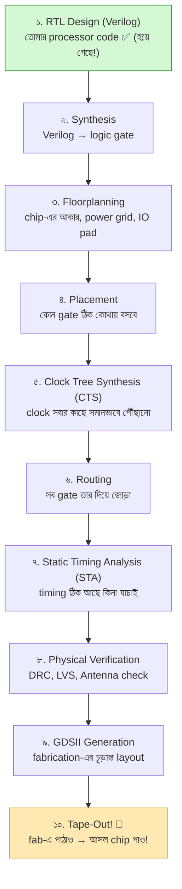
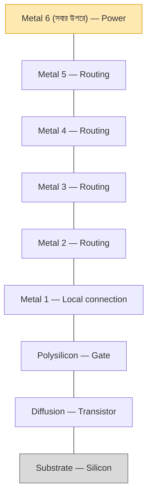

# 🏭 Chapter 21: VLSI Design Flow - RTL to Silicon
## From Verilog Code to Real Chip Layout!

> **"You built the processor. Now learn to make it REAL silicon!"**
>
> **"তুমি processor বানিয়েছো। এবার শেখো REAL silicon বানাতে!"**

---

## 🎯 এই Chapter এ তুমি শিখবে:

```
✅ VLSI Design Flow - RTL থেকে GDSII
✅ Synthesis - Logic to Gates
✅ Placement - Where gates go
✅ Routing - How to connect
✅ Timing Analysis - Speed check
✅ Physical Verification - Design rules
✅ GDSII Format - Final chip layout
✅ তোমার design silicon-ready! 🎉
```

**Time Required:** 2 weeks (learning + practice)  
**Prerequisites:** Chapters 1-20 complete

---

## 🌟 নতুন জগৎ — কিন্তু ভয়ের কিছু নেই

এতদিন তুমি **logic** নিয়ে কাজ করেছ (gate, register, instruction)। এখান থেকে
শুরু **physical** জগৎ — আসল transistor, তার, layer। প্রথমে একটু অচেনা লাগবে,
এটা একদম স্বাভাবিক। ✋

কিন্তু আসল কথা: RTL-থেকে-GDSII আসলে কয়েকটা ধাপের একটা pipeline, আর টুল
(OpenLane) ভারী কাজের বেশিরভাগ নিজেই করে। আমরা প্রতিটা ধাপ এক-এক করে হাঁটব —
তুমি শুধু বুঝবে কী হচ্ছে আর কেন। চলো শুরু করি! 💪

---

## 🚀 আগে একটু বুঝে নিই — VLSI জিনিসটা আসলে কী?

### VLSI = Very Large Scale Integration

নামটা শুনতে যতটা ভয়ংকর, ব্যাপারটা ততটা না। **VLSI** মানে শুধু এটুকু — এক
টুকরো silicon-এর উপর লক্ষ-কোটি transistor বসিয়ে একটা পুরো circuit বানানো।
"Very Large Scale" এসেছে এই বিশাল সংখ্যা থেকে। তুমি Chapter 1-এ যে একটা AND
gate দিয়ে শুরু করেছিলে, সেই একই transistor-এর গল্প — শুধু এবার সংখ্যাটা
কয়েক বিলিয়ন। 🤯

তোমার এতদূরের যাত্রাটা একবার মনে করিয়ে দিই, কারণ তুমি যতটা ভাবছ তার চেয়ে
অনেক বেশি পথ পেরিয়ে এসেছ:

```
এ পর্যন্ত তোমার যাত্রা:
Ch 1-11:  Digital design, Verilog, FPGA — basics শক্ত হয়ে গেছে
Ch 12-19: একটা পুরো RISC-V processor বানিয়ে ফেলেছ!
Ch 20:    Advanced architecture-ও দেখা হয়ে গেছে

এখন: তোমার design-কে আসল CHIP বানানোর পালা! 🏭
```

#### FPGA আর ASIC — পার্থক্যটা ধরো

এতদিন তুমি FPGA-তে design চালিয়েছ। FPGA একটা "reconfigurable" chip — ভেতরে
আগে থেকে কিছু logic block বসানো আছে, তুমি শুধু সেগুলোকে নতুন করে তার দিয়ে
জুড়ে নিজের circuit বানাও। তাই কয়েক সেকেন্ডে নতুন design চালানো যায়, কিন্তু
সেই flexibility-র দাম আছে — বেশি জায়গা, বেশি power, কম speed।

**ASIC** (Application-Specific Integrated Circuit) ঠিক উল্টো। এখানে তুমি একটা
নির্দিষ্ট কাজের জন্য transistor-গুলো একদম স্থায়ীভাবে silicon-এ বসিয়ে দাও।
একবার বানানো হয়ে গেলে আর বদলানো যায় না — কিন্তু বিনিময়ে পাও সর্বোচ্চ speed,
সবচেয়ে কম power, আর কোটি-কোটি unit সস্তায় বানানোর সুযোগ। Intel, Apple,
Qualcomm-এর সব chip আসলে এই ASIC।

| বৈশিষ্ট্য | FPGA | ASIC (Chip) |
|---|---|---|
| তৈরি করতে সময় | কয়েক ঘণ্টা | কয়েক মাস |
| Development cost | $0-100 | $10K-100K |
| প্রতি unit cost | $10-100 | $1-10 |
| Speed | তুলনামূলক ধীর | দ্রুত |
| Power | বেশি | কম |
| স্থায়ী (Permanent)? | না | হ্যাঁ! |
| Mass production? | না | হ্যাঁ! |

> 💡 **শেখার জন্য:** open-source fab (যেমন Sky130 + TinyTapeout) দিয়ে শুরু করো —
> খরচ নামমাত্র।
> **Production-এর জন্য:** আসল silicon chip, কোটি কোটি বানানো যায়।

এই chapter-এ আমরা শিখব কীভাবে তোমার সেই FPGA-তে চলা Verilog design-কে একটা
আসল ASIC-এ রূপ দেওয়া যায়। সেই গোটা পথটার নাম — **RTL-to-GDSII flow**।

---

## ২১.১ RTL-to-GDSII Flow — পুরো ছবিটা একনজরে

ভয় পেয়ো না, পুরো ব্যাপারটা আসলে একটা **pipeline** — মানে কয়েকটা ধাপ একটার
পর একটা সাজানো, ঠিক একটা কারখানার assembly line-এর মতো। একদিকে ঢোকে তোমার
লেখা Verilog code (এটাকেই বলে **RTL** — Register Transfer Level), আর অন্যদিক
দিয়ে বেরিয়ে আসে **GDSII** — একটা ফাইল যেটা fab-কে বলে দেয় silicon-এর কোন
জায়গায় কী আকৃতি আঁকতে হবে।

ভালো খবর হলো, এই গোটা assembly line-টা OpenLane-এর মতো টুল প্রায় পুরোটা
নিজেই চালিয়ে নেয়। তোমার কাজ হলো প্রতিটা ধাপ **কেন আছে আর কী করে** সেটা
বুঝে নেওয়া — যাতে কোথাও আটকে গেলে তুমি বুঝতে পারো সমস্যাটা ঠিক কোথায়। নিচের
ছবিটা মাথায় গেঁথে নাও; পুরো chapter জুড়ে আমরা এই ছবির এক-একটা বাক্স খুলে
দেখব:



একটা সহজ উপমা মাথায় রাখো: **পুরো flow-টা যেন একটা নতুন শহর বানানো।**
Synthesis ঠিক করে শহরে কী কী বাড়ি (gate) লাগবে; floorplan ঠিক করে শহরের
সীমানা আর মূল রাস্তা-বিদ্যুতের লাইন কোথায় যাবে; placement প্রতিটা বাড়িকে তার
প্লটে বসায়; routing প্রতিটা বাড়ির মধ্যে রাস্তা (তার) টানে; আর শেষে নানা
inspection (timing, DRC, LVS) পাস করলে তবেই শহরটা বসবাসের উপযোগী — মানে
fab-এ পাঠানোর উপযোগী। এই শহর-বানানোর উপমাটা ধরে রাখো, পরের প্রতিটা ধাপে
ফিরে আসবে। 🏙️

---

## ২১.২ Synthesis — Verilog থেকে আসল gate

### Synthesis আসলে কী করে?

এটাই পুরো flow-এর প্রথম জাদু। তুমি Verilog-এ লিখেছ *কী হওয়া উচিত* — যেমন
"y হবে a AND b, তারপর সেটা OR c"। কিন্তু silicon তো তোমার `assign`
statement বোঝে না; সে শুধু আসল gate চেনে। **Synthesis** হলো সেই অনুবাদক
যে তোমার behavioral Verilog-কে নিয়ে সেটাকে সত্যিকারের gate-এর একটা তালিকায়
(netlist) বদলে দেয়।

ভাবো তুমি একজন স্থপতিকে বললে "আমার একটা থাকার ঘর চাই" — synthesis সেই দাবিকে
নিয়ে বলে দেয় ঠিক কয়টা ইট, কয়টা দরজা, কয়টা জানালা লাগবে। তোমার `&` চিহ্নটা
হয়ে যায় library থেকে নেওয়া একটা আসল `AND2` cell, তোমার `|` হয়ে যায় একটা
`OR2` cell:

```
Input: তোমার Verilog code
Output: Gate-level netlist

Example:
Verilog:
  assign y = a & b | c;

After Synthesis:
  AND2 u1 (.A(a), .B(b), .Y(w1));
  OR2  u2 (.A(w1), .B(c), .Y(y));

Technology Mapping:
- Uses standard cell library
- Optimizes for area/speed/power
- Inserts clock buffers
```

লক্ষ্য করো, এখানে শুধু অনুবাদ হচ্ছে না — **optimization**-ও হচ্ছে। Synthesis
টুল হাজার রকমভাবে তোমার logic সাজিয়ে দেখে, আর তুমি যেটা চাও (সবচেয়ে কম জায়গা?
সবচেয়ে বেশি speed? সবচেয়ে কম power?) সেই অনুযায়ী সেরা combination বেছে নেয়।
অপ্রয়োজনীয় logic ছেঁটে ফেলে, একই কাজ কম gate-এ করার চেষ্টা করে। এই ধাপের
শেষে যেটা পাও সেটা একটা "technology-mapped netlist" — মানে নির্দিষ্ট একটা
process-এর (যেমন Sky130) আসল cell দিয়ে বানানো তোমার circuit।

### Standard Cell Library — আগে থেকে বানানো building block

Synthesis কিন্তু শূন্য থেকে gate ডিজাইন করে না — সে একটা তৈরি ক্যাটালগ থেকে
cell তুলে নেয়। এই ক্যাটালগটার নাম **standard cell library**। ভাবো এটা LEGO-র
একটা বাক্স: ভেতরে আগে থেকেই নানা আকারের block বানানো আছে, প্রত্যেকটার মাপ আর
বৈশিষ্ট্য জানা। তোমাকে আর প্রতিটা transistor হাতে এঁকে gate বানাতে হয় না —
শুধু দরকারমতো block তুলে জুড়ে দাও।

```
Standard Cell কী?
আগে থেকে ডিজাইন করা, আগে থেকে মাপজোক করা gate-এর layout

প্রচলিত cell:
✅ Logic gate (AND, OR, NAND, NOR, XOR)
✅ Flip-flop (DFF)
✅ Buffer, Inverter
✅ Multiplexer
✅ Adder, Latch

প্রতিটা cell-এর সঙ্গে থাকে:
- Layout (physical design)
- Timing info (delay)
- Power info (consumption)
- Area info (size)

জনপ্রিয় library:
→ Sky130 (Google/Skywater) - FREE!
→ TSMC (commercial)
→ Intel, Samsung (commercial)
```

প্রতিটা cell-এর গায়ে চারটে তথ্য লেখা থাকে বলেই synthesis বুদ্ধিমানের মতো
সিদ্ধান্ত নিতে পারে — কোন cell কত দ্রুত (timing), কত জায়গা নেয় (area), কত
power খায়, আর দেখতে কেমন (layout)। এই মাপজোক করা তথ্য থাকে `.lib` ফাইলে,
আর তুমি একটু পরেই synthesis script-এ ঠিক এই Sky130 library-টাই ব্যবহার করতে
দেখবে।

### Synthesis-এর জন্য কোন টুল?

```
Open Source:
✅ Yosys - সবচেয়ে জনপ্রিয়
✅ ABC - Optimization
✅ OpenSTA - Timing analysis

Commercial:
→ Synopsys Design Compiler
→ Cadence Genus
→ Mentor Precision

আমরা ব্যবহার করব: Yosys (free!)
```

আমরা পুরো বইজুড়ে **Yosys** ব্যবহার করব — এটা open-source, শক্তিশালী, আর
পেশাদার flow-এও দিব্যি ব্যবহৃত হয়। দামি commercial টুলের পেছনে এক পয়সাও খরচ
করতে হবে না, অথচ তুমি আসল কাজটাই শিখবে। 💪

---

## ২১.৩ Physical Design-এর গোড়ার কথা

এতক্ষণ আমরা logic নিয়ে ভেবেছি। এবার আসল physical জগতে নামছি — যেখানে gate
মানে আর শুধু একটা ধারণা নয়, বরং silicon-এর উপর আঁকা একটা নির্দিষ্ট আকৃতি।
আর physical জগতের নিজস্ব আইন আছে।

### Design Rule — fab-এর তৈরি নিয়মকানুন

একটা চিপ তৈরি হয় photolithography দিয়ে — আলো ফেলে অতি সূক্ষ্ম আকৃতি
silicon-এ ছাপানো হয়। কিন্তু কারখানার যন্ত্রের একটা সীমা আছে: তার চেয়ে সরু
লাইন সে আঁকতে পারে না, দুটো লাইন বেশি কাছাকাছি হলে গলে এক হয়ে যায়। তাই
প্রতিটা fab তোমাকে একগুচ্ছ **design rule** দিয়ে দেয় — মানে "এর চেয়ে সরু
করো না, এর চেয়ে কাছাকাছি বসিও না"। এগুলো মানতেই হবে, না হলে চিপ বানানোই
যাবে না।

```
প্রতিটা technology-র নিজস্ব নিয়ম আছে:

Minimum Width (সর্বনিম্ন প্রস্থ):
- Metal layer-কে ≥ X nm চওড়া হতে হবে
- Polysilicon-কে ≥ Y nm হতে হবে

Minimum Spacing (সর্বনিম্ন ফাঁক):
- দুটো তারকে ≥ Z nm দূরে থাকতে হবে
- ভিন্ন layer-এর জন্য ভিন্ন নিয়ম

Enclosure (ঘিরে রাখা):
- Via-কে metal দিয়ে ঘিরে রাখতে হবে

উদাহরণ (Sky130 - 130nm process):
- Metal1 min width: 140 nm
- Metal1 min spacing: 140 nm
- Poly min width: 150 nm
```

এগুলো কোনো এলোমেলো সংখ্যা নয় — প্রতিটা fab-এর যন্ত্রপাতির ক্ষমতা থেকে এই
মাপ আসে। সুখবর হলো, তোমাকে এই হাজারো নিয়ম মুখস্থ করতে হবে না। পরে DRC
(Design Rule Check) টুল স্বয়ংক্রিয়ভাবে তোমার layout-এর প্রতিটা আকৃতি যাচাই
করে দেখবে নিয়ম মানা হয়েছে কিনা। তোমাকে শুধু বুঝতে হবে এই rule-গুলো *কেন*
আছে।

### একটা চিপের ভেতরের layer-গুলো

একটা চিপ আসলে কেক-এর মতো বহু স্তরে (layer) সাজানো। একদম নিচে থাকে
transistor, আর তার উপরে স্তরে স্তরে metal-এর তার, যেগুলো এক transistor-কে
আরেকটার সঙ্গে জোড়ে। নিচের দিকের metal (Metal1) দিয়ে কাছাকাছি জোড়া হয়,
উপরের দিকের মোটা metal দিয়ে লম্বা দূরত্ব আর power বিতরণ করা হয়। এই স্তরগুলো
এভাবে সাজানো:



> 🔗 **Via:** আলাদা layer-এর তারগুলোকে উপর-নিচে জুড়তে দরকার হয় একটা ছোট্ট
> উল্লম্ব সংযোগ — তার নাম **via**। বহুতল বাড়ির লিফট-এর কথা ভাবো: একই তলায়
> হাঁটা মানে একটা metal layer-এ চলা, আর তলা বদলানো মানে via বেয়ে অন্য
> layer-এ ওঠা-নামা।

---

## ২১.৪ Placement & Routing

### Placement:

```
Goal: Position standard cells optimally

Objectives:
✅ Minimize wire length
✅ Meet timing constraints
✅ Reduce congestion
✅ Balance power distribution

Algorithms:
- Simulated annealing
- Partition-based
- Analytic methods

Tools:
→ RePlAce (open source)
→ Cadence Innovus (commercial)
```

### Routing:

```
Goal: Connect all pins with wires

Types:
1. Global Routing
   - High-level path planning
   - Which regions to use

2. Detailed Routing
   - Exact wire placement
   - Assign to specific tracks

Challenges:
❌ Congestion (too many wires)
❌ Crosstalk (interference)
❌ Timing violations
❌ Design rule violations

Tools:
→ FastRoute (open source)
→ TritonRoute (open source)
```

---

## ২১.৫ Timing Analysis

### Static Timing Analysis (STA):

```
Check if circuit meets timing:

Setup Time:
- Data must arrive before clock edge
- Path delay < Clock period - Setup time

Hold Time:
- Data must be stable after clock edge
- Path delay > Hold time

Critical Path:
- Longest delay path
- Determines max frequency

Example:
Register → Logic → Register
If logic takes 8ns, clock period must be > 8ns
Max frequency = 1/8ns = 125 MHz
```

### Timing Constraints:

```
Create SDC (Synopsys Design Constraints) file:

create_clock -period 10 [get_ports clk]
set_input_delay 2 -clock clk [all_inputs]
set_output_delay 2 -clock clk [all_outputs]

Tools:
→ OpenSTA (open source)
→ Synopsys PrimeTime (commercial)
```

---

## ২১.৬ Physical Verification

### Design Rule Check (DRC):

```
Verify layout follows manufacturing rules

Checks:
✅ Minimum width
✅ Minimum spacing
✅ Minimum area
✅ Via enclosure
✅ Density rules

Tool: Magic (open source)
```

### Layout vs Schematic (LVS):

```
Verify layout matches netlist

Steps:
1. Extract netlist from layout
2. Compare with original netlist
3. Check connectivity
4. Report mismatches

Tool: Netgen (open source)
```

### Antenna Rules:

```
Problem: Long wires act as antennas
Effect: Damage transistor gates during fab

Solution:
- Add diodes
- Break long wires
- Multi-level routing

Checked automatically!
```

---

## ২১.৭ GDSII Format

### What is GDSII?

```
GDSII = Graphic Data System II
Industry standard for IC layouts

Contains:
- Layer information
- Polygon coordinates  
- Cell hierarchy
- Text labels

File size: MB to GB!

Viewing tools:
→ KLayout (free, excellent!)
→ Magic (free)
→ Cadence Virtuoso (commercial)
```

### Layer Map:

```
Sky130 layers (example):
Layer 64/20: Metal1
Layer 65/20: Via1
Layer 66/20: Metal2
Layer 67/20: Via2
Layer 68/20: Metal3
...

Each layer = different mask in fab!
```

---

## ২১.৮ Complete Example: Simple Counter

### Step-by-Step VLSI Flow:

```verilog
// 1. RTL Design (counter.v)
module counter(
    input clk,
    input reset,
    output reg [7:0] count
);
    always @(posedge clk or posedge reset) begin
        if (reset)
            count <= 0;
        else
            count <= count + 1;
    end
endmodule
```

### Synthesis Script:

```tcl
# 2. Synthesis (synth.ys)
yosys -p "
    read_verilog counter.v
    synth -top counter
    dfflibmap -liberty sky130_fd_sc_hd__tt_025C_1v80.lib
    abc -liberty sky130_fd_sc_hd__tt_025C_1v80.lib
    write_verilog counter_synth.v
"
```

### Physical Design:

```tcl
# 3. Place & Route (OpenLane)
set ::env(DESIGN_NAME) counter
set ::env(VERILOG_FILES) counter.v
set ::env(CLOCK_PERIOD) 10
set ::env(CLOCK_PORT) clk

# Run flow
flow.tcl -design counter
```

### Result:

```
After completion:
✅ counter_synth.v (gate-level)
✅ counter.def (placement)
✅ counter.gds (layout)
✅ counter.sdc (timing)
✅ Reports (timing, area, power)

Ready for fabrication! 🎉
```

---

## ২১.৯ Open Source Tools Ecosystem

### Complete Open Source Flow:

```
┌──────────────────────────────────────┐
│ OpenLane (Complete ASIC Flow)       │
├──────────────────────────────────────┤
│ → Yosys (Synthesis)                  │
│ → OpenROAD (Place & Route)           │
│   - RePlAce (Placement)              │
│   - TritonRoute (Routing)            │
│   - OpenSTA (Timing)                 │
│ → Magic (DRC, Extraction)            │
│ → Netgen (LVS)                       │
│ → KLayout (Viewing)                  │
└──────────────────────────────────────┘

PDK (Process Design Kit):
→ Sky130 (Google/Skywater) - FREE!
   130nm process, open source

Installation:
Everything available on GitHub!
Docker containers available!
```

---

## ২১.১০ Your Processor on Silicon

### Preparing Your Design:

```
Your RISC-V processor (from Ch 12-19):
- 3000+ lines of Verilog ✅
- Pipelined, with cache ✅
- Complete SoC ✅

To make it chip-ready:

1. Size constraints:
   - Target area (e.g., 1mm × 1mm)
   - Available on TinyTapeout

2. Clock frequency:
   - Target 50-100 MHz
   - May need to simplify for first tapeout

3. IO pads:
   - UART pins
   - GPIO pins
   - Power/ground
   - Clock input

4. Memory:
   - May need to simplify
   - Use on-chip SRAM
   - External memory via IO

Realistic first chip:
→ Simplified RISC-V (RV32I subset)
→ Small cache (1-2 KB)
→ 50 MHz clock
→ 8-16 GPIO pins
→ UART for communication

STILL AMAZING! 🎉
```

---

## ২১.১১ Chapter 21 Mission Complete!

### তুমি এখন জানো:

```
✅ Complete VLSI design flow
✅ RTL to GDSII process
✅ Synthesis concepts
✅ Physical design basics
✅ Timing analysis
✅ Physical verification
✅ GDSII format
✅ Open source tools
✅ How to make real chips! 🎉
```

### Next Steps:

```
Chapter 22: OpenLane & Physical Design
  → Hands-on with OpenLane
  → Your processor layout
  → Complete flow practice

Chapter 23: Sky130 PDK Deep Dive
  → Standard cells
  → Design rules
  → Process details

Chapter 24: TinyTapeout Submission
  → Prepare your design
  → Submit to fab
  → Track progress

Chapter 25: Fabrication & Testing
  → Chip comes back!
  → Testing methodology
  → Success celebration! 🎊

YOU'RE ON THE PATH TO REAL SILICON! 🏭
```

---

## 🎯 Chapter Exercise

### Project: Synthesize Your Processor

**Task:** Take your RISC-V processor through synthesis

```bash
# 1. Install Yosys
sudo apt install yosys

# 2. Get Sky130 library
git clone https://github.com/google/skywater-pdk

# 3. Run synthesis
yosys -p "
    read_verilog riscv_core.v
    synth -top riscv_core
    dfflibmap -liberty sky130*.lib
    abc -liberty sky130*.lib
    stat
    write_verilog riscv_synth.v
"

# 4. Check results
# - Gate count
# - Critical path
# - Area estimate
```

---

## 🏆 Achievement Unlocked!

```
Level 21: ✅ COMPLETE - VLSI Designer!
Progress: [████████████████████████████████] 84%

XP Gained: +2000
Skills: VLSI Flow, Physical Design Basics

Badges Earned:
🥉 Synthesis Expert
🥈 Physical Design Learner
🥇 GDSII Master
🏅 Open Source VLSI
🎖️ Chip Designer (in training)

NEXT: Hands-on with OpenLane! 🛠️
```

---

**[⬅️ Previous: Chapter 20](Chapter_20_Advanced_Topics.md)** | **[➡️ Next: Chapter 22](Chapter_22_OpenLane_Physical_Design.md)**

---

<div align="center">

**"From Verilog to GDSII. Your chip journey begins!"**

**"Verilog থেকে GDSII। তোমার chip journey শুরু!"**

Made with ❤️ for chip designers | চিপ ডিজাইনারদের জন্য ভালোবাসা দিয়ে তৈরি

</div>
