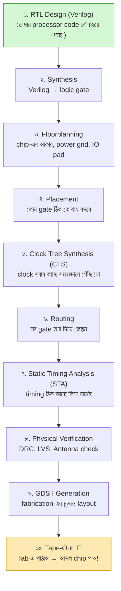
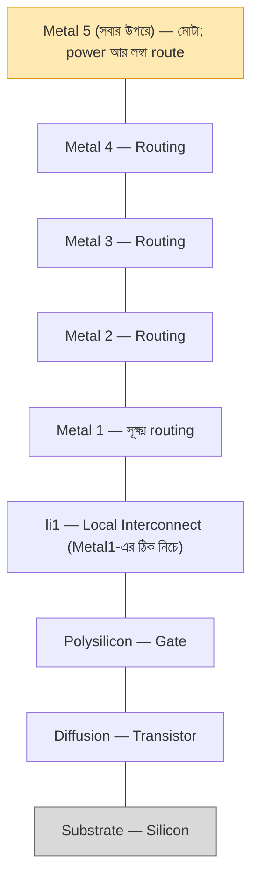
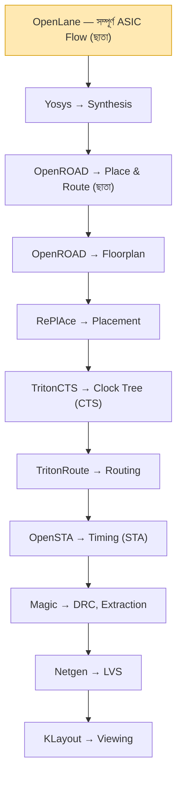

# 🏭 Chapter 21: VLSI Design Flow - RTL to Silicon
## From Verilog Code to Real Chip Layout!

> **"You built the processor. Now learn to make it REAL silicon!"**
>
> **"তুমি processor বানিয়েছো। এবার শেখো REAL silicon বানাতে!"**

---

## 🎯 এই Chapter-এ তুমি শিখবে:

```
✅ VLSI Design Flow - RTL থেকে GDSII
✅ Synthesis - Logic to Gates
✅ Placement - Where gates go
✅ Routing - How to connect
✅ Timing Analysis - Speed check
✅ Physical Verification - Design rules
✅ GDSII Format - Final chip layout
✅ তোমার design silicon-ready! 🎉
```

**Time Required:** 2 weeks (learning + practice)  
**Prerequisites:** Chapters 1-20 complete

---

## 🌟 নতুন জগৎ — কিন্তু ভয়ের কিছু নেই

এতদিন তুমি **logic** নিয়ে কাজ করেছ (gate, register, instruction)। এখান থেকে
শুরু **physical** জগৎ — আসল transistor, তার, layer। প্রথমে একটু অচেনা লাগবে,
এটা একদম স্বাভাবিক। ✋

কিন্তু আসল কথা: RTL-থেকে-GDSII আসলে কয়েকটা ধাপের একটা pipeline, আর টুল
(OpenLane) ভারী কাজের বেশিরভাগ নিজেই করে। আমরা প্রতিটা ধাপ এক-এক করে হাঁটব —
তুমি শুধু বুঝবে কী হচ্ছে আর কেন। চলো শুরু করি! 💪

---

## 🚀 আগে একটু বুঝে নিই — VLSI জিনিসটা আসলে কী?

### VLSI = Very Large Scale Integration

নামটা শুনতে যতটা ভয়ংকর, ব্যাপারটা ততটা না। **VLSI** মানে শুধু এটুকু — এক
টুকরো silicon-এর উপর লক্ষ-কোটি transistor বসিয়ে একটা পুরো circuit বানানো।
"Very Large Scale" এসেছে এই বিশাল সংখ্যা থেকে। তুমি Chapter 1-এ যে একটা AND
gate দিয়ে শুরু করেছিলে, সেই একই transistor-এর গল্প — শুধু এবার সংখ্যাটা
কয়েক বিলিয়ন। 🤯

তোমার এতদূরের যাত্রাটা একবার মনে করিয়ে দিই, কারণ তুমি যতটা ভাবছ তার চেয়ে
অনেক বেশি পথ পেরিয়ে এসেছ:

```
এ পর্যন্ত তোমার যাত্রা:
Ch 1-11:  Digital design, Verilog, FPGA — basics শক্ত হয়ে গেছে
Ch 12-19: একটা পুরো RISC-V processor বানিয়ে ফেলেছ!
Ch 20:    Advanced architecture-ও দেখা হয়ে গেছে

এখন: তোমার design-কে আসল CHIP বানানোর পালা! 🏭
```

#### FPGA আর ASIC — পার্থক্যটা ধরো

এতদিন তুমি FPGA-তে design চালিয়েছ। FPGA একটা "reconfigurable" chip — ভেতরে
আগে থেকে কিছু logic block বসানো আছে, তুমি শুধু সেগুলোকে নতুন করে তার দিয়ে
জুড়ে নিজের circuit বানাও। তাই কয়েক সেকেন্ডে নতুন design চালানো যায়, কিন্তু
সেই flexibility-র দাম আছে — বেশি জায়গা, বেশি power, কম speed।

**ASIC** (Application-Specific Integrated Circuit) ঠিক উল্টো। এখানে তুমি একটা
নির্দিষ্ট কাজের জন্য transistor-গুলো একদম স্থায়ীভাবে silicon-এ বসিয়ে দাও।
একবার বানানো হয়ে গেলে আর বদলানো যায় না — কিন্তু বিনিময়ে পাও সর্বোচ্চ speed,
সবচেয়ে কম power, আর কোটি কোটি unit সস্তায় বানানোর সুযোগ। Intel, Apple,
Qualcomm-এর সব chip আসলে এই ASIC।

| বৈশিষ্ট্য | FPGA | ASIC (Chip) |
|---|---|---|
| তৈরি করতে সময় | কয়েক ঘণ্টা | কয়েক মাস |
| Development cost | $0-100 | $10K-100K |
| প্রতি unit cost | $10-100 | $1-10 |
| Speed | তুলনামূলক ধীর | দ্রুত |
| Power | বেশি | কম |
| স্থায়ী (Permanent)? | না | হ্যাঁ! |
| Mass production? | না | হ্যাঁ! |

> 💡 **শেখার জন্য:** open-source fab (যেমন Sky130 + TinyTapeout) দিয়ে শুরু করো —
> খরচ নামমাত্র।
> **Production-এর জন্য:** আসল silicon chip, কোটি কোটি বানানো যায়।

এই chapter-এ আমরা শিখব কীভাবে তোমার সেই FPGA-তে চলা Verilog design-কে একটা
আসল ASIC-এ রূপ দেওয়া যায়। সেই গোটা পথটার নাম — **RTL-to-GDSII flow**।

---

## ২১.১ RTL-to-GDSII Flow — পুরো ছবিটা একনজরে

ভয় পেয়ো না, পুরো ব্যাপারটা আসলে একটা **pipeline** — মানে কয়েকটা ধাপ একটার
পর একটা সাজানো, ঠিক একটা কারখানার assembly line-এর মতো। একদিকে ঢোকে তোমার
লেখা Verilog code (এটাকেই বলে **RTL** — Register Transfer Level), আর অন্যদিক
দিয়ে বেরিয়ে আসে **GDSII** — একটা ফাইল যেটা fab-কে বলে দেয় silicon-এর কোন
জায়গায় কী আকৃতি আঁকতে হবে।

ভালো খবর হলো, এই গোটা assembly line-টা OpenLane-এর মতো টুল প্রায় পুরোটা
নিজেই চালিয়ে নেয়। তোমার কাজ হলো প্রতিটা ধাপ **কেন আছে আর কী করে** সেটা
বুঝে নেওয়া — যাতে কোথাও আটকে গেলে তুমি বুঝতে পারো সমস্যাটা ঠিক কোথায়। নিচের
ছবিটা মাথায় গেঁথে নাও; পুরো chapter জুড়ে আমরা এই ছবির এক-একটা বাক্স খুলে
দেখব:



একটা সহজ উপমা মাথায় রাখো: **পুরো flow-টা যেন একটা নতুন শহর বানানো।**
Synthesis ঠিক করে শহরে কী কী বাড়ি (gate) লাগবে; floorplan ঠিক করে শহরের
সীমানা আর মূল রাস্তা-বিদ্যুতের লাইন কোথায় যাবে; placement প্রতিটা বাড়িকে তার
প্লটে বসায়; routing প্রতিটা বাড়ির মধ্যে রাস্তা (তার) টানে; আর শেষে নানা
inspection (timing, DRC, LVS) পাস করলে তবেই শহরটা বসবাসের উপযোগী — মানে
fab-এ পাঠানোর উপযোগী। এই শহর-বানানোর উপমাটা ধরে রাখো, পরের প্রতিটা ধাপে
ফিরে আসবে। 🏙️

---

## ২১.২ Synthesis — Verilog থেকে আসল gate

### Synthesis আসলে কী করে?

এটাই পুরো flow-এর প্রথম জাদু। তুমি Verilog-এ লিখেছ *কী হওয়া উচিত* — যেমন
"y হবে a AND b, তারপর সেটা OR c"। কিন্তু silicon তো তোমার `assign`
statement বোঝে না; সে শুধু আসল gate চেনে। **Synthesis** হলো সেই অনুবাদক
যে তোমার behavioral Verilog-কে নিয়ে সেটাকে সত্যিকারের gate-এর একটা তালিকায়
(netlist) বদলে দেয়।

ভাবো তুমি একজন স্থপতিকে বললে "আমার একটা থাকার ঘর চাই" — synthesis সেই দাবিকে
নিয়ে বলে দেয় ঠিক কয়টা ইট, কয়টা দরজা, কয়টা জানালা লাগবে। তোমার `&` চিহ্নটা
হয়ে যায় library থেকে নেওয়া একটা আসল `AND2` cell, তোমার `|` হয়ে যায় একটা
`OR2` cell:

```
Input: তোমার Verilog code
Output: Gate-level netlist

Example:
Verilog:
  assign y = a & b | c;

After Synthesis:
  AND2 u1 (.A(a), .B(b), .Y(w1));
  OR2  u2 (.A(w1), .B(c), .Y(y));

Technology Mapping:
- Uses standard cell library
- Optimizes for area/speed/power
- Produces a gate-level netlist
```

লক্ষ্য করো, এখানে শুধু অনুবাদ হচ্ছে না — **optimization**-ও হচ্ছে। Synthesis
টুল হাজার রকমভাবে তোমার logic সাজিয়ে দেখে, আর তুমি যেটা চাও (সবচেয়ে কম জায়গা?
সবচেয়ে বেশি speed? সবচেয়ে কম power?) সেই অনুযায়ী সেরা combination বেছে নেয়।
অপ্রয়োজনীয় logic ছেঁটে ফেলে, একই কাজ কম gate-এ করার চেষ্টা করে। এই ধাপের
শেষে যেটা পাও সেটা একটা "technology-mapped netlist" — মানে নির্দিষ্ট একটা
process-এর (যেমন Sky130) আসল cell দিয়ে বানানো তোমার circuit।

### Standard Cell Library — আগে থেকে বানানো building block

Synthesis কিন্তু শূন্য থেকে gate ডিজাইন করে না — সে একটা তৈরি ক্যাটালগ থেকে
cell তুলে নেয়। এই ক্যাটালগটার নাম **standard cell library**। ভাবো এটা LEGO-র
একটা বাক্স: ভেতরে আগে থেকেই নানা আকারের block বানানো আছে, প্রত্যেকটার মাপ আর
বৈশিষ্ট্য জানা। তোমাকে আর প্রতিটা transistor হাতে এঁকে gate বানাতে হয় না —
শুধু দরকারমতো block তুলে জুড়ে দাও।

```
Standard Cell কী?
আগে থেকে ডিজাইন করা, আগে থেকে মাপজোক করা gate-এর layout

প্রচলিত cell:
✅ Logic gate (AND, OR, NAND, NOR, XOR)
✅ Flip-flop (DFF)
✅ Buffer, Inverter
✅ Multiplexer
✅ Adder, Latch

প্রতিটা cell-এর সঙ্গে থাকে:
- Layout (physical design)
- Timing info (delay)
- Power info (consumption)
- Area info (size)

জনপ্রিয় library:
→ Sky130 (Google/SkyWater) - FREE!
→ TSMC (commercial)
→ Intel, Samsung (commercial)
```

প্রতিটা cell-এর গায়ে চারটে তথ্য লেখা থাকে বলেই synthesis বুদ্ধিমানের মতো
সিদ্ধান্ত নিতে পারে — কোন cell কত দ্রুত (timing), কত জায়গা নেয় (area), কত
power খায়, আর দেখতে কেমন (layout)। এই মাপজোক করা তথ্য থাকে `.lib` ফাইলে,
আর তুমি একটু পরেই synthesis script-এ ঠিক এই Sky130 library-টাই ব্যবহার করতে
দেখবে।

### Synthesis-এর জন্য কোন টুল?

```
Open Source:
✅ Yosys - সবচেয়ে জনপ্রিয়
✅ ABC - Optimization
✅ OpenSTA - Timing analysis

Commercial:
→ Synopsys Design Compiler
→ Cadence Genus
→ Mentor Precision

আমরা ব্যবহার করব: Yosys (free!)
```

আমরা পুরো বইজুড়ে **Yosys** ব্যবহার করব — এটা open-source, শক্তিশালী, আর
পেশাদার flow-এও দিব্যি ব্যবহৃত হয়। দামি commercial টুলের পেছনে এক পয়সাও খরচ
করতে হবে না, অথচ তুমি আসল কাজটাই শিখবে। 💪

---

## ২১.৩ Physical Design-এর গোড়ার কথা

এতক্ষণ আমরা logic নিয়ে ভেবেছি। এবার আসল physical জগতে নামছি — যেখানে gate
মানে আর শুধু একটা ধারণা নয়, বরং silicon-এর উপর আঁকা একটা নির্দিষ্ট আকৃতি।
আর physical জগতের নিজস্ব আইন আছে।

### Design Rule — fab-এর তৈরি নিয়মকানুন

একটা চিপ তৈরি হয় photolithography দিয়ে — আলো ফেলে অতি সূক্ষ্ম আকৃতি
silicon-এ ছাপানো হয়। কিন্তু কারখানার যন্ত্রের একটা সীমা আছে: তার চেয়ে সরু
লাইন সে আঁকতে পারে না, দুটো লাইন বেশি কাছাকাছি হলে গলে এক হয়ে যায়। তাই
প্রতিটা fab তোমাকে একগুচ্ছ **design rule** দিয়ে দেয় — মানে "এর চেয়ে সরু
করো না, এর চেয়ে কাছাকাছি বসিও না"। এগুলো মানতেই হবে, না হলে চিপ বানানোই
যাবে না।

```
প্রতিটা technology-র নিজস্ব নিয়ম আছে:

Minimum Width (সর্বনিম্ন প্রস্থ):
- Metal layer-কে ≥ X nm চওড়া হতে হবে
- Polysilicon-কে ≥ Y nm হতে হবে

Minimum Spacing (সর্বনিম্ন ফাঁক):
- দুটো তারকে ≥ Z nm দূরে থাকতে হবে
- ভিন্ন layer-এর জন্য ভিন্ন নিয়ম

Enclosure (ঘিরে রাখা):
- Via-কে metal দিয়ে ঘিরে রাখতে হবে

উদাহরণ (Sky130 - 130nm process):
- Metal1 min width: 140 nm
- Metal1 min spacing: 140 nm
- Poly min width: 150 nm
```

এগুলো কোনো এলোমেলো সংখ্যা নয় — প্রতিটা fab-এর যন্ত্রপাতির ক্ষমতা থেকে এই
মাপ আসে। সুখবর হলো, তোমাকে এই হাজারো নিয়ম মুখস্থ করতে হবে না। পরে DRC
(Design Rule Check) টুল স্বয়ংক্রিয়ভাবে তোমার layout-এর প্রতিটা আকৃতি যাচাই
করে দেখবে নিয়ম মানা হয়েছে কিনা। তোমাকে শুধু বুঝতে হবে এই rule-গুলো *কেন*
আছে।

### একটা চিপের ভেতরের layer-গুলো

একটা চিপ আসলে কেক-এর মতো বহু স্তরে (layer) সাজানো। একদম নিচে থাকে
transistor, আর তার উপরে স্তরে স্তরে metal-এর তার, যেগুলো এক transistor-কে
আরেকটার সঙ্গে জোড়ে। নিচের দিকের metal (Metal1) দিয়ে কাছাকাছি জোড়া হয়,
উপরের দিকের মোটা metal দিয়ে লম্বা দূরত্ব আর power বিতরণ করা হয়। এই স্তরগুলো
এভাবে সাজানো:



> 🔗 **Via:** আলাদা layer-এর তারগুলোকে উপর-নিচে জুড়তে দরকার হয় একটা ছোট্ট
> উল্লম্ব সংযোগ — তার নাম **via**। বহুতল বাড়ির লিফট-এর কথা ভাবো: একই তলায়
> হাঁটা মানে একটা metal layer-এ চলা, আর তলা বদলানো মানে via বেয়ে অন্য
> layer-এ ওঠা-নামা।

---

## ২১.৪ Placement আর Routing — চিপের ভেতরে শহর বসানো

এই দুটো ধাপই physical design-এর প্রাণ। আগের সেই **শহর বানানোর উপমা**-টা মনে
আছে তো? Placement হলো প্রতিটা বাড়িকে তার প্লটে বসানো, আর routing হলো বাড়ির
মাঝে রাস্তা টানা। চলো দুটোই খুলে দেখি।

### Placement — কোন cell ঠিক কোথায় বসবে?

Synthesis তোমাকে হাজার হাজার standard cell-এর একটা তালিকা দিয়েছে, কিন্তু
এখনো বলেনি কোনটা চিপের কোথায় বসবে। Placement সেই কাজটাই করে — floorplan-এ
ঠিক করা খালি জায়গায় প্রতিটা cell-কে একটা নির্দিষ্ট অবস্থানে বসিয়ে দেয়।

এটা ঠিক **শহর পরিকল্পনার** মতো। যে বাড়িগুলো একে অপরের সঙ্গে অনেক
যাতায়াত করে, সেগুলোকে কাছাকাছি বসালে রাস্তা ছোট হয়, যাতায়াত দ্রুত হয়। চিপেও
ঠিক তাই — যে দুটো cell-এর মধ্যে অনেক সংকেত যায়, সেগুলো কাছাকাছি বসালে
সংযোগকারী তার ছোট হয়, signal দ্রুত পৌঁছায়, power কম লাগে। আবার কোনো এলাকায়
যেন এত বেশি cell গাদাগাদি করে বসে না যায় যে পরে তার টানার জায়গাই না থাকে — সেই
ভারসাম্যটাও placement-কেই রাখতে হয়।

```
লক্ষ্য: standard cell-গুলোকে সবচেয়ে ভালোভাবে বসানো

যা যা মাথায় রাখতে হয়:
✅ তারের মোট দৈর্ঘ্য কমানো (Minimize wire length)
✅ Timing constraint মেলানো
✅ Congestion কমানো (এক জায়গায় বেশি ভিড় নয়)
✅ Power distribution-এ ভারসাম্য রাখা

Algorithm:
- Simulated annealing
- Partition-based
- Analytic methods

Tools:
→ RePlAce (open source)
→ Cadence Innovus (commercial)
```

এত বড় সমস্যা — লক্ষ-কোটি cell-এর জন্য সেরা জায়গা বের করা — হাতে করা অসম্ভব। তাই
টুল চালাকি করে: কখনো ধাতু ঠান্ডা হওয়ার অনুকরণে ধীরে ধীরে সাজায় (simulated
annealing), কখনো বড় সমস্যাকে ছোট ছোট ভাগে ভাঙে (partition-based), কখনো গণিতের
সমীকরণ কষে সরাসরি সেরা অবস্থান বের করে (analytic)। নাম জানা ভালো, কিন্তু
চিন্তা নেই — RePlAce-এর মতো টুল এই কঠিন অঙ্কটা তোমার হয়ে কষে দেয়।

### Routing — সব cell-কে তার দিয়ে জোড়া

Cell বসানো হয়ে গেলে এবার সেগুলোকে আসলেই তার দিয়ে জুড়তে হবে — ঠিক যেমন শহরের
বাড়িগুলো বসানোর পর রাস্তা বানাতে হয়। কিন্তু চিপে লক্ষ-কোটি সংযোগ, আর জায়গা
সীমিত। তাই routing দুই ধাপে হয়, ঠিক যেমন আগে শহরের মূল হাইওয়ে আঁকা হয়, তারপর
প্রতিটা গলির খুঁটিনাটি:

```
লক্ষ্য: সব pin-কে তার দিয়ে জোড়া

দুই ধরন:
1. Global Routing
   - উঁচু থেকে পথের নকশা (high-level path planning)
   - কোন কোন এলাকা দিয়ে তার যাবে

2. Detailed Routing
   - তারের নিখুঁত অবস্থান
   - নির্দিষ্ট track-এ বসানো

চ্যালেঞ্জ:
❌ Congestion (একসাথে অনেক তার, জায়গা কম)
❌ Crosstalk (পাশের তারের সংকেতে হস্তক্ষেপ)
❌ Timing violation
❌ Design rule violation

Tools:
→ FastRoute (open source)
→ TritonRoute (open source)
```

প্রথমে **global routing** মোটা দাগে ঠিক করে কোন তার চিপের কোন অঞ্চল দিয়ে
যাবে — অনেকটা GPS-এ আগে শুধু "এই হাইওয়ে ধরে যাও" বলে দেওয়ার মতো। তারপর
**detailed routing** ঠিক করে প্রতিটা তার কোন নির্দিষ্ট track-এ, কোন layer-এ,
ঠিক কোথায় বসবে — গলির ভেতরের প্রতিটা মোড়। এখানে আসল ঝামেলা শুরু: যদি এক
জায়গায় অনেক বেশি তার যেতে চায় (congestion), পাশাপাশি তারের সংকেত একে অপরকে
নষ্ট করে (crosstalk), অথবা তার এত লম্বা হয়ে যায় যে signal দেরিতে পৌঁছায়
(timing violation) — সবই routing-কে সামলাতে হয়। তাই এটা পুরো flow-এর সবচেয়ে
সময়সাপেক্ষ ধাপগুলোর একটা।

---

## ২১.৫ Timing Analysis — চিপ আদৌ ঠিক গতিতে চলবে তো?

তোমার চিপের তার বসানো হয়ে গেছে, সব সংযোগ ঠিক আছে। কিন্তু একটা গুরুত্বপূর্ণ
প্রশ্ন বাকি: signal কি সময়মতো গন্তব্যে পৌঁছাচ্ছে? clock-এর প্রতিটা টিক-এর
মধ্যে data-কে এক register থেকে পরের register-এ পৌঁছাতেই হবে। দেরি হলে চিপ ভুল
উত্তর দেবে। এই "সময় ঠিক আছে কিনা" যাচাই করার কাজটাই **Static Timing Analysis
(STA)**।

### Static Timing Analysis (STA)

"Static" শব্দটা গুরুত্বপূর্ণ। STA তোমার চিপ আসলে চালিয়ে test করে না — বরং
গাণিতিকভাবে প্রতিটা সম্ভাব্য পথের delay হিসাব করে দেখে নেয় কোনো পথে দেরি
হচ্ছে কিনা। মূলত দুটো শর্ত মেলাতে হয়:

```
Circuit timing মেলে কিনা যাচাই:

Setup Time:
- clock edge-এর আগেই data পৌঁছাতে হবে
- Path delay < Clock period - Setup time

Hold Time:
- clock edge-এর পরেও data কিছুক্ষণ স্থির থাকতে হবে
- Path delay > Hold time

Critical Path:
- সবচেয়ে দীর্ঘ delay-র পথ
- এটাই সর্বোচ্চ frequency ঠিক করে দেয়

Example:
Register → Logic → Register
যদি logic-এ ৮ns + setup ~১ns + clk-to-Q ~০.৫ns লাগে,
clock period ≥ ~৯.৫ns হতেই হবে
সর্বোচ্চ frequency = 1/9.5ns ≈ 105 MHz
```

দুটো শর্তকে এভাবে ভাবো। **Setup time** মানে "দেরি কোরো না" — data-কে
clock-এর পরের টিক-এর *আগেই* পৌঁছে যেতে হবে, না হলে register পুরোনো বা অর্ধেক
মান ধরে ফেলবে। **Hold time** মানে "তাড়াহুড়োও কোরো না" — clock টিক করার ঠিক
পরমুহূর্তে data যেন বদলে না যায়, না হলে register ঠিকমতো মান ধরার আগেই সেটা
পাল্টে যাবে।

এর মধ্যে সবচেয়ে গুরুত্বপূর্ণ ধারণা হলো **critical path** — তোমার পুরো চিপের
যত পথ আছে তার মধ্যে সবচেয়ে ধীর (সবচেয়ে বেশি delay) পথটা। ভাবো একদল মানুষ
একসাথে হাঁটছে, কিন্তু পুরো দল তত জোরেই যেতে পারবে যত জোরে সবচেয়ে ধীর
মানুষটা হাঁটে। তোমার clock-ও তত দ্রুত চলতে পারবে যত দ্রুত critical path
signal পৌঁছাতে পারে। তাই উদাহরণের মতো, যদি critical path-এ ৮ns লাগে (সঙ্গে
setup আর clk-to-Q যোগ করে মোটামুটি ~৯.৫ns), তবে clock period সেটার বেশি
রাখতেই হবে — মানে সর্বোচ্চ গতি ≈ 105 MHz। চিপ আরও দ্রুত চালাতে চাইলে তোমাকে
এই critical path-টাকেই ছোট করতে হবে।

### Timing Constraint — টুলকে তোমার লক্ষ্য বলে দেওয়া

STA টুল নিজে থেকে জানে না তুমি কত গতি চাও। তাই তুমি একটা **SDC** (Synopsys
Design Constraints) ফাইলে নিজের চাহিদা লিখে দাও — "আমার clock-এর period এত,
input এত দেরিতে আসে, output এত দেরিতে দরকার"। এই কয়েক লাইনই টুলকে বলে দেয়
কোন মানদণ্ডে timing যাচাই করতে হবে:

```
SDC (Synopsys Design Constraints) ফাইল বানাও:

create_clock -period 10 [get_ports clk]
set_input_delay 2 -clock clk [all_inputs]
set_output_delay 2 -clock clk [all_outputs]

Tools:
→ OpenSTA (open source)
→ Synopsys PrimeTime (commercial)
```

প্রথম লাইনটা বলছে clock-এর period 10 (মানে চিপ 100 MHz-এ চলবে), পরের দুই
লাইন input/output-এর delay ঠিক করে দিচ্ছে। এই constraint হাতে নিয়ে OpenSTA
তোমার প্রতিটা পথ পরীক্ষা করবে আর কোথাও setup বা hold violation থাকলে সঙ্গে
সঙ্গে জানিয়ে দেবে।

---

## ২১.৬ Physical Verification — fab-এ পাঠানোর আগের শেষ পরীক্ষা

ভাবো তোমার layout তৈরি, timing-ও ঠিক। কিন্তু chip fabrication ভয়ংকর ব্যয়বহুল
আর একবার ভুল গেলে মাসের পর মাস নষ্ট। তাই পাঠানোর আগে তিনটে কড়া পরীক্ষা পাস
করতেই হয় — এগুলোকে একসাথে বলে **physical verification**। এগুলো হলো তোমার
চিপের final inspection, যেমন গাড়ি showroom থেকে বেরোনোর আগে শেষবার চেক করা হয়।

### Design Rule Check (DRC) — নিয়ম মানা হয়েছে তো?

মনে আছে ২১.৩-এ আমরা design rule নিয়ে কথা বলেছিলাম — সর্বনিম্ন প্রস্থ, ফাঁক,
via enclosure? **DRC** হলো সেই টুল যে তোমার পুরো layout-এর প্রতিটা আকৃতি
স্বয়ংক্রিয়ভাবে স্ক্যান করে দেখে কোথাও কোনো নিয়ম ভাঙা হয়েছে কিনা। কোনো তার
নিয়মের চেয়ে সরু? দুটো আকৃতি বেশি কাছাকাছি? DRC সঙ্গে সঙ্গে ধরে ফেলবে।

```
Layout fab-এর তৈরির নিয়ম মানছে কিনা যাচাই

যা যা পরীক্ষা করে:
✅ Minimum width
✅ Minimum spacing
✅ Minimum area
✅ Via enclosure
✅ Density rule

Tool: Magic (open source)
```

DRC পাস করা মানে fab নিশ্চিন্তে তোমার চিপ বানাতে পারবে — প্রতিটা আকৃতি তাদের
যন্ত্রের ক্ষমতার মধ্যে আছে।

### Layout vs Schematic (LVS) — যা এঁকেছ তাই কি বানিয়েছ?

DRC দেখে তোমার আঁকা *বানানো সম্ভব* কিনা, কিন্তু সেটা *সঠিক* কিনা তা দেখে না।
হতেই পারে তোমার layout সব নিয়ম মানছে, অথচ ভুল করে দুটো তার জুড়ে গেছে বা একটা
সংযোগ বাদ পড়েছে। **LVS** ঠিক এটাই ধরে — সে তোমার layout থেকে একটা netlist
বের করে আনে, তারপর সেটাকে synthesis-এর দেওয়া আসল netlist-এর সঙ্গে মিলিয়ে
দেখে। দুটো হুবহু এক হলে তবেই পাস।

```
Layout আসল netlist-এর সঙ্গে মেলে কিনা যাচাই

ধাপ:
1. Layout থেকে netlist extract করা
2. মূল netlist-এর সঙ্গে তুলনা করা
3. Connectivity যাচাই করা
4. অমিল থাকলে report করা

Tool: Netgen (open source)
```

এটা যেন বাড়ি বানানোর পর blueprint মিলিয়ে দেখা — সব দরজা-জানালা ঠিক
জায়গায় বসেছে কিনা। LVS পাস মানে তুমি যে circuit ডিজাইন করেছিলে, ঠিক সেটাই
silicon-এ যাচ্ছে।

### Antenna Rule — লুকানো বিপদ

এটা একটু কৌতূহলোদ্দীপক সমস্যা। fabrication-এর সময় চিপটা layer ধরে ধরে বানানো
হয়। কোনো লম্বা metal তার যদি কোনো transistor-এর gate-এর সঙ্গে জোড়া থাকে
অথচ এখনো বাকি সংযোগ বসেনি, তখন ওই লম্বা তারটা একটা **antenna**-র মতো কাজ
করে — fab-এর প্লাজমা থেকে charge জমিয়ে ফেলে। সেই জমা charge সূক্ষ্ম
transistor gate-টাকে স্থায়ীভাবে নষ্ট করে দিতে পারে।

```
সমস্যা: লম্বা তার antenna-র মতো কাজ করে
ফল: fabrication-এর সময় transistor gate নষ্ট হয়

সমাধান:
- Diode যোগ করা
- লম্বা তার ভেঙে দেওয়া
- Multi-level routing

স্বয়ংক্রিয়ভাবে পরীক্ষা করা হয়!
```

সুখবর — এই সমস্যাও টুল নিজেই ধরে ফেলে আর সমাধান (ছোট diode বসিয়ে charge
নিরাপদে মাটিতে পাঠানো, বা তার ভেঙে দেওয়া) করে দেয়। তোমাকে শুধু জানতে হবে
এটা কেন ঘটে।

---

## ২১.৭ GDSII Format — তোমার চিপের চূড়ান্ত নকশা

এই পুরো যাত্রার গন্তব্য একটাই ফাইল — **GDSII**। এটাই সেই চূড়ান্ত আউটপুট যেটা
তুমি fab-এ পাঠাবে। ভাবো এটা তোমার চিপের সম্পূর্ণ blueprint: silicon-এর কোন
layer-এ ঠিক কোন স্থানাঙ্কে কোন আকৃতি আঁকতে হবে, তার প্রতিটা খুঁটিনাটি এতে
লেখা।

### GDSII আসলে কী?

```
GDSII = Graphic Data System II
IC layout-এর জন্য industry standard

এর ভেতরে থাকে:
- Layer information
- Polygon coordinate
- Cell hierarchy
- Text label

File size: MB থেকে GB পর্যন্ত!

দেখার টুল:
→ KLayout (free, চমৎকার!)
→ Magic (free)
→ Cadence Virtuoso (commercial)
```

মূলত GDSII পুরো চিপটাকে অসংখ্য polygon (বহুভুজ) হিসেবে বর্ণনা করে — প্রতিটা
তার, প্রতিটা transistor আসলে কয়েকটা layer-এ আঁকা আকৃতি মাত্র। বছরের পর বছর
ধরে এটাই পুরো semiconductor শিল্পের সর্বজনীন ভাষা; দুনিয়ার যেকোনো fab এই ফাইল
পড়ে তোমার চিপ বানাতে পারবে। তৈরি হয়ে গেলে **KLayout** দিয়ে খুলে তুমি নিজের
চোখে দেখতে পারবে তোমার design আসলে দেখতে কেমন — সেই মুহূর্তটা সত্যিই রোমাঞ্চকর! 🤩

### Layer Map — কোন সংখ্যা কোন layer

GDSII-এর ভেতরে layer-গুলোকে নাম দিয়ে নয়, সংখ্যা দিয়ে চেনা হয়। প্রতিটা layer-এর
একটা জোড়া সংখ্যা থাকে (যেমন `64/20`)। এই সংখ্যা দেখেই KLayout বা fab বুঝে
নেয় কোন আকৃতিটা কোন layer-এর:

```
Sky130 layer (example):
Layer 64/20: Metal1
Layer 65/20: Via1
Layer 66/20: Metal2
Layer 67/20: Via2
Layer 68/20: Metal3
...

প্রতিটা layer = fab-এ আলাদা একটা mask!
```

এখানে শেষ লাইনটা খুব তাৎপর্যপূর্ণ: **প্রতিটা layer fab-এ একটা আলাদা mask
হয়ে যায়।** mask হলো একটা ছাঁচ — যেমন আলো ফেলে ছবি ছাপানোর negative। fab
একটার পর একটা mask ব্যবহার করে layer ধরে ধরে তোমার চিপ silicon-এ ছাপে। তাই
তোমার GDSII-এর প্রতিটা সংখ্যা সরাসরি একটা physical ছাঁচে রূপ নেয় — এই ফাইলটাই
ধারণা থেকে বাস্তব silicon-এ পৌঁছানোর শেষ সেতু।

---

## ২১.৮ পুরো একটা উদাহরণ: একটা ছোট্ট Counter

এতক্ষণ অনেক ধারণা হলো — এবার চলো একটা ছোট্ট counter নিয়ে গোটা flow-টা চোখের
সামনে দেখি। এই একই counter আমরা শুরুর RTL থেকে শেষের GDSII পর্যন্ত হাঁটিয়ে
নিয়ে যাব, ঠিক ২১.১-এর ছবিটার মতো। মন দিয়ে দেখো প্রতিটা ধাপে কীভাবে একই design
একটু একটু করে রূপ বদলায়।

### ধাপে ধাপে VLSI Flow

**ধাপ ১ — RTL Design.** আমরা শুরু করি চেনা জায়গা থেকে: একটা সাধারণ 8-bit
counter, যেটা প্রতি clock-এ এক করে বাড়ে আর reset পেলে শূন্য হয়। এটাই তোমার
পরিচিত Verilog, এর বেশি কিছু না:

```verilog
// 1. RTL Design (counter.v)
module counter(
    input clk,
    input reset,
    output reg [7:0] count
);
    always @(posedge clk or posedge reset) begin
        if (reset)
            count <= 0;
        else
            count <= count + 1;
    end
endmodule
```

**ধাপ ২ — Synthesis.** এবার Yosys-কে দিয়ে ওই Verilog-টাকে আসল Sky130 cell-এ
অনুবাদ করাই। লক্ষ্য করো script-এ আমরা ঠিক সেই `.lib` library ফাইলটা দিচ্ছি
(২১.২-এ যেটার কথা বলেছিলাম), যাতে Yosys জানে কোন cell-এর timing/area কেমন।
`synth` logic সাজায়, `dfflibmap` flip-flop-গুলো library-র cell-এ বসায়,
আর `abc` চূড়ান্ত optimization করে gate-এ map করে:

```tcl
# 2. Synthesis (synth.ys)
yosys -p "
    read_verilog counter.v
    synth -top counter
    dfflibmap -liberty sky130_fd_sc_hd__tt_025C_1v80.lib
    abc -liberty sky130_fd_sc_hd__tt_025C_1v80.lib
    write_verilog counter_synth.v
"
```

**ধাপ ৩ — Physical Design (Place & Route).** এবার সবচেয়ে দারুণ অংশ। floorplan,
placement, CTS, routing, timing, verification — physical জগতের এই পুরো ঝক্কিটা
**OpenLane** একটা মাত্র command-এ চালিয়ে নেয়। তোমাকে শুধু কয়েকটা setting বলে
দিতে হবে: design-এর নাম কী, কোন Verilog ফাইল, clock period কত (এখানে 10, মানে
100 MHz), আর clock কোন port-এ। ব্যস — বাকিটা টুলের কাজ:

```tcl
# 3. Place & Route (OpenLane)
set ::env(DESIGN_NAME) counter
set ::env(VERILOG_FILES) counter.v
set ::env(CLOCK_PERIOD) 10
set ::env(CLOCK_PORT) clk

# Run flow
flow.tcl -design counter
```

**ফলাফল।** flow শেষ হলে OpenLane তোমাকে কয়েকটা ফাইল উপহার দেবে — আর এগুলোই
এই পুরো chapter-এ শেখা ধাপগুলোর হাতে-গরম প্রমাণ। লক্ষ্য করো প্রতিটা ফাইল
flow-এর কোন ধাপ থেকে এসেছে:

```
flow শেষ হওয়ার পর:
✅ counter_synth.v (gate-level netlist — synthesis থেকে)
✅ counter.def    (placement — কোথায় কী বসল)
✅ counter.gds    (layout — চূড়ান্ত GDSII!)
✅ counter.sdc    (timing constraint)
✅ Report         (timing, area, power)

Fabrication-এর জন্য তৈরি! 🎉
```

ওই `counter.gds` ফাইলটাই তোমার আসল পুরস্কার — এটাই সেই GDSII, যেটা KLayout-এ
খুলে তুমি নিজের বানানো চিপ চোখে দেখতে পারবে, আর চাইলে fab-এ পাঠাতে পারবে।
একটা সাধারণ Verilog module থেকে শুরু করে আস্ত একটা silicon-ready layout —
পুরো পথটা তুমি এইমাত্র হেঁটে এলে! 👏

---

## ২১.৯ Open Source Tool-এর জগৎ

একটা ব্যাপার একটু থেমে ভাবার মতো: কয়েক বছর আগেও এই পুরো RTL-to-GDSII flow
চালাতে লাখ লাখ ডলারের commercial software লাগত, যা কেবল বড় কোম্পানির হাতেই
ছিল। আজ তুমি ঠিক একই কাজ সম্পূর্ণ **free, open-source** টুল দিয়ে করতে পারো।
এটাই আজকের সবচেয়ে বড় সুযোগ — আর তুমি ঠিক সময়েই এসেছ। 🙌

### সম্পূর্ণ Open Source Flow

এই টুলগুলোকে আলাদা আলাদা মনে রাখার দরকার নেই। **OpenLane** হলো ছাতার মতো —
সে ভেতরে এই সব ছোট ছোট টুলকে ঠিক ক্রমে ডেকে নেয় আর তোমার RTL-কে GDSII পর্যন্ত
পৌঁছে দেয়। কোন টুল flow-এর কোন কাজটা করে, সেটা এই ছবিতে স্পষ্ট:



> 🧰 **PDK (Process Design Kit):** টুলের পাশাপাশি দরকার একটা process-এর তথ্যভাণ্ডার —
> standard cell, design rule, layer map সব এতে থাকে। আমরা ব্যবহার করব
> **Sky130** (Google/SkyWater) — সম্পূর্ণ FREE, 130nm open-source process।
>
> 💾 **Installation:** সব GitHub-এ আছে, আর Docker container-ও রেডি — তাই
> ইনস্টলের ঝামেলা প্রায় নেই।

পরের chapter-এ (Chapter 22) আমরা এই OpenLane নিজের হাতে চালাব, তাই এখন শুধু
এটুকু বুঝে রাখলেই হবে — কে কী কাজ করে।

---

## ২১.১০ তোমার Processor-কে Silicon-এ নেওয়া

এবার আসল ব্যাপারটা ভাবো। ওই counter দিয়ে যে flow শিখলে, ঠিক সেই একই flow
দিয়ে তুমি Chapter 12-19-এ বানানো **তোমার নিজের RISC-V processor**-কে silicon-এ
নিতে পারো! সেটা এমনি এমনি বানাওনি — সেটাই তোমার প্রথম চিপের ভিত্তি হতে পারে:

```
তোমার RISC-V processor (Ch 12-19 থেকে):
- 3000+ লাইন Verilog ✅
- Pipelined, cache সহ ✅
- সম্পূর্ণ SoC ✅
```

তবে একটা সৎ কথা বলে রাখি, আর এতে একটুও মন খারাপ করার কিছু নেই — তোমার পুরো
পেল্লায় design হয়তো প্রথমবারেই পুরোটা চিপে আঁটবে না। প্রথম tapeout-এর জায়গা
আর সময় সীমিত, তাই কয়েকটা জিনিস মাথায় রাখতে হবে। ভাবো এটা ছোট একটা বাসায় ওঠার
মতো — সব আসবাব নয়, শুধু দরকারিগুলো নিয়ে শুরু করো:

**১. আকারের সীমা (Size constraints):** একটা target area ঠিক করো (যেমন
1mm × 1mm) — TinyTapeout-এ এই মাপের জায়গা পাওয়া যায়।

**২. Clock frequency:** শুরুতে 50-100 MHz লক্ষ্য রাখো। প্রথম tapeout-এ design
একটু সরল করতে হতে পারে যাতে timing সহজে মেলে।

**৩. IO pad:** চিপের বাইরের জগতের সঙ্গে যোগাযোগের জন্য pin লাগবে — UART pin,
GPIO pin, power/ground, আর clock input।

**৪. Memory:** বড় memory চিপে অনেক জায়গা খায়, তাই হয়তো সরল করতে হবে —
ছোট on-chip SRAM ব্যবহার করো, আর বড় memory দরকার হলে IO দিয়ে বাইরে থেকে যোগ করো।

একটা বাস্তবসম্মত প্রথম চিপ দেখতে হতে পারে এমন:

```
বাস্তবসম্মত প্রথম চিপ:
→ সরল করা RISC-V (RV32I subset)
→ ছোট cache (1-2 KB)
→ 50 MHz clock
→ 8-16 GPIO pin
→ যোগাযোগের জন্য UART
```

আর এটাকে "ছোট" বলে কখনো ছোট ভেবো না — তুমি নিজের হাতে ডিজাইন করা একটা আস্ত
প্রসেসর silicon-এ পাঠাচ্ছ। পৃথিবীতে খুব কম মানুষই এটা পেরেছে। **STILL
AMAZING! 🎉**

---

## ২১.১১ Chapter 21 শেষ — Mission Complete!

একটু থেমে নিজের পিঠ চাপড়ে দাও। 👏 এটা ছিল বইয়ের অন্যতম কঠিন chapter — পুরো
একটা নতুন physical জগৎ — আর তুমি গোড়া থেকে শেষ পর্যন্ত হেঁটে এলে। শুরুতে যে
নামগুলো অচেনা মনে হচ্ছিল (synthesis, floorplan, CTS, routing, STA, DRC, LVS,
GDSII), এখন তুমি জানো প্রতিটা আসলে কী করে আর কেন দরকার।

### তুমি এখন যা যা জানো:

```
✅ সম্পূর্ণ VLSI design flow
✅ RTL থেকে GDSII পর্যন্ত পুরো process
✅ Synthesis-এর ধারণা
✅ Physical design-এর basics
✅ Timing analysis
✅ Physical verification (DRC, LVS, Antenna)
✅ GDSII format
✅ Open source tool-এর জগৎ
✅ কীভাবে আসল চিপ বানাতে হয়! 🎉
```

### এরপর কী:

পথের ম্যাপটা দেখে নাও — শেষ লাইনে কী অপেক্ষা করছে, সেটাই তো তোমার আসল স্বপ্ন:

```
Chapter 22: OpenLane & Physical Design
  → নিজের হাতে OpenLane চালানো
  → তোমার processor-এর layout
  → পুরো flow practice

Chapter 23: Sky130 PDK Deep Dive
  → Standard cell
  → Design rule
  → Process-এর খুঁটিনাটি

Chapter 24: TinyTapeout Submission
  → তোমার design প্রস্তুত করা
  → fab-এ submit করা
  → অগ্রগতি track করা

Chapter 25: Fabrication & Testing
  → চিপ হাতে ফিরে আসে!
  → Testing-এর পদ্ধতি
  → সফলতার উদযাপন! 🎊

তুমি এখন আসল SILICON-এর পথে! 🏭
```

---

## 🎯 Chapter Exercise

### Project: তোমার Processor-কে Synthesize করো

পড়া তো হলো — এবার হাত নোংরা করার পালা! 🛠️ এই exercise-এ তুমি ২১.৮-এ শেখা
synthesis ধাপটা এবার ছোট্ট counter-এ নয়, **তোমার নিজের RISC-V processor**-এ
চালাবে। ভয় নেই, command প্রায় একই — শুধু এবার ফলাফলে দেখবে তোমার আস্ত
processor কত হাজার gate-এ রূপ নেয়।

**লক্ষ্য:** তোমার RISC-V processor-কে synthesis-এর ভেতর দিয়ে নিয়ে যাও

```bash
# 1. Install Yosys
sudo apt install yosys

# 2. Get Sky130 library
git clone https://github.com/google/skywater-pdk

# 3. Run synthesis
yosys -p "
    read_verilog riscv_core.v
    synth -top riscv_core
    dfflibmap -liberty sky130*.lib
    abc -liberty sky130*.lib
    stat
    write_verilog riscv_synth.v
"

# 4. Check results
# - Gate count
# - Critical path
# - Area estimate
```

---

## 🏆 Achievement Unlocked!

```
Level 21: ✅ COMPLETE - VLSI Designer!
Progress: [█████████████████████░░░░] 84%

XP Gained: +2000
Skills: VLSI Flow, Physical Design Basics

Badges Earned:
🥉 Synthesis Expert
🥈 Physical Design Learner
🥇 GDSII Master
🏅 Open Source VLSI
🎖️ Chip Designer (in training)

NEXT: Hands-on with OpenLane! 🛠️
```

---

**[⬅️ Previous: Chapter 20](Chapter_20_Advanced_Topics.md)** | **[➡️ Next: Chapter 22](Chapter_22_OpenLane_Physical_Design.md)**

---

<div align="center">

**"From Verilog to GDSII. Your chip journey begins!"**

**"Verilog থেকে GDSII। তোমার chip journey শুরু!"**

Made with ❤️ for chip designers | চিপ ডিজাইনারদের জন্য ভালোবাসা দিয়ে তৈরি

</div>
