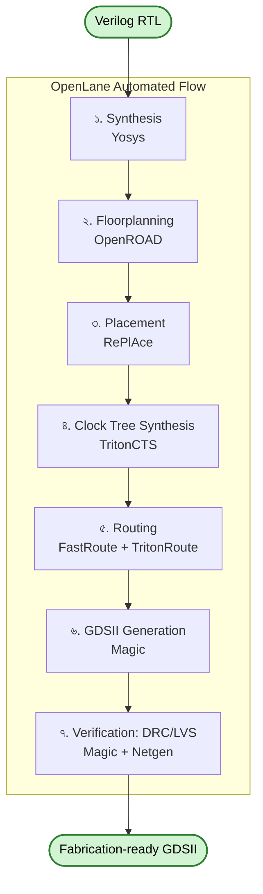

# 🛠️ Chapter 22: OpenLane & Physical Design Hands-On
## Build Your Chip Layout with Open Source Tools!

> **"Theory was good. Now let's BUILD the actual chip layout!"**
>
> **"Theory ভালো ছিল। এবার actual chip layout বানাই!"**

---

## 🎯 এই Chapter-এ তুমি করবে:

```
✅ OpenLane Setup - complete toolchain
✅ First Design Flow - simple circuit
✅ Your Processor Layout - real chip!
✅ Floorplan Exploration - see the layout
✅ Timing Optimization - meet constraints
✅ Power Analysis - how much power
✅ Final GDSII - ready for fab!
✅ তোমার chip layout complete! 🎉
```

**Time Required:** 2 weeks (hands-on practice)  
**Prerequisites:** Chapter 21 complete

---

## 🌟 টুল ভয় দেখাবে — তুমি দমে যেও না

প্রথমবার OpenLane চালালে অনেক log আর warning দেখবে — মনে হবে "আমি কি কিছু
ভেঙে ফেললাম?" 😅 না, ভাঙোনি। Error আর warning এই কাজের স্বাভাবিক অংশ; অভিজ্ঞ
engineer-রাও এগুলো পড়ে পড়েই এগোয়।

আমরা আগে একটা **ছোট্ট circuit** পুরো flow-তে চালাব (quick confidence!), তারপর
তোমার processor-এ যাব। এক ধাপ সফল হলে পরেরটা সহজ লাগবে। চলো! 🛠️

---

## 🚀 OpenLane - Complete ASIC Flow

### OpenLane আসলে কী?

Chapter 21-এ তুমি শিখেছ RTL থেকে GDSII পর্যন্ত যাত্রায় কতগুলো আলাদা আলাদা
ধাপ আছে — synthesis, floorplanning, placement, CTS, routing, signoff। প্রতিটা
ধাপের জন্য আলাদা একটা specialized tool লাগে, আর প্রতিটা tool-এর নিজস্ব command,
নিজস্ব file format, নিজস্ব মেজাজ আছে। হাতে হাতে এই tool-গুলো এক এক করে চালানো,
একটার output পরেরটার input হিসেবে সাজিয়ে দেওয়া — পেশাদার engineer-দের জন্যও এটা
মাথা ঘোরানো কাজ।

**OpenLane হলো সেই পুরো শৃঙ্খলটা এক সুতোয় বেঁধে দেওয়া conductor।** তুমি শুধু
তোমার Verilog আর একটা ছোট্ট config ফাইল দাও, একটা command চালাও — OpenLane ভিতরে
ভিতরে সব tool-কে সঠিক ক্রমে ডাকে, একটার ফল আরেকটাকে পাস করে, আর শেষে তোমার হাতে
fabrication-ready GDSII তুলে দেয়।

একটা analogy ভাবো: তুমি যদি একটা restaurant-এ গিয়ে আলাদা করে চাল কাটো, সবজি
কাটো, মসলা বাটো, ভাজো, রান্না করো — সেটা হলো হাতে হাতে tool চালানো। আর OpenLane
হলো একটা পূর্ণাঙ্গ **recipe + automated kitchen**: তুমি শুধু উপকরণ (RTL) আর রেসিপি
কার্ড (config) দিলে, পুরো রান্নাটা নিজে নিজে হয়ে গরম প্লেটে (GDSII) চলে আসে।

| বিষয় | OpenLane সম্পর্কে |
|------|-------------------|
| এটা কী | পুরোপুরি automated RTL-to-GDSII flow |
| বানিয়েছে | Efabless (Google-এর সহযোগিতায়) |
| কোথায় ব্যবহৃত হয় | TinyTapeout, ChipIgnite — আসল chip fabrication-এ |
| PDK | Sky130 আগে থেকেই integrated (Chapter 23-এ বিস্তারিত) |
| চালানোর সহজ উপায় | Docker container — এক command-এ পুরো environment |

কেন এটা শেখার জন্য আদর্শ:

- **Fully automated** — একটা command, পুরো flow। শুরুতে detail না বুঝলেও chip পাবে।
- **Open source** — কোনো license fee নেই, source code পড়তে পারো, পুরোটাই ফ্রি।
- **Production-tested** — খেলনা tool নয়; এই একই flow দিয়ে আসল silicon তৈরি হচ্ছে।
- **Active community** — আটকে গেলে GitHub Issues আর Slack-এ মানুষ সাহায্য করে।

মানে — একই tool দিয়ে তুমি **শিখবেও**, আবার পরে **আসল chip-ও** বানাবে। শেখার জন্য
একটা খেলনা আর কাজের জন্য আরেকটা — এই দুটো আলাদা করে শেখার ঝামেলা নেই।

---

## ২২.১ Setup OpenLane

### আগে environment, পরে chip

প্রতিটা physical design tool-এর নিজস্ব version, নিজস্ব library, নিজস্ব নির্ভরতা
(dependency) আছে। একটা tool-এর জন্য Python 3.8 দরকার, আরেকটার জন্য একটা পুরনো
library — এগুলো হাতে হাতে install করতে গেলে একটার সাথে আরেকটা সংঘর্ষ বাধায়, আর
তুমি ঘণ্টার পর ঘণ্টা error খুঁজতে খুঁজতে হতাশ হয়ে পড়ো। এটাকেই engineer-রা মজা করে
বলে **"dependency hell"**।

এখানেই **Docker** ত্রাতা। Docker-কে ভাবো একটা **সিল করা টিফিন বাক্স** হিসেবে:
OpenLane যা যা চায় — সঠিক version-এর প্রতিটা tool, library, setting — সব আগে থেকেই
সেই বাক্সে গোছানো। তুমি বাক্সটা খুললেই ভিতরের সবকিছু একদম যেমন দরকার তেমন কাজ করে,
তোমার নিজের কম্পিউটারে কী আছে না আছে তাতে কিছু আসে যায় না। তাই আমরা native install-এর
ঝামেলায় না গিয়ে Docker ব্যবহার করব — এটাই সবচেয়ে সহজ আর নির্ভরযোগ্য পথ। 🐳

### System Requirements:

OpenLane হালকা tool নয় — synthesis আর routing প্রচুর RAM আর disk খরচ করে। নিচের
জিনিসগুলো আগে নিশ্চিত করে নাও, যাতে মাঝপথে flow আটকে না যায়:

| জিনিস | ন্যূনতম | সুপারিশ | কেন দরকার |
|-------|---------|----------|-----------|
| RAM | ৮ GB | ১৬ GB | Placement/routing একসাথে অনেক ডেটা মেমোরিতে রাখে |
| Disk | ৫০+ GB | ৫০+ GB | Docker image + প্রতিটা run-এর intermediate ফাইল জমা হয় |
| OS | Ubuntu 20.04 / 22.04 | — | Docker দিয়ে যেকোনো platform-এ চলে |
| Software | Docker | Docker | এক টিফিন বাক্সে পুরো environment |

> 💡 RAM কম থাকলেও দমে যেও না — ছোট design (যেমন আমাদের inverter) ৮ GB-তেও দিব্যি
> চলে। বড় processor-এ গেলে তখন বেশি RAM-এর দরকার পড়বে।

### Installation Steps:

নিচের ধাপগুলো একটা একটা করে চালাও। প্রতিটা command কী করছে সেটা পাশে বুঝিয়ে দিলাম —
অন্ধভাবে copy-paste না করে বুঝে এগোলে পরে কিছু ভাঙলে নিজেই ঠিক করতে পারবে।

- **ধাপ ১ — Docker install:** তোমার টিফিন বাক্স খোলার যন্ত্রটাই আগে বসাচ্ছ।
  `usermod -aG docker $USER` line-টা তোমাকে `sudo` ছাড়াই Docker চালানোর অনুমতি দেয়।
  তাই এটা চালানোর পর অবশ্যই একবার logout করে আবার login করতে হবে — নইলে অনুমতিটা কার্যকর হবে না।
- **ধাপ ২ — OpenLane pull:** GitHub থেকে OpenLane-এর script নামাচ্ছ, আর
  `make pull-openlane` দিয়ে সেই গোছানো টিফিন বাক্সটা (Docker image) download করছ।
  এটা কয়েক GB, তাই ভালো internet থাকলে সুবিধা; একটু সময় লাগবে, ধৈর্য রাখো।
- **ধাপ ৩ — Test:** `make test` একটা ছোট্ট নমুনা design পুরো flow-তে চালিয়ে দেখে
  সব tool ঠিকঠাক বসেছে কিনা। `"Basic test passed"` দেখা মানে — তোমার পুরো
  toolchain তৈরি, এখন তুমি chip বানাতে প্রস্তুত! 🎉

```bash
# 1. Install Docker
sudo apt update
sudo apt install docker.io
sudo usermod -aG docker $USER
# Logout and login again

# 2. Pull OpenLane
git clone https://github.com/The-OpenROAD-Project/OpenLane.git
cd OpenLane
make pull-openlane

# 3. Test installation
make test

# Should see: "Basic test passed"
```

---

## ২২.২ First Design: Simple Inverter

মনে আছে উপরের reassurance section-এ বলেছিলাম — আগে একটা **ছোট্ট circuit** পুরো
flow-তে চালাব? এই সেই মুহূর্ত। আমরা একটা inverter দিয়ে শুরু করছি — একটাই gate,
একটা input, একটা output, এর চেয়ে সহজ কিছু হয় না।

কেন এত তুচ্ছ একটা circuit দিয়ে শুরু? কারণ এখানে লক্ষ্য inverter বানানো **নয়** —
লক্ষ্য হলো **পুরো flow-টা একবার চোখের সামনে শেষ হতে দেখা**। inverter এত ছোট যে
synthesis থেকে GDSII পর্যন্ত মাত্র কয়েক মিনিটে শেষ হয়। এতে দুটো লাভ:

- যদি কোথাও setup-এ ভুল থাকে, ছোট design-এ তা সাথে সাথে ধরা পড়ে — ১-২ ঘণ্টা
  processor চালানোর পর গিয়ে আবিষ্কার করতে হয় না যে শুরুতেই গণ্ডগোল ছিল।
- প্রথমবার নিজের হাতে GDSII তৈরি হতে দেখার যে আনন্দ — সেই confidence নিয়ে তুমি
  পরের বড় challenge-এ যাবে। ছোট জয় বড় জয়ের পথ তৈরি করে। 🛠️

OpenLane প্রতিটা design-কে একটা আলাদা **folder** হিসেবে চেনে। সেই folder-এ মূলত
দুটো জিনিস থাকে: তোমার Verilog (`src/`-এ) আর একটা config ফাইল যা OpenLane-কে বলে
দেয় design-টার নাম কী, কোথায় ফাইল আছে, clock কেমন — এসব। চলো একে একে বানাই।

### Create Design Directory:

```bash
cd OpenLane/designs
mkdir my_inverter
cd my_inverter
```

### Create Verilog File:

```verilog
// inverter.v
module inverter(
    input wire in,
    output wire out
);
    assign out = ~in;
endmodule
```

### Create Config File:

এই `config.tcl` ফাইলটাই হলো তোমার **রেসিপি কার্ড** — OpenLane-এর কাছে design
নিয়ে তোমার সব নির্দেশ এখানে লেখা থাকে। প্রতিটা line আসলে একটা environment variable
সেট করছে (`set ::env(...)`), আর OpenLane flow চালানোর সময় সেগুলো পড়ে নেয়।
নিচের ফাইলটাই দিলাম:

```tcl
# config.tcl
set ::env(DESIGN_NAME) inverter

set ::env(VERILOG_FILES) [glob $::env(DESIGN_DIR)/src/*.v]

set ::env(CLOCK_PERIOD) "10.0"
set ::env(CLOCK_PORT) ""

set ::env(FP_CORE_UTIL) 40
set ::env(FP_ASPECT_RATIO) 1
set ::env(FP_PDN_VPITCH) 25
set ::env(FP_PDN_HPITCH) 25

set ::env(PL_TARGET_DENSITY) 0.5
```

প্রতিটা setting আসলে কী বলছে, এক নজরে:

| Setting | এটা কী ঠিক করে | সহজ ভাষায় |
|---------|----------------|-----------|
| `DESIGN_NAME` | top-level module-এর নাম | তোমার Verilog-এর top module ঠিক এই নামেই হতে হবে |
| `VERILOG_FILES` | কোন কোন `.v` ফাইল নেবে | `src/` folder-এর সব `.v` নিজে নিজে খুঁজে নেয় |
| `CLOCK_PERIOD` | এক clock cycle কত ন্যানোসেকেন্ড | এটাই timing-এর budget; ছোট মান = দ্রুত chip, কঠিন target |
| `CLOCK_PORT` | কোন port-টা clock | inverter-এ clock নেই, তাই খালি (`""`) |
| `FP_CORE_UTIL` | core area-র কত % cell-এ ভরবে | কম রাখলে cell-গুলো বসানোর জায়গা বেশি, রুটিং সহজ |
| `FP_ASPECT_RATIO` | die-র উচ্চতা ÷ প্রস্থ | `1` মানে বর্গাকার chip |
| `FP_PDN_VPITCH` / `FP_PDN_HPITCH` | power grid-এর তারগুলোর ব্যবধান | বিদ্যুৎ বিলির জাল কত ঘন হবে |
| `PL_TARGET_DENSITY` | placement-এ cell কত ঘন বসবে | ০.৫ মানে অর্ধেক জায়গা ভরা, বাকিটা শ্বাস নেওয়ার ফাঁক |

> 💡 খেয়াল করো `CLOCK_PORT` খালি রাখা হয়েছে — কারণ inverter একটা purely
> combinational circuit, এর কোনো clock নেই। তোমার processor-এ গেলে এখানে আসল
> clock port-এর নাম বসবে। শুরুতে এই মানগুলো নিয়ে চিন্তা কোরো না; flow চালিয়ে
> ফল দেখে দেখে পরে এগুলো tune করতে শিখবে।

### Run OpenLane:

দুটো ধাপ এখানে। প্রথমে `make mount` — এটা সেই Docker টিফিন বাক্সটা খুলে তোমাকে
ভিতরে ঢুকিয়ে দেয়। এর পর তোমার terminal-এর prompt বদলে যাবে; এখন তুমি আর তোমার
নিজের কম্পিউটারে নেই, OpenLane-এর গোছানো environment-এর ভিতরে আছ — যেখানে সব tool
হাতের কাছে।

দ্বিতীয় ধাপ `./flow.tcl -design inverter -tag run1` — এটাই আসল জাদু-command।
`-design inverter` বলছে কোন design চালাতে হবে, আর `-tag run1` এই বারের চালানোটাকে
একটা নাম দিচ্ছে। এই tag গুরুত্বপূর্ণ: প্রতিবার চালালে আলাদা tag দিলে আগের ফল মুছে
যায় না, তুমি `run1`, `run2` পাশাপাশি রেখে তুলনা করতে পারো।

```bash
# In OpenLane directory
make mount

# Inside Docker container
./flow.tcl -design inverter -tag run1

# Wait 5-10 minutes...
# Should complete successfully!
```

command চালানোর পর terminal-এ সারি সারি log গড়িয়ে যাবে — synthesis, floorplan,
placement... এক এক করে ধাপগুলো পেরোতে দেখবে। ভয় পেও না, এটাই স্বাভাবিক। শেষে
সবুজ সংকেত মানে তোমার inverter এখন একটা পূর্ণাঙ্গ layout।

### View Results:

OpenLane প্রতিটা run-এর সব ফলাফল একটা গোছানো folder-কাঠামোতে রাখে:
`designs/<design>/runs/<tag>/`। ভিতরে দুটো জায়গা তোমার সবচেয়ে কাজে লাগবে —
`results/` (চূড়ান্ত ফাইল, যেমন GDSII) আর `reports/` (কী হলো তার হিসাব-নিকাশ)।

```bash
# Results in:
designs/inverter/runs/run1/results/

# View layout
klayout designs/inverter/runs/run1/results/final/gds/inverter.gds

# View reports
cat designs/inverter/runs/run1/reports/final/summary.rpt
```

`klayout` command-টা সেই `.gds` ফাইল খুলে দেখাবে — এটাই তোমার চিপের আসল নকশা,
প্রতিটা transistor আর তার, রঙিন স্তরে স্তরে সাজানো। আর `summary.rpt`-এ এক জায়গায়
পাবে area, timing-এর সারসংক্ষেপ।

🎉 **You made your first chip layout!**

থামো এক মুহূর্ত — এটা সত্যিই উদযাপনের মতো ব্যাপার। তুমি এইমাত্র একটা Verilog
description-কে এমন একটা নকশায় রূপান্তর করলে যা হুবহু একটা কারখানায় পাঠালে সিলিকনে
খোদাই হয়ে যাবে। ছোট circuit হোক, কিন্তু **পুরো RTL-to-GDSII পথটা তুমি একবার নিজ
চোখে পেরিয়ে এলে।** এবার তুমি জানো flow-টা কেমন দেখতে — তাই পরের বড় design আর
অচেনা লাগবে না।

---

## ২২.৩ Understanding OpenLane Flow

inverter চালিয়ে তুমি flow-টা **ব্যবহার** করেছ — কিন্তু ভিতরে আসলে কী ঘটল? এবার
পর্দার পিছনে উঁকি দিই। OpenLane যখন চলে, তখন সে এক শৃঙ্খল ধাপ পেরোয়, প্রতিটাতে
একটা specialized tool ডাকে, আর একটার output পরেরটার input হয়ে যায়। এই পুরো যাত্রা
এক নজরে:



প্রতিটা ধাপ আসলে কী input নেয়, কী output দেয়, আর কোন tool করে — এক টেবিলে:

| # | ধাপ | Input | Output | Tool |
|---|------|-------|--------|------|
| ১ | Synthesis | Verilog RTL | Gate-level netlist | Yosys |
| ২ | Floorplanning | Netlist | Die size, IO placement | OpenROAD |
| ৩ | Placement | Netlist + Floorplan | Cell positions | RePlAce |
| ৪ | CTS (Clock Tree Synthesis) | Placed design | Clock distribution | TritonCTS |
| ৫ | Routing | Placed + CTS | Metal connections | FastRoute + TritonRoute |
| ৬ | GDSII Generation | Routed design | Final layout | Magic |
| ৭ | Verification | GDSII | DRC/LVS reports | Magic + Netgen |

এবার প্রতিটা ধাপ একটু গভীরে বুঝি — কারণ পরে report পড়ার সময় এই intuition-টাই
তোমাকে বলে দেবে কোথায় কী খুঁজতে হবে:

- **১. Synthesis (Yosys):** তোমার Verilog তো মানুষের ভাষায় লেখা — "এই দুটো
  সংখ্যা যোগ করো"। Synthesis সেটাকে অনুবাদ করে দেয় Sky130 PDK-এর **আসল
  standard cell**-এর ভাষায় — অর্থাৎ "এই AND gate, ওই flip-flop, সেই
  inverter"। একে ভাবো রান্নার রেসিপিকে দোকানে কেনা নির্দিষ্ট উপকরণের তালিকায়
  রূপান্তর করা। এর ফল একটা **netlist**: কোন কোন gate লাগবে আর সেগুলো কীভাবে
  জোড়া।
- **২. Floorplanning (OpenROAD):** এবার ঠিক করতে হবে chip-টা কত বড় হবে আর তার
  সীমানা কোথায়। এটা যেন একটা খালি জমিতে বাড়ির নকশা আঁকা — কতটুকু জায়গা, কোথায়
  দরজা-জানালা (IO pin), আর কোথা দিয়ে বিদ্যুতের লাইন (power grid) যাবে।
- **৩. Placement (RePlAce):** সব gate-কে এবার সেই জমির ভিতরে বসিয়ে দেওয়া হয়।
  কোন cell কোথায় বসবে সেটা যত্ন করে ঠিক করতে হয় — যে দুটো cell-এর মধ্যে তার
  যাবে, তাদের কাছাকাছি বসালে তার ছোট হয়, signal দ্রুত যায়। শহরে দপ্তরগুলো
  যুক্তি মেনে সাজানোর মতো।
- **৪. CTS — Clock Tree Synthesis (TritonCTS):** clock signal-টা chip-এর সব
  flip-flop-এ একসাথে পৌঁছানো দরকার, নইলে সময়ের হিসাব এলোমেলো হয়ে যায়। CTS একটা
  ভারসাম্যপূর্ণ **গাছের মতো বিলিব্যবস্থা** বানায়, যাতে clock-এর "টিক" প্রতিটা
  প্রান্তে প্রায় একই মুহূর্তে পৌঁছায়। (combinational design-এ clock নেই বলে এই
  ধাপ কার্যত ফাঁকা থাকে।)
- **৫. Routing (FastRoute + TritonRoute):** এতক্ষণ cell-গুলো বসানো হয়েছে, এবার
  তাদের মধ্যে আসল **ধাতব তার** টানা হয় — বহু স্তরের metal layer-এ। প্রথমে
  FastRoute মোটা দাগে পথ ঠিক করে (global), তারপর TritonRoute প্রতিটা তার
  নিখুঁতভাবে বসায় (detailed)। বহুতল উড়ালসড়ক বানানোর মতো — কোনো তার যেন আরেকটাকে
  short না করে।
- **৬. GDSII Generation (Magic):** সব তথ্য মিলিয়ে চূড়ান্ত layout ফাইল —
  **GDSII** — তৈরি হয়। এটাই সেই সর্বজনীন format যা কারখানা (foundry) বোঝে; এই এক
  ফাইলেই তোমার পুরো chip-এর প্রতিটা আকৃতি ধরা থাকে।
- **৭. Verification — DRC/LVS (Magic + Netgen):** শেষ পরীক্ষা। **DRC** দেখে
  layout-টা foundry-র নিয়ম (design rule) মানছে কিনা — তার দুটো খুব কাছাকাছি নয় তো?
  **LVS** মিলিয়ে দেখে layout-টা ঠিক সেই circuit-ই কিনা যা তুমি Verilog-এ লিখেছিলে।
  দুটো পাস করলে তবেই chip fabrication-এর যোগ্য। (DRC ও LVS নিয়ে বিস্তারিত
  ২২.৮ ও ২২.৯-এ।)

### Interactive Mode:

উপরে `flow.tcl` একটা command-এ পুরো শৃঙ্খলটা চালিয়ে দিয়েছিল — দারুণ সুবিধা, কিন্তু
যখন কোথাও কিছু আটকায় তখন তুমি জানতে চাইবে **ঠিক কোন ধাপে** সমস্যা। তখনই
**interactive mode** কাজে আসে: এখানে তুমি নিজে এক এক করে ধাপ চালাও, প্রতিটার পর
থেমে ফল দেখো, তারপর পরেরটায় যাও।

এটা যেন automatic গাড়ি থেকে manual gear-এ নামা — একটু বেশি হাত লাগে, কিন্তু পুরো
নিয়ন্ত্রণ তোমার হাতে। ধাপগুলোর ক্রম খেয়াল করো; এটা হুবহু উপরের flowchart-এরই
ক্রম, শুধু এবার তুমি নিজে চালাচ্ছ:

```bash
# For debugging, use interactive mode
./flow.tcl -interactive

# Now run step by step:
prep -design inverter

run_synthesis
run_floorplan
run_placement
run_cts
run_routing
run_magic
run_magic_spice_export
run_lvs
run_antenna_check

# View at each stage!
```

`prep -design inverter` ধাপটা সব কিছু প্রস্তুত করে — config পড়ে, ফাইল গুছিয়ে নেয়।
এরপর প্রতিটা `run_*` command উপরের flowchart-এর একটা করে ধাপ। তালিকার শেষে দুটো
বাড়তি signoff-ও দেখবে: `run_lvs` (layout আর schematic মেলায়) আর
`run_antenna_check` — এটা fabrication-এর সময় তৈরি হওয়া একটা ভৌত সমস্যা ঠেকায়,
যেখানে লম্বা ধাতব তারে জমে থাকা চার্জ নাজুক transistor gate নষ্ট করে দিতে পারে।
প্রতিটা ধাপের পর তুমি KLayout-এ চালু design দেখতে পারো — চিপটা কীভাবে ধীরে ধীরে
আকার নিচ্ছে, নিজ চোখে।

> 💡 কাজের নিয়ম: নতুন কিছু চেষ্টা করার সময় interactive mode ব্যবহার করো, ধাপে
> ধাপে বুঝতে। আর সব ঠিকঠাক চললে এক command-এর `flow.tcl` দিয়ে পুরোটা একবারে
> চালিয়ে দাও — সময় বাঁচবে।

---

## ২২.৪ Your RISC-V Processor Layout

এই মুহূর্তটার জন্যই তো এতদূর আসা — তোমার নিজের বানানো RISC-V processor-কে এবার
আমরা একটা আসল chip layout-এ রূপ দেব! inverter দিয়ে flow-টা চেনা হয়ে গেছে; এখন
ঠিক সেই flow-তেই অনেক বড়, অনেক জীবন্ত একটা design চালাব। ধাপগুলো একই — শুধু
design বড়, তাই সময় বেশি লাগবে আর কিছু নতুন config setting যোগ হবে।

### Prepare Processor Design:

আগের মতোই — designs-এর ভিতরে একটা নতুন folder, আর তার ভিতরে `src/` যেখানে তোমার
Verilog থাকবে।

```bash
# Create processor design directory
cd OpenLane/designs
mkdir riscv_core
cd riscv_core
mkdir src
```

### Simplified Processor for First Tapeout:

এখানে একটা গুরুত্বপূর্ণ কৌশলগত সিদ্ধান্ত। তোমার FPGA-তে চলা পূর্ণ processor-টা
হয়তো ৩২টা register, বড় memory, হয়তো pipeline-ও আছে। কিন্তু **প্রথম tapeout-এর
জন্য আমরা ইচ্ছে করে একটা ছোট, সরল সংস্করণ বানাচ্ছি**। কেন?

- TinyTapeout-এর একটা tile-এ জায়গা সীমিত। বড় design সেখানে আঁটবে না, বা আঁটাতে
  গিয়ে congestion আর timing-এর পাহাড় তৈরি হবে।
- ছোট design মানে দ্রুত flow, কম error, আর প্রথম চেষ্টায় সফল হওয়ার বেশি সম্ভাবনা।
  প্রথম chip-টা **কাজ করুক** — বড় করার সময় পরে অনেক আছে।

তাই এখানে RV32I base রাখছি, register ৩২ থেকে কমিয়ে ১৬, আর memory ছোট (৫১২ byte
করে)। নিচের template-টা শুধু কাঠামো দেখাচ্ছে; ভিতরে তুমি তোমার আগের অধ্যায়ে লেখা
আসল processor কোডটাই — এই সীমার মধ্যে ছেঁটে — বসাবে:

```verilog
// riscv_simple.v
// Simplified RISC-V for first chip
module riscv_simple (
    input wire clk,
    input wire reset,
    input wire [7:0] gpio_in,
    output wire [7:0] gpio_out
);
    // Simplified version of your processor
    // Just RV32I base, 16 registers
    // 512 byte instruction memory
    // 512 byte data memory
    
    // (Use your actual processor code
    //  but simplified for area constraints)
    
endmodule
```

### Config for Processor:

inverter-এর config-এর তুলনায় এখানে কিছু নতুন setting যোগ হয়েছে — কারণ এবার আমাদের
design-এ সত্যিকারের clock আছে, নির্দিষ্ট die size দরকার, আর power পৌঁছানোর জন্য
নাম-ধরা net লাগবে। পুরো ফাইলটা:

```tcl
# config.tcl
set ::env(DESIGN_NAME) riscv_simple

set ::env(VERILOG_FILES) [glob $::env(DESIGN_DIR)/src/*.v]

# Clock: 50 MHz (20ns period)
set ::env(CLOCK_PERIOD) "20.0"
set ::env(CLOCK_PORT) "clk"
set ::env(CLOCK_NET) "clk"

# Chip size (for TinyTapeout: 160um x 100um)
set ::env(FP_CORE_UTIL) 50
set ::env(FP_ASPECT_RATIO) 1
set ::env(FP_SIZING) absolute
set ::env(DIE_AREA) "0 0 200 200"

# Placement density
set ::env(PL_TARGET_DENSITY) 0.55

# IO placement
set ::env(FP_PIN_ORDER_CFG) $::env(DESIGN_DIR)/pin_order.cfg

# Routing
set ::env(ROUTING_CORES) 4

# Power
set ::env(VDD_NETS) [list {vccd1}]
set ::env(GND_NETS) [list {vssd1}]
```

নতুন আর গুরুত্বপূর্ণ setting-গুলো বুঝে নাও:

| Setting | এটা কী করে | কেন এখানে দরকার |
|---------|------------|------------------|
| `CLOCK_PERIOD "20.0"` | ২০ ns cycle = ৫০ MHz target | tool-কে বলছে কত দ্রুত চলতে হবে; এটাই timing-এর মূল লক্ষ্য |
| `CLOCK_PORT` / `CLOCK_NET` `"clk"` | কোন port/net হলো clock | এবার আসল clock আছে, তাই নাম দিতে হলো (inverter-এ খালি ছিল) |
| `FP_SIZING absolute` | die size নিজে ঠিক করব, auto নয় | নির্দিষ্ট আকারে চাই, তাই manual mode |
| `DIE_AREA "0 0 200 200"` | chip-এর সীমানা (µm-এ) | ২০০×২০০ µm-এর একটা বর্গাকার জমি |
| `PL_TARGET_DENSITY 0.55` | placement ঘনত্ব | inverter-এর ০.৫-এর চেয়ে একটু বেশি, বড় design-কে আঁটাতে |
| `FP_PIN_ORDER_CFG` | IO pin-এর সাজানো ক্রম | কোন দিকে কোন pin বসবে, একটা আলাদা ফাইলে লেখা |
| `ROUTING_CORES 4` | routing-এ ৪টা CPU core খাটবে | বড় design-এ routing ভারী, সমান্তরালে চললে দ্রুত হয় |
| `VDD_NETS` / `GND_NETS` | power ও ground net-এর নাম | Sky130-তে `vccd1`/`vssd1` — বিদ্যুৎ এদের দিয়েই বিলি হয় |

> 💡 **নোট:** খেয়াল করো — comment-এ লেখা "TinyTapeout: 160um x 100um", অথচ `DIE_AREA`
> দেওয়া `0 0 200 200` (২০০×২০০ µm) — সংখ্যা দুটো মেলে না। এটি কেবল বোঝানোর সুবিধার্থে দেওয়া একটি উদাহরণ;
> আসল TinyTapeout submission-এ die size টেমপ্লেট থেকে নির্ধারিত হয় (Chapter 24-এ বিস্তারিত)।

### Run Processor Flow:

command একই — শুধু `-design`-এ এবার `riscv_simple`। বড় পার্থক্য হলো **সময়**:
inverter যেখানে কয়েক মিনিটে শেষ, সেখানে processor-এ ১-২ ঘণ্টা লাগতে পারে। তাই
চা/কফি নিয়ে বসো, আর terminal-এর log-এ চোখ রাখো — কোন ধাপে কী হচ্ছে দেখতে দেখতে
flow সম্পর্কে তোমার intuition আরও পোক্ত হবে।

```bash
./flow.tcl -design riscv_simple -tag run1

# Will take 1-2 hours depending on design size
# Monitor progress in terminal

# Common issues and fixes:
# - Timing violations → Increase clock period
# - Congestion → Reduce density
# - DRC violations → Check design rules
```

বড় design-এ প্রথমবারেই সব নিখুঁত হবে না — আর সেটাই স্বাভাবিক। code block-এর
শেষ তিনটা comment আসলে তোমার জন্য একটা ছোট্ট troubleshooting মানচিত্র:

| তুমি যা দেখবে | এর মানে | প্রথম যা চেষ্টা করবে |
|---------------|----------|----------------------|
| Timing violation | signal নির্ধারিত সময়ে পৌঁছাচ্ছে না | `CLOCK_PERIOD` বাড়াও (chip একটু ধীর হবে, কিন্তু চলবে) |
| Congestion | এক জায়গায় তার ঠাসাঠাসি, routing আটকাচ্ছে | `PL_TARGET_DENSITY` কমাও (cell-দের শ্বাস নেওয়ার জায়গা দাও) |
| DRC violation | layout foundry-র নিয়ম ভাঙছে | design rule মিলিয়ে দেখো (২২.৮-এ বিস্তারিত) |

ভয়ের কিছু নেই — এগুলোর প্রতিটার সমাধান ২২.৬-এ আলাদা করে শেখানো আছে। এক একটা সমস্যা
সমাধান করতে করতেই তুমি আসল physical design engineer হয়ে উঠবে।

---

## ২২.৫ Analyzing Results

flow শেষ — কিন্তু কাজ এখানেই থামে না। OpenLane চালানোর আসল দক্ষতা হলো **report
পড়তে পারা**। একজন ডাক্তার যেমন রক্ত পরীক্ষার রিপোর্ট দেখে রোগীর অবস্থা বোঝে,
তেমনি তুমি এই report-গুলো পড়ে বুঝবে তোমার chip-টা সুস্থ কিনা — সে কত জায়গা নিল,
কত দ্রুত চলবে, কত power খাবে, আর কোথাও সমস্যা আছে কিনা।

physical design-এর তিনটা মূল মাপকাঠি একসাথে বলা হয় **PPA** — **P**ower (বিদ্যুৎ),
**P**erformance (গতি/timing), **A**rea (জায়গা)। ভালো design মানে এই তিনটার একটা
সুন্দর ভারসাম্য। নিচের প্রতিটা report এই PPA-রই এক একটা দিক দেখায়।

### Synthesis Report:

সবার আগের রিপোর্ট — synthesis-এর পর তৈরি। এটা বলে দেয় তোমার Verilog কতগুলো আসল
gate আর flip-flop-এ পরিণত হলো। বড় সংখ্যা মানে বড় (আর সাধারণত ধীর, বেশি power-খাওয়া)
chip। এটাই তোমার design-এর প্রথম "ওজন মাপা"।

```bash
cat designs/riscv_simple/runs/run1/reports/synthesis/1-synthesis.stat.rpt
```

Example output:
```
Chip area for module '\riscv_simple': 12500.000000

Number of cells:               850
Number of flip-flops:          250
Number of logic gates:         600

Max frequency: 55.2 MHz
```

কীভাবে পড়বে: **Number of cells** তোমার মোট building block-এর সংখ্যা।
**flip-flops** হলো state রাখার জায়গা — register আর pipeline এখান থেকে আসে।
**Max frequency** হলো synthesis-এর প্রাথমিক অনুমান, এখানে ৫৫.২ MHz — মানে তোমার
৫০ MHz target আপাতদৃষ্টিতে সম্ভব। তবে সাবধান: এটা placement আর routing-এর
**আগের** অনুমান; আসল চিত্রটা পাবে নিচের timing report-এ, যখন তারের আসল দৈর্ঘ্য
হিসাবে ঢোকে।

### Timing Report:

এটাই সবচেয়ে গুরুত্বপূর্ণ report-গুলোর একটা — STA মানে **Static Timing Analysis**।
এটা signoff-এর পর তৈরি, অর্থাৎ routing শেষে আসল তারসহ হিসাব করা। মূল ধারণাটা
**slack**:

- **slack ধনাত্মক (+)** = signal সময়ের আগেই পৌঁছেছে — পরীক্ষায় পাস, হাতে সময়ও ছিল। 👍
- **slack ঋণাত্মক (−)** = signal দেরি করেছে — পরীক্ষায় ফেল (VIOLATED)। ❌

```bash
cat designs/riscv_simple/runs/run1/reports/signoff/sta.rpt
```

```
Worst slack: -0.23 ns (VIOLATED!)
Critical path: clk → register → ALU → register

Need to:
- Increase clock period, OR
- Optimize critical path
```

কীভাবে পড়বে: এখানে **Worst slack −0.23 ns** — মানে তোমার সবচেয়ে ধীর পথটা clock
cycle-এর চেয়ে ০.২৩ ns বেশি সময় নিচ্ছে। **Critical path** সেই দীর্ঘতম পথটা দেখায়:
register → ALU → register। ALU যেহেতু সাধারণত সবচেয়ে ভারী গণনা করে, critical path
প্রায়ই তার ভিতর দিয়েই যায়। সমাধান দুটো: হয় clock একটু ধীর করো (`CLOCK_PERIOD`
বাড়াও — সহজতম), নয়তো ওই পথটাকেই দ্রুততর করো। দুটোই ২২.৬-এ শেখানো আছে।

> 💡 ঋণাত্মক slack দেখে হতাশ হয়ো না — প্রথম run-এ timing violation প্রায়
> অবধারিত। এটা ব্যর্থতা নয়, বরং tool তোমাকে ঠিক কোথায় হাত দিতে হবে দেখিয়ে দিচ্ছে।

### Power Report:

PPA-র **Power** অংশ। chip কত বিদ্যুৎ খাবে — battery-চালিত IoT device-এর জন্য এটা
জীবন-মরণ প্রশ্ন। power দুই ভাগে আসে:

- **Dynamic power** — কাজ করার সময় খরচ, signal switch করলে। কাজ যত বেশি, তত বেশি।
- **Leakage power** — কিছু না করেও transistor দিয়ে চুঁইয়ে যাওয়া বিদ্যুৎ, সবসময়ই থাকে।

```bash
cat designs/riscv_simple/runs/run1/reports/signoff/power.rpt
```

```
Total Power: 2.5 mW @ 1.8V
Dynamic: 2.0 mW
Leakage: 0.5 mW

Good for IoT applications!
```

কীভাবে পড়বে: মোট মাত্র **2.5 mW @ 1.8V** — অত্যন্ত কম। তুলনা করো: একটা সাধারণ LED
জ্বলে কয়েক মিলিওয়াটে। এত কম power বলেই এই ধরনের ছোট processor একটা coin cell
battery-তে দিনের পর দিন চলতে পারে — ঠিক যেমন একটা sensor node-এর দরকার। তোমার Dynamic
(2.0 mW) যেহেতু Leakage (0.5 mW)-এর চেয়ে বড়, বুঝতে পারছ chip বেশিরভাগ সময় আসলে
কাজ করছে — অলস বসে চুঁইয়ে যাচ্ছে না।

### Area Report:

PPA-র শেষ অংশ — **Area**। chip কত জায়গা নিল, µm²/mm²-এ মাপা। জায়গা মানেই খরচ:
fabrication-এ যত বড় die, তত দামি। আর TinyTapeout-এর tile-এ যেহেতু জায়গা বাঁধা,
তোমার design সেটার মধ্যে আঁটতেই হবে।

```
Core area: 0.025 mm²
Total die area: 0.04 mm²
Utilization: 62%
```

কীভাবে পড়বে: **Core area** হলো cell-গুলো যেখানে বসে, আর **Total die area**-তে
চারপাশের IO আর margin-ও যোগ। **Utilization 62%** মানে core-এর ৬২% cell-এ ভরা,
বাকি ৩৮% রাখা হয়েছে তার টানার (routing) ফাঁক হিসেবে — এটা স্বাস্থ্যকর। ১০০%-এর
কাছাকাছি ভরে ফেললে routing-এ congestion হয়; আবার খুব কম হলে জায়গা নষ্ট। ৫০–৭০%
সাধারণত আদর্শ অঞ্চল।

> ✅ এই সংখ্যা — **0.04 mm²** — বলছে তোমার processor TinyTapeout-এর একটা tile-এ
> অনায়াসে এঁটে যাবে। মানে এটা শুধু simulation-এ নয়, সত্যিকারের fabrication-এও
> পাঠানোর মতো ছোট! 🎉

---

## ২২.৬ Optimization Techniques

report পড়ে সমস্যা চিনলে — এবার তা ঠিক করার পালা। কিন্তু এখানে একটা গভীর সত্য আগে
বুঝে নাও: **PPA-র তিনটা দিক একে অপরের সাথে টানাপোড়েনে থাকে।** এটাকে engineer-রা
বলে trade-off — একটা ভালো করতে গেলে আরেকটা প্রায়ই খারাপ হয়:

- Chip-কে **দ্রুত** করতে গেলে সাধারণত বড় cell আর বেশি buffer লাগে → area ও power বাড়ে।
- **জায়গা কমাতে** cell ঠেসে বসালে → routing কঠিন হয়, timing খারাপ হতে পারে।
- **Power কমাতে** ধীর low-power cell নিলে → গতি কমে।

তাই "সেরা design" বলে কিছু নেই — আছে শুধু **তোমার লক্ষ্যের জন্য সেরা ভারসাম্য**।
নিচের তিনটা subsection তিন রকম লক্ষ্যের জন্য আলাদা আলাদা knob দেখায়। মূল কৌশল:
একবারে একটা জিনিস বদলাও, নতুন tag দিয়ে re-run করো, আর report মিলিয়ে দেখো কী হলো।

### Fix Timing Violations:

slack ঋণাত্মক? নিচের option-গুলো ওপর থেকে নিচে — সহজ থেকে কঠিন। উপরেরটা আগে চেষ্টা করো।

```tcl
# Option 1: Relax clock
set ::env(CLOCK_PERIOD) "25.0"  # 40 MHz instead of 50 MHz

# Option 2: Better placement
set ::env(PL_TARGET_DENSITY) 0.50  # More space

# Option 3: Use faster cells
set ::env(SYNTH_STRATEGY) "DELAY 0"

# Option 4: Add buffers
set ::env(SYNTH_BUFFERING) 1
set ::env(SYNTH_SIZING) 1

# Re-run
./flow.tcl -design riscv_simple -tag run2
```

কোনটা কী করছে: **Option 1** clock period বাড়িয়ে target সহজ করে দেয় — chip ধীর
হয়, কিন্তু slack ধনাত্মক হয়ে যায়। সবচেয়ে সহজ আর নিশ্চিত উপায়। **Option 2** cell-দের
আরও জায়গা দেয়, যাতে তার ছোট হয় আর signal দ্রুত পৌঁছায়। **Option 3** ("DELAY 0")
synthesis-কে বলে গতিকে সবার আগে রাখতে — দ্রুত কিন্তু বড় cell বেছে নেবে। **Option 4**
লম্বা পথে buffer বসায় ও cell resize করে — যেমন লম্বা পানির পাইপলাইনে মাঝে মাঝে পাম্প
বসালে চাপ ঠিক থাকে। খেয়াল রাখো, প্রতিটা option-ই area বা power-এ কিছুটা মাশুল নেয়।
শেষে নতুন `-tag run2` দিয়ে re-run — আগের `run1` অক্ষত থাকবে, তুমি পাশাপাশি তুলনা করতে পারবে।

### Reduce Area:

chip TinyTapeout tile-এ আঁটছে না, বা ছোট করে fabrication খরচ বাঁচাতে চাও? তখন এগুলো।

```tcl
# Use smaller cells
set ::env(SYNTH_STRATEGY) "AREA 0"

# Increase density
set ::env(PL_TARGET_DENSITY) 0.65

# Less routing resources
set ::env(GLB_RT_ADJUSTMENT) 0.15
```

কোনটা কী করছে: **"AREA 0"** synthesis-কে বলে জায়গাকে সবার আগে রাখতে — ছোট cell
বেছে নেবে (timing-এর বিনিময়ে)। **density 0.65** cell-গুলো আরও ঠেসে বসায়, ফাঁক কমায়।
**GLB_RT_ADJUSTMENT** routing-এ ব্যবহৃত জায়গা কমায়। মনে রেখো — এগুলো সবই timing-এর
বিপরীত দিকে টানে; তাই area কমানোর পর timing report আবার মিলিয়ে দেখা জরুরি, যাতে নতুন
violation না ঢুকে পড়ে।

### Reduce Power:

battery-চালিত বা IoT design-এর জন্য power কমানোই মূল লক্ষ্য হতে পারে।

```tcl
# Clock gating
set ::env(CLOCK_GATING_ENABLE) 1

# Low power cells
set ::env(STD_CELL_LIBRARY) "sky130_fd_sc_lp"

# Power optimization
set ::env(PL_RESIZER_DESIGN_OPTIMIZATIONS) 1
set ::env(PL_RESIZER_TIMING_OPTIMIZATIONS) 1
```

কোনটা কী করছে: **Clock gating** হলো সবচেয়ে শক্তিশালী কৌশল — যে অংশ এখন কাজ করছে না,
তার clock সাময়িকভাবে বন্ধ করে দেয়। ঘর থেকে বেরোনোর সময় আলো নিভিয়ে যাওয়ার মতো; নিষ্ক্রিয়
flip-flop অযথা switch করে power পোড়ায় না। **`sky130_fd_sc_lp`** হলো একটা low-power
(lp) standard cell library — কম leakage, একটু ধীর। **resizer optimization**-গুলো
cell আকার সূক্ষ্মভাবে সাজিয়ে অপচয় কমায়।

> 💡 chapter-শেষের exercise-এ ঠিক এই তিন লক্ষ্য নিয়ে তিনটা আলাদা run চালাতে বলা
> হবে — performance, area, power। এই subsection-গুলোই তখন তোমার হাতিয়ার।

---

## ২২.৭ Viewing Your Chip Layout

এতক্ষণ সব ছিল সংখ্যা আর report — এবার নিজের চোখে চিপটা **দেখার** পালা! GDSII ফাইল
তো একটা layout, কিন্তু সেটা পড়ার জন্য একটা viewer দরকার। সেই viewer-ই হলো
**KLayout** — ফ্রি, শক্তিশালী, আর industry-তেও ব্যবহৃত।

### KLayout - The Best Free Viewer:

দুটো উপায়ে install করতে পারো — `apt` দিয়ে সরাসরি, অথবা AppImage নামিয়ে (যেখানে
install-ই করতে হয় না, ফাইলটা চালালেই হলো)। শেষ command-টাই তোমার processor-এর
`.gds` খুলে দেবে।

```bash
# Install
sudo apt install klayout

# Or AppImage:
wget https://www.klayout.de/downloads/klayout-0.28-linux.AppImage
chmod +x klayout-0.28-linux.AppImage
./klayout-0.28-linux.AppImage

# Open your design
klayout designs/riscv_simple/runs/run1/results/final/gds/riscv_simple.gds
```

### What You'll See:

চিপ আসলে একটা **বহুতল বাড়ির** মতো — অনেকগুলো স্তর একটার ওপর আরেকটা সাজানো। KLayout
প্রতিটা স্তর আলাদা রঙে দেখায়; তুমি স্তর on/off করে ভিতরে উঁকি দিতে পারো। নিচ থেকে
উপরে স্তরগুলো যা যা দেখবে:

| Layer | এটা কী | বাড়ির উপমায় |
|-------|--------|---------------|
| N-well / P-well | transistor বসার ভিত্তি (substrate-এর অঞ্চল) | একদম নিচের ভিত |
| Diffusion | transistor-এর source ও drain | মেঝে |
| Polysilicon | transistor-এর gate (যা switch নিয়ন্ত্রণ করে) | দেয়ালের কাঠামো |
| Metal 1–5 | signal ও power বহনকারী তার | উপরের তলাগুলোর তারজাল |
| Vias | এক স্তরের তারকে আরেক স্তরের সাথে জোড়ার ফুটো | তলার মাঝে লিফট/সিঁড়ি |

নিচের স্তরে আসল transistor, আর উপরের metal স্তরগুলোতে তাদের জোড়ার তার — ঠিক যেমন
নিচে ঘর, উপরে বিদ্যুতের wiring।

KLayout-এ তুমি যা করতে পারবে:

- **Zoom in/out** — পুরো chip থেকে একটা একক transistor পর্যন্ত নামতে পারো।
- **Measure distances** — দুটো জিনিসের দূরত্ব মেপে দেখা।
- **Check design rules** — নিয়ম ভাঙা আছে কিনা যাচাই।
- **Export images** — তোমার চিপের ছবি তুলে #BuildYourOwnProcessor-এ শেয়ার করার জন্য!
- **3D view** (Tools → 3D view) — স্তরগুলো ত্রিমাত্রিকভাবে দেখা; এখানেই "বহুতল বাড়ি"
  উপমাটা সত্যি সত্যি চোখে ধরা দেয়।

এক মুহূর্ত থেমে এটা উপভোগ করো — পর্দায় যা দেখছ, সেটা তোমার **নিজের হাতে design করা
processor**, transistor পর্যায় পর্যন্ত আসল। কয়েক মাস আগে এটা ছিল শুধু একটা স্বপ্ন;
এখন এটা একটা নকশা যা সিলিকনে খোদাই হওয়ার অপেক্ষায়। 🔬

---

## ২২.৮ Design Rule Checking (DRC)

GDSII দেখতে যত সুন্দরই হোক, foundry সেটা বানানোর আগে একটা শর্ত দেয়: layout-টাকে
তাদের **design rule** মানতে হবে। এই নিয়মগুলো আসে fabrication-এর ভৌত সীমা থেকে —
যেমন "দুটো metal তার অন্তত এতটুকু দূরে থাকতে হবে", "তার অন্তত এতটুকু চওড়া হতে হবে"।
নিয়ম ভাঙলে সিলিকনে তারগুলো হয়তো জুড়ে গিয়ে short হয়ে যাবে, বা এত সরু হবে যে ছিঁড়ে
যাবে — chip-টাই নষ্ট।

**DRC (Design Rule Check)** হলো সেই স্বয়ংক্রিয় পরিদর্শক যে তোমার পুরো layout
স্ক্যান করে এমন প্রতিটা নিয়মভঙ্গ ধরে। OpenLane flow-এর ভিতরেই Magic দিয়ে DRC একবার
চলে যায়; চাইলে নিচের মতো আলাদা করেও চালাতে পারো:

### Run Magic DRC:

```bash
# Already done in flow, but can re-run:
magic -dnull -noconsole << EOF
gds read designs/riscv_simple/runs/run1/results/final/gds/riscv_simple.gds
load riscv_simple
drc on
drc check
drc count
quit
EOF
```

### Check Reports:

DRC-এর ফল এক কথায়: **violation কয়টা?** তোমার লক্ষ্য একটাই সংখ্যা — **শূন্য (0)**।

```bash
cat designs/riscv_simple/runs/run1/reports/signoff/drc.rpt

# Should be:
# DRC violations: 0
# If not, need to fix!
```

কীভাবে পড়বে: report-এ `DRC violations: 0` দেখলে — দারুণ, তোমার layout foundry-র
নিয়ম মানছে। শূন্যের বেশি কিছু দেখলে report-টা ঠিক বলে দেয় কোন স্থানাঙ্কে (coordinate)
কোন নিয়ম ভেঙেছে; সেই জায়গায় গিয়ে ঠিক করতে হবে। সুখবর হলো — OpenLane আর Sky130-এর
standard cell-গুলো এমনভাবে বানানো যে স্বয়ংক্রিয় flow-এ DRC সাধারণত পরিষ্কারই
থাকে। 👍

---

## ২২.৯ Layout vs Schematic (LVS)

DRC নিশ্চিত করল তোমার layout **বানানোর যোগ্য**। কিন্তু একটা প্রশ্ন এখনো বাকি:
layout-টা কি আসলে **সেই circuit-ই** যা তুমি চেয়েছিলে? কল্পনা করো — তুমি ঠিকঠাক
নিয়ম মেনে সুন্দর একটা বাড়ি বানালে, কিন্তু ভুল নকশা ধরে; ঘর ঠিকই হলো, শুধু এটা
তোমার চাওয়া বাড়ি নয়। **LVS (Layout vs Schematic)** ঠিক এই ভুলটা ধরে।

### What is LVS?

LVS দুটো জিনিস পাশাপাশি রেখে মিলিয়ে দেখে:

1. **Layout** — তোমার GDSII থেকে বের করা আসল circuit।
2. **Schematic** — synthesis-এর netlist, অর্থাৎ তোমার Verilog যা চেয়েছিল।

এই দুটোর প্রতিটা connection, প্রতিটা device, আর প্রতিটা device-এর আকার এক এক করে
মেলায়:

- ✅ সব **connection** মিলছে কিনা (কোনো তার ভুল জায়গায় যায়নি তো?)
- ✅ সব **device** উপস্থিত কিনা (কোনো transistor হারিয়ে যায়নি তো?)
- ✅ device-এর **আকার** ঠিক আছে কিনা।

কোনো একটা না মিললে LVS error দেয় — মানে তোমার layout আর তোমার design এক নয়, আর
এমন chip বানালে সেটা ভুল আচরণ করবে। তাই **fabrication-এর আগে LVS পাস করা
বাধ্যতামূলক।**

### Run LVS:

এটাও flow-এর ভিতরে আগেই চলে যায়; ফলটা পড়ে নাও:

```bash
# Already done in flow
cat designs/riscv_simple/runs/run1/reports/signoff/lvs.rpt

# Should see:
# Circuits match uniquely.
# Total errors = 0
```

কীভাবে পড়বে: জাদুর বাক্যটা হলো **"Circuits match uniquely."** আর
**"Total errors = 0"**। এটা দেখলে নিশ্চিত — তোমার সিলিকন-নকশা হুবহু তোমার Verilog
design-এর প্রতিফলন। DRC (বানানো যায়) আর LVS (সঠিক জিনিস) — এই দুটো সবুজ হলে তোমার
chip সত্যিকার অর্থে **fabrication-ready**। 🎉

---

## ২২.১০ Chip Summary

সব report এতক্ষণ আলাদা আলাদা ছিল — এবার সব এক জায়গায় গুছিয়ে একটা **datasheet**
বানাই। প্রতিটা আসল chip-এর সাথে একটা datasheet আসে: একটা সংক্ষিপ্ত পরিচয়পত্র, যা
এক নজরে বলে দেয় chip-টা কী করে, কত দ্রুত, কত power-এ, কোন package-এ। তুমি যখন
TinyTapeout-এ submit করবে বা কাউকে তোমার কাজ দেখাবে, এই এক পাতাই তোমার chip-এর
গল্পটা বলে দেবে।

### Generate Datasheet:

তোমার `riscv_simple` processor-এর সম্পূর্ণ spec, উপরের report-গুলো থেকে গুছিয়ে আনা:

```
╔════════════════════════════════════════╗
║      RISC-V Simple Processor v1.0       ║
╚════════════════════════════════════════╝
```

**Architecture**

| বৈশিষ্ট্য | মান |
|-----------|-----|
| ISA | RV32I (base) |
| Registers | 16 × 32-bit |
| Pipeline | Single-cycle (educational) |

**Memory**

| বৈশিষ্ট্য | মান |
|-----------|-----|
| Instruction | 512 bytes on-chip |
| Data | 512 bytes on-chip |
| External | via GPIO |

**Performance**

| বৈশিষ্ট্য | মান |
|-----------|-----|
| Clock | 40-50 MHz |
| IPC | ~0.8 (with stalls) |
| MIPS | ~35 |

**Power**

| বৈশিষ্ট্য | মান |
|-----------|-----|
| Supply | 1.8V |
| Power | 2.5 mW |
| Leakage | 0.5 mW |

**Physical**

| বৈশিষ্ট্য | মান |
|-----------|-----|
| Technology | Sky130 (130nm) |
| Die area | 0.04 mm² |
| Package | QFN-64 (TinyTapeout standard) |

**IO**

| Pin | সংখ্যা |
|-----|--------|
| GPIO | 8 input, 8 output |
| Clock | 1 input |
| Reset | 1 input |
| Power/Ground | 2 pins |
| **Total** | **20 pins (fits in standard package)** |

**Applications**

- IoT sensor nodes
- Educational processors
- Embedded control
- Custom computing

লক্ষ্য করো প্রতিটা সংখ্যা আসলে কোথা থেকে এসেছে: Power আর Leakage এসেছে ২২.৫-এর
power report থেকে, Clock এসেছে timing থেকে, Die area এসেছে area report থেকে।
datasheet আকাশ থেকে পড়া কিছু নয় — এটা তোমার flow-এর ফলাফলেরই সাজানো রূপ।

> 💡 **Package: QFN-64** — TinyTapeout-এ সব chip এই একই মান package-এ আসে; এটাই
> তাদের standard। তোমার design মাত্র ২০টা pin ব্যবহার করছে বলে ৬৪-pin package-এ
> দিব্যি আঁটছে, হাতে আরও pin বাকিও থাকছে। (package আর pinout নিয়ে বিস্তারিত
> Chapter 24-এ।)

---

## ২২.১১ Chapter 22 Mission Complete!

### তুমি এখন পারো:

```
✅ Setup OpenLane
✅ Run complete ASIC flow
✅ Optimize timing/area/power
✅ View chip layout in KLayout
✅ Understand DRC/LVS
✅ Generate GDSII for fab
✅ Your processor is layout-ready! 🎉
```

### তোমার কাছে এখন:

```
✅ Working GDSII file
✅ Verified layout (DRC passed)
✅ Matched schematic (LVS passed)
✅ Timing report (meets constraints)
✅ Power analysis
✅ Area report
✅ READY FOR FABRICATION! 🏭
```

একটু ভেবে দেখো কতদূর এলে: এই অধ্যায়ের শুরুতে OpenLane ছিল একটা ভয় দেখানো অচেনা
নাম, log-এ ভরা একটা রহস্য। আর এখন তোমার হাতে একটা **আসল GDSII ফাইল** — DRC-পাস,
LVS-পাস, timing-power-area সব যাচাই করা। এটা আর কোনো অনুশীলন নয়; এটা সত্যিকারের
fabrication-এ পাঠানোর মতো একটা নকশা। তুমি এখন আনুষ্ঠানিকভাবে একজন **physical design
engineer**। 🎉

---

## 🎯 Chapter Exercise

### Project: Optimize Your Processor

মনে আছে ২২.৬-এ শেখা PPA trade-off-এর কথা — একটা ভালো করলে আরেকটা টানে? এই exercise
সেই ধারণাটাই নিজের হাতে অনুভব করার সুযোগ। তুমি একই processor তিনবার চালাবে, প্রতিবার
একটা ভিন্ন লক্ষ্য সামনে রেখে, আর নিজের চোখে দেখবে কীভাবে এক দিকে চাপ দিলে অন্য দিক
সরে যায়।

প্রতিটা run আলাদা `-tag` দিয়ে চালাও (`run_perf`, `run_area`, `run_power` —
যা খুশি), যাতে ফলগুলো পাশাপাশি থেকে যায় আর তুমি report মিলিয়ে তুলনা করতে পারো।

**Goal:** Achieve best PPA (Power, Performance, Area)

```
Try 3 runs with different goals:

Run 1: Maximum Performance
- Target: Highest frequency
- Adjust: Clock period, buffering
- Metric: MHz achieved

Run 2: Minimum Area
- Target: Smallest die
- Adjust: Density, strategy
- Metric: mm² used

Run 3: Lowest Power
- Target: Minimum power
- Adjust: Clock gating, cell library
- Metric: mW consumed

Compare and choose best trade-off!
```

তিনটা run শেষ হলে নিচের মতো একটা ছোট্ট টেবিলে নিজের ফলাফল বসাও — পাশাপাশি দেখলেই
trade-off-টা চোখে ধরা পড়বে:

| Run | লক্ষ্য | Frequency (MHz) | Area (mm²) | Power (mW) |
|-----|--------|-----------------|------------|------------|
| run_perf | Maximum Performance | ? | ? | ? |
| run_area | Minimum Area | ? | ? | ? |
| run_power | Lowest Power | ? | ? | ? |

খেয়াল করো — কোনো একটা run-ই তিন কলামেই সেরা হবে না। performance বাড়াতে গিয়ে
সম্ভবত area-ও বাড়বে; power কমাতে গিয়ে হয়তো frequency পড়বে। **এই অনুভূতিটাই** এই
exercise-এর আসল শিক্ষা: বাস্তব chip design মানে নিখুঁত কিছু নয়, বরং তোমার application
যেটা চায় তার জন্য সবচেয়ে বুদ্ধিমান **আপস** বেছে নেওয়া।

---

## 🏆 Achievement Unlocked!

```
Level 22: ✅ COMPLETE - Physical Designer!
Progress: [██████████████████████░░░] 88%

XP Gained: +2500
Skills: OpenLane, Physical Design, Layout

Badges Earned:
🥉 OpenLane Expert
🥈 Layout Viewer
🥇 Chip Optimizer
🏅 DRC/LVS Master
🎖️ GDSII Generator
⭐ CHIP LAYOUT COMPLETE! ⭐

NEXT: Deep dive into Sky130! 🔬
```

---

**[⬅️ Previous: Chapter 21](Chapter_21_VLSI_Design_Flow.md)** | **[➡️ Next: Chapter 23](Chapter_23_Sky130_PDK.md)**

---

<div align="center">

**"Your processor has a layout! Real chip coming soon!"**

**"তোমার processor-এর layout হয়ে গেছে! Real chip শীঘ্রই!"**

Made with ❤️ for chip makers | চিপ মেকারদের জন্য ভালোবাসা দিয়ে তৈরি

</div>
