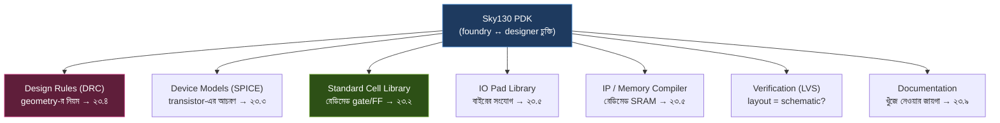
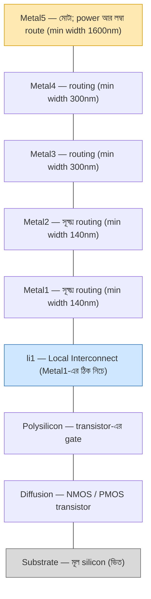
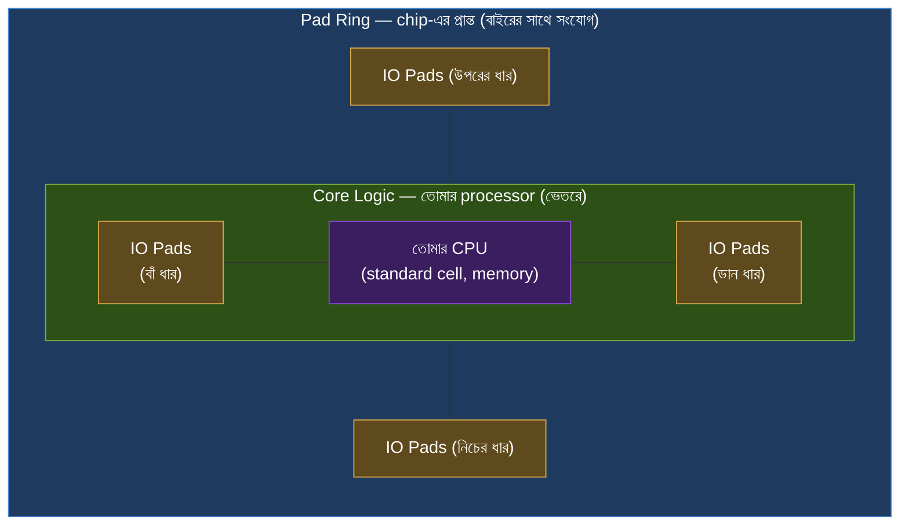

# 🔬 Chapter 23: Sky130 PDK - Your Fabrication Technology
## Understanding the Open Source Chip Manufacturing Process!

> **"Know your technology. Know your transistors. Build better chips!"**
>
> **"তোমার technology চেনো। তোমার transistor চেনো। Better chips বানাও!"**

---

## 🎯 এই Chapter-এ তুমি শিখবে:

```
✅ Sky130 PDK - Google's open process
✅ Process Technology - 130nm details
✅ Standard Cells - pre-built blocks
✅ Transistor Models - SPICE simulation
✅ Design Rules - manufacturing limits
✅ IP Blocks - Memory, IO pads
✅ Characterization - cell timing
✅ তোমার technology expert! 🎉
```

**Time Required:** 1 week (deep understanding)  
**Prerequisites:** Chapters 21-22 complete

---

## 🌟 মুখস্থ করার দরকার নেই

এই অধ্যায়ে অনেক সংখ্যা আর নিয়ম আসবে (metal width, design rule, cell নাম…)।
**এগুলো মুখস্থ করতে হবে না** — এটা একটা reference। ঠিক যেমন অভিধান মুখস্থ করো
না, দরকারে দেখো। কেউ অভিধানের প্রতিটা শব্দ মাথায় নিয়ে ঘোরে না; কিন্তু একটা
শব্দ লাগলে কোথায় খুঁজবে, সেটা জানে। এই chapter-ও ঠিক তেমন — তোমার কাজ হলো
**কোন তথ্য কোথায় থাকে আর কেন থাকে** সেটা বোঝা, সংখ্যাগুলো গিলে ফেলা নয়।

আর সত্যি বলতে, এই নিয়মগুলোর বেশিরভাগই tool নিজে নিজে দেখে নেয়। তুমি যখন
OpenLane চালাও বা Magic দিয়ে DRC করো, তখন এই PDK থেকেই নিয়ম পড়ে নিয়ে তোমার
design যাচাই করে। তোমাকে শুধু জানতে হবে — **এই নিয়মগুলো আসলে কী জিনিস, আর
কেন এগুলো আছে।** সেটাই হলো একজন junior designer আর একজন engineer-এর তফাত:
junior tool-এর error দেখে ভয় পায়, engineer বুঝে ফেলে error-টা আসলে কী বলছে।

এখন একবার চোখ বুলিয়ে নাও যাতে জানো কী কী আছে; পরে নিজের chip বানানোর সময়
নির্দিষ্ট নিয়মটা খুঁজে নেবে। চলো, তোমার fabrication technology-র সাথে পরিচিত
হই! 🔬

---

## 🚀 What is Sky130?

আগের দুই chapter-এ তুমি RTL থেকে GDSII পর্যন্ত পুরো flow দেখেছো, OpenLane
দিয়ে নিজের processor-এর layout বানিয়েছো। কিন্তু একটা প্রশ্ন হয়তো মাথায়
ঘুরছিল: OpenLane জানল **কীভাবে** যে একটা AND gate দেখতে কেমন, একটা তার কত
সরু হতে পারে, একটা transistor কত জোরে চলে? এসব তথ্য OpenLane-এর ভেতরে লেখা
নেই। ও এগুলো পায় **PDK** থেকে। PDK হলো foundry আর designer-এর মাঝখানের
চুক্তিপত্র।

### PDK = Process Design Kit

একটা উপমা দিয়ে শুরু করি। ধরো তুমি একটা বাড়ি বানাবে, কিন্তু নিজে ইট পোড়াও
না, সিমেন্ট বানাও না — একটা নির্দিষ্ট construction company-র সাথে কাজ করবে।
সেই company তোমাকে একটা মোটা manual ধরিয়ে দেয়: "আমাদের ইট এই মাপের, আমাদের
দেয়াল এত পাতলা করা যাবে না, দুটো জানালার মাঝে এত ফাঁকা রাখতেই হবে, আর এই
হলো আমাদের রেডিমেড দরজা-জানালার catalogue।" সেই manual অনুযায়ী নকশা করলে
তবেই তারা বাড়িটা বানিয়ে দিতে পারবে।

**PDK ঠিক সেই manual + catalogue।** Foundry (যেখানে chip বানানো হয়) তাদের
process-এর সব নিয়ম, সব model, আর সব রেডিমেড block একসাথে গুছিয়ে designer-কে
দেয়। এটা ছাড়া তুমি যত সুন্দর Verilog-ই লেখো, foundry সেটা silicon-এ আনতে
পারবে না — কারণ তুমি তাদের "ভাষায়" কথা বলোনি।

PDK-র ভেতরে কী কী থাকে, সেটা এক নজরে দেখে নাও:

| উপাদান | কী জিনিস | কেন দরকার |
|---|---|---|
| **Design rules (DRC)** | তার কত সরু, কত কাছাকাছি হতে পারে — geometry-র নিয়ম | নিয়ম ভাঙলে chip ফেইল করবে |
| **Device models (SPICE)** | transistor কীভাবে আচরণ করে তার গাণিতিক বর্ণনা | circuit simulate করে আগেই দেখার জন্য |
| **Standard cell library** | রেডিমেড gate, flip-flop ইত্যাদির catalogue | শূন্য থেকে gate না বানিয়ে কাজ এগোনো |
| **IO pad library** | chip-এর বাইরে সংযোগের জন্য pad | core logic-কে বাইরের জগতের সাথে জোড়া |
| **Memory compilers** | চাহিদামতো SRAM তৈরির tool | chip-এ memory যোগ করা |
| **Verification rules (LVS)** | layout আর schematic একই কিনা মেলানোর নিয়ম | "যা আঁকলে তা-ই কি বানালে" — যাচাই |
| **Documentation** | সবকিছুর ব্যাখ্যা | প্রয়োজনে খুঁজে নেওয়া |

পুরো ব্যাপারটা এক ছবিতে গেঁথে নাও — PDK-র ভেতরে কী কী থাকে, আর প্রতিটা অংশ
এই chapter-এর কোন সেকশনে আসছে:



আর Sky130 PDK নিজে কী, সেটা সংক্ষেপে:

| বৈশিষ্ট্য | মান |
|---|---|
| তৈরি করেছে | SkyWater Technology |
| Open source করেছে | Google (২০২০) |
| Process node | 130nm |
| অবস্থা | Production-ready! |
| খরচ | একদম FREE |

এখানে একটা ব্যাপার থামিয়ে ভাবার মতো। এত দিন chip বানানোর প্রতিটা নিয়ম,
প্রতিটা model ছিল foundry-র **গোপন সম্পদ** — NDA সই না করে কেউ ছুঁতেও পারত
না, খরচও আকাশছোঁয়া। ২০২০ সালে Google আর SkyWater মিলে প্রথমবারের মতো একটা
পুরো, production-ready PDK পুরো দুনিয়ার জন্য **খুলে দিল**। এর মানে — তুমি,
বাংলাদেশের একটা ছোট্ট ঘরে বসে, ঠিক সেই নিয়ম-model দিয়ে chip design করতে
পারো যা দিয়ে professional-রা করে। এটাই Sky130-কে এত বিশেষ করে তোলে। 🎉

> 💡 **চটজলদি মনে রাখার সূত্র:** **PDK = "foundry-র সাথে designer-এর
> চুক্তি।"** এই চুক্তি মানলে তোমার design silicon হবে; না মানলে হবে না।
> তুমি নিয়ম বানাও না, নিয়ম *মেনে* design করো।

---

## ২৩.১ Sky130 Process Technology

### 130nm CMOS Process:

"130nm process" কথাটার মানে কী? এর মানে — এই process দিয়ে বানানো একটা
transistor-এর gate সবচেয়ে ছোট যতটুকু করা যায়, সেটা প্রায় **130 nanometer**,
অর্থাৎ **0.13 micrometer**। একটা চুলের ব্যাস প্রায় ৮০,০০০ nm; তার মানে
একটা চুলের প্রস্থে প্রায় ৬০০টা এমন transistor পাশাপাশি বসে যায়! এই "সবচেয়ে
ছোট মাপ"-টাকেই বলে **feature size** বা **process node**, আর এটাই পুরো
technology-র নামকরণ করে।

এই একটা সংখ্যা কেন এত গুরুত্বপূর্ণ? কারণ transistor যত ছোট, একই জায়গায় তত
বেশি বসে (বেশি কাজ), তারা তত কম শক্তি খায়, আর সাধারণত তত দ্রুত switch করে।
তাই গত পঞ্চাশ বছরে পুরো semiconductor industry-র দৌড়টাই ছিল এই সংখ্যা ছোট
করার দৌড়। দেখো এই সংখ্যা কীভাবে কমেছে:

| Chip / Process | সাল | Feature size |
|---|---|---|
| Intel 4004 | ১৯৭১ | 10,000nm |
| Intel Pentium | ১৯৯৩ | 800nm |
| **Sky130** | **২০২০** | **130nm** |
| Modern (cutting-edge) | ২০২৪ | 3–5nm |

এই টেবিল দেখে মনে হতে পারে, "130nm তো সেকেলে, আজকের 3nm-এর কাছে কিছুই না!"
কথাটা ঠিক, কিন্তু **শেখার জন্য 130nm-ই সবচেয়ে ভালো** — আর এটা কোনো আপস নয়,
সচেতন পছন্দ। কেন, সেটা বুঝে নাও:

| কারণ | ব্যাখ্যা |
|---|---|
| **More forgiving design rules** | মাপ বড়, তাই নিয়ম শিথিল; ছোট ভুলে chip ফেইল করে না |
| **Cheaper to manufacture** | পুরোনো, পরিণত process — mask আর fabrication খরচ অনেক কম |
| **এখনো সত্যিকারে ব্যবহার হয়** | automotive, IoT, sensor — সব জায়গায় 130nm দিব্যি চলছে |
| **Open এবং free** | একমাত্র এই node-এই পুরো PDK উন্মুক্ত, তাই শেখা যায় |

> 💡 **ভাবার মতো কথা:** 3nm process-এর design rule এত জটিল আর সংবেদনশীল যে
> সেখানে শেখা মানে গভীর সমুদ্রে সাঁতার শেখা। 130nm হলো নিরাপদ একটা পুকুর —
> একই সাঁতার, কিন্তু ডুবে যাওয়ার ভয় নেই। আগে পুকুরে শেখো, পরে সমুদ্রে নামবে।

### Available Layers:

একটা chip আসলে বহুতল বাড়ির মতো — বহু স্তর একটার উপর একটা সাজানো। একদম
নিচে থাকে transistor-গুলো (বাড়ির ভিত), আর তার উপরে স্তরে স্তরে থাকে **metal
layer** — ধাতব তারের জাল, যেগুলো দিয়ে transistor-রা একে অপরের সাথে কথা বলে।
নিচের তারগুলো সরু আর কাছাকাছি (অল্প দূরত্বের সূক্ষ্ম সংযোগের জন্য), উপরের
তারগুলো মোটা আর চওড়া (power আর লম্বা পথের জন্য)।

Sky130-র স্তরগুলোকে একবার পুরো ছবিতে দেখে নাও — একদম নিচের silicon থেকে
উপরের সবচেয়ে মোটা metal পর্যন্ত:



> 🔎 **li1-কে আলাদা করে খেয়াল করো।** অনেক process-এ Metal1-ই সবচেয়ে নিচের
> তার। কিন্তু Sky130-তে Metal1-এর **ঠিক নিচে** একটা আলাদা স্তর আছে — **li1**
> (local interconnect)। এটা খুব ছোট, খুব কাছের সংযোগের জন্য — যেমন একটা
> standard cell-এর ভেতরে transistor-গুলোকে জোড়া। ভাবো, li1 হলো একটা ঘরের
> ভেতরের সরু passage, আর Metal1 থেকে উপরের layer-গুলো হলো বাড়ির করিডোর আর
> রাস্তা। এই আলাদা li1 স্তরটা Sky130-র একটা স্বতন্ত্র বৈশিষ্ট্য — মনে রেখো।

Sky130-তে মোট **৫টি routing metal layer** (Metal1 থেকে Metal5)। নিচের
টেবিলে metal-গুলোর কাজ আর ন্যূনতম প্রস্থ একসাথে গুছিয়ে রাখলাম:

| Layer | কাজ | Min width |
|---|---|---|
| li1 | local interconnect (cell-এর ভেতরের সংযোগ) | — |
| Metal1 | সূক্ষ্ম routing | 140nm |
| Metal2 | সূক্ষ্ম routing | 140nm |
| Metal3 | মোটা routing | 300nm |
| Metal4 | মোটা routing | 300nm |
| Metal5 | মোটা — power আর লম্বা route | 1600nm |

metal-এর নিচে থাকে transistor বানানোর মূল স্তরগুলো — এগুলোই আসল switch তৈরি
করে:

| Device layer | কাজ |
|---|---|
| N-diffusion | NMOS transistor-এর উৎস ও মুখ |
| P-diffusion | PMOS transistor-এর উৎস ও মুখ |
| Polysilicon | transistor-এর gate (যা switch নিয়ন্ত্রণ করে) |
| N-well | PMOS-কে আলাদা রাখার অঞ্চল (isolation) |

আর শুধু সাধারণ digital logic-ই নয়, Sky130-তে কিছু বিশেষ স্তর/device-ও আছে,
যেগুলো analog আর high-voltage কাজের জন্য দরকার হয়:

| Special layer / device | কাজ |
|---|---|
| Deep N-well | আরও ভালো isolation, sensitive circuit আলাদা রাখা |
| High-voltage devices | বেশি voltage সামলানোর transistor |
| Varactors | voltage-নির্ভর variable capacitor |
| Resistors (poly, diffusion) | নির্দিষ্ট রোধ তৈরি |

এখন এই সব নাম মুখস্থ করার দরকার নেই (মনে আছে তো — অভিধান!)। শুধু ছবিটা
মাথায় গেঁথে নাও: **নিচে transistor, উপরে স্তরে স্তরে metal-এর তার, আর
Metal1-এর নিচে একটা বাড়তি li1 স্তর।** এটুকু বুঝলেই পরের সব সেকশন সহজ লাগবে।

---

## ২৩.২ Standard Cell Library

প্রশ্ন: তুমি যখন Verilog-এ `assign y = a & b;` লেখো, তখন silicon-এ আসলে কী
বসে? একটা **AND gate**। কিন্তু সেই AND gate-টা transistor দিয়ে কীভাবে বানানো
হবে, কোন transistor কোথায় বসবে, তার সাথে তারগুলো কীভাবে জোড়া লাগবে — এসব
কে ঠিক করে? **তুমি নয়, library।**

একটা **standard cell** হলো একটা পুরোপুরি ডিজাইন-করা, পরীক্ষা-করা, রেডিমেড
ছোট্ট block — যেমন একটা AND gate বা একটা flip-flop — যার transistor-layout
আগে থেকেই নিখুঁত করে আঁকা আছে, এবং যার আচরণ (কত দেরিতে output আসে, কত power
খায়) মেপে নথিভুক্ত করা আছে। ভাবো এগুলো **LEGO-র টুকরোর** মতো: প্রতিটা টুকরো
নির্দিষ্ট মাপের, একসাথে দিব্যি জোড়া লাগে, আর তুমি প্লাস্টিক গলিয়ে নিজে টুকরো
বানাও না — শুধু catalogue থেকে দরকারি টুকরো তুলে নাও আর জোড়া দাও।

কেন এই পদ্ধতি? কারণ একটা processor-এ লক্ষ লক্ষ gate থাকে। প্রতিটা gate-এর
transistor হাতে আঁকতে গেলে সারা জীবন কেটে যাবে। তার বদলে কয়েকশো রকম gate
একবার নিখুঁত করে বানিয়ে রাখা হয়, আর synthesis tool (Yosys) তোমার Verilog
দেখে সেই catalogue থেকে দরকারি cell-গুলো তুলে সাজায়। **standard cell-ই হলো
সেই সেতু যা তোমার Verilog-কে আসল transistor-এ রূপ দেয়।**

> 🧱 **"standard" শব্দটা কেন?** কারণ library-র প্রতিটা cell-এর **উচ্চতা এক**।
> ঠিক ইটের গাঁথুনির মতো — সব ইট সমান উঁচু বলে দেয়াল সমান হয়। cell-গুলো সমান
> উঁচু বলে tool ওদের সারি সারি (row) করে পাশাপাশি বসাতে পারে, power আর ground-এর
> তার নিখুঁতভাবে মিলে যায়। এই সমান উচ্চতাই automatic place & route-কে সম্ভব করে।

### What's in the Library?

Sky130-র সবচেয়ে বেশি ব্যবহৃত library হলো **`sky130_fd_sc_hd`** — এখানে
**hd** মানে **High Density**, অর্থাৎ cell-গুলো যতটা সম্ভব ছোট করে বানানো যাতে
এক জায়গায় বেশি logic আঁটে। এতে আছে **500+ standard cell**, আর শেখার সময়
এটাই তোমার default পছন্দ হওয়া উচিত।

কিন্তু একটাই library কেন থাকবে না? কারণ ডিজাইনে সবসময় একটা **আপস (trade-off)**
থাকে — কেউ চায় ছোট চিপ, কেউ চায় দ্রুত চিপ, কেউ চায় কম-power চিপ। একই AND
gate-কেও তাই কয়েকভাবে বানানো হয়, আর প্রতিটা স্বাদের জন্য আলাদা library:

| Library | পূর্ণরূপ | কীসের জন্য সেরা |
|---|---|---|
| `sky130_fd_sc_hd` | High Density | কম জায়গা — সবচেয়ে common পছন্দ |
| `sky130_fd_sc_hdll` | High Density, Low Leakage | কম জায়গা + কম idle-power |
| `sky130_fd_sc_hs` | High Speed | সর্বোচ্চ গতি |
| `sky130_fd_sc_ms` | Medium Speed | গতি ও আকারের মাঝামাঝি |
| `sky130_fd_sc_ls` | Low Speed | ধীর কিন্তু ছোট/সাশ্রয়ী |
| `sky130_fd_sc_lp` | Low Power | সবচেয়ে কম power |

> 💡 শুরুতে এত variant নিয়ে মাথা ঘামিও না। **`sky130_fd_sc_hd` দিয়েই শুরু
> করো** — পরে যখন timing বা power নিয়ে fine-tune করার দরকার হবে, তখন অন্য
> library-র কথা ভাববে। এটাই reference হিসেবে রাখার আদর্শ উদাহরণ: জেনে রাখো
> আছে, দরকার হলে খুঁজে নেবে।

### Common Cells:

library-তে আসলে কী কী আছে? তুমি digital logic শেখার সময় যেসব building block
দেখেছো (gate, flip-flop, MUX, adder) — তার প্রায় সবই এখানে রেডিমেড আছে,
আর বিভিন্ন আকারে (যেমন ২, ৩, ৪ input-এর AND)। একবার চোখ বুলিয়ে নাও:

| ধরন | উদাহরণ cell | কাজ |
|---|---|---|
| **Logic gates** | AND2/3/4, OR2/3/4, NAND2/3/4, NOR2/3/4, XOR2, XNOR2, INV, BUF | মৌলিক যুক্তি (combinational) |
| **Flip-Flops** | DFF, DFFR (reset), DFFS (set), DFFSR (set+reset), LATCH | অবস্থা ধরে রাখা (sequential) |
| **Multiplexers** | MUX2, MUX4, MUX2I (invert সহ) | কয়েকটা থেকে একটা বেছে নেওয়া |
| **Adders** | FA (full adder), HA (half adder) | যোগের building block |

সব মিলিয়ে **500+ cell** — কিন্তু আবারও মনে করিয়ে দিই, এই তালিকা মুখস্থ করার
জিনিস নয়। synthesis tool নিজেই বেছে নেবে কোন cell লাগবে। তোমার শুধু জানা
দরকার: তুমি Verilog-এ যা-ই লেখো, শেষমেশ সেটা এই হাতে-গোনা কয়েকশো cell-এর
সমন্বয়েই বানানো হয়।

### Cell Naming Convention:

এখন একটা দরকারি দক্ষতা: একটা cell-এর নাম **পড়তে পারা**। নাম দেখলেই যদি বুঝে
যাও cell-টা কী, তাহলে log file বা report-এ নাম দেখে আর ঘাবড়াবে না। Sky130-র
নাম একটা নির্দিষ্ট নিয়মে গাঁথা — ভেঙে দেখো:

```
sky130_fd_sc_hd__and2_1
└──┬─┘ └┬┘ └┬┘ └┬┘  └─┬─┘ └┬┘
   │    │   │   │     │    └─ drive strength (কত "জোরালো")
   │    │   │   │     └────── function (2-input AND)
   │    │   │   └──────────── library variant (High Density)
   │    │   └──────────────── standard cell
   │    └──────────────────── foundry (SkyWater)
   └───────────────────────── process (Sky130)
```

টুকরোগুলোর মানে এক নজরে:

| অংশ | মানে |
|---|---|
| `sky130` | process |
| `fd` | foundry (SkyWater) |
| `sc` | standard cell |
| `hd` | library variant — High Density |
| `__` | নাম থেকে function আলাদা করার separator |
| `and2` | function — এখানে 2-input AND |
| `_1` | drive strength |

**drive strength** নিয়ে একটু থামো, কারণ এই ব্যাপারটা প্রায়ই গোলমাল লাগে।
একটা gate-এর output-কে অনেকগুলো অন্য gate-এর সাথে জোড়া লাগতে হতে পারে, বা
লম্বা তার ঠেলে signal পাঠাতে হতে পারে — এটা যেন অনেক লোককে একসাথে ঠেলে নৌকা
পার করা। যত বেশি ঠেলার দরকার, তত "শক্তিশালী" gate লাগে। সেই শক্তির মাপই হলো
drive strength:

| Drive strength | মানে |
|---|---|
| `_1` | সবচেয়ে দুর্বল — ছোট, কম power, কম load টানতে পারে |
| `_2`, `_4`, `_8` | ক্রমশ শক্তিশালী — বড়, দ্রুত, কিন্তু বেশি power আর জায়গা |

অর্থাৎ একই AND gate-এর কয়েকটা সংস্করণ আছে; tool ঠিক করে কোন জায়গায় কতটা
জোরালো লাগবে। তুমি যদি `and2_1` আর `and2_8` দেখো, ভেবো না দুটো আলাদা gate —
দুটোই 2-input AND, শুধু একটা অন্যটার চেয়ে বেশি ঠেলতে পারে।

> 💡 **নাম-পড়া = superpower।** `__dfrtp_2` দেখে ঘাবড়ানোর দরকার নেই — ভেঙে
> পড়ো: এটা একটা D flip-flop, drive strength 2। নাম পড়তে শিখলে cell-এর
> দুনিয়াটা হঠাৎ অনেক ছোট আর চেনা মনে হবে।

---

## ২৩.৩ Transistor Models

একটা চিপ বানাতে কয়েক মাস আর কয়েক হাজার ডলার লেগে যায়। তাহলে কীভাবে বুঝবে
তোমার circuit বানানোর **আগেই** যে এটা ঠিকঠাক চলবে? উত্তর: **simulation**।
কিন্তু কম্পিউটারকে দিয়ে একটা transistor "simulate" করাতে হলে, কম্পিউটারের
জানা দরকার সেই transistor-টা আসলে কীভাবে আচরণ করে — কত voltage দিলে কতটা
current বইবে, কত দ্রুত switch করবে। সেই আচরণের গাণিতিক বর্ণনাই হলো **device
model** বা **SPICE model**।

ভাবো, একটা গাড়ির পূর্ণ specification-এর মতো: কত RPM-এ কত টর্ক, কত গতিতে কত
তেল খরচ — এসব না জানলে গাড়ি না চালিয়ে তার performance ভবিষ্যদ্বাণী করা যায়
না। SPICE model হলো transistor-এর সেই পূর্ণ spec, সমীকরণের ভাষায় লেখা।
**SPICE** নিজে একটা circuit simulator (Simulation Program with Integrated
Circuit Emphasis) — তুমি তাকে transistor-গুলো কীভাবে জোড়া আর কোন model মানে,
সেটা বলে দাও, আর ও voltage-current সব হিসাব করে দেখিয়ে দেয় circuit-টা কেমন
চলবে।

### SPICE Models:

Sky130-তে যে transistor-গুলো simulate করার জন্য model দেওয়া আছে, তার মধ্যে
প্রধান কয়েকটা:

| Model নাম | কী | ব্যবহার |
|---|---|---|
| `nfet_01v8` | সাধারণ NMOS (1.8V) | digital logic-এর মূল NMOS |
| `pfet_01v8` | সাধারণ PMOS (1.8V) | digital logic-এর মূল PMOS |
| `nfet_g5v0d10v5` | high-voltage NMOS | বেশি voltage সামলানোর কাজে |
| `pfet_g5v0d10v5` | high-voltage PMOS | বেশি voltage সামলানোর কাজে |

> 🔎 নামের `01v8` মানে এই transistor-গুলো প্রায় **1.8 volt**-এ চলার জন্য
> বানানো — Sky130 digital logic-এর স্বাভাবিক supply voltage। সেটাই কেন SPICE
> netlist-এ নিচে `Vdd ... 1.8` দেখবে, মিলিয়ে নিও।

একটা model আসলে কী কী তথ্য ধরে রাখে? অনেক — কিন্তু মূল ধারণাগুলো এমন:

| Parameter | কী বলে |
|---|---|
| Threshold voltage (Vth) | কত voltage দিলে transistor "চালু" হয় |
| Mobility | charge কত সহজে গায়ের ভেতর চলে (গতির সাথে সম্পর্কিত) |
| Channel length modulation | চালু অবস্থায় current কতটা "নিখুঁত ধ্রুব" নয় |
| Gate oxide thickness | gate-এর নিচের অন্তরক স্তরের পুরুত্ব (capacitance ঠিক করে) |
| Junction capacitances | transistor-এর ভেতরের লুকানো capacitor (গতি কমায়) |

এই model-গুলো একাধিক simulator-এ চলে — **Ngspice** (open source, তুমি এটাই
ব্যবহার করবে), **Xyce**, আর বাণিজ্যিক **HSPICE**। চমৎকার ব্যাপার হলো, model
একই থাকে; তুমি শুধু পছন্দের simulator-এ চালাও।

### Example SPICE Netlist:

নিচের ছোট্ট উদাহরণটা একটা **inverter** (NOT gate) — সবচেয়ে সরল CMOS circuit,
একটা PMOS আর একটা NMOS মিলে তৈরি। এই কয়েক লাইনই SPICE-কে বলে দিচ্ছে কোন
transistor কোথায় জোড়া, কোন model মানে, কী voltage দাও, আর কতক্ষণ ধরে হিসাব
করো। লাইনগুলো পড়ার দরকার নেই মুখস্থ করার জন্য — শুধু দেখে নাও একটা SPICE
file দেখতে কেমন হয়:

```spice
* Simple inverter
.lib "sky130_fd_pr/models/sky130.lib.spice" tt

Xm1 out in gnd gnd nfet_01v8 w=1 l=0.15
Xm2 out in vdd vdd pfet_01v8 w=2 l=0.15

Vdd vdd 0 1.8
Vin in 0 pulse(0 1.8 0 10p 10p 100n 200n)

.tran 1p 400n
.end
```

লাইনগুলো একটু ভেঙে বুঝলে SPICE file আর রহস্য থাকবে না: `.lib` লাইনটা
Sky130-র transistor model টেনে আনে (`tt` মানে typical corner — সে গল্প
২৩.৭-এ); `Xm1` আর `Xm2` দুটো transistor — একটা NMOS, একটা PMOS — যেখানে
`w` (width) আর `l` (length) দিয়ে transistor-এর মাপ বলা; `Vdd` দিচ্ছে 1.8V
supply; `Vin` দিচ্ছে input-এ একটা pulse (0 থেকে 1.8V ওঠানামা); আর `.tran`
বলছে সময়ের সাথে কী ঘটে তা হিসাব করতে। চালালে SPICE দেখাবে input ওঠানামা
করলে output উল্টো দিকে ওঠানামা করছে — সত্যিকারের inverter, silicon ছোঁয়ার
অনেক আগেই যাচাই করা! এটাই model-এর জাদু।

---

## ২৩.৪ Design Rules

এবার আসি সেই অংশে যা প্রতিটা layout-ভিত্তিক কাজে ঘুরেফিরে আসে — **design
rules**। এগুলো কেন আছে, সেটা না বুঝলে শুধু সংখ্যার পাহাড় মনে হবে। তাই আগে
"কেন", পরে "কী"।

ভাবো, চিপ বানানো হয় **আলো দিয়ে ছবি ছাপার (photolithography)** মতো। সরু সরু
নকশা একটা wafer-এর উপর আলো ফেলে আঁকা হয়। কিন্তু আলোর একটা সীমা আছে — দুটো
জিনিস খুব কাছে আঁকতে গেলে আলো ঘেঁটে যায়, খুব সরু কিছু আঁকতে গেলে সেটা ঠিকমতো
ছাপাই হয় না। তার উপর ধাতু গলে-জমে, এসিডে খোদাই হয় — প্রতিটা ধাপের নিজস্ব
সীমা আছে। **design rule হলো সেই সব সীমার তালিকা: "এর চেয়ে সরু কোরো না, এর
চেয়ে কাছে আনো না, এর চেয়ে ছোট কোরো না।"** এগুলো তোমাকে আটকানোর জন্য নয় —
এগুলো নিশ্চিত করে যে তুমি যা আঁকছ, foundry তা সত্যিই বানাতে পারবে।

### Minimum Dimensions:

প্রতিটা layer-এর জন্য মূলত তিন ধরনের নিয়ম থাকে — কতটা সরু হতে পারে (**min
width**), দুটো জিনিস কতটা কাছে আসতে পারে (**min spacing**), আর কতটুকু ছোট
টুকরো অনুমোদিত (**min area**)। metal layer-গুলোর নিয়ম দেখো (খেয়াল করো, নিচের
layer সরু আর সূক্ষ্ম, উপরের layer মোটা):

| Layer | Min width | Min spacing | Min area |
|---|---|---|---|
| Metal1 | 140nm | 140nm | 0.083 µm² |
| Metal2 | 140nm | 140nm | — |
| Metal3–4 | 300nm | 300nm | — |
| Metal5 | 1600nm (1.6µm) | 1600nm | — |

transistor-স্তর আর via-র নিয়মগুলোও জেনে রাখো — gate বানানো হয় polysilicon
দিয়ে, আর via হলো দুই layer-কে উপর-নিচে জোড়ার ছোট্ট সংযোগ:

| উপাদান | নিয়ম | মান |
|---|---|---|
| Polysilicon | Min width | 150nm |
| Polysilicon | Min spacing | 210nm |
| Via | Size | 150nm × 150nm |
| Via | Spacing | 170nm |

> 🔎 খেয়াল করো একটা সুন্দর প্যাটার্ন: **নিচের metal যত সূক্ষ্ম, উপরের তত
> মোটা।** Metal1/Metal2 মাত্র 140nm — কারণ ওরা cell-এর কাছাকাছি, ঘন routing
> করে। Metal5 পুরো 1600nm — কারণ ও power আর লম্বা পথ বহন করে, যেখানে মোটা তার
> দরকার (কম রোধ, বেশি current সামলানো)। এই মাপগুলো এলোমেলো নয়, প্রতিটার পেছনে
> physical কারণ আছে।

### Why Rules Matter:

নিয়ম ভাঙলে আসলে কী ঘটে? ছোট্ট একটা ভুল কীভাবে পুরো chip নষ্ট করে, দেখো:

| ভুল | পরিণতি |
|---|---|
| তার খুব সরু | **open** — তারটা ভেঙে যায়, সংযোগ থাকে না |
| দুটো তার খুব কাছে | **short** — তারা ছুঁয়ে যায়, আলাদা signal মিশে যায় |
| via বাদ পড়া | কোনো সংযোগই হয় না |
| ভুল enclosure | দুর্বল সংযোগ, reliability-তে সমস্যা |

আসল কথাটা সাফ: **design rule ভাঙা মানে chip ফেইল করা।** আর চিপ একবার
fabricate হয়ে গেলে সেটা ঠিক করার উপায় নেই — তাই এই যাচাই বানানোর আগেই করতে
হয়। ভয় পেয়ো না যদিও — এই হাজার হাজার নিয়ম তোমাকে হাতে মেলাতে হয় না।
**Magic আর KLayout-এর মতো tool** PDK থেকে নিয়ম পড়ে নিয়ে তোমার পুরো layout
স্ক্যান করে, আর কোথায় কোন নিয়ম ভেঙেছে দেখিয়ে দেয়। এই যাচাইয়ের নামই **DRC
(Design Rule Check)**। তোমার কাজ violation শূন্যে নামানো — tool খুঁজে দেয়,
তুমি ঠিক করো।

> 💡 আবার সেই মূল সুর: তুমি এই সংখ্যাগুলো মুখস্থ করো না। তুমি **বোঝো** এগুলো
> কেন আছে, আর **tool** মেলায়। একজন engineer-এর শক্তি তথ্য মনে রাখায় নয়,
> তথ্য কোথায় আর কেন আছে সেটা বোঝায়।

---

## ২৩.৫ IP Blocks

standard cell দিয়ে তুমি যেকোনো logic বানাতে পারো — কিন্তু কিছু block এত
জটিল আর এত বিশেষ যে সেগুলো gate দিয়ে হাতে বানানো বোকামি। যেমন একটা বড় memory,
বা chip-এর বাইরের সাথে সংযোগের pad। এসব রেডিমেড, বড়, পুনর্ব্যবহারযোগ্য block-কে
বলে **IP block** (Intellectual Property block)। ভাবো standard cell যদি LEGO-র
ছোট টুকরো হয়, IP block হলো আগে থেকে জোড়া-লাগানো বড় একটা অংশ — যেমন রেডিমেড
একটা চাকা বা একটা ইঞ্জিন, যেটা তুমি সরাসরি বসিয়ে দাও।

### SRAM Compiler:

তোমার processor-এর তো memory লাগবে — register file, cache, data store।
কিন্তু flip-flop দিয়ে কয়েক কিলোবাইট memory বানাতে গেলে জায়গা আর power দুটোই
উড়ে যাবে। তার বদলে আছে বিশেষভাবে নকশা-করা ঘন **SRAM**। সমস্যা হলো, প্রতিটা
আকারের SRAM হাতে আঁকা অসম্ভব — তোমার ৫১২ byte লাগতে পারে, আমার ৪ KB।

সমাধান: **memory compiler**। তুমি শুধু বলে দাও "আমার এত byte, এত-bit চওড়া,
এত port লাগবে" — আর tool নিজে সেই মাপের পুরো memory block **বানিয়ে দেয়**।
Sky130-র জন্য open source compiler-টা হলো **OpenRAM**। এটা যেন একটা কারখানা:
তুমি spec দাও, ও তোমার চাহিদামতো memory গড়ে ফেরত দেয়।

OpenRAM কী কী বানাতে পারে:

| বৈশিষ্ট্য | পরিসর / বিকল্প |
|---|---|
| Size | 32 bytes থেকে 16 KB |
| Ports | single অথবা dual port |
| Word width | 8, 16, 32, 64 bits |

আর তুমি spec দিলে OpenRAM শুধু একটা ফাইল নয়, পুরো প্যাকেজ ফেরত দেয় — কারণ
chip-এ memory বসাতে গেলে এর সবগুলোই দরকার হয়:

| Output | কীসের জন্য |
|---|---|
| GDSII layout | আসল physical নকশা (chip-এ বসানোর জন্য) |
| Verilog model | simulation-এ memory-র আচরণ যাচাই |
| SPICE netlist | analog-স্তরে নিখুঁত simulation |
| Timing library (.lib) | timing analysis-এ memory কত দ্রুত তা জানানো |

ব্যবহারটাও সহজ — একটা config file লিখে এক লাইনে চালাও:

```
python3 openram.py myconfig.py
```

এভাবেই তোমার chip-এ সত্যিকারের memory যোগ হয়! 🧠

### IO Pads:

ধরো তোমার core logic দারুণ চলছে — কিন্তু chip-এর বাইরের জগতের সাথে কথা বলবে
কীভাবে? Signal আসবে কোথা দিয়ে, power ঢুকবে কোন পথে? এর উত্তর **IO pad**।
pad হলো chip-এর প্রান্তে বসানো বড় বড় ধাতব ঘর, যেগুলোর সাথে package-এর pin
জোড়া লাগে। এগুলো শুধু সংযোগই দেয় না, **ভেতরের সূক্ষ্ম transistor-গুলোকে
রক্ষাও করে** — বাইরের static বিদ্যুৎ (ESD) বা ভুল voltage যেন ভেতরে ঢুকে
সব পুড়িয়ে না দেয়।

Sky130-তে যে ধরনের pad আছে:

| Pad ধরন | কাজ |
|---|---|
| Digital input | বাইরে থেকে digital signal নেওয়া |
| Digital output | বাইরে digital signal পাঠানো |
| Bidirectional | একই pin দিয়ে নেওয়া ও পাঠানো |
| Analog | analog signal চলাচল |
| Power (VDD, VSS) | বিদ্যুৎ সরবরাহ ও ground |
| ESD protection | static বিদ্যুৎ থেকে রক্ষা |

এই pad-গুলো তোমার core logic-কে চারদিক থেকে ঘিরে একটা বলয় তৈরি করে, যাকে বলে
**pad ring**। ছবিটা মাথায় আঁকো:



প্রতিটা pad মোটামুটি **~100µm × 100µm** — খেয়াল করো, এটা একটা transistor-এর
চেয়ে হাজার গুণ বড়! কারণটা বুঝতে পারছ: pad-কে wire bond বা package-এর সাথে
জোড়া লাগতে হয়, আর সেই যান্ত্রিক সংযোগের জন্য বড় জায়গা লাগে। তাই প্রায়ই
দেখা যায়, chip-এর আসল logic যত ছোটই হোক, pad ring-ই অনেকটা জায়গা খেয়ে নেয়।

---

## ২৩.৬ Cell Characterization

আগে বলেছিলাম standard cell-এর আচরণ "মেপে নথিভুক্ত করা থাকে"। কিন্তু কে মাপে,
কী মাপে, আর কেন? এই মাপামাপির পুরো প্রক্রিয়াটাকেই বলে **characterization**।

কেন দরকার? কারণ timing analysis tool (STA) যখন জানতে চায় "এই path-টা কি
ঘড়ির গতির সাথে তাল মিলিয়ে চলবে?", তখন তাকে জানতে হয় **প্রতিটা cell ঠিক কত
দেরি করে**। একটা AND gate-এর input বদলালে output বদলাতে কত সময় লাগে? এটা না
জানলে timing হিসাব করা অসম্ভব। তাই foundry আগে থেকেই প্রতিটা cell বহুবার
simulate (বা মেপে) দেখে তার delay, power সব নথিভুক্ত করে রাখে — সেটাই
characterization। ভাবো, এটা যেন প্রতিটা LEGO টুকরোর গায়ে লেখা "এই টুকরো
দিয়ে signal যেতে এত সময় লাগে।"

### Timing Parameters:

প্রতিটা cell-এর জন্য মূলত দুই ধরনের timing তথ্য রাখা হয় — **delay** (কত
দেরিতে কাজ হয়) আর **constraint** (sequential cell-এর জন্য কিছু শর্ত, যা না
মানলে data ঠিকমতো ধরা পড়বে না)। দেখো:

| ধরন | প্যারামিটার | কী বলে |
|---|---|---|
| **Delay** | tpd (input→output delay) | input বদলালে output বদলাতে কত সময় |
| **Delay** | tr (rise time) | output 0→1 উঠতে কত সময় |
| **Delay** | tf (fall time) | output 1→0 নামতে কত সময় |
| **Constraint** | tsu (setup time) | clock-এর আগে data কতক্ষণ স্থির থাকতেই হবে |
| **Constraint** | th (hold time) | clock-এর পরে data কতক্ষণ স্থির থাকতেই হবে |
| **Constraint** | tcq (clock-to-Q) | clock edge-এর পর output আসতে কত সময় |

এখন একটা সূক্ষ্ম কিন্তু জরুরি ব্যাপার: **এই সংখ্যাগুলো ধ্রুব নয়** — পরিবেশ
বদলালে বদলায়। একটা gate কতটা দেরি করবে, তা নির্ভর করে কয়েকটা জিনিসের উপর:

| যার উপর নির্ভর করে | প্রভাব |
|---|---|
| Input slew | input কত খাড়াভাবে বদলায় (আস্তে বদলালে দেরি বেশি) |
| Output load | output-এ কত cell/তার ঝুলছে (বেশি load → বেশি দেরি) |
| Voltage | কম voltage → ধীর; বেশি voltage → দ্রুত |
| Temperature | তাপমাত্রা delay-কে প্রভাবিত করে |

এই কারণেই একটা cell-এর delay একটামাত্র সংখ্যা নয়, বরং একটা **টেবিল** —
বিভিন্ন slew আর load-এর জন্য বিভিন্ন মান। ঠিক সেটাই নিচের `.lib` ফাইলে দেখবে।

### Liberty Format (.lib):

```
cell (sky130_fd_sc_hd__and2_1) {
    area : 3.5;
    
    pin(A) {
        direction : input;
        capacitance : 0.0015;
    }
    
    pin(Y) {
        direction : output;
        function : "(A&B)";
        timing() {
            related_pin : "A";
            cell_rise(delay_template) {
                index_1 ("0.01, 0.1, 1");
                index_2 ("0.01, 0.1, 1");
                values (
                    "0.1, 0.15, 0.3",
                    "0.12, 0.17, 0.32",
                    "0.2, 0.25, 0.4"
                );
            }
        }
    }
}
```

ভয় পেয়ো না এই ফাইল দেখে — পড়লে দিব্যি বোঝা যায়। উপরের অংশে `area : 3.5`
বলছে cell-টা কত জায়গা নেয়; `pin(A)` হলো input, তার `capacitance` বলছে এই
input অন্য gate-এর উপর কতটা load চাপায়; `pin(Y)` হলো output, আর
`function : "(A&B)"` সাফ জানিয়ে দিচ্ছে cell-টা সত্যিই একটা AND। সবচেয়ে
মজার অংশ `cell_rise`-এর ভেতরের ছোট্ট সংখ্যার গ্রিড — এটাই সেই **delay টেবিল**
যার কথা একটু আগে বললাম। `index_1` হলো input slew-এর মান, `index_2` হলো
output load-এর মান, আর `values`-এর প্রতিটা সংখ্যা হলো সেই slew-load জোড়ার
জন্য delay। অর্থাৎ tool slew আর load দেখে এই টেবিল থেকে সঠিক delay তুলে নেয়।
এটাই STA-র খাবার। মুখস্থ করার কিছু নেই — শুধু বুঝে রাখো **`.lib` মানে cell-এর
আচরণ সংখ্যায় লেখা একটা data sheet**, যা tool পড়ে।

---

## ২৩.৭ Process Corners

এই সেকশনটা একটু চমকপ্রদ — আর সত্যিকারের chip design-এর একটা গভীর সত্য বলে।

ধরো তুমি ডিজাইনে বললে transistor-টা 130nm হবে। কিন্তু foundry যখন লক্ষ লক্ষ
transistor বানায়, প্রতিটা কি **হুবহু** 130nm হয়? না! তৈরির প্রক্রিয়ায়
সামান্য তারতম্য থাকেই — কোনোটা একটু বড়, কোনোটা একটু ছোট, oxide একটু পুরু বা
পাতলা। এই তারতম্য **±10% বা তারও বেশি** হতে পারে। ভাবো একই কারখানায় বানানো
দুটো বিস্কুট — একই ছাঁচে, তবু একটা একটু মুচমুচে, একটা একটু নরম।

এর মানে তোমার একই design-এর কোনো chip একটু দ্রুত চলবে, কোনোটা একটু ধীরে।
সমস্যা হলো — তোমার design-কে **সব রকম chip-এই** ঠিকঠাক চলতে হবে, শুধু "ভালো"
গুলোতে নয়। এই চরম পরিস্থিতিগুলোকেই বলে **process corner** ("corner" কারণ
এগুলো সম্ভাব্য আচরণের সীমানা/কোণা)।

### What are Corners?

মূল ধারণা: NMOS আর PMOS দুই ধরনের transistor আলাদা আলাদাভাবে দ্রুত (Fast)
বা ধীর (Slow) হতে পারে। তাদের সম্ভাব্য সংমিশ্রণগুলোই corner:

| Corner | পূর্ণরূপ | মানে |
|---|---|---|
| **TT** | Typical–Typical | স্বাভাবিক / nominal |
| **FF** | Fast–Fast | সবচেয়ে ভালো (দ্রুত) অবস্থা |
| **SS** | Slow–Slow | সবচেয়ে খারাপ (ধীর) অবস্থা |
| **FS** | Fast–Slow | NMOS দ্রুত, PMOS ধীর (skewed) |
| **SF** | Slow–Fast | NMOS ধীর, PMOS দ্রুত (skewed) |

মনে রাখার সহজ উপায়: **দুই অক্ষর = (NMOS, PMOS)।** তাই FS মানে NMOS Fast,
PMOS Slow। এই corner-গুলোই তোমার design-এর "অগ্নিপরীক্ষা" — সব corner-এ
পাশ করলে তবেই design নির্ভরযোগ্য।

### Corner Testing:

শুধু transistor-এর তারতম্য নয়, chip-কে নানা পরিবেশেও চলতে হয় — গাড়ির ভেতর
গরমে, শীতের রাতে, ব্যাটারি দুর্বল হলে কম voltage-এ। তাই corner-এর সাথে
temperature আর voltage-ও মেলানো হয়:

| যা পরীক্ষা করতে হবে | পরিসর |
|---|---|
| Process (গতি) | SS (সবচেয়ে ধীর), TT (স্বাভাবিক), FF (সবচেয়ে দ্রুত) |
| Temperature | −40°C থেকে 125°C |
| Voltage | ±10% (supply ওঠানামা) |

কেন এত কষ্ট? কারণ আসল কথাটা হলো: **তোমার design যদি সবচেয়ে খারাপ corner-এও
(ধীরতম transistor, সবচেয়ে প্রতিকূল তাপমাত্রা ও voltage) ঠিকঠাক চলে — তবেই
সেটা সত্যিকারের robust।** এটাই খেলনা project আর production chip-এর তফাত।
সব corner-এ পাশ মানে তুমি জানো, কারখানা থেকে যে chip-ই বেরোক, ক্রেতার হাতে
সেটা চলবে। ✅

---

## ২৩.৮ Analog Capabilities

এতক্ষণ আমরা digital দুনিয়ার কথা বলছিলাম — 0 আর 1, gate আর flip-flop। কিন্তু
আসল পৃথিবী তো digital নয়, **analog** — শব্দ, আলো, তাপমাত্রা সবই ক্রমাগত
পরিবর্তনশীল মান। তোমার চিপ যদি এই বাস্তব জগতের সাথে কথা বলতে চায় (যেমন একটা
sensor থেকে মান পড়া, বা শব্দ তৈরি করা), তবে তার analog ক্ষমতা লাগবে। আর
Sky130-র একটা বড় শক্তি হলো — এটা **শুধু digital নয়**, এতে analog circuit
বানানোর কাঁচামালও আছে।

### Analog Devices:

Sky130-তে যে analog device-গুলো পাওয়া যায়:

| Device | কী কাজে লাগে |
|---|---|
| BJT transistors | analog amplifier, voltage reference |
| Varactors | voltage-নির্ভর variable capacitor (যেমন PLL-এ) |
| Resistors (একাধিক ধরন) | নির্দিষ্ট রোধ, ভাগ-করা voltage |
| Capacitors (MiM, MoM) | charge জমানো, filter, sample-hold |
| Photodiodes | আলো শনাক্ত করা (light sensor) |
| ESD devices | static বিদ্যুৎ থেকে রক্ষা |

এই কাঁচামাল দিয়ে তুমি সত্যিকারের analog আর mixed-signal (analog + digital
একসাথে) চিপ বানাতে পারো:

| বানাতে পারো | কী করে |
|---|---|
| ADC (Analog-to-Digital Converter) | analog সংকেতকে digital সংখ্যায় বদলায় |
| DAC (Digital-to-Analog Converter) | digital সংখ্যাকে analog সংকেতে বদলায় |
| Voltage reference | স্থির, নির্ভরযোগ্য একটা reference voltage |
| Amplifier | দুর্বল সংকেতকে বড় করা |
| PLL | ঘড়ির কম্পাঙ্ক তৈরি ও সিঙ্ক করা |
| Complete mixed-signal chips | analog + digital একই চিপে! |

> 💡 শুরুতে তুমি শুধু digital design-ই করবে (তোমার RISC-V processor digital)।
> কিন্তু জেনে রাখা ভালো — একই Sky130 দিয়ে একদিন তুমি analog দুনিয়াতেও পা
> রাখতে পারবে। PDK-টা তোমার বেড়ে ওঠার সাথে সাথে বড় হবে।

---

## ২৩.৯ Documentation

পুরো chapter জুড়ে এক সুর বাজছে: **মুখস্থ নয়, খুঁজে নেওয়া।** তাহলে খুঁজবে
কোথায়? এটাই এই ছোট্ট সেকশনের কাজ — তোমাকে সঠিক দরজাগুলো চিনিয়ে দেওয়া। ভালো
খবর: Sky130 দারুণভাবে নথিভুক্ত, তাই উত্তর সবসময় হাতের নাগালে।

| উৎস | কোথায় | কী পাবে |
|---|---|---|
| Official docs | `sky130-pdk.readthedocs.io` | design rule manual, device spec, standard cell doc |
| GitHub | `github.com/google/skywater-pdk` | সব source file, example, issue/discussion |

মনে রাখো, এই দুটো লিংকই তোমার "অভিধান"। আটকে গেলে আগে এখানে খোঁজো — নির্দিষ্ট
design rule, cell-এর spec, বা কেউ আগে একই সমস্যায় পড়েছে কিনা, সব এখানে পাবে।
Sky130 community-র সবচেয়ে বড় উপহার এই খোলা, বিস্তারিত documentation। 📚

---

## ২৩.১০ Using Sky130 in Your Design

তত্ত্ব অনেক হলো — এবার কয়েকটা বাস্তব পরামর্শ, যা তোমাকে শুরুতেই অনেক ভোগান্তি
থেকে বাঁচাবে। এগুলো নিয়ম নয়, অভিজ্ঞতার নির্যাস:

**১. standard cell দিয়ে শুরু করো।** প্রথম দিনেই custom gate (নিজে transistor
সাজানো) বানাতে যেও না — সেটা কঠিন আর ভুলের সম্ভাবনা প্রচুর। library-র cell
ব্যবহার করো; ওগুলো প্রমাণিত, characterize-করা, আর নিশ্চিন্ত। হাঁটতে শেখার
আগে দৌড়িও না।

**২. design rule মানো, ব্যতিক্রম রেখো না।** শুধু DRC-clean layout-ই গ্রহণযোগ্য।
Magic দিয়ে যাচাই করো, আর **সব** violation ঠিক করো — "এই একটা ছোট violation
থাক না" বলে ছাড় দিও না, কারণ একটা ভুলও চিপ নষ্ট করতে পারে।

**৩. খুব করে simulate করো।** সব corner-এ পরীক্ষা করো (মনে আছে SS/FF/TT?),
timing যাচাই করো, power দেখো। বানানোর আগে যত বেশি ধরা পড়বে, পরে তত কম কাঁদতে
হবে — কারণ fabricate হয়ে গেলে আর ঠিক করার উপায় নেই।

**৪. reference design থেকে শেখো।** শূন্য থেকে সব আবিষ্কার কোরো না। **Caravel
SoC** আর **TinyTapeout** project-গুলো খোলা আছে — এগুলো পড়ো, দেখো অন্যরা
কীভাবে করেছে, তারপর নিজের পথে এগোও।

**৫. community-কে কাজে লাগাও।** আটকে গেলে প্রশ্ন করো (লজ্জা নয়!), নিজের শেখা
শেয়ার করো, আর অন্যদের সাহায্য করো। open source-এর আসল শক্তি এই দেওয়া-নেওয়ায়।

---

## ২৩.১১ Chapter 23 Mission Complete!

একটু থেমে পেছনে তাকাও। এই chapter শুরুর সময় "PDK" শব্দটা হয়তো রহস্যময় মনে
হচ্ছিল। এখন তুমি জানো এটা আসলে foundry আর designer-এর মাঝের চুক্তি — design
rule, SPICE model, standard cell, IP block, characterization — সব এক জায়গায়।
আর সবচেয়ে জরুরি যেটা শিখলে: এগুলো **মুখস্থ করার জিনিস নয়, বোঝার জিনিস**।
তুমি এখন জানো কোন তথ্য কোথায় থাকে আর কেন থাকে — ঠিক একজন engineer-এর মতো।

### তুমি এখন জানো:

```
✅ Sky130 PDK complete overview
✅ Process technology details
✅ Standard cell library
✅ Transistor models
✅ Design rules
✅ IP blocks (SRAM, IO)
✅ Cell characterization
✅ Process corners
✅ Ready for real chip! 🎉
```

### Knowledge Level:

```
You now understand:
→ How chips are manufactured
→ What's in a PDK
→ How to use standard cells
→ Design rule constraints
→ Timing characterization

Professional knowledge! 💼
```

---

## 🎯 Chapter Exercise

### Project: Characterize a Standard Cell

এতক্ষণ standard cell, SPICE, design rule, `.lib` — সব আলাদা আলাদা পড়লে।
এই exercise-এ সবগুলো **এক সুতোয় বাঁধবে**। তুমি একটা সত্যিকারের cell
(`sky130_fd_sc_hd__and2_1` — মনে আছে? 2-input AND, drive strength 1) তুলে
নিয়ে তার layout খুলবে, transistor গুনবে, SPICE-এ simulate করে তার delay
মাপবে, আর তারপর সেই মাপা delay-কে `.lib` ফাইলে লেখা delay-র সাথে মিলিয়ে
দেখবে। এটাই হলো **characterization-এর মূল ধারণা** নিজের হাতে করা — পুরো
chapter-টা যেন এক জায়গায় জীবন্ত হয়ে ওঠে।

ধাপগুলো নিচে; নিয়ম মুখস্থ নয়, ছবিটা ধরো — *খোলো → দেখো → simulate করো → মেলাও*:

```
Task: Analyze sky130_fd_sc_hd__and2_1

1. Extract from GDSII
   magic -T sky130A.tech
   gds read sky130_fd_sc_hd.gds
   load sky130_fd_sc_hd__and2_1

2. View layout
   - Count transistors
   - Measure dimensions
   - Identify layers

3. Simulate in SPICE
   - Extract netlist
   - Run transient analysis
   - Measure delay

4. Compare with .lib
   - Check documented delay
   - Verify functionality
   - Understand variations
```

---

## 🏆 Achievement Unlocked!

```
Level 23: ✅ COMPLETE - PDK Expert!
Progress: [███████████████████████░░] 92%

XP Gained: +1500
Skills: PDK Knowledge, Process Technology

Badges Earned:
🥉 Sky130 Expert
🥈 Standard Cell Master
🥇 Design Rule Pro
🏅 Process Corner Tester
🎖️ Transistor Guru

NEXT: Submit to TinyTapeout! 📤
```

---

**[⬅️ Previous: Chapter 22](Chapter_22_OpenLane_Physical_Design.md)** | **[➡️ Next: Chapter 24](Chapter_24_TinyTapeout.md)**

---

<div align="center">

**"You know the technology. Time to submit your chip!"**

**"তুমি technology জানো। এবার chip submit করো!"**

Made with ❤️ for IC designers | IC designers-দের জন্য ভালোবাসা দিয়ে তৈরি

</div>
