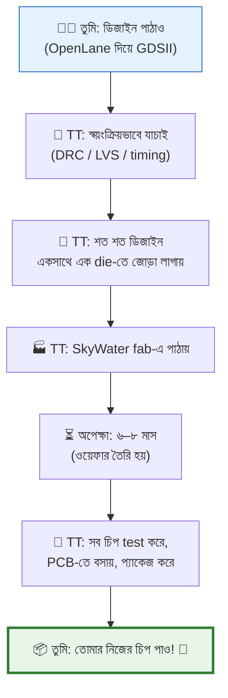
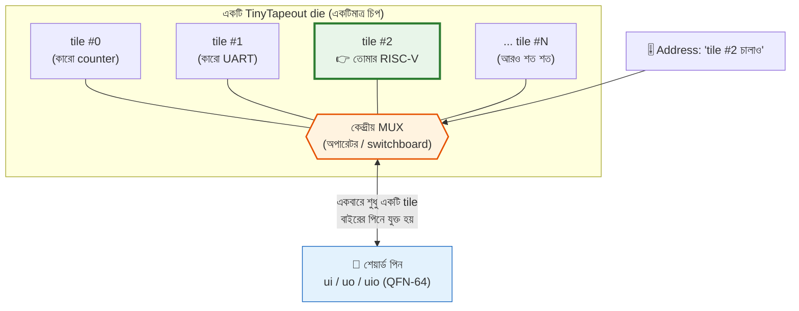
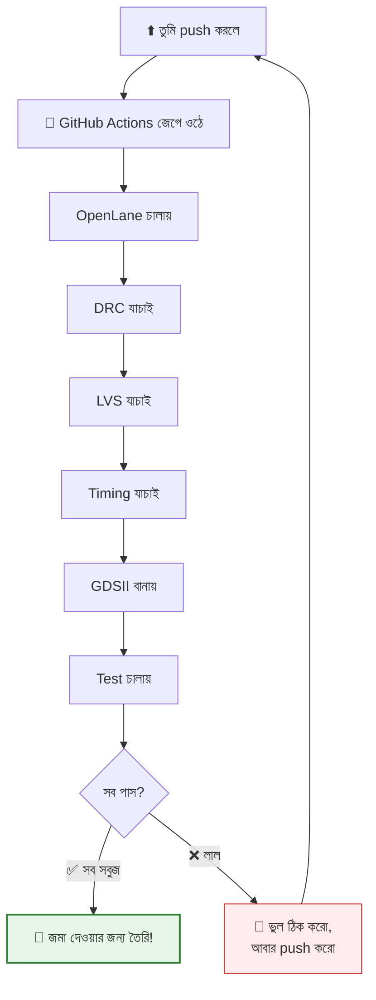
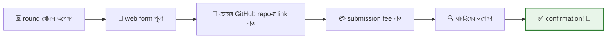
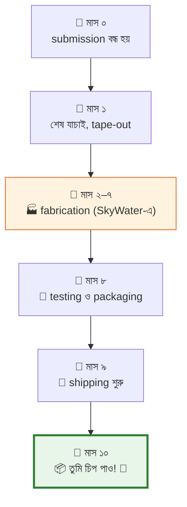
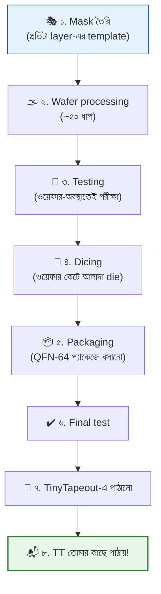

# 🚀 Chapter 24: TinyTapeout - Submit Your Chip!
## From Design to Real Silicon - Your Chip Goes to Fab!

> **"Your design is ready. Time to send it to the FAB! Real chip coming!"**
>
> **"তোমার design ready। এবার FAB এ পাঠাও! Real chip আসছে!"**

---

## 🎯 এই Chapter এ তুমি করবে:

```
✅ TinyTapeout পরিচিতি - what it is
✅ Submission প্রক্রিয়া - step by step
✅ Design হার্ডেনিং - prepare your design
✅ Verification - সব check pass করো
✅ Submit & Track - পাঠাও এবং track করো
✅ Payment - কত খরচ
✅ Waiting Period - এরপর কী হবে
✅ তোমার chip fab এ যাচ্ছে! 🎉
```

**Time Required:** 1 week (preparation + submission)  
**Prerequisites:** Chapters 21-23 complete

---

## 🌟 শেষ ধাপ — আর সবচেয়ে রোমাঞ্চকর

"Submission" শুনতে ভারী লাগতে পারে, কিন্তু TinyTapeout পুরোটাই **শিক্ষার্থী আর
প্রথম-বারের designer-দের জন্য** বানানো — সস্তা, সহজ, আর প্রচুর নতুন মানুষ
প্রথমবারেই পেরেছে।

তুমি এতদূর এসেছ — datapath, pipeline, layout সব পার করে। এই শেষ ধাপটা মূলত
"পাঠাও" বাটন চাপার মতো। চলো তোমার design-টা সিলিকনের পথে পাঠাই! 🚀

---

## 🚀 TinyTapeout কী?

### স্বপ্নটা সত্যি হলো যেভাবে

একটা সত্যি কথা দিয়ে শুরু করি। কয়েক বছর আগ পর্যন্ত নিজের ডিজাইন করা চিপ
fabricate করা মানে ছিল কয়েক হাজার থেকে কয়েক **লক্ষ** ডলারের খরচ। কেন? কারণ
fab-এ চিপ বানানোর প্রথম খরচটাই সবচেয়ে বড় — **mask** (চিপের প্রতিটা layer-এর
জন্য আলোকচিত্রের মতো template) বানাতে হয়, আর সেই mask-set একবার বানালে সেটা
দিয়ে এক ওয়েফার বানাও বা হাজার ওয়েফার, mask-এর দামটা একই থাকে। অর্থাৎ খরচটা
fixed — তোমার ডিজাইন বড় হোক বা ছোট, একটা চিপ বানাও বা একশোটা, ওই বিশাল
"setup খরচ"টা গুনতেই হবে।

ফলাফল? শুধু বড় কোম্পানি — Intel, AMD, Apple — যারা লক্ষ লক্ষ চিপ বিক্রি করে
খরচ তুলে নিতে পারে, তারাই চিপ বানাতো। ছাত্র, hobbyist, ছোট startup — সবাই
দরজার বাইরে।

এখন প্রশ্ন: ওই fixed খরচটা যদি **অনেকজন মিলে ভাগ করে নিই**? ঠিক যেমন একা একটা
আস্ত বাস ভাড়া করা অসম্ভব, কিন্তু বাসের একটা সিট কেনা সবার নাগালে — তেমনি
একটা চিপের একটুকরো জায়গা ভাড়া নেওয়া যায় কি? **TinyTapeout** ঠিক এটাই করে।
এটা একটা "shuttle service" — অনেক মানুষের ছোট ছোট ডিজাইন একসাথে জড়ো করে একটা
চিপে বসিয়ে দেয়, তারপর পুরো দলটা মিলে fab-এর খরচটা ভাগ করে নেয়।

| বিষয় | আগে (একার চেষ্টা) | TinyTapeout-এর সাথে |
|---|---|---|
| Fab খরচ | $10,000 – $1,000,000+ | পুরো দলে ভাগ (~$15,000) |
| তোমার খরচ | পুরোটাই একা | **$100 – $300** |
| কারা পারে | শুধু বড় কোম্পানি | ছাত্র, hobbyist, যে কেউ |
| তোমার জায়গা | আস্ত die | একটা ছোট tile (160µm × 100µm) |
| তুমি কী পাও | — | **আসল silicon chip!** 🏆 |

তোমার ডিজাইনের জন্য বরাদ্দ জায়গাটা সত্যিই ছোট — মাত্র **160µm × 100µm**, মানে
একটা চুলের চেয়েও সরু একটুকরো সিলিকন। কিন্তু ছোট হোক, এটা **আসল চিপ** — তোমার
লেখা Verilog সত্যিকারের transistor হয়ে গেছে। 🏆

### কীভাবে কাজ করে — পুরো যাত্রাটা এক নজরে

পুরো প্রক্রিয়াটা ভাবো একটা রিলে দৌড়ের মতো — তুমি প্রথম ধাপটা দৌড়াও (ডিজাইন
পাঠাও), তারপর TinyTapeout টিম ব্যাটনটা নিয়ে fab পর্যন্ত নিয়ে যায়, আর সবশেষে
চিপটা ঘুরে তোমার হাতে ফিরে আসে:



এই পুরো ধারণাটার সৌন্দর্যটা একবার ভেবে দেখো: প্রায় **$15,000**-এর fab খরচ
যখন কয়েকশো মানুষের মধ্যে ভাগ হয়ে যায়, তখন মাথাপিছু পড়ে মাত্র **$100–$300** —
আর তার বদলে সবাই হাতে পায় সত্যিকারের সিলিকন। এক সময় যেটা শুধু বিলিয়ন-ডলার
কোম্পানির হাতের নাগালে ছিল, সেটা এখন তোমার-আমার নাগালে। অসাধারণ, তাই না? 💡

---

## 🧩 শত শত ডিজাইন একটা চিপে কীভাবে আঁটে?

এটাই TinyTapeout-এর সবচেয়ে চমৎকার আর সবচেয়ে কম-বোঝা অংশ। তাই ধীরে ধীরে,
একদম গোড়া থেকে বুঝি।

### সমস্যাটা আগে বুঝি: পিন কম, ডিজাইন বেশি

একটা চিপের package-এ পিনের সংখ্যা সীমিত — TinyTapeout-এর চিপ আসে **QFN-64**
প্যাকেজে, মানে বাইরের দিকে মোটে ৬৪টা ধাতব পা। এর মধ্যে অনেকগুলো power, ground,
clock-এর মতো কাজে চলে যায়। কিন্তু একটা die-তে বসে আছে **শত শত** ডিজাইন। প্রতিটা
ডিজাইনের যদি আলাদা আলাদা পিন লাগত, তাহলে কয়েক হাজার পিন দরকার হতো — যা অসম্ভব।

তাহলে সমাধান? **সবাই একই পিনগুলো ভাগ করে ব্যবহার করবে — কিন্তু একসাথে নয়,
পালা করে।** ঠিক যেমন একটা বাড়িতে একটাই দরজা, সব ঘরের লোক সেই একই দরজা দিয়েই
যাতায়াত করে, তবে একসাথে সবাই হুড়মুড় করে নয়।

### মূল কৌশল: Multiplexing (এক রাস্তা, পালা করে ব্যবহার)

কল্পনা করো একটা পুরোনো টেলিফোন অপারেটরের switchboard — সামনে শত শত তার, কিন্তু
অপারেটর একবারে শুধু একটা তারকে মূল লাইনের সাথে জুড়ে দেন। TinyTapeout-এর die-এর
ঠিক মাঝখানে এমনই একটা বড় **multiplexer (mux)** বসানো থাকে। এটাই গোটা চিপের
"অপারেটর"।

- চিপের সব ডিজাইনের ইনপুট/আউটপুট তার গিয়ে মেশে এই কেন্দ্রীয় mux-এ।
- বাইরে থেকে তুমি একটা **address** পাঠাও — "আমি ৪২ নম্বর ডিজাইনটা চালাতে চাই।"
- mux তখন শুধু **ওই একটা ডিজাইনকেই** বাইরের পিনগুলোর সাথে জুড়ে দেয়; বাকি সব
  ডিজাইন তখন চুপচাপ বসে থাকে (idle)।
- ডিজাইন বদলাতে চাও? নতুন address পাঠাও — অপারেটর তারটা ঘুরিয়ে দেয়।

এই কারণেই Verilog template-এ একটা `ena` (enable) সিগন্যাল আছে — যখন তোমার
ডিজাইনকে mux select করে, তখন `ena` হয় `1`; না করলে `0`। ভাবো এটাই তোমার
ডিজাইনের জন্য "এখন তোমার পালা" বাতি।



### এর মানে তোমার ডিজাইনের জন্য কী?

এই mux মডেলটাই ব্যাখ্যা করে দেয় কেন template-এর পিনগুলো এত কড়াকড়িভাবে বাঁধা।
তোমার ডিজাইন বাইরের দুনিয়াকে সরাসরি ছোঁয় না — ও কথা বলে এই কেন্দ্রীয় mux-এর
সাথে, একটা **fixed চুক্তির** মাধ্যমে: ঠিক ৮টা input, ৮টা output, ৮টা
bidirectional, আর কয়েকটা control। প্রতিটা ডিজাইন একই চুক্তি মানে বলেই mux সবাইকে
একইভাবে সামলাতে পারে — যেমন প্রতিটা সিম কার্ডের আকার এক বলেই যেকোনো ফোনে বসে।

আর শেয়ারিং বলেই তোমার জায়গাটাও ছোট — ওই **160µm × 100µm** tile। তুমি একটা আস্ত
চিপ পাচ্ছ না, পাচ্ছ একটা বড় চিপের একটা ভাড়া-করা ঘর। ছোট ঘরেই গোছানো সংসার
পাততে হবে — সেই কথায় পরের সেকশনে আসছি।

---

## ২৪.১ TinyTapeout-এর শর্তগুলো

যেহেতু তোমার ডিজাইন একটা শেয়ার-করা চিপের একটা ঘরে বসছে, তাই কিছু নিয়ম মানতেই
হবে — ঠিক যেমন ভাড়া বাসায় কিছু নিয়ম থাকে। নিয়মগুলো জটিল কিছু নয়, বরং ধরাবাঁধা।
একবার বুঝে নিলে এগুলোই তোমার চেকলিস্ট।

### আকার ও প্রক্রিয়া

| বিষয় | শর্ত | কেন এমন |
|---|---|---|
| **Tile আকার** | 160µm × 100µm (≈ 0.016 mm²) | একটা die-তে শত শত tile আঁটাতে হয় |
| **Process / PDK** | Sky130 (130nm), open-source | SkyWater fab এই process-এই বানায় (অধ্যায় ২৩) |
| **Flow** | OpenLane | RTL → GDSII পুরোটা স্বয়ংক্রিয়, যাচাই-সহজ |
| **Cell** | শুধু standard cell | কাস্টম analog নয় — সবার জন্য একই নিয়ম |

আকারটা শুনতে ভয়ংকর ছোট মনে হতে পারে, কিন্তু 130nm process-এ 0.016 mm²-এর মধ্যে
কয়েক **হাজার** logic gate আঁটে — একটা ছোট কিন্তু সত্যিকারের কাজের প্রসেসরের জন্য
যথেষ্ট। জায়গা কম মানে তোমাকে শুধু গোছানো হতে হবে, আটকে যেতে হবে না।

### IO চুক্তি — ঠিক এই পিনগুলোই, সবার জন্য একই

মনে আছে, কেন্দ্রীয় mux সবার সাথে একই চুক্তিতে কথা বলে? এই টেবিলটাই সেই চুক্তি।
প্রতিটা TinyTapeout ডিজাইন ঠিক এই পিনগুলোই পায় — একটাও কম নয়, বেশিও নয়:

| পিন গ্রুপ | প্রস্থ | নাম | কাজ |
|---|---|---|---|
| Input | 8 | `ui[7:0]` | বাইরে থেকে ভেতরে — শুধু পড়া যায় |
| Output | 8 | `uo[7:0]` | ভেতর থেকে বাইরে — শুধু চালানো যায় |
| Bidirectional | 8 | `uio[7:0]` | দুদিকেই — input বা output, তুমি ঠিক করবে |
| Clock | 1 | `clk` | তোমার ডিজাইনের হৃৎস্পন্দন |
| Reset | 1 | `rst_n` | সব শূন্যে ফেরাও (active **low**) |
| Enable | 1 | `ena` | "এখন তোমার পালা" — mux তোমায় select করলে `1` |

মোট **২৭** সিগন্যাল লাইন, আর এটা **fixed** — তুমি বাড়াতে-কমাতে পারবে না। এটাই
সেই সাধারণ ছাঁচ যা mux-কে সব ডিজাইন একইভাবে সামলাতে দেয়।

> 💡 **`uio` কেন আলাদা?** একই পিন কখনো input, কখনো output হতে পারলে অনেক নমনীয়তা
> পাও — যেমন SPI বা I2C-তে একই তার দুদিকেই ডেটা বয়। তাই প্রতিটা `uio` পিনের
> জন্য একটা "দিক-নিয়ন্ত্রক" সিগন্যাল আছে (`uio_oe`): `1` দিলে পিনটা output,
> `0` দিলে input। এটাই তোমার ডিজাইনের ভেতরের ট্রাফিক পুলিশ।

### Power

| বিষয় | মান |
|---|---|
| Supply voltage | 1.8V |
| Power budget | <10mW (পরামর্শ) |

পুরো die-টা একটাই power rail ভাগ করে, তাই নিজের অংশটুকু কম খরচে রাখাই ভদ্রতা —
আর ছোট ডিজাইনে এমনিতেই খরচ কম হয়।

### কী কী আঁটবে?

এই ছোট্ট জায়গায় কী বানানো যায়, তা নিয়ে যেন ভয় না পাও — মানুষ এখানে সত্যিই
চমৎকার জিনিস বসিয়েছে:

| আঁটে ✅ | আঁটবে না (এক tile-এ) ❌ |
|---|---|
| ছোট RISC-V core (RV32E) | full-cache সহ বড় প্রসেসর |
| ছোট ALU | বড় multiplier-array |
| UART / SPI controller | বড় on-chip SRAM |
| Counter, LED controller | জটিল multi-core SoC |
| ছোট গেম, calculator | — |

তাহলে অধ্যায় জুড়ে বানানো তোমার **আস্ত** প্রসেসরটা? এক tile-এ পুরোটা আঁটবে না —
আর এটাই স্বাভাবিক। কিন্তু একটা বুদ্ধি করে ছেঁটে ছোট-করা সংস্করণ? অবশ্যই আঁটবে।
পরের সেকশনের পুরোটাই এই "বুদ্ধি করে ছাঁটা" নিয়ে।

---

## ২৪.২ ডিজাইন তৈরি করা

### বুদ্ধি করে ছাঁটা — কী রাখব, কী বাদ দেব

ছোট ঘরে সংসার পাতার মূল কথা: কোনটা আসলেই দরকার আর কোনটা বিলাসিতা, সেটা আলাদা
করা। তোমার অধ্যায় ১৯-এর full SoC-টা দারুণ — কিন্তু সেটায় এমন অনেক কিছু আছে যা
জায়গা খায় অথচ "এটা সত্যিকারের প্রসেসর" — এই গল্পটার জন্য জরুরি নয়।

সবচেয়ে বড় জায়গা-খেকো সাধারণত হয় **memory**: ৩২টা ৩২-বিট register আর কয়েক KB
cache মিলে বিপুল জায়গা নেয়, কারণ on-chip memory মানে হাজার হাজার flip-flop।
তাই ছাঁটার প্রথম নিয়ম — memory কমাও, আর বড় memory চিপের বাইরে রাখো।

| অংশ | Full প্রসেসর | TinyTapeout সংস্করণ | কেন বদলালে |
|---|---|---|---|
| Register | 32 × 32-bit | **16 × 32-bit** (RV32E) | অর্ধেক flip-flop, অর্ধেক জায়গা |
| Cache | 4KB on-chip | **নেই** — external memory | on-chip memory সবচেয়ে বড় জায়গা-খেকো |
| Peripheral | UART + GPIO + Timer | **শুধু basic UART** | একটাই IO পথ রাখলেই চলে |
| GPIO | পূর্ণ | **8-bit** | tile-এর পিন তো ৮টাই |

এতগুলো ছাঁটার পরও জিনিসটা মোটেই খেলো হয় না — উল্টো, এটাই আসল কৃতিত্ব:

- 🎯 এটা একটা **সত্যিকারের কাজ করা RISC-V core** — খেলনা নয়।
- 🎯 এটা **আসল প্রোগ্রাম চালাতে পারে** — instruction fetch করে, চালায়।
- 🎯 আর সবচেয়ে বড় কথা — এটা **আসল সিলিকনে** বসছে, তোমার নামে।

ছোট মানে দুর্বল নয়; ছোট মানে গোছানো। RV32E (embedded variant, ১৬ register) ঠিক
এই কারণেই আছে — ছোট জায়গায় পুরো RISC-V-এর স্বাদ দিতে।

### Verilog Template:

```verilog
`default_nettype none

module tt_um_your_design (
    input  wire [7:0] ui_in,    // Dedicated inputs
    output wire [7:0] uo_out,   // Dedicated outputs
    input  wire [7:0] uio_in,   // IOs: Input path
    output wire [7:0] uio_out,  // IOs: Output path
    output wire [7:0] uio_oe,   // IOs: Enable (1=output)
    input  wire       ena,      // Enable (always 1)
    input  wire       clk,      // Clock
    input  wire       rst_n     // Reset (active low)
);

    // Your design here!
    // Must fit in 160µm × 100µm
    
    // Example: Simple counter
    reg [7:0] counter;
    
    always @(posedge clk) begin
        if (!rst_n) begin
            counter <= 0;
        end else if (ena) begin
            counter <= counter + 1;
        end
    end
    
    assign uo_out = counter;
    assign uio_out = 8'b0;
    assign uio_oe = 8'b0;

endmodule
```

এই template-টা খুঁটিয়ে পড়ো — এর প্রতিটা লাইন তোমার আগের শেখা ধারণাগুলোর সাথে
মেলে:

- **মডিউলের নাম `tt_um_` দিয়ে শুরু** — এটা বাধ্যতামূলক। কেন্দ্রীয় mux এই নামের
  ছাঁচ দেখেই তোমার ডিজাইনকে চিনে die-তে বসায়। `tt_um_` মানে "TinyTapeout user
  module" — তোমার অংশটুকুর নামফলক।
- **port-গুলো হুবহু সেই IO চুক্তি** — গত সেকশনের টেবিলটা এখানে কোডে রূপ নিয়েছে।
  একটাও বাড়াতে-কমাতে পারবে না; এটাই mux-এর সাথে তোমার হ্যান্ডশেক।
- **`uio_oe` দিয়ে দিক ঠিক করা** — উদাহরণে `uio` পিন ব্যবহার হয়নি, তাই `uio_oe`
  কে পুরো `0` (সব input) আর `uio_out` কে `0` রাখা হয়েছে। যদি কোনো `uio` পিন
  output বানাতে চাও, ওই বিটটা `1` করতে হবে।
- **`!rst_n` দিয়ে reset** — মনে রেখো reset **active-low**, মানে `rst_n` যখন `0`
  তখনই reset কাজ করে। তাই শর্তটা `if (!rst_n)`।
- **`ena` দিয়ে গেট করা** — counter শুধু তখনই বাড়ে যখন `ena` হয় `1`, অর্থাৎ
  mux যখন তোমার tile-কে select করেছে। "এখন তোমার পালা" বাতিটা এভাবেই কাজে লাগে।

ভেতরের logic-টা স্রেফ একটা ৮-বিট counter — কিন্তু এই কঙ্কালটাই সব ডিজাইনের
ভিত্তি। `// Your design here!` কমেন্টের জায়গায় তুমি বসাবে তোমার ছেঁটে-ছোট-করা
RISC-V core। বাইরের খোলসটা একই থাকে; শুধু ভেতরটা তোমার।

---

## ২৪.৩ OpenLane চালানো

এতক্ষণ তোমার ডিজাইন ছিল Verilog — মানে শুধু *বর্ণনা*, "আমি কী চাই" তার বয়ান।
এবার সেটাকে আসল layout-এ, মানে GDSII-তে পরিণত করতে হবে — কোন transistor কোথায়
বসবে, কোন তার কোথা দিয়ে যাবে, সব। এই গোটা রূপান্তরটা (RTL → GDSII) অধ্যায়
২১-২২-এ শেখা **OpenLane** স্বয়ংক্রিয়ভাবে করে দেয়। আমরা শুধু তাকে কয়েকটা শর্ত
বলে দেব — মূলত "জায়গাটা ঠিক ১৬০×১০০, আর তাড়াহুড়ো করো না।"

### TinyTapeout-এর জন্য config

নিচের `config.tcl`-ই OpenLane-কে TinyTapeout-এর নিয়ম শেখায়। প্রতিটা লাইন কী
বলছে, কোডের নিচে ব্যাখ্যা আছে:

```tcl
# config.tcl
set ::env(DESIGN_NAME) tt_um_your_design

# TinyTapeout specific
set ::env(DIE_AREA) "0 0 160 100"
set ::env(FP_CORE_UTIL) 50
set ::env(CLOCK_PERIOD) "100"  # 10MHz

# Standard settings
set ::env(VERILOG_FILES) [glob $::env(DESIGN_DIR)/src/*.v]
set ::env(CLOCK_PORT) "clk"

# Optimize for area
set ::env(SYNTH_STRATEGY) "AREA 0"
set ::env(PL_TARGET_DENSITY) 0.60
```

লাইনগুলোর মানে:

| সেটিং | কী বলছে | কেন গুরুত্বপূর্ণ |
|---|---|---|
| `DIE_AREA "0 0 160 100"` | layout-এর সীমানা ঠিক tile-এর মাপে | এর বাইরে গেলে অন্যের ঘরে ঢুকে পড়বে |
| `FP_CORE_UTIL 50` | core-এর ~৫০% logic-এ ভরবে | বাকিটা তার বিছানোর শ্বাস-জায়গা |
| `CLOCK_PERIOD "100"` | ১০০ ns, মানে ১০ MHz clock | ছোট/নিরাপদ গতি — timing মেলানো সহজ |
| `SYNTH_STRATEGY "AREA 0"` | জায়গা বাঁচানোকে অগ্রাধিকার দাও | tile ছোট, তাই গতি নয়, জায়গাই আগে |
| `PL_TARGET_DENSITY 0.60` | cell-গুলো খুব ঠাসা নয় | বেশি ঠাসলে router তার বিছানোর জায়গা পায় না |

খেয়াল করো গোটা config-এর সুরটাই "জায়গা বাঁচাও, ধীরে চলো" — কারণ এখানে তোমার
প্রতিদ্বন্দ্বী গতি নয়, **জায়গা**। ১০ MHz শুনতে ধীর, কিন্তু এই পর্যায়ে চিপটা
আদৌ কাজ করছে — সেটাই জয়; clock fast করা পরের চ্যাপ্টারের গল্প।

### Flow চালাও

এবার একটাই কমান্ড — OpenLane বাকিটা নিজে করবে (synthesis → floorplan →
placement → routing → GDSII), ঠিক যা অধ্যায় ২২-এ দেখেছিলে:

```bash
# In OpenLane
./flow.tcl -design tt_um_your_design

# Check results:
# - Area < 0.016 mm² ✅
# - DRC violations = 0 ✅
# - LVS clean ✅
# - Timing met ✅

# If all pass: Ready to submit! 🎉
```

flow শেষ হলে চারটে জিনিস মিলিয়ে দেখা সবচেয়ে জরুরি — এগুলোই তোমার "চিপ পাঠানোর
যোগ্য কিনা" পরীক্ষার চারটি স্তম্ভ:

| পরীক্ষা | মানে কী | পাস না হলে |
|---|---|---|
| **Area** < 0.016 mm² | tile-এর মধ্যে এঁটেছে | ডিজাইন আরও ছাঁটো |
| **DRC** = 0 | fab-এর জ্যামিতিক নিয়ম মানা হয়েছে (তার খুব কাছাকাছি নয়, ইত্যাদি) | layout ঠিক করো |
| **LVS** clean | layout ঠিক তোমার Verilog-এর সাথে মেলে | কোনো সংযোগ ভুল হয়েছে |
| **Timing** met | clock-এর মধ্যে সিগন্যাল পৌঁছেছে | clock ধীর করো বা path ছোট করো |

DRC মানে "Design Rule Check" — fab বলে দেয় দুটো তার কত কাছে আসতে পারে, ধাতু কত
সরু হতে পারে; DRC সেই নিয়ম মানা হয়েছে কিনা দেখে। LVS মানে "Layout vs Schematic"
— তোমার আঁকা layout আর তোমার লেখা Verilog সত্যিই একই জিনিস কিনা মিলিয়ে দেখে,
যাতে ভুল করে অন্য কিছু বানিয়ে না ফেলো। চারটে সবুজ মানেই — পাঠানোর জন্য তৈরি! 🎉

---

## ২৪.৪ GitHub দিয়ে জমা দেওয়া

TinyTapeout-এর একটা দারুণ ব্যাপার হলো — পুরো জমা দেওয়ার কাজটা ঘোরে **GitHub**-এর
চারপাশে। তুমি Word ফাইল ইমেইল করো না, বড় GDSII ফাইল আপলোড করো না। বদলে তুমি
TinyTapeout-এর একটা তৈরি template repo "কপি" করে নাও, তাতে নিজের ডিজাইন বসাও,
আর push করো। বাকিটা — OpenLane চালানো, যাচাই করা, GDSII বানানো — সব করে দেয়
GitHub-এর স্বয়ংক্রিয় robot (GitHub Actions)। এটা শুধু সহজই নয়, এতে তোমার পুরো
কাজটা open, version-controlled, আর অন্যরা দেখে শিখতে পারে।

### ১. Template-টা কপি করো

```bash
# 1. Go to TinyTapeout template
https://github.com/TinyTapeout/tt-template

# 2. Click "Use this template"
# 3. Create your repo: tt-my-design

# 4. Clone it
git clone https://github.com/yourusername/tt-my-design
cd tt-my-design
```

এই template-টা একটা তৈরি কাঠামো — এতে আগে থেকেই OpenLane config, CI script,
ফোল্ডার সব সাজানো। তোমাকে শূন্য থেকে কিছু বানাতে হবে না; শুধু নিজের অংশটুকু
বসিয়ে দিতে হবে।

### ২. নিজের ডিজাইন যোগ করো

মূল দুটো কাজ — (ক) তোমার Verilog ফাইলটা `src/` ফোল্ডারে রাখা, আর (খ) `info.yaml`
ফাইলে তোমার প্রজেক্টের পরিচয় লেখা। এই `info.yaml`-ই TinyTapeout-কে বলে দেয়
ডিজাইনটা কার, কী করে, কত গতিতে চলে — পরে এই তথ্যই datasheet আর website-এ ওঠে:

```bash
# 5. Copy your Verilog
cp your_design.v src/tt_um_your_design.v

# 6. Update info.yaml
nano info.yaml

# Edit:
project:
  title: "My RISC-V Processor"
  author: "Your Name"
  description: "Simplified RISC-V core"
  language: "Verilog"
  clock_hz: 10000000

# 7. Commit and push
git add .
git commit -m "Add my design"
git push
```

### ৩. স্বয়ংক্রিয় CI — তোমার ব্যক্তিগত robot পরীক্ষক

তুমি push করার সাথে সাথেই GitHub-এ একটা "robot" (GitHub Actions) জেগে ওঠে আর
তোমার ডিজাইন নিয়ে গত সেকশনের পুরো OpenLane flow নিজে চালিয়ে দেখে — তুমি নিজে
কিছু না করেই। সেরা ব্যাপারটা হলো এই robot **প্রতিবার push-এ** খাটে, তাই ভুল
থাকলে সাথে সাথে ধরা পড়ে — fab পর্যন্ত গিয়ে নয়।



ভুলে যেও না — লাল ক্রস দেখা মানে ব্যর্থতা নয়, বরং ব্যবস্থাটা কাজ করছে: সমস্যা
এখন ধরা পড়ছে, যখন ঠিক করা স্রেফ আরেকটা push। সব সবুজ হলে তবেই পরের ধাপ।

---

## ২৪.৫ আনুষ্ঠানিক জমা

তোমার repo সবুজ — কিন্তু এটাই শেষ নয়। GitHub-এ ডিজাইন তৈরি রাখা আর সেটাকে
আসলে fab-এর shuttle-এ একটা সিট বুক করা — দুটো আলাদা কাজ। এখন তোমাকে একটা
চালু **submission round**-এ আনুষ্ঠানিকভাবে ঢুকতে হবে।

### একটা round-এ যোগ দাও

মনে রেখো, TinyTapeout সবসময় খোলা থাকে না — এটা চলে **round** ধরে, প্রতি
**৩-৪ মাসে** একবার একটা করে shuttle যায়। আর প্রতিটা round-এ সিট সীমিত
(সাধারণত **৫০০-২০০০টা** ডিজাইন), নিয়ম হলো **আগে এলে আগে পাবে**। তাই round খোলার
খবরটা আগেভাগে জানা জরুরি — `tinytapeout.com` চোখে রাখো, Discord-এ থাকো।

round খুললে কাজটা সোজা — একটা web form, একটা link, আর একটা payment:



খেয়াল করো — তুমি কোনো ফাইল আপলোড করছ না, শুধু তোমার GitHub repo-র **link**
দিচ্ছ। TinyTapeout ওই link থেকেই তোমার ডিজাইন আর CI-এর বানানো GDSII টেনে নেয়।
এই জন্যই আগের ধাপে CI সবুজ থাকা এত জরুরি।

### খরচের হিসাব

এবার আসল প্রশ্ন — কত পড়বে? নিচের হিসাবটা দেখলে বুঝবে $100 আসলে কতটা সস্তা,
কারণ এই দামের মধ্যেই fab থেকে শুরু করে তোমার হাতে চিপ পৌঁছানো — সব ধরা:

| বিষয় | পরিমাণ |
|---|---|
| Standard fee | **$100** (প্রায় ৳১২,০০০) |
| Student discount | মাঝে মাঝে পাওয়া যায় |
| Group discount | ৩+ জন একসাথে হলে |

**এই fee-র মধ্যেই যা যা পাচ্ছ:**

| অন্তর্ভুক্ত | মানে |
|---|---|
| ✅ Fabrication | fab খরচ (পুরো দলে ভাগ-করা) |
| ✅ Testing | তোমার চিপ পরীক্ষা করা |
| ✅ PCB board | চিপ বসানোর ছোট্ট বোর্ড |
| ✅ প্যাকেজ-করা চিপ | **QFN-64** প্যাকেজে |
| ✅ Shipping | পুরো পৃথিবীতে পৌঁছে দেওয়া |

সব মিলিয়ে খরচ পড়ে **$100-$300**। বাংলাদেশের জন্য একটা বাস্তব মনে রাখার কথা —
এর সাথে shipping + customs বাবদ আনুমানিক **৳২,০০০-৫,০০০** যোগ হতে পারে, তাই
আগেভাগে বাজেটে রেখো।

একটা প্রসেসর fabricate করতে আগে লাগত হাজার হাজার ডলার — সেখানে এক কাপ ভালো
খাবারের কয়েক বেলার দামে তুমি পাচ্ছ **তোমার নিজের সিলিকন চিপ**। এর চেয়ে ভালো
বিনিয়োগ একজন hardware-শিক্ষার্থীর জন্য আর কী হতে পারে? 🏆

---

## ২৪.৬ জমা দেওয়ার পর

confirmation পেয়ে গেলে এক মুহূর্ত থামো — এটা একটা বড় মাইলফলক। কিন্তু এর মানে
এই নয় যে চিপ কালই আসছে। এবার শুরু হয় একটা শান্ত পর্ব: TinyTapeout টিম তোমার
ডিজাইনটা আরেকবার ভালো করে দেখে, তারপর শত শত ডিজাইনের সাথে একসাথে die-তে জোড়া
লাগায়। কারণ একবার fab-এ গেলে আর ভুল শোধরানোর উপায় নেই — তাই এই পর্বে কড়া
যাচাই।

### যাচাই পর্ব

TinyTapeout টিম মূলত তোমার CI যা পরীক্ষা করেছে, সেগুলোই আরেকবার নিশ্চিত করে —
"দ্বিতীয় চোখ" হিসেবে। এক ভুল ডিজাইন গোটা shuttle-এর অন্যদের ক্ষতি করতে পারে,
তাই এই সতর্কতা সবার জন্যই ভালো:

| # | যাচাই | মানে |
|---|---|---|
| 1 | GDSII valid? | layout ফাইলটা ঠিকঠাক, পড়া যায় |
| 2 | Size correct? | tile-এর মাপের মধ্যে আছে |
| 3 | DRC clean? | fab-এর জ্যামিতিক নিয়ম মানা |
| 4 | LVS passed? | layout আর Verilog হুবহু মেলে |
| 5 | Timing OK? | clock-এর মধ্যে সিগন্যাল পৌঁছায় |
| 6 | Test passes? | দেওয়া test-গুলো ঠিক ফল দেয় |

কোনোটায় ❌ পড়লে ঘাবড়িও না — তুমি ঠিক করে আবার জমা দাও, সাধারণত **১-২ বার**
এমন আসা-যাওয়া স্বাভাবিক। আর যখন সব ✅ — তখন তোমার ডিজাইন **গৃহীত!** তোমার নাম
এবার এই round-এর shuttle-এ। 🎉

### track করা

এরপর তুমি চাইলে তোমার ডিজাইনের যাত্রাটা ধাপে ধাপে দেখতে পারো — অনেকটা পার্সেল
ট্র্যাক করার মতো, "এখন কোথায় আছে" সেটা সবসময় জানা যায়:

| track করতে পারবে | মানে |
|---|---|
| Submission status | approved না pending |
| shuttle-এ তোমার অবস্থান | কোন round-এ, কততম |
| Fab status | কবে tape-out হলো |
| Testing progress | চিপ test হচ্ছে কিনা |
| Shipping | কবে পথে রওনা দিল |

এই খবরগুলো আসে — **email**-এ, **Discord** কমিউনিটিতে, আর **GitHub issue**-তে।
তাই notification চালু রেখো, কিছু মিস করবে না।

---

## ২৪.৭ অপেক্ষার খেলা

এবার আসে সবচেয়ে কঠিন অংশ — কোনো কোড নয়, কোনো কমান্ড নয়, শুধু **ধৈর্য**। চিপ
বানানো এক রাতের কাজ নয়; একটা ওয়েফার গড়ে উঠতে কয়েক মাস লাগে। কিন্তু এই অপেক্ষাটা
জানা থাকলে সহজ হয়ে যায় — তাই দেখে নাও পুরো সময়রেখাটা।

### সময়রেখা (Timeline)

জমা গৃহীত হওয়ার পর থেকে চিপ হাতে পাওয়া পর্যন্ত মোটামুটি **৬-১০ মাস** — ধাপে
ধাপে এমন:



এই সময়ে সবচেয়ে বড় ভাগটা — মাস ২ থেকে ৭ — যায় শুধু fabrication-এ, কারণ ওয়েফারের
প্রতিটা layer একটার পর একটা গড়তে হয়, তাড়াহুড়ো চলে না। ধৈর্য ধরো, তৈরি হওয়াটাই
আসল ব্যাপার! সর্বশেষ অবস্থা দেখতে চাইলে `tinytapeout.com/runs`-এ চোখ রাখো।

### fab-এ আসলে কী ঘটে?

এই অপেক্ষার মাসগুলোয় তোমার ডিজাইনের সাথে আসলে কী হচ্ছে, সেটা জানলে অপেক্ষাটা
অনেক বেশি রোমাঞ্চকর লাগে। তোমার GDSII ফাইলটা ধীরে ধীরে আসল transistor হয়ে ওঠে —
**SkyWater Fab (Bloomington, Minnesota, USA)**-তে, ধাপে ধাপে:



ধাপ ২-এর "wafer processing"-টাই আসল জাদু — প্রায় ৫০টা সূক্ষ্ম ধাপের পুনরাবৃত্তি,
যেগুলো মিলে সিলিকনের উপর স্তরে স্তরে তোমার circuit গড়ে তোলে:

| উপ-ধাপ | কী করে |
|---|---|
| Oxidation | সিলিকনের উপর অন্তরক (insulator) স্তর গড়ে |
| Photolithography | আলো দিয়ে mask-এর নকশা ওয়েফারে ছাপ দেয় |
| Etching | অপ্রয়োজনীয় অংশ খোদাই করে সরায় |
| Doping | নির্দিষ্ট জায়গায় অপদ্রব্য ঢুকিয়ে transistor বানায় |
| Metallization | ধাতব তার বসিয়ে সব যুক্ত করে |

এতগুলো নিখুঁত ধাপ পেরিয়ে তবেই তোমার Verilog-এর প্রতিটা লাইন বাস্তব transistor
হয়ে ওঠে। সত্যিই এক অসাধারণ, জটিল প্রক্রিয়া — আর এর একটা টুকরো এখন তোমার নামে
ঘটছে! 🏭

---

## ২৪.৮ কমিউনিটি ও সহায়তা

এতদূর তুমি একা এসেছ, কিন্তু এই শেষ ধাপে একা থাকার দরকার নেই। TinyTapeout-এর
সবচেয়ে বড় সম্পদ আসলে এর **কমিউনিটি** — পৃথিবীজুড়ে হাজার হাজার মানুষ, যাদের
অনেকেই তোমার মতোই প্রথমবার চিপ পাঠাচ্ছে, আর অনেকেই এর মধ্যে কয়েকবার পাঠিয়ে
ফেলেছে। তুমি যে সমস্যায় আটকাচ্ছ, কেউ না কেউ সেটা আগে দেখেছে।

| জায়গা | কী পাবে |
|---|---|
| **Discord** | তাৎক্ষণিক প্রশ্নোত্তর, অন্যদের ডিজাইন দেখা, সাহায্য, নিজের অগ্রগতি শেয়ার |
| **GitHub** | Discussions, issue, প্রচুর উদাহরণ, পূর্ণ documentation |

বিশেষ করে **Discord** চালু রাখো — আটকে গেলে সরাসরি প্রশ্ন করতে পারবে, আবার
অন্যদের ঝকঝকে ডিজাইন দেখে নিজেও অনুপ্রাণিত হবে। এটা সত্যিই দারুণ সহায়ক,
উৎসাহী একটা দল। 🤝

---

## ২৪.৯ সফল হওয়ার টিপস

প্রথমবার চিপ পাঠানোর অভিজ্ঞতা থেকে কিছু সহজ কথা — এগুলো মেনে চললে যাত্রাটা
অনেক মসৃণ হবে। মূল সুরটা একটাই: **ছোট থেকে শুরু করো, ধাপগুলো বাদ দিও না,
ধৈর্য ধরো।**

### যা করবে ✅

| করবে | কেন |
|---|---|
| সহজ ডিজাইন দিয়ে শুরু করো | প্রথমবারে পুরো flow-টা শেখাই আসল লক্ষ্য |
| simulation-এ ভালো করে test করো | fab-এ গেলে আর শোধরানো যায় না |
| সব guideline মানো | নিয়মগুলোই mux-এর সাথে চুক্তি |
| আগেভাগে Discord-এ যোগ দাও | আটকালে দ্রুত সাহায্য |
| অন্যদের ডিজাইন থেকে শেখো | তৈরি উদাহরণ সবচেয়ে ভালো শিক্ষক |
| window-এর শুরুতেই জমা দাও | সিট সীমিত, আগে এলে আগে পাবে |
| ধৈর্য ধরো | তৈরি হতে সময় লাগে, সেটাই স্বাভাবিক |

### যা করবে না ❌

| করবে না | কারণ |
|---|---|
| জমা দিতে তাড়াহুড়ো | একটা ভুল মানে আরেকটা round-এর অপেক্ষা |
| যাচাই বাদ দেওয়া | সবুজ CI ছাড়া fab-এ গিয়ে কাজ হবে না |
| DRC ভুল উপেক্ষা | fab ওই layout বানাতেই পারবে না |
| ডিজাইন বেশি জটিল করা | tile ছোট — সরলতাই বন্ধু |
| দ্রুত ফলের আশা | manufacturing-এ মাস লাগে |
| প্রথম চেষ্টায় ব্যর্থ হলে হাল ছাড়া | ১-২ বার iteration একদম স্বাভাবিক |

---

## ২৪.১০ তোমার প্রসেসর জমা দেওয়া

এবার সব মিলিয়ে একটা বাস্তব লক্ষ্য ঠিক করি। প্রথমবার তুমি কোনো রেকর্ড ভাঙতে যাচ্ছ
না — তুমি যাচ্ছ পুরো পথটা একবার সফলভাবে হেঁটে আসতে: ছাঁটা → OpenLane → GitHub →
জমা → চিপ। তাই লোভ সামলে একটা ছোট, কিন্তু সত্যিকারের কাজ-করা scope বেছে নাও।

### বাস্তবসম্মত প্রথম চিপ

নিচের scope-টা ঠিক tile-এ আঁটার মতো, অথচ এটাকে নির্ভেজাল "RISC-V প্রসেসর" বলা
যায়:

| অংশ | পরামর্শ-করা মাপ |
|---|---|
| ISA | RV32E (১৬ register) |
| Instruction | ~২০টি |
| Program memory | ২৫৬ bytes |
| Data memory | ২৫৬ bytes |
| IO | 8-bit |
| Peripheral | Simple UART |

মাপগুলো ছোট দেখে যেন একে কম ভেবো না — এই ছোট্ট জিনিসটাই কেন এত বড় ব্যাপার, দেখো:

- 🎯 এটা একটা **আসল RISC-V core** — খেলনা সিমুলেশন নয়।
- 🎯 এটা **C কোড compile করে চালাতে পারে** — সত্যিকারের প্রোগ্রাম।
- 🎯 এটা বসছে **তোমার নিজের সিলিকনে** — কারো ধার-করা চিপে নয়।
- 🎯 এটা তোমার **portfolio**-র মুকুট — যা খুব কম মানুষ দেখাতে পারে।
- 🎯 আর চাকরির interview-তে? এটা **খাঁটি সোনা** — "আমি নিজের চিপ fabricate করেছি।"

ছোট হোক, এটাই হবে তোমার গর্বের জিনিস। একদম worth it! 🏆

---

## ২৪.১১ Chapter 24 Mission Complete!

থামো, একটু পেছনে তাকাও। কয়েক চ্যাপ্টার আগে তুমি Verilog-এ একটা module লিখছিলে;
আর এখন সেই একই ডিজাইন একটা shuttle-এ চড়ে SkyWater fab-এর পথে। এই অধ্যায়ে তুমি
শুধু "কীভাবে জমা দিতে হয়" শেখোনি — তুমি বুঝেছ গোটা ব্যবস্থাটা **কেন** এভাবে কাজ
করে।

### তুমি এখন জানো:

- ✅ **TinyTapeout কী** — fab খরচ ভাগ করে নেওয়ার shuttle সার্ভিস।
- ✅ **শত শত ডিজাইন এক চিপে কীভাবে আঁটে** — কেন্দ্রীয় mux, পালা করে শেয়ার-করা পিন।
- ✅ **কীভাবে submit করতে হয়** — GitHub template → CI → round-এ জমা।
- ✅ **Design requirements** — 160µm × 100µm tile, fixed IO চুক্তি, Sky130।
- ✅ **খরচ কত** — $100-$300, এর মধ্যেই চিপ হাতে পাওয়া পর্যন্ত সব।
- ✅ **Timeline কেমন** — ~৬-১০ মাস, বেশিরভাগটাই fabrication।
- ✅ **Tracking কীভাবে করবে** — email, Discord, GitHub।
- ✅ আর সবচেয়ে বড় কথা — **তোমার chip fab এ যাচ্ছে!** 🎉

### Next:

পরের অধ্যায়টাই এই পুরো বইয়ের পুরস্কার-অনুষ্ঠান। কয়েক মাসের অপেক্ষা শেষে যখন
ডাকপিয়ন একটা ছোট্ট প্যাকেট হাতে দেবে, তখন শুরু হবে আসল মজা — চিপটা সত্যিই কাজ
করে কিনা, সেটা নিজে হাতে পরীক্ষা করা:

> **Chapter 25: Chip Fabrication & Testing**
> - 📦 ৬-৮ মাস পরে... চিপ এসে পৌঁছায়!
> - 🔬 Testing methodology — কীভাবে যাচাই করবে
> - 🔧 Bring-up process — প্রথমবার চালু করা
> - 🐞 Debug ও validation
> - 🎊 আর তারপর — SUCCESS CELEBRATION!

তোমার সিলিকন-যাত্রা এখনো শেষ হয়নি — সবচেয়ে ভালো অংশটা সামনে! 🚀

---

## 🎯 Chapter Exercise

### Project: জমা দেওয়ার জন্য তৈরি হও

এই অধ্যায়ের কাজটা পড়ে শেষ করার নয় — **করে** শেষ করার। লক্ষ্য একটাই:
জমা-দেওয়ার-যোগ্য একটা ডিজাইন তৈরি করা। নিচের চারটে ধাপ এই অধ্যায়ের পুরো
যাত্রাটাকেই সংক্ষেপে ধরে রাখে:

1. **তোমার প্রসেসর ছাঁটো** — কোন feature-গুলো রাখবে বেছে নাও, 160µm × 100µm-এ
   আঁটাও, আর simulation-এ আগে নিশ্চিত হও যে ছাঁটার পরও ঠিক চলছে।

2. **OpenLane চালাও** — GDSII বানাও, চারটে check (area, DRC, LVS, timing) পাস
   করাও, timing মেলাও। সবুজ না হলে পরের ধাপে যেও না।

3. **GitHub repo বানাও** — TT template থেকে শুরু করো, নিজের ডিজাইন বসাও, আর
   `info.yaml` ভালো করে লেখো যাতে অন্যরা বোঝে তুমি কী বানিয়েছ।

4. **পরের TT round-এর অপেক্ষা করো** — Discord-এ যোগ দাও, ঘোষণার দিকে চোখ রাখো,
   আর round খুললেই সাথে সাথে জমা দেওয়ার জন্য তৈরি থাকো।

এই চারটে ধাপ পেরোলেই তোমার চিপ-যাত্রা সত্যিকারের শুরু! 🚀

---

## 🏆 Achievement Unlocked!

```
Level 24: ✅ COMPLETE - Chip Submitter!
Progress: [█████████████████████████████████████] 96%

XP Gained: +2000
Skills: Submission Process, Real Fabrication

Badges Earned:
🥉 TinyTapeout User
🥈 Design Submitter
🥇 Fab-Ready Designer
🏅 Real Silicon Seeker
🎖️ Chip Maker (in progress)
📦 CHIP IN PRODUCTION! 📦

NEXT: Wait for your chip! Then Chapter 25! 🎊
```

---

**[⬅️ Previous: Chapter 23](Chapter_23_Sky130_PDK.md)** | **[➡️ Next: Chapter 25](Chapter_25_Chip_Fabrication_Testing.md)**

---

<div align="center">

**"Your design is in the fab! 6 months of patience... then REAL SILICON!"**

**"তোমার design fab এ! ৬ মাস অপেক্ষা... তারপর REAL SILICON!"**

Made with ❤️ for chip makers | চিপ মেকারদের জন্য ভালোবাসা দিয়ে তৈরি

</div>
