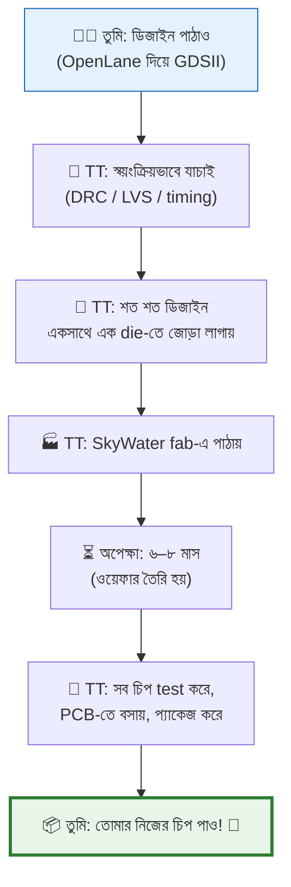

# 🚀 Chapter 24: TinyTapeout - Submit Your Chip!
## From Design to Real Silicon - Your Chip Goes to Fab!

> **"Your design is ready. Time to send it to the FAB! Real chip coming!"**
>
> **"তোমার design ready। এবার FAB এ পাঠাও! Real chip আসছে!"**

---

## 🎯 এই Chapter এ তুমি করবে:

```
✅ TinyTapeout পরিচিতি - what it is
✅ Submission প্রক্রিয়া - step by step
✅ Design হার্ডেনিং - prepare your design
✅ Verification - সব check pass করো
✅ Submit & Track - পাঠাও এবং track করো
✅ Payment - কত খরচ
✅ Waiting Period - এরপর কী হবে
✅ তোমার chip fab এ যাচ্ছে! 🎉
```

**Time Required:** 1 week (preparation + submission)  
**Prerequisites:** Chapters 21-23 complete

---

## 🌟 শেষ ধাপ — আর সবচেয়ে রোমাঞ্চকর

"Submission" শুনতে ভারী লাগতে পারে, কিন্তু TinyTapeout পুরোটাই **শিক্ষার্থী আর
প্রথম-বারের designer-দের জন্য** বানানো — সস্তা, সহজ, আর প্রচুর নতুন মানুষ
প্রথমবারেই পেরেছে।

তুমি এতদূর এসেছ — datapath, pipeline, layout সব পার করে। এই শেষ ধাপটা মূলত
"পাঠাও" বাটন চাপার মতো। চলো তোমার design-টা সিলিকনের পথে পাঠাই! 🚀

---

## 🚀 TinyTapeout কী?

### স্বপ্নটা সত্যি হলো যেভাবে

একটা সত্যি কথা দিয়ে শুরু করি। কয়েক বছর আগ পর্যন্ত নিজের ডিজাইন করা চিপ
fabricate করা মানে ছিল কয়েক হাজার থেকে কয়েক **লক্ষ** ডলারের খরচ। কেন? কারণ
fab-এ চিপ বানানোর প্রথম খরচটাই সবচেয়ে বড় — **mask** (চিপের প্রতিটা layer-এর
জন্য আলোকচিত্রের মতো template) বানাতে হয়, আর সেই mask-set একবার বানালে সেটা
দিয়ে এক ওয়েফার বানাও বা হাজার ওয়েফার, mask-এর দামটা একই থাকে। অর্থাৎ খরচটা
fixed — তোমার ডিজাইন বড় হোক বা ছোট, একটা চিপ বানাও বা একশোটা, ওই বিশাল
"setup খরচ"টা গুনতেই হবে।

ফলাফল? শুধু বড় কোম্পানি — Intel, AMD, Apple — যারা লক্ষ লক্ষ চিপ বিক্রি করে
খরচ তুলে নিতে পারে, তারাই চিপ বানাতো। ছাত্র, hobbyist, ছোট startup — সবাই
দরজার বাইরে।

এখন প্রশ্ন: ওই fixed খরচটা যদি **অনেকজন মিলে ভাগ করে নিই**? ঠিক যেমন একা একটা
আস্ত বাস ভাড়া করা অসম্ভব, কিন্তু বাসের একটা সিট কেনা সবার নাগালে — তেমনি
একটা চিপের একটুকরো জায়গা ভাড়া নেওয়া যায় কি? **TinyTapeout** ঠিক এটাই করে।
এটা একটা "shuttle service" — অনেক মানুষের ছোট ছোট ডিজাইন একসাথে জড়ো করে একটা
চিপে বসিয়ে দেয়, তারপর পুরো দলটা মিলে fab-এর খরচটা ভাগ করে নেয়।

| বিষয় | আগে (একার চেষ্টা) | TinyTapeout-এর সাথে |
|---|---|---|
| Fab খরচ | $10,000 – $1,000,000+ | পুরো দলে ভাগ (~$15,000) |
| তোমার খরচ | পুরোটাই একা | **$100 – $300** |
| কারা পারে | শুধু বড় কোম্পানি | ছাত্র, hobbyist, যে কেউ |
| তোমার জায়গা | আস্ত die | একটা ছোট tile (160µm × 100µm) |
| তুমি কী পাও | — | **আসল silicon chip!** 🏆 |

তোমার ডিজাইনের জন্য বরাদ্দ জায়গাটা সত্যিই ছোট — মাত্র **160µm × 100µm**, মানে
একটা চুলের চেয়েও সরু একটুকরো সিলিকন। কিন্তু ছোট হোক, এটা **আসল চিপ** — তোমার
লেখা Verilog সত্যিকারের transistor হয়ে গেছে। 🏆

### কীভাবে কাজ করে — পুরো যাত্রাটা এক নজরে

পুরো প্রক্রিয়াটা ভাবো একটা রিলে দৌড়ের মতো — তুমি প্রথম ধাপটা দৌড়াও (ডিজাইন
পাঠাও), তারপর TinyTapeout টিম ব্যাটনটা নিয়ে fab পর্যন্ত নিয়ে যায়, আর সবশেষে
চিপটা ঘুরে তোমার হাতে ফিরে আসে:



এই পুরো ধারণাটার সৌন্দর্যটা একবার ভেবে দেখো: প্রায় **$15,000**-এর fab খরচ
যখন কয়েকশো মানুষের মধ্যে ভাগ হয়ে যায়, তখন মাথাপিছু পড়ে মাত্র **$100–$300** —
আর তার বদলে সবাই হাতে পায় সত্যিকারের সিলিকন। এক সময় যেটা শুধু বিলিয়ন-ডলার
কোম্পানির হাতের নাগালে ছিল, সেটা এখন তোমার-আমার নাগালে। অসাধারণ, তাই না? 💡

---

## ২৪.১ TinyTapeout Requirements

### Design Constraints:

```
Physical Size:
✅ Tile: 160µm × 100µm
✅ That's 0.016 mm²
✅ Small but enough!

Process:
✅ Sky130 PDK (130nm)
✅ OpenLane flow
✅ Standard cells only

IO Constraints:
✅ Input: 8 pins (ui[7:0])
✅ Output: 8 pins (uo[7:0])
✅ Bidirectional: 8 pins (uio[7:0])
✅ Clock: 1 pin (clk)
✅ Reset: 1 pin (rst_n)
✅ Enable: 1 pin (ena)

Total: 27 pins (fixed!)

Power:
✅ 1.8V supply
✅ <10mW recommended
```

### What Can Fit?

```
Examples that fit:
✅ Simple RISC-V core (RV32E)
✅ Small ALU
✅ UART controller
✅ SPI master
✅ Counter
✅ LED controller
✅ Simple games
✅ Calculator

Your full processor?
❌ Too big for one tile!
✅ But simplified version: YES!

Strategy: Simplify wisely!
```

---

## ২৪.২ Preparing Your Design

### Design Simplification:

```
Your full processor:
- 32 registers × 32-bit
- 4KB cache
- UART + GPIO + Timer
- Total: Too big!

Simplified for TinyTapeout:
✅ 16 registers × 32-bit
✅ No cache (external memory)
✅ Basic UART only
✅ 8-bit GPIO
✅ Fits in tile! 🎉

Still impressive:
- Working RISC-V core!
- Can run programs!
- Real silicon!
```

### Verilog Template:

```verilog
`default_nettype none

module tt_um_your_design (
    input  wire [7:0] ui_in,    // Dedicated inputs
    output wire [7:0] uo_out,   // Dedicated outputs
    input  wire [7:0] uio_in,   // IOs: Input path
    output wire [7:0] uio_out,  // IOs: Output path
    output wire [7:0] uio_oe,   // IOs: Enable (1=output)
    input  wire       ena,      // Enable (always 1)
    input  wire       clk,      // Clock
    input  wire       rst_n     // Reset (active low)
);

    // Your design here!
    // Must fit in 160µm × 100µm
    
    // Example: Simple counter
    reg [7:0] counter;
    
    always @(posedge clk) begin
        if (!rst_n) begin
            counter <= 0;
        end else if (ena) begin
            counter <= counter + 1;
        end
    end
    
    assign uo_out = counter;
    assign uio_out = 8'b0;
    assign uio_oe = 8'b0;

endmodule
```

---

## ২৪.৩ Running OpenLane

### Config for TinyTapeout:

```tcl
# config.tcl
set ::env(DESIGN_NAME) tt_um_your_design

# TinyTapeout specific
set ::env(DIE_AREA) "0 0 160 100"
set ::env(FP_CORE_UTIL) 50
set ::env(CLOCK_PERIOD) "100"  # 10MHz

# Standard settings
set ::env(VERILOG_FILES) [glob $::env(DESIGN_DIR)/src/*.v]
set ::env(CLOCK_PORT) "clk"

# Optimize for area
set ::env(SYNTH_STRATEGY) "AREA 0"
set ::env(PL_TARGET_DENSITY) 0.60
```

### Run the Flow:

```bash
# In OpenLane
./flow.tcl -design tt_um_your_design

# Check results:
# - Area < 0.016 mm² ✅
# - DRC violations = 0 ✅
# - LVS clean ✅
# - Timing met ✅

# If all pass: Ready to submit! 🎉
```

---

## ২৪.৪ GitHub Submission Process

### Fork Template:

```bash
# 1. Go to TinyTapeout template
https://github.com/TinyTapeout/tt-template

# 2. Click "Use this template"
# 3. Create your repo: tt-my-design

# 4. Clone it
git clone https://github.com/yourusername/tt-my-design
cd tt-my-design
```

### Add Your Design:

```bash
# 5. Copy your Verilog
cp your_design.v src/tt_um_your_design.v

# 6. Update info.yaml
nano info.yaml

# Edit:
project:
  title: "My RISC-V Processor"
  author: "Your Name"
  description: "Simplified RISC-V core"
  language: "Verilog"
  clock_hz: 10000000

# 7. Commit and push
git add .
git commit -m "Add my design"
git push
```

### Automated CI:

```
GitHub Actions will:
✅ Run OpenLane
✅ Check DRC
✅ Check LVS  
✅ Verify timing
✅ Generate GDSII
✅ Run tests

If all green ✅ → Ready!
If red ❌ → Fix issues
```

---

## ২৪.৫ Official Submission

### Join TinyTapeout Round:

```
Submission windows:
- TT runs every 3-4 months
- Check: tinytapeout.com
- Limited slots (500-2000 designs)
- First come, first serve!

Process:
1. Wait for submission to open
2. Fill web form
3. Provide GitHub repo link
4. Pay submission fee
5. Wait for verification
6. Get confirmation! 🎉
```

### Cost Breakdown:

```
Submission Fee:
- Standard: $100 (প্রায় ৳১২,০০০)
- Student discount: Sometimes available
- Group discounts: 3+ people

Includes:
✅ Fabrication cost (shared)
✅ Testing
✅ PCB board
✅ Chip in package (QFN-64)
✅ Shipping worldwide!

Total: $100-300
(বাংলাদেশে shipping + customs: +৳2000-5000)

Worth it: YOUR CHIP! 🏆
```

---

## ২৪.৬ After Submission

### Verification Phase:

```
TinyTapeout team checks:
1. GDSII valid? ✅
2. Size correct? ✅
3. DRC clean? ✅
4. LVS passed? ✅
5. Timing OK? ✅
6. Test passes? ✅

If any ❌ → You fix and resubmit
Usually 1-2 iterations

When all ✅ → Accepted! 🎉
```

### Tracking:

```
You can track:
- Submission status (approved/pending)
- Your position in shuttle
- Fab status (tape-out date)
- Testing progress
- Shipping

Updates via:
- Email
- Discord community
- GitHub issues
```

---

## ২৪.৭ The Waiting Game

### Timeline:

```
After submission accepted:

Month 0: Submission closes
Month 1: Final checks, tape-out
Month 2-7: Fabrication (at Skywater)
Month 8: Testing & packaging
Month 9: Shipping starts
Month 10: YOU RECEIVE CHIP! 🎉

Total: 6-10 months
Be patient! Manufacturing takes time!

Track at: tinytapeout.com/runs
```

### What Happens at Fab:

```
SkyWater Fab (Bloomington, Minnesota, USA):
1. Create masks (patterns)
2. Wafer processing (~50 steps)
   - Oxidation
   - Photolithography  
   - Etching
   - Doping
   - Metallization
3. Testing
4. Dicing (cut wafer)
5. Packaging (QFN-64)
6. Final test
7. Ship to TinyTapeout
8. TT ships to you!

Complex process! 🏭
```

---

## ২৪.৮ Community & Support

### Join the Community:

```
Discord:
- TinyTapeout Discord server
- Ask questions
- See other designs
- Get help
- Share progress!

GitHub:
- Discussions
- Issues
- Examples
- Documentation

Very helpful community! 🤝
```

---

## ২৪.৯ Success Tips

### Do's:

```
✅ Start with simple design first
✅ Test thoroughly in simulation
✅ Follow all guidelines
✅ Join Discord early
✅ Learn from others' designs
✅ Submit early in window
✅ Be patient!
```

### Don'ts:

```
❌ Don't rush submission
❌ Don't skip verification
❌ Don't ignore DRC errors
❌ Don't make design too complex
❌ Don't expect fast results
❌ Don't give up if first try fails
```

---

## ২৪.১০ Your Processor Submission

### Realistic First Chip:

```
Recommended scope:
✅ RV32E (16 registers)
✅ ~20 instructions
✅ 256 bytes program memory
✅ 256 bytes data memory
✅ 8-bit IO
✅ Simple UART

Still IMPRESSIVE:
- Real RISC-V core!
- Runs C code!
- In YOUR silicon!
- Portfolio project!
- Interview gold!

Worth it! 🏆
```

---

## ২৪.১১ Chapter 24 Mission Complete!

### তুমি এখন জানো:

```
✅ TinyTapeout কী
✅ কীভাবে submit করতে হয়
✅ Design requirements
✅ খরচ কত
✅ Timeline কেমন
✅ Tracking কীভাবে করবে
✅ তোমার chip fab এ যাচ্ছে! 🎉
```

### Next:

```
Chapter 25: Chip Fabrication & Testing
  → 6-8 months পরে...
  → Chip arrives! 📦
  → Testing methodology
  → Bring-up process
  → Debug & validation
  → SUCCESS CELEBRATION! 🎊

Your silicon journey continues! 🚀
```

---

## 🎯 Chapter Exercise

### Project: Prepare Your Submission

```
Task: Get submission-ready design

1. Simplify your processor
   - Choose subset of features
   - Fit in 160µm × 100µm
   - Test in simulation

2. Run OpenLane
   - Generate GDSII
   - Pass all checks
   - Meet timing

3. Create GitHub repo
   - Use TT template
   - Add your design
   - Document well

4. Wait for next TT round
   - Join Discord
   - Watch for announcement
   - Be ready to submit!

Your chip journey begins! 🚀
```

---

## 🏆 Achievement Unlocked!

```
Level 24: ✅ COMPLETE - Chip Submitter!
Progress: [█████████████████████████████████████] 96%

XP Gained: +2000
Skills: Submission Process, Real Fabrication

Badges Earned:
🥉 TinyTapeout User
🥈 Design Submitter
🥇 Fab-Ready Designer
🏅 Real Silicon Seeker
🎖️ Chip Maker (in progress)
📦 CHIP IN PRODUCTION! 📦

NEXT: Wait for your chip! Then Chapter 25! 🎊
```

---

**[⬅️ Previous: Chapter 23](Chapter_23_Sky130_PDK.md)** | **[➡️ Next: Chapter 25](Chapter_25_Chip_Fabrication_Testing.md)**

---

<div align="center">

**"Your design is in the fab! 6 months of patience... then REAL SILICON!"**

**"তোমার design fab এ! ৬ মাস অপেক্ষা... তারপর REAL SILICON!"**

Made with ❤️ for chip makers | চিপ মেকারদের জন্য ভালোবাসা দিয়ে তৈরি

</div>
