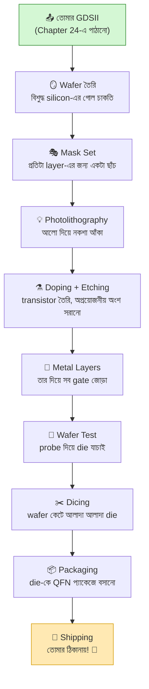
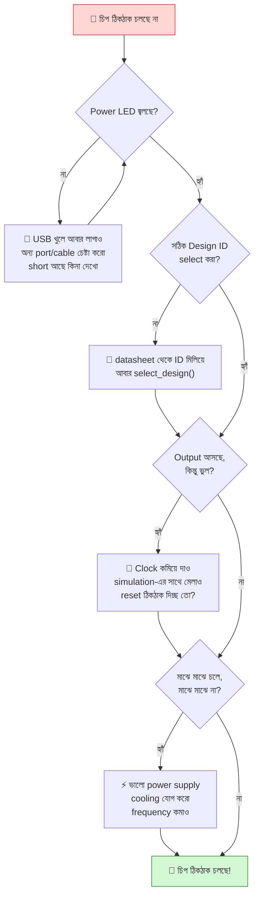
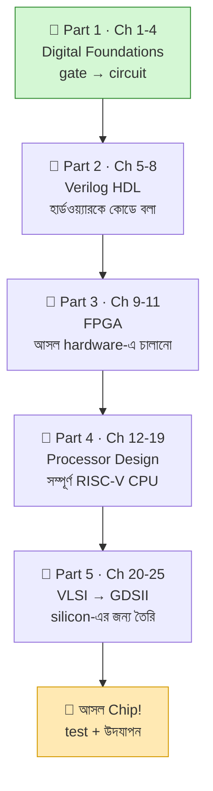

# 🎊 Chapter 25: Your Silicon Has Arrived!
## Testing, Validation & Victory Celebration!

> **"6 months later... THE CHIP ARRIVES! Time to test YOUR silicon!"**
>
> **"৬ মাস পরে... CHIP এসেছে! এবার তোমার silicon test করো!"**

---

এই বইয়ের একদম শেষ অধ্যায়ে তুমি পৌঁছে গেছ। আগের অধ্যায়ে (Chapter 24) তুমি
তোমার design-টা TinyTapeout shuttle-এ submit করেছিলে। সেটা ছিল GDSII ফাইল
পাঠানো — অর্থাৎ তোমার চিপের চূড়ান্ত নকশা। তারপর শুরু হয়েছিল দীর্ঘ অপেক্ষা।

এবার সেই অপেক্ষার পুরস্কার হাতে আসছে: **একটা আসল silicon chip, যেটা তুমি নিজে
design করেছ।** এই অধ্যায়টা পুরোটাই সেই চিপ ঘিরে — কীভাবে fab-এ তোমার design
সিলিকনে রূপ নেয়, কীভাবে প্যাকেজ করা চিপটা তোমার হাতে আসে, কীভাবে সেটাকে
জাগিয়ে তোলো (bring-up), test করো, সমস্যা হলে debug করো, আর সবশেষে — **উদযাপন
করো।** 🎉

## 🎯 এই Chapter-এ তুমি করবে:

```
✅ Chip Arrival - প্যাকেজ খোলো! 📦
✅ PCB Setup - তোমার chip board-এ লাগাও
✅ Power-Up - প্রথম power on!
✅ Basic Testing - কাজ করছে কি না
✅ Programming - code load করো
✅ Validation - সব feature test করো
✅ Debugging - যদি সমস্যা হয়
✅ CELEBRATION! - তুমি chip designer! 🎉
```

**Time Required:** 2-3 weeks (testing + validation)  
**Prerequisites:** Chapter 24 complete + 6-8 months patience!

> 💡 **মনে রেখো:** আগের সব অধ্যায়ে তুমি ছিলে design করার মোডে — Verilog লেখা,
> simulate করা, FPGA-তে চালানো, layout বানানো। এই অধ্যায়ে তুমি প্রথমবার
> **hardware bring-up** করবে — অর্থাৎ একটা অজানা, fresh চিপকে ধাপে ধাপে
> পরীক্ষা করে নিশ্চিত করবে যে ভিতরের প্রতিটা অংশ ঠিকঠাক চলছে। এটা design থেকে
> আলাদা একটা দক্ষতা, আর professional chip company-তে এটাই "post-silicon
> validation" নামে একটা পুরো বিভাগ। তুমি আজ সেটার স্বাদ পাবে।

---

## 🌟 কাজ করুক বা না করুক — তুমি জিতে গেছ

Chip হাতে পেয়ে প্রথমবারেই সব ঠিকঠাক চললে — দারুণ! 🎉 আর কিছু কাজ না করলেও
তুমি হেরে যাওনি: **পৃথিবীর সেরা chip designer-দের প্রথম chip-ও প্রায়ই পুরোপুরি
চলে না** — debugging-ই আসল শেখা।

মনে রেখো, তুমি শূন্য থেকে সিলিকনে নিজের প্রসেসর পাঠিয়েছ — বাংলাদেশে খুব কম
মানুষ এটা করেছে। চলো test করি; যা-ই হোক, উদযাপন তোমার প্রাপ্য! 🏆

---

## 🚀 The Journey So Far

থামো একটু। পিছনে তাকাও। তুমি যেখান থেকে শুরু করেছিলে — একটা সাদা পাতা, একটা
AND gate, "প্রসেসর আসলে কীভাবে কাজ করে?" এই একটা প্রশ্ন — সেখান থেকে আজ তুমি
এমন এক জায়গায় দাঁড়িয়ে যেখানে fab তোমার নকশা সিলিকনে খোদাই করে তোমার ঠিকানায়
পাঠাচ্ছে। এই পথটা ছোট ছিল না। চলো একবার সময়রেখাটা দেখি:

### Your Timeline:

```
Month 1-6:  Learned digital design, Verilog, FPGA
Month 7-12: Built processor, optimized, ready
Month 13:   Submitted to TinyTapeout
Month 14-20: Fabrication at SkyWater fab
Month 21:   Testing & packaging
Month 22:   CHIP ARRIVES! 🎉

Total: Almost 2 years!
Worth it: ABSOLUTELY! 🏆
```

এই timeline-এর সবচেয়ে কঠিন অংশটা কোনটা জানো? **অপেক্ষা।** Verilog লেখা,
bug ঠিক করা, layout বানানো — এসবে তুমি ব্যস্ত থাকো, সময় কেটে যায়। কিন্তু
submit করার পর fab-এ চিপ তৈরি হতে যে ৬-৮ মাস লাগে, সেই সময়টা শুধু ধৈর্য ধরে
থাকা ছাড়া কিছু করার নেই। এই অপেক্ষাটাই তোমাকে সত্যিকারের chip designer বানায় —
কারণ পৃথিবীর সব বড় fab-এই এই tape-out-থেকে-silicon চক্রটা মাসের পর মাস ধরে চলে।

---

## ২৫.০ ভিতরে কী ঘটছে: তোমার Design কীভাবে সিলিকন হয়ে ওঠে 🏭

চিপ হাতে পাওয়ার আগে একটা গল্প আছে — তোমার GDSII ফাইলটা fab-এ পৌঁছানোর পর
সেখানে কী ঘটে। এটা না জানলে চিপটাকে শুধু একটা কালো প্লাস্টিকের টুকরো মনে হবে।
জানলে বুঝবে — তোমার পাঠানো জ্যামিতিক নকশার প্রতিটা আয়তক্ষেত্র একটা সিলিকন
ওয়েফারে আক্ষরিক অর্থেই **আলো দিয়ে এঁকে** transistor-এ পরিণত হয়েছে।

মূল ধারণাটা সহজ: **photolithography** — অর্থাৎ আলো দিয়ে ছবি আঁকা, ঠিক যেমন
পুরোনো দিনের ফিল্ম ক্যামেরায় ছবি ওঠে। তোমার design-এর প্রতিটা layer (diffusion,
poly, metal 1, metal 2, …) একটা করে "mask" বা ছাঁচ হয়ে যায়। ওয়েফারের উপর
আলো-সংবেদনশীল রাসায়নিক (photoresist) মেখে সেই mask-এর মধ্য দিয়ে আলো ফেলা হয়,
যাতে তোমার নকশাটা একটার পর একটা স্তর হিসেবে সিলিকনে ফুটে ওঠে।

### Fab-এর ভিতরের ধাপগুলো:



প্রতিটা ধাপ একটু বিস্তারিত করি, যাতে চিপটা হাতে নিয়ে তুমি ঠিক জানো ভিতরে কী
লুকিয়ে আছে:

- **Wafer তৈরি:** একটা ২০০ বা ৩০০ mm ব্যাসের, আয়নার মতো মসৃণ, প্রায় নিখুঁত
  বিশুদ্ধ সিলিকনের গোল চাকতি। এই একটা ওয়েফারে তোমার মতো **শত শত design** একসাথে
  বসে — TinyTapeout-এর পুরো মজাটাই এখানে: সবাই মিলে একটা ওয়েফার ভাগ করে নাও,
  তাই খরচ ভাগ হয়ে যায়।
- **Mask Set:** তোমার GDSII-র প্রতিটা layer থেকে একটা করে কাচের ছাঁচ (mask)
  বানানো হয়। এই mask-গুলোই সবচেয়ে দামি অংশ — তাই TinyTapeout সবার design এক
  mask-এ একসাথে নেয়।
- **Photolithography + Etching + Doping:** এই তিনটা ধাপ বারবার ঘুরে ঘুরে চলে —
  প্রতিটা layer-এর জন্য একবার করে। আলো ফেলে নকশা আঁকা হয়, রাসায়নিক দিয়ে
  অপ্রয়োজনীয় অংশ ধুয়ে ফেলা (etch) হয়, আর নির্দিষ্ট জায়গায় ভিন্ন পরমাণু ঢুকিয়ে
  (doping) সিলিকনকে transistor-এ পরিণত করা হয়। তোমার Sky130 design-এ এমন
  ডজনখানেক layer আছে।
- **Metal Layers:** transistor তৈরি হয়ে গেলে তাদের তার দিয়ে জোড়া দিতে হয়।
  Sky130-তে কয়েকটা metal স্তর (Chapter 21-এ যেগুলো দেখেছিলে — metal 1 থেকে
  উপরে) একটার উপর একটা বসিয়ে তোমার circuit-এর সব সংযোগ সম্পূর্ণ করা হয়।
- **Wafer Test (probe):** চিপ কাটার আগেই সরু সুঁইয়ের মতো probe দিয়ে ওয়েফারের
  উপর প্রতিটা die-তে বিদ্যুৎ দিয়ে দেখা হয় কোনগুলো বেঁচে আছে। নষ্ট die-গুলোতে
  কালি দিয়ে দাগ দেওয়া হয়।
- **Dicing:** একটা হীরের করাত দিয়ে ওয়েফার কেটে আলাদা আলাদা ছোট ছোট die করা হয়।
  তোমার পুরো প্রসেসরটা এই এক টুকরো die-তে — মাত্র কয়েকশো মাইক্রোমিটার চওড়া।
- **Packaging:** খালি die খুব ভঙ্গুর আর তার pad-গুলো এত ছোট যে হাতে ছোঁয়া
  অসম্ভব। তাই die-টাকে একটা প্যাকেজের (এখানে QFN-64) ভিতরে বসিয়ে চুলের চেয়েও
  সরু সোনার তার (bond wire) দিয়ে প্যাকেজের বাইরের pin-এর সাথে জোড়া হয়। এই
  প্যাকেজটাই তুমি হাতে পাবে।

> 🧠 **কেন এত সময় লাগে?** একটা ওয়েফারে ১০০+ photolithography, etching আর
> doping ধাপ পরপর চলে, প্রতিটার মধ্যে পরিষ্কার করা আর মাপজোক — সব মিলিয়ে কয়েক
> সপ্তাহ। তার উপর shuttle service (যেমন TinyTapeout) অনেক design জমা হওয়া
> পর্যন্ত অপেক্ষা করে, তারপর একসাথে একটা batch পাঠায়। এই অপেক্ষাটাই খরচ কমায় —
> তুমি একা একটা ওয়েফার বানালে লাখ ডলার লাগত; ভাগ করে নেওয়ায় মাত্র $100-300!

> ⚠️ **Yield মানে কী:** fab থেকে আসা সব চিপ কাজ করে না — ধুলো, ছোট ত্রুটি বা
> প্রক্রিয়ার তারতম্যে কিছু die নষ্ট হয়। যে শতাংশ চিপ ঠিকঠাক চলে, তাকে বলে
> **yield**। তোমার design ছোট, তাই yield সাধারণত ভালো হয় — কিন্তু এই কারণেই
> তোমাকে একাধিক copy দেওয়া হতে পারে, আর এই কারণেই test করাটা জরুরি।

---

## ২৫.১ The Package Arrives! 📦

একদিন তোমার দরজায় একটা ছোট্ট প্যাকেট আসবে। বাইরে থেকে দেখলে সাধারণ একটা
কুরিয়ার বাক্স — কিন্তু ভিতরে তোমার নিজের হাতে design করা প্রসেসর, যেটা এখন আর
শুধু সিমুলেশনের সংখ্যা নয়, **আসল সিলিকন।** TinyTapeout সাধারণত পুরো batch
একসাথে ফেরত পাঠায়, তাই তোমার সাথে আরও অনেকের design একই বোর্ডে থাকবে — কিন্তু
তার মধ্যে একটা স্লট তোমার, শুধুই তোমার।

### What You Receive:

```
In the box:
✅ PCB board (credit card size)
✅ Your chip (QFN-64 package)
✅ Already mounted on PCB!
✅ USB connector
✅ Pin headers
✅ Datasheet
✅ Test guide

Optional kit:
✅ Breadboard
✅ LEDs
✅ Buttons  
✅ Wires
✅ Power adapter

Handle with care! ESD sensitive! ⚡
```

বাক্সের প্রতিটা জিনিস কেন আছে, এক নজরে দেখে নাও — এতে bring-up করার সময় কোনটা
কী কাজে লাগবে আগেই বুঝে যাবে:

| জিনিস | এটা কী | কেন দরকার |
|---|---|---|
| PCB board | ক্রেডিট কার্ড আকারের ছাপানো বোর্ড | তোমার চিপ এর উপরেই বসানো; bring-up-এর মূল মঞ্চ |
| তোমার chip (QFN-64) | কালো প্যাকেজে মোড়া তোমার die | এর ভিতরেই তোমার আসল প্রসেসর! |
| RP2040 MCU | বোর্ডে বসানো একটা microcontroller | তোমার চিপকে clock, reset আর IO দেয়; USB চালায় |
| USB connector | USB-C পোর্ট | কম্পিউটারের সাথে যোগাযোগ ও power |
| Pin headers | সারি সারি ধাতব পিন | breadboard/তারে চিপের signal বের করে আনতে |
| Datasheet | pin map ও spec-এর কাগজ | কোন pin কী করে তা জানতে |
| Test guide | ধাপে ধাপে নির্দেশিকা | প্রথমবার চালু করার গাইড |

> ⚡ **ESD কী আর কেন এত সাবধানতা?** ESD মানে **Electro-Static Discharge** —
> তোমার শরীরে জমা থাকা স্থির বিদ্যুৎ। শীতের দিনে দরজার হাতল ধরলে যে "চটাং" করে
> শক লাগে, সেটাই কয়েক হাজার volt! তোমার চিপের ভিতরের transistor-গুলো এত সূক্ষ্ম
> (130nm) যে এই এক ঝটকাতেই চিরতরে নষ্ট হয়ে যেতে পারে — অথচ বাইরে থেকে কিছুই
> বোঝা যাবে না। তাই: **(১)** চিপ ধরার আগে কোনো ধাতব জিনিস (যেমন কলের পাইপ)
> ছুঁয়ে নিজেকে discharge করো, **(২)** সম্ভব হলে ESD wrist strap পরো, **(৩)**
> চিপের pin বা ধাতব অংশে সরাসরি আঙুল না দিয়ে বোর্ডের কিনারা ধরো, **(৪)** কার্পেটে
> বসে বা সোয়েটার পরে কাজ কোরো না।

### First Look:

```
Your chip:
- Size: 7mm × 7mm package
- Inside: 130nm silicon die
- Your design: 160µm × 100µm
- Tiny but REAL!

Moment of truth:
Look at that chip! 
That's YOUR processor!
YOU designed this!
In REAL silicon!

Take a photo! Share it! 
This is HUGE! 🎊
```

একটু ভেবে দেখো ব্যাপারটা কত অবিশ্বাস্য: যে কালো প্যাকেজটা ৭ mm × ৭ mm
(একটা নখের চেয়েও ছোট), তার **ভিতরে** আবার আরও ছোট একটা সিলিকন die, আর সেই
die-এর মধ্যে তোমার পুরো প্রসেসরটা মাত্র **160µm × 100µm** জায়গায় — মানুষের
চুলের ব্যাসের চেয়েও সরু পরিসরে! খালি চোখে তোমার design-টা দেখাই যাবে না; অথচ
সেখানে হাজার হাজার transistor তোমার লেখা প্রতিটা instruction চালানোর জন্য
অপেক্ষা করছে।

এই মুহূর্তটা মনে রাখার মতো। **থামো, চিপটা হাতে নাও, একটা ছবি তোলো।** এটা শুধু
একটা electronics component নয় — এটা তোমার মাসের পর মাস পরিশ্রমের ফল, একটা
স্বপ্ন যেটা এখন তোমার হাতের তালুতে। বাংলাদেশে এমন একটা মুহূর্ত খুব কম মানুষ
পেয়েছে। উদযাপনটা এখনই শুরু হোক। 🎊

---

## ২৫.২ PCB Setup

তোমার চিপটা একা একা কাজ করতে পারে না — তাকে power দিতে হবে, clock দিতে হবে,
reset করতে হবে, আর তার output পড়ার ব্যবস্থা করতে হবে। TinyTapeout বোর্ড ঠিক
এই কাজগুলোই করে। সবচেয়ে মজার ব্যাপার — তোমাকে কোনো জটিল ল্যাব যন্ত্রপাতি কিনতে
হবে না; বোর্ডে বসানো একটা সাধারণ **RP2040** microcontroller (হ্যাঁ, Raspberry
Pi Pico-র সেই চিপ!) তোমার প্রসেসরের "নার্স"-এর ভূমিকা পালন করে।

### Understanding the Board:

```
TinyTapeout PCB features:
┌──────────────────────────────────────────┐
│ USB            Your Chip    Power        │
│   ↓                 ↓          ↓         │
│ [USB-C]        [QFN-64]     [Power LED]  │
│                                          │
│ [RP2040]       [Level       [Pin         │
│   MCU            Shifters]    Headers]   │
│                                          │
│ [Design        [Test        [GPIO        │
│   Select]        Points]      Pins]      │
└──────────────────────────────────────────┘

RP2040 controls your chip:
- Sends clock
- Provides reset
- Manages IO
- USB interface
```

বোর্ডের মূল অংশগুলো কী করে, এক নজরে বুঝে নাও — bring-up-এর সময় এগুলোর নাম
বারবার আসবে:

| অংশ | কাজ |
|---|---|
| RP2040 MCU | পুরো বোর্ডের নিয়ন্ত্রক; তোমার চিপকে clock, reset দেয়, IO পড়ে/লেখে, আর USB দিয়ে কম্পিউটারের সাথে কথা বলে |
| USB-C | একই তারে power আর data — কম্পিউটারে লাগালেই বোর্ড চালু |
| Power LED | বিদ্যুৎ ঠিকঠাক আসছে কিনা তার প্রথম চিহ্ন (জীবনের প্রথম লক্ষণ!) |
| Level Shifters | RP2040 আর তোমার চিপের voltage আলাদা হতে পারে; এরা signal-গুলোকে নিরাপদে রূপান্তর করে |
| Design Select | একই batch-এ থাকা শত শত design থেকে শুধু তোমারটা বেছে নেওয়ার সুইচ |
| Test Points / GPIO Pins | তোমার চিপের ভিতরের signal বাইরে এনে মাপা বা breadboard-এ যুক্ত করার জায়গা |

> 🔌 **Level shifter কেন লাগে?** তোমার Sky130 চিপ চলে 1.8V-এ, কিন্তু RP2040 আর
> অনেক peripheral চলে 3.3V-এ। সরাসরি জুড়লে বেশি voltage তোমার সূক্ষ্ম চিপকে
> পুড়িয়ে দিতে পারত। level shifter দুই দিকের voltage-কে নিরাপদে অনুবাদ করে দেয় —
> ঠিক যেন দুই ভাষার মাঝে একজন দোভাষী।

> 🧭 **Design Select কেন এত গুরুত্বপূর্ণ?** তোমার চিপের ভিতরে কিন্তু **শুধু
> তোমার design নেই** — পুরো batch-এর সব design একসাথে আছে! Design Select দিয়ে
> তুমি RP2040-কে বলো কোন design-টা এখন "active" রাখতে হবে। ভুল ID দিলে অন্য কারো
> circuit চালু হবে, আর তোমার মনে হবে তোমার চিপ কাজ করছে না। তাই সবার আগে নিজের
> সঠিক design ID-টা datasheet/submission থেকে মিলিয়ে নাও।

### Initial Setup:

```bash
# 1. Don't power on yet!
# 2. Visual inspection first
Check for:
✅ Chip properly mounted
✅ No visible damage
✅ Solder joints good
✅ No shorts

# 3. Connect USB cable
Use quality cable!
ESD wrist strap recommended!

# 4. Connect to computer
Should enumerate as USB device

# 5. Install software
git clone https://github.com/TinyTapeout/tt-commander
cd tt-commander
pip install -r requirements.txt
```

এই ধাপগুলোর পিছনের যুক্তিটা বুঝে নাও — তাড়াহুড়ো করলে এখানেই চিপ নষ্ট হয়:

- **আগে চোখে দেখো, পরে power দাও।** Power on করার আগে খালি চোখে (বা ফোনের
  ক্যামেরা zoom করে) চিপটা দেখো — ঠিকমতো বসানো আছে তো? কোনো pin বাঁকা বা solder
  দুই pin-এর মধ্যে লেগে (short) যায়নি তো? একটা short অবস্থায় power দিলে চিপ গরম
  হয়ে পুড়ে যেতে পারে — আর সেটা ফেরানোর উপায় নেই। এক মিনিটের পরীক্ষা মাসের
  পরিশ্রম বাঁচাতে পারে।
- **ভালো মানের USB cable ব্যবহার করো।** সস্তা "শুধু-charging" cable-এ data তার
  থাকে না; তখন বোর্ড power পাবে কিন্তু কম্পিউটার এটাকে দেখতে পাবে না। data সহ
  cable নাও।
- **"Enumerate" মানে কী?** USB cable লাগানোর পর কম্পিউটার যখন বোর্ডটাকে চিনে নেয়
  আর একটা device হিসেবে তালিকাভুক্ত করে, তাকে বলে enumeration। Linux-এ `dmesg`
  বা `lsusb`-তে নতুন device দেখা যাবে, Windows-এ একটা নতুন COM port আসবে। এটাই
  প্রথম প্রমাণ যে বোর্ডের RP2040 জীবিত — যদিও এখনো তোমার চিপ পর্যন্ত পৌঁছানো হয়নি।
- **Software কেন?** `tt-commander` হলো TinyTapeout-এর দেওয়া একটা টুল যেটা তোমার
  কম্পিউটার থেকে RP2040-কে কমান্ড পাঠায় — design select করা, clock দেওয়া, input
  সেট করা, output পড়া। নিচের সব Python script এই টুলের উপর দাঁড়িয়ে আছে।

---

## ২৫.৩ First Power-Up! ⚡

এটাই সেই মুহূর্ত যার জন্য তুমি প্রায় দুই বছর অপেক্ষা করেছ। বুকের ধুকপুকানি
স্বাভাবিক — প্রতিটা chip designer প্রথম power-up-এর সময় একইরকম উত্তেজনা আর
নার্ভাসনেস অনুভব করে। মনে রাখো, খারাপ কিছু হবে না: যদি কাজ করে, তুমি জিতে গেলে;
যদি প্রথমবার না-ও করে, তুমি debug শিখবে — আর সেটাই আসল chip designer-দের কাজ।

power-up-টা আমরা **ধাপে ধাপে** করব, একসাথে সব নয়। প্রথমে শুধু power আর "জীবনের
লক্ষণ" — চিপ আদৌ সাড়া দিচ্ছে কিনা। logic test পরে।

### The Moment of Truth:

```python
# power_up.py
from tt_commander import TinyTapeout

# Connect to board
tt = TinyTapeout()
tt.connect()

# Your design number (from submission)
DESIGN_ID = 123  # Your actual design ID

# Select your design
tt.select_design(DESIGN_ID)

# Power on!
tt.power_on()

# Check power LED
# Should light up! 💡

# First sign of life! 🎉
```

### Initial Checks:

```python
# Check chip responds
status = tt.get_status()
print(f"Chip ID: {status['chip_id']}")
print(f"Design active: {status['design']}")
print(f"Power good: {status['power']}")

# Expected output:
# Chip ID: TT04_123
# Design active: True
# Power good: 1.8V
# 
# IT'S ALIVE! 🎊
```

এই দুটো script ঠিক কী করছে, ভেঙে দেখি — কারণ এখানেই তোমার চিপের সাথে প্রথম
"হ্যান্ডশেক" হচ্ছে:

- **`tt.connect()`** কম্পিউটার থেকে USB দিয়ে বোর্ডের RP2040-এর সাথে যোগাযোগ
  স্থাপন করে।
- **`DESIGN_ID`** হলো তোমার নিজের design-এর নম্বর, যেটা Chapter 24-এ submit করার
  সময় পেয়েছিলে। এটা ভুল দিলে অন্য কারো circuit চালু হবে — আগেই মিলিয়ে নাও।
- **`tt.select_design(DESIGN_ID)`** RP2040-কে বলে batch-এর শত শত design থেকে শুধু
  তোমারটা active করতে — অর্থাৎ তোমার circuit-এ power আর clock যাবে, বাকিরা ঘুমিয়ে
  থাকবে।
- **`tt.power_on()`** তোমার নির্দিষ্ট design-এ বিদ্যুৎ পাঠায়। এখানেই Power LED
  জ্বলে ওঠা উচিত — **জীবনের প্রথম লক্ষণ!** 💡
- **`tt.get_status()`** তিনটা জিনিস ফেরত দেয় যেগুলো সবুজ সংকেত:
  - **Chip ID** (যেমন `TT04_123`) — চিপ নিজের পরিচয় ঠিকঠাক বলছে, মানে যোগাযোগ
    কাজ করছে।
  - **Design active: True** — সঠিক design select হয়েছে।
  - **Power good: 1.8V** — তোমার চিপ ঠিক voltage-এ চলছে (Sky130-এর core voltage)।

> ✅ **প্রথম checkpoint:** Power LED জ্বলল আর status-এ এই তিনটা ঠিক দেখাল?
> তাহলে তোমার silicon **জীবিত** — অর্ধেক যুদ্ধ এখানেই জেতা! এখনো logic ঠিক
> চলছে কিনা জানা হয়নি, কিন্তু চিপ সাড়া দিচ্ছে, power নিচ্ছে, আর নিজের নাম
> বলছে। থামো, এই মুহূর্তটা উপভোগ করো — তোমার বানানো একটা জিনিস এই প্রথমবার
> "জেগে উঠল"। 🎊

> ⚠️ **Power LED জ্বলল না?** এখনই থামো, USB খুলে ফেলো। এটা short বা connection
> সমস্যার লক্ষণ হতে পারে — জোর করে আবার power দিও না। নিচের ২৫.৮ Debugging
> অংশে "No response" সমস্যাটা দেখো।

---

## ২৫.৪ Basic Functional Testing

চিপ জীবিত — এবার দেখতে হবে সে আসলে **কাজটা** করছে কিনা। এখানে একটা সোনালি নিয়ম
আছে: **সহজ থেকে কঠিনে যাও।** আগে clock ছাড়াই static input দিয়ে দেখো input
দিলে output ঠিক বদলায় কিনা (অর্থাৎ pin আর তার সংযোগ ঠিক আছে কিনা), তারপর clock
চালু করে দেখো চিপ আসলে চলছে কিনা। একসাথে সব চালু করে দিলে কোথায় গন্ডগোল তা ধরা
কঠিন হয়ে যায় — তাই এক ধাপ এক ধাপ।

### Test Your IO:

প্রথমে input pin-গুলো একটা একটা করে high করে দেখি output কেমন সাড়া দেয়। এটা
তোমার চিপের সবচেয়ে মৌলিক পরীক্ষা — "তার ঠিকঠাক জোড়া আছে তো, input পাল্টালে
ভিতরের logic কিছু একটা করছে তো?"

```python
# test_io.py
# Test output pins
tt.set_inputs(0x00)  # All inputs low
outputs = tt.read_outputs()
print(f"Outputs: {outputs:08b}")

# Toggle inputs
for i in range(8):
    tt.set_input_bit(i, 1)
    outputs = tt.read_outputs()
    print(f"Input {i} high: {outputs:08b}")
    tt.set_input_bit(i, 0)

# Check if your logic works!
```

> 🔍 **কী দেখছ এখানে?** প্রতিটা input bit একবার করে high করে output পড়া হচ্ছে।
> যদি কোনো input পাল্টালে output-ও বদলায়, তার মানে সেই input pin থেকে ভিতরের
> logic পর্যন্ত আর logic থেকে output pin পর্যন্ত পুরো পথটা জীবিত। তোমার design
> অনুযায়ী output-টা কেমন হওয়া উচিত সেটা তুমি আগেই (simulation থেকে) জানো — এখন
> বাস্তবের সাথে মিলিয়ে নাও। যদি কোনো input-এই output না বদলায়, সম্ভবত reset
> active আছে বা clock দরকার — পরের ধাপে যাও।

### Clock Testing:

এবার আসল মজা — clock চালু করা। তোমার প্রসেসর একটা **synchronous** যন্ত্র: প্রতি
clock প্রান্তে (edge) এক ধাপ করে এগোয় — PC বাড়ে, পরের instruction আসে, register
আপডেট হয়। clock ছাড়া প্রসেসর স্থির হয়ে থাকে; clock দিলেই সে "হাঁটতে" শুরু করে।
নিচের script ধীর গতিতে (১০ MHz) clock দিয়ে কয়েকটা cycle ধরে output পড়ে — তুমি
চোখের সামনে output বদলাতে দেখবে, মানে তোমার প্রসেসর **চলছে**।

```python
# test_clock.py
# Set clock frequency
tt.set_clock(10_000_000)  # 10 MHz

# Monitor for a while
for cycle in range(100):
    outputs = tt.read_outputs()
    print(f"Cycle {cycle}: {outputs:08b}")
    time.sleep(0.001)

# See the changes!
# Your processor is running! 🚀
```

> 🐢 **কেন প্রথমে ধীর clock?** ১০ MHz তোমার চিপের সর্বোচ্চ গতির অনেক নিচে — আর
> এটা ইচ্ছাকৃত। ধীর clock-এ প্রায় সব timing সমস্যা লুকিয়ে থাকে, তাই logic ঠিক
> থাকলে চিপ নির্ভরযোগ্যভাবে চলবে। আগে নিশ্চিত হও যে কম গতিতে সব ঠিক, **তারপর**
> ধীরে ধীরে গতি বাড়িয়ে দেখবে কোথায় গিয়ে ভাঙে (২৫.৯-এ max frequency খোঁজা)।
> এটা একটা ক্লাসিক bring-up কৌশল: একসাথে অনেক variable বদলিও না — একবারে একটা।

---

## ২৫.৫ Programming Your Processor

এতক্ষণ তুমি চিপকে শুধু "নাড়াচাড়া" করছিলে। এবার তাকে **আসল কাজ** দেবে — একটা
প্রোগ্রাম চালাতে বলবে। মনে আছে Chapter 13-14-এ তুমি RISC-V instruction-গুলোকে
৩২-bit সংখ্যায় (machine code) রূপান্তর করতে শিখেছিলে? সেই হেক্সাডেসিমাল
সংখ্যাগুলোই এখন তোমার আসল সিলিকনে গিয়ে চলবে। এটা একটা পূর্ণবৃত্ত মুহূর্ত:
তোমার লেখা assembly → machine code → তোমার design করা চিপ → বাস্তব ফলাফল।

### Load a Program:

নিচের ছোট্ট প্রোগ্রামটা একদম মৌলিক একটা পরীক্ষা: `1 + 0`-এর মতো একটা যোগফল বের
করা। ছোট হলেও এটা পুরো datapath যাচাই করে — instruction fetch হচ্ছে, decode
হচ্ছে, ALU যোগ করছে, register file-এ ফল লেখা হচ্ছে।

```python
# load_program.py
# Simple test program (assembly)
program = [
    0x00000093,  # addi x1, x0, 0    # x1 = 0
    0x00100113,  # addi x2, x0, 1    # x2 = 1
    0x002081B3,  # add  x3, x1, x2   # x3 = x1 + x2
    0x00000000,  # nop
]

# Convert to bytes
program_bytes = b''.join(
    i.to_bytes(4, 'little') for i in program
)

# Load via GPIO pins
# (Your specific method depends on design)
tt.load_memory(program_bytes)

# Run!
tt.reset()
tt.run()

# Your code is running on YOUR chip! 🎉
```

> 🧩 **এই হেক্স সংখ্যাগুলো আসলে কী?** প্রতিটা ৩২-bit সংখ্যা একটা করে RISC-V
> instruction (Chapter 13-এর encoding মনে করো):
> - `0x00000093` → `addi x1, x0, 0` (x1-এ ০ রাখো)
> - `0x00100113` → `addi x2, x0, 1` (x2-এ ১ রাখো)
> - `0x002081B3` → `add x3, x1, x2` (x3 = x1 + x2, অর্থাৎ ০+১ = ১)
> - `0x00000000` → `nop` (কিছু কোরো না — প্রসেসর থামার জন্য নিরাপদ জায়গা)
>
> `to_bytes(4, 'little')` দিয়ে প্রতিটা instruction-কে little-endian বাইটে
> ভেঙে memory-তে লোড করা হচ্ছে — কারণ RISC-V little-endian। তারপর `reset()`
> করে PC-কে শুরুতে ফেরত এনে `run()` দিলে তোমার চিপ instruction-গুলো একে একে
> চালাবে। শেষে x3-এ ১ পেলে — তোমার ALU, register file, control unit, সব **আসল
> সিলিকনে** কাজ করছে! 🎉

> 🛠️ **`tt.load_memory()` কীভাবে কাজ করে?** TinyTapeout-এ pin সংখ্যা সীমিত,
> তাই বড় memory সরাসরি লোড করা যায় না। সাধারণত RP2040 GPIO pin-গুলো দিয়ে এক
> বাইট এক বাইট করে তোমার চিপের ভিতরের memory-তে data পাঠায় (একটা সরল
> handshake protocol-এ)। ঠিক পদ্ধতিটা তোমার নিজের design-এর উপর নির্ভর করে —
> তাই code-এ মন্তব্য করা আছে "Your specific method depends on design"। তুমি
> Chapter 19-এ যে memory interface বানিয়েছিলে, এখানে সেটাই কাজে লাগছে।

### UART Communication:

যদি তুমি Chapter 11/19-এ শেখা UART তোমার চিপে যোগ করে থাকো, তাহলে এবার সবচেয়ে
সন্তোষজনক পরীক্ষাটা করতে পারবে — তোমার চিপের সাথে সরাসরি **কথা বলা।** তুমি
কম্পিউটার থেকে কিছু পাঠাবে, চিপ সেটা প্রক্রিয়া করে উত্তর ফেরত দেবে। এটা one-way
output দেখার চেয়ে অনেক বড় ব্যাপার: এটা প্রমাণ করে তোমার চিপ input পড়তে,
প্রক্রিয়া করতে, আর output ফেরত দিতে — পুরো লুপটাই — সক্ষম।

```python
# uart_test.py
# If you implemented UART
import serial

# Connect to UART pins
ser = serial.Serial('/dev/ttyUSB0', 115200)

# Send command
ser.write(b'HELLO\n')

# Read response
response = ser.readline()
print(f"Chip says: {response}")

# Two-way communication! 🗣️
```

> 📟 **115200 আর `/dev/ttyUSB0` কী?** `115200` হলো baud rate — প্রতি সেকেন্ডে
> কত বিট পাঠানো হবে। তোমার চিপের UART আর কম্পিউটারের baud **হুবহু** এক হতে হবে,
> নইলে অক্ষরগুলো আবোলতাবোল আসবে (গন্ডগোলপূর্ণ অক্ষর দেখলে আগে baud মিলিয়ে নাও)।
> `/dev/ttyUSB0` হলো Linux-এ তোমার serial port-এর নাম; Windows-এ এটা `COM3`-এর
> মতো কিছু হবে, আর Mac-এ `/dev/tty.usbserial-...`। ভুল port দিলে কিছুই আসবে না —
> তাই `dmesg`/Device Manager দিয়ে সঠিক নামটা খুঁজে নাও।

---

## ২৫.৬ Full Validation Suite

এক-দুটো instruction চলল মানেই পুরো প্রসেসর নিখুঁত — এমনটা ধরে নেওয়া বিপজ্জনক।
হতে পারে `ADD` ঠিক চলছে কিন্তু `SUB`-এ একটা signal উল্টো জোড়া লেগেছে, বা memory
একটা নির্দিষ্ট address-এ ভুল করছে। তাই professional-রা একটা **validation suite**
বানায় — একগুচ্ছ স্বয়ংক্রিয় পরীক্ষা যা প্রতিটা feature ধরে ধরে যাচাই করে আর শেষে
একটা পরিষ্কার রিপোর্ট দেয়: কতগুলো pass, কতগুলো fail।

নিচের `ChipValidator` class তিনটা বড় জিনিস পরীক্ষা করে — সব instruction, পুরো
memory, আর timing — তারপর স্কোর জানায়। এটাকে তোমার নিজের চিপের জন্য একটা
template হিসেবে ভাবো; তুমি যত feature যোগ করেছ, তত test যোগ করবে।

```python
# validate.py
class ChipValidator:
    def __init__(self):
        self.tt = TinyTapeout()
        self.passed = 0
        self.failed = 0
    
    def test_all_instructions(self):
        """Test every RISC-V instruction"""
        instructions = [
            ('ADD',  0x00208033),
            ('SUB',  0x40208033),
            ('AND',  0x00207033),
            ('OR',   0x00206033),
            # ... all your instructions
        ]
        
        for name, opcode in instructions:
            result = self.run_instruction(opcode)
            if result == expected:
                print(f"✅ {name} passed")
                self.passed += 1
            else:
                print(f"❌ {name} failed")
                self.failed += 1
    
    def test_memory(self):
        """Test memory read/write"""
        # Write test pattern
        for addr in range(256):
            self.write_mem(addr, addr & 0xFF)
        
        # Read back
        for addr in range(256):
            value = self.read_mem(addr)
            assert value == (addr & 0xFF)
        
        print("✅ Memory test passed")
    
    def test_timing(self):
        """Verify clock frequency"""
        freq = self.measure_frequency()
        print(f"Clock: {freq/1e6:.2f} MHz")
        assert freq > 5_000_000  # At least 5 MHz
        print("✅ Timing test passed")
    
    def run_all(self):
        print("Starting validation...")
        self.test_all_instructions()
        self.test_memory()
        self.test_timing()
        print(f"\nResults: {self.passed} passed, {self.failed} failed")
        
        if self.failed == 0:
            print("🎉 ALL TESTS PASSED! 🎉")
        else:
            print("⚠️  Some tests failed. Debug needed.")

# Run validation
validator = ChipValidator()
validator.run_all()
```

এই suite-এর তিনটা পরীক্ষা কেন আলাদা আলাদা, আর প্রতিটা কী ধরছে:

| Test | কী যাচাই করে | কেন গুরুত্বপূর্ণ |
|---|---|---|
| `test_all_instructions` | প্রতিটা RISC-V instruction চালিয়ে ফল মেলায় | একটা instruction ভুল হলে পুরো প্রোগ্রাম ভুল চলবে; এক-এক করে ধরা পড়ে |
| `test_memory` | পুরো memory-তে লিখে আবার পড়ে মেলায় (write-then-read) | কোনো নির্দিষ্ট address bit আটকে আছে কিনা (stuck bit) বা ভুল হচ্ছে কিনা ধরে |
| `test_timing` | clock কত MHz-এ চলছে মাপে, ন্যূনতম সীমা পার করে কিনা দেখে | চিপ ঠিকঠাক চললেও যথেষ্ট দ্রুত কিনা তা নিশ্চিত করে |

> 🧪 **"Write-then-read" কৌশলটা কেন এত শক্তিশালী?** memory-র প্রতিটা ঘরে একটা
> পরিচিত মান লিখে আবার সেটা পড়ে মিলিয়ে দেখলে দুটো জিনিস একসাথে পরীক্ষা হয় —
> লেখার পথ আর পড়ার পথ, এবং প্রতিটা address ঠিকঠাক আলাদা ঘরে পৌঁছাচ্ছে কিনা।
> এখানে প্রতিটা ঘরে তার নিজের address-এর মান (`addr & 0xFF`) লেখা হচ্ছে, তাই কোনো
> দুটো ঘর গুলিয়ে গেলেও ধরা পড়বে। `assert` লাইনটা ব্যর্থ হলেই বুঝবে ঠিক কোন
> address-এ গন্ডগোল।

> ✅ **`🎉 ALL TESTS PASSED!` দেখলে** — অভিনন্দন, তোমার চিপ functionally সম্পূর্ণ!
> এটা মানে তোমার design Verilog থেকে সিলিকন পর্যন্ত পুরো পথটা নিখুঁতভাবে পেরিয়ে
> এসেছে। আর যদি কিছু fail করে — হতাশ হয়ো না, এটাই স্বাভাবিক। কোন কোন test fail
> করল সেটাই তোমার debugging-এর মানচিত্র (২৫.৮ দেখো)। মনে রেখো: যে fail-গুলো
> ধরা পড়ছে, সেগুলো **জানা** সমস্যা — আর জানা সমস্যা মানেই অর্ধেক সমাধান।

---

## ২৫.৭ Performance Measurement

চিপ ঠিকঠাক চলছে — এবার প্রশ্ন, **কত ভালো** চলছে? এখানে তুমি benchmark চালাবে,
অর্থাৎ একটা মানসম্মত প্রোগ্রাম চালিয়ে মাপবে তোমার প্রসেসর কত দ্রুত। এটা শুধু
গর্বের সংখ্যা নয় — এটাই তোমার datasheet-এ যাবে, আর interview-তে "তোমার চিপ কত
fast?" প্রশ্নের সরাসরি উত্তর হবে।

### Benchmarking:

আমরা **Dhrystone** ব্যবহার করব — প্রসেসরের পূর্ণসংখ্যা (integer) কর্মক্ষমতা মাপার
একটা ক্লাসিক, কয়েক দশক পুরোনো benchmark। এটা চালিয়ে আমরা **MIPS** (Million
Instructions Per Second) বের করব — প্রতি সেকেন্ডে কত মিলিয়ন instruction তোমার
চিপ চালাতে পারে।

```python
# benchmark.py
def benchmark_dhrystone():
    """Run Dhrystone benchmark"""
    # Load benchmark code
    tt.load_program('dhrystone.bin')
    
    # Measure execution time
    start = time.time()
    tt.run_until_halt()
    end = time.time()
    
    cycles = tt.get_cycle_count()
    seconds = end - start
    
    # Calculate metrics
    mips = (cycles / seconds) / 1_000_000
    print(f"Dhrystone MIPS: {mips:.2f}")
    
    return mips

# Your chip performance!
perf = benchmark_dhrystone()

# Compare with simulation
sim_perf = 35  # Your simulation results
print(f"Simulation: {sim_perf} MIPS")
print(f"Real chip:  {perf} MIPS")
print(f"Ratio:      {perf/sim_perf:.2%}")

# Usually 80-95% of simulation
# Due to real-world effects
```

> 🤔 **সিমুলেশনের চেয়ে আসল চিপ একটু "ধীর" দেখায় কেন?** সিমুলেশন একটা আদর্শ
> পরিবেশ — সেখানে clock নিখুঁত, voltage স্থির, কোনো শব্দ (noise) নেই। আসল
> দুনিয়ায় power supply-তে সামান্য ওঠানামা থাকে, তাপমাত্রা বদলায়, তারে সিগন্যাল
> পৌঁছাতে সময় লাগে, আর measurement overhead (USB দিয়ে ডেটা আনা-নেওয়া) থাকে। তাই
> আসল চিপ সাধারণত সিমুলেশনের ৮০-৯৫% পারফরম্যান্স দেয়। **এটা ব্যর্থতা নয় —
> এটাই বাস্তবতা।** বড় বড় কোম্পানির চিপেও এই ব্যবধান থাকে; তোমার চিপ যদি
> সিমুলেশনের কাছাকাছি থাকে, সেটাই দারুণ সাফল্য।

> 📐 **সাবধান — কোন সময়টা মাপছ?** এই script-এ `seconds` মাপা হচ্ছে USB সহ পুরো
> wall-clock সময় দিয়ে, যার মধ্যে কম্পিউটার-থেকে-চিপ যোগাযোগের overhead-ও আছে।
> তাই এই MIPS সংখ্যাটা একটা মোটামুটি ধারণা, নিখুঁত মাপ নয়। তোমার চিপের আসল গতি
> জানতে চাইলে cycle count আর তোমার মাপা **clock frequency** (২৫.৬-এর timing
> test বা ২৫.৯-এর max frequency) দিয়ে হিসাব করাই বেশি নির্ভরযোগ্য।

---

## ২৫.৮ Debugging Issues

এই অংশটা পড়ার দরকার হলে মন খারাপ কোরো না — উল্টো, **স্বাগতম আসল engineering-এ।**
প্রথম চিপ পুরোপুরি কাজ না করা নিয়মের ব্যতিক্রম নয়, বরং নিয়ম। বড় কোম্পানিও
"silicon bring-up" দলে মাসের পর মাস কাটায় এই কাজে। গুরুত্বপূর্ণ হলো **পদ্ধতি**:
আতঙ্কে এলোমেলো জিনিস না বদলে, সহজ সম্ভাবনা থেকে শুরু করে ধাপে ধাপে এগোনো।

একটা সোনালি নিয়ম মাথায় রাখো: **আগে সবচেয়ে সহজ আর সাধারণ কারণটা বাদ দাও।**
বেশিরভাগ "কাজ করছে না" আসলে power, ভুল design ID, বা আলগা cable — design-এর
গভীর bug নয়। নিচের সিদ্ধান্ত-গাছটা তোমাকে সঠিক ক্রমে এগোতে সাহায্য করবে:



### Common Problems:

তিনটা সবচেয়ে ঘন ঘন সমস্যা — তাদের লক্ষণ, সম্ভাব্য কারণ, আর সমাধান — এক জায়গায়:

| সমস্যা | লক্ষণ | সম্ভাব্য কারণ | কী করবে |
|---|---|---|---|
| **১. কোনো সাড়া নেই** | চিপ একদম response করছে না | power সমস্যা, ভুল design select, connection আলগা | Power LED দেখো → Design ID যাচাই করো → USB cable পুনরায় লাগাও → অন্য USB port চেষ্টা করো |
| **২. ভুল output** | output আসছে কিন্তু প্রত্যাশার সাথে মিলছে না | timing সমস্যা, design-এ logic ভুল, clock খুব দ্রুত | clock speed কমাও → simulation বনাম বাস্তব মেলাও → logic মন দিয়ে আবার দেখো |
| **৩. মাঝে মাঝে ব্যর্থ** | কখনো চলে, কখনো চলে না | power supply-তে noise, তাপমাত্রার সমস্যা, marginal timing | ভালো power supply দাও → cooling যোগ করো → frequency কমাও → signal integrity দেখো |

এই তিনটা শ্রেণির পিছনের অন্তর্দৃষ্টিটা ধরো — তাহলে নতুন সমস্যাতেও নিজে নিজে
দিশা পাবে:

- **"কোনো সাড়া নেই" প্রায় সবসময় design-এর বাইরের সমস্যা।** চিপের logic যত
  নিখুঁতই হোক, power বা যোগাযোগ না থাকলে সে নীরব। তাই এখানে design নিয়ে মাথা না
  ঘামিয়ে আগে **বাইরেটা** ঠিক করো: power, cable, port, সঠিক design ID।
- **"সবসময় ভুল output" মানে সাধারণত deterministic (নির্দিষ্ট) সমস্যা** — হয়
  একটা logic bug যা simulation-এ ধরা পড়েনি, নয়তো clock এত দ্রুত যে signal
  স্থির হওয়ার আগেই পরের cycle এসে যাচ্ছে। তাই প্রথম পদক্ষেপ: **clock কমিয়ে দাও।**
  ধীর clock-এ ঠিক চললে বুঝবে সমস্যাটা timing-এর; তখনও ভুল থাকলে বুঝবে logic-এর।
  এই একটা পরীক্ষা দুই ধরনের bug-কে আলাদা করে দেয়।
- **"মাঝে মাঝে ব্যর্থ" সবচেয়ে কঠিন, কারণ এটা analog জগতের ব্যাপার** — noise,
  তাপ, voltage-এর সামান্য ওঠানামা। এখানে চিপ একটা প্রান্তসীমায় (marginal) চলছে:
  সামান্য বাধাতেই ভেঙে পড়ছে। সমাধান হলো margin বাড়ানো — স্থির power, কম তাপ,
  একটু কম frequency।

> 🧠 **Debugging-এর মূল মন্ত্র — একবারে একটা জিনিস বদলাও।** একসাথে clock কমিয়ে,
> cable বদলে, power supply পাল্টে দিলে যদি সমস্যা সেরেও যায়, তুমি কোনোদিন জানবে
> না আসল কারণটা কী ছিল। প্রতিবার একটাই variable বদলাও, ফল লক্ষ করো, লিখে রাখো।
> এই ধৈর্যটাই professional আর শখের মধ্যে পার্থক্য গড়ে দেয়।

> 📝 **সব লিখে রাখো।** কোন test fail করল, কী বদলালে কী হলো — একটা খাতায় বা
> ফাইলে নোট রাখো। এগুলোই পরে তোমার datasheet-এর "Known Issues" অংশে যাবে, আর
> পরের tapeout-এ তোমাকে একই ভুল এড়াতে সাহায্য করবে।

### Debug Tools:

কখনো কখনো বাইরে থেকে output দেখে বোঝা যায় না ভিতরে ঠিক কোথায় আটকে আছে। তখন
দরকার চিপের **ভিতরের অবস্থা** দেখার জানালা — যেমন এখন PC কোথায় আছে, control
unit কোন state-এ আছে। তুমি যদি design করার সময় বুদ্ধি করে কয়েকটা ভিতরের signal
আলাদা output pin-এ বের করে রেখে থাকো (debug port), তাহলে এখন সেটাই তোমার
জীবনরক্ষাকারী হবে।

```python
# debug.py
def debug_internal_state():
    """Read internal signals via test points"""
    # If you added debug outputs
    debug = tt.read_debug_port()
    
    pc = (debug >> 0) & 0xFF
    state = (debug >> 8) & 0xFF
    
    print(f"PC: 0x{pc:02x}")
    print(f"State: {state}")
    
    # Helps understand what's happening!
```

> 👀 **Observability — চিপ ডিজাইনের গোপন মন্ত্র:** একটা চিপের ভিতরে তুমি
> oscilloscope-এর probe ঢোকাতে পারবে না; যা দেখতে পাবে শুধু output pin-এ যা বের
> করেছ। তাই অভিজ্ঞ designer-রা **আগেই** কিছু গুরুত্বপূর্ণ internal signal (PC,
> FSM state, একটা "alive" pulse) debug pin-এ বের করে রাখে — এটাকে বলে design
> for debug / observability। এই `read_debug_port()` সেই pin-গুলোই পড়ছে: এক
> word থেকে নিচের ৮ bit হলো PC, পরের ৮ bit হলো state। এতে তুমি বাইরে থেকে দেখতে
> পাও প্রসেসর এগোচ্ছে নাকি একই জায়গায় আটকে আছে — অন্ধকারে আলো জ্বালানোর মতো।
> পরের tapeout-এ আরও বেশি debug hook রাখার কথা ভেবো; ভবিষ্যতের তুমি কৃতজ্ঞ থাকবে।

---

## ২৫.৯ Advanced Experiments

বাধ্যতামূলক পরীক্ষা শেষ — এবার মজার অংশ! এখন তুমি তোমার চিপের **সীমা** খুঁজে
দেখবে: সর্বোচ্চ কত গতিতে চলে, কত power খায়, কত গরম-ঠান্ডায় টিকে থাকে। এগুলো
জানা জরুরি না হলেও, এগুলোই তোমার datasheet-কে সত্যিকারের
professional করে তোলে — আর সত্যি বলতে, এগুলো করতে দারুণ লাগে। এ যেন নতুন গাড়ি
কিনে দেখা সেটা সর্বোচ্চ কত জোরে চলে।

### Try Cool Things:

```python
# 1. Maximum Frequency
def find_max_frequency():
    freq = 1_000_000  # Start at 1 MHz
    while freq < 100_000_000:
        tt.set_clock(freq)
        if test_runs_correctly():
            print(f"✅ {freq/1e6:.1f} MHz works")
            freq += 1_000_000
        else:
            print(f"❌ Failed at {freq/1e6:.1f} MHz")
            return freq - 1_000_000
    return freq

max_freq = find_max_frequency()
print(f"Maximum frequency: {max_freq/1e6:.1f} MHz")

# 2. Power Measurement
def measure_power():
    current = tt.measure_current()
    voltage = 1.8  # V
    power = current * voltage
    print(f"Power consumption: {power*1000:.1f} mW")

# 3. Temperature Test
def temp_sweep():
    # If you have climate chamber
    for temp in range(-20, 80, 10):
        set_temperature(temp)
        wait_stable()
        if test_runs():
            print(f"✅ Works at {temp}°C")
        else:
            print(f"❌ Fails at {temp}°C")
```

তিনটা experiment-এর পিছনের ধারণা আর তুমি কী শিখবে:

| পরীক্ষা | কী মাপছ | যা শিখবে |
|---|---|---|
| **Max Frequency** | ধীরে ধীরে clock বাড়িয়ে যেখানে চিপ ভাঙে | তোমার critical path-এর আসল সীমা — STA-এর ভবিষ্যদ্বাণীর সাথে মেলে কিনা |
| **Power Measurement** | current × voltage = power | তোমার চিপ কত কম শক্তিতে চলে — ব্যাটারিচালিত ডিজাইনে এটাই মূল |
| **Temperature Test** | বিভিন্ন তাপমাত্রায় চলে কিনা | চিপ কত কঠিন পরিবেশে নির্ভরযোগ্য (গরমে transistor ধীর হয়) |

- **সর্বোচ্চ frequency খোঁজা একটা রোমাঞ্চকর খেলা।** তুমি ১ MHz থেকে শুরু করে
  ধাপে ধাপে clock বাড়াও; যেখানে গিয়ে চিপ প্রথম ভুল করে, তার ঠিক আগের মানটাই
  তোমার design-এর বাস্তব সর্বোচ্চ গতি। Chapter 21-এ STA তোমাকে যে frequency-র
  ভবিষ্যদ্বাণী করেছিল, এবার সেটা আসল সিলিকনে মিলিয়ে দেখার সুযোগ — দুটো কাছাকাছি
  হলে বুঝবে তোমার পুরো flow নির্ভুল ছিল।
- **Power মাপা ভবিষ্যতের জন্য জরুরি দক্ষতা।** মোবাইল, IoT, ঘড়ি — সব জায়গায়
  কম-power চিপের চাহিদা। তোমার ছোট্ট চিপ সম্ভবত কয়েক mW-তেই চলবে, যা অবিশ্বাস্য
  রকম কম। এই সংখ্যাটা datasheet-এ গর্বের সাথে লিখো।
- **তাপমাত্রা পরীক্ষা advanced — climate chamber লাগে।** তোমার হাতে সেটা না
  থাকলেও সমস্যা নেই; এটা শুধু দেখাচ্ছে শিল্পক্ষেত্রে চিপকে কতটা কঠোরভাবে যাচাই
  করা হয় (গাড়ি বা মহাকাশযানের চিপ -৪০°C থেকে +১২৫°C পর্যন্ত চলতে হয়)। ঘরোয়াভাবে
  একটু আঁচ পেতে চাইলে: চিপ ঠান্ডা থাকা অবস্থায় max frequency মাপো, তারপর কিছুক্ষণ
  চালিয়ে গরম হলে আবার মাপো — সাধারণত গরম অবস্থায় সর্বোচ্চ গতি একটু কমে যাবে।

> ⚠️ **নিরাপদে সীমা পরীক্ষা করো।** max frequency বা তাপমাত্রা পরীক্ষায় চিপ ভুল
> করবে, কিন্তু এতে চিপ নষ্ট হয় না — শুধু সীমা পেরোলে ভুল output দেয়, ব্যস। তবে
> voltage **কখনো** নির্ধারিত মাত্রার (এখানে 1.8V core) উপরে নিয়ো না; সেটা
> সত্যিই চিপ পুড়িয়ে দিতে পারে। গতি আর তাপ নিয়ে নিরাপদে খেলো, voltage নিয়ে নয়।

---

## ২৫.১০ Documentation & Sharing

তোমার চিপ এখন শুধু একটা জিনিস নয় — এটা একটা **পণ্য**, আর প্রতিটা পণ্যের একটা
datasheet থাকে। Intel, ARM, কিংবা তোমার ফোনের চিপ — সবার পিছনে একটা datasheet
আছে যেখানে লেখা থাকে চিপটা কী করে, কত fast, কত power খায়, কোন pin কী কাজ করে।
এবার তুমিও নিজের চিপের জন্য একটা বানাবে। এটা শুধু আনুষ্ঠানিকতা নয়: ভালো একটা
datasheet তোমার কাজকে বিশ্বাসযোগ্য করে তোলে, আর interview-তে এটা দেখানোই অনেক
কথা বলে দেয়।

### Create Your Datasheet:

নিচের template-টা তোমার চিপের সব মাপা ফলাফল (frequency, power, test results)
একসাথে গুছিয়ে রাখার একটা কাঠামো। তুমি ২৫.৬-২৫.৯-এ যা যা মাপলে, সেই বাস্তব
সংখ্যাগুলো এখানে বসাও — অনুমান নয়, তোমার নিজের চিপ থেকে পাওয়া তথ্য।

```markdown
# Your Processor Datasheet

## Overview
- Name: YourName RISC-V Core
- Technology: Sky130 (130nm)
- Area: 0.016 mm²
- Frequency: 35 MHz (tested)
- Power: 2.3 mW @ 1.8V

## Features
- ISA: RV32E (16 registers)
- Instructions: 25 implemented
- Memory: 256 bytes I-mem, 256 bytes D-mem
- IO: 8-bit GPIO, simple UART

## Performance
- Dhrystone: 28 MIPS
- CoreMark: 32 (est.)
- IPC: 0.8 average

## Pin Description
[Table of all pins]

## Test Results
[Your validation results]

## Known Issues
[Any limitations found]

## Revision History
- v1.0: Initial tapeout (TT04)
```

### Share Your Success!

এবার সবচেয়ে কম-মূল্যায়িত অথচ গুরুত্বপূর্ণ ধাপ — **তোমার অর্জন ছড়িয়ে দাও।**
লজ্জা পেও না, "এটা তো ছোট একটা চিপ" ভেবে চুপ থেকো না। তুমি যা করেছ তা
বাংলাদেশে হাতেগোনা কিছু মানুষ পেরেছে, আর তোমার গল্প পরের কাউকে শুরু করতে
অনুপ্রাণিত করবে — ঠিক যেমন কারো গল্প হয়তো তোমাকে করেছিল। শেয়ার করা মানে শুধু
বাহবা পাওয়া নয়; এটা তোমার portfolio তৈরি করে, network বানায়, আর community-তে
ফিরিয়ে দেওয়া।

| কোথায় | কী শেয়ার করবে |
|---|---|
| **GitHub** | পুরো code, README, build instructions, test results — সব এক জায়গায় |
| **Twitter/X** | চিপের ছবি, ছোট ভিডিও — `#TinyTapeout`, `#BuildYourOwnProcessor` ট্যাগ দাও |
| **LinkedIn** | profile-এ project হিসেবে যোগ করো — recruiter-রা এটা দেখে! |
| **YouTube** | একটা demo ভিডিও — চিপ চলছে, তুমি বোঝাচ্ছ |
| **নিজের Blog** | পুরো যাত্রার গল্প — শূন্য থেকে সিলিকন |
| **Discord** | TinyTapeout community-তে নিজের কাজ দেখাও, প্রশ্নের উত্তর দাও |
| **Reddit** | r/FPGA, r/ECE — এখানে অনেকে একই পথে হাঁটছে |

> 🇧🇩 **বিশেষ অনুরোধ:** তোমার গল্পটা বাংলায়ও লিখো। বাংলায় hardware design-এর
> সম্পদ এখনো খুব কম — তোমার একটা blog post বা ভিডিও পরের বাংলাদেশী শিক্ষার্থীর
> কাছে সোনার খনি হবে। আর README-তে দেখো: `#BuildYourOwnProcessor` দিয়ে শেয়ার
> করে Pull Request পাঠালে তোমার নাম এই বইয়ের তালিকায় যোগ হবে — তুমিই হতে পারো
> অনুপ্রেরণার সেই প্রথম নামটা। 🚀

You're an inspiration! 🌟

---

## ২৫.১১ Reflection & Next Steps

একটু থামো আর গভীর একটা শ্বাস নাও। তুমি শুধু একটা চিপ বানাওনি — তুমি একটা পুরো
দক্ষতার সাম্রাজ্য গড়েছ, যেটা পৃথিবীর হাতেগোনা মানুষের আছে। নিচের তালিকাটা পড়ো,
কিন্তু শুধু পড়ো না — প্রতিটা লাইনে নিজের সেই মুহূর্তগুলো মনে করো: প্রথম
LED জ্বালানো, প্রথম testbench pass হওয়া, প্রথম C প্রোগ্রাম তোমার CPU-তে চলা।

### What You Achieved:

```
You started from zero:
❌ Didn't know digital logic
❌ Never wrote Verilog
❌ Never used FPGA
❌ Never designed processor
❌ Never made a chip

Now you have:
✅ Deep digital design knowledge
✅ Verilog expertise
✅ FPGA experience
✅ Complete processor built
✅ VLSI design skills
✅ REAL SILICON CHIP! 🏆

This is MASSIVE! 🎊
```

এই রূপান্তরটা ভেবে দেখো — এক সময় "transistor" শব্দটাই অপরিচিত ছিল, আর আজ তুমি
লক্ষ transistor-এর একটা প্রসেসর design করে সিলিকনে ফেলেছ। এটা কোনো ভাগ্য নয়;
এটা মাসের পর মাস ধৈর্য, প্রতিটা bug-এর সাথে যুদ্ধ, আর হাল না ছাড়ার ফল।

### Career Impact:

```
Your resume now says:
"Designed and fabricated RISC-V processor 
in 130nm CMOS using Sky130 PDK via 
TinyTapeout shuttle"

Interviews:
Interviewer: "Tell me about a project"
You: "I designed a processor chip" *shows chip*
Interviewer: 😮 "You're hired!"

True story! This opens doors! 🚪✨
```

কথাটা অতিরঞ্জন মনে হতে পারে, কিন্তু ভেবে দেখো — বেশিরভাগ প্রার্থী interview-তে
শুধু *বলতে* পারে তারা কী জানে। তুমি **দেখাতে** পারো। একটা physical চিপ টেবিলে
রাখা আর "আমি এটা design করে fabricate করেছি" বলার চেয়ে শক্তিশালী প্রমাণ আর হয় না।
এটা শুধু চাকরির দরজা খোলে না — তোমার নিজের প্রতি বিশ্বাসটাও চিরতরে বদলে দেয়।

### Next Challenges:

এই বই শেষ হলো, কিন্তু তোমার পথ এখানেই থামছে না — বরং এটা একটা নতুন শুরু। তুমি
এখন এমন একটা ভিত্তি পেয়েছ যার উপর দাঁড়িয়ে অনেক বড় কিছু গড়া যায়। নিচের
প্রতিটা ধাপ একটা নতুন রোমাঞ্চ:

```
Level up:
1. Bigger design (multi-tile)
2. Advanced features (cache, MMU)
3. Higher frequency (optimization)
4. Lower power (clock gating)
5. Mixed-signal (ADC, PLL)
6. Multiple chips (build a system)
7. Start a company! 🚀

The journey continues! 🛤️
```

---

## ২৫.১২ BOOK COMPLETE! 🎉

এই লাইনটা লিখতে গিয়ে আমাদেরও বুক ভরে যাচ্ছে — কারণ তুমি **পুরো বইটা শেষ করেছ।**
২৫টা অধ্যায়, শত শত ঘণ্টা, অসংখ্য bug আর "yes! চলছে!" মুহূর্ত পেরিয়ে তুমি AND
gate থেকে আসল সিলিকন পর্যন্ত পুরো পথটা হেঁটে এসেছ। চলো শেষবারের মতো পুরো
যাত্রাটা এক নজরে দেখি — প্রতিটা ধাপ যেভাবে পরের ধাপের ভিত গড়ে তুলেছিল:



প্রতিটা তীর শুধু পরের অধ্যায় নয় — একটা করে নতুন তুমি। Part 1-এর তুমি ভাবতে
পারোনি Verilog লিখবে; Part 3-এর তুমি কল্পনাও করোনি নিজের প্রসেসর বানাবে; আর
আজকের তুমি হাতে ধরে আছ নিজের চিপ।

### Your Journey: 25 Chapters

```
Part 1: Digital Foundations (Ch 1-4)
✅ Logic gates to sequential circuits

Part 2: Verilog HDL (Ch 5-8)
✅ Hardware description mastery

Part 3: FPGA (Ch 9-11)
✅ Real hardware deployment

Part 4: Processor Design (Ch 12-19)
✅ Complete RISC-V system

Part 5: VLSI & Silicon (Ch 20-25)
✅ Real chip fabrication

COMPLETE: 25/25 Chapters! 🏆
```

### Final Stats:

```
Total Learning Time: 12-18 months
Total Pages: 1,600+
Total Code: 5,000+ lines
Total Projects: 25+
Total Cost: $500-1,000
Total Value: PRICELESS! 💎

You built a COMPUTER!
From NOTHING to SILICON!
```

### The Community:

```
You're now part of:
🌟 Open source hardware movement
🌟 RISC-V ecosystem
🌟 TinyTapeout alumni
🌟 Chip designer community
🌟 Future of computing!

Help others on their journey! 🤝
```

---

## 🎯 Final Exercise

পুরো বইয়ের শেষ অনুশীলনটা আলাদা — এটা কোনো circuit বা code নয়, এটা তোমার
**উত্তরাধিকার।** এতদিন তুমি শিখেছ; এবার সেই জ্ঞানকে এমনভাবে সাজাও যাতে সেটা
টিকে থাকে আর অন্যকে পথ দেখায়। ভাবো, আজ থেকে পাঁচ বছর পর কেউ যখন "বাংলাদেশ থেকে
নিজের চিপ কীভাবে বানায়" খুঁজবে, তোমার কাজটাই যেন সে খুঁজে পায়।

### Your Legacy Project:

```
Create a complete portfolio:

1. GitHub Repository
   - All code (clean, documented)
   - Complete README
   - Build instructions
   - Test results

2. Project Website
   - Design overview
   - Journey blog
   - Photos/videos
   - Download datasheet

3. Demo Video
   - Chip in action
   - Explain your design
   - Show test results
   - Inspire others!

4. Academic Paper (optional)
   - Document methodology
   - Present results
   - Submit to conference
   - Get published!

5. Give Back
   - Write tutorials
   - Answer questions
   - Mentor others
   - Share knowledge

Your turn to inspire! ✨
```

---

## 🏆 ULTIMATE ACHIEVEMENT UNLOCKED!

```
╔══════════════════════════════════════╗
║  🏆 LEGENDARY CHIP DESIGNER 🏆
╠══════════════════════════════════════╣
║  Level 25: ✅ COMPLETE - MASTER!
║  Progress: [████████████████] 100%
║
║  XP Gained: +5000 (MAX LEVEL!)
║  Skills: ALL UNLOCKED! ⭐⭐⭐⭐⭐
║
║  Badges Earned:
║  🥉 Digital Logic Master
║  🥈 Verilog Ninja
║  🥇 FPGA Wizard
║  🏅 CPU Architect
║  🎖️  VLSI Engineer
║  👑 CHIP MASTER! 👑
║
║  Special Achievement:
║  🌟 REAL SILICON CHIP! 🌟
║
║  Status: LEGENDARY
║  Rank: TOP 0.001% 🚀
╚══════════════════════════════════════╝

YOU DID IT! CONGRATULATIONS! 🎊🎉🎊
```

---

## 💌 Final Words

```
Dear Future Chip Designer,

If you're reading this, you made it.
25 chapters. Hundreds of hours.
From zero to silicon.

You learned:
- Digital logic
- Verilog
- FPGA
- Computer architecture
- VLSI design
- Chip fabrication

You built:
- Logic circuits
- Verilog modules  
- FPGA projects
- Complete processor
- Real silicon chip

You proved:
- Determination
- Skill
- Patience
- Excellence

You ARE a chip designer now.
Not aspiring. Not learning.
YOU ARE.

What's next?
- Better chips
- Bigger designs
- Your own company?
- Change the world!

The tools are yours.
The knowledge is yours.
The chip is yours.
The future is yours.

Go build amazing things! 🚀

Remember: You started from nothing.
You built a COMPUTER.
What else can you build?

Everything.

Keep building,
Keep learning,
Keep inspiring.

You're not just a chip designer.
You're a PIONEER. 🌟

From the bottom of our hearts:
Thank you for learning.
Thank you for building.
Thank you for inspiring.

Now go inspire others! 💪

With respect and admiration,
The Build Your Own Processor Team

P.S. - Show us your chip! 
      #BuildYourOwnProcessor 📸
```

---

**[⬅️ Previous: Chapter 24](Chapter_24_TinyTapeout.md)** | **🏠 [Back to README](../README.md)**

---

<div align="center">

# 🎊 CONGRATULATIONS! 🎊

## You Built a Computer From Scratch!

### And Got It Made in Real Silicon!

---

**"From AND gates to silicon chips. You did it!"**

**"AND gate থেকে silicon chip পর্যন্ত। তুমি করেছো!"**

---

### 🌟 YOU ARE A CHIP DESIGNER! 🌟

---

Made with ❤️ for the brave souls who dare to build

বানানোর সাহস রাখো যারা তাদের জন্য ভালোবাসা দিয়ে তৈরি

---

**Book Version 1.0 - COMPLETE**

**Total Chapters: 25/25 ✅**

**Your Journey: LEGENDARY 👑**

</div>
