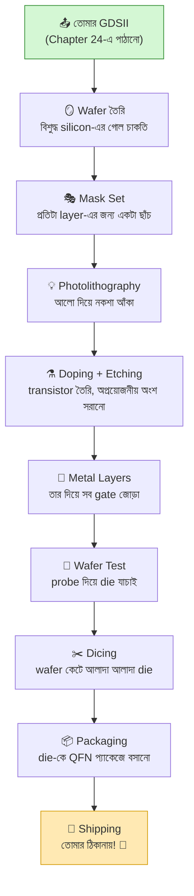

# 🎊 Chapter 25: Your Silicon Has Arrived!
## Testing, Validation & Victory Celebration!

> **"6 months later... THE CHIP ARRIVES! Time to test YOUR silicon!"**
>
> **"৬ মাস পরে... CHIP এসেছে! এবার তোমার silicon test করো!"**

---

এই বইয়ের একদম শেষ অধ্যায়ে তুমি পৌঁছে গেছ। আগের অধ্যায়ে (Chapter 24) তুমি
তোমার design টা TinyTapeout shuttle-এ submit করেছিলে। সেটা ছিল GDSII ফাইল
পাঠানো — অর্থাৎ তোমার চিপের চূড়ান্ত নকশা। তারপর শুরু হয়েছিল দীর্ঘ অপেক্ষা।

এবার সেই অপেক্ষার পুরস্কার হাতে আসছে: **একটা আসল silicon chip, যেটা তুমি নিজে
design করেছ।** এই অধ্যায়টা পুরোটাই সেই চিপ ঘিরে — কীভাবে fab-এ তোমার design
সিলিকনে রূপ নেয়, কীভাবে প্যাকেজ করা চিপটা তোমার হাতে আসে, কীভাবে সেটাকে
জাগিয়ে তোলো (bring-up), test করো, সমস্যা হলে debug করো, আর সবশেষে — **উদযাপন
করো।** 🎉

## 🎯 এই Chapter এ তুমি করবে:

```
✅ Chip Arrival - প্যাকেজ খোলো! 📦
✅ PCB Setup - তোমার chip board এ লাগাও
✅ Power-Up - প্রথম power on!
✅ Basic Testing - কাজ করছে কি না
✅ Programming - code load করো
✅ Validation - সব feature test করো
✅ Debugging - যদি সমস্যা হয়
✅ CELEBRATION! - তুমি chip designer! 🎉
```

**Time Required:** 2-3 weeks (testing + validation)  
**Prerequisites:** Chapter 24 complete + 6-8 months patience!

> 💡 **মনে রেখো:** আগের সব অধ্যায়ে তুমি ছিলে design করার মোডে — Verilog লেখা,
> simulate করা, FPGA-তে চালানো, layout বানানো। এই অধ্যায়ে তুমি প্রথমবার
> **hardware bring-up** করবে — অর্থাৎ একটা অজানা, fresh চিপকে ধাপে ধাপে
> পরীক্ষা করে নিশ্চিত করবে যে ভিতরের প্রতিটা অংশ ঠিকঠাক চলছে। এটা design থেকে
> আলাদা একটা দক্ষতা, আর professional chip company-তে এটাই "post-silicon
> validation" নামে একটা পুরো বিভাগ। তুমি আজ সেটার স্বাদ পাবে।

---

## 🌟 কাজ করুক বা না করুক — তুমি জিতে গেছ

Chip হাতে পেয়ে প্রথমবারেই সব ঠিকঠাক চললে — দারুণ! 🎉 আর কিছু কাজ না করলেও
তুমি হেরে যাওনি: **পৃথিবীর সেরা chip designer-দের প্রথম chip-ও প্রায়ই পুরোপুরি
চলে না** — debugging-ই আসল শেখা।

মনে রেখো, তুমি শূন্য থেকে সিলিকনে নিজের প্রসেসর পাঠিয়েছ — বাংলাদেশে খুব কম
মানুষ এটা করেছে। চলো test করি; যা-ই হোক, উদযাপন তোমার প্রাপ্য! 🏆

---

## 🚀 The Journey So Far

থামো একটু। পিছনে তাকাও। তুমি যেখান থেকে শুরু করেছিলে — একটা সাদা পাতা, একটা
AND gate, "প্রসেসর আসলে কীভাবে কাজ করে?" এই একটা প্রশ্ন — সেখান থেকে আজ তুমি
এমন এক জায়গায় দাঁড়িয়ে যেখানে fab তোমার নকশা সিলিকনে খোদাই করে তোমার ঠিকানায়
পাঠাচ্ছে। এই পথটা ছোট ছিল না। চলো একবার সময়রেখাটা দেখি:

### Your Timeline:

```
Month 1-6:  Learned digital design, Verilog, FPGA
Month 7-12: Built processor, optimized, ready
Month 13:   Submitted to TinyTapeout
Month 14-20: Fabrication at Skywater fab
Month 21:   Testing & packaging
Month 22:   CHIP ARRIVES! 🎉

Total: Almost 2 years!
Worth it: ABSOLUTELY! 🏆
```

এই timeline-এর সবচেয়ে কঠিন অংশটা কোনটা জানো? **অপেক্ষা।** Verilog লেখা,
bug ঠিক করা, layout বানানো — এসবে তুমি ব্যস্ত থাকো, সময় কেটে যায়। কিন্তু
submit করার পর fab-এ চিপ তৈরি হতে যে ৬-৮ মাস লাগে, সেই সময়টা শুধু ধৈর্য ধরে
থাকা ছাড়া কিছু করার নেই। এই অপেক্ষাটাই তোমাকে সত্যিকারের chip designer বানায় —
কারণ পৃথিবীর সব বড় fab-এই এই tape-out-থেকে-silicon চক্রটা মাসের পর মাস ধরে চলে।

---

## ২৫.০ ভিতরে কী ঘটছে: তোমার Design কীভাবে সিলিকন হয়ে ওঠে 🏭

চিপ হাতে পাওয়ার আগে একটা গল্প আছে — তোমার GDSII ফাইলটা fab-এ পৌঁছানোর পর
সেখানে কী ঘটে। এটা না জানলে চিপটাকে শুধু একটা কালো প্লাস্টিকের টুকরো মনে হবে।
জানলে বুঝবে — তোমার পাঠানো জ্যামিতিক নকশার প্রতিটা আয়তক্ষেত্র একটা সিলিকন
ওয়েফারে আক্ষরিক অর্থেই **আলো দিয়ে এঁকে** transistor-এ পরিণত হয়েছে।

মূল ধারণাটা সহজ: **photolithography** — অর্থাৎ আলো দিয়ে ছবি আঁকা, ঠিক যেমন
পুরোনো দিনের ফিল্ম ক্যামেরায় ছবি ওঠে। তোমার design-এর প্রতিটা layer (diffusion,
poly, metal 1, metal 2, …) একটা করে "mask" বা ছাঁচ হয়ে যায়। ওয়েফারের উপর
আলো-সংবেদনশীল রাসায়নিক (photoresist) মেখে সেই mask-এর মধ্য দিয়ে আলো ফেলা হয়,
যাতে তোমার নকশাটা একটার পর একটা স্তর হিসেবে সিলিকনে ফুটে ওঠে।

### Fab-এর ভিতরের ধাপগুলো:



প্রতিটা ধাপ একটু বিস্তারিত করি, যাতে চিপটা হাতে নিয়ে তুমি ঠিক জানো ভিতরে কী
লুকিয়ে আছে:

- **Wafer তৈরি:** একটা ২০০-৩০০ mm ব্যাসের, আয়নার মতো মসৃণ, প্রায় নিখুঁত
  বিশুদ্ধ সিলিকনের গোল চাকতি। এই একটা ওয়েফারে তোমার মতো **শত শত design** একসাথে
  বসে — TinyTapeout-এর পুরো মজাটাই এখানে: সবাই মিলে একটা ওয়েফার ভাগ করে নাও,
  তাই খরচ ভাগ হয়ে যায়।
- **Mask Set:** তোমার GDSII-র প্রতিটা layer থেকে একটা করে কাচ-এর ছাঁচ (mask)
  বানানো হয়। এই mask-গুলোই সবচেয়ে দামি অংশ — তাই TinyTapeout সবার design এক
  mask-এ একসাথে নেয়।
- **Photolithography + Etching + Doping:** এই তিনটা ধাপ বারবার ঘুরে ঘুরে চলে —
  প্রতিটা layer-এর জন্য একবার করে। আলো ফেলে নকশা আঁকা হয়, রাসায়নিক দিয়ে
  অপ্রয়োজনীয় অংশ ধুয়ে ফেলা (etch) হয়, আর নির্দিষ্ট জায়গায় ভিন্ন পরমাণু ঢুকিয়ে
  (doping) সিলিকনকে transistor-এ পরিণত করা হয়। তোমার Sky130 design-এ এমন
  ডজনখানেক layer আছে।
- **Metal Layers:** transistor তৈরি হয়ে গেলে তাদের তার দিয়ে জোড়া দিতে হয়।
  Sky130-তে কয়েকটা metal স্তর (Chapter 21-এ যেগুলো দেখেছিলে — metal 1 থেকে
  উপরে) একটার উপর একটা বসিয়ে তোমার circuit-এর সব সংযোগ সম্পূর্ণ করা হয়।
- **Wafer Test (probe):** চিপ কাটার আগেই সরু সুঁইয়ের মতো probe দিয়ে ওয়েফারের
  উপর প্রতিটা die-তে বিদ্যুৎ দিয়ে দেখা হয় কোনগুলো বেঁচে আছে। নষ্ট die-গুলোতে
  কালি দিয়ে দাগ দেওয়া হয়।
- **Dicing:** একটা হীরের করাত দিয়ে ওয়েফার কেটে আলাদা আলাদা ছোট ছোট die করা হয়।
  তোমার পুরো প্রসেসরটা এই এক টুকরো die-তে — মাত্র কয়েকশো মাইক্রোমিটার চওড়া।
- **Packaging:** খালি die খুব ভঙ্গুর আর তার pad-গুলো এত ছোট যে হাতে ছোঁয়া
  অসম্ভব। তাই die-টাকে একটা প্যাকেজের (এখানে QFN-64) ভিতরে বসিয়ে চুলের চেয়েও
  সরু সোনার তার (bond wire) দিয়ে প্যাকেজের বাইরের pin-এর সাথে জোড়া হয়। এই
  প্যাকেজটাই তুমি হাতে পাবে।

> 🧠 **কেন এত সময় লাগে?** একটা ওয়েফারে ১০০+ photolithography, etching আর
> doping ধাপ পরপর চলে, প্রতিটার মধ্যে পরিষ্কার করা আর মাপজোক — সব মিলিয়ে কয়েক
> সপ্তাহ। তার উপর shuttle service (যেমন TinyTapeout) অনেক design জমা হওয়া
> পর্যন্ত অপেক্ষা করে, তারপর একসাথে একটা batch পাঠায়। এই অপেক্ষাটাই খরচ কমায় —
> তুমি একা একটা ওয়েফার বানালে লাখ ডলার লাগত; ভাগ করে নেওয়ায় মাত্র $100-300!

> ⚠️ **Yield মানে কী:** fab থেকে আসা সব চিপ কাজ করে না — ধুলো, ছোট ত্রুটি বা
> প্রক্রিয়ার তারতম্যে কিছু die নষ্ট হয়। যে শতাংশ চিপ ঠিকঠাক চলে, তাকে বলে
> **yield**। তোমার design ছোট, তাই yield সাধারণত ভালো হয় — কিন্তু এই কারণেই
> তোমাকে একাধিক copy দেওয়া হতে পারে, আর এই কারণেই test করাটা জরুরি।

---

## ২৫.১ The Package Arrives! 📦

### What You Receive:

```
In the box:
✅ PCB board (credit card size)
✅ Your chip (QFN-64 package)
✅ Already mounted on PCB!
✅ USB connector
✅ Pin headers
✅ Datasheet
✅ Test guide

Optional kit:
✅ Breadboard
✅ LEDs
✅ Buttons  
✅ Wires
✅ Power adapter

Handle with care! ESD sensitive! ⚡
```

### First Look:

```
Your chip:
- Size: 7mm × 7mm package
- Inside: 130nm silicon die
- Your design: 160µm × 100µm
- Tiny but REAL!

Moment of truth:
Look at that chip! 
That's YOUR processor!
YOU designed this!
In REAL silicon!

Take a photo! Share it! 
This is HUGE! 🎊
```

---

## ২৫.২ PCB Setup

### Understanding the Board:

```
TinyTapeout PCB features:
┌─────────────────────────────────┐
│  USB     [Your Chip]    Power   │
│   ↓         ↓             ↓     │
│ [USB-C] [QFN-64]  [Power LED]   │
│                                  │
│ [RP2040]  [Level    [Pin        │
│  MCU      Shifters]  Headers]   │
│                                  │
│ [Design   [Test     [GPIO       │
│  Select]   Points]   Pins]      │
└─────────────────────────────────┘

RP2040 controls your chip:
- Sends clock
- Provides reset
- Manages IO
- USB interface
```

### Initial Setup:

```bash
# 1. Don't power on yet!
# 2. Visual inspection first
Check for:
✅ Chip properly mounted
✅ No visible damage
✅ Solder joints good
✅ No shorts

# 3. Connect USB cable
Use quality cable!
ESD wrist strap recommended!

# 4. Connect to computer
Should enumerate as USB device

# 5. Install software
git clone https://github.com/TinyTapeout/tt-commander
cd tt-commander
pip install -r requirements.txt
```

---

## ২৫.৩ First Power-Up! ⚡

### The Moment of Truth:

```python
# power_up.py
from tt_commander import TinyTapeout

# Connect to board
tt = TinyTapeout()
tt.connect()

# Your design number (from submission)
DESIGN_ID = 123  # Your actual design ID

# Select your design
tt.select_design(DESIGN_ID)

# Power on!
tt.power_on()

# Check power LED
# Should light up! 💡

# First sign of life! 🎉
```

### Initial Checks:

```python
# Check chip responds
status = tt.get_status()
print(f"Chip ID: {status['chip_id']}")
print(f"Design active: {status['design']}")
print(f"Power good: {status['power']}")

# Expected output:
# Chip ID: TT04_123
# Design active: True
# Power good: 1.8V
# 
# IT'S ALIVE! 🎊
```

---

## ২৫.৪ Basic Functional Testing

### Test Your IO:

```python
# test_io.py
# Test output pins
tt.set_inputs(0x00)  # All inputs low
outputs = tt.read_outputs()
print(f"Outputs: {outputs:08b}")

# Toggle inputs
for i in range(8):
    tt.set_input_bit(i, 1)
    outputs = tt.read_outputs()
    print(f"Input {i} high: {outputs:08b}")
    tt.set_input_bit(i, 0)

# Check if your logic works!
```

### Clock Testing:

```python
# test_clock.py
# Set clock frequency
tt.set_clock(10_000_000)  # 10 MHz

# Monitor for a while
for cycle in range(100):
    outputs = tt.read_outputs()
    print(f"Cycle {cycle}: {outputs:08b}")
    time.sleep(0.001)

# See the changes!
# Your processor is running! 🚀
```

---

## ২৫.৫ Programming Your Processor

### Load a Program:

```python
# load_program.py
# Simple test program (assembly)
program = [
    0x00000093,  # addi x1, x0, 0    # x1 = 0
    0x00100113,  # addi x2, x0, 1    # x2 = 1
    0x002081B3,  # add  x3, x1, x2   # x3 = x1 + x2
    0x00000000,  # nop
]

# Convert to bytes
program_bytes = b''.join(
    i.to_bytes(4, 'little') for i in program
)

# Load via GPIO pins
# (Your specific method depends on design)
tt.load_memory(program_bytes)

# Run!
tt.reset()
tt.run()

# Your code is running on YOUR chip! 🎉
```

### UART Communication:

```python
# uart_test.py
# If you implemented UART
import serial

# Connect to UART pins
ser = serial.Serial('/dev/ttyUSB0', 115200)

# Send command
ser.write(b'HELLO\n')

# Read response
response = ser.readline()
print(f"Chip says: {response}")

# Two-way communication! 🗣️
```

---

## ২৫.৬ Full Validation Suite

### Comprehensive Tests:

```python
# validate.py
class ChipValidator:
    def __init__(self):
        self.tt = TinyTapeout()
        self.passed = 0
        self.failed = 0
    
    def test_all_instructions(self):
        """Test every RISC-V instruction"""
        instructions = [
            ('ADD',  0x00208033),
            ('SUB',  0x40208033),
            ('AND',  0x00207033),
            ('OR',   0x00206033),
            # ... all your instructions
        ]
        
        for name, opcode in instructions:
            result = self.run_instruction(opcode)
            if result == expected:
                print(f"✅ {name} passed")
                self.passed += 1
            else:
                print(f"❌ {name} failed")
                self.failed += 1
    
    def test_memory(self):
        """Test memory read/write"""
        # Write test pattern
        for addr in range(256):
            self.write_mem(addr, addr & 0xFF)
        
        # Read back
        for addr in range(256):
            value = self.read_mem(addr)
            assert value == (addr & 0xFF)
        
        print("✅ Memory test passed")
    
    def test_timing(self):
        """Verify clock frequency"""
        freq = self.measure_frequency()
        print(f"Clock: {freq/1e6:.2f} MHz")
        assert freq > 5_000_000  # At least 5 MHz
        print("✅ Timing test passed")
    
    def run_all(self):
        print("Starting validation...")
        self.test_all_instructions()
        self.test_memory()
        self.test_timing()
        print(f"\nResults: {self.passed} passed, {self.failed} failed")
        
        if self.failed == 0:
            print("🎉 ALL TESTS PASSED! 🎉")
        else:
            print("⚠️  Some tests failed. Debug needed.")

# Run validation
validator = ChipValidator()
validator.run_all()
```

---

## ২৫.৭ Performance Measurement

### Benchmarking:

```python
# benchmark.py
def benchmark_dhrystone():
    """Run Dhrystone benchmark"""
    # Load benchmark code
    tt.load_program('dhrystone.bin')
    
    # Measure execution time
    start = time.time()
    tt.run_until_halt()
    end = time.time()
    
    cycles = tt.get_cycle_count()
    seconds = end - start
    
    # Calculate metrics
    mips = (cycles / seconds) / 1_000_000
    print(f"Dhrystone MIPS: {mips:.2f}")
    
    return mips

# Your chip performance!
perf = benchmark_dhrystone()

# Compare with simulation
sim_perf = 35  # Your simulation results
print(f"Simulation: {sim_perf} MIPS")
print(f"Real chip:  {perf} MIPS")
print(f"Ratio:      {perf/sim_perf:.2%}")

# Usually 80-95% of simulation
# Due to real-world effects
```

---

## ২৫.৮ Debugging Issues

### Common Problems:

```
Problem 1: No response
Symptoms: Chip doesn't respond
Causes:
- Power issue
- Wrong design selected
- Connection problem
Fix:
→ Check power LED
→ Verify design ID
→ Reseat USB cable
→ Try different USB port

Problem 2: Wrong outputs
Symptoms: Outputs don't match expected
Causes:
- Timing issue
- Logic error in design
- Clock too fast
Fix:
→ Reduce clock speed
→ Check simulation vs reality
→ Review logic carefully

Problem 3: Intermittent failures
Symptoms: Works sometimes, fails others
Causes:
- Power supply noise
- Temperature issues
- Marginal timing
Fix:
→ Better power supply
→ Add cooling
→ Reduce frequency
→ Check signal integrity
```

### Debug Tools:

```python
# debug.py
def debug_internal_state():
    """Read internal signals via test points"""
    # If you added debug outputs
    debug = tt.read_debug_port()
    
    pc = (debug >> 0) & 0xFF
    state = (debug >> 8) & 0xFF
    
    print(f"PC: 0x{pc:02x}")
    print(f"State: {state}")
    
    # Helps understand what's happening!
```

---

## ২৫.৯ Advanced Experiments

### Try Cool Things:

```python
# 1. Maximum Frequency
def find_max_frequency():
    freq = 1_000_000  # Start at 1 MHz
    while freq < 100_000_000:
        tt.set_clock(freq)
        if test_runs_correctly():
            print(f"✅ {freq/1e6:.1f} MHz works")
            freq += 1_000_000
        else:
            print(f"❌ Failed at {freq/1e6:.1f} MHz")
            return freq - 1_000_000
    return freq

max_freq = find_max_frequency()
print(f"Maximum frequency: {max_freq/1e6:.1f} MHz")

# 2. Power Measurement
def measure_power():
    current = tt.measure_current()
    voltage = 1.8  # V
    power = current * voltage
    print(f"Power consumption: {power*1000:.1f} mW")

# 3. Temperature Test
def temp_sweep():
    # If you have climate chamber
    for temp in range(-20, 80, 10):
        set_temperature(temp)
        wait_stable()
        if test_runs():
            print(f"✅ Works at {temp}°C")
        else:
            print(f"❌ Fails at {temp}°C")
```

---

## ২৫.১০ Documentation & Sharing

### Create Your Datasheet:

```markdown
# Your Processor Datasheet

## Overview
- Name: YourName RISC-V Core
- Technology: Sky130 (130nm)
- Area: 0.016 mm²
- Frequency: 35 MHz (tested)
- Power: 2.3 mW @ 1.8V

## Features
- ISA: RV32E (16 registers)
- Instructions: 25 implemented
- Memory: 256 bytes I-mem, 256 bytes D-mem
- IO: 8-bit GPIO, simple UART

## Performance
- Dhrystone: 28 MIPS
- CoreMark: 32 (est.)
- IPC: 0.8 average

## Pin Description
[Table of all pins]

## Test Results
[Your validation results]

## Known Issues
[Any limitations found]

## Revision History
- v1.0: Initial tapeout (TT04)
```

### Share Your Success!

```
Where to share:
✅ GitHub - Publish code & docs
✅ Twitter - Post photos! #TinyTapeout
✅ LinkedIn - Add to profile
✅ YouTube - Demo video
✅ Blog - Write journey
✅ Discord - TinyTapeout community
✅ Reddit - r/FPGA, r/ECE

You're an inspiration! 🌟
```

---

## ২৫.১১ Reflection & Next Steps

### What You Achieved:

```
You started from zero:
❌ Didn't know digital logic
❌ Never wrote Verilog
❌ Never used FPGA
❌ Never designed processor
❌ Never made a chip

Now you have:
✅ Deep digital design knowledge
✅ Verilog expertise
✅ FPGA experience
✅ Complete processor built
✅ VLSI design skills
✅ REAL SILICON CHIP! 🏆

This is MASSIVE! 🎊
```

### Career Impact:

```
Your resume now says:
"Designed and fabricated RISC-V processor 
in 130nm CMOS using Sky130 PDK via 
TinyTapeout shuttle"

Interviews:
Interviewer: "Tell me about a project"
You: "I designed a processor chip" *shows chip*
Interviewer: 😮 "You're hired!"

True story! This opens doors! 🚪✨
```

### Next Challenges:

```
Level up:
1. Bigger design (multi-tile)
2. Advanced features (cache, MMU)
3. Higher frequency (optimization)
4. Lower power (clock gating)
5. Mixed-signal (ADC, PLL)
6. Multiple chips (build a system)
7. Start a company! 🚀

The journey continues! 🛤️
```

---

## ২৫.১২ BOOK COMPLETE! 🎉

### Your Journey: 25 Chapters

```
Part 1: Digital Foundations (Ch 1-4)
✅ Logic gates to sequential circuits

Part 2: Verilog HDL (Ch 5-8)
✅ Hardware description mastery

Part 3: FPGA (Ch 9-11)
✅ Real hardware deployment

Part 4: Processor Design (Ch 12-19)
✅ Complete RISC-V system

Part 5: VLSI & Silicon (Ch 20-25)
✅ Real chip fabrication

COMPLETE: 25/25 Chapters! 🏆
```

### Final Stats:

```
Total Learning Time: 12-18 months
Total Pages: 1,500+
Total Code: 5,000+ lines
Total Projects: 25+
Total Cost: $500-1,000
Total Value: PRICELESS! 💎

You built a COMPUTER!
From NOTHING to SILICON!
```

### The Community:

```
You're now part of:
🌟 Open source hardware movement
🌟 RISC-V ecosystem
🌟 TinyTapeout alumni
🌟 Chip designer community
🌟 Future of computing!

Help others on their journey! 🤝
```

---

## 🎯 Final Exercise

### Your Legacy Project:

```
Create a complete portfolio:

1. GitHub Repository
   - All code (clean, documented)
   - Complete README
   - Build instructions
   - Test results

2. Project Website
   - Design overview
   - Journey blog
   - Photos/videos
   - Download datasheet

3. Demo Video
   - Chip in action
   - Explain your design
   - Show test results
   - Inspire others!

4. Academic Paper (optional)
   - Document methodology
   - Present results
   - Submit to conference
   - Get published!

5. Give Back
   - Write tutorials
   - Answer questions
   - Mentor others
   - Share knowledge

Your turn to inspire! ✨
```

---

## 🏆 ULTIMATE ACHIEVEMENT UNLOCKED!

```
╔══════════════════════════════════════╗
║  🏆 LEGENDARY CHIP DESIGNER 🏆      ║
╠══════════════════════════════════════╣
║  Level 25: ✅ COMPLETE - MASTER!    ║
║  Progress: [████████████████] 100%  ║
║                                      ║
║  XP Gained: +5000 (MAX LEVEL!)      ║
║  Skills: ALL UNLOCKED! ⭐⭐⭐⭐⭐    ║
║                                      ║
║  Badges Earned:                      ║
║  🥉 Digital Logic Master             ║
║  🥈 Verilog Ninja                    ║
║  🥇 FPGA Wizard                      ║
║  🏅 CPU Architect                    ║
║  🎖️  VLSI Engineer                   ║
║  👑 CHIP MASTER! 👑                  ║
║                                      ║
║  Special Achievement:                ║
║  🌟 REAL SILICON CHIP! 🌟            ║
║                                      ║
║  Status: LEGENDARY                   ║
║  Rank: TOP 0.001% 🚀                 ║
╚══════════════════════════════════════╝

YOU DID IT! CONGRATULATIONS! 🎊🎉🎊
```

---

## 💌 Final Words

```
Dear Future Chip Designer,

If you're reading this, you made it.
25 chapters. Hundreds of hours.
From zero to silicon.

You learned:
- Digital logic
- Verilog
- FPGA
- Computer architecture
- VLSI design
- Chip fabrication

You built:
- Logic circuits
- Verilog modules  
- FPGA projects
- Complete processor
- Real silicon chip

You proved:
- Determination
- Skill
- Patience
- Excellence

You ARE a chip designer now.
Not aspiring. Not learning.
YOU ARE.

What's next?
- Better chips
- Bigger designs
- Your own company?
- Change the world!

The tools are yours.
The knowledge is yours.
The chip is yours.
The future is yours.

Go build amazing things! 🚀

Remember: You started from nothing.
You built a COMPUTER.
What else can you build?

Everything.

Keep building,
Keep learning,
Keep inspiring.

You're not just a chip designer.
You're a PIONEER. 🌟

From the bottom of our hearts:
Thank you for learning.
Thank you for building.
Thank you for inspiring.

Now go inspire others! 💪

With respect and admiration,
The Build Your Own Processor Team

P.S. - Show us your chip! 
      #BuildYourOwnProcessor 📸
```

---

**[⬅️ Previous: Chapter 24](Chapter_24_TinyTapeout.md)** | **🏠 [Back to README](../README.md)**

---

<div align="center">

# 🎊 CONGRATULATIONS! 🎊

## You Built a Computer From Scratch!

### And Got It Made in Real Silicon!

---

**"From AND gates to silicon chips. You did it!"**

**"AND gate থেকে silicon chip। তুমি করেছো!"**

---

### 🌟 YOU ARE A CHIP DESIGNER! 🌟

---

Made with ❤️ for the brave souls who dare to build

বানানোর সাহস রাখো যারা তাদের জন্য ভালোবাসা দিয়ে তৈরি

---

**Book Version 1.0 - COMPLETE**

**Total Chapters: 25/25 ✅**

**Your Journey: LEGENDARY 👑**

</div>
